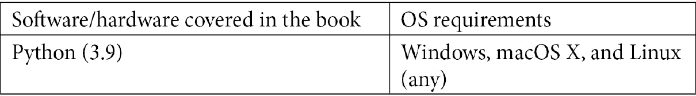

# 前言

《Python 应用计算思维》提供了一种实践方法，介绍了实施和相关方法，让您可以立即投入并提高工作效率。使用 Python 的开发人员将能够使用这本实用指南中的计算思维方法解决问题。

本书将帮助您在解决各种领域的现实问题时，培养逻辑处理和算法思维。这是一项必不可少的技能，您应该在这个信息技术的现代时代保持领先地位。开发人员可以将他们对计算思维的知识应用于实践，解决多个领域的问题，包括经济学、数学和人工智能。

本书首先帮助您了解分解、模式识别、模式概括和抽象以及算法设计，并教您如何在设计解决复杂问题的过程中实际应用这些要素。

我们将了解如何使用分解通过可视化表示解决问题。我们还将使用模式概括和抽象来设计解决方案，并建立评估算法解决方案所需的分析技能。我们还将使用 Python 进行统计分析时使用计算思维。

我们将了解设计算法解决方案的输入和输出要求，并使用计算思维来解决数据处理问题。我们将识别逻辑处理中的错误，以完善您的解决方案设计，并在密码学、经济学和机器学习等各个领域应用计算思维。

然后，您将了解问题分析、逻辑推理、算法设计、分类和聚类、数据分析和建模等涉及的各种技术，并了解如何将计算思维要素与这些方面结合起来设计解决方案。

我们还将培养逻辑推理和解决问题的能力，帮助您解决复杂问题。我们还将使用实际示例探索核心计算机科学概念和重要的计算思维要素，并了解如何确定最适合您问题的算法解决方案。

最后，您将了解如何在解决方案设计过程中识别陷阱，以及如何选择正确的功能来创建最佳的算法解决方案。

在阅读完本书之后，您将获得应用计算思维技术于软件开发的信心。

# 本书适合对象

这本书适用于希望培养解决问题技能和策略的学生、开发人员和专业人士，这些技能涉及编写或调试软件程序和应用程序。需要熟悉 Python 编程。

# 本书涵盖内容

第一章《计算机科学基础》帮助您了解计算机科学的基本要素，包括理论、设计、计算过程和系统以及计算机。本章重点将放在计算机科学的软件要素上。

第二章《计算思维要素》解释了计算思维的每个要素——分解、模式识别、模式概括和抽象以及算法设计——以及计算思维过程并非线性。相反，开发人员可以在算法设计过程的各个阶段回顾这些要素，直到找到特定问题的解决方案。本章将包括一些简短的相关问题，用于演示如何使用计算思维要素来得出算法。

第三章《理解算法和算法思维》为您介绍了算法及其定义。您还将回顾一些算法，以帮助您在评估算法时培养必要的分析技能。

第四章《理解逻辑推理》探讨了条件语句、算法推理和布尔逻辑等逻辑推理过程。在整个章节中，您将通过真实和相关的问题分析学习基本和中级逻辑处理技能。

第五章《探索问题分析》探讨了问题分析的主题，重点放在问题定义、分解和分析上。为了练习和进一步理解计算思维的第一个元素——分解，您将面临真实和相关的问题。然后，您将能够定义和分解问题，例如识别输入和输出，以及开始规划解决问题所需的其他相关信息。

第六章《设计解决方案和解决过程》为您提供了一个机会，利用先前学习的计算思维过程设计多个问题的解决方案，并开始将逻辑处理纳入其中，以创建解决方案的决策过程的可视化表示。可视化表示包括图表、流程图和其他有用的过程。

第七章《识别解决方案中的挑战》提供了练习识别一些常见错误和/或更好可能解决方案的机会。虽然大多数问题可以用多种算法解决，以满足问题的需求，但有些解决方案最适合特定问题。本章的目标是介绍您在解决方案设计过程中识别一些陷阱。

第八章《Python 简介》介绍了基本的 Python 命令和功能，同时将它们应用于问题。利用计算思维的元素，您将能够通过纳入先前学到的概念来设计解决方案。

第九章《理解输入和输出以设计解决方案算法》帮助您评估问题，以确定设计和实施问题的解决方案算法所需的输入和输出。

第十章《控制流》帮助您更多地了解条件语句以及在使用计算思维和 Python 编程语言解决问题时如何使用`for`和`while`循环。您将应用先前学到的逻辑处理来创建 Python 算法来解决问题。

第十一章《在简单挑战中使用计算思维和 Python》帮助您将先前获得的知识应用于多个学科中解决挑战的计算思维过程，使用真实和相关的例子，以设计每种情景的最佳算法。

第十二章《在实验和数据分析问题中使用 Python》解释了如何利用 Python 的功能来解决涉及实验数据和数据处理的问题。计算思维元素将被用来使用高级功能解决真实和相关的问题。

*第十三章*, *使用分类和聚类*，涵盖了分类和聚类。您将使用 Pandas、Scikit-Learn 和其他软件包来创建训练和测试模型，并学习一些用于大数据分析的基本定义，如机器学习和神经网络模型。

*第十四章*, *在统计分析中使用计算思维和 Python*，深入探讨了与统计分析相关的进一步主题，如导入数据、索引和预处理数据。然后，您将使用数据可视化来决定要探索哪些变量以进行进一步分析。

*第十五章*, *应用计算思维问题*，帮助您解决结合了前几章各个主题的多个问题，以解决问题并设计 Python 算法。您将使用计算思维元素来确定设计模型和解决语言学、密码学等问题所需的功能。

*第十六章*, *高级应用计算思维问题*，通过各种领域的其他应用问题，包括几何镶嵌、创建房屋数据模型、创建电场、分析基因数据、分析股票、创建**卷积神经网络**（**CNN**）等。您将使用计算思维元素来解决问题，并为问题和数据集创建不同的图形和可视化表示。

# 要充分利用本书

*您需要在计算机上安装* **Python 3.9** *才能运行代码。所有代码示例都在使用 Python 3.9 的 Windows 操作系统上进行了测试，并应该在后续版本中运行。所有代码还在 Anaconda 虚拟环境中进行了测试。*



本书中使用的其他库和软件包包括以下内容：

+   NumPy

+   **Scikit-Learn**

+   **TensorFlow/Keras**

+   **Matplotlib**

+   **Seaborn**

+   **Cairos**

+   **NLTK**

+   **Pandas**

*如果您想在 Spyder 环境或 Jupyter 笔记本中运行代码，可以安装 Anaconda，这是 Python 和 R 编程语言的环境管理器。*

**如果您使用的是本书的数字版本，我们建议您自己输入代码或通过 GitHub 存储库（链接在下一节中提供）访问代码。这样做将有助于避免与复制和粘贴代码相关的任何潜在错误。**

# 下载示例代码文件

您可以从 GitHub 上下载本书的示例代码文件[`github.com/PacktPublishing/Applied-Computational-Thinking-with-Python`](https://github.com/PacktPublishing/Applied-Computational-Thinking-with-Python)。如果代码有更新，将在现有的 GitHub 存储库上进行更新。

我们还有来自我们丰富书籍和视频目录的其他代码包，可在[`github.com/PacktPublishing/`](https://github.com/PacktPublishing/)上找到。去看看吧！

# 下载彩色图片

我们还提供了一个 PDF 文件，其中包含本书中使用的屏幕截图/图表的彩色图片。您可以在这里下载：[`static.packt-cdn.com/downloads/9781839219436_ColorImages.pdf`](https://static.packt-cdn.com/downloads/9781839219436_ColorImages.pdf)。

# 使用的约定

本书中使用了许多文本约定。

`文本中的代码`：表示文本中的代码词、数据库表名、文件夹名、文件名、文件扩展名、路径名、虚拟 URL、用户输入和 Twitter 句柄。例如："最后，我们要求程序使用`Readability`函数分析文本。请注意，我们将其保存到`r`中。"

代码块设置如下：

```py
def encrypt(message, key):
    encryptedM = ''
    for letts in message:
        if letts in LETTERS:
            num = LETTERS.find(letts)
            num += key
            encryptedM +=  LETTERS[num]
    return encryptedM
```

任何命令行输入或输出都以以下方式编写：

```py
There once was a citizen in the town of Narnia, whose name was Malena. Malena loved to hang with their trusty dog, King Kong.
You could always see them strolling through the market in the morning, wearing their favorite blue attire.
```

**粗体**：表示一个新术语，一个重要的词，或者屏幕上看到的词。例如，菜单或对话框中的单词会以这种方式出现在文本中。这是一个例子：“正如您从前面的截图中所看到的，**死亡**列继续上升，病例数量也在增加，我们稍后会在这个问题中再看一下。”

提示或重要说明

像这样出现。
