# 第一章：计算机科学基础

计算机科学的世界是一个广阔而复杂的世界。它不仅不断变化和发展，而且我们认为是计算机科学的组成部分也在不断适应和调整。计算思维过程使我们能够有目的地和专注地解决任何问题。无论问题是什么，我们都可以将其分解，找到可以帮助我们找到解决方案的模式，概括我们的解决方案，并设计可以帮助我们提供解决方案的算法。

在本书中，我们将仔细研究计算思维过程，解决多个领域的问题，并使用 Python 编程语言及相关库和包来创建算法，帮助我们解决这些问题。然而，在进入问题之前，我们将探讨一些重要的计算机科学概念，这些概念将帮助我们导航本书的其余部分。

在本章中，我们将探讨以下主题：

+   计算机科学简介

+   理论计算机科学

+   系统软件

+   计算

+   数据类型和结构

# 技术要求

您需要最新版本的 Python 来运行本章中的代码。您可以在此处找到本章使用的完整源代码：[`github.com/PacktPublishing/Applied-Computational-Thinking-with-Python/tree/master/Chapter01`](https://github.com/PacktPublishing/Applied-Computational-Thinking-with-Python/tree/master/Chapter01)

# 计算机科学简介

当寻找计算机科学的定义时，您会遇到多种变体，但所有都指出计算机科学涵盖了计算机和计算概念的所有方面，包括硬件和软件。在计算机科学中，硬件设计主要在工程或计算机工程课程中学习。计算机科学的软件方面包括操作系统和应用程序等编程领域。在本书中，我们将集中在计算机科学的软件方面。

在本章中，我们将研究一些基本的定义、理论和系统，这些对我们深入计算思维世界至关重要。一旦我们确定了关键领域并定义了概念，我们就准备好进入应用和现实世界中面临的挑战，同时探索计算思维的要素和可以帮助我们应对这些挑战的 Python 编程能力。

计算机科学中提供的广泛主题范围既令人望而生畏又令人兴奋，它不断发展。其中一些主题包括游戏设计、操作系统、移动或桌面设备的应用程序、机器人编程等。计算机和计算领域的不断突破为我们提供了新的和令人兴奋的机会，其中许多是我们所不知道的。对计算机科学背后的系统有基本的了解可以帮助我们更有效地与技术互动并解决问题。

## 学习计算机和二进制系统

所有计算机都将信息存储为**二进制**数据。二进制系统将所有信息视为开关，可以是开或关，0 或 1。二进制系统是一个基于 2 的系统。您需要对二进制数字和二进制系统有基本的了解，才能在计算机科学中取得进展。

二进制系统将所有数据转换为字符串，只使用两个数字：0 和 1。数据在计算机中使用比特存储。**比特**（代表**二进制数字**）是计算机中可以找到的最小数据单元，即 0 或 1。

在二进制系统中计数时，前两个数字是 0（或 00）和 1（或 01），就像我们在日常生活中使用的十进制数系统一样。如果我们继续以二进制计数，下一个数字将是 10。在学习如何从一个系统转换为另一个系统之前，让我们比较一下十进制系统和二进制系统中的前三个数字：


图 1.1-十进制和二进制比较

十进制系统中的下一个数字将是 3。在二进制系统中，下一个数字将是 11，读作“一一”。十进制和二进制系统中的前 10 个数字如下所示：

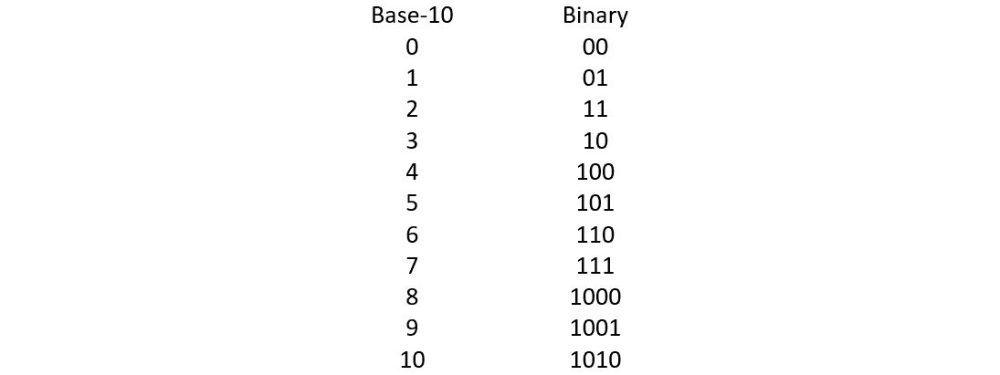

图 1.2-十进制和二进制比较（续）

如前所述，二进制系统是一个基于 2 的系统。这意味着十进制系统的每个数字都与 2 的幂配对，因此我们使用这些幂来在数字之间进行转换。了解如何从二进制转换为十进制，反之亦然，可以帮助我们更好地理解不同系统中数字之间的关系。

### 从二进制转换为十进制

我们将从一个示例开始，将二进制数转换为十进制数。取数字 101101。要转换该数字，每个数字都乘以相应的基数 2 的幂。给定的二进制数字有 6 位，因此我们将使用的 2 的幂是 5、4、3、2、1 和 0。这意味着数字转换如下：

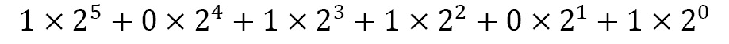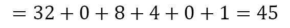

二进制数 101101 相当于十进制系统中的 45。在日常生活中，我们以十进制书写数字，因此我们理解 45 这个数字的书写方式。然而，我们的计算机将这些信息转换为二进制以便能够处理它，因此该数字变成了二进制数 101101，以便计算机能够轻松读取。

### 从十进制转换为二进制

再次，让我们从一个示例开始，以演示从十进制数转换为二进制数的过程。取数字 591。要将十进制数转换为二进制数，我们必须迭代地将数字除以 2。如果结果没有余数，我们插入 0（如果是第一个数字）或在现有数字的左侧插入 0。

如果结果有余数 1，我们插入 1（如果是第一个数字）或在现有数字的左侧插入 1。

当我们将 591 除以 2 时，结果是 295，余数为 1。这意味着我们最右边的数字，也就是我们的第一个数字，是 1。

现在将 295 除以 2。结果是 147，余数为 1。因此，我们在 1 的左侧插入 1。我们的数字现在是 11。

现在将 147 除以 2。结果是 73，余数为 1。我们的结果现在是 111。现在我们将进行进一步的除法：

+   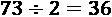余数为 1。我们的数字现在是 1111。

+   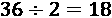没有余数。我们的数字现在是 01111。

+   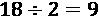没有余数。我们的数字现在是 001111。

+   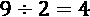余数为 1。我们的数字现在是 1001111。

+   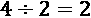没有余数。我们的数字现在是 01001111。

+   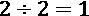没有余数。我们的数字现在是 001001111。

+   余数为 1。我们的数字现在是 1001001111。

十进制中的数字 591 相当于二进制系统中的数字 1001001111。

另一种转换数字的方法是使用表格进行除法：

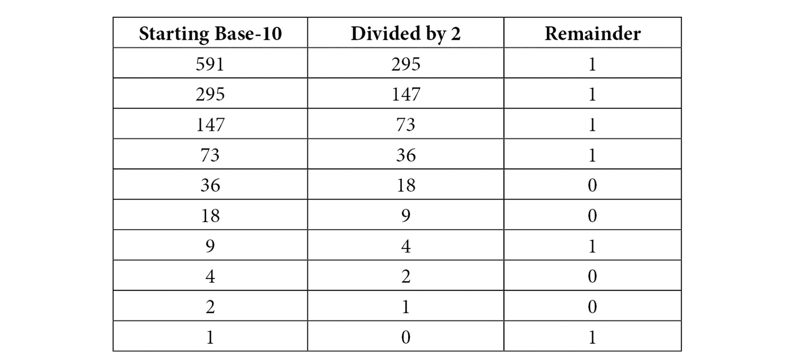

表 1.1-将十进制数 591 转换为二进制

使用表格，取最右边一列的数字，并从底部到顶部开始写下这些数字。结果是 1001001111。

学习如何转换数字只是将数据转换为二进制的一小部分，但它是一个重要的部分。所有信息，包括字母和符号，都必须转换为二进制才能被计算机读取。**ASCII**（代表**美国信息交换标准代码**）是一个被普遍采用的协议，用于转换信息。也就是说，该协议的一些部分已经过时，因此其他协议使用 ASCII 作为基础来扩展其功能。Unicode 是一个广泛使用的基于 ASCII 的 16 位字符集。

正如讨论的，在本节中，我们了解到信息必须被编码或转换才能被计算机读取。存在多个系统和协议，但现在我们将继续讨论计算机科学理论。然而，在解决问题时，回顾二进制、ASCII 和 Unicode 可能会有所帮助。

# 理解理论计算机科学

虽然你不需要成为数学大师才能喜欢计算机科学，但这两个学科是内在联系的。计算机科学，特别是编程，使用的是代数性质的算法。我们将在后面深入探讨算法，但重要的是它们是数学的。逻辑过程源自数学的哲学性质和历史。现在，如果数学主题不是你的菜，不要绝望。成为程序员和开发人员所需的逻辑过程可以在不学习更高数学的情况下使用。了解更高的数学只是为那些具有这方面背景的人简化了一些概念。

**理论计算机科学**包括多个理论和主题。以下列出了一些主题和理论，但请记住，理论计算机科学中还包括其他可能在本书中未讨论的主题。以下列出的每个理论或术语都包括简短的描述和解释供您审阅：

+   算法

+   编码理论

+   计算生物学

+   数据结构

+   密码学

+   信息理论

+   机器学习

+   自动机理论

+   形式语言理论

+   符号计算

+   计算几何

+   计算数论

我们将在接下来的章节中看一下上述的理论。

## 算法

算法是计算机可以读取的一组指令。算法以一种计算机可以逻辑处理提供的输入信息并创建输出的方式提供规则或指令。在大多数书籍中，你是通过创建*Hello World!*程序来介绍算法和编程的。我不会让这本书成为例外。

在 Python 中，代码需要打印消息到屏幕上。因为 Python 语言易学易读，许多代码都力求逻辑。因此，为了将消息打印到屏幕上，我们使用`print()`命令。以下是我们将使用的代码：

```py
print("Hello world!")
```

同样，我们可以使用以下给出的代码：

```py
print('Hello world!')
```

当涉及到字符串时，Python 将*"*和*'*视为相同的东西。

当我们运行算法时，前面代码的结果如下截图所示：

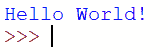

图 1.3 – 'Hello World!' Python 程序

别担心，我们将在*第二章*后面讨论 Python 编程语言，*计算思维要素*，以及在*第二部分*，*应用 Python 和计算思维*中更深入地讨论，从*第八章*开始，*Python 简介*。

尽管讨论算法很长，但对于本书和你学习 Python 的进展至关重要。因此，我们将在本书的*第二章*——*计算思维要素*和*第三章*——*理解算法和算法思维*中深入探讨算法，因为算法是计算思维过程的关键要素。

重要提示:

*第二章*——*计算思维要素*将专注于计算思维过程本身，它有四个要素：**分解**、**模式识别、模式概括和抽象**和**算法设计**。正如你所看到的，最后一个要素是算法设计，因此我们需要更加了解算法是什么以及如何创建它们，这样你就可以在用 Python 解决问题时实施和设计算法。*第三章*——*理解算法和算法思维*将专注于更深入地理解算法定义以及设计过程的介绍。

接下来我们将看编码理论。

## 编码理论

编码理论有时也被称为代数编码理论。在处理代码和编码理论时，有三个研究领域：**数据压缩**、**错误校正**和**密码学**。我们将在接下来的章节中更详细地介绍这些内容。

### 数据压缩

数据压缩的重要性不容忽视。数据压缩使我们能够在占用最少空间的情况下存储最大量的信息。换句话说，数据压缩使用最少的位来存储数据。

重要提示：

请记住，**比特**是计算机中最小的数据单位，即 0 或 1，而一组比特称为**字节**。一个字节通常有 8 个比特。我们使用字节作为计算机内存、存储设备（如存储卡或外部驱动器）等大小的度量单位。

随着技术和存储容量的增长和改善，我们存储额外数据的能力也在增加。从历史上看，当计算机首次进入家庭时，它们通常只有**千字节**或**兆字节**的存储空间，但现在它们拥有**千兆字节**和**太字节**的存储空间。各种存储单位的换算如下所示：

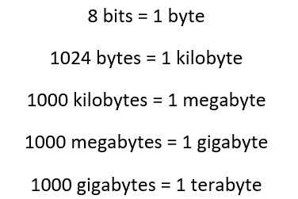

图 1.4 – 字节转换

如果你在网上寻找信息，可能会发现一些来源声称一太字节等于 1,024 千兆字节。这是一个二进制换算。在十进制系统或十进制系统中，一太字节等于 1,000 千兆字节。要更好地理解换算，重要的是要了解适用于十进制系统和二进制系统的前缀：

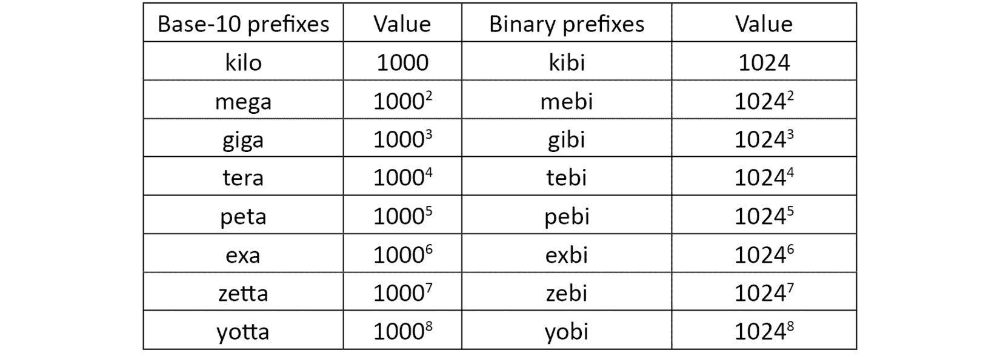

表 1.2 – 带值的十进制和二进制前缀

如前所述，目标始终是尽量使用最少的位来存储尽量多的数据。因此，我们压缩或减少数据的大小，以便使用更少的存储空间。

那么，*数据压缩为什么如此重要呢？*让我们回到 2000 年。那时，一台售价约 1000 美元的笔记本电脑大约有 64MB 的**RAM**（随机存取存储器）和 6GB 的硬盘内存。我们手机上的一张照片在使用其实际大小时需要 2 到 5 兆字节的内存。这意味着我们的计算机无法存储现在拍摄的许多（在某些情况下是任何）现代照片。数据压缩的进步使我们能够存储更多内存，创建更好的游戏和应用程序，以及更多，因为我们可以拥有更好的图形和额外的信息或代码，而无需太担心它们使用的内存量。

### 错误更正

在计算机科学中，错误是生活中的一个事实。我们在我们的过程、算法、设计和各种其他方面都会犯错误。错误更正，也称为错误处理，是计算机自动纠正错误或多个错误的过程，这种错误发生在数字数据被错误传输时。

**错误更正码**（**ECC**）可以帮助我们分析数据传输。ECC 可以定位和纠正传输错误。在计算机中，ECC 内置在一个可以识别常见内部数据损坏问题的存储空间中。例如，ECC 可以帮助读取损坏的代码，比如**QR**（快速响应）代码的缺失部分。一种 ECC 是**汉明码**。汉明码是一种二进制线性码，可以检测最多两位错误。

重要说明：

汉明码是以 1950 年发现它们的理查德·韦斯利·汉明命名的。汉明是一位数学家，他在与电信和计算机工程相关的编码方面进行了研究。

另一种 ECC 是**奇偶校验**位。奇偶校验位检查数据的状态，并确定是否有任何数据丢失或被覆盖。错误更正对所有开发的软件都很重要，因为任何更新、更改或升级都可能导致整个程序或部分程序或软件的损坏。

### 密码学

**密码学**用于计算机科学中隐藏代码。在密码学中，信息或数据被编写成只有消息的预期接收者才能阅读的形式。简单来说，密码学将可读文本或信息转换为不可读的文本或信息。

当我们现在考虑密码学时，我们往往会想到数据的**加密**。编码者通过将数据转换为未经授权用户无法看到的代码来加密数据。然而，密码学已经存在了几个世纪，即它早于计算机。历史上，密码学的第一个用途可以追溯到公元前 1900 年左右的埃及一座墓穴中。在墓穴的各个部分，常见的象形文字与非典型或不寻常的象形文字混合在一起。

非典型的象形文字的原因是未知的，但这些信息被隐藏起来，不让其他人看到。后来，密码学被用于在战争和和平时期的政府和间谍之间进行秘密通信。如今，密码学被用于加密数据，因为我们的信息存在于数字格式中，因此保护敏感信息，如银行、人口统计或个人数据，是很重要的。

我们将通过本书中提出的一些问题进一步探讨编码理论的主题。

## 计算生物学

**计算生物学**是理论计算机科学的一个领域，专注于生物数据和生物信息学的研究。**生物信息学**是一门科学，允许我们收集生物数据并对其进行分析。生物信息学的一个例子是收集和分析基因密码。在生物学研究中，大量数据被探索和记录。

研究可以涉及各种各样的主题和跨学科。例如，遗传研究可能包括来自整个州、整个种族或整个国家的数据。计算生物学的一些领域包括分子、细胞、组织和生物体。计算生物学使我们能够研究这些事物的组成，从最基本的水平到更大的生物体。生物信息学和计算生物学为这些领域的实验研究提供了一个结构，创建了预测和比较，并提供了一种发展和测试理论的方式。

计算思维和编码使我们能够处理和分析这些数据。在本书中，所提出的问题将使我们能够探索如何使用 Python 结合计算思维来解决复杂问题，包括计算生物学中的问题。

## 数据结构

在编码理论中，我们使用数据结构来收集和组织数据。目标是准备数据，以便我们可以高效和有效地执行操作。数据结构可以是原始的或抽象的。软件具有内置的数据结构，这些是原始的数据结构，或者我们可以使用编程语言定义它们。原始数据结构是预定义的。一些原始数据结构包括整数、字符（**char**）和布尔结构。抽象或用户定义的数据结构的示例包括数组和二维数组、栈、树和二叉树、链表、队列等。

用户定义的数据结构具有不同的特征。例如，它们可以是线性的或非线性的，均匀的或非均匀的，静态的或动态的。如果我们需要将数据排列成线性序列，我们可以使用数组，这是一种线性数据结构。如果我们的数据不是线性的，我们可以使用非线性数据结构，例如图形。当我们有相似类型的数据时，我们使用均匀的数据结构。

请记住，例如，数组既是线性的又是均匀的数据结构。非均匀或异质数据结构具有不同的数据。用户可以创建的非均匀数据结构的一个例子是类。静态和动态数据结构的区别在于静态结构的大小是固定的，而动态结构的大小是灵活的。为了更好地理解数据结构，我们将通过本书中的计算思维元素来解决问题，再次简要地回顾数据结构，因为它们与数据类型有关，那时会讨论。

## 信息理论

**信息理论**被定义为一种数学研究，允许对信息进行编码，以便通过计算机电路或电信信道进行传输。信息通过可能包含符号、脉冲甚至无线电信号的序列进行传输。

在信息理论中，计算机科学家研究信息的量化、数据存储和信息通信。信息在信息理论中可以是模拟的或数字的。**模拟数据**指的是由模拟信号表示的信息。反过来，模拟信号是随着给定时间段的连续波动。**数字信号**将数据显示为二进制，即离散波。我们将模拟波表示为正弦波，将数字波表示为方波。以下图显示了正弦曲线作为时间值的函数：

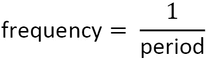

与反比关系相关，我们也可以说：

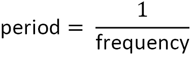

+   正弦曲线的**相移**是曲线从 0 处的偏移量。这在下图中显示：

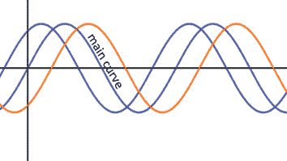

图 1.6 - 相移示例

相比之下，数字信号图看起来像条形图或直方图。它们只有两个数据点，0 或 1，所以它们看起来像是方盒状的山丘和山谷：

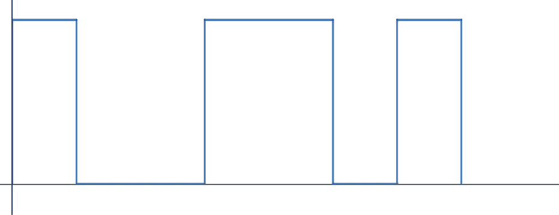

图 1.7 - 数字信号

**数字信号**具有有限的离散数据集。数据集是离散的，因为它包含单独和不同的数据点。对于模拟信号，数据是连续的和无限的。在计算机科学中，这两种类型的信号都很重要和有用。我们将在本书的后续问题中探索数字信号，并特别在*第十六章*中，*高级应用计算思维问题*中探索数字信号的应用。

## 自动机理论

**自动机理论**是理论计算机科学中最迷人的话题之一。它涉及研究机器以及如何以最可靠和高效的方式完成计算。自动机理论涉及简单机器的物理方面以及逻辑处理。那么，*自动机到底用于什么，它是如何工作的呢？*

自动机是使用预定条件来响应外部输入的设备。当你看你的恒温器时，你正在使用一个自动机。你设置你想要的温度，恒温器会对外部来源进行信息收集并相应地调整温度。

自动机的另一个例子是外科手术机器人。这些机器人可以改善患者的手术结果，并不断得到改进。由于自动机理论的目标是制造可靠和高效的机器，它是人工智能和智能机器（如外科手术机器人）发展中的关键部分。

## 形式语言理论

**形式语言理论**在计算机科学中通常与自动机理论联系在一起。形式语言是研究语法、语法、词汇和一切涉及形式语言的学科。在计算机科学中，形式语言指的是计算机编程语言的逻辑处理和语法。关于自动机，机器处理形式语言以执行为其提供的任务或代码。

## 符号计算

**符号计算**是计算数学的一个分支，涉及计算代数。术语*符号计算*和*计算代数*有时可以互换使用。一些编程软件和语言专注于数学公式的符号计算。使用符号计算的程序执行诸如多项式因式分解、简化代数函数或表达式、找到多项式的最大公约数等操作。

在本书中，当解决一些现实世界中出现的问题时，我们将使用计算机代数和符号计算。Python 允许我们不仅执行可能需要的数学计算，还可以探索由这些计算产生的图形表示或模型。当我们探索解决现实世界的问题时，我们将需要使用 Python 编程语言的各种库或扩展。在本书的*第二部分*，*应用 Python 和计算思维*中，我们将更详细地探索 Python 编程语言。

## 计算几何

像符号计算一样，**计算几何**存在于处理计算数学的计算机科学分支中。我们在计算几何中研究的算法是可以用几何表达的。对数据的分析是通过几何图形，几何分析，遵循几何模式的数据结构等进行的。需要计算几何的问题的输入和输出是几何的。

在考虑几何时，我们经常会回到我们最常与数学分支相关联的图形，如多边形、三角形和圆。也就是说，当我们看计算几何时，一些算法是可以用点、线、其他几何图形或遵循几何模式的算法来表达的。三角测量属于计算机科学的这一分支。

数据的三角测量对于光学 3D 测量系统等应用非常重要。我们三角测量 GPS 信号来定位手机，例如，这在执法中使用。

在现代，三角测量有许多用途，其中一些我们将通过本书中提出的真实和相关问题进行探讨。

## 计算数论

**数论**是研究整数及其性质的数学分支。**计算数论**是用于解决数论问题的算法的研究。数论研究的一部分是素性测试。

用于确定输入或输出是否为素数的算法已被用于许多目的。素性测试和数论的一个最重要的用途和应用是用于加密目的。随着我们的生活转移到电子保存，我们最个人的信息，如银行信息、家庭信息，甚至社会安全号码，都存在某种代码或算法中。重要的是加密这样的信息，以便他人无法使用或访问。计算数论和密码学是内在联系的，您稍后将能够探索。

一些理论旨在帮助您了解计算机科学理论是如何交织在一起的，它们的应用以及它们与我们每天所做的工作的相关性。

在这一部分，我们学习了关于理论计算机科学的知识。我们还学习了它的各种理论。

在本书中，我们将使用计算思维（在*第二章*中进一步讨论，*计算思维的要素*）来帮助我们解决问题，从最基本的应用到一些复杂的分析，通过定义和设计使用这些理论的适当算法。理论计算机科学用于研究系统软件，我们将在下一节中探讨。

# 学习系统软件

**系统软件**用于执行多个功能，并在计算机的**操作系统**（**OS**）、外围设备（如键盘和鼠标）和固件之间进行通信。固件是永久保存在设备上并且需要用于其操作的软件，这些是两种主要类型的软件的一部分：**系统软件**和**应用软件**。

系统软件允许计算机在硬件和应用程序之间进行通信。想想智能手机。手机在其最基本的形式中由硬件组成，包括电池、相机、内存、屏幕和所有物理组件和外围设备。操作系统允许应用程序使用这些组件。

手机的相机应用程序。系统软件让应用程序与手机通信，使用相机拍照，编辑，保存和分享照片。计算机的操作系统也允许硬件与程序通信。设计程序将使用鼠标或其他外围设备来绘制，创建，使用触摸屏（如果可用）等。

如果我们不了解系统的软件，就无法创建能够有效与我们的硬件通信的应用程序，从而产生从关键错误到使外围设备无用的错误，或者是一些组件可能工作，比如拍照，但其他可能不工作，比如保存或分享照片的次要错误。系统软件是以一种方式创建的，以便为我们提供在硬件和应用程序之间进行最简单、最有效的通信方式。

## 操作系统

操作系统执行多个任务。如果您回忆一下，错误处理是操作系统的一部分，它检查最常见的可能错误，以便在不造成更大问题或使应用程序变得毫无价值的情况下修复它们。错误处理是操作系统最重要的任务之一。此外，操作系统负责计算机或设备的安全。如果您有智能手机，您会知道许多操作系统的更新是为了解决安全问题或防止安全漏洞。操作系统负责只允许授权用户与设备中存储的内容进行交互。

除了安全和错误处理，操作系统还负责为文件分配内存并对其进行组织。当我们保存和删除文件或程序时，之前使用的内存现在是空闲的。但是，可能会有一些东西在之前和之后立即保存。操作系统通过分配和重新分配内存来维护设备的最佳性能。内存管理不仅指用户保存的文件，还指 RAM。

设备的文件管理也由操作系统运行。操作系统将信息分配为文件系统，将信息分成用户和设备轻松访问的目录。文件系统负责跟踪文件的位置，包括来自操作系统和用户的文件，不断发展的设备访问设置，以及如何访问文件和了解文件状态。近年来，对设备的访问方式发生了变化。

虽然计算机通常使用用户名和密码，但现在许多设备可以通过指纹、数字或字母数字密码、面部识别、图像、路径等进行访问。随着这些主题的发展，操作系统也需要更新或重新创建。操作系统还负责允许应用程序与设备之间的通信。

## 应用软件

应用软件是指执行特定任务的软件应用程序。想想你可以从移动设备访问的应用程序或应用。有数百种类型的应用程序，例如设备上的静态游戏，允许您远程与他人玩游戏的游戏，新闻应用程序，电子书阅读器，健身训练应用程序，闹钟，时钟，音乐等等！应用程序总是执行某种形式的任务，无论是个人使用、商业使用还是教育使用。

应用软件具有多个功能。您可能会发现用于生产力的套件，例如**Microsoft**（**Office**）和**Google**产品。当我们需要在互联网上进行研究时，我们使用称为浏览器的应用程序，它们允许我们访问信息并对信息进行索引，以便我们可以访问它。这些浏览器包括**Google Chrome**、**Safari**、**Firefox**、**Edge**、**Opera**等。浏览器既可用于移动设备，也可用于计算机。请记住，应用程序的目的是为最终用户执行特定任务。

重要提示：

顺便说一句，自从计算机成为家庭工具并且手机开始被用于除了打电话之外的其他用途以来，应用程序已经呈指数级增长。早期的计算机只用于计算数学分析和任务。这就是为什么了解计算机科学的发展和历史如此重要的原因之一。由于我们无法完全预测计算机科学和系统软件的未来用途，我们对它们了解得越多，就越能在技术进步发生时创造和适应。

在本节中，我们了解了系统软件。我们还了解了操作系统软件和应用软件。对于本书的目的，一些应用程序将更为重要，因为我们在解决一些问题时需要排序，例如数据库、生产力软件、企业资源规划和教育软件。

在下一节中，我们将学习计算。

# 理解计算

在计算机科学中，**计算**指的是计算机执行以进行通信、管理和处理信息的活动。计算通常分为四个主要领域：**算法**、**架构**、**编程语言**和**理论**。

由于我们在之前的部分中已经讨论了理论和算法，现在我们将专注于定义架构和编程语言。

## 架构

**计算机架构**指的是与计算机系统交互的指令集。更基本的说，架构包括允许软件和硬件交互的指令。计算机架构有三个主要的子类别：**指令集架构**（**ISA**）、**微架构**和**系统设计**。

### 指令集架构（ISA）

ISA 是硬件和软件之间存在的边界。它以多种方式分类，但两种常见的是**复杂指令集计算机**（**CISC**）和**精简指令集计算机**（**RISC**）。它们的定义如下：

+   **CISC**：这是一种具有许多任务的显式指令的计算机，例如简单的数学运算和从内存加载内容。CISC 包括 RISC 中不包括的所有内容。

+   **RISC**：这是一种具有减少**每条指令周期**（**CPI**）的架构的计算机。

CISC 试图用更少的步骤完成指令，而 RISC 只使用简单的指令。CISC 是多步的，而 RISC 是单步的，一次执行一个任务。CISC 过程包括指令、微码转换、微指令和执行。相比之下，RISC 包括指令和执行。

在 CISC 中，**微码**转换指的是在较低级别解释语言。它考虑硬件资源来创建微指令。**微指令**是微码中的单个指令。微码创建微指令后，可以执行微指令。以下图表显示了 RISC 和 CISC 的过程：

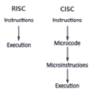

图 1.8 - RISC 和 CISC 之间的差异

RISC 和 CISC 对计算机程序员来说都是必不可少的。单步过程（RISC）与多步过程（CISC）相比有优势和劣势。RISC 减少了每条指令的周期，一次只做一件事。CISC 减少了程序中的指令，但以每条指令的周期为代价。根据我们的需求，我们可以选择最佳路径。

## 编程语言

编程语言是我们为计算机和其他设备编写指令的方式。根据需要、易用性等因素，使用不同的语言。编程语言的例子包括以下内容：

+   Ruby 和 Python：Ruby 是主要用于 Web 应用程序的编程语言。Ruby 稳定且易于使用；然而，许多开发人员选择使用 Python 而不是 Ruby，因为 Python 更快。尽管 Ruby 并不像 Python 那样受欢迎并且存在一些性能问题，但该语言在 2019 年仍然非常活跃并持续增长。另一方面，Python 被广泛用于多种用途，如 Web 应用程序、用户界面应用程序和网站等。我们将在本书的后面更深入地探讨 Python。

+   C：C 语言是计算机科学的一个非常重要的部分，因为 C 是第一种使用的语言，仍然是最广泛使用的语言。C 自 1972 年以来一直存在，当时 Dennis Ritchie 发明了它，但自 1978 年首次发布以来就被其他人使用。尽管其他语言自那时以来变得更受欢迎，但 C 在 2019 年仍在使用。它的一些用途包括操作系统、硬件驱动程序和应用程序等。C 是一种基本级别的语言，这意味着它几乎不需要抽象。

+   C++：C++是由 Bjarne Stroustrup 于 1985 年作为 C 的扩展开发的。该语言的目标是添加面向对象的能力。该语言仍然广泛用于操作系统和其他软件中与 C 语言一起使用。C++是一种中级编程语言。

+   C#：C#（C sharp）是一种高级编程语言。与 C++类似，它具有面向对象的能力，并且是 C 编程语言的扩展。C++和 C#之间的主要区别之一是 C++使用机器代码，而 C#使用字节码。机器代码可以直接由计算机执行。字节码必须被编译，因此被认为是需要解释的低级代码。

+   Swift：Swift 编程语言是由**苹果公司**于 2014 年开发的。就编程语言而言，Swift 是最新的之一。苹果在 2015 年发布了**2.2 版本**作为开源编程语言。该语言被认为是一种通用和编译的编程语言。

+   Scratch：Scratch 于 2002 年由**麻省理工学院媒体实验室**开发为一种视觉编程、块编码语言。作为一种块编程语言，它在学校中被广泛用于教授各个年龄段的学生如何编码。Scratch 现在适用于多种用途，包括一些机器人应用程序，如 Vex Code，结合了机器学习和人工智能等。它与**Makey Makey**等流行的课堂外设兼容，这是一种与计算机交互并可以完全由 Scratch 程序控制的电路。虽然它在教育目的上很受欢迎，但编程语言的强大和其功能本身仍在不断增长。

+   Java 和 JavaScript：JavaScript 是一种仅在浏览器中使用的脚本语言。它用于制作网站和 Web 应用程序。另一方面，Java 是一种通用编程语言。JavaScript 帮助我们使网站动画化或为其添加交互功能。相比之下，Java 被编译为字节码，并且广泛用于开发 Android 设备和应用程序。

+   PHP：PHP 又称为**超文本预处理器**。与 Java 类似，它是一种通用编程语言。它是开源的，因此广泛可用。PHP 用于网站设计和应用程序，并被认为易于学习，但具有许多高级功能。PHP 也可以用于编写桌面应用程序。

+   SQL：SQL，或**结构化查询语言**，是一种用于与数据交互的编程语言。SQL 是特定领域的。它自 1974 年首次出现以来几乎与 C 一样重要。SQL 的主要重要性在于它可以与数据库交互，而其他语言无法做到这一点。

在计算思维中，我们使用许多不同的编程语言，这取决于我们的目标是什么，我们有或需要什么信息，以及我们的应用程序或软件要求是什么。选择一种语言不仅取决于我们对语言的了解，还取决于语言的可能功能。

由于 Python 具有开放源代码的特性、易于使用以及可以用于大量应用程序，我们将在本书中更广泛地使用 Python。然而，Python 并不是唯一的选择。了解其他语言也很重要，特别是对于开发人员来说。

在本节中，我们学习了计算和它的一些领域，即架构和编程语言。我们还学习了 ISA 及其类型，以及对各种编程语言的介绍。在下一节中，我们将看看数据类型和结构。

# 学习数据类型和结构

在计算机科学中，数据类型和结构是两个不同的东西：

+   **数据类型**是一种基本分类。一些数据类型包括整数、浮点数和字符串。

+   **数据结构**使用多种数据类型。它们可以将信息组织到内存中，并确定我们如何访问信息。

让我们在接下来的部分更详细地看一下这些。

## 数据类型

如前所述，数据类型是基本分类。它们是程序中使用的变量，只能存在一个分类。有不同类的数据类型。我们现在将重点关注**原始**和**抽象**数据类型，但随着我们解决问题和设计解决方案，我们将重新讨论这个话题。

原始数据类型包括**字节**、**短整型**、**整型**、**长整型**、**浮点型**、**双精度浮点型**、**布尔型**和**字符型**：

+   一个**字节**可以存储-128 到 127 的数字。虽然这些数字可以存储为整数，或**int**，但字节使用的存储空间更少，所以如果我们知道数字在这些值之间，我们可以使用字节数据类型。

+   **短整型**是-32,768 到 32,767 之间的数字。

+   整数**int**用于存储-2,147,483,648 到 2,147,483,647 之间的数字。

+   **长整型**用于存储-9,223,372,036,854,775,808 到 9,223,372,036,854,775,807 的数字。

+   **浮点数**允许我们保存小数。

+   十进制数也可以保存为**双精度浮点型**，它比浮点数具有更高的精度。

+   **布尔**值是数据类型，要么是`True`，要么是`False`。因此，可以保存变量，以便在打印其值时，结果将保存为真或假。

+   **字符**用于将变量保存为单个字符。

我们将在下一节中研究数据结构。

## 数据结构

正如本章前面的*编码理论*部分所述，数据结构用于以最有效和最有效的方式收集和组织数据。数据结构可以是原始的，例如软件中的内置数据结构，也可以是抽象的。原始数据结构也可以使用编程语言定义，但它们是预定义的。一些原始数据结构包括前一节中列出的数据类型，如**字符**和**布尔**结构。

**抽象数据类型**（**ADTs**）包括数据类型的结构和设计信息。抽象数据结构包括数组和二维数组、栈、树和二叉树、链表、队列等，正如本章前面的*编码理论*部分所述。列表可以包含相同数据值的多个实例。这些列表是可计数的，因此我们可以找到列表中有多少元素，重新排序它们，删除项目，添加项目等。列表广泛用作链表、数组或动态数组：

+   **链表**意味着列表中的每个数据元素都连接或指向下一个数据元素，无论它们存储在内存的何处。

+   **数组**是有序的。元素按顺序读取以便理解。把数组想象成阅读这个句子。你不会把句子读成“*数组一个思考阅读作为这的句子*”。我们按顺序从左到右读句子，而不是混乱的顺序。

+   **动态数组**可以调整大小，这在选择数据类型时很重要。

**栈** ADT 是元素的集合，有两个操作 - 推入和弹出。推入用于向集合中添加元素，而弹出则移除最近的元素。

**队列** ADT 是一种线性数据结构。与栈类似，我们可以添加或移除元素。但是，在队列 ADT 中，删除和插入的点在两个不同的端点进行。

如前所述，数据结构是数据类型的具体实现。例如，我们如何向集合中添加或移除元素就是数据结构。

这可能有点令人困惑，但我们将通过后面章节中的示例来更多地了解它们。目前，理解定义和简单示例就足够了。

# 总结

本章我们学习了一些计算机科学的基础知识。我们学习了如何将二进制转换为十进制。我们还探讨了理论计算机科学中的主题和理论。我们学习了关于计算和数据类型以及数据结构的知识。这些部分将帮助我们理解计算思维过程以及如何解决各种问题，从本书的第二章《计算思维要素》开始。

随着我们深入研究计算思维世界和过程，我们需要重新审视本章的一些内容，因为我们要解决问题，寻找最佳解决方案，并决定如何编写算法。

问题可能有无数种使用算法解决的方法。了解过程如何工作以及哪种数据结构最适合我们的问题对于创建最佳解决方案至关重要。确定算法所需的数据类型以及计算机如何读取数据只会帮助我们编写最有效和高效的算法。

在下一章中，我们将学习计算思维过程以及如何分解问题以设计我们的算法解决方案。
