# *第二章*：计算思维的元素

上一章提供了关于计算机科学基础的一些一般信息。在本章中，我们将更专注于理解计算思维和构成计算思维的元素：分解、模式识别、模式泛化或抽象以及算法设计。

计算思维过程的重要性不可低估。通过这个过程，我们分析问题，设计基于一组条件的最佳解决方案。虽然可以编写许多算法来回答相同的问题，但使用计算思维过程可以帮助我们确定设计清晰算法的最佳路径。

在本章中，我们将涵盖以下主题：

+   理解计算思维

+   分解问题

+   识别模式

+   泛化模式

+   设计算法

+   额外的问题

为了更多地了解计算思维，我们将通过一个提出的问题来看待这些元素。请记住，在*第八章*中，*Python 简介*中，我们将深入研究 Python 编程语言，但在您深入研究本书的本章和其他章节时，您可以随时来回查阅该章节。

# 技术要求

您需要最新版本的 Python 来运行本章中的代码。您可以在此处找到本章中使用的完整源代码：[`github.com/PacktPublishing/Applied-Computational-Thinking-with-Python/tree/master/Chapter02`](https://github.com/PacktPublishing/Applied-Computational-Thinking-with-Python/tree/master/Chapter02)

# 理解计算思维

在其最基本的定义中，计算思维是一个解决问题的过程。就像设计思维、科学方法和其他类似的方法一样，我们经历一系列步骤来找到解决方案。例如，科学方法有七个步骤。请记住，关于科学方法存在多种解释，有些在步骤数量上有所不同。在本讨论中，我们将使用以下七个步骤：

1.  **问题**

1.  **假设**

1.  **材料**

1.  **实验**

1.  **结果**

1.  **结论**

1.  **发现的沟通**

科学方法的确立是一个备受争议的话题，但大多数研究人员都同意它可以追溯到 10 世纪。

科学方法使我们能够观察自然界，提出假设来测试观察，并通过一个既定的过程开发测试和结果。这种方法本身在柏拉图和亚里士多德等哲学家的基础上有一定的依据，他们提倡经验研究。然而，他们的方法论不如今天我们所说的科学方法发展得那么成熟。

计算思维的元素类似于科学方法。计算思维使用较少的步骤来解决与编程相关的问题，而科学方法用于实验。通过计算思维，我们泛化算法，而在科学方法中，我们能够重现结果并从样本泛化到总体得出结论。

在现代，我们根据我们追求的研究领域和我们开发的技术，发展了其他方法论。其中两个例子是设计思维过程和计算思维。

设计思维有五个步骤或阶段：

1.  共情

1.  定义

1.  构思

1.  原型

1.  测试

我们使用上述阶段来理解客户、班级、问题、情况或其他需要解决的情况的需求。与用户的需求产生共鸣有助于我们确定和定义问题。构思和原型阶段是我们创建可能解决方案的地方。测试可能的解决方案是找到最佳解决方案的下一个必要步骤。在所有阶段之后，如果需要，我们可以重新进行循环，因为设计思维过程的目标不是完美，所以总是可以进行额外的工作。设计思维的目标是为明确定义的问题提供一个有效和可行的解决方案。这不是唯一可行的解决方案，也不是完美的解决方案。

在计算思维中，我们使用了一个具有四个元素的类似过程：

1.  **分解**

1.  **模式识别**

1.  **抽象**

1.  **算法设计**

与设计思维过程一样，计算思维中的问题并不清晰。这些问题有时被称为*不明确的*。我们被呈现了一系列情况，我们在开始构思或根据我们可以看到的模式创建可能的解决方案之前，我们定义或分解该问题。当我们考虑计算思维过程时，我们真正做的是尝试弄清楚如何让计算机按照一系列步骤解决我们所面临的问题。

让我们来看一个简单的计算思维问题。

## 问题 1 - 条件

让我们想象一下，广播电台的抽奖活动让参赛者选择两种可能的获奖方式：250 美元现金或以 25 美分的高度。

计算思维问题可能像*问题 1*那样模糊，甚至没有提出问题。你被给定了一系列条件，你的工作是确定问题是什么，并为你自己定义的问题找到解决方案。如果你仔细想想，这个问题没有完美的答案，但你可以创造条件来确定哪个选项确实是最好的，这取决于参赛者的身高。

为了**分解**这个问题，我们需要看看陈述了什么，并考虑没有陈述的内容。我们需要规则。

简而言之，赢家将选择货币支付：要么是 250 美元现金，要么是相当于他们身高的 25 美分。这些都是陈述的。但未陈述的内容也很重要：

+   *抽奖的时间表是什么？* *有多少个赢家？*

+   *我们是否想要在每个参赛者选择后跟踪我们花了多少？*

+   *我们是否想要使用一个比较基准？*

可能会想到其他事情，但现在让我们坚持这些问题。我们将假设抽奖没有固定的开始或结束日期，电台可能会在某一天选择多个赢家，也可能根本不选择。这些是我们在找出模式、概括它们并设计算法时要考虑的一些因素。

关于支付的所有信息，我们仍然没有办法弄清楚何时支付更多。*选择 250 美元最好吗？* *还是选择以 25 美分的高度最好？* *我们能否创建一个算法，告诉我们哪个选项更好？* 是的，我们可以创建一个解决整个问题的算法。

这个问题的**模式**总是相同的：现金价值和 25 美分的高度是固定的，所以我们总是可以使用数学来计算根据某人的身高，25 美分的高度转换成多少钱。

如果我们知道一些东西，我们可以清楚地陈述基于每个选择的赢得。这包括*现金选择或以 25 美分的高度选择*。如果选择以 25 美分的高度，我们需要以下内容：

+   参赛者的身高

+   一美分的厚度

接下来发生的事情是**模式**和**抽象**的一部分。我们不知道每个参赛者的选择，但我们可以提前找出每个四分之一的厚度。这将在我们的算法中稍后需要。每个四分之一大约是 0.069 英寸，或 1.75 毫米厚。

重要提示：

在本书中，我们将使用惯例测量，例如英尺和英寸。然而，我们也会提供公制测量的算法。

观察我们的问题，我们可以用两种方式陈述赢得的方式。以下表达包括了以四分之一赢得的高度的**数学算法**。它们展示了确定参赛者身高后确定总赢得所需的步骤。

请注意，为了使用惯例算法，身高需要以惯例单位给出。为了使用公制算法，身高需要以公制单位给出。如果参赛者选择现金，那么总赢得就是$250。如果参赛者选择以四分之一身高，那么惯例单位和公制单位的算法如下：

+   总赢得（惯例）：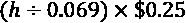

+   总赢得（公制）：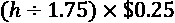

我喜欢不高风险的赌博。所以，我要说我想测试一下，用我的身高。所以我选择找出我的身高是多少个四分之一。我身高 5'10"。让我们算一下这是多少英寸。因为一英尺有 12 英寸，总身高的算法如下所示：


但我说我是 5'10"，所以我们需要加上那 10 英寸：


现在，让我们使用我们之前定义的数学算法，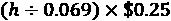，来找出我能赢得多少：

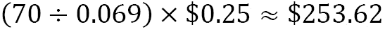

我使用了符号而不是=，因为表示这是一个近似值。由于我四舍五入了，我想确保我显示的是最佳近似值，而不是精确数字。

也许你现在已经解决了这个问题，但在计算思维中，我们必须经过抽象并设计一个适用于所有情况的算法。我们可以创建一个非常简单的程序，从用户那里获得简单的输入，或者我们可以创建一个更复杂的程序，不仅提供基本的总数，还可能提供总和、图表或我们发现与我们的情景相关的其他任何内容，并适用于所有情况。

一旦我们更深入地了解了计算思维过程的每个部分，我们将更多地设计这些算法。我们甚至会回到这个问题，展示如何为计算机创建运行的算法。我们可以创建一个算法，让我们使用某人的身高来决定使用哪种赢得。

或者，如前所述，我们可以写一个以$250 作为每个参赛者的赢得基准的基线，然后输入每个参赛者选择的内容，以便查看我们是否低于或高于$250 的基准。我们可以汇总这些结果，也就是继续将它们相加，以查看当电台停止抽奖时我们最终会得到什么结果。如果参赛者在电台进行抽奖的时间越长选择不同，我们甚至可以有一个图表显示我们的情况，等等。

在本节中，我们学习了计算思维的要素。我们还研究了一个计算思维问题。

然而，现在让我们继续深入研究计算思维的要素——即分解、模式识别、模式概括和抽象以及算法设计。

# 分解问题

**分解**是分解数据的过程。它可以包括解决问题所需的一系列过程或步骤。通过分解问题，我们可以在概括模式之前识别问题的组成部分或较小部分。

通过分解，我们可以识别和解决一个案例，然后将这些步骤概括到问题的所有可能实例中。为了真正理解分解，我们需要回到我们之前提出的问题，简单地说，就是问：*如果我用硬币换取我的身高，会得到更多的钱吗，还是应该选择 250 美元？*我们可以说我们想知道一个实例，并且数学上解决这个问题一次，比如只解决我的身高的问题。然而，我们可能需要其他实例的信息。我们可以创建一个程序，只是确定哪个选项，250 美元还是你的身高的硬币，会更好。或者我们可以考虑以下一些情况，这将意味着不同的算法：

+   我们可以检查给定身高的选项，但也将每个项目添加到列表中，以便跟踪所有决策。

+   我们还可能需要数组和该列表中元素的总和来跟踪比赛中的支出。

+   我们还可以将总和与基线进行比较，以 250 美元作为每个个体的基准。

+   我们还可以使用所有的元素，比如列表、总和、比较和可视化图形显示来更好地理解和跟踪结果。

正如你所看到的，算法将取决于我们确切想要跟踪或回答这个问题。我们的算法可以是一个简单的是或否类型的问题，我们只需检查哪个选项最好，或者它可以是一个更健壮的算法，带有数据和数据跟踪的可视化表示。现在让我们来看看我们如何在问题中寻找模式。

# 识别模式

**模式识别**是在我们分解问题后找到相似之处或模式的过程。在*问题 1*中，我们展示了一个问题，其中参赛者可以赢得 250 美元，或选择用他们的身高来换取硬币。对于每个参赛者来说都是一样的。唯一的区别是总价值取决于个人的身高。

在本节中，让我们看一个不同的问题，以更好地理解模式识别。

## 问题 2 - 数学算法和概括

想象一下，你正在为一个足球队准备聚会。这是一个社区球队，所以总是有 12 到 15 个孩子过来。你想要订购你需要的食物。你知道你将从你将使用的餐饮公司那里支付 12 美元每个孩子。现在，让我们分解这个问题：

+   **分解**：我知道我们有 12 到 15 个孩子。我们也知道每个孩子的费用是 12 美元。我们的问题可以被看作是一个问题：*我们如何估算费用？*

+   **模式识别**：你知道孩子的数量*k*在 12 到 15 之间。你知道每个孩子的费用是 12 美元。例如，如果我有 5 个孩子，费用将是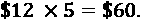

+   **模式概括**：孩子的数量是未知的，所以我们将使用变量*k*表示未知值。这样，无论我们有多少孩子，我们都可以找出总费用。我们正在从一个案例，5 个孩子，概括到所有案例，*k*个孩子。

+   **算法设计**：我们现在将编写数学算法。我们将在*第三章*中更多地使用可编程算法，*理解算法和算法思维*。我们也将在那里重新讨论这些数学算法。总费用将由方程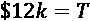给出，其中*T*是总费用，*k*是孩子的数量。

正如您从前面的问题中所看到的，模式识别对于找到一个概括的模式并编写我们的算法是很重要的。现在，让我们更仔细地看一下模式概括。

# 概括模式

一旦我们认识到我们的模式，我们需要进行**模式概括**和**抽象**。也就是说，我们希望确保我们提出的解决方案可以用于我们已经确定的问题的多个实例。模式概括可以是一些简单的东西，比如编写一个基本的线性数学算法，就像我们为派对的成本所做的那样，其中每个孩子的成本是 12 美元。因此，任何数量*k*的孩子的成本将由 12*k*给出。但模式概括可能远不止于此。

如果我们回到*问题 1*，在那里你可以选择 250 美元，或者你可以选择用 25 美分的硬币来换算你的身高，我们的模式**概括**将允许我们检查任何人的身高与 250 美元的对比，以确定选择现金选项还是选择硬币哪个能让你得到更多的钱。

**抽象**让我们专注于我们需要的东西，并丢弃我们不需要的东西，以便为我们的问题创建最佳算法。现在，根据我们决定需要什么，我们可以添加或删除一些条件。

例如，如果我是一个参赛者，我只想知道哪个选项给了我更多的钱。我不关心总胜利，谁选择了 250 美元，谁选择了身高等等。但如果我是广播电台，我可能想知道总和，与基准的比较，以及更多。我将不得不选择基准，甚至可能以图形方式显示随时间发生了什么。这都是抽象过程的一部分。当您解决计算思维问题时，您还在确定对您的解决方案和算法重要和不重要的事情。

在这个问题的最简单形式中，如果你是一个参赛者，你想知道你赢得奖金的最佳可能情况是什么。如果你选择了 250 美元，但你的身高使得你的身高以 25 美分的硬币来换算的金额超过了 250 美元，你会想知道。如果你在广播电台工作，你可能想追踪不仅仅是每个获胜者的情况。抽象允许您适应所有情况，从解决一个数学问题到创建一个可以跟踪所有参赛者的所有选择的算法。现在让我们看看如何创建这些算法。

# 设计算法

正如本章中先前提到的，*算法*是一组指令。当我们编写计算机程序时，算法是一组指令，提供给计算机，以便它可以为所提出的问题提供解决方案。到目前为止，我们一直坚持数学算法，只是因为我们还没有深入研究 Python。然而，我们现在将一些算法转化为 Python 编程。

首先，让我们来看一下*问题 1*。在这里，我们有一个情况，你可以赢得 250 美元，或者你的身高以 25 美分的硬币来换算。假设是你在竞争，你会想知道哪个选项能让你赢得最多的奖金。

让我们再次看一下本章前面的数学算法：

+   总获胜金额（习惯单位）：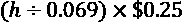

+   总获胜金额（度量单位）：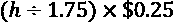

请记住，如果您使用的是习惯单位的身高，您将使用第一个算法。如果您使用的是公制单位，您将需要相应地调整程序。

当我们编程时，我们需要定义我们的变量。在这种情况下，`h`是我们用于身高的变量。但想想看；如果你是一个成年人，你的身高可能不会改变，但为了论证的目的，我们将假设它不会总是相同。因此，我们需要想知道哪个选项更好，250 美元还是用 25 美分的硬币来换算他们的身高的人*输入*他们的身高，以便程序会为他们提供答案。

输入是用户可以输入的内容。因此，当我们定义变量时，我们将要求输入。在 Python 和任何其他语言中，一个好的做法不仅仅是要求输入而没有任何指导。也就是说，我们希望告诉用户他们正在回答的问题。例如，我可以编写以下代码来要求用户输入他们的身高：

```py
h = input("Enter your height in inches: ")
```

上述代码将要求用户输入一些内容。它还要求用户以英寸输入信息。如果您使用的是公制单位，您将相应说明。

我们还将信息保存为变量`h`。但我们还没有对该变量做任何操作。

我们可以进行基本的数学运算，并根据身高打印出我们得到的值：

```py
h = input("Enter your height in inches: ")
total = (int(h)/0.069)*0.25
print(total)
```

请注意，在上面的片段中，我们在`total`变量的定义中使用了`int(h)`。我们将`h`值转换为整数，以便可以使用该变量进行数学运算。当我们要求输入时，变量被保存为字符串，这就是为什么我们需要转换它以便使用它。

使用我的身高运行上述代码，即 70 英寸，得到以下结果：

```py
253.62318840579707
```

如果我们将打印代码调整如下所示，我们的答案将是`253.62`，看起来会好得多：

```py
h=input("Enter your height in inches: ")
total = (int(h)/0.069)*0.25
print(round(total,2))
```

当我运行这个程序时，窗口看起来是这样的：


图 2.1 – Python 程序输出

但有时我们希望代码做更多的事情。让我们删除那个`print`命令并创建一些条件。在接下来的几行中，我们将使用提供的值进行一些比较。例如，我们可以要求计算机为我们检查一些事情。有三种可能性：

+   我们的身高可能会产生与 250 美元完全相同的结果。

+   我们的身高可能会产生少于 250 美元的结果。

+   我们的身高可能会产生超过 250 美元的结果。

现在，我将要求计算机根据这些条件告诉我该做什么。我们将需要一个**if-elif**，**else**语句。这些是我们将测试的条件，以便获得更好的输出。我们将测试总额是否与 250 美元相同。否则，如果总额少于 250 美元，我们将希望计算机执行某些操作（这是我们的`elif`语句）。最后，在所有其他情况下，我们将使用`else`命令：

```py
h=input("Enter your height in inches: ")
total = (int(h)/0.069)*0.25
total = round(total,2)
if total == 250:
    print("Your height in quarters is the same as $250.")
elif total > 250:
    total = str(total)
    print("Your height in quarters is more than $250\. It is $" + total)
else:
    print("You're short, so choose the $250.")
```

让我们看看一些测试案例是什么样子的。

首先，让我们使用**69**英寸的身高：


图 2.2 – 情况 1：身高产生 250 美元

因此，任何身高为 5'9"的人无论做出哪种选择都不会错，因为他们最终都会赢得 250 美元。

现在，让我们看看我的身高，**70**英寸：


图 2.3 – 情况 2：身高产生的金额超过 250 美元

最后，让我们看一下小于 69 英寸的身高，所以让我们使用**55**英寸：


图 2.4 – 情况 3：身高产生的金额少于 250 美元

请注意，我们可以调整代码以表达我们想要的内容。我选择使用完整的句子来阐明结果，但您可以根据需要调整代码以满足您的需求或偏好。此时，一些代码可能具有挑战性，但我们将在*第八章*中深入学习 Python 编程语言，*Python 简介*。

正如您所看到的，我们有三种算法，它们为我们提供了相同类型的信息。其中一种比其他两种更加健壮，但我们的算法是复杂还是简单取决于我们从中需要什么。如果您稍后再次举行这次抽奖，您可能会忘记算法是什么，您是如何编写的，或者一切意味着什么。然而，通过最后的代码，您只需运行它就可以获得大量信息，这比前两种更有帮助。您还可以将所有这些信息作为注释添加到代码中，但我们将在*第八章*中讨论这些内容，*Python 简介*。

还要记住，我们运行这个程序就好像我们是参赛者一样。虽然这很有帮助，但您可能要考虑如果您是广播电台会做出什么改变。您可以编写一些代码来保存所有运行的实例，以便随后检查和添加所有的奖金。您甚至可以通过代码计算出总和。由于该代码稍微复杂，我们将在整本书中更详细地讨论它，特别是在*第八章*中，*Python 简介*。

现在，让我们看一些更多的问题和相应的算法，以便更加熟悉计算思维过程。

# 其他问题

在本节中，我们将继续研究其他问题。对于*问题 2*，我们将直接进入算法，因为我们在本章的早些时候已经完成了其他步骤。下一个问题也将包括整个计算思维过程。

## 问题 2 - 儿童足球派对

在本章的早些时候，我们正在为一个足球队筹办派对，每个孩子的费用是 12 美元。我们说孩子的数量是未知的，所以我们将使用变量*k*来表示未知数量。我们还说我们有一个数学算法，T = 12*k*，它给出了*k*个孩子的总费用 T。让我们在这里添加一个条件。如果我们的预算是 200 美元，我们想知道我们是超支、不足还是正好符合预算。

我们也可以使用 Python 为这种情况编写算法：

```py
k = int(input("How many children are coming to the party? "))
T = 12 * k
if T == 200:
    print("You are right on budget, at " + str(T))
elif T <= 200:
    print("You are under budget, at " + str(T))
else:
    print("You are over budget, at " + str(T))
```

让我们测试一些情况，以验证我们的代码是否有效：


图 2.5–案例 1：有 12 个孩子参加派对

*太好了！*如果有 12 个孩子参加，我们就不会超支。那么*如果有 20 个孩子参加呢？*让我们看一下：

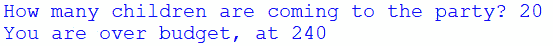

图 2.6–案例 2：有 20 个孩子参加派对

*我们没有足够的钱供 20 个孩子！*

正如您所看到的，程序为我们提供了有关总数以及我们是否超支或不足的一些信息。与任何算法一样，这并不是我们获取此信息的唯一方式。尝试使用不同的算法来解决这个简单的问题，或者添加一些自己的条件并编写代码。练习和添加条件将使您更加熟悉设计和编写算法。

## 问题 3 - 储蓄和利息

现在我们有一个新问题。一家银行以每月*x*％的复利率支付复利。*如果您存入任意金额，经过多年后将会支付多少？*

让我们**分解**一下这个问题。首先，我们知道利息是按月复利的。让我们谈谈复利。投资的利息是在一段时间内支付的百分比。复利意味着利息每次都是在初始金额加上利息支付的。复利是一种**模式**。实际上，它有一个公式。

我不知道的是银行支付的百分比、存款金额或存款年限。因此，我们需要编写一个程序来处理所有可能性。这就是**模式概括**。我们知道的是利息是按月复利的。实际上，这有一个数学公式：


让我们谈一下上述方程中的术语：

+   *A*是总金额。

+   *P*是本金，即初始存款。

+   *r*是利率（请记住，对于 3%，利率写作 0.03，例如）。

+   *n*是每年复利的次数。

+   *t*是存款未动的年数。

因为有一个数学算法，我们现在可以使用公式为此创建一个程序。但是，我们需要确保运行程序的人知道我们要求关于所有输入的内容。我们需要询问一些事情：

+   *存入多少金额？*

+   *银行支付的利率是多少？*

+   *存款多少年？*

我们知道公式中的*n*。这里*n*等于 12，因为这是按月复利。这意味着每年会复利 12 次。所以，*n* = 12。

现在是时候编写这个程序了：

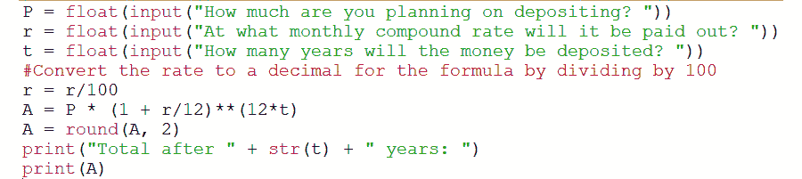

图 2.7 - 复利样本程序

上面的截图显示了复利的 Python 程序。请注意注释前面有`#`符号。它说明我们需要将利率转换为公式中使用的形式。否则，我们将得到一个不正确的总额。此外，我们在这里使用了浮点数，因为我们需要使用小数。整数或`int`不会给我们所需的信息。此外，我们将总额四舍五入到两位小数。这是因为我们在谈论金钱时使用两位小数。*图 2.7*中显示的算法文本如下：

```py
P = float(input("How much are you planning on depositing? "))
r = float(input("At what monthly compound rate will it be paid out? "))
t = float(input("How many years will the money be deposited? "))
#Convert the rate to a decimal for the formula by dividing by 100
r = r/100
A = P * (1 + r/12)**(12*t)
A = round(A, 2)
print("Total after " + str(t) + " years: ")
print(A)
```

使用复利算法中的代码，如果我们有初始金额、利率和存款年限，我们可以运行任何可能的复利实例。给定初始存款$1,000，利率 4.5%，存款 10 年的程序输出如下：


图 2.8 - 复利输出示例

正如您所看到的，按月复利存入$1,000，10 年后的总额为$1,566.99。

让我们再次测试程序。这一次，我们将以 3.5%的利率按月复利存入**5,000**美元，存款期为**20**年：

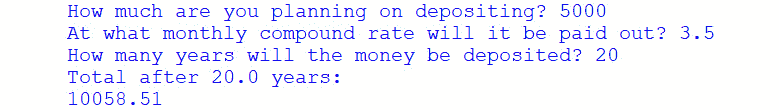

图 2.9 - 复利输出示例

20 年后我们的总额将是$10,058.51。*这意味着我们的钱翻了一番！*

有了这个计算器程序，我们只能计算按月复利的利息。我们可以创建一个新程序来计算以任何利率复利的利息：每月、每年、每两个月等等。您可以尝试使用代码来创建自己的计算器。如果您想知道投资或存款在未来会有什么预期，这些都是很有帮助的。例如，您可以确定需要多长时间才能将存款达到一定金额。比如，您想要为孩子的大学教育存入 50,000 美元。在这种情况下，您可以计算出在 18 年内需要存入多少金额，到那时他们很可能已经准备好上大学了。

# 总结

在这一章中，我们已经经历了计算思维的过程。我们了解了计算思维的四个主要元素：分解、模式识别、模式概括和算法设计。我们还了解到，在计算思维中的问题并不总是清晰定义的。我们需要解释和分解信息，以便找到模式。一旦我们找到模式并定义了我们想要概括的内容，我们就可以设计算法来解决问题。

我们还了解到，算法和解决方案并不是唯一的。对于我们遇到的每个问题，都有多种编写算法的方式。计算思维过程使我们能够以多种方式探索问题，并创建符合我们自己解释和需求的解决方案。

在下一章中，我们将更深入地学习算法和算法思维，因为它们是所有计算思维问题的产物。为了更好地理解算法，我们将研究布尔运算符，并学习如何识别和解决逻辑处理中的错误。我们将为所提出的问题编写算法，并分析给定算法中可能存在的处理错误。
