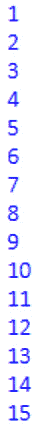
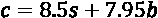

# 第三章：理解算法和算法思维

在本章中，我们将更加专注于理解算法和算法思维。虽然这是计算思维过程中的最后一步，但我们必须理解算法思维如何帮助我们更好地规划和理解问题。也就是说，我们练习算法设计和算法思维的次数越多，就越容易理解、分解和识别问题呈现给我们时的模式。

在本章中，我们将涵盖以下主题：

+   深入定义算法

+   设计算法

+   分析算法

阅读完本章后，你会更好地理解算法。因此，我们将重新分析算法的定义，这是我们之前在*第二章*中涵盖的，*计算思维的要素*，以及如何设计数学和计算算法。

# 技术要求

你需要最新版本的 Python 来运行本章中的代码。你可以在这里找到本章使用的完整源代码：[`github.com/PacktPublishing/Applied-Computational-Thinking-with-Python/tree/master/Chapter03`](https://github.com/PacktPublishing/Applied-Computational-Thinking-with-Python/tree/master/Chapter03)

# 深入定义算法

正如我们在*第二章*中提到的，*计算思维的要素*，**算法**只是一组指令。我们在日常生活中使用指令，有时是有意识的，有时是无意识的。例如，想想你早上遵循的例行程序。闹钟响了。*接下来你会做什么？* *你会准备咖啡吗？* *洗澡？* *先刷牙吗？*

大多数人每天早上都会按照相同的步骤。你可以说我们已经编程自己遵循这些步骤。现在想想一个你的日程变化，你的例行程序不同了的时候。我知道我不得不停下来重新调整很多次，因为我的“程序”不再起作用了。例如，我不能在早上 6 点起床赶 5 点的飞机。

计算机的算法类似，如果一组条件发生了变化，我们需要重新编写一组指令。程序只能执行我们已经规定的参数。大多数程序无法调整或适应任何未事先编码的新信息。也就是说，**机器学习**和**人工学习**正在发展。我们不是在谈论那些类型的程序，但即使在这些情况下，我们仍然需要调整这些程序以满足我们的需求。

为了设计算法，我们需要确保它们满足一些特定的特征：

+   **它们是清晰和明确的。**

+   **它们有明确定义的输入。**

+   **它们有明确定义的输出。**

+   **它们是有限的。**

+   **它们是可行的。**

+   **它们与语言无关。**

让我们逐个查看前面列表中的每个特征并对其进行定义。

## 算法应该是清晰和明确的

当每个步骤都能轻松理解、容易定义，并且输入和输出也清晰明确时，算法就是清晰和明确的。算法的每个组成部分应该只有一个意思。

## 算法应该有明确定义的输入和输出

算法的**输入**可以是用户提供的，这意味着程序的用户输入数据。输入也可以指程序内部定义的内容。这意味着我可以包含一个已经提供了固定值的变量。

例如，如果我需要用户告诉我他们购买的票数，我可以编写算法来询问输入。我也可以将该输入作为一个已定义的变量，并赋予一个给定的值。算法并不总是需要输入 - 零输入算法是存在的 - 但是当算法需要输入时，定义该输入是很重要的。一个输入的例子是在程序中要求用户的姓名。想想现代视频游戏。其中许多游戏会提示用户输入姓名，比如，“你好，旅行者。你叫什么名字？”

作为用户，当给出提示时，我会输入`Sofia`，这给了我以下结果：

```py
"Hello Sofia. Welcome to the adventure!"
```

正如你所看到的，游戏将产生一个输出，并在该输出中使用我的名字。

这最后一行是程序的**输出**。我也可以用 Python 编写一个简单的程序来问这个问题：

ch3_nameprompt.py

```py
name = input("Hello traveler. What is your name? ")
salutation = "Hello %s. Welcome to the adventure!" % name
print(salutation)
```

请注意，我们在这里使用了`%s`和`%`符号。这里的语法是我们所谓的 f-string。我们使用`%s`语法来让程序知道我们想要插入信息的位置，然后我们通过使用`%`符号来调用该信息。在这种情况下，我们将输入保存到`name`变量中，然后在`salutation`变量中调用它。

运行时，程序看起来是这样的：

```py
Hello traveler. What is your name? Sofia
Hello Sofia. Welcome to the adventure!
```

这个简单的算法允许我们将名字保存为一个变量。该变量仅在这个简单代码的输出中使用了一次。然而，在游戏中，该名字变量可能会在多个实例中使用，比如在与游戏中的角色对话时等。

程序的**输出**是离开系统的信息，也就是你的程序的产物。根据一些信息或代码，输出是从程序中的指令产生的东西。

## 算法应该具有有限性

算法必须具有**有限性**。这意味着算法必须结束。让我们看一个算法不会结束的情况。**我不建议编写或运行这个！**尽管如此，让我们看看创建这个算法的步骤：

1.  定义一个变量`i`，并将其设置为等于`0`：

```py
i = 0
```

1.  增加值`1`。我们可以以几种不同的方式来做到这一点：

```py
i = i + 1
i += 1 
```

前面两行代码都会将`i`的值增加`1`。

1.  *添加一个错误！*我们即将在有限性中创建一个错误。再次强调，我只是为了证明一个观点，但这是一个你要避免的错误：

```py
i = 0
while i >= 0:
    i += 1
    print(i)
```

在这个算法中，我告诉程序继续将`i`增加`1`，只要它大于`0`，然后计算机应该打印这个值。这将永远继续下去，永远不会停止，因为条件将始终成立。因此，程序的输出将从 1 开始，但将继续打印序列中的下一个项目，如 2、3、4、5 等。程序根本没有结束的方法。

现在，可以根据几种不同的条件来完成类似的程序。假设我们想打印所有加法的值，但只要`i`小于 15：

ch3_finiteness.py

```py
i = 0
while i < 15:
    i += 1
    print(i)
```

前面的程序是一个终止程序。现在它只适用于`i`小于`15`的所有值（不包括 15）。我们将得到如下所示的输出：



图 3.1 - 有限性代码的输出

我知道我说过这个程序不包括 15。确实不包括。因为这发生在`i`小于 15 的情况下，它将评估的最后一个值是 14。然而，它说当值小于 15 时，我们将其增加 1（`i += 1`）。所以，当`i`为 14 时，打印的值是 14 + 1，即 15。有限性允许程序终止。

## 算法必须是可行的

算法还必须是可行的。为了可行，算法需要使用可用的内容和资源。在编写算法时，我们有约束或条件可以写入步骤中。如果没有办法满足所有约束，那么算法就不可行。考虑以下给出的两个条件：

+   现在是下午 3 点。

+   现在是下午 5 点。

如果我们对一个变量设置这两个约束，比如，它不可能。它不能同时是下午 3 点和下午 5 点。这就是我们所说的不可行。虽然算法可以继续，但我们通过同时使这两个事情成为真实的问题。有些约束永远不会被满足，因此算法被认为是不可行的。算法必须有一种方法来满足所有约束才能被认为是可行的。此外，如果算法是依赖未来技术编写的，也被认为是不可行的。

## 算法是与语言无关的

最后，算法必须是与语言无关的。算法中的一组指令应该尽可能简单地编写。一个好的算法将是这样的，它可以很容易地用任何语言编写，并产生相同的输出。

在这一部分，我们学习了算法以及设计算法所需的特征。牢记一个好算法的特征将使我们能够避免错误，并为我们所面临的任何问题创建可行的算法，现在让我们看看如何设计一些算法。

# 设计算法

设计算法时，顺序很重要。在使用编程语言时，存在重要的层次结构。这包括在使用 Python 时。把这看作是数学中的运算顺序。如果你还记得，我们使用 PEMDAS 来记住数学中的运算顺序。PEMDAS 代表括号、指数、乘法/除法和加法/减法。

我把乘法/除法写在一起是因为乘法和除法具有相同的权重。也就是说，乘法不一定需要在除法之前发生。如果我先进行除法，然后从左到右进行乘法，那么除法先发生。加法和减法也是如此。两者都没有更多的权重，所以我们按照从左到右的出现顺序执行它们。

让我们为一个问题编写一个数学算法。我们将看一个食物环境中的算法。是的，我知道我经常写关于食物和食物算法。我几乎和我喜欢代码一样喜欢食物。

## 问题 1 - 办公室午餐

办公室正在为员工订餐。员工可以选择三明治或沙拉两种午餐选项。每份三明治餐的成本为 8.50 美元，而每份沙拉餐的成本为 7.95 美元。

### 办公室午餐数学算法

选择每个选项的员工数量是未知的。让我们使用一些变量来帮助我们设计数学算法。让我们用 s 表示三明治的数量，用 b 表示沙拉碗的数量。我知道你在想什么，如果你过一段时间再回到这个问题，这两个变量并不是很有用。但我们马上就会谈到这个问题。现在，让我们写出我们的总成本 c 会是什么样子：



这是一个简单的数学问题，需要两个未知的变量输入 s 和 b，以获得我们的总成本 c。现在让我们看看同样的午餐场景的另一个版本。

### 办公室午餐 Python 算法

现在让我们在编写程序时考虑一些更多的考虑因素。在为这个问题设计 Python 算法时，我们需要考虑两个角度：程序员和用户。

有时我们既是程序员/开发人员，也是程序的最终用户，但很多时候，我们会为其他人编写或开发内容。重要的是我们要记住这些考虑因素，因为这可能会影响我们编写程序和定义变量的方式。此外，如果我们正在为公司编写程序，其他人可能需要在某个时候去编辑我们的程序。

这意味着我们需要以其他人能够理解的方式编写程序。我们的变量应该易于理解，因此使用简单的单个字母变量可能会使另一个程序员或用户更难理解。让我们看看*问题 1*的程序。请记住，在这个问题中，我们试图确定给员工提供两种可能选择的办公午餐的最终成本：

+   $8.50 三明治套餐

+   $7.95 沙拉套餐

让我们使用 Python 为这个问题创建程序。首先让我们澄清一些变量。我们将使用完整的单词或用*_*分隔的一系列单词来定义这些变量。在开始之前，您可能需要回想一下，对于**Python 变量**，需要遵循一些规则，以免引起错误：

+   变量必须以字母或下划线（*_*）开头。

+   变量只能包含字母，数字和下划线。

+   变量不能以数字开头。

+   变量是区分大小写的（*alpha*不是与*Alpha*或*ALPHA*相同的变量）。

对于*问题 1*，我们需要三个变量：

+   午餐的总成本

+   三明治午餐的数量

+   沙拉午餐的数量

现在我们需要给它们命名：

+   `total_cost` = 所有午餐的总成本

+   `number_of_sandwiches` = 订购的三明治套餐总数

+   `number_of_salads` = 订购的沙拉午餐的总数

这里重要的是这些变量易于阅读和理解。我应该注意到，我在编程时偏爱小写变量。我确实有一些例外情况，我喜欢使用大写字母，但您会看到许多只有小写字母和下划线的示例。很久以前，我发现即使在编写程序时大写字母对我来说是有意义的，但后来我会忘记哪些字母是大写的，这只是一个额外的头痛，如果我只是使用小写字母，就可以避免。

此外，一些程序员会消除下划线，并使用变量，例如`numberofsandwiches`或简单的`sandwiches`。当然，这两种都是可以接受的，而简单的`sandwiches`会使编写一些代码变得更容易。然而，这样做有利有弊。如果其他人正在查看程序，可读性将很重要。就像我说的，我偏爱清晰的小写变量和使用下划线，但每个程序员都可以自行选择。

现在我已经定义了我的变量，我可以开始编写我的程序了。*我需要向用户询问什么？* 我需要用户的**输入**，包括三明治和沙拉的数量。我想要作为**输出**的是午餐的总成本。在 Python 中向用户询问输入，我们需要使用`input`命令。然而，我们还需要记住，由于我们在使用`float`数字的算法中使用了这个数字（小数点是浮点字符），我们需要将提供的数字转换为`integer`或`float`。员工不会点半份沙拉，所以我们可以安全地将它们保存为整数，或`int`。作为提醒，在 Python 中，注释以`#`符号开头。在 IDLE 中编写代码，如下所示：

ch3_officelunch.py

```py
#Ask the user for the number of sandwich meals ordered and save as variable.
number_of_sandwiches = int(input("How many sandwich lunches were ordered? "))
#Ask the user for the number of salad meals ordered and save as variable.
number_of_salads = int(input("How many salad lunches were ordered? "))
#Create total_cost variable and save the algorithm for total the new variables.
total_cost = 8.50 * number_of_sandwiches + 7.95 * number_of_salads
#Print the total cost. Don't forget to convert the total_cost to string. 
print("The total cost for the employee lunch is $" + str(total_cost) + ".")
```

运行代码时，用户可以输入办公午餐的各种选项的数量。代码首先询问用户三明治的数量，如下所示：

```py
How many sandwich lunches were ordered? 
```

然后代码将要求输入沙拉午餐的数量，并提供总费用。以下示例输入 12 份三明治午餐和 23 份沙拉午餐，总费用为 284.85 美元：

```py
How many sandwich lunches were ordered? 12
How many salad lunches were ordered? 23
The total cost for the employee lunch is $284.85.
```

现在让我们从不同的角度来看一个类似的问题。

## 问题 2 - 一个餐饮公司

假设你开始了一个简单的餐饮公司。你开始只销售两种选择，一份 8.50 美元的三明治套餐和一份 7.95 美元的沙拉套餐。你可以创建一个使用 Python 字典存储这些选项的程序。

你可以在*第八章*中找到有关 Python 编程语言和字典的更多信息，*Python 简介*，但我们也会在这里定义一个 Python 字典。当我们想要无序、可更改且有索引的项目时，我们使用字典。以下是 Python 中我们餐饮公司的一个字典的示例：

ch3_cateringdict.py

```py
catering_menu = {
    "sandwiches": 8.50,
    "salads": 7.95
    }
print(catering_menu)
```

现在，字典是常见的，而且非常有用，原因有很多：主要是它们易于阅读，并且它们提供了根据需要更改数据的方法。

当打印时，字典代码看起来像这样：

```py
{'salads': 7.95, 'sandwiches': 8.5}
```

现在你有了一个字典，让我们谈谈它对你的餐饮公司的用处。假设你的沙拉配料成本增加了，你想通过改变沙拉的价格来进行核算。你可以通过几种不同的方式来做到这一点。你可以在原始程序中进行更改，因为它非常简短，或者你可以告诉程序你想要根据键值来进行更改。这很重要，因为现在你可能有两种出售的物品，*但是当你的菜单选项变得更加广泛时会发生什么？* *每次更改价格时，你是否想要搜索每个项目？* Python 使得识别你想要更改的内容然后进行更改变得很容易。

为此，你可以使用以下代码：

```py
catering_menu["salads"] = 9.50
```

你的新 Python 代码看起来像这样：

ch3_cateringdict2.py

```py
catering_menu = {
    "sandwiches": 8.50,
    "salads": 7.95
    }
catering_menu["salads"] = 9.50
print(catering_menu)
```

当打印时，沙拉的新价值将被显示：

```py
{'salads': 9.5, 'sandwiches': 8.5}
```

*但是，如果你想添加一个菜单项目会发生什么？* 比如说你想添加一个售价为 3.75 美元的汤选项。在这种情况下，你可以通过一行简单的代码将菜单选项添加到你的字典中，如下所示：

```py
catering_menu["soup"] = 3.75
```

当你把所有东西放在一起时，初始代码和更改将看起来像下面的代码块。请注意，你有初始字典，然后是下面的两个更改。当你打印字典时，它将包括所有更改以及添加汤选项：

ch3_cateringdict3.py

```py
catering_menu = {
    "sandwiches": 8.50,
    "salads": 7.95
    }
catering_menu["salads"] = 9.50
catering_menu["soup"] = 3.75
print(catering_menu)
```

现在你已经添加了`soup`项目，你可以打印你的字典来查看你的完整菜单：

```py
{'soup': 3.75, 'salads': 9.5, 'sandwiches': 8.5}
```

我们可以使用字典中的信息来创建更健壮的程序，比如在线菜单、点餐菜单选项等等。在本节中，我们学习了如何设计算法，并解决了两个问题。

我们将在本书的后续章节中更多地使用 Python 进行开发，特别是在*第三部分*，*使用计算思维和 Python 进行数据处理、分析和应用*。现在，让我们继续分析一些算法。

# 分析算法

正如本章前面提到的，当我们设计算法时，它们应该具备以下特点：

+   它们是清晰和明确的。

+   它们有明确定义的输入。

+   它们有明确定义的输出。

+   它们具有有限性。

+   它们是可行的。

+   它们是与语言无关的。

除了这些特点之外，当我们看算法并分析它们时，我们希望确保自己问一些问题：

+   *算法是否做我们想要的？*

+   *输出是否合理？*

+   *是否有其他更清晰地获取相同信息的方法？*

在分析算法时，我们可以问自己许多更多的问题，但现在让我们看一些算法解决方案，并根据上述特点和问题进行分析。

## 算法分析 1 - 州和首府

一个学生创建了一个算法，其中包括美国各州和每个州的首都的列表，但只包括她已经学过的州。她的算法如下所示：

ch3_statecapitals1.py

```py
Ohio = "Columbus"
Alabama = "Montgomery"
Arkansas = "Little Rock"
print(Ohio)
```

这个程序很简单，但使用起来并不容易，也不在运行时提供帮助。*它包含所需的信息吗？*是的。*我们可以以不同的方式组织它，以便以其他方式调用信息吗？*可以。

把州和首都看作键对。我们可以使用字典来存储这些信息。你可能还记得本章前面提到过，字典可以很容易地进行调整和适应，只需一行简单的代码就可以添加一个新的键。让我们先把前面代码中的信息转换成字典：

ch3_statecapitals2.py

```py
state_capitals = {
    "Ohio" : "Columbus",
    "Alabama" : "Montgomery",
    "Arkansas" : "Little Rock"
    }
print(state_capitals["Ohio"])
```

注意，现在我们可以通过简单地给出州名来访问州首都的信息。这段代码的输出只是`哥伦布`。*但是如果你只想运行程序并要求用户输入他们选择的州呢？*我们也可以用现有的字典在一行代码中编写。看一下以下代码：

ch3_statecapitals3.py

```py
state_capitals = {
    "Ohio" : "Columbus",
    "Alabama" : "Montgomery",
    "Arkansas" : "Little Rock"
    }
state = input("What state's capital are you looking for today? ")
capital = state_capitals[state]
print("The capital of " + state + " is " + capital + ".")
```

在这段代码中，用户输入他们想要查找首都的州。这很有帮助，因为你可以每次运行代码而不必进入代码中去更改要打印的代码行，这是我们在`ch3_statecapitals2.py`文件中的算法中不得不做的。运行时，代码看起来像这样：

```py
What state's capital are you looking for today? Alabama
The capital of Alabama is Montgomery.
```

现在让我们看一下首先需要这个算法的原因。学生想要继续向程序中添加州。由于这个程序是基于字典的，她只需在需要添加另一个州时添加一行代码。例如，如果她想要添加**爱荷华州**，其首都是得梅因，她需要使用以下代码：

```py
state_capitals["Iowa"] = "Des Moines"
```

看一下以下代码块。注意代码在程序中的放置位置。很重要的是我们把新代码放在新变量之前，否则，如果你尝试运行程序并输入`爱荷华州`，代码将返回一个错误而不是提供爱荷华州的首都。

在算法中，逻辑非常重要。我们不能在已经使用过的变量中使用我们尚未定义的值。也就是说，如果在为`爱荷华州`标识新值之前就使用了`州`和`首都`变量，那么当输入`爱荷华州`时，代码会以错误结束。然而，如果我们在运行这两个变量之前添加键对值，代码就会如预期般运行：

ch3_statecapitals4.py

```py
state_capitals = {
    "Ohio" : "Columbus",
    "Alabama" : "Montgomery",
    "Arkansas" : "Little Rock"
    }
state_capitals["Iowa"] = "Des Moines"
state = input("What state's capital are you looking for today? ")
capital = state_capitals[state]
print("The capital of " + state + " is " + capital + ".")
```

正如你所看到的，我们可以调整和修改代码以更好地满足我们的需求。现在让我们看一下一些算法，确定它们是否会运行；也就是说，它们是否会产生错误或正确运行。

## 算法分析 2 - 终止还是不终止？

正如我们在本章前面讨论过的那样，算法应该是终止的。也就是说，它们必须有一种结束的方式，否则会导致许多错误。让我们看一个算法并分析它，确定它是否会终止：

```py
x = 0
while x >= 3:
x += 1
print(x)
```

首先，让我们看一下`x`变量的值。`x`变量以`0`的值开始程序。`while`循环规定了`x`值将发生变化的条件，当`x`值大于`3`时，它会增加`1`的值。

这个算法终止，因为它将打印变量`0`的原始值。然而，这个算法实际上并不执行任何操作，因为条件永远不会满足。另外，请注意`print`命令没有缩进。如果缩进了，对于这个算法将不会给出任何输出，因为`print`命令永远不会被调用，因为变量永远不会满足`while`循环的条件。

现在让我们看一下以下算法：

```py
j = 0
while j >= 0:
	j -= 1
	print(j)
```

在这种情况下，变量条件得到满足，因为`j`必须大于或等于 0 才能使程序运行。一旦条件得到满足，变量的值就会减少 1，因此`print`命令将产生一个输出为`-1`。代码不会再次运行，因为变量的值不再大于或等于 0。这个算法是终止的，产生了输出，并且是可行的。

最后，让我们来看一下以下具有改变条件的算法：

```py
j = 0
while j <= 0:
	j -= 1
	print(j)
```

在这种情况下，算法是不终止的。因为我们将`while`循环改为小于或等于 0，这个算法现在将永远继续运行。

分析算法可能非常复杂。我们只是开始涉及算法的一些组成部分。随着我们在本书中深入研究其他计算思维问题，我们需要牢记良好算法的特性，以便有效地分析我们自己的代码。同样重要的是，我们继续考虑计算思维过程的元素：**分解**，**模式识别**，**模式概括**和**算法设计**。

当我们设计算法并测试它时，使用良好算法的特性将使我们能够观察错误，调整我们的算法以便使用，提供更好的输入和输出，并确保我们不会创建不可行和非终止的算法。

# 总结

在本章中，我们讨论了算法的定义，即一组步骤，允许计算机完成一个过程并提供一些输出。我们了解了算法的特性。

我们设计了基于问题场景的算法，然后分析算法，以确定它们是否满足正确运行所需的特性。理解算法的特性以及算法的工作原理将使我们能够创建比不了解这些特性时错误要少得多的算法。请注意，我说的是*更少*的错误。

在编写代码时，错误是生活中不可避免的事实。我们将不可避免地犯错误，我们将无意中引入错误或使一些代码无限。了解良好算法的特性使我们能够减少这些错误，即使我们无法完全将它们从我们的日常生活中消除。

在下一章中，我们将学习更多关于逻辑推理的知识。在整个章节中，我们将讨论逻辑的定义，学习归纳和演绎推理，增加我们对运算符和布尔逻辑的了解，并更多地了解逻辑错误。我们将使用计算思维的元素和算法的特性来进一步增进我们对逻辑推理的了解。
