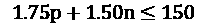
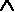
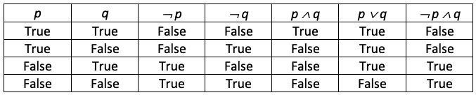
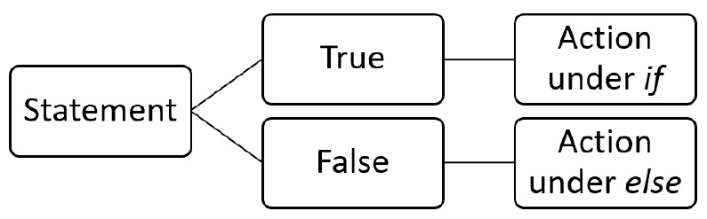
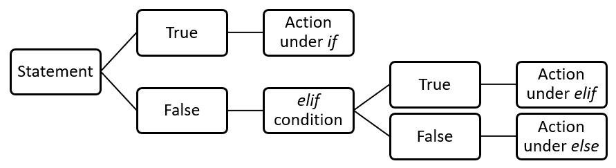
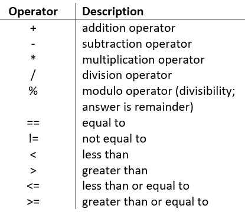
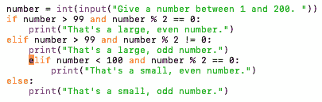

# 第四章：理解逻辑推理

在本章中，我们将探讨条件语句、算法推理和布尔逻辑等逻辑推理过程。在深入研究一些逻辑运算符之前，我们将探讨归纳和演绎推理。我们还将学习逻辑错误，如何识别它们以及如何纠正它们。

此外，我们将研究使用逻辑来编写算法以解决计算思维问题。

在本章中，我们将涵盖以下主题：

+   理解逻辑推理的重要性

+   使用布尔逻辑和运算符

+   识别逻辑错误

在解决计算思维问题时，逻辑推理是必要的。我们都知道编程代码有按顺序执行的步骤。想象一下我们有 10 行代码。如果我们不应用逻辑推理，代码会一行一行地读取——读取第一行，读取第二行，依此类推，直到最后一行。使用逻辑推理允许我们在继续之前比较事物，返回到以前的代码行，等等。在本章中，我们将学习逻辑推理，以便使用逻辑运算符以高效的方式解决问题并创建算法。

为了理解逻辑推理，我们将首先概括逻辑的一般定义，然后讨论在设计和编写算法时如何使用逻辑。

# 技术要求

您需要最新版本的 Python 来运行本章中的代码。您可以在此处找到本章使用的完整源代码：[`github.com/PacktPublishing/Applied-Computational-Thinking-with-Python/tree/master/Chapter04`](https://github.com/PacktPublishing/Applied-Computational-Thinking-with-Python/tree/master/Chapter04)

# 理解逻辑推理的重要性

当我们通过*第三章* *理解算法和算法思维*时，我们学会了如何在解决计算思维问题时设计一些基本算法。

在本节中，我们将了解逻辑推理的重要性以及如何通过示例应用逻辑推理的类型。

在编写算法时，我们需要使用逻辑推理来创建这些算法。

简而言之，**逻辑推理**是达成结论所遵循的一系列步骤。在计算思维中，当我们设计算法时，我们遵循的系统步骤是算法的一部分。计算机读取这些算法的方式取决于我们编写算法的方式。逻辑推理论证有两种类型，如下所示：

+   **归纳推理**

+   **演绎推理**

在更深入地定义这些之前，让我们看看为什么逻辑推理如此重要，以及在创建算法时为什么顺序很重要。

为了分析问题并提供帮助我们解决问题的算法，我们首先需要了解什么是逻辑推理。对于一些人来说，逻辑可能令人望而生畏，但我们每天都在下意识地使用它。

让我们看一个简单的例子。假设您每天早上洗澡然后去上班。*那么，您会在洗澡之前穿上工作服吗？*不会，因为那完全没有意义。从逻辑上讲，您必须先洗澡，然后再穿上工作服。现在，我在这里跳过了很多步骤，但这些步骤是逻辑步骤。其他逻辑的例子包括按照食谱制作食物，下雨时使用伞（或不使用），等等。

在本章中，我们将交替讨论逻辑推理和使用**逻辑运算符**设计算法。逻辑运算符允许程序做出决策。我们在日常生活中也会使用它们，只是没有意识到而已。例如，如果天气晴朗而温暖，我们可能想去骑自行车，但如果天气晴朗但寒冷就不想去。这里的*and*是一个逻辑运算符。

在做决定时，我们考虑了很多因素。在计算思维中，特别是在算法设计中，我们需要考虑这些因素，并为程序提供一种测试这些条件的方法。我们将在本章后面更深入地探讨逻辑运算符。现在，让我们更仔细地看看逻辑推理的类型以及如何应用它们。

## 应用归纳推理

当我们谈论归纳推理时，我们实际上是在向后工作。归纳推理从一个可能为真或假的结论开始，然后向后使用现有数据创建代码。让我们先看一个简单的问题。

### 解决归纳推理样本问题

我们有 150 美元的预算用于购买美术用铅笔和橡皮擦。美术用铅笔每支 1.75 美元，橡皮擦每个 1.50 美元。

记住，在计算思维中，我们首先分解问题，然后识别模式，然后概括该模式，然后创建算法。因此，让我们认识到这种模式。

让我们看看到目前为止我们知道的内容并命名一些变量：

+   总预算是 150 美元。

+   铅笔的成本是每支 1.75 美元。

+   橡皮擦的成本是每个 1.50 美元。

+   现在让我们用*p*表示铅笔的数量。

+   让我们用*n*表示橡皮擦的数量。

请记住，当我们到达算法时，我们可能想要重新命名这些变量。但现在，因为我们首先要看数学算法，所以我们会保留简单的变量。

我们可以用一个不等式来表示。*为什么是不等式而不是方程？*因为我们的总额可能不会正好是 150 美元。但它不能超过 150 美元，因为那是我们所有的钱。

因为这是一个简单的问题，我们一举识别和概括了这个模式。

因此，铅笔的数量乘以成本加上橡皮擦的数量乘以成本小于或等于 150 美元：



现在让我们谈谈算法设计。也许这是我定期购买的东西，因为我开美术课。我会根据这种情况进行。也许我的雇主最多给我 150 美元，但根据以前使用的情况，我可能需要更多的铅笔或橡皮擦，反之亦然。因此，我需要一个可以在每学期开始时使用和重复使用的程序。*这是我的问题的一部分吗？*不，这是一个定义不清晰的问题。因此，我正在根据一组特定需求调整问题。简而言之，我正在定义我想要解决的问题。

重要提示：

作为归纳和演绎推理困境的一则旁注，重要的是要理解，条件语句（例如我们在编程中经常使用的`if`/`then`语句）通常与演绎推理相关联。我们可以就它们是否可以是归纳的进行辩论，但事实是，归纳推理问题将使用演绎推理。我们将在本章的下一节深入研究演绎推理陈述。

因此，我希望程序问我想要多少支铅笔，或者问我想要多少个橡皮擦。这完全取决于情况！让我们看看程序应该为我们做些什么。以下步骤向我们展示了这一点：

1.  询问您的输入是铅笔还是橡皮擦。

1.  根据提供的输入选择要使用的不等式。

1.  确定可能的铅笔或橡皮擦的数量（根据输入）。

1.  给出铅笔和橡皮擦的总成本。

请注意，像往常一样，有很多种方法可以在 Python 中得出相同的答案。虽然其中一些程序比我通常呈现的要长，但由于我们正在学习计算思维和 Python 编程，展示易于理解的步骤非常重要。

对于这个特定的程序，我们需要导入数学函数，以便我们可以向下取整。*为什么我们需要这样做？*嗯，我们不能购买部分橡皮擦和铅笔，只能购买整支铅笔和整个橡皮擦。因此，如果程序说我们可以购买 19.5 支铅笔，那实际上意味着我们只能购买 19 支铅笔。

`math.floor()` 函数允许我们使用简单的函数将该数字向下舍入到 19。在本书中，我们将更多地探讨 `math` 函数。在我们离开这个快速主题之前，你应该知道 Python 中的 `math` 模块具有与 C 语言函数相匹配的内置函数。

让我们回到问题。看一下下面的编程：

ch4_inductiveP1.py

```py
#We need the math module, so don't forget to import it.
import math
#Ask the user if they will input pencils or erasers first.
item1 = input("Will you be entering pencils or erasers? ")
if item1 == "pencils":
    pencils = int(input("How many pencils will you purchase? "))
    if pencils * 1.75 < 150:
        pencilstotal = pencils * 1.75
        total = 150 - pencilstotal
        total = total / 1.50
        erasers = math.floor(total)
        total2 = pencilstotal + erasers * 1.50
        print("You will be able to purchase " + str(pencils) + " pencils and " + str(erasers) + " erasers for a total cost of $" + str(total2) + ".")
    else:
        print("That's too many pencils.")
elif item1 == "erasers":
    erasers = int(input("How many erasers will you purchase? "))
    if erasers * 1.50 < 150:
        eraserstotal = erasers * 1.50
        total = 150 - eraserstotal
        total = total / 1.75
        pencils = math.floor(total)
        total2 = pencils * 1.75 + eraserstotal
        print("You will be able to purchase " + str(pencils) + " pencils and " + str(erasers) + " erasers for a total cost of $" + str(total2) + ".")
#If the input given is too large based on the budget, this line of code alerts the user.
    else:
        print("That's too many erasers.")
#If the input is incorrect, the program will print a statement to alert the person that they need to use pencils and erasers as input first.
else:
    print("Please run the program again and enter erasers or pencils as your input.")
```

请记住，上述程序将按顺序运行代码行（顺序）。因此，如果用户首先输入 `橡皮擦`，那么第一个 `if` 语句和嵌套的 `if` 语句将被忽略。如果用户首先输入 `铅笔`，那么算法将从第一个 `if` 语句正常运行，并通过剩余条件。以下是程序的顺序操作：

1.  要求用户输入他们是在买铅笔还是橡皮擦。

1.  如果用户输入铅笔，那么程序会询问他们要购买多少支铅笔。然后，它会计算他们能够购买多少个橡皮擦。

1.  如果用户输入的铅笔数量太多，他们将收到一条消息，说明他们买不起那么多。

1.  如果用户输入橡皮擦，那么程序会询问他们要购买多少个橡皮擦，然后计算用户能够购买多少支铅笔。

1.  如果用户输入的橡皮擦数量太多，他们将收到一条消息，说明他们买不起那么多。

1.  如果用户既不输入铅笔也不输入橡皮擦，他们将收到一条消息，要求重新运行程序并输入这两个选项中的一个。

上面是一个过于简化的归纳推理问题。一些归纳推理问题会要求你查看数据，得出一些可能的结论，然后编写一个程序来测试这些结论。在学习逻辑推理的过程中，我们基本上是在训练自己如何看待决策以及如何以程序可以返回我们所期望的输出的方式来处理它们。

在这里需要注意的是，有多种方法可以看待问题并准备解决方案。虽然我更喜欢决策树和流程图，其他程序员和开发人员更倾向于更数学化的方法。还有一些人喜欢用简单的句子和/或段落写下程序需要做的事情。这个过程的目的是让我们创建一个能够产生必要输出并且逻辑上易于程序员、开发人员和运行它的计算机理解的程序。

现在，让我们来看看演绎推理。

## 应用演绎推理

现在我们来到本章重点讨论演绎推理的部分。即使我是一名数学学生，我也发现演绎推理很迷人。我很快就学会了数学如何教导我们如何在几何中逻辑地跟随论点，我爱上了所有逻辑和真值表的事物。

逻辑是通过证明和归纳和演绎推理来教授的。真值表帮助我们分析条件。在真值表中，有一些假设。例如，一个陈述要么是真的，要么是假的。另一个陈述也是真的或假的。这些陈述的组合取决于这些陈述是真还是假。

好的，这有点复杂。在我继续解释演绎推理之前，让我们先看一个快速的真值表和其中包含的逻辑过程。

真值表在我刚开始编码时非常重要。它们帮助我理解编码过程以及如何处理条件。并不是每个程序员或编码人员都使用这些表，但我发现它们很有帮助，即使在决策过程中没有明确使用。现在让我们来看一个。

假设我们有一个陈述或条件`p`，并且该条件为`True`。假设我们有另一个陈述或条件`q`，并且它也为`True`。在真值表中，我们使用符号¬来表示*NOT*。所以，¬`p`¬是`False`，¬`q`也是`False`。这是因为如果`p`是`True`，那么*NOT*`p`就是*NOT*`True`，换句话说，就是`False`。符号用于*AND*，所以`p`*AND*`q`写作`p  q`。符号``用于*OR*，所以`p`*OR*`q`写作`p  q`。在表格格式中，我们的真值表如下：



图 4.1 - 真值表

分析真值表并理解所有可能的条件可能需要时间，但这个过程类似于我们在编写问题的逻辑推理时经历的过程。现在，让我们更仔细地看看演绎推理。

让我们首先定义什么是演绎推理。**演绎推理**是从一个陈述或假设到结论的过程。因为演绎推理是我们在算法设计中使用的，所以在很大程度上，我们需要定义一些与之相关的术语。

让我们从条件陈述开始。

### 学习条件陈述

**条件陈述**是 if/then 语句。以下是一些使用条件陈述的逻辑论据：

+   如果下雨，我会用伞。

+   如果我喝水，那么我就不会渴了。

+   如果我的狗需要出去，那么它会站在门边。

+   如果一个四边形有四个直角，那么它是一个矩形。

所有前述陈述都是条件陈述的例子。陈述的第一部分称为**假设**。陈述的第二部分是**结论**。在陈述*如果下雨，我会用伞*中，假设是*下雨*，结论是*用伞*。我们在假设和结论中不包括*if*或*then*。

在 Python 中，正如您在*应用归纳推理*部分的示例中看到的，我们在编写算法时经常使用`if`/`then`语句。以下是我们在 Python 中使用的一些逻辑陈述：

+   `if`：在使用`if`语句时，我们询问条件是否满足，然后根据真假条件执行某些操作。

+   `if-else`：在使用`if-else`语句时，我们测试一个条件并执行某些操作，但如果条件不满足，那么我们执行其他操作。

+   `if-elif-else`：在使用`if-elif-else`语句时，我们有一个条件；如果条件不满足，我们测试另一个条件，即**else if**（**elif**）条件，否则，我们执行其他操作。

所有前述陈述都可以嵌套。我可以测试一个条件，然后另一个条件，然后另一个条件。我们可以在`if`和`else`之间有多个`elif`语句，依此类推。让我们看一些例子。

#### if 语句

让我们看一个只使用一个`if`语句的程序：

ch4_ifStatement.py

```py
number = int(input("What's your favorite number? "))
if number < 100:
    print("That's not a very large number.")
```

现在，上述代码是一个简单的程序，只检查一个条件。我们可以添加条件来测试`number`是否等于`100`。如果`number`大于`100`，我们可以添加另一个条件，依此类推。在这种情况下，我们只关心`number`是否小于`100`。

如果我们输入数字`53`，我们将得到以下输出：

```py
What's your favorite number? 53
That's not a very large number.
```

如果我们输入数字`100`，我们将得不到任何消息，程序将结束：

```py
What's your favorite number? 100
```

正如您所看到的，程序没有任何要添加的内容。条件没有满足，所以它结束了。这就是为什么`if-else`语句会派上用场的原因。

#### if-else 语句

让我们看看以前的算法，并添加一个`else`语句。以前的程序只检查提供的数字是否小于`100`。如果我们添加一个`else`语句，我们可以在屏幕上打印其他所有大于或等于`100`的数字。看看以下程序：

ch4_if-elseStatement.py

```py
number = int(input("What's your favorite number? "))
if number < 100:
    print("That's not a very large number.")
else:
    print("I guess you like large numbers.")
```

前面的程序现在无论用户输入什么数字，都会打印出一条消息。让我们再次测试`100`：

```py
What's your favorite number? 100
I guess you like large numbers.
```

如您所见，`100`包括在大数字类别中，因为我们的条件是数字小于`100`。这意味着`100`不包括在条件中。测试条件是我们在 Python 中得出结论的方式。我们编写算法从程序本身或用户输入中收集信息，然后测试条件以做出决定。

以下图表显示了`if-else`决策的流程图。在查看`if-elif-else`语句和嵌套语句时，我们将查看其他流程图：



图 4.2 - if-else 语句决策流程图

如前图所示，这是一个二进制决策。语句将被测试以检查它是**True**还是**False**。如果**True**，则会发生一个动作；否则，会发生另一个动作。对于我们的数字程序，如果数字小于`100`，则打印一条消息；否则，在屏幕上打印另一条消息“我猜你喜欢大数字”。现在，让我们添加多个条件。

#### if-elif-else 语句

`if-elif-else`语句是多条件语句的简化形式 - 也就是说，您可以有多个`elif`语句。如前所述，**elif**代表**else if**。让我们稍微改变一下我们的程序。我们将允许用户输入一个介于`1`和`20`之间的数字。这是我们将编程算法的方式：

1.  要求输入一个介于`1`和`20`之间的数字。

1.  测试数字是否在`1`和`10`之间，并打印消息。

1.  测试数字是否在`11`和`20`之间，并打印消息。

1.  打印错误消息。

让我们看看我们如何编写这个程序。在编写此算法之前，我们需要记住一些事情。要轻松检查介于`1`和`10`之间的数字，我们需要检查数字是否小于`10`。这意味着`10`不包括在内。

我们的`elif`语句将检查小于`21`的数字，因为它只包括我们尚未测试过的数字。也就是说，如果用户输入`12`，第一个条件不满足，所以它会转到第二个条件。是的，这将包括所有小于`21`的数字，但请记住，如果数字小于`10`，它将已经满足了一个条件，并且程序将打印正确的消息。

最后，如果条件不满足，我们需要让用户知道他们写了一个不在`1`和`20`之间的数字。以下程序演示了这一点：

ch4_if-elif-elseStatement.py

```py
number = int(input("Pick a number between 1 and 20\. "))
if number < 10:
    print("That's less than 10.")
elif number < 21:
    print("That's between 10 and 20.")
else:
    print("That number isn't between 0 and 20\. Run the program and try again.")
```

让我们尝试用一个小于`10`的数字进行测试。如果我们用数字`8`运行程序，我们会看到以下输出：

```py
Pick a number between 1 and 20\. 8
That's less than 10.
```

如果我们用数字`10`运行程序，我们会看到以下输出：

```py
Pick a number between 1 and 20\. 10
That's between 10 and 20.
```

最后，如果我们用数字`21`运行程序，我们会看到：

```py
Pick a number between 1 and 20\. 21
That number isn't between 0 and 20\. Run the program and try again.
```

如您所见，每个条件都为我们提供了该条件的答案。这是`if-elif-else`语句的流程图：



图 4.3 - if-elif-else 语句决策流程图

如前图所示，`elif`只是提出了一个新的测试。如果**True**，我们就会按照算法的行动。如果**False**，我们就会转到`else`语句。也就是说，我们可以有多个`elif`条件。这意味着我们可以继续一次又一次地测试条件，直到达到`else`语句为止。

### 理解嵌套语句

Python 中我们使用的另一种逻辑语句类型涉及嵌套语句。在嵌套条件中，嵌套的`if`语句只有在前一个`if`语句为**True**时才会执行。通过一个例子更容易理解。让我们回到我们的`if-elif-else`语句，并添加一些嵌套条件。我们之前要求用户输入一个在`1`到`20`之间的数字。现在，让我们使用以下代码进一步细分条件：

ch4_nestedStatements.py

```py
number = int(input("Pick a number between 1 and 20\. "))
if number < 10:
    if number < 6:
        print("Why such a small number?")
    else:
        print("Well, less than 10 but greater than 5\. I'll take it.")
elif number < 21:
    if number < 16:
        print("You like values that are greater than 10, but not too much greater. I guess that's fine.")
    else:
        print("I like larger numbers myself too.")
else:
#Sometimes we make mistakes when providing input in programs. If you choose a number that's not between 0 and 20, the program will print this message.
    print("That number isn't between 0 and 20\. Run the program and try again.")
```

在上面的代码片段中，代码对于我们输入不符合规定的数字时有一条消息。例如，要求输入的数字在`1`到`20`之间。*但是如果用户输入 0 或 21，或者其他不在这个范围内的数字会发生什么？*然后，`print()`语句会提供一条消息，要求用户重新运行程序。

在这种情况下，你可以看到我们有`if`语句、`elif`语句、嵌套的`if`和`else`语句等。让我们看一些测试案例，测试一些条件，看看我们的程序会说些什么：

+   当我们输入`4`时，我们看到以下输出：

```py
Pick a number between 1 and 20\. 4
Why such a small number?
```

+   当我们输入`6`时，我们看到以下内容：

```py
Pick a number between 1 and 20\. 6
Well, less than 10 but greater than 5\. I'll take it.
```

+   当我们输入`11`时，我们得到如下结果：

```py
Pick a number between 1 and 20\. 11
You like values that are greater than 10, but not too much greater. I guess that's fine.
```

+   当我们输入`18`时，我们得到以下输出：

```py
Pick a number between 1 and 20\. 18
I like larger numbers myself too.
```

从上面的测试案例中可以看出，我们根据程序中给定的条件有更多的输出。虽然这是一个简单的数字程序，但在解决更复杂的问题时，我们可以使用类似的逻辑。

假设你经营一个在线商店。用户选择的商品将会在类似的算法中使用，尽管这些算法要复杂得多。算法会测试条件，比如选择的商品、选择的数量等，以应用总额、优惠券等。这就是为什么逻辑和逻辑推理在编程中如此重要。

现在，正如之前提到的，我们使用的逻辑处理对于每个程序员可能会有所不同。然而，无论偏好如何，逻辑推理和逻辑处理在我们编写算法时绝对是必不可少的。我们在编写算法时，不是直接开始写，而是处理问题，看决策和需要发生哪些步骤，然后设计算法。这种逻辑过程对于创建有效的算法至关重要。在本书中，我们将继续在分析问题时关注逻辑推理，即使我们没有明确说明。

在本节中，你学习了逻辑推理及其两种类型——归纳推理和演绎推理。我们还学习了在编码时会派上用场的条件语句。

我们编写的一些算法可以使用布尔逻辑和运算符进行简化，这就是我们将在下一节中看到的内容。

# 使用布尔逻辑和运算符

布尔逻辑指的是 Python 中的`and`、`or`和`not`等运算符。你可能还记得在本章早些时候对真值表的简要讨论中看到过这些内容。接下来我们将看到，即使没有明确说明或使用这些表，我们在编写算法时仍然使用相同的逻辑处理。在解决计算思维问题时，我们有时需要同时满足多个条件。让我们现在用语言来看一下这个问题。

让我们分类一些水果。如果水果是圆形且橙色、绿色或黄色，它将被分类到**组 1**。如果水果不是圆形，但是橙色、绿色或黄色，它将被分类到**组 2**。如果水果不符合这些要求，它将被分类到**组 3**。让我们简化这些组：

+   **组 1**：圆形和（橙色或绿色或黄色）

+   **组 2**：非圆形和（橙色或绿色或黄色）

+   **组 3**：所有其他水果

我知道我先前提到了圆形条件。但是如果你看一下*组 1*和*2*，水果需要针对这些颜色进行测试，无论是哪种条件——也就是说，如果颜色条件不满足，水果是否圆形并不重要，它都会被放入*组 3*。所以，这是我会为算法写的内容：

1.  测试水果是橙色、绿色还是黄色。

1.  如果是，测试是否圆形，并分类为*第 1 组*或*第 2 组*。

1.  如果不是，分类为*第 3 组*。

因此，如果我们有一颗柑橘，那就属于*第 1 组*。如果我们有一根香蕉，它就属于*第 2 组*。如果我们有草莓，它们就属于*第 3 组*。

现在，如果我们要编写这个，我们需要确保已经添加了水果的特征，以便我们可以对其进行测试。我们将在本书的后续章节中看到类似的内容，但现在，为了简化一些学习，我们将创建一个类似的算法，但使用数字。

在我们继续之前，让我们快速看一下 Python 中的基本运算符：



图 4.4 - 基本的 Python 运算符

当我们到达*第二部分*，*应用 Python 和计算思维*时，我们将更深入地了解这些运算符，并深入研究 Python 编程语言。然而，我们需要在下一个算法中使用其中一些。首先，让我们看看`and`运算符。

## and 运算符

为了更好地理解`and`运算符，最好看一个数学算法。让我们输入一个数字，并测试该数字是否大于`100`且是`2`的倍数。要测试一个数字是否是`2`的倍数，我们使用**取模运算符**（**mod**）。在 Python 中，`mod`的符号是`%`。

因此，从代码中可以看出，如果`number % 2 == 0`，那么这个数字是`2`的倍数。如果`number % 2 == 1`，那么它就不是`2`的倍数。我们使用等于（`==`）运算符或不等于（`!=`）运算符来完成这些条件：

ch4_andOperator.py

```py
number = int(input("Give a number between 1 and 200\. "))
if number > 99 and number % 2 == 0:
    print("That's a large, even number.")
elif number > 99 and number % 2 != 0:
    print("That's a large, odd number.")
elif number < 100 and number % 2 == 0:
    print("That's a small, even number.")
else:
    print("That's a small, odd number.")
```

现在，我知道我们已经讨论了编写算法的不同方法。*我需要为这个使用 AND 运算符吗？* 可能不需要。我本可以只将其写成嵌套语句，`if-elif-else`语句等。一些测试用例和算法的结果如下所示：

+   当我们输入`104`时，我们看到以下输出：

```py
Give a number between 1 and 200\. 104
That's a large, even number.
```

+   当我们输入`80`时，我们看到以下输出：

```py
Give a number between 1 and 200\. 80
That's a small, even number.
```

+   当我们输入`31`时，我们得到以下输出：

```py
Give a number between 1 and 200\. 31
That's a small, odd number.
```

从前面的测试用例中可以看出，程序测试了我们的情况，并根据满足的条件提供了打印消息。现在，让我们来看一下`or`运算符。

## 或运算符

正如我们在本章前面的水果示例中看到的，我们检查水果的颜色是橙色、绿色还是黄色。这就是`or`运算符的工作原理。我们检查某种情况或另一种情况。这次，我们将看一些`True`和`False`的陈述。假设变量`A`是`True`，变量`B`是`False`。如果我们使用`or`运算符来检查`A`或`B`的结果，那么我们的答案将是`True`。

为什么呢？因为无论如何，结果要么是`True`，要么是`False`，这是一个`True`的陈述。*困惑吗？* 逻辑可能会让人困惑。让我们继续测试以下程序中的`A` `and` `B`以及`A or B`，以帮助您形象化：

ch4_orOperator.py

```py
A = True
B = False
C = A and B
D = A or B
if C == True:
    print("A and B is True.")
else:
    print("A and B is False.")
if D == True:
    print("A or B is True.")
else:
    print("A or B is False.")
```

现在，我添加了一些条件，以便我们得到输出，并且您可以看到我所说的逻辑是正确的，但我们不需要做所有这些。我们本可以只打印`C`和`D`。

当我们运行这个程序时，结果如下：

```py
A and B is False.
A or B is True.
```

正如您所看到的，`A and B`是`False`，因为其中一个陈述是`False`，这意味着整个事情是`False`。`A or B`是`True`，因为其中一个是`True`，所以条件是`True`。现在，让我们看看最后一个运算符（暂时），**not**运算符。

## not 运算符

`not`运算符让我们测试事物的相反情况。因此，如果`A`设置为`True`，那么`not A`就是`False`。就是这么简单。让我们通过以下代码看一些例子：

ch4_notOperator.py

```py
A = True
B = False
print(not A)
print(not B)
print(not (A and B))
print(not (A or B))
```

从前面的代码中，我们已经讨论了这里的第一个打印语句。由于`A`是`True`，`not` `A`是`False`。对于第二个`print`语句，我们期望结果是`True`，因为`B`是`False`。现在，我们之前做了`A and B`和`A or B`语句。我们知道`A and B`是`False`，所以`not` `(A and B)`是`True`。我们也知道`A or B`是`True`，所以`not` `(A or B)`是`False`。

让我们看看程序打印了什么：

+   对于`not A`，它打印如下内容：

```py
False
```

+   同样，对于`not B`，它打印如下内容：

```py
True
```

+   此外，对于`not (A and B)`，它打印如下内容：

```py
True
```

+   最后，对于`not (A or B)`，它打印如下内容：

```py
False
```

在本节中，您已经了解了一些布尔运算符。使用布尔运算符，我们可以编写测试用例的算法，并根据这些情况提供输出。如前所述，程序将根据我们在算法中编写的指令运行。

通过使用这些运算符编写我们的算法，我们可以确保条件仅在我们希望它们适用的情况下应用。我们可以包括语句和提示来帮助产生正确的结果，而不是让程序在不正确的条件下运行。例如，如果距离的输入被意外输入为负数，布尔语句可以检查条件并在程序内为人们提供反馈，然后再次运行。使用布尔运算符提供清晰的逻辑过程，并允许更好和更清晰的算法。

现在我们已经看过基本运算符，很重要的是我们也要看看错误。识别逻辑错误可以帮助我们避免算法中的陷阱。

# 识别逻辑错误

在我们谈论太多逻辑错误之前，让我们谈谈为什么牢记它们的重要性。在 Python 中，并非所有错误都会导致程序失败或崩溃。一些逻辑错误将允许程序完全运行，而不会崩溃或警告用户发生错误。这些错误很难识别。

以下是一些可能让我们陷入麻烦的逻辑错误，但请记住，有许多方法可以无意中将逻辑错误纳入我们的程序中：

+   在等式或语句中使用错误的变量

+   使用错误的运算符来测试条件

+   在检查条件时使用错误的缩进

我最内疚的是交换我的变量，但我也经常在缩进上犯错误。通常，当我尝试运行程序时，这些错误更容易被识别，因为在某些情况下程序可能无法运行。

让我们来看一个包含公式错误的简单算法。在第一个算法中，目标是在餐厅以每份 1.50 美元的价格购买一定数量的薯条后获得总费用：

ch4_Error1.py

```py
number = int(input("Type the number of fries you are ordering: "))
cost = 1.50
total = number * number
print("Your total cost is $" + str(total) + ".")
```

如果我们运行上述程序，程序将无问题/错误地运行，并为`12`份薯条显示以下输出：

```py
Type the number of fries you are ordering: 12
Your total cost is $144.
```

现在，如果我们注意到，我们会意识到 12 份薯条的费用为 144 美元太高了。这是因为我们的算法中存在错误。算法应该包含`total = cost * number`公式，如下所示：

ch4_Error1_fixed.py

```py
number = int(input("Type the number of fries you are ordering: "))
cost = 1.50
total = cost * number
print("Your total cost is $" + str(total) + ".")
```

现在我们已经修复了该公式，输出是正确的：

```py
Type the number of fries you are ordering: 12
Your total cost is $18.0.
```

如您所见，12 份薯条每份 1.50 美元，总共 18.0 美元更合理。

公式错误可能很难找到，特别是如果程序在不警告错误的情况下运行。如果我们有一个包含多个公式的大型算法，找到这些错误可能会变得繁琐和冗长。对此的最佳建议是在您能够的每个步骤中测试您的算法。这样，找到错误就变得更简单了。

现在让我们来看一下在测试条件时出现的错误。与公式错误类似，条件测试中的错误可能很难发现，因为程序可能仍然会运行：

ch4_Error2.py

```py
number = int(input("Give a number between 1 and 200\. "))
if number > 99 and number % 2 == 0:
    print("That's a large, even number.")
elif number > 99 and number % 2 != 0:
    print("That's a large, odd number.")
elif number < 100 or number % 2 == 0:
    print("That's a small, even number.")
else:
    print("That's a small, odd number.")
```

在上面的代码中，算法中存在一个错误，导致我们在输入一些奇数时得到错误的反馈。看看第二个`elif`语句。那个`or`将产生一个错误。

如果我们运行这个程序，我们会得到一个输出。让我们用数字`99`来运行它：

```py
Give a number between 1 and 200\. 99
That's a small, even number.
```

现在，问题在于`99`不是一个偶数。在算法的某个地方，我们在条件中引入了一个错误。在这种情况下，我们使用了`or`而不是`and`运算符：

```py
elif number < 100 or number % 2 == 0:
    print("That's a small, even number.")
```

一旦我们用`and`替换`or`，我们就可以再次运行程序：

ch4_Error2_fixed.py

```py
number = int(input("Give a number between 1 and 200\. "))
if number > 99 and number % 2 == 0:
    print("That's a large, even number.")
elif number > 99 and number % 2 != 0:
    print("That's a large, odd number.")
elif number < 100 and number % 2 == 0:
    print("That's a small, even number.")
else:
    print("That's a small, odd number.")
```

使用`99`作为输入，我们得到以下输出：

```py
Give a number between 1 and 200\. 99
That's a small, odd number.
```

使用`98`作为输入运行程序，我们得到以下结果：

```py
Give a number between 1 and 200\. 98
That's a small, even number.
```

如您所见，除非我们注意，否则我们可能会忽略条件和逻辑运算符中的错误。因为程序能够在我们的算法中运行这些错误，所以要捕捉到我们犯了错误的地方比起纳入会导致程序停止运行的错误要困难得多。

最后，让我们看一下使用相同的条件测试代码的缩进错误。这次，加入了一个缩进错误，我们得到了以下结果：

ch4_Error3.py

```py
number = int(input("Give a number between 1 and 200\. "))
if number > 99 and number % 2 == 0:
    print("That's a large, even number.")
elif number > 99 and number % 2 != 0:
    print("That's a large, odd number.")
    elif number < 100 and number % 2 == 0:
        print("That's a small, even number.")
else:
    print("That's a small, odd number.")
```

在这种情况下，我们无法运行程序。第二个`elif`语句的缩进不正确。当我们尝试运行程序时，我们会收到一个“无效语法”错误消息。单击消息上的**确定**将带我们到代码，缩进错误会被突出显示，如下面的屏幕截图所示：



图 4.5 - 缩进错误

请注意`elif`语句下面的`print()`代码也缩进错误。一旦我们修复了这两个错误，我们就可以运行代码，就像我们在本章中之前做的那样。

将错误纳入我们的算法是一个常见的错误。正如您从前面的例子中看到的，识别一些错误可能很难，因为程序可能会像没有问题一样运行。

我可能没有在我的算法中捕捉到许多条件错误，但这可能只是因为我从未意识到一开始就有错误。这就是为什么运行我们的程序的各种实例以确保我们得到的结果是有意义的非常重要的原因之一。在本书中，我们将在查看程序和计算思维问题时讨论更多错误。与此同时，测试您的程序并经常测试。三次检查您的数学、缩进和逻辑。

# 总结

在本章中，我们讨论了归纳和演绎推理、逻辑推理、逻辑运算符和布尔逻辑。正如我们讨论的那样，大多数算法设计都属于演绎推理。我们学会了如何使用语句，如`if`、`if-else`、`if-elif-else`和嵌套语句，来编写测试条件的程序。

此外，我们了解到一些错误很难识别，因此验证我们的程序并经常测试它们是很重要的。

经过本章的学习，您现在更有能力使用逻辑推理编写算法。您还具备了在设计和规划算法时应用归纳和演绎推理的理解，并在算法中使用布尔逻辑和运算符的能力。您现在还能够通过识别可能的错误来测试您的算法，例如缩进错误、条件错误和公式错误。

在下一章中，我们将更深入地分析问题，使用计算思维元素来分解问题，以便我们可以创建有意义和有用的算法。
