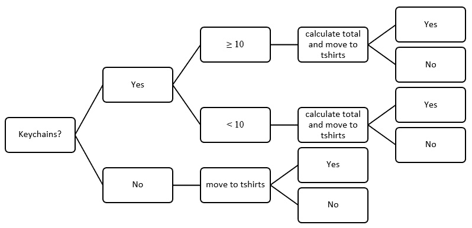
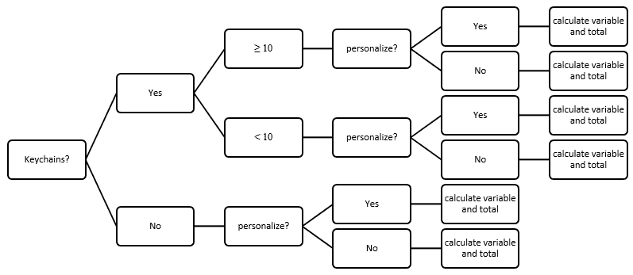
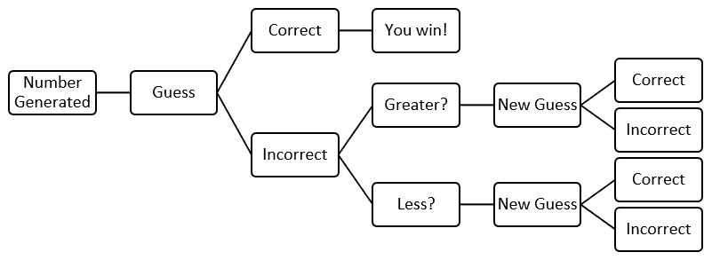

# 第五章：探索问题分析

在这一章中，我们将深入探讨问题分析，同时运用我们所学的一些知识，比如逻辑推理、布尔逻辑和算法设计。在这一章中，我们将通过问题定义、分解和分析来解决问题。

在本章中，我们将涵盖以下主题：

+   理解问题定义

+   学习分解问题

+   分析问题

为了进一步理解问题，我们需要看一个更复杂的问题，并定义它，以便开始算法设计过程。在本章中，您将学习如何定义问题并分解问题，以便设计算法。在这个过程中，您还将学习 Python 中的字典。阅读完本章后，您将能够使用计算思维过程来设计和创建解决复杂问题的算法。

# 技术要求

您需要最新版本的 Python 来运行本章的代码。您可以在此处找到本章使用的完整源代码：[`github.com/PacktPublishing/Applied-Computational-Thinking-with-Python/tree/master/Chapter05`](https://github.com/PacktPublishing/Applied-Computational-Thinking-with-Python/tree/master/Chapter05)

# 理解问题定义

正如我们在*第二章*中讨论的，*计算思维的要素*，计算思维使用四个要素来解决问题：

+   **问题分解**：这是将数据分解的过程。

+   **模式识别**：这是找到相似性或模式的过程。

+   **抽象**：这个元素处理泛化模式。

+   **算法设计**：这是我们为解决问题定义一组指令的地方。

在本节中，为了更多地了解如何分析问题，我们将分析一个更大的问题，并经过需要创建算法的步骤。为了能够创建算法，我们必须分析问题，并清楚地确定我们要解决什么问题。也就是说，*我们的算法是为了什么？* *为什么我们需要构建它？* 查看问题的分解，然后定义我们需要的东西，将在最后为我们提供更好的算法。

我们将在下一节中解决一个问题。

## 问题 5A – 创建一个在线商店

让我们来看看以下问题。您正在开设一家在线商店。它还处于起步阶段，但您将有三种不同类型的商品可供选择。它们是钥匙扣、水瓶和 T 恤。对于这个特定的问题，我们将经历一个三步过程：

1.  **做出假设**

1.  **需要考虑的事项**

1.  **构建字典**

我们将在接下来的部分中看到前面的步骤。

### 做出假设

让我陈述一些关于我们将要使用的这家商店的假设：

+   这是一家为客户提供商品的公司，供客户与他们的客户分享。

+   每个项目都可以有标志和/或个性化信息，比如姓名、电子邮件和电话号码。

现在我们将进入下一节，讨论需要考虑的事项。

### 需要考虑的事项

现在让我们在开始制定算法之前，看看您需要考虑的一些事项：

+   *商品是否个性化？*

+   *个性化是否按字符、行或项目收费？*

+   *价格是固定的，还是当客户批量购买时会发生变化？*

+   *如果客户订购多种类型的商品，是否会有折扣？*

+   *每个项目的基准价格是多少？*

前面的观点并不是我们可以讨论的唯一问题。但当我们分解问题时，这些是我们将开始研究的问题。

在那之前，让我们讨论一下如何在程序中为每个项目包含信息。如果你还记得[*第三章*]（B15413_03_Final_SK_ePub.xhtml#_idTextAnchor056），*理解算法和算法思维*，我们可以使用**Python**中的字典来保存我们的商品菜单。在这种情况下，我们有钥匙扣、水瓶和 T 恤。

### 建立一个字典

在我们看这个问题所提出的复杂性并分解信息之前，我们可以建立自己的字典。我们可以使字典中每个项目的价格都是基础价格（不包含任何定制或折扣的价格），如下所示：

+   每个钥匙扣的成本：$0.75

+   T 恤成本：$8.50

+   每个水瓶的成本：$10.00

现在让我们建立字典。记住，你可以在没有字典的情况下做到这一点，但是创建一个字典可以让你在以后有必要时更新定价。你也可以创建函数来解决这个问题。我们正在使用逻辑和字典来解决这个问题。以下代码向你展示了如何建立一个字典：

ch5_storeDictionary.py

[PRE0]

从前面的代码片段中，请记住这里不需要`print()`函数，但我经常使用它来确保代码在我继续构建算法的同时能正常工作。还要注意变量的名称——`keychain`、`tshirt`和`bottle`——都是简化的。

这是输出的样子：

[PRE1]

输出显示给我的是每个变量的价格都被正确保存了。我使用`print`函数来测试我的字典，并确保它在我开始从字典中获取所需内容之前能够正确运行。

这有助于我们在编写代码时重复使用变量。拥有这些简单易识别的变量将允许我们在不添加错误的情况下更改和添加算法。

在本节中，我们了解到问题分析和定义帮助我们确定如何最好地设计我们的解决方案。记住，当我们面对问题时，我们在编写算法之前和算法中使用的定义对于我们的设计和最终产品至关重要。现在让我们来看看问题的分解。

# 学习分解问题

当我们分解问题时，我们正在确定算法需要为我们提供什么。最终用户需要看到一些无缝的东西。看看*图 5.1*中的流程图；这是一个基本的决策流程图，帮助我们设计我们的算法。

首先让我们做另一个假设，即，如果用户输入超过 10，价格将会更低。在这种情况下，我们只会做少于 10 或大于或等于 10。然而，如果你需要进一步细分，你可以添加更多情况，比如以下情况：

+   少于或等于 10

+   超过 10 但小于或等于 50

+   50 或更多

你可以有尽可能多的情况。对于这个算法，我们将保持两种情况，因为我们还必须包括个性化成本，我们不想创建一个过于复杂的算法。

下图向你展示了算法的流程图：

图 5.1 – 初始决策流程图

正如你在前面的图表中所看到的，这不是一个完成的流程图。在我们做出关于 T 恤的决定之后，我们需要转向瓶子。我们如何编写算法将取决于我们想要输出什么。现在，我们提供给用户的是当他们结账离开你创建的在线商店时会得到的信息。

在下一节中，让我们使用前面的流程图来创建一个算法。

## 将流程图转换为算法

*图 5.1*中的图表使我们能够查看我们正在编写的算法的决策过程。在编写算法时，我们将要关注以下关键点：

+   **字典和输入**：输入可以在算法内部或由用户输入；字典是在算法内部构建的。这意味着，要使用字典，我们必须在算法中定义它，然后才能使用它。

+   **成本**：这是每件物品的基本成本。

+   **个性化成本**：这是添加到基本成本中的成本。

我们现在将在接下来的部分详细查看前面的要点。

### 构建字典并提供输入

在添加任何复杂性之前，让我们看看如何获取每件物品的价格并将其用作基本价格。我们需要计算每种物品的数量。以下代码向您展示了这一点：

ch5_storeQuantities.py

[PRE2]

从前面的代码片段中可以看到，我们在字典下添加了变量。这将在以后很有用。这些变量被命名为`choicekey`、`choicetshirt`和`choicebottle`。命名变量使我们能够返回并根据需要更改代码。在这种情况下，每个变量都要求从运行程序的人那里获取输入，以获取他们订购的钥匙扣、T 恤和水瓶的数量。再次强调，解决这个问题有多种方法，但我们正在利用到目前为止学到的知识来创建一个算法解决方案。

当我们对`3`个钥匙扣、`0`件 T 恤和`10`个水瓶运行前面的代码时，这是我们的输出：

[PRE3]

正如您所看到的，我们有一个接受用户输入的程序，然后向用户确认他们为每件物品所做的选择。

让我们看看关于成本的下一节。

### 对成本进行更改

现在让我们添加成本的变化。假设如果顾客购买超过 10 件物品，那么更新后的成本如下：

+   钥匙扣：$0.65

+   T 恤：$8.00

+   水瓶：$8.75

为了进行前述更改，我们可以让程序更新成本差异，如下所示：

ch5_storeCost.py

[PRE4]

现在我们已经更新了代码，我想打印出我的进展，以确保代码正常工作并进行更改。在这种情况下，我想确保如果总数大于 10，成本会更新。(也就是说，当顾客订购超过 10 件物品时，它会将每件物品的成本更新为更低的成本。)前面代码的输出如下：

[PRE5]

您现在可以从前面的输出中看到，字典已根据用户提供的总数进行了更新。

现在我们需要继续并提供成本。我们可以提供总物品成本或整个购买的总成本，或两者（让我们两者都做）。看一下以下代码片段：

ch5_storeTotals.py

[PRE6]

前面的代码片段被添加，以便我们可以有一个`print`语句来确认用户的输入。通过在代码末尾打印该语句，我们正在与用户核对程序是否能正确读取数字，以及用户是否输入了正确的数字。

我们可以继续编写代码以添加每件物品的成本：

ch5_storeTotals.py

[PRE7]

在前面的代码片段的末尾的`print`语句提供了每件物品的总成本以及整个订单的总成本的细目。在询问所有物品的输入后，代码然后打印每件物品成本的小计。前面代码的结果如下：

[PRE8]

现在我们已经有了没有个性化的物品总数，我们需要考虑如果订购了个性化，需要考虑个性化的成本。

在下一节中，让我们看看个性化成本是多少，以及在继续之前我们需要做出的决定。

### 添加个性化

目前，让我们将钥匙扣、T 恤和水瓶的个性化限制为二进制问题，即用户要么想要个性化，要么不想要。我们不考虑个性化的分层成本，这可能是您见过的。如果您想要添加分层，您需要做出更多决策，比如选择字体的成本，个性化的长度等等。目前我们不考虑这些，但随时可以添加到这段代码中以解决这些类型的自定义。让我们为个性化添加另一个假设：

+   1 美元的钥匙扣

+   T 恤 5 美元

+   水瓶 7.50 美元

我们需要创建前述条件，然后将它们实施到我们的变量中。让我们逐部分查看代码。以下文件包含我们将分解的每个部分。

回想一下，我们的算法首先要求输入购买物品的数量。以下代码片段获取用户输入，以便考虑个性化：

ch5_storePersonalize.py

[PRE9]

前面的代码片段询问用户关于个性化的二进制问题。在获取输入后，代码根据用户输入做出一些决策，并定义`keychain`、`tshirt`和`bottle`变量以及选择的总数。接下来的代码片段使用总数打印出每个购买物品的信息以及最终总数：

[PRE10]

从前面的代码中可以注意到，`keychain`、`tshirt`和`bottle`变量是在基于总数和个性化的自定义之后定义的。记住，在算法设计中，顺序很重要。如果我们在程序中较早地定位这些变量，随后的个性化等条件将不会影响这些变量。

因此，为了能够获得我们变量所需的一切，我们需要在定义一些影响它们的条件之后定义它们，比如自定义。看一下前面的代码，注意变量的定义位置。随时可以通过更改变量定义的位置来玩弄代码，看看最终结果是否会改变。

这是一个具有钥匙扣决策过程的视觉流程图：

图 5.2 - 钥匙扣决策流程

正如您从前面的图表中所看到的，这仅适用于**钥匙扣**。我们需要为另外两个变量重复这个过程。在图表中，您可以看到物品的决策过程。首先，用户指示购买的物品数量，然后指示他们是否会个性化。

根据每个答案，程序计算总数。例如，如果没有个性化，总数会在决策树中更早地计算出来。我们可以使用函数（如我之前提到的）重写这个程序，以简化一些过程。目前，我们专注于学习如何分解问题，分析条件，以及如何设计算法以考虑多个决策。记得完成其他物品的图表，以便在设计算法时决策过程更容易编码。

在本节中，我们学习了如何使用流程图创建算法。我们还学习了为我们的算法构建字典。

在我们继续之前，让我们看看分析问题的过程。在创建这个算法时，我们分解了问题。然而，在我们下一章之前，有一些问题分析的关键组成部分值得我们考虑。

# 分析问题

在分析问题时，有一些步骤可以帮助我们确保我们正在创建最佳算法：

+   清楚地阅读和理解问题。

+   确定解决方案的主要目的。

+   确定问题的约束。

+   确定决策流程。

+   建立可能解决问题的算法。

+   为问题确定最佳的算法工具。

+   经常测试算法片段。

+   验证算法是否提供了已确定问题的解决方案。

如果我们回到我们的问题，我们在整个章节中都经历了这个过程：

+   我们有一个有三种商品的在线商店。

+   商品成本取决于购买数量。

+   商品价格也取决于个性化定制。

+   我们创建了流程图来帮助我们确定决策过程以及如何编写代码。

+   我们通过代码行验证了我们的代码，这些代码行允许我们多次检查算法是否产生了正确的响应。

+   根据需要重新访问和重新排序代码片段。

+   我们验证了算法的输出是否符合我们所确定的问题。

前面的过程需要重复，也就是说，这不是一个线性过程。有时我们会编写一个算法，然后重新访问决策流程图，进行调整，然后再次处理算法。

在处理更大的问题时，分析我们的问题在多个*停止点*变得更加清晰。*我们应该在测试之前写上几百行代码吗？* 不！想象一下有 300 行代码，只在*第 20 行*发现一个错误，这个错误会一直传递到算法的其余部分。

在每个可能的进度点进行测试将使我们能够发现长期成本的小错误。记住，第一次几乎不可能编写完美的算法。我们都会犯错误，无论大小，所以继续测试和分析我们的进展非常重要。

在离开本章之前，让我们再看一个问题并再次经历这个过程。

## 问题 5B - 分析一个简单的游戏问题

你想设计一个猜数字游戏。用户必须猜一个随机数。

让我们从定义我们的问题开始，这种情况下是一个游戏。让我们确定已知信息：

+   计算机需要随机选择一个数字。

+   用户需要输入一个数字。

+   计算机将不得不检查用户输入是否与随机生成的数字匹配。

*现在，这还不够！如果我第一次猜不中，我会输吗？我有多少次机会？随机数是 1 到 10 之间还是 1 到 500 之间？* 在我们开始编码之前，我们需要做一些决定。让我们添加一些参数：

+   数字在 1 到 100 之间。

+   用户将有 5 次猜测的机会。

+   计算机会告诉用户答案是太高还是太低。

现在我们有了这些参数，我们可以创建一个决策流程图：

图 5.3 - 猜数字游戏的决策流程图

从前面的图表中可以看出，图表并不完整。这是因为我们将使用一些逻辑使过程重复 5 次。我们稍后会详细介绍。现在，请注意决策。首先，程序生成一个数字（但不会显示）。然后用户输入一个猜测，要么正确，要么错误。如果正确，用户就赢得了游戏。如果不正确，程序会告诉用户答案是太低还是太高，并要求新的猜测。然后过程将根据需要重复。现在，让我们编写算法。

首先，让我们生成随机数并让用户猜测。为随机生成的数字和用户输入添加`print()`函数，以便您可以看到信息是否正常工作。记住，我们以后会把它们拿掉，但是反复检查我们的代码作为问题分析过程的一部分非常重要。以下代码将执行相同的操作：

ch5_guess1.py

[PRE11]

你会注意到前面的代码中导入了`random`模块。我们还将其导入为`rand`。这只是为了节省时间和空间。在 Python 中，当你导入一个模块时，你可以给它重命名。`random`模块给了我们一个在我们选择的范围内生成数字的方法。

`rand.randint(1, 100)`代码行包括`1`和`100`。这些是随机数生成器的端点或限制。`rand`函数是指模块，如前所述，而*randint(a, b)*指的是*a*和*b*之间的随机整数（包括*a*和*b*）。

多次运行代码，看看计算机生成的数字每次都会发生变化。以下是三个测试案例：

+   以下是前面代码的测试案例 1：

[PRE12]

如你从前面的输出中看到的，`27`是计算机生成的随机数，而`10`是用户输入的数字。

+   以下是前面代码的测试案例 2 的结果：

[PRE13]

如你从前面代码的输出中看到的，`68`是`compnumber`变量的值，而用户（我）输入的数字是`65`。如此接近，但又如此遥远！

+   以下是测试案例 3 的输出：

[PRE14]

正如你从前面的输出中看到的，计算机选择了数字`50`，而用户输入了`23`。

对于我们游戏的最终版本，我们不会打印出计算机的数字。那是作弊！现在，我们只是在测试。

让我们再添加一个条件，即第一次猜测是否正确。为此，我们将必须验证`compnumber == usernumber`。在进入额外的重复和逻辑之前，我们将再次测试这一点，所以我们只需说如果是真的，那么你赢了；如果是假的，那么你输了：

ch5_guess2.py

[PRE15]

让我们说我在第一次尝试时失败了。但是我不会放弃，因为这可能需要 100 次或更多次。当你运行程序时，它看起来像这样：

[PRE16]

现在让我们谈谈重复一行代码。我们给用户 5 次猜测。*我们如何在 Python 中做到这一点？*

在 Python 中，我们可以使用`for`循环来迭代代码。我们知道我们有 5 次猜测，所以我们将使用类似`for number in range(5):`这样的东西来开始我们的逻辑，如下面的代码所示：

ch5_guess3.py

[PRE17]

从前面的代码中，*你注意到*`i`*变量了吗？*我们使用这个变量，这样用户就知道他们还剩下多少次猜测。所以如果我们有 5 次猜测，代码将从`i = 5`开始；然后，如果用户猜错了，它将使用`i = i - 1`这一行，提醒用户他们现在还剩下 4 次猜测，依此类推。看看我们运行该程序时会发生什么：

[PRE18]

现在，我们并不是真的很公平。如前所述，我们希望每次用户尝试猜测时都给出一个提示。现在我们有了检查它们是否相等的条件，我们可以添加一个`elif`条件来检查它是大还是小。下面的代码显示了这一点：

ch5_guess4.py

[PRE19]

前面的代码现在为用户提供了一些反馈。如果数字大于计算机生成的数字，用户会收到反馈`'你的数字太大了！'`，如果用户的数字小于计算机生成的数字，那么他们会收到反馈`'你的数字太小了！'`。如果用户赢了，我们还使用了`exit()`代码。这是因为我们希望游戏在我们赢了时停止。

这给了我们一个战胜这个游戏的机会，看看现在的输出是什么样子：

[PRE20]

现在看看当我们输掉游戏时会发生什么：

[PRE21]

正如你所看到的，你得到了一个不同的最终消息。我承认我尝试了很多次才赢得了一场比赛，所以我才得到了下面的输出，但你可以看到第二次猜测是正确的游戏：

[PRE22]

我们将用最后一个算法来停止这个游戏。如果我们愿意，我们实际上可以让这个游戏变得更好，但它完成了我们需要它完成的工作。你可以考虑对你的游戏进行一些改变，如下所示：

+   添加一个选项，提醒用户已经猜过的数字。

+   增加一个选项，提醒用户忽略了先前的提示（所以如果用户给出一个太小的数字，然后给出一个更小的数字，电脑会提醒他们）。

我相信你可以尝试更多的定制。但现在，我们经历了那个问题，并遵循了我们在分析问题时应该考虑的要点：

1.  我们阅读并理解了问题。

1.  我们确定了目的——创建一个电脑玩家对用户玩家的猜数字游戏。

1.  我们确定了问题的约束条件——数字范围、猜测次数和提供提示。

1.  我们创建了一个决策流程图。

1.  我们编写并建立了解决问题的算法。

1.  我们看了如何创建一个简单的算法，可以迭代而不必为每个条件单独编写。

1.  我们在多个点测试了算法。

1.  我们验证了算法对于胜利和失败的运行是否准确。

在这里你看不到的是我在展示算法之前经历了多少错误。在写作过程中，我不得不使用前面的步骤来帮助我识别错误，检查最佳算法，并迭代程序。这是一个我们将继续使用的过程。

# 总结

在本章中，我们讨论了问题定义、分解和分析。我们使用问题来帮助我们经历识别问题、将其分解为相关部分和确定约束条件的过程，并分析我们的算法。我们使用流程图来帮助我们学习在设计算法时的决策过程以及如何组织思路。

我们学会了经常测试我们的算法。这为我们提供了识别错误的技能和理解，而不是等到我们有太多行代码时再等待。我们使用了一个在线商店和一个猜数字游戏来帮助我们了解 Python 中的一些功能。在整个过程中，我们使用布尔代码来验证输入，我们使用嵌套的`if`语句，我们学会了如何在解决所提出的问题时使用字典。

此外，我们有机会使用字典来处理使用用户输入和变量的算法。使用该算法使我们能够灵活定义一些变量，并在运行算法时或在算法内部编辑变量。

在下一章中，我们将深入探讨解决方案的过程和设计，更深入地研究更复杂的问题和 Python 语言。
