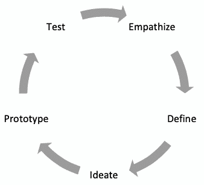
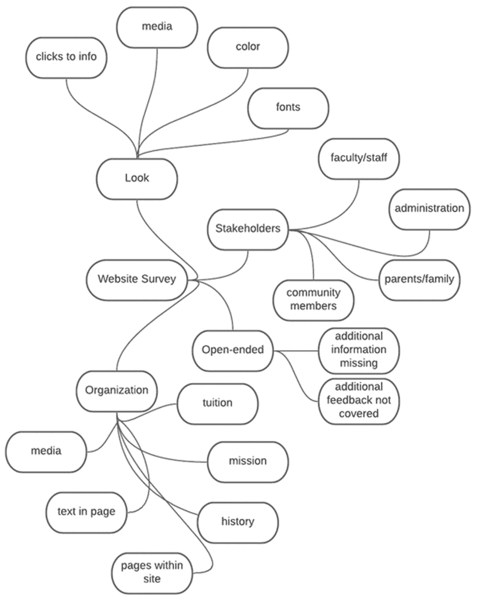
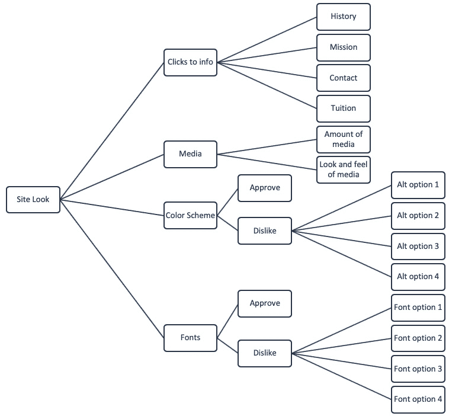
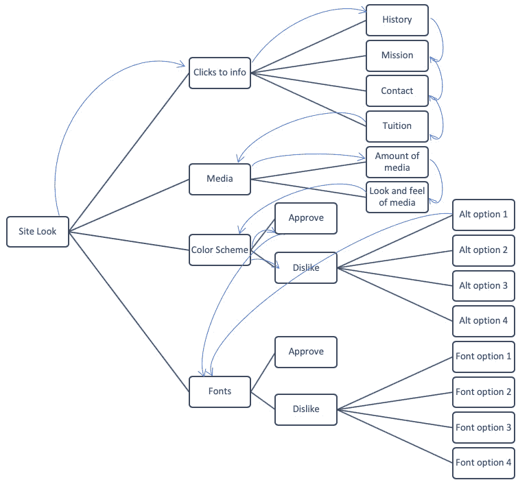
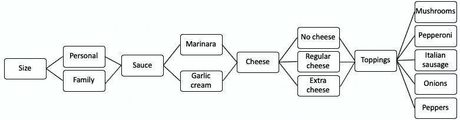
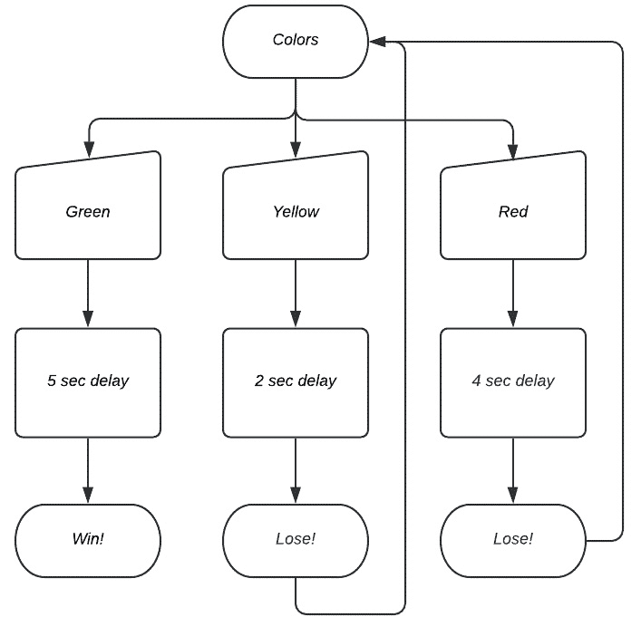

# *第六章*：设计解决方案和解决方案过程

在本章中，我们将使用先前学到的内容，如问题的分析和计算思维过程，来设计**解决方案**。我们将结合**逻辑处理**来创建决策过程的视觉表示，以指导我们的算法设计。讨论的视觉表示包括**图表**、**流程图**和其他有用的过程。在本章中，我们将学习解决方案设计的关键要素；如何创建、使用和应用图表来处理和设计解决方案；我们将看看如何将解决方案设计过程应用于各种问题。

在本章中，我们将涵盖以下主题：

+   设计解决方案

+   绘制解决方案

+   创建解决方案

为了进一步了解算法和解决方案设计，我们需要更仔细地研究问题的前端。我们将从深入讨论设计解决方案的过程开始。

# 技术要求

您将需要最新版本的 Python 来运行本章中的代码。您可以在此处找到本章中使用的完整源代码：[`github.com/PacktPublishing/Applied-Computational-Thinking-with-Python/tree/master/Chapter06`](https://github.com/PacktPublishing/Applied-Computational-Thinking-with-Python/tree/master/Chapter06)

# 设计解决方案

当我们设计解决方案时，我们经常使用**设计思维模型**，即使我们并不总是意识到。设计思维由不同的模型描述，但我们将看到最常见的五步模型。

与计算思维结合，设计思维过程可以帮助我们在开始绘制解决方案之前发展我们的想法。需要注意的是，我们不像在计算思维中那样线性地进行设计思维过程。想想计算思维的步骤：

+   问题分解

+   模式识别

+   抽象

+   算法设计

我们在之前的章节中定义了所有这些步骤，最近是在*第五章*的介绍中，*探索问题分析*。再次看到它们，我们知道在编写和设计算法时可以返回到分解。这就是我们所说的非线性过程。

设计思维模型也是如此。它是由斯坦福大学哈索-普拉特纳设计学院设计的。该模型的主要步骤包括以下内容：

+   **共情**：从受众或利益相关者的角度理解问题。

+   **定义**：确定目标、需要做出的决策、引入的任何偏见以及与问题相关的任何细节。

+   **构思**：进行头脑风暴，与我们将在本章的下一节中进行的图表化工作相呼应。

+   **原型**：设计算法解决方案并经常检查它。

+   **测试**：在整个过程中经常检查您的算法，并根据需要返回到以前的步骤。

正如您所看到的，我已经调整了设计思维模型，使其更符合计算思维过程。当我们使用这些模型并将它们结合在一起时，主要目标是将更难的问题分解为更简单的部分，以便我们可以设计和解决最佳算法。这并不取代计算思维。它只是提供了更好的想法，让我们了解如何处理这个过程。以下图表可以帮助演示这个过程可能如何工作：



图 6.1 - 设计思维模型

正如您所看到的，与最常见的线性模型不同，前面的模型将过程显示为*循环*。也就是说，回到*共情*可以发生在任何时候，因此在这些步骤之间来回移动是使用设计思维模型的最佳方式。

让我们看一个场景，在这个场景中，我们将设计思维与计算思维结合使用。

## 问题 1-营销调查

假设您正在与一家营销公司合作，他们要求您设计一份调查，以收集有关网站的反馈。以下是您可能要经历的一些步骤：

1.  **确定利益相关者**：这包括您将调查的人员以及调查后将使用信息的人员，例如。

1.  **确定问题**：这是您定义希望从调查中获得的信息的地方。

1.  **设计调查**：这不仅包括您确定的问题，还包括调查的美学外观。

1.  **信息收集**：这是您决定如何与将填写调查的人沟通的地方，例如电子邮件、网站上的链接或类似方式。

1.  **数据分析**：您可以编写 Python 算法来帮助您进行数据分析，包括根据收集的数据创建表格和图表。

1.  **数据共享**：这是您将计划向最初的利益相关者展示的可视化、报告和数据呈现的地方。

让我们明确一点：这是对过程的过度简化。但是假设您意识到需要为调查增加另一组。比如，最初只从学校的学生那里获得反馈，但后来意识到您想要增加教师和家长。那么，您将回到*步骤 1*，确定您的其他信息将受到哪些影响。您可能想要改变调查的外观，或者为成年人和儿童添加不同的调查。您可能需要添加只针对某一组的问题，这会影响您在调查算法中的决策。

现在让我们看看*设计思维*过程中的这些步骤。

对于我们的问题，确定利益相关者和问题是*设计思维*模型的*步骤 1*、*2*和*3*的一部分：*共情*、*定义*和*构思*。构建算法既是*原型*和*测试*的一部分，也是*步骤 4*和*5*。将人员添加到调查中会让我们回到*步骤 1-3*。循环重复，直到我们为我们的情景拥有一个可行的算法。在整个计算思维模型中，并使用其中的元素，您将使用嵌入其中的设计思维过程。这是决策过程的自然部分。

现在我们已经看过设计思维模型，让我们来看看如何使用图解解决方案来直观地表示决策过程。

# 图解解决方案

当我们设计算法时，我们经常使用图表和流程图来帮助我们分析过程，并直观地看到我们的决策是在哪里做出的。这些图表使我们能够创建更好的算法。您会记得，在*第五章*中，当我们正在建立一个商店时，我们创建了一个流程图(*图 5.1*和*图 5.2*)。

创建这些图表的过程因开发人员或编码人员而异。例如，我通常会为问题创建头脑风暴，然后从中制作流程图。为了了解这个过程，让我们回到本章前面的调查问题。看看以下头脑风暴。它并不完整，因为您可以添加许多子主题。这个头脑风暴假设我们正在调查利益相关者，以评估和分享对学校网站的反馈。



图 6.2 -头脑风暴图

从图表中可以看出，有许多考虑要做。实际的调查设计可能由我们作为程序员提供，或者我们可能参与设计调查。如果我们有了调查，我们的头脑风暴可能会有所不同，因为我们在问题中导航，并决定如何最好地将它们放置在算法中。这是共情过程的一部分。我们从多个角度、多个利益相关者的角度来看待我们的信息，并决定如何编写算法来帮助我们达到我们的目标。头脑风暴这样的非正式图表的目的是让我们在尝试创建更详细和有组织的流程图之前开始组织想法。当我们工作在图表上时，我们正在定义和构思我们的算法。这就是为什么在开始直接编码之前勾画出我们的计划是很重要的。

关于流程图，当我们讨论在 Python 中创建商店时，上一章中我们看到了一些流程图。现在让我们看一下基于一些决策的决策流程图。

重要的是要注意，从零开始创建调查可能是困难的。部分原因是可能有依赖于彼此的问题。例如，假设你要求用户说明他们是否赞成颜色选择。如果他们赞成，你可以继续。但如果他们不赞成，你可能想提供其他颜色方案供审查。这个问题只会出现在选择**否**选项的人身上。如果我们要处理头脑风暴的所有信息，我们的流程图可能会相当复杂，所以我们将专注于头脑风暴的*外观*类别中的一些问题。看一下下面的流程图：



图 6.3 - 调查的一个元素的流程图

从流程图中可以看出，有些事情并不清晰，比如完成一个问题后会发生什么，每个决定后你会去哪里等等。当我创建流程图时，有时会添加箭头来帮助我看到每个步骤之后会发生什么。下面的流程图显示了添加的一些箭头：



图 6.4 - 带箭头的流程图

从前面的流程图可以看出，并非所有箭头都被添加，但要仔细看**颜色方案**。如果用户同意颜色方案，那么他们直接进入**字体**部分。如果他们不同意，他们会被显示选项。假设一次只显示一个选项，那么用户在选择喜欢的选项后会进入**字体**部分。还可以添加提示，询问用户是否想再次查看选项，这会将他们带回**备选方案 1**。箭头可以被添加以显示这些细节。

这完全取决于作为开发人员和程序员的你自己最容易理解的方式。如果你是作家，把这些当作你的日记笔记。你组织想法的方式可能是个人的，只要确保你的最终结果和算法可以被意图使用的人轻松使用。

现在让我们看看如何将所有内容整合在一起，并为一些问题设计解决方案。

# 创建解决方案

当我们面对问题时，我们希望创建解决方案，解决我们所提供的信息，并提供一切所需并且易于用户理解的算法。在本节中，我们将利用本章学到的内容来设计解决问题的解决方案。

当我们使用我们的头脑风暴和流程图创建这些解决方案时，我们应该考虑以下内容：

+   *我们计划的解决方案是否解决了问题？*

+   *解决方案设计是否显示了算法成功的清晰路径？*

如果对这些问题的答案是“是”，那么我们可以开始编写解决方案。请记住，我们需要尽可能经常地测试算法。在编写算法时，请记住以下几点：

+   添加注释以标识您可能需要返回的部分，并清楚地帮助识别和定义您的变量、字典、函数和任何关键组件。

+   检查一下您是否有任何错误，比如*第五章**中讨论的那些错误*，探索问题分析。

+   尽可能经常运行您的程序以测试错误。

对于解决方案过程，我们将使用一个与本章早期工作的调查略有不同的问题。随着我们在本书中的学习，我们将解决您可以用于该问题的组件，比如添加图像、显示图形等。但是现在，让我们继续使用一些更基本的 Python 来练习创建解决方案的过程。

## 问题 2 - 比萨订单

我知道 - 食物。但这是演示逻辑和算法创建的最佳方式之一，所以请耐心等待。假设我们有一家比萨店。我们只卖一种类型的面团，因为我们是一种特色的地方。我们有两种不同尺寸的比萨：个人和家庭。有两种酱料选项：番茄酱和大蒜奶油。有三种奶酪选项：无奶酪、普通奶酪和额外奶酪。

选择的五种配料有：蘑菇、意大利辣香肠、洋葱和辣椒。不，我们的比萨店不会放橄榄。

让我们解决这个问题。我们希望有一个算法来捕捉用户选择的比萨订单选项。我们现在不考虑成本和订单中的其他项目，比如额外的比萨、饮料、甜点等。

这是我们知道的：

+   **尺寸**：个人或家庭

+   **酱料**：番茄酱或大蒜奶油

+   **奶酪**：无奶酪、普通奶酪、额外奶酪

+   **配料**：蘑菇、意大利辣香肠、洋葱、辣椒

现在我们有了这些，让我们看一下带有信息的流程图：



图 6.5 - 比萨店决策流程图

正如您所看到的，该图显示了这个特定问题的一个相当*线性决策过程*。我们还没有考虑的一件事是询问用户是否希望进行任何更改。这可能需要在每个步骤中发生。比如在选择奶酪时改变主意，改为选择番茄酱而不是大蒜奶油酱。您需要有一种方法可以返回，因此我们需要在创建算法时牢记这一点。

请记住，我们目前仅使用文本代码，因此我们现在将使用用户的数字和字母输入。但是，有办法将 Python 整合到更强大的算法中，这些算法包括图像、按钮等。

看一下算法中的以下代码片段：

ch6_pizzeria.py

```py
#Get input for your variables for size and sauce first. 
size_choice = str(input("Is this a personal or family pizza? Type personal or family. "))
sauce_choice = str(input("Which sauce would you like? Marinara or garlic cream? Type m for marinara and g for garlic cream. "))
if sauce_choice == "g":
    sauce = "garlic cream"
else:
    sauce = "marinara"
#The cheese choice will dictate a few more options. Define the variable first.                
cheese_choice = str(input("Would you like cheese on your pizza? Type y for yes and n for no. "))
```

请注意，在代码片段中，我们首先定义了尺寸和酱料。我在这里重申，有其他处理这个特定逻辑过程的方法。例如，我们可以将一些变量保存到字典中，并使用数组。目前，我们正在使用到目前为止学到的知识来创建我们的算法，但是在本书的后面，我们将有机会了解其他方法。

前面的代码片段有最终的奶酪选择。无论选择哪个选项，我们都需要对配料做出决定。这将需要发生两次，因为我们需要为“是”和“否”都需要。

看一下以下代码片段，这是前面代码的延续：

ch6_Pizzeria.py

```py
#Toppings need to happen whether or not you want cheese. 
if cheese_choice == "y":
    cheese2_choice = str(input("Would you like regular cheese or extra cheese? Type r for regular and e for extra cheese. "))
    if cheese2_choice == "r":
        cheese = "regular cheese"
    else:
        cheese = "extra cheese"
    toppings1_input = str(input("Would you like mushrooms on your pizza? Type y for yes and n for no. "))
    if toppings1_input == "y":
        toppings1 = "mushrooms"
    else:
        toppings1 = "no mushrooms"
else:
    cheese = "no cheese"    
if cheese_choice == "n":
    toppings1_input = str(input("Would you like mushrooms on your pizza? Type y for yes and n for no. "))
    if toppings1_input == "y":
        toppings1 = "mushrooms"
    else:
        toppings1 = "no mushrooms"
print("You want a " + size_choice + " pizza with " + sauce + " sauce, " + cheese + ", and " + toppings1 + ".")
```

正如您从代码片段中看到的，我们只使用了蘑菇。在选择家庭尺寸、大蒜酱、普通奶酪和蘑菇后，这个特定代码的输出如下：

```py
Is this a personal or family pizza? Type personal or family. family
Which sauce would you like? Marinara or garlic cream? Type m for marinara and g for garlic cream. g
Would you like cheese on your pizza? Type y for yes and n for no. y
Would you like regular cheese or extra cheese? Type r for regular and e for extra cheese. r
Would you like mushrooms on your pizza? Type y for yes and n for no. y
You want a family pizza with garlic cream sauce, regular cheese, and mushrooms.
```

使用提供的代码并查看输出，尝试组合其余四种配料的代码。我猜，如果您正在制作自己的比萨饼，欢迎您更改这里提供的选项。只需将橄榄留给自己。

现在，如前所述，我们可能需要返回并进行更改。让我们看一段为您做到这一点的代码片段：

ch6_Pizzeria2.py

```py
ready_end = str(input("Do you need to make any changes? Type y for yes and n for no. "))
if ready_end == "y":
    size_choice = str(input("Is this a personal or family pizza? Type personal or family. "))
    sauce_choice = str(input("Which sauce would you like? Marinara or garlic cream? Type m for marinara and g for garlic cream. "))
    if sauce_choice == "g":
        sauce = "garlic cream"
    else:
        sauce = "marinara"

    cheese_choice = str(input("Would you like cheese on your pizza? Type y for yes and n for no. "))
```

从代码片段中可以看出，需要对所需的更改进行决策。如果是，则再次提出问题。如果不是，则为用户打印选项。查看完整运行程序的以下输出：

```py
Is this a personal or family pizza? Type personal or family. family
Which sauce would you like? Marinara or garlic cream? Type m for marinara and g for garlic cream. g
Would you like cheese on your pizza? Type y for yes and n for no. n
Would you like mushrooms on your pizza? Type y for yes and n for no. y
Do you need to make any changes? Type y for yes and n for no. y
Is this a personal or family pizza? Type 1 for personal and 2 for family. family
Which sauce would you like? Marinara or garlic cream? Type m for marinara and g for garlic cream. m
Would you like cheese on your pizza? Type y for yes and n for no. n
Would you like mushrooms on your pizza? Type y for yes and n for no. y
You want a family pizza with marinara sauce, no cheese, and mushrooms.
```

如代码所示，问题被问了两次，因为我们在选项中做了更改。根据您想要问这个问题的频率，您需要继续重复部分代码。有简化的方法，我们将在 Python 语言程序章节（第八章，Python 简介）和后续章节中更深入地讨论这些选项。

在我们继续之前，让我们再看一个问题，重新经历一遍设计过程。

## 问题 3 - 延迟和 Python

我在 Python 中遇到的第一个问题之一是创建一个根据所选颜色而有不同反应的算法。这类似于如果您正在创建交通灯时会遇到的情况。每个灯的延迟都不同。所以让我们创建一个解决这个问题的算法。我们将使其成为用户选择的颜色，介于绿色、黄色和红色之间，只是为了保持交通灯的主题。因此，让我们做一些假设：

+   绿色将意味着 5 秒的延迟

+   黄色将意味着 2 秒的延迟

+   红色将意味着 4 秒的延迟

这些特定延迟没有特定的原因；我只是想让它们都在 5 秒以内。现在，假设我们正在玩一个游戏，用户必须选择一种颜色。如果他们选择黄色或红色，他们将会有延迟，然后会再次被问及。目标是从程序中获得“您赢了！您现在可以走了”的消息。因此，让我们为此创建一个流程图：



图 6.6 - 交通灯游戏的流程图

从流程图中可以看出，如果选择黄色或红色，游戏将重新开始。现在我们已经了解了游戏的基本情况，我们需要编写代码。

重要提示：

为了能够使用延迟，我们需要导入`time`库。使用代码`import time`来做到这一点。要包含延迟，我们使用代码`time.sleep()`。

让我们看一段代码片段：

ch6_sleep.py

```py
import time
print("Let's play a game. Choose a color to learn your destiny. Choose wisely or you'll have to start over. ")
i = 0
while i < 4:
    color = str(input("Choose a color: red, green, or yellow. "))
    if color == "green":
        print("You must wait 5 seconds to learn your fate.")
        time.sleep(5)
        print("You win! Excellent choice!")
        break
    elif color == "yellow":
        print("You must wait 2 seconds to learn your fate.")
        time.sleep(2)
        print("You lose! You must start over.")
        i = i + 1
    else:
        print("You must wait 4 seconds to learn your fate.")
        time.sleep(4)
        print("You lose! You must start over.")
        i = i + 1
```

如您所见，该算法包含了我们在之前章节中讨论循环、布尔语句等时看到的一些代码。如果用户没有赢得游戏，这段特定代码将在三轮后返回到开头。我们使用`if-elif-else`语句来处理颜色情况。游戏进行三轮的输出如下：

```py
Let's play a game. Choose a color to learn your destiny. Choose wisely or you'll have to start over. 
Choose a color: red, green, or yellow. yellow
You must wait 2 seconds to learn your fate.
You lose! You must start over.
Choose a color: red, green, or yellow. red
You must wait 4 seconds to learn your fate.
You lose! You must start over.
Choose a color: red, green, or yellow. green
You must wait 5 seconds to learn your fate.
You win! Excellent choice!
```

从游戏输出中可以看出，所有三轮都已经玩过了。每个延迟都按照陈述发生，您需要自己测试，因为我无法用文本显示时间延迟。

制作流程图使得创建这个算法比我一开始读问题后立即编写代码更简单。在编写算法之前，习惯于详细阐述您需要的过程非常重要。设计解决方案可能是一个漫长而乏味的过程，但我们在开始时越有条理，我们的算法就会越好。

# 总结

在本章中，我们讨论了如何设计、绘制和创建解决问题的解决方案。我们讨论了设计思维的非线性过程，以了解如何最好地设计解决方案。设计思维模型是一个五步过程：**共情**，**定义**，**构思**，**原型**和**测试**。在计算思维过程中使用这个五步过程可以帮助我们避免许多问题和陷阱。

我们还创建了头脑风暴和流程图，以建立我们的算法决策过程来解决问题。

在下一章中，我们将利用我们对算法设计和解决方案设计的知识，来识别解决方案中的挑战并调试程序。
