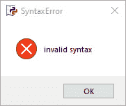
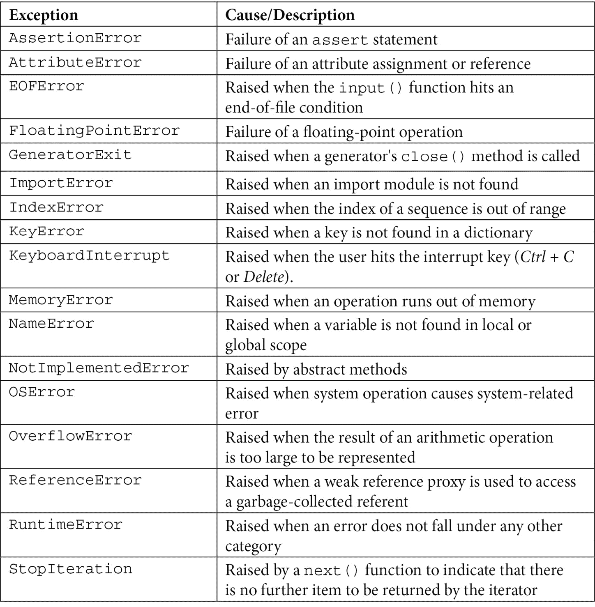
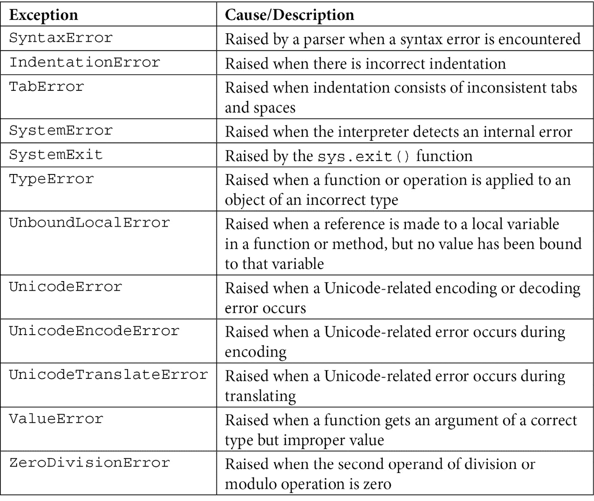

# *第七章*：识别解决方案中的挑战

在本章中，我们将评估算法和图表，同时学习如何避免一些常见错误，并确定是否可以对现有算法进行可能的调整以简化它。我们将根据问题描述评估解决方案，以验证解决方案是否与问题一致。我们将学习如何识别解决方案设计过程中的陷阱。值得注意的是，我们将在本书的*第二部分*，*应用 Python 和计算思维*，以及本书的*第三部分*，*使用计算思维和 Python 进行数据处理、分析和应用*中深入探讨本章的内容，进一步深入了解**Python**编程语言。

要了解调试，让我们提醒自己计算思维过程并不是线性的。即使我们从原始问题出发，有时我们会重新定义问题，或者需要根据算法所针对的人口变化或者我们想要调整算法设计来调整泛化。但有时，我们会在设计并使用算法后解决问题。根据我们的角色，我们将评估算法的错误、需要的更改等等。了解如何找到和分析错误可以帮助我们，无论我们是绝对的 Python 初学者还是在职业生涯中深入研究。

在本章中，您将学习如何识别和修复程序中的错误，以及如何避免算法设计中的陷阱。

在本章中，我们将涵盖以下主题：

+   识别算法设计中的错误

+   调试算法

+   比较解决方案

+   完善和重新定义解决方案

# 技术要求

您需要最新版本的 Python 来运行本章中的代码。您可以在此处找到本章中使用的完整源代码：[`github.com/PacktPublishing/Applied-Computational-Thinking-with-Python/tree/master/Chapter07`](https://github.com/PacktPublishing/Applied-Computational-Thinking-with-Python/tree/master/Chapter07)

# 识别算法设计中的错误

对于任何编码人员来说，算法中的错误都是生活中的一个事实。熟悉犯错是很重要的。正如在*第五章*中提到的，*探索问题分析*，以及*第六章*中提到的，*解决过程和设计*，测试算法并经常测试是一个好习惯。等到完成了数百或数千行代码才测试某些东西是灾难的预兆。是的，我曾经在复制一个游戏时根本没有测试。直到我复制了 4585 行代码。我当时很年轻。说实话，我从未找到我犯的错误。我重新开始，并在每个角落都开始测试。第二次成功了，但我浪费了数周时间复制一切（那是从一本书上复制的——当时还没有 GitHub），然后试图找出错误。所以请不要成为我。请测试您的算法。

现在，在进行调试和处理代码之前，让我们先看看在解决问题时可能遇到的错误。

在本节中，我们将重点关注以下两类广泛的错误：语法错误和逻辑错误。

## 语法错误

有时语法错误被称为解析错误。当我们忘记缩进、添加冒号、为字符串添加引号等等时，就会产生错误。让我们看看以下各种类型的语法错误。

### 使用冒号

在 Python 中，冒号用于分隔条件、创建循环等等。冒号是一种告诉算法下一步是这个特定代码块的方式。当我们在 Python 中引入冒号时，它会自动缩进我们代码的下一行。但如果我们忘记在需要的地方包括冒号，程序将无法成功运行。让我们看一个语法错误的例子：

```py
for i in range(1, 10)
    print(i)
```

如果我们运行这段代码，会得到一个错误消息，说*invalid syntax*。下面的截图显示了当我们尝试运行这个程序时出现的弹出窗口：



图 7.1 - 错误弹出窗口

如果我们从 Python shell 中运行这个程序，错误会如何显示：

```py
SyntaxError: invalid syntax
```

正如你所看到的，Python 程序会在我们的代码中包含错误时提醒我们。

请注意，在代码中`range`后面缺少一个冒号。现在，看一下以下代码中的修正语法：

ch7_syntaxerror1.py

```py
for i in range(1, 10):
    print(i)
```

当我们运行修正后的代码时，程序会运行并打印出数字 1 到 9，如下所示：

```py
1
2
3
4
5
6
7
8
9
```

你可能还记得`range`函数不包括上限端点。如果我们想打印数字 10，我们的范围需要是`range(1, 11)`。

现在，让我们看一看 Python 中使用的其他标点符号，可能会导致一些错误，即括号、嵌套括号和括号。

### 使用嵌套括号和括号

除了涉及冒号的语法错误外，还有嵌套括号的错误。我们必须始终检查每个开括号是否有闭括号。对于括号也是如此。让我们看一下下面的代码，其中包含括号错误：

```py
name = str(input('What is your name? ')
print(name)
```

正如你所看到的，名称定义中有两个开括号，但只有一个闭括号。当我们运行该程序时，Python 会报告一个无效的语法错误。当我们在 Python shell 或解释器中运行该程序时，会发生什么：

```py
SyntaxError: invalid syntax
```

现在这是没有错误的相同代码，注意我们甚至将`str()`去掉了，因为它是不需要的，这样简化了我们的代码，同时消除了错误。

ch7_syntaxerror2.py

```py
name = input('What is your name? ')
print(name)
```

现在当我们运行代码时，程序会要求输入名称，然后打印出来。输出如下所示：

```py
What is your name? Monique
Monique
```

正如你所看到的，程序现在可以正常运行了。

在[*第三章*]（B15413_03_Final_SK_ePub.xhtml#_idTextAnchor056）*理解算法和算法思维*中，我们使用字典创建了一个带有每个菜单项定价的菜单。字典包含括号，用于表示字典开始和结束的位置。让我们看一下几行代码：

```py
cars = {
    "Hyundai": "Kona",
    "Honda": "CR-V",
    "Toyota": "Camry"

print(cars)
```

如果我们看一下程序，字典缺少闭括号`}`，所以我们会得到一个语法错误，就像我们之前的例子一样。以下片段显示了已纠正的程序：

ch7_syntaxerror3.py

```py
cars = {
    "Hyundai": "Kona",
    "Honda": "CR-V",
    "Toyota": "Camry"
    }
print(cars)
```

正如你所看到的，一旦添加了括号，程序就会运行并打印出以下输出：

```py
{'Hyundai': 'Kona', 'Honda': 'CR-V', 'Toyota': 'Camry'}
```

字典中的每个条目都打印在一行中，用逗号分隔。在编写算法时，添加`print`语句是有帮助的，以确保我们没有任何错误。一旦测试过，我通常会删除不必要的打印函数，但在编写长算法并需要测试以避免问题时，它们确实很有用。

在 Python 编写算法时，还有许多其他错误。让我们再看看一些语法错误。

### 其他语法错误

在更长的程序中，可能会引入许多其他语法错误。例如，如果你看一下我们刚刚使用的字典，忘记逗号也会创建一个语法错误。通常，当我们尝试运行程序时，这些语法错误会很快被识别出来。Python 会突出显示缩进的位置或者括号缺失的地方。语法错误通常很容易识别，但还有许多其他类型的错误。

## 逻辑错误

在[*第四章*]（B15413_04_Final_SK_ePub.xhtml#_idTextAnchor071）*理解逻辑推理*中，我们讨论了可能遇到的逻辑错误：

+   在等式或语句中使用错误的变量

+   使用错误的运算符来测试条件

+   在检查条件时使用错误的缩进

现在我们将看一下逻辑中的其他错误，这些错误在 Python 中有特定的调用，以及每个错误代表什么。

逻辑错误也称为运行时错误。下表显示了 Python 中一些内置错误以及它们的表示：



表 7.1 - 异常和原因/描述表

如你所见，在 Python 中有许多不同类型的错误被标记为异常。你可以通过运行以下代码获取 Python 异常列表：

ch7_errors.py

```py
print(dir(locals()['__builtins__']))
```

当我们运行该代码时，输出提供了以下错误值：

```py
['ArithmeticError', 'AssertionError', 'AttributeError', 'BaseException', 'BlockingIOError', 'BrokenPipeError', 'BufferError', 'BytesWarning', 'ChildProcessError', 'ConnectionAbortedError', 'ConnectionError', 'ConnectionRefusedError', 'ConnectionResetError', 'DeprecationWarning', 'EOFError', 'Ellipsis', 'EnvironmentError', 'Exception', 'False', 'FileExistsError', 'FileNotFoundError', 'FloatingPointError', 'FutureWarning', 'GeneratorExit', 'IOError', 'ImportError', 'ImportWarning', 'IndentationError', 'IndexError', 'InterruptedError', 'IsADirectoryError', 'KeyError', 'KeyboardInterrupt', 'LookupError', 'MemoryError', 'ModuleNotFoundError', 'NameError', 'None', 'NotADirectoryError', 'NotImplemented', 'NotImplementedError', 'OSError', 'OverflowError', 'PendingDeprecationWarning', 'PermissionError', 'ProcessLookupError', 'RecursionError', 'ReferenceError', 'ResourceWarning', 'RuntimeError', 'RuntimeWarning', 'StopAsyncIteration', 'StopIteration', 'SyntaxError', 'SyntaxWarning', 'SystemError', 'SystemExit', 'TabError', 'TimeoutError', 'True', 'TypeError', 'UnboundLocalError', 'UnicodeDecodeError', 'UnicodeEncodeError', 'UnicodeError', 'UnicodeTranslateError', 'UnicodeWarning', 'UserWarning', 'ValueError', 'Warning', 'ZeroDivisionError', '__build_class__', '__debug__', '__doc__', '__import__', '__loader__', '__name__', '__package__', '__spec__', 'abs', 'all', 'any', 'ascii', 'bin', 'bool', 'breakpoint', 'bytearray', 'bytes', 'callable', 'chr', 'classmethod', 'compile', 'complex', 'copyright', 'credits', 'delattr', 'dict', 'dir', 'divmod', 'enumerate', 'eval', 'exec', 'exit', 'filter', 'float', 'format', 'frozenset', 'getattr', 'globals', 'hasattr', 'hash', 'help', 'hex', 'id', 'input', 'int', 'isinstance', 'issubclass', 'iter', 'len', 'license', 'list', 'locals', 'map', 'max', 'memoryview', 'min', 'next', 'object', 'oct', 'open', 'ord', 'pow', 'print', 'property', 'quit', 'range', 'repr', 'reversed', 'round', 'set', 'setattr', 'slice', 'sorted', 'staticmethod', 'str', 'sum', 'super', 'tuple', 'type', 'vars', 'zip']
```

如前所述，这些是 Python 中的内置异常。有一种方法可以定义我们自己的异常，但在这本书中我们不会涉及到它们。

请注意，这些不是我们在编程时会遇到的唯一错误。我们可能会因为自己在计算中犯的错误而出现错误，就像我们在*第四章*中讨论的那样，*理解逻辑推理*。我们可能会在*布尔*逻辑中引入错误。目标是尽量避免这些错误，使我们的程序能够正常运行。记住，测试你的算法，并经常测试。

现在让我们看一些带有错误的算法，并尝试识别错误，以便我们可以纠正它们。

# 调试算法

在 Python 中，我们可以使用`breakpoint()`函数（内置的）运行调试器。我们可以将这段代码引入到我们的程序中，并在我们对代码不确定的地方插入它。添加`breakpoint()`将检查错误和 bug。当我们运行`breakpoint()`函数时，我们会得到一个`pdb`输出，代表**Python 调试器**。需要注意的是，这个内置函数出现在**Python 3.7**和更新版本中。**Python 3.6**和更早版本的先前调试器是`pdb.set_trace()`。

当我们运行调试器时，我们可以使用四个命令：

+   `c`：继续执行

+   `q`：退出调试器/执行

+   `n`：在函数内部执行下一行的步骤

+   `s`：在这个函数或被调用的**函数**中执行下一行的步骤

让我们看一下代码，并运行所列出的每个命令：

ch7_debugger.py

```py
number = 5
number2 = 'five'
print(number)
breakpoint()
print(number2)
```

看看这段代码，你可以看到`print(number)`后面的`breakpoint()`命令。代码将正常运行，直到达到`breakpoint()`命令。在这个阶段，执行停止。如果我们按下*c*键，那么它将继续运行程序。看看输出是什么样子。

请注意，在代码中有两个斜杠之间有三个点，`/…/`。这是因为路径可能会因计算机不同而不同。你的路径将包括程序所在的完整路径：

```py
5
> /Users/.../Python/ch7_debugger.py(8)<module>()
-> print(number2)
(Pdb) c
five
```

如你所见，它继续打印字符串`five`，因为它只是继续运行程序。现在让我们看看当我们运行`q`命令时的输出，它会退出程序：

```py
5
> /Users/.../Python/ch7_debugger.py(8)<module>()
-> print(number2)
(Pdb) q
Traceback (most recent call last):
  File "/Users/.../Python/ch7_debugger.py", line 8, in <module>
    print(number2)
  File "/Users/.../Python/ch7_debugger.py", line 8, in <module>
    print(number2)
bdb.BdbQuit
```

正如你所看到的，一旦我们使用`q`命令，由于程序退出，我们会得到一个**回溯错误**。它打印了`breakpoint()`代码上面的行，但没有打印第二个`print(number2)`命令。现在，让我们看看当我们输入`n`时会发生什么，它应该会带我们到下一行：

```py
5
> /Users/.../Python/ch7_debugger.py(8)<module>()
-> print(number2)
(Pdb) n
five
--Return--
> /Users/.../Python/ch7_debugger.py(8)<module>()->None
-> print(number2)
(Pdb)
```

如你所见，当我们输入`n`时，程序继续运行并打印第二个命令行。当这样做时，你可以看到`-> None`输出和运行的代码：`print(number2)`。最后，让我们看一下稍微改变的代码，看看在运行调试器时使用`s`会发生什么：

ch7_debugger2.py

```py
number = 5
number2 = 'five'
print(number)
breakpoint()
print(str(number) + number2)
```

当我们运行这个程序和调试器时，如果我们使用`s`，我们会得到以下输出：

```py
5
> /Users/.../Python/ch7_debugger2.py(8)<module>()
-> print(number + " " + number2)
(Pdb) s
TypeError: unsupported operand type(s) for +: 'int' and 'str'
> /Users/.../Python/ch7_debugger2.py(8)<module>()
-> print(number + " " + number2)
(Pdb)
```

如你所见，程序遇到了`TypeError`并提供了更多信息。我尝试将整数和字符串组合在一起。因此，我们需要修复代码以正确运行。在我这样做之前，让我们看看当我尝试使用`c`继续代码时会发生什么：

```py
5
> /Users/.../Python/ch7_debugger2.py(8)<module>()
-> print(number + " " + number2)
(Pdb) c
Traceback (most recent call last):
  File "/Users/.../Python/ch7_debugger2.py", line 8, in <module>
    print(number + " " + number2)
TypeError: unsupported operand type(s) for +: 'int' and 'str'
```

如你所见，我可以从两个命令中获得相同的信息，程序的响应略有不同。要解决这个问题，我必须将数字转换为字符串，在`print`行中可以使用以下代码来实现：

ch7_debugger3.py

```py
number = 5
number2 = 'five'
print(number)
breakpoint()
print(str(number) + " " + number2)
```

现在，我已经修复了代码，使得打印行中的项目都是字符串，当我使用`c`继续时，输出如下：

```py
5
> /Users/.../Python/ch7_debugger3.py(8)<module>()
-> print(str(number) + " " + number2)
(Pdb) c
5 five 
```

如你所见，程序现在打印了正确的信息，将数字作为字符串与`five`字符串组合在一起。双引号在它们之间添加了一个空格，我们以前已经见过，但当我们在*第八章*中查看 Python 基础知识时，将再次讨论。

现在，让我们看一下相同问题的一些解决方案，以便分析它们。

# 比较解决方案

当我们看问题时，我已经提到在 Python 中有多种方法可以做同样的事情。根据我们试图实现的目标，一些命令可能比我们的算法中的其他命令更好。让我们首先看一下一个问题的几种解决方案。

## 问题 1 - 打印偶数

你被要求编写一个算法，根据用户提供的范围打印偶数。也就是说，如果用户输入范围为 2 到 20，那么程序将打印 2, 4, 6, 8, 10, 12, 14, 16, 18 和 20。让我们假设如果端点是偶数，我们希望包括端点。

让我们看一下两种可能解决方案中的第一种。记住，一个解决方案可能不比另一个更好。很大程度上取决于你的完整算法的目标。*列表更合适吗？字典？函数？*当我们设计解决方案时，这些问题很重要。

### 算法解决方案 1 - 打印偶数

回想一下，我们将接受用户输入来创建一个给定范围内的偶数列表。看一下以下代码，它要求用户输入，然后打印出数字：

ch7_evenalgorithm1.py

```py
print("This program will print the even numbers for any range of numbers provided.")
endpoint1 = int(input("What is the lower endpoint of your range? "))
endpoint2 = int(input("What is the upper endpoint of your range? "))
endpoint2 = endpoint2 + 1
for i in range(endpoint1, endpoint2):
    if i % 2 == 0:
        print(i)

```

注意，`endpoint2`被转换为`endpoint2 + 1`。这是因为如果我们不添加`1`，那么如果它是一个偶数，上限端点将不会被包括在内。程序还以用户的打印消息开始，说明程序的功能是什么。

当我用端点`2`和`6`运行这个程序时，我得到以下输出：

```py
This program will print the even numbers for any range of numbers provided.
What is the lower endpoint of your range? 2
What is the upper endpoint of your range? 6
2
4
6
```

如你所见，两个端点都是偶数且包括在内。如果我们用端点`3`和`9`运行程序，我们得到以下输出：

```py
This program will print the even numbers for any range of numbers provided.
What is the lower endpoint of your range? 3
What is the upper endpoint of your range? 9
4
6
8
```

尽管终点现在在技术上是`10`，但范围的上限并不包括在内，因此在`10`以下的最大偶数是`8`。现在，我可以为一个更大的范围运行这个程序，但是范围越大，滚动以获取所有数字就越困难。因此，让我们看一种不同的方法来获取我们的偶数。

### 算法解决方案 2 - 打印偶数

正如我们从前面的例子中看到的，每个偶数都被打印到不同的行。让我们看看是否可以改变这一点，而是创建一个列表。Python 中的列表可以是空的。我们可以为它们使用任何名称，然后将它们等于括号内的项目或只是空括号。

例如，我可以创建一个名为`evenNumbers = []`的空列表。让我们看看以下算法中的情况：

ch7_evenalgorithm2.py

```py
print("This program will print the even numbers for any range of numbers provided.")
endpoint1 = int(input("What is the lower endpoint of your range? "))
endpoint2 = int(input("What is the upper endpoint of your range? "))
endpoint2 = endpoint2 + 1
evenNumbers = []
for i in range(endpoint1, endpoint2):
    if i % 2 == 0:
        evenNumbers.append(i)

print(evenNumbers)
```

你可以看到代码的前几行是相同的。在这个特定的代码中唯一的区别是数字的打印方式。列表是在`for`循环之前创建的。然后，使用`evenNumbers.append(i)`代码将每个数字附加到列表中。最后，我们打印我们的列表以获得以下输出：

```py
This program will print the even numbers for any range of numbers provided.
What is the lower endpoint of your range? 2
What is the upper endpoint of your range? 10
[2, 4, 6, 8, 10]
```

如你所见，所有偶数都包含在一个列表中，这比一个接一个地打印更容易阅读。*想象一下，如果你必须打印范围在 300-1,000 之间的偶数*。当我们运行程序时，列表会使阅读更容易。对于第二个算法，输出如下：

```py
This program will print the even numbers for any range of numbers provided.
What is the lower endpoint of your range? 300
What is the upper endpoint of your range? 1000
[300, 302, 304, 306, 308, 310, 312, 314, 316, 318, 320, 322, 324, 326, 328, 330, 332, 334, 336, 338, 340, 342, 344, 346, 348, 350, 352, 354, 356, 358, 360, 362, 364, 366, 368, 370, 372, 374, 376, 378, 380, 382, 384, 386, 388, 390, 392, 394, 396, 398, 400, 402, 404, 406, 408, 410, 412, 414, 416, 418, 420, 422, 424, 426, 428, 430, 432, 434, 436, 438, 440, 442, 444, 446, 448, 450, 452, 454, 456, 458, 460, 462, 464, 466, 468, 470, 472, 474, 476, 478, 480, 482, 484, 486, 488, 490, 492, 494, 496, 498, 500, 502, 504, 506, 508, 510, 512, 514, 516, 518, 520, 522, 524, 526, 528, 530, 532, 534, 536, 538, 540, 542, 544, 546, 548, 550, 552, 554, 556, 558, 560, 562, 564, 566, 568, 570, 572, 574, 576, 578, 580, 582, 584, 586, 588, 590, 592, 594, 596, 598, 600, 602, 604, 606, 608, 610, 612, 614, 616, 618, 620, 622, 624, 626, 628, 630, 632, 634, 636, 638, 640, 642, 644, 646, 648, 650, 652, 654, 656, 658, 660, 662, 664, 666, 668, 670, 672, 674, 676, 678, 680, 682, 684, 686, 688, 690, 692, 694, 696, 698, 700, 702, 704, 706, 708, 710, 712, 714, 716, 718, 720, 722, 724, 726, 728, 730, 732, 734, 736, 738, 740, 742, 744, 746, 748, 750, 752, 754, 756, 758, 760, 762, 764, 766, 768, 770, 772, 774, 776, 778, 780, 782, 784, 786, 788, 790, 792, 794, 796, 798, 800, 802, 804, 806, 808, 810, 812, 814, 816, 818, 820, 822, 824, 826, 828, 830, 832, 834, 836, 838, 840, 842, 844, 846, 848, 850, 852, 854, 856, 858, 860, 862, 864, 866, 868, 870, 872, 874, 876, 878, 880, 882, 884, 886, 888, 890, 892, 894, 896, 898, 900, 902, 904, 906, 908, 910, 912, 914, 916, 918, 920, 922, 924, 926, 928, 930, 932, 934, 936, 938, 940, 942, 944, 946, 948, 950, 952, 954, 956, 958, 960, 962, 964, 966, 968, 970, 972, 974, 976, 978, 980, 982, 984, 986, 988, 990, 992, 994, 996, 998, 1000]
```

我之所以只打印这一个而不是第一个算法，是因为第一个算法需要很多页，我们不想在这本书中浪费纸张。你可以看到其中一个比另一个更容易使用和更合适，因为更容易阅读更大的数字组。

这就是为什么我们需要审视我们所有的算法，并确定它们是否是表达我们所需的最佳方式。虽然有些算法可以工作，但它们可能不是最佳解决方案，有时这是可以接受的。但有时，进行一些更改，有时甚至是添加几行代码，就像我们在*算法 2*中所做的那样，可以显著改变我们的输出，并对我们更有帮助。

当我们比较这两个算法时，我们也在不断完善和重新定义我们的解决方案，这在下一节中我们会做更多。

# 精炼和重新定义解决方案

如果我们长时间观察算法，总是可以找到方法来完善和重新定义它们。想想我们手机上的应用有多少更新。总有人在玩弄这些应用，使它们更安全，增加游戏的关卡，更新艺术文件等等。作为程序员/编码人员，我们总是在努力让我们的工作变得更好。

我们将从一个算法开始这一节。以下程序打印出三只宠物的名字：

ch7_pets1.py

```py
cat = "Whiskers"
dog = "King Kong"
bird = "Pirate"
print("The cat's name is " + cat + ", the dog's name is " + dog + \
      ", and the bird's name is " + bird + ".")
```

这个简单的代码中包含了一切，所以这次没有用户输入。你可以看到在`print()`命令中的`dog +`后使用了`\`字符。这个反斜杠允许我们在下一行添加剩余的代码，这样我们可以更容易地阅读它。

代码的输出如下：

```py
The cat's name is Whiskers, the dog's name is King Kong, and the bird's name is Pirate.
```

正如你所看到的，这是一个简单的句子，带有宠物名字。

现在，假设我们有一只猫、一只狗和一只鸟，但它们的名字不一样。我们可以使用一个带有三个参数的函数。请记住，我们将在*第八章*中详细介绍函数的定义和信息，*Python 简介*。现在，让我们看看带有函数的算法。我们将函数命名为`myPets()`。看看以下算法：

ch7_pets2.py

```py
def myPets(cat, dog, bird):
    print("The cat's name is " + cat + ", the dog's name is " + dog +\
          ", and the bird's name is " + bird + ".")
myPets(cat = "Whiskers", dog = "King Kong", bird = "Pirate")
```

这个算法看起来与上一个非常相似，只是名字的定义在代码的最后一行。调用函数时，使用该行的信息来填写上面算法行中的定义的空白。输出看起来与上一个代码相同：

```py
The cat's name is Whiskers, the dog's name is King Kong, and the bird's name is Pirate.
```

现在，正如你所看到的，这只打印了一个函数，因为我们只提供了一个信息，但我们可以随时调用函数，使用任意数量的值。看看这个算法：

ch7_pets3.py

```py
def myPets(cat, dog, bird):
    print("The cat's name is " + cat + ", the dog's name is " + dog +\
          ", and the bird's name is " + bird + ".")
myPets(cat = "Whiskers", dog = "King Kong", bird = "Pirate")
myPets(cat = "Mimi", dog = "Jack", bird = "Peyo")
myPets(cat = "Softy", dog = "Leila", bird = "Oliver")
```

正如你所看到的，现在函数将被调用三次。我们只有一个`print()`命令，但是函数定义意味着每次调用函数时都会使用`print()`命令。看看输出是什么样子的：

```py
The cat's name is Whiskers, the dog's name is King Kong, and the bird's name is Pirate.
The cat's name is Mimi, the dog's name is Jack, and the bird's name is Peyo.
The cat's name is Softy, the dog's name is Leila, and the bird's name is Oliver.
```

请注意，当我们调用函数时，使用了三组宠物名字，打印了三个不同的句子。

当我们编写算法时，重要的是要考虑我们现在需要什么，以及我们将来可能需要什么。对于一个实例来说，使用第一个算法是可以的，但是如果我们想要为社区中的每个人或者教室中的每个学生运行算法，那么第二个算法更有帮助。重新定义我们的需求并完善我们的算法有助于改进我们从程序中得到的东西。

请注意，正如前面提到的，我们将在*第八章*中更多地讨论函数，*Python 简介*。我们将讨论的其中一件事是为未知数量的参数创建一个函数。*例如，如果我只有一只狗和一只鸟呢？*我们可以通过对算法进行一些更改来解决这个问题。我们很快就会研究这个问题。目前，我们只是稍微了解了为什么有时需要比较算法并重新定义和重新设计它们以更好地满足我们的需求。

# 摘要

在本章中，我们讨论了算法设计中的错误以及如何调试解决方案。我们还学习了如何比较解决方案，并在需要时对解决方案进行改进和重新设计。阅读完本章后，您应该更了解算法中的语法错误以及如何在**Python 3.7**及以上版本中使用`breakpoint()`命令来使用调试器。内置调试器为您提供了四种操作：`c` = *继续*，`q` = *退出*，`n` = *下一行*，`s` = *步进*。

使用调试器可以帮助我们确定代码中可能出错的地方。我们可以在代码的任何位置添加这行代码来确定问题所在。

我们还研究了提供相同输出但使用不同代码的算法。通过比较算法解决方案，我们可以确定哪些更有用，哪些更适合我们的问题或情况，以及为什么我们应该选择其中一个而不是另一个。请记住，算法是指令列表。在广泛使用算法的情况下，知道使用哪些指令至关重要。某些解决方案可能比其他解决方案更适合您的问题。考虑算法的目的、算法中的代码片段以及它们将如何在更大的算法中使用，并相应地做出决定。每个问题和每个解决方案都是独一无二的。

当我们完成本书的*第一部分*，*计算思维导论*时，我们已经了解了计算思维过程，始终关注可能的场景，以帮助我们理解该过程的有用性，如何进行头脑风暴并为决策创建流程图，以及如何设计我们的算法。在*第二部分*，*应用 Python 和计算思维*中，我们将更深入地研究 Python 语言，以便能够解决更复杂的问题，比如处理数据和函数的问题。我们还将更深入地了解 Python 编程语言，并将在后续章节中将这些知识应用于多种类型的问题。
