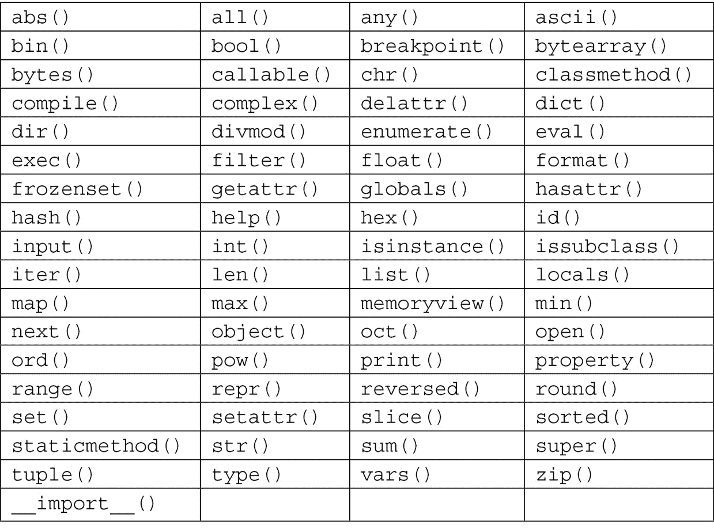

# *第八章*：Python 简介

在本章中，我们将学习 Python 的命令和功能，并将它们应用到问题中。当我们深入*第二部分*，*应用 Python 和计算思维*的第一章时，我们将使用更复杂的 Python 编程。在本章中，我们将更多地关注语言，而其余章节将侧重于应用。

在本章中，我们将涵盖以下主题：

+   介绍 Python

+   使用字典和列表

+   使用变量和函数

+   学习文件、数据和迭代

+   使用面向对象的编程

当我们深入研究 Python 编程语言时，请记住，一些内容已经在之前的章节中涵盖过，比如我们在研究计算思维过程时使用的字典和函数。本章将帮助您更轻松地找到满足您计算思维问题需求的 Python 命令的关键信息。

# 技术要求

您需要最新版本的 Python 来运行本章中的代码。您可以在此处找到本章中使用的完整源代码：[`github.com/PacktPublishing/Applied-Computational-Thinking-with-Python/tree/master/Chapter08`](https://github.com/PacktPublishing/Applied-Computational-Thinking-with-Python/tree/master/Chapter08)

# 介绍 Python

由于其易用性，Python 是增长最快的编程语言之一。Python 的吸引力之一是，我们可以用更少的代码行和更简单的语言和语法编写与 C、C++和 Java 等语言相同的程序。Python 的另一个吸引力在于它是**可扩展的**，这意味着我们可以为其添加功能和功能。

虽然并非所有功能都是内置的，但我们可以使用库来添加我们需要的功能。这些库可以下载并使用。例如，如果我们想要处理数据和数据科学，我们可以下载一些库，比如**Pandas**、**NumPy**、**Matplotlib**、**SciPy**、**Scikit Learn**等。但在我们深入研究这些库之前，让我们先了解一下 Python 语言的工作原理并学习其基础知识。

Python 具有一些内置的引用函数。下表按字母顺序列出了这些函数：



表 8.1 - Python 内置函数

虽然我们不会在本书中涵盖所有的函数，但在研究 Python 及其算法时，我们会使用其中一些函数。让我们从这里列出的一些数学函数开始。

## 数学内置函数

在 Python 中，一些数学函数已经内置，比如`abs()`、`eval()`、`max()`、`min()`和`sum()`函数。这些并非所有内置的数学函数，但我们将仔细研究这些特定函数，以了解 Python 如何处理它们。

`abs()`函数将帮助我们找到一个数的绝对值，无论是整数还是浮点数。请看下面的代码片段：

ch8_absFunction.py

```py
x = abs(-3.89)
print(x)
```

当我们运行这个程序时，我们将得到`–3.89`的绝对值。请记住，一个数的绝对值是它到 0 的距离。运行这个程序时，请看一下输出：

```py
3.89
```

由于绝对值始终是正数，当我们运行`abs(–3.89)`时，我们得到`3.89`。

另一个有用的数学函数是`eval()`函数。我们可以在这个函数中定义一个变量，然后调用 Python 来使用该值评估代数表达式。在 Python shell 中，我们可以首先定义变量如下：

```py
>>> p = 2
```

现在变量已经定义，我们可以用任何表达式调用`eval()`函数。例如，请看下面的输入和输出：

```py
>>> eval('2 * p - 1')
```

如您所见，Python 使用了先前定义的`p`值`2`，并替换然后评估表达式以产生这个输出：

```py
3
```

Python 程序也可以作为计算器使用，因此你可以像平常一样进行数学运算。以下是一些例子：

```py
>>> 10-8
```

如你所见，Python 知道将破折号视为减法，并产生数学表达式的结果：

```py
2
```

在下一个案例中，Python 将`+`解释为数学符号，并提供了求和表达式的结果：

```py
>>> 4+5
```

输出是：

```py
9
```

注意最后一个表达式`10**5`。在 Python 中，我们可以使用两个星号（`**`）表示指数：

```py
>>> 10**5
```

输出是：

```py
100000
```

现在，让我们看看`max()`函数。这个函数可以用在可迭代的列表上，但我们可以用只有两个数字的列表来测试它：

```py
>>> max(12, 30)
```

你可以清楚地看到输出是什么：

```py
30
```

让我们看另一个例子：

```py
>>> max(100, 10)
```

这是输出：

```py
100
```

从输出中可以看出，该函数总是选择最大的项。你可以添加第三个项，该函数仍然会选择最大值。这些内置函数在某种程度上很聪明，它们被编码为能够处理所提供的内容 - 例如两个或三个项 - 而无需明确告诉 Python 我们将引入多少项：

```py
>>> max(230, 812, 109)
```

获得的输出是：

```py
812
```

如你所见，我们不必向内置函数添加任何内容来找到三个值的最大值。

`min()`函数则相反；它选择最小值。看一下下面的最小函数：

```py
>>> min(230, 812, 109)
```

这是输出：

```py
109
```

如你所见，该函数使用了与最大函数相同的列表，但这次输出是`109`，这是该组数字的最小值。

还有其他数学函数，比如`sum()`。如果你是 Python 初学者，建议你尝试使用这些函数来了解它们的工作方式。这些函数将成为你算法的关键，因为你设计计算思维问题的解决方案。当我们研究其他 Python 功能时，比如字典和数组，我们也会使用其中一些函数。

# 使用字典和列表

在深入研究字典和列表之前，重要的是要注意 Python 的内置函数中不包含数组。我们可以使用列表，并对列表执行许多传统的数组函数。但是，对于数组的更强大功能，需要使用库，例如 NumPy。

Python 有四种集合数据类型，如下所示：

+   **列表**：有序且可更改；可以有重复项

+   **元组**：有序且不可更改；可以有重复项

+   **集合**：无序且无索引；不能有重复项

+   **字典**：无序、可更改和有索引；不能有重复项

如前所述，我们暂时不会涉及 NumPy 库或其他数据库。现在，我们将专注于字典和列表。

## 定义和使用字典

你可能还记得我们在*第三章*中使用了字典，*理解算法和算法思维*，当时我们创建了一个项目菜单。Python 中的字典是具有以下三个特征的集合：

+   它们是无序的。

+   它们是可更改的。

+   它们由键索引。

字典是以值对的形式组织的。例如，我们可以有一个包含州和它们的首府值对的字典。看一下下面的字典：

ch8_dictionary1.py

```py
states = {
    'Ohio':'Columbus',
    'Delaware':'Dover',
    'Pennsylvania':'Harrisburg',
    'Vermont':'Montpelier'
    }
print(states)
```

如果我们在没有条件的情况下将这个字典打印出来，我们会得到以下输出：

```py
{'Ohio': 'Columbus', 'Delaware': 'Dover', 'Pennsylvania': 'Harrisburg', 'Vermont': 'Montpelier'}
```

正如你所看到的，每个值对都一次打印出来。就像我们以这种方式构建了字典一样，Python 也有一个内置的`dict()`函数。可以使用该函数构建相同的字典，如下所示：

ch8_dictionary2.py

```py
states = dict([
    ('Ohio','Columbus'),
    ('Delaware','Dover'),
    ('Pennsylvania','Harrisburg'),
    ('Vermont','Montpelier')
])
print(states)
```

你可以看到，这两个例子中字典的构造方式非常相似，语法上有一些变化，比如第一个实例中使用冒号，而第二个实例中使用括号和逗号。然而，`print`语句产生了相同的结果。

据说字典是键值对，因为第一个项目是键，第二个配对项目是值。因此，对于`Ohio`和`Columbus`，`Ohio`是*键*，而`Columbus`是*值*。我们可以使用键来调用任何值。例如，我可以调用`states['Ohio']`，它应该返回`'Columbus'`。看一下代码：

```py
>>> states['Ohio']
```

这是输出：

```py
'Columbus'
```

我们可以为字典中的任何键值对做到这一点。但是，如果我们尝试调用字典中没有的键，比如`Alabama`，那么我们会得到以下错误：

```py
>>> states['Alabama']
```

这导致显示以下错误：

```py
Traceback (most recent call last):
  File "<pyshell#23>", line 1, in <module>
    states['Alabama']
KeyError: 'Alabama'
```

请注意，这会导致`KeyError`，在*第七章*的错误列表中提到，*在解决方案中识别挑战*，在*逻辑错误*部分。但是假设我们确实想要添加`Alabama`和首都`Montgomery`。我们可以使用以下代码来实现：

```py
>>> states['Alabama'] = 'Montgomery'
```

我们可以在输入以下代码后再次调用字典：

```py
>>> print(states)
```

这给了我们以下输出：

```py
{'Ohio': 'Columbus', 'Delaware': 'Dover', 'Pennsylvania': 'Harrisburg', 'Vermont': 'Montpelier', 'Alabama': 'Montgomery'}
```

请注意，字典在字典末尾添加了`'Alabama':'Montgomery'`键值对。

我们还可以使用`del`代码删除键值对，如下所示：

```py
>>> del states['Delaware']
```

现在，如果我们继续打印`states`字典，`Delaware`就不再在列表中了：

```py
>>> print(states)
```

删除州之后的输出：

```py
{'Ohio': 'Columbus', 'Pennsylvania': 'Harrisburg', 'Vermont': 'Montpelier', 'Alabama': 'Montgomery'}
```

现在，您可以继续添加项目或删除它们，而无需进入主算法。

使用字典，您还可以向一个键添加多个值。假设我玩三种运动（我没有）。我可以在字典中列出它们，并将它们与一个键值匹配。看一下以下算法：

ch8_dictionary3.py

```py
miscellaneous = {
    'sports' : ['tennis', 'bowling', 'golf'],
    'age' : '40',
    'home' : 'lake'
    }
```

我们可以使用`print(miscellaneous)`打印完整的字典，如下所示：

```py
>>> print(miscellaneous)
```

这就是我们得到输出的方式：

```py
{'sports': ['tennis', 'bowling', 'golf'], 'age': '40', 'home': 'lake'}
```

如您所见，打印的字典包括所有值。如果我只想打印运动项目，那么我可以使用`miscellaneous['sports']`代码：

```py
>>> miscellaneous['sports']
```

这是输出：

```py
['tennis', 'bowling', 'golf']
```

请注意，我们根本没有使用`print()`函数。我们使用了我们称之为`miscellaneous`的字典，并调用了`'sports'`键。请注意，我们之所以能够得到这个结果，是因为我们在 Python 的**IDLE**命令窗口中调用了字典。如果您想将其包含在您的算法中，您仍然需要使用`print()`函数。

虽然我们在这里不会详细介绍字典的所有功能，但您可以看到它们如何有助于创建包含键值对的算法。Python 允许我们添加和修改字典，调用值等，而无需访问整个字典来实现这一点。

接下来，让我们来看看列表。

## 定义和使用列表

Python 中的列表是有序且可更改的。我们可以为任何事物创建列表，比如动物的类型、颜色、水果、数字，或者真的任何我们想要的东西。由于我们可以有重复的值，我们可以有一个只说`apple, apple, apple`的三个苹果的列表。例如，看一下所示的列表：

ch8_list1.py

```py
fruits = ['apple','apple','apple']
print(fruits)
```

当我们打印这个列表时，所有项目都包括在内。输出如下：

```py
['apple', 'apple', 'apple']
```

正如您所看到的，我们有相同的值三次。我们无法在字典中做到这一点，因为字典不允许重复成员。

现在，让我们看看我们可以用列表做什么。让我们从以下动物列表开始：

ch8_list2.py

```py
animals = ['dog', 'cat', 'bird', 'lion', 'tiger', 'elephant']
```

列表中的第一项是`'dog'`。列表有索引，从 0 开始。因此，如果我们打印`animals[0]`，我们会得到`dog`。我们可以在这里检查：

```py
>>> print(animals[0])
```

这是索引 0 的输出：

```py
dog
```

列表中有六个项目，但最后一个索引是`[5]`。因此，要打印`elephant`，我们需要使用该索引进行打印：

```py
>>> print(animals[5])
elephant
```

您还可以在列表中使用负数索引。`[–1]`索引是指最后一个索引，因此它代表`elephant`，与索引`[5]`相同：

```py
>>> print(animals[-1])
elephant
```

`[–2]`索引是指倒数第二个索引，因此是`tiger`，以此类推。

我们还可以通过指定索引范围来打印列表中的多个项目。看一下以下代码：

```py
>>> print(animals[1:4])
```

这是输出：

```py
['cat', 'bird', 'lion']
```

如你所见，我们打印了列表中的第二个项目，对应索引`[1]`，以及接下来的两个项目。

使用列表，我们还可以添加项目，替换项目，删除项目，检查长度等等。要添加一个项目，我们需要使用`append()`方法。让我们把`duck`项目添加到我们的列表中：

```py
>>> animals.append('duck')
>>> print(animals)
```

这是添加的项目：

```py
['dog', 'cat', 'bird', 'lion', 'tiger', 'elephant', 'duck']
```

请注意，我们的列表现在在列表末尾有`duck`。但是假设我们想要移除`bird`并用`butterfly`替换它：

首先，我们必须确定`bird`的索引。该索引是`2`，因为它是列表中的第三个项目：

```py
>>> animals[2] = 'butterfly'
>>> print(animals)
```

这是输出，`bird`被替换了：

```py
['dog', 'cat', 'butterfly', 'lion', 'tiger', 'elephant', 'duck']
```

列表现在包含`butterfly`。

删除一个项目相当简单，我们只需使用`remove()`方法和我们想要删除的项目：

```py
>>> animals.remove('lion')
>>> print(animals)
```

如你所见，`lion`已经从列表中移除了：

```py
['dog', 'cat', 'butterfly', 'tiger', 'elephant', 'duck']
```

我们还可以通过索引使用`pop()`方法删除一个项目。使用索引`1`会移除列表中的第二个项目。参考以下代码：

```py
>>> animals.pop(1)
'cat'
```

然后，我们可以尝试以下操作：

```py
>>> print(animals)
['dog', 'butterfly', 'tiger', 'elephant', 'duck']
```

请注意，Python 识别了从列表中*弹出*的索引`1`处的项目。当我们再次打印列表时，该项目就不再存在了。如果我们想要移除最后一个项目，我们不必指定索引。参考以下代码：

```py
>>> animals.pop()
'duck'
```

然后，我们可以尝试以下操作：

```py
>>> print(animals)
['dog', 'butterfly', 'tiger', 'elephant']
```

如前所述，当没有指定索引时，列表上的最后一个项目会被*弹出*并从列表中移除。

还有一种方法可以从列表中删除一个项目，那就是使用`del`关键字：

```py
>>> del animals[1]
>>> print(animals)
```

这是输出：

```py
['dog', 'tiger', 'elephant']
```

我们的列表失去了列表中的第二个项目。我们还可以使用`del`关键字完全删除列表：

```py
>>> del animals
>>> print(animals)
```

这个错误是输出在这里：

```py
Traceback (most recent call last):
  File "<pyshell#49>", line 1, in <module>
    print(animals)
NameError: name 'animals' is not defined
```

如你所见，我不能再打印列表，因为它没有定义。请注意，我们收到了一个`NameError`描述`name 'animals' is not defined`。这是*第七章*中提到的另一个错误，*在解决方案中识别挑战*。

重要提示：

在接下来的几个代码示例中，我再次运行了`ch8_list2.py`文件中的原始代码，以获得我的原始列表。

我们可以使用`clear()`方法清空整个列表，而不是消除实际的列表。

```py
>>> animals.clear()
>>> print(animals)
```

这是我们得到的输出：

```py
[]
```

在这种情况下，列表现在打印为空列表，而不会给出错误消息。这是因为列表仍然存在并且已定义，只是空的。

现在，假设我想要知道我的列表的长度。我们可以使用`len()`来找到列表的长度。同样，我回到原始列表运行以下代码：

```py
>>> print(len(animals))
```

我们得到以下输出：

```py
6
```

我们的原始列表包含六个元素 - 也就是六种动物。

现在，让我们定义另一个包含颜色的列表：

ch8_list3.py

```py
animals = ['dog', 'cat', 'bird', 'lion', 'tiger', 'elephant']
colors = ['blue', 'red', 'yellow']
print(animals)
print(colors)
```

这个算法的输出是两个列表。现在，如果我们想要合并这两个列表，我们可以使用`extend()`方法。

让我们看看如何将`colors`附加到`animals`列表中：

```py
>>> animals.extend(colors)
>>> print(animals)
```

这是追加后的列表：

```py
['dog', 'cat', 'bird', 'lion', 'tiger', 'elephant', 'blue', 'red', 'yellow']
```

我们的列表现在包含了所有的动物和所有的颜色。我们也可以使用以下方法将`colors`与`animals`扩展。不同之处在于颜色会首先出现在我们的列表中：

```py
>>> colors.extend(animals)
>>> print(colors)
```

现在列表的样子是这样的：

```py
['blue', 'red', 'yellow', 'dog', 'cat', 'bird', 'lion', 'tiger', 'elephant']
```

我们还可以对列表进行排序，当我们想要有一个按字母顺序排列的列表或者想要对数字列表进行排序时，这是很有帮助的。看一下以下算法中的两个列表：

ch8_list4.py

```py
animals = ['dog', 'cat', 'bird', 'lion', 'tiger', 'elephant']
numbers = [4, 1, 5, 8, 2, 4]
print(animals)
print(numbers)
```

这是它们未排序时的样子：

```py
['dog', 'cat', 'bird', 'lion', 'tiger', 'elephant']
[4, 1, 5, 8, 2, 4]
```

让我们对两个列表进行排序，看看会发生什么：

```py
>>> numbers.sort()
>>> print(numbers)
```

我们将得到以下输出：

```py
[1, 2, 4, 4, 5, 8]
```

然后，我们可以尝试以下操作：

```py
>>> animals.sort()
>>> print(animals)
```

我们得到了这个输出：

```py
['bird', 'cat', 'dog', 'elephant', 'lion', 'tiger']
```

正如你所看到的，数字按从小到大的顺序排序，而动物按字母顺序排序。

让我们谈一下为什么这样很有帮助。想象一下，你的网站上显示了来自 Python 列表的项目列表。它们都被排序并完美地显示出来。但现在让我们说你想添加更多的项目。使用我们讨论过的方法，将它们以任何顺序添加到你的列表中会更容易，然后我们可以对它们进行排序，以便它们继续按字母顺序排列。

当然，这些不是我们可以用列表做的唯一的事情。Python 允许我们以许多用户友好的方式使用列表，并且与其他编程语言中的数组类似地进行操作。当我们需要以其他方式使用它们时，我们可以搜索包含这些功能的库。

在 Python 编程语言中，列表和字典都很重要。在本节中，你看到字典使用键值对，而列表包括值。两者都可以使用内置在 Python 编程语言中的方法和函数进行编辑。当我们将 Python 应用于更复杂的计算思维问题时，你将再次看到它们，这在本书的*第三部分*，*使用计算思维和 Python 进行数据处理、分析和应用*中。

现在，让我们看看如何在 Python 中使用变量和函数。

# 使用变量和函数

在 Python 中，我们使用变量来存储一个值。然后我们可以使用这个值来执行操作，评估表达式，或者在函数中使用它们。函数在算法中被调用时给出一系列指令。许多函数在其中包括变量。所以，让我们首先看看如何定义和使用变量，然后再看看 Python 函数。

## Python 中的变量

Python 没有声明变量的命令。我们可以通过给它们命名并将它们设置为我们想要的任何值来创建变量。让我们看一个包含多个变量的算法：

ch8_variables.py

```py
name = 'Marcus'
b = 10
country_1 = 'Greece'
print(name)
print(b)
print(country_1)
```

正如你所看到的，我们可以使用字母、更长的名称，甚至在变量命名中包括下划线。但是，我们不能以数字开头命名变量。当我们运行这个程序时，我们得到以下输出：

```py
Marcus
10
Greece
```

每个变量都被打印出来，没有任何问题。如果我们使用数字来开始任何变量名，我们会得到一个错误。但是，如果我将`country_1`变量命名为`_country`，那将是 Python 中一个可接受的变量名。

现在，让我们看看我们可以用变量做什么。

### 组合变量

变量允许我们做的一件事是在`print`语句中组合它们。例如，我可以创建一个打印`Marcus Greece`的`print`语句。为了做到这一点，我可以使用`+`字符，如下所示：

```py
>>> print(name + ' ' + country_1)
```

请注意，在两个`+`字符之间，有`' '`。这是为了添加一个空格，这样我们的`print`语句就不会看起来像`MarcusGreece`。现在，让我们在`print`语句中组合`b`和`name`：

```py
>>> print(b + name)
```

这将给我们一个错误消息：

```py
Traceback (most recent call last):
  File "<pyshell#70>", line 1, in <module>
    print(b + name)
TypeError: unsupported operand type(s) for +: 'int' and 'str'
```

请注意，错误说明了`TypeError: unsupported operand types for +`。它还说明了我们有`'int'`和`'str'`，这意味着我们正在组合两种不同的数据类型。

为了能够在`print`语句中组合这两种数据类型，我们可以将`int`（我们的`b`变量）转换为`str`。看起来是这样的：

```py
>>> print(str(b) + ' ' + name)
```

这很容易给我们想要的结果：

```py
10 Marcus
```

现在我们已经将它们都变成了字符串，我们可以在`print`函数中将它们组合起来。

有时，我们会想一次创建多个变量。Python 允许我们用一行代码来做到这一点：

ch8_variables2.py

```py
a, b, c, d = 'John', 'Mike', 'Jayden', 'George'
print(a)
print(b)
print(c)
print(d)
```

当我们运行这个算法时，我们得到以下输出：

```py
John
Mike
Jayden
George
```

正如你所看到的，当我们打印`a`变量时，等号右边的第一个值被打印出来。算法的第一行分配了四个不同的值给四个不同的变量。

现在让我们看看函数，因为我们需要它们来进一步讨论变量。

## 使用函数

在*第七章*，*在解决方案中识别挑战*中，我们编写了一个算法，打印出任何给定数字范围内的偶数。我们将通过定义一个函数来重新访问这个问题。让我们看一下偶数问题的算法：

ch8_evenNumbers.py

```py
def evenNumbers(i, j):
    a = i - 1
    b = j + 1
    for number in range(a, b):
        if number % 2 == 0:
            print(number)
            a = a + 1
```

如果我们在 Python 中运行此程序，将不会有输出；但是，我们现在可以为任何数字范围运行该函数。请注意，我们在此函数中添加了`a`和`b`变量。这样在程序运行时就会包括端点。

让我们看看当我们运行范围为`(2, 10)`和`(12, 25)`时会发生什么：

```py
>>> evenNumbers(2, 10)
```

输出如下：

```py
2
4
6
8
10
```

然后，我们可以尝试以下操作：

```py
>>> evenNumbers(12, 25)
```

输出如下：

```py
12
14
16
18
20
22
24
```

正如您所看到的，我们无需进入算法来调用函数，一旦我们运行了函数，我们就可以在 Python shell 中为任何范围调用它。与以前一样，如果我们的范围太大，shell 将显示一个非常长的数字列表。因此，我们可以定义另一个变量，这次是一个列表，并在函数内部将值附加到该列表：

ch8_evenNumbers2.py

```py
listEvens = []
def evenNumbers(i, j):
    a = i - 1
    b = j + 1
    for number in range(a, b):
        if number % 2 == 0:
            listEvens.append(number)
            a = a + 1
    print(listEvens)
```

请注意，我们在函数外定义了列表。我们可以以任何方式做。它可以存在于函数内部或外部。区别在于，即使未调用函数，列表也存在；也就是说，一旦运行算法，我可以调用列表，它将为空，或者调用函数，它将使用列表。如果在函数外部，它是全局变量。如果在内部，只有在调用函数时才存在。

让我们现在尝试运行范围为`(10, 50)`的程序：

```py
>>> evenNumbers(10, 50)
```

这是输出：

```py
[10, 12, 14, 16, 18, 20, 22, 24, 26, 28, 30, 32, 34, 36, 38, 40, 42, 44, 46, 48, 50]
```

正如您所看到的，`10`和`50`之间的偶数现在包括在列表中并打印出来。

让我们看另一个接受`(name)`字符串参数的函数的示例：

ch8_nameFunction.py

```py
def nameFunction(name):
    print('Hello ' + name)
```

一旦运行了这个算法，我们就可以为任何名称调用该函数。看一下：

```py
>>> nameFunction('Sofia')
```

我们得到以下输出：

```py
Hello Sofia
```

让我们输入另一个名称：

```py
>>> nameFunction('Katya')
```

我们将看到以下输出：

```py
Hello Katya
```

正如您所看到的，一旦在算法中定义了一个函数并运行了算法，我们可以根据需要调用该函数。

现在，我们在先前的偶数示例中使用了迭代，所以是时候更仔细地看看文件、数据和迭代了，让我们暂停一下并看看。当我们进行迭代时，我们将遇到更多的函数示例。

# 学习有关文件、数据和迭代的知识

在本节中，我们将看看如何处理文件、数据和迭代与 Python。这将为我们提供有关如何使用算法来打开、编辑和运行已存在的 Python 文件或新文件的信息。通过迭代，我们将学习如何根据某些条件重复代码行，限制算法的某个部分将运行多少次或在什么条件下运行。我们将首先从文件开始。

## 在 Python 中处理文件

在 Python 中，与文件相关的主要函数是`open()`函数。如果要在相同目录中打开文件，可以使用以下命令行：

```py
fOpen = open('filename.txt')
```

如果文件位于另一个位置，您需要找到文件的路径并在命令中包含该路径，如下所示：

```py
fOpen = open('C:/Documents/filename.txt')
```

除了打开文件之外，我们还可以告诉程序做一些其他事情。它们列在下面：

+   `r`：用于打开文件进行读取（这是默认值，因此不需要包含）；如果文件不存在，则创建新文件。

+   `w`：用于打开文件进行写入；如果文件不存在，则创建新文件。

+   `a`：用于打开文件以进行追加；如果文件不存在，则创建新文件。

+   `x`：用于创建指定的文件；如果文件已经存在，则返回错误。

除了列出的方法之外，还有两件事可以用于标识文件需要如何处理 - 即作为二进制还是文本：

+   `t`：文本（这是默认值，因此如果未指定，则默认为文本）

+   `b`: 二进制（用于二进制模式 - 例如图像）

看一下以下代码。由于这段代码是单行的，而且针对每个路径都是特定的，所以没有包含在存储库中：

```py
fOpen = open('filename.txt', 'rt')
```

前面的代码与先前的代码相同，`fOpen = open('filename.txt')`。由于`r`和`t`是默认值，不包括它们会导致算法的相同执行。

如果我们想要打开一个文件进行写入，我们可以使用`fOpen = open('filename.txt', 'w')`代码。在 Python 中关闭文件，我们使用`close()`代码。

文本文件的一些附加方法包括在以下列表中。这不是一个详尽的列表，但包含了一些最常用的方法：

+   `read()`: 可以用来读取文件的行；使用`read(3)`读取前 3 个数据。

+   `tell()`: 用于找到当前位置的字节数。

+   `seek()`: 将光标移动到原始/初始位置。

+   `readline()`: 读取文件的每一行。

+   `detach()`: 用于将底层二进制缓冲区与`TextIOBase`分离并返回它。

+   `readable()`: 如果可以读取文件流，则返回`True`。

+   `fileno()`: 用于返回文件的整数编号。

正如你所看到的，你可以使用 Python 来操纵并从文本文件中获取信息。例如，当向现有文本文件添加代码行时，这可能会很有用。现在，让我们来看看 Python 中的数据。

## Python 中的数据

在我们开始处理数据之前，让我们澄清一下，我们不是在讨论数据类型，这是我们在*第一章*中讨论的，*计算机科学基础*。在本章中，我们将主要以列表的形式查看数据和与数据交互的方式。

让我们看看我们可以用数据做些什么。

首先，从存储库中获取`ch8_survey.txt`文件。你将需要它用于下一个算法。

假设你让你的朋友们在蓝色、红色和黄色之间为一个团体标志进行选择。`ch8_survey.txt`文件包含了这些投票的结果。Python 允许我们操纵这些数据。例如，文件的第一行说`Payton – Blue`。我们可以使该行打印出`Payton 投票支持蓝色`。让我们看看算法：

ch8_surveyData.py

```py
with open("ch8_survey.txt") as file:
    for line in file:
        line = line.strip()
        divide = line.split(" - ")
        name = divide[0]
        color = divide[1]
        print(name + " voted for " + color)
```

让我们分解我们的代码，以了解发生了什么：

+   第一行打开了调查文件并保持打开状态。

+   下一行，`for line in file`，将遍历文件中的每一行执行以下命令。

+   然后算法将信息分割在破折号处。第一部分被定义为名字（`name = divide[0]`），第二部分被定义为颜色（`color = divide[1]`）。

+   最后，代码打印出了带有`投票支持`文本的行。

看一下以下输出：

```py
Payton voted for Blue
Johnny voted for Red
Maxi voted for Blue
Jacky voted for Red
Alicia voted for Blue
Jackson voted for Yellow
Percy voted for Yellow
```

正如你所看到的，现在每一行都经过调整，去掉了破折号，并包括了`投票支持`短语。但是如果你想要计算投票呢？我们也可以为此编写一个算法：

ch8_surveyData2.py

```py
print("The votes for Blue are in.")
blues = 0
with open("ch8_survey.txt") as file:
    for line in file:
        line = line.strip()
        name, color = line.split(' - ')
        if color == "Blue":
            blues = blues + 1
print(blues)
```

正如你所看到的，我们正在通过验证每一行并使用`if color == "Blue"`代码来计算投票。当我们运行这个算法时，我们得到以下输出：

```py
The votes for Blue are in.
3 
```

正如你所看到的，该算法打印出了初始的`print()`命令，然后打印出了`蓝色`的计数投票。

我们也可以处理数据，找出诸如均值、中位数和众数之类的东西，但现在我们不会详细讨论。如果将来我们在某个应用问题中需要它们，我们会使用它们。然而，大多数这些特定于数据的问题将使用库来简化一些算法和计算。

现在，让我们再谈一下迭代，我们一直在使用，但需要进一步定义以更好地理解其用法。

## 在算法中使用迭代

在我们进入迭代之前，让我们定义一下术语。**迭代**意味着重复。当我们在算法中使用迭代时，我们正在重复步骤。想想我们之前在问题中使用过的`for`循环，比如偶数问题——算法迭代了一系列数字。它对我们范围内的所有数字进行了重复。

让我们看另一个例子：

ch8_colorLoop.py

```py
colors = ['blue', 'green', 'red']
for color in colors:
    print(color)
```

该算法中的迭代是它将为原始颜色列表中的每种颜色重复执行`print`过程。

这是输出：

```py
blue
green
red
```

如你所见，每种颜色都被打印出来了。

我们还可以从用户那里获取输入，然后迭代执行一些操作。例如，看看以下算法：

ch8_whileAlgorithm.py

```py
ask = int(input("Please type a number less than 20\. "))
while ask > 0:
    print(ask * 2)
    ask = ask – 1
```

如你所见，我们将输入变量定义为`ask`。然后，只要`ask`大于`0`，我们就打印出加倍的数字并将数字减`1`。

输出如下：

```py
Please type a number less than 20\. 8
16
14
12
10
8
6
4
2
```

输出显示了通过将初始数字加倍而创建的列表，即*8* x *2 = 16*，然后继续直到`ask`变量不再大于`0`。

接下来，让我们看看如何可以迭代遍历多个列表。该算法使用两个列表，然后使用两者的信息打印出一个语句：

ch8_Iterations.py

```py
jewelry = ['ring', 'watch', 'necklace', 'earrings', 'bracelets'] 
colors = ['gold', 'silver', 'blue', 'red', 'black']
for j, c in zip(jewelry, colors):
    print("Type of jewelry: %s in %s color. " %(j, c))
```

当我们运行算法时，我们得到以下输出：

```py
Type of jewelry: ring in gold color. 
Type of jewelry: watch in silver color. 
Type of jewelry: necklace in blue color. 
Type of jewelry: earrings in red color. 
Type of jewelry: bracelets in black color.
```

看一下`print`语句：`print("Type of jewelry:` `%s` `in` `%s` `color."` `%(j,` `c))`。`%s`符号将分别被`(j,` `c)`的值替换。因此，第一个`%s`符号获取`j`的项目，第二个`%s`符号获取`c`的项目，其中`j`是来自珠宝列表的项目，`c`是来自颜色列表的颜色。

如你所见，我们可以以多种方式迭代列表。这只是一些示例，让我们熟悉循环和如何在我们的算法中使用信息。随着我们深入更复杂的问题，算法将变得更复杂，所以我们将重新讨论本章和之前章节中的许多主题。

在进入下一章之前，我们需要看一下**面向对象编程**（**OOP**）。

# 使用面向对象编程

面向对象编程是一种将数据结构化为对象的方法。Python 程序是一种面向对象的程序，它将算法结构化为对象，以便根据属性和行为对它们进行打包。要了解面向对象编程，我们需要知道如何做以下事情：

+   创建类

+   使用类创建对象

+   使用类继承来建模系统

在 Python 中，我们使用类来打包数据。要理解类，让我们创建一个：

```py
>>> class Books:
	pass
```

然后我们可以调用`Books()`类并获取类在计算机上保存的位置。请注意，我的输出将与您的不同，因为类将保存在不同的位置：

```py
>>> Books()
```

这是我的输出：

```py
<__main__.Books object at 0x000001DD27E09DD8>
```

现在我们已经创建了类，我们可以向类添加书籍对象：

```py
>>> a = Books()
>>> b = Books()
```

这些实例中的每一个都是`Books()`中的一个独特对象。如果我们要比较它们，由于它们是不同的，`a == b`将返回`False`。

现在，让我们看一个创建地址簿的类。通过创建类，我们可以根据需要添加条目：

ch8_addressBook.py

```py
class Entry:
    def __init__(self, firstName, lastName, phone):
        self.firstName = firstName
        self.lastName = lastName
        self.phone = phone
```

在这个算法中，我们创建了一个代表地址簿中条目的`Entry`类。一旦我们运行算法，我们就可以向地址簿添加条目并调用它们的信息。例如，看看以下代码：

```py
>>> Johnny = Entry('John', 'Smith', '201-444-5555')
```

这段代码将`Johnny`输入地址簿。现在，我们可以分别调用 Johnny 的名字、姓氏和电话号码，如下所示：

```py
>>> Johnny.firstName
```

这是我的输出：

```py
'John'
```

我们可以调用姓氏：

```py
>>> Johnny.lastName
```

这是获得的输出：

```py
'Smith'
```

我们还可以调用电话号码：

```py
>>> Johnny.phone
```

我们可以看到这个输出：

```py
'201-444-5555'
```

我们可以添加任意多的条目，然后根据需要调用它们：

```py
>>> max = Entry('Max', 'Minnow', '555-555-5555')
>>> emma = Entry('Emma', 'Dixon', '211-999-9999')
>>> emma.phone
```

这是我们的输出：

```py
'211-999-9999'
```

添加条目后，我们可以调用姓氏：

```py
>>> max.lastName
```

我们得到这个输出：

```py
'Minnow'
```

如你所见，我们添加了两个新条目，然后调用了 Emma 的电话号码和 Max 的姓氏。

一旦我们有了类，我们就可以有一个类继承其他类的方法和属性。因为这些类继承了属性和方法，原始类被称为**父类**，而新类被称为**子类**。

回到我们的地址簿，我们可以通过将类传递给新类来创建一个子类。我知道，这听起来很混乱，但看一下这个算法：

```py
>>> class Job(Entry):
	pass
```

现在我们也可以使用子类添加更多项目。看下面的例子：

```py
>>> engineer = Job('Justin', 'Jackson', '444-444-4444')
```

我们可以用类做更多的事情，但让我们尝试通过解决一个问题并设计一个算法，使用至少学到的一些组件来总结这一章。

# 问题 1 - 创建一个书库

假设你有很多书，想创建一个存储有关书籍信息的算法。你想记录每本书的标题、作者、出版日期和页数。为这种情况创建一个算法。

首先，让我们思考一下问题：

+   我拥有的书的数量不断变化，所以我希望创建一个可以根据需要添加信息的东西。

+   我也希望能够删除我不再拥有的书。

虽然我们可以使用库，但对于这个特定的问题，最好的解决方案是一个类。让我们从创建一个名为`Books`的类开始：

ch8_BookLibrary.py

```py
class Books:

    def __init__(self, title, author, pubDate, pages):
        self.title = title
        self.author = author
        self.pubDate = pubDate
        self.pages = pages
book1 = Books('The Fundamentals of Fashion Design', 'Sorger & Udale', '2006', '176')
book2 = Books('Projekt 1065: A Novel of World War II', 'Gratz', '2016', '309')
```

如您所见，我们已经定义了我们的类。该类有四个参数：`title`、`author`、`pubDate`和`pages`。在定义之后，添加了两本书。当我们运行这个程序时，实际上什么都不会发生，但我们可以调用任一本书的信息：

```py
>>> book1.title
```

我们将得到以下输出：

```py
'The Fundamentals of Fashion Design'
```

我们将调用`book2`的出版日期：

```py
>>> book2.pubDate
```

我们得到这个输出：

```py
'2016'
```

您可以看到，我现在可以在运行算法后调用每本书保存的任何元素。

现在，让我们看看如何在 Python shell 中添加第三本书：

```py
>>> book3 = Books('peanut butter dogs', 'Murray', '2017', '160')
```

由于书已经添加，我们也可以调用关于这本书的信息：

```py
>>> book3.title
```

我们得到这个输出：

```py
'peanut butter dogs'
```

我们可以调用`book3`的总页数：

```py
>>> book3.pages
```

我们将得到以下输出：

```py
'160'
```

如您所见，我们可以在算法中添加书籍到我们的类中，或者在 Python shell 中运行算法后添加书籍。现在，让我们看看另一个问题。

# 问题 2 - 组织信息

我们被要求创建一个算法，它接受三个数字作为输入，并提供这些数字的总和。我们可以用多种方法来做到这一点，但让我们看看如何使用`eval()`函数：

ch8_Sums.py

```py
a = int(input("Provide the first number to be added. "))
b = int(input("Please provide the second number to be added. "))
c = int(input("Provide the last number to be added. "))
print(eval('a + b + c'))
```

请注意，我们将每个输入变量定义为`int`类型。这样定义是为了正确执行评估。

这是我们算法的输出：

```py
Provide the first number to be added. 1
Please provide the second number to be added. 2
Provide the last number to be added. 3
6
```

如果我们忘记为每个数字添加类型，函数会将其评估为`123`，因为它只是将每个字符串添加到下一个字符串。所以，如果我们的输入是`John`、`Mary`、`Jack`，我们的输出将是`JohnMaryJack`。

我们之前没有涉及`sum()`函数。让我们看看如何使用该函数：

ch8_Sums2.py

```py
a = int(input("Provide the first number to be added. "))
b = int(input("Please provide the second number to be added. "))
c = int(input("Provide the last number to be added. "))
numbers = []
numbers.append(a)
numbers.append(b)
numbers.append(c)
print(sum(numbers))
```

在这种情况下使用`sum`需要我们将输入添加到列表中，因为`sum()`可以处理可迭代对象，比如列表。虽然这种解决方案代码更多，但输出与我们的`eval()`函数完全相同，如下所示：

```py
Provide the first number to be added. 1
Please provide the second number to be added. 2
Provide the last number to be added. 3
6
```

如您所见，我们使用不同的 Python 函数得到了与之前相同的答案。在我们继续下一章之前，让我们再看一个问题。

# 问题 3 - 循环和数学

对于这个问题，我们必须创建一个算法，打印出给定范围内所有数字的平方。记住，我们可以单独打印每个数字，但如果范围很大，最好我们有一个列表。我们还需要在范围内进行迭代，并且如果我们想要包括端点，我们必须将最大值加 1。

看一下以下算法：

ch8_SquareLoops.py

```py
print("This program will print the squares of the numbers in a given range of numbers.")
a = int(input("What is the minimum of your range? "))
b = int(input("What is the maximum of your range? "))
Numbers = []
b = b + 1
for i in range(a, b):
    j = i**2
    Numbers.append(j)
    i = i + 1
print(Numbers)
```

注意我们在算法中添加了一个`j`变量。我们没有使用`i = i**2`，因为那样会改变`i`的值，这会影响算法中的迭代。通过使用`j`，我们可以使用`i`来遍历给定的范围。让我们来看看我们的输出：

```py
This program will print the squares of the numbers in a given range of numbers.
What is the minimum of your range? 4
What is the maximum of your range? 14
[16, 25, 36, 49, 64, 81, 100, 121, 144, 169, 196]
```

该算法打印出我们提供范围的平方列表。它还有一个初始的`print`语句，解释了代码将要做的事情。

现在我们已经看了一些例子，让我们来看看父类和子类以及继承是如何工作的。

## 使用继承

在 Python 中，我们可以使用继承将方法和属性从一个类传递到另一个类。父类具有将被继承的方法和属性。子类继承自父类。父类是一个对象，子类也是一个对象，所以我们正在定义类的属性。

让我们看看如何使用一个科学例子。我们将创建一个名为`mammals`的类。并不是所有的哺乳动物都是胎生的。哺乳动物在产下活仔时是胎生的。不是胎生的哺乳动物是鸭嘴兽。鸭嘴兽产卵而不是产下活仔。如果我们要为此编写一个算法，我们希望动物继承父类的特征 - 在这种情况下是`mammals`。让我们看看下面的代码片段：

ch8_mammals.py

```py
class mammals:
     def description(self):
       print("Mammals are vertebrate animals.")

     def viviparous(self):
       print("Mammals are viviparous, but some are not.")

class monkey(mammals):
     def viviparous(self):
       print("Monkeys are viviparous.")

class platypus(mammals):
     def viviparous(self):
       print("The platypus is not viviparous. It's an egg-laying mammal.")

obj_mammals = mammals()
obj_monkey = monkey()
obj_platypus = platypus()

obj_mammals.description()
obj_mammals.viviparous()

obj_monkey.description()
obj_monkey.viviparous()

obj_platypus.description()
obj_platypus.viviparous()
```

从前面的代码中，注意到`mammals()`类使用了一个描述，然后是有关哺乳动物和胎生的信息。`monkey`使用了与`mammals`类相同的描述，但是包括了一个不同的胎生声明。`platypus`也是一样的情况。`monkey`和`platypus`类都是`mammals`类的子类。

这三个类，父类和两个子类，然后被简化为一个变量，以便通过调用该变量来使用。最后，算法打印出了父类和两个子类的描述和胎生声明。让我们来看看输出：

```py
Mammals are vertebrate animals.
Mammals are viviparous, but some are not.
Mammals are vertebrate animals.
Monkeys are viviparous.
Mammals are vertebrate animals.
The platypus is not viviparous. It's an egg-laying mammal.
```

正如你所看到的，所有三个类都使用了相同的描述。这是因为我们没有对子类的描述进行任何更改。当我们定义类时，我们只改变了想要与父类不同的部分。其他所有内容都是从父类继承而来的。

在 Python 中，父类和子类被广泛用于多种目的。例如，在游戏中，你可能会有一些具有相同特征的敌人。我们可以创建一个包含所有共同特征的父类，然后将所有敌人的个体特征作为子类进行更改，而不是分别定义每个敌人的所有特征。这只是继承可以使用的方式之一。还有许多其他用途，它可以帮助我们节省时间，并通过只用父类定义它们来避免错误。

现在我们已经有了一些类的经验，并学习了面向对象编程，让我们结束本章。

# 摘要

在本章中，我们讨论了 Python 编程的基础知识。我们研究了一些内置函数，使用了字典和列表，使用了变量和函数，学习了有关文件、数据和迭代的知识，并学习了类和面向对象编程。

正如我们在本章和解决以前的问题时提到的，Python 为我们提供了多种解决同一问题的方法。其中一个例子就是在本章的“问题 2 - 组织信息”部分提供的，我们在两种不同的算法中使用了`eval()`和`sum()`函数来产生相同的结果。随着我们继续学习 Python 以及如何编写我们的算法，选择使用哪些函数、变量、参数等将开始变得自然而然。本章中一些更具挑战性的概念和内容涉及数据分析，比如我们在介绍 Python 中的数据时使用的调查，以及类。在这些领域进行一些练习是很重要的，这样你就能更好地理解这些主题。

在这一章之后，你现在可以使用内置函数，区分列表、字典和类，并解决结合多个不同概念的问题，比如变量、迭代和列表。在下一章中，我们将更深入地研究输入和输出，以帮助我们设计算法。
