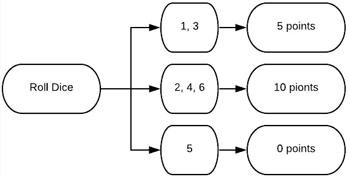
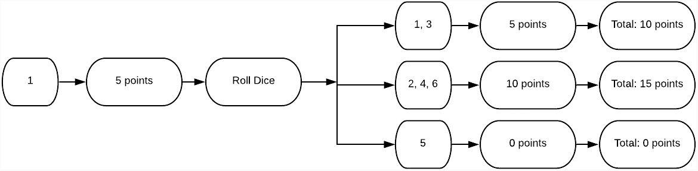
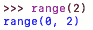
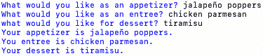

# 第十章：*第十章*：控制流

在本章中，我们将深入研究问题，并确定设计算法所需的输入和输出。在本章中，你将学习算法的阅读方式以及指令执行的顺序。你还将学习如何使用函数和循环来操纵算法中的控制流。

在本章中，我们将涵盖以下主题：

+   定义控制流及其工具

+   使用 if、for 和 range()以及其他控制流工具

+   使用循环和条件语句

+   重新审视函数

到本章结束时，我们将学习控制流是如何定义的，我们在计算思维中设计算法时如何使用`if`、`for`和`range()`功能，以及如何将这些功能纳入算法中的函数定义中。让我们先来看看什么是控制流。

# 技术要求

你需要最新版本的 Python 来运行本章中的代码。你可以在这里找到本章使用的完整源代码：[`github.com/PacktPublishing/Applied-Computational-Thinking-with-Python/tree/master/Chapter10`](https://github.com/PacktPublishing/Applied-Computational-Thinking-with-Python/tree/master/Chapter10)

# 定义控制流及其工具

简单地说，**控制流**是算法读取和执行指令、函数和语句的顺序。控制流意味着计算机会做出决定。想想看：当我走出大楼时，我要么用伞，要么不用伞。这取决于天气是否下雨（我是否记得带伞，我猜）。根据这个条件，我们做出决定。这个过程就是算法设计中的控制流程。

让我们看看 Python 编程语言中可用的一些控制流语句。

+   `当`

+   `如果`

+   `对于`

+   `范围()`

+   `中断`

+   `继续`

+   列表推导

+   `通过`语句

+   `尝试`语句

这些工具允许算法做一些事情，比如只要满足某个条件或一组条件，就可以运行，当条件发生时停止或中断，仅在一定范围内继续等等。让我们更仔细地看看其中一些工具。

# 使用 if、for 和 range()以及其他控制流语句

让我们从`if`语句开始，我们在*第四章*中首次讨论了这些内容，*理解逻辑推理*。这可能是算法设计中最常用和最知名的语句。你可能还记得在学习推理和证明时，在几何学中学习了**条件语句**。在那些课程中，你会以*如果-那么*的格式编写语句。接下来是一个例子：

*下雨时，我穿雨衣。*

这不是一个条件语句，至少现在不是。如果我们要将它写成条件句，那么我们就必须以*如果-那么*的格式来写，就像这个句子一样。看看接下来转换后的语句：

如果下雨，我就穿雨衣。

正如你所看到的，我们在日常生活中使用条件。我们只是没有指出它们。

在编写算法时，我们必须明确陈述算法需要做什么，所以我们必须明确陈述这些语句。在编程中，我们必须陈述每个条件。此外，如果我们有一系列需要满足的条件，有时我们需要*嵌套*这些语句。这最好通过一些例子来解释。让我们从如何使用嵌套语句开始。

## 使用嵌套 if 语句

即使在日常生活中，某些条件也取决于其他条件。例如，如果是星期一，我们就必须去上班。如果我们必须去上班而且下雨了，我们可能需要一把伞。但如果我们不去上班（假设我们呆在家里），我们就不需要检查是否需要伞。嵌套语句也是如此。我们使用它们来检查一个条件，然后是另一个条件，这是嵌套的。

假设我们正在玩一个掷骰子游戏。你掷骰子并得到如下分数：

+   2、4 或 6 = 10 分

+   1 或 3 = 5 分

+   5 = 0 分并清除所有之前的点数

每一轮，玩家都必须掷两次骰子。让我们看一个包含第一次掷骰子的流程图，如下所示：



图 10.1 - 第一次掷骰子得分的流程图

从流程图中可以看出，得分取决于掷出的数字。现在，假设你掷出了**1**。然后，让我们看看你的第二次掷骰子可能是什么样子，如下图所示：



图 10.2 - 在掷出 1 后进行第二次掷骰子的流程图

正如你所看到的，玩家有三种可能的总得分。为了将其转化为算法，我们需要做一些事情：

1.  定义掷骰子。

1.  根据掷出的数字确定得分。

1.  再掷一次。

1.  根据第二次掷骰子确定最终得分。

首先让我们定义那个点数。我们需要虚拟地掷骰子。这意味着我们需要程序在`1`和`6`之间选择一个数字。让我们看看我们如何编写代码。请记住，这只是包含在这个文件中的更大代码的一部分。我们将在随后的片段中使用第二个`ready`(`ready2`)：

ch10_rollDice.py

```py
import random as rand
print("Let's play a game. ")
print("You get 5 points for rolling 1 or 3\. You get 5 points for rolling 2, 4, or 6.")
print("You lose all points if you roll a 5 in either round.")
ready = input("Are you ready to begin? Type r to roll. ")
score = 0
if ready == 'r':
    roll = rand.randint(1, 6)
    print('You rolled a ' + str(roll) + '.')
    if (roll == 1) or (roll == 3):
        score = 5
    elif (roll == 5):
        score = 0
    else:
        score = 10
    ready2 = input('Your round 1 score is ' + str(score) + '. 
```

请注意，在上面的代码片段中，我们需要为这个特定的算法导入`random`库。将其导入为`rand`而不是`random`可以让我们缩短一些代码，从而减少输入。因此，我们使用`rand.randint()`而不是`random.randint()`。我们需要`random`库，因为我们希望能够访问*随机整数函数*，以便算法可以在`1`和`6`之间选择一个数字（包括两个端点）。让我们看看当前的输出：

```py
Let's play a game. 
You get 5 points for rolling 1 or 3\. You get 5 points for rolling 2, 4, or 6.
You lose all points if you roll a 5 in either round.
Are you ready to begin? Type r to roll. r
You rolled a 3.
Your round 1 score is 5\. 
```

从上面的输出中可以看出，首先提供了说明，然后一旦玩家按下`r`键选择掷骰子，游戏就会选择一个随机整数并显示出来。它还显示了第一轮后的当前得分。现在，让我们看看算法的下一部分，即进行第二次掷骰子。请注意，缩进遵循前面的代码片段。这个片段也包含在之前的较大文件中：

```py
ready2 = input('Your round 1 score is ' + str(score) + '. Type r to roll again. ')
    roll2 = rand.randint(1, 6)
    print('You rolled a ' + str(roll2) + '.')
    if (roll2 == 1) or (roll2 == 3):
        score += 5
    elif (roll2 == 5):
        score = 0
    else:
        score += 10
    print('Your final score is ' + str(score) + '.')
```

当我们运行新代码时，它会显示*第一轮得分*，两次掷骰子和游戏的最终得分。请记住，如果我们在第二轮中掷出`5`，我们将失去所有的点数：

```py
Let's play a game. 
You get 5 points for rolling 1 or 3\. You get 5 points for rolling 2, 4, or 6.
You lose all points if you roll a 5 in either round.
Are you ready to begin? Type r to roll. r
You rolled a 2.
Your round 1 score is 10\. Type r to roll again. r
You rolled a 6.
Your final score is 20.
```

正如你所看到的，程序为我们打印了一些内容。首先，我们掷出了`2`和`6`，所以我们没有失去我们的点数。其次，`2`和`6`都有 10 分，最终得分为 20 分。但让我们回顾一下嵌套的`if`语句。

要开始游戏，我们必须验证玩家是否准备好掷骰子。第一个`if`语句是必要的，以便继续进行其他决定。*我们可以在没有许可的情况下掷骰子吗？* 可以。但想想所有的游戏，包括传统棋盘游戏的应用版本。在这些应用中，玩家总是按下按钮或骰子来玩。这是一个类似的情况。

在我们说好准备掷骰子之后，就必须对点数做出决定。我们再次需要使用`if`、`elif`和`else`语句来循环遍历各种选项。现在，让我们看看何时可以使用`for`循环和`range`。

## 使用 for 循环和 range

我们需要首先讨论的是`for`循环中有时会对变量和`for`循环条件产生一些混淆。为了理解我的意思，让我们看一个例子：

ch10_forLoop1.py

```py
for letter in 'mountain':
    print(letter)
```

在上面的代码片段中，`letter`不是一个变量。它只是告诉 Python 我们想要迭代单词`mountain`中的每个字符。不过，我可以随便起名字。如果我写成下面这样，程序会做完全相同的事情：

```py
for pin in 'mountain':
    print(pin)
```

在每种情况下，使用`letter`、`pin`或者任何让我当时感到高兴的单词，程序的输出看起来像这样：

```py
m
o
u
n
t
a
i
n    
```

正如您所看到的，Python 迭代了单词`mountain`中的每个字母，并将其打印到控制台上。同样的事情也可以用范围内的数字来做。例如，如果我想打印出`1`到`10`的数字，我可以使用`for`循环，如下所示：

ch10_forLoop2.py

```py
for num in range(1, 11):
    print(num)
```

*等等，我说我想要 1 到 10 的数字，为什么范围函数中有 11 呢？*那是因为`range()`函数总是包括范围内的最小值，但不包括上限。因此，我们需要在我们的顶部数字上加`1`。让我们看看这个程序的输出是什么样子的：

```py
1
2
3
4
5
6
7
8
9
10
```

正如您所看到的，每个数字都打印在单独的一行上。因此，让我们看看如果我们只想将这些数字添加到一个列表中会怎么样。我们可以将它们附加到一个新列表中，然后打印出列表。这对某些类型的算法和游戏非常有帮助。但在我深入讨论这些之前，让我们首先看看如何使用几行代码附加这些数字：

ch10_forLoop3.py

```py
myNumbers = []
for num in range(1, 11):
    myNumbers.append(num)
print(myNumbers)
```

现在，当您打印列表时，请注意。如果您正确缩进了它，它将在每次附加新数字时都打印列表。但如果您的缩进是正确的，您只会打印最终列表，使输出看起来如下：

```py
[1, 2, 3, 4, 5, 6, 7, 8, 9, 10]
```

正如您所看到的，我们现在有了相同信息的表示。在这种情况下，我们打印出了数字列表。如果您试图将特定的东西附加到列表中，即使是用户输入，这是很有帮助的。在下一节中，当我们看`while`循环时，我们将看另一个列表问题，但在我们继续之前，让我们再看一个`for`循环问题和算法。

假设您想要一个算法，它将打印出一系列数字的立方。有一个条件：范围将根据用户输入而变化。让我们看看一个可以做到这一点的算法：

ch10_forLoop4.py

```py
print('This program will provide a list of cubes for you. ')
minRange = int(input('What\'s the minimum for your range? '))
maxRange = int(input('What\'s the maximum for your range? '))
listOfCubes = []
for value in range(minRange, maxRange+1):
    number = value**3
    listOfCubes.append(number)
print('Your list of cubes in the range(' + str(minRange) + ', ' \
      +str(maxRange) + ') is: ')
print(listOfCubes)
```

让我们从前面的程序中注意几点：

+   我们将输入转换为`int`类型。我们这样做是为了可以在`for`循环内使用数字进行数学表达式。

+   我们有一个空列表，所以我们可以将立方附加到它上面。

+   我们将`maxRange`加`1`，因为如果不这样做，该数字将不包括在我们的结果中。

+   我们有一个基于两个变量的范围，这两个变量是用户输入。

+   我们有一个打印出的值列表。

当我们输入`range(3, 6)`时，程序看起来像这样：

```py
This program will provide a list of cubes for you. 
What's the minimum for your range? 3
What's the maximum for your range? 6
Your list of cubes in the range(3, 6) is: 
[27, 64, 125, 216]
```

正如您所看到的，程序接受了提供的输入，最小值为`3`，最大值为`6`，并创建了该范围内数字的立方的列表。

重要提示：

记住，要得到指数，我们在 Python 中使用`**`符号。所以，*2**2*是*4*，*3**4*是*81*，等等。

记住，*控制流*是事情完成的顺序。通过`for`循环和`range`，我们要求程序重复执行事情，而不必每次输入一行，有效地操纵控制流以循环而不是一行接着一行地做事情。

现在我们已经看过了`for`循环和`range`，让我们看看在 Python 中我们可以以其他方式进行迭代的方法。

# 使用其他循环和条件

Python 提供了各种迭代信息的方法，除了`for`循环之外，还有`while`循环。使用`while`循环时，我们不断检查条件。再次，通过看一个例子来理解这一点会更容易。

假设我们正在玩一个游戏，并要求用户提供尽可能多的动物。我们希望能够做一些事情：

1.  检查玩家是否有要添加的动物。

1.  如果是，将每个动物附加到列表中。

1.  如果没有，结束程序并提供最终列表。

1.  提供最终列表和玩家能够输入的动物数量。

让我们看一个为这个游戏做基本工作的算法：

ch10_whileLoop1.py

```py
myAnimals = []
print('Let\'s see how many animals you can name. Get ready!')
readyPlayer = input('When you are ready to begin, type y. ')
while readyPlayer == 'y':
    if readyPlayer == 'y':
        animalAdd = input('Name an animal. ')
        myAnimals.append(animalAdd)
        readyPlayer = input('Ready for the next one? Type y for yes or n for no. ')
howMany = len(myAnimals)
print('You were able to name ' + str(howMany) + ' animals. Here\'s your list: ')
print(myAnimals)
```

让我们稍微解释一下这段代码：

1.  我们创建了一个空列表`myAnimals`。

1.  然后我们问玩家是否准备好了。

1.  如果答案是肯定的，我们就会要求输入一个动物。

1.  然后，我们检查他们是否还有更多要添加的。

1.  我们检查了列表中添加了多少项。

1.  我们打印了列表。

请注意，我们必须使用`while`循环和`if`语句。这是因为我们希望继续询问玩家添加动物，直到他们完成或无法想到更多要添加的动物为止。因此，只要玩家仍然可以添加项目，我们希望程序继续询问问题。但是如果玩家完成了，那么他们可以拒绝添加另一个动物，从而结束程序。

现在，我想明确一点，这个程序可以做得更好。我们可以添加一个计时器，看看在 30 秒内可以输入多少项。当玩家试图输入动物而不是先说“是”时，我们也可以添加一个条件来中断程序并解释为什么这样做。你可以为玩家试图输入已经在列表中的动物添加一个条件。*你的挑战是尝试将这些组件添加到现有的程序中！*

但是让我们看看当我们运行它时，这个程序是什么样子的：

```py
Let's see how many animals you can name. Get ready!
When you are ready to begin, type y. y
Name an animal. bird
Ready for the next one? Type y for yes or n for no. y
Name an animal. dog
Ready for the next one? Type y for yes or n for no. y
Name an animal. cat
Ready for the next one? Type y for yes or n for no. y
Name an animal. mouse
Ready for the next one? Type y for yes or n for no. y
Name an animal. elephant
Ready for the next one? Type y for yes or n for no. n
You were able to name 5 animals. Here's your list: 
['bird', 'dog', 'cat', 'mouse', 'elephant']
```

请注意，这个程序的写法要求我们每次都要回答是否要添加一个动物。这是因为只要我们回答“是”，条件就会继续运行。但一旦我们回答“否”，程序就会结束，给我们动物列表和我们能够命名的数量。

现在，让我们再看一个`while`循环。这一次，我们将检查条件是否为`True`。看一下以下代码片段：

ch10_whileLoop2.py

```py
while True:
    num = int(input('Please enter an integer 0 through 9\. '))
    if num in range(0, 10):
        print(num)
    else:
        print('That\'s not in range. ')
        break
```

在前面的算法中，控制流规定我们反复要求一个介于`0`和`9`之间的数字。只要我们给它一个介于`0`和`9`之间的数字，程序就会继续询问，直到我们犯错为止。这是因为只要我给它一个介于`0`和`9`之间的数字，它就会继续为`True`。让我们看一下这个的一个示例输出：

```py
Please enter an integer 0 through 9\. 0
0
Please enter an integer 0 through 9\. 1
1
Please enter an integer 0 through 9\. 2
2
Please enter an integer 0 through 9\. 3
3
Please enter an integer 0 through 9\. 4
4
Please enter an integer 0 through 9\. 39
That's not in range.
```

请注意，程序一直重复询问同一个问题。有时如果用户不知道如何打破循环，这是没有帮助的。我们可以在我们的陈述中潜在地添加一行，这样它会问问题但提供一个提示。看看编辑后的代码：

ch10_whileLoop3.py

```py
while True:
    num = int(input('Please enter an integer 0 through 9\. Tired? Type a number out of range. '))
    if num in range(0, 10):
        print(num)
    else:
        print('That\'s not in range. ')
        break
```

正如你所看到的，我们现在告诉用户，如果他们厌倦了提供范围，那么他们可以通过提供范围之外的输入来选择退出。虽然这个例子似乎不是很有用，但想想你可以有多少应用。例如，这种类型的算法可以用于纸牌游戏。你也可以使用类似这样的东西来检查输入是否与现有列表匹配。

现在，让我们再次看一下函数，但现在结合一些我们的循环并添加一些功能。

# 重新审视函数

如果你还记得*第八章*，*Python 简介*，我们看过内置函数，但我们也看过如何定义我们自己的函数。现在我们将讨论*函数*和*循环*中的参数，深入探讨 Python 中*控制流*的工作方式。

让我们考虑一下涉及范围的问题。范围需要两个参数：最小值和最大值。然而，在 Python 中，我应该注意到你可以只给一个参数，这样就假定你的最小值是`0`。例如，如果我写`range(8)`，那就相当于`range(0, 8)`。看看如果你在 Python shell 中输入`range(2)`会发生什么：



图 10.3 - Python 范围解释与一个参数

在*图 10.3*中，你可以看到程序将代码解释为`range(0, 2)`。但假设你总是在改变你的范围。想想我们之前写的范围算法。我们现在将使用一个函数来重新编写它。这个函数现在也在里面有一个`for`循环：

ch10_functions1.py

```py
minNum = int(input('What\'s your minimum number? '))
maxNum = int(input('What\'s your maximum number? '))
def myNumbers(minNum, maxNum):
    myList = []
    for num in range(minNum, maxNum + 1):
        myList.append(num)
    print(myList)
myNumbers(minNum, maxNum)
```

请注意，我们是根据用户输入调用函数的。当此程序运行时，它根据该输入调用函数。我们将在一秒钟内重新访问并通过在算法中调用多个范围来运行程序，但是看看前面的片段给出了什么输出：

```py
What's your minimum number? 3
What's your maximum number? 9
[3, 4, 5, 6, 7, 8, 9]
```

请注意，我们还调整了`for`循环中的范围中的最大数字，以包括提供的顶部数字。这样我们就可以得到完整的数字列表。

现在，让我们完全取消输入。我们将使用不同的范围多次调用函数在算法中。看看更新后的片段：

ch10_functions2.py

```py
def myNumbers(minNum, maxNum):
    myList = []
    for num in range(minNum, maxNum + 1):
        myList.append(num)
    print(myList)
myNumbers(4, 9)
myNumbers(1, 3)
myNumbers(9, 17)
```

最后三个语句是我们调用函数的地方。由于我们定义了函数以接受两个参数，它使用这两个参数来运行函数。因为我们调用了函数三次，所以应该看到三个列表作为输出。让我们看一下：

```py
[4, 5, 6, 7, 8, 9]
[1, 2, 3]
[9, 10, 11, 12, 13, 14, 15, 16, 17]
```

正如您所看到的，我们在单独的行上打印了每个范围。这是函数可以为我们做的最有用的事情之一。例如，如果我们正在处理图像，我们可以使用库来创建形状，然后定义一个带有改变一些参数的循环的函数。通过一个函数和几个循环，我们可以根据调用函数和使用一些循环在不同位置创建多个具有不同半径的圆。

函数也不限于两个参数。我们可以有多个参数并在函数内定义它们。让我们看一个使用三个参数的函数：

ch10_functions3.py

```py
def menu(appetizer, entree, dessert):
    print('Your appetizer is %s.' %(appetizer))
    print('You entree is %s.' %(entree))
    print('Your dessert is %s.' %(dessert))
menu('street tacos', 'chilaquiles', 'sopapillas')
```

在这种情况下，我们正在使用已经给定的值调用函数。*我喜欢，我的意思是我非常喜欢，墨西哥食物*。因此，那个菜单会让我非常开心！这是输出的样子：

```py
Your appetizer is street tacos.
You entree is chilaquiles.
Your dessert is sopapillas.
```

正如您所看到的，该函数在`print`语句中使用了每个参数。 “％s”语句用于让程序知道值将被替换的位置。 “％（）”语句让程序知道从调用函数中获取哪个值。

现在，让我们看看如果我们想从用户那里获取输入的代码：

ch10_functions4.py

```py
appetizer = input('What would you like as an appetizer? ')
entree = input('What would you like as an entree? ')
dessert = input('what would you like for dessert? ')
def menu(appetizer, entree, dessert):
    print('Your appetizer is %s.' %(appetizer))
    print('You entree is %s.' %(entree))
    print('Your dessert is %s.' %(dessert))
menu(appetizer, entree, dessert)
```

正如您所看到的，我们的定义和参数是重复的。我们使用`input`语句从程序用户那里获取信息，然后打印出语句。现在在 Python shell 中看起来是这样的：



图 10.4 - 具有三个参数的函数中的用户输入

正如您所看到的，前三行接受用户输入，然后最后三行将输入合并到函数定义中。这取决于您要创建的内容。例如，如果您要为商店构建在线菜单，您需要用户输入，但您还希望能够确认购买。如果您想要确认借出电子书等在线图书馆，也是如此。我们在算法中经常使用**确认语句**。查看这些之后，去看看一些您喜欢的网站，看看基于用户输入的确认语句在哪里。您会发现使用非常广泛。函数使我们能够简化该过程。

在我们继续之前，让我们使用几个算法，使用不同的循环和函数提供相同的信息。请记住，我们正在研究迭代，因为控制流意味着**顺序**。迭代、函数、范围等是我们告诉程序如何响应算法中的指令以及何时重复或继续执行程序的方式。

让我们看一个打印给定用户最大输入的三倍的函数：

ch10_functions5.py

```py
numItem = int(input('What is your maximum number for the list of triples? '))
def cost(numItem):
    while numItem > 0:
        print(numItem * 3)
        numItem -= 1
cost(numItem)
```

请注意，`while`循环和函数定义取决于用户输入。然后，程序将打印用户提供的值的三倍，然后减少该数字一次并找到该数字的三倍。让我们看看这意味着什么：

```py
What is your maximum number for the list of triples? 4
12
9
6
3
```

正如你所看到的，程序找到了`4`的三倍，即`12`，然后找到了`3`的三倍，即`9`，依此类推。它停止是因为我们告诉它在数字大于`0`时运行循环。但要记住，我们也可以将它们添加到一个列表中，并且我们可以使用`for`循环。

让我们看一个类似的程序，它使用了一个函数，但是使用了`for`循环而不是`while`循环，并使用了`range`：

ch10_functions6.py

```py
numItem = int(input('What is your maximum number for the list of triples? '))
myList = []
def cost(numItem):
    for x in range(1, numItem + 1):
        newNum = 3 * x
        myList.append(newNum)
    print(myList)    
cost(numItem)
```

注意我们定义了一些更多的东西，并在算法中添加了一个空列表。虽然代码行数多了一些，但它基本上与先前的代码做了相同的事情。还要注意，我们从`1`开始范围；否则，它也会在列表中包括`0`。看一下这个算法的输出：

```py
What is your maximum number for the list of triples? 4
[3, 6, 9, 12]
```

我们有相同的信息，但是按照从小到大的顺序排列，并且放在一个列表中。从我们的算法中，发生事情的顺序很重要，当然。我们首先收集了用户输入。然后算法定义了一个空列表，然后定义了一个函数。函数然后使用了一个`for`循环，该循环使用输入创建一个范围，并在数字范围内进行迭代。然后每次迭代都被添加到列表中。最后，算法打印了列表。

正如你所看到的，有多种方法可以获得相同的信息。我们只需要看看哪种方法最适合我们的场景，如何组织信息以便程序可以读取它，并编写一个算法，该算法可以在运行程序时组织信息。

# 总结

在本章中，我们通过查看`for`循环、`range`、`while`循环和函数来讨论控制流和顺序。**控制流**指的是程序读取算法的顺序。通常在 Python 中，一行代码紧跟着一行代码被读取。在本章中，我们学会了如何控制这个顺序。具体来说，我们学会了可以通过迭代数据来实现这一点。以下是一些重要的要点需要记住：`while`循环在条件满足的情况下运行，`for`循环迭代一个序列（字符串、数字、列表、字典、集合或元组），`range`用于创建一系列数字。

我们还学会了在创建条件、定义函数和设计算法时可以将这些东西结合起来。继续牢记的最重要的事情是顺序很重要，所以我们需要小心地定义必要的变量以及如何编写算法，以便它们不会无限运行或在应该之前就中断。控制流很重要，这样我们的算法才能正常工作而没有错误。

在下一章中，我们将利用迄今为止所学到的知识，完成在多个学科中解决挑战时的计算思维过程。
