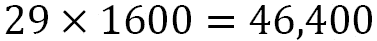
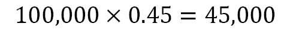
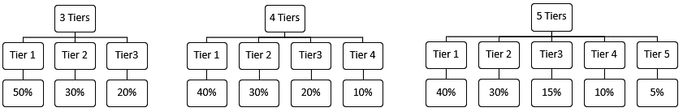

# 第十一章：在简单挑战中使用计算思维和 Python

在本章中，我们将再次审视计算思维过程，并将其应用于设计算法，帮助我们解决各种场景和问题。随着本书*第二部分*，*应用 Python 和计算思维*的结束，我们将结合有关 Python 功能的一些知识与计算思维过程，解决这些问题。

在本章中，我们将涵盖以下主题：

+   定义问题和 Python

+   分解问题并使用 Python 功能

+   概括问题并规划 Python 算法

+   设计和测试算法

通过本章结束时，您将能够设计最适合所呈现场景的算法。您还将能够确定最符合所呈现问题的 Python 函数，并概括您的解决方案。

# 技术要求

您需要安装最新版本的 Python 才能运行本章中的代码。

本章中使用的源代码可以在 GitHub 存储库中找到：[`github.com/PacktPublishing/Applied-Computational-Thinking-with-Python/tree/master/Chapter11`](https://github.com/PacktPublishing/Applied-Computational-Thinking-with-Python/tree/master/Chapter11)

# 定义问题和 Python

我们将深入探讨我们的第一个场景。您正在为您设计的产品发起一项活动。您正在寻找总额为 100,000 美元的承诺投资。您希望创建一个算法，保存有关为您制作的承诺的信息，同时提供有关每个承诺提供的产品的信息。在编写算法之前，您需要确定一些事项：

+   *您的活动中将运行多少种类型的承诺？*

+   *是否会有仅捐款的承诺？* *捐款是否会得到任何东西，比如贴纸、电子证书或其他产品？*

+   *每个承诺将给予承诺者什么？*

所有这些问题都将帮助我们进行规划。但我们还必须考虑其他事项，比如我们从算法中需要什么。*它仅仅是列出承诺的数量，还是也将用于与库存进行核对或创建库存？* *它会从每个级别可用的一定数量的承诺中倒数吗？每次有人承诺时，它会自动更新吗？*

正如您所知，当我们面对问题时，关键是要确定问题的实质。我们需要为问题设定参数，以便提供解决方案。在本节中，我们首先要回答很多这些问题。为了做到这一点，我们需要分解问题，并确定 Python 中哪些功能可以帮助我们解决这个问题。

## 分解问题并使用 Python 功能

我们可以创建一个用于设计这些承诺的算法。我们将设计一个算法，告诉我们根据一定数量的承诺需要每种类型的商品数量。

例如，假设我们有三个承诺层级和一个仅捐款的承诺。对于最高层，让我们称之为**层级 1**，您将获得以下内容：

+   将出售的商品以 20%的折扣翻倍

+   商品的配件捆绑包，包括四件商品

+   商品和配件的携带盒

+   网站的 1 年会员资格

中层，或**层级 2**，将为您提供以下商品：

+   以 20%的折扣出售的商品

+   商品的携带盒

+   网站的 6 个月会员资格

最低层，或**层级 3**，将为您提供以下商品：

+   以 20%的折扣出售的商品

+   商品的携带盒

假设我们想要一个算法，根据我们允许每个层级的承诺数量，为我们提供我们需要的物品数量。**第四层**，即仅捐赠的层级，不会影响我们的算法，因为这个算法将仅用于确定我们需要的每种物品的数量，具体取决于承诺的数量。

但事情并不像数字那么简单。假设您需要$100,000 的承诺，就像本章前面提到的那样。那么您需要计算出每个层级的收费，并为它们设定一个价格点。您需要提供足够的承诺，以至少达到$100,000 的目标。

您已经确定您的物品的零售价格为$800。以下是每个物品的成本：

+   $640 是物品本身的价格（给定 20%的折扣，仅适用于第 1、2 和 3 层）

+   $100 的配件（仅适用于第 1 层）

+   $40 的携带箱（适用于第 1、2 和 3 层）

+   会员费用将以每月$10 的价格传递（假设原始费用为每月$35）

对于第 1 层，承诺需要至少$1,540：

+   640 × 2 = 1280

+   12 × 10 = 120

+   1280 + 120 + 100 + 40 = 1540

对于第 2 层，承诺需要至少$740：

+   640 + 40 = 680

+   6 × 10 = 60

+   680 + 60 = 740

对于第三层，承诺需要至少$680，即 640 + 40 = 680。

现在我们必须弄清楚每个层级将有多少可供购买。但首先，让我们将一些这些数字四舍五入：第 1 层将是$1,600，第 2 层将是$800，第 3 层将是$700。

我们可以编写一个算法来让我们知道每个层级需要多少承诺。但在我们这样做之前，让我们谈谈 Python 和我们可以使用的功能。我们可以首先创建第三层的承诺，使其成为一个父组。然后我们可以创建两个子类，第 1 和第 2 层，它们具有略有不同的特征和成本。我们要问自己的问题是，我们是否需要在算法中详细说明，还是只需添加每个层级的成本/价值。

这是一个很好的问题。答案是取决于您需要这个算法的用途。如果您只是想进行早期简单的计算，并且需要一个可以根据当前销售/承诺定期运行的算法，那么您可以创建一个简单的字典或函数。但是，如果您希望将算法用于多种目的，或者需要能够稍后调整一些成本，那么您可能希望将所有细节编码到算法中。

*您为什么需要这个？*看一些成功的可用活动。通常，这些活动的原始承诺会售罄。然后新的承诺层会变得可用，您可能希望调整这些层的价格点。例如，承诺可能不再是物品的 20%折扣，而是 15%的折扣。其他变化可能发生，例如由于库存限制而出售装饰品而不是配件等。

您的算法越详细，从长远来看，您可以做的事情就越多。但是，如果您不需要所有这些信息，那么您可能不希望花费太多时间创建算法。

让我们开始处理这个算法。看一下下面显示的片段：

ch11_pledgesA.py

```py
import math
tier1 = 1600
tier2 = 800
tier3 = 700
perc = int(input("What percentage of the 100,000 do you 
    expect will be Tier 1? Type a number between 1 and
    100\. "))
percentage = perc/100
Tier1 = (100000*percentage)/1600
totalTier1 = math.ceil(Tier1)
print("You will need to sell %s Tier 1 pledges if you want 
    %s percent of your sales to be in Tier 1." 
    %(totalTier1,perc))
```

让我们看一下我们在前面片段中使用的一些东西。我们必须导入`math`模块，以便我们可以使用`math.ceil()`数学函数。我们使用这个函数来四舍五入所需的第 1 层承诺的数量。这是因为如果我们向下取整，我们将无法达到所需的百分比。通过这样做，我们找到了我们需要覆盖百分比的最小整数。

此外，我们在我们的`print`语句中使用了`%s`占位符来调用我们的字符串，然后说明要使用的字符串。

当我们运行该程序时，输出如下所示：

```py
What percentage of the 100,000 do you expect will be Tier 1? Type a number between 1 and 100\. 45
You will need to sell 29 Tier 1 pledges if you want 45 percent of your sales to be in Tier 1.
```

请注意，我们的`print`语句使用了用户输入的百分比，部分是为了确保信息与预期相匹配。要想让 45%的资金来自 Tier-1 承诺，我们至少需要出售 29 个 Tier-1 承诺。如果我们运行数学来验证这一点，我们会发现这个信息是正确的：



正如您所看到的，如果我们出售 29 个 Tier-1 承诺，我们将获得略多于 100,000 的 45%。

但是，假设您还希望算法告诉您基于 Tier-1 承诺数量需要多少物品。让我们看一下调整后的算法：

ch11_pledgesB

```py
import math
tier1 = 1600
tier2 = 800
tier3 = 700
perc = int(input("What percentage of the 100,000 do you 
    expect will be Tier 1? Type a number between 1 and 
    100\. "))
percentage = perc/100
Tier1 = (100000*percentage)/1600
totalTier1 = math.ceil(Tier1)
print("You will need to sell %s Tier 1 pledges if you want 
    %s percent of your sales to be in Tier 1." 
    %(totalTier1,perc))
print("You will need %s items, %s accessories kits, %s 
    carrying cases, and %s year-long memberships." 
    %(totalTier1*2, totalTier1, totalTier1, totalTier1))
```

请注意，我只添加了一个`print`语句。以这种方式使用这个算法有利有弊。在这种情况下，我只输出每个层级的数字。我没有在算法中保存需要的物品数量。如果我们想要为将来的参考保存这些信息，我们需要调整如何获取这些信息以及如何在算法中保存它。

对于这个算法，输出如下：

```py
What percentage of the 100,000 do you expect will be Tier 1? Type a number between 1 and 100\. 45
You will need to sell 29 Tier 1 pledges if you want 45 percent of your sales to be in Tier 1.
You will need 58 items, 29 accessories kits, 29 carrying cases, and 29 year-long memberships.
```

请注意，我们得到了想要的信息。我们将需要`58`个`物品`，`29`个`配件套件`，`29`个`携带箱`，以及`29`个`年度`的`会员资格`。同样，如果我们只做一次性的事情，或者我们不希望有任何变化，这将是有帮助的。但让我们明确一点，这几乎从来不是这种情况。我们将希望进行更改。我们还需要根据层级 2 和层级 3 的选择来了解信息。*那么我们能做什么呢？*

首先，我们需要保存我们的数字。因此，我们需要为物品、配件套件、携带箱和两个会员资格添加一些变量，一个是年度的，一个是 6 个月的。我们还需要决定我们希望其余的承诺如何分配。*我们希望其他百分比在层级 2 和 3 之间平均分配吗？* *我们希望剩下的三分之一是层级 2，剩下的三分之二是层级 3 吗？* 让我们选择这些数字。现在我们的情况是这样的：

+   Tier-1 的百分比是由用户在程序运行时选择的。

+   Tier-2 的百分比将是剩余百分比的三分之一。

+   Tier-3 将是剩余百分比的三分之二。

让我们教给算法。以下文件包含完整的、不间断的代码。我们添加了一些文本来解释某些部分，如下所示：

ch11_pledgesC.py

```py
tier1 = 1600
tier2 = 800
tier3 = 700
perc = int(input("What percentage of the 100,000 do you 
    expect will be Tier 1? Type a number between 
    1 and 100."))
percTier1 = perc/100
percTier2 = (100-perc)/3/100
percTier3 = (100-perc-percTier2)/100
```

请注意，在下面的片段中，我们添加了一些变量，如`totalTier1`、`itemsTier1`、`accTier1`和`cases1`。这些变量将帮助我们保存每个层级订购的数量。我们将对层级 2 和 3 做同样的事情：

```py
Tier1 = (100000*percTier1)/1600
totalTier1 = math.ceil(Tier1)
itemsTier1 = totalTier1*2
accTier1 = totalTier1
cases1 = totalTier1
yearMemb = totalTier1
Tier2 = (100000*percTier2)/800
totalTier2 = math.ceil(Tier2)
itemsTier2 = totalTier2
cases2 = totalTier2
sixMemb = totalTier2
Tier3 = (100000*percTier3)/700
totalTier3 = math.ceil(Tier3)
itemsTier3 = totalTier3
cases3 = totalTier3
totalItems = itemsTier1 + itemsTier2 + itemsTier3
totalAccessories = accTier1
totalCases = cases1 + cases2 + cases3
print("You will need to sell %s Tier 1 pledges if you want 
    %s percent of your sales to be in Tier 1." 
    %(totalTier1, perc))
print("You will need %s Tier 2 pledges and %s Tier 3 
    pledges to meet or exceed your $100,000 funding goal." 
    %(totalTier2, totalTier3))
```

虽然我们还没有打印出总物品或总案例的详细信息，但现在我们已经将它们保存到变量中。现在我们的输出看起来是这样的：

```py
What percentage of the 100,000 do you expect will be Tier 1? Type a number between 1 and 100\. 50
You will need to sell 32 Tier 1 pledges if you want 50 percent of your sales to be in Tier 1.
You will need 21 Tier 2 pledges and 72 Tier 3 pledges to meet or exceed your $100,000 funding goal.
```

我们应该注意到，我们超过了我们的筹资目标，因为我们一直在四舍五入。也就是说，我们使用$1,540 来代替 Tier 1，我们使用$1,600。对于百分比，我们一直在四舍五入。所有这些加起来将使我们的总额超过 100,000。

让我们再扩展一下算法。以下只是我们已经看到的算法中的新片段，其中包含了我们需要的物品的总数：

```py
print("These percentages are equivalent to %s total items, 
    %s total cases, %s accessories kits, %s year-long 
    memberships, and %s six-month memberships." \
      %(totalItems, totalCases, totalAccessories, 
      yearMemb, sixMemb))
```

请注意，我们现在可以在我们的`print`函数中调用我们添加的那些变量，以获取我们库存所需的数量。如果我们没有在算法中定义这些项目，我们将无法获得这些详细信息。

在我们之前的片段中，还有一些项目具有完全相同的价值。然而，我们仍然用不同的变量定义了它们。例如，`cases2 = totalTier2`和`sixMemb = totalTier2`。尽管两者的值相同，但我们希望将它们分开识别。也许现在这并不重要，但以后也许我们会用完案例。那时我们只想改变案例的价值，而不是 6 个月的会员资格。

因为它们已经分开，我们可以改变一个而不影响另一个。让我们看看新的`print`语句的输出是什么样的：

```py
These percentages are equivalent to 157 total items, 125 total cases, 32 accessories kits, 32 year-long memberships, and 21 six-month memberships.
```

看到这一点，你可能会意识到在第一层有一个携带箱，但有两个物品，这就是为什么这两个数字不同的原因。配件和一年的会员只发生在第一层，所以这两个数字相同是有道理的。6 个月的会员只适用于第二层，所以这个数字与第二层的承诺数量相匹配。

当我们进一步考虑这个问题时，我们可能会意识到我们可能希望以不同的方式保存信息。也许我们不是问用户他们想要多少百分比的第一层承诺，而是问他们有多少总物品，然后根据这个来分解层。所有这些都是可能的，所以我们如何定义问题是至关重要的。我们如何保存信息或者从用户那里请求输入也同样重要。分解问题只是创建和设计我们需要的算法过程的一部分。

在这一部分，我们学会了如何解决具有多种解决方案的问题，这取决于我们的目标。当我们定义问题时，我们通常也确定我们需要的变量，并确定根据算法的输出需要什么样的函数是最有用的。除非我们有一个非常简单和直接的问题，否则问题的分解和定义对于成功定义算法至关重要。

现在让我们在下一节中看一下概括问题。

# 概括问题和规划 Python 算法

在上一节中，我们正在使用一个专为资金筹集活动设计的算法。我们看到的算法是特定于问题的。

现在让我们尝试概括这个问题，并了解我们如何可能设计一个不同的算法。*为什么我们需要那个？*把它看作一个模板。如果你为初创公司运行多个筹资活动，你可能希望创建一个通用算法，然后根据每个活动的需求进行调整，而不是每次都要重新开始每个活动。

你需要设定一些明确的参数并做出一些决定。为了使这种情况对本书的目的来说更容易处理，我们将限制一下我们的选择：

+   每个活动将有 3 到 5 个承诺层，不包括仅捐赠。

+   每个层都会要求每个层所需的物品。

+   每个层选项都将有一个固定的百分比。

如果有三个层，第一层将占承诺的 50%，第二层将占 30%，第三层将占 20%。如果有四个层，第一层将占承诺的 40%，第二层将占 30%，第三层将占 20%，第四层将占 10%。如果有五个层，第一层将占承诺的 40%，第二层将占 30%，第三层将占 15%，第四层将占 10%，第五层将占 5%。

看一下下面的图表，显示了各层的分解情况：



图 11.1 - 层百分比分解

因为我们使用一个算法来处理许多可能的情况，我们将逐步分解该算法。完整的算法可以在 GitHub 上的`ch11_pledgesTemplate.py`文件中找到。

在这个第一个片段中，我们要求初始输入，然后保存我们的百分比：

```py
import math
numberTiers = int(input("How many tiers of pledges will you 
    offer? Enter a number between 3 and 5 inclusive. "))
#Number of tiers percentages
if numberTiers == 3:
    tier1 = .50
    tier2 = .30
    tier3 = .20
elif numberTiers == 4:
    tier1 = .40
    tier2 = .30
    tier3 = .20
    tier4 = .10
elif numberTiers == 5:
    tier1 = .40
    tier2 = .30
    tier3 = .15
    tier4 = .10
    tier5 = .05
else:
    print("Please try again and enter the numbers 3, 4,
        or 5\. ")
```

正如你所看到的，在我们要求输入后有三个条件。请注意，我们将输入转换为整数。这很重要，否则条件将运行，但`else`条件也将运行。

前面的片段不会给我们任何输出，除了要求输入。因此，在我们的下一个片段之后，我们将展示更多的输出。

重要提示：

请注意此代码中的注释的使用。由于代码的长度，我们将使用注释来找到需要编辑的代码部分。在所有代码中使用注释总是一个好主意，尤其是在冗长的代码中。否则，找到我们想要更改的特定行可能会非常棘手。

一旦我们有了层级的数量，我们将需要知道每个层级中物品的数量。我们需要询问每个层级选择了多少物品。让我们看看前面代码的继续部分：

```py
#Number of items per tier
if numberTiers == 3:
    numTier1Items = int(input("How many items will be 
        provided for a Tier 1 pledge? "))
    numTier2Items = int(input("How many items will be 
        provided for a Tier 2 pledge? "))                 
    numTier3Items = int(input("How many items will be 
        provided for a Tier 3 pledge? "))
elif numberTiers == 4:
    numTier1Items = int(input("How many items will be 
        provided for a Tier 1 pledge? "))
    numTier2Items = int(input("How many items will be 
        provided for a Tier 2 pledge? "))                 
    numTier3Items = int(input("How many items will be 
        provided for a Tier 3 pledge? "))
    numTier4Items = int(input("How many items will be 
        provided for a Tier 4 pledge? "))
```

请注意，我们只显示了层级为 3 或 4 时的条件。代码文件还将包含 5 个层级的信息，但它遵循了前面代码中显示的内容。请注意，该算法要求输入每个层级。当我们需要处理数字和百分比时，这将是重要的。

此外，我们可以包括一个`else`语句，如果输入中有错误，它允许我们再次提出问题。如果您愿意，可以将这些类型的条件添加到现有模板中。现在，我们将继续获取用户需要的下一部分信息，例如每个层级的价格点。

现在让我们回想一下我们可能需要什么。我们将需要每个层级的价格点，这也将是模板类型算法的输入请求。由于每个活动的价格点都会有所不同，我们需要让用户输入。输入行将看起来与先前显示的片段非常相似。以下是 3 个层级的情况：

```py
#Price points for each Tier
if numberTiers == 3:
    priceTier1 = int(input("What is the price point of Tier 
        1? Enter dollar amount without dollar sign. "))
    priceTier2 = int(input("What is the price point of Tier 
        2? Enter dollar amount without dollar sign. "))                
    priceTier3 = int(input("What is the price point of Tier 
        3? Enter dollar amount without dollar sign. "))
```

再次注意，我们使用注释来分隔代码的每个部分。您可以看到，我们正在添加有关每个承诺级别的收费信息。然后代码继续为 3、4 或 5 个层级执行此操作。

正如之前讨论的，您可能还想测试错误或提供在用户添加错误后继续运行代码的替代方法。我们在这段代码中没有处理这些错误，但可以添加以改善用户体验。您可以看到，我们已经开始研究如何将此算法推广到多种情况。

在这种情况下，我们正在为多种用途进行概括。但是在本书中，我们使用了许多算法并看到了许多情景，其中模式的概括要简单得多。概括可以是编写一个变量方程这样简单的事情。或者可以是为多种情况和条件创建算法。这就是为什么确定我们的问题是什么以及我们确切想要实现什么是很重要的。

在本节中，我们看了如何何时从用户那里获取输入。我们还通过定义变量来存储输入并在我们的方程式中使用它，以便算法输出必要的信息。

为了完成算法，我们将进入下一部分，重点是设计和测试算法。

# 设计和测试算法

在上一部分中，我们从用户那里得到了很多输入，因为我们正在创建一个用作许多活动模板的算法。现在我们需要以各种方式使用这些输入。到目前为止，我们已经有了这些：

+   承诺层级的数量

+   不同层级的百分比分布

+   每个层级的物品数量

+   每个层级的成本

现在我们可以利用所有这些信息做一些事情。首先，让我们谈谈我们可能想要的东西。我们可能想测试出售特定数量的层级可以赚多少钱。我们还可以根据筹款目标来分解我们需要多少个每个层级，就像本章的第一部分所做的那样。

*什么会最有帮助？* 嗯，这取决于你的需求。我要说的是，我想根据筹资目标来分解。我想知道我需要提供每种承诺类型的数量。所以现在我必须想办法从我已经定义的变量中获取这些信息。

我们也需要在这里有三个条件。因为每个等级类型的变量和数量都不同，我们需要确保我们考虑到这些信息。首先让我们考虑三个等级。根据筹资目标，以下是一些有用的输出：

+   要提供的每个等级的承诺数量

+   每个等级需要存货的物品数量

*那我们该如何计算呢？*

假设我们的筹资目标是 50,000 美元，假设一级的成本是 500 美元。那么，我们可以采取以下步骤来找到需要的一级承诺数量：

1.  将筹资目标乘以百分比，即，50,000 × 0.50 = 25,000。

1.  将得到的数字除以承诺的成本，即，25,000 ÷ 500 = 50。

这意味着我们需要发布 50 个一级承诺。现在假设用户输入了一级有`3`个物品。那么，这意味着 50 × 3 = 150 个物品。

现在让我们在我们的代码中看看。记住，这是与之前片段相同的文件（`ch11_pledgesTemplate.py`）。我们将继续讨论并使用代码的部分：

```py
#Breakdown of number of Tiers based on funding goal
fundGoal = int(input("What is the funding goal for this 
    campaign? Enter dollar amount with no symbols. "))
if numberTiers == 3:
    Tier1Total = math.ceil(fundGoal*tier1/priceTier1)
    Tier2Total = math.ceil(fundGoal*tier2/priceTier2)
    Tier3Total = math.ceil(fundGoal*tier3/priceTier3)
    print("For a funding goal of %s with %s tiers, you'll 
        need %s Tier 1 pledges, %s Tier 2 pledges, and %s 
        Tier 3 pledges. " % (fundGoal, numberTiers, 
        Tier1Total, Tier2Total, Tier3Total))
```

在前面的片段中，我们有一个`print`函数，其中包含每个等级的承诺数量，但它们也保存为我们条件语句中的函数。请注意，我们现在将在这里得到一些输出。我们将从这段代码中得到我们需要的承诺数量，但不是每个等级的物品数量。我们很快会添加这部分内容。现在，当我们运行程序时，输出看起来是这样的：

```py
How many tiers of pledges will you offer? Enter a number between 3 and 5 inclusive. 3
How many items will be provided for a Tier 1 pledge? Enter a number between 1 and 3 inclusive. 3
How many items will be provided for a Tier 2 pledge? Enter a number between 1 and 3 inclusive. 2
How many items will be provided for a Tier 3 pledge? Enter a number between 1 and 3 inclusive. 1
What is the price point of Tier 1? Enter dollar amount without dollar sign. 500
What is the price point of Tier 2? Enter dollar amount without dollar sign. 400
What is the price point of Tier 3? Enter dollar amount without dollar sign. 350
What is the funding goal for this campaign? Enter dollar amount with no symbols. 50000
For a funding goal of 50000 with 3 tiers, you'll need 50 Tier 1 pledges, 38 Tier 2 pledges, and 29 Tier 3 pledges.
```

正如你所看到的，我们现在知道我们需要列出 50 个价值 500 美元的一级承诺，38 个价值 400 美元的二级承诺，以及 29 个价值 350 美元的三级承诺，以达到我们的筹资目标。现在我们必须根据每个等级提供的物品数量来计算每个等级需要多少物品。代码如下：

```py
if numberTiers == 3:
    Tier1Total = math.ceil(fundGoal*tier1/priceTier1)
    Tier2Total = math.ceil(fundGoal*tier2/priceTier2)
    Tier3Total = math.ceil(fundGoal*tier3/priceTier3)
    print("For a funding goal of %s with %s tiers, you'll 
        need %s Tier 1 pledges, %s Tier 2 pledges, and %s 
        Tier 3 pledges. " % (fundGoal, numberTiers, 
        Tier1Total, Tier2Total, Tier3Total))
    Tier1Items = numTier1Items*Tier1Total
    Tier2Items = numTier2Items*Tier2Total
    Tier3Items = numTier3Items*Tier3Total
    print("For %s Tier 1 pledges, you'll need %s items. For 
        %s Tier 2 pledges, you'll need %s items. For %s 
        Tier 3 pledges, you'll need %s items. " 
        %(Tier1Total, Tier1Items, Tier2Total, Tier2Items, 
        Tier3Total, Tier3Items))
```

正如你所看到的，现在我们有另外三个数学方程和一个`print`语句，为我们分解了信息。我们将得到每个等级的承诺数量，以及每个等级所需的物品数量。如果你想从这个模板中获得更多信息，你可以包括本章第一个示例中的一些内容，那里我们分解了每个承诺的物品类型。我们将把这个挑战留给你。

现在，对于三个等级和 50,000 美元的筹资目标，我们的最终输出如下：

```py
How many tiers of pledges will you offer? Enter a number between 3 and 5 inclusive. 3
How many items will be provided for a Tier 1 pledge? 3
How many items will be provided for a Tier 2 pledge? 2
How many items will be provided for a Tier 3 pledge? 1
What is the price point of Tier 1? Enter dollar amount without dollar sign. 500
What is the price point of Tier 2? Enter dollar amount without dollar sign. 400
What is the price point of Tier 3? Enter dollar amount without dollar sign. 350
What is the funding goal for this campaign? Enter dollar amount with no symbols. 50000
For a funding goal of 50000 with 3 tiers, you'll need 50 Tier 1 pledges, 38 Tier 2 pledges, and 29 Tier 3 pledges. 
For 50 Tier 1 pledges, you'll need 150 items. For 38 Tier 2 pledges, you'll need 76 items. For 29 Tier 3 pledges, you'll need 29 items.
```

正如你所看到的，我们不仅得到了我们需要的信息，而且还设置了变量，以便在需要时使用这些信息。回想一下我们之前讨论过的章节和笔记，让我们试着确定我们现在如何保存这些信息。

首先想到的是，我们可以创建一个字典来为我们存储信息。如果我们这样做，那么我们可以从那个字典中调用我们需要的信息，比如一个等级的物品数量。如果需要，我们还可以调整键值对，而不必重新输入整个内容。假设我们一开始的一级成本是 500 美元，但现在我们需要它是 600 美元，而其他等级不会改变。那么我们只需调整那一个值。

这种情况可以让你探索我们讨论过的 Python 编程语言的许多功能。花些时间研究代码，然后进行一些调整，尝试根据不同的条件利用你的知识来改进它。

记住，我们总是面临可以用不同方式解释的问题情况。我们需要编写满足我们自己和客户需求的算法。有时，我们会直接从利益相关者那里得到澄清。其他时候，我们需要要求澄清和/或自己做一些假设。关键是我们要设计算法并记录我们的进展，这样我们就可以在不得到所需内容时调整、适应和更改我们的工作部分，而不必重新开始。

# 总结

在本章中，我们通过处理更复杂的情景和对该情景的解释，再次学习了计算思维过程。我们学会了如何分解所提供的问题，然后识别模式、概括它们，并设计算法。我们利用了书中学到的一些知识，编写了一个提供我们所需信息的算法。

计算思维过程帮助我们培养技能，使我们的算法规划变得更容易。通过走过这个过程，我们更多地了解了 Python 的能力和函数在特定情况下如何帮助我们。我们还学会了如何概括模式，有时是为了解决问题而创建简单的方程，但有时是创建可以帮助我们在多种情况下的算法，而不必每次重新创建它们。随着我们对 Python 的了解越来越多，在*第二部分*，*应用 Python 和计算思维*的最后一章中，我们对计算思维过程更加熟悉。

在*第三部分*，*使用计算思维和 Python 进行数据处理、分析和应用*中，我们将继续探讨 Python 的其他能力，以处理数据处理、分析和应用计算思维元素。在下一章中，我们将开始研究数据以及如何使用 Python 分析数据、创建可视化表示，并编写与实验数据配合的算法。
