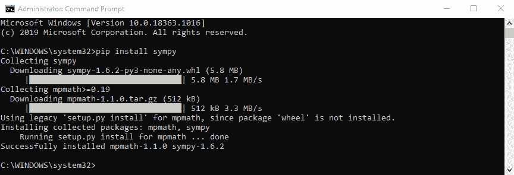
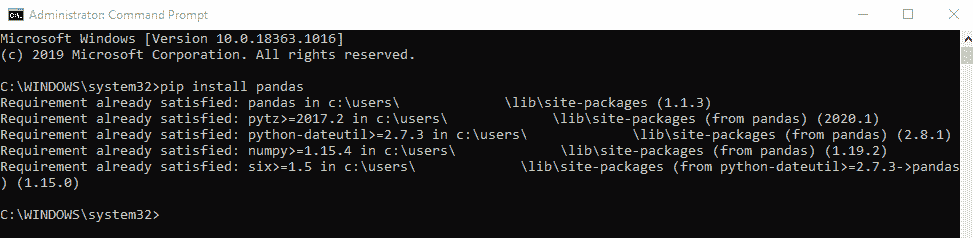
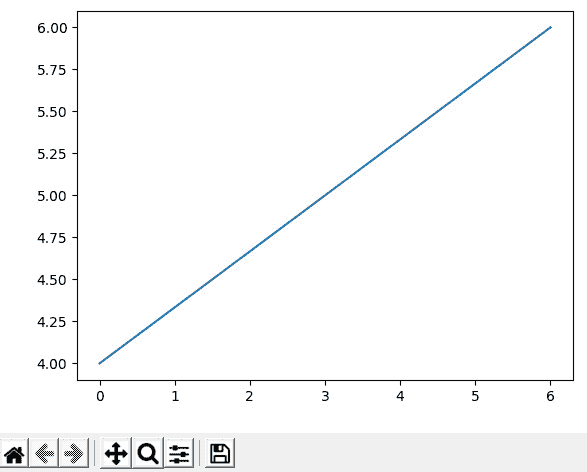
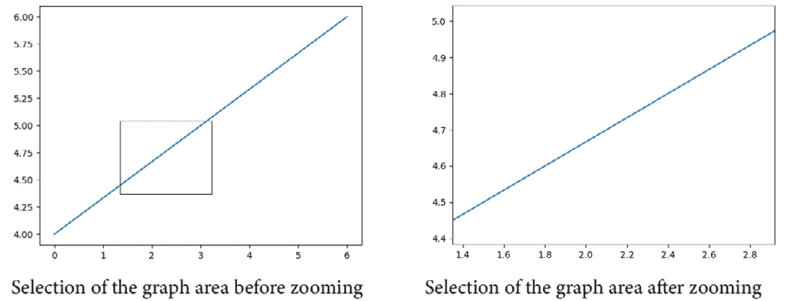
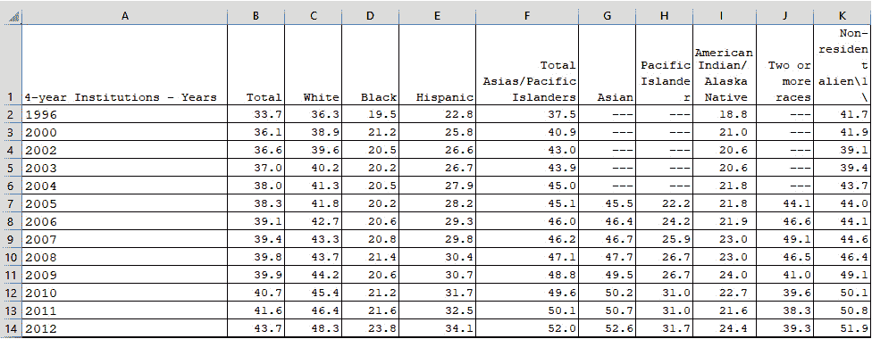
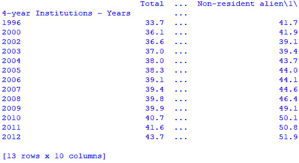
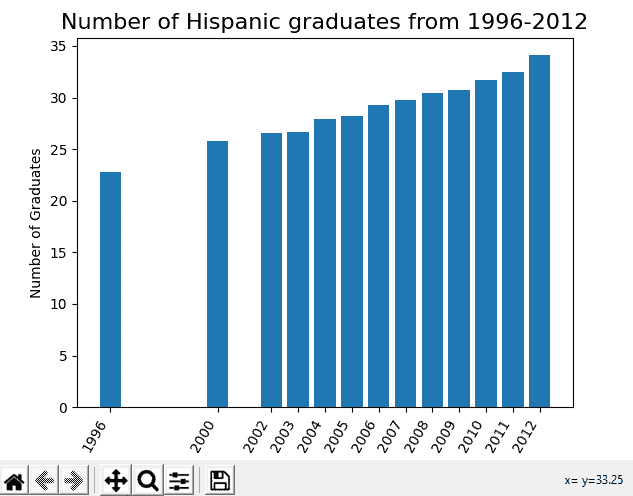
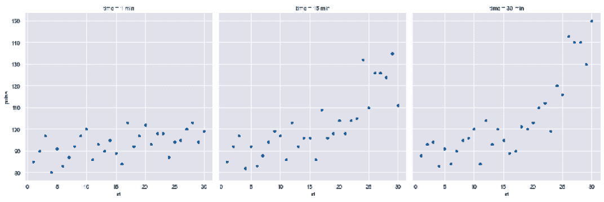
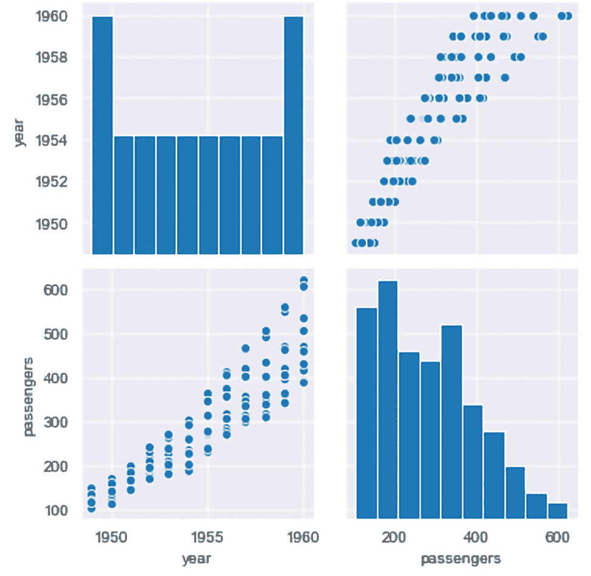

# 第十二章：在实验和数据分析问题中使用 Python

在本章中，我们将看看 Python 如何帮助我们使用专门用于数据分析和数据科学的算法和库来理解和分析数据。我们将首先介绍实验数据，然后转向使用两个主要库**NumPy**和**pandas**的算法。

在本章中，我们将涵盖以下主题：

+   定义实验数据

+   在 Python 中使用数据库

+   使用 Python 进行数据分析

+   使用额外的库进行绘图和分析

在本章结束时，您将能够定义实验类型、数据收集以及计算思维在设计模型和解决方案时的帮助。您还将学习如何使用数据库，特别是**NumPy**、**pandas**和**Matplotlib**，来帮助分析和显示数据。最后，您将能够设计算法，以帮助数据分析，以便从现有数据中学习。

# 技术要求

您需要安装最新版本的 Python 来运行本章中的代码。

您还需要安装一些库，包括**NumPy**、**pandas**、**Matplotlib**和**Seaborn**。

您可以选择使用集成环境来运行 Python，例如**Anaconda**，它可以简化库依赖关系，并有助于在笔记本中组织您的算法。

本章中使用的源代码可以在 GitHub 存储库中找到：[`github.com/PacktPublishing/Applied-Computational-Thinking-with-Python/tree/master/Chapter12`](https://github.com/PacktPublishing/Applied-Computational-Thinking-with-Python/tree/master/Chapter12)

# 定义实验数据

*我们终于到了本书的数据章节*。*我们都有自己的偏见和喜欢生活的领域。这是我的其中之一*。数据如此重要的原因有很多，但让我们从这样一个事实开始，即数据、我们如何收集它、如何分析它以及如何呈现它对我们的日常生活有巨大影响。

在编写算法以显示信息时，我们有责任以尽可能少的偏见方式分享数据，确保我们的数据包容和代表我们的社区和人民。在我们深入讨论这个话题之前，我想确保我说过这些话。对我来说，这就是我如何爱上代码和 Python 的方式。

在本节中，我们将讨论实验数据，定义它是什么，以及在处理实验数据时使用的关键术语。

现在，让我们开始吧。**实验数据**是一个从科学和工程中得到应用的术语。然而，我们也在其他领域使用实验数据，比如教育、公民事务等。实验数据包括方法论，我们如何测量数据，我们正在进行的实验的设计，以及我们如何呈现我们从这些设计中收集和分析的数据。在本章中，我们不是在设计实验。我们将专注于如何使用 Python 来分析现有数据。但是重要的是要注意，如果我们对实验有发言权，我们需要确保公平地设计它。

如果实验设计和数据收集方法是合理的，那么我们使用和分析的数据将比如果我们从一个有偏见的实验开始要更有帮助。虽然我们永远无法完全消除偏见，但作为研究人员和开发人员，我们有责任以尽可能少的偏见方式呈现数据。*为什么这很重要？*想想所有基于数据、图表和实验呈现的信息而发生的政策变化。如果实验从一开始就有偏见，结果将导致可能无法充分包容社区需求的政策，例如。

在处理数据时，我们总是在使用计算思维元素。在解决问题时，我们必须定义问题是什么，我们想要研究什么，我们想要如何衡量它，我们将如何能够创建和推广模式，以及我们需要使用什么算法来产生数据的最佳表示。我们在数据分析中所做的一切都受益于我们使用计算思维元素。

数据科学是**STEM**领域中不断增长的领域。2017 年，它被称为美国增长最快的领域。美国劳工统计局表示，预计到 2026 年，数据科学和统计领域将新增 1150 万个新工作岗位。目前，可用的工作岗位比合格的候选人更多。

现在，让我们看看 Python 如何让我们处理数据。

在实验数据中，我们希望使用自变量、因变量和控制变量收集信息：

+   **自变量**是由研究人员改变或控制的变量。

+   **因变量**是由研究人员测量或测试的变量；因变量*依赖于*自变量。

+   **控制变量**是实验中必须保持不变的变量或因素。

让我们看一个实验中这些变量的简单例子。一个常见的例子涉及植物生长的研究。自变量可以是一个或多个变量。对于我们的例子，我们的自变量将是我们添加到植物中的肥料量。植物生长将是一个因变量。**对照组**将不会得到任何肥料，只有水。因此，在我们的实验中，假设我们有五棵植物要测量。一棵植物只会得到水。那就是我们的**对照组**。其他四棵将添加不同水平的肥料。那些是我们的**实验**植物。生长是依赖于肥料的数量的。

设计实验时，我们希望有三个条件成立：可靠性、有效性和可推广性。以下是这些条件的含义：

+   **可靠性**与测量的一致性有关。这意味着如果我们模仿条件，我们的结果应该是可靠地相似的。

+   **有效性**与实验是否测量了其意图测量的内容有关。

+   **可推广性**与结果是否能够推广并应用到其他环境有关。

关于实验，我们还可以深入了解更多细节和深度，但在本章中，我们只关注在获得数据后会发生什么。了解这些基本术语对于我们参与实验设计是很重要的。作为开发人员，根据我们的角色，可能会出现这种情况。例如，在初创公司中，每个人可能都参与产品开发的各个方面。因此，在这些情况下，我们可能会参与实验以及随后的分析算法。

现在，让我们继续讨论数据分析可以做什么，以及 Python 库如何帮助我们实现分析实验结果所需的内容。

# 使用 Python 中的数据库

在这一部分，我们将看一些可以与 Python 编程语言一起使用的库和包。我们有时使用*包*和*库*这两个术语来交替使用，但为了清晰起见，一个包包含模块，而一个库是包的集合。

我们使用 Python 库就像使用内置的模块一样，比如我们在*第四章*中首次使用的`math`模块，*理解逻辑推理*。在我们的源代码中，我们在创建算法之前使用`import math`导入了`math`模块。在*第四章*的*应用归纳推理*部分的示例中，我们使用了该模块的`math.floor()`函数，这使我们能够将一个数字向下舍入，而不管其小数值是多少。当我们在 Python 中导入模块或库时，我们正在利用额外的功能和能力，使我们能够更深入地使用编程语言。

那么，什么是库？在 Python 中，**库**指的是可以重复使用的代码块。库包含一系列模块。Python 有许多可用的库，就像 Python 本身一样，许多库都是**开源**的，这意味着任何人都可以下载和使用它们。因为我们将在本章中处理数据，所以现在我们将继续使用 pandas、NumPy 和 Matplotlib。然而，还有许多其他库和许多类型的库。例如，有**图形用户界面**（**GUI**）框架，如**Kivy**、**tkinter**、**PyQt**、**PySimpleGUI**等。对于游戏，还有其他库，如**Pygame**和**Pyglet**。在机器学习中，**TensorFlow**库是由**Google**与**Brain**团队合作开发的一种流行工具。但这只是一些可用库和使用它们的领域的例子。

## 安装库

虽然`math`模块是内置在 Python 语言中的，但库需要安装。在**Python 3.9**中，我们用来安装库的程序是**pip** **安装程序**。这是一个内置在 Python 中并从**命令提示符**窗口运行的命令。我在这里要提到的一个警告是，权限和我们安装 Python 的位置很重要，所以如果你的计算机属于你的雇主，请确保 Python 程序路径已根据需要进行调整，以便你可以访问所有模块并安装库。权限可能会有所不同。

在我的情况下，虽然我的主要计算机不属于我，但我有管理员权限，所以我可以以管理员身份运行我的命令提示符，并从那里运行`pip`。

下面的截图显示了安装`sympy` Python 库。如你所见，使用`pip install sympy`命令将库安装到我们的系统上。值得一提的是，`sympy`是 Python 可用的符号数学库。由于我已经安装了我们将要使用的其他库，我必须展示一个我还没有在我的计算机上安装的包的安装：

图 12.1 – 安装 Python 库

如果你试图安装一个你已经安装过的库，例如如果我再次尝试安装 pandas，你会收到一个**已满足要求**的消息，就像下面截图中显示的那样。请注意，用户信息将被填入你的用户，而不是像截图中显示的那样被涂黑，这也显示了库包在你的系统上的位置：

图 12.2 – 已满足要求的消息

你可能还希望使用 Anaconda，这是 Python 和 R 编程语言的开源发行版。安装了 Anaconda 后，你可以使用`CMD.exe`提示窗口使用`conda install`或`pip install`来安装你的库。Anaconda 导航器中包含的 Jupyter 笔记本可以运行和保存你的 Python 程序。

Anaconda 发行版程序中包含了更多的程序和包，它们可以简化我们与 Python 编程语言的交互方式。如果你进行大量编码，这是一个很好的资源。

如果你还没有这样做，现在是一个安装 NumPy、pandas 和 Matplotlib 库的好时机，在我们开始使用它们来分析和显示数据以及创建模型之前。

## 使用 NumPy 和 pandas

**NumPy**，就像 Python 中的许多库和 Python 编程语言本身一样，是一个开源库。NumPy 用于多维数组和矩阵数据结构。Python 本身没有数组；它有列表。因此，库可以用来为我们的算法提供这种能力。当我们有多个相同类型的元素时，我们可以使用数据结构来保存它们 - 也就是**数组**。

pandas 库用于分析数据，构建在 numpy 包的基础上。pandas 和 NumPy 库经常一起使用。当我们需要图形模型时，我们会添加第三个库，Matplotlib，或者其他类似的库。在本章中，我们将继续使用 Matplotlib。

当我们导入库时，我们可以将它们作为整个名称导入，比如在这种情况下是`numpy`，或者我们可以缩短它们以方便使用。如果我们想要导入库，我们可以使用`import numpy`。假设我们想要创建一个从`0`到`11`的数字数组。我们可以使用`numpy`通过组合`arange`和`reshape`函数来组织它。让我们看一下代码片段：

ch12_abbreviate.py

[PRE0]

请注意，我们导入的是`numpy as np`，而不是只有`numpy`。这意味着我现在可以使用`np`来调用 NumPy 函数，而不必每次都输入`numpy`。

提示：

请注意，`np`是 NumPy 的标准缩写，所以你可能经常看到它。你可以将 NumPy 导入为任何名称，但`np`是标准约定。

在上面的代码片段中，我们要求算法将从`0`到`11`的数字列表分成`2`行，每行`6`个元素。然后，我们打印数组以查看我们的结果。看一下输出：

[PRE1]

正如你所看到的，我们从`0`开始，这是我们在范围`0`到`12`中的下限。现在我们有两行，每行有六个数字。*我们不包括 12*。如果我们尝试做`0`到`13`，我们将无法重塑我们的数组，因为我们无法均匀地分割 13 个数字。我们将得到以下回溯错误（最近的调用最后）：

[PRE2]

请注意，当你看到省略号（`…`）时，你的信息将会不同。它将根据你的 Python 设置有你的文件位置或路径。例如，你的文件位置可能类似于`C:/Users/JohnSmith/Documents/ch12_abbreviate.py`。这应该替换前面代码中的文件位置。

正如`ValueError`消息所示，我们无法将数组重塑为`(2, 6)`形状，因为我们会有一个多余的数字。

现在，让我们来看一个 pandas 的`DataFrame`。我们使用`DataFrame`来以行和列的方式操作我们的数据。让我们看一个例子：

ch12_pdDataFrame.py

[PRE3]

请注意，我们创建了一个带有联系人姓名和号码值对的字典。这样做之后，我们将我们的通讯录保存为`DataFrame`，它将以表格形式组织我们的信息。最后，我们打印了我们的通讯录。看一下输出：

[PRE4]

请注意，pandas 使用字典中的信息来为我们的列创建标签。我们没有为行标签提供信息，所以 Python 和 pandas 自动使用了`0`到`4`的数字。该算法生成了一个表格，提供了我们通讯录中的姓名和号码。

正如你所看到的，pandas 和 NumPy 只是为 Python 增加了更多的功能。在我们转向 Matplotlib 之前，请注意我们还没有真正看到实际的数据分析。我们很快就会看到。现在，我们知道如何使用我们的库，以及我们可以使用它们来组织和分析数据。让我们简要地谈一下 Matplotlib，然后转向一个例子，我们可以使用一个数据文件来进行一些分析。

## 使用 Matplotlib

正如我们在前一节中提到的，pandas 和 NumPy 并不提供我们数据的可视表示或可视模型。为了从我们的数据创建图表，我们可以使用 Python 中的 Matplotlib 库。就像我们将 pandas 和 NumPy 库分别导入为`pd`和`np`一样，我们也可以缩短 Matplotlib。完整的库包含多个模块。我们将经常使用`pyplot`模块。`Matplotlib.pyplot`的最常用的缩写是`plt`。如果我们在调用 Matplotlib，我们通常将其缩写为`mlt`。让我们快速看一个示例：

ch12_matplotlib.py

[PRE5]

请注意，这个特定的库的名字甚至比`matplotlib`还要长。要导入这个库，我们必须使用`matplotlib.pyplot`来导入它。想象一下，每次在算法中需要它时都要写这么长的名字。*不，谢谢！* 相反，我们将它导入为`plt`。

现在，让我们看一下代码片段中的第二行。我们正在创建一个图表，将第一个列表中的每个数字与第二个列表中的数字匹配。因此，我们有三个坐标对：`(0, 4)`，`(3, 5)`和`(6, 6)`。使用这段代码时的输出不仅仅是一行输出；它是一个图表。现在，算法在前面代码片段的第二行创建了该图表。

但除非你告诉它你想要的，否则它不会向你显示。把`show()`函数想象成 Python 中的`print()`函数。除非我们告诉算法我们想要看到什么，否则算法会在后台执行任务但不会向我们显示。以下图表显示了这个算法的输出：

图 12.3 – Matplotlib 示例图

现在，正如你所看到的，图表本身已经很有帮助。我们可以看到这是由这些点定义的线性关系。但请注意屏幕底部给出了一些选项。左下角的主页图标可以在任何时候将您的图表重置为其原始窗口。**缩放**功能，如下面的截图所示，允许我们选择我们想要更仔细查看的图表部分：

图 12.4 – Matplotlib 的缩放功能

请注意，左侧的图表显示了我们选择的我们想要仔细观察的图表部分。然后，右侧的图表只显示了我们选择的值。Matplotlib 还允许我们配置子图，并在多个表示之间使用箭头来导航。例如，如果我在放大后点击图表上的左箭头，它会将我带回到先前的表示。点击**Home**按钮会将我带回到原始图表。

当然，这并不是 Matplotlib 允许的唯一类型的图表或表示。这只是对可视化表示的一个小小的窥视。

提示：

有关可用图表类型的其他资源可以在这里找到：[`matplotlib.org/3.3.2/tutorials/introductory/sample_plots.html`](https://matplotlib.org/3.3.2/tutorials/introductory/sample_plots.html)。

在本节中，我们学习了 Matplotlib 库。我们学习了如何创建一个简单的图表，以及在创建图形时如何从输出中放大我们图表的部分。

现在我们知道如何访问我们的库以及每个库可以为我们做什么，让我们看看如何使用它们来分析数据。

# 了解 Python 数据分析

在前一节中，我们介绍了一些可以用来分析 Python 数据的库。在本节中，我们将看一个例子和多个代码片段，使用真实数据和 Matplotlib 构建条形图，但在此之前，让我们回顾一下为什么 Python 在数据分析方面如此重要。

由于 Python 是面向对象的，它允许我们简化非常复杂和/或大型的数据集。这使得数据的可读性很高，并且使用库可以产生数据表示，如表格和可视模型，使我们能够预测数据的走向，创建回归分析等。正如本章介绍中提到的，数据分析对于决策也是至关重要的。一个设计良好的实验产生的数据是可靠的，并且是可推广的。数据分析可以成为我们社会更加平等和公平的工具。

说了这么多，我们将更多地关注我们可以用 Python 做什么的机械方面，而不是我们如何解释它，以便我们可以了解 Python 如何进行数据分析，并使用我们的库呈现结果。话虽如此，我们将在*第十五章*中使用更多的例子，*应用计算思维问题*，以及*第十六章*中，*高级应用计算思维问题*，在各个领域使用一些这些工具，这不仅将提供我们使用这些工具的机会，还将提供我们探索数据分析在这些样本背景下的意义。

现在是时候看一个例子，这个例子可以帮助我们进一步了解这些工具的能力，以及我们如何编写算法来解决一些提出的问题。

在开始之前，我们将使用一个数据文件`ch12_data.csv`，它可以在 GitHub 存储库中找到。该文件包含了 1996 年至 2012 年按种族/族裔、完成时间、性别、机构控制和接受申请百分比对求学学生的毕业率。这些数据是从**国家教育统计中心**下载的：[`nces.ed.gov/programs/digest/d19/tables/dt19_326.10.asp`](https://nces.ed.gov/programs/digest/d19/tables/dt19_326.10.asp)。

我们存储库中的数据文件只包含所有四年制机构的数据，而不是整个文件。一些标题也被简化了。

当我们想要使用数据文件时，重要的是告诉 Python 它可以在哪里找到它，以便在运行算法时知道要使用什么。为此，我们使用`os`模块，它允许我们的算法与我们的操作系统进行交互。请注意，我们的代码片段已经包括了其他库（我们稍后会使用它们）：

ch12_csvAnalysis.py

[PRE6]

与以前一样，请确保用您自己的位置替换用户信息中的省略号。在存储库中提供的算法中，您还需要调整该位置，以便运行此算法，因为该算法的位置将是我的路径。

现在我们已经告诉 Python 在哪里找到文件，我们可以在算法中使用它。如果我们运行这个算法，我们会看到输出应该与我们在以`os.chdir`开头的行中注意到的路径匹配：

[PRE7]

再次注意，我们的路径不会匹配。这将取决于您保存文件的位置。

下图显示了与我们的`.csv`文件相同的数据和文件，以.xls 格式，因为这样更容易指出我们需要的内容。请注意，我们将使用`.csv`文件进行分析：

图 12.5 - 以.xls 文件格式化为 Python 使用的数据

如果我们只想提取所示的行，我们可以使用以下代码片段从我们的`.csv`文件中获取该信息：

ch12_csvAnalysis_2.py

[PRE8]

请注意，我们的算法导入了 pandas 库。`read_csv()`函数告诉 Python 我们将使用文件名和我们想要开始处理的列的索引。该索引给我们提供了我们将用作行标题的值。如果索引不在第一列，我们可以将其更改为不同的值。然后，我们打印我们想要看到的行。因为我们的数据很宽，我们的输出如下所示：

图 12.6 - ch12_csvAnalysis.py 算法的输出

请注意，我们只看到了前两列，然后有省略号。这向我们表明第二列和第三列之间还有更多的列。这并不意味着 Python 没有读取其余的信息，只是对我们不可见。最后的输出行`[13 rows x 10 columns]`实际上告诉我们我们提取的数据中有多少行和列。

假设我想要看到一个组的数据，比如`Hispanic`，并使用 1996 年至 2012 年之间的条形图进行比较。然后，我可以使用 Matplotlib 库中的**条形图绘制**。让我们看看对以下算法所做的调整：

ch12_csvAnalysis_3.py

[PRE9]

我们应该仔细查看我们前面的代码中的一些事情。我们做的第一件事是添加`fig, ax = plt.subplots()`行。这行允许我们创建图表，还允许我们在一个图中创建多个图表。如果我们要添加四个图表，我们会使用`fig, ax = plt.subplots(2, 2)`，这会告诉算法我们要在两行两列中创建四个图表。如果我们像前面的代码中那样将括号留空，我们就只有一个子图。

接下来，我们要确定我们将创建的图形，这是一个条形图。我们只想比较西班牙裔人口的数字，所以我们在`ax.bar(graduates.index, graduates['Hispanic'])`行中确定了这一点。

我在这里应该指出，许多开发人员使用`dataframe`作为他们的变量。我更喜欢用描述性的方式命名我的`DataFrame`，所以我没有将我的`DataFrame`称为`df`，而是在算法中将其称为`graduates`。无论你的偏好是什么，这就是我们目前正在使用的`DataFrame`，用来创建可读的图表。

请注意代码中的刻度和刻度标签；我们首先确定我们将从哪里获取刻度的数据以及标签将是什么。然后，我们可以通过添加旋转（如果我们想要倾斜标签）、对齐等来为我们的图表添加更多格式。我们还可以在这里更改字体大小。最后，在显示图表之前，我们设置*y*轴标题和条形图标题。以下截图显示了这个算法的图表：

图 12.7 - ch12_csvAnalysis_3.py 的西班牙裔毕业生情况请注意，我们的图表有标签，清晰显示了数据，我们能够修改格式，使其可读。在分析信息时，我们还注意到了第一年和 2000 年之间，以及 2000 年和 2002 年之间的间隔。这些年份的数据没有包含在数据文件中。

这只是使用 Matplotlib 可能的图表之一。我们将有机会在*第十五章*中探索更多内容，*应用计算思维问题*，以及*第十六章*，*高级应用计算思维问题*，这两章专门讨论了在本书前几章中讨论的各种领域的样本。现在，让我们继续探讨数据和 Python 库的其他应用。

# 使用额外的库进行绘图和分析

在结束本章关于实验数据、库的使用以及绘图和分析数据之前，让我们看看另外三个在数据分析和绘图中有帮助的库。这些不是唯一用于分析和绘图的库，也不会是我们在本书的其余部分中探索的唯一库：

+   **Seaborn**是用于数据可视化的库；建立在 Matplotlib 之上。
+   **SciPy**是用于线性代数、优化、统计等的库；建立在 NumPy 之上。
+   **Scikit-Learn**是用于机器学习的库；是 SciPy 堆栈的一部分。

在接下来的章节中，当我们解决一些需要使用这些库的应用问题时，我们将更深入地使用其中一些库。现在，让我们快速看一下这些库在查看数据集时可以帮助我们解决什么问题。

## 使用 Seaborn 库 

Seaborn 库为我们提供了更多的功能，除了 Matplotlib 的可视化功能。我们可以用 Seaborn 库做很多事情，通常我们将其简化为`sns`进行导入。以下是该库的一些常见用途：

+   相关性
+   聚合统计（对分类值的观察）
+   依赖变量的线性回归图
+   创建具有多个图表的抽象和网格 

Seaborn 最棒的一点是它也能很好地与 pandas 一起使用。当与 pandas 的数据框结合时，创建数据的统计表示和可视化变得很容易。

Seaborn 有一些可以访问的示例数据集 - 也就是说，它们是内置的 - 只要我们知道数据集的名称，就可以调用内置数据集。然后我们可以用一行简单的代码调用内置数据集。

让我们看看以下代码片段和生成的图形：ch12_seabornSample.py

[PRE10]

从上面的代码中，您可以看到我们为图表设置了样式。我们在导入库后为我们的图表添加了`'darkgrid'`样式。Seaborn 有一些内置样式：`white`、`whitegrid`、`dark`、`darkgrid`和`ticks`。

以下截图显示了 Seaborn 的结果图：

图 12.8 - 使用 darkgrid 样式的练习样本数据集的图表

从图表中可以看出，我们可以分析脉搏和时间或其他变量之间是否存在相关性。

我们还可以使用成对绘图来显示变量之间是否存在相关性。让我们使用另一个内置数据集 flights 来看看成对绘图的效果：

ch12_pairplotSNS.py

[PRE11]

上述代码片段与之前的练习数据非常相似。不同之处在于，在这种情况下我们调用了`pairplot()`函数。以下截图显示了我们得到的图表网格：

图 12.9 - 使用 Seaborn 进行成对绘图

请注意，乘客数量和年份似乎呈正相关。也就是说，后来的年份比飞行初期的年份有更多的乘客。在分析这些数据集时，我们可能想要进行预测，比如说现代时代会有更多的乘客飞行。

我们可以使用图表来帮助我们进行预测。也就是说，这些数据相当古老，所以我们需要更多更新的数据来进行准确的预测。数据越多，越好。对于大量数据，我们还可以使用机器学习，我们将在[*第十三章*]（B15413_13_Final_SK_ePub.xhtml#_idTextAnchor174）*使用分类和聚类*以及[*第十四章*]（B15413_14_Final_SK_ePub.xhtml#_idTextAnchor184）*计算思维和 Python 在统计分析中*中简要探讨，以便我们学习如何操作和学习数据。

在我们转向另一个库之前，关于成对图的另一件事——如果有 10 列数据，成对图将比较每一列与自身，然后与其他可用的每一列，创建一个相当大的显示，显示所有比较的变量。我们将在*第十四章*，*计算思维和 Python 在统计分析中*中再看一些成对绘图。还有*第十五章*，*应用计算思维问题*，以及*第十六章*，*高级应用计算思维问题*中的问题，将让我们更多地练习这些图表以及我们可以从中得到的东西。

Seaborn 库有助于可视化统计数据，类似于 Matplotlib。Seaborn 内置函数的易用性使其成为可视化和分析的强大工具。

现在，让我们来看看 SciPy 库。

## 使用 SciPy 库

SciPy 库主要用于解决科学和数学问题。以下是一些有用的子包及其用途：

+   `cluster` 用于聚类算法。

+   `constants` 包含物理和数学常数和单位，如`golden`（黄金比例）和`mu_0`（磁常数）。

+   `fftpack` 利用快速傅里叶变换例程。

+   `integrate` 用于微分方程求解器。

+   `interpolate` 包含插值和平滑样条。

+   `io` 与输入和输出有关。

+   `linalg` 与线性代数相关。

+   `ndimage` 用于处理*N*维图像。

+   `odr` 用于正交距离回归。

+   `optimize` 用于优化和寻根例程。

+   `signal` 用于信号处理。

+   `sparse` 用于稀疏矩阵和相关例程。

+   `spatial` 用于空间数据结构和算法。

+   `special` 用于特殊函数（如椭圆函数和积分）。

+   `stats` 用于统计分布和函数。

在每个子包中，SciPy 包含许多函数，以帮助可视化和优化科学数据。因为它是专门为此目的而创建的，所以它是科学领域常用的工具。也就是说，统计包也很强大，因此即使在非科学统计分析中，该库也很有帮助。

让我们现在来看看 Scikit-Learn 库，这将在本书的后续章节中使用。

## 使用 Scikit-Learn 库

Scikit-Learn 可能是 Python 中最重要的机器学习库。在接下来的章节中，我们将在样本中探索这个库，探讨一些适合机器学习的问题，因此我们不会在这里深入探讨功能。也就是说，以下是 Scikit-Learn 给我们的一些功能：

+   **聚类**有助于对未标记的数据进行分组。

+   **回归**衡量变量（变量的平均值）与其他变量的值之间的关系。

+   **分类**在 Scikit-Learn 中有多个分类器，类似于回归。一些分类器是**线性判别分析**、**装袋分类器**、**K 最近邻分类器**等。

+   **模型选择**具有用于在机器学习中创建训练和测试模型的工具。

+   **预处理**包含用于标准化数据集的工具（有关数据预处理的更多细节可以在*第十四章*，*计算思维和 Python 在统计分析中*中找到）。

Scikit-Learn 库是我们在接下来的例子中会比较熟悉的内容，所以我们将一些讨论留到[*第十四章*]（B15413_14_Final_SK_ePub.xhtml#_idTextAnchor184），*计算思维和 Python 在统计分析中*，[*第十五章*]（B15413_15_Final_SK_ePub.xhtml#_idTextAnchor199），*应用计算思维问题*，以及[*第十六章*]（B15413_16_Final_SK_ePub.xhtml#_idTextAnchor219），*高级应用计算思维问题*，所以我们将一些讨论留到那些章节。

我们在 Python 中拥有的库和包使我们能够对数据集进行详细分析，并创建各种有用的图表，这有助于数据分析。

# 总结

在本章中，我们讨论了实验数据和有效性、可靠性以及在实验环境中的普适性的定义。我们还讨论了如何安装和使用 pandas、NumPy 和 Matplotlib 库，以便我们可以使用它们来组织和显示数据。您学到的一些技能包括定义实验、数据收集，以及计算思维如何帮助我们定义问题并设计用于显示结果的工具。

此外，我们还了解了数据分析和数据科学在当前世界中的增长和重要性。我们能够使用库来生成代表数据文件子集的 Matplotlib 条形图。

在下一章中，我们将学习更多关于数据以及数据科学和数据分析的应用。
