# 第十三章：使用分类和聚类

在本章中，我们将使用 Python 编程语言的分类和聚类能力。我们将使用计算思维元素来定义处理聚类和分类问题时所需的组件。

在本章中，我们将涵盖以下主题：

+   定义训练和测试

+   实施数据聚类

通过本章的学习，您将能够设计最适合所提出场景的算法。您还将能够识别与所提出问题最符合的 Python 函数，并概括您的解决方案。

# 技术要求

我们将需要最新版本的 Python 和**Scikit-Learn**来执行本章中的代码。

您可以在这里找到本章中使用的代码：[`github.com/PacktPublishing/Applied-Computational-Thinking-with-Python/tree/master/Chapter13`](https://github.com/PacktPublishing/Applied-Computational-Thinking-with-Python/tree/master/Chapter13)

您可以在这里找到**Pima Indians Diabetes Database**：[`www.kaggle.com/uciml/pima-indians-diabetes-database`](https://www.kaggle.com/uciml/pima-indians-diabetes-database)

# 数据训练和测试

在本节中，我们将学习如何使用 Python 工具和库为训练和测试数据创建模型。在处理数据和数据科学时，有时我们希望训练算法继续从数据中收集和学习。然后数据训练用于数据挖掘和机器学习。首先，让我们定义**训练数据集**：

+   这是用来拟合模型的数据样本。

+   这是一个实际数据集，用于训练模型（在神经网络的情况下是权重和偏差）。训练模型从这些数据中“看到”和“学习”。

在计算机领域，神经网络是使用人类和动物大脑中的生物神经网络作为灵感创造的计算系统。当使用训练数据集时，例如在创建机器学习模型时，模型严重依赖数据。*但是什么是机器学习？* **机器学习**，或**ML**，是**人工智能**（**AI**）的一种应用，允许机器在没有明确编程的情况下自动学习使用程序。

没有高质量的数据训练基础，算法就是无用的。ML 中的数据训练是指用于开发模型的初始数据。它们发现关系，发展理解，发现模式和趋势。输入数据被馈送到 ML 算法和所有相关的技术中，以产生输出。该输出也被反馈到模型中作为更新的反馈，进而提供用作再次输入的反馈数据。这个过程是循环的，不断地适应和学习。下图显示了一个简单的 ML 图形，展示了发生的过程：

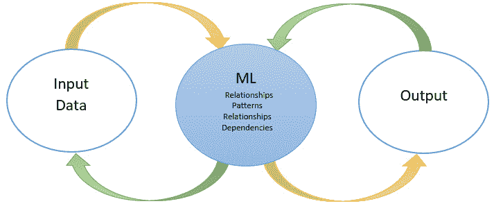

图 13.1 - 机器学习及其与输入和输出的关系

在 ML 中，数据与统计工具结合起来预测输出。机器接收输入数据并使用算法构建答案。这类似于**数据挖掘**，其中使用大型数据集来发现异常、相关性、模式等，以预测结果。

在数据挖掘中，我们提取信息，但使用方法提取必要的、相关的、无误的数据点。也就是说，通过数据挖掘，我们从数据集中提取我们需要的内容，而不提取那些异常值，同时还要查看数据中的相关性和模式。数据挖掘和 ML 之间的区别在于 ML 分析输入数据和输出数据。因此，一旦输出被处理，它就会回到算法中，被馈送回输入数据，并重新处理。这个循环是持续的，正如您可以从前面的图表中看到的那样。

重要提示：

有四组 ML 算法，但在本书中，我们只会介绍其中两种。虽然这不是一本 ML 书，但 Python 在 ML 领域的应用仍在不断增长，因此了解编程语言的应用以及如何使用计算思维来解决问题与我们的目标相关。

在 ML 中，我们使用两种重要的技术：

+   **监督学习**映射数据对，使用输入数据和期望输出（训练数据），以便模型可以找到潜在的模式。

+   **无监督学习**使用无标签的训练数据进行结论。

此外，还有两种我们不会在本书中介绍的技术：半监督学习和强化学习。

在监督学习中，学习算法被提供一组输入以及它们的期望输出（也称为标签）。目标是发现一条规则，使计算机能够重新创建输出，或者换句话说，映射输入和输出。另一方面，无监督学习允许我们在几乎不知道我们的结果应该是什么的情况下解决问题。输出变量是无标签的。使用无监督学习，算法被提供一组输入，但没有期望的输出，这意味着算法必须自行找到结构和模式。

以下图表显示了监督学习和无监督学习的路线图：

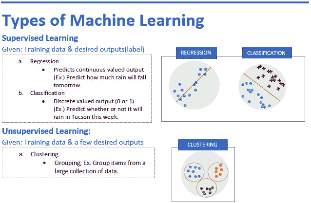

图 13.2 - 机器学习类型

从前面的图表中可以看出，我们有两种**监督学习**。当我们获得训练数据和期望的输出时，我们使用**回归**或**分类**。使用**回归**，我们预测连续值输出。使用**分类**，我们得到离散值输出（0 或 1）。回归的一个例子是预测某一天会有多少降雨，而分类则是想知道是否会下雨。

对于**无监督学习**，前面的图包含了**聚类**的示例。在**聚类**中，我们获得训练数据，但只有少量期望的输出。聚类的一个例子是**分组**，它会从大量数据中获取项目并对其进行分组。

我们可以将这些类型的学习风格应用于**人工神经网络**。神经网络的训练通常是通过确定网络的处理输出（通常是预测）与目标输出之间的差异来进行的。这就是错误，因此网络根据学习规则调整其加权关联，并使用此错误值进行调整。神经网络通常组织成层。层由包含激活函数的多个相互连接的节点组成。

激活函数用于决定神经元是否被激活。为此，计算加权和，然后添加偏差。我们使用激活函数为神经元提供非线性的输出。最常见的三种激活函数如下：

+   **Sigmoid**可以表示为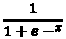，其中实数的输入为*x*。它返回一个在-1 和 1 之间的值。

+   **Tanh**由*tanh(x)*给出。它是一个具有实数输入*x*的双曲正切函数；它返回一个在-1 和 1 之间的值。

+   **修正线性单元**（**ReLU**）是一个分段线性函数。如果输入是正数，则输出与输入相同，否则为 0。

以下图表显示了与上述每个激活函数相关的图表：

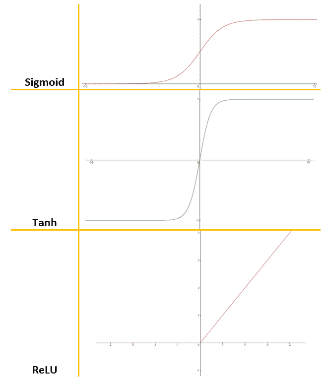

图 13.3 - 激活函数

模式通过**输入层**呈现给网络，该层与一个或多个**隐藏层**通信，实际处理是通过一组加权**连接**完成的。隐藏层然后链接到一个**输出层**，答案作为下图所示的输出输出：

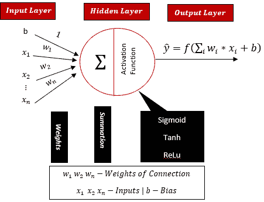

图 13.4 – 人工神经网络（ANN）模型

正如您所见，求和运算符（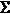）接受输入值并通过网络创建输出。它们必须被求和，并在进入新节点时返回单个值。激活函数本质上是*压缩*输入并将其转换为表示节点应该贡献多少的输出值（即节点何时应该触发）。当节点被激活时，节点被认为是*激活的*。它获取输出值并将其转换，以便下一个节点可以将其作为输入。这称为**激活**。

现在让我们看看如何使用 pandas 对数据进行分类。

## 分类数据示例

现在让我们看一个分类数据的例子。以下屏幕截图显示了使用监督学习的示例。为了生成屏幕截图中可以看到的输出，我们使用了来自[www.kaggle.com](http://www.kaggle.com)的现有数据集。该数据集称为**皮马印第安人糖尿病数据库**。它描述了皮马印第安患者是否被诊断出患有糖尿病：

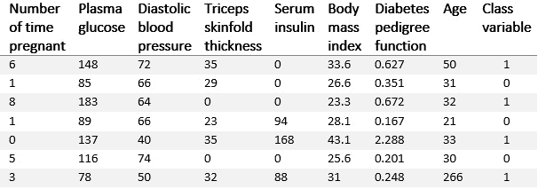

图 13.5 – 无监督学习示例

正如您所见，表格中的属性，也称为*输入变量*（*x*），如下所示：

+   怀孕次数

+   口服葡萄糖耐量试验 2 小时后的血浆葡萄糖浓度

+   舒张压（mm Hg）

+   三头肌皮褶厚度（mm）

+   2 小时血清胰岛素（mu U/ml）

+   体重指数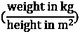

+   糖尿病谱系功能

+   年龄（年）

对于*输出变量*（*y*），我们有类变量（0 或 1）。从数据集中，每一行代表一个患者，以及该人在过去 5 年内是否被诊断出患有糖尿病。正如您所见，有八个输入变量和一个输出变量（如前图所示的最后一列）。

我们将使用二元分类模型（1 或 0），将输入变量（*x*）的行映射到输出变量（*y*）。这将总结为*y = f(x)*。以下代码片段使用此信息来获取我们的输出。请注意，我们将在整个示例中逐步讨论完整的文件：

ch13_diabetesA.py

```py
import pandas as pd
import matplotlib.pyplot as plt
import numpy as np
dataset = pd.read_csv('diabetes.csv')
```

正如您从前面的片段中所看到的，我们正在上传名为`diabetes.csv`的数据集（来自 Kaggle）。如果您需要提醒如何保存文件并找到所需的路径，请参阅*第十二章*，*在*使用 Python 进行实验和数据分析问题*中，*了解使用 Python 进行数据分析*部分。有许多上传数据集的方法。

就像我们在*第十二章*中所做的那样，我们使用非常流行的**pandas**并将其导入为`pd`。Pandas 用于数据操作和分析。它提供了用于操作数值表和时间序列的数据结构和操作。来自 pandas 的`read_csv()`函数处理从**逗号分隔值**（**CSV**）中导入数据的值。

重要提示：

我们需要找到正确的目录。当您调用`.csv`文件时，请确保您在正确的目录中（即`.csv`文件所在的位置），以避免错误代码。在使用`import os`后使用`os.chdir()`，然后使用`print('Current directory', os.getcwd())`。有关更多信息，请参见*第十二章*，*在实验和数据分析问题中使用 Python*。

运行上述代码片段后，您可以查看变量资源管理器，以查看以下截图中显示的项目。请注意，**变量资源管理器**是一个工具，允许您浏览和管理与您的代码相关的对象。该工具是**Spyder**环境的一部分，它运行 Python 并具有附加功能和编辑工具，如变量资源管理器。变量资源管理器位于我们环境的右上方。以下截图显示了变量资源管理器中我们数据库的视图：

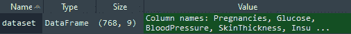

图 13.6 - 变量资源管理器示例

正如您所看到的，**Size**描述了数据集。它显示了患者数量**786**和变量总数**9**。现在我们对数据集有了更好的理解。

但是假设你不知道你将需要什么类型的学习。您可以在控制台中键入此函数，以获得数据和输出的完整图片：

```py
dataset.describe(include='all')
```

以下截图显示了我们在算法中使用上述代码行后收到的信息：

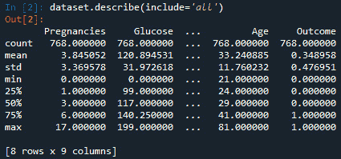

图 13.7 - 运行描述算法后的信息显示

从上图可以看出，我们能够获得所有数值特征，并知道没有分类数据。我们希望获得这些信息，因此可以使用以下代码行来查看变量之间的相关性：

```py
dataset.corr()
```

这一行简单的代码帮助我们获得以下截图中显示的信息。请注意，以下截图可能会因您使用的环境而有所不同。在运行此代码时，使用**Spyder**或**Jupyter**等环境时，根据您的主题设置和选择，表格可能会有所不同，具有不同的颜色方案（或没有颜色方案）：

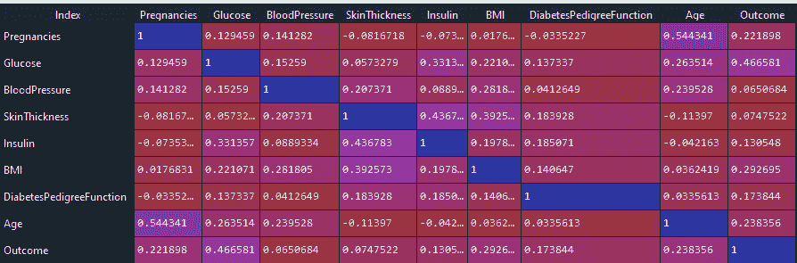

图 13.8 - 数据集相关图

我们可以看到所有变量与结果（输出（*y*））之间的相关性。前面的截图显示了血浆葡萄糖与结果的最强相关性，胰岛素的相关性最低。

现在我们对数据集有了更好的理解，让我们将输入变量和输出变量分开放入模型。让我们看一下我们的`ch13_diabetesA.py`文件中的以下代码片段，这为我们提供了示例：

```py
#Split dataset into input(x) and output(y) variables 
x_variables = dataset.iloc[:,0:8]
y_variable = dataset.iloc[:,8]
```

我们使用`print`函数来检查我们的值：

```py
print(x_variables)
print(y_variable)
```

运行上述代码片段后，输出数据将如下截图所示。请注意，结果显示了我们定义为变量`x_variables`和`y_variable`，这些变量又被定义为数据集的一部分，如前面的代码中所述：

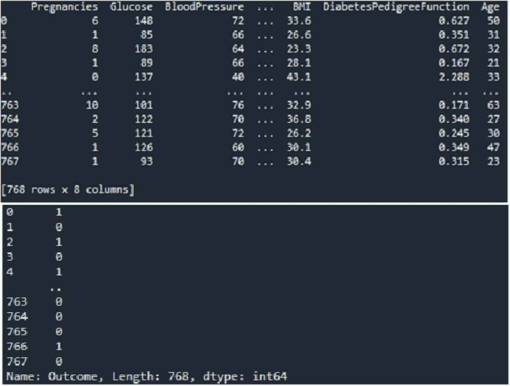

图 13.9 - 用于算法打印输入和输出值的训练数据集输出

现在我们需要将数据分割成训练数据集和测试数据集。分割技术的目的是评估 ML 算法的性能。它仅适用于任何类型的监督学习算法。第一组（训练数据集）用于拟合模型。

主要目标是将其拟合到具有已知输入和输出的可用数据上，然后对将来的新示例进行预测，在那里我们没有预期的输出或目标值。

## 使用 Scikit-Learn 库

在处理数据和机器学习时，另一个重要的库是`scikit-learn`（`sklearn`）库。该库特别适用于分类、回归、聚类、模型选择、降维等。您可能还记得*第十二章*，*在实验和数据分析问题中使用 Python*，在*在 Python 中使用数据库*部分中，您可以使用**命令提示符**窗口中的`pip install`来安装所需的库。一旦您有了库，就可以将其导入到代码中，如下面的代码片段所示，该代码片段使用`sklearn`来拆分数据。需要注意的是，此代码片段是较大的`ch13_diabetesA.py`文件的一部分：

```py
from sklearn.model_selection import train_test_split
X_train,X_test, y_train,y_test = train_test_split(
    x_variables, y_variable, test_size = 0.20, 
    random_state = 10)
```

以下是已知的参数：

+   `x_variable`和`y_variable`如前所定义。

+   `test_size`：测试大小将占数据集的 20%。

+   `random_state`：它设置了随机生成器的种子，因此您的训练和测试拆分始终是确定性的。如果设置为 none，则返回一个随机初始化的`RandomState`对象。

以下图表显示了该过程以及每个元素如何在循环中相互作用：

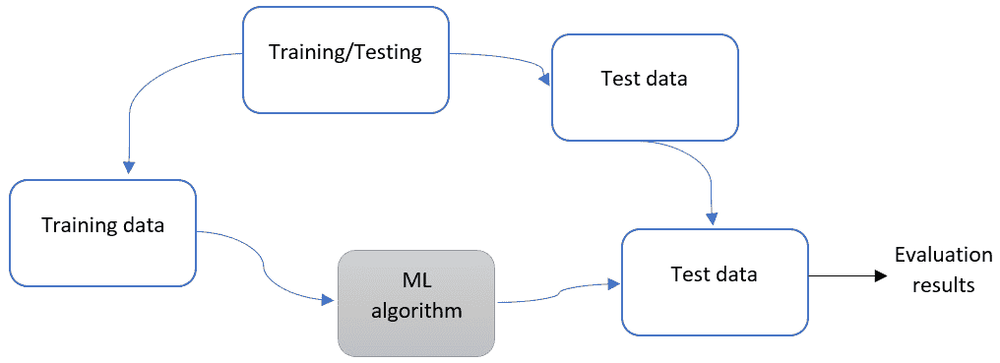

图 13.10 - 机器学习中的数据循环

请注意，我们将在算法中使用顺序模型。此外，我们使用`keras`库，它与 Python 一起使用，因此我们可以运行我们的算法与深度学习模型。确保您有`keras`库可用于此算法。如果您已安装了 TensorFlow，则应该已经可以访问 Keras 库。

在处理机器学习问题和算法时，您可以选择使用不同的库。我们选择了 Keras 来解决这个特定的问题。Keras 是开源的，用于创建人工神经网络。TensorFlow 是一个包含许多机器学习组件和任务的平台。

Keras 建立在 TensorFlow 之上，并使其更容易与 Python 编程语言交互。Keras 是一个更高级的 API，我们将进一步讨论。由于其容量，它有时可能比平常慢。**PyTorch**是另一个用于人工神经网络的库。它是一个较低级别的 API，因此运行速度更快。Keras 由**Google**支持，而 PyTorch 由**Facebook**支持。两者都很有帮助，因此决定使用哪一个通常是开发人员的偏好。就我个人而言，我更喜欢 Keras 库。

顺序 API 允许您逐步创建模型层。还有另外两个可用的模型，**功能 API**和**模型子类化**。我们将使用顺序 API，因为它是最简单的架构，而功能 API 用于深度学习（复杂模型）和模型子类化。

有几件事情我们应该注意使用 Keras：

+   模型类是根类，用于定义模型的架构。

+   像 Python 本身一样，Keras 使用面向对象的编程，这意味着我们可以添加子类。

+   模型中的子类是可定制的。

尽管如此，还应该注意到，与使用顺序或功能 API 相比，子类化更具挑战性。现在让我们看一下使用我们的 Keras 库更新的算法。记得包括你的文件目录或将`.csv`文件保存到必要的目录以正确运行算法：

ch13_diabetesB.py

```py
from sklearn.model_selection import train_test_split
from keras import Sequential from keras.layers import Dense
#Defining the Model
model = Sequential()
model.add(Dense(12, input_dim=8, activation='relu'))
model.add(Dense(15, activation='relu'))
model.add(Dense(8, activation='relu'))
model.add(Dense(1, activation='sigmoid'))
```

从前面的代码片段中，我们可以看到我们添加了四个密集连接的层。

第一层建立如下：

+   12 个神经元

+   `input_dim = 8`（即，输入进入网络的输入值）

+   `激活'relu'`

如您所见，我们已经添加了多个模型并对其进行了定义。为了编译模型，我们使用了同一代码文件中包含的以下代码片段。我们还可以设置`model.fit`来使用我们的库和以下代码，这是我们的`ch13_diabetesB.py`文件的一部分：

```py
#Compile the model
model.compile(loss='binary_crossentropy', optimizer='adam', 
    metrics=['accuracy'])
#Fit the model on the dataset
model.fit(x_variables, y_variable, epochs=95, 
    batch_size=25)
#Evaluate the model
_, accuracy = model.evaluate(x_variables, y_variable)
print('Accuracy: %.2f' % (accuracy*100))
model.summary()
```

前面的代码编译了 Adam 优化器。Adam 优化器用于随机梯度下降，并使用训练数据迭代更新网络权重。一旦我们运行我们的代码，输出会提供以下信息：

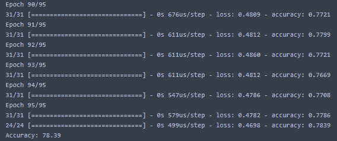

图 13.11 - 使用 Keras 库运行模型的输出

请注意，当您运行算法时，准确性可能会有所不同。多次测试算法以查看窗口中的变化。在运行准确性模型后，我们打印模型摘要，使用`model.summary()`，如下所示：

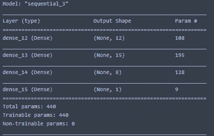

图 13.12 - 算法的模型摘要

现在我们已经看到如何使用糖尿病数据文件运行我们的算法，让我们简要地看一下一些优化模型，这将帮助我们评估算法。我们不会深入研究这些算法，但我们想提到一些可用于我们的各种工具。在建模时，我们使用优化模型，如**二元交叉熵**、**Adam 优化算法**和**梯度下降**。

## 定义优化模型

让我们看看模型的类型。请注意，我们并没有深入研究这些模型的使用，但建议进一步探索它们在我们算法中的应用。

### 二元交叉熵模型

在二元分类中，我们使用交叉熵作为默认的**损失函数**。损失函数是一种帮助我们评估算法如何对数据建模的方法。有了损失函数，我们可以使用优化来产生更准确的结果，即它有助于减少**预测误差**。当目标值在二进制集中时，我们使用损失函数。

交叉熵是一种损失函数，用于计算两个概率分布之间的差异。在使用**逻辑回归**和**人工神经网络**优化分类模型时，我们可以使用交叉熵。

### Adam 优化算法

Adam 算法是一种**随机优化**方法。当函数中存在随机性以最大化或最小化函数的值时，使用随机优化。Adam 优化算法适用于一些*非凸*的简单优化问题。它高效且占用内存少，但可以应用于大型数据集。

### 梯度下降模型

梯度下降算法是一种一阶优化算法。一阶指的是线性局部误差。我们在可微分的函数上使用梯度下降来找到局部最小值。

### 混淆矩阵模型

混淆矩阵也被称为**错误矩阵**。混淆矩阵在视觉上很有帮助，因为它以表格形式呈现算法的性能，这样可以更好地可视化性能。它通常用于监督学习。

正如所述，这只是一些基本信息，当您开始优化算法时。关于 ML 的更多信息可以在其他 Packt 图书中找到，例如*Python 机器学习*和*Python 探索性数据分析*。

在我们进入对聚类的介绍之前，让我们快速回顾一下在本节中使用 Keras 包和模型学到的内容：

+   加载数据

+   在 Keras 中定义神经网络

+   使用高效的数值后端编译 Keras 模型

+   在数据上训练模型

+   在数据上评估模型

+   使用模型进行预测

现在让我们转向数据聚类。

# 实施数据聚类

在本节中，我们将看一下如何处理数据聚类。首先，让我们定义一下我们所说的**数据聚类**。数据聚类是指我们如何将数据分成组或簇。如果簇能够提供对领域知识的扩展理解，那么簇就是有意义的。我们在许多应用中使用聚类，比如医学领域，聚类可以帮助识别一组患者对治疗的反应，或者市场研究，聚类用于根据特定群体的特征来对消费者进行分组以吸引该群体。

在本讨论中，我们将看一下合成簇而不是应用簇。在*第十六章*，*高级应用计算思维问题*中，你将看到一些上下文中的簇的例子。**合成簇**是由合成数据集生成的。也就是说，我们使用算法生成数据集。让我们看一下下面的代码片段：

ch13_syntheticDataset.py

```py
from numpy import where
from sklearn.datasets import make_classification
from matplotlib import pyplot
#Create a synthetic dataset
X, y = make_classification(n_samples = 1800, 
    n_features = 2, n_informative = 2, n_redundant = 0, 
    n_clusters_per_class = 1, random_state=4)
#Scatterplot
for class_value in range(2):
	row_ix = where(y == class_value)
	pyplot.scatter(X[row_ix, 0], X[row_ix, 1])
#Display plot
pyplot.xlabel('variable 1')
pyplot.ylabel('variable 2')
pyplot.title('Synthetic data graph')
pyplot.show()
```

从前面的代码片段中可以看到，我们确定了样本数量、特征数量和簇的数量等等。此外，我们还创建了合成数据的散点图并绘制了结果。下面的图展示了我们的合成数据集作为散点图的结果：

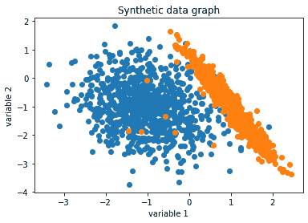

图 13.13 – 合成数据集散点图

请注意，这个合成数据集的样本数量为`1800`。尝试改变样本数量来看看散点图的变化。现在我们有了数据集，我们可以开始应用聚类算法。以下是一些常见的聚类算法：

+   **BIRCH 算法**

+   **K 均值聚类算法**

我们将在接下来的章节中看到上述的算法。

## 使用 BIRCH 算法

**平衡迭代减少和层次聚类**（**BIRCH**）是一种聚类算法，只要有足够的可用内存和时间，就可以使用聚类中心。对于 BIRCH 和 K 均值聚类算法，我们将分享一个算法和相应的图表，以便更好地理解它们。

以下代码片段展示了 BIRCH 算法：

ch13_BIRCH.py

```py
from numpy import unique
from numpy import where
from sklearn.datasets import make_classification
from sklearn.cluster import Birch
from matplotlib import pyplot
#Synthetic dataset definition
X, _ = make_classification(n_samples = 1800, 
    n_features = 2, n_informative = 2, n_redundant = 0, 
    n_clusters_per_class = 1, random_state = 4)
#Define the BIRCH model
model = Birch(threshold = 0.01, n_clusters = 2)
model.fit(X)
yhat = model.predict(X)
#Clusters
clusters = unique(yhat)
#Display
for cluster in clusters:
	row_ix = where(yhat == cluster)
	pyplot.scatter(X[row_ix, 0], X[row_ix, 1])
pyplot.show()
```

请注意，在这个示例中我们任意选择了两个簇，就像你在代码行`model = Birch(threshold = 0.01, n_clusters = 2)`中看到的一样。我们坚持使用我们的 1800 个样本，这样我们可以比较我们的输出图。下面的截图展示了两个样本的 BIRCH 模型。第一个（*左侧*）展示了前面代码片段中提供的算法运行的情况。第二个（*右侧*）展示了相同的算法运行，但是为了三个簇。

为了运行第二个图，我们将模型行代码更改为以下内容：

```py
model = Birch(threshold = 0.01, n_clusters = 3) 
```

看一下下面的图，显示了`n_clusters = 2`和`n_clusters = 3`的情况：

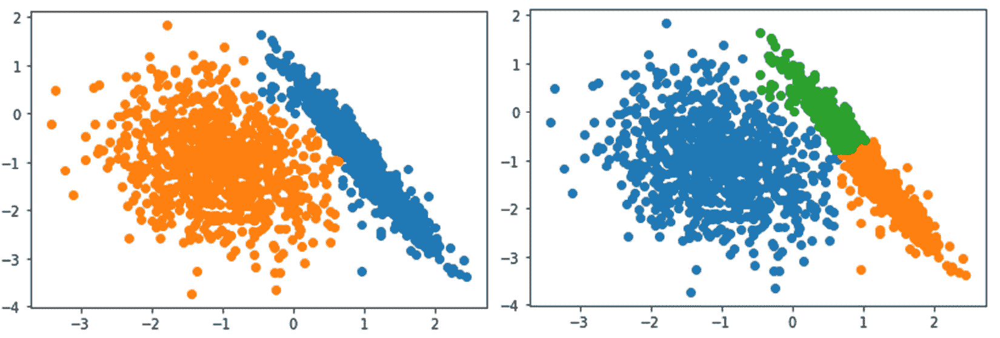

图 13.14 – 分别使用 2 和 3 个簇的 BIRCH 模型

请注意，在前面截图的*左侧*，清楚地显示了两个簇。与*图 13.13*相比，你可以看到一些数据点已经被转换以适应每个被识别的簇。前面截图的*右侧*的散点图将数据分成了三个不同的簇。为了更加熟悉聚类算法，改变参数来看看当你改变簇的数量、样本大小和其他参数时会发生什么。

现在让我们来看一下 K 均值聚类算法。

## 使用 K 均值聚类算法

K 均值聚类算法是最常用的聚类算法之一。该算法将示例分配到每个识别的聚类中以最小化方差。与 BIRCH 算法类似，我们在算法中设置了聚类的数量。让我们看一下 K 均值代码片段：

ch13_KMeans.py

```py
from numpy import unique
from numpy import where
from sklearn.datasets import make_classification
from sklearn.cluster import KMeans
from matplotlib import pyplot
#Dataset definition
X, _ = make_classification(n_samples = 1800, 
    n_features = 2, n_informative = 2, n_redundant = 0, 
    n_clusters_per_class = 1, random_state = 4)
#Model identification and fit
model = KMeans(n_clusters = 2)
model.fit(X)
#Clusters
yhat = model.predict(X)
clusters = unique(yhat)
#Display
for cluster in clusters:
	row_ix = where(yhat == cluster)
	pyplot.scatter(X[row_ix, 0], X[row_ix, 1])
pyplot.show()
```

再次注意，我们使用相同数量的聚类（`2`）和样本数量（`1800`），以便进行比较。以下屏幕截图显示了前述算法产生的 K 均值散点图输出：

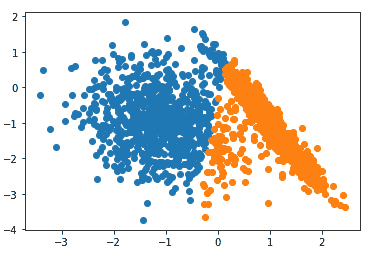

图 13.15 – K 均值算法输出

请注意，数据仍然完全相同，然而，当我们比较从 BIRCH 算法和 K 均值算法得到的显示时，您会发现我们的算法为我们的聚类产生了非常不同的结果。

我们可以使用和测试许多其他的聚类算法。了解它们并比较结果对于确定基于真实数据集使用哪些算法是至关重要的。在这种情况下，K 均值算法的结果并不真正适合模型。当使用两个聚类时，BIRCH 模型似乎更合适，因为 K 均值算法中的方差是不均等的。

随着我们从聚类示例中继续前进，请注意，对于大部分数据科学和机器学习而言，我们使用模型和算法的越多，我们就越了解它们的用途，以及何时使用这些模型是合适的，我们可以学会通过视觉识别算法是否适合我们的数据。

# 总结

在本章中，我们学习了如何使用 Python 编程语言中可用的一些包来创建大型数据集的模型。我们使用了 Keras 等包来上传数据和定义神经网络。我们训练了模型并评估了模型。我们使用模型进行预测。我们还学习了数据的分类和测试以及如何处理数据聚类。阅读完本章后，您现在可以定义数据训练以及 Python 在数据训练中的用途。您还可以定义和使用聚类算法。

我们将在下一章继续探讨这里讨论的一些主题。我们还将在*第十六章*中提供的示例中看到一些这些应用，*高级* *应用计算思维问题*。
