# *第十四章*：在统计分析中使用计算思维和 Python

在本章中，我们将使用 Python 和计算思维的元素来解决需要统计分析算法的问题。我们将使用**pandas DataFrames**在 Python 环境中创建统计分析算法。在 Python 中还需要其他软件包来创建统计分析，例如**NumPy**、**pytz**等。当我们需要处理的代码和学习这些库帮助我们做什么时，我们将使用这些软件包，比如使用 pandas 整理数据。

在本章中，我们将涵盖以下主题：

+   定义问题和 Python 数据选择

+   数据预处理

+   使用可视化处理、分析和总结数据

在本章结束时，您将能够设计最适合您所面临情况的算法。您还将能够确定与所提出问题最符合的 Python 函数，并概括您的解决方案。

# 技术要求

您需要最新版本的 Python 来运行本章的代码。

在本章的问题中，您需要安装**pandas**、**NumPy**、**SciPy**和**Scikit-Learn**软件包。

您可以在本章中找到使用的完整源代码：[`github.com/PacktPublishing/Applied-Computational-Thinking-with-Python/tree/master/Chapter14`](https://github.com/PacktPublishing/Applied-Computational-Thinking-with-Python/tree/master/Chapter14)

# 定义问题和 Python 数据选择

在我们看 pandas 库之前，让我们定义一下数据分析是什么。当我们谈论数据分析时，我们指的是检查、清洗、转换和建模数据的过程，目的是发现有用的数据，通知结论，并支持决策。决策是至关重要的。我们不只是想看看数据在过去发生了什么。我们希望利用数据来为未来做出知情决策。

看一下数据分析的一些用途：

+   **商业**：它有助于基于客户趋势和行为预测做出决策，提高业务生产力，并推动有效的决策。

+   **天气预报**：收集和分析大气数据（温度、湿度、风力等）以了解大气过程（气象学），从而确定大气将来的演变。

+   **交通**：数据可用于确定趋势，包括交通、事故等，帮助我们做出关于交通模式、交通灯持续时间等的决策。

上述用途只是可能应用的一部分。数据分析被用于非常广泛的事情，由企业和教育组织做出关键决策，为社区提供资源，资助我们的学校和大学，以及更多。

因此，让我们看看我们有哪些工具可用于分析数据。在 Python 中用于数据分析的主要库之一是 pandas 软件包。pandas 的伟大之处在于其易用性、简单的数据结构和高性能。使用 pandas 简化了我们在数据分析中的工作。

## 定义 pandas

重要的一点是 pandas 是建立在 NumPy 之上的。**NumPy**是一个帮助我们处理数组的软件包。Python 本身并没有数组，因此这些软件包允许我们创建、使用数组，然后在此基础上构建。

Pandas 提供了一种灵活且简单的数据结构，可以简化您在数据分析中的工作。它是处理**大数据**的强大工具。当我们谈论大数据时，我们指的是结构化和非结构化数据集，这些数据集经过分析，以便我们可以获得更好的见解，并帮助业务和组织制定决策或策略。pandas 可以处理导入不同格式的数据，如`.csv`文件、**SQL**和**JSON**，以及各种操作，如选择数据、合并、重塑和清理数据。

在 pandas 中有两种不同的存储数据的方式——系列和数据框：

+   **Series**是一维数组，可以容纳任何数据类型（整数、字符串或浮点数）；系列代表一列数据。

+   **数据框**是可以具有多个列和数据类型的二维对象。它接受诸如字典、系列、列表和其他数据框的输入。

现在让我们学习何时使用 pandas。

## 确定何时使用 pandas

总的来说，Pandas 在一般情况下非常有用，但当我们处理大量数据并使用**逗号分隔值**（**CSV**）文件时，它真的是一个很好的工具。这些文件被存储为表格，如电子表格。另一件事是我们可以在 pandas 中建立*块*。是的，在 pandas 中有一个`chunksize`参数，可以帮助我们分解数据。假设我们有 500 万行。我们可以决定使用`chunksize`将其分解为 100 万行。

此外，有时我们有大量的数据文件，但只想查看其中的一些组件。Pandas 允许我们标识要包含的列和要忽略的列。

### 处理 pandas 系列

如前一节所述——*定义 pandas*——系列是一维的。我们可以使用一些简单的代码创建一个空的 pandas 系列。请注意，通常在使用包和库时，我们首先导入 pandas 库，如下所示：

```py
import pandas as pd
demo_series = pd.Series()
print(demo_series)
```

默认创建的系列将具有`float`类型，因为我们在算法中没有建立其他类型。然而，控制台打印了一个警告，即在将来，空系列的**dtypes**将被设置为对象，而不是`float`。`dtype`代表数据类型；在这种情况下，它是一个浮点数。看一下以下截图，显示了我们运行算法时的输出：

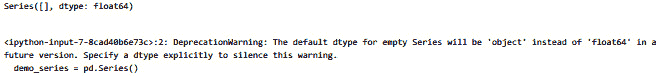

图 14.1 – 在 pandas 中创建空系列时未识别 dtype 时的输出

正如您所看到的，这里实际上并没有错误，只是关于数据存储方式的警告。

现在，让我们创建一个具有定义元素的系列。为此，我们需要导入 pandas 和`numpy`，以便我们可以创建数组，然后创建系列。看一下以下代码片段：

```py
ch14_seriesDemo.py
import pandas as pd
import numpy as np
dataset = np.array(['yellow', 'green', 'blue', 'violet', 'red'])
data_series = pd.Series(dataset)
print(data_series)
```

正如您从前面的代码中看到的，我们使用`numpy`存储了我们的数组，然后使用该数组创建了一个系列。最后，我们打印了系列。输出是一个表格，如下所示：

```py
0    yellow
1     green
2      blue
3    violet
4       red
dtype: object
```

我们也可以通过首先创建一个列表来获得完全相同的结果。看一下这段代码：

ch14_seriesDemo2.py

```py
import pandas as pd
import numpy as np
myList = ['yellow', 'green', 'blue', 'violet', 'red']
data_series = pd.Series(myList)
print(data_series)
```

请注意，我们直接从列表中创建了系列。我们不打算展示这段代码的输出，因为它与上一段代码的输出完全相同。

我们也可以从字典中获得一个系列。让我们看一下以下代码片段：

ch14_seriesDemo3.py

```py
import pandas as pd
myDictionary = {
    'Name' : 'Miguel',
    'Number' : 42,
    'Age' : 'unknown'
    }
mySeries = pd.Series(myDictionary)
print(mySeries)
```

前面的代码只是一个演示，但当我们运行算法时，我们确实得到了一个包含字典值的表系列。让我们看一下输出：

```py
Name       Miguel
Number         42
Age       unknown
dtype: object
```

正如您所看到的，我们有基于键值对的两列，以及类型为`object`。一个重要的一点是系列没有列标题。为此，我们需要使用数据框。

*如果我们想要访问系列中的特定元素怎么办？* 好吧，要访问第一个元素，让我们使用以下代码片段：

ch14_demo4.py

```py
import pandas as pd
myDictionary = {
    'Name' : 'Miguel',
    'Number' : 42,
    'Age' : 'unknown'
    }
mySeries = pd.Series(myDictionary)
print(mySeries[0])
```

前面代码的输出只是`Miguel`。这是因为我们使用索引 0 来标识我们从字典中想要的内容，因此它将为我们提供第一个键值对的值。如果我们想要前两个键值对元素的值对，我们将`(mySeries[0])`替换为`(mySeries[:2])`。然后，输出将如下所示：

```py
Name      Miguel
Number        42
dtype: object
```

系列还有许多其他事情可以做，因此可以尝试使用索引和使用列表、字典或 NumPy 数组创建不同类型的系列。现在，让我们继续学习数据框。

### 使用 pandas 数据框

现在，让我们来看看如何处理数据框。首先，让我们来看一个带有 pandas 的`.csv`文件。我们将在接下来的代码片段中使用`demo.csv`文件。请将文件的位置替换为您保存文件的位置，该位置可以在 GitHub 存储库中找到：

ch14_csvDemo.py

```py
import pandas as pd
data_set = pd.read_csv('C:\\...\\demo.csv')
data_set.head()
```

前面的代码做了三件事。它导入了 pandas 包，以便我们可以使用我们需要的数据功能，它告诉程序打开我们将要使用的数据文件，然后它给出了文件中的前几行数据，以便我们可以看到我们正在处理的内容。以下截图显示了前面代码的结果或输出：

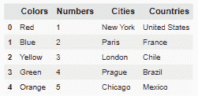

图 14.2 - 显示数据集的前几行输出

从前面的截图中可以看出，表格未显示文件中包含的所有值。虽然我们的文件不是充满大数据，但它确实包含更多的信息行。这只是让我们预览我们的数据的一种方式。

但这是一个*干净*的数据集。*如果我们有一个数据集的行或列缺少信息会发生什么？* 好吧，pandas 允许我们处理文件以准备好使用。数据框还可以准备我们的数据，以便我们可以创建可视化表示。这些可视化或图表将允许我们看到趋势，进行预测，确定我们可以用于训练的值，等等。数据框实际上只是我们可以用数据集做的其他一切的基础。

在这一部分，我们学习了问题，如何使用 pandas 以及 pandas 系列和数据框的一些功能。

作为一种注意，在本章的其余部分，我们将更加专注于数据框而不是系列。但在进入应用程序之前，让我们看看如何通过预处理数据框来避免错误和陷阱。

# 数据预处理

**预处理数据**是一种将原始数据转换为可用和高效格式的技术。实际上，这是数据挖掘和机器学习过程中最重要的步骤。

当我们预处理数据时，我们实际上是在清理它、转换它或进行数据减少。在本节中，我们将看看这些都意味着什么。

## 数据清理

**数据清理**指的是使我们的数据集更高效的过程。如果我们在真正大型的数据集中进行数据清理，我们可以加快算法，避免错误，并获得更好的结果。在数据清理时，我们处理两件事情：

+   **缺失数据**：这可以通过忽略数据或手动输入缺失数据的值来解决。

+   **嘈杂的数据**：这可以通过使用分箱、回归或聚类等其他过程来修复/改进。

我们将更详细地看看这些事情。

### 处理缺失数据

让我们看看我们如何处理缺失数据。首先，我们将学习如何忽略缺失数据。我们可以使用 pandas 找到具有缺失值的行。当我们这样做时，我们正在清理我们的数据集。现在，我们不会介绍我们可以使用的每种方法，只介绍一种可以去除具有缺失值的行的方法。与往常一样，使用的数据集可在我们的 GitHub 存储库中找到，并且您需要更新文件位置。让我们看看以下代码片段：

ch14_cleaningDemo1.py

```py
import pandas as pd
myData = pd.read_csv('C:\\...\\demo_missing.csv')
print(myData)
cleanData = myData.dropna(axis = 0, how = 'any')
print(cleanData)  
```

在前面的代码中，第一个`print`语句是为了我们自己看到我们的数据集是什么样子的。*您绝对不会想在大文件中这样做！*以下截图显示了第一个`print`输出：

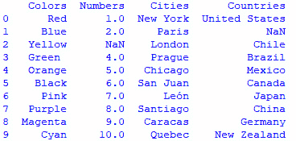

图 14.3 - 第一个打印语句，原始数据集

请注意，**1**，**Blue**列在**Countries**下有一个**NaN**值，下一列（**2**，**Yellow**）在**Numbers**列下有一个缺失值。当我们使用`dropna()`时，算法将删除具有缺失值的行。以下截图显示了带有修改后数据集的打印语句：

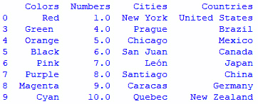

图 14.4 - 打印干净的数据集

从前面的截图中可以看到，缺少值的两行在我们的新数据集中被消除了。现在，我们可以对这些数据运行任何我们想要的分析。

如果您只想检查一个列以验证是否存在缺失值，您可以使用以下代码片段：

ch14_cleaningDemo2.py

```py
import pandas as pd
myData = pd.read_csv('C:\\...\\demo_missing.csv')
print(pd.isna(myData['Countries']))
```

请注意，在前面的算法中，我们使用`Countries`列标题来验证特定列。当我们运行算法时，我们的输出如下：

```py
0    False
1     True
2    False
3    False
4    False
5    False
6    False
7    False
8    False
9    False
Name: Countries, dtype: bool
```

如您所见，我们的数据集中的第二行在`Countries`列中有一个缺失值。

虽然我们不会详细介绍每种方法，但您也可以删除列。您可以选择删除具有一定数量缺失值的行和/或列。例如，您可以选择仅删除具有两个以上缺失值的行或列。如果这样做，您仍然需要担心可能仍然缺少值的列或行，因为只有一个缺失值而未被删除。对于这些情况，您可以选择用其他值替换缺失值。

假设您想要根据列替换一个值。要这样做，让我们看一下以下代码片段：

ch14_cleaningDemo3.py

```py
import pandas as pd
myData = pd.read_csv('C:\\...\\demo_missing.csv')
print(myData.fillna(0))
```

从前面的代码中可以注意到，我们正在用值`0`填充每个空单元格。当我们运行算法时，我们得到以下输出：

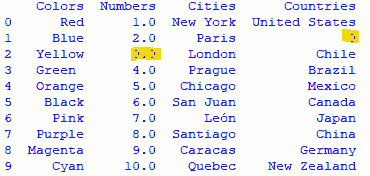

图 14.5 - 替换缺失值

请注意前面截图中突出显示的值。这些是我们的算法替换的值。现在，让我们看一下我们如何处理嘈杂数据。

### 处理嘈杂数据

首先，让我们定义一下**嘈杂数据**的含义。当我们有大量数据，其中一些对我们的分析没有用处时，我们称之为嘈杂数据。嘈杂数据也用于指代数据损坏。*实际上，它只是无用的数据*。

我们处理嘈杂数据的三种方法是分箱、回归和聚类：

+   **分箱**使用相邻数据来平滑排序后的数据值。排序后的值放入箱中，这些箱是算法内创建的组。

+   **聚类**方法识别并移除数据集中的异常值。

+   **回归**方法通过将数据拟合到回归函数中来平滑数据。

分箱的目的是减少一些错误。在分箱中，数据被分成小的桶或箱。然后用计算出的箱值替换数据。当我们进行分箱过程时，我们正在平滑数据。

以下是算法中一个简单的数值数据集的示例。以下代码片段将创建具有相等频率的箱：

ch14_binning1.py

```py
#Binning with equal frequency
def equal_frequency(array1, m): 
	l = len(array1) 
	n = int(l / m) 
	for i in range(0, m): 
		array = [] 
		for j in range(i * n, (i + 1) * n): 
			if j >= l: 
				break
			array = array + [array1[j]] 
		print(array) 
#Input dataset 
dataset = [3, 6, 7, 9, 11, 14, 10, 15, 19, 35, 38, 45, 48, 49, 76] 
#Input number of bins
m = 5
print("Equal Frequency Binning: ") 
equal_frequency(dataset, m) 
```

在查看前面的代码时，您可以看到箱的数量被定义为`5`，因此数据将被分成五个列表。分箱实际上是一种分组信息的方法。我们告诉算法我们想要这样做以及我们想要多少个箱，它就会提供这些箱或组中的数据。在这种情况下，我们得到了这五个列表。看一下输出：

```py
Equal Frequency Binning: 
[3, 6, 7]
[9, 11, 14]
[10, 15, 19]
[35, 38, 45]
[48, 49, 76]
```

如您所见，算法创建了五个箱，每个箱中有三个值。

重要提示：

请注意，分箱过程并不为我们组织数据。因此，如果我们重新排序我们的值，它们仍然会按照数据输入的顺序进行分箱。

现在，让我们看一个使用等宽度的分箱算法：

ch14_binning2.py

```py
#Binning with equal width 
def equal_width(array1, m): 
	w = int((max(array1) - min(array1)) / m) 
	min1 = min(array1) 
	array = [] 
	for i in range(0, m + 1): 
		array = array + [min1 + w * i] 
	arrayi=[] 
	for i in range(0, m): 
		result = [] 
		for j in array1: 
			if j >= array[i] and j <= array[i+1]: 
				result += [j] 
		arrayi += [result] 
	print(arrayi) 
#Input dataset 
dataset = [3, 6, 7, 9, 11, 14, 10, 15, 19, 35, 38, 45, 48, 49, 76, 81, 208, 221] 
#Input number of bins
m = 3
print("\nEqual Width Binning:") 
equal_width(dataset, m)
```

上面代码片段将我们的数据分成了三个箱。等宽度分箱的目标是将数据集分成相等大小的箱，这在等宽度分箱的情况下意味着相等的范围。数据将被分割，但重要的是要注意，我们在这里谈论的是范围，因此对于这个特定数据集，这些箱中的元素数量不会相同。上面代码片段的输出如下：

```py
Equal Width Binning:
[[3, 6, 7, 9, 11, 14, 10, 15, 19, 35, 38, 45, 48, 49], [76, 81], [208]]
```

正如你所看到的，分箱产生的输出看起来并不像等频输出那样干净，但实际上更受欢迎。

现在，让我们谈谈数据转换。

## 转换数据

Pandas 允许我们转换数据。以下是一些我们可以转换数据的方法：

+   **归一化**将值转换为新的范围；最流行的是**最小-最大归一化**，如下所示：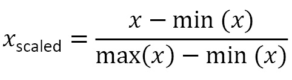

+   **属性选择**是通过用不同的属性或属性替换属性来转换数据的过程。

+   **概念层次结构**实际上是通过减少数据来进行的转换。它是通过用更高级的概念（如*短*、*长*、*极长*）替换数字（*10*、*15*、*40*）等概念来完成的。

在下一节中，我们将浏览数据的减少。

## 减少数据

数据减少是指一种过程，允许我们从数据集中减少数据的表示，但只有在减少数据的体积后才能获得类似甚至相同的结果。

我们不会在这里深入讨论所有概念，因为在示例中查看它们会更容易，但以下是一些数据减少的方法：

+   从数据集中删除无效数据

+   为不同级别的数据创建汇总

将无效数据移除可以看作是处理任何异常值。数据可能已被错误输入，条件可能不是最佳的，或者类似情况。当我们有一个数据点与整个数据集不符合时，特别是当我们有大量数据点进行比较时，我们可以将该数据点作为无效数据或异常值移除。

在创建不同级别的汇总时，我们对数据集进行聚合，并在每个级别进行测试和生成汇总。假设你有 100 个数据点（数据集通常会有数千个，但用较小的数字更容易解释）。我们可以为前 20 个数据点创建一个汇总。然后，我们可以对前 40 个数据点做同样的操作，然后是前 60 个，依此类推。通过比较，我们可以看到趋势，并利用数据集的这些较小子部分来进行预测，如果趋势成立的话。这就是数据减少的作用，简化数据集的同时仍然获得准确的结果。

在这一部分，我们学习了如何处理需要清理的数据。我们学习了一些清理数据的方法，比如消除缺失数据或替换缺失点。我们还了解了嘈杂数据以及如何解决数据集中的嘈杂数据问题。最后，我们学习了数据减少以及如何通过删除无效数据和创建数据的汇总来获得准确的结果。

这只是我们处理数据时所做的一些类型的简介。所以，让我们看一个例子，以便我们能把其中一些放入上下文中。

# 使用可视化处理、分析和汇总数据

我们现在在房地产领域工作，因为我们想做得好，我们真的想建立一个帮助我们分析数据并预测房价的算法。但是让我们再想一想。我们可以广义地或狭义地定义这个问题。我们可以对一个州的所有房屋或一个社区中三个或更多卧室的房屋进行定价分析。*进行分析重要吗？也许*。*但这难道不是我们想要研究这个问题的原因吗？*

让我们先来看看我们如何处理数据。

## 处理数据

让我们先收集一些数据。对于这个问题，我们使用的是`kv_house_data.csv`数据集，它可以在我们的 GitHub 存储库中找到。要查看这个数据集，我们需要很多库。我们主要谈论的是 Pandas，是的，但我们还想进行可视化和一些分析，所以我们还需要**Seaborn**、**SciPy**和**Scikit-Learn**。完整的算法可以在`ch14_housePrice_prediction.py`文件中找到。我们将逐步查看它，讨论我们在进行过程中所做的事情：

ch14_housePrice_prediction.py

```py
import pandas as pd
import numpy as np
import seaborn as sns
import matplotlib.pyplot as plt
```

*那么这些库都是什么？*我们知道 Pandas。我们使用它来组织我们的数据。NumPy 帮助我们处理数组。Seaborn 和 Matplotlib 都用于可视化。如果我们要进一步创建模型并使用数据集进行训练，我们还需要 Scikit-Learn。对于这个例子，我们将坚持在训练之前获得一些图表。

现在，让我们导入我们的数据集。还记得*第十二章*中提到的吗，*在实验和数据分析问题中使用 Python*，您可以直接设置文件的目录。您也可以提供数据文件的完整路径，就像我们在本章中之前做过的那样，比如在清理演示中。您可以使用`os.chdir()`来建立目录，将文件的位置添加到括号中，然后使用以下代码片段来读取`.csv`文件：

```py
housing_data= pd.read_csv("kc_house_data.csv")
```

我们在这里使用了一个 pandas 函数。*看到那个* `pd.read_csv()`*了吗*？那个`pd`就是 pandas，因为我们将 pandas 导入为`pd`，而`read_csv()`是允许算法获取文件中信息的函数。

如果您忘记输入您的目录或者包含错误的位置，您将会收到一个错误代码，如下面的截图所示：

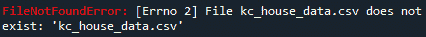

图 14.6 - 文件路径错误

正如您所看到的，Python 会确保您知道自己犯了一个错误。*有时这可能会让人恼火，但肯定是有帮助的。*

现在我们有了我们的数据，我们需要检查并清理它。这就是我们之前在本章中分享的所有内容发挥作用的地方。让我们看看实际情况是什么样子。

## 分析和总结数据

现在，有一件事我们并没有谈论太多，那就是 Python 的变量资源管理器。更具体地说，是**Spyder 的 Python 变量资源管理器**。Spyder 是一个集成环境，是免费的。它可以与 Python 一起工作，像平常一样运行 Python，但也为我们提供了更好的编辑工具。下面的截图显示了当您从 Python 的变量资源管理器中导入数据集时应该看起来的样子。当我们在 Spyder 中运行`ch14_housePrice_prediction.py` Python 算法时，我们可以在变量资源管理器中看到我们的变量。下面的截图显示了当我们运行这个算法时从变量资源管理器中获取的数据：

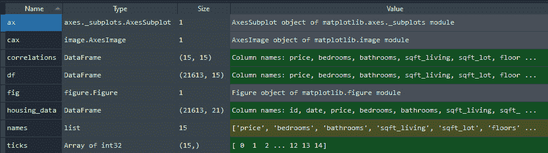

图 14.7 - Spyder 中的变量资源管理器视图

当我们处理大量数据和更大的算法时，这个工具变得非常关键。我们可以从这个工具中获得很多信息。例如，让我们看看`housing_data`变量。在*图 14.7*中，您可以看到我们算法中这个变量的类型是**DataFrame**，大小为**(21613, 21)**。

如果你在变量资源管理器中双击变量，你会得到以下截图中显示的内容（请注意，截图可能会因你使用的环境而有所不同。在使用 Spyder 或 Jupyter 等环境运行此代码时，取决于你的主题设置和选择，表格可能会有所不同，有不同的颜色方案或没有颜色方案）：

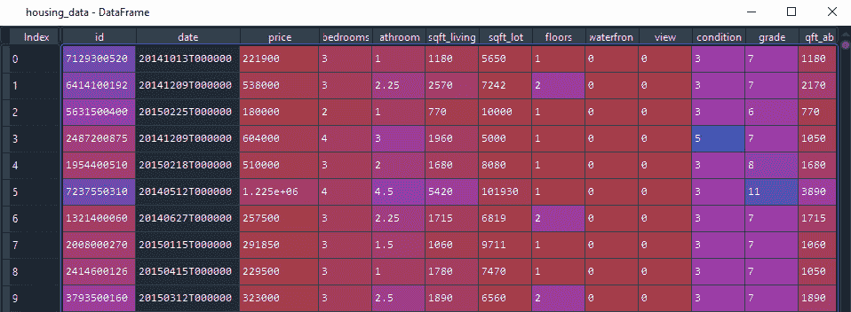

图 14.8 - Spyder 中的 DataFrame 变量视图

这只是获取 DataFrame 的一些信息的一种方式。Spyder 还允许我们调整窗口大小，这样我们可以查看更多列，滚动查找值等。如果我们在 Python 控制台中，这并不容易。你可以获取信息，只是不那么容易。

以下是可以为我们提供一些信息的代码：

```py
housing_data.head()
```

上面的代码将显示我们数据集的前五行。看一下以下截图；在**价格**和**经度**之间有省略号（**…**）。这是因为 Python 想让我们知道这两者之间还有其他列：

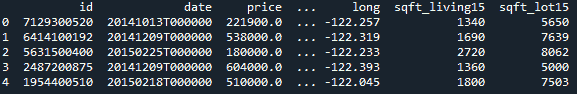

图 14.9 - DataFrame 的前几行

正如你所看到的，行帮助我们看到我们的数据集是什么样子，但没有其他信息。因此，我们还可以使用以下代码查看我们的 DataFrame 的大小：

```py
housing_data.shape
```

当我们运行上述代码时，我们会得到以下输出：

```py
(21613, 21)
```

如你所见，现在我们有了 DataFrame 的形状或大小。*这是什么意思？*这意味着我们有`21,613`行数据，`21`列。无论你是在 Spyder、Python 控制台还是其他你选择的环境中，你都可以看到你的数据已成功导入。

现在我们已经导入了原始数据，让我们看看是否可以获得更多信息。我们可以使用以下代码来获取摘要：

```py
housing_data.describe()
```

`describe()`函数生成一个包括均值、标准差和百分位数等细节的摘要。这个百分位数是数据集五数概括的一部分，用于创建**箱线图**。虽然我们不会在这个问题中创建箱线图，但这种可视化表示对我们算法的目标可能有所帮助。看一下使用`describe()`函数的结果的以下截图：

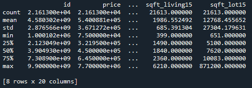

图 14.10 - 使用 describe()函数

现在，我们应该注意，该函数分析 DataFrame 中的数值。它排除了`NaN`值。`NaN`代表 Python 中的**不是数字**值，并表示任何未定义或不可表示的值。`NaN`也可以表示缺失的数字。我们之前在*处理缺失数据*部分讨论过这些缺失的数字以及我们可以解决它们的一些方法。现在让我们在这个背景下看一下。我们想找到我们的缺失值。为此，我们可以运行以下代码片段：

```py
housing_data.isnull().sum()
```

上面的片段将让我们知道我们的数据集中每个列中是否有缺失数据点。然后，它将聚合值作为总和。因此，如果在“日期”列下有两个缺失值，我们期望在那里看到`2`。我们的结果可以在以下截图中看到：

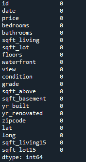

图 14.11 - 运行 isnull()和.sum()函数的结果

*我们不必清理这个数据集！* *这是一个干净的数据集*。然而，学习如何识别我们是否需要这样做非常重要。现在我们知道我们有一个干净的数据集，我们可以开始构建一些可视化。

## 使用数据可视化

请记住，这仍然是我们初始算法文件`ch15_housePrice_prediction.py`的一部分。如果你打开该文件，接下来的代码从*第 25 行*开始。我们在代码行之间添加了描述性的注释：

```py
names=['price','bedrooms','bathrooms','sqft_living','sqft_lot','floors','waterfront','view','condition','grade','sqft_above','sqft_basement','zipcode','lat','long']
df=housing_data[names]
```

我们要做的第一件事是确定我们将用于图表的列。在这样做之后，我们将制作一个 DataFrame 并将其保存为`df`：

```py
correlations= df.corr()
```

前面的代码片段创建了我们 DataFrame 的相关性。在文件的下一个代码片段中，我们将创建我们的图表；也就是说，我们将进行数据可视化：

```py
fig=plt.figure()
ax=fig.add_subplot(111)
cax=ax.matshow(correlations,vmin=-1,vmax=1)
fig.colorbar(cax)
```

在前面的代码中，我们命名了我们的图表，添加了子图，并确定了我们的颜色。接下来，我们需要设置一些属性，比如刻度标记、刻度标记之间的距离以及轴和刻度标记的标签：

```py
ticks=np.arange(0,15,1)
ax.set_xticks(ticks)
ax.set_yticks(ticks)
ax.set_xticklabels(names, rotation =' 90')
ax.set_yticklabels(names)
```

在设置了一些属性之后，我们可以要求图表使用`tight_layout()`。这将帮助我们看到图表和标签的所有细节。如果我们不使用`tight_layout()`，有时在我们的图表中会有一些标签是不可见的：

```py
plt.tight_layout()
plt.savefig('Correlation_graph.png',dpi = 300)
plt.show()
```

在前面的代码片段中，我们还创建了一个保存文件并定义了图表的大小。最后，我们要求算法显示我们的相关性。以下截图显示了前面代码的结果：


图 14.12 - 住房数据的相关性图

正如你所看到的，我们刚刚使用 Python 创建了一个**相关性矩阵**。而且这是一个相当不错的矩阵。*但是什么是相关性矩阵呢？* 相关性矩阵查看我们 DataFrame 中的所有值，然后计算它们之间的相关程度，给出一个在**-1**和**1**之间的值。数值越接近**1**，这些值之间的相关性就越高。每个值与自身进行比较，这是完美的相关性，当然，在我们的矩阵中被视为对角线。

其余的图表，所有的值都相互比较，必须更仔细地观察。越接近黄色，值之间的相关性就越高。因此，看一下*y*轴的**sqft_above**值和*x*轴上**sqft_living**的对应值。该值接近于黄色值**1**，但不完全相等。我们在以下截图中突出显示了这些值：

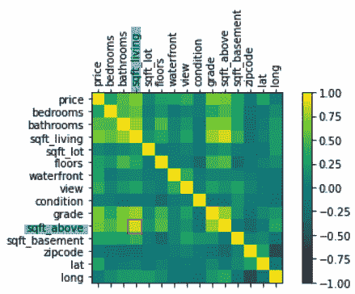

图 14.13 - 突出显示的 sqft_above 和 sqft_living 的相关性

还有其他一些值显示出一定的相关性，但不够强。这个图表帮助我们做出决策，也许要更仔细地观察这种相关性，找到更多关于它的信息等。

现在，我们还可以看一下一个相当密集的图表矩阵，称为*对图*。**对图**向我们展示了单个变量的分布以及两个变量之间的关系。如果我们对我们算法中包含的数据运行对图，我们会得到一个庞大的图表，如下截图所示（请注意，由于分析和绘制的数据量较大，这个图表可能需要几分钟的时间来生成）：

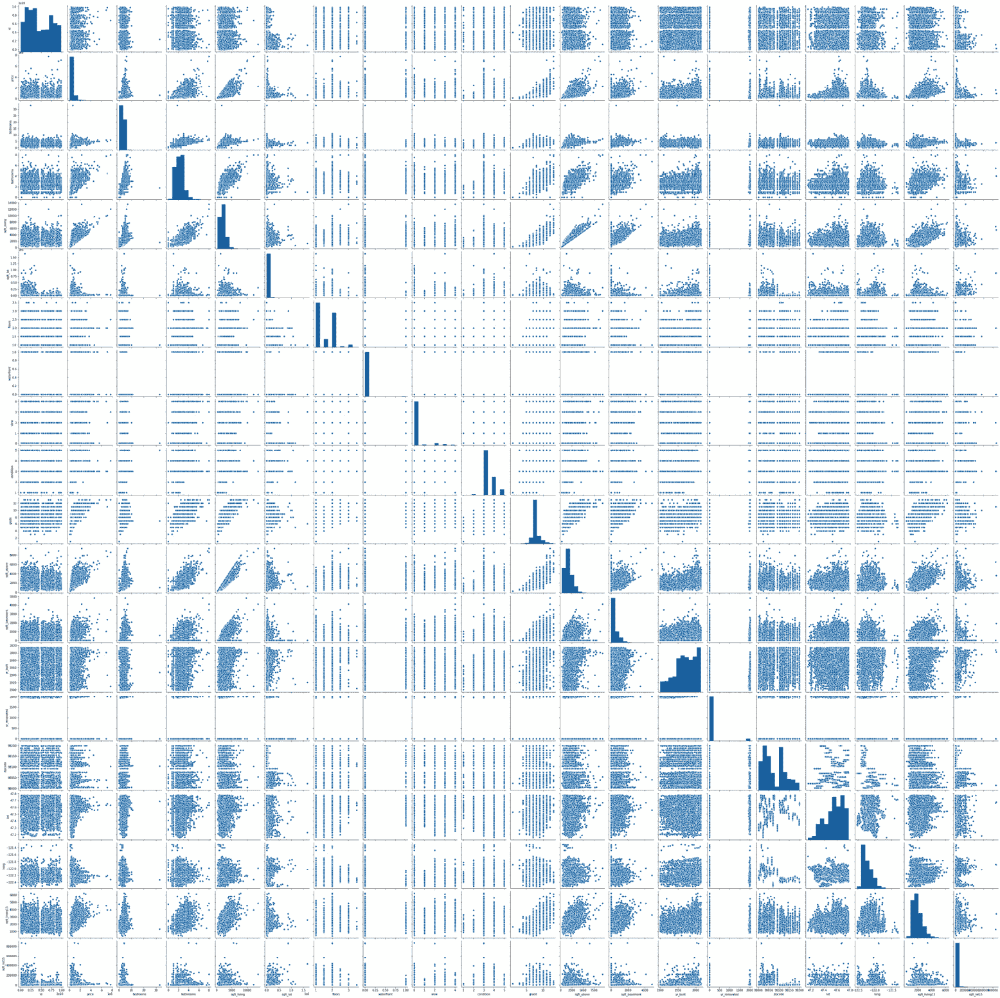

图 14.14 - 完整的 DataFrame 对图

正如你所看到的，这是一个相当密集的、难以阅读的、几乎不可能分析的图表。你需要放大到每对图形来做出一些决定。还应该提到的是，算法需要时间来运行并生成这个图形。*从如此庞大的数据集中创建如此复杂的东西需要一定的处理能力！*

我们是否想要看到像这样的大量图表？实际上是的。如果我们有较少的变量数据集，那绝对可以！我们还可以使用其他颜色方案来使其更加友好，例如。这可能会使识别趋势变得更容易。但让我们明确一点；这并不是非常有帮助。我们可以创建一些感兴趣的变量的成对图。记得我们谈到过`sqft_living`和`sqft_above`可能有很强的正相关性吗？我们也确实想要将事物与定价进行比较，对吧？所以，让我们只使用`sqft_living`、`pricing`和`sqft_above`创建一个成对图。看一下我们文件中相关代码片段：

```py
coln = ['price','sqft_living','sqft_lot']
sns.pairplot(housing_data[coln], height = 3);
plt.savefig('pairplotting.png',dpi =300)
plt.show()
```

现在，当我们运行算法的这一部分时，我们得到了下面截图中显示的图表。这个图表提供了这三个值的相关性，我们确实可以看到一些正相关发生：

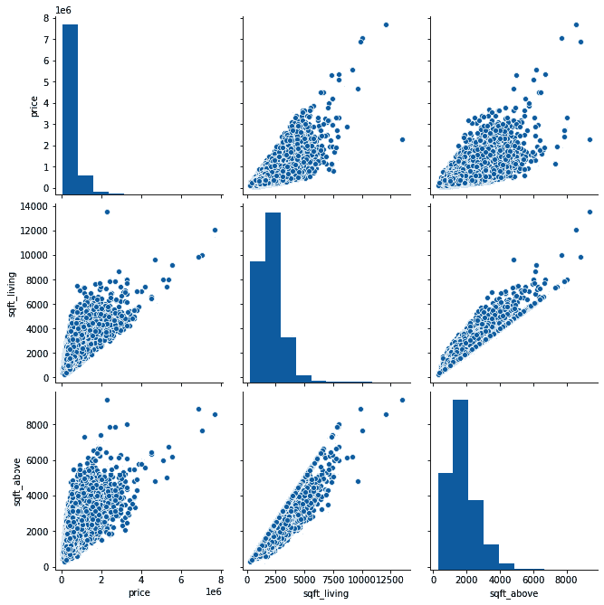

图 14.15 - 价格、sqft_living 和 sqft_above 的成对图

特别注意一下成对图中的**sqft_living**和**sqft_above**。这两者之间的关系相当线性和正向。这证实了我们从*图 14.13*中观察到的情况，其中相关性比其他变量更接近**1**。

但是，分析另外三个变量也会有所帮助，这样我们就可以看到当相关性不强时会发生什么。我们将保留`price`和`sqft_living`，这样我们只改变一个变量进行比较。看一下*图 14.12*，**sqft_living**和**zipcode**似乎根本没有强烈的正相关性。因此，让我们再次运行算法，将`zipcode`替换为`sqft_above`。让我们看一下下面截图中显示的结果：

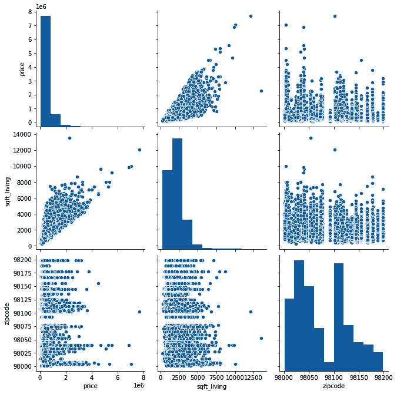

图 14.16 - 价格、sqft_living 和 zipcode 的成对图

正如你所看到的，**sqft_living**和**zipcode**根本没有相关性。它们看起来更像条形图，看不到对角线。在我们离开这些图之前，值得一提的是，这些成对图仅为比较的变量提供散点图，并为图中的每个变量提供直方图。如果我们想深入了解，我们可以查看其他可视化工具，比如**Seaborn**中的工具。

我们在这里暂停分析。我们使用可视化来了解我们的数据有哪些相关性。如果我们进一步处理这个问题，我们可以使用数据来创建训练模型，并帮助我们进行预测。即使只是从图形数据中，我们也可以看到我们的相关性，并利用它进行预测。例如，如果我们有`sqft_living`，我们可以预测`sqft_above`，因为它们之间有很强的相关性。

Python 允许我们以多种方式查看数据。这是这样一个工具的伟大优势之一。

# 总结

在本章中，我们学习了如何使用 Python 处理数据，并使用本章学到的一些概念来处理房屋数据集。我们了解了 pandas 包以及它如何帮助我们组织和准备数据。我们还了解了预处理数据集的必要性，特别是在非常大的数据集中。我们处理了缺失和嘈杂的数据，以及数据转换和数据减少。我们还学会了如何使用可视化，为我们的数据集创建图表，可以帮助我们识别相关性和趋势。

本章的主题非常广泛，有整本书专门讨论这些主题。但在我们继续本书的下两章之前，我们觉得有必要分享一些 Python 编程语言的能力。

在接下来的章节中，我们将完全专注于应用程序，使用问题场景和主题来分享 Python 和计算思维在设计算法中的一些令人兴奋的应用。
