# *第十五章*：应用计算思维问题

在本章中，我们将提供多个领域的 Python 编程语言和计算思维应用示例。我们将探索多个领域，如人文学科、语言学、密码学等。我们将利用我们迄今为止学到的关于**计算思维**和**Python**编程语言的知识来做以下事情：

+   分析历史演讲

+   编写故事

+   计算文本可读性

+   找到最有效的路线

+   实现密码学

+   实现网络安全

+   创建聊天机器人

这一章与其他章节不同，因为我们将专注于提出问题并在评估每种情况后提供算法解决方案。

# 技术要求

您需要安装最新版本的 Python 才能运行本章中的代码。

您需要为 Python 安装以下库和软件包：

+   **NLTK**

+   **Cairos**

+   **Pandas**

+   **Matplotlib**

+   **Seaborn**

您可以在此处找到本章中使用的完整源代码：[`github.com/PacktPublishing/Applied-Computational-Thinking-with-Python/tree/master/Chapter15`](https://github.com/PacktPublishing/Applied-Computational-Thinking-with-Python/tree/master/Chapter15)

# 问题 1 - 使用 Python 分析历史演讲

历史非常迷人，我们有很多原因要编写算法来评估历史数据和背景。

对于这个问题，我们想要分析一些历史文本。特别是，我们将研究*亚伯拉罕·林肯的第二次就职演讲*。我们的目标是找到一些单词的频率。有很多原因我们想要进行一些简单的文本分析，特别是对于历史文本。我们可能想要进行比较，了解潜在的主题等等。

对于我们的算法，我们将使用`nltk`包的一个相当简单的设计。由于一些组件的安装与我们迄今为止所做的有些不同，我们将提供一些信息，以防您的软件包尚未安装。

在 Python shell 中，如果您在活动控制台中，创建一个新文件并在安装主要软件包后导入`nltk`（使用`pip install nltk`）。

请注意，您不应该在活动的**Shell**窗口中。如果您在行首看到`>>>`，请单击**文件** | **新建文件**选项，然后输入以下代码指令行以创建空的 shell：

```py
import nltk 
nltk.download()
```

从前面的代码中可以看到，您还将在`nltk`中打开下载器。前面的代码将弹出一个窗口，如下面的屏幕截图所示（请注意，`nltk`库大约需要 7MB 的内存，而安装额外的软件包也需要内存，每个软件包的范围从几 KB 到 14 到 15MB 不等）：

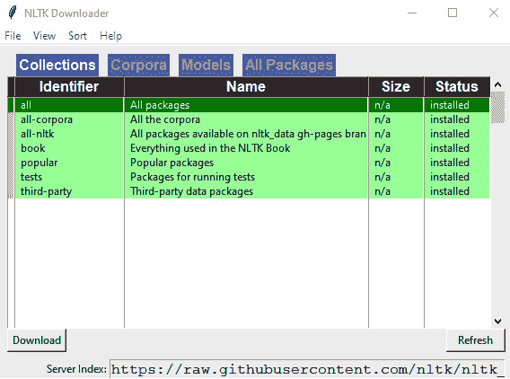

图 15.1 - NLTK 下载器

如您所见，我的软件包都已安装。如果您的软件包尚未安装，请选择**全部**，然后单击该窗口左下角的**下载**按钮。软件包安装完成后，您可以关闭该窗口。

因为我们的问题相当简单，所以我们将跳过这个特定部分的大部分计算思维过程。我们只是试图获得演讲中使用的单词的频率。所以让我们直接进入算法，看看我们将如何使用`nltk`包来获得我们需要的内容，包括数据的可视化表示：

1.  首先，我们需要导入`nltk`和`word_tokenize`函数。`word_tokenize`函数允许我们将演讲分成单个单词和/或标点符号。我们需要演讲文本。在这种情况下，演讲被复制到算法中。您也可以将文件导入算法并以这种方式进行操作。

`sent_tokenize` 函数是句子标记化的缩写。与单词标记化类似，句子标记化函数允许将文本分成完整的句子。输出将包含一个由逗号分隔的句子列表。

重要提示：

重要的是要知道，所有引号都已经使用 `\'` 或 `\"` 进行了转义，以保持原始文本而不在我们的代码中创建错误。

以下算法包含了我们需要的一切，以便分析亚伯拉罕·林肯的第二次就职演说：

ch15_historicalTextAnalysis.py

```py
import nltk
from nltk.tokenize import sent_tokenize, word_tokenize
```

演讲的整个文本包含在 GitHub 存储库文件中。出于长度目的，我们在这里只包含了其中一半的文本。请注意，我们将在算法和解释之后分享的输出将对应于截断的演讲，但可视化图将包含整篇演讲的数据。在 `text` 定义的末尾看到的 `[…]` 仅用于显示那里有额外的文本。

```py
text = 'Fellow-Countrymen: At this second appearing to take the oath of the Presidential office there is less occasion for an extended address than there was at the first. Then a statement somewhat in detail of a course to be pursued seemed fitting and proper. Now, at the expiration of four years, during which public declarations have been constantly called forth on every point and phase of the great contest which still absorbs the attention and engrosses the energies of the nation, little that is new could be presented. The progress of our arms, upon which all else chiefly depends, is as well known to the public as to myself, and it is, I trust, reasonably satisfactory and encouraging to all. With high hope for the future, no prediction in regard to it is ventured. On the occasion corresponding to this four years ago all thoughts were anxiously directed to an impending civil war. All dreaded it, all sought to avert it. While the inaugural address was being delivered from this place, devoted altogether to saving the Union without war, urgent agents were in the city seeking to destroy it without war—seeking to dissolve the Union and divide effects by negotiation. Both parties deprecated war, but one of them would make war rather than let the nation survive, and the other would accept war rather than let it perish, and the war came. One-eighth of the whole population were colored slaves, not distributed generally over the Union, but localized in the southern part of it. These slaves constituted a peculiar and powerful interest. All knew that this interest was somehow the cause of the war. To strengthen, perpetuate, and extend this interest was the object for which the insurgents would rend the Union even by war, while the Government claimed no right to do more than to restrict the territorial enlargement of it. Neither party expected for the war the magnitude or the duration which it has already attained. […]'
```

1.  现在我们已经定义了我们想要分析的文本，如前面的代码片段所示，我们可以告诉算法我们想要对文本进行*标记化*，也就是说，我们希望将其分成单词。算法将打印出一个包含每个单词或标点符号的列表，用逗号分隔，如下面的代码所示：

```py
tokenized_word = word_tokenize(text)
print(tokenized_word)
```

1.  在我们有了单词列表之后，我们想要得到单词的频率分布。为此，我们将从 `nltk.probability` 导入包，如下面的代码片段所示：

```py
from nltk.probability import FreqDist
fdist = FreqDist(tokenized_word)
print(fdist)
fdist.most_common(2)
```

1.  一旦我们有了分布，我们就希望得到这些数据的可视化图表，因此我们将使用 `matplotlib` 来创建我们的分布图，如下面的代码片段所示：

```py
import matplotlib.pyplot as plt
fdist.plot(30, cumulative = False)
plt.show()
```

这就是我们需要的整个算法。当我们运行算法时，我们的输出如下：

```py
['Fellow-Countrymen', ':', 'At', 'this', 'second', 'appearing', 'to', 'take', 'the', 'oath', 'of', 'the', 'Presidential', 'office', 'there', 'is', 'less', 'occasion', 'for', 'an', 'extended', 'address', 'than', 'there', 'was', 'at', 'the', 'first', '.', 'Then', 'a', 'statement', 'somewhat', 'in', 'detail', 'of', 'a', 'course', 'to', 'be', 'pursued', 'seemed', 'fitting', 'and', 'proper', '.', 'Now', ',', 'at', 'the', 'expiration', 'of', 'four', 'years', ',', 'during', 'which', 'public', 'declarations', 'have', 'been', 'constantly', 'called', 'forth', 'on', 'every', 'point', 'and', 'phase', 'of', 'the', 'great', 'contest', 'which', 'still', 'absorbs', 'the', 'attention', 'and', 'engrosses', 'the', 'energies', 'of', 'the', 'nation', ',', 'little', 'that', 'is', 'new', 'could', 'be', 'presented', '.', 'The', 'progress', 'of', 'our', 'arms', ',', 'upon', 'which', 'all', 'else', 'chiefly', 'depends', ',', 'is', 'as', 'well', 'known', 'to', 'the', 'public', 'as', 'to', 'myself', ',', 'and', 'it', 'is', ',', 'I', 'trust', ',', 'reasonably', 'satisfactory', 'and', 'encouraging', 'to', 'all', '.', 'With', 'high', 'hope', 'for', 'the', 'future', ',', 'no', 'prediction', 'in', 'regard', 'to', 'it', 'is', 'ventured', '.', 'On', 'the', 'occasion', 'corresponding', 'to', 'this', 'four', 'years', 'ago', 'all', 'thoughts', 'were', 'anxiously', 'directed', 'to', 'an', 'impending', 'civil', 'war', '.', 'All', 'dreaded', 'it', ',', 'all', 'sought', 'to', 'avert', 'it', '.', 'While', 'the', 'inaugural', 'address', 'was', 'being', 'delivered', 'from', 'this', 'place', ',', 'devoted', 'altogether', 'to', 'saving', 'the', 'Union', 'without', 'war', ',', 'urgent', 'agents', 'were', 'in', 'the', 'city', 'seeking', 'to', 'destroy', 'it', 'without', 'war—seeking', 'to', 'dissolve', 'the', 'Union', 'and', 'divide', 'effects', 'by', 'negotiation', '.', 'Both', 'parties', 'deprecated', 'war', ',', 'but', 'one', 'of', 'them', 'would', 'make', 'war', 'rather', 'than', 'let', 'the', 'nation', 'survive', ',', 'and', 'the', 'other', 'would', 'accept', 'war', 'rather', 'than', 'let', 'it', 'perish', ',', 'and', 'the', 'war', 'came', '.', 'One-eighth', 'of', 'the', 'whole', 'population', 'were', 'colored', 'slaves', ',', 'not', 'distributed', 'generally', 'over', 'the', 'Union', ',', 'but', 'localized', 'in', 'the', 'southern', 'part', 'of', 'it', '.', 'These', 'slaves', 'constituted', 'a', 'peculiar', 'and', 'powerful', 'interest', '.', 'All', 'knew', 'that', 'this', 'interest', 'was', 'somehow', 'the', 'cause', 'of', 'the', 'war', '.', 'To', 'strengthen', ',', 'perpetuate', ',', 'and', 'extend', 'this', 'interest', 'was', 'the', 'object', 'for', 'which', 'the', 'insurgents', 'would', 'rend', 'the', 'Union', 'even', 'by', 'war', ',', 'while', 'the', 'Government', 'claimed', 'no', 'right', 'to', 'do', 'more', 'than', 'to', 'restrict', 'the', 'territorial', 'enlargement', 'of', 'it', '.', 'Neither', 'party', 'expected', 'for', 'the', 'war', 'the', 'magnitude', 'or', 'the', 'duration', 'which', 'it', 'has', 'already', 'attained', '.']
```

1.  请回想一下，`单词标记化` 只包括了截断的文本。然而，随后的频率信息和图表是针对整篇演讲的。`ch15_historicalTextAnalysis.py` GitHub 文件包含了完整的演讲：

```py
<FreqDist with 365 samples and 782 outcomes>
```

以下屏幕截图显示了该算法的频率分布可视化图：

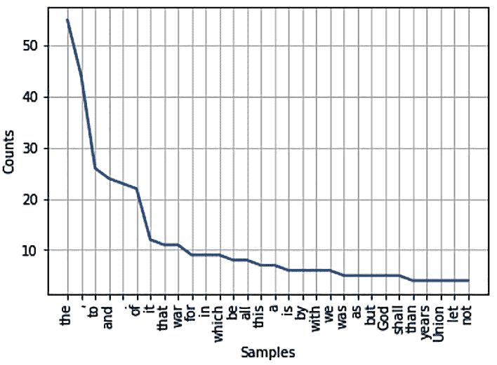

图 15.2 - 亚伯拉罕·林肯第二次就职演说的频率分布图

一旦我们有了这些信息，我们就可以开始更仔细地查看最常用的单词。在进行这种分析时，您可能希望考虑删除一些单词，比如**to**、**a**和**the**，因为它们对我们的分析没有意义。但是，像**years**和**Union**这样的单词可能与我们的分析相关。

这个算法可以进行许多调整，但目前，我们至少已经成功为一个历史演讲制作了一个频率分布图。现在，我们将继续下一个问题。

# 问题 2 - 使用 Python 编写故事

让我们看一个相当简单的问题。在这一部分，我们想要创建一个基于用户输入的算法来生成一个故事。我们可以尽可能简单，或者添加一些选项。但让我们深入了解一下这是什么。

## 定义、分解和规划故事

首先，*我们要创造什么？* 好吧，一个故事。由于这个问题的性质，我们将从反向开始，用我们想要实现的输出样本开始，也就是一个样本故事。在我们真正进入算法之前，让我们先看一下我们的算法生成的一个快速故事：

```py
There once was a citizen in the town of Narnia, whose name was Malena. Malena loved to hang with their trusty dog, King Kong.
You could always see them strolling through the market in the morning, wearing their favorite blue attire.
```

前面的输出是由一个算法创建的，该算法替换了名字、地点、时间、宠物和宠物名字。这是一个简短的故事，但这是可以在更广泛的应用中使用的东西，比如使用输入来撰写社交媒体帖子，并为邀请、表格等填写信息。

所以让我们倒退一点来编写我们的算法。*为什么这次我从结尾开始呢？*嗯，在这种情况下，我们知道我们想要的结果。您可以编写您的故事。您可以有一个需要填写的婚礼邀请模板的示例，或者表格。现在我们必须弄清楚如何获取输入，然后输出我们想要的内容。

从所示的故事中，这是我们可以获得原始输入的事情：

+   角色的名字

+   城镇名称

+   宠物的类型

+   宠物的名字

+   参观的城镇的一部分

+   一天中的时间

+   喜欢的颜色

当我们编写我们的算法时，我们需要获取所有上述输入。让我们来看看`ch15_storyTime.py`文件中的算法：

1.  我们需要用户的输入，所以我们想使用一个`print`语句和包含所需指令的输入请求：

```py
print('Help me write a story by answering some questions. ')
name = input('What name would you like to be known by? ')
location = input('What is your favorite city, real or imaginary? ')
time = input('Is this happening in the morning or afternoon? ')
color = input('What is your favorite color? ')
town_spot = input('Are you going to the market, the library, or the park? ')
pet = input('What kind of pet would you like as your companion? ')
pet_name = input('What is your pet\'s name? ')
```

前面的代码片段从用户那里获取所有输入，这样我们就可以写我们的故事了。

1.  一旦我们有了这些，我们就必须`print`我们的故事。请注意，我们用简单的术语写了它，使用`％s`，这样我们就可以用相应的输入替换它。我们还使用反斜杠，这样我们就可以在多行上看到我们的代码，而不是将其放在一行上：

```py
print('There once was a citizen in the town of %s, whose name was %s. %s loved to hang \
with their trusty %s, %s.' % (location, name, name, pet, pet_name))
print('You could always see them strolling through the %s \
in the %s, wearing their favorite %s attire.' % (town_spot, time, color))
```

让我们再次运行那段代码，看看我们的故事现在说了什么：

```py
Help me write a story by answering some questions. 
What name would you like to be known by? Azabache
What is your favorite city, real or imaginary? Rincon
Is this happening in the morning or afternoon? afternoon
What is your favorite color? magenta
Are you going to the market, the library, or the park? library
What kind of pet would you like as your companion? dog
What is your pet's name? Luna
There once was a citizen in the town of Rincon, whose name was Azabache. Azabache loved to hang with their trusty dog, Luna.
You could always see them strolling through the library in the afternoon, wearing their favorite magenta attire.
```

请注意，角色和设置等细节已经发生了变化。在教育学习环境中，这样一个简单的算法可以成为一个很好的工具，用来向学生展示如何与故事互动并识别其中的关键信息。

虽然这是一个三句故事，但这些算法可以更加复杂，为用户输入提供了编写出色原创故事的机会。如果您想尝试一些内容，甚至可以根据一些输入条件更改使用的短语，例如根据输入的名称长度更改使用的句子。*用代码和写一些故事来玩一玩吧！*

# 问题 3-使用 Python 计算文本可读性

在这一部分，我们将看一个与语言学相关的应用，具体来说是任何文本的可读性水平。我们将在接下来的代码片段中使用马丁·路德·金的**我有一个梦**演讲。您可以用任何文本文件替换它，只要您在代码中准确反映文件和文件名的位置。完整的代码可以在`ch15_Readability.py`文件中找到。

在我们进入代码之前，让我们先谈谈我们要寻找的内容以及为什么它很重要。了解文本的可读性可以帮助我们决定是否将其包含在演示文稿中，学校年级水平等等。**弗莱施-金凯德分数**用于确定可读性，并于 1940 年代开发。

Rudolf Flesch 在与美联社合作期间创建了它，以改善报纸的可读性。最初被称为**弗莱施阅读易度**，它被现代化为目前美国海军使用的形式。现在，弗莱施-金凯德分数提供了一个年级水平分数，而不是得到一个分数，然后必须将其转换为年级水平。

虽然我们不会使用这个公式，但了解我们使用的背景很重要。弗莱施阅读易度公式如下：

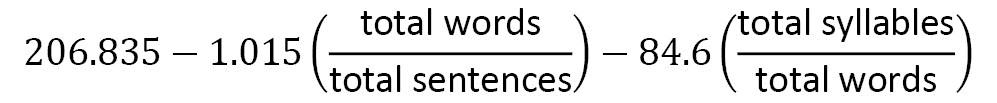

弗莱施-金凯德年级公式如下：

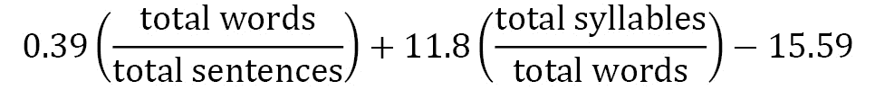

前面的公式的事实是，它们存在于 Python 可用的可读性包中。如果我们导入这个包，我们就能用一小段相当简单的代码进行可读性分析。

让我们来看看我们需要执行马丁·路德·金演讲的可读性分析所需的代码：

1.  首先，记得在代码中更改文件的路径，然后导入代码所需的必要包：

ch15_readability.py

```py
from readability import Readability
text = open('C:\\...\\ch15_MLK-IHaveADream.txt')
text_up = text.read()
r = Readability(text_up)
flesch_kincaidR = r.flesch_kincaid()
```

从前面的代码中，您会看到我们将`readability`包导入到我们的程序中。如果您需要安装库/包，可以使用`pip install readability`来安装。

一旦我们有了必要的库，我们就可以打开要分析的文件。我们还希望告诉算法读取文本，我在这里称之为`text_up`，以便上传文本，这样我就不会忘记我正在读取一个打开的文件。这是我们从前面的代码中打开的文本。最后，我们要求程序使用`Readability`函数分析文本。请注意，我们将其保存到`r`中。

1.  在我们完成所有这些之后，我们可以使用以下代码片段`print`我们的年级水平：

```py
print('The text has a grade '+ flesch_kincaidR.grade_level + ' readability level.')
```

当我们运行我们的算法时，输出也是非常简单的。看一下以下输出：

```py
The text has a grade 9 readability level.
```

现在您知道如何验证任何文本的可读性，尝试对其他类型的文本执行分析，包括诗歌、故事、演讲、歌曲等。

# 问题 4 - 使用 Python 找到最有效的路线

对于这个问题，在学习算法时，我们将使用一个常见的算法——**旅行推销员问题**（**TSP**）。让我们来设置问题本身。

一个推销员需要前往一定数量的城市或地点。假设推销员有 10 个地点要去。他们可以以许多不同的顺序去这 10 个地点。我们这个算法的目标是创建最佳的、最有效的路线，以到达这些地点。

请注意，对于这种特定情况，就像我们将在下一个问题中所做的那样，我们将使用计算思维过程的四个元素进行简单的分析。

## 定义问题（TSP）

这个问题比起最初的样子要复杂一些。可以这样想。如果我们有 10 个目的地，我们正在计算往返排列以检查最快的路线，我们将得到超过 300,000 个可能的排列和组合。提醒一下，排列考虑顺序，而组合则不考虑。

例如，数字*3344*和*3434*是两种不同的排列。但是，它们只被计为一种组合，因为数字的顺序并不重要。

但回到我们的问题。我们只需要知道我们想要创建一个算法，以最有效的方式带我们到达目的地。我们必须确定要访问的城市，并确定我们将如何旅行。

+   总共有五个城市，分别是**纽约**（**NYC**）、**费城**、**巴尔的摩**、**芝加哥**和**克利夫兰**。

+   我们将使用一辆车，因为我们使用的是 TSP 而不是**车辆路径问题**（**VRP**）。

+   第一个城市是 0，也就是纽约。纽约和自身之间的距离是 0。

现在让我们来看一下模式。

## 识别模式（TSP）

对于每个城市，将有五个距离，到自身的距离等于 0。我们将需要一个数组或列表，用于存储每个城市的所有距离。我们需要创建一个模型，以便在我们的算法中访问数据。我们将在设计算法时进行讨论。首先，让我们稍微概括一下模式。

## 概括（TSP）

对于这个特定的问题，我们将手动将城市输入到算法中。您可能需要考虑的一件事是如何从用户那里获取输入，以便创建必要的包含距离的数组。

您还可以创建一个数据库，记录主要城市之间的距离，可以从`.csv`文件中访问，这样输入的城市数据可以在其中找到，然后添加到我们的模型中。对于这个特定算法，有许多补充，这不是一个只有一种解决方法的问题。现在，我们将使用一组定义好的城市，以便创建我们的算法。

顺便说一句，我们已经参考了来自[`developers.google.com/optimization/routing/tsp`](https://developers.google.com/optimization/routing/tsp)的源代码。

## 设计算法（TSP）

是时候看看我们一直在谈论的东西了。让我们从纽约开始，首先构建那个数组。其他数组以相同的方式创建。所有距离都是以英里为单位，并根据**Google Maps**的数据进行了近似和四舍五入，如下所示：

+   从纽约到纽约的距离是 0。

+   从纽约到费城的距离是 95。

+   从纽约到巴尔的摩的距离是 192。

+   从纽约到芝加哥的距离是 789。

+   从纽约到克利夫兰的距离是 462。

以下表格显示了每个城市到其他城市及其自身的距离：

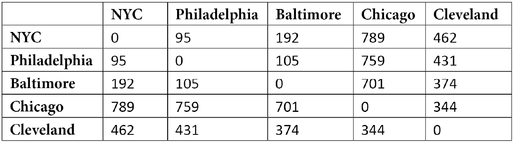

表 15.1 - 从一个城市到另一个城市的距离

因此，如您在上表中所见，如果我们将这些距离写成一个数组，我们将使用以下代码：

```py
[0, 95, 192, 789, 462]
```

对于费城，我们将有以下数组：

```py
[95, 0, 105, 759, 431]
```

对于巴尔的摩，我们将有以下数组：

```py
[192, 105, 0, 701, 374]
```

对于芝加哥，我们将有以下数组：

```py
[789, 759, 701, 0, 344]
```

最后，对于克利夫兰，我们将有以下数组：

```py
[462, 431, 374, 344, 0]
```

请注意，我们将为每个城市分配索引以便识别它们。纽约是*0*，费城是*1*，巴尔的摩是*2*，芝加哥是*3*，克利夫兰是*4*。让我们看看这个问题的算法是什么样子的（请注意，**OR-Tools 库**用于优化车辆路线、线性规划、约束规划等）：

1.  首先，让我们开始导入我们需要的包和库。这个算法的完整文件是`ch15_travel.py`，可以在 GitHub 上找到：

```py
from ortools.constraint_solver import routing_enums_pb2
from ortools.constraint_solver import pywrapcp
```

请记住，如果您计划访问更多的城市和/或不同的城市，这个算法需要获取一个新的距离矩阵。这是您需要更改的代码的唯一部分。您每次需要调整的代码片段是`create_data_model()`下的矩阵，如下面的代码片段所示：

```py
#Create data model.
def create_data_model():
    data = {}
    data['distance_matrix'] = [
        [0, 95, 192, 789, 462],
        [95, 0, 105, 759, 431],
        [192, 105, 0, 701, 374],
        [789, 759, 701, 0, 344],
        [462, 431, 374, 344, 0],
    ]  
    data['num_vehicles'] = 1
    data['depot'] = 0
    return data
```

1.  在我们定义了数据模型之后，我们需要打印一个解决方案。以下函数提供了该信息：

```py
#Provide solution as output - print to console
def print_solution(manager, routing, solution):
    print('Objective: {} miles'.format(solution.ObjectiveValue()))
    index = routing.Start(0)
    plan_output = 'Route for vehicle 0:\n'
    route_distance = 0
    while not routing.IsEnd(index):
        plan_output += ' {} ->'.format(manager.IndexToNode(index))
        previous_index = index
        index = solution.Value(routing.NextVar(index))
        route_distance += routing.GetArcCostForVehicle(previous_index, index, 0)
    plan_output += ' {}\n'.format(manager.IndexToNode(index))
    print(plan_output)
    plan_output += 'Route distance: {}miles\n'.format(route_distance)
```

如您从上述代码中所见，我们正在创建一个函数，以便我们可以根据我们的数组和这些数组中的距离打印解决方案。请记住，您将确定出发点，也就是您要离开的城市。然后我们运行算法来收集信息并创建我们的`print`语句。

1.  最后，我们需要定义我们的`main()`函数以运行我们的算法。`main()`函数告诉算法继续创建我们已经定义的数据模型，并将其存储为数据。然后我们创建路由模型来找到我们的解决方案。请看以下代码片段：

```py
def main():    
    data = create_data_model()
    manager = pywrapcp.RoutingIndexManager(len(data['distance_matrix']),
                                           data['num_vehicles'], data['depot'])
    # Create Routing Model.
    routing = pywrapcp.RoutingModel(manager)
    def distance_callback(from_index, to_index):
        """Returns the distance between the two nodes."""
        # Convert from routing variable Index to distance matrix NodeIndex.
        from_node = manager.IndexToNode(from_index)
        to_node = manager.IndexToNode(to_index)
        return data['distance_matrix'][from_node][to_node]
    transit_callback_index = routing.RegisterTransitCallback(distance_callback)
    routing.SetArcCostEvaluatorOfAllVehicles(transit_callback_index)
    search_parameters = pywrapcp.DefaultRoutingSearchParameters()
    search_parameters.first_solution_strategy = (
        routing_enums_pb2.FirstSolutionStrategy.PATH_CHEAPEST_ARC)
    solution = routing.SolveWithParameters(search_parameters)
    if solution:
        print_solution(manager, routing, solution)
if __name__ == '__main__':
    main()
```

上述代码显示了我们如何定义我们的`main()`函数。需要注意的是，`main()`函数可以被命名为任何我们想要的名称。在使用多个函数时，我们有时使用`main()`来标识最初从算法中输出我们想要的功能。对于这个问题，我们正在创建一个`main()`函数，它将确定我们旅行的最佳路线。

1.  现在让我们看看当我们运行这段代码时，我们得到了什么输出。该代码为我们提供了里程的“目标”总数以及我们应该采取的行程路线。以下是输出：

```py
Objective: 1707 miles
Route for vehicle 0:
 0 -> 1 -> 2 -> 4 -> 3 -> 0
```

从纽约到纽约的行程，如果我们按照以下顺序进行，将会是最有效的：纽约 | 费城 | 巴尔的摩 | 克利夫兰 | 芝加哥 | 纽约。

这不是旅行问题的唯一方法。如果我们想要一天运行多次这个问题，或者为不同的旅行者运行，这也不一定是最用户友好的方法。为了做到这一点，您需要自动化更多的内容，就像前面的例子中提到的那样。您可能要考虑的一些事情如下：

+   能够输入城市

+   拥有一个抓取信息以确定距离的计算器

+   使用自动化过程创建距离矩阵

但是现在，你已经看到 TSP 在行动中了！我们将在下一节中看一个新问题。

# 问题 5 – 使用 Python 进行密码学

**密码学**是我们用来编码和解码消息的工具。在*第九章*中，我们使用了一个简单的**凯撒密码**，*理解输入和输出以设计解决方案算法*。对于这个问题，我们将使用 Python 中可用的一些包来加密和解码信息。

请注意，对于这种特定情况，我们将使用计算思维过程的四个元素进行直接分析。虽然我们并不总是完全遵循它们，但这个特定问题本身就很适合进行相当直接的使用。

## 定义问题（密码学）

您正在从事一个机密项目，需要加密您的信息以保证其安全性。

## 识别模式（密码学）

Python 有一个可以安装的密码学包，就像我们安装其他库（如**Pandas**和**NumPy**）一样。在我们的问题中，我们需要知道的主要事情之一是，我们可能需要继续加密消息。我们可能还想解码我们收到的消息，但我们首先要专注于加密方面。

## 泛化（密码学）

当我们设计我们的算法时，我们希望能够在项目的整个生命周期中持续使用某些东西，而不需要太多的努力。也就是说，每当我们想要加密新消息时，我们可以运行算法并输入消息，而不是每次都将消息本身添加到算法体中。这是我们特定问题的通用模式。*这意味着我们已经准备好设计了。*

## 设计算法（密码学）

在编写我们的算法之前，让我们首先看一下我们需要做的事情：

1.  定义字母。

1.  将所有字母改为小写以运行我们的算法。

1.  定义所需的函数——`加密`、`解码`和`main`。

1.  调用密码学的`main`函数。

提示：

这个问题的完整算法可以在`ch15_cryptographyA.py`文件中找到。

我们将按照以下步骤开始设计我们的算法：

1.  让我们首先定义我们的字母。下面的代码片段定义了我们的字母，然后将每个字母转换为小写：

```py
LETTERS = 'ABCDEFGHIJKLMNOPQRSTUVWXYZABCDEFGHIJKLMNOPQRSTUVWXYZ'
LETTERS = LETTERS.lower()
```

1.  接下来，我们定义我们的加密函数。这个函数将接受两个参数——`message`和`key`。`message`函数将由用户定义，在`main`函数中完成。现在，我们将通过在`encryptedM`变量的定义中添加空引号（`''`）来使用空消息，如下面的代码片段所示：

```py
def encrypt(message, key):
    encryptedM = ''
    for letts in message:
        if letts in LETTERS:
            num = LETTERS.find(letts)
            num += key
            encryptedM +=  LETTERS[num]
    return encryptedM
```

请注意，我们迭代要加密的消息中的字母，然后我们使用用户在`main`函数中定义的密钥来加密消息。然后这个函数返回加密的消息。

*但是为什么我们还没有定义* `main` *函数，如果那是我们获取输入的地方？*因为`main`函数将需要另外两个函数来加密或解码消息。所以请耐心等待；我们很快就会到达`main`函数。

1.  现在让我们来看一下解码函数。当我们有一个加密的消息并想知道原始消息是什么时，我们将使用这个函数：

```py
def decode(message, key):
    decodedM = ''
    for chars in message:
        if chars in LETTERS:
            num = LETTERS.find(chars)
            num -= key
            decodedM +=  LETTERS[num]
    return decodedM
```

前面的代码显示了我们将用来解码消息的函数。它使用消息中的字符和加密密钥来解码消息。请注意，如果没有原始密钥，您就无法解码消息，除非您有时间坐下来尝试每一个密钥。

1.  最后，我们需要那个我们一直在提到的`main`函数。这个函数需要所有必要的输入，以便这个算法能够正确运行。以下是它正确运行所需的三件事情——要加密或解码的消息；密钥，可以是 1 到 26 范围内的任何数字；以及我们是在加密还是解码。

这是`main`函数：

```py
def main():
    message = input('What message do you need to encrypt or decrypt? ')
    key = int(input('Enter the key, numbered 1-26: '))
    choice = input('Do you want to encrypt or decode? Type E for encrypt or D for decode: ')
    if choice.lower().startswith('e'):
        print(encrypt(message, key))
    else:
        print(decode(message, key))
if __name__ == '__main__':
    main()
```

从前面的代码中可以看到，我们定义了一个`main`函数。在代码的结尾，我们调用了该函数。*不要忘记在算法中调用*`main`*函数！*这是让算法运行的方法。

当我们尝试使用密钥`9`加密输入消息`the name of the dog is King Kong`时，这是一个样本输出：

```py
What message do you need to encrypt or decrypt? the name of the dog is King Kong
Enter the key, numbered 1-26: 9
Do you want to encrypt or decode? Type E for encrypt or D for decode: E
cqnwjvnxocqnmxprbrwpxwp
```

正如您所看到的，我们获得了加密文本`cqnwjvnxocqnmxprbrwpxwp`作为密文，现在我们已经创建了一个可以加密或解密任何消息的算法。现在让我们继续解决一个新问题。

# 问题 6–在网络安全中使用 Python

对于这个问题，我们决定进行一个相当简短的网络安全检查。首先，让我们谈谈网络安全。根据*Grand View Research*的报告，预计到 2027 年，网络安全市场将增长 10%。

将这些内容转化为就业市场有点棘手。例如，在美国，网络安全的需求比市场上的人员或工作岗位更多。预计到 2028 年，该岗位市场增长率将略高于 30%。因此，学习一些关于网络安全和密码学的知识是有益的。

对于这个特定的问题，我们将探讨一些事情。首先，让我们谈谈**哈希**。在网络安全中，哈希意味着那些用数字和字母组成的非常长的字符串，用来替代密码之类的东西。例如，如果您输入了密码`password1`（请不要这样做，永远不要使用`password`作为密码），哈希过程会将其替换为看起来更像这样的东西：

```py
27438d623d9e09d7b0f8083b9178b5bb8ff8bc321fee518af 4466f6aadb68a8f:100133bfdbff492cbc8f5d17af46adab
```

当我们创建密码算法时，我们必须添加随机数据，我们称之为**盐**。盐只是提供额外的输入，并在存储密码时帮助我们使密码更安全。

在 Python 中使用哈希时，我们可以使用`uuid`库。**UUID**代表**通用唯一标识符**。当我们想要生成随机的 128 位对象作为 ID 时，就会使用`uuid`库。*但我们到底在谈论什么？* 让我们来看看`ch15_hashing.py`文件中的算法：

1.  首先我们要导入库：

```py
import uuid
import hashlib
```

我们正在导入两个库，这将允许我们使用加盐和哈希保存我们的密码。

1.  在文件的下一个代码片段中，我们定义了对密码进行哈希的函数：

```py
def hash_pwd(password):
    salt = uuid.uuid4().hex 
    return hashlib.sha1(salt.encode() + password.encode()).hexdigest() + ':' + salt
```

我们使用我们的`uuid`包对密码进行了加盐处理，然后使用安全哈希算法 1 `sha1`返回了哈希值。这只是我们可以使用的算法之一。我们还可以使用其他算法，比如**SHA-256**，**SHA-384**等。`sha1`哈希的输出大小为 160，而`sha256`的输出大小为 256。`sha1`和`sha256`的块大小都为 512 位，而`sha384`的块大小为 1,024 位。

在选择我们将使用的哈希以及它们的安全性等方面，所有这些都变得相关。我们在这里使用`sha1`更多是出于*怀旧*，但它不像`sha256`和`sha384`那样安全。在受到攻击时，`sha1`将无法抵御长时间的攻击。另外两者能够更长时间地抵挡，但仍然不是最好的选择。像**shake128**和**shake256**这样的哈希对抗这种攻击更成功。

1.  现在让我们看一下`check`函数。我们总是希望通过要求两次输入密码来确认密码。以下代码片段定义了当接收到第二个密码时算法将执行的操作：

```py
def check_pwd(hashed_pwd, user_pwd):
    password, salt = hashed_pwd.split(':')
    return password == hashlib.sha1(salt.encode() + user_pwd.encode()).hexdigest()
```

1.  现在让我们要求一些输入。首先，我们会要求输入密码。因为我们对程序的操作很感兴趣，所以我们会打印出哈希密码，但在构建成网站或其他应用程序时，您可以省略该行。之后，我们要求验证密码，并为用户提供输出，以便他们知道它们是否匹配，如果匹配，我们可能会希望他们再试一次。目前，该算法要么确认它，要么让用户知道它现在已经确认：

```py
new_pwd = input('Enter new password: ')
hashed_pwd = hash_pwd(new_pwd)
print('Hashed password: ' + hashed_pwd)
confirm_pwd = input('Confirm password: ')
if check_pwd(hashed_pwd, confirm_pwd):
    print('Confirmed!')
else:
    print('Please try again')
```

运行程序后，我们得到以下输出：

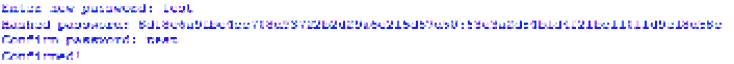

图 15.3–盐化和哈希密码确认的输出

如你从上述截图中所见，密码被系统确认了。

1.  现在让我们看看当我们输入两个不同的密码时会发生什么。让我们看一下以下的截图：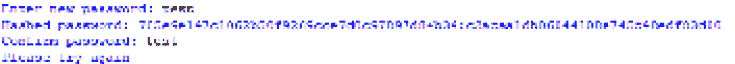

图 15.4–带有确认失败的盐化和哈希密码的输出

如你所见，程序要求用户再试一次。然而，除非重新启动过程，算法并没有提供这样的方式。我们可以让它保持这样，或者我们可以添加条件，使程序再次运行一次，或者两次，或者无限次，直到确认达成为止。

1.  现在让我们看看如果我们使用`sha256`而不是`sha1`来运行算法会发生什么。以下截图显示了使用`sha256`确认密码时的结果：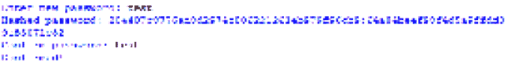

图 15.5–在确认密码的算法中用 sha256 替换 sha1 时的输出

请注意哈希值在`sha256`算法方面的长度更长。在使用密码学时，随机和长总是有帮助的。破解一个不随机的密码，比如`password`或`mycat`，要比破解一个非常长并包含随机数字和字母的密码更容易。这就是为什么我们试图以能够保护数据免受攻击的方式存储数据。

1.  让我们看看我们可以做些什么来为某人提供再次输入密码的机会。在算法结束时，让我们在最后一行之后添加一些代码：

```py
    new_pwd = input('Enter new password: ')
    hashed_pwd = hash_pwd(new_pwd)
    print('Hashed password: ' + hashed_pwd)
    confirm_pwd = input('Confirm password: ')
    if check_pwd(hashed_pwd, confirm_pwd):
        print('Confirmed!')
    else:
        print('Please try again later')
```

请注意我们之前片段中的最后一句话是“请稍后重试”。这让用户知道，如果他们想要保存密码，他们将不得不重新开始这个过程。算法在那时停止了。

1.  如果我们将上述代码放在我们的`else`、`print()`语句之后，那么算法将再运行一次。以下截图显示了用户再次尝试时的输出：

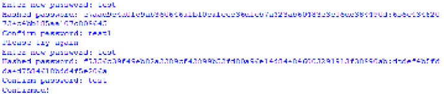

图 15.6–在首次运行算法时输出不匹配后

在我们从这个例子中继续之前，请注意，尽管我们两次输入的新密码都是`test`，但提供的哈希密码是不同的。正如我们提到的，哈希密码是每次创建的。否则，每个人都会知道密码是如何存储的，因为只要我们使用相同的哈希，比如`sha256`，`test`就会是相同的。

在网络安全和密码学中还有很多可以探索的内容。这只是我们如何加密信息的一个味道。

# 问题 7–使用 Python 创建一个聊天机器人

是时候创建一个简单的聊天机器人了。在过去几年里，你可能至少与十几个这样的聊天机器人互动过。当你访问一些网站时，你可能会遇到一个“人”想和你聊天，并问你一些简单的问题，比如你最近怎么样，以及他们能帮你什么。对于大多数网站来说，“人”并不是真人，而是一个聊天机器人。

在某些情况下，聊天机器人会将你引导到一个真正的人。但大多数时候，它们只会通过指向他们网站上可用答案的方向来回答你的问题。

我们将在这里创建类似那些聊天机器人的东西。在我们开始之前，有一些组件是我们需要的。其中之一是一个`intents`文件。这个文件应该是一个`.json`文件，包含了机器人将使用和/或回应的问候和回应。以下是`intents`内容的样本：

```py
{"intents": [
        {"tag": "greeting",
         "patterns": ["Hi", "How are you", "Hello?", "Welcome!", "Hello"],
         "responses": ["Hello! Thank you for visiting our site! ", "Welcome back!", "Hello, how can I help you?", "What can I do for you? "],
         "context_set": ""
        },
        {"tag": "goodbye",
         "patterns": ["Bye", "See you later", "Goodbye"],
         "responses": ["See you later, thanks for visiting", "Thank you and have a wonderful day!", "Bye! See you soon!"]
        }
   ]
} 
```

正如您所看到的，这只是一组可能的响应。我们给`.json`文件提供的数据越多，我们的机器人就会越强大和准确。

我们应该注意，`intents.json`文件需要在**JSON 编辑器**中进行编辑。您可以在[`jsoneditoronline.org`](https://jsoneditoronline.org)上使用一个在线编辑器来创建自己的文件，或者编辑现有的文件。

*我们为什么需要一个机器人？* 这样的东西有各种各样的用途，从创建和发布社交媒体上的消息到为客户提供一个询问他们是否需要帮助的机器人，例如当他们访问网页。这些只是我们可以用聊天机器人做的一些事情。

现在让我们来看一个创建聊天机器人的算法。完整的文件可以在存储库中找到。我们已经在一些片段中进行了注释和描述了发生的事情：

1.  让我们从这里导入库开始：

ch15_chatBot.py

```py
import nltk
import json
import pickle
import numpy as np
nltk.download('punkt')
nltk.download('wordnet')
from nltk.stem import WordNetLemmatizer
lemmatizer = WordNetLemmatizer()
```

从前面的代码中可以看出，您不必每次下载`nltk`模块。但是拥有这段代码也不会有害。系统不会每次安装多个副本；它只会识别它们已经存在，并且不会第二次安装它们。

1.  让我们继续从我们的库和软件包中获取我们需要的东西：

```py
from keras.models import Sequential
from keras.optimizers import SGD
from keras.layers import Activation, Dense, Dropout
import random
```

1.  现在我们已经得到了我们需要的东西，我们必须查看我们的`.json`文件。该文件包含了前面提到的意图。我们不仅需要打开该文件，还需要将组件分开并以我们的算法能够理解的方式进行排序。看一下以下代码片段：

```py
#Upload intents file and create our lists
words=[]
classes = []
doc = []
ignore_words = ['?', '!', ',', '.']
data_words = open(r'C:\...\intents.json').read()
intents = json.loads(data_words)
```

请记住，除非您指定要访问的文件的正确位置，否则程序将无法运行，在这种情况下是`.json`文件。还要注意，这次我们以稍微不同的方式打开它，如前面的代码片段所示。以这种方式打开文件，与我们用 Pandas 打开`.csv`文件不同，意味着我们不需要在路径中使用双`\\`。

1.  现在让我们告诉算法如何处理该文件：

```py
for intent in intents['intents']:
    for pattern in intent['patterns']:
        #Tokenize all the words (separate them)
        w = nltk.word_tokenize(pattern)
        words.extend(w)
        #Add all the words into doc 
        doc.append((w, intent['tag']))
        #Add the classes
        if intent['tag'] not in classes:
            classes.append(intent['tag'])
print(doc)      
```

在这里，我们正在对我们的信息进行标记化，也就是说，我们正在将所有内容分解成单词，然后将它们添加到列表中。这就是使处理信息成为可能的东西。在我们将它们分开后，我们将根据单词的含义对它们进行分组。

1.  然后这些单词被排序，如下面的代码片段所示：

```py
#lemmatization      
words = [lemmatizer.lemmatize(w.lower()) for w in words if w not in ignore_words]
words = sorted(list(set(words)))
classes = sorted(list(set(classes)))
pickle.dump(words,open('words.pkl','wb'))
pickle.dump(classes,open('classes.pkl','wb'))       
```

请注意，在前面的代码中，我们使用了`pickle()`。Pickle 是 Python 中的一个方法，我们可以使用它来序列化数据（或反序列化）。然后使用该方法替换当前文件数据，以便可以将其用作转换。

1.  现在我们已经完成了所有这些，我们需要创建我们的训练模型。我们不会在这里逐个讨论该过程的所有部分，但整个代码可以在 GitHub 存储库文件中找到。请记住，您首先要训练，然后创建，然后编译模型。

一旦我们完成了这个过程，我们就会保存模型以便我们可以使用它。但现在让我们看看聊天机器人的功能：

```py
#Define chatbot functions
def clean_up_sentence(sentence):
    sentence_words = nltk.word_tokenize(sentence)
    sentence_words = [lemmatizer.lemmatize(word.lower()) for word in sentence_words]
    return sentence_words
def bow(sentence, words, show_details=True):
    sentence_words = clean_up_sentence(sentence)
    bag = [0]*len(words)
    for s in sentence_words:
        for i,w in enumerate(words):
            if w == s:
                bag[i] = 1
    return(np.array(bag))
def predict_class(sentence, model):
    p = bow(sentence, words,show_details=False)
    res = model.predict(np.array([p]))[0]
    ERROR_THRESHOLD = 0.25
    results = [[i,r] for i,r in enumerate(res) if r>ERROR_THRESHOLD]
    results.sort(key=lambda x: x[1], reverse=True)
    return_list = []
    for r in results:
        return_list.append({"intent": classes[r[0]], "probability": str(r[1])})
    return return_list
```

前三个函数用于为聊天机器人创建响应并进行预测。这些类将影响我们如何从我们的机器人那里获得这些响应。让我们这样考虑——如果我说你好，我不希望聊天机器人说再见。那将是不礼貌的。但请记住，我们的机器人只有我们的训练好，它才会有多好。因此，如果我们在`.json`文件中没有足够的内容，并且没有正确训练模型，那么机器人将是相当无用的。

1.  现在让我们定义如何获取响应：

```py
def getResponse(ints, intents_json):
    tag = ints[0]['intent']
    list_of_intents = intents_json['intents']
    for i in list_of_intents:
        if(i['tag']== tag):
            result = random.choice(i['responses'])
            break
    return result
def chatbot_response(msg):
    ints = predict_class(msg, model)
    res = getResponse(ints, intents)
    return res
```

从前面的代码片段中可以看到，机器人将制作一个响应并返回它。我们将在我们的文件中的下几个代码片段中调用这些内容。

1.  但我们将在这里跳过这一点，进入我们聊天机器人的外观：

```py
base = Tk()
base.title("Chat with Customer Service")
base.geometry("400x500")
base.resizable(width=FALSE, height=FALSE)
```

请注意，我们在前面的代码片段中建立了一些关键信息。我们确定了窗口的大小并阻止了其调整大小。

1.  在下一个代码片段中，我们将建立背景，添加`滚动条`，并确定**发送**按钮的外观：

```py
#Create chatbot window
ChatLog = Text(base, bd=6, bg="white", height="8", width="70", font="Calibri")
ChatLog.config(state=DISABLED)
#Scrollbar
scrollbar = Scrollbar(base, command=ChatLog.yview, cursor="arrow")
#Create Send button
SendButton = Button(base, font=("Calibri",12,'bold'), text="Send", width="15", height=5,
                    bd=0, bg="pink", activebackground="light green",fg='black',
                    command= send )
EntryBox = Text(base, bd=0, bg="white",width="29", height="5", font="Arial")
scrollbar.place(x=376,y=6, height=386)
ChatLog.place(x=6,y=6, height=386, width=370)
EntryBox.place(x=128, y=401, height=90, width=265)
SendButton.place(x=6, y=401, height=90)
base.mainloop()
```

所以，这就是全部。*我们创建了一个聊天机器人！* *但是当它运行时会是什么样子呢？* 看一下输出：

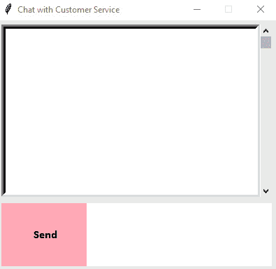

图 15.7 - 聊天机器人窗口

注意我们的组件，左侧的滚动条，粉色的**发送**按钮，以及我们聊天机器人的标题。还要注意最大化按钮是灰色的。这是因为我们说过我们不希望窗口被调整大小。

1.  此外，当我们点击**发送**按钮时，我们希望用户知道它是否被点击。否则，如果不确定，您可能会多次点击它。这就是为什么代码中活动的背景颜色会改变。下面的截图显示了按钮在活动状态下的外观：

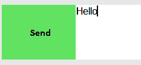

图 15.8 - 活动的发送按钮

许多聊天机器人都有类似的功能，以避免代码错误。

一旦我们打招呼，机器人就会回应。在我们离开这个问题之前，让我们看一下下面截图中与聊天机器人的快速对话：


图 15.9 - 带有响应的聊天机器人窗口

正如您所看到的，几行代码和一个文件可以用来创建与聊天机器人的交互体验。

随意玩弄代码，添加一些特色，创建一个不同的`intents.json`文件，并使其更符合您的需求。

# 总结

在本章中，我们有机会在查看实际问题的同时，探索 Python 在一些非常不同的应用中的应用。

在之前的章节中，我们学习了计算思维过程，以及分解、模式识别、模式概括和算法设计的要素，这些使算法有意义。当我们解决来自客户的问题或者只是在业余时间创建脚本时，我们必须经历必要的过程来定义我们用算法创建的东西。这个关键过程将确保我们设计出尽可能好的算法。

在本章中，我们学会了如何从文件中读取、上传文件、创建密码和解码器、使用算法根据用户输入编写故事，并在给定我们将访问的城市时制定最有效的旅行计划。此外，我们还创建了一个基本的聊天机器人，它可以根据用户输入进行交互和适应。

在下一章中，我们将继续探索 Python 和计算思维，在科学应用、房地产、股票市场分析等领域中解决数据分析的附加应用问题。
