# 第十六章：高级应用计算思维问题

在本章中，我们将继续提供 Python 编程语言和计算思维在多个领域的应用示例。我们将探索多个领域，如几何镶嵌、创建房屋数据模型、创建电场、分析基因数据、分析股票、创建卷积神经网络（CNN）等。我们将利用我们迄今为止学到的关于计算思维和 Python 编程语言的知识来做以下事情：

+   创建镶嵌

+   分析生物数据

+   分析特定人群的数据

+   创建房屋数据模型

+   创建电场线

+   分析通用数据

+   分析股票

+   创建卷积神经网络（CNN）

阅读本章后，您将学会如何在处理数据、创建表格和图形以帮助分析现有数据的同时，创建训练和测试模型以帮助根据现有大型数据集预测结果。

# 技术要求

您需要安装最新版本的 Python 来运行本章中的代码。

您需要为 Python 安装以下库和包：

+   **NLTK**

+   **Cairos**

+   **Pandas**

+   **Matplotlib**

+   **Seaborn**

您可以在此处找到本章中使用的完整源代码：[`github.com/PacktPublishing/Applied-Computational-Thinking-with-Python/tree/master/Chapter16`](https://github.com/PacktPublishing/Applied-Computational-Thinking-with-Python/tree/master/Chapter16)

# 问题 1 - 使用 Python 创建镶嵌

在本节中，我们将使用 Python 的`cairo`库提供一个示例。我们将创建一个**镶嵌**，更具体地说，是一个**彭罗斯镶嵌**的样本。因为这是一个简单的问题，我们将使用计算思维过程来定义我们的参数，但不会严格遵循它。

首先，让我们谈谈`cairo`库。一旦`pip install cairo`命令成功，您需要执行一个步骤来包含所有需要的组件。使用`pip install pycairo`来添加必要的组件。`cairo`和`pycairo`包是与 Python 一起使用的图形库。有关更多信息，您可以访问它们的网页：[`cairographics.org/pycairo`](https://cairographics.org/pycairo)。

现在让我们定义一些东西。**镶嵌**是使用不重叠的形状进行平铺以创建图案。镶嵌经常在几何课程中探索。在我们的示例中，我们将使用两个三角形创建一个彭罗斯镶嵌图案。我们还将定义我们的空间和我们希望形状经历的子细分数。子细分数越多，空间中的图案就越小。让我们看一下算法（文件`ch16_tessellation.py`包含了这里讨论的完整算法）：

1.  我们要做的第一件事是导入必要的包和库：

ch16_tessellation.py

```py
import math
import cmath
import cairo
```

1.  接下来，我们要定义我们的画布和子细分数。请注意，我们选择了`4`作为我们的示例。在*图 16.1*中，您将看到来自此代码片段的示例以及改变子细分的两个额外示例：

```py
#Define the configuration of the image. 
canvas_size = (500, 500)
numberSubdivisions = 4
```

1.  对于镶嵌，我们需要定义**黄金比例**。

黄金比例也被称为黄金平均或神圣比例（还有其他名称）。该比例约为 1.618。例如，如果我们谈论将一条线段分成两部分，那么较大部分的长度除以较小部分的长度将等于两部分之和除以较大部分的长度：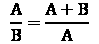。对于镶嵌，我们需要定义这个黄金比例。

看一下以下代码片段：

```py
#Define the Golden Ratio - gr
gr = (1 + math.sqrt(5)) / 2
```

1.  现在我们使用函数来定义当我们的三角形进行子细分时会发生什么：

```py
def subdivide(triangles):
    result = []
    for color, A, B, C in triangles:
        if color == 0:
            P = A + (B - A) / gr
            result += [(0, C, P, B), (1, P, C, A)]
        else:
            Q = B + (A - B) / gr
            R = B + (C - B) / gr
            result += [(1, R, C, A), (1, Q, R, B), (0, R, Q, A)]
    return result
```

在上述代码中，我们定义了将三角形细分的函数。该函数包含一个条件语句，用于在找到比例之前识别三角形的颜色。

1.  要创建三角形的轮廓，我们需要将三角形附加到一个组中。因为 Python 是一种面向对象的编程语言，所以我们可以通过创建一个空列表，然后使用循环附加形状来轻松地做到这一点：

```py
#Wheel of teal triangles
triangles = []
for i in range(10):
    B = cmath.rect(1, (2*i - 1) * math.pi / 10)
    C = cmath.rect(1, (2*i + 1) * math.pi / 10)
    if i % 2 == 0:
        B, C = C, B  # Make sure to mirror every second triangle
    triangles.append((0, 0j, B, C))
for i in range(numberSubdivisions):
    triangles = subdivide(triangles)
```

1.  现在我们要准备用于我们的镶嵌的画布。请注意，我们使用`cairo`函数来使用我们在算法开头定义的变量来定义参数。在这里，我们使用`canvas_size`：

```py
surface = cairo.ImageSurface(cairo.FORMAT_ARGB32, canvas_size[0], canvas_size[1])
cr = cairo.Context(surface)
cr.translate(canvas_size[0] / 2.0, canvas_size[1] / 2.0)
wheelRadius = 1.2 * math.sqrt((canvas_size[0] / 2.0) ** 2 + (canvas_size[1] / 2.0) ** 2)
cr.scale(wheelRadius, wheelRadius)
```

1.  现在我们要定义我们将使用的两个三角形。在这种情况下，我们的三角形是蓝绿色和紫色的，但是您可以更改它们的 RGB 值，也就是说，如果您想要测试不同的颜色：

```py
#Define the teal triangles
for color, A, B, C in triangles:
    if color == 0:
        cr.move_to(A.real, A.imag)
        cr.line_to(B.real, B.imag)
        cr.line_to(C.real, C.imag)
        cr.close_path()
cr.set_source_rgb(.2, .8, .8)
cr.fill()    
#Define the purple triangles
for color, A, B, C in triangles:
    if color == 1:
        cr.move_to(A.real, A.imag)
        cr.line_to(B.real, B.imag)
        cr.line_to(C.real, C.imag)
        cr.close_path()
cr.set_source_rgb(0.7, 0, 0.7)
cr.fill()
color, A, B, C = triangles[0]
cr.set_line_width(abs(B - A) / 10.0)
cr.set_line_join(cairo.LINE_JOIN_ROUND)
```

上述代码创建了蓝绿色的三角形和紫色的三角形。每个都使用 RGB 值定义，并使用路径和线条创建。

1.  旋转的三角形形成了一个瓷砖图案，也就是我们的镶嵌图案。瓷砖之间也有边框分隔。边框的颜色也在接下来的循环中定义：

```py
#Triangle borders
for color, A, B, C in triangles:
    cr.move_to(C.real, C.imag)
    cr.line_to(A.real, A.imag)
    cr.line_to(B.real, B.imag)
cr.set_source_rgb(0.3, 0.5, 0.3)
cr.stroke()
```

1.  最后，我们希望算法创建一个带有我们的镶嵌的图像文件：

```py
surface.write_to_png('tessellation.png')
```

以下截图显示了使用不同数量的子区划进行的三种变化：

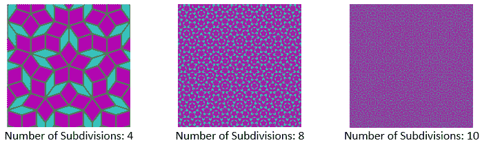

图 16.1 – 样本镶嵌

正如您从前面的图像中所看到的，子区划的数量越多，瓷砖图案就会变得越小，以适应我们定义的画布大小。

当您使用算法时，考虑更改画布大小、子区划和颜色。如果您想要额外的挑战，尝试将三角形图案更改为其他多边形。

# 问题 2 – 在生物数据分析中使用 Python

对于这个特定的问题，我们将使用`Breast_cancer_data.csv`文件，该文件可以在**Kaggle**上找到（[`www.kaggle.com/nsaravana/breast-cancer?select=breast-cancer.csv`](https://www.kaggle.com/nsaravana/breast-cancer?select=breast-cancer.csv)）。该文件也已上传到本书的 GitHub 存储库中。

当查看数据时，有时我们想要与我们当前拥有的数据进行比较，或者我们想要在机器学习中使用它进行预测。在这种情况下，我们将看看如何使用数据集中两个特定列的值来呈现另一种类型的图表，即**散点图**。

假设您收到了这些数据，并且已经确定您的平均周长和平均纹理比列中的其他值更好。您现在的目标是创建一个算法，通过比较这两列的值来分析这两列的值，使用散点图。我们的目标只是获得那个散点图。对于额外的分析和机器学习应用，可以自由探索[*第十三章*]，*使用分类和聚类*，和[*第十四章*]，*在统计分析中使用计算思维和 Python*，以获取额外的帮助。

这个问题的完整代码可以在文件`ch16_BreastCancerSample.py`中找到。我们现在可以开始设计我们的算法：

1.  我们像往常一样从数据开始，导入我们将使用的库。请注意，我们在这里使用了两个显示库，即`matplotlib`和`seaborn`库。这是我们第一次使用`seaborn`。我们使用`seaborn`是因为使用这个库可以轻松处理额外的工作，比如找到回归线：

```py
#Import libraries needed
import pandas as pd
import matplotlib.pyplot as plt
import seaborn as sns
%matplotlib inline
```

1.  现在我们要找到`.csv`文件。请记住，您可以先建立目录。否则，请确保您在运行文件之前包含文件的完整位置。由于我们的目录不同，请确保在运行文件之前更改目录：

```py
#Get data set. Remember to check your directory and/or add the full location of the file.
dataset = pd.read_csv('C:\\... \\breast-cancer.csv')
dataset.head()
dataset.isnull().sum()
```

注意算法中的`dataset.head()`命令。如果我们仅运行代码到那一点，那么我们会得到以下输出：

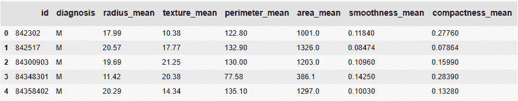

图 16.2 - 显示标题数值的表格

`dataset.isnull().sum()`命令帮助我们查看是否有空数据点或值。

1.  如果有许多空值，我们可以在开始分析之前清理数据集。这个数据是干净的，可以从以下输出中看到，如果我们运行程序直到`dataset.isnull().sum()`，如下屏幕截图所示：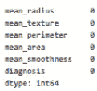

图 16.3 - 空值检查的输出

1.  由于没有缺失值，如前面的屏幕截图所示，我们将继续到下一个代码片段，我们将为诊断创建`count`变量：

```py
#Create count variable for diagnosis
count = dataset.diagnosis.value_counts()
count
```

在前面的代码片段中创建了`count`变量，这意味着我们可以使用诊断的值来创建条形图，无论是恶性还是良性。

1.  以下代码片段创建了该条形图并显示了结果输出：

```py
#Create bargraph of the diagnosis values
count.plot(kind = 'bar')
plt.title('Tumor distribution (malignant: 1, benign: 0)')
plt.xlabel('Diagnosis')
plt.ylabel('count')
plt.show()
```

看一下下面的屏幕截图，显示了使用诊断数值的条形图。正如你所看到的，条形图显示了**恶性**肿瘤与**良性**肿瘤的数量：

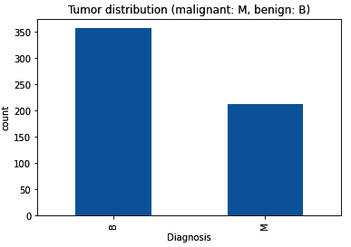

图 16.4 - 恶性与良性诊断条形图

现在我们有了这些信息和条形图，我们可以开始使用数据集中的数值来查看其他组合和比较。

1.  您可以运行不同的分析来查看哪些更相关，但现在，我们只是要使用周长均值和纹理均值来创建我们的散点图。以下代码片段显示了如何使用`seaborn`库来创建这些：

```py
y_target = dataset['diagnosis']
dataset.columns.values
dataset['target'] = dataset['diagnosis'].map({0:'B',1:'M'})
#Create scatterplot of mean perimeter and mean texture
sns.scatterplot(x = 'perimeter_mean', y = 'texture_mean', data = dataset, hue = 'diagnosis', palette = 'bright');
```

创建了我们的散点图后，算法将返回以下输出，显示了平均周长散点图与平均纹理散点图的比较：

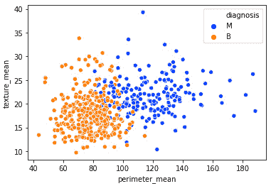

图 16.5 - 平均周长与平均纹理散点图

我们将在这里暂停数据分析。但是，请注意，您可以将此示例推进得更远。事实上，您可以在 Kaggle 中找到对这个特定数据集进行的多个应用和分析，以及一些开发人员和编码人员如何整合机器学习以进行预测。生物信息学的世界是广阔的，数据科学应用也在不断增长。在这些问题中使用 Python 是有帮助的，因为它易于使用并且有适用的库。

# 问题 3 - 使用 Python 分析特定人群的数据

对于本节，我们将以这种方式陈述我们的问题 - 现在是 2020 年，世界被一种名为**SARS-COV-19**的病毒，也称为**冠状病毒**或**COVID-19**，的大流行所压倒。数据是广泛可用的，我们试图看看特定位置发生了什么情况，特别是该位置的死亡人数是如何增长的。我们找到了纽约时报的 GitHub 存储库，其中包含 COVID-19 数据，并下载了每日更新的主数据。让我们看看我们需要做什么以及我们如何找到它。

## 定义要分析和识别人群的具体问题

这个问题很广泛。*太广泛了！*因此，让我们首先看一个地点，仅限一个月。例如，让我们选择波多黎各和十月份。从主`.csv`文件中，我们只提取了波多黎各特定的数据，并将其添加到我们的存储库中。同样，可以在纽约时报的 covid-19-data 存储库中找到主数据，并且您可以使用完整数据、特定州甚至特定县进行多种分析。

现在，我们将集中于创建一个关于 2020 年 10 月波多黎各特定死亡数据的可视化。仅仅通过查看数据，我们就可以看到死亡人数正在上升。请看下面的截图：

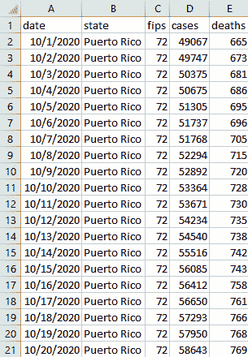

图 16.6 - 2020 年 10 月波多黎各前 20 天的数据

从前面的截图可以看出，**死亡**列继续上升，病例数量也是如此，我们稍后将在本问题中再次查看。

虽然以表格格式读取的数据可能有所帮助，但如果我们要呈现这些信息，特别是如果我们想要识别趋势并影响政策变化，那么可视化表示就至关重要。因此，让我们看看如何为这些特定数据创建散点图。完整文件可以在`ch16_CovidPR.py`中找到：

1.  与数据一起工作时，我们需要确保导入我们将使用的库：

```py
import pandas as pd
import matplotlib.pyplot as plt
```

1.  接下来，我们需要获取我们的文件。请记住，有多种方法可以做到这一点。您可以给 Python 提供文件的完整位置，或者您可以首先识别目录，然后只提供文件名。在运行程序之前，请确保更改您将使用的`.csv`文件的位置：

```py
df = pd.read_csv('C:\\...\\us-PuertoRico.csv')
```

1.  在确定文件后，我们将只需使用日期创建一个简单的散点图作为我们的*x*轴，以及死亡人数作为我们的*y*轴。此代码片段中的下几个命令是为了使图表更易于阅读，例如*y*轴标签，*x-tick*标记的旋转以及图表的标题。*x-tick*标记是水平轴或*x*轴的分割标记。您可以在*图 16.6*中看到*x-tick*标记和标签：

```py
plt.scatter(df['date'], df['deaths'])
plt.xticks(rotation = 90)
plt.title('Deaths per day during October 2020 due to COVID19 in Puerto Rico')
plt.ylabel('Number of Deaths')
fig.tight_layout()
plt.show()
plt.savefig('COVID_PR.png')
```

从前面的代码片段可以看出，我们还创建了一个图像文件，以备将来使用。该图表将显示在我们的屏幕上，如下截图所示：

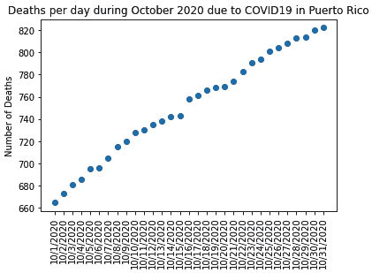

图 16.7 - 2020 年 10 月波多黎各每日死亡人数由于 COVID-19

这是一个有用的图表，可以看出死亡人数正在稳步增加。我们还可以做更多的事情，比如尝试确定回归，这是我们可以使用 Python 的`numpy`库做的另一个功能，欢迎您去尝试！

现在，我们将看一下按日期分类的病例。代码与以前相同，只是我们的*y*轴和标题将不同。完整代码可以在`ch16_CovidPR_2`文件中找到。由于代码非常相似，我们在这里不分享它。但是，我们的结果图可以在下面的截图中看到：

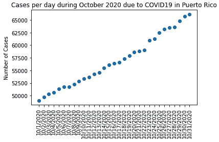

图 16.8 - 2020 年 10 月波多黎各 COVID-19 每日病例

从前面的截图中可以看出，波多黎各的病例数量每天都在上升。我们可以对这两个图表做很多事情；分析它们的回归，通过查看其他月度数据来验证额外的趋势等等。您已经看到如何根据您的`.csv`文件创建一个简单的图表来显示数据；其余的就取决于您了。我们将在下一节中研究一个新问题。

# 问题 4 - 使用 Python 创建房屋数据模型

让我们来看一个问题，我们想要显示布鲁克林，纽约的房地产市场的趋势和信息。数据集包括 2003 年至 2017 年纽约市房屋销售数据的信息。使用的数据集已经以可用格式合并，并且可以在 Kaggle 上找到（[`www.kaggle.com/tianhwu/brooklynhomes2003to2017`](https://www.kaggle.com/tianhwu/brooklynhomes2003to2017)）。此外，`.csv`文件的副本可以在 GitHub 存储库中找到，文件名为`brooklyn_sales_map.csv`。

## 定义问题

对于这个特定的问题，我们有一个庞大的数据文件。我们可以按社区查看信息，按年份比较销售价格，将建造年份与社区进行比较以找到趋势、历史等等。我们可以花费数小时、数天、数周来处理这个数据集。所以让我们尝试把精力集中在这个例子中要完成的事情上。为此，我们将创建两个可视化模型。第一个是根据销售年份的房屋百分比的水平条形图。第二个是显示房屋销售地点的价格范围的条形图。

水平条形图可以帮助更清晰地显示数据，以便我们可以看到房屋价格范围以及是否有显著变化。垂直条形图可以按社区显示相同的价格范围，因此我们可以看到根据房屋销售地点的不同是否有显著变化。

## 算法和数据的可视化表示

让我们看一下代码片段。完整的文件可以在 GitHub 存储库的`ch16_housingBrooklyn.py`下找到。和往常一样，在尝试运行程序之前不要忘记更新文件位置：

1.  对于这个特定的程序，我们需要`pandas`和`matplotlib`库，所以我们需要导入它们：

```py
import pandas as pd
import matplotlib.pyplot as plt
```

1.  接下来，我们需要读取我们的文件。这就是你需要更新这段代码以便在你的机器上运行它的地方：

```py
df = pd.read_csv('C:\\...\\brooklyn_sales_map.csv')
```

1.  现在我们要创建我们的`bins`。这些是我们的值范围，当我们创建图表时会用到它们，你可以在以下几行代码中的`df['price_range']`下看到它们：

```py
bins = [-100000000,20000,40000,60000,80000,100000,1000000,10000000,500000000]
ranges_prices = ['$0-$200k','$200k-$400k','$400k-$600k','$600k-$800k','$800k-$1mlln','$1mlln-$10mlln','$10mlln-$100mlln','$100mlln-$500mlln']
df['price_range'] = pd.cut(df['sale_price'], bins = bins, labels = ranges_prices)
```

1.  现在我们要定义一个函数，我们将在其中转换一些数据。请注意，我们在数据集的每一年上运行该函数，以找到我们稍后将用于`housing_df`的总百分比：

```py
def convert(year):
    return df[df['year_of_sale'] == year].groupby('price_range').size()
percent_total = [x/sum(x)*100 for x in [convert(2003),convert(2004),convert(2005),convert(2006),convert(2007),convert(2008),convert(2009),convert(2010),convert(2011),convert(2012),convert(2013),convert(2014),convert(2015),convert(2016),convert(2017)]]
year_names = list(range(2003,2018))
housing_df = pd.DataFrame(percent_total, index = year_names)
ax_two = housing_df.plot(kind = 'barh', stacked = True, width = 0.9, cmap = 'Spectral')
plt.legend(bbox_to_anchor = (1.45, 1), loc='upper right')
ax_two.set_xlabel('Percentages', fontname='Arial', fontsize = 12)
ax_two.set_ylabel('Years', fontname='Arial', fontsize = 12)
ax_two.set_title('Housing Sale ')
```

前面的片段帮助我们创建了两个模型中的第一个。这是一个水平条形图。我们标记了所有的轴和图表，然后在前面的代码片段中显示的下一行中，我们还定义了我们将在这个图表中使用的颜色映射，这里是`'Spectral'`。你可以尝试不同的颜色映射以便更容易阅读。看一下我们的第一个图表，如下所示：

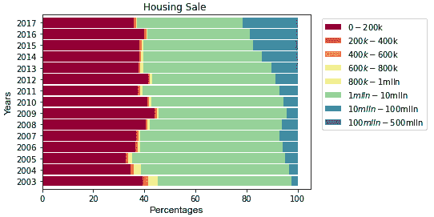

图 16.9-布鲁克林每年的房屋销售

请注意我们在前面的截图中使用了百分比。这使我们能够显示每个价格范围的销售额占比，但它并没有显示每个价格范围的实际销售数量。这两件事情是完全不同的。在这里，我们正在寻找趋势。销售额高于 100 万美元的百分比在 2008 年到 2009 年略微下降后一直在增加。在 2017 年，高于这个价格点的销售额比 2003 年要高得多。

但这是总销售额。如果我们只看这张图而不看数字，我们就不知道例如 2017 年总共卖出了更少的房子。再次，需要注意的重点是，这张图对于理解每个价格范围内房屋销售份额非常有帮助，但这就是这张图给我们的全部信息。现在让我们看看文件中剩下的代码。

1.  在下面的片段中，我们创建了我们的第二张图，它使用我们的信息为每个社区的每个价格范围生成了一个垂直条形图的百分比：

```py
df.groupby(['neighborhood','price_range']).size().unstack().plot.bar(stacked = True, cmap = 'rainbow')
plt.legend(bbox_to_anchor = (1.45, 1), loc = 'upper right')
plt.title('Pricing by Neighborhoods in Brooklyn from 2003 to 2017')
plt.ylabel('Price Range')
plt.xticks(fontsize = 6)
```

这张图用条形图显示了每个社区的价格范围。让我们看一下以下截图中的第二张图：

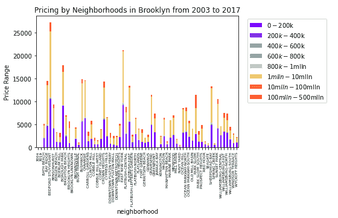

图 16.10-布鲁克林 2003-2017 年各社区的定价

正如你从前面的截图中所看到的，我们得到了一些比*图 16.1*中提供的更详细或更详细的重要信息。在这种情况下，数据是由邻里提供的，并且该数据是按那些邻里的价格范围进行了分类。

当我们查看大型数据集时，我们可以创建多个不同的模型，甚至使用它们来预测未来的值。查看`.csv`文件中可用的数据，并尝试使用其他数据创建一些不同的表示，例如商业与住宅销售、税务分类等。

# 问题 5 – 使用 Python 创建电场线图

在本节中，让我们看一下 Python 在工程和特别是物理学中的一些应用。我们将创建一个**电场线图**。*为什么我们要创建这种类型的图，并且它到底是什么？* 当存在电荷时，就会产生电场。我们使用矢量来显示空间中每一点的电场。在物理学中，电场是单位电荷的电力。看一下正点电荷和负点电荷的电场是什么样子，如下图所示：

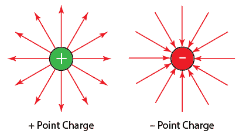

图 16.11 – 电场示例

正如你所看到的，电场线将从电荷开始或结束于电荷。如果它从电荷开始，它是正的，而如果它结束于电荷，它是负的，正如前面的截图所示。较小的电荷会有较少的线条，而较大的电荷会有更多的线条。此外，对于较大的电荷，线条会比较接近，而对于较小的电荷，线条会比较远。

对于我们的问题，我们想要为任意数量的电荷创建一个电场线图。让我们看看下面的代码文件中会是什么样子。请注意，我们已经将代码分解以解释各个部分，但完整的文件可以在 GitHub 存储库中找到：

1.  像往常一样，首先，我们将导入必要的库：

ch16_electricFieldLines.py

```py
import numpy as np
import matplotlib.pyplot as plt
import random
```

1.  然后，我们将通过定义一些变量来设置我们的*x*和*y*轴：

```py
np.seterr(divide='ignore', invalid='ignore')
#Define the size of the electric field lines grid
N = 20
M = 25
#Set the x and y coordinates
x_coor = np.arange(0, M, 1)
y_coor = np.arange(0, N, 1)
x_coor, y_coor = np.meshgrid(x_coor, y_coor)
E_x = np.zeros((N, M))
E_y = np.zeros((N, M))
```

在前面的代码片段中，我们致力于定义我们的网格并设置坐标。然后我们创建了网格。`meshgrid()`函数从向量坐标返回坐标矩阵。

1.  在设置了我们的坐标并设置了我们的网格之后，我们可以开始定义我们的电荷发生了什么。首先，我们需要确定将绘制多少个电荷：

```py
#Set the number of total charges to plot
nq = 8
#Create empty lists to store coordinates of charges
qq = [[], []]  
for dummy in range(nq): 
    q = random.choice([-1, 1])
    q_x, q_y = random.randrange(1, N), random.randrange(1, M)
    qq[0].append(q_y)
    qq[1].append(q_x)
    for i in range(N):
        for j in range(M):
            denom = ((i - q_x) ** 2 + (j - q_y) ** 2) ** 1.5
            if denom != 0: 
                E_x[i, j] += q * (j - q_y) / denom
                E_y[i, j] += q * (i - q_x) / denom
```

正如你从前面的代码片段中所看到的，我们确定了电荷的数量后，创建了两个空列表。然后我们使用嵌套的`for`循环根据电荷的数量向这些列表添加坐标。

1.  在我们进行必要的数学运算以获得我们的坐标和向量之后，我们可以继续绘制我们的电场线图。我们将使用`quiver`图，这是一个我们可以用来创建矢量场的`matplotlib`图形：

```py
C = np.hypot(E_x, E_y)
E = (E_x ** 2 + E_y ** 2) ** .5
E_x = E_x / E
E_y = E_y / E
plt.figure(figsize=(12, 8))
#Plot charges
plt.plot(*qq, 'ms')
#Create 2D array
rr = plt.quiver(x_coor, y_coor, E_x, E_y, C, pivot='middle')
cbar = plt.colorbar()
cbar.ax.set_ylabel('Magnitude')
#Label graph
plt.title('Electric Field Lines in Python')
plt.axis('equal')
plt.axis('off')
plt.show()
```

重要的是要始终为我们的图表和绘图添加标签，因为这将使信息更易读，特别是对于那些不知道这背后的代码意味着什么或图表和绘图代表什么的人。当我们运行我们的代码片段时，我们会得到以下输出：

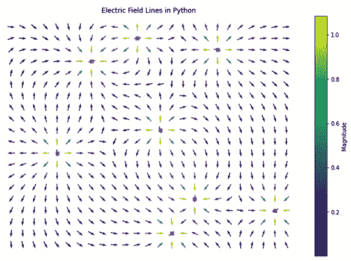

图 16.12 – 八个电荷的电场线

正如你在我们的图中所看到的，有正电荷和负电荷。看一下图中右下角的电荷。该电荷是负的，因为箭头指向电荷。最左边的电荷，已经放大，如下所示，显示为正电荷，因为箭头指向远离电荷的方向：

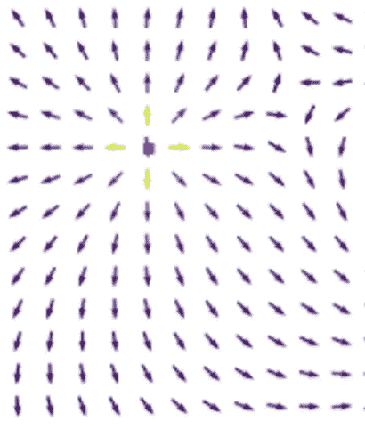

图 16.13 – 放大的正电荷

1.  让我们来看最后一个图形，如下截图所示，其中有一个具有三个电荷的电场线图：

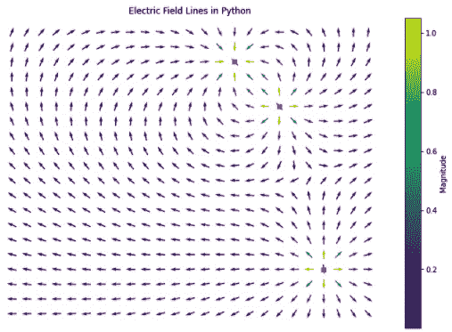

图 16.14 - 具有三个电荷的电场线

正如您所看到的，这个特定的图包含两个正电荷和一个负电荷。如果我们再次运行，我们可能会得到三个正电荷，例如，因为每次运行算法时，我们都会得到一个新的表示，其中正电荷和负电荷的值是随机的。

这种类型的领域以及学习如何使用矢量和箭头图可以帮助我们表示大量信息。在电场线的情况下，我们可以通过简单的视觉图了解电荷的方向和强度。

看看 GitHub 存储库中的代码片段，并尝试更改一些参数，例如图的大小和电荷的数量。通过这些图的实践和改变一些参数，您可以更容易地创建它们。

# 问题 6 - 使用 Python 分析基因数据

让我们把注意力转移到查看一个更大的数据集。您正在处理实验室小鼠的数据，并获得了**三体小鼠**和这些小鼠的蛋白质表达的数据。由于数据量巨大，我们从 Kaggle 的公共领域文件中截取了一些数据。我们只关注这些小鼠的六种蛋白质表达，并且再次只关注研究中的三体（**唐氏综合征**）小鼠。完整的文件可以在 Kaggle 上找到[`www.kaggle.com/ruslankl/mice-protein-expression`](https://www.kaggle.com/ruslankl/mice-protein-expression)。截断文件可以在我们的 GitHub 存储库中找到。

假设您不知道从这些数据的哪里开始。*您甚至应该看什么？*嗯，这通常是数据科学中遇到的第一件事。我们并不总是能参与研究设计或数据收集。很多时候，我们会收到大量的数据文件，并需要找出要查找的内容，如何解决问题，无论我们决定的问题是什么，以及如何以最佳方式显示信息。

另外，这是提醒您在尝试运行此程序之前更改文件位置的提示。这个非常简单的程序可以在`ch16_pairplots.py`文件中找到。让我们从算法开始：

1.  `seaborn`库可以帮助我们一点，让我们开始。我们可以创建`pairplot()`，它将使用直方图和散点图相关联`.csv`文件中的数值数据。这有点像一个神奇的魔术。我们可以用两行代码来看看我们看到了什么。看看生成*图 16.7*所需的两行代码（请注意，实际上有四行代码，但我没有计算我用来导入库的两行代码）：

```py
import seaborn as sns
import pandas as pd
df = pd.read_csv('C:\\...\\Data_Cortex_Nuclear.csv')
sns.pairplot(df, hue = 'Treatment')
```

当您运行此程序时，请耐心等待。算法可能很简单，但它在后台所做的事情并不简单。请看以下截图以查看我们的配对图：

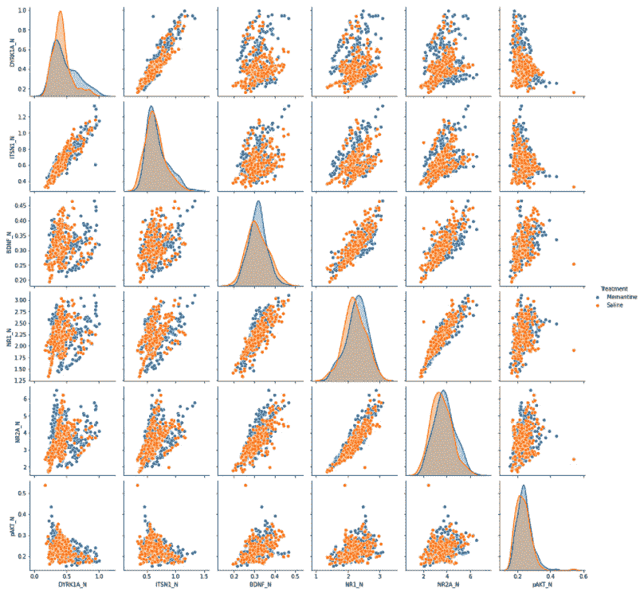

图 16.15 - 三体小鼠中蛋白质表达的配对图与治疗变量

请注意，我们的数据根据治疗方式分为两种颜色，分别是注射甲胺醇或盐水。从图中我们可以看到，一些蛋白质似乎比其他蛋白质具有更高的相关性。让我们暂停一下。

1.  现在假设我们的目标不是根据治疗来检查表达，而是根据类别。然后我们可以运行代码，但首先我们将在算法中将色调更改为`class`。结果如下所示：

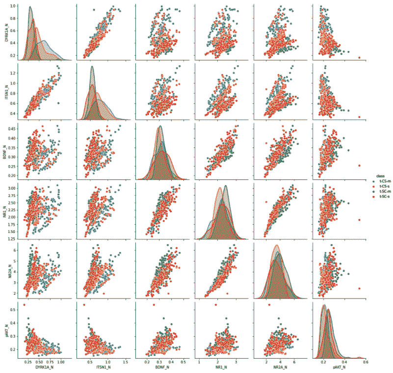

图 16.16 - 三体小鼠中蛋白质表达的配对图与类变量

请注意，这些图表非常相似。然而，这些图表之间的区别在于根据另一个特征来确定每个点的位置。例如，在`class`变量图表中，我们有四种颜色，因为在我们的特定数据集中有四类老鼠。

它们分别是**t-CS-s**，指的是被刺激学习（电击）并注射生理盐水的老鼠；**t-CS-m**，指的是被刺激学习（电击）并注射美金刚烷的老鼠；**t-SC-s**，指的是未被刺激学习并注射生理盐水的老鼠；以及**t-SC-m**，指的是未被刺激学习并注射美金刚烷的老鼠。

通过查看我们的相关性，我们可以看到许多蛋白质之间存在强烈的正相关性，比如**NR2A_N**和**BDNF_N**。无论这是否相关，无论在我们的研究中是否重要，无论是否显著，这些都是我们在进行研究时需要考虑的事情。一旦我们看到图表，我们可以选择进一步探索信息。

在查看这个数据集时，另一种有用的图表类型是箱线图。我们可以使用箱线图来查看我们想更仔细观察的蛋白质的类别的蛋白质表达水平。让我们以`NR2A_N`蛋白为例。使用`seaborn`箱线图，我们可以使用`ch16_boxplot.py`文件中的代码为这种特定蛋白创建一个图表。像往常一样，首先检查文件位置：

```py
import pandas as pd
import scipy.stats as stats
import matplotlib.pyplot as plt
import seaborn as sns
df = pd.read_csv('C:\\...\\Data_Cortex_Nuclear.csv')
protein = df[['NR2A_N', 'class']].dropna()
sns.boxplot(x='class', y='NR2A_N', data = protein)
plt.show
```

在上面的代码中，我们确定了我们想要比较的事物，即蛋白质和类别。然后我们将使用我们的`seaborn`库创建箱线图，如下所示：

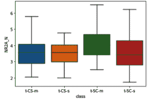

图 16.17 - 按类别绘制 NR2A_N 蛋白表达的箱线图

从图表中可以看出，我们的三体老鼠的分布因类别而异，未被刺激学习并注射生理盐水的老鼠在这种蛋白质的表达上显示出更广泛的范围。让我们尝试将这种蛋白质更改为数据集中的其他蛋白质之一，即**ITSN1_N**蛋白。以下截图显示了生成的箱线图：

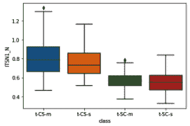

图 16.18 - 按类别绘制 ITSN1_N 蛋白表达的箱线图

在这个特定的箱线图中，我们可以确定**t-CS-m**和**t-SC-m**类别中的异常值，即注射了美金刚烷的两类老鼠。这可能告诉我们需要进一步了解美金刚烷注射与该特定蛋白之间的任何关系。*如果我们要观察非三体老鼠，如果其他因素相同，这些数据（范围）是否适用于该蛋白？* 这些是我们在观察这类数据集时会问自己的一些问题。

如果你记得的话，计算思维过程很少是一条直线。如果我们确定了我们想要在算法中考虑的事情，我们不会只是让我们的算法独自运行并决定它已经完成了，所以我们不会对它进行更改。我们会回去重新确定我们需要什么，对我们的设计进行必要的更改，然后再次创建我们的算法。这更接近于当我们处理更大的数据集时会发生的情况。我们会查看一些初始的可视化，也许创建一些不同类型的图表，运行一些统计分析，然后决定下一步该如何处理数据。这只是 Python 可能实现的一小部分。

# 问题 7 - 使用 Python 分析股票

是时候玩一些股票了。您可以通过**Quandl**访问大量数据，该平台允许免费使用 API 进行教育用途。也有一些高级数据集可用。我们将坚持教育目的，所以这对我们的要求应该足够了。

在这个问题中，我们将学习如何从 Quandl 获取数据并查看 VZ 股票价格。**VZ**是**Verizon**股票价格的代码。我们将使用它们来使用`quandl`来预测价格，这是 Python 的一个包，也是一个充满有用信息的网站。让我们来看一下我们如何获取我们想要的信息。完整的代码，除了 API 密钥，可以在我们的存储库中的`ch16_stockAnalysis.py`文件中找到：

1.  让我们来看一下如何导入数据。你需要自己的 API。如果你想检查另一个股票，比如`AMZN`，你可以用`'WIKI/AMZ'`替换`'EOD/VZ'`。**AMZN**是**Amazon**股票的代码。但让我们来看看我们的`VZ`集：

```py
import quandl
import numpy as np
from sklearn.linear_model import LinearRegression
from sklearn.svm import SVR
from sklearn.model_selection import train_test_split
#Get data from Quandl. Note that you'll need your own API to substitute in the api.key below.
quandl.ApiConfig.api_key = '…'
VZ = quandl.get('EOD/VZ')
print(VZ.head())
```

当我们运行上述代码时，我们得到了数据集中前五个值的表格。以下截图显示了我们的数值表：

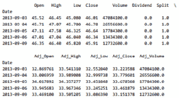

图 16.19 - EOD/VZ 股票表

1.  现在假设我们只想关注调整后的收盘价，以便以后进行预测。那么我们可以使用以下代码片段来实现：

```py
#Grab the Adj_Close column
VZ = VZ[['Adj_Close']]
print(VZ.head())
```

运行上述代码后，我们的调整后的表格如下所示：

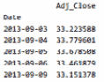

图 16.20 - EOD/VZ 调整后的股票收盘价表

现在我们已经学会了获取当前数据，我们将现在使用我们放在 GitHub 存储库中的数据集来进行操作，以确保你能够复制结果。然后你可以尝试使用 Quandl API 来获取当前数据。 

让我们来看一下文件名为`VZ.csv`的数据集。这包含了 1983 年至 2020 年 4 月的 VZ 相同数据。*我们从这个数据集中想要什么？*我们想要做一些预测。所以让我们建立那个模型。

请注意，代码相当长，所以包含了你需要的所有内容的文件（除了*第 15 行*的文件位置，你需要添加），在`ch16_predictionsModel.py`中。但让我们来看一下那个文件中的一些代码片段：

1.  以下代码片段将为数据集创建一个图。它从文件中选择`Date`列并将其设置为索引值。然后它创建一个图并为图和坐标轴添加标签：

```py
VZ["Date"]=pd.to_datetime(VZ.Date,format="%Y-%m-%d")
VZ.index=VZ['Date']
plt.figure(figsize=(16,8))
plt.plot(VZ["Close"],label='Close price history')
plt.title('Closing price over time', fontsize = 20)
plt.xlabel('Time', fontsize = 15)
plt.ylabel('Closing price', fontsize = 15)
plt.show()
```

我们还没有看到模型。我们还没有定义我们的训练数据。我们只是看了我们的股票价格从**1983**年到**2020**年的情况，如下所示。请注意，第一个刻度标签显示**1984**。我们的数据似乎是在**1984**年之前开始的。刻度标记是自 1980 年以来每 4 年一次，如下所示：

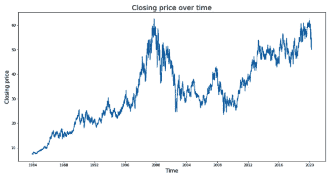

图 16.21 - VZ 股票随时间的收盘价

从前面的图表中可以看出，股票价格在任何情况下都不是线性的。它们上升、下降，然后再上升。一个预测模型将需要大量数据，以便我们能够准备出最佳的预测。我们的数据集有 9166 行数据。这将在下一步中派上用场。

1.  让我们来看一下我们将要使用的另一段代码：

```py
VZ3=VZ2.values
train_data=VZ3[0:750,:]
valid_data=VZ3[750:,:]
VZ2.index=VZ2.Date
VZ2.drop("Date",axis=1,inplace=True)
scaler=MinMaxScaler(feature_range=(0,1))
scaled_data=scaler.fit_transform(VZ2)
x_train_data,y_train_data=[],[]
for i in range(60,len(train_data)):
    x_train_data.append(scaled_data[i-60:i,0])
    y_train_data.append(scaled_data[i,0])

x_train_data,y_train_data=np.array(x_train_data),np.array(y_train_data)
x_train_data=np.reshape(x_train_data,(x_train_data.shape[0],x_train_data.shape[1],1))
```

请注意代码中`train_data=VZ3[0:750,:]`行中的`750`值。这意味着我只使用了数据的前 750 行，而不是可能的 9166 行数据来训练我的模型。这不太好。

让我们来看一下以下截图，显示了我们运行此预测模型时的结果。请注意，我们选择将原始信息复制到我们的图形中。Python 会指出这可能是我们想要修复的问题。这取决于你是否要这样做。目前，将原始数据作为我们图形的叠加提供了一个很好的视觉比较模型的方式：

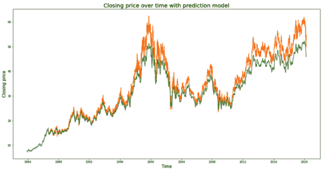

图 16.22 - 收盘价预测

正如您在前面的图表中所看到的，这里显示的橙色部分是原始的、复制的值。绿色显示了我们模型的预测。它们并不糟糕，但也不如它们本应该的那样紧密。

1.  让我们看看当我们使用 7500 行数据时会发生什么，这大约是可用数据的 82%。需要注意的是，GitHub 存储库中的文件使用了 7500 的值，但您可以随意更改和调整这些值，以便测试模型的准确性。以下图表显示了我们的结果：

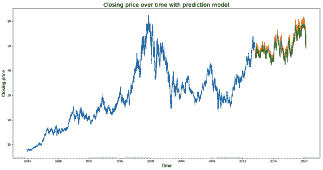

图 16.23 - 使用 7500 行数据的预测模型

请注意，在这个模型中，真实线条和预测线条之间的距离更近了。这是因为我们用来训练模型的数据越多，我们的预测就会变得越好。

在我们离开这个例子之前，请注意我们并没有在这里涵盖代码文件的全部内容。本书的其他部分已经讨论了一些代码，因此我们专注于算法的新部分和对算法解决方案至关重要的部分。该代码文件的最后一部分确实使用了**长短期记忆（LSTM）**模型。LSTM 模型是一种人工循环神经网络。我们在机器学习中使用这个模型来创建深度学习模型。

*我们的模型实际上能预测股票的价格吗？*不行。否则，我们在市场上就会轻松很多。但模型确实可以非常准确地预测价格是否会上涨或下跌。

# 问题 8 - 使用 Python 创建卷积神经网络（CNN）

在这一部分，我们将研究一个使用**人工智能**（**AI**）的问题。更具体地说，我们将致力于创建一个**卷积神经网络**，或者**CNN**。*那么 CNN 是什么？*CNN 是一种**深度学习算法**。CNN 将图像作为输入。然后根据预定条件对图像进行处理和赋予重要性，这将帮助我们区分和分类图像。

以下图表说明了卷积神经网络所涉及的过程：

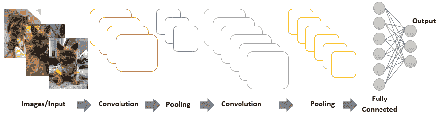

图 16.24 - 卷积神经网络过程

卷积神经网络（CNN）是为了简化我们对图像进行分类的方式而创建的，同时又不牺牲我们希望从图像分析中得到的准确性。这就好像我们在应用滤镜一样。一旦我们应用了滤镜，我们就可以看到特征。前面的图表显示了这个过程的简化示意图。

我们将要深入研究的问题是手写训练和分析。在考虑计算思维过程时，我们真正想要做的是尽可能准确地分析手写。为此，我们分析数百甚至数千张图像来创建和训练我们的模型。我们使用的图像越多，我们的模型就会越准确。

对于我们的模型，我们将使用一个包含 70,000 张图像的数据集。前 60,000 张图像用于训练，而我们将使用其他 10,000 张进行测试。完整的代码可以在`ch16_CNN_mnist.py`文件中找到。我们将看一些来自该代码的片段，并进行一些调整以展示额外的组件。只要您安装了所有必要的库和软件包，就可以在 GitHub 存储库中运行文件而不进行更改。

让我们开始设计模型：

1.  让我们首先看一段代码片段，它将上传数据集，然后显示数据集中的第一项：

```py
from keras.datasets import mnist
#Grab the testing and training data from existing dataset
(X_train, y_train), (X_test, y_test) = mnist.load_data()
import matplotlib.pyplot as plt
#Take a look at the first item in the dataset
plt.imshow(X_train[0], cmap='Greys')
```

我们在训练集中使用索引`0`来查看第一幅图像。`cmap`属性将使色图变为灰色。您可以根据需要进行调整。顺便说一句，对于那些有困难看到颜色或有特殊颜色需求的人来说，改变色图可以显著改变图像的感知方式。让我们看一下以下的第一幅图像：

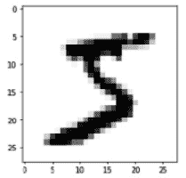

图 16.25 - MNIST 训练集中的第一幅图像

从前面的截图中可以看出，这是一个手写样本，很可能是数字**5**。我们可以多次运行程序，使用不同的索引来查看数据集中的其他样本。以下截图显示了其中一些样本及其相应的索引：

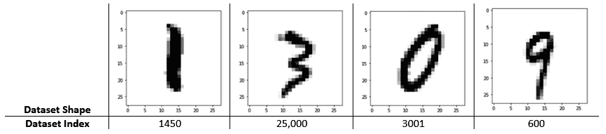

图 16.26 - 数据集中的样本图像按索引

我们使用的数据不是定量的，而是定性的。我们正在查看图像，因此我们需要一个可以分析这些图像的过程。为此，我们使用**One-Hot 编码**，它用新的二进制变量替换整数编码变量。

1.  现在我们已经看了我们正在使用的东西，让我们使用以下代码片段来重塑和编码我们的模型。作为提醒，完整的代码可以在存储库中找到，但是一些组件会略有不同（例如我们的文件不会测试数据集中的图像）：

```py
#Reshape the model 
X_train = X_train.reshape(60000,28,28,1)
X_test = X_test.reshape(10000,28,28,1)
from keras.utils import to_categorical
#Use One-Hot encoding
y_train = to_categorical(y_train)
y_test = to_categorical(y_test)
y_train[0]
```

如您所见，我们正在将图像分成训练集和测试集。然后对它们进行编码。

1.  一旦我们进行了一次性编码，我们就可以创建我们的模型：

```py
#Creating the model
from keras.models import Sequential
from keras.layers import Dense, Conv2D, Flatten
model = Sequential()
model.add(Conv2D(64, kernel_size=3, activation='relu', input_shape=(28,28,1)))
model.add(Conv2D(32, kernel_size=3, activation='relu'))
model.add(Flatten())
model.add(Dense(10, activation='softmax'))
#Compile the model
model.compile(optimizer='adam', loss='categorical_crossentropy', metrics=['accuracy'])
```

在前面的代码片段中，我们使用了`softmax`函数。`softmax`函数有时被称为归一化指数函数。我们用它来规范化输出。

1.  现在让我们训练模型。我们将首先拟合模型，然后验证数据。看一下这段代码：

```py
#train the model
model.fit(X_train, y_train, validation_data=(X_test, y_test), epochs=3)
```

这就是训练和测试的好处之一。也就是说，当我们理解并练习它们时，我们意识到只需要几行代码就可以做一些非常了不起的事情。前面的两行代码（第三行是注释）将产生一些很棒的事情，并允许我们的算法测试其他图像。

1.  现在我们可以预测数据集中的图像。我们将从最后四个开始，因为每个人都从相同的四个数字开始，所以这次我想从后面开始。请注意，要有耐心。在这个算法中有成千上万的图像需要处理。当时代运行时，您将看到一个时钟，它会告诉您信息处理需要多长时间。对于这个特定的算法，只需要几分钟。让我们看一下我们需要运行预测的代码片段：

```py
#Predict last 4 images
model.predict(X_test[9996:])
```

当我们运行这段代码时，我们得到了一系列相当复杂的数字。看一下以下的截图。我们已经突出显示了讨论的代码的关键部分：

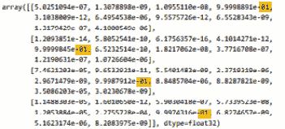

图 16.27 - CNN 图像的模型预测

所以，我可以告诉你，第一个预测的数字是 3。*我们怎么知道这个数字代表 3 呢？*因为每个列表代表数字 0 到 9。所以想象一下，用[0, 1, 2, 3, 4, 5, 6, 7, 8, 9]来替换第一个列表。因此，如果我们把这个看作索引，以**01**结尾的数字（在前面的截图中突出显示）是索引 3，也就是数字 3。所以我们的数字是 3、4、5 和 6。

1.  *但你相信这个模型吗？*我们可以直接返回到这次讨论开始时的代码片段，并打印我们的结果。记得稍微修改代码以打印测试图像，而不是训练图像，就像以下的代码片段中所示：

```py
plt.imshow(X_test[9996], cmap='Greys')
```

在运行代码时，请记住你需要为每个索引运行代码以查看图像。以下截图显示了测试图像的每个相关索引的图像：

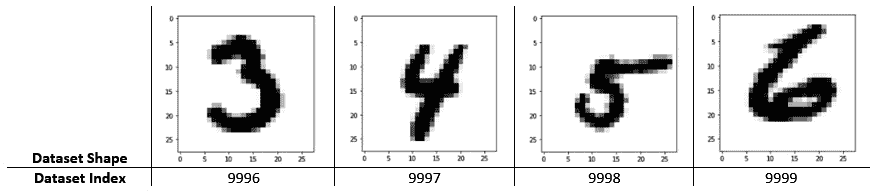

图 16.28 – 测试数据验证图像

正如你所看到的，我们的模型预测了这些索引中每个手写数字图像的正确值。

在结束讨论之前，重要的是要注意，这些模型目前在网站上被广泛使用，用于验证访问网站的访客是人类还是机器人。一些网站会有**CAPTCHA**，有时会提供手写字母，用户必须识别才能继续。这些 CAPTCHA 通常也使用深度学习。CNN 和这些模型的应用是无穷无尽的。

# 总结

在本章中，我们能够更深入地探讨计算思维的更多主题，特别是在处理数据和深度学习方面，使用 Python 编程语言。我们学会了如何创建 pairplots 来确定数据集中变量之间的关系。我们还学会了如何生成各种类型的图表来直观地表示我们的数据集。我们还学会了如何使用 Python 创建电场线。简而言之，我们应用了我们在之前章节中学到的知识，并在解决实际问题时扩展了我们的知识。

这本书的真正目的是：展示 Python 应用的广泛性，同时关注上下文中的真实问题。*我们是否涵盖了 Python 的所有功能？*这几乎是不可能的，因为 Python 的能力不断增长，这是因为它易于使用，易于学习，并且由于其开源性质，不断增加了许多应用程序。希望你能够使用一些新的脚本，了解一些你尚未探索的功能和能力，并享受探索这些场景。

*我们是否会有能力说我们已经创造了完美的算法？*我们这本书的作者认为不会。原因是我们总是在思考如何改进。我们总是质疑额外的应用。我们总是想要使它们更加高效。这正是计算思维帮助我们做的。我们可以分析、设计、测试、回顾，看我们是否达到了想要的目标，然后进行改进、重新设计、进行测试，然后重复。

希望在本章之后，你有机会练习并了解更多关于 Python 的能力。希望在阅读本书之后，你有机会了解编程中计算思维的重要性。感谢你加入我们的旅程！
