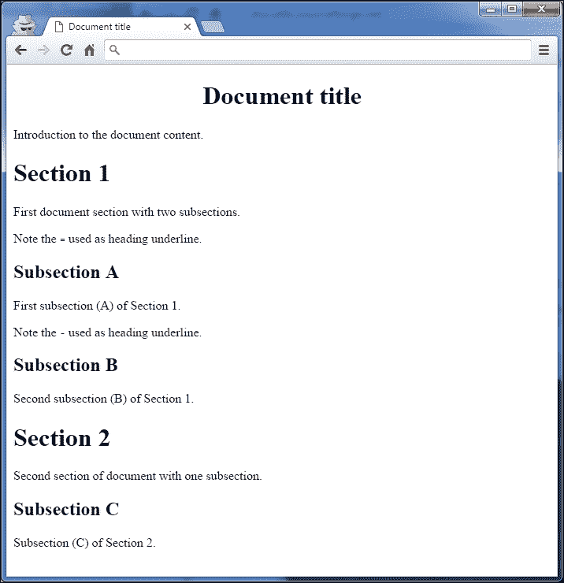
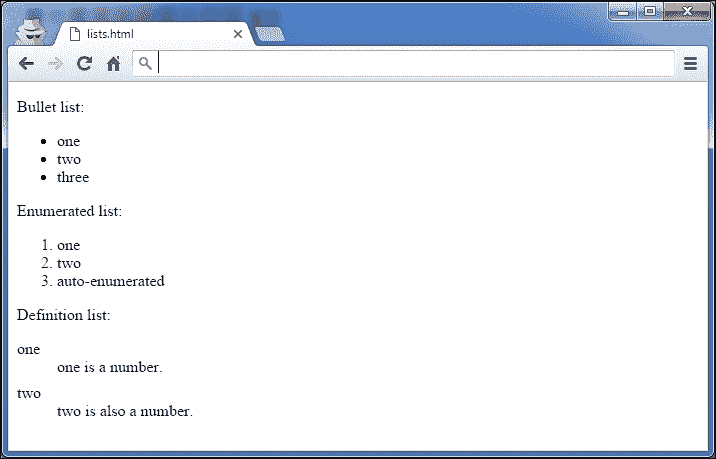
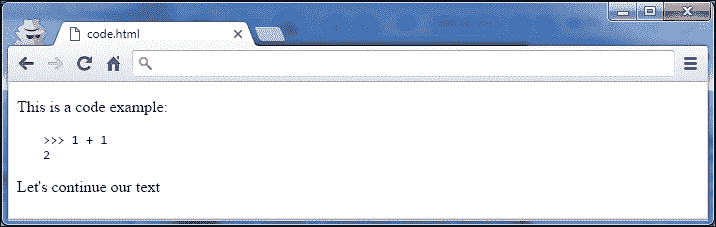
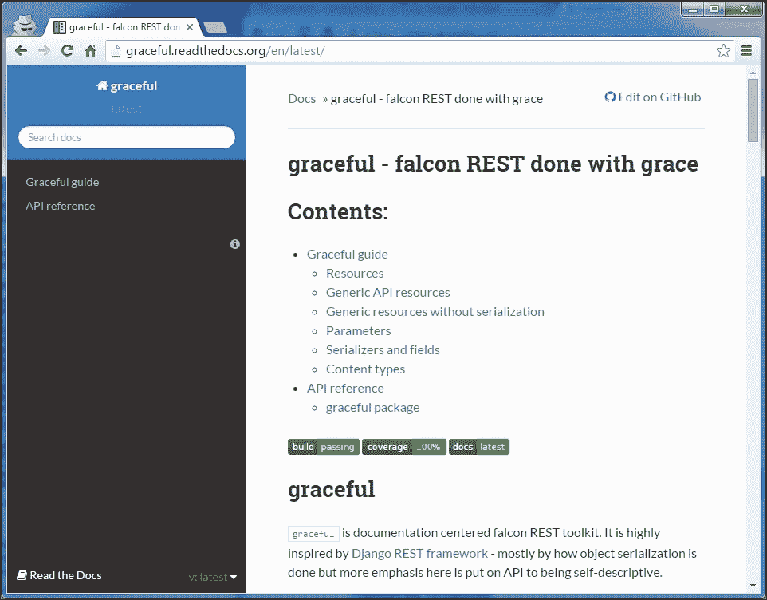

# 第九章：记录你的项目

文档经常被开发者忽视，有时也被管理者忽视。这往往是由于在开发周期结束时缺乏时间，以及人们认为自己写作水平不佳。其中一些确实写得不好，但大多数人能够制作出良好的文档。

无论如何，结果都是由匆忙写成的文档组成的混乱文档。大多数时候，开发者都讨厌做这种工作。当需要更新现有文档时，情况变得更糟。许多项目只提供质量低劣、过时的文档，因为管理者不知道如何处理它。

但在项目开始时建立文档流程，并将文档视为代码模块，可以使文档编写变得更容易。遵循一些规则时，写作甚至可以成为一种乐趣。

本章提供了一些开始记录项目的提示：

+   总结最佳实践的技术写作的七条规则

+   reStructuredText 入门，这是 Python 项目中使用的纯文本标记语法

+   构建良好项目文档的指南

# 技术写作的七条规则

写好文档在许多方面比写代码更容易。大多数开发者认为这很难，但遵循一套简单的规则后，它变得非常容易。

我们这里讨论的不是写一本诗集，而是一篇全面的文本，可以用来理解设计、API 或构成代码库的任何内容。

每个开发者都能够制作这样的材料，本节提供了七条规则，可以在所有情况下应用：

+   **分两步写**：先关注想法，然后再审查和塑造你的文本。

+   **针对读者群**：谁会阅读它？

+   **使用简单的风格**：保持简洁明了。使用良好的语法。

+   **限制信息的范围**：一次引入一个概念。

+   **使用现实的代码示例**："Foos"和"bars"应该避免。

+   **使用轻量但足够的方法**：你不是在写一本书！

+   **使用模板**：帮助读者养成习惯。

这些规则大多受到 Andreas Rüping 的《敏捷文档：软件项目轻量级文档的模式指南》（Wiley）的启发和改编，该书侧重于在软件项目中制作最佳文档。

## 分两步写

Peter Elbow 在《写作的力量：掌握写作过程的技巧》（牛津大学出版社）中解释说，任何人几乎不可能一次写出完美的文本。问题在于，许多开发者写文档并试图直接得到一些完美的文本。他们成功的唯一方法是在每写两个句子后停下来阅读它们并做一些修改。这意味着他们同时关注文本的内容和风格。

这对大脑来说太难了，结果往往不如预期的那么好。在完全思考其含义之前，花费了大量时间和精力来打磨文本的风格和形状。

另一种方法是放弃文本的风格和组织，专注于其内容。所有想法都被记录在纸上，无论它们是如何书写的。开发者开始写一个连续的流，不会在犯语法错误或任何与内容无关的事情时停下来。例如，只要想法被写下来，句子几乎无法理解并不重要。他/她只是以粗略的组织写下他想说的话。

通过这样做，开发者专注于他/她想要表达的内容，可能会从他/她的头脑中得到比最初想象的更多的内容。

进行自由写作时的另一个副作用是，与主题无关的其他想法会很容易浮现在脑海中。一个好的做法是，当它们出现时，在第二张纸或屏幕上把它们写下来，这样它们就不会丢失，然后回到主要写作上。

第二步是回读整个文本，并对其进行润色，使其对每个人都能理解。润色文本意味着增强其风格，纠正其错误，稍微重新组织它，并删除任何多余的信息。

当写作文档的时间有限时，一个好的做法是将这段时间分成两半——一半用于写作内容，一半用于清理和组织文本。

### 注意

专注于内容，然后是风格和整洁。

## 针对读者群

在撰写内容时，作家应考虑一个简单的问题：*谁会阅读它？*

这并不总是显而易见，因为技术文本解释了软件的工作原理，并且通常是为可能获得和使用代码的每个人而写的。读者可能是正在寻找适当技术解决方案的研究人员，或者需要用它实现功能的开发人员。设计师也可能会阅读它，以了解包是否从架构的角度符合他/她的需求。

良好的文档应遵循一个简单的规则——每个文本只应有一种读者。

这种理念使写作变得更容易。作家清楚地知道自己正在与何种读者打交道。他/她可以提供简明而准确的文档，而不是模糊地面向各种读者。

一个好的做法是提供一个简短的介绍性文本，简要解释文档的内容，并引导读者到适当的部分：

```
Atomisator is a product that fetches RSS feeds and saves them in a database, with a filtering process.

If you are a developer, you might want to look at the API description (api.txt)

If you are a manager, you can read the features list and the FAQ (features.txt)

If you are a designer, you can read the architecture and infrastructure notes (arch.txt)
```

通过这种方式引导读者，你可能会产生更好的文档。

### 注意

在开始写作之前了解你的读者群。

## 使用简单的风格

塞思·戈丁是营销领域畅销书作家之一。你可能想阅读《Ideavirus 的释放》，哈希特图书，它可以在互联网上免费获取。

不久前，他在博客上进行了一项分析，试图理解为什么他的书卖得这么好。他列出了营销领域所有畅销书的清单，并比较了它们每句话的平均字数。

他意识到他的书每句话的字数最少（十三个字）。塞思解释说，这个简单的事实证明读者更喜欢简短而简单的句子，而不是长而时髦的句子。

通过保持句子简短和简单，你的写作将消耗更少的大脑力量来提取、处理和理解其内容。技术文档的撰写旨在为读者提供软件指南。它不是一部小说，应该更接近你的微波炉使用说明书，而不是最新的斯蒂芬·金小说。

要牢记的一些建议是：

+   使用简单的句子。句子不应超过两行。

+   每个段落应由三到四个句子组成，最多表达一个主要观点。让你的文本有呼吸空间。

+   不要重复太多。避免新闻报道风格，其中的想法一遍又一遍地重复，以确保它们被理解。

+   不要使用多种时态。大多数情况下，现在时就足够了。

+   如果你不是一个真正优秀的作家，就不要在文本中开玩笑。在技术文本中搞笑真的很难，很少有作家能掌握。如果你真的想表达一些幽默，把它放在代码示例中，你就没问题了。

### 注意

你不是在写小说，所以尽量保持风格简单。

## 限制信息范围

在软件文档中有一个简单的坏迹象——你正在寻找一些你知道存在的信息，但找不到它。在阅读目录表一段时间后，你开始在文件中使用 grep 尝试几个单词组合，但找不到你要找的东西。

当作者没有按主题组织他们的文本时，就会发生这种情况。他们可能提供了大量的信息，但它只是以单一或非逻辑的方式聚集在一起。例如，如果读者正在寻找你的应用程序的整体情况，他或她不应该阅读 API 文档——那是一个低级的问题。

为了避免这种效果，段落应该被聚集在一个有意义的标题下，全局文档标题应该用简短的短语来概括内容。

目录可以由所有章节的标题组成。

组成标题的一个简单做法是问自己，“我会在 Google 中输入什么短语来找到这个部分？”

## 使用现实的代码示例

*Foo*和*bar*是不好的用法。当读者试图理解代码片段的工作方式时，如果有一个不切实际的例子，将会使理解变得更加困难。

为什么不使用一个真实的例子呢？一个常见的做法是确保每个代码示例都可以在真实的程序中剪切和粘贴。

为了展示一个糟糕的用法示例，让我们假设我们想展示如何使用`parse()`函数：

```
**>>> from atomisator.parser import parse**
**>>> # Let's use it:**
**>>> stuff = parse('some-feed.xml')**
**>>> next(stuff)**
**{'title': 'foo', 'content': 'blabla'}**

```

一个更好的例子是，当解析器知道如何使用 parse 函数返回一个 feed 内容时，它作为一个顶级函数可用：

```
**>>> from atomisator.parser import parse**
**>>> # Let's use it:**
**>>> my_feed = parse('http://tarekziade.wordpress.com/feed')**
**>>> next(my_feed)**
**{'title': 'eight tips to start with python', 'content': 'The first tip is..., ...'}**

```

这种细微的差别可能听起来有些过分，但事实上它会使你的文档更有用。读者可以将这些行复制到 shell 中，理解 parse 使用 URL 作为参数，并且它返回一个包含博客条目的迭代器。

当然，提供一个现实的例子并不总是可能或可行的。这对于非常通用的代码尤其如此。即使这本书中也有一些模糊的`foo`和`bar`字符串的出现，其中名称上下文并不重要。无论如何，你应该始终努力将这种不切实际的例子的数量减少到最低。

### 注意

代码示例应该直接在真实程序中可重用。

## 使用轻量但足够的方法

在大多数敏捷方法论中，文档不是第一位的。使软件正常工作比详细的文档更重要。因此，一个好的做法，正如 Scott Ambler 在他的书《敏捷建模：极限编程和统一过程的有效实践》中所解释的那样，是定义真正的文档需求，而不是创建详尽的文档集。

例如，让我们看一个简单项目的文档示例——`ianitor`——它在 GitHub 上可用[`github.com/ClearcodeHQ/ianitor`](https://github.com/ClearcodeHQ/ianitor)。这是一个帮助在 Consul 服务发现集群中注册进程的工具，因此主要面向系统管理员。如果你看一下它的文档，你会意识到这只是一个单一的文档（`README.md`文件）。它只解释了它的工作原理和如何使用它。从管理员的角度来看，这是足够的。他们只需要知道如何配置和运行这个工具，没有其他人群预期使用`ianitor`。这个文档通过回答一个问题来限制其范围，“我如何在我的服务器上使用`ianitor`？”

## 使用模板

维基百科上的每一页都很相似。一侧有用于总结日期或事实的框。文件的开头是一个带有链接的目录，这些链接指向同一文本中的锚点。最后总是有一个参考部分。

用户习惯了。例如，他们知道他们可以快速查看目录，如果找不到所需信息，他们将直接转到参考部分，看看是否可以在该主题上找到另一个网站。这对维基百科上的任何页面都适用。你学会了*维基百科方式*，更有效率。

因此，使用模板强制了文档的通用模式，因此使人们更有效地使用它们。他们习惯了结构并知道如何快速阅读它。

为每种文档提供模板也为作者提供了快速入门。

# reStructuredText 入门

reStructuredText 也被称为 reST（参见[`docutils.sourceforge.net/rst.html`](http://docutils.sourceforge.net/rst.html)）。它是一种纯文本标记语言，在 Python 社区广泛用于文档化包。reST 的好处在于文本仍然可读，因为标记语法不像 LaTeX 那样混淆文本。

这是这样一个文档的示例：

```
=====
Title
=====

Section 1
=========
This *word* has emphasis.

Section 2
=========

Subsection
::::::::::

Text.
```

reST 包含在`docutils`中，该软件包提供了一套脚本，可将 reST 文件转换为各种格式，如 HTML、LaTeX、XML，甚至是 S5，Eric Meyer 的幻灯片系统（参见[`meyerweb.com/eric/tools/s5`](http://meyerweb.com/eric/tools/s5)）。

作者可以专注于内容，然后根据需要决定如何呈现它。例如，Python 本身是用 reST 文档化的，然后呈现为 HTML 以构建[`docs.python.org`](http://docs.python.org)，以及其他各种格式。

开始写 reST 所需了解的最少元素是：

+   部分结构

+   列表

+   内联标记

+   文字块

+   链接

本节是语法的快速概述。更多信息可在以下网址找到快速参考：[`docutils.sourceforge.net/docs/user/rst/quickref.html`](http://docutils.sourceforge.net/docs/user/rst/quickref.html)，这是开始使用 reST 的好地方。

要安装 reStructuredText，安装`docutils`：

```
**$ pip install docutils**

```

例如，由`docutils`包提供的`rst2html`脚本将根据 reST 文件生成 HTML 输出：

```
**$ more text.txt**
**Title**
**=====**

**content.**

**$ rst2html.py text.txt**
**<?xml version="1.0" encoding="utf-8" ?>**
**...**
**<html ...>**
**<head>**
**...**
**</head>**
**<body>**
**<div class="document" id="title">**
**<h1 class="title">Title</h1>**
**<p>content.</p>**
**</div>**
**</body>**
**</html>**

```

## 部分结构

文档的标题及其各节使用非字母数字字符进行下划线。它们可以被上下划线覆盖，并且一种常见的做法是为标题使用这种双重标记，并为各节保持简单的下划线。

用于下划线部分标题的最常用字符按优先顺序排列：`=, -, _, :, #, +, ^`。

当一个字符用于一个部分时，它与其级别相关联，并且必须在整个文档中一致使用。

例如，考虑以下代码：

```
==============
Document title
==============

Introduction to the document content.

Section 1
=========

First document section with two subsections.

Note the ``=`` used as heading underline.

Subsection A
------------

First subsection (A) of Section 1.

Note the ``-`` used as heading underline.

Subsection B
------------
Second subsection (B) of Section 1.

Section 2
=========

Second section of document with one subsection.

Subsection C
------------

Subsection (C) of Section 2.
```



图 1 reStructuredText 转换为 HTML 并在浏览器中呈现

## 列表

reST 为项目列表、编号列表和具有自动编号功能的定义列表提供可读的语法：

```
Bullet list:

- one
- two
- three

Enumerated list:

1\. one
2\. two
#. auto-enumerated

Definition list:

one
    one is a number.

two
    two is also a number.
```



图 2 不同类型的列表呈现为 HTML

## 内联标记

文本可以使用内联标记进行样式化：

+   `*强调*`：斜体

+   `**强调**`：粗体

+   `inline preformated`：内联预格式化文本（通常是等宽的，类似终端）

+   ``带有链接的文本`_`：只要在文档中提供了它（请参阅*链接*部分），它将被替换为超链接

## 文字块

当您需要展示一些代码示例时，可以使用文字块。两个冒号用于标记块，这是一个缩进的段落：

```
This is a code example

::

    >>> 1 + 1
    2

Let's continue our text
```

### 注意

不要忘记在`::`后和块后添加空行，否则它将无法呈现。

请注意，冒号字符可以放在文本行中。在这种情况下，它们将在各种呈现格式中被替换为单个冒号：

```
This is a code example::

    >>> 1 + 1
    2

Let's continue our text
```

如果不想保留单个冒号，可以在前导文本和`::`之间插入一个空格。在这种情况下，`::`将被解释并完全删除。



图 3 reST 中呈现为 HTML 的代码示例

## 链接

只要提供在文档中，文本就可以通过以两个点开头的特殊行更改为外部链接：

```
Try `Plone CMS`_, it is great ! It is based on Zope_.

.. _`Plone CMS`: http://plone.org
.. _Zope: http://zope.org
```

通常的做法是将外部链接分组放在文档的末尾。当要链接的文本包含空格时，必须用`` ` ``（反引号）字符括起来。

Internal links can also be used by adding a marker in the text:

```

This is a code example

.. _example:

::

    >>> 1 + 1
    2

Let's continue our text, or maybe go back to
the example_.
```

Sections are also targets that can be used:

```

==============
Document title
==============

Introduction to the document content.


Section 1
=========

First document section.


Section 2
=========

-> go back to `Section 1`_
```

# Building the documentation

An easier way to guide your readers and your writers is to provide each one of them with helpers and guidelines, as we have learned in the previous section of this chapter.

From a writer's point of view, this is done by having a set of reusable templates together with a guide that describes how and when to use them in a project. It is called a **documentation portfolio**.

From a reader's point of view, it is important to be able to browse the documentation with no pain, and getting used to finding the information efficiently. It is done by building a **document landscape**.

## Building the portfolio

There are many kinds of documents a software project can have, from low-level documents that refer directly to the code, to design papers that provide a high-level overview of the application.

For instance, Scott Ambler defines an extensive list of document types in his book, *Agile Modeling: Effective Practices for eXtreme Programming and the Unified Process*, *John Wiley & Sons*. He builds a portfolio from early specifications to operations documents. Even the project management documents are covered, so the whole documenting needs are built with a standardized set of templates.

Since a complete portfolio is tightly related to the methodologies used to build the software, this chapter will only focus on a common subset that you can complete with your specific needs. Building an efficient portfolio takes a long time as it captures your working habits.

A common set of documents in software projects can be classified into three categories:

*   **Design**: This includes all the documents that provide architectural information and low-level design information, such as class diagrams or database diagrams
*   **Usage**: This includes all the documents on how to use the software; this can be in the shape of a cookbook and tutorials or a module-level help
*   **Operations**: This provides guidelines on how to deploy, upgrade, or operate the software

### Design

The important point when creating such documents is to make sure the target readership is perfectly known and the content scope is limited. So, a generic template for design documents can provide a light structure with a little advice for the writer.

Such a structure might include:

*   Title
*   Author
*   Tags (keywords)
*   Description (abstract)
*   Target (who should read this?)
*   Content (with diagrams)
*   References to other documents

The content should be three or four pages when printed, at the most, to be sure to limit the scope. If it gets bigger, it should be split into several documents or summarized.

The template also provides the author's name and a list of tags to manage its evolutions and ease its classification. This will be covered later in the chapter.

The example design document template in reST could be as follows:

```

=========================================
Design document title
=========================================

:Author: Document Author
:Tags: document tags separated with spaces

:abstract:

    Write here a small abstract about your design document.

.. contents ::


Audience
========

Explain here who is the target readership.


Content
=======

Write your document here. Do not hesitate to split it in several sections.


References
==========

Put here references, and links to other documents.
```

### Usage

The usage documentation describes how a particular part of the software is used. This documentation can describe low-level parts, such as how a function works, but also high-level parts, such as command-line arguments for calling the program. This is the most important part of documentation in framework applications, since the target readership is mainly the developers that are going to reuse the code.

The three main kinds of documents are:

*   **Recipe**: This is a short document that explains how to do something. This kind of document targets one readership and focuses on one specific topic.
*   **Tutorial**: This is a step-by-step document that explains how to use a feature of the software. This document can refer to recipes, and each instance is intended to one readership.
*   **Module helper**: This is a low-level document that explains what a module contains. This document could be shown (for instance) when you call the `help` built-in over a module.

#### Recipe

A recipe answers a very specific problem and provides a solution to resolve it. For example, ActiveState provide a huge repository of Python recipes online where developers can describe how to do something in Python (refer to [`code.activestate.com/recipes/langs/python/`](http://code.activestate.com/recipes/langs/python/)). Such a set of recipes related to a single area/project is often called *cookbook*.

These recipes must be short and are structured like this:

*   Title
*   Submitter
*   Last updated
*   Version
*   Category
*   Description
*   Source (the source code)
*   Discussion (the text explaining the code)
*   Comments (from the Web)

Often, they are one-screen long and do not go into great detail. This structure perfectly fits a software's needs and can be adapted in a generic structure, where the target readership is added and the category is replaced by tags:

*   Title (short sentence)
*   Author
*   Tags (keywords)
*   Who should read this?
*   Prerequisites (other documents to read, for example)
*   Problem (a short description)
*   Solution (the main text, one or two screens)
*   References (links to other documents)

The date and version are not useful here, since project documentation should be rather managed like a source code in the project. This means that the best way to handle the documentation is to manage it through the version control system. In most cases, this is exactly the same code repository as the one used for the project's code.

A simple reusable template for the recipes could be as follows:

```

===========
Recipe name
===========

:Author: Recipe Author
:Tags: document tags separated with spaces

:abstract:

    Write here a small abstract about your design document.

.. contents ::


Audience
========

Explain here who is the target readership.


Prerequisites
=============

Write the list of prerequisites for implementing this recipe. This can be additional documents, software, specific libraries, environment settings or just anything that is required beyond the obvious language interpreter.


Problem
=======

Explain the problem that this recipe is trying to solve.


Solution
========

Give solution to problem explained earlier. This is the core of a recipe.


References
==========

Put here references, and links to other documents.
```

#### Tutorial

A tutorial differs from a recipe in its purpose. It is not intended to resolve an isolated problem, but rather describes how to use a feature of the application step by step. This can be longer than a recipe and can concern many parts of the application. For example, Django provides a list of tutorials on its website. *Writing your first Django App, part 1* (refer to [`docs.djangoproject.com/en/1.9/intro/tutorial01/`](https://docs.djangoproject.com/en/1.9/intro/tutorial01/)) explains in few screens how to build an application with Django.

A structure for such a document will be:

*   Title (short sentence)
*   Author
*   Tags (words)
*   Description (abstract)
*   Who should read this?
*   Prerequisites (other documents to read, for example)
*   Tutorial (the main text)
*   References (links to other documents)

#### Module helper

The last template that can be added in our collection is the module helper template. A module helper refers to a single module and provides a description of its contents, together with usage examples.

Some tools can automatically build such documents by extracting the docstrings and computing module help using `pydoc`, such as Epydoc (refer to [`epydoc.sourceforge.net`](http://epydoc.sourceforge.net)). So it is possible to generate an extensive documentation based on API introspection. This kind of documentation is often provided in Python frameworks. For instance, Plone provides an [`api.plone.org`](http://api.plone.org) server that keeps an up-to-date collection of module helpers.

The main problems with this approach are:

*   There is no smart selection performed over the modules that are really interesting to the document
*   The code can be obfuscated by the documentation

Furthermore, a module documentation provides examples that sometimes refer to several parts of the module and that are hard to split between the functions' and classes' docstrings. The module docstring could be used for that purpose by writing text at the top of the module. But this ends in having a hybrid file composed of a block of text rather than a block of code. This is rather obfuscating when the code represents less than 50% of the total length. If you are the author, this is perfectly fine. But when people try to read the code (not the documentation), they will have to skip the docstrings part.

Another approach is to separate the text in its own file. A manual selection can then be operated to decide which Python module will have its module helper file. The documents can then be separated from the code base and allowed to live their own life, as we will see in the next part. This is how Python is documented.

Many developers will disagree on the fact that doc and code separation is better than docstrings. This approach means that the documentation process is fully integrated in the development cycle; otherwise it will quickly become obsolete. The docstrings approach solves this problem by providing proximity between the code and its usage example but doesn't bring it to a higher level—a document that can be used as part of a plain documentation.

The template for a module helper is really simple, as it contains just a little metadata before the content is written. The target is not defined since it is the developers who wish to use the module:

*   Title (module name)
*   Author
*   Tags (words)
*   Content

### Note

The next chapter will cover test-driven development using doctests and module helpers.

### Operations

Operation documents are used to describe how the software can be operated. Consider the following points for instance:

*   Installation and deployment documents
*   Administration documents
*   Frequently Asked Questions (FAQ) documents
*   Documents that explain how people can contribute, ask for help, or provide feedback

These documents are very specific but they can probably use the tutorial template defined in the earlier section.

# Making your own portfolio

The templates that we discussed earlier are just a basis that you can use to document your software. With time, you will eventually develop your own templates and style for making documentation. But always keep in mind the light but sufficient approach for project documentation: each document added should have a clearly defined target readership and should fill a real need. Documents that don't add a real value should not be written.

Each project is unique and has different documentation needs. For example, small terminal tools with simple usage can definitely live with only a single `README` file as its document landscape. Having such a minimal single-document approach is completely fine if the target readers are precisely defined and consistently grouped (system administrators, for instance).

Also, do not apply the provided templates too rigorously. Some additional metadata provided as an example is really useful in either big projects or in strictly formalized teams. Tags, for instance, are intended to improve textual search in big documentations but will not provide any value in a documentation landscape consisting only of a few documents.

Also, including the document author is not always a good idea. Such an approach may be especially questionable in open source projects. In such projects, you will want the community to also contribute to documentation. In most cases, such documents are continuously updated whenever there is such a need by whoever makes the contribution. People tend to treat the document *author* also as the document *owner*. This may discourage people to update the documentation if every document has its author always specified. Usually, the version control software provides clearer and more transparent information about real document authors than explicitly provided metadata annotations. The situations where explicit authors are really recommended are various design documents, especially in projects where the design process is strictly formalized. The best example is the series of PEP documents with the Python language enhancement proposals.

## Building the landscape

The document portfolio built in the previous section provides a structure at document level but does not provide a way to group and organize it to build the documentation the readers will have. This is what Andreas Rüping calls a document landscape, referring to the mental map the readers use when they browse documentation. He came up with the conclusion that the best way to organize documents is to build a logical tree.

In other words, the different kinds of documents composing the portfolio need to find a place to live within a tree of directories. This place must be obvious to the writers when they create the document and to the readers when they are looking for it.

A great help when browsing documentation is the index pages at each level that can drive writers and readers.

Building a document landscape is done in two steps:

*   Building a tree for the producers (the writers)
*   Building a tree for the consumers (the readers) on top of the producers' tree

This distinction between producers and consumers is important since they access the documents in different places and different formats.

### Producer's layout

From a producer's point of view, each document is processed exactly like a Python module. It should be stored in the version control system and works like code. Writers do not care about the final appearance of their prose and where it is available, they just want to make sure that they are writing a document, so it is the single source of truth on the topic covered. reStructuredText files stored in a folder tree are available in the version control system together with the software code and are a convenient solution to building the documentation landscape for producers.

By convention, the `docs` folder is used as a root of documentation tree:

```

$ cd my-project
$ find docs
docs
docs/source
docs/source/design
docs/source/operations
docs/source/usage
docs/source/usage/cookbook
docs/source/usage/modules
docs/source/usage/tutorial
```

Notice that the tree is located in a `source` folder because the `docs` folder will be used as a root folder to set up a special tool in the next section.

From there, an `index.txt` file can be added at each level (besides the root), explaining what kind of documents the folder contains or summarizing what each subfolder contains. These index files can define a listing of the documents they contain. For instance, the `operations` folder can contain a list of operations documents available:

```

==========
Operations
==========

This section contains operations documents:

− How to install and run the project
− How to install and manage a database for the project
It is important to know that people tend to forget 

```

It is important to know that people tend to forget to update such lists of documents and tables of content. So it is better to have them updated automatically. In the next subsection, we will discuss one tool that, among many other features, can also handle this use case.

### Consumer's layout

From a consumer's point of view, it is important to work out the index files and to present the whole documentation in a format that is easy to read and looks good. Web pages are the best pick and are easy to generate from reStructuredText files.

**Sphinx** ([`sphinx.pocoo.org`](http://sphinx.pocoo.org)) is a set of scripts and `docutils` extensions that can be used to generate an HTML structure from our text tree. This tool is used (for instance) to build the Python documentation, and many projects are now using it for their documentation. Among its built-in features, it produces a really nice browsing system, together with a light but sufficient client-side JavaScript search engine. It also uses `pygments` for rendering code examples, which produces really nice syntax highlights.

Sphinx can be easily configured to stick with the document landscape defined in the earlier section. It can be easily installed with `pip` as `Sphinx` package.

The easiest way to start working with Sphinx is to use the `sphinx-quickstart` script. This utility will generate a script together with `Makefile`, which can be used to generate the web documentation every time it is needed. It will interactively ask you some questions and then bootstrap the whole initial documentation source tree and configuration file. Once it is done, you can easily tweak it whenever you want. Let's assume we have already bootstrapped the whole Sphinx environment and we want to see its HTML representation. This can be easily done using the `make html` command:

```

project/docs$ make html
sphinx-build -b html -d _build/doctrees   . _build/html
Running Sphinx v1.3.6
making output directory...
loading pickled environment... not yet created
building [mo]: targets for 0 po files that are out of date
building [html]: targets for 1 source files that are out of date
updating environment: 1 added, 0 changed, 0 removed
reading sources... [100%] index
looking for now-outdated files... none found
pickling environment... done
checking consistency... done
preparing documents... done
writing output... [100%] index
generating indices... genindex
writing additional pages... search
copying static files... done
copying extra files... done
dumping search index in English (code: en) ... done
dumping object inventory... done
build succeeded.
Build finished. The HTML pages are in _build/html.

```



Figure 4 An example HTML version of documentation built with Sphinx – [`graceful.readthedocs.org/en/latest/`](http://graceful.readthedocs.org/en/latest/)

Besides the HTML versions of the documents, the tool also builds automatic pages, such as a module list and an index. Sphinx provides a few `docutils` extensions to drive these features. The main ones are:

*   A directive that builds a table of contents
*   A marker that can be used to register a document as a module helper
*   A marker to add an element in the index

#### Working on the index pages

Sphinx provides a `toctree` directive that can be used to inject a table of contents in a document with links to other documents. Each line must be a file with its relative path, starting from the current document. Glob-style names can also be provided to add several files that match the expression.

For example, the index file in the `cookbook` folder, which we have previously defined in the producer's landscape, can look like this:

```

========
Cookbook
========

Welcome to the Cookbook.

Available recipes:

.. toctree::
   :glob:
   *

```

With this syntax, the HTML page will display a list of all the reStructuredText documents available in the `cookbook` folder. This directive can be used in all the index files to build a browsable documentation.

#### Registering module helpers

For module helpers, a marker can be added so that it is automatically listed and available in the module's index page:

```

=======
session
=======

.. module:: db.session

The module session...

```

Notice that the `db` prefix here can be used to avoid module collision. Sphinx will use it as a module category and will group all modules that start with `db.` in this category.

#### Adding index markers

Another option can be used to fill the index page by linking the document to an entry:

```
=======
session
=======

.. module:: db.session

.. index::
   Database Access
   Session

The module session...

```

Two new entries, `Database Access` and `Session`, will be added in the index page.

#### Cross-references

Finally, Sphinx provides an inline markup to set cross-references. For instance, a link to a module can be done like this:

```

:mod:`db.session`

```

在这里，`:mod:`是模块标记的前缀，``db.session``是要链接到的模块的名称（如之前注册的）；请记住，`：mod:`以及之前的元素都是 Sphinx 在 reSTructuredText 中引入的特定指令。

### 注意

Sphinx 提供了更多功能，您可以在其网站上发现。例如，*autodoc*功能是自动提取您的 doctests 以构建文档的一个很好的选项。请参阅[`sphinx.pocoo.org`](http://sphinx.pocoo.org)。

## 文档构建和持续集成

Sphinx 确实提高了从消费者角度阅读文档的可读性和体验。正如前面所说的，当其部分与代码紧密耦合时，特别有帮助，比如 dosctrings 或模块助手。虽然这种方法确实使得确保文档的源版本与其所记录的代码匹配变得更容易，但并不能保证文档读者能够访问到最新和最新的编译版本。

如果文档的目标读者不熟练使用命令行工具，也不知道如何将其构建成可浏览和可读的形式，那么仅有最小的源表示也是不够的。这就是为什么在代码存储库发生任何更改时，自动将文档构建成消费者友好的形式非常重要。

使用 Sphinx 托管文档的最佳方式是生成 HTML 构建，并将其作为静态资源提供给您选择的 Web 服务器。Sphinx 提供了适当的`Makefile`来使用`make html`命令构建 HTML 文件。因为`make`是一个非常常见的实用工具，所以很容易将这个过程与第八章中讨论的任何持续集成系统集成，*管理代码*。

如果您正在使用 Sphinx 记录一个开源项目，那么使用**Read the Docs**（[`readthedocs.org/`](https://readthedocs.org/)）会让您的生活变得轻松很多。这是一个免费的服务，用于托管使用 Sphinx 的开源 Python 项目的文档。配置完全无忧，而且非常容易与两个流行的代码托管服务集成：GitHub 和 Bitbucket。实际上，如果您的账户正确连接并且代码存储库正确设置，启用 Read the Docs 上的文档托管只需要点击几下。

# 总结

本章详细解释了如何：

+   ```使用一些高效写作的规则

+   使用 reStructuredText，Python 程序员的 LaTeX

+   构建文档组合和布局

+   使用 Sphinx 生成有用的 Web 文档

在记录项目时最难的事情是保持准确和最新。将文档作为代码存储库的一部分使得这变得更容易。从那里，每当开发人员更改一个模块时，他或她也应该相应地更改文档。

在大型项目中可能会很困难，在这种情况下，在模块头部添加相关文档列表可以有所帮助。

确保文档始终准确的一个补充方法是通过 doctests 将文档与测试结合起来。这将在下一章中介绍，该章节将介绍测试驱动开发原则，然后是文档驱动开发。
