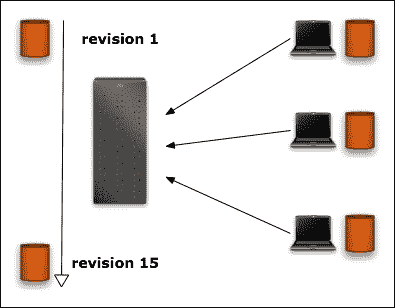
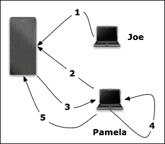
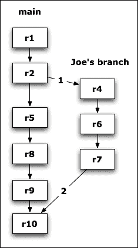
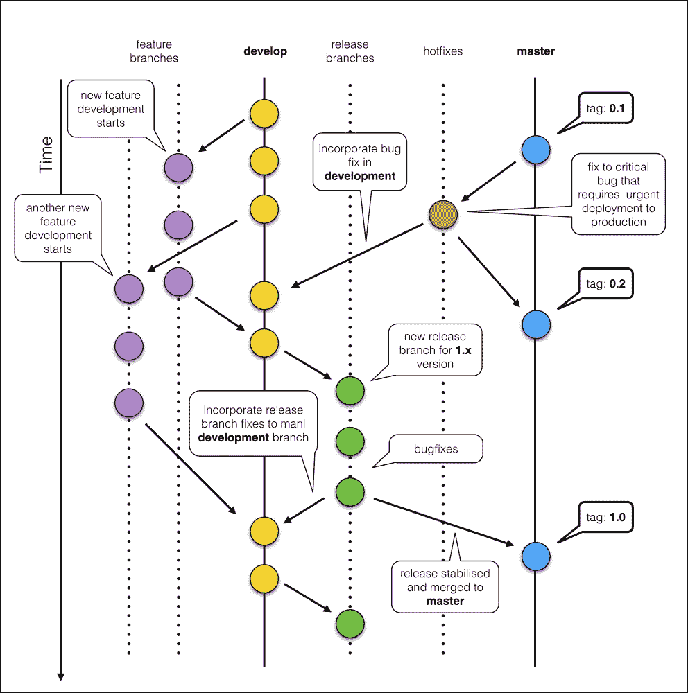
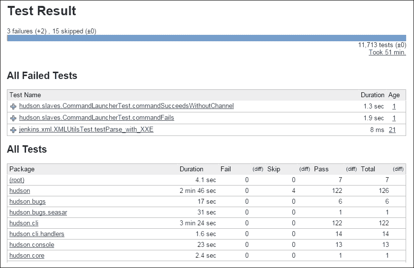
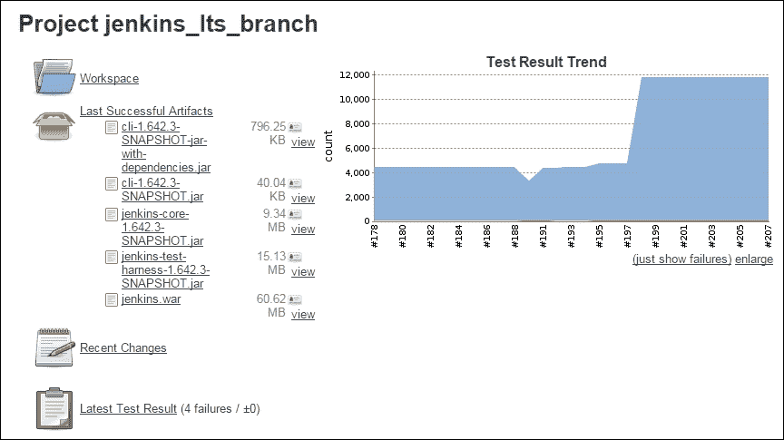
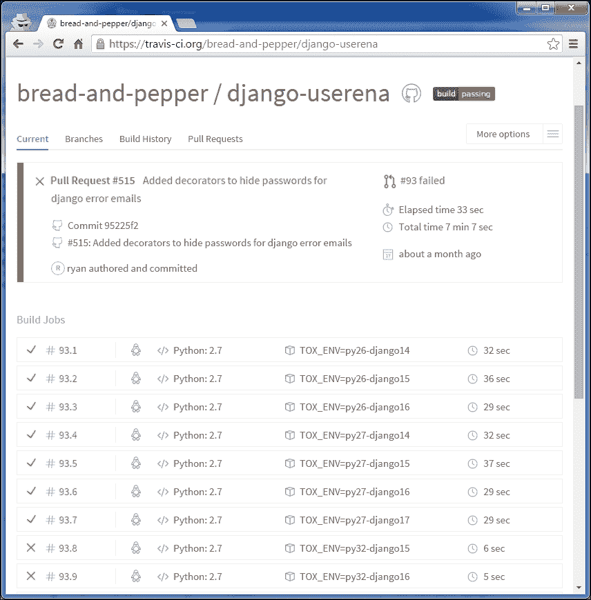

# 八、管理代码

从事一个涉及多人的软件项目是很困难的。一切都变慢了，变得更困难了。发生这种情况有几个原因。本章将揭示这些原因，并试图提供一些与之抗争的方法。

本章分为两部分，说明：

*   如何使用版本控制系统
*   如何建立持续开发过程

首先，代码库的发展如此之快，以至于跟踪所做的所有更改非常重要，尤其是当许多开发人员在使用它时。这就是**版本控制系统**的作用。

接下来，几个没有直接连接在一起的大脑仍然可以在同一个项目上工作。他们有不同的角色，在不同的方面工作。因此，缺乏全球知名度会让人们对正在发生的事情和其他人正在做的事情产生很多困惑。这是不可避免的，必须使用一些工具来提供持续的可视性并缓解问题。这是通过为持续开发过程设置一系列工具来实现的，例如**持续集成**或**持续交付**。

现在我们将详细讨论这两个方面。

# 版本控制系统

**版本控制系统****VCS**提供一种共享、同步和备份任何类型文件的方式。它们分为两类：

*   集中式系统
*   分布式系统

## 集中式系统

集中式版本控制系统基于一台服务器，该服务器保存文件并允许人们签入和签出对这些文件所做的更改。原理很简单，每个人都可以在他/她的系统上获得一份文件副本，并对其进行处理。从那里，每个用户都可以*向服务器提交他/她的更改。它们将被应用，*修订版*编号将被提高。然后，其他用户将能够通过*更新*同步他们的*存储库*副本来获得这些更改。*

存储库在所有提交过程中不断发展，系统将所有修订归档到数据库中，以撤消任何更改或提供有关已完成操作的信息：

图 1

此集中配置中的每个用户都负责将其本地存储库与主存储库同步，以获取其他用户的更改。这意味着，当本地修改的文件被其他人更改并签入时，可能会发生一些冲突。在这种情况下，将在用户系统上执行冲突解决机制，如下图所示：

图 2

这将帮助您更好地理解：

1.  乔登记找零。
2.  Pamela 尝试签入同一文件上的更改。
3.  服务器抱怨她的文件副本已过期。
4.  帕梅拉更新了她的本地副本。版本控制软件可能无法无缝地合并两个版本（即没有冲突）。
5.  Pamela 提交了一个新版本，其中包含 Joe 和她自己所做的最新更改。

对于涉及少数开发人员和少量文件的小型项目，此过程非常适合。但对于更大的项目来说，这就成了问题。例如，一个复杂的更改涉及大量文件，这非常耗时，而且在整个工作完成之前将所有内容保持在本地是不可行的。这种方法的问题是：

*   这是危险的，因为用户可能会保留他/她的计算机更改，而这些更改不一定要备份
*   在签入之前很难与其他人共享，在签入之前共享会使存储库处于不稳定状态，因此其他用户不希望共享

集中式 VCS 通过提供*分支*和*合并*解决了这个问题。可以从修订的主流中分叉，在一条单独的线上工作，然后返回主流。

在*图 3*中，Joe 从修订版 2 开始了一个新分支，以处理一个新特性。每次签入更改时，主流和分支中的修订都会增加。在修订版 7 中，Joe 完成了他的工作，并将其更改提交到主干（主分支）。在大多数情况下，这需要一些冲突解决方案。

但是，尽管中央风险投资公司具有优势，但也存在一些缺陷：

*   分支和合并很难处理。这可能会成为一场噩梦。
*   由于系统是集中式的，因此无法脱机提交更改。当用户重新联机时，这可能会导致对服务器的一次巨大的提交。最后，它在 Linux 这样的项目中效果不太好，在 Linux 中，许多公司永久性地维护自己的软件分支，并且没有每个人都有帐户的中央存储库。

对于后者，一些工具使离线工作成为可能，例如 SVK，但更基本的问题是集中式 VCS 如何工作。

图 3

尽管存在这些缺陷，但由于公司环境的惯性，集中风险投资在许多公司中仍然相当流行。许多组织使用的集中式 VCSE 的主要例子是**Subversion**（**SVN**）和**并发版本系统**（**CVS**）。版本控制系统的集中式架构存在明显的问题，这就是大多数开放源代码社区已经转向更可靠的**分布式 VCS**（**DVCS**架构的原因。

## 分布式系统

分布式 VCS 是解决集中式 VCS 缺陷的答案。它不依赖于人们使用的主服务器，而是基于点对点原则。每个人都可以持有和管理自己的项目独立存储库，并将其与其他存储库同步：

图 4

在*图 4*中，我们可以看到这样一个正在使用的系统示例：

1.  比尔*从哈尔的存储库中取出文件。*
2.  比尔对文件做了一些修改。
3.  阿米娜*从比尔的存储库中取出文件。*
4.  阿米娜也更改了文件。
5.  阿米娜*将*的变化推给哈尔。
6.  肯尼*从哈尔那里取出文件。*
7.  肯尼做出改变。
8.  肯尼经常把他的变化推给哈尔。

关键概念是人们*推送*和*拉取*文件到其他存储库或从其他存储库中取出，这种行为会根据人们的工作方式和项目管理方式而改变。由于不再有主存储库，项目的维护人员需要定义一个策略，让人们*推*和*拉*更改。

此外，当人们使用多个存储库时，他们必须更聪明一些。在大多数分布式版本控制系统中，版本号是每个存储库的本地版本号，并且没有任何人可以参考的全局版本号。因此，必须使用*标签*来让事情更清楚。它们是可以附加到修订的文本标签。最后，用户负责备份他们自己的存储库，而在集中式基础架构中，管理员通常会设置备份策略，而在集中式基础架构中，情况并非如此。

### 分布式策略

当然，如果你在一家公司工作，每个人都朝着同一个目标努力，那么使用 DVCS 仍然需要一个中央服务器。但该服务器的用途与集中式 VCS 完全不同。它只是一个枢纽，允许所有开发人员在一个地方共享他们的更改，而不是在彼此的存储库之间拉拽推送。这样一个单一的中央存储库（通常称为*上游*）也可以作为所有团队成员的各个存储库中跟踪的所有更改的备份。

可以应用不同的方法与 DVCS 中的中央存储库共享代码。最简单的方法是设置一个服务器，其作用类似于一个常规的集中式服务器，在这里，项目的每个成员都可以将其更改推送到一个公共流中。但这种方法有点过于简单。它没有充分利用分布式系统，因为人们使用推拉命令的方式与使用集中式系统的方式相同。

另一种方法是在服务器上提供多个具有不同访问级别的存储库：

*   一个**不稳定的****存储库**是每个人都可以推动改变的地方。
*   **稳定的****存储库**对于除发布管理器之外的所有成员都是只读的。他们可以从不稳定的存储库中提取更改，并决定应该合并什么。
*   各种**版本****存储库**对应于这些版本，并且是只读的，我们将在一章后面看到。

这允许人们在将更改提交到稳定的存储库之前进行贡献，并允许管理者进行审查。无论如何，根据所使用的工具，这可能会造成太多的开销。在许多分布式版本控制系统中，这也可以通过适当的分支策略来处理。

其他策略可以组合，因为 DVCS 提供无限组合。例如，Linux 内核，它使用 Git（[http://git-scm.com/](http://git-scm.com/) ），基于一个星形模型，Linus Torvalds 正在维护官方存储库，并从他信任的一组开发人员那里获取更改。在这个模型中，希望将更改推送到内核的人，希望能够尝试将更改推送到受信任的开发人员那里，以便他们通过更改到达 Linus。

## 集中还是分散？

忘了集中版本控制系统吧。

老实说吧。集中式版本控制系统是过去的遗物。在我们大多数人都有机会远程全职工作的时代，受集中式风投的所有缺陷的约束是不合理的。例如，使用 CVS 或 SVN，您无法在脱机时跟踪更改。这太傻了。当您工作场所的 Internet 连接暂时中断或中央存储库关闭时，您应该怎么做？您是否应该忘记所有的工作流程，只允许更改堆积起来，直到情况发生变化，然后将其作为一大块非结构化更新提交？不

此外，大多数集中式版本控制系统不能有效地处理分支方案。分支是一种非常有用的技术，它允许您在许多人处理多个功能的项目中限制合并冲突的数量。SVN 中的分支是如此荒谬，以至于大多数开发人员不惜一切代价试图避免它。相反，大多数集中式 VCS 提供了一些文件锁定原语，这些原语应该被视为任何版本控制系统的反模式。每个版本控制工具都有一个可悲的事实：如果它包含一个危险的选项，那么团队中的某个人最终会开始每天使用它。锁定是这样一种特性，作为回报，更少的合并冲突将大大降低整个团队的生产率。通过选择一个不允许如此糟糕的工作流的版本控制系统，您正在制造一种情况，这使得您的开发人员更有可能有效地使用它。

## 尽可能使用 Git

Git 是目前最流行的分布式版本控制系统。它是由 Linus Torvalds 创建的，用于在核心开发人员需要辞去以前使用的专有 BitKeeper 职务时维护 Linux 内核的版本。

如果您没有使用任何版本控制系统，那么应该从 Git 开始。如果您已经使用其他一些工具进行版本控制，那么还是学习 Git 吧。即使您的组织在不久的将来不愿意切换到 Git，您也应该这样做，否则您将面临成为活化石的风险。

我并不是说 Git 是最终的、最好的 DVCS 版本控制系统。它肯定有一些缺点。最重要的是，它不是一个易于使用的工具，对于新手来说非常具有挑战性。Git 陡峭的学习曲线已经成为许多在线笑话的来源。可能有一些版本控制系统在很多项目中表现得更好，而开源 Git 竞争者的完整列表将相当长。无论如何，Git 是目前最流行的 DVC，所以*网络效应*确实对它有利。

简单地说，网络效应导致使用流行工具的总体好处大于使用其他工具，即使稍微好一点，这正是因为它的高度流行（这就是 VHS 杀死 Betamax 的原因）。您的组织中的人员以及新员工很可能在某种程度上精通 Git，因此完全集成此 DVCS 的成本将低于尝试不太受欢迎的产品的成本。

无论如何，了解更多的东西和熟悉其他 DVC 不会伤害到你，这仍然是一件好事。Git 最受欢迎的开源竞争对手是 Mercurial、Bazaar 和 Fossil。第一个版本特别简洁，因为它是用 Python 编写的，是 CPython 源代码的官方版本控制系统。有迹象表明它在不久的将来可能会改变，所以当您阅读本书时，CPython 开发人员可能已经在使用 Git 了。但这真的不重要。这两个系统都很棒。如果没有 Git，或者它不那么流行，我肯定会推荐 Mercurial。它的设计有明显的美。它肯定没有 Git 强大，但对于初学者来说更容易掌握。

## Git 流和 GitHub 流

非常流行和标准化的使用 Git 的方法是简单的称为**Git flow**。以下是该流程主要规则的简要说明：

*   有一个主要的工作分支，通常称为`develop`的，在该分支中，应用程序最新版本的所有开发都会进行。
*   新的项目特征在称为*特征分支*的独立分支中实现，这些分支始终从`develop`分支开始。当一个特性的工作完成并且代码被正确测试后，该分支被合并回`develop`。
*   当`develop`中的代码稳定（没有已知的 bug）并且需要新的应用程序发布时，将创建一个新的*发布分支*。这个发布分支通常需要额外的测试（广泛的 QA 测试、集成测试等等），所以新的 bug 肯定会被发现。如果发布分支中包含其他更改（如 bug 修复），则最终需要将它们合并回`develop`分支。
*   当*发布分支*上的代码准备好部署/发布时，它将合并到`master`分支上，并且`master`上的最新提交标记有适当的版本标签。没有其他分支但是`release`分支可以合并到`master`中。唯一的例外是需要立即部署或发布的热修复程序。
*   需要紧急发布的热修复程序总是在从`master`开始的单独分支上实施。修复完成后，它将合并到`develop`和`master`分支。合并热修复分支就像合并普通版本分支一样，因此必须对其进行正确标记，并相应修改应用程序版本标识符。

在*图 5*中展示了*Git flow*的可视示例。对于那些从未以这种方式工作过，也从未使用过分布式版本控制系统的人来说，这可能有点难以承受。无论如何，如果您没有任何正式的工作流，那么在您的组织中确实值得一试。它有多重好处，也能解决实际问题。它对于由多个程序员组成的团队特别有用，这些团队正在处理许多独立的特性，并且需要提供对多个版本的连续支持。

如果您希望使用连续部署过程实现连续交付，那么这种方法也很方便，因为在您的组织中，始终很清楚哪个版本的代码代表应用程序或服务的可交付版本。对于开源项目来说，它也是一个很好的工具，因为它为用户和活跃的贡献者提供了很大的透明度。

图 5 Git 流的可视化演示

所以，如果你认为这篇关于*Git flow*的简短总结有点道理，并且还没有吓到你，那么你应该深入挖掘关于这个主题的在线资源。很难说谁是上述工作流的原始作者，但大多数在线来源指向文森特·德里森。因此，了解*Git flow*的最佳起始资料是他的在线文章*成功的 Git**分支模型*（参考[http://nvie.com/posts/a-successful-git-branching-model/](http://nvie.com/posts/a-successful-git-branching-model/) 。

像其他流行的方法一样，*Git flow*在互联网上受到了很多不喜欢它的程序员的批评。文森特·德里森（Vincent Driessen）的文章中评论最多的是一条规则（严格说来是技术性的），即每次合并都应该创建一个新的表示该合并的人工提交。Git 可以选择进行*快进*合并，Vincent 不鼓励这种选择。当然，这是一个无法解决的问题，因为执行合并的最佳方式对于 Git 所使用的组织来说是完全主观的。无论如何，*Git flow*的真正问题在于它明显地复杂。整套规则很长，所以很容易犯一些错误。很可能你会选择更简单的。

其中一个流在 GitHub 中使用，Scott Chacon 在他的博客中描述了这一点（参见[http://scottchacon.com/2011/08/31/github-flow.html](http://scottchacon.com/2011/08/31/github-flow.html) 。称为**GitHub 流**，与*Git 流*非常相似：

*   主分支中的任何内容都是可部署的
*   新特性在不同的分支上实现

与*Git flow*的主要区别在于简单。只有一个主要的开发分支（`master`），并且始终是稳定的（与*Git flow*中的`develop`分支形成对比）。也没有发布分支，重点放在标记代码上。GitHub 没有这种需求，因为正如他们所说的，当某个东西被合并到主服务器中时，它通常会立即部署到生产环境中。*图 6*显示了示例 b 流程的运行图。

对于希望为其项目设置连续部署过程的团队来说，GitHub 流似乎是一个好的轻量级工作流。当然，这样的工作流对于任何具有强烈发布概念（具有严格的版本号）的项目来说都是不可行的——至少在没有任何修改的情况下是如此。重要的是要知道，*始终可部署*`master`分支的主要假设是，如果没有适当的自动化测试和构建程序，就无法确保它。这就是持续集成系统所关心的，我们将在稍后讨论。下图显示了 GitHub 流的运行示例：

图 6 GitHub 流的可视化演示

请注意，*Git flow*和*GitHub flow*都只是分支策略，因此尽管名称中有*Git*，但它们并不局限于单个 DVCS 解决方案。诚然，描述*Git flow*的官方文章提到了执行合并时应该使用的具体`git`命令参数，但总体思路可以轻松应用于几乎任何其他分布式版本控制系统。事实上，由于建议处理合并的方式，Mercurial 似乎是用于此特定分支策略的更好工具！同样适用于*GitHub 流量*。这是唯一的带有一点特定开发文化的分支策略，因此它可以用于任何版本控制系统，允许您轻松创建和合并代码分支。

最后一句话，请记住没有任何方法是刻在石头上的，也没有人强迫你使用它。创建它们是为了解决一些现有问题，防止您犯常见错误。您可以接受他们的所有规则，也可以根据自己的需要修改其中的一些规则。对于初学者来说，它们是很好的工具，可能很容易陷入常见的陷阱。如果您不熟悉任何版本控制系统，那么您应该先使用*GitHub flow*这样的轻量级方法，而无需任何自定义修改。只有当您有足够的 Git 或您选择的任何其他工具的经验时，才应该开始考虑更复杂的工作流。无论如何，随着你越来越熟练，你最终会意识到没有适合每个项目的完美工作流。在一个组织中运作良好的东西不需要在其他组织中运作良好。

# 持续发展过程

有一些过程可以极大地简化您的开发，并缩短应用程序准备发布或部署到生产环境的时间。他们的名字中经常有`continuous`，我们将在本节讨论最重要和最受欢迎的。重要的是要强调，它们是严格的技术过程，因此它们几乎与项目管理技术无关，尽管它们可以与后者高度吻合。

我们将提到的最重要的过程是：

*   连续积分
*   连续交付
*   连续部署

列出的顺序很重要，因为每一个都是前一个的扩展。连续部署甚至可以简单地看作是连续交付的一种变体。无论如何，我们将分别讨论这些问题，因为对于一个组织来说，只有一个微小的差异，对于其他组织来说，可能是至关重要的。

事实上，这些都是技术过程，这意味着它们的实现严格依赖于适当工具的使用。每个工具背后的总体思路都相当简单，因此您可以构建自己的持续集成/交付/部署工具，但最好的方法是选择已经构建的工具。通过这种方式，您可以更专注于构建产品，而不是持续开发的工具链。

## 持续整合

**持续集成**通常缩写为**CI**，是一个利用自动化测试和版本控制系统提供全自动集成环境的过程。它可以与集中式版本控制系统一起使用，但实际上，只有在使用好的 DVCS 工具来管理代码时，它才会展开翅膀。

建立存储库是实现持续集成的第一步，这是从**极端****编程**（**XP**中产生的一组软件实践。原则在维基百科（[上有明确的描述 http://en.wikipedia.org/wiki/Continuous_integration#The_Practices](http://en.wikipedia.org/wiki/Continuous_integration#The_Practices) 并定义一种方法来确保软件易于构建、测试和交付。

实现持续集成的第一个也是最重要的要求是拥有一个完全自动化的工作流，可以在给定的版本中测试整个应用程序，以确定它在技术上是否正确。技术上正确意味着它没有已知的 bug，并且所有功能都能按预期工作。

CI 背后的总体思想是，在合并到主流开发分支之前，应该始终运行测试。这只能通过开发团队中的正式安排来处理，但实践表明，这不是一种可靠的方法。问题是，作为程序员，我们往往过于自信，无法批判性地看待我们的代码。如果持续集成只建立在团队安排的基础上，那么它将不可避免地失败，因为一些开发人员最终将跳过他们的测试阶段，并将可能出现错误的代码提交给应该始终保持稳定的主流开发分支。而且，在现实中，即使是简单的改变也会带来关键问题。

显而易见的解决方案是利用一个专用的构建服务器，每当代码库发生变化时，该服务器就会自动运行所有必需的应用程序测试。有许多工具可以简化这个过程，它们可以轻松地与版本控制托管服务（如 GitHub 或 Bitbucket）和自托管服务（如 GitLab）集成。使用这些工具的好处是，开发人员可以只在本地运行选定的测试子集（据他所说，这些测试与他当前的工作相关），并为构建服务器留下一整套可能耗时的集成测试。这确实加快了开发速度，但仍然降低了新特性破坏主流代码分支中现有稳定代码的风险。

使用专用构建服务器的另一个好处是，可以在更接近生产环境的环境中运行测试。开发人员还应该使用与生产环境尽可能匹配的环境，并且有很好的工具（例如 Vagrant）；然而，在任何组织中都很难实施这一点。您可以在一个专用的构建服务器上，甚至在一个构建服务器集群上轻松地完成这项工作。许多 CI 工具通过使用各种虚拟化工具来帮助确保测试始终在相同且完全新鲜的测试环境中运行，从而使问题变得更小。

如果您创建的桌面或移动应用程序必须以二进制形式交付给用户，那么拥有构建服务器也是必须的。显然，要做的事情是始终在相同的环境中执行这样的构建过程。几乎每个 CI 系统都考虑到这样一个事实，即在测试/构建完成后，应用程序通常需要以二进制形式下载。这种构建结果通常被称为**构建工件**。

由于 CI 工具起源于大多数应用程序都是用编译语言编写的时代，因此它们大多使用术语“构建”来描述其主要活动。对于 C 语言或 C++语言，这是显而易见的，因为如果没有编译（编译），应用程序就无法运行和测试。对于 Python 来说，这就没什么意义了，因为大多数程序都是以源代码形式分发的，可以在不需要任何额外构建步骤的情况下运行。因此，在我们的语言范围内，*building*和*testing*术语在谈论持续集成时经常互换使用。

### 测试每个提交

持续集成的最佳方法是对推送到中央存储库的每个更改执行整个测试套件。即使一个程序员在一个分支中推送了一系列多个提交，单独测试每个更改通常也是有意义的。如果您决定只测试最新的变更集在一个单一的库推，那么将很难找到可能出现的回归问题的来源在中间的某个地方。

当然，许多 DVC（如 Git 或 Mercurial）允许您通过提供命令*对分*变更历史来限制搜索回归源所花费的时间，但在实践中，作为持续集成过程的一部分，自动执行此操作更为方便。

当然，还有一个问题，即项目运行时间很长，可能需要几十分钟甚至几个小时才能完成测试套件。一台服务器可能不足以在给定的时间范围内对每次提交执行所有构建。这将使等待结果的时间更长。事实上，长时间运行的测试本身就是一个问题，这将在后面的*问题 2–构建时间过长*一节中描述。现在，您应该知道，您应该始终努力测试推送到存储库的每个提交。如果您无法在单个服务器上执行此操作，请设置整个建筑群。如果您使用的是付费服务，那么请为具有更多并行构建的更高定价计划付费。硬件很便宜。开发人员的时间不是很长。最终，与跳过选定更改的测试相比，通过更快的并行构建和更昂贵的 CI 设置，您将节省更多的资金。

### 通过 CI 进行合并测试

现实是复杂的。如果功能分支上的代码通过了所有测试，并不意味着构建在合并到稳定的主流分支时不会失败。*Git 流和*部分中提到的两种流行的分支策略都假设合并到`master`分支的代码总是可以测试和部署的。但是，如果您还没有执行合并，如何确保满足此假设？对于*Git flow*（如果实现良好且使用精确），这是一个较小的问题，因为它强调发布分支。但对于简单的*GitHub 流*来说，这是一个真正的问题，其中合并到`master`通常与冲突有关，并且很可能在测试中引入回归。即使对于*Git 流*，这也是一个严重的问题。这是一个复杂的分支模型，所以人们在使用它时肯定会出错。因此，如果您不采取特殊预防措施，您永远无法确定`master`上的代码在合并后是否会通过测试。

解决此问题的一个方法是将功能分支合并为稳定的主流分支的任务委托给 CI 系统。在许多 CI 工具中，您可以轻松设置按需构建作业，该作业将在本地将特定功能分支合并到稳定分支，并仅在通过所有测试后将其推送到中央存储库。如果构建失败，那么这样的合并将被恢复，保持稳定分支不变。当然，这种方法在快节奏的项目中变得更加复杂，因为在这些项目中，许多功能分支是同时开发的，因为冲突的风险很高，任何 CI 系统都无法自动解决。当然，有解决这个问题的方法，比如在 Git 中重定基址。

如果您正在考虑进一步实施连续交付流程，那么将任何内容合并到版本控制系统的稳定分支中的这种方法实际上是必须的。如果您的工作流中有一条严格的规则，规定稳定分支中的所有内容都是可发布的，那么它也是必需的。

### 矩阵测试

如果您的代码需要在不同的环境中进行测试，那么矩阵测试是一个非常有用的工具。根据您的项目需要，您的 CI 解决方案中对此类功能的直接支持可能会更少或更多。

解释矩阵测试思想的最简单方法是以一些开源 Python 包为例。例如，Django 是一个具有严格指定的一组受支持的 Python 语言版本的项目。1.9.3 版本列出了运行 Django 代码所需的 Python2.7、Python3.4 和 Python3.5 版本。这意味着每次 Django 核心开发人员对项目进行更改时，都必须在这三个 Python 版本上执行完整的测试套件，以支持这一说法。如果在一个环境中，即使一个测试失败，整个构建也必须标记为失败，因为向后兼容性约束可能已被破坏。对于这种简单的情况，您不需要 CI 的任何支持。有一个很棒的 Tox 工具（参考[https://tox.readthedocs.org/](https://tox.readthedocs.org/) ）除其他功能外，它允许您在隔离的虚拟环境中轻松地在不同的 Python 版本中运行测试套件。该实用程序也可以方便地用于本地开发。

但这只是最简单的例子。应用程序必须在多个环境中进行测试，在这些环境中必须测试完全不同的参数，这种情况并不少见。举几个例子：

*   不同的操作系统
*   不同的数据库
*   支持服务的不同版本
*   不同类型的文件系统

全套组合形成一个多维环境参数矩阵，这就是为什么这样的设置称为矩阵测试。当您需要如此深入的测试工作流时，很可能需要在 CI 解决方案中对矩阵测试提供一些集成支持。对于大量可能的组合，您还需要一个高度并行的构建过程，因为矩阵的每次运行都需要构建服务器进行大量的工作。在某些情况下，如果测试矩阵有太多维度，您将被迫进行一些权衡。

## 连续交付

持续交付是持续集成思想的简单扩展。这种软件工程的方法旨在确保应用程序可以在任何时候可靠地发布。持续交付的目标是在短时间内发布软件。它通常通过允许在生产中增量交付对应用程序的更改来降低发布软件的成本和风险。

建立成功的连续交付流程的主要先决条件是：

*   可靠的连续集成过程
*   自动部署到生产环境的过程（如果项目有生产环境的概念）
*   定义良好的版本控制系统工作流或分支策略，允许您轻松定义软件的哪个版本表示可发布代码

在许多项目中，自动化测试不足以可靠地判断给定版本的软件是否真的准备发布。在这种情况下，额外的手动用户验收测试通常由熟练的 QA 人员执行。根据您的项目管理方法，这可能还需要客户的批准。这并不意味着您不能使用*Git flow*、*GitHub flow*或类似的分支策略，如果您的一些验收测试必须由人工执行。这只会将稳定和发布分支的语义从*准备部署*更改为*准备进行用户验收测试和批准*。

此外，上一段并没有改变代码部署应该始终自动化的事实。我们已经在[第 6 章](06.html "Chapter 6. Deploying Code")、*部署代码*中讨论了自动化的一些工具和好处。如前所述，它将始终降低新版本的成本和风险。此外，大多数可用的 CI 工具允许您设置特殊的构建目标，而不是测试，将为您执行自动部署。在大多数连续交付流程中，这通常由授权工作人员手动（按需）触发，前提是他们确定有必要的批准，并且所有验收测试都以成功结束。

## 持续部署

持续部署是将持续交付到下一级的过程。对于所有验收测试都是自动化的且不需要客户手动批准的项目，这是一种完美的方法。简言之，一旦代码合并到稳定分支（通常为`master`，它就会自动部署到生产环境中。

这种方法看起来很好，很健壮，但并不经常使用，因为在发布新版本之前，很难找到一个不需要手动 QA 测试和他人批准的项目。无论如何，这绝对是可行的，一些公司声称正在以这种方式工作。

为了实现连续部署，您需要与连续交付流程相同的基本先决条件。此外，通常需要更谨慎的方法来合并到一个稳定的分支中。在持续集成中并入`master`的内容通常会立即进入生产。因此，将合并任务移交给您的 CI 系统是合理的，如通过 CI 部分的*合并测试所述。*

## 持续集成的流行工具

如今，CI 工具有多种选择。它们在易用性和可用功能上差异很大，几乎每一个都有一些其他人所缺乏的独特功能。因此，很难给出一个好的一般性建议，因为每个项目都有完全不同的需求和不同的开发工作流。当然，也有一些很棒的免费开源项目，但付费托管服务也值得研究。这是因为尽管 Jenkins 或 Buildbot 等开源软件可以免费安装，但认为它们可以免费运行是错误的。硬件和维护都是拥有自己的 CI 系统的额外成本。在某些情况下，支付此类服务的费用可能比支付额外的基础设施和花费时间解决开源 CI 软件中的任何问题要便宜。不过，您需要确保将代码发送到任何第三方服务符合公司的安全策略。

这里我们将回顾一些流行的免费开源工具，以及付费托管服务。我真的不想为任何供应商做广告，所以我们将只讨论那些可以免费获得的开源项目，以证明这种相当主观的选择是合理的。不会给出最佳建议，但我们将指出任何解决方案的优点和缺点。如果您仍有疑问，下一节将介绍常见的持续集成陷阱，这将有助于您做出正确的决策。

### 詹金斯

詹金斯（[https://jenkins-ci.org](https://jenkins-ci.org) ）似乎是最流行的持续集成工具。它也是这个领域中最古老的开源项目之一，与哈德逊（Hudson）合作开发（这两个项目的开发是分开的，Jenkins 是哈德逊的一个分支）。

图 7 Jenkins 主界面预览

Jenkins 是用 Java 编写的，最初主要用于构建用 Java 语言编写的项目。它意味着对于 Java 开发人员来说，它是一个完美的 CI 系统，但如果您想将它与其他技术堆栈一起使用，则需要进行一些斗争。

Jenkins 的一大优势是它提供了非常广泛的功能列表，Jenkins 直接实现了这些功能。从 Python 程序员的角度来看，最重要的一点是理解测试结果的能力。Jenkins 能够以表格和图形的形式显示在运行期间执行的所有测试的结果，而不是只提供关于构建成功的简单二进制信息。当然，这不会自动工作，您需要在构建期间以特定格式提供这些结果（默认情况下，Jenkins 理解 JUnit 文件）。幸运的是，许多 Python 测试框架能够以机器可读的格式导出结果。

以下是 Jenkins 在其 web UI 中单元测试结果的示例演示：

图 8 Jenkins 中单元测试结果的表示

以下屏幕截图说明了 Jenkins 如何显示其他构建信息，如趋势或可下载工件：

图 9 示例 Jenkins 项目的测试结果趋势图

令人惊讶的是，Jenkins 的大部分功能并非来自其内置功能，而是来自一个庞大的免费插件库。对于 Java 开发人员来说，从 clean 安装中获得的东西可能非常好，但是使用不同技术的程序员需要花费大量时间才能使其适合他们的项目。甚至一些插件也提供了对 Git 的支持。

詹金斯很容易扩展，这很好，但也有一些严重的缺点。最终，您将依赖已安装的插件来驱动持续集成过程，这些插件是独立于 Jenkins core 开发的。大多数流行插件的作者都试图让它们保持最新，并与 Jenkins 的最新版本兼容。然而，较小社区的扩展将不太频繁地更新，有朝一日，您可能会被迫退出这些扩展，或者推迟核心系统的更新。当迫切需要更新（例如，安全修复）时，这可能是一个真正的问题，但是对于您的 CI 过程来说至关重要的一些插件将无法与新版本一起工作。

为您提供主 CI 服务器的基本 Jenkins 安装也能够执行构建。这与其他 CI 系统不同，后者更强调分发，并与主构建服务器和从构建服务器严格分离。这既是好的也是坏的。一方面，它允许您在几分钟内设置一个完全工作的 CI 服务器。当然，詹金斯支持推迟建造奴隶的工作，这样将来只要需要，你们就可以扩大规模。另一方面，Jenkins 表现不佳是很常见的，因为它部署在单服务器设置中，其用户抱怨没有为其提供足够的资源。向 Jenkins 集群添加新的建筑节点并不困难。对于那些习惯了单服务器设置的人来说，这似乎是一个心理挑战，而不是一个技术问题。

### 建筑机器人

Buildbot（[http://buildbot.net/](http://buildbot.net/) 是一款用 Python 编写的软件，可以自动执行任何类型的软件项目的编译和测试周期。它的配置方式是，对源代码存储库所做的每项更改都会生成一些构建并启动一些测试，然后提供一些反馈：

图 10 cpython3.x 分支的 Buildbot 瀑布视图

此工具由 CPython core 使用，例如，可在[处看到 http://buildbot.python.org/all/waterfall? &类别=3.x.稳定](http://buildbot.python.org/all/waterfall?&category=3.x.stable)。

构建结果的默认 Buildbot 表示为瀑布视图，如图 10 所示。每列对应一个由**步骤**组成的**构建**，并与一些**构建****从属**关联。整个系统由构建主机驱动：

*   构建主控集中并驱动一切
*   构建是用于构建应用程序并在其上运行测试的一系列步骤
*   **步骤**是原子命令，例如：
    *   签出项目的文件
    *   构建应用程序
    *   运行测试

构建从机是负责运行构建的机器。它可以位于任何地方，只要它可以到达构建主控。由于这种架构，Buildbot 的伸缩性非常好。所有的繁重工作都是在建造奴隶身上完成的，你可以拥有任意数量的奴隶。

非常简单明了的设计使得 Buildbot 非常灵活。每个构建步骤都只是一个命令。Buildbot 是用 Python 编写的，但它完全与语言无关。因此，构建步骤完全可以是任何内容。进程退出代码用于确定步骤是否成功结束，并且默认情况下捕获步骤命令的所有标准输出。大多数测试工具和编译器遵循良好的设计实践，它们使用正确的退出代码指示故障，并在`sdout`或`stderr`输出流上返回可读的错误/警告消息。如果不是这样，通常可以用 Bash 脚本轻松地包装它们。在大多数情况下，这是一项简单的任务。多亏了这一点，很多项目都可以与 Buildbot 集成，只需很少的努力。

Buildbot 的另一个优点是，它支持许多现成的版本控制系统，而无需安装任何其他插件：

*   并行版本系统
*   颠覆
*   性能
*   Bzr
*   达尔奇
*   吉特
*   汞的
*   单调的

Buildbot 的主要缺点是缺乏更高级的表示工具来表示构建结果。例如，其他项目，如 Jenkins，可以采用在构建期间运行单元测试的概念。如果您向他们提供以适当格式（通常是 XML）显示的测试结果数据，他们可以以可读的形式（如表格和图形）显示所有测试。Buildbot 没有这样的内置功能，这是它为其灵活性和简单性所付出的代价。如果您需要一些额外的铃铛和哨子，您需要自己构建它们或搜索一些自定义扩展。另一方面，由于这种简单性，对 Buildbot 的行为进行推理和维护变得更加容易。因此，总有一个权衡。

### 特拉维斯·西

特拉维斯 CI（[https://travis-ci.org/](https://travis-ci.org/) 是以服务形式以软件形式销售的持续集成系统。它是为企业提供的付费服务，但可以完全免费用于 GitHub 上托管的开源项目。

图 11 django userena 项目的 Travis CI 页面在其构建矩阵中显示失败的构建

当然，这是其定价计划中的免费部分，使其非常受欢迎。目前，它是 GitHub 上托管项目最流行的 CI 解决方案之一。但与 Buildbot 或 Jenkins 等较早的项目相比，最大的优势在于如何存储构建配置。所有构建定义都在项目存储库根目录中的单个`.travis.yml`文件中提供。Travis 只与 GitHub 一起工作，因此如果您启用了这种集成，那么您的项目将在每次提交时进行测试，前提是只有一个`.travis.yml`文件。

将项目的整个 CI 配置放在其代码库中确实是一种很好的方法。这使整个过程对开发人员来说更加清晰，并且允许更大的灵活性。在必须提供构建配置以单独构建服务器（使用 web 界面或通过服务器配置）的系统中，当需要向测试设备添加新内容时，总会有一些额外的摩擦。在某些组织中，只有选定的员工才有权维护 CI 系统，这确实会减慢添加新构建步骤的过程。此外，有时需要使用完全不同的过程测试代码的不同分支。当构建配置在项目源中可用时，这样做要容易得多。

Travis 的另一个重要特性是它强调在干净的环境中运行构建。每个构建都是在一个全新的虚拟机中执行的，因此不存在会影响构建结果的持久化状态的风险。Travis 使用一个相当大的虚拟机映像，因此您无需额外安装即可获得大量开源软件和编程环境。在这个隔离的环境中，您拥有完全的管理权限，因此您可以下载并安装执行构建所需的任何内容，`.travis.yml`文件的语法使其非常简单。不幸的是，对于作为测试环境基础的操作系统，您没有很多选择。Travis 不允许提供您自己的虚拟机映像，因此您必须依赖提供的非常有限的选项。通常根本没有选择，所有的构建都必须在 Ubuntu 或 MacOSX 的某个版本中完成（在写这本书时仍处于实验阶段）。有时，可以选择一些遗留版本的系统或新测试环境的预览，但这种可能性总是暂时的。总有办法绕过这个。您可以在 Travis 提供的虚拟机中运行另一个虚拟机。这应该允许您在项目源（如 Vagrant 或 Docker）中轻松编码 VM 配置。但这将为构建增加更多时间，因此这不是您将采取的最佳方法。如果您需要在不同的操作系统下执行测试，那么以这种方式堆叠虚拟机可能不是最佳和最有效的方法。如果这对你来说是一个重要的特性，那么这表明 Travis 不是为你服务的。

Travis 最大的缺点是它完全锁定在 GitHub 上。如果您想在您的开源项目中使用它，那么这并不是什么大问题。对于企业和封闭源代码项目来说，这通常是一个无法解决的问题。

### GitLab CI

GitLab CI 是一个更大的 GitLab 项目的一部分。它既可以作为付费服务（企业版）也可以作为开源项目提供，您可以在自己的基础设施上托管（社区版）。开源版本缺少一些付费服务功能，但在大多数情况下，任何公司都需要管理版本控制存储库和持续集成的软件。

GitLab CI 在功能集上与 Travis 非常相似。它甚至配置了一个非常相似的 YAML 语法存储在`.gitlab-ci.yml`文件中。最大的区别是 GitLab Enterprise Edition 定价模型不为您提供免费的开源项目帐户。Community Edition 本身是开源的，但是您需要有一些自己的基础设施才能运行它。

与 Travis 相比，GitLab 在控制执行环境方面具有明显优势。不幸的是，在环境隔离方面，GitLab 中的默认构建运行程序有点差劲。名为 Gitlab Runner 的进程在运行它的环境中执行所有构建步骤，因此它更像 Jenkins 或 Buildbot 的从属服务器。幸运的是，它与 Docker 配合得很好，因此您可以轻松地使用基于容器的虚拟化添加更多隔离，但这需要一些努力和额外的设置。在 Travis 中，你可以从盒子中完全隔离。

## 选择正确的工具和常见陷阱

如前所述，没有一个完美的 CI 工具能够适合每一个项目，最重要的是，它所使用的每一个组织和工作流程。对于 GitHub 上托管的开源项目，我只能给出一个建议。对于具有独立于平台的代码的小型代码库，似乎最好的选择是**Travis CI**。它很容易开始，只需很少的工作量，就能给你带来几乎即时的满足感。

对于封闭资源的项目，情况完全不同。您可能需要在各种设置中评估一些 CI 系统，直到您能够确定哪一个最适合您为止。我们只讨论了四种流行工具，但它应该是一个相当有代表性的群体。为了使您的决策更容易，我们将讨论一些与持续集成系统相关的常见问题。在一些可用的 CI 系统中，某些类型的错误比其他类型的错误更容易发生。另一方面，有些问题可能对每个应用程序都不重要。我希望通过将您的需求知识与这篇简短的总结相结合，可以更容易地做出正确的第一个决定。

### 问题 1–构建策略过于复杂

一些组织喜欢将事物形式化并组织起来，使其超出合理的层次。在创建计算机软件的公司中，在两个领域尤其如此：项目管理工具和 CI 服务器上的构建策略。

项目管理工具的过度配置通常以 JIRA（或任何其他管理软件）上的问题处理工作流结束，这些工作流非常复杂，当以图形表示时，它们将永远无法容纳一堵墙。如果你的经理有这样的配置/控制狂，你可以和他谈谈，或者把他换成另一个经理（读：退出你当前的工作）。不幸的是，这并不能可靠地确保这方面的任何改进。

但说到 CI，我们可以做得更多。持续集成工具通常由开发人员维护和配置。这些是我们用来改进工作的工具。如果有人有不可抗拒的诱惑，想要尽可能地拨动每一个开关，转动每一个旋钮，那么他应该远离 CI 系统的配置，特别是如果他的主要工作是整天谈话和做决定的话。

确实不需要制定复杂的策略来决定应该测试哪个提交或分支。无需将测试限制在特定标签上。为了执行更大的构建，无需对提交进行排队。无需通过自定义提交消息禁用构建。您的持续集成过程应该简单易懂。测试一切！永远测试！这就是全部！如果没有足够的硬件资源来测试每个提交，那么添加更多的硬件。记住，程序员的时间比硅芯片更昂贵。

### 问题 2–建造时间过长

长时间的构建会降低任何开发人员的性能。如果你需要等上几个小时才能知道你的工作是否做得很好，那么你就不可能有效率。当然，在测试您的功能时，有其他事情要做会有很大帮助。无论如何，作为人类，我们在多任务处理方面真的很糟糕。在不同的问题之间切换需要时间，最终会将编程性能降低到零。在同时处理多个问题时，很难保持注意力集中。

解决方案非常简单：以任何价格快速构建。首先，尝试找出瓶颈并对其进行优化。如果构建服务器的性能是问题所在，那么尝试向外扩展。如果这没有帮助，那么将每个构建拆分为更小的部分并并行化。

有很多解决方案可以加速缓慢的构建测试，但有时对此问题无能为力。例如，如果您有自动化的浏览器测试，或者需要对外部服务执行长时间运行的调用，那么很难将性能提高到超出某些硬限制的程度。例如，当您的 CI 中自动验收测试的速度出现问题时，您可以稍微放松*测试所有内容，始终测试*规则。对程序员来说最重要的通常是单元测试和静态分析。因此，根据您的工作流程，缓慢的浏览器测试有时可能会推迟到发布准备阶段。

另一个减缓构建运行的解决方案是重新思考应用程序的总体架构设计。如果测试应用程序需要很多时间，这通常是一个迹象，表明它应该被划分为几个独立的组件，这些组件可以单独开发和测试。将软件写成巨大的巨石是通向失败的最短路径之一。通常，任何软件工程过程都会破坏未正确模块化的软件。

### 问题 3–外部工作定义

一些持续集成系统，尤其是 Jenkins，允许您完全通过 web UI 设置大多数构建配置和测试过程，而无需接触代码库。但是，除了将构建步骤/命令的简单入口点放入外部系统之外，您应该真正避免将任何东西放入外部系统。这是一种只会带来麻烦的 CI 反模式。

构建和测试过程通常与代码库紧密相连。若您将其整个定义存储在外部系统中，如 Jenkins 或 Buildbot，那个么将很难对该过程进行更改。

作为全局外部构建定义引入的一个问题的示例，让我们假设我们有一些开源项目。最初的开发非常繁忙，我们不关心任何风格指南。我们的项目是成功的，因此开发需要另一个主要版本。一段时间后，我们从`0.x`版本转移到`1.0`版本，并决定重新格式化所有代码，以符合 PEP 8 指南。作为 CI 构建的一部分进行静态分析检查是一种很好的方法，因此我们决定将`pep8`工具的执行添加到构建定义中。如果我们只有一个全局外部构建配置，那么如果需要对旧版本中的代码进行一些改进，就会出现问题。假设在应用程序的两个分支中都有一个关键的安全问题需要解决：`0.x`和`1.y`。我们知道版本 1.0 以下的任何内容都不符合样式指南，新引入的针对 PEP8 的检查将标记构建失败。

问题的解决方案是使构建过程的定义尽可能接近源代码。对于某些 CI 系统（Travis CI 和 GitLab CI），默认情况下可以获得该工作流。对于其他解决方案（Jenkins 和 Buildbot），您需要格外小心，以确保大多数构建过程都包含在代码中，而不是一些外部工具配置中。幸运的是，您有很多选择可以实现这种自动化：

*   Bash 脚本
*   生成文件
*   Python 代码

### 问题 4–缺乏隔离

我们已经多次讨论了用 Python 编程时隔离的重要性。我们知道，在包级别隔离 Python 执行环境的最佳方法是使用带有`virtualenv`或`python -m venv`的虚拟环境。不幸的是，当为了持续集成过程而测试代码时，这通常是不够的。测试环境应该尽可能接近生产环境，如果没有额外的系统级虚拟化，很难实现这一点。

在构建应用程序时，如果不能确保正确的系统级隔离，您可能会遇到以下主要问题：

*   某些状态在文件系统或备份服务（缓存、数据库等）的构建之间保持不变
*   通过环境、文件系统或支持服务相互连接的多个构建或测试
*   由于生成服务器上未捕获到生产操作系统的特定特征而可能出现的问题

如果需要执行同一应用程序的并发构建，甚至需要并行化单个构建，那么前面的问题尤其麻烦。

一些 Python 框架（主要是 Django）为数据库提供了一些额外的隔离级别，以确保在运行测试之前清理存储。`py.test`还有一个非常有用的扩展名`pytest-dbfixtures`（参见[https://github.com/ClearcodeHQ/pytest-dbfixtures](https://github.com/ClearcodeHQ/pytest-dbfixtures) ）这使您能够更可靠地实现这一目标。无论如何，这样的解决方案不仅没有降低构建的复杂性，反而增加了构建的复杂性。每次构建时总是清除虚拟机（以 Travis CI 的风格）似乎是一种更优雅、更简单的方法。

# 总结

在本章中，我们学到了以下几点：

*   集中式和分布式版本控制系统之间有什么区别
*   为什么您更喜欢分布式版本控制系统而不是集中式版本控制系统
*   为什么 Git 应该是 DVCS 的首选
*   Git 的常见工作流和分支策略是什么
*   什么是持续集成/交付/部署？允许您实施这些流程的流行工具是什么

下一章将解释如何清楚地记录代码。