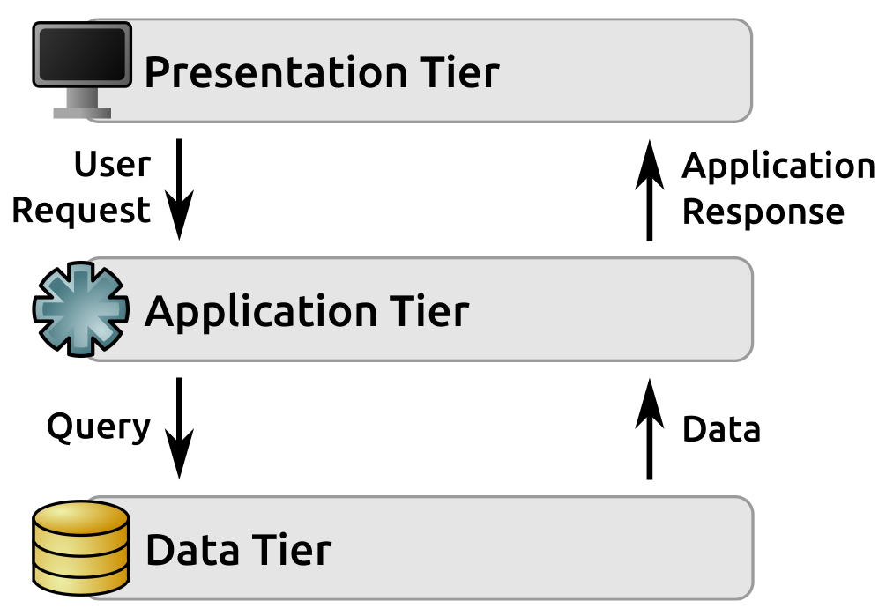
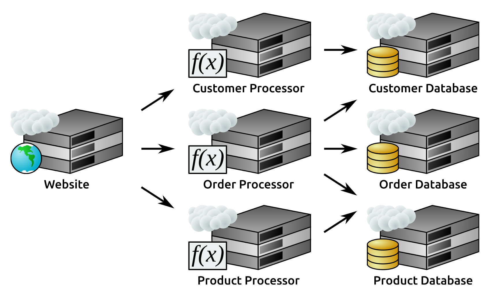
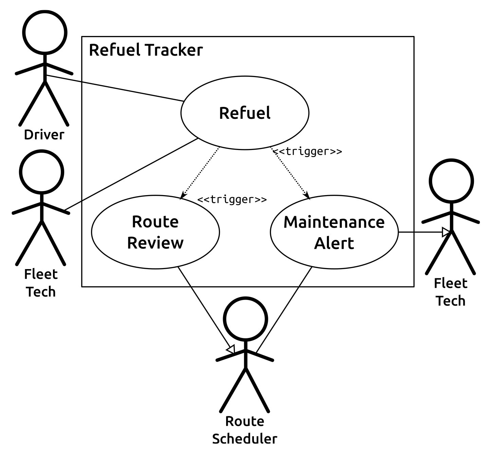
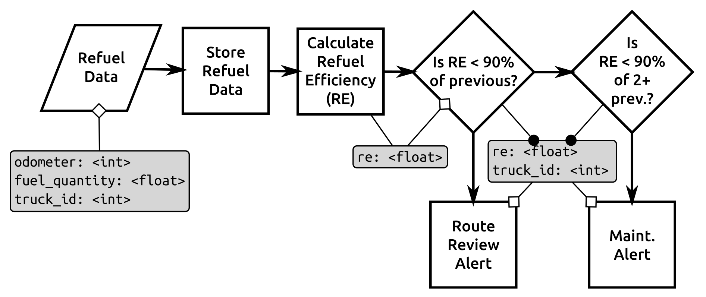

# 三、系统建模

任何**系统建模**过程的目标都是定义和记录系统某个方面的概念模型，通常单独关注该系统的一个（或多个）特定面。系统模型可以用正式的体系结构描述语言来定义，例如**统一建模语言**（**UML**），在这些情况下，系统模型可以得到非常详细的信息，甚至是类所需的最小属性和方法成员。在敏捷方法中的需求分析过程之前，该级别的细节通常是流动的，或者至少没有最终确定，并且将在[第 4 章](https://cdp.packtpub.com/hands_on_software_engineering_with_python/wp-admin/post.php?post=28&action=edit)、*方法、范例和实践*中进行更详细的讨论。

在更高、更小粒度的级别上，仍然有几个系统模型视图对开发过程特别感兴趣，特别是在更大的方面：

*   逻辑和物理体系结构
*   业务流程和规则
*   数据结构和流程
*   进程间通信
*   系统范围/规模

# 逻辑和物理体系结构

逻辑和物理架构（architecture）规范的目标都是分别定义和记录系统的逻辑和物理组件，以明确这些组件元素之间的关系。这两种工作产生的工件可以是文本文档，也可以是图表，两者都有各自的优点和缺点。

文本文档通常生成得更快，但除非有某种可以应用的体系结构文档标准，否则不同的系统团队之间的格式至少可能会有所不同。这种差异会使产生的工件在其产生的团队之外很难理解。如果团队之间的开发人员流动不多，或者新开发人员大量涌入团队，那么这可能不是一个重要的问题。也很难确保所有运动部件或它们之间的连接都得到充分考虑。

图表的主要优点是相对容易理解。如果图表有明显的指示符，或明确表示一个组件是数据库服务，另一个组件是应用程序的符号，那么它们之间的区别一目了然。图表还有一个优势，即非技术受众更容易理解。

在这两种情况下，如果基于文本或基于图表的文档构造良好，并提供系统的准确视图或模型，那么它们显然是最有用的。

# 逻辑架构

开发通常更关注系统的逻辑架构，而不是物理架构。如果系统中的实际代码部署到、存在于、连接到和使用与逻辑组件相关的各种物理组件所需的任何机制已经到位，并且考虑了任何物理架构约束，则通常只需要很少的信息，因此，从这个角度来看，任何给定组件的位置都不那么重要。这通常意味着一个物理架构的崩溃充其量是一个好东西，或者可能是一个最好的东西。这还假设所讨论的结构并不是如此普遍以至于需要记录的东西。例如，野外有任意数量的系统遵循相同的通用三层结构，请求-响应周期如下：

1.  用户通过**表示层**发出请求
2.  该请求被传递到**应用层**
3.  应用程序从**数据层**检索所需的任何数据，可能在此过程中对其进行一些操作或聚合

4.  **应用层**生成响应并将其交回**表示层**
5.  **表示层**将该响应返回给用户

如图所示，该结构可能如下所示：

这种三层体系结构在 web 应用程序中特别常见，其中：

*   **表示层**为 web 服务器（web 浏览器仅为远程输出渲染组件）
*   **应用层**是由 web 服务器调用并生成响应的代码，以任何语言和/或框架编写
*   **数据层**是在请求之间保存应用程序数据的几种后端数据存储变体中的任意一种

例如，考虑前面提到的加油跟踪系统概念的以下逻辑结构。它是这种三层体系结构的一个很好的例子，因为它适用于 web 应用程序，具有一些特定的组件：

# 物理建筑

逻辑体系结构文档和物理体系结构文档之间的主要区别在于，虽然逻辑体系结构关注的是识别系统的功能元素，但物理体系结构需要额外的步骤，指定这些功能元素在哪些实际设备上执行。逻辑体系结构中标识的单个项目可以物理上驻留在公共设备上。实际上，唯一的限制是物理设备的性能和功能。这意味着这些不同的物理架构在逻辑上都是相同的；它们都是实现相同三层 web 应用程序逻辑体系结构的有效方法：

随着当前业界对虚拟化、无服务器和基于云的技术的热情，由公共和私有云技术（如 Amazon Web Services 和 VMware）提供，物理体系结构规范是否真的是物理体系结构常常成为语义上的争论。虽然在某些情况下，可能没有一台单独的、可识别的物理计算机，但在许多情况下，这种区别并不重要。如果它的行为类似于一个不同的物理服务器，那么为了定义一个物理体系结构，可以将其视为一个物理服务器。在这种情况下，从文档的角度来看，将虚拟服务器视为真实服务器不会损失任何知识价值。

当考虑系统中的许多无服务器元素时，一些元素仍然可以表示为物理体系结构元素——只要从与其他元素交互的角度来看，它的行为像一个真实的设备，那么表示就足够了。也就是说，假设一个 web 应用程序完全位于某个公共云中，其中：

*   该云允许定义无服务器功能
*   将定义用于处理以下内容的功能，其中每个实体的后端数据库也位于云中：
    *   客户
    *   产品
    *   命令

相应的物理体系结构可能如下所示：

这种无服务器架构的一个示例现实世界实现可以在所有三种知名公共云中实现：**亚马逊 Web 服务**（**AWS**）、Azure 和**谷歌云平台**（**GCP**）。这些公共云平台中的每一个都提供了虚拟服务器实例，可以为网站和数据库提供服务。此结构中的处理器服务器可以使用无服务器功能（AWS Lambda，或 Azure 和 GCP 中的云功能）在网站向处理器元素中的功能发送事件时驱动网站与数据库之间的交互。

Collectively, logical and physical architecture specifications provide development with at least some of the information needed to be able to interact with non-application tiers. Even if specific credentials will be required but are not supplied in the documentation, knowing, for example, what kind of database drives the data tier of a system defines how that data tier will be accessed.

# 用例（业务流程和规则）

在任何系统中，最重要的是它是否在为所有它应该支持的用例做它应该做的事情。必须为每个用例编写代码，每个用例对应一个或多个业务流程或规则，因此，逻辑上，每个用例都需要定义和记录到适合开发流程的任何程度。与逻辑和物理体系结构一样，可以以文本或某种图表的形式执行这些定义，这些方法具有与前面提到的相同的优点和缺点。

统一建模语言（Unified Modeling Language，UML）为用例提供了一个高级图表标准，主要用于捕获特定类型的用户（UML 术语中的参与者）与预期与之交互的流程之间的关系。这是一个很好的开始，如果过程本身非常简单，已经有了广泛的文档，或者整个开发团队都知道，那么这本身就足够了。到目前为止，*用例*一节前面讨论的加油跟踪器应用程序概念的用例图非常简单，可以追溯到[第 2 章](03.html)、*软件开发生命周期*中为其制定的系统目标。不过，这一次，我们将为它们附加一些名称，以供图表中参考：

*   **加油**：各用户可以记录加油情况，提供当前里程表读数和涉及的燃油量：
    *   送货司机（在当地加油站）
    *   车队维护人员（在总办公室，有公司加油站）
*   **维护提醒**：当卡车计算的燃油效率下降到低于其平均值的 90%时，会提醒车队维护人员，以便安排卡车进行检查。

*   **路线审查警报**：当卡车计算的燃油效率下降到低于其平均值的 90%时，办公室工作人员也会收到警报，以便检查卡车的送货轮。

如果这是首选文档，那么这三个用例很容易绘制。下面列出的流程也是一个可行的选择。在某些方面，它实际上比标准图要好，因为它提供了一些标准用例图无法捕获的系统业务规则：

即使对图表进行了修改，以包含一些缺失的信息（加油是什么，以及围绕两个`«trigger»`项的规则是什么），它仍然只说明了故事的一部分：预期（或允许）谁使用特定的流程功能。这些平衡，即用例下的实际过程，仍然未知，但需要公开，以便可以围绕它们编写代码，使它们真正工作。这也可以作为某种纯文本处理，或者通过图表处理。查看已确定的加油过程，可将其分解为以下内容：

*   **司机**或**车队技术**记录卡车加油，提供：
    *   当前里程表读数
    *   用于加注卡车的燃油量
*   这些值存储（可能在应用程序数据库中，但这可能不是实际需求的一部分）与卡车关联（如何指定尚未确定）。

*   应用程序计算加油的燃油效率：（当前里程表读数减去以前的里程表读数）÷燃油量。
*   如果效率小于或等于该卡车最近效率值的 90%，则触发**路线审查**警报。
*   如果效率小于或等于该卡车前四个效率值的至少一半的 90%，则触发**维护**警报。

图表（如以下流程图）是否会为文档增加任何价值，可能取决于所描述的流程，以及团队甚至个人偏好。作为一个简单的流程图，这五个步骤足够简单，因此，对它们进行文本描述可能不会增加任何价值，但更复杂的流程可能会从图表中受益：

From a developer's perspective, use cases map out to one-to-many functions or methods that will have to be implemented, and if there are process flows documented, those explain how they will execute at runtime.

# 数据结构和流程

在这两者之间，基本用例和业务流程文档可以提供足够的信息，使通过系统的数据结构和流变得明显，或者至少足够透明，使开发不需要任何额外的信息。我们一直在研究的加油过程可能属于这一类，但让我们看看它的数据流图可能是什么样子。

输入的数据（流程图中的**加油数据**已在*用例*部分中定义，并且至少还记录了一些相关数据流，但是有一些名称与这些值关联，并且知道它们是什么类型的值，这将很有帮助：

*   **`odometer`**：当前里程表读数（可能是`<int>`值）

*   **`fuel_quantity`**：用于加注卡车的燃油量（可能是`<float>`值）

*   **`truck_id`**：正在加油的卡车（应用程序数据库中卡车记录的唯一标识符–为了简单起见，我们假设它也是**`<int>`**）

在此过程中，还将创建可能需要传递给**路线审查**警报和/或**维护**警报流程的加油效率值：

*   `re`：计算的加油效率值，a`<float>`值

在这个非常简单的例子中，只需按名称和类型记录数据元素。该图指出了它们从何处开始可用，或者何时显式地传递给流程——否则，假定它们一直可用。然后将数据元素添加到上一个流程图中：

在更复杂的系统中，具有更复杂的数据结构、更多的一般数据结构、更多使用这些结构的进程或这些因素的任意组合的系统中，面向源和目标的流程图可能是一个更好的选择——它不真正关注进程的内部工作，只需要知道需要什么样的数据，以及数据来自何处。

Data-flow documentation/diagrams tell developers what data is expected, where it's originating from, and where/whether it's going to live after the processes are done with it.

# 进程间通信

不同的流程相互通信是很常见的。在最基本的层面上，这种通信可能采取一些简单的形式，比如一个函数或方法从它们共享的代码中的某个地方调用另一个函数或方法。然而，随着进程向外扩展，特别是当它们分布在不同的物理或虚拟设备上时，这些通信链本身往往会变得更加复杂，有时甚至需要专用的通信协议。如果存在需要考虑的进程间依赖关系，即使在相对简单的系统中，也会出现类似的通信过程复杂性。

在几乎任何一种情况下，两个进程之间的通信机制都比调用其他方法的方法更复杂，或者一个方法或进程写入另一个进程下次执行时将拾取并运行的数据，记录这些通信的工作方式是值得的。如果进程间通信的基本单元被认为是一条消息，那么至少记录以下内容将为编写实现这些进程间通信机制的代码提供坚实的起点：

*   **消息包含的内容**：需要的具体数据：
    *   信息中需要什么
    *   可能存在哪些附加/可选数据
*   **消息的格式**：如果消息以某种方式序列化，例如转换为 JSON、YAML 或 XML，则需要注意

*   **消息的传输和接收方式**：可以在数据库上排队，直接通过某种网络协议传输，或者使用专用的消息队列系统，如 RabbitMQ、AWS SQS 或谷歌云平台的发布/订阅

    *   **消息协议**适用何种约束：例如，大多数消息队列系统将保证任何给定的排队消息的传递一次，但不超过一次。

    *   **如何在接收端管理消息**：在一些分布式消息队列系统中——例如，AWS SQS 的某些变体——必须主动从队列中删除消息，以免消息被多次接收，并可能被多次处理。其他消息（如 RabbitMQ）会在检索消息时自动删除消息。在大多数其他情况下，消息只有在到达目的地并被接收时才有效。

进程间通信图通常可以建立在逻辑架构图和用例图的基础上。一个提供作为通信流程端点的逻辑组件，另一个标识哪些流程需要彼此通信。有文档记录的数据流也可能有助于更大的图景，从识别其他地方可能遗漏的任何通信路径的角度来看，这是值得一看的。

加油跟踪器，例如：

*   可以访问现有路由调度应用程序的数据库，该应用程序为路由调度器提供仪表板。

*   维护警报功能可以利用购买的现成车队维护系统的 web 服务调用，该系统具有车队技术人员使用的自己的仪表板。

在这些情况下，路线审查和维护警报流程涉及的相关信息非常简单：

*   路线计划数据库中的更新，可能会将卡车计划的最后一条路线标记为低效路线，或者可能会在仪表板上弹出某种通知，提醒路线计划程序查看路线

*   对维护跟踪系统进行的 JSON over REST API 调用

该消息传递将适用于已显示的用例图的简单变体：

订单处理、履行和发货系统可能使用 RabbitMQ 消息传递来处理订单履行，从产品数据源传递整个订单和简单的库存检查，以确定订单是否可以履行。它还可以使用几个 web 服务 API 调用中的任意一个来管理订单发货，通过类似的 web 服务调用将发货信息推回到订单中。该消息流（为简洁起见省略数据结构）可能如下所示：

The main takeaway from a development focus on Interprocess Communication is how the data identified earlier gets from one point in the system to another.

# 系统范围和规模

如果所有这些项目都有文件记录和/或图表，如果做得彻底和准确，它们将共同提供系统总范围的整体视图：

*   应在逻辑体系结构中确定每个系统组件角色
*   这些组件中的每一个实际驻留的位置都应该在物理体系结构中标识
*   系统应该实现的每个用例（希望每个业务流程）都应该在用例文档中进行标识，任何不明显的底层流程都应该至少有一个大致的快乐路径分解

*   从一个地方或流程移动到另一个地方或流程的每一块数据都应该在数据流中进行标识，并有足够的细节来整理该数据结构的完整图片
*   应该确定控制数据如何移动的格式和协议，至少对于系统的任何部分，这些部分涉及的不仅仅是将系统对象从代码库中的一个函数或方法传递到另一个函数或方法
*   对于这些数据在何处以及如何持久化，应该可以从逻辑架构（可能是物理架构）中辨别出来

唯一没有注意到的重要缺失是系统的规模。如果范围是系统中正在处理或正在移动的对象类型的数量，则比例将是这些对象中存在的数量，无论是在静止状态（例如存储在数据库中）还是在任何给定时间处于活动状态。

根据系统的上下文，很难准确预测规模。用于说明的系统，如假想加油跟踪器和订单处理/履行/装运系统，通常更可预测：

*   **用户数量将是合理可预测的**：所有员工和所有客户几乎都涵盖了这两方面的最大用户群

*   **正在使用的物品数量也将是合理可预测的**：毕竟，配送公司只有这么多卡车，而运行订单系统的公司，尽管可能不太可预测，但仍将对最多有多少订单处于正常水平有一个合理的概念

然而，当系统或应用程序进入用户空间（如 web）时，即使在很短的时间内，也有可能发生根本性的变化。在任何一种情况下，都应围绕预期和最大/最坏情况规模进行某种规划。这一规划可能会产生重大的设计和实施效果——从数百或数千条记录中一次获取和处理十几条记录几乎不需要像数百万或数十亿条记录中的十二条记录那样关注效率，作为一个基本的例子——关于如何编写代码。如果为使用中的潜在大规模激增进行规划涉及到能够扩展到多个服务器或负载平衡请求，那么这也可能会对代码产生影响，尽管可能是在更高的进程间通信级别。

# 总结

本章以及前两章中的所有组件、数据和文档都可能用于任何软件工程工作。实际上有多少可用可能部分取决于预开发过程中涉及到多少规程，即使没有任何正式的关联。这种纪律可能是因为一位才华横溢的项目经理。

在项目、系统或团队的整个生命周期中，数据可用的时间、数量和质量的另一个影响因素通常是开发方法。一些比较常见的方法以显著不同的方式管理这些开发前工作，它们的处理方式可能会产生很大的不同。