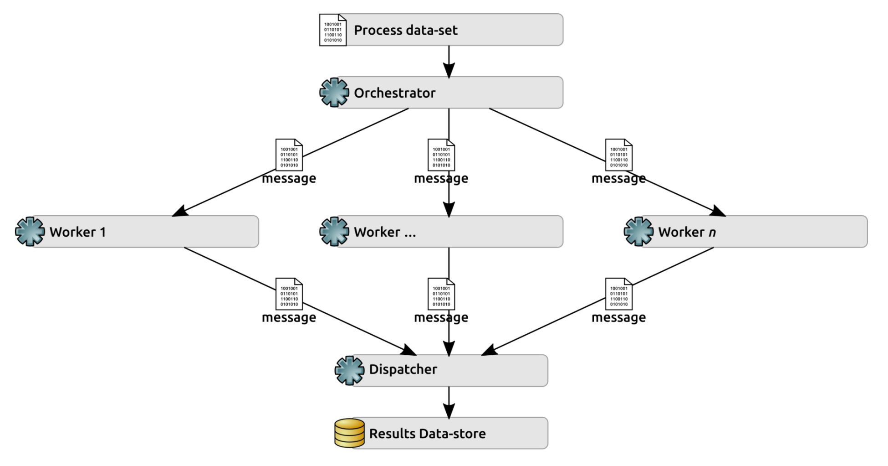
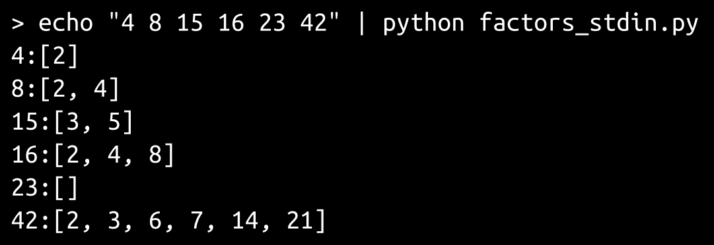

# 十九、Python 中的多进程和 HPC

**高性能计算**（**HPC**），很简单，就是在应用程序执行期间使用并行处理，将计算负载分散到多个处理器上，通常是多台机器上。有几种 MPC 策略可供选择，从利用本地多进程器计算机体系结构的定制应用程序到专用 MPC 系统，如 Hadoop 或 Apache Spark。

在本章中，我们将探索并应用不同的 Python 功能，通过对数据集中的元素一次执行一个基线算法构建一个元素，并查看以下主题：

*   构建利用本地可用的多进程器体系结构的并行处理方法，以及使用 Python 的`multiprocessing`模块的这些方法的局限性
*   定义并实现一种跨多台机器并行基线串行过程的方法，实质上创建一个基本的计算集群
*   探索如何在专用的行业标准 HPC 集群中使用 Python 代码

# 要考虑的共同因素

以并行方式执行的代码在开发时要考虑几个附加因素。首先要考虑的是对程序的输入。如果针对任何数据集的主要操作被包装在函数或方法中，那么数据将被传递给函数。该函数执行它需要执行的任何操作，并且控制权被交还给调用该函数的代码。在并行处理场景中，同一个函数可能被调用任意次数，使用不同的数据，控制权以不同的顺序传回调用代码，而不是以不同的顺序开始执行。随着数据集变得越来越大，或者可以使用更多的处理能力来并行化函数，必须对函数的调用方式以及调用时间（在什么情况下）施加更多的控制，以减少或消除这种可能性。可能还需要控制在任何给定时间处理的数据量，即使只是为了避免使运行代码的机器无法承受。

这种情况的一个例子似乎是正确的。考虑到同一个函数的三个调用，都在几毫秒之内，其中第一个和第三个调用在一秒钟内完成，但是第二次调用无论出于什么原因，都需要十秒。调用函数的顺序如下：

*   呼叫#1
*   呼叫#2
*   呼叫#3

然而，这些人返回的顺序如下：

*   呼叫#1（一秒钟内）
*   呼叫#3（也在一秒钟内）
*   呼叫 2（在*十*秒内）

潜在的问题是，如果预期函数返回的顺序与调用的顺序相同，即使只是隐式返回，并且调用 3 需要依赖于调用 2，那么预期的数据将不存在，调用 3 将失败，可能会以非常混乱的方式。

这个控制输入数据的控件集合，以及作为执行并行化进程的时间、方式和频率的结果，有几个名称，但我们在这里使用术语编排。编排可以采取多种形式，从小型数据集上的简单循环、为数据集中的每个元素启动并行进程，到大规模的、基于有线消息的进程请求和响应机制。

还必须详细考虑一组并行进程的输出。Python 中可用的一些并行化方法不允许将函数调用的结果直接返回给调用代码（至少现在还不允许）。其他人可能会允许它，但只有当活动进程完成并且代码主动附加到该进程时，才允许它，从而阻止对任何其他进程的访问，直到目标进程完成为止。处理输出的一种更常见的策略是创建要并行化的进程，以便它们是触发和忘记调用。调用函数处理数据的实际处理，并将结果发送到某个公共目的地。目的地可以包括多进程感知队列（由多进程模块作为`Queue`类提供）、将数据写入文件、将结果存储到数据库，或将某种异步消息发送到存储结果的某个位置，而不依赖于这些进程的编排或执行。这些过程可能有几个不同的术语，但我们将在这里的探索中使用 dispatch。调度也可能在某种程度上由正在运行的任何编排流程控制，或者可能有自己的独立编排，具体取决于流程的复杂性。

流程本身，以及对其结果的任何分派后使用，也需要给予一些额外的考虑，至少是潜在的考虑。因为最终的目标是让一些独立的进程同时在数据集的多个元素上工作，并且没有确定的方法来预测任何单个进程可能需要多长时间才能完成，两个或多个进程很可能以不同的速率解析和调度它们的数据。即使相关数据元素的预期运行时相同，也可能是这样。因此，对于要处理的任何给定元素序列，无法保证结果将按照针对这些元素的进程启动的相同顺序进行调度。这在分布式处理体系结构中尤其如此，因为实际执行工作的单个计算机可能有其他程序消耗其可用的 CPU 周期、内存或运行进程所需的其他资源。

尽可能保持流程及其结果的独立性，将大大有助于缓解这一特殊问题。独立流程不会与任何其他流程交互或依赖于任何其他流程，从而消除了任何跨流程冲突的可能性，而独立调度则消除了跨结果数据污染的可能性。如果需要具有依赖关系的流程，则仍然可以实现这些流程，但可能需要额外的工作（最有可能是以调度为中心的编排形式），以防止在并行流程的结果可用时发生冲突。

# 一种简单但昂贵的算法

首先，我们需要解决一个问题。为了保持对并行处理的各种机制的关注，这个问题的领域需要容易理解。同时，它需要允许处理任意大的数据集，最好是数据集中每个元素的运行时不可预测，并且结果不可预测。为此，我们要解决的问题是确定某个整数值范围内每个数字的所有因子。也就是说，对于任何给定的正整数值，`x`，我们希望能够计算并返回一个列表，其中包含`x`可被整除的所有整数值。计算并返回单个数字（`factors_of`的因子列表的功能相对简单：

```py
def factors_of(number:(int)) -> (list):
    """
Returns a list of factors of the provided number: 
All integer-values (x) between 2 and number/2 where number % x == 0
"""
    if type(number) != int:
        raise TypeError(
            'factors_of expects a positive integer value, but was passed '
            '"%s" (%s)' % (number, type(number).__name__)
        )
    if number < 1:
        raise ValueError(
            'factors_of expects a positive integer value, but was passed '
            '"%s" (%s)' % (number, type(number).__name__)
        )
    return [
        x for x in range(2, int(number/2) + 1)
        if number % x == 0
    ]
```

尽管这个函数本身只处理单个数字，但一个对任何一组数字反复调用它的进程可以扩展到任意数量的数字进行处理，从而在需要时为我们提供任意大的数据集功能。运行时在某种程度上是可预测的，应该可以对不同范围内的数字进行合理的运行时估计，尽管它们会根据数字的大小而有所不同。如果需要真正不可预测的运行时模拟，我们可以预先生成要处理的数字列表，然后随机选择它们，一次一个。最后，以数字为基础的结果是不可预测的。

# 一些测试设置

捕获一组样本数字的一些运行时信息可能很有用，比如从`10,000,000`到`10,001,000`，捕获总运行时和每个数字的平均时间。一个简单的脚本（`serial_baseline.py`一次（串行）对这些数字中的每一个执行`factors_of`函数，很容易组装：

```py
#!/usr/bin/env python
"""serial_baseline.py

Getting data that we can use to estimate how long a factor_of call will 
take for some sample "large" numbers.
"""

print(
    '# Execution of %s, using all of one CPU\'s capacity' % __file__
)
print('='*80)
print()

import time
from factors import factors_of

# - The number we'll start with
range_start = 10000000
# - The number of calls we'll make to the function
range_length = 1000
# - The number that we'll end with - range *stops* at the number 
#   specified without including it in the value-set
range_end = range_start + range_length + 1
# - Keep track of the time that the process starts
start_time = time.time()
# - Execute the function-call the requisite number of times
for number in range(range_start, range_end):
    factors_of(number)
# - Determine the total length of time the process took to execute
run_time = time.time() - start_time
# - Show the relevant data
print(
    '%d iterations executed in %0.6f seconds' % 
    (range_length, run_time)
)
print(
    'Average time per iteration was %0.6f seconds' %
```

```py
    (run_time/range_length)
)
```

假设计算过程中涉及的任何/所有机器在处理能力方面基本相同，则此脚本的输出给出了一个合理的估计，即针对接近于`10,000,000`值的数字执行`factors_of`计算所需的时间。这段代码最初在一台功能强大的全新笔记本电脑上进行测试，其输出如下：


为了进一步测试，我们还将创建一个恒定的测试编号列表（`TEST_NUMBERS`，选择该列表以提供相当宽的处理时间范围：

```py
TEST_NUMBERS = [
    11,         # Should process very quickly
    16,         # Also quick, and has factors
    101,        # Slower, but still quick
    102,        # Slower, but still quick
    1001,       # Slower still, but still fairly quick
    1000001,    # Visibly longer processing time
    1000000001, # Quite a while
]
```

选择这七个数字是为了提供一个较大和较小的数字范围，从而改变`factors_of`函数调用的各个运行时。由于只有七个数字，因此使用它们的任何测试运行（而不是前面代码中使用的 1000 个数字）执行所需的时间将大大减少，同时还可以在需要时提供对单个运行时的一些了解。

# 局部并行处理

处理的本地并行化的主要焦点将放在`multiprocessing`模块上。还有一些其他模块可能可用于某些并行化工作（这些将在后面讨论），但`multiprocessing`提供了灵活性和功能的最佳组合，并且不会受到 Python 解释器或其他操作系统级干扰的限制。

从模块的名称可以看出，`multiprocessing`提供了一个类（`Process`），该类有助于创建子进程。它还提供了许多其他类，可用于简化子进程的工作，包括`Queue`（一种可用作数据目的地的多进程感知队列实现）和`Value`和`Array`，它们允许单个和多个值（单一类型）分别存储在多个进程共享的内存空间中。

`Process`对象的整个生命周期包括以下步骤：

1.  创建`Process`对象，定义启动时将执行的函数或方法，以及应传递给它的任何参数
2.  启动`Process`，开始执行
3.  加入`Process`，等待流程完成，阻止调用流程的进一步执行，直到流程完成

出于比较目的，创建了一个基于多进程的基线计时测试脚本，相当于`serial_baseline.py`脚本。两个脚本之间的显著差异始于多进程模块的导入：

```py
#!/usr/bin/env python
"""multiprocessing_baseline.py

Getting data that we can use to estimate how long a factor_of call will 
take for some sample "large" numbers.
"""

print(
    '# Execution of %s, using all available CPU capacity (%d)' % 
    (__file__, multiprocessing.cpu_count())
)
print('='*80)

import multiprocessing
import time
```

因为有多个进程正在创建，并且在创建完所有进程后需要对它们进行轮询，所以我们创建了一个`processes`列表，并在创建时附加每个新的`process`。随着流程对象的创建，我们也在指定一个对功能没有影响的`name`，但是如果在测试中需要它，它确实会使显示更加方便：

```py
# - Keep track of the processes
processes = []
# - Create and start all the processes needed
for number in range(range_start, range_end):
    process = multiprocessing.Process(
        name='factors_of-%d' % number,
        target=factors_of,
        args=(number,),
    )
    processes.append(process)
    process.start()
```

只要为每个`process`调用`process.start()`，它就会启动并在后台运行，直到完成。但是，单个进程不会在完成后终止：当调用`process.join()`并且已加入的进程已完成时，就会发生这种情况。由于我们希望所有进程在连接到任何进程之前开始执行（这会阻止循环的继续），因此我们将分别处理所有连接，这也会给每个已启动的进程一段时间来运行，直到它们完成：

```py
# - Iterate over the entire process-set, and use join() to connect 
#   and wait for them
for process in processes:
    process.join()
```

此测试脚本在上一个脚本运行的同一台机器上，并且在后台运行相同的程序，其输出显示原始运行时有一些显著的改进：


这是一个改进，即使没有任何形式的编排驱动它，除了底层操作系统所管理的以外（它只是在调用`factors_of`函数的`Process`实例上抛出相同的 1000 个数字）：总运行时间大约是串行处理所用时间的 55%。

Why only 55%? Why not 25%, or at least close to that? Without some sort of orchestration to control how many processes were being run, this created a 1,000 processes, with all the attendant overhead at the operating system level, and had to give time to each of them in turn, so there was a lot of context shifting going on. A more carefully tuned orchestration process should be able to reduce that runtime more, but might not reduce it by much.

实现有用的多进程解决方案的下一步是能够实际检索子进程操作的结果。为了对实际发生的事情提供一些可见性，我们还将在整个过程中打印几个项目。我们还将随机化测试编号的序列，以便每次运行都将以不同的顺序执行它们，这将（通常）显示流程是如何相互交织的：

```py
#!/usr/bin/env python
"""multiprocessing_tests.py
Also prints several bits of information as it runs, but those 
can be removed once their purpose has been served
"""

import multiprocessing
import random
# - If we want to simulate longer run-times later for some reason, 
#   this will need to be uncommented
# import time

from datetime import datetime
```

我们将使用前面设置的`TEST_NUMBERS`，并将它们随机排列到一个列表中：

```py
# - Use the small, fixed set of numbers to test with:
from factors import TEST_NUMBERS
# - Randomize the sequence of numbers
TEST_NUMBERS.sort(key=lambda i:random.randrange(1,1000000))
```

为了实际捕获结果，我们需要在计算结果时发送结果的地方：`multiprocessing.Queue`的一个实例：

```py
queue = multiprocessing.Queue()
```

如前所述，生成的`queue`对象存在于顶层进程（`multiprocessing_tests.py`脚本）和所有子`Process`对象的进程在执行时共享并可访问的内存中。

由于我们将在计算结果时将结果存储在`queue`对象中，因此我们需要修改`factors_of`函数来处理该结果。我们还将添加一些`print()`调用，以显示何时调用函数以及何时完成其工作：

```py
def factors_of(number:(int)) -> (list):
    """
Returns a list of factors of the provided number: 
All integer-values (x) between 2 and number/2 where number % x == 0
"""
    print(
        '==> [%s] factors_of(%d) called' % 
        (datetime.now().strftime('%H:%M:%S.%f'), number)
    )
```

类型和值检查保持不变：

```py
    if type(number) != int:
        raise TypeError(
            'factors_of expects a positive integer value, but was passed '
            '"%s" (%s)' % (number, type(number).__name__)
        )
    if number < 1:
        raise ValueError(
            'factors_of expects a positive integer value, but was passed '
            '"%s" (%s)' % (number, type(number).__name__)
        )
# - If we want to simulate longer run-times later for some reason, 
#   this will need to be uncommented
#    time.sleep(10)
```

`number`因子的实际计算保持不变，尽管我们将结果分配给变量，而不是返回结果，以便在函数完成时以不同方式处理它们：

```py
    factors = [
            x for x in range(2, int(number/2) + 1)
            if number % x == 0
        ]
    print(
        '<== [%s] factors_of(%d) complete' % 
        (datetime.now().strftime('%H:%M:%S.%f'), number)
    )
```

我们不返回计算值，而是使用`queue.put()`将它们添加到`queue`跟踪的结果中。`queue`对象并不特别关心添加到其中的数据，任何对象都会被接受，但为了一致性起见，为了确保返回的每个结果都具有该数字的数字和因子，我们将`put`a`tuple`与这两个值一起使用：

```py
    queue.put((number, factors))
```

准备好所有这些之后，我们可以开始测试脚本的主体部分：

```py
print(
    '# Execution of %s, using all available CPU capacity (%d)' % 
    (__file__, multiprocessing.cpu_count())
)
print('='*80)
print()
```

我们需要跟踪开始时间，以便稍后计算运行时：

```py
start_time = time.time()
```

创建和启动调用`factors_of`的流程与我们前面使用的基本结构相同：

```py
processes = []
for number in TEST_NUMBERS:
    # - Thread has been created, but not started yet
    process = multiprocessing.Process(
        name='factors_of-%d' % number,
        target=factors_of,
        args=(number,),
    )
    # - Keeping track of the individual threads
    processes.append(process)
    # - Starting the current thread
    process.start()
```

此时，我们有一组已启动但可能不完整的子进程在后台运行。如果创建和启动的前几个是针对较小的数字，则它们可能已经完成，并且正在等待`join()`完成执行并终止。另一方面，如果第一个执行的是较大的*号*中的一个，则第一个子进程可能仍在运行一段时间，而其他运行时间较短的子进程可能在后台空闲，等待`join()`。在任何情况下，我们都可以简单地迭代流程项列表，然后依次`join()`每个流程项，直到它们全部完成：

```py
for process in processes:
    print(
        '*** [%s] Joining %s process' % 
        (datetime.now().strftime('%H:%M:%S.%f'), process.name)
    )
    process.join()
```

一旦所有的`join()`调用完成，`queue`将以任意顺序显示所有号码的所有结果。子进程的繁重工作已经完成，因此我们可以计算最终运行时间并显示相关信息：

```py
# - Determine the total length of time the process took to execute
run_time = time.time() - start_time
# - Show the relevant data
print('='*80)
print(
    '%d factor_of iterations executed in %0.6f seconds' % 
    (len(TEST_NUMBERS), run_time)
)
print(
    'Average time per iteration was %0.6f seconds' % 
    (run_time/len(TEST_NUMBERS))
)
```

实际访问结果（本例中仅用于显示目的）需要调用队列对象的`get`方法，每次`get`调用都会提取并删除一个先前放入队列的项目，现在我们只需打印`queue.get()`直到`queue`为空：

```py
print('='*80)
print('results:')
while not queue.empty():
    print(queue.get())
```

测试运行的结果中有几个值得注意的项目，如以下屏幕截图所示：


以`==>`开头的所有行都显示了在运行过程中调用`factors_of`函数的位置。毫不奇怪，它们都接近这一进程的开始。从 PosiT2 开始的线条显示了进程的连接点，其中一个发生在一个运行 T3 创建事件的中间。以`<==`开头的行显示`factors_of`调用完成的位置，之后它们保持空闲，直到调用相应的`process.join()`。

根据对`factors_of`的调用判断，测试编号的随机顺序为`11, 101, 102`、`1000000001`、`16`、`1000001`和`1001`。完成的调用顺序是 11、`101`、`102`、`16`、`1001`、`1000001`和`100000000`-一个稍有不同的顺序，*连接*序列（因此最终**结果**的顺序也稍有不同）。所有这些都证实了不同的流程是独立于主流程（`for number in TEST_NUMBERS`循环）启动、执行和完成的。

有了`Queue`实例，并建立了一种访问子进程结果的方法，这就是基本的基于本地多进程的并行化所需要的一切。如果有功能需求，可以调整或增强一些功能：

*   如果需要限制活动子进程的数量，或者对它们的创建、启动和加入方式或时间进行更精细的控制，则可以构造某种更结构化的编排器：

    *   允许的进程数量可根据机器上可用 CPU 的数量进行限制，可通过`multiprocessing.cpu_count()`检索。

    *   无论如何确定允许的进程数量，都可以通过多种方式限制活动进程的数量，包括针对未决请求的`Queue`，针对结果的`Queue`，以及针对准备加入的请求的第三种方式。重写每个`Queue`对象的`put`以便它检查其他队列的状态，并触发其他队列中适当的操作/代码，这可以允许单个队列控制整个过程。

*   编排功能本身可以被包装在一个`Process`中，就像在分派子流程数据之后需要处理的任何数据一样。

*   多进程模块还提供其他对象类型，这些对象类型可能对某些多进程场景有用，包括：

    *   `multiprocessing.pool.Pool`类对象提供/控制作业可提交到的工作进程池，支持异步结果、超时和回调等

    *   各种 manager 对象选项，提供了创建可在不同进程之间共享的数据的方法，包括在不同计算机上运行的进程之间通过网络共享

# 线程

Python 还有另一个本地并行化库--`thread`。它提供的`thread`对象的创建和使用方式与`multiprocessing.Process`对象基本相同，但基于线程的进程与父进程在相同的内存空间中运行，而`Process`对象在启动时实际上会创建一个新的 Python 解释器实例（具有与父 Python 解释器的一些连接功能）。

因为线程在相同的解释器和内存空间中运行，所以它们不能像`Process`那样访问多个处理器。

A thread's access to multiple CPUs on a machine is a function of the Python interpreter that's used to run the code. The standard interpreter that ships with Python (Cpython) and the alternative PyPy interpreter both share this limitation. IronPython, an interpreter that runs under/in the .NET framework, and Jython, which runs in a Java runtime environment, do not have that limitation.

基于线程的并行化也更容易与 Python 的**全局解释器锁**（**GIL**冲突。GIL 主动防止多个线程同时执行或更改相同的 Python 字节码。在 GIL 的控制范围之外有一些潜在的长时间运行的进程—I/O、网络、一些图像处理功能和各种库（如 NumPy），但在这些例外情况之外，任何花费大量执行时间解释或操作 Python 字节码的多线程 Python 程序最终都会遇到 GIL 瓶颈，在这个过程中失去并行性。

More information about the GIL, why it exists, what it does, and so on, can be found on the Python wiki at [https://wiki.python.org/moin/GlobalInterpreterLock](https://wiki.python.org/moin/GlobalInterpreterLock).

# 跨多台计算机并行化

另一种常见的并行化策略是将计算过程的工作负载分布在多台机器（物理或虚拟）上。如果本地并行最终受到 CPU 数量或内核数量的限制，或者在一台机器上同时受到这两个因素的限制，那么机器级并行则受到可以抛出问题的机器数量的限制。在这个时代，由于公共云和私有数据中心中有大量的虚拟机可用，因此扩展可用机器的数量以满足问题的计算需求相对容易。

这种水平可扩展解决方案的基本设计要比本地解决方案的设计复杂得多。它必须完成相同的任务，但要分离完成这些任务的能力，以便可以在任意数量的机器上使用，并提供执行流程和在远程任务完成时接受其结果的机制。为了具有合理的容错能力，还需要更清楚地了解远程过程机器的状态，而这些机器又必须在发生会中断其工作能力的事件时主动向中央控制器发送通知。典型的逻辑体系结构在较高级别上如下所示：



哪里：

*   Orchestrator 是在一台机器上运行的进程，负责获取进程数据集的位，并将它们发送给下一个可用的辅助进程。
*   它还跟踪哪些工作节点可用，以及每个工作节点的容量。
*   为了实现这一点，编排器必须能够注册和注销工作节点。
*   编排器可能还应该跟踪其每个工作节点的一般运行状况/可用性，并能够将任务与这些节点关联。如果其中一个节点变得不可用，并且仍然有挂起的任务，则可以将这些任务重新分配给其他可用的工作节点。
*   每个工作节点都是一个在单个计算机上运行的进程，该进程在运行时接受传入消息项中的进程指令，执行生成结果所需的进程，并在完成时向调度器发送结果消息。
*   每个工作节点还必须在可用时向编排器宣布，以便注册，以及在正常关闭时通知编排器，以便编排器可以相应地取消注册。

*   如果由于错误而无法处理传入消息，则工作进程还应该能够将该信息中继回编排器，允许它在可能的情况下将任务重新分配给另一个工作进程。
*   Dispatcher 是一个在一台机器上运行的进程，负责接受结果消息数据，并对其执行任何需要执行的操作—将其存储在数据库中，将其写入文件，等等。可以想象，调度器可以是与编排器相同的机器，甚至是相同的流程，只要与分派相关的消息项得到适当的处理，并且不会使编排流程陷入困境，它所在的位置是首选的。

这种系统的基本结构可以用[第 16 章](16.html)、*Artisan 网关服务*中已经显示的代码来实现：

*   Orchestrator 和 Worker 节点可以实现为守护进程，类似于`ArtisanGatewayDaemon`。如果确定 Dispatcher 需要独立，那么它也可以是类似的守护进程。
*   它们之间的消息传递可以通过`DaemonMessage`对象的变体来处理，提供相同的签名消息安全性，通过 RabbitMQ 消息系统传输。
*   该消息传输过程可以利用已经定义的`RabbitMQSender`类（同样来自[第 16 章](16.html)、*Artisan 网关服务*）。

这种方法的完整实现超出了本书的范围，但是如果读者愿意，可以对其关键方面进行足够详细的检查，以编写一个实现。

# 通用功能

现有的`DaemonMessage`类需要修改或重写，以接受 Orchestrator、Worker 和 Dispatcher 级别的不同操作，从而创建适用于每个级别的新`namedtuple`常量。最初，工作节点只负责接受对其`factors_of`方法的调用，其允许的操作将反映这一点：

```py
WORKER_OPERATIONS = namedtuple(
    'WORKER_OPERATIONS', ['factors_of',]
)
(
    factors_of='factors_of',
)
```

对操作属性的 setter 方法的相应更改可以使用适当的`namedtuple`常量来控制接受的值（例如，对于工作节点的实现，以某种方式将`_OPERATIONS`替换为`WORKER_OPERATIONS`：

```py
    def _set_operation(self, value:str) -> None:
# - Other operations would need to be added 
        if not value in _OPERATIONS:
            raise ValueError(
                '%s.operation expects a string value (one of '
                '"%s"), but was passed "%s" (%s)' % 
                (
                    self.__class__.__name__, 
                    '", "'.join(_OPERATIONS._fields), 
                    value, type(value).__name__
                )
            )
        self._operation = value
```

类似地，所有三个组件都可能需要知道所有可能的`origin`值，以便能够适当地分配消息来源：

```py
MESSAGE_ORIGINS = namedtuple(
    'MESSAGE_ORIGINS', ['orchestrator', 'worker', 'dispatcher']
)
(
    orchestrator='orchestrator',
    worker='worker',
    dispatcher='dispatcher',
)
```

任何单个守护进程的`main`方法与`ArtisanGatewayDaemon`的实现方式基本保持不变。

在这种方法中，每个守护进程类（工作节点、编排器和调度程序）的几个类成员只有几个不同的变体，但由于它们的不同性质，它们值得注意。主要的区别在于每个守护进程类的`_handle_message`方法，每个守护进程类还必须为其映射进程请求的操作实现自己的实例方法。

# 工作节点

在上一节中为假设的工作进程守护进程定义的所有操作都必须在类“`_handle_message`方法中处理，这只不过是`factors_of`方法：

```py
    def _handle_message(self, message:(DaemonMessage,)) -> None:
        self.info(
            '%s._handle_message called:' % self.__class__.__name__
        )
        target = message.data.get('target')
        self.debug('+- target ....... (%s) %s' % (
            type(target).__name__, target)
        )
        self.debug('+- operation .... (%s) %s' % (
            type(message.operation).__name__, message.operation)
        )
        if message.operation == WORKER_OPERATIONS.factors_of:
            self.factors_of(message)
        else:
            raise RuntimeError(
                '%s error: "%s" (%s) is not a recognized '
                'operation' % 
                (
                    self.__class__.__name__, message.operation, 
                    type(message.operation).__name__
                )
            )
```

`factors_of`方法的实现与本章开头定义的原始`factors_of`功能没有实质性区别，只是它必须向调度器的消息队列发送结果消息，而不是返回值：

```py
    def factors_of(self, number):

        # ... code that generates the results

        # - Assuming that the configuration for RabbitMQSender 
        #   is handled elsewhere, we can just get a new instance
        sender = RabbitMQSender()
        outbound_message = DaemonMessage(
            operation=dispatch_results,
            origin=MESSAGE_ORIGINS.worker,
            data={
                'number':number,
                'factors':factors,
            },
            signing_key=self.signing_key
        )
        sender.send_message(outbound_message, self.dispatcher_queue)
```

工作节点守护进程需要在其变得可用和变得不可用时通知编排器，它们可以分别通过其`preflight`和`cleanup`方法进行通知：

```py
def preflight(self):
    """
Sends a message to the orchestrator to indicate that the instance is 
no longer available
"""
        # - Assuming that the configuration for RabbitMQSender 
        #   is handled elsewhere, we can just get a new instance
        sender = RabbitMQSender()
        outbound_message = DaemonMessage(
            operation=ORCHESTRATOR_OPERATIONS.register_worker,
            origin=MESSAGE_ORIGINS.worker,
            data={
                'worker_id':self.worker_id,
                'max_capacity':1,
            },
            signing_key=self.signing_key
        )
        sender.send_message(outbound_message, self.orchestrator_queue)

def cleanup(self):
    """
Sends a message to the orchestrator to indicate that the instance is 
no longer available
"""
        # - Assuming that the configuration for RabbitMQSender 
        #   is handled elsewhere, we can just get a new instance
        sender = RabbitMQSender()
        outbound_message = DaemonMessage(
            operation=DISPATCH_OPERATIONS.unregister_worker,
            origin=MESSAGE_ORIGINS.worker,
            data={
                'worker_id':self.worker_id,
            },
            signing_key=self.signing_key
        )
        sender.send_message(outbound_message, self.orchestrator_queue)
```

他们还必须实现这些方法所使用的`dispatcher_queue`、`worker_id`和`orchestrator_queue`属性，提供工作节点的唯一标识符（可以像随机的`UUID`一样简单）和公共编排器和调度程序队列名称（可能来自所有工作实例共有的配置文件）。

# 编曲

协调器将负责注册、注销和脉冲操作（允许工作人员向协调器发送消息，实质上说“我还活着”）：

```py
ORCHESTRATOR_OPERATIONS = namedtuple(
    'ORCHESTRATOR_OPERATIONS', [
        'register_worker', 'unregister_worker', 'worker_pulse'
    ]
)
(
    register_worker='register_worker',
    unregister_worker='unregister_worker',
    worker_pulse='worker_pulse',
)
```

编排者的`_handle_message`必须将每个操作映射到适当的方法：

```py
    def _handle_message(self, message:(DaemonMessage,)) -> None:
        self.info(
            '%s._handle_message called:' % self.__class__.__name__
        )

        # ...

        if message.operation == ORCHESTRATOR_OPERATIONS.register_worker:
            self.register_worker(message)
        elif message.operation == ORCHESTRATOR_OPERATIONS.unregister_worker:
            self.unregister_worker(message)
        elif message.operation == ORCHESTRATOR_OPERATIONS.worker_pulse:
            self.worker_pulse(message)
        else:
            raise RuntimeError(
                '%s error: "%s" (%s) is not a recognized '
                'operation' % 
                (
                    self.__class__.__name__, message.operation, 
                    type(message.operation).__name__
                )
            )
```

# 调度员

最初，如果 Dispatcher 是一个独立的进程，并且没有折叠到 Orchestrator 中，那么它只关心 Dispatche result 操作：

```py
DISPATCH_OPERATIONS = namedtuple(
    'DISPATCH_OPERATIONS', ['dispatch_results',]
)
(
    dispatch_results='dispatch_results',
)
```

其`_handle_message`方法将据此构建：

```py
    def _handle_message(self, message:(DaemonMessage,)) -> None:
        self.info(
            '%s._handle_message called:' % self.__class__.__name__
        )

        # ...

        if message.operation == DISPATCH_OPERATIONS.dispatch_results:
            self.dispatch_results(message)
        else:
            raise RuntimeError(
                '%s error: "%s" (%s) is not a recognized '
                'operation' % 
                (
                    self.__class__.__name__, message.operation, 
                    type(message.operation).__name__
                )
            )
```

# 将 Python 与大规模集群计算框架集成

大规模集群计算框架为了尽可能提供与自定义编写操作的兼容性，可能只接受两种不同方式的输入：作为命令行参数，或使用标准输入，后者更常见于面向大数据操作的系统。在这两种情况下，允许自定义进程在集群环境中执行并扩展到集群环境所需的是一个自包含的命令行可执行文件，它通常将其数据返回到标准输出。

接受标准输入的最小脚本，无论是通过管道将数据传递到该脚本，还是通过读取文件内容并使用该脚本，都可以实现如下：

```py
#!/usr/bin/env python
"""factors_stdin.py

A command-line-ready script that allows factors_of to be called with 

> {incoming list of numbers} | python factors_stdin.py

which executes factors_of against the provided numbers and prints the 
result FOR EACH NUMBER in the format

number:[factors-of-number]
"""
```

标准输入通过 Python 的`sys`模块`sys.stdin`提供。它是一个类似文件的对象，可以逐行读取和迭代：

```py
from sys import stdin
```

`factors_of`功能可能应该直接包含在脚本代码中，只要整个脚本是完全独立的，并且不需要任何自定义软件安装即可使用。不过，为了使代码更短、更易于浏览，我们将只导入它：

```py
from factors import factors_of
```

如果直接执行脚本-`python factors_stdin.py`-那么我们将实际执行该过程，首先从`stdin`获取所有数字。它们可能以多行的形式出现，每行可能有多个数字，因此第一步是提取所有这些数字，以便我们最终得到一个要处理的数字列表：

```py
if __name__ == '__main__':
    # - Create a list of stdin lines - multi-line input is 
    #   common enough that it needs to be handled
    lines = [line.strip() for line in stdin]
    # - We need the numbers as individual values, though, so 
    #   build a list of them that we'll actually execute against
    numbers = []
    for line in lines:
        numbers += [n for n in line.split(' ') if n]
```

所有的数字都准备好了，我们可以对它们进行迭代，将输入中的字符串值中的每个值转换为实际的`int`，并对其进行处理。如果输入中的某个值无法转换为`int`，我们现在将跳过它，尽管根据调用集群框架的不同，可能有特定的方法来处理或至少将任何错误值记录为错误：

```py
    for number in numbers:
        try:
            number = int(number)
        except Exception as error:
            pass
        else:
            # - We've got the number, so execute the function and 
            #   print the results
            print('%d:%s' % (number, factors_of(number)))
```

该脚本可以通过回显一个数字列表并将其导入`python factors_stdin.py`进行测试。打印结果，每行一个结果，调用程序将其作为标准输出接受，准备传递给接受标准输入的其他进程：



如果源代码在一个文件中（`hugos_numbers.txt`，在章节代码中），则可以同样轻松地使用这些源代码，并生成相同的结果：


如果集群环境希望传递命令行参数，那么也可以编写一个脚本来适应它。它以大致相同的代码开始：

```py
#!/usr/bin/env python
"""factors_cli.py

A command-line-ready script that allows factors_of to be called with 

> python factors_cli.py number [number [number]] ...

which executes factors_of against the provided numbers and 
prints the results for each in the format

number:[factors-of-number]
"""

from factors import factors_of
from sys import argv
```

它偏离的地方在于获取要处理的数字。因为它们是作为命令行值传递的，所以它们将在脚本名称之后成为`argv`列表（Python 的`sys`模块提供的另一项）的一部分。此过程的平衡与基于`stdin`的脚本相同：

```py
if __name__ == '__main__':
    # - Get the numbers from the arguments
    numbers = argv[1:]
    for number in numbers:
        try:
            number = int(number)
        except Exception as error:
            # - Errors should probably be logged in some fashion, 
            #   but the specifics may well vary across different
            #   systems, so for now we'll just pass, skipping anything 
            #   that can't be handled.
            pass
        else:
            # - We've got the number, so execute the function and 
            #   print the results
            print('%d:%s' % (number, factors_of(number)))
```

与前一个脚本一样，输出只需打印到控制台，并将作为标准输入被任何其他进程接受，该进程将被移交给：


# Python、Hadoop 和 Spark

最常见或最流行的大规模集群计算框架可能是 Hadoop。Hadoop 是一个软件集合，它提供跨网络计算机的集群计算能力，以及一种分布式存储机制，可以被认为是一个网络可访问的文件系统。

它提供的实用程序包括 Hadoop 流媒体（[https://hadoop.apache.org/docs/r1.2.1/streaming.html](https://hadoop.apache.org/docs/r1.2.1/streaming.html) ），允许使用任何可执行文件或脚本作为映射器和/或缩减器来创建和执行映射/缩减作业。Hadoop 的操作模型（至少对于可以使用流的进程而言）是以文件为中心的，因此用 Python 编写并在 Hadoop 下执行的进程往往属于我们前面讨论过的基于`stdin`的类别。

apachespark 是大规模集群计算框架领域的另一个选择。Spark 是一个分布式通用框架，具有 Python API（`pyspark`、[http://spark.apache.org/docs/2.2.0/api/python/pyspark.html](http://spark.apache.org/docs/2.2.0/api/python/pyspark.html) ）可与`pip`一起安装，允许更直接地访问其功能。

# 总结

在本章中，我们介绍了 Python 中多进程的所有基本排列（串行和并行、本地和远程/分布式），因为它将应用于自定义 HPC 操作。集成用 Python 编写并由大型集群计算系统（如 Hadoop）执行的流程所需的基本知识是非常基本的简单可执行脚本，与这些系统的集成前景与系统本身一样多种多样。