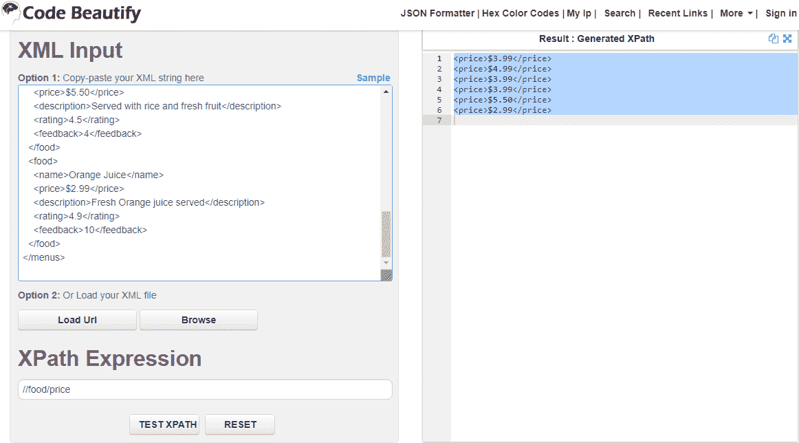
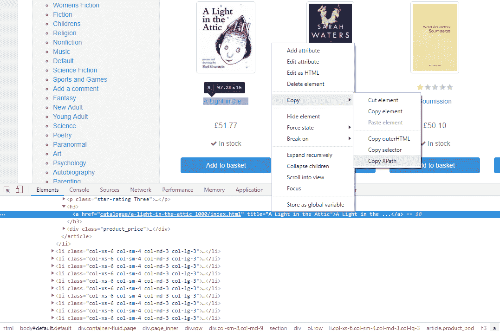
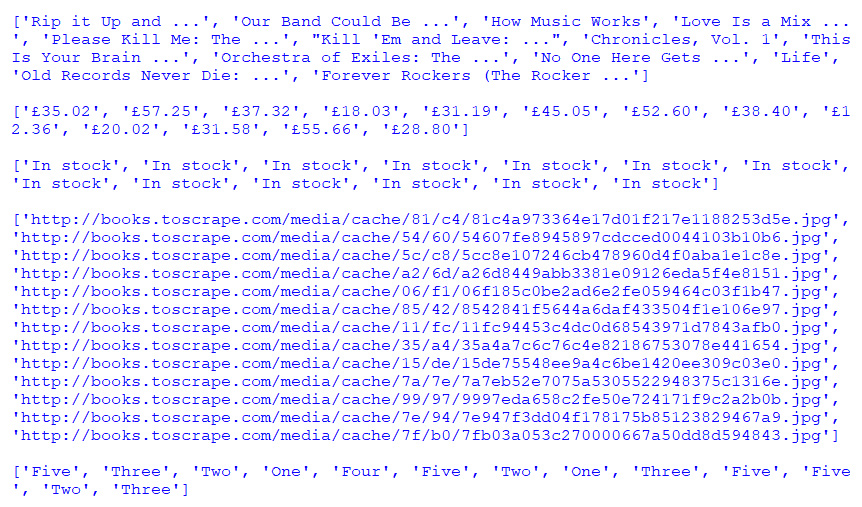
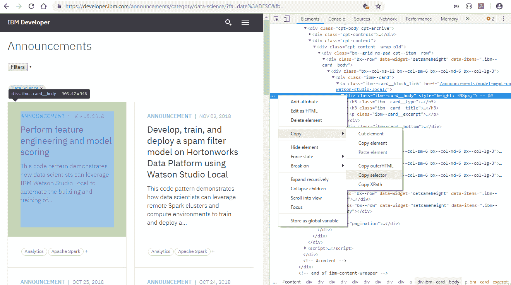

# 三、使用 LXML、XPath 和 CSS 选择器

到目前为止，我们已经了解了 web 开发技术、数据查找技术以及使用 Python 编程语言访问 web 内容。

基于 Web 的内容存在于使用某些预定义文档表达式的部分或元素中。分析这些零件的图案是处理方便爬取的主要任务。元素可以通过 XPath 和 CSS 选择器进行搜索和识别，这些选择器通过所需内容的刮取逻辑进行处理。lxml 将用于处理标记文档中的元素。我们将使用基于浏览器的开发工具进行内容阅读和元素识别。

在本章中，我们将学习以下内容：

*   XPath 和 CSS 选择器简介
*   使用浏览器开发工具
*   使用 Python lxml 库学习和刮取

# 技术要求

需要 web 浏览器（Google Chrome 或 Mozilla Firefox），我们将使用以下 Python 库：

*   lxml
*   请求

如果当前 Python 设置中不存在上述库，有关设置或安装，请参阅上一章中的*设置内容*部分。

代码文件可在 GitHub 上在线获取：[https://github.com/PacktPublishing/Hands-On-Web-Scraping-with-Python/tree/master/Chapter03](https://github.com/PacktPublishing/Hands-On-Web-Scraping-with-Python/tree/master/Chapter03) 。

# XPath 和 CSS 选择器简介

在[第 1 章](01.html)、*网页抓取基础*中的*理解网页开发和技术*一节中，我们介绍了 XML 作为一种文档，它包含可在与网页和文档相关的各种技术之间交换和分发的数据。XML 携带用户定义的标记，也称为节点，以树状结构保存数据。

树型结构（也称为元素树）是大多数标记语言的基础模型，通常被称为**文档对象模型**（**DOM**。借助 DOM 及其定义的约定，我们可以访问、遍历和操作元素。

元素是在一些父元素内部构造的，这些父元素位于它们自己的父元素内部，依此类推；这描述了父子关系，这是标记语言最重要的特性。许多支持 XML 或标记语言的应用程序都支持 DOM，甚至包含可使用的解析器。

对于提取，有必要确定信息的准确位置。信息可以嵌套在树结构中，并且可以具有一些附加属性来表示内容。XPath 和 CSS 选择器都用于在 DOM 中导航并搜索文档中所需的元素或节点。

在以下部分中，我们将介绍 XPath 和 CSS 选择器，并使用它们与支持的 Python 库一起用于 web 抓取。

# XPath

**XML 路径**（**XPath**语言）是基于 XML 的技术（XML、XSLT 和 XQuery）的一部分，这些技术处理通过 DOM 元素导航或使用表达式（也称为 XPath 表达式）定位 XML（或 HTML）文档中的节点。XPath 通常是标识文档中节点的路径。XPath 也是一个**W3C**（简称**万维网联盟**）建议（[https://www.w3.org/TR/xpath/all/](https://www.w3.org/TR/xpath/all/) [。](https://www.w3.org/TR/xpath/all/)

XPath 或 XPath 表达式也被标识为绝对表达式和相对表达式：

*   绝对路径是表示从根元素到所需元素的完整路径的表达式。它以`/html`开头，看起来像`/html/body/div[1]/div/div[1]/div/div[1]/div[2]/div[2]/div/span/b[1]`。单个元素用其位置标识，并用索引号表示。
*   相对路径表示从某些选定元素到所需元素的表达式。相对路径比绝对路径短，可读性好，看起来像`//*[@id="answer"]/div/span/b[@class="text"]`*。*相对路径通常优于绝对路径，因为元素索引、属性、逻辑表达式等可以在单个表达式中组合和表达。

使用 XPath 表达式，我们可以分层浏览元素并到达目标元素。XPath 也由各种编程语言实现，如 JavaScript、java、PHP、Python 和 C++。Web 应用程序和浏览器还内置了对 XPath 的支持。

可以使用许多可用于各种数据类型的内置函数来构建表达式。与普通数学（+、-、*、/）、比较（、=、！=、>=、<=), and combination operators ( 【T0】 , 【T1】 , and 【T2】 ) can also be used to build expression. XPath is also a core block for XML technologies such as XQuery and **可扩展样式表语言转换**（**XSLT**）相关的操作。

**XML Query** (**XQuery**) is a query language that uses XPath expressions to extract data from XML document. 
XSLT is used to render XML in a more readable format.

让我们从`food.xml`文件中的 XML 内容中探索一些 XPath 表达式，如下所示：


XML content

在下面的示例中，我们将使用 C ode Beautify（[中的 XPath Testerhttps://codebeautify.org/Xpath-Tester](https://codebeautify.org/Xpath-Tester) ）。使用前面提供的 XML 源 URL 获取 XML 内容，并将其与代码 Beautify XPath Tester 一起使用。

You can use [https://codebeautify.org/Xpath-Tester](https://codebeautify.org/Xpath-Tester), [https://www.freeformatter.com/xpath-tester.htm](https://www.freeformatter.com/xpath-tester.html), or any other XPath tester tools that are available free on the web.

一切都是 XML 文档中的一个节点，例如，`menus`、`food`和`price`。XML 节点可以是元素本身（元素是具有开始和结束标记的类型或实体）。

前面的 XML 文档也可以作为继承的元素块读取。父节点`menus`包含多个子节点`food`，用于区分子元素的适当值和适当数据类型。XPath 表达式`//food`显示所选节点`food`的结果，如下面的屏幕截图所示。节点选择还检索父节点中的子节点，如以下屏幕截图所示：


Result for XPath //food (using https://codebeautify.org/Xpath-Tester)

以下屏幕截图中的 XPath 表达式选择所有父节点`food`中的子节点`price`。有六个子`food`节点可用，每个节点包含`price`*、*`name`*、*`description`、`feedback`和`rating`：



Result for XPath //food/price (using https://codebeautify.org/Xpath-Tester)

从前面测试的两个 XPath 中可以看出，表达式的创建几乎类似于文件系统（命令行或终端路径），我们在各种操作系统中使用它。XPath 表达式包含代码模式、函数和条件语句，并且支持谓词的使用。

谓词用于标识特定节点或元素。谓词表达式使用类似于 Python 列表或数组表达式的方括号编写。

下表列出了前面 XML 中给出的 XPath 表达式的简要说明：

| **XPath 表达式** | **说明** |
| `//` | 选择文档中的节点，无论它们位于何处 |
| `//*` | 选择文档中的所有元素 |
| `//food` | 选择元素`food` |
| `*` | 选择所有元素 |
| `//food/name &#124; //food/price` | 选择在`food`节点中找到的`name`和`price`元素：

```py
<name>Butter Milk with Vanilla</name>
 <name>Fish and Chips</name>
 <price>$5.50</price>
 <price>$2.99</price>
```

 |
| `//food/name` | 选择`food`中的所有`name`元素：

```py
<name>Butter Milk with Vanilla</name>
 <name>Eggs and Bacon</name>
 <name>Orange Juice</name>
```

 |
| `//food/name/text()` | 仅为所有`food/name`元素选择`text`：

```py
Butter Milk with Vanilla Orange Juice
```

 |
| `//food/name &#124; //rating` | 从文档中找到的`food`和`rating`中选择所有`name`元素：

```py
<name>Butter Milk with Vanilla</name>
 <name>Fish and Chips</name><rating>4.5</rating>
 <rating>4.9</rating>
```

 |
| `//food[1]/name` | 为第一个`food`节点选择`name`元素：

```py
<name>Butter Milk with Vanilla</name>
```

 |
| `//food[feedback<9]` | 选择`food`节点及其谓词条件`feedback<9`为真的所有元素：

```py
<food>
 <name>Butter Milk with Vanilla</name>
 <name>Egg Roll</name>
 <name>Eggs and Bacon</name>
 </food>
```

 |
| `//food[feedback<9]/name` | 选择与条件匹配的`food`节点和`name`元素：

```py
<name>Butter Milk with Vanilla</name>
 <name>Egg Roll</name>
 <name>Eggs and Bacon</name>
```

 |
| `//food[last()]/name` | 从最后一个`food`节点中选择`name`元素：

```py
<name>Orange Juice</name>
```

 |
| `//food[last()]/name/text()` | 为最后一个`food`节点的`name`元素选择`text`：

```py
Orange Juice
```

 |
| `sum(//food/feedback)` | 提供在所有`food`节点中找到的反馈总和：

```py
47.0
```

 |
| `//food[rating>3 and rating<5]/name` | 选择满足谓词条件的`food`的`name`：

```py
<name>Egg Roll</name>
<name>Eggs and Bacon</name>
<name>Orange Juice</name>
```

 |
| `//food/name[contains(.,"Juice")]` | 选择`food`中包含`Juice`字符串的`name`：

```py
<name>Orange Juice</name>
```

 |
| `//food/description[starts-with(.,"Fresh")]/text()` | 选择以`Fresh`开头的节点描述：

```py
Fresh egg rolls filled with ground chicken, ... cabbage
Fresh Orange juice served
```

 |
| `//food/description[starts-with(.,"Fresh")]` | 从以`Fresh`开头的`description`节点中选择`text`：

```py
<description>Fresh egg rolls filled with.. cabbage</description>
 <description>Fresh Orange juice served</description>
```

 |
| `//food[position()<3]` | 根据位置选择第一种和第二种食物：

```py
<food>
 <name>Butter Milk with Vanilla</name>
 <price>$3.99</price>
 ...
 <rating>5.0</rating>
 <feedback>10</feedback>
 </food>
```

 |

XPath predicates can contain a numeric index that starts from `1` (not `0`) and conditional statements, for example, `//food[1]` or `//food[last()]/price`.

现在我们已经用各种 XPath 表达式测试了前面的 XML，让我们考虑一个具有一些属性的简单 XML。属性是标识给定节点或元素的某些参数的额外属性。单个元素可以包含唯一的属性集。XML 节点或 HTML 元素中的属性有助于用其包含的值标识唯一元素。正如我们在下面 XML 中的代码中所看到的，属性被发现为一对`key=value`信息，例如`id="1491946008"`：

```py
<?xml version="1.0" encoding="UTF-8"?>
<books>
     <book id="1491946008" price='47.49'>
        <author>Luciano Ramalho</author>
         <title>
            Fluent Python: Clear, Concise, and Effective Programming
        </title>
     </book>
     <book id="1491939362" price='29.83'>
         <author>Allen B. Downey</author>
         <title>
 Think Python: How to Think Like a Computer Scientist
        </title>
     </book>
</books>
```

XPath 表达式通过在键名前面添加`@`字符来接受`key`属性。下表中列出了一些使用属性的 XPath 示例，并给出了简要说明。

| **XPath****e****表达式** | **说明** |
| `//book/@price` | 为`book`选择`price`属性：

```py
price="47.49"
price="29.83"
```

 |
| `//book` | 选择`book`字段及其元素：

```py
<book id="1491946008" price="47.49">

<author>Luciano Ramalho</author>
 <title>Fluent Python: Clear, Concise, and Effective Programming
 Think Python: How to Think Like a Computer Scientist
 </title></book>
```

 |
| `//book[@price>30]` | 选择`book`中`price`属性大于`30`的所有元素：

```py
<book id="1491946008" price="47.49">
 <author>Luciano Ramalho</author>
 <title>Fluent Python: Clear, Concise, and Effective Programming </title> </book>
```

 |
| `//book[@price<30]/title` | 从`price`属性小于`30`的书籍中选择`title`：

```py
<title>Think Python: How to Think Like a Computer Scientist</title>
```

 |
| `//book/@id` | 选择`id`属性及其值。`//@id`表达式也会产生相同的输出：

```py
id="1491946008"
 id="1491939362"
```

 |
| `//book[@id=1491939362]/author` | 从`book`中选择`author`，其中`id=1491939362`：

```py
<author>Allen B. Downey</author>
```

 |

我们试图探索和学习一些关于 XPath 的基本特性，并编写表达式来检索所需的内容。在*使用 lxml 刮取-Python 库*一节中，我们将使用 Python 编程库进一步探索使用 XPath 部署代码来刮取提供的文档（XML 或 HTML），并学习使用浏览器工具生成或创建 XPath 表达式。有关 XPath 的更多信息，请参阅*进一步阅读*部分中的链接。

# CSS 选择器

在[第 1 章](01.html)、*网页抓取基础*中，在*了解网页开发和技术*一节中，我们学习了 CSS 及其对 HTML 元素样式的使用，并学习了使用全局属性。CSS 通常用于设置 HTML 的样式，有多种方法可以将 CSS 应用于 HTML。

CSS 选择器（也称为 CSS 查询或 CSS 选择器查询）是 CSS 使用元素名称或全局属性（`ID`和`Class`来选择 HTML 元素的定义模式。CSS 选择器，顾名思义，以各种方式选择或提供选择 HTML 元素的选项。

在下面的示例代码中，我们可以可视化在`<body>`中找到的一些元素：

*   `<h1>`是一个元素和选择器。
*   `<p>`元素或选择器具有具有`header`样式类型的`class`属性。在选择时，`<p>`我们可以使用元素名、属性名，也可以只使用类型名。
*   在`<div>`中找到多个`<a>`，但它们的`class`属性`id`和`href`属性的值不同：

```py
<html>
<head>
    <title>CSS Selectors: Testing</title>
    <style>
        h1{color:black;}
        .header,.links{color: blue;}
        .plan{color: black;}
        #link{color: blue;}
    </style>
</head>
<body>
    <h1>Main Title</h1>
    <p class=”header”>Page Header</p>
    <div class="links">
         <a class="plan" href="*.pdf">Document Places</a>
         <a id="link" href="mailto:xyz@domain.com">Email Link1!</a>
         <a href="mailto:abc@domain.com">Email Link2!</a>    
    </div>
</body>
</html>
```

我们在前面代码中识别的可区分模式可用于单独或成组选择这些特定元素。许多 DOM 解析器可以在线使用，它们提供了与 CSS 查询相关的功能。如以下截图所示，其中一个是[https://try.jsoup.org/](https://try.jsoup.org/) ：


Evaluating CSS query from https://try.jsoup.org/ The DOM parser converts provided XML or HTML into a DOM object or tree type of structure, which facilitates accessing and manipulating element or tree nodes. For more detail information on the DOM, please visit [https://dom.spec.whatwg.org/](https://dom.spec.whatwg.org/).

在 CSS 查询中，下列代码文本中列出的各种符号表示某些特征，可以在 CSS 查询中使用：

*   全局`id`属性和`class`分别由`#`和`.`表示，如本查询所示：
    *   `a#link`：`<a id="link" href="mailto:xyz@domain.com">Email Link1!</a>`
    *   `a.plan`：`<a class="plan" href="*.pdf">Document Places</a>`
*   还使用了组合符（表示元素之间的关系），如`+`、`>`、`~`和空格字符，如查询中所示：
    *   `h1 + p`：`<p class=”header”>Page Header</p>`
    *   `div.links a.plan`：`<a class="plan" href="*.pdf">Document Places</a>`
*   操作员，如 s`^`、`*`、`$`用于定位和选择，如本查询所示：
    *   `a[href$="pdf"]`：`<a class="plan" href="*.pdf">Document Places</a>`
    *   `a[href^="mailto"]`：`<a id="link" href="mailto:xyz@domain.com">Email Link1!</a><a href="mailto:abc@domain.com">Email Link2!</a>`

这些符号将在下面的部分中并排使用和解释，参考前面的 HTML 代码和各种类型的选择器。

# 元素选择器

元素选择器是从 HTML 中选择元素的基本选择器。通常，这些元素是 HTML 的基本标记。下表列出了此类别的一些选择器及其用法：

| **CSS 查询** | **说明** |
| `h1` | 选择`<h1>`元素 |
| `a` | 选择所有的`<a>`元素 |
| `*` | 选择 HTML 代码中的所有元素 |
| `body *` | 选择`<body>`中的所有`<h1>`、`<p>`、`<div>`和`<a>`元素 |
| `div a` | 选择`<div>`内的所有`<a>`（中间使用空格字符） |
| `h1 + p` | 选择`<h1>`之后的立即`<p>`元素 |
| `h1 ~ p` | 选择前面有`<h1>`的每个`<p>`元素 |
| `h1,p` | 选择所有`<h1>`和`<p>`元素 |
| `div > a` | 选择作为`<div>`直接子元素的所有`<a>`元素 |

# ID 和类选择器

ID 和类选择器是元素选择器提供的附加功能。我们可以找到带有`class`和`id`属性的 HTML 标记。这些属性也称为全局属性。这些属性通常优于其他属性，因为它们定义了结构和标识的标记。

有关全局属性的详细信息，请参见[第 1 章](01.html)、*爬取基础*、*全局属性*部分。下表列出了此类选择器的用法：

| **CSS 查询** | **说明** |
| `.header` | 选择带有`class=header`的元素 |
| `.plan` | 用`class=plan`选择`<a>` |
| `div.links` | 用`class=plan`选择`<div>` |
| `#link` | 选择带有`id=link`的元素 |
| `a#link` | 使用`id=link`选择`<a>`元素 |
| `a.plan` | 使用`class=plan`选择`<a>`元素 |

# 属性选择器

属性选择器用于定义具有可用属性的选择器。HTML 标记包含一个属性，该属性有助于用该属性及其携带的值标识特定元素。

下表列出了显示属性选择器用法的几种方法：

| **CSS 查询** | **说明** |
| `a[href*="domain"]` | 选择其`href`中包含`domain`子字符串的`<a>`元素：

```py
<a id="link" href="mailto:xyz@domain.com">Email Link1!</a> 
<a href="mailto:abc@domain.com">Email Link2!</a>
```

 |
| `a[href^="mailto"]` | 选择以`href`属性的`mailto`子字符串开头的`<a>`元素：

```py
<a id="link" href="mailto:xyz@domain.com">Email Link1!</a> 
<a href="mailto:abc@domain.com">Email Link2!</a>
```

 |
| `a[href$="pdf"]` | 选择在其`href`属性末尾具有`pdf`子字符串的`<a>`元素：

```py
<a class="plan" href="*.pdf"> Document Places </a>
```

 |
| `[href~=do]` | 选择具有`href`属性的所有元素，并在值中匹配`do`。下列两个`<a>`元素的`href`值均包含`do`：

```py
<a id="link" href="mailto:xyz@domain.com">Email Link1!</a> 
<a href="mailto:abc@domain.com">Email Link2!</a>
```

 |
| `[class]` | 选择所有元素或具有`class`属性的`<p>`、`<div>`和`<a>`：

```py
<p class='header'>Page Header</p>
<div class="links">
<a class="plan" href="*.pdf"> Document Places </a>
```

 |
| `[class=plan]` | 用`class=plan`选择`<a>`：

```py
<a class="plan" href="*.pdf"> Document Places </a>
```

 |

# 伪选择器

当根据元素的位置来识别或选择元素时，伪选择器是一组方便的选择。

下表列出了这些类型选择器的一些使用方法，并给出了简要说明：

| **CSS 查询** | **说明** |
| `a:gt(0)` | 选择所有`<a>`元素，但在`0`位置索引的元素除外：

```py
    <a id="link" href="mailto:xyz@domain.com">Email Link1!</a>
        <a href="mailto:abc@domain.com">Email Link2!</a>     
```

 |
| `a:eq(2)` | 选择索引在`2`的`<a>`元素：

```py
    <a href="mailto:abc@domain.com">    
```

 |
| `a:first-child` | 选择作为其父元素的第一个子元素的每个`<a>`元素：

```py
    <a class="plan" href="*.pdf">Document Places</a>    
```

 |
| `a:last-child` | 选择父元素最后一个子元素的每个`<a>`元素：

```py
    <a href="mailto:abc@domain.com">Email Link2!</a>    
```

 |
| `a:last-of-type` | 选择其父元素的最后一个元素`<a>`：

```py
    <a href="mailto:abc@domain.com">Email Link2!</a>    
```

 |
| `:not(p)` | 选择除`<p>`之外的所有元素。 |
| `a:nth-child(1)` | 从其父级的第一个子级中选择每个`<a>`：

```py
    <a class="plan" href="*.pdf">Document Places</a>    
```

 |
| `a:nth-last-child(3)` | 从其父级的最后一个子级中每隔三分之一选择一次`<a>`：

```py
    <a class="plan" href="*.pdf">Document Places</a>    
```

 |
| `a:nth-of-type(3)` | 选择其父元素的每三个`<a>`元素：

```py
    <a href="mailto:abc@domain.com">Email Link2!</a>    
```

 |
| `a:nth-last-of-type(3)` | 选择其父元素的第三个位置处的每个`<a>`元素：

```py
    <a class="plan" href="*.pdf">Document Places</a>    
```

 |

CSS 选择器被用作选择元素的 XPath 表达式的方便替代品，因为与绝对 XPath 相比，CSS 选择器的长度更短，并且在易于阅读和管理的表达式中使用简单的模式。CSS 选择器可以转换为 XPath 表达式，但反之亦然。

还有许多在线工具，允许将 CSS 选择器查询转换为 XPath 表达式；其中之一是[https://css-selector-to-xpath.appspot.com/](https://css-selector-to-xpath.appspot.com/) ，如以下截图所示；我们不应该总是相信可用的工具，在代码中应用这些工具之前，应该测试结果：


CSS selector to XPath converter

如前一个屏幕截图所述，CSS 选择器用于从数据提取角度选择元素，可以在`Scraper`代码中使用，甚至可以在从样式化角度将样式应用于所选元素时使用。

在本节中，我们了解了 XPath 和 CSS 选择器最流行的与 web 相关的模式查找技术。在下一节中，我们将探索基于浏览器的开发工具（DevTools），并学习如何使用 DevTools 中的功能。DevTools 可用于搜索、分析、识别和选择元素，并获取 XPath 表达式和 CSS 选择器。

# 使用 web 浏览器开发人员工具访问 web 内容

在[第 1 章](01.html)、*网络抓取基础*中，在*数据查找技术*（从网络中查找数据）部分和*开发工具（DevTools）中，我们引入了基于浏览器的 DevTools 来定位内容并探索找到的各种面板。DevTools 提供了各种功能面板，为我们提供了管理相关资源的支持工具。*

在这一节中，我们的动机将是确定包含我们正在寻找的内容的特定元素。这种基于标识的信息，例如 XPath 表达式、CSS 查询，甚至是基于 DOM 的导航流，在编码`Scraper`时都是有益的。

我们将使用谷歌浏览器浏览网页。Chrome 有一个内置的开发工具，具有很多特性（可用于元素识别、选择、DOM 导航等）。在以下部分中，我们将探索并使用这些功能。

# HTML 元素和 DOM 导航

我们将使用[http://books.toscrape.com/](http://books.toscrape.com/) 来自[http://toscrape.com/](http://toscrape.com/) 。`toscrape`为初学者和开发人员提供与网页抓取相关的资源，供他们学习和实现`Scraper`。

让我们打开[http://books.toscrape.com](http://books.toscrape.com) 使用网络浏览器 Google Chrome 的 URL，如下所示：


Inspect view of books.toscrape.com

当页面内容加载成功后，我们可以通过右键点击页面并按下选项 Inspect 或按下*Ctrl*+*Shift*+*I*来加载 DevTools。如果通过 Chrome 菜单访问，请单击“更多工具”和“开发人员工具”。浏览器的外观应类似于前面屏幕截图中的内容。

正如您在前面的屏幕截图中所看到的，在检查模式下，将加载以下内容：

*   面板元素默认位于左侧。
*   基于 CSS 样式的内容位于右侧。
*   我们注意到左下角的 DOM 导航或元素路径，例如，`html.no-js body .... div.page_inner div.row`。

我们在*开发者工具*部分的[第 1 章](01.html)、*爬取基础*中介绍了此类面板的基本概述。随着开发工具的加载，我们可以找到一个指针图标，首先，从左边列出；这用于从页面中选择元素，如下面的屏幕截图所示；可使用*Ctrl*+*Shift*+*C*打开/关闭该元件选择器（检查员）：


Element selector (inspector) on inspect bar

打开元素选择器后，我们可以在加载的页面上移动鼠标。基本上，我们正在使用鼠标搜索指向的确切 HTML 元素：


Using element selector on the book image

如前一个屏幕截图所示，该元素已被选中，当我们将鼠标移到第一张可用的图书图片上时，此操作将产生以下结果：

*   `div.image_container`元素在页面本身中显示和选择。
*   在 elements 面板 source 中，我们可以找到特定的 HTML 代码，`<div class="image_container">`也被突出显示。也可以使用右键单击+页面来源或*Ctrl*+*U*并搜索特定内容来查找此信息（书籍图片所在位置）。

对于我们希望删除的 HTML 内容的各个部分，可以重复相同的操作，如以下示例所示：

*   在`div.product_price`元素中可以找到列出的书籍的价格。
*   在`p.star-rating`中可以找到星级。
*   书名在`*<*h3>`中，在`div.product_price`之前或`p.star-rating`之后。
*   书籍详情链接在`<a>`中找到，该链接存在于`<h3>`中。
*   从下面的屏幕截图可以清楚地看到，前面列出的元素都在`article.product_prod`中。此外，在以下屏幕截图的底部，我们可以将 DOM 路径标识为`article.product_prod`：


Element selection under inspect mode

如前面的屏幕截图所示，DOM 导航在处理 XPath 表达式时非常有用，如果元素检查器显示的路径或元素确实存在（在获取的页面源中），则可以使用页面源验证内容。

DOM elements, navigation paths, and elements found using the elements inspector or selectors should be cross-verified for their existence in page sources or inside resources that are found in Network panels, to be sure.

# 使用 DevTools 的 XPath 和 CSS 选择器

在本节中，我们将收集所需元素的 XPath 表达式和 CSS 查询。与我们在上一节中探索页面检查器和元素面板的方式类似，让我们继续执行以下步骤，以获取所选元素的 XPath 表达式和 CSS 查询：

1.  选择元素选择器并获取元素代码
2.  在获取的元素代码上单击鼠标右键
3.  从菜单中选择复制选项
4.  从子菜单选项中，选择为所选元素的 XPath 表达式复制 XPath
5.  或者为 CSS 选择器（查询）选择复制选择器

如下面的屏幕截图所示，我们选择单个书籍项目的各个部分，并访问菜单选项，获得相应的 CSS 选择器或 XPath 表达式：



Copying XPath and CSS selector using page inspect

以下是使用 DevTools 收集的一些 XPath 和 CSS 选择器，这些选择器用于产品（如书名和价格）中提供的项目。

使用 DevTools 的**XPath 选择器**：

*   书名：`//*[@id="default"]/div/div/div/div/section/div[2]/ol/li[1]/article/h3/a`
*   价格：`//*[@id="default"]/div/div/div/div/section/div[2]/ol/li[1]/article/div[2]`
*   图片：`//*[@id="default"]/div/div/div/div/section/div[2]/ol/li[1]/article/div[1]`
*   股票信息：`//*[@id="default"]/div/div/div/div/section/div[2]/ol/li[1]/article/div[2]/p[2]`
*   星级：`//*[@id="default"]/div/div/div/div/section/div[2]/ol/li[1]/article/p`

使用 DevTools 的**CSS 查询选择器**：

*   书名： `#default > div > div > div > div > section > div:nth-child(2) > ol > li:nth-child(1) > article > h3 > a`
*   价格：`#default > div > div > div > div > section > div:nth-child(2) > ol > li:nth-child(1) > article > div.product_price`
*   图片：`#default > div > div > div > div > section > div:nth-child(2) > ol > li:nth-child(1) > article > div.image_container`
*   股票信息：`#default > div > div > div > div > section > div:nth-child(2) > ol > li:nth-child(1) > article > div.product_price > p.instock.availability`
*   星级：`#default > div > div > div > div > section > div:nth-child(2) > ol > li:nth-child(1) > article > p.star-rating`

类似地，还将根据需要收集其他基本 XPath 或 CSS 选择器。在收集和验证或清理（缩短）这些表达式和查询之后，使用 Python 编程应用刮取逻辑来自动化数据收集。

同样，按照上一节中讨论的步骤进行操作没有特殊的出路。XPath 或 CSS 选择器也可以确定或形成，以显示 HTML 源或页面源；还有许多基于浏览器的扩展支持类似的任务。对于我们讨论过的处理 XPath 和 CSS 选择器的任何解决方法，开发人员都可以选择。

One of the recently listed b rowser-based extensions to generate XPath and CSS selectors for Google Chrome is C hroPath ([https://autonomiq.io/chropath/](https://autonomiq.io/chropath/)[)](https://autonomiq.io/chropath/) . Writing customized expressions and queries is advised for self-practice and knowledge. Extensions and other similar applications should be used while processing a large information source.

在本节中，我们检查并探索了用于元素标识和 DOM 导航的元素面板：修改、删除元素、修改脚本等等。“图元”面板中也存在相关选项。在下一节中，我们将使用 Python 库`lxml`对`Scraper`进行编码，并使用 XPath 和 CSS 选择器从所选网站收集数据。

# 使用 lxml（一个 Python 库）进行抓取

lxml 是一个 XML 工具包，有一个用于处理 XML 和 HTML 的丰富库。与 Python 中其他基于 XML 的库相比，lxml 更受欢迎，因为它具有高速和有效的内存管理。它还包含处理小型或大型 XML 文件的各种其他功能。Python 程序员使用 lxml 处理 XML 和 HTML 文档。有关 lxml 及其库支持的更多详细信息，请访问[https://lxml.de/.](https://lxml.de/)

lxml 提供了对 XPath 和 XSLT 的本机支持，并构建在强大的 C 库上：`libxml2`和`libxslt`。它的库集通常与 XML 或 HTML 一起使用，以访问来自 ElementTree（[的 XPath、解析、验证、序列化、转换和扩展功能 http://effbot.org/zone/element-index.htm#documentation](http://effbot.org/zone/element-index.htm#documentation) ）。从 lxml 解析、遍历 ElementTree、XPath 和类似 CSS 选择器的特性使得它对于诸如 webscrapingg 这样的任务来说足够方便。在 Python Beautiful Soup（[中，lxml 还用作解析器引擎 https://www.crummy.com/software/BeautifulSoup/bs4/doc/](https://www.crummy.com/software/BeautifulSoup/bs4/doc/) 和熊猫[https://pandas.pydata.org/](https://pandas.pydata.org/) 。

Elements of a markup language such as XML and HTML have start and close tags; tags can also have attributes and contain other elements. ElementTree is a wrapper that loads XML files as trees of elements. The Python built-in library, ElementTree (etree), is used to search, parse elements, and build a document tree. Element objects also exhibit various accessible properties related to Python lists and dictionaries.

XSLT is a language to transform an XML document into HTML, XHML, text, and so on. XSLT uses XPath to navigate in XML documents. XSLT is a template type of structure that is used to transform XML document into new documents.

lxml 库包含以下重要模块：

*   `lxml.etree`（[https://lxml.de/api/lxml.etree-module.html](https://lxml.de/api/lxml.etree-module.html) ：解析并实现 ElementTree；支持 XPath、迭代等
*   `lxml.html`（[https://lxml.de/api/lxml.html-module.html](https://lxml.de/api/lxml.html-module.html) ：解析 HTML，支持 XPath、CSSSelect、HTML 表单和表单提交
*   `lxml.cssselect`（[https://lxml.de/api/lxml.cssselect-module.html](https://lxml.de/api/lxml.cssselect-module.html) ：将 CSS 选择器转换为 XPath 表达式；接受 CSS 选择器或 CSS 查询作为表达式

# lxml 示例

lxml 有一个很大的模块集，在本节中，我们将学习在进入抓取任务之前通过示例使用 lxml 的大部分功能。这些例子是针对开采活动而不是开发的。

# 示例 1–从文件中读取 XML 并遍历其元素

在本例中，我们将从`food.xml`文件中读取可用的 XML 内容。我们将使用 XML 内容：

```py
from lxml import etree
xml = open("food.xml","rb").read() #open and read XML file
```

从前面代码获得的 XML 响应需要使用 g`lxml.etree.XML()`进行解析和遍历。在本例中，`XML()`f 操作解析 XML 文档并返回`menus`根节点。请参考[https://lxml.de/api/lxml.etree-module.html](https://lxml.de/api/lxml.etree-module.html) 有关`lxml.etree`的更多详细信息：

```py
tree = etree.XML(xml) 
    #tree = etree.fromstring(xml)
        #tree = etree.parse(xml)

```

前面代码中的函数`fromstring()`和`parse()`也向`lxml.etree`使用的默认或选择的解析器提供内容。

A number of parsers are provided by lxml (XMLParser and HTMLParser) and the default one used in code can be found using `>>> etree.get_default_parser()`. In the preceding case, it results in `<lxml.etree.XMLParser>`.

让我们验证解析后收到的`tree`：

```py
print(tree)  
print(type(tree))   

<Element menus at 0x3aa1548>
<class 'lxml.etree._Element'>
```

前面两条语句确认`tree`是`lxml.etree._Element`类型的 XML 根元素。对于遍历树中的所有元素，可以使用树迭代，这将导致元素按找到的顺序排列。

使用`iter()`功能*执行树迭代。*可以使用元素属性`tag`访问元素的标记名；类似地，元素的文本可以通过`text`属性访问，如下所示：

```py
for element in tree.iter():
    print("%s - %s" % (element.tag, element.text))
```

前面的树迭代将产生以下输出：

```py
menus - 
food - 

name - Butter Milk with Vanilla
price - $3.99
description - Rich tangy buttermilk with vanilla essence
rating - 5.0
feedback - 6
.............
food - 

name - Orange Juice
price - $2.99
description - Fresh Orange juice served
rating - 4.9
feedback - 10
```

我们也可以将子元素作为参数传递给树迭代器（`price`和`name`），以获得所选的基于元素的响应。将子元素传递给`tree.iter()`*后，我们可以分别使用`element.tag`和`element.text`获得`Tag`和`Text`或`Content`子元素，如下代码所示：*

```py
#iter through selected elements found in Tree
for element in tree.iter('price','name'):
 print("%s - %s" % (element.tag, element.text))

name - Butter Milk with Vanilla
price - $3.99
name - Fish and Chips
price - $4.99
...........
name - Eggs and Bacon
price - $5.50
name - Orange Juice
price - $2.99
```

还需要注意的是，`food.xml`文件已在`rb`模式下打开，而不是在`r`模式下打开。在处理基于本地文件的内容和具有编码声明的文件时，例如`<?xml version="1.0" encoding="UTF-8"?>`*、*可能会遇到错误`ValueError: Unicode strings with encoding declaration are not supported. Please use bytes input or XML fragments without declaration`***。***对内容进行编码/解码可能会解决上述问题，这也是基于文件模式的。

为了处理上述情况或从文件、HTTP URL 或 FTP 读取内容，`parse()`是一种非常有效的方法。除非指定，否则它使用默认解析器；一个作为额外参数提供给它。下面的代码演示了如何使用`parse()`函数，该函数将对元素名称进行迭代以获取其文本：

```py
from lxml import etree

#read and parse the file
tree = etree.parse("food.xml")

#iterate through 'name' and print text content
for element in tree.iter('name'):
    print(element.text)
```

前面的代码产生以下输出：`Butter Milk with Vanilla`、`Fish and Chips`等，这些输出是从`name`元素和`food.xml`文件中获取的：

```py
Butter Milk with Vanilla
Fish and Chips
Egg Roll
Pineapple Cake
Eggs and Bacon
Orange Juice
```

还可以迭代多个树元素，如下所示：

```py
    for     element     in     tree.iter(    'name'    ,    'rating'    ,    'feedback'    ):
        print    (    "{} - {}"    .format(element.tag, element.text))

name - Butter Milk with Vanilla
rating - 5.0
feedback - 6
name - Fish and Chips
rating - 5.0
...........
feedback - 4
name - Orange Juice
rating - 4.9
feedback - 10

```

# 示例 2–使用 lxml.HTML 读取 HTML 文档

在本例中，我们将使用`lxml.html`模块遍历[中的元素 http://httpbin.org/forms/post](http://httpbin.org/forms/post) ：

```py
from lxml import html
from urllib.request import urlopen

root = html.parse(urlopen('http://httpbin.org/forms/post')).getroot()
    tree = html.parse(urlopen('http://httpbin.org/forms/post'))

        print(type(root)) #<class 'lxml.html.HtmlElement'>
        print(type(tree)) #<class 'lxml.etree._ElementTree'>    
```

我们正在使用`lxml.html`中的`parse()`加载给定的 URL 内容。`parse()`的行为与`lxml.etree`类似，但在本例中，获取的`root`为 HTML 类型。`getroot()`方法返回文档根。可以比较`root`和`tree`的对象类型，如前代码所示。对于这个例子，我们对`root`或 HTMLElement 感兴趣。解析为`root`的内容如下图所示：


Page source: http://httpbin.org/forms/post

HTMLElement`root`具有多种属性，如下所示：

```py
print(dir(root)) 

[...'addnext', 'addprevious', 'append', 'attrib', 'base', 'base_url', 'body', 'clear', 'cssselect', 'drop_tag', 'drop_tree', 'extend', 'find', 'find_class', 'find_rel_links', 'findall', 'findtext', 'forms', 'get', 'get_element_by_id', 'getchildren', 'getiterator', 'getnext', 'getparent', 'getprevious', 'getroottree', 'head', 'index', 'insert', 'items', 'iter', 'iterancestors', 'iterchildren', 'iterdescendants', 'iterfind', 'iterlinks', 'itersiblings', 'itertext', 'keys', 'label', 'make_links_absolute', 'makeelement', 'nsmap', 'prefix', 'remove', 'replace', 'resolve_base_href', 'rewrite_links', 'set', 'sourceline', 'tag', 'tail', 'text', 'text_content', 'values', 'xpath']
```

让我们从`root`中找到`<p>`；`find()`可用于通过路径定位第一个元素。可使用`text_content()`功能检索文本。`findtext()`功能也可用于类似情况，如下所示：

```py
p = root.find('.//p') #find first <p> from root

print(p.text_content())  *# Customer name:*
print(root.findtext('.//p/label')) *#Customer name:* 
```

我们可以在下面的代码*中看到，*`findall()`用于查找并迭代`root`中的所有元素：

```py
elemP = root.findall('.//p') #find all <p> element from root
for p in elemP         :
    print(p.text_content())
```

前面的代码列出了查找所有`p`标记的文本，如下所示：

```py
Customer name: 
Telephone: 
E-mail address: 
 Small 
 Medium 
 Large 
 Bacon 
 Extra Cheese 
 Onion 
 Mushroom 
Preferred delivery time: 
Delivery instructions: 
Submit order
```

HTMLElement`root`还支持 XPath 和 CSSSelect：

```py
print(root.xpath('//p/label/input/@value'))
    print(root.xpath('//legend/text()'))     
```

这将产生如下输出：

```py
['small','medium','large','bacon','cheese','onion','mushroom']
['Pizza Size', 'Pizza Toppings'] 
```

C SSSelect 将 CSS 选择器转换为 XPath 表达式，并与相关对象一起使用：

```py
#print text_content() for label inside <p>
for e in root.cssselect('p label'):
    print(e.text_content())

Customer name: 
Telephone: 
E-mail address: 
 Small 
 ......
 Mushroom 
Preferred delivery time: 
Delivery instructions:

#print text_content for element <p> inside <form>
for e in root.cssselect('form > p'):
    print(e.text_content())

Customer name: 
Telephone: 
E-mail address: 
Preferred delivery time: 
Delivery instructions: 
Submit order
```

下面的代码演示了 HTML`<form>`元素的属性和属性。我们首先针对`<form>`元素，在`root`中找到，即`<form method="post" action="/post">`：

```py
print(root.forms[0].action)  #http://httpbin.org/post
print(root.forms[0].keys())  #['method', 'action']
print(root.forms[0].items()) #[('method', 'post'), ('action', '/post')]
print(root.forms[0].method) # POST
```

从前面的代码中可以看出，输出显示为内嵌注释：

*   `action`返回`key`属性`action`的 URL 值。获得的 URL 实际上是一个链接，用于处理提交的信息或选择的选项。
*   `items()`返回包含元素键和值的元组列表。
*   `keys()`返回元素键列表。
*   `method`返回属性方法的值，即 HTTP 请求或 HTTP 方法。有关 HTTP 方法的更多信息，请参阅[第 1 章](01.html)、*网页抓取基础*、*了解网页开发和技术*部分。

# 示例 3–读取和解析 HTML 以检索 HTML 表单类型元素属性

在本例中，我们将从[读取 HTMLhttp://httpbin.org/forms/post](http://httpbin.org/forms/post) URL，包含基于 HTML 的表单元素。表单元素具有各种预定义属性，例如类型、值和名称，并且可以与手动属性一起存在。在前面的示例中，我们尝试实现各种函数 XPath 和 CSSSelect 来从所需元素检索内容。

在这里，我们将尝试收集 HTML 表单元素中的属性及其值：

```py
from lxml import html
import requests
response = requests.get('http://httpbin.org/forms/post')

# build the DOM Tree
tree = html.fromstring(response.text)

for element in tree.iter('input'):
     print("Element: %s \n\tvalues(): %s \n\tattrib: %s \n\titems(): %s \n\tkeys(): %s"%
     (element.tag, element.values(),element.attrib,element.items(),element.keys()))
     print("\n")
```

在前面的代码中，为给定的 URL 获取了`response.text`和`str`类型的对象。`fromstring()`f 函数解析提供的字符串对象并返回根节点或 HTMLElement`tree`类型。

在本例中，我们迭代了`input`元素或`<input...>`，希望识别每个输入所拥有的属性。

前面的代码产生如下所示的输出：

```py
Element: input
     values(): ['custname']
     attrib: {'name': 'custname'}
     items(): [('name', 'custname')]
     keys(): ['name']
Element: input
     values(): ['tel', 'custtel']
     attrib: {'name': 'custtel', 'type': 'tel'}
     items(): [('type', 'tel'), ('name', 'custtel')]
     keys(): ['type', 'name']
.......
.......
Element: input
     values(): ['checkbox', 'topping', 'mushroom']
     attrib: {'name': 'topping', 'type': 'checkbox', 'value': 'mushroom'}
     items(): [('type', 'checkbox'), ('name', 'topping'), ('value', 'mushroom')]
     keys(): ['type', 'name', 'value']
Element: input
     values(): ['time', '11:00', '21:00', '900', 'delivery']
     attrib: {'max': '21:00', 'type': 'time', 'step': '900', 'min': '11:00', 'name': 'delivery'}
     items(): [('type', 'time'), ('min', '11:00'), ('max', '21:00'), ('step', '900'), ('name',     'delivery')]
     keys(): ['type', 'min', 'max', 'step', 'name']
```

在由输出产生的代码中，`<input>`元素使用了许多函数和属性。下面列出了示例中使用的一些代码，并给出了解释：

*   `element.tag`：这是 r
    *   返回元素`tag`名称（例如，`input`。
    *   `element.values()`：HTML 表单元素的属性以`key:value`对的形式存在。`value`属性保存特定元素的精确数据。`values()`返回`List`对象中所选元素的`value`属性。
    *   `element.attrib`：`attrib`返回一个具有`key:value`对的`Dict`类型对象（字典）。
    *   `element.items()`：`items()`返回一个`List`对象，该对象的元组具有键和值。
    *   `element.keys()`：类似于
*   `items()`，`keys()`返回`List`对象中的`key`属性。

通过前面的示例对 lxml 及其特性进行了概述，现在我们将执行一些 web 抓取任务。

# 使用 lxml 进行 Web 抓取

在本节中，我们将利用到目前为止在整个章节中学习到的大部分技术和概念，并实现一些刮取任务。

对于前面的任务，我们将首先选择所需的 URL。在这种情况下，它将是[http://books.toscrape.com/](http://books.toscrape.com/) ，但针对一个音乐类别，即[http://books.toscrape.com/catalogue/category/books/music_14/index.html](http://books.toscrape.com/catalogue/category/books/music_14/index.html) 。有了选定的目标 URL，现在是时候浏览网页并确定我们愿意提取的内容了。

我们愿意收集某些信息，例如页面中列出的每个项目（即，`Article`元素）的标题、价格、可用性、`imageUrl`和评级。我们将尝试使用 lxml 和 XPath 从单个和多个页面中提取数据的不同技术，并使用 CSS 选择器。

Regarding element identification, XPath, CSS selectors and using DevTools, please refer to the *Using web browser developer tools for accessing web content* section.

# 示例 1–使用 lxml.html.xpath 从单个页面提取选定数据

在本例中，我们将使用 XPath 从提供的 URL 收集信息，并使用 lxml 特性。

在下面的代码中，`musicUrl`字符串对象包含指向页面的链接。使用`parse()`函数解析`musicUrl`，得到`doc`和`lxml.etree.ElementTree`对象：

```py
import lxml.html
musicUrl= "http://books.toscrape.com/catalogue/category/books/music_14/index.html"
doc = lxml.html.parse(musicUrl)
```

我们现在有一个元素树`doc`可用；我们将收集所选字段（如标题和价格）的 XPath 表达式，这些字段位于`musicUrl`页面。要生成 XPath 表达式，请参阅使用 DevTools 的*XPath 和 CSS 选择器*部分：

```py
#base element
articles = doc.xpath("//*[@id='default']/div/div/div/div/section/div[2]/ol/li[1]/article")[0]

#individual element inside base
title = articles.xpath("//h3/a/text()")
price = articles.xpath("//div[2]/p[contains(@class,'price_color')]/text()")
availability = articles.xpath("//div[2]/p[2][contains(@class,'availability')]/text()[normalize-space()]")
imageUrl = articles.xpath("//div[1][contains(@class,'image_container')]/a/img/@src")
starRating = articles.xpath("//p[contains(@class,'star-rating')]/@class")
```

前面`articles`的 XPath 包含`<article>`中可用的所有字段，例如`title`、`price`、`availability`、`imageUrl`和`starRating`。`articles`字段是一种带有子元素的父元素类型的表达式。此外，还声明了子元素的各个 XPath 表达式，例如`title`字段，即`title = articles.xpath("//h3/a/text()")`*。*我们可以注意到`articles`在表达式中的用法。

还需要注意的是，在子表达式中，元素属性或键名称（如`class`或`src`也可以分别用作`@class`和`@src`。

现在已经设置了各个表达式，我们可以打印收集可用表达式的所有找到的信息的项，并返回 Python 列表中的信息。已使用`map()`、`replace()`和`strip()`Python 函数和 Lambda 运算符对接收到的数据进行清理和格式化，如以下代码所示：

```py
#cleaning and formatting 
stock = list(map(lambda stock:stock.strip(),availability))
images = list(map(lambda img:img.replace('../../../..','http://books.toscrape.com'),imageUrl))
rating = list(map(lambda rating:rating.replace('star-rating ',''),starRating))

print(title)
print(price)
print(stock)
print(images)
print(rating)
```

Collected or extracted data might require the additional task of cleaning, that is, removing unwanted characters, white spaces, and so on. It might also require formatting or transforming data into the desired format such as converting string date and time into numerical values, and so on. These two actions help to maintain some predefined or same-structured data.

上述代码的最终输出如以下屏幕截图所示：



Python lists with various data from the selected page

正如我们从前面的屏幕截图中所看到的，有一个单独的目标数据集合。以这种方式收集的数据可以合并到一个 Python 对象中，如以下代码所示，也可以写入 CSV 或 JSON 等外部文件中进行进一步处理：

```py
#Merging all 
dataSet = zip(title,price,stock,images,rating)
print(list(dataSet))

[('Rip it Up and ...', '£35.02', 'In stock', 'http://books.toscrape.com/media/cache/81/c4/81c4a973364e17d01f217e1188253d5e.jpg', 'Five'), 
('Our Band Could Be ...', '£57.25', 'In stock', 'http://books.toscrape.com/media/cache/54/60/54607fe8945897cdcced0044103b10b6.jpg', 'Three'),
.........
......... 
('Old Records Never Die: ...', '£55.66', 'In stock', 'http://books.toscrape.com/media/cache/7e/94/7e947f3dd04f178175b85123829467a9.jpg', 'Two'), 
('Forever Rockers (The Rocker ...', '£28.80', 'In stock', 'http://books.toscrape.com/media/cache/7f/b0/7fb03a053c270000667a50dd8d594843.jpg', 'Three')]
```

前面代码中的`dataSet`是使用`zip()`Python 函数生成的。`zip()`从所有提供的列表对象中收集单个索引，并将其作为元组追加。`dataSet`的最终输出对每个`<article>`都有特定的值，如前一代码所示。

# 示例 2–使用 XPath 循环并从多个页面中抓取数据

在示例 1 中，我们尝试了一种简单的基于 XPath 的技术，用于在单个页面上显示有限数量结果的 URL。在这种情况下，我们将针对*食品和饮料*类别，即[http://books.toscrape.com/catalogue/category/books/food-and-drink_33/index.html](http://books.toscrape.com/catalogue/category/books/food-and-drink_33/index.html) ，其内容跨越页面。本例中将使用基于 XPath 的循环操作，它支持更有效的数据收集。

由于我们将处理多个页面，因此在浏览列出的页面时，最好检查浏览器中可以找到的几个单独页面 URL。大多数情况下，它可能包含一些可以轻松解决难题的模式，如以下代码中所用：

```py
import lxml.html
from lxml.etree import XPath

baseUrl = "http://books.toscrape.com/"

#Main URL
bookUrl = "http://books.toscrape.com/catalogue/category/books/food-and-drink_33/index.html"

#Page URL Pattern obtained (eg: page-1.html, page-2.html...)
pageUrl = "http://books.toscrape.com/catalogue/category/books/food-and-drink_33/page-"
```

`bookUrl`是我们感兴趣的主要 URL；它还包含下一页的页面链接，其中包含一个模式，如`pageUrl`中所示，例如`page-2.html`：

```py
dataSet = []
page=1
totalPages=1
while(page<=totalPages):
    print("Rows in Dataset: "+str(len(dataSet)))
    if(page==1):
        doc = lxml.html.parse(pageUrl+str(page)+".html").getroot()
        perPageArticles = doc.xpath("//*[@id=\"default\"]//form/strong[3]/text()")
        totalArticles = doc.xpath("//*[@id=\"default\"]//form/strong[1]/text()")
        totalPages = round(int(totalArticles[0])/int(perPageArticles[0]))
        print(str(totalArticles[0])+" Results, showing "+str(perPageArticles[0])+" Articles per page")
    else:
        doc = lxml.html.parse(pageUrl+str(page)+".html").getroot()

    #used to find page URL pattern
    nextPage = doc.xpath("//*[@id=\"default\"]//ul[contains(@class,'pager')]/li[2]/a/@href")
    if len(nextPage)>0: 
        print("Scraping Page "+str(page)+" of "+str(totalPages)+". NextPage > "+str(nextPage[0]))
    else:
        print("Scraping Page "+str(page)+" of "+str(totalPages))
```

定义了一个空的`dataSet`列表，用于保存跨页面从每篇文章中找到的数据。

单个页面 URL 通过将`pageUrl`与页码和`.html`连接起来获得。`totalPages`是从页面本身追溯计算`totalArticles`和`perPageArticles`后发现的。获得的`totalPages`将给出精确的循环计数，并且更易于在循环中应用（代码中可以找到`while`循环）：

```py
articles = XPath("//*[@id='default']//ol/li[position()>0]")

titlePath = XPath(".//article[contains(@class,'product_pod')]/h3/a/text()")
pricePath = XPath(".//article/div[2]/p[contains(@class,'price_color')]/text()")
stockPath = XPath(".//article/div[2]/p[2][contains(@class,'availability')]/text()[normalize-space()]")
imagePath = XPath(".//article/div[1][contains(@class,'image_container')]/a/img/@src")
starRating = XPath(".//article/p[contains(@class,'star-rating')]/@class")
```

正如我们在前面的代码中所看到的，`articles`是主要的 XPath 表达式，用于循环查找`<article>`字段中的单个元素。表达式应包含可以满足的特定条件以形成循环；在本例中，我们确定`<article>`字段存在于`<ol><li>`元素内部。

因此，我们可以使用`li[position()>0]`t 执行一个循环，该循环标识`<li>`中找到的每个`<article>`字段，直到它存在于`<ol>`中，并具有其跟踪位置，即`articles = XPath("//*[@id='default']//ol/li[position()>0]")`：

```py
#looping through 'articles' found in 'doc' i.e each <li><article> found in Page Source
for row in articles(doc): 
     title = titlePath(row)[0]
     price = pricePath(row)[0]
     availability = stockPath(row)[0].strip()
     image = imagePath(row)[0]
     rating = starRating(row)[0]

     #cleaning and formatting applied to image and rating
     dataSet.append([title,price,availability,image.replace('../../../..',baseUrl),rating.replace('star-rating','')])

page+=1 #updating Page Count for While loop

#Final Dataset with data from all pages. 
print(dataSet)
```

XPath 表达式的各个元素被定义为`titlePath`元素、`imagePath`元素等等，目标是要获取其数据的特定元素。最后，文章的表达式集被循环到为每个页面获得的 HTMLElement 中，即，`doc`元素，并收集每个`title`和`image`元素的第一次出现以及找到的其他元素。这些收集到的数据作为列表附加到`dataSet`字段中，并完成清理和格式化，从而产生如下屏幕截图所示的输出：


Output with paging information and dataSet contents

# 示例 3–使用 lxml.cssselect 从页面中刮取内容

CSS 选择器具有广泛的查询选项，如*XPath 简介和 CSS 选择器*一节所述，通常用作 XPath 的简单替代品。在前面的两个示例中，我们探索了 XPath 以收集所需的信息。在本例中，我们将使用 lxml 中的`cssselect`从[上的单个页面收集相关数据 https://developer.ibm.com/announcements/category/data-science/?fa=date%3ADESC &fb=](https://developer.ibm.com/announcements/category/data-science/?fa=date%3ADESC&fb=)。

要识别 CSS 查询，我们可以浏览页面源代码或使用 DevTools。有关使用 DevTools 的更多详细信息，请参阅*使用 DevTools 的 XPath 和 CSS 选择器*部分。在本例中，我们使用 DevTools 识别和收集 CSS 查询，如以下屏幕截图所示：



Using DevTools and selecting selector from https://developer.ibm.com/announcements

从前面的屏幕截图中，我们可以看到单个公告是一个由`div.ibm--card`中的`a.ibm--card__block_link`标识的块，它拥有带有类的 HTML 元素，如`ibm--card__body`和`ibm--card__type`。CSS 选择器将使用所述过程进行复制，并将分别产生以下`a.ibm--card__block_link`和`div.ibm--card__body`列表：

*   `#content > div > div.code_main > div > div.cpt-content > div > div.bx--grid.no-pad.cpt--item__row > div:nth-child(1) > div:nth-child(1) > div > a`
*   `#content > div > div.code_main > div > div.cpt-content > div > div.bx--grid.no-pad.cpt--item__row > div:nth-child(1) > div:nth-child(1) > div > a > div.ibm--card__body`

让我们使用 Python 代码部署前面的概念，如以下代码段所示：

```py
from lxml import html
import requests
from lxml.cssselect import CSSSelector
url = 'https://developer.ibm.com/announcements/category/data-science/?fa=date%3ADESC&fb='
url_get = requests.get(url)
tree = html.document_fromstring(url_get.content)
```

声明所需的 Python 库和 URL，并使用`lxml.html`解析页面内容`url_get`。获得`lxml.html.HTMLElement`后，我们现在可以使用 XPath 或 CSS 选择器选择并导航到树中所需的元素：

```py
announcements=[]
articles = tree.cssselect('.ibm--card > a.ibm--card__block_link')

for article in articles:
    link = article.get('href')
    atype = article.cssselect('div.ibm--card__body > h5')[0].text.strip()
    adate = article.cssselect('div.ibm--card__body > h5 > .ibm--card__date')[0].text
    title = article.cssselect('div.ibm--card__body > h3.ibm--card__title')[0].text_content()
    excerpt= article.cssselect(' div.ibm--card__body > p.ibm--card__excerpt')[0].text
    category= article.cssselect('div.ibm--card__bottom > p.cpt-byline__categories span')

    #only two available on block: except '+'
    #announcements.append([link,atype,adate,title,excerpt,[category[0].text,category[1].text]])

    announcements.append([link,atype,adate,title,excerpt,[span.text for span in category if     span.text!='+']])

print(announcements)
```

`articles`是一个已定义的 CSS 主查询，对页面中所有可用的`articles`进行循环，即`article`。每篇文章都有不同的类型、日期、标题、类别等元素。使用`text`、`text_content()`和`get()`收集元素数据或属性。`cssselect`返回 Python 列表对象，因此使用索引，例如`[0]`来收集特定的元素内容。

前面代码中的`category`没有任何索引，因为它包含一个多`<span>`元素，其值正在使用列表理解技术提取，同时追加或使用索引，如注释所示。代码的输出显示在下面的屏幕截图中。已尝试对数据进行少量清理，但最终列表仍包含获得的原始数据：


Output from list announcements obtained using lxml.cssselect It's also to be noted that CSS selector queries copied or obtained using DevTools and used in the example code seem to be different in expression and length. DevTools-provided queries contain details and linked expressions from the parent element found for all chosen elements. In code, we have used the CSS query for only the particular elements identified .

# 总结

元素识别、基于 DOM 的导航、使用基于浏览器的开发人员工具、部署数据提取技术、XPath 和 CSS 选择器概述，以及在 Python 库中使用 lxml，这些都是本章探讨的主要主题。

我们还探讨了使用 lxml 的各种示例，实现了不同的技术以及处理元素和 ElementTree 的库特性。最后，通过实例探讨了 web 抓取技术，重点关注实际案例中可能出现的不同情况。

在下一章中，我们将了解更多关于 web 抓取技术和一些部署这些技术的新 Python 库的信息。

# 进一步阅读

*   DOM:[https://dom.spec.whatwg.org/](https://dom.spec.whatwg.org/)
*   XPath:[https://www.w3.org/TR/xpath/](https://www.w3.org/TR/xpath/) 、[https://www.w3.org/TR/2017/REC-xpath-31-20170321/](https://www.w3.org/TR/2017/REC-xpath-31-20170321/)
*   XML-DOM:[https://www.w3schools.com/xml/dom_intro.asp](https://www.w3schools.com/xml/dom_intro.asp)
*   XPath 简介：[https://www.w3schools.com/xml/xpath_intro.asp](https://www.w3schools.com/xml/xpath_intro.asp)
*   XPath 测试仪：[https://freeformatter.com/xpath-tester.html](https://freeformatter.com/xpath-tester.html) 、[http://www.xpathtester.com/xslt](http://www.xpathtester.com/xslt) 、[https://codebeautify.org/Xpath-Tester](https://codebeautify.org/Xpath-Tester) 、[https://extendsclass.com/xpath-tester.html](https://extendsclass.com/xpath-tester.html)
*   XPath 教程：[https://doc.scrapy.org/en/xpath-tutorial/topics/xpath-tutorial.html](https://doc.scrapy.org/en/xpath-tutorial/topics/xpath-tutorial.html)
*   CSS 选择器参考：[https://www.w3schools.com/cssref/css_selectors.asp](https://www.w3schools.com/cssref/css_selectors.asp)
*   CSS 伪类和元素：[https://www.w3schools.com/css/css_pseudo_elements.asp](https://www.w3schools.com/css/css_pseudo_elements.asp)
*   CSS 信息：[http://www.css3.info/](http://www.css3.info/) 、[https://developer.mozilla.org/en-US/docs/Web/CSS](https://developer.mozilla.org/en-US/docs/Web/CSS)
*   CSS 查询解析器：[https://try.jsoup.org/](https://try.jsoup.org/)
*   XPath 的 CSS 选择器：[https://css-selector-to-xpath.appspot.com](https://css-selector-to-xpath.appspot.com)
*   元素树概述：[http://effbot.org/zone/element-index.htm](http://effbot.org/zone/element-index.htm)*
