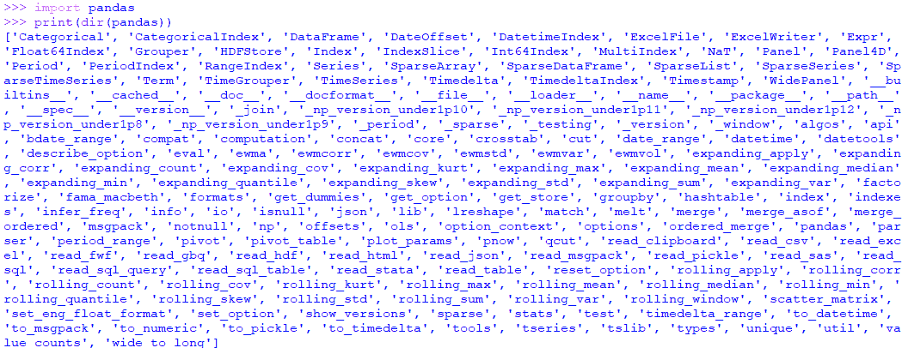
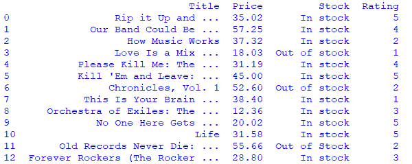
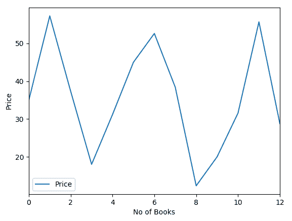
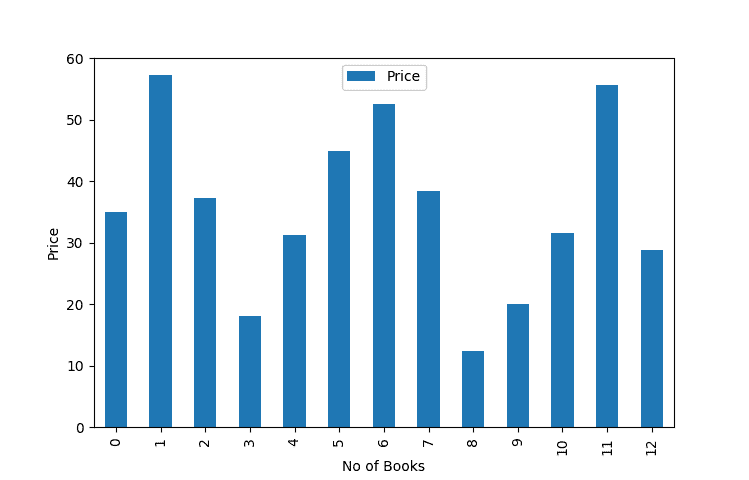

# 十、下一步

到目前为止，我们已经通过使用 Python 编程语言探索了与 web 抓取相关的各种工具和技术。

Web 抓取或 Web 捕获是为了从网站中提取和收集数据。Web 抓取在模型开发方面很方便，这需要实时收集数据，数据真实、与主题相关且准确。这是可取的，因为与实现数据集相比，它花费的时间更少。收集的数据以各种格式存储，如 JSON、CSV、XML 等，并写入数据库供以后使用，还可以作为数据集在线提供

网站还提供带有用户界面的 web API 与 web 上的信息进行交互。这些数据可用于研究、分析、营销、**机器学习**（**ML**）模型、信息构建、知识发现，以及计算机科学、管理、医学等领域的更多内容。我们还可以对通过 API 和公开或免费可用的数据集获得的数据进行分析，并生成结果，但此过程不属于 web 抓取。

在本章中，我们将学习适用于收集或收集数据的主题，并从信息和职业角度了解一些值得了解的高级概念：

*   管理刮取的数据
*   使用 pandas 和 matplotlib 进行分析和可视化
*   毫升
*   数据挖掘
*   下一步是什么？

# 技术要求

需要一个 web 浏览器（Google Chrome 或 Mozilla Firefox）。在本章中，我们将使用以下 Python 库：

*   `pandas`
*   `matplotlib`
*   `csv`
*   `json`

如果您当前的 Python 设置中不存在这些库，请参阅*设置*部分中的[第 2 章](02.html)、*Python 和 Web–使用 urllib 和请求*，以了解有关安装和设置它们的说明。

本章的代码文件可在本书的 GitHub 存储库中找到：[https://github.com/PacktPublishing/Hands-On-Web-Scraping-with-Python/tree/master/Chapter10](https://github.com/PacktPublishing/Hands-On-Web-Scraping-with-Python/tree/master/Chapter10) 。

# 管理刮取的数据

在本节中，我们将探索一些工具，并进一步了解如何处理和管理从某些网站上收集或提取的数据

使用抓取脚本从网站收集的数据称为原始数据。在进一步处理这些数据之前，可能需要在其上执行一些额外的任务，以便我们能够深入了解它。因此，应验证和处理原始数据（如果需要），这可以通过执行以下操作来完成：

*   **清理**：顾名思义，此步骤用于删除不需要的信息，如空格和空白字符，以及文本中不需要的部分。下面的代码显示了在前面章节的示例中使用的一些相关步骤，例如[第 9 章](09.html)、*使用正则表达式提取数据*、[第 3 章](03.html)、*使用 LXML、XPath 和 CSS 选择器*。`sub()`（即`re.sub()`、`strip()`、`replace()`等功能在很多地方使用，也可用于清洁：

```py
dealerInfo = re.split(    r'<br>'    , re.sub(    r'<br><br>'    ,     ''    , dealer))

stock = list(map(lambda stock:stock.strip(),availability))

availability = stockPath(row)[0].strip()

article['lastUpdated'] = article['lastUpdated'].replace('This page was last edited on', '')

title = row.find(attrs={'itemprop':'text'}).text.strip()

re.sub(r'or\s*','',fortran)

dealerInfo = re.split(r'<br>',re.sub(r'<br><br>','',dealer))
```

*   **格式化**：此步骤用于从数据中获取所需的格式。例如，我们可能需要在收到的价格中使用固定小数位，我们可能需要将大的浮点值转换或四舍五入为固定小数位，将大字符串拆分为更小的单位，等等，然后将它们写入数据集。也可能存在将十进制数或整数提取为字符串并需要格式化的情况。通常，转换数据类型和显示数据被视为格式化：

```py
>>> price = 1234.567801
>>> newprice = round(price,2)
>>> print(newprice)
1234.57

>>> totalsum="200.35"
>>> print(type(totalsum))
<class 'str'>

#For large precision use: https://docs.python.org/2/library/decimal.html
>>> totalsum = float(totalsum) 
>>> print(type(totalsum))
<class 'float'>

>>> totalsum
200.35
>>> ratings = 5.5
>>> print(int(rating))
5
```

These additional steps can also be performed within the scripts while we are extracting particular data, and has been done in the examples we've looked at throughout the book. In many cases, cleaning and formatting works together, or is done side by side.

# 写入文件

我们需要在这本书中提取数据行。您可能已经注意到，在大多数示例中，我们使用了一个数据集（用于收集数据的 Python 列表对象），该数据集在 Python 列表中附加了各种字段，如以下代码所示（从本书的各种示例中收集）：

```py
dataSet.append([year,month,day,game_date,team1,team1_score,team2,team2_score,game_status])
..
dataSet.append([title,price,availability,image.replace('../../../..',baseUrl),rating.replace('star-rating ','')])
...
dataSet.append([link, atype, adate, title, excerpt,",".join(categories)])
...
dataSet.append([titleLarge, title, price, stock, image, starRating.replace('star-rating ', ''), url])
```

有了这样一个数据集，我们可以将这些信息写入外部文件以及数据库。在将数据集写入文件之前，需要使用列名来描述数据集中的数据。考虑下面的代码，其中，AuthT0A.是包含字符串标题的单独列表，也就是附加到数据集的相应列表项的列的名称：

```py
keys = [    'year'    ,    'month'    ,    'day'    ,    'game_date'    ,    'team1'    ,     'team1_score'    ,     'team2'    ,     'team2_score'    ,     'game_status'    ]
......
dataSet.append([year,month,day,game_date,team1,team1_score,team2,team2_score,game_status])
```

让我们考虑下面的例子，其中包含了要使用的列的 AutoT0T，以及带有清理和格式化数据的 OutT1。

```py
    import     csv
    import     json

colNames = [    'Title'    ,    'Price'    ,    'Stock'    ,    'Rating'    ]
dataSet= [[    'Rip it Up and ...'    ,     35.02    ,     'In stock'    ,     5    ],[    'Our Band Could Be ...'    ,     57.25    ,     'In stock'    ,     4    ],
    [    'How Music Works'    ,     37.32    ,     'In stock'    ,     2    ],[    'Love Is a Mix ...'    ,     18.03    ,     'Out of stock'    ,    1    ],
    [    'Please Kill Me: The ...'    ,     31.19    ,     'In stock'    ,     4    ],[    "Kill 'Em and Leave: ..."    ,     45.0    ,     'In stock'    ,    5    ],
    [    'Chronicles, Vol. 1'    ,     52.60    ,     'Out of stock'    ,    2    ],[    'This Is Your Brain ...'    ,     38.4    ,     'In stock'    ,    1    ],
    [    'Orchestra of Exiles: The ...'    ,     12.36    ,     'In stock'    ,    3    ],[    'No One Here Gets ...'    ,     20.02    ,     'In stock'    ,    5    ],
   [    'Life'    ,     31.58    ,     'In stock'    ,    5    ],[    'Old Records Never Die: ...'    ,     55.66    ,     'Out of Stock'    ,    2    ],
    [    'Forever Rockers (The Rocker ...'    ,     28.80    ,     'In stock'    ,    3    ]]
```

现在我们将把前面的`dataSet`写入 CSV 文件。CSV 文件的第一行应始终包含列名。在这种情况下，我们将对列使用`colNames`：

```py
fileCsv =     open    (    'bookdetails.csv'    ,     'w'    ,     newline    =    ''    ,     encoding    =    'utf-8'    )
writer = csv.writer(fileCsv) #csv.writer object created

writer.writerow(colNames)  #write columns from colNames
    for     data     in     dataSet:       #iterate through dataSet and write to file
    writer.writerow(data)

fileCsv.close() #closes the file handler
```

前面的代码将生成`bookdetails.csv`文件，该文件包含以下内容：

```py
    Title    ,    Price    ,    Stock    ,    Rating
        Rip it Up and ...    ,    35.02    ,    In stock    ,    5
        Our Band Could Be ...    ,    57.25    ,    In stock    ,    4
        ...........
        Life    ,    31.58    ,    In stock    ,    5
        Old Records Never Die: ...    ,    55.66    ,    Out of Stock    ,    2
        Forever Rockers (The Rocker ...    ,    28.8    ,    In stock    ,    3    
```

类似地，让我们创建一个带有`colNames`和`dataSets`的 JSON 文件。JSON 类似于 Python 字典，其中每个数据或值都有一个键；也就是说，它存在于键值对中：

```py
finalDataSet=    list    ()     #empty DataSet

    for     data     in     dataSet:
    finalDataSet.append(    dict    (    zip    (colNames,data))) 

    print    (finalDataSet)

[{'Price': 35.02, 'Stock': 'In stock', 'Title': 'Rip it Up and ...', 'Rating': 5}, {'Price': 57.25, 'Stock': 'In stock', ..........'Title': 'Old Records Never Die: ...', 'Rating': 2}, {'Price': 28.8, 'Stock': 'In stock', 'Title': 'Forever Rockers (The Rocker ...', 'Rating': 3}]
```

我们可以看到，`finalDataSet`是通过添加`dataSet`中的数据并使用`zip()`Python 函数形成的。`zip()`组合列表中的每个单独元素。然后将这个压缩对象转换为 Python 字典。例如，考虑下面的代码：

```py
#first iteration from loop above     dict    (    zip    (colNames,data)) will generate
{'Rating': 5, 'Title': 'Rip it Up and ...', 'Price': 35.02, 'Stock': 'In stock'}
```

现在，有了可用的`finalDataSet`，我们可以使用`json`模块中的`dump()`函数将数据转储或添加到 JSON 文件中：

```py
    with         open    (    'bookdetails.json'    ,     'w'    )     as     jsonfile:
    json.dump(finalDataSet,jsonfile)
```

前面的代码将生成`bookdetails.json`文件。其内容如下：

```py
[
  {
        "Price"    :     35.02    ,
        "Stock"    :     "In stock"    ,
        "Title"    :     "Rip it Up and ..."    ,
        "Rating"    :     5
              },
  ................
  {
        "Price"    :     28.8    ,
        "Stock"    :     "In stock"    ,
        "Title"    :     "Forever Rockers (The Rocker ..."    ,
        "Rating"    :     3
              }
]
```

在本节中，我们介绍了管理原始数据的基本步骤。我们获得的文件可以在各种独立系统之间轻松共享和交换，用作 ML 的模型，并且可以作为应用程序中的数据源导入。此外，我们还可以使用 MySQL、PostgreSQL 等**数据库管理系统**（**DBMS**）存储数据，并使用必要的 Python 库执行**结构化查询语言**（**SQL**）。

# 使用 pandas 和 matplotlib 进行分析和可视化

在本节中，我们将探讨有关使用 pandas 分析数据和使用 matplotlib 绘制通用图表的一些基本概念

熊猫是近年来最流行的数据分析库之一。数据分析和可视化是主要任务，可以在 pandas 和其他库（如 matplotlib）的帮助下执行

For more details and documentation on pandas and matplotlib, please visit their official sites at [https://pandas.pydata.org/](https://pandas.pydata.org/) and [https://matplotlib.org/](https://matplotlib.org/).

熊猫也被称为原始电子表格。它支持数学、统计和查询类型语句，并允许您读取和写入各种文件。它在开发人员和分析人员中也很流行，因为它具有简单的函数和属性，可以帮助您处理行和列结构中的数据：



Exploring pandas using the Python IDE

在本节中，我们将从`bookdetails.csv`文件中读取数据，并使用该文件的数据进行分析和可视化。让我们导入所需的库，即 pandas 和`matplotlib.pyplot`。我们将分别使用`pd`和`plt`别名，并从文件中读取数据：

```py
import pandas as pd
import matplotlib.pyplot as plt

dataSet = pd.read_csv('bookdetails.csv') #loads the file content as dataframe.

print(type(dataSet)) #<class 'pandas.core.frame.DataFrame'>
```

正如我们所看到的，`read_csv()`函数从 CSV 文件中读取内容并生成一个 DataFrame 对象。熊猫还通过使用`read_html()`、`read_excel()`、`read_json()`、`read_sql_table()`等功能支持各种数据文件。

这里，`dataSet`是熊猫数据帧的对象。DataFrame 表示具有行、列和索引的二维表格结构。DataFrame 支持对行和列中的数据进行查询级别分析、条件语句、筛选、分组等：

```py
print(dataSet)
```

以下屏幕截图显示了`dataSet`*中现在可用的内容*

 *

Dataset contents from a CSV file

还显示了行索引，所有索引都以`0`（零）开头。一般统计输出可通过`describe()`功能获得：

```py
print(dataSet.describe()) 
#print(dataSet.describe('price') will only generate values for column price

      Price      Rating
count 13.000000  13.000000
mean  35.633077  3.230769
std   14.239014  1.535895
min   12.360000  1.000000
25%   28.800000  2.000000
50%   35.020000  3.000000
75%   45.000000  5.000000
max   57.250000  5.000000
```

如我们所见，`describe()`默认选择适用于统计函数的列，并使用以下函数返回计算结果：

*   `count`：行数

*   `mean`：相关列的平均值

*   `min`：找到的最小值

*   `max`：找到的最大值

*   `std`：计算出的标准偏差

*   `25%`：返回第 25<sup>个</sup>百分位数

*   `50%`：返回第 50<sup>个</sup>百分位数

*   `75%`：返回第 75<sup>个</sup>百分位数

在下面的代码中，我们选择一个名为`Price`的单独列作为`price_group`*。*可以使用`dataSet.columns`列出数据集中的所有列。可使用以下`dataSet[['Price','Rating']]`格式选择多列：

```py
print(dataSet.columns)
    Index(['Title', 'Price', 'Stock', 'Rating'], dtype='object')    

print(sum(dataSet['Price']))
    463.23    

print(sum(dataSet['Rating']))
42

print(dataSet['Price'][0:5])
    0 35.02    
    1 57.25    
    2 37.32    
    3 18.03    
    4 31.19    
    Name: Price, dtype: float64    
```

以下代码显示了`Price`列的单个数据：

```py
#dataSet[['Price','Rating']] will select both column
price_group = dataSet[['Price']] #selecting 'Price' column only.
print(price_group) 

Index(['Title', 'Price', 'Stock', 'Rating'], dtype='object')
  Price
0 35.02
1 57.25
2 37.32
.....
11 55.66
12 28.80
```

数据帧还接受对列使用的条件或筛选操作。如您所见，对于`>=4.0`的值，过滤器应用于`Rating`，并且只返回`Title`和`Price`：

```py
 print(dataSet[dataSet['Rating']>=4.0][['Title','Price']])

  Title                  Price
0 Rip it Up and ...      35.02
1 Our Band Could Be ...  57.25
4 Please Kill Me: The ...31.19
5 Kill 'Em and Leave: ...45.00
9 No One Here Gets ...   20.02
10 Life                  31.58
```

同样，也可以应用基于字符串的过滤器。过滤包含`Out`文本的`Stock`，输出返回满足`Out`文本的所有列。`contains()`函数接受正则表达式和字符串：

```py
print(dataSet[dataSet.Stock.str.contains(r'Out')])

   Title                     Price Stock        Rating
3  Love Is a Mix ...         18.03 Out of stock 1
6  Chronicles, Vol. 1        52.60 Out of stock 2
11 Old Records Never Die: ...55.66 Out of Stock 2#will return only column 'Price'
#print(dataSet[dataSet.Stock.str.contains(r'Out')]['Price'])

```

`between()`函数提供了参考`Rating`的值，用于过滤并返回书籍的`Title`：

```py
print(dataSet[dataSet.Rating.between(3.5,4.5)]['Title'])

1 Our Band Could Be ...
4 Please Kill Me: The ...
```

由于我们有`price_group`数据，我们可以借助`show()`函数对数据调用`plot()`函数：

```py
 bar_plot = price_group.plot()  #default plot
 bar_plot.set_xlabel("No of Books") #set X axis: label
 bar_plot.set_ylabel("Price") #set Y axis: label
 plt.show() #displays the plot or chart created
```

前面的代码将生成具有默认属性（例如颜色和图例位置）的折线图，如下所示：



Default line chart for the Price column

我们还可以改变图表的类型，即直线、条形等等。

Visit matplotlib at [https://matplotlib.org/gallery/index.html](https://matplotlib.org/gallery/index.html) to find out more about various functional chart types and their additional associated properties.

在以下代码中，`kind='bar'`覆盖默认的线型：

```py
bar_plot = price_group.plot(kind='bar') #kind='bar'
bar_plot.set_xlabel("No of Books")  #Label for X-Axis
bar_plot.set_ylabel("Price") #label for Y-Axis
plt.show() 
```

上述代码生成以下条形图：



Bar chart for the Price column

到目前为止，我们已经使用了一个基本的图表类型，只有一列。在下面的代码中，我们正在绘制带有`Price`和`Rating`值的条形图：

```py
price_group = dataSet[['Price','Rating']]  #obtain both columns
#title: generates a title for plot
bar_plot = price_group.plot(kind='bar',title="Book Price ad Rating")
bar_plot.set_xlabel("No of Books")
bar_plot.set_ylabel("Price")
plt.show()
```

我们收到以下输出：


Bar chart with Price and Rating columns

到目前为止，我们已经成功地绘制了直线图和条形图。以下代码为`Price`列中的前六项绘制饼图，并使用`dataSet`中的前六项`Title`进行标记：

```py
prices = dataSet['Price'][0:6] #Price from first 6 items
labels = dataSet['Title'][0:6] #Book Titles from first 6 items
legends,ax1 = plt.pie(prices, labels=labels, shadow=True, startangle=45)
plt.legend(legends, prices, loc="best") #legend built using Prices
plt.show() 
```

`Price`中的值用作图例。我们收到以下输出：


Pie chart with Price and Title column data

在使用 pandas 和 matplotlib 方面还有很多需要探索的地方。在本节中，我们展示了这两个库的基本功能。现在，我们来看看 ML。

# 机器学习

ML 是**人工智能**（**AI**的一个分支，主要研究数学和统计算法，以处理和开发一个自动化系统，该系统可以从数据中学习，只需很少的人工参与。ML 预测和决策模型依赖于数据。Web 抓取是使数据可用于 ML 模型的资源之一。

如今，许多推荐引擎实现了 ML，以便实时服务于营销广告和推荐，如 Google AdSense 和 AdWords。在 ML 中实现的过程类似于数据挖掘和预测建模。这两个概念在浏览数据和根据需求修改程序操作的同时寻找模式。因此，在探索商业、营销、零售、股价、视频监控、人脸识别、医疗诊断、天气预报、在线客户支持、在线欺诈检测等领域时，ML 是一个方便的工具。

随着新的和改进的 ML 算法、数据捕获方法以及更快的计算机和网络，ML 领域正在加速发展。

# ML 与 AI

人工智能是一个广泛的领域，涵盖了广泛的主题，如神经网络、专家系统、机器人、模糊逻辑等等。ML 是 AI 的一个子集。本书探讨了建造一台能够独立学习的机器的想法，从而超越了不断猜测的需要。因此，ML 为实现 AI 带来了重大突破。

ML 结合了几种算法的使用，因此允许软件提供准确的结果。从一组解析数据中做出有用的预测是 ML 概念的目标。ML 的最大好处是它可以不知疲倦地学习和预测，而不需要硬编码的软件体系。培训包括输入大量数据集。这允许算法学习、处理和做出预测，并将其作为输出提供。

在测量任何模型的电势时，都会用到几个重要参数。精度是其中之一，也是衡量任何开发模型成功与否的重要参数。在 ML 中，80%的准确率是成功的。如果模型有 80%的准确率，那么我们将节省 80%的时间并提高生产率。然而，如果数据不平衡，它并不总是访问分类模型的最佳度量。

一般来说，准确度被称为一种直观的衡量标准。在使用准确性时，误报和漏报的成本是相等的。对于不平衡的数据（例如一种情况下下降 94%，另一种情况下下降 6%），有很多方法可以降低成本；模糊预测每个实例都属于多数类，证明总体准确率为 94%，完成任务。同样，如果我们所谈论的疾病是罕见和致命的，就会出现问题。未能正确检查患者疾病的成本高于促使健康人接受更多检测的成本。

总而言之，没有最好的衡量标准。两个人通常会选择不同的指标来实现他们的目标。

# Python 和 ML

一位荷兰程序员（Guido Van Rossum）启动了 Python 作为他的辅助项目，但没有意识到它会加速他的成功。当涉及到快速原型时，Python 在开发人员中被广泛采用。它以其可读性、多功能性和易用性在所有可用的 ML 工具中越来越流行。

作为 ML 工程师、计算机视觉工程师、数据科学家或数据工程师，我们必须处理线性代数和微积分的思想，这些思想一旦深入研究就会变得复杂。然而，Python 以其快速的实现来解围，从而绕过了最大努力的障碍。对这一思想的快速验证使 Python 编程语言更受欢迎。

数据是 ML 的一切。原始数据是非结构化的、大的、不完整的，并且缺少值。数据清理是 ML 中最关键的步骤之一，以便我们能够继续处理数据。Python 中有许多基本的库，可以简化 ML 的实现。Python 中的各种开源存储库有助于对现有方法进行更改。Web 抓取是处理 Web 上存在的数据的方法之一，然后将其作为 ML 模型的输入进行进一步处理。

如果我们决定使用 Python 和 ML，下面是一些最常见和最广泛使用的库，值得一看：

*   **scikit 学习**：用于处理经典 ML 算法

*   **NumPy（数字 Python）**：设计用于科学计算

*   **SciPy**：包含线性代数、优化、积分和统计模块

*   **熊猫**：用于数据聚合、操作、可视化

*   **matplotlib**和**Seaborn**：用于数据可视化

*   **Bokeh**和**Plotly**：用于交互式可视化

*   **TensorFlow**和**Theano**：用于深度学习

*   **靓汤、LXML、PyQuery**和**刮痧**：用于从 HTML 和 XML 文档中提取数据

一旦我们对 Python 有了基本的了解，就可以导入和实现这些库。或者，我们也可以从头开始应用这些功能，这是大多数开发人员所做的。

Python 在代码方面需要更少的编写和调试，这与其他编程语言相比节省了时间。这正是 AI 和 ML 程序员想要的：专注于理解体系结构方面，而不是把所有的时间都花在调试上。因此，由于提供了人的可读性的语法，编程知识较少的人可以轻松地处理 Python。

除了 Python 之外，还有其他一些用于 ML 的工具，如 Microsoft Excel、SAS、MATLAB 和 R。由于缺乏足够的社区服务以及无法处理大型数据集，这些工具经常被忽略。MATLAB 还提供了用于图像处理和分析的复杂库和包。与 Python 相比，执行时间适中，功能仅限于原型设计，而不是部署。

R 是另一种用于统计分析的工具。Python 通过提供可以与其他系统协作的各种开发工具来执行数据操作。然而，R 只在特定形式的数据集上工作，因此预定义的函数需要预定义的输入。R 为数据提供了一个基本的基础，Python 允许我们探索数据。

# ML 算法的类型

一般来说，有三种类型的 ML 算法，如下所示：

*   监督学习：

    *   分类

    *   回归

*   无监督学习：

    *   协会

    *   群集

*   强化学习

# 监督学习

监督学习是关于观察或指导某事物的执行。给模型的输入就是我们想要做的预测。标记数据是为输入的特定实例给出的显式预测。监督学习需要标记数据，这需要一些专业知识。然而，这些条件并不总是得到满足。我们并不总是拥有标记的数据集。例如，欺诈预测是攻击者不断寻找可用漏洞的快速展开领域之一。这些新攻击不可能在带有标记攻击的数据集下进行维护。

从数学上讲，输入到输出的映射函数可以表示为*Y=f（X）*。此处，*Y*为输出变量，*X*为输入变量。

# 分类

分类根据模型的属性确定或分类模型，是根据预先已知的成员类别识别新观察所属类型的过程。这是一种基于一个或多个自变量确定因变量属于哪一类的技术。分类问题中的输出变量是组或类别。

例如，信用评分（根据收入和储蓄区分高风险和低风险）、医疗诊断（预测疾病风险）、网络广告（预测用户是否会点击广告）等等

分类模型的能力可以通过使用模型评估程序和模型评估度量来确定。

**模型评估程序**

模型评估过程可帮助您了解模型适应样本数据的程度：

*   **训练和测试数据**：训练数据用于训练模型，使其符合参数。测试数据是一个屏蔽数据集，必须对其进行预测。

*   **训练和测试分离**：通常，当数据分离时，大部分数据用于训练，而一小部分数据用于测试。

*   **K-折叠交叉**-**验证**：创建 K-序列和测试拆分并一起平均。该过程的运行速度比列车和测试拆分慢 k 倍。

**模型评估指标**

模型评估指标用于量化模型的性能。为了衡量分类预测模型的能力，可以实施以下指标

评估指标在以下方面的帮助下进行管理：

*   **混淆矩阵**：这是一个 2X*2 矩阵，也称为误差矩阵。它有助于描述算法的性能——通常是有监督的学习算法，借助于分类精度、分类误差、灵敏度、精度度量和预测。指标的选择取决于业务目标。因此，有必要根据需求确定是否可以减少误报或误报。*

 **   **逻辑回归**：逻辑回归是一种统计模型，有助于分析数据集。它有几个独立变量，负责确定输出。用二倍体变量测量输出（涉及两种可能的结果）。logistic 回归的目的是寻找描述二倍体变量（因变量）和一组自变量（预测因子）之间关系的最佳拟合模型。因此，它也被称为预测学习模型。

*   **Naives Bayes**：这是基于贝叶斯定理给出的条件概率概念。贝叶斯定理根据可能与事件有关的先验知识计算事件的条件概率。该方法广泛应用于人脸识别、医学诊断、新闻分类等领域。Naives Bayes 分类器基于 Bayes 定理，其中给出的*B*的*A*的条件概率可计算如下：

```py
P(A | B) = ( P(B | A) * P( A ))/ P( B  )
Given:
P(A | B) = Conditional probability of A given B
P(B | A) = Conditional probability of B given A
P( A )= Probability of occurrence of event A
P( B  )= Probability of occurrence of event B
```

*   **决策树**：决策树是一种监督学习模型，可以以树的形式查看最终结果。决策树包括叶节点、决策节点和根节点。决策节点有两个或多个分支，而叶节点表示分类或决策。决策树将数据集进一步分解为更小的子集，从而以增量方式开发关联树。它易于理解，并且可以轻松处理分类和数字数据集。

*   **随机森林算法**：该算法是一种有监督的 ML 算法，易于使用，即使没有超参数调整，也能提供很好的结果。由于其简单性，它可以用于回归和分类任务。它可以处理更大的数据集，以维护丢失的值。与回归算法相比，该算法在执行分类相关任务方面也被认为是最好的。

*   **神经网络**：虽然我们已经有了线性和分类算法，但对于许多 ML 问题，神经网络是最先进的技术。神经网络由单元（即神经元）组成，这些单元按层排列。它们负责将输入向量转换为某些输出。每个单元接受一个输入，应用一个函数，并将输出传递到下一层。通常，非线性函数应用于该算法

*   **支持向量机（SVM）算法**：SVM 学习算法为有监督的 ML 模型。它用于分类和回归分析，被广泛称为约束优化问题。支持向量机可以使用核技巧（线性、径向基函数、多项式和 sigmoid）变得更强大。然而，支持向量机方法的局限性在于核的选择。

# 回归

回归是一种统计方法，有助于估计变量之间的关系。一般来说，分类侧重于预测标签，而回归侧重于预测数量。管理者在金融、投资和其他学科中使用回归来评估资产价值。同样，它试图确定因变量和一系列其他变化变量（自变量）之间关系的强度；例如，商品价格与从事这些商品交易的企业之间的关系。

回归模型有两个主要特点。回归问题中的输出变量本质上是一个实际值或定量值。模型的创建将考虑过去的数据。数学上，预测模型将输入变量（*X*）映射到连续输出变量（*Y*）。连续输出变量是整数值或浮点值。

回归预测模型的能力可以通过计算**均方根误差**（**RMSE**来衡量。例如，回归预测模型总共进行了两次预测，即 1.5 和 3.3，其中预期值分别为 1.0 和 3.0。因此，RMSE 可计算如下：

```py
RMSE = sqrt(average(error^2))
RMSE = sqrt(((1.0 - 1.5)^2 + (3.0 - 3.3)^2) / 2)
RMSE = sqrt((0.25 + 0.09) / 2)
RMSE = sqrt(0.17)
RMSE = 0.412
```

# 无监督学习

无监督学习是一类 ML 技术，其中作为输入的数据没有标记。此外，仅给出输入变量（*X*），与输出变量（*Y*不对应。在无监督学习中，算法被孤立地留给自己学习和探索，没有真正的早期期望。这种标签的缺失教会我们如何使用表示或嵌入来重建输入数据。当涉及到数据挖掘和特征提取时，它是有益的。

无监督学习可以让你发现隐藏的趋势和模式。一些真实世界的例子包括预测或理解手写数字、纳米相机制造技术、普朗克量子光谱等等。

在数学上，无监督学习有一个输入值（*X*），没有相应的输出值。与监督学习相比，非监督学习的任务处理相当复杂。无监督学习的实现可以在自动或自动驾驶汽车、面部识别程序、专家系统、生物信息学等领域找到。

关联和聚类是无监督学习的两部分。

# 协会

这是一种用于在大型数据集中发现新模式的技术。考虑关联以根据新闻价值程度从数据集中识别强规则。在对数据进行长期分析的过程中，会生成更多的新规则。

关联规则主要用于市场篮子分析。这项技术有助于确定购买的产品对之间的关联强度和观察中的共同发生频率。

市场篮子分析是零售商用来揭示商品之间关联的建模技术之一。该理论阐述了这样一个事实，即如果我们购买一些物品，我们更有可能购买类似的物品

在数学上，它被表示为*P（A|B）*，购买*A*的人也会购买*B*，也可以写成*{A}、*然后*{B}*。换句话说，如果存在 a 发生的概率，那么也存在 B 发生的概率。例如，*P（牛奶面包）=0.7*。

# 群集

簇是属于同一标签的对象的集合，被视为一个。聚类是将对象分组到其相应类别的技术。这包括将多个对象排序到它们的特定组中，如果它们属于同一组，则关联容量最大；否则，关联容量最小

最流行的聚类算法之一是 k-means 聚类算法。该算法需要预定义的 k 值。K 表示我们要将数据划分为的集群数量。当簇是超球体时，例如二维空间中的圆或三维空间中的球体，可以获得真实的性能。

集群的主要优势在于，它可以帮助您从数据中找出独特、有用的特性，并且可以灵活地进行更改。

# 强化学习

强化学习是 ML 的一部分，它涉及采取必要的行动以增加特定情况下的回报。它使用多个软件和机器，以便为特定情况找到可能的最佳路径。

强化学习不同于监督学习。在监督学习中，训练数据被提供了一个标签，并以此为基础进行训练。在强化学习的情况下，强化代理决定解决分配给他们的任务。

强化学习有两种类型：

*   **积极强化**：使绩效最大化，并在更长的时间内保持变化

*   **负面强化**：最小化绩效，并在更短的时间内维持变化

# 数据挖掘

从大型数据集或数据库中发现隐藏或预测信息的过程称为数据挖掘。数据挖掘是对数据进行分析以发现新模式和事实的一种形式。这些事实用于发现知识，也被视为数据库（**KDD**中**知识发现的一步**

来自 AI、ML、统计、数据库管理系统等的各种过程和步骤经常被结合起来以搜索新模式。随着数据量和 ML 算法的不断增长，在数据库中总是有发现新的或隐藏的事实的趋势。发现或搜索的事实和模式随后被用于预测某个结果，并且还可以应用于许多领域，如统计学、数据可视化、营销、管理、医疗、决策系统等

数据分析和数据挖掘通常是同时进行比较或讨论的。数据挖掘被认为是数据分析过程的一部分。在进行数据分析时，我们需要一些预定义的假设，因为这是组织数据以开发模型和确定某些见解的过程。就应用实践而言，数据挖掘主要在结构化数据上进行，而数据分析可以在结构化、非结构化或半结构化数据上进行。

数据挖掘基于科学和数学方法，而数据分析使用分析模型和智能系统。从远处看，数据分析和数据挖掘都是数据科学的子集，其中数据挖掘实现预测算法以发现模式，数据分析实现活动以从数据集中获得一些见解。

数据挖掘的一个主要好处是能够在短时间内处理大量数据。它还可以跨新的或现有的平台实现，预测隐藏模式或帮助发现它们，帮助决策、知识发现，等等

# 数据挖掘的任务

通常，数据挖掘任务分为两种类型，也称为数据挖掘分析或数据挖掘建模。两者都可以进一步分类，如下所示：

*   预测性：

    *   分类

    *   回归

    *   预言

*   描述的：

# 预测的

这将使用统计分析，并将数据转化为有价值的信息。它预测发生情况的未来可能结果。通过分析当前和历史事实产生产出的预测相关技术属于该模型。

# 分类

这是最常见的挖掘技术之一，在处理样本以发现事实之前对其进行分类和分类。有关分类和模型评估程序的更多信息，请参阅*ML 算法类型*部分。

# 回归

该技术用于预测、预测和分析信息趋势以及变量之间的关系。有关回归的更多信息，请参阅*类型的 ML 算法*部分。

# 预测

该技术通过使用来自其他数据挖掘技术（如聚类、分类等）的参考来分析过去的事件并预测可能丢失的或未来的值。

# 描写的

也称为数据处理的初级阶段，它使用商业智能和许多其他系统。这种形式的分析是有限的，因为它只分析过去的数据，通常提供关于已经发生的事情的信息

# 群集

聚类是一种用于识别彼此相似数据的技术。有关聚类的更多信息，请参阅*类型的 ML 算法*部分。

# 总结

这提供了数据集更紧凑的表示，包括可视化和报告生成。大多数关于销售和营销的管理报告都使用这种技巧

# 关联规则

有关关联的更多信息，请参考*类型的 ML 算法*部分。

# 下一步是什么？

网页抓取是动态的，要求很高，也是一项具有挑战性的任务。我们需要遵守网站的**服务条款**（**ToS**）和隐私政策中提出的法律观点，然后才能继续执行此任务。Python 编程以其支持性、简单的语法、简短易读的代码形成，以及库和工具的可用性，是 web 抓取中使用的最佳语言之一。

尽管如此，挑战仍然存在，通用脚本可能无法满足现有的需求。有时，一个胡版任务可能是一个巨大的体积，个人电脑或笔记本电脑在考虑时间、机器资源等时，不可能是一个值得实现的地方。让我们看一下其中的一些：

*   采用越来越多的基于网络的安全措施

*   数据的动态加载和脚本语言的参与使抓取变得复杂

*   存在验证码，可在[找到 http://www.captcha.net/](http://www.captcha.net/)

*   阻止用户的 IP 地址（用于同时请求）

*   阻止来自世界某些地区的请求（使用和切换代理可能会有所帮助）

对于这种情况，我们可以从从事刮片相关工作的组织那里获得帮助。这些组织可以通过收取一定的费用并为我们提供一个 web 界面来处理我们的数据需求，从而帮助我们满足我们的数据需求。这些公司可以在谷歌中搜索到`Web Scraping Services`或`Web Scraping Softwares`。还有各种基于浏览器的扩展，可以通过搜索`Scraping Extensions`找到。

# 总结

在本章中，我们探索并学习了有关使用 pandas 和 matplotlib 进行文件管理、分析和可视化的基本概念。我们还介绍了 ML 和数据挖掘，并探讨了一些相关资源，这些资源有助于进一步学习和职业发展

有了这一章，我们就到了书的结尾！Web 抓取是一个广泛的主题，它直接或间接地与许多技术和开发技术相关。在本书中，我们通过使用 Python 编程语言了解了该领域的许多概念。我们还可以探索更多与 web 抓取相关的主题，如 ML、数据挖掘、web 抓取、AI 和 Python 编程。从知识和职业角度来看，这些话题值得探讨。

# 进一步阅读

*   *人工智能：现代方法*在[处 http://aima.cs.berkeley.edu/](http://aima.cs.berkeley.edu/)
*   *机器学习*在[处 http://www.cs.cmu.edu/~tom/mlbook.html](http://www.cs.cmu.edu/~tom/mlbook.html)
*   *数据挖掘与分析*、*基本概念与算法*、at[http://www.dataminingbook.info/pmwiki.php](http://www.dataminingbook.info/pmwiki.php)
*   Python 数据分析库，位于[https://pandas.pydata.org](https://pandas.pydata.org/)
*   matplotlib:Python 绘图，位于[https://matplotlib.org](https://matplotlib.org/)
*   文件处理（Python），位于[https://www.w3schools.com/python/python_file_handling.asp](https://www.w3schools.com/python/python_file_handling.asp)
*   *信息检索导论*[处 https://nlp.stanford.edu/IR-book/](https://nlp.stanford.edu/IR-book/)
*   SQLite，位于[https://www.sqlite.org/index.html](https://www.sqlite.org/index.html)
*   MySQL，位于[https://www.mysql.com/](https://www.mysql.com/)
*   PostgreSQL，位于[https://www.postgresql.org/](https://www.postgresql.org/)
*   验证码，在[http://www.captcha.net/](http://www.captcha.net/)
*   *KDD 流程概述*，见[http://www2.cs.uregina.ca/~dbd/cs831/notes/kdd/1_kdd.html](http://www2.cs.uregina.ca/~dbd/cs831/notes/kdd/1_kdd.html)**