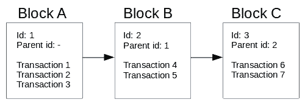
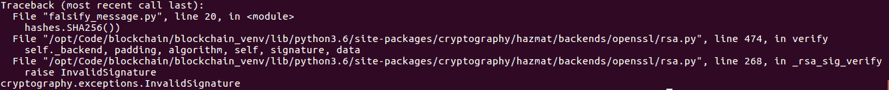
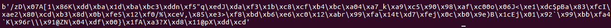
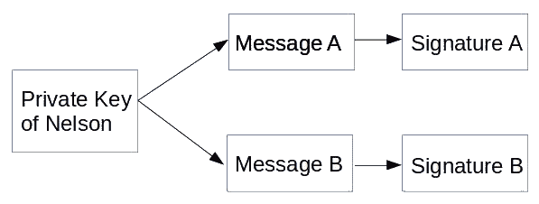
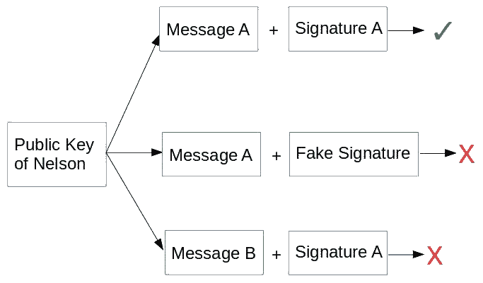
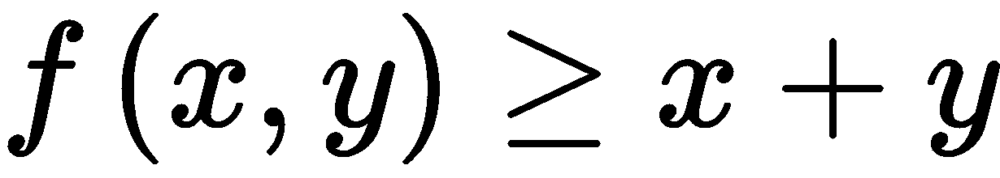
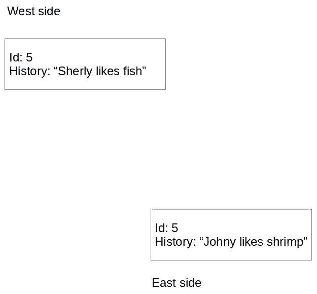
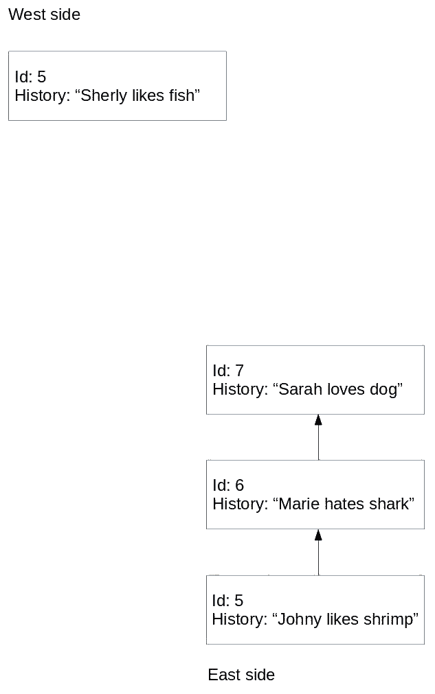
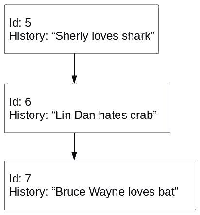
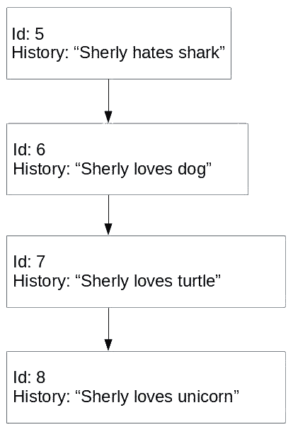

# 第一章：区块链编程简介

在本书中，我们将学习区块链编程，以便在寻找区块链机会时成为一个不可忽视的力量。为了实现这一点，你需要从理解区块链技术及其包含的内容开始。在本章中，我们将学习什么是区块链技术。区块链如何赋予比特币和以太坊力量？我们将直观地理解区块链技术。我们还将复制区块链背后的一些基本功能。

本章将涵盖以下主题：

+   加密货币和区块链的崛起

+   区块链技术

+   密码学

+   哈希函数

+   共识

+   区块链上的编码

# 加密货币和区块链的崛起

假设你在 2017 年不是隐居在山上的隐士，你一定听说过加密货币，尤其是比特币。你不必远去就能听到这个话题的风靡，它的术语和价值的增长。在这一点上，其他加密货币也开始增长，为**以太坊达到 1000 美元！**等标题铺平了道路。在这狂热中，人们讨论了有关加密货币的一切，从价格的波动到其背后的技术，即区块链。

区块链被视为将为人类带来新时代的正义和繁荣的技术。它将使财富民主化。它将夺取寡头的权力并归还给人民。它将保护人民的数据。然后到了 2018 年，加密货币下跌了。派对结束了。比特币现在的价格是 6000 美元，而以太坊的价格不到 400 美元。

然而，尽管围绕加密货币的炒作已经平息，但它仍然是一个经常讨论的话题。区块链会议和聚会在许多地方涌现，而投资继续涌入区块链初创公司。硅谷的巨头安德烈森·霍洛维茨从其有限合伙人那里获得了高达 3 亿美元的专门区块链基金。在这种情况下，机会就在资金流入的地方。区块链开发者的首席招聘官 Katheryn Griffith Hill 声称，目前每个区块链开发者有 14 个职位空缺。此外，我参加了雅加达的一个本地区块链活动的一位朋友评论说，我看到大约 100 名观众，但只有大约四五名开发者。50%的观众是投资者。有人想把钱投入区块链，但能够开发产品的人却更少。

区块链开始被用作无中间人的支付解决方案，即比特币。然后，人们发现区块链还具有一些其他有趣的特性。首先，它是透明的，意味着人们可以审计它，以检查是否存在洗钱行为。其次，它在一定程度上为用户提供隐私，可以用来避免个人资料被追踪。

然后，在以太坊发布后，人们突然开始创造如何在现实生活中应用区块链。从创建代表某物所有权的代币，比如自治组织或具有完全隐私支付的数字资产，到不能复制的数字资产（不像 MP3 文件）。

# 区块链技术

大多数人知道比特币存在是因为区块链。但区块链是什么？它是一个仅追加的数据库，由哈希链接的区块组成。在这里，每个区块包含许多由加密技术保护的价值转移交易（但也可能是其他东西）；持有相同数据库的许多节点之间的共识决定下一个要追加的新区块。

你现在不必理解这个定义；这些都是很多需要消化的话！首先，我会向你解释区块链，这样你就可以适应这个新知识，随着我们在本书中的进展。

回到区块链的定义，我们可以总结定义为只能追加的数据库。一旦你把东西放入数据库，它就不能被改变；没有撤销。我们将在第二章 *智能合约基础*中讨论这一特性的影响。这个定义涉及许多事情，并开启了一个全新的世界。

那么，你可以把什么放入这个只能追加的数据库中呢？这取决于加密货币。对于比特币，你可以存储价值转移的交易。例如，纳尔逊向迪安发送 1 比特币。然而，在将它们附加到数据库之前，我们将许多交易累积到一个区块中。对于以太坊，你可以将更丰富的东西放入只能追加的数据库中。这不仅包括价值转移的交易，还可以是状态的改变。我在这里所说的状态是非常一般的。例如，购买演出门票的队列可以有一个状态。这个状态可以是空的或者满的。与比特币类似，在以太坊中，你需要在将所有交易一起附加到这个只能追加的数据库之前收集它们。

为了更清楚，我们将所有这些交易放入区块中，然后再将它们附加到只能追加的数据库中。除了交易列表，我们还在这个区块中存储其他东西，比如我们将区块追加到只能追加的数据库中的时间，目标的难度（如果你不了解这个，不用担心），以及父哈希（我马上会解释这个），以及其他许多东西。

现在你了解了区块链的区块元素，让我们来看看链元素。如前所述，除了交易列表，我们还将父哈希放在区块中。但现在，让我们只使用一个简单的 ID 来表示父级，而不是使用哈希。**父 ID**只是上一个区块的 ID。在这里，想象一下堆栈。一开始，没有区块。相反，我们放置了**区块 A**，其中包含三笔交易：**交易 1**，**交易 2**和**交易 3**。由于**区块 A**是第一个区块，它没有父级。然后，我们将**区块 B**应用到**区块 A**，其中包括两笔交易：**交易 4**和**交易 5**。**区块 B**不是这个区块链中的第一个区块。因此，我们将**区块 B**中的父级部分设置为**区块 A**的 ID，因为**区块 A**是**区块 B**的父级。然后，我们将**区块 C**放入区块链中，其中包含两笔交易：**交易 6**和**交易 7**。

**区块 C**中的父级部分将是**区块 B**的 ID，依此类推。为了简化事情，我们为每个新区块从 0 开始递增 ID：



让我们实现一个数据库来记录人们喜欢和讨厌的历史。这意味着当你在历史上某个时刻说你喜欢猫时，你将无法改变那段历史。当你改变主意时（例如，如果你后来讨厌猫），你可以添加新的历史，但这不会改变你过去喜欢它们的事实。因此，我们可以看到在过去你喜欢猫，但现在你讨厌它们。我们希望使这个数据库充满诚信并且安全防止作弊。看一下以下代码块：

```py
class Block:
    id = None
    history = None
    parent_id = None

block_A = Block()
block_A.id = 1
block_A.history = 'Nelson likes cat'

block_B = Block()
block_B.id = 2
block_B.history = 'Marie likes dog'
block_B.parent_id = block_A.id

block_C = Block()
block_C.id = 3
block_C.history = 'Sky hates dog'
block_C.parent_id = block_B.id
```

如果你学过计算机科学，你会认识到这种数据结构，它被称为**链表**。现在，有一个问题。假设玛丽讨厌纳尔逊，并希望给纳尔逊抹黑。玛丽可以通过改变区块 A 的历史来做到这一点：

```py
block_A.history = 'Nelson hates cat'
```

这对喜欢猫的纳尔逊是不公平的。因此，我们需要添加一种只有纳尔逊才能写下自己偏好历史的方法。这样做的方法是使用私钥和公钥。

# 在区块链中签署数据

在区块链中，我们使用两个密钥对数据进行签名，以验证消息的真实性并保护免受未经授权的用户篡改。这两个密钥如下：

+   私钥

+   公钥

私钥的保密性受到保护，不向公众公开。另一方面，您可以将公钥公开。您可以告诉每个人，*嘿，这是我的公钥*。

让我们生成私钥。为此，我们需要`openssl`软件。您可以通过以下方式安装它：

```py
$ sudo apt-get install openssl
```

因此，Nelson 生成私钥，即`nelsonkey.pem`文件。他必须保守这个密钥。生成如下：

```py
$ openssl genrsa -out nelsonkey.pem 1024
```

从私钥中，Nelson 生成公钥：

```py
$ openssl rsa -in nelsonkey.pem -pubout > nelsonkey.pub
```

Nelson 可以与所有人分享这个公钥`nelsonkey.pub`。现实世界中，我们可以建立一个简单的公钥及其所有者的字典，如下所示：

```py
{
'Nelson': 'nelsonkey.pub',
'Marie': 'mariekey.pub',
'Sky': 'skykey.pub'
}
```

我们现在将看一下 Nelson 如何证明他是唯一能够对其历史进行更改的人。

首先，让我们创建一个 Python 虚拟环境：

```py
$ python3 -m venv blockchain
$ source blockchain/bin/activate
(blockchain) $
```

接下来，安装库：

```py
(blockchain) $ pip install --upgrade pip
(blockchain) $ pip install wheel
(blockchain) $ pip install cryptography
```

这是可以用来签署消息的 Python 脚本。将此脚本命名为`verify_message.py`（请参考以下 GitLab 链接中的代码文件获取完整代码：[`gitlab.com/arjunaskykok/hands-on-blockchain-for-python-developers/blob/master/chapter_01/verify_message.py`](https://gitlab.com/arjunaskykok/hands-on-blockchain-for-python-developers/blob/master/chapter_01/verify_message.py)）：

```py
from cryptography.hazmat.primitives import hashes
from cryptography.hazmat.primitives.asymmetric import padding
from cryptography.hazmat.backends import default_backend
from cryptography.hazmat.primitives.asymmetric import rsa
from cryptography.hazmat.primitives import serialization

# Generate private key
#private_key = rsa.generate_private_key(
# public_exponent=65537,
# key_size=2048,
# backend=default_backend()
#)
...
...

# Message validation executed by other people
public_key.verify(
    signature,
    message,
    padding.PSS(mgf=padding.MGF1(hashes.SHA256()),
                salt_length=padding.PSS.MAX_LENGTH),
    hashes.SHA256())
```

执行此脚本时，如预期的那样，不会发生任何事情。这意味着消息已通过公钥的签名进行了验证。签名只能由 Nelson 创建，因为您需要私钥才能创建签名。但是，要使用签名验证消息，您只需要公钥。

让我们看一个案例，Marie 试图使用名为`falsify_message.py`的脚本伪造事实。Marie 试图将`Nelson hates cat`放入历史数据库中，如下所示：

```py
from cryptography.hazmat.primitives import hashes
from cryptography.hazmat.primitives.asymmetric import padding
from cryptography.hazmat.backends import default_backend
from cryptography.hazmat.primitives.asymmetric import rsa
from cryptography.hazmat.primitives import serialization

message = b'Nelson hates cat'
signature = b'Fake Signature'

with open("nelsonkey.pub", "rb") as key_file:
    public_key = serialization.load_pem_public_key(
        key_file.read(),
        backend=default_backend())

public_key.verify(
 signature,
 message,
 padding.PSS(mgf=padding.MGF1(hashes.SHA256()),
                salt_length=padding.PSS.MAX_LENGTH),
    hashes.SHA256())
```

这就是验证方法的工作原理。Nelson 计算消息的哈希值，然后用他的私钥对其进行加密。结果就是签名。例如，如果 Sky 想要验证签名，他有消息和签名。他计算消息的哈希值。然后，他使用公钥解密签名。结果与消息的哈希值进行比较。如果相同，那么一切正常。如果不同，要么消息已被更改，要么用于签署消息的私钥不同。

这样做时，您将获得以下输出：



那么签名是什么样的？回到`verify_message.py`，并将以下行附加到文件末尾。然后再次运行脚本：

```py
print(signature)
```

签名看起来像这样：



每条消息都有不同的签名，Marie 不可能猜到签名以伪造消息。因此，有了私钥和公钥，我们可以验证消息是否确实来自授权人员，即使我们在不安全的通道上进行通信。

因此，有了私钥，Nelson 可以创建一个对其尝试签署的消息唯一的签名：



世界上每个拥有 Nelson 公钥的人都可以验证 Nelson 确实写了**消息 A**。Nelson 可以通过展示**签名 A**来证明他确实写了**消息 A**。每个人都可以获取这两个输入并验证真相：



因此，要验证是否是 Nelson 写的`Nelson likes cat`，请输入以下内容（请参考以下 GitLab 链接中的代码文件获取完整代码：[`gitlab.com/arjunaskykok/hands-on-blockchain-for-python-developers/blob/master/chapter_01/validate_message.py`](https://gitlab.com/arjunaskykok/hands-on-blockchain-for-python-developers/blob/master/chapter_01/validate_message.py)）：

```py
# validate_message.py
from cryptography.hazmat.primitives import hashes
from cryptography.hazmat.primitives.asymmetric import padding
from cryptography.hazmat.backends import default_backend
from cryptography.hazmat.primitives.asymmetric import rsa
from cryptography.hazmat.primitives import serialization

def fetch_public_key(user):
    with open(user + "key.pub", "rb") as key_file:
        public_key = serialization.load_pem_public_key(
           key_file.read(),
           backend=default_backend())
    return public_key

# Message coming from user
message = b"Nelson likes cat"

# Signature coming from user, this is very specific to public key.
# Download the public key from Gitlab repository of this code so this signature matches the message.
# Otherwise, you should generate your own signature.
signature = 
...
...
    padding.PSS(mgf=padding.MGF1(hashes.SHA256()),
                salt_length=padding.PSS.MAX_LENGTH),
    hashes.SHA256())
```

# 从链表到区块链

现在我们知道只有尼尔森能写`尼尔森喜欢猫`或`尼尔森讨厌猫`，我们可以安心了。然而，为了使教程代码简短，我们不会集成使用私钥和公钥进行验证。我们假设只有授权的人能够在区块中写历史。看一下以下代码块：

```py
>>> block_A.history = 'Nelson likes cat'
```

当发生这种情况时，我们假设是尼尔森写了那段历史。那么，用链表记录数据的问题是什么呢？

问题在于数据可以很容易地被更改。比如尼尔森想成为一名参议员。如果他的选区有很多人不喜欢猫，他们可能不会喜欢尼尔森喜欢它们的事实。因此，尼尔森想要更改历史：

```py
>>> block_A.history = 'Nelson hates cat'
```

就像这样，历史已经改变了。我们可以通过每天在区块中记录所有历史的方式来避免这种作弊。因此，当尼尔森改变数据库时，我们可以将今天区块链中的数据与昨天区块链中的数据进行比较。如果不同，我们可以确认发生了可疑的事情。这种方法可能有效，但让我们看看是否能想出更好的办法。

让我们将我们的链表升级为区块链。为此，我们在`Block`类中添加一个新属性，即父哈希：

```py
import hashlib
import json

class Block:
    id = None
    history = None
    parent_id = None
    parent_hash = None

block_A = Block()
block_A.id = 1
block_A.history = 'Nelson likes cat'

block_B = Block()
block_B.id = 2
block_B.history = 'Marie likes dog'
block_B.parent_id = block_A.id
block_B.parent_hash = hashlib.sha256(json.dumps(block_A.__dict__).encode('utf-8')).hexdigest()

block_C = Block()
block_C.id = 3
block_C.history = 'Marie likes dog'
block_C.parent_id = block_B.id
block_C.parent_hash = hashlib.sha256(json.dumps(block_B.__dict__).encode('utf-8')).hexdigest()
```

让我们演示`hashlib()`函数的作用：

```py
>>> print(block_B.__dict__)
{'parent_hash': '880baef90c77ae39d49f364ff1074043eccb78717ecec85e5897c282482012f1', 'history': 'Marie likes dog', 'id': 2, 'parent_id': 1}
>>> print(json.dumps(block_B.__dict__))
{"parent_hash": "880baef90c77ae39d49f364ff1074043eccb78717ecec85e5897c282482012f1", "parent_id": 1, "history": "Marie likes dog", "id": 2}
>>> print(json.dumps(block_B.__dict__).encode(‘utf-8'))
b'{"id": 2, "parent_hash": "69a1db9d3430aea08030058a6bd63788569f1fde05adceb1be6743538b03dadb", "parent_id": 1, "history": "Marie likes dog"}'
>>> print(hashlib.sha256(json.dumps(block_B.__dict__).encode('utf-8')))
<sha256 HASH object @ 0x7f58518e3ee0>
>>> print(hashlib.sha256(json.dumps(block_B.__dict__).encode('utf-8')).hexdigest())
25a7a88637c507d33ae1402ba6b0ee87eefe9c90e33e75c43d56858358f1704e
```

如果我们改变`block_A`的历史，以下代码看起来像这样：

```py
>>> block_A.history = 'Nelson hates cat'
```

再次，历史已经被改变就像那样。然而，这一次有一个转折。我们可以通过打印`block_C`的原始父哈希来验证这一变化已经发生：

```py
>>> print(block_C.parent_hash)
ca3d23274de8d89ada13fe52b6000afb87ee97622a3edfa3e9a473f76ca60b33
```

现在，让我们重新计算每个区块的父哈希：

```py
>>> block_B.parent_hash = hashlib.sha256(json.dumps(block_A.__dict__).encode('utf-8')).hexdigest()
>>> block_C.parent_hash = hashlib.sha256(json.dumps(block_B.__dict__).encode('utf-8')).hexdigest()
>>> print(block_C.parent_hash)
10b7d80f3ede91fdffeae4889279f3acbda32a0b9024efccc9c2318e2771e78c
```

这些区块是不同的。通过观察这些，我们可以非常确定历史已经被更改。因此，尼尔森将被当场抓住。现在，如果尼尔森想要更改历史而不被抓住，仅仅更改`block_A`中的历史已经不够了。尼尔森需要更改每个区块中的`parent_hash`属性（当然除了`block_A`）。这是更难的作弊。仅有三个区块，尼尔森就需要更改两个`parent_hash`属性。有了 1000 个区块，尼尔森就需要更改 999 个`parent_hash`属性！

# 密码学

区块链最流行的用途是创建加密货币。由于加密货币中有**crypto**这个词，你可能会认为你需要精通密码学才能成为区块链程序员。这是不正确的。你只需要了解密码学的两件事：

+   私钥和公钥（非对称加密）

+   哈希

这两个在本章的前一部分已经解释过了。你不需要知道如何设计哈希算法或私钥和公钥算法。你只需要对它们的工作方式和这些技术的含义有直观的理解。

私钥和公钥的含义是它实现了去中心化账户。在普通应用中，你有一个用户名和密码。这两个字段使某人能够访问他们的账户。但是拥有私钥和公钥使某人能够以去中心化的方式拥有一个账户。

对于哈希，它是一个单向函数，意味着给定一个输入，你可以轻松地得到输出。但是给定一个输出，你无法得到输入。一个简单版本的单向函数可能是这样的：



这是一个附加过程。如果我告诉你这个函数的一个输出是 999，然后问你输入是什么，你无法猜出答案。它可以是从 1 和 998 到 500 和 499 的任何东西。哈希函数就像这样。算法就像天空一样清晰（你可以在互联网上阅读任何哈希函数的算法），但是很难逆转算法。

因此，关于哈希，你需要知道的是：给定输入 **input**，你会得到这个 SHA-256 输出（十六进制）：`c96c6d5be8d08a12e7b5cdc1b207fa6b2430974c86803d8891675e76fd992c20`。如果你不知道输入，你就无法仅凭这个输出得到输入。假设你知道输入 **input**，要找到另一个产生相同输出的输入是非常困难的。我们甚至不知道是否存在这样的输入。

这就是你成为区块链开发者时需要了解的有关加密的一切。但是，只有当你成为某种类型的区块链开发者时才是真的，这种开发者会在以太坊之上创建程序。

# 对称和非对称加密

对称加密使用发送方和接收方之间相同的密钥。这个密钥用于加密和解密消息。例如，你想创建一个加密函数来加密文本。对称加密可能就是简单地将文本加 5。如果 A（或者 ASCII 中的 65）是要加密的文本，那么这个加密函数将 65 加 5。加密后的文本将是 F（或者 ASCII 中的 71）。要解密它，只需从加密后的文本 F 中减去 5。

非对称加密是一种不同的东西。有两个密钥：公钥和私钥。它们之间有一个特殊的数学关系。如果你用公钥加密一条消息，你只能用私钥解密它。如果你用私钥加密一条消息，你只能用公钥解密它。与对称密钥（加减相同的数字）之间的关系不同，公钥和私钥之间没有直接的关系。有几种非对称加密算法。我将解释最简单的一种，即 RSA 算法。

生成两个素数，称为 `p` 和 `q`。它们应该是非常大的数字（至少有数百位数），但是对于这个例子，我们选择了较小的数字：11 和 17。这些是你的私钥。不要让别人知道这些数字：

```py
n = p x q
```

`n` 是一个合数。在我们的例子中，`n` 是 `187`。

然后，我们找到 `e` 数，它应该与 `(p-1)x(q-1)` 互质：

```py
(p-1) x (q-1) = 160
```

互质意味着 `e` 和 `(p-1) x (q-1)` 除了 *1* 之外不能被任何数字因数分解。除了 1 之外，没有其他数字可以整除它们而不产生余数。因此，*e* 是 *7*。但是，*e* 也可以是 *11*。在这个例子中，我们选择 *7* 作为 *e*。

*e* 和 *n* 是你的公钥。你可以把这些数字告诉你在公交车上遇到的陌生人、你的祖母、友好的邻居或者你的约会对象。

假设我们要加密的消息是 A。在现实世界中，加密这样一个短消息是不安全的。我们必须填充这个短消息。因此，*A* 将变成类似 `xxxxxxxxxxxxxxxxxxxA`。如果你查看本章早些时候加密消息的脚本，你会看到有一个填充函数。但是在这个例子中，我们不会填充消息。

加密函数是这样的：

```py
encrypted_message = messagee (mod n)
```

因此，`encrypted_message` 将是 *65 ** 7 % 187 = 142*。

在我们能够解密消息之前，我们需要找到 `d` 数：

```py
e x d = 1 (mod (p-1) x (q-1))
```

`d` 是 *23*。

解密函数是这样的：

```py
decrypted_message = encrypted_messaged mod n
```

因此，`decrypted_message` 将是 *142 ** 23 % 187 = 65*。65 在 ASCII 中是 A。

显然，`x^y mod n` 很容易计算，但是找到整数模 *n* 的 *y* 次根确实很难。我们称之为陷门置换。对 *n* 因数分解以找到 *p* 和 *q* 是非常困难的（从公钥生成私钥）。但是，从 *p* 和 *q* 找到 *n* 是容易的（从私钥生成公钥）。这些属性使得非对称加密成为可能。

与对称加密相比，非对称加密使人们能够在不需要先交换密钥的情况下进行安全通信。你有两个密钥（私钥和公钥）。你把公钥给任何人。你只需要保护私钥的保密性。私钥就像是你的比特币/以太坊账户的密码。在任何加密货币中创建账户只是生成一个私钥。你的地址（或者说在加密货币中的用户名）是由公钥派生出来的。公钥本身可以由私钥派生出来。比特币的私钥的一个例子是**钱包导入格式**（**WIF**）：`5K1vbDP1nxvVYPqdKB5wCVpM3y99MzNqMJXWTiffp7sRWyC7SrG`。

它有 51 个十六进制字符。每个字符可以有 16 种组合。因此，私钥的数量如下：`16 ^ 51 = 25711008708143844408671393477458601640355247900524685364822016`（实际数量并非如此，因为比特币的私钥的第一个数字在主网上始终为 5，但你明白我的意思）。这是一个巨大的数字。因此，通过强大的随机过程生成私钥时，有人找到另一个已经充满比特币的账户的概率是非常非常低的。但是私钥和公钥生成的账户类型没有重置密码功能。

如果有人向你的地址发送比特币，而你忘记了你的私钥，那么它就永远丢失了。因此，尽管你的公钥被记录在每个比特币节点中的区块链上，但人们不会得到私钥。

# 哈希函数

哈希是一个函数，它接受任意长度的输入并将其转换为固定长度的输出。因此，为了更清楚地说明这一点，我们可以看下面的代码示例：

```py
>>> import hashlib
>>> hashlib.sha256(b"hello").hexdigest()
'2cf24dba5fb0a30e26e83b2ac5b9e29e1b161e5c1fa7425e73043362938b9824'
>>> hashlib.sha256(b"a").hexdigest()
'ca978112ca1bbdcafac231b39a23dc4da786eff8147c4e72b9807785afee48bb'
>>> hashlib.sha256(b"hellohellohellohello").hexdigest()
'25b0b104a66b6a2ad14f899d190b043e45442d29a3c4ce71da2547e37adc68a9'
```

正如你所看到的，输入的长度可以是*1*、*5*，甚至*20*个字符，但输出始终是*64*个十六进制数字字符的长度。输出看起来是乱码，似乎输入和输出之间没有明显的联系。然而，如果给出相同的输入，它每次都会产生相同的输出：

```py
>>> hashlib.sha256(b"a").hexdigest()
'ca978112ca1bbdcafac231b39a23dc4da786eff8147c4e72b9807785afee48bb'
>>> hashlib.sha256(b"a").hexdigest()
'ca978112ca1bbdcafac231b39a23dc4da786eff8147c4e72b9807785afee48bb'
```

即使只改变一个字符的输入，输出也会完全不同：

```py
>>> hashlib.sha256(b"hello1").hexdigest()
'91e9240f415223982edc345532630710e94a7f52cd5f48f5ee1afc555078f0ab'
>>> hashlib.sha256(b"hello2").hexdigest()
'87298cc2f31fba73181ea2a9e6ef10dce21ed95e98bdac9c4e1504ea16f486e4'
```

现在输出的长度是固定的，这种情况下是 64，当然会有两个不同的输入产生相同的输出。

有趣的是：找到两个不同的输入，使得这个哈希函数的输出相同是非常困难的。不可能的任务：即使你劫持了世界上所有的计算机并让它们运行哈希计算，你也不太可能找到两个不同的输入产生相同的输出。

然而，并非所有的哈希函数都是安全的。`SHA-1`在 2017 年已经消亡。这意味着人们可以找到两个不同的长字符串，它们具有相同的输出。在这个例子中，我们将使用`SHA-256`。

哈希函数的输出可以用作数字签名。想象一下，你有一个长度为 1000 万的字符串（比如你在写一部小说），为了确保这部小说没有被篡改，你告诉所有潜在的读者，他们必须数一遍这 1000 万个字符，以确保小说没有被损坏。但是没有人会这样做。但是通过哈希，你可以用只有 64 个字符的输出验证（比如通过 Twitter），你的潜在读者可以对他们购买/下载的小说进行哈希，并进行比较，以确保他们的小说是合法的。

因此，我们在块类中添加了父哈希。这样，我们在我们的块中保留了父块的数字签名。这意味着如果我们有任何块的内容发生变化，任何子块中的父哈希将无效，你将被当场抓住。

但是，如果你想改变任何区块的内容，你可以改变子区块的父哈希吗？显然可以。然而，改变内容的过程变得更加困难。你需要有两个步骤。现在，想象一下你有 10 个区块，你想改变第一个区块的内容：

1.  在这种情况下，你必须改变其直接子区块中父区块的哈希。但是，遗憾的是，这会带来看不见的后果。从技术上讲，其直接子区块中的父哈希是该区块中的一部分。这意味着其子区块中的父哈希（第一个区块的孙子）将无效。

1.  现在，你必须改变那个孙子的父哈希，但这会影响后续的区块，依此类推。现在，你必须改变所有区块的父哈希。为此，需要进行十个步骤。使用父哈希使篡改变得更加困难。

# 工作证明

所以，在这种情况下，我们有三个参与者：纳尔逊，玛丽和斯凯。但还有另一种类型的参与者：在区块链术语中，写入区块链的人被称为矿工。为了将交易放入区块链，矿工需要先做一些工作。

以前，我们有三个区块（`block_A`，`block_B`和`block_C`），但现在我们有一个候选区块（`block_D`），我们希望将其添加到区块链中，如下所示：

```py
block_D = Block()
block_D.id = 4
block_D.history = 'Sky loves turtle'
block_D.parent_id = block_C.id
```

但是，我们不是直接将`block_D`添加到区块链中，而是首先要求矿工做一些谜题工作。我们对该区块进行序列化，并要求矿工应用一个额外的字符串，当附加到该区块的序列化字符串时，如果进行哈希，将显示前面至少有五个零的哈希输出。

这些都是需要仔细思考的话。首先，我们对区块进行序列化：

```py
import json
block_serialized = json.dumps(block_D.__dict__).encode('utf-8')
print(block_serialized)
b'{"history": "Sky loves turtle", "parent_id": 3, "id": 4}'
```

如果对序列化的区块进行哈希，如果我们希望哈希输出的前面至少有五个零，那意味着我们希望输出看起来像这样：

```py
00000aa21def23ee175073c6b3c89b96cfe618b6083dae98d2a92c919c1329be
```

或者，我们希望它看起来像这样：

```py
00000be7b5347509c9df55ca35d27091b41a93acb2afd1447d1cc3e4b70c96ab
```

因此，这个谜题就像这样：

```py
string serialization + answer = hash output with (at least) 5 leading zeros
```

矿工需要猜出正确的答案。如果将这个谜题转换为 Python 代码，它会是这样的：

```py
answer = ?
input = b'{"history": "Sky loves turtle", "parent_id": 3, "id": 4}' + answer
output = hashlib.sha256(input).hexdigest()
// output needs to be 00000???????????????????????????????????????????????????????????
```

那么，矿工如何解决这样的问题呢？我们可以使用穷举法：

```py
import hashlib

payload = b'{"history": "Sky loves turtle", "parent_id": 3, "id": 4}'
for i in range(10000000):
  nonce = str(i).encode('utf-8')
  result = hashlib.sha256(payload + nonce).hexdigest()
  if result[0:5] == '00000':
    print(i)
    print(result)
    break
```

因此，结果将如下所示：

```py
184798
00000ae01f4cd7806e2a1fccd72fb18679cb07ede3a2a7ef028a0ecfd4aec153
```

这意味着答案是`184798`，或者`{"history": "Sky loves turtle", "parent_id": 3, "id": 4}184798`的哈希输出是前面有五个零的那个。在这个简单的脚本中，我们从 0 迭代到 9999999，并将其附加到输入中。这是一种天真的方法，但它有效。当然，你也可以附加字符而不是数字，比如 a、b 或 c。

现在，试着将前导零的数量增加到六个，甚至十个。在这种情况下，你能找到哈希输出吗？如果没有输出，你可以将范围限制从 10000000 增加到更高的数字，比如 1000000000000。一旦你对这个工作的艰辛有所了解，试着理解这一点：比特币在这本书写作时需要大约 18 个前导零的哈希输出。前导零的数量不是固定的，会根据情况而变化（但你不需要担心这个）。

那么，为什么我们需要工作证明呢？我们首先需要看一下共识的概念。

# 共识

正如我们所看到的，哈希函数使得篡改历史变得困难，但并非太难。即使我们有一个由 1000 个区块组成的区块链，利用现代计算机轻而易举地改变第一个区块的内容，并将其他区块上的 999 个父哈希值更改。因此，为了确保坏人无法更改历史（或者至少使其变得非常困难），我们将这个追加数据库分发给每个想要保存它的人（让我们称他们为矿工）。假设有十个矿工。在这种情况下，你不能仅仅在你的副本中更改区块链，因为其他九个矿工会责骂你，说一些像“嘿，我们的记录显示历史 A，但你的记录显示 B”的话。在这种情况下，多数人胜出。

然而，共识不仅仅是选择大多数人选择的区块链。问题在于当我们想要向区块链中添加一个新区块时。我们从哪里开始？我们该如何做？答案是我们广播。当我们广播包含新交易的候选区块时，它不会立即到达每个矿工。你可能会到达站在你旁边的矿工，但你的消息需要时间才能到达远离你的矿工。

这就是有趣的地方：远离你的矿工可能会先收到另一个新的候选区块。那么，我们如何同步所有这些事情，并确保大多数人拥有相同的区块链呢？简单的规则是选择最长的链。因此，如果你是中间的矿工，你可能会同时收到两个不同的候选区块，如下图所示：



你从西边得到这个：

```py
block_E = Block()
block_E.id = 5
block_E.history = 'Sherly likes fish'
block_E.parent_id = block_D.id
```

你从东边得到这个：

```py
block_E = Block()
block_E.id = 5
block_E.history = 'Johny likes shrimp'
block_E.parent_id = block_D.id
```

因此，我们将保留`block_E`的两个版本。我们的区块链现在有一个分支。然而，不久后，来自东边的其他区块已经到达。现在的情况是这样的：



这是来自西边的：

```py
block_E = Block()
block_E.id = 5
block_E.history = 'Sherly likes fish'
block_E.parent_id = block_D.id
```

这是来自东边的：

```py
block_E = Block()
block_E.id = 5
block_E.history = 'Johny likes shrimp'
block_E.parent_id = block_D.id

block_F = Block()
block_F.id = 6
block_F.history = 'Marie hates shark'
block_F.parent_id = block_E.id

block_G = Block()
block_G.id = 7
block_G.history = 'Sarah loves dog'
block_G.parent_id = block_F.id
```

到这一点，我们可以摆脱区块链的西侧版本，因为我们选择了更长的版本。

问题来了。假设 Sherly 讨厌鲨鱼，但她想从一个地区获得选票，那里的大多数人只投票给喜欢鲨鱼的候选人。为了获得更多选票，Sherly 广播了一个包含以下谎言的区块：

```py
block_E = Block()
block_E.id = 5
block_E.history = 'Sherly loves shark'
block_E.parent_id = block_D.id
```

一切都很好。投票会话持续一天。一天过去后，区块链又增加了两个区块：

```py
block_E = Block()
block_E.id = 5
block_E.history = 'Sherly loves shark'
block_E.parent_id = block_D.id

block_F = Block()
block_F.id = 6
block_F.history = 'Lin Dan hates crab'
block_F.parent_id = block_E.id

block_G = Block()
block_G.id = 7
block_G.history = 'Bruce Wayne loves bat'
block_G.parent_id = block_F.id
```

以下图示了三个区块：



现在，Sherly 需要从另一个地区获得选票，那里的大多数人只投票给讨厌鲨鱼的候选人。那么，Sherly 如何篡改区块链以使其对她有利呢？Sherly 可以广播四个区块！

```py
block_E = Block()
block_E.id = 5
block_E.history = 'Sherly hates shark'
block_E.parent_id = block_D.id

block_F = Block()
block_F.id = 6
block_F.history = 'Sherly loves dog'
block_F.parent_id = block_E.id

block_G = Block()
block_G.id = 7
block_G.history = 'Sherly loves turtle'
block_G.parent_id = block_F.id

block_H = Block()
block_H.id = 8
block_H.history = 'Sherly loves unicorn'
block_H.parent_id = block_G.id
```

以下图示了四个区块：



矿工将选择来自 Sherly 而不是他们之前保存的区块链，其中包含“Sherly 爱鲨鱼”的历史。因此，Sherly 已经能够改变历史。这就是我们所说的双重支付攻击。

我们可以通过工作证明（添加区块的激励）来防止这种情况。我们在本章前面解释了工作证明，但我们还没有解释激励系统。激励意味着如果矿工成功地将新区块添加到区块链中，系统会给予他们数字奖励。我们可以将其整合到代码中如下：

```py
import hashlib

payload = b'{"history": "Sky loves turtle", "parent_id": 3, "id": 4}'
for i in range(10000000):
  nonce = str(i).encode('utf-8')
  result = hashlib.sha256(payload + nonce).hexdigest()
  if result[0:5] == '00000':
 // We made it, time to claim the prize
 reward[miner_id] += 1
    print(i)
    print(result)
    break
```

如果 Sherly 想要更改历史（替换一些区块），她需要花费一些资源来在短时间内解决四个难题。等她完成这个过程时，大多数矿工保存的区块链可能已经添加了更多的区块，使得它比 Sherly 的区块链更长。

这是因为大多数矿工希望以最有效的方式获得我们提到的奖励。为了做到这一点，他们会获得一个新的候选区块，努力找到工作证明的答案，然后尽快将其添加到最长的链上。但是，为什么他们想要将其添加到最长的链而不是其他链呢？这是因为它保障了他们的奖励。

假设我们有两个版本的区块链。一个有三个区块，而另一个有八个区块。添加新区块的最明智的方法是将其添加到有八个区块的区块链中。如果有人将其添加到只有三个区块的区块链中，它更有可能被丢弃。因此，奖励将被从矿工那里拿走。最长的链无论如何都会吸引最多的矿工，您希望在被更多人保留的区块链版本中。

一些矿工可能会坚持将区块添加到只有三个区块的区块链中，而其他矿工也可能会坚持将区块添加到有八个区块的区块链中。我们称之为硬分叉。大多数时候，矿工会坚持保持最长的链的区块链。

要改变历史，Sherly 将需要击败至少 50%以上的矿工，这是不可能的。区块越老，其中的历史就越安全。假设一个人需要 5 分钟来完成谜题工作。在这种情况下，为了替换区块链中的最后五个区块，Sherly 需要超过 25 分钟（因为 Sherly 至少需要六个区块来说服矿工替换他们区块链中的最后五个区块）。但是在这 25 分钟内，其他矿工将继续向最受欢迎的区块链添加新的区块。因此，当 25 分钟过去时，最受欢迎的区块链将增加五个额外的区块！也许矿工们会打个小盹，一个小时不再添加任何区块。在这种情况下，Sherly 可以积累六个区块来篡改最受欢迎的区块链。然而，嵌入在区块链中的激励使矿工们 24/7 保持清醒，因为他们希望尽可能多地获得奖励。因此，对于 Sherly 来说，这是一场失败的战斗。

# 在区块链上编码

在撰写本书时，最受欢迎的两种加密货币是比特币和以太坊（偶尔，瑞波会占据第二位）。如果您向了解加密货币的人提出一个简单的问题，您可能会得到这样的答案：比特币只是用来发送货币，但您可以在以太坊上创建程序。该程序可以是代币、拍卖或托管等。但这只是半真。您也可以在比特币上创建程序。通常，人们称这个程序为脚本。事实上，在比特币交易中必须提供一个脚本。比特币交易可能很普通，所以如果我想向您发送 1 个比特币（比特币中的货币单位）并且您的比特币地址是 Z，我需要将这样的脚本上传到比特币区块链中：

```py
What's your public key? If the public key is hashed, does it equal Z? If yes, could you provide your private key to prove that you own this public key?
```

但它可能会更加复杂。假设您想要至少需要四个授权签名中的两个签名来解锁此帐户；您可以使用比特币脚本来实现。发挥创造力，您可以想出类似这样的东西：

```py
This transaction is frozen until 5 years from now. Then business will be as usual, that the spender must provide public key and private key.
```

但是比特币脚本是用简单的编程语言创建的，甚至无法循环。它是基于堆栈的。因此，您可以放置指令：对公钥进行哈希，检查签名，并检查当前时间。然后，它将在比特币节点上从左到右执行。

这意味着您无法在比特币上创建一个复杂的程序，比如拍卖。比特币的设计只是用来存储和转移价值（货币）。因此，它特意设计成避免复杂的程序。在比特币节点中，每个脚本都会被执行。没有循环，比特币脚本将会非常简单，您知道它何时会停止。但是如果您在比特币脚本中有一个循环，您就不知道它何时会停止。它可能在第四次迭代中停止，或者在第一百万次迭代中停止，或者在遥远的未来停止。

有些人对此限制感到不满，因此创建了以太坊。您在以太坊区块链上配备的编程语言比比特币中的编程语言要复杂得多（有`while`或`for`结构）。从技术上讲，您可以在以太坊区块链上创建一个永远运行的程序。

您可以像在比特币中那样存储和转移价值。但在以太坊中，您可以做的远不止这些。您可以创建一个投票程序、担保服务、在线拍卖，甚至在其上创建另一种加密货币。因此，人们喜欢区分**比特币**（**BTC**）和**以太坊**（**ETH**）的货币。BTC 就像是数字黄金。ETH 就像是石油和天然气。如果我们采用这个类比，两者都是有价值的。但是，您可以使用石油和天然气来创造一个全新的世界，例如通过创造塑料、燃料等。另一方面，您可以做的事情与黄金相比相当有限，除了创造珠宝。

在以太坊上创建加密货币非常容易。如果您是一名熟练的程序员，您只需要一个周末。您只需继承一个类，并设置您的代币名称和供应限制。然后，您编译它并发布到以太坊生产区块链上，您就会拥有自己的加密货币。在此之前，创建另一种加密货币意味着分叉比特币。所需的技能水平相当深（C++、CMake，并替换比特币核心文件的许多部分）。

# 其他类型的区块链程序员…

本章旨在让您直观地了解区块链的工作原理。然而，这并不是它的完整范围。我的解释与比特币（甚至以太坊）的工作方式有很大不同。以太坊不使用`SHA-256`进行哈希；它通常使用`Keccak-256`算法。在我们的情况下，我们只在一个区块中放入一个历史记录/交易/有效负载，但比特币可以在一个区块中保存超过 1,000 笔交易。然后，我们通过使用 RSA 密码学生成私钥和公钥，而比特币和以太坊使用椭圆曲线密码学。在我们的情况下，有效负载是历史记录（谁喜欢/爱/讨厌动物），但在比特币中，它是对先前有效负载的依赖性交易。在以太坊本身中，它是程序的状态。因此，如果有效负载中的变量`a`等于整数`5`，它可能是类似于将变量`a`更改为整数`7`。在比特币共识中，我们选择具有最高哈希率功率的区块链，而不是具有最长链的区块链。例如，区块链 A 有两个区块，但每个区块的答案都是以 12 个前导零解决谜题，而区块链 B 有十个区块，但每个区块的答案只有五个前导零。在这种情况下，区块链 A 具有最高的哈希率功率。

现在，让我们回到以下问题：成为区块链程序员意味着什么？有多少种类型的区块链程序员？这本书的范围是什么？

区块链编程可能意味着您正在努力改进比特币的状态或创建比特币的分叉，如比特币现金。您需要 C++和 Python。如果您正在创建比特币分叉，例如比特币黄金，您需要更深入地了解密码学。在比特币黄金中，开发人员将工作证明哈希函数从 SHA-256 更改为 Equihash，因为 Equihash 是 ASIC 抗性的。ASIC 抗性意味着您无法创建特定的机器来进行哈希。您需要一台带有 GPU 的计算机来执行 Equihash 哈希函数，但本书不会讨论这一点。

此外，区块链编程可能意味着您正在努力改进以太坊虚拟机。您需要 Go、C++或 Python。您需要了解如何与低级加密库函数进行交互。对基本密码学的直观理解是不够的，但本书也不会讨论这一点。

区块链编程可能意味着你正在在以太坊上编写程序。为此，你需要 Solidity 或 Vyper，这本书将讨论这些内容。你只需要对基本密码学的直观理解。你已经摆脱了低级密码学。偶尔，你可能会在你编写的程序中使用哈希函数，但没有什么花哨的。

区块链编程可能意味着你正在编写一个与以太坊上的程序进行交互的程序，听起来有点元。但你为此所需取决于平台。如果是移动应用程序，你需要 Kotlin、Java、Swift、Obj-C，甚至 C++。如果是 Web 前端，你很可能需要 JavaScript。只需要对基本密码学的直观理解。这本书将讨论其中的一些内容。

这就好像我问你，“当有人想成为 Web 开发人员时，这意味着什么？”答案是多种多样的。我应该学习 Ruby、Java、PHP 还是 Python？我应该学习 Ruby on Rails、Laravel 还是 Django？

这本书将教你如何在以太坊上构建程序（不要与构建以太坊本身混淆）。将这与 Web 开发进行比较，这就好像说这本书将教你如何使用 Ruby on Rails 构建 Web 应用程序，但这本书不会教你如何解剖 Ruby on Rails 框架本身。这并不意味着 Ruby on Rails 的内部不重要，只是大多数情况下你不需要它们。

这本书将教你使用 Python 编程语言，假设你已经有 Python 的基本知识。但为什么选择 Python 呢？答案是老生常谈：Python 是最简单和最流行的编程语言之一。它降低了想要进入区块链领域的人的门槛。

# 总结

在这一章中，我们研究了比特币和以太坊等加密货币背后的技术。这项技术使价值或代码的去中心化存储成为可能。我们还涵盖了使用私钥和公钥来保护任何数据的完整性的密码学。此外，我们还学习了哈希函数、工作证明、共识和区块链编程的基本概念。

在下一章中，我们将学习智能合约，这是以太坊中的一种程序。智能合约不同于在服务器中运行的程序，比如使用 Ruby on Rails、Laravel 或 Django 编写的应用程序。区别不仅仅在于语法；这个概念与普通的 Web 应用程序完全不同。

# 参考资料

+   [`techcrunch.com/2018/06/25/andreessen-horowitz-has-a-new-crypto-fund-and-its-first-female-general-partner-is-running-it-with-chris-dixon/`](https://techcrunch.com/2018/06/25/andreessen-horowitz-has-a-new-crypto-fund-and-its-first-female-general-partner-is-running-it-with-chris-dixon/)

+   [`bitcoin.org/bitcoin.pdf`](https://bitcoin.org/bitcoin.pdf)

+   [`bitcoin.org/en/development`](https://bitcoin.org/en/development)
