# 第二章：智能合约基础知识

在本章中，我们将探讨智能合约的基础知识。在比特币中，我们存储价值，在以太坊中，我们存储代码。我们在以太坊中存储的代码称为**智能合约**。智能合约是一种无需信任的代码，这意味着代码的完整性由算法和密码学保护。我们可以存储无需审查的代码，并且能够避免第三方干预，甚至是智能合约的开发者。这为创建许多类型的应用程序打开了可能性，例如透明的数字代币、无需信任的众售、安全的投票系统和自治组织。

本章将涵盖以下主题：

+   安装以太坊开发环境

+   编写智能合约

+   将智能合约部署到以太坊区块链

+   与智能合约交互

+   为什么要使用智能合约？

# 安装以太坊开发环境

现在是时候创建一个智能合约了。如果您熟悉 Solidity、Truffle、Ganache 和智能合约基础知识，可以直接跳转到第三章，*使用 Vyper 实现智能合约*。在这里，我们将专注于使用 Solidity 创建的智能合约的内容。在本书的其余部分，我们将使用 Vyper 编程语言来开发智能合约。但是，在本书的其余部分，我们仍将使用相同的开发环境（如 Ganache）。

# 安装 Node.js

Node.js 是一个用于开发 Web 应用程序、移动应用程序和去中心化应用程序的流行框架。前往[`nodejs.org`](https://nodejs.org)并下载最新版本（目前是版本 10）。以下是如何在 Ubuntu Linux 平台上安装 Node.js：

```py
$ curl -sL https://deb.nodesource.com/setup_10.x | sudo -E bash -
$ sudo apt-get install -y nodejs
$ node --version
v10.15.0
```

# 安装 Truffle 和 Solidity

Truffle 是一个用于使用 Solidity 开发智能合约的开发框架。您可以在没有 Truffle 的情况下创建智能合约，但 Truffle 会让这一过程变得更加简单。没有 Truffle，您仍然可以编写智能合约，但是要编译它，您必须使用特定标志启动 Solidity 编译器。然后，为了将这个智能合约部署到区块链上，您必须创建一个脚本将字节码发送到区块链。有了 Truffle，为了编译，您可以调用`truffle compile`命令，为了将智能合约部署到区块链上，您可以在编写一个简单的迁移脚本后调用`truffle migrate`命令。Truffle 还为您提供了一个与区块链网络中的智能合约进行交互的工具。它拥有您开发智能合约所需的一切。然而，正如之前所述，我们在下一章中将不使用这个框架。

我们将从使用 Node.js 包管理器安装 Truffle 开始。在 Ubuntu Linux 中，为了全局安装 Truffle，我们必须使用`sudo`。正如前面所述，Truffle 是一个智能合约开发框架，包含许多工具，包括与区块链网络和开发区块链软件进行交互的控制台应用程序。除此之外，使用 Truffle，您还会得到 Solidity 编译器。

但首先，您需要确保`npm`在您的主目录中全局安装软件：

```py
$ mkdir ~/.npm-global
$ npm config set prefix '~/.npm-global' 
```

然后将这行添加到`~/.`配置文件中：

```py
export PATH=~/.npm-global/bin:$PATH
```

现在，打开一个新的终端，以便新的配置文件生效，或者，可以按照以下步骤操作：

```py
$ source ~/.profile
```

然后，我们可以按照以下步骤安装 Truffle：

```py
$ npm install -g truffle
$ truffle version
Truffle v5.0.2 (core: 5.0.2)
Solidity v0.5.0 (solc-js)
Node v10.15.0 
```

# 安装 Ganache

开发智能合约时，人们通常使用 Ganache。Ganache 是一个私有的、开发中的以太坊网络，您只能在以太坊的开发阶段使用它。Truffle 框架已经包含了与 Ganache 相同目的的以太坊区块链网络。两者之间的区别在于 Ganache 有一个前端 GUI 和更加用户友好的界面。

启动 Ganache 时，您将配备 10 个帐户，每个帐户都有 100 个以太币，这是以太坊区块链中的货币。正如您将在本章后面看到的，以太坊编程中的货币概念（如持有、发送和接收货币以及跟踪余额）是重要的。您需要花钱才能在以太坊区块链上启动智能合约。您可以从一个帐户向智能合约发送资金，智能合约反过来可以向其他智能合约或其他帐户发送资金。

要下载软件，请访问 Ganache 网站：[`www.truffleframework.com/ganache`](https://www.truffleframework.com/ganache)。对于 Linux 平台，该软件称为`ganache-1.2.3-x86_64.AppImage`。下载后，您必须在执行之前设置正确的权限：

```py
$ chmod a+x ganache-1.2.3-x86_64.AppImage
$ ./ganache-1.2.3-x86_64.AppImage
```

# 编写智能合约

安装所有必需的软件后，我们可以开始编写智能合约。首先，我们将创建一个新目录，然后使用 Truffle 开发工具对其进行初始化：

```py
$ mkdir my_first_smart_contract
$ cd my_first_smart_contract
$ truffle init
```

`truffle init`命令的输出如下：

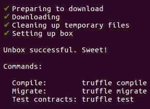

这将命令 Truffle 初始化您的目录以成为智能合约开发项目。在该项目目录中开发智能合约时，有几个目录可供您使用：

```py
$ ls
contracts migrations test truffle-config.js
```

通常，您会将智能合约的源代码合并到`contracts`文件夹中。`migrations`文件夹包含用于部署智能合约的文件，`test`文件夹包含`test`文件。您可以在`truffle-config.js`文件中配置智能合约部署设置。我们将使用以下代码创建第一个智能合约并将其命名为`donation.sol`：

```py
pragma solidity ⁰.5.0;

contract Donation {
  address public donatur;
  address payable donatee;
  uint public money;
  string public useless_variable;

  constructor() public {
    donatee = msg.sender;
    useless_variable = "Donation string";
  }

  function change_useless_variable(string memory param) public {
    useless_variable = param;
  }

  function donate() public payable {
    donatur = msg.sender;
    money = msg.value;
  }

  function receive_donation() public {
    donatee.transfer(address(this).balance);
  }
}
```

如果您是智能合约的新手，前面的示例中可能会有一些陌生的关键字。在本章中，我们不打算讨论与 Solidity 有关的所有内容。相反，我们只会研究构建智能合约和学习智能合约概念所必需的 Solidity 功能。

但首先，让我们将这个用 Solidity 编写的智能合约编译成以太坊字节码和**应用程序二进制接口**（**abi**）。为此，我们将在 Truffle 项目目录中运行以下命令：

```py
$ truffle compile
```

编译的结果可以在`build/contracts`文件夹中看到，名为`Donation.json`：

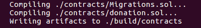

如果您打开该文件，您会看到许多有趣的东西。这个`.json`文件有 1530 行长。此文件中的`json`对象有 14 个键。您现在只需要考虑两个键。第一个是接口（称为**abi**），第二个是可以在以太坊虚拟机上执行的二进制文件（称为`bytecode`）。有关本节中代码的代码文件，请参考以下 GitLab 链接：[`gitlab.com/arjunaskykok/hands-on-blockchain-for-python-developers/blob/master/chapter_02/my_first_smart_contract/build/contracts/Donation.json`](https://gitlab.com/arjunaskykok/hands-on-blockchain-for-python-developers/blob/master/chapter_02/my_first_smart_contract/build/contracts/Donation.json)。

我们无法像编译 C 代码并直接执行二进制文件时那样运行此二进制文件。我们需要将此二进制文件放入以太坊虚拟机中。接口本身是我们在开发去中心化应用程序时以后与智能合约进行交互所需的。当您将智能合约部署到以太坊区块链时，您需要字节码。当您想要与已在以太坊区块链上部署的智能合约进行交互时，您需要`abi`接口。

# 将智能合约部署到以太坊区块链

以下是使用 Truffle 将智能合约部署到以太坊区块链的步骤：

1.  编写迁移脚本：要部署您的智能合约，您需要编写一个迁移文件。创建一个名为`migrations/2_deploy_donation.js`的新文件。然后，我们用以下脚本填充这个文件：

```py
var Donation = artifacts.require("./Donation.sol");

module.exports = function(deployer) {
  deployer.deploy(Donation);
};
```

至于`migrations/1_initial_migration.js`和`contracts/Migrations.sol`文件，我们暂时保持它们不变。Truffle 需要这些文件才能部署智能合约。

1.  启动 Ganache（以太坊开发的区块链）：现在您需要启动 Ganache。假设您已经获得了适当的权限，运行以下命令行来执行文件：

```py
./ganache-1.2.3-x86_64.AppImage
```

如下截图所示，您有多个帐户，每个帐户的余额为 100 以太币：

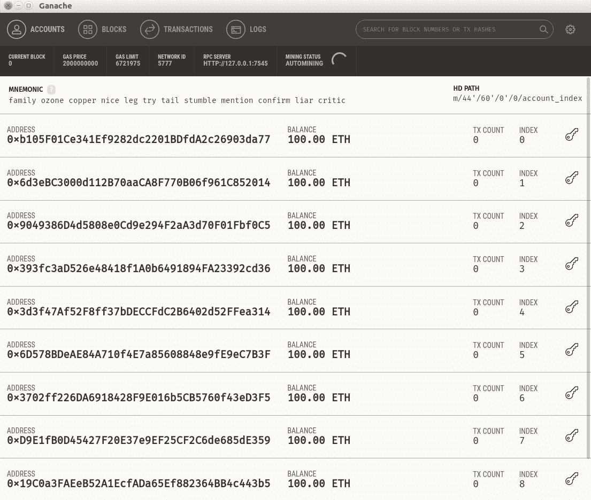

从 Ganache 屏幕上您会注意到的一件事是**RPC SERVER**，它位于`http://127.0.0.1:7545`。这是您的以太坊区块链位于`Truffle`项目目录中的地方。

1.  编辑 Truffle 配置文件：如果您打开`truffle-config.js`文件，在删除注释行后，代码将如下所示：

```py
module.exports = {
  networks: {
  },
  mocha: {
  },
  compilers: {
    solc: {
    }
  }
};
```

清除它，并将以下代码添加到`truffle-config.js`文件中：

```py
module.exports = {
  networks: {
    "development": {
      network_id: 5777,
      host: "localhost",
      port: 7545
    },
  }
};
```

`host`和`port`是从 Ganache 屏幕上的 RPC 服务器中获取的，`network_id`是从 Ganache 屏幕上的 Network ID 中获取的。

1.  执行迁移脚本：要部署您的智能合约，您可以按照以下方式执行它：

```py
$ truffle migrate
```

Truffle 框架将获取您在`Donation.json`文件中定义的字节码，并将其发送到以太坊区块链或 Ganache。这将为您提供以下输出：

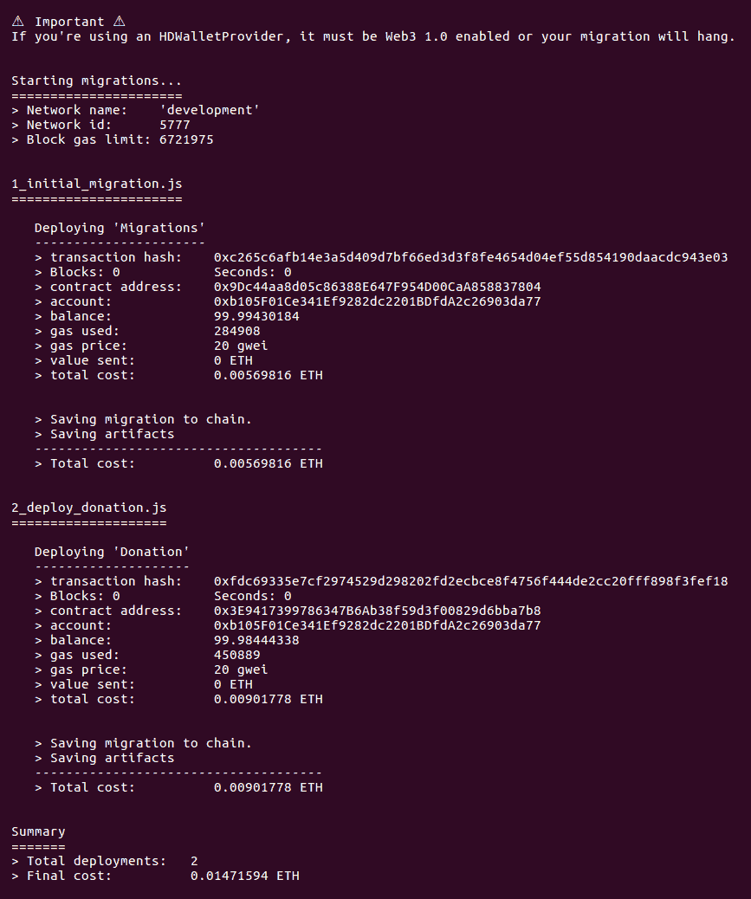

在`2_deploy_donation.js`部分，注意单词`contract address:`后面的十六进制数字，即`0x3e9417399786347b6ab38f59d3f00829d6bba7b8`。这是智能合约的地址，类似于 Web 应用程序的 URL。

如果您尝试部署智能合约时输出了`Network is up to date.`，您可以删除`build/contracts`目录中的文件，并使用`truffle migrate`命令运行这个版本：

```py
$ truffle migrate --reset
```

现在，让我们来看看 Ganache 屏幕上的变化：

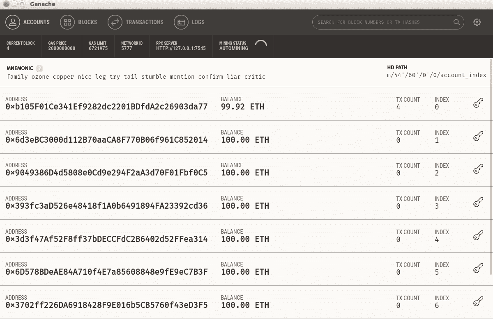

最重要的一点是，第一个帐户`0xb105F01Ce341Ef9282dc2201BDfdA2c26903da77`失去了钱。余额不再是 100 ETH，而是`**99.98 ETH**`。那么 0.02 ETH 去哪了？矿工需要有动力才能将您的智能合约写入以太坊区块链。请注意，当前区块不再是 0，而是 4。因此，0.02 ETH 将是成功将包含您的智能合约的区块放入区块链的矿工的费用。但是，在这种情况下，当然没有矿工，因为我们使用的是以太坊开发区块链 Ganache。Ganache 只是通过将智能合约纳入区块链来模拟交易费用。

如果您点击“TRANSACTIONS”选项卡，您将看到类似于这样的内容：

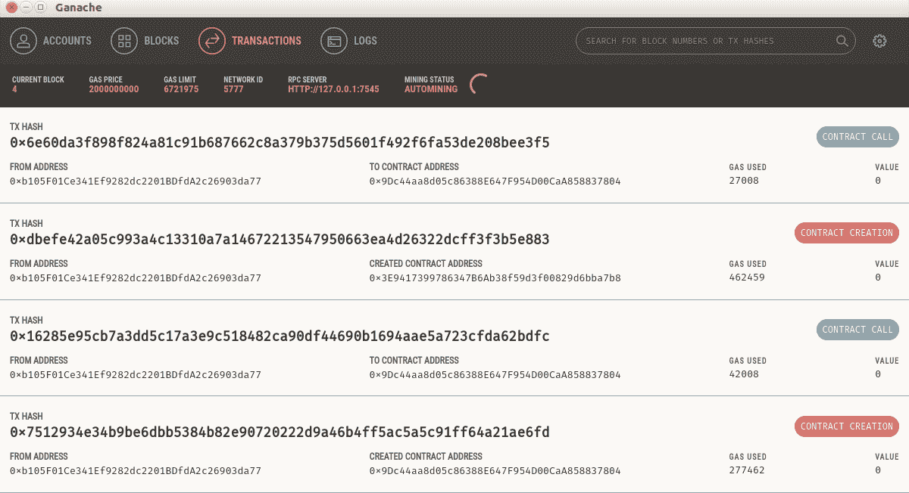

您现在已经创建了两个合约（Donation 和 Migrations）。一旦部署了智能合约，除非您应用了关闭它的方法，否则它将永远存在于区块链中。如果您的智能合约中有错误，您无法修补它。您必须在不同的地址部署一个修复后的智能合约。

# 与智能合约交互

要与驻留在以太坊区块链中的智能合约进行交互，在您的`Truffle`项目目录中执行以下命令：

```py
$ truffle console
```

然后，在`truffle`控制台提示符中，执行以下命令：

```py
truffle(development)> Donation.deployed().then(function(instance) { return instance.useless_variable.call(); });
'Donation string'
```

如果您对`then`感到困惑，Truffle 控制台使用回调的概念，通过它执行访问智能合约对象是异步执行的。在 Truffle 控制台中，此语句在回调被执行之前立即返回。在回调函数中，您将接受智能合约实例作为`instance`参数。然后，我们可以从这个`instance`参数中访问我们的`useless_variable`变量。然后，要检索值，我们必须在该变量上执行`call`方法。

Truffle 框架将使用`Donation.json`文件中定义的**abi**来了解您的智能合约中有哪些接口可用。请记住，在您的智能合约中定义了`useless_variable`并将其设置为构造函数（或初始化）函数中的`Donation string`。以这种方式读取公共变量是免费的；因为它存储在区块链中，所以不需要任何以太币。

让我提醒您，如果变量存储在区块链中意味着什么。如果您将此智能合约纳入以太坊生产区块链，`useless_variable`变量将存储在每个以太坊节点中。在撰写本文时，大约有 10,000 个节点。这个数字会不断变化，可以在这里看到：[`www.ethernodes.org`](https://www.ethernodes.org)。一个节点可以在一台计算机上，一台计算机可以容纳几个节点。但是，一台计算机很可能只持有一个节点，因为成为节点主机的要求非常高。如果您想与区块链交互，就需要一个节点（也有其他选项，例如使用 API 与他人的节点进行交互）。因此，免费读取`useless_variable`变量，因为您只是从自己的计算机上读取它。

如果您对这个免费概念感到困惑，让我们通过将`useless_variable`变量更改为其他内容来使其更清晰：

```py
truffle(development)> Donation.deployed().then(function(instance) { return instance.change_useless_variable("sky is blue", {from: "0xb105F01Ce341Ef9282dc2201BDfdA2c26903da77" }); });
```

您将获得以下输出：

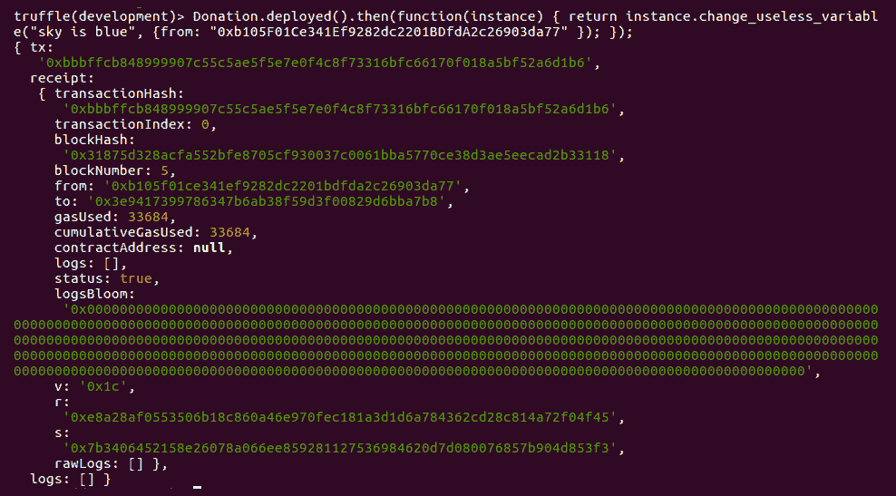

在单词`from`后面还有另一个神秘的十六进制数字，即`0xb105F01Ce341Ef9282dc2201BDfdA2c26903da77`。这是 Ganache 中第一个账户的公共地址。您可以通过查看 Ganache 屏幕来确认。在这里，您读取`useless_variable`变量的方式有所不同，并且使用不同的内容进行设置。更改变量的内容需要不同的语法，更重要的是需要一个要使用的账户。需要账户是因为在区块链中更改变量时需要花一些钱。当您在以太坊生产区块链中的智能合约中更改`useless_variable`变量的值时，基本上是向以太坊生产区块链中的所有以太坊节点广播，该区块链中有大约 10,000 个可用于更新`useless_variable`内容的节点。我们正在使用 Ganache，这是以太坊开发区块链，但在生产环境中，您需要使用私钥签署交易以更改变量的内容。私钥的作用类似于账户上的密码，但私钥无法更改，而您可以随意更新密码。如果您忘记密码，可以重置密码并单击确认电子邮件中的链接进行更新。在区块链中，这是不可能的。

如果您现在检查 Ganache，您的余额保持不变；只有区块编号从 4 增加到 5：

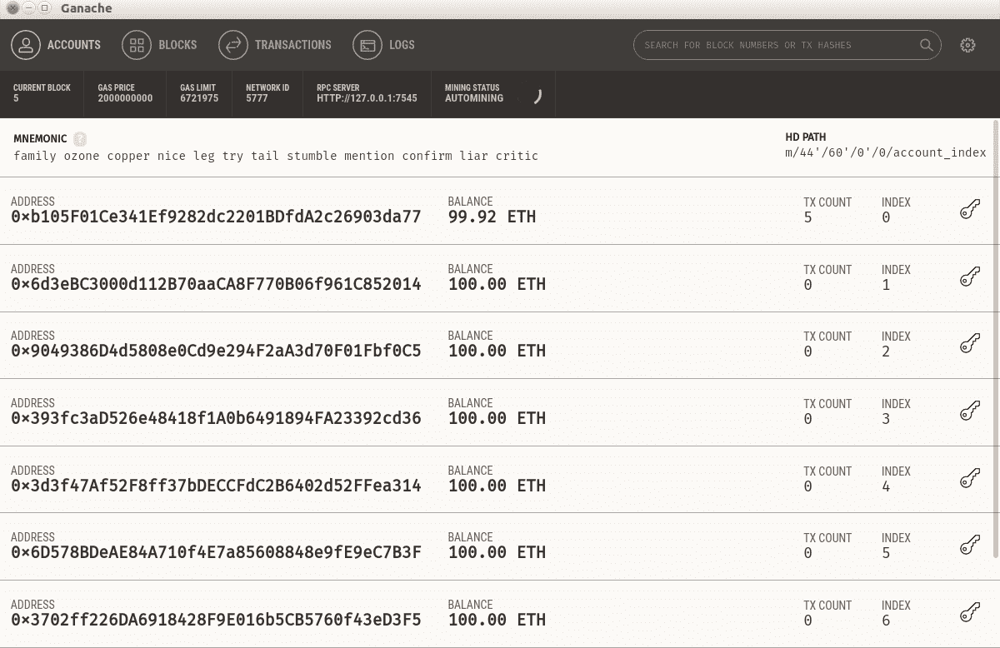

这是因为所需的金额非常小。您可以在执行最后一个命令后查看更改`useless_variable`值的输出。查看使用的燃气字段；这是在智能合约中执行函数时所花费的。使用的燃气量为 33684，但这是以 gwei 计算的，而不是以以太计算的。1 以太等于 1,000,000,000 gwei，因此大约为 0.00003 以太。在这种情况下，燃气是自动计算的，但以后，您可以设置在以太坊区块链中执行任何函数时要分配多少燃气。如果您没有贡献太多以太，并且分配的燃气量很小，那么您的执行很有可能会被赋予较低的优先级。交易确认所需的时间会更长（意味着变量的值已经被更改）。如果网络遇到大量交通，它可能会被矿工拒绝。

花钱改变程序状态的概念是新的。从区块链中读取所有内容是免费的，因为所有数据都在您的计算机上（如果您有以太坊节点），但是要更改或添加区块链中的内容需要花钱。这是因为您更改了全球各地的所有以太坊节点中的数据，这是昂贵的！除了更改智能合约的状态外，内存中运行的计算也需要花钱。

# 向智能合约发送以太币

现在，让我们向智能合约发送一些以太币。让我们使用第二个帐户。第二个帐户希望使用智能合约捐赠 5 个以太币，如下所示：

```py
truffle(development)> Donation.deployed().then(function(instance) { return instance.donate({ from: "0x6d3eBC3000d112B70aaCA8F770B06f961C852014", value: 5000000000000000000 }); });
```

您将获得以下输出：

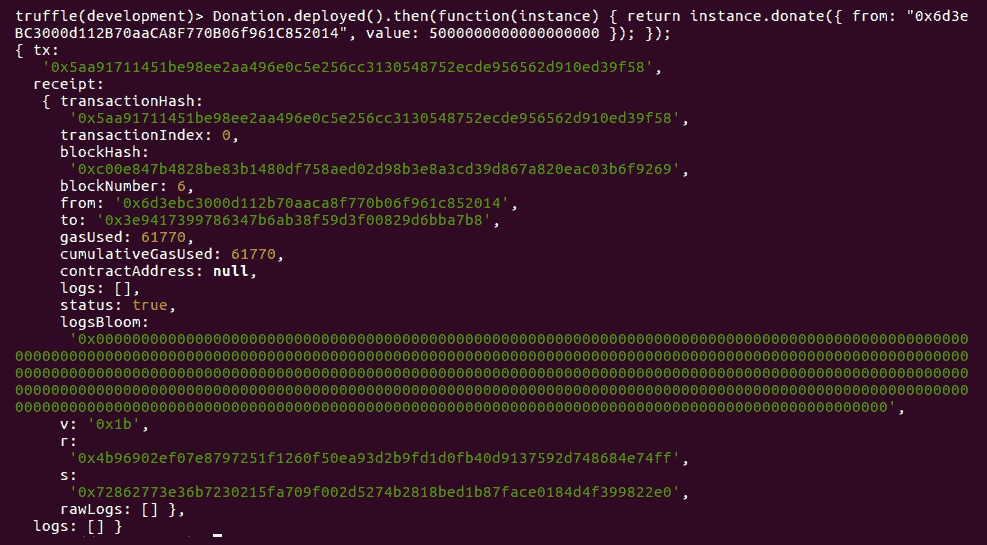

除了`from`字段外，您还需要添加一个`value`字段。在这个`value`字段中，您输入要发送到智能合约的金额。您可能会想知道为什么这个数字有这么多个零。在以太坊区块链中转移资金时，您必须使用最低的货币单位（类似于从美元转换为美分），这称为**wei**。1 以太是 1,000,000,000,000,000,000 wei（18 个零）。您想发送 5 个以太，使其为 5,000,000,000,000,000,000。现在，如果您查看 Ganache 屏幕，您会注意到余额下降到 95 个以太。因此，5 个以太现在存储在智能合约中，如下截图所示：


让我们使用第一个帐户提取这笔款项：

```py
truffle(development)> Donation.deployed().then(function(instance) { return instance.receive_donation({ from: "0xb105F01Ce341Ef9282dc2201BDfdA2c26903da77" }); });
```

您将获得以下输出：

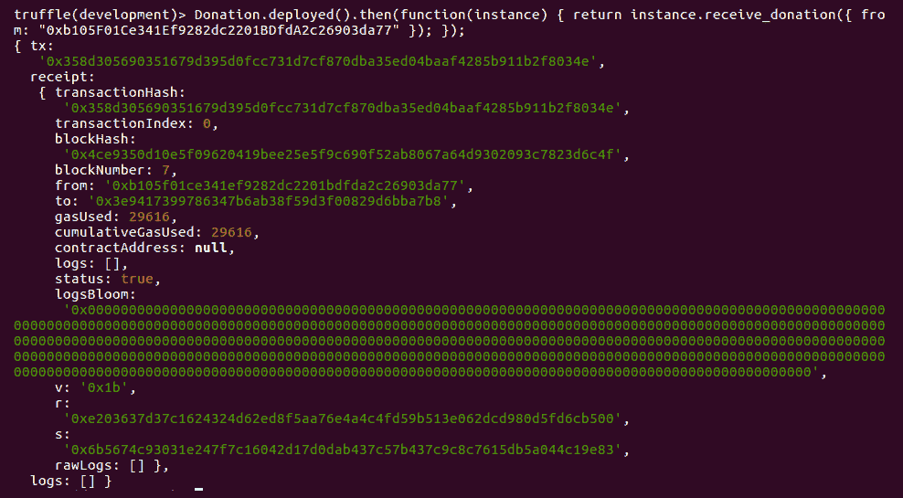

这个执行与以前的语法相同，减去了`value`字段。现在看一下 Ganache 屏幕。第一个帐户有 104 到 105 个以太币（例如 104.8 或 104.9 个以太币）。不是 105 个以太币，因为我们已经在使用第一个帐户启动智能合约时支出了一些钱，并且在执行智能合约中的一些功能时支付了交易费用：

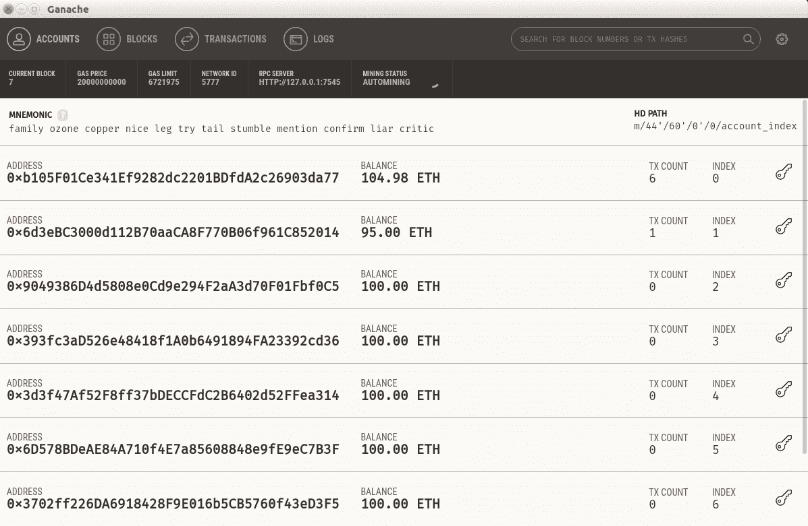

# 为什么智能合约？

您现在已经看到了智能合约的运行。那么这一切是怎么回事？智能合约能做什么传统程序（普通 Web 应用程序）做不到的？当涉及到更改网络上的程序变量的值时，我们可以使用远程过程调用。更常见的是，我们可以将变量存储在数据库中，人们可以从 Web 应用程序中更改数据库中的值。在发送资金时，我们可以将我们的 Web 应用程序与 Stripe 或 PayPal 集成，从而使我们能够发送资金。或者，您可以创建一个用于存储数字货币的数据库表。以太坊中的以太币基本上是数字货币。实际上，普通的 Web 应用程序可以做任何智能合约可以做的事情，但速度更快，成本更低。区块链解决方案的关键区别在于可以无需信任。这意味着您可以信任程序本身，而不是操作员。

在正常的 Web 应用程序中，我们依靠对 Web 应用程序的运营者（开发者或系统管理员）的信任。我们希望他们诚实地开发和部署 Web 应用程序。作为 Web 应用程序的用户，我们无法确保 Web 应用程序是否真的做到了它告诉大家它正在尝试做的事情。

假设我们有一个托管视频的 Web 应用程序（例如 YouTube 或 Vimeo）。如果用户点击“喜欢”按钮，Web 应用程序可以增加视频的喜欢数。规则是用户只能给视频点赞一次。因此，你期望包含 400 个喜欢的视频有 400 个点赞的用户。如果我告诉你，在幕后，系统管理员可以人为地增加喜欢数呢？这意味着在 400 个喜欢中，可能只有 300 个来自真实用户，另外 100 个是系统管理员人为增加的。这并不一定是直接更新数据库中的表，例如通过`UPDATE video_likes SET likes_amount = 400 WHERE video_id = 5;`。增加喜欢数的方式可能被嵌入在系统内部。

普通用户可能不会注意到这一点。Web 应用程序的公司可以在 GitHub 上发布源代码。但是，如何确保 Web 应用程序确实是从 GitHub 托管的源代码构建的呢？如果在部署 Web 应用程序后，系统管理员或开发者对系统进行了修补怎么办？

有许多方法可以防止这种数字作弊。首先，我们可以引入 IT 审计员。他们可以来自政府或非政府组织。他们将审计系统的源代码，更重要的是，检查代码在生产系统中的运行情况。在这种情况下，你将把你的信任从开发者或系统管理员转移到第三方审计员。

作为一名 IT 顾问，我通过构建 Web 应用程序和移动应用程序谋生。我曾遇到一个潜在客户，他想要制作一份数字报纸（类似于《卫报》或《纽约时报》）。这位客户问我是否有办法将任何文章移动到最受欢迎的文章部分。这样做的动机是为了推广特定文章，即使这意味着系统会向用户撒谎关于最常被浏览的文章是什么。

Reddit 的 CEO 最近因在网站上修改关于他的评论而发表了公开道歉。更多信息请参阅以下链接：[`techcrunch.com/2016/11/23/reddit-huffman-trump/`](https://techcrunch.com/2016/11/23/reddit-huffman-trump/)。

即使是知名的网站也会玩数字作弊。例如，一些加密货币交易所伪造交易量。更多信息请参阅以下链接：[`medium.com/@sylvainartplayribes/chasing-fake-volume-a-crypto-plague-ea1a3c1e0b5e`](https://medium.com/@sylvainartplayribes/chasing-fake-volume-a-crypto-plague-ea1a3c1e0b5e)。

智能合约是防止数字作弊的另一种方式。智能合约的开发者可以发布源代码并将智能合约部署到以太坊区块链中。人们可以验证发布的源代码和部署的智能合约是否一致。开发者可以在智能合约中创建欺骗的方法，但用户可以从区块链中智能合约的字节码重构智能合约的源代码，从而发现这种行为。开发者无法修补已经部署的智能合约。

还有其他智能合约属性，比如自治和抗审查。然而，没有任何属性能比得上它的透明性。或者说，你必须拥有比所有 10,000 个节点一起工作更强大的力量来保护以太坊系统的可信度。简单来说，你需要购买超过 5,000 台配备高端 GPU 的计算机。假设你有这么多资源来作弊。当你在以太坊系统中作弊时，诚实的矿工会在互联网上发出警报。因此，如果你有作弊的手段，你无法偷偷摸摸地做。此外，如果你有手段获得 5,000 台配备高端 GPU 的计算机，你可以成为以太坊平台上的矿工并获得丰厚的收入。因此，在以太坊平台上作弊是非常困难的。

# 总结

在这一章中，我们探讨了如何安装 Solidity 开发工具：Node.js，Truffle 或 Ganache。然后我们学习了如何编写智能合约并对其进行编译。之后，我们看了一下将智能合约部署到以太坊区块链的概念，然后使用 Truffle 控制台工具与已部署的智能合约进行交互。我们对向智能合约发送以太币以及在执行智能合约中的功能时的燃气使用概念有了了解。在最后一步，我们熟悉了为什么智能概念如此成功，具有创建一个无法绕过的、透明的程序的潜力。

在下一章中，我们将学习如何使用 Vyper 实现智能合约。

# 进一步阅读

以太坊黄皮书：[`ethereum.github.io/yellowpaper/paper.pdf`](https://ethereum.github.io/yellowpaper/paper.pdf)

以太坊白皮书：[`github.com/ethereum/wiki/wiki/White-Paper`](https://github.com/ethereum/wiki/wiki/White-Paper)
