# 第三章：使用 Vyper 实现智能合约

许多学习如何编写智能合约的程序员会学习 Solidity 编程语言。有丰富的在线教程和书籍可以教你 Solidity。与 Truffle 框架结合使用，Solidity 形成了一个开发智能合约的绝佳组合。几乎所有存在于以太坊区块链上的智能合约都是用 Solidity 编程语言编写的。

在本章中，我们将探讨如何编写智能合约。但我们不会使用 Solidity 编程语言。相反，我们将使用 Vyper 编程语言。

本章将涵盖以下主题：

+   Vyper 背后的动机

+   安装 Vyper

+   使用 Vyper 创建智能合约

+   将智能合约部署到 Ganache

+   深入了解 Vyper

+   与其他智能合约互动

+   以编程方式编译代码

+   其他技巧

# Vyper 背后的动机

编写智能合约与开发普通的 Web 应用程序是不同的。在开发普通的 Web 应用程序时，座右铭是“快速移动，打破事物”。开发 Web 应用程序的速度至关重要。如果应用程序中有错误，你可以随后升级应用程序。或者，如果错误是灾难性的，你可以在线修补它或在引入修复之前将应用程序下线。有一个非常流行的词来描述开发普通 Web 应用程序的理想思维方式——敏捷。你需要灵活，以便随着需求的变化改变软件。

然而，编写智能合约需要不同的思维方式。智能合约的应用范围可以从编写金融应用程序到将火箭发射到太空。一旦部署了智能合约，要修复错误就非常困难。你不能替换智能合约，因为一旦部署了，就无法更改。如果编写一个函数来销毁智能合约，你可以销毁智能合约，但修复有问题的智能合约的唯一方法是部署一个新的智能合约，在新的地址中修复错误，然后将这种情况通知所有相关方。但你不能替换智能合约。

因此，理想的情况是在区块链上部署一个没有错误的智能合约，或者至少没有恶性错误。然而，在现实世界中发布的智能合约仍然会出现错误。

那么，智能合约中可能出现什么样的错误？第一种是会让你的资金消失的错误。比如，你正在为一个**首次代币发行**（**ICO**）编写智能合约。ICO 是通过在以太坊区块链上出售你创建的代币来积累资本。基本上，人们用以太币购买你的代币。你可以自行设置价格，例如*1 ETH = 100 YOURTOKEN*。这意味着人们如果支付给你 1 个以太币，他们将获得 100 个你的代币。

你可能引入的第一个错误是人们可以向你的智能合约发送资金（以太币），但你无法提取它（要么你忘记实现提取方法，要么提取方法有问题）。这意味着你可以检查你的智能合约余额，以太币余额可能值得 100 万美元，但它将永远被困在那里，没有人能够索取它。

另一个错误可能是您忘记保护销毁智能合约的方法。在以太坊中，您有动机从区块链中删除东西，因为存储是昂贵的。因此，如果您部署了一个智能合约，您将支付燃气费，因为您的智能合约将被保留。您可以对其进行实验，然后如果您对您的智能合约感到厌倦，您可以销毁它。为此，以太坊将返还一些燃气到您的账户。这是为了阻止垃圾邮件攻击以太坊区块链。因此，回到我们智能合约错误的案例，想象一下您在智能合约中积累了价值 100 万美元的以太币，然后有人通过访问销毁它的功能销毁了您的智能合约账户。在这种情况下，您的以太币余额也将被销毁。

最后一种错误是允许黑客窃取您的以太坊余额并将其转移到他们的账户。这可能发生在许多不同的情况下。例如，也许您忘记在提款功能中设置正确的权限，或者提款功能中的权限太开放。

当然，所有这些错误都可以追溯到程序员的错误。为了避免这些错误，一个新的工作岗位诞生了——智能合约审计员，他审计您的智能合约，以确保它没有错误。然而，以太坊的发明者 Vitalik Buterin 随后审视了工具（在这种情况下是编程语言），并想知道是否可以通过改进工具本身来缓解这种情况。这种情况的罪魁祸首是 Solidity 编程语言。Vitalik 认为 Solidity 具有一些功能是强大的，但可能会产生错误。尽管 Solidity 的开发人员有改进 Solidity 安全性的计划，但 Vitalik 希望有一些自由来尝试新的视角。Vyper 就是从这里诞生的。

假设您创建了一个具有重要功能的父类。在当前或子类中，您使用此功能而不检查其定义。也许父类是由您团队中的其他人编写的。程序员有时懒得检查其他文件中的函数定义；他们会在源代码文件中上下滚动以阅读代码，但程序员通常不会检查继承功能启用的其他文件中的代码。

另一个可能使智能合约复杂且难以阅读的 Solidity 功能是修饰符，它类似于一个预备函数。以下代码显示了修饰符在 Solidity 中的使用方式：

```py
modifier onlyBy(address _account)
{
  require(msg.sender == _account, "Sender not authorized.");
  _;
}
function withdraw() public onlyBy(owner)
{
  //withdraw money;
}
```

如果我们想使用`withdraw()`方法，智能合约将首先执行`onlyBy()`修饰符方法。使用`require`短语是为了确保调用此方法的`msg.sender`与作为参数发送的`account`变量相同。这个例子很简单。您可以一眼看完所有的代码。然而，请考虑这些函数是由许多行分隔开的，甚至在另一个文件中定义。程序员往往会忽视`onlyBy()`方法的定义。

函数重载是编程语言中最强大的功能之一。这是一个使您能够发送不同参数以获得不同函数的功能，如下面的代码所示：

```py
    function flexible_function(uint _in) public {
        other_balance = _in;
    }

    function flexible_function(uint _in, uint _in2) public {
        other_balance = _in + _in2;
    }

    function flexible_function(uint _in, uint _in2, uint _in3) public {
        other_balance = _in + _in2 - _in3;
    }
```

然而，函数重载功能可能会误导程序员，导致他们执行不同意图的函数。程序员可能只记得`flexible_function`函数是这样做的，但可能会无意中执行与`flexible_function`不同类型的函数。

因此，一些聪明的人决定，虽然所有这些功能使得创建一个非常复杂的程序成为可能，但这些功能应该被限制在开发智能合约上。也许他们从太空飞船上编写程序的人那里得到了这个想法，在那里有规定禁止使用 C++的某些功能。或者，他们可能受到了 Java 为何被创建来取代 C++的启发。在 Java 中，不可能直接操纵内存。C++的创造者 Bjarne Stroustoup 说，C++是如此强大，以至于人们可以用 C++自己打自己的脚。

这些聪明的人决定创建一种比 Solidity 更简单的新编程语言。Python 是他们的主要灵感，因为这种编程语言的语法源自 Python。这种编程语言被称为**Vyper**。在 Vyper 中，诸如继承、函数重载、修饰符等功能都被移除了。Vyper 编程语言的创造者认为，移除这些功能可以使智能合约的开发更容易。重要的是，它还使代码更易于阅读。代码的阅读远远多于编写。考虑到所有这些因素，他们希望程序员在使用 Vyper 编程语言创建智能合约时能够减少错误。

# 安装 Vyper

默认情况下，Ubuntu Xenial 安装了 Python 3.5。Vyper 需要 Python 3.6 软件，因此如果您想使用 Ubuntu Xenial，您需要首先安装 Python 3.6。较新版本的 Ubuntu，如 Bionic Beaver，将已经安装了 Python 3.6。

因此，如果您没有安装 Python 3.6 软件，您必须首先使用以下命令安装它：

```py
$ sudo apt-get install build-essential
$ sudo add-apt-repository ppa:deadsnakes/ppa
$ sudo apt-get update 
$ sudo apt-get install python3.6 python3.6-dev
```

Vyper 需要的不仅仅是 Python 3.6；您还需要安装开发文件`python3.6-dev`。然后，您可以通过以下步骤为 Python 3.6 创建一个虚拟环境：

1.  首先，您必须使用以下代码安装`virtualenv`工具：

```py
$ sudo apt-get install virtualenv
```

1.  然后，使用以下代码为 Python 3.6 创建一个虚拟环境：

```py
$ virtualenv -p python3.6 vyper-venv
```

1.  现在，按照以下方式执行虚拟环境脚本：

```py
$ source vyper-venv/bin/activate
```

1.  接下来，使用以下命令安装 Vyper：

```py
(vyper-venv) $ pip install vyper
```

1.  如果这里没有任何错误，您就可以开始了。您可以按照以下方式测试 Vyper 编译器：

```py
(vyper-venv) $ vyper --version
0.1.0b6
```

然后，您就准备好迈向下一个步骤了。

# 使用 Vyper 创建智能合约

现在让我们使用 Vyper 创建一个智能合约。首先，我们将创建一个扩展名为`.vy`的文件，并将其命名为`hello.vy`，如下所示：

```py
name: public(bytes[24])

@public
def __init__():
    self.name = "Satoshi Nakamoto"

@public
def change_name(new_name: bytes[24]):
    self.name = new_name

@public
def say_hello() -> bytes[32]:
    return concat("Hello, ", self.name)
```

如果您来自 Solidity 或 Python 背景，您会注意到一个奇特之处：在使用 Vyper 编程语言编写的智能合约中，没有类（如 Python 编程语言中）和合约（如 Solidity 编程语言中）的概念。但是，有一个`initializer`函数。`initializer`函数的名称与 Python 编程语言中的`__init__`相同。

在 Python 中，您可以在一个文件中创建任意多的类。在 Vyper 中，规则是一个文件对应一个智能合约。这里也没有类或合约；文件本身就是一个类。

这是如何编译这个`vyper`文件的：

```py
(vyper-venv) $ vyper hello.vy
```

从中，您将得到以下输出：

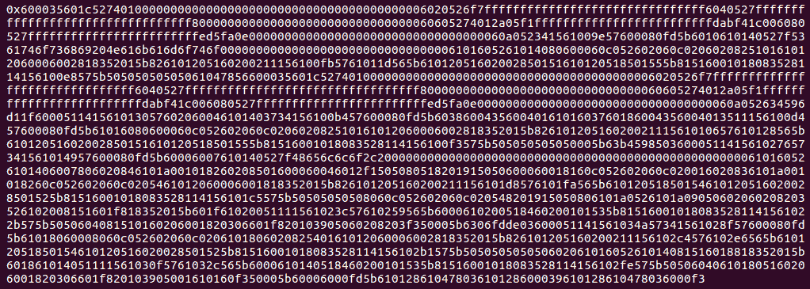

这是智能合约的字节码。请记住，要部署智能合约，您需要字节码，但要访问智能合约，您需要`abi`。那么如何获得`abi`？您可以通过运行以下命令来实现：

```py
(vyper-venv) $ vyper -f json hello.vy
```

从中，您将得到以下输出：

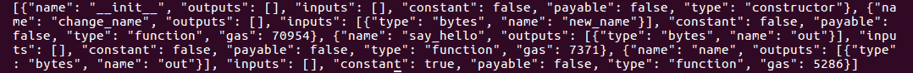

如果您想在单个编译过程中同时获得`abi`和`bytecode`，您可以在编译过程中结合这两个标志，如下所示：

```py
(vyper-venv) $ vyper -f json,bytecode hello.vy
```

这将给你以下输出：

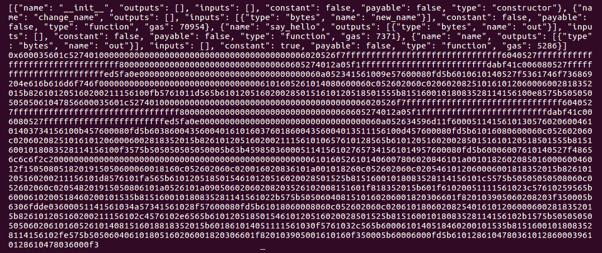

# 将智能合约部署到 Ganache

那么，如何将这个智能合约部署到以太坊区块链上呢？有几种方法可以做到这一点，但让我们使用 Truffle 的一种熟悉的方式：

1.  创建一个目录，并使用`truffle init`进行初始化，如下所示：

```py
$ mkdir hello_project
$ cd hello_project
$ truffle init
```

1.  就像您在上一章中所做的那样，将`truffle-config.js`设置为以下内容：

```py
module.exports = {
  networks: {
    "development": {
      network_id: 5777,
      host: "localhost",
      port: 7545
    },
  }
};
```

1.  创建一个`build`目录，如下所示：

```py
$ mkdir -p build/contracts
$ cd build/contracts
```

1.  然后在那里创建一个`Hello.json`文件，如下所示：

```py
{
  "abi":
  "bytecode":
}
```

1.  然后将`abi`字段填充为编译过程的`abi`或`json`输出，并将`bytecode`字段填充为编译过程的`bytecode`输出。您需要用双引号引用`bytecode`值。不要忘记在`abi`字段和`bytecode`字段之间放置逗号。这将给您类似于以下内容：

```py
{
  "abi": [{"name": "__init__", "outputs": [], "inputs": [], "constant": false, "payable": false, "type": "constructor"}, {"name": "change_name", "outputs": [], "inputs": [{"type": "bytes", "name": "new_name"}], "constant": false, "payable": false, "type": "function", "gas": 70954}, {"name": "say_hello", "outputs": [{"type": "bytes", "name": "out"}], "inputs": [], "constant": false, "payable": false, "type": "function", "gas": 8020}, {"name": "name", "outputs": [{"type": "bytes", "name": "out"}], "inputs": [], "constant": true, "payable": false, "type": "function", "gas": 5112}],
  "bytecode": "0x600035601c52740100000000000000000000000000000000000000006020526f7fffffffffffffffffffffffffffffff6040527fffffffffffffffffffffffffffffffff8000000000000000000000000000000060605274012a05f1fffffffffffffffff...
...
1600101808352811415610319575b50506020610160526040610180510160206001820306601f8201039050610160f3005b60006000fd5b61012861049703610128600039610128610497036000f3"
}
```

1.  然后，您可以创建一个迁移文件来部署这个智能合约，方法是在`migrations/2_deploy_hello.js`中创建一个新文件，如下所示：

```py
var Hello = artifacts.require("Hello");
module.exports = function(deployer) {
  deployer.deploy(Hello);
};
```

一切设置好之后，启动 Ganache！

1.  然后，在`hello_project`目录中，您可以运行迁移过程，如下所示：

```py
$ truffle migrate
```

您将看到类似于以下内容：

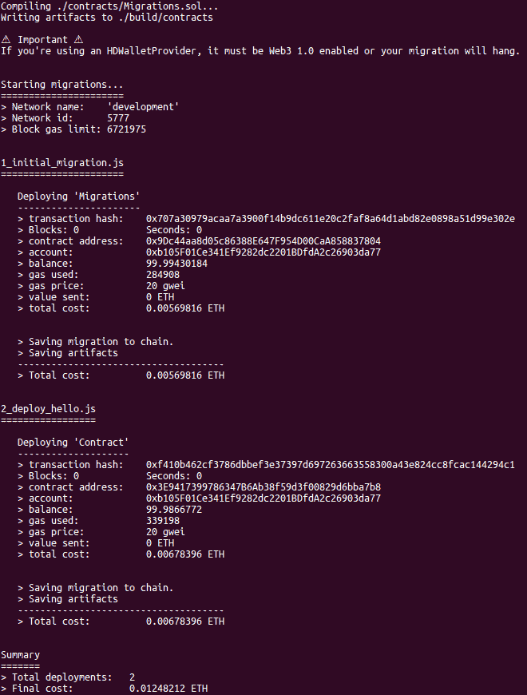

您使用 Vyper 编写的智能合约已经部署到了 Ganache。您的智能合约地址如下：

```py
0x3E9417399786347B6Ab38f59d3f00829d6bba7b8
```

# 与智能合约交互

就像之前一样，您可以使用 Truffle 控制台与您的智能合约交互，如下所示：

```py
$ truffle console
```

您的智能合约始终被赋予名称`Contract`。我们可以使用以下语句访问智能合约：

```py
truffle(development)> Contract.at("0x3E9417399786347B6Ab38f59d3f00829d6bba7b8")
```

您将得到一个长输出，其中您可以看到`abi`、`bytecode`等，如下面的截图所示：

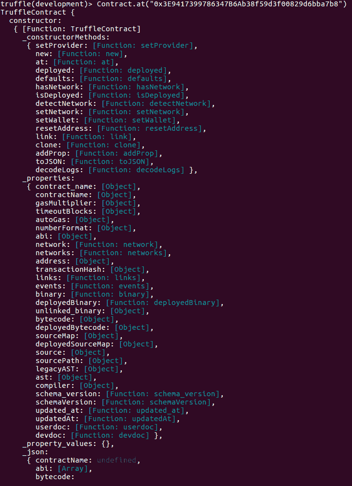

让我们使用以下语句查看智能合约的`name`变量的值：

```py
truffle(development)> Contract.at("0x3E9417399786347B6Ab38f59d3f00829d6bba7b8").then(function(instance) { return instance.name.call(); });
'0x5361746f736869204e616b616d6f746f'
```

您可能注意到，神秘的输出看起来并不像 Satoshi Nakamoto。但实际上，这确实是 Satoshi Nakamoto，只是用十六进制写的。让我们丢弃`0x`，这只是一个指示器，表明这个字符串是十六进制形式。现在您有了`5361746f736869204e616b616d6f746f`字符串。取前两个数字，即`53`，并将其转换为十进制数。在 Python 中，您可以这样做：

```py
>>> int(0x53)
83
```

因此，十进制数为`83`。您还记得 ASCII 表吗？这是一个数据表，保存了十进制数和字符之间的关系。因此，十进制数`65`代表字符 A（大写 A），十进制数`66`代表字符 B（大写 B）。

那么十进制数`83`的字符是什么？您可以使用 Python 来找出，如下所示：

```py
>>> chr(83)
'S'
```

如果您对每个十六进制字符都这样做，其中每个十六进制字符占两个数字字符，它将拼写出 Satoshi Nakamoto。

让我们使用以下代码在这个智能合约中执行另一个方法：

```py
truffle(development)> Contract.at("0x3E9417399786347B6Ab38f59d3f00829d6bba7b8").then(function(instance) { return instance.say_hello.call(); })
'0x48656c6c6f2c205361746f736869204e616b616d6f746f'
```

那个神秘的输出只是`Hello, Satoshi Nakamoto`。

让我们按照以下方式更改名称：

```py
truffle(development)> Contract.at("0x3E9417399786347B6Ab38f59d3f00829d6bba7b8").then(function(instance) { return instance.change_name(web3.utils.fromAscii("Vitalik Buterin"), { from: "0x6d3eBC3000d112B70aaCA8F770B06f961C852014" }); });
```

您将得到以下输出：

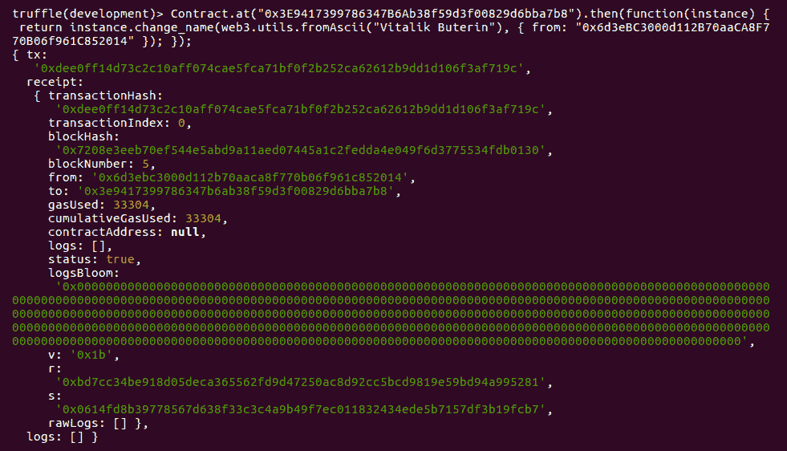

`from`字段中的值来自 Ganache 中的一个账户。您可以查看 Ganache 窗口并选择任何您喜欢的账户。

我们不能直接将字符串发送到`change_name`方法；我们必须首先使用`web3.utils.fromAscii`方法将其转换为十六进制字符串。

现在名称已经更改了吗？让我们找出来。运行以下命令：

```py
truffle(development)> Contract.at("0x3E9417399786347B6Ab38f59d3f00829d6bba7b8").then(function(instance) { return instance.name.call(); });
'0x566974616c696b204275746572696e'
```

是的，名称已经更改了。如果您将该十六进制字符串转换为 ASCII 字符串，您将得到 Vitalik Buterin。

# 深入了解 Vyper

让我们来看看我们的智能合约：

```py
name: public(bytes[24])

@public
def __init__():
    self.name = "Satoshi Nakamoto"

@public
def change_name(new_name: bytes[24]):
    self.name = new_name

@public
def say_hello() -> bytes[32]:
    return concat("Hello, ", self.name)
```

看一下第一行：

```py
name: public(bytes[24])
```

字节数组基本上就是一个字符串。名为`name`的变量具有`bytes`或`string`数组类型。它的可见性是`public`。如果要将其设置为`private`，只需省略 public 关键字，如下所示：

```py
name: bytes[24]
```

现在，看一下接下来的几行：

```py
@public
def __init__():
    self.name = “Satoshi Nakamoto”
```

如果您来自 Python 背景，那么您将认识到 Python 装饰器函数。Vyper 中有四个这样的函数：

+   `@public`表示您可以像用户一样执行此方法（就像在上一章中的 Truffle 控制台中一样）。

+   `@private`表示只有相同智能合约内的其他方法才能访问此方法。您不能作为用户（在 Truffle 控制台中）调用该方法。

+   `@payable`表示您可以向此方法发送一些以太币。

+   `@const`表示此方法不应更改智能合约的状态。这意味着执行此方法不会花费以太币。这就像读取公共变量的值。

回到`__init__()`方法，您可以像这样向该方法传递参数：

```py
i: public(uint256)

@public
def __init__(int_param: uint256):
    self.i = int_param
```

在部署智能合约时不要忘记发送参数。在我们的情况下，我们在 Truffle 软件中使用迁移，因此修改您的迁移文件`2_deploy_hello.js`如下：

```py
var Hello = artifacts.require("Hello");
module.exports = function(deployer) {
    deployer.deploy(Hello, 4);
};
```

让我们继续阅读智能合约的以下行，以了解`public`方法：

```py
@public
def change_name(new_name: bytes[24]):
    self.name = new_name
```

此方法修改了智能合约的状态，即`name`变量。这将产生燃气。

让我们继续阅读智能合约的下一行，以了解在`public`方法中返回值的情况：

```py
@public
def say_hello() -> bytes[32]:
    return concat("Hello, ", self.name)
```

`concat`是一个内置函数，用于组合字符串。请参考[`vyper.readthedocs.io/en/latest/built-in-functions.html`](https://vyper.readthedocs.io/en/latest/built-in-functions.html)获取完整的内置函数列表。

您必须小心方法的返回值，该值由右箭头（→）指示。例如，看一下以下代码：

```py
@public
def say_hello() -> bytes[28]:
    return concat("Hello, ", self.name)
```

在这种情况下，尽管“Hello，Satoshi Nakamoto”肯定少于 28 个字符，但它在编译时会失败。该字符串的长度为 23 个字符；但是，您必须记住`self.name`被定义为`bytes[24]`，而`Hello，`的长度为 7 个字符。因为 24 + 7 是 31 个字符，所以您必须将其设置为更大的数组。

由于此方法不会更改此智能合约的状态，因此您可以在此方法的顶部添加`@const`，如下所示：

```py
@public
@const
def say_hello() -> bytes[32]:
    return concat("Hello, ", self.name)
```

# 数据类型

让我们创建一个更复杂的智能合约，并将其命名为`donation.vy`，如下所示。您可以参考以下 GitLab 链接获取完整代码：[`gitlab.com/arjunaskykok/hands-on-blockchain-for-python-developers/blob/master/chapter_03/donation.vy`](https://gitlab.com/arjunaskykok/hands-on-blockchain-for-python-developers/blob/master/chapter_03/donation.vy)：

```py
struct DonaturDetail:
    sum: uint256(wei)
    name: bytes[100]
    time: timestamp

donatur_details: public(map(address, DonaturDetail))

...
...

@public
def withdraw_donation():
    assert msg.sender == self.donatee

    send(self.donatee, self.balance)
```

像以前一样编译和部署智能合约。不要忘记删除`build/contracts`目录中的所有文件，并且如果您重用项目目录，则重新启动您的 Ganache。

请看以下行：

```py
struct DonaturDetail:
    sum: uint256(wei)
    name: bytes[100]
    time: timestamp
```

让我们逐一讨论 Vyper 数据类型：

+   **结构**：第一个称为结构。Vyper 中的结构就像另一种编程语言中的结构一样；它是不同数据类型的容器。您可以按以下方式访问其成员：

```py
DonaturDetail.name = "marie curie"
```

+   **Wei**：我们要了解的第二个数据类型是`uint256(wei)`。这指的是可以持有的特定以太币金额。正如您所知，1 个以太币等于 1,000,000,000,000,000,000 wei（18 个零）。为了持有如此大的金额，需要特定的数据类型。

+   **时间戳**：第三个数据类型是`timestamp`数据类型。这是设计用来保存时间值的。

+   **地址**：第四个是地址数据类型。这是设计用来保存地址值（例如`0xdCad3a6d3569DF655070DEd06cb7A1b2Ccd1D3AF`）。这可以是帐户或智能合约的地址。如果您想知道地址数据类型是什么样子，可以查看下面的 Ganache 截图。帐户地址是地址数据类型的示例。您可以向具有此数据类型的变量发送以太币：

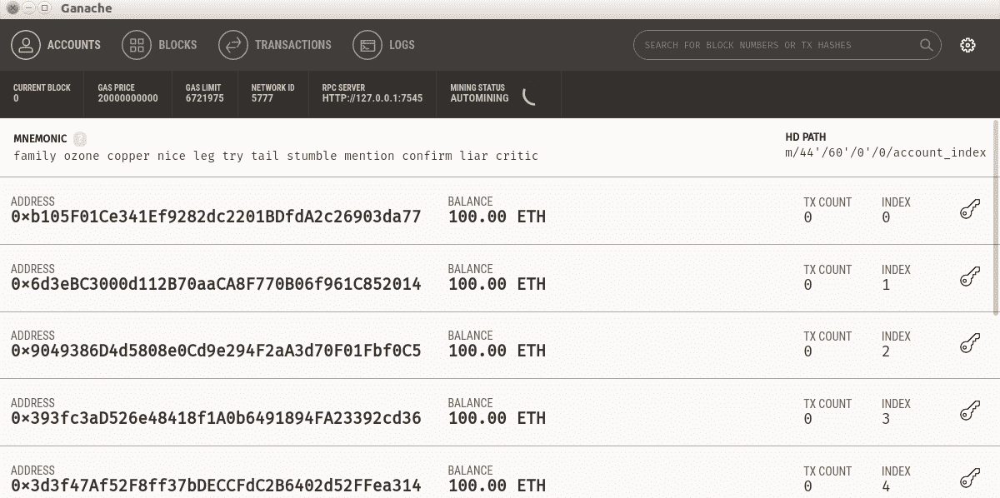

+   **映射**：第五个是`map`数据类型。这就像一个字典。一个简单的映射看起来是这样的：

```py
simple_map: map(address, uint256)
```

在这里，键是`address`，值是`uint256`。这是如何向这个映射填充值的：

```py
self.simple_map[0x9049386D4d5808e0Cd9e294F2aA3d70F01Fbf0C5] = 10
```

如果你习惯了 Python 中的字典数据类型，那么对于这种映射数据类型，有一个小技巧：你不能迭代这个映射。所以，不要期望像在 Python 中使用`dictionary`数据类型的变量那样在 Vyper 中迭代映射数据类型的变量。你可以通过查看以下代码来了解它是如何工作的：

```py
for key in self.simple_map:
    // do something with self.simple_map[key]
```

**以太坊虚拟机**（**EVM**）不会跟踪具有映射数据类型的变量的所有键。在 Python 中，你可以从具有字典数据类型的变量中获取所有键，如下面的代码所示：

```py
self.simple_map.keys()
```

但是在 Vyper 中你不能这样做。

如果你访问一个不存在的键，它会返回值数据类型的默认值。在我们的例子中，如果我们做类似这样的操作，我们会得到`0`，如下面的代码所示：

```py
self.simple_map[0x1111111111111111111111111111111111111111] => 0
```

如果你从来没有为`0x1111111111111111111111111111111111111111`键设置值，或者设置为`0`，都没有关系。如果你想要跟踪这些键，你需要将它们保存在一个单独的数组中。映射数据类型就像 Python 中的默认字典，如下面的代码所示：

```py
>>> from collections import defaultdict
>>> d = defaultdict(lambda: 0, {})
>>> d['a']
0
>>> d['a'] = 0
>>> d['a']
0
```

所以，回到我们第二个定义的变量，让我们看一下下面的代码：

```py
donatur_details: public(map(address, DonaturDetail))
```

这段代码展示了一个地址到包含`wei`、`string`和`timestamp`数据类型的结构体的映射。我们想要用这种数据类型记录捐赠者的姓名、捐赠金额和捐赠时间。

+   **数组**：第五种数据类型是数组数据类型，它没有无限大小。数组的大小必须在开始时设置。

看一下这些行：

```py
donaturs: public(address[10])
```

这是一个包含 10 个地址的数组。

让我们看一下下面的行，学习如何在智能合约中保留所有者的账户：

```py
donatee: public(address)
```

+   **整数**：第六种数据类型是整数。它类似于`uint256`或`int128`。请注意，`uint256`和`uint256(wei)`是不同的。`int128`和`uint256`之间的区别在于`int128`数据类型可以保存零、正数和负数。`uint256`数据类型只能保存零和正数，但它的上限比`int128`更高。

下面的代码将保存启动这个智能合约的人的地址：

```py
index: int128
```

这是为了跟踪有多少捐赠者捐赠了。请注意，它没有一个公共修饰符。这意味着你不能从 Truffle 控制台访问这个变量。

让我们来看一下`__init__()`方法：

```py
@public
def __init__():
    self.donatee = msg.sender
```

在每个方法中，都有一些特殊的对象。其中之一是`msg`。你可以通过`msg.sender`访问访问该方法的账户。你还可以通过`msg.value`找到以`wei`为单位的以太币的数量。在下面的代码中，我们想要保存这个智能合约的启动者的地址：

```py
@payable
@public
def donate(name: bytes[100]):
    assert msg.value >= as_wei_value(1, "ether")
    assert self.index < 10

    self.donatur_details[msg.sender] = DonaturDetail({
                                         sum: msg.value,
                                         name: name,
                                         time: block.timestamp
                                       })

    self.donaturs[self.index] = msg.sender
    self.index += 1
```

在这里，`@payable`表示这个方法接受以太币支付。`assert`短语类似于 Python 编程语言中的`assert`。如果条件为`false`，那么方法的执行将被中止。在`assert`行之后，我们只是将`self.donatur_details`映射设置为一个`DonaturDetail`结构体，键为`msg.sender`。在结构体内部，你可以使用`block.timestamp`设置时间属性，表示当前时间。`as_wei_value`短语是一个内置函数。由于在这个智能合约中我们必须使用 wei 单位处理以太支付，使用这个内置函数是一个好主意。否则，你必须使用很多零，如下所示：

```py
assert msg.value >= 1000000000000000000
```

# 提取以太币

智能合约的最后几行将是一个提取捐款到`donatee`账户的方法，如下面的代码所示：

```py
@public
def withdraw_donation():
    assert msg.sender == self.donatee

    send(self.donatee, self.balance)
```

在这里，`self.balance`代表了在这个智能合约中累积的所有以太币。`send`短语是一个内置函数，用于将钱转移到第一个参数，也就是`donatee`。

所以让我们在 Truffle 控制台中测试这个智能合约。确保你将方法中的地址更改为你的智能合约的地址。你可以使用 `truffle migrate` 命令获取它，如下所示：

```py
truffle(development)> Contract.at("0x3E9417399786347B6Ab38f59d3f00829d6bba7b8").then(function(instance) { return instance.donatee.call(); });
'0xb105f01ce341ef9282dc2201bdfda2c26903da77'
```

这是 Ganache 中的第一个账户，如下面的截图所示：

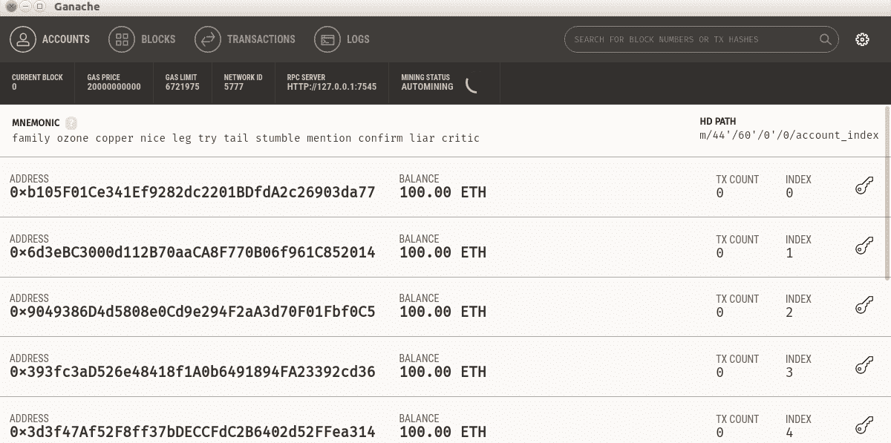

让我们从 Ganache 中的第二个账户捐赠 2 个以太币，如下所示：

```py
truffle(development)> Contract.at("0x3E9417399786347B6Ab38f59d3f00829d6bba7b8").then(function(instance) { return instance.donate(web3.utils.fromAscii("lionel messi"), {from: "0x6d3eBC3000d112B70aaCA8F770B06f961C852014", value: 2000000000000000000}); });
```

现在从 Ganache 中的第三个账户捐赠 3.5 个以太币，如下所示：

```py
truffle(development)> Contract.at("0x3E9417399786347B6Ab38f59d3f00829d6bba7b8").then(function(instance) { return instance.donate(web3.utils.fromAscii("taylor swift"), {from: "0x9049386D4d5808e0Cd9e294F2aA3d70F01Fbf0C5", value: 3500000000000000000}); });
```

现在用以下代码查看捐赠者的捐赠情况：

```py
truffle(development)> Contract.at("0x3E9417399786347B6Ab38f59d3f00829d6bba7b8").then(function(instance) { return instance.donatur_details__sum.call("0x9049386D4d5808e0Cd9e294F2aA3d70F01Fbf0C5"); });
<BN: 30927f74c9de0000>
```

你访问结构的属性的方式是在 `donatur_details` 结构后使用两个下划线。你将映射的键放在 `call` 函数中。如果你想知道 `<BN: 30927f74c9de0000>` 中的 `30927f74c9de0000` 是什么意思，它不是内存的位置，而是一个十六进制格式的数字。因为这个数字非常大（BN 是大数的缩写），EVM 必须以十六进制格式显示这个数字，如下所示：

```py
truffle(development)> web3.utils.toBN(15);
<BN: f>
truffle(development)> web3.utils.toBN(9);
<BN: 9>
truffle(development)> web3.utils.toBN(100);
<BN: 64>
truffle(development)> web3.utils.toBN(3500000000000000000);
<BN: 30927f74c9de0000>
```

如果你看一下 Ganache，第二和第三个账户已经失去了一些钱，如下面的截图所示：

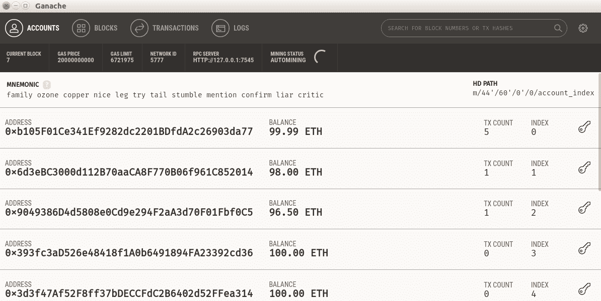

所以，让我们使用以下代码撤回捐赠：

```py
truffle(development)> Contract.at("0x3E9417399786347B6Ab38f59d3f00829d6bba7b8").then(function(instance) { return instance.withdraw_donation({from: "0xb105F01Ce341Ef9282dc2201BDfdA2c26903da77"}); });
```

看一下你的 Ganache。在我的情况下，第一个账户有 105.48 ETH，如下面的截图所示：

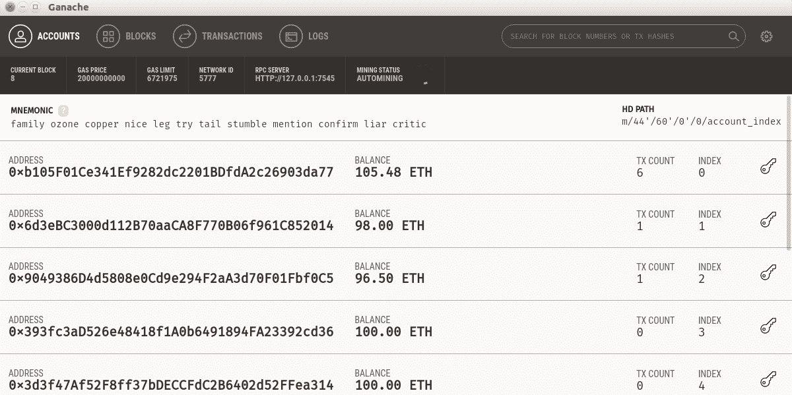

# 其他数据类型

Vyper 还有其他数据类型，这些数据类型在捐赠智能合约中没有使用，如下面的列表所示：

+   `bool`：这种数据类型类似于普通的布尔值。它包含 true 或 false 值，如下面的代码所示：

```py
bull_or_bear: bool = True
```

+   `decimal`：这种数据类型类似于 Python 中的 `float` 或 `double`，如下面的代码所示：

```py
half_of_my_heart: decimal = 0.5
```

+   `bytes32`：这种数据类型类似于 `bytes32`，但有一个特点。如果值的长度小于 32 字节，它将用零字节填充。所以，如果你将 `messi` 值（5 个字符/字节）设置为 `bytes32` 数据类型变量（如下面的代码所示），它将变成 `messi\x00\x00\x00\x00\x00\x00\x00\x00\x00\x00\x00\x00\x00\x00\x00\x00\x00\x00\x00\x00\x00\x00\x00\x00\x00\x00\x00\x00\x00`：

```py
goat: bytes32 = convert('messi', bytes32)
```

+   `Constant`：这种数据类型在声明后不能被改变：

```py
GOAT: constant(bytes[6]) = 'messi'
```

与 C++ 编程语言不同，未初始化的变量可以有垃圾值，Vyper 编程语言中所有未初始化的变量都有默认值。默认的整数数据类型值是 `0`。默认的布尔数据类型值是 `false`。

# 有用的内置函数

你已经使用了内置函数，比如 `send`、`assert`、`as_wei_value`、`concat` 和 `convert`。然而，还有其他有用的函数，比如以下的函数：

+   `slice`：`slice` 短语是字节数据类型。它用于从字符串中获取子字符串等任务，如下面的代码所示：

```py
first_name: bytes[10] = slice(name, start=0, len=10)
```

+   `len`：此函数用于获取值的长度，如下面的代码所示：

```py
length_of_name: int128 = len(name)
```

+   `selfdestruct`：此函数用于销毁智能合约，如下面的代码所示。参数是这个智能合约发送其以太币的地址：

```py
selfdestruct(self.donatee)
```

+   `ceil`：这个函数用于将整数四舍五入到上限，如下面的代码所示：

```py
round_heart: int128 = ceil(half_of_my_heart)
```

+   `floor`：这个函数用于将整数四舍五入到下限，如下面的代码所示：

```py
round_heart: int128 = floor(half_of_my_heart)
```

+   `sha3`：这是一个内置的哈希函数，如下面的代码所示：

```py
secret_hash: bytes32 = sha3('messi')
```

# 事件

Vyper 支持事件。你可以在你的方法中向任何订阅者广播事件。例如，当人们用智能合约捐赠以太币时，你可以广播一个捐赠事件。要声明一个事件，你可以使用以下语句：

```py
Donate: event({_from: indexed(address),  _value: uint256(wei)})
```

然后，在我们的 `donate` 方法中，你可以在捐赠交易发生后广播事件，如下面的代码所示：

```py
@public
def donate(name: bytes[100]):
    log.Donate(msg.sender, msg.value)
```

我们将在后面的章节中更多地讨论事件。

# 与其他智能合约交互

你知道你的智能合约不必在那里孤独吗？你的智能合约可以与区块链上的其他智能合约进行交互。

地址数据类型不仅用于普通账户，还可以用于智能合约账户。因此，智能合约可以通过捐赠智能合约向我们的受赠人捐赠以太币！

重新启动您的 Ganache；我们将重新启动我们的区块链。还记得您的`hello.vy` Vyper 文件吗？我们想要部署我们的`Hello`智能合约并自定义名称。

我们的迁移文件`migrations/2_deploy_hello.js`仍然是相同的，如下所示：

```py
var Hello = artifacts.require("Hello");
module.exports = function(deployer) {
  deployer.deploy(Hello);
};
```

再次编译您的`hello.vy`文件以获取接口和字节码。打开我们的合同 JSON 文件，`build/contracts/Hello.json`文件。清除所有内容并用以下代码替换它：

```py
{
  "contractName": "Hello",
  "abi": <your Hello smart contract's interface>,
  "bytecode": "<your Hello smart contract's bytecode>"
}
```

您必须为您的智能合约命名，因为这次，您将部署两个智能合约。如果您不为您的智能合约命名，它将具有默认名称`Contract`。如果您只想部署一个智能合约，这不是问题。

然后，对于您的`donation.vy`，编辑它，并将以下代码行（加粗显示）添加到代码文件中（请参考以下 GitLab 链接中`donation.vy`的完整代码文件：[`gitlab.com/arjunaskykok/hands-on-blockchain-for-python-developers/blob/master/chapter_03/donation.vy`](https://gitlab.com/arjunaskykok/hands-on-blockchain-for-python-developers/blob/master/chapter_03/donation.vy)）：

```py
struct DonaturDetail:
    sum: uint256(wei)
    name: bytes[100]
    time: timestamp

contract Hello():
 def say_hello() -> bytes[32]: constant

donatur_details: public(map(address, DonaturDetail))

...
...

@public
def withdraw_donation():
    assert msg.sender == self.donatee

    send(self.donatee, self.balance)

@public
@constant
def donation_smart_contract_call_hello_smart_contract_method(smart_contract_address: address) -> bytes[32]:
 return Hello(smart_contract_address).say_hello()
```

请注意加粗的更改。这些更改是您要与之交互的智能合约接口的声明方式；您声明合约对象和要与之交互的方法。您不需要知道`say_hello`方法的实现，只需要知道接口（即它期望的参数和返回值）。

然后调用外部智能合约的`donation_smart_contract_call_hello_smart_contract_method`方法。将地址作为参数发送给合约对象并像往常一样调用该方法。如果您已经知道要与之交互的智能合约的地址，可以硬编码它。但我使用参数是因为我还不知道`Hello`智能合约的地址。

使用以下代码，为我们升级的`Donation`智能合约创建另一个迁移文件，`migrations/3_deploy_donation.js`：

```py
var Donation = artifacts.require("Donation");
module.exports = function(deployer) {
  deployer.deploy(Donation);
};
```

编译您的`donation.vy`并获取智能合约的接口和字节码。

然后，使用以下代码，为我们的`Donation`智能合约创建另一个合同 JSON 文件，`build/contracts/Donation.json`：

```py
{
  "contractName": "Donation",
  "abi": <your Donation smart contract's interface>,
  "bytecode": "<your Donation smart contract's bytecode>"
}
```

运行迁移。您可能需要使用`--reset`标志，如下所示：

```py
$ truffle migrate --reset
```

您将获得以下输出：

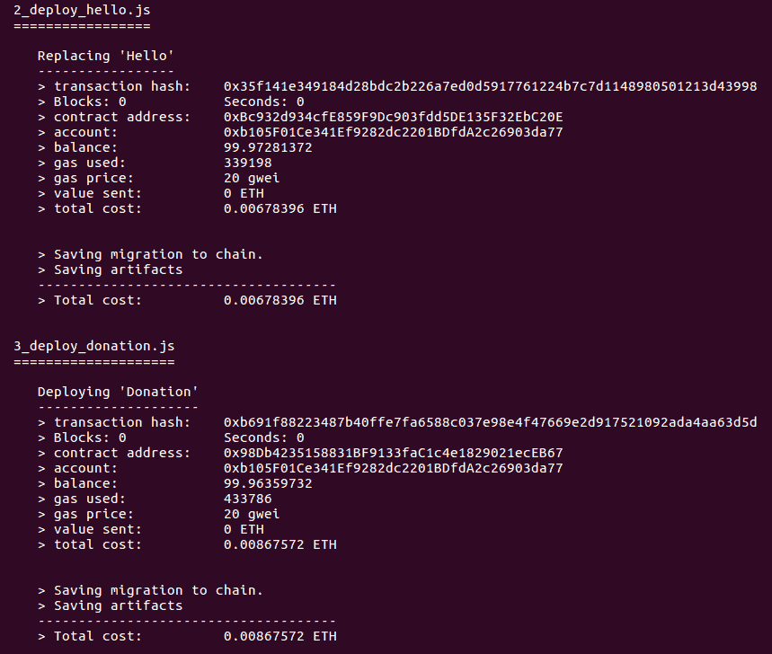

注意`Donation`智能合约的地址和`Hello`智能合约的地址。`Donation`智能合约的地址是`0x98Db4235158831BF9133faC1c4e1829021ecEB67`，`Hello`智能合约的地址是`0xBc932d934cfE859F9Dc903fdd5DE135F32EbC20E`。您的地址可能不同。

按以下方式运行 Truffle 控制台：

```py
$ truffle console
```

现在我们的智能合约不再孤单，如下所示：

```py
truffle(development)> Donation.at("0x98Db4235158831BF9133faC1c4e1829021ecEB67").then(function(instance) { return instance.donation_smart_contract_call_hello_smart_contract_method.call("0xBc932d934cfE859F9Dc903fdd5DE135F32EbC20E"); } );
'0x48656c6c6f2c205361746f736869204e616b616d6f746f'
```

智能合约之间交互的用例之一是创建一个去中心化交易智能合约。假设您的祖母启动了一个名为电网代币的代币智能合约，您的叔叔启动了一个名为 Wi-Fi 接入代币的代币智能合约。您可以创建一个智能合约，与电网代币和 Wi-Fi 接入代币进行交互。在您的智能合约中，您可以创建一个方法来启用这两个代币之间的交易；您只需获取它们的智能合约地址和接口。当然，您还需要编写交易的逻辑。

# 以编程方式编译代码

您可以创建一个脚本来编译 Vyper 代码，而不是使用命令行实用程序。确保您在包含`hello.vy`和`donation.vy`的相同目录中。创建一个名为`compiler.vy`的脚本，如下所示：

```py
import vyper
import os, json

filename = 'hello.vy'
contract_name = 'Hello'
contract_json_file = open('Hello.json', 'w')

with open(filename, 'r') as f:
    content = f.read()

current_directory = os.curdir

smart_contract = {}
smart_contract[current_directory] = content

format = ['abi', 'bytecode']
compiled_code = vyper.compile_codes(smart_contract, format, 'dict')

smart_contract_json = {
    'contractName': contract_name,
    'abi': compiled_code[current_directory]['abi'],
    'bytecode': compiled_code[current_directory]['bytecode']
}

json.dump(smart_contract_json, contract_json_file)

contract_json_file.close()
```

如果你使用以下命令执行这个脚本，你将得到一个`Hello.json`文件，你可以在 Truffle 中使用，如下代码所示：

```py
(vyper-venv) $ python compiler.py
```

现在，让我们逐步学习这个脚本。首先，导入`Vyper`库和一些 Python 标准库，这样我们就可以写一个 JSON 文件，如下所示：

```py
import vyper
import os, json
```

你需要一个 Vyper 文件，你想要给你的智能合约的名称，以及输出的 JSON 文件。以下代码将完成这个任务：

```py
filename = 'hello.vy'
contract_name = 'Hello'
contract_json_file = open('Hello.json', 'w')
```

使用以下代码行获取 Vyper 文件的内容：

```py
with open(filename, 'r') as f:
    content = f.read()
```

然后创建一个字典对象，其中键是指向你的 Vyper 文件的路径，值是 Vyper 文件的内容，如下所示：

```py
current_directory = os.curdir

smart_contract = {}
smart_contract[current_directory] = content
```

要编译 Vyper 代码，你只需要使用`vyper`模块的`compile_codes`方法，如下所示：

```py
format = ['abi', 'bytecode']
compiled_code = vyper.compile_codes(smart_contract, format, 'dict')
```

`compile_codes`方法的第一个参数是一个字典，其中键指向路径，值表示字符串中的 Vyper 代码。第二个参数是`format`，包括接口和字节码。第三个参数是可选的。如果你使用`'dict'`，那么你将得到一个字典。如果你不给出第三个参数，那么你将得到一个数组。让我们看一下以下代码：

```py
smart_contract_json = {
    'contractName': contract_name,
    'abi': compiled_code[current_directory]['abi'],
    'bytecode': compiled_code[current_directory]['bytecode']
}
```

因为我们使用了`'dict'`作为我们的第三个参数，我们得到了一个字典对象的结果。结果的键是我们的 Vyper 文件的路径。从技术上讲，你可以将它设置为任何你喜欢的字符串。一些开发人员使用文件路径来区分他们在项目目录中散布的 Vyper 文件。

最后的代码用于将结果写入输出的 JSON 文件：

```py
json.dump(smart_contract_json, contract_json_file)

contract_json_file.close()
```

通过以编程方式编译 Vyper 代码，你可以在 Vyper 之上构建一个框架。在本书的后面章节中，你将使用一个名为 Populus 的框架来编译和部署 Vyper 文件。但你可能想要构建一个更好的框架，或者你可以构建一个 Vyper 集成开发环境（IDE），比如 JetBrains IDE，但用于 Vyper 编程语言。

# 其他技巧

Vyper 不像 Python 那样自由；有一些限制是你必须接受的。要克服这些限制，你需要与它们和解，或者你需要释放你的创造力。以下是一些关于如何做到这一点的提示。

第一个限制是数组必须有固定的大小。在 Python 中，你可能非常习惯于拥有一个可以根据需要扩展的列表，如下代码所示：

```py
>>> flexible_list = []
>>> flexible_list.append('bitcoin')
>>> flexible_list.append('ethereum')
>>> flexible_list
['bitcoin', 'ethereum']
```

在 Vyper 中没有这样的东西。你必须声明你的数组有多大。然后你必须使用一个整数变量来跟踪你已经插入到这个固定大小数组中的项目数量。你在`Donation`智能合约中使用了这种策略。

如果你渴望拥有一个无限大小的数组，有一种方法可以实现这一点。你可以使用整数作为键的映射数据类型。你仍然使用一个整数变量来跟踪你已经插入到这个映射数据类型变量中的项目数量，如下代码所示：

```py
infinite_array_of_strings: map(uint256, bytes[100])
index: int128
```

但由于`infinite_array_of_strings`是一个映射数据类型，你有责任保护这个变量免受非整数键的影响。

第二个限制是映射数据类型不能接受复合数据类型作为键。因此，你不能将映射数据类型或结构数据类型作为键。但它可以接受映射数据类型或结构数据类型作为值，如下代码所示：

```py
mapping_of_mapping_of_mapping: map(uint256, map(uint256, map(uint256, bytes[10])))
```

如果你想将结构体作为映射数据类型变量的键，你可以先对它们进行序列化。例如，如果你想将两个字符串作为映射数据类型变量的键，你可以将这些字符串连接起来，作为你的映射数据类型变量的键，如下代码所示：

```py
friend1_str: bytes32 = convert(friend1, bytes32)
friend2_str: bytes32 = convert(friend2, bytes32)
key: bytes[100] = concat(friend1_str, friend2_str)

dating[key] = True
```

或者你可以使用嵌套数组，如下所示：

```py
dating[friend1_address][friend2_address] = True
```

哪种方法更好取决于情况和你的偏好。

第三个限制是 Vyper 编程语言无法访问现实世界。因此，在你的智能合约中不要想象以下内容：

```py
nba_final_winner = nba.get_json_winner('2019/2020')
```

# 摘要

在本章中，我们学习了如何使用 Vyper 编程语言编写智能合约。首先，我们安装了 Vyper 编译器。然后我们开发了一个智能合约。通过这样做，我们了解了 Vyper 编程语言的大部分特性，包括函数修饰符、初始化函数和函数权限修改器。还有一些数据类型，如地址、整数、时间戳、映射、数组和字节数组（字符串）。我们学会了如何将 Vyper 源代码编译成智能合约，然后使用 Truffle 工具将其部署到 Ganache 上。我们还通过 Truffle 控制台与该智能合约进行了交互。

在下一章中，我们将学习关于`web3.py`。这是构建去中心化应用的第一步。
