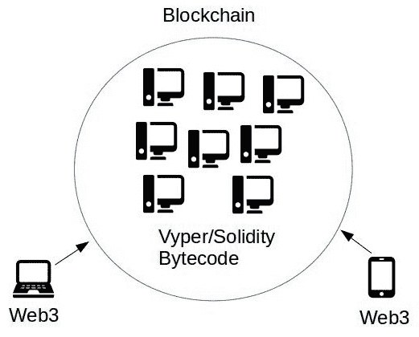
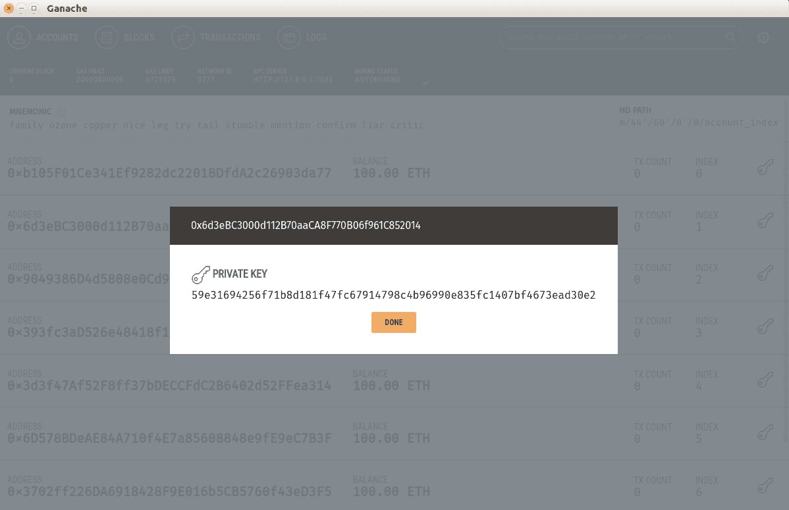
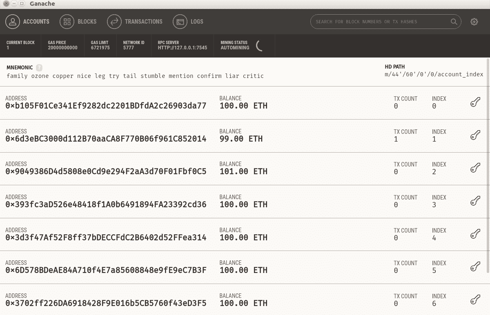
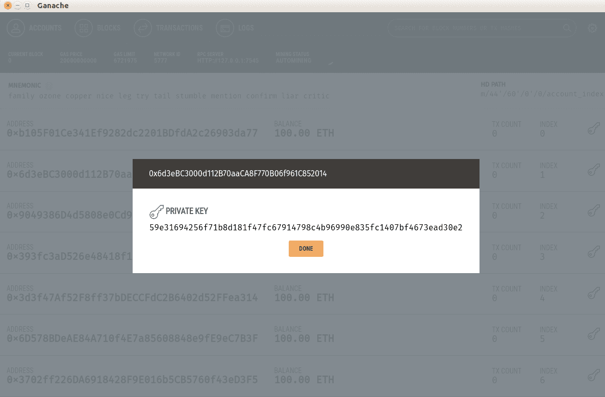
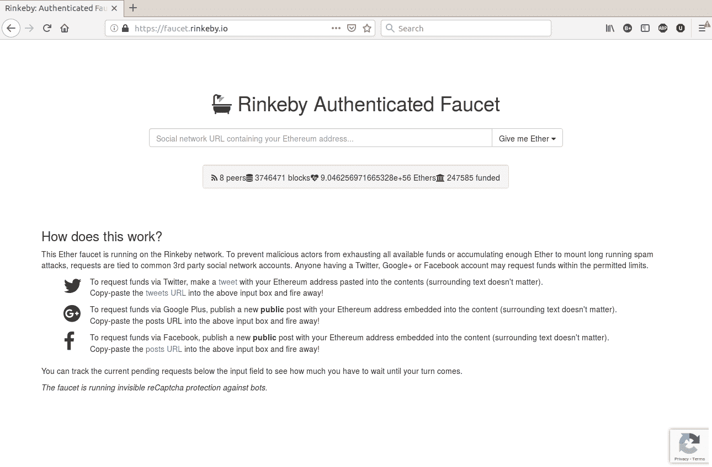

# 第四章：使用 Web3 与智能合约交互

在本章中，您将学习如何以编程方式连接到智能合约。在这里，您将使用 Python 编程语言来执行智能合约中的方法。为了实现这一点，您将使用`web3.py`库。在上一章中，您构建了一个智能合约并将其部署到以太坊区块链上。您还使用 Vyper 编写了一个智能合约。为了与该智能合约交互，您启动了 Truffle 控制台并输入了许多命令。这些命令被发送到区块链中的智能合约。根据您输入的命令，这可能会读取智能合约的状态或更改状态。在本章中，您将超越 Truffle 控制台。

本章将涵盖以下主题：

+   去中心化应用介绍

+   Geth

+   了解`web3.py`库

+   使用`web3.py`与智能合约交互

# 去中心化应用介绍

您将使用 Python 构建一个程序，以编程方式执行智能合约中的方法，我们称这个程序为去中心化应用。因此，有一个智能合约，还有一个去中心化应用。使用 Vyper 或 Solidity 编程语言编写的智能合约存在于以太坊区块链中。这意味着如果您将智能合约部署到以太坊生产区块链上，您的智能合约的字节码将写入每个以太坊节点。因此，如果我们在这个世界上有 1 万个以太坊节点，您的智能合约将被复制 1 万次。

然而，去中心化应用并不存储在以太坊区块链中。它存在于您的计算机中，邻居的计算机中，云中，但它并不存储在区块链上，并且不必像智能合约一样在全世界复制。人们使用各种编程语言构建去中心化应用。在以太坊的情况下，构建去中心化应用的最流行的编程语言是 Node.js 环境中的 Javascript 和 Python。在我们的情况下，我们将使用 Python 来构建去中心化应用。为此，我们需要一个库。在 Javascript 的情况下，我们需要一个`web3.js`库。在我们的情况下，也就是 Python，我们需要一个`web3.py`库。所有这些库的名称都包含了 web3 这个词。

人们喜欢把 web3 看作是互联网的第三个版本：一个去中心化的互联网。那么，如果这是第三个版本，你会问第一个和第二个版本是什么？互联网的第一个版本是您用来被动消费内容的互联网（想想静态网站）。互联网的第二个版本是社交互联网，您在其中生成内容并共同创造体验（想想 Facebook、Twitter 或 Instagram）：



在前面的屏幕截图中，我们可以看到 Vyper 或 Solidity 字节码存在（复制）于许多以太坊节点（系统）中。但是使用`web3`库的程序可以存在于单个计算机（例如笔记本电脑或智能手机）中。

# 安装 web3

话不多说，让我们安装`web3`库。创建一个带有 Python 3.6 的虚拟环境如下：

```py
$ virtualenv -p python3.6 web3-venv
```

激活虚拟环境并安装 Vyper 如下：

```py
$ source web3-venv/bin/activate
(web3-venv) $ pip install vyper
```

然后，使用`pip`安装`web3.py`库：

```py
(vyper-venv) $ pip install web3
```

现在，验证它是否按以下方式工作：

```py
(vyper-venv) $ python
>>> import web3
>>> web3.__version__
'4.8.2'
```

如果您没有遇到任何错误，那就可以了。让我们使用`web3`连接到 Ganache 区块链。要做到这一点，首先启动 Ganache，然后返回到您的 Python 命令提示符：

```py
>>> from web3 import Web3, HTTPProvider
>>> w3 = Web3(HTTPProvider('http://localhost:7545'))
>>> w3.eth.blockNumber
0
>>> w3.eth.getBlock('latest')
AttributeDict({'number': 0, 'hash': HexBytes('0x0bbde277e2147d93f12852a370e70e2efe9c66f45db6e80e0cba584508d3ebac'), 'parentHash': HexBytes('0x0000000000000000000000000000000000000000000000000000000000000000'), 'mixHash': 
...
...
HexBytes('0x56e81f171bcc55a6ff8345e692c0f86e5b48e01b996cadc001622fb5e363b421'), 'stateRoot': HexBytes('0x31740a2d8b535c624aa481ba7d6d696085438037246b7501b4f24f77f94f3994'), 'receiptsRoot': HexBytes('0x56e81f171bcc55a6ff8345e692c0f86e5b48e01b996cadc001622fb5e363b421'), 'miner': '0x0000000000000000000000000000000000000000', 'difficulty': 0, 'totalDifficulty': 0, 'extraData': HexBytes('0x'), 'size': 1000, 'gasLimit': 6721975, 'gasUsed': 0, 'timestamp': 1548300279, 'transactions': [], 'uncles': []})
```

我们在这里所做的是使用`web3`库连接到 Ganache 区块链。我们可以检索区块链上的信息，比如在这个特定区块链上挖掘了多少个区块。因为我们使用的是 Ganache，一个开发区块链，`w3.eth.blockNumber`返回`0`，因为我们在 Ganache 上没有创建任何交易。

# Geth

**Go Ethereum**（**Geth**）是用 Go 语言编写的以太坊协议的实现。您可以使用 Geth 来同步以太坊节点，甚至构建私有以太坊区块链。如果您想成为矿工，这是您将使用的软件。您的以太坊节点是以太坊区块链的网关和一部分。您的程序与`web3`库需要以太坊节点才能与存储在区块链中的智能合约进行交互。

使用 Ganache 是很好的。但 Ganache 是一个假的区块链。没有矿工，因此很难模拟我们在真实以太坊区块链上可能遇到的一些情况。因此，让我们提高我们的游戏水平。我们现在不需要使用以太坊生产区块链，但我们可以使用介于开发和生产区块链之间的东西——Rinkeby 网络。如果以太坊生产区块链类似于生产服务器，那么 Rinkeby 网络就像一个暂存服务器。在 DevOps 的语言中，暂存服务器是尽可能模拟生产服务器的测试服务器。

因此，Rinkeby 不像 Ganache 那样是一个软件。它存在于互联网上。因此，使用 Rinkeby 网络，我们可以感受到与以太坊生产区块链打交道是什么感觉。在以太坊区块链的 Rinkeby 网络中，您可能会遇到的情况之一是确认交易需要时间。在 Ganache 中，确认交易只需要一小部分秒数。在 Rinkeby 网络中，确认交易可能需要 20-30 秒，甚至一分钟，因此您需要习惯。当然，并非以太坊生产区块链中的所有情况都可以在 Rinkeby 网络上复制。在以太坊生产区块链中特别发生的另一种情况是，它包括以太坊生产区块链有时会出现的高流量。例如，一个名为 Cryptokitties 的去中心化应用程序减慢了以太坊网络，因为有许多用户与该应用程序进行交互，可以在这里看到：[`techcrunch.com/2017/12/03/people-have-spent-over-1m-buying-virtual-cats-on-the-ethereum-blockchain/`](https://techcrunch.com/2017/12/03/people-have-spent-over-1m-buying-virtual-cats-on-the-ethereum-blockchain/)。

还有另一个类似于 Rinkeby 网络的以太坊测试网络——Ropsten 网络。这里的区别在于 Rinkeby 网络在确认交易时使用**权威证明**（**PoA**），而 Ropsten 网络使用**工作量证明**（**PoW**）。现在不需要担心这种区别，因为使用 Rinkeby 网络类似于使用 Ropsten 网络。

连接到这种类型的以太坊区块链有两种方法——自己运行以太坊节点，或者使用其他人的节点。每种方法都有其优点和缺点。运行一个以太坊节点需要大量存储空间。连接到 Rinkeby 网络的节点需要大约 6GB 的存储空间。至于以太坊生产网络，需要高达 150GB 的存储空间。根据您的互联网连接，要完全运行，您需要一晚或几天时间，使节点与所有其他节点完全同步。

另一种方法是使用其他人的节点。有些人构建了一个连接到他们的以太坊节点的网络服务，因此您可以使用 API 连接到他们的以太坊节点。其中最受欢迎的服务之一是 Infura。在这里，您只需要在他们的网站上注册以获取他们的 API。

要在 Rinkeby 网络上运行我们自己的以太坊节点，请转到[`geth.ethereum.org/downloads/`](https://geth.ethereum.org/downloads/)下载适用于您的操作系统的软件。对于 Ubuntu Linux，这是以`tar.gz`格式，因此您需要解压缩它。然后，将二进制文件放在方便的位置（例如`/opt/bin`或`/home/yourusername/Program`或`/user/local/bin`）。

完成此操作后，按以下方式同步节点：

```py
$ ./geth --rinkeby
```

你可以使用不同的数据目录。默认情况下，Geth 将数据存储在`~/.ethereum`目录中：

```py
$ ./geth --rinkeby --datadir /opt/data/ethereumdata
```

在我的情况下，这需要一个晚上。你的经验可能会因你的互联网连接速度而有所不同。

如果它完全同步（当输出不再经常更改时，你就知道这种情况），那么你可以在`web3-venv`虚拟环境中运行 Python，如下所示：

```py
(web3-venv) $ python
>>> from web3 import Web3, IPCProvider
>>> w3 = Web3(IPCProvider("/home/yourusername/.ethereum/rinkeby/geth.ipc"))
```

在这里，我们使用了与之前示例中不同的提供者。在 Ganache 示例中，我们使用 HTTP 提供者。请记住，Ganache 使用`http://localhost:7545`，你需要在 Truffle 配置中使用这些信息。然而，在我们的情况下，当我们连接到以太坊节点时，我们使用**进程间通信提供者**（**IPC**）。你还可以看到`IPCProvider`的一个参数，它是一个文件路径。因此，你的 Python 程序通过那个文件与以太坊节点通信。在计算机科学中，那个文件被称为`pipe`。你只需搜索`geth.ipc`文件在你的本地计算机上的位置。请记住，只有在运行`geth`软件时，`geth.ipc`才会出现。如果你停止它，`geth.ipc`文件将消失。

然后，在你像往常一样运行业务之前，你需要向 web3 中间件注入一些东西。这应该这样做，因为以太坊生产区块链中的区块大小与 Rinkeby 区块链中的区块大小不同：

```py
>>> from web3.middleware import geth_poa_middleware
>>> w3.middleware_stack.inject(geth_poa_middleware, layer=0)
```

然后，你可以测试它，如下面的代码块所示：

```py
>>> w3.eth.getBlock('latest')
AttributeDict({'difficulty': 2, 'proofOfAuthorityData': HexBytes('0xd883010813846765746888676f312e31312e32856c696e7578000000000000001c62ac5af9b2ea6bf897a99fff40af6474cd5680fc8239853f03db116b2154594d2ab77a6f18c41132ee819143d2d41819237468924d29cb4b1252d2385a862400'), 'gasLimit': 7000000, 'gasUsed': 1373640, 'hash': HexBytes('0xa14b569f874eefc75fe734bc28b7457755eff1da26794d6615f15e1739204067'), 'logsBloom': 
...
...
HexBytes('0x66e75c91271b45f5271d2fe2fd0efc66f48f641632e83a086fc57646a0c0bc3f'), 'uncles': []})
```

你得到的输出是 Rinkeby 网络区块链的最新区块的信息。你可以从区块链的区块中学到一些东西。你可以找到在这个区块中已确认的所有交易；使用的燃气，燃气限制等等。在 Rinkeby 网络中，矿工始终是零地址（`0x0000000000000000000000000000000000000000`），因为 Rinkeby 网络中的区块链使用权威证明。但在主网（生产网络）中，你可以找出谁获得了确认区块链的奖励。你可以从主网（以太坊生产网络）的最新区块中找到这些信息。当然，如果你愿意同步节点，你也可以从以太坊生产节点中找到相同的信息。

# Geth 控制台

在我们继续使用`web3`库之前，让我们先尝试一下 Geth 软件。Geth 软件可以像 Truffle 控制台一样工作：

```py
$ ./geth --rinkeby --verbosity 0 console
```

在该语句中，关键字是`console`，但为了使体验更愉快，你应该添加另一个`--verbosity`标志，值为`0`。这将防止你从`geth`软件中获得大量输出。

```py
Welcome to the Geth JavaScript console!
instance: Geth/v1.8.16-stable-477eb093/darwin-amd64/go1.11
modules: admin:1.0 clique:1.0 debug:1.0 eth:1.0 miner:1.0 net:1.0 personal:1.0 rpc:1.0 txpool:1.0 web3:1.0
>
```

在 Geth 控制台中，你可以做任何你在 Truffle 控制台中可以做的事情。然而，我们现在想要创建一个以太坊账户。当你启动 Ganache 时，你会得到 10 个可以使用的账户。但在 Rinkeby 区块链中情况并非如此。你需要在 Rinkeby 中手动创建一个账户：

```py
> personal.newAccount("password123")
"0x28f5b56b035da966afa609f65fd8f7d71ff68327"
```

这是创建一个新的以太坊账户的命令。你需要提供一个密码来在 Geth 控制台中创建一个账户。不要忘记这个账户的密码，因为没有恢复它的选项。该命令的输出是你账户的公共地址。

私钥被加密在以下目录的文件中：`/home/yourusername/.geth/rinkeby/keystore`。

文件名类似于`UTC—2018-10-12T09-30-20.687898000Z—28f5b56b035da966afa609f65fd8f7d71ff68327`。这是时间戳和公钥的组合。你可以打开它，但你将无法在其中找到私钥。

```py
{"address":"28f5b56b035da966afa609f65fd8f7d71ff68327","crypto":{"cipher":"aes-128-ctr","ciphertext":"38b091f59f879369a6afdd91f21c1a82deb59374677144c94dd529d3c9069d39","cipherparams":{"iv":"b168482d467df6e1fe4bdb5201a64a6a"},"kdf":"scrypt","kdfparams":{"dklen":32,"n":262144,"p":1,"r":8,"salt":"bd94440d3f2bb9313a0020331bac9410ff3cdc9f32756f41f72dde1ef7bf32e1"},"mac":"3313b72603e85e73f84a47ef7ed0e931db85441e1702e0d96f2f001c54170cb6"},"id":"7a033367-92fe-42d3-bec5-970076f35d8a","version":3}
```

要解密它，你可以使用`web3`库。将脚本命名为`extract_private_key.py`：

```py
from web3 import Web3
w3 = Web3()

# Change the filepath to your keystore's filepath
with open('/opt/data/ethereumdata/keystore/UTC--2018-10-12T09-30-20.687898000Z--28f5b56b035da966afa609f65fd8f7d71ff68327') as keyfile:
    encrypted_key = keyfile.read()
    private_key = w3.eth.account.decrypt(encrypted_key, 'password123')
    print(private_key)
```

如果你执行该脚本，你将看到你的私钥，它可以在其他情况下使用：

```py
(web3-venv) $ python extract_private_key.py
b'\xa0\xe2\xa2\xf0$j\xe9L\xb3\xc0\x14Q\xb0D\xec\xa16\xa1\xca\xdd\x07.\x0f\x0f=5\xbd\xc5mb(r'
```

请不要再在生产环境中使用这个账户，因为私钥已经暴露。只能用于开发目的。

此私钥以`bytes`格式。如果要将其转换为十六进制字符串，可以这样做：

```py
(web3-venv) $ python
>>>  b'\xa0\xe2\xa2\xf0$j\xe9L\xb3\xc0\x14Q\xb0D\xec\xa16\xa1\xca\xdd\x07.\x0f\x0f=5\xbd\xc5mb(r'.hex()
'a0e2a2f0246ae94cb3c01451b044eca136a1cadd072e0f0f3d35bdc56d622872'
```

# 了解 web3.py 库

现在，让我们使用这个库编写一个去中心化的应用程序。最简单的去中心化应用程序脚本将是从一个账户向另一个账户发送资金。将脚本命名为`send_money_ganache.py`：

```py
from web3 import Web3, HTTPProvider

w3 = Web3(HTTPProvider('http://localhost:7545'))

private_key = '59e31694256f71b8d181f47fc67914798c4b96990e835fc1407bf4673ead30e2'

transaction = {
  'to': Web3.toChecksumAddress('0x9049386D4d5808e0Cd9e294F2aA3d70F01Fbf0C5'),
  'value': w3.toWei('1', 'ether'),
  'gas': 100000,
  'gasPrice': w3.toWei('1', 'gwei'),
  'nonce': 0
}

signed = w3.eth.account.signTransaction(transaction, private_key)
tx = w3.eth.sendRawTransaction(signed.rawTransaction)
```

在执行此脚本之前，首先启动 Ganache。这样做后，选择任何您喜欢的公共地址，并将其放入交易字典中的`to`字段。这个账户将成为接收者。然后找到另一个账户，查看其私钥，并将值输入到`private_key`变量中：



在`value`字段中放入一个以太。这意味着您想向另一个账户发送 1 个以太。这是一个简单的脚本，用来说明如何发送交易。它并不展示最佳实践，因为您不应该像这样将私钥嵌入代码中。例如，您可以从受限制的权限文件中读取私钥，或者可以从标准输入请求私钥。

如果您执行此脚本，您会注意到接收者的余额会增加 1 个 ETH，而发送者的余额会减少 1 个 ETH：



以下是输出：



# Gas 和 gas 价格

正如您所知，以太坊区块链并不是免费的；有人必须维护它。我不是在谈论编写以太坊软件的开发人员，而是运行以太坊节点以确认交易的矿工。他们从以太坊软件本身获得 ETH 的报酬。此外，他们还从交易的费用中获得报酬。这个费用就是 gas 和 gas 价格。

为什么以太坊软件需要在奖励之上收取费用？这是为了防止用户滥发垃圾信息。如果交易是免费的，滥发者可以设置两个账户，之间来回发送资金。此外，这会给愿意支付更多的用户高优先级。如果有两个类似的交易，但第一笔交易使用的 gas 更多，它将在矿工的待办事项列表中具有更高的优先级。使用更少 gas 的交易最终会得到确认；它只需要等待更长一点时间。

因此有 gas 和 gas 价格。Gas 是您愿意在此交易中分配的 gas 数量。在先前的脚本中，您分配了 20,000 gas 来创建一个发送资金的交易。对于更复杂的交易，比如执行智能合约中的复杂方法，可能需要更多的 gas。如果您没有分配足够的 gas，您的交易将被拒绝，您也可能会损失 gas。但是，如果您放入的 gas 超过了所需量，如果您的交易成功，剩余的 gas 将退还给您。因此，您可能会想：为什么不尽可能多地设置 gas？有一个陷阱。如果一些方法在智能合约中失败了断言（例如：assert 1 == 2），您将失去直到断言行之前使用的所有 gas（但剩余的 gas 将被退还）。因此，您需要找到折中之道。

Gas 价格是 gas 的价格，因此 gas 不是免费的。它与以太坊本身分开。您可以用您拥有的 ETH 购买 gas。您可以在历史交易中查看 gas 价格。在以太坊生产区块链中，您可以在[`www.ethgasstation.info/`](https://www.ethgasstation.info/)上查看 gas 价格。

您如何估计交易所需的 gas？您需要了解 Solidity 或 Vyper 编程语言的所有复杂性。如果我分配一个 256 位整数变量并将其存储在存储器中，会花费多少？循环呢？构造一个结构呢？这听起来很复杂，但幸运的是，`web3`库有一个估算 gas 使用量的方法。首先，创建一个名为`estimate_gas.py`的脚本：

```py
from web3 import Web3, HTTPProvider

w3 = Web3(HTTPProvider('http://localhost:7545'))

transaction = {
  'to': Web3.toChecksumAddress('0x9049386D4d5808e0Cd9e294F2aA3d70F01Fbf0C5'),
  'value': w3.toWei('1', 'ether'),
  'gas': 100000,
  'gasPrice': w3.toWei('1', 'gwei'),
  'nonce': 0
}

print("Estimating gas usage: " + str(w3.eth.estimateGas(transaction)))
print("Gas price: " + str(w3.eth.gasPrice))
```

您将得到以下输出：

```py
Estimating gas usage: 21000
Gas price: 2000000000
```

如果出现与随机数相关的错误，请将随机数更改为 1 或更高，直到它起作用。我们将在下一节讨论随机数。

# 随机数

您可能已经注意到，如果尝试多次执行发送资金脚本，会出现与随机数相关的错误。如果您还没有尝试，请尝试一下。您必须增加随机数才能使其再次工作。随机数就像是您使用一个账户进行了多少笔交易的指示器。对于第一笔交易（在创建新账户后），您在随机数中放入零值。然后，对于第二笔交易，您在随机数中放入 1 的值。然后，对于第三笔交易，您在随机数中放入 2 的值。

但是跟踪随机数值变得愚蠢，特别是如果您想使用一个旧账户，而您不知道随机数值有多高。幸运的是，有一种方法可以从以太坊区块链中获取最新的随机数值。创建一个名为`get_latest_nonce.py`的脚本：

```py
from web3 import Web3, HTTPProvider
w3 = Web3(HTTPProvider('http://localhost:7545'))
transaction_count = w3.eth.getTransactionCount("0xcc6d61988CdcF6eB510BffAeD4FC0d904f8d3e7D")
print(transaction_count)
```

尝试使用更高的随机数再次发送资金，然后执行此脚本。再做一次。这将显示给您价值总额。

有了这些新知识，您必须小心创建以太坊区块链上的交易。在现实世界中，交易可能需要时间才能得到确认。想象一下，您同时创建了两笔不同的交易，它们的随机数相同。如果这两笔交易都有效，只有其中一笔会被记录在以太坊区块链上。另一笔将被拒绝，因为存在随机数问题。这两笔交易中的哪一笔将得到确认？这将是相当随机的。

相反，您必须决定要先确认哪笔交易。给它一个较低的随机数。对于第二笔交易，您给予一个较高的随机数。但是，如果第一笔交易失败，第二笔交易将被拒绝，因为随机数太高（随机数跳过一个数字）。这是您需要牢记的事情。

那么为什么要有这些随机数官僚主义？这是为了防止相同的交易再次发生。想象一下，您广播了一笔交易，向您的邻居发送了 1 个 ETH。我可以复制这笔交易并再次广播。由于这笔交易是通过您的签名验证的，我可以清空您的账户。

# 在 Rinkeby 上创建交易

现在您已经在 Ganache 上玩得很开心了，让我们尝试在 Rinkeby 网络上创建一笔交易。您可能会注意到一个问题——与 Ganache 不同，您在这里什么都没有。您必须默认创建一个账户。创建 10 个账户很容易。但是余额呢？您在 Rinkeby 网络上使用 Geth 软件创建的每个账户都带有 0 ETH 的余额。但是发送资金需要资金来支付交易费。

在以太坊生产区块链中，您可以从加密货币交易所或挖矿中获得 ETH。但在 Rinkeby 网络中，您通过乞讨来获得资金。以下是如何做到这一点。

转到[`faucet.rinkeby.io/`](https://faucet.rinkeby.io/)，然后使用 Twitter、Google+或 Facebook 等社交媒体平台之一，在 Rinkeby 网络中创建一个包含您的公共地址的帖子。然后，在 Rinkeby 水龙头网站的表单中发布您的社交媒体帖子。您有三个选择：8 小时内的 3 个以太币，1 天内的 7.5 个以太币，或 3 天内的 18.5 个以太币：



为了确保您获得了余额，您可以从 Geth 软件中检查余额。首先同步它。正如我之前所说，这个过程可能需要很长时间，也许几个小时，或者在我这种情况下需要一整夜：

```py
$ ./geth --rinkeby
```

在您的本地区块链节点与 Rinkeby 网络完全同步之后，首先终止`geth`进程，然后再次启动`geth`，但使用不同的标志：

```py
$ ./geth --rinkeby --verbosity 0 console
```

在`geth`控制台中执行此命令：

```py
> web3.eth.getBalance('0x28f5b56b035da966afa609f65fd8f7d71ff68327')
3000000000000000000
```

将此地址更改为您的地址。您应该从水龙头中获得一些 ETH。

假设您已经拥有 ETH，您可以在 Rinkeby 网络中创建一个交易。以下是在 Rinkeby 网络中发送以太币的脚本。您可以在以下 GitLab 链接上引用完整代码文件：[`gitlab.com/arjunaskykok/hands-on-blockchain-for-python-developers/blob/master/chapter_04/send_money_rinkeby.py`](https://gitlab.com/arjunaskykok/hands-on-blockchain-for-python-developers/blob/master/chapter_04/send_money_rinkeby.py)：

```py
from web3 import Web3, IPCProvider
from web3.middleware import geth_poa_middleware

# Change the path of geth.ipc according to your situation.
w3 = Web3(IPCProvider('/opt/data/ethereumdata/geth.ipc'))

w3.middleware_stack.inject(geth_poa_middleware, layer=0)

...
...

nonce = w3.eth.getTransactionCount(Web3.toChecksumAddress(from_account))

transaction = {
  'to': Web3.toChecksumAddress(to_account),
  'value': w3.toWei('1', 'ether'),
  'gas': 21000,
  'gasPrice': w3.toWei('2', 'gwei'),
  'nonce': nonce
}

signed = w3.eth.account.signTransaction(transaction, private_key)
w3.eth.sendRawTransaction(signed.rawTransaction)
```

根据您的情况，更改接收账户地址、您的私钥加密文件位置、您的密码和`geth.ipc`文件位置。

请记住，我们的私钥是加密在一个文件中的。因此我们读取该文件，然后用密码解锁。请记住，您不应该直接将密码嵌入代码中。然后您可以在等待几分钟后在`geth`控制台中检查您目标账户的余额：

```py
> web3.eth.getBalance('0x99fb2eee85acbf878d4154de73d5fb1b7e88c328')
100000000000000000
```

您可以通过使用私钥对其进行签名来发送交易。这是在以太坊中创建交易的最通用方式。但还有另一种方式，涉及仅使用密码。

您可以像这样使用私钥：

```py
signed = w3.eth.account.signTransaction(transaction, private_key)
w3.eth.sendRawTransaction(signed.rawTransaction)
```

或者，您可以在签署交易时使用密码，如下所示：

```py
w3.personal.sendTransaction(transaction, password)
```

只有在您控制节点时才能使用密码，因为它需要一个加密的私钥文件。我在我的以太坊节点中创建了一些账户。我只能在为这些账户签署交易时使用密码。但是使用私钥，我可以使用任何账户。

# 使用 web3.py 与智能合约进行交互

您已经使用`web3`库在 Ganache 和 Rinkeby 网络中使用 Python 脚本发送了以太币。现在，让我们创建一个与智能合约交互的脚本。但在这之前，您需要学习如何使用`geth`和`web3`库的 Python 脚本启动智能合约。在第三章中，*使用 Vyper 实现智能合约*，您使用 Truffle 启动了一个智能合约。

# 使用 Geth 启动智能合约

在下一节中，我们将使用`web3`连接到一个智能合约。以下是如何将智能合约部署到 Rinkeby 区块链的方法：

```py
$ ./geth --rinkeby --verbosity 0 console
```

在`geth`控制台中，使用 Geth 软件列出所有您的账户：

```py
> eth.accounts
["0x8b55f0a88a1c53a8976953cde4f141752e847a00", "0x1db565576054af728b46ada9814b1452dd2b7e66", "0x28f5b56b035da966afa609f65fd8f7d71ff68327", "0x5b0d65b07a61c7b760bf372bbec1b3894d4b0225", "0x99fb2eee85acbf878d4154de73d5fb1b7e88c328"]
```

所有这些账户都来自您使用此命令创建的 keystore 文件：`personal.newAccount("password")`。假设您想要解锁第一个账户，那么您可以使用`personal.unlockAccount`方法：

```py
> personal.unlockAccount(eth.accounts[0], "password123")
true
```

现在，获取`bytecode`并将其放入一个变量中。请记住，当您使用 Vyper 编译器编译源代码时，您会得到`bytecode`：

```py
> bytecode = "smart contract bytecode"
> tx = eth.sendTransaction({from: eth.accounts[0], data: bytecode, gas: 500e3}
```

然后，检查您的智能合约是否已在区块链上得到确认：

```py
> web3.eth.getTransactionReceipt(tx)
```

如果已确认，则应该获得以下输出：

```py
{
 blockHash: "0xfed7dcbd5e8c68e17bff9f42cd30d95588674497ae719a04fd6a2ff219bb001d",
 blockNumber: 2534930,
 contractAddress: "0xbd3ffb07250634ba413e782002e8f880155007c8",
 cumulativeGasUsed: 1071323,
 from: "0x1db565576054af728b46ada9814b1452dd2b7e66",
 gasUsed: 458542,
 logs: [],
 logsBloom: "0x00000...",
 status: "0x1",
 to: null,
 transactionHash: "0x1a341c613c2f03a9bba32be3c8652b2d5a1e93f612308978bbff77ce05ab02c7",
 transactionIndex: 4
}
```

# 使用 web3 启动智能合约

您还可以使用`web3`库使用 Python 脚本启动智能合约。将此脚本命名为`deploy_smart_contract_to_ganache.py`。您可以在以下 GitLab 链接上引用完整代码文件，[`gitlab.com/arjunaskykok/hands-on-blockchain-for-python-developers/blob/master/chapter_04/deploy_smart_contract_to_ganache.py`](https://gitlab.com/arjunaskykok/hands-on-blockchain-for-python-developers/blob/master/chapter_04/deploy_smart_contract_to_ganache.py)：

```py
from web3 import Web3, HTTPProvider
from vyper import compile_codes

contract_source_code = '''
name: public(bytes[24])

@public
def __init__():
    self.name = "Satoshi Nakamoto"

...
...

# Change the account to your situation.
tx_hash = HelloSmartContract.constructor().transact({'from': '0xb105F01Ce341Ef9282dc2201BDfdA2c26903da77'})

tx_receipt = w3.eth.waitForTransactionReceipt(tx_hash)
print(tx_receipt)
```

运行脚本。但请确保 Ganache 正在运行。您应该获得以下输出：

```py
AttributeDict({'transactionHash': HexBytes('0xcfce0a28d0f8232735f99bcf871762f9780f19ab916e92c03d32fdabfd6b9e9a'), 'transactionIndex': 0, 'blockHash': HexBytes('0x84139a5c9ad050cf7be0678feb4aefc9e8b2806636245f16c790048e50347dfe'), 'blockNumber': 1, 'from': '0xb105f01ce341ef9282dc2201bdfda2c26903da77', 'to': None, 'gasUsed': 339198, 'cumulativeGasUsed': 339198, 'contractAddress': '0x9Dc44aa8d05c86388E647F954D00CaA858837804', 'logs': [], 'status': 1, 'logsBloom': HexBytes('0x00000000000000000000000000000000000000000000000000000000000000000000000000000000000000000000000000000000000000000000000000000000000000000000000000000000000000000000000000000000000000000000000000000000000000000000000000000000000000000000000000000000000000000000000000000000000000000000000000000000000000000000000000000000000000000000000000000000000000000000000000000000000000000000000000000000000000000000000000000000000000000000000000000000000000000000000000000000000000000000000000000000000000000000000000000000'), 'v': '0x1c', 'r': '0x74c63921055bd2fed65a731356b30220c6de3a28ec5fd26e296bf609d76d25ce', 's': '0x655395f422fa7b419caf87f99e2da09296b123eceb99aed4d19195e542b01bcd'})
```

首先，使用此语句创建一个智能合约对象：

```py
HelloSmartContract = w3.eth.contract(abi=abi, bytecode=bytecode)
```

然后，为了部署一个智能合约，您只需要使用`constructor`方法：

```py
tx_hash = HelloSmartContract.constructor().transact({'from': '0xb105F01Ce341Ef9282dc2201BDfdA2c26903da77'})
```

最后一步非常重要，那就是等待交易得到确认。这很重要，因为您需要在交易得到确认后获得智能合约的地址。

如果要将智能合约部署到 Rinkeby 网络，需要修改此脚本。创建一个名为`deploy_smart_contract_to_rinkeby.py`的新文件。您可以在以下 GitLab 链接上参考完整代码文件：[`gitlab.com/arjunaskykok/hands-on-blockchain-for-python-developers/blob/master/chapter_04/deploy_smart_contract_to_rinkeby.py`](https://gitlab.com/arjunaskykok/hands-on-blockchain-for-python-developers/blob/master/chapter_04/deploy_smart_contract_to_rinkeby.py)：

```py
from web3 import Web3, IPCProvider
from vyper import compile_codes

contract_source_code = '''
name: public(bytes[24])

...
...

signed = w3.eth.account.signTransaction(transaction, private_key)
tx_hash = w3.eth.sendRawTransaction(signed.rawTransaction)

tx_receipt = w3.eth.waitForTransactionReceipt(tx_hash)
print(tx_receipt)
```

将智能合约部署到 Rinkeby 网络时的区别（除了使用`IPCProvider`而不是`HTTPProvider`）是您还需要设置`gas`、`gasPrice`和`nonce`。此外，您使用`buildTransaction`方法，获取`transaction`对象，并使用私钥对其进行签名。因为此脚本在 Rinkeby 网络中运行，所以需要确保您已分配足够的 gas。在 Rinkeby 网络上部署智能合约时，犯的一个常见错误是 gas 不足。然后，开发人员会困惑为什么之后无法访问智能合约。当您将此智能合约部署到 Rinkeby 网络时，需要等待一段时间。

# 玩转智能合约

在上一章中，我们使用 Vyper 开发了一个名为`hello.vy`的简单智能合约。让我们使用`web3`创建一个与此智能合约交互的脚本。如果您忘记了`hello.vy`的内容，这是文件的内容：

```py
name: public(bytes[24])

@public
def __init__():
    self.name = "Satoshi Nakamoto"

@public
def change_name(new_name: bytes[24]):
    self.name = new_name

@public
def say_hello() -> bytes[32]:
    return concat("Hello, ", self.name)
```

编译并部署到 Ganache 或 Rinkeby 网络。现在，根据您是要连接到 Ganache 还是 Rinkeby 中的智能合约，选择以下选项之一。

第一个脚本是用于与 Rinkeby 网络中的智能合约进行交互。将脚本命名为`play_with_smart_contract_in_rinkeby.py`。您可以在以下 GitLab 链接上参考完整代码文件：[`gitlab.com/arjunaskykok/hands-on-blockchain-for-python-developers/blob/master/chapter_04/play_with_smart_contract_in_rinkeby.py`](https://gitlab.com/arjunaskykok/hands-on-blockchain-for-python-developers/blob/master/chapter_04/play_with_smart_contract_in_rinkeby.py)：

```py
from web3 import Web3, IPCProvider
from vyper import compile_codes

contract_source_code = '''
name: public(bytes[24])

...
...

signed_txn_hash = w3.eth.sendRawTransaction(signed_txn.rawTransaction)

w3.eth.waitForTransactionReceipt(signed_txn_hash)

print(Hello.functions.say_hello().call())

```

第二个脚本是用于与 Ganache 中的智能合约进行交互。将脚本命名为`play_with_smart_contract_in_ganache.py`。您可以在以下 GitLab 链接上参考完整代码文件：[`gitlab.com/arjunaskykok/hands-on-blockchain-for-python-developers/blob/master/chapter_04/play_with_smart_contract_in_ganache.py`](https://gitlab.com/arjunaskykok/hands-on-blockchain-for-python-developers/blob/master/chapter_04/play_with_smart_contract_in_ganache.py)：

```py
from web3 import Web3, HTTPProvider
from vyper import compile_codes

contract_source_code = '''
name: public(bytes[24])

...
...

signed_txn_hash = w3.eth.sendRawTransaction(signed_txn.rawTransaction)

w3.eth.waitForTransactionReceipt(signed_txn_hash)

print(Hello.functions.say_hello().call())
```

我们将逐行讨论代码以更好地理解概念：

```py
from web3 import Web3, IPCProvider
from vyper import compile_codes

contract_source_code = '''
name: public(bytes[24])

...
...

smart_contract = {}
smart_contract['hello'] = contract_source_code

format = ['abi', 'bytecode']
compiled_code = compile_codes(smart_contract, format, 'dict')

abi = compiled_code['hello']['abi']
```

这部分脚本旨在获取智能合约的`abi`和`bytecode`：

```py
# Change the path of geth.ipc according to your situation.
w3 = Web3(IPCProvider('/opt/data/ethereumdata/geth.ipc'))

from web3.middleware import geth_poa_middleware
w3.middleware_stack.inject(geth_poa_middleware, layer=0)

# Change the address of the smart contract, the account, the password, and the path to the keystore according to your situation,
address = "0x58705EBBc791DB917c7771FdA6175b2D9F59D51A"
password = 'password123'
w3.eth.defaultAccount = '0x28f5b56b035da966afa609f65fd8f7d71ff68327'
with open('/opt/data/ethereumdata/keystore/UTC--2018-10-12T09-30-20.687898000Z--28f5b56b035da966afa609f65fd8f7d71ff68327') as keyfile:
    encrypted_key = keyfile.read()
    private_key = w3.eth.account.decrypt(encrypted_key, password)

Hello = w3.eth.contract(address=address, abi=abi)
```

此脚本适用于 Rinkeby 网络选项。您获取`web3`连接对象和私钥。然后，根据部署智能合约脚本中的`abi`和地址初始化智能合约对象：

```py
w3 = Web3(HTTPProvider('http://localhost:7545'))

# Change the address of the smart contract, the private key, and the account according to your situation
address = "0x9Dc44aa8d05c86388E647F954D00CaA858837804"
private_key = '0x1a369cedacf0bf2f5fd16b5215527e8c8767cbd761ebefa28d9df0d389c60b6e'
w3.eth.defaultAccount = '0xb105F01Ce341Ef9282dc2201BDfdA2c26903da77'

Hello = w3.eth.contract(address=address, abi=abi)
```

此脚本适用于 Ganache 选项。您获取`web3`连接对象并设置私钥。然后，根据部署智能合约脚本中的`abi`和`address`初始化智能合约对象。

在两个（Ganache 和 Rinkeby）脚本中，将值设置为`w3.eth.defaultAccount`。如果将地址设置为`w3.eth.defaultAccount`，这意味着该地址将广播交易。它还将执行智能合约中的方法。如果您还记得在 Truffle 控制台中所做的，您使用`from`参数指定将执行智能合约中的方法的账户，如下所示：

```py
Donation.at("0x3e9417399786347b6ab38f59d3f00829d6bba7b8").change_useless_variable("sky is blue", {from: "0xb105F01Ce341Ef9282dc2201BDfdA2c26903da77" });
```

如果不使用默认账户，则在构建交易时需要指定`from`字段。

```py
print(Hello.functions.name().call())

print(Hello.functions.say_hello().call())
```

要获取公共变量或不改变智能合约状态的公共方法的值，您需要使用合约对象的`functions`方法，然后是公共变量和公共方法（两者都必须使用`()`执行），最后执行`call`方法：

```py
nonce = w3.eth.getTransactionCount(w3.eth.defaultAccount)

txn = Hello.functions.change_name(b"Vitalik Buterin").buildTransaction({
  'gas': 70000,
  'gasPrice': w3.toWei('1', 'gwei'),
  'nonce': nonce
})
```

如果您记得如何处理 nonce，那么有必要获取更新后的 nonce。对于将改变智能合约状态的交易，您需要使用`buildTransaction`，它提供了您已经认识的参数：`gas`、`gasPrice`和`nonce`。如果您不使用`w3.eth.defaultAccount`，那么您需要在这里添加另一个参数：`from`。如果您想向智能合约发送一些以太币（例如 Donation 智能合约中的`donate`方法），您还需要添加另一个参数：`value`。

如果您注意到，Rinkeby 网络脚本中的`gas`和`gasPrice`参数要高得多：

```py
txn = Hello.functions.change_name(b"Lionel Messi").buildTransaction({
        'gas': 500000,
        'gasPrice': w3.toWei('30', 'gwei'),
        'nonce': nonce
      })
```

在 Ganache 中，您可以使用 70,000 gas 和`1 gwei`的燃气价格。然而，在 Rinkeby 网络中，您必须小心。为了安全起见，在与 Rinkeby 网络中的智能合约交互时，我提高了燃气和燃气价格。如果您在 Rinkeby 网络中未能改变智能合约的状态，有时意味着您没有分配足够的燃气，燃气价格也不够高：

```py
signed_txn = w3.eth.account.signTransaction(txn, private_key=private_key)
```

您使用私钥对此交易进行签名。然而，在 Ganache 中，您不必这样做。相反，您可以直接进行交易而无需私钥：

```py
Hello.functions.change_name(b"Vitalik Buterin").transact()
```

相比之下，在 Rinkeby 网络或以太坊生产区块链中，您必须对交易进行签名：

```py
signed_txn_hash = w3.eth.sendRawTransaction(signed_txn.rawTransaction)
```

然后，您广播您的交易：

```py
w3.eth.waitForTransactionReceipt(signed_txn_hash)
```

在 Ganache 中，方法的执行速度会非常快，但在 Rinkeby 中可能需要几分钟。在一个合适的去中心化应用程序中，您可以使用异步编程或线程来处理这个问题：

```py
print(Hello.functions.say_hello().call())
```

最后一行是为了确保它已经改变了智能合约中的`name`变量。

# 总结

在本章中，您学会了如何安装`web3`库。这个库是设计用来连接智能合约的。除此之外，您还学会了如何在 Rinkeby 网络上运行以太坊节点。您配置了`web3`以连接到 Rinkeby 网络上的以太坊区块链。您还学会了如何告诉`web3`连接到以太坊测试网络，比如 Ganache。此外，您创建了一个脚本，用于从一个账户发送以太币到另一个账户。最后，您创建了一个脚本来执行智能合约的方法，无论是读取公共变量的值还是改变智能合约的状态。

在下一章中，您将使用一个名为**Populus**的智能合约开发框架，它会处理与智能合约相关的手动工作，比如编译代码和部署代码。此外，Populus 框架提供了一种集成的方式来测试智能合约。
