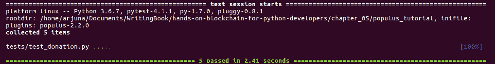

# 第五章：Populus 开发框架

在本章中，您将学习如何使用 Populus，这是一个智能合约开发框架。Populus 与 Truffle 一样，是一个旨在使您更容易开发智能合约的工具。如果我们回顾一下第三章，*使用 Vyper 实现智能合约*，您可能还记得我们必须手动创建一个`.json`文件，然后将控制台中的`abi`输出复制到`.json`文件中。使用 Populus，您可以避免重复执行先前执行过的手动工作。

本章将探讨以下主题：

+   设置 Populus

+   智能合约单元测试

+   使用 Populus 部署智能合约

# 设置 Populus

Populus 是一个智能合约开发框架，就像 Truffle 一样。那么为什么我们应该使用 Populus 而不是 Truffle 呢？基本上，这是个人选择。Populus 是用 Python 编写的，并默认支持 Python 进行单元测试。如果您使用 Truffle，则默认使用 JavaScript 进行单元测试。这就像选择`web3.py`（Python）或`web3.js`（JavaScript）来构建去中心化应用程序。

要设置 Populus，请遵循以下步骤：

1.  从头开始创建一个虚拟环境：

[PRE0]

1.  我们安装`web3`，`populus`和`vyper`：

[PRE1]

我们必须安装特定版本的`web3`的原因是因为最新版本的`web3`（4.8.2）会破坏 Populus。

1.  安装 Solidity 编译器：

[PRE2]

1.  创建一个符号链接：

[PRE3]

1.  创建一个项目目录：

[PRE4]

1.  使用`populus`初始化此项目目录：

[PRE5]

这个命令就像`truffle init`。学习了`populus`之后，您可能甚至不再需要这个命令。这个命令将在您的项目目录中放置两个目录—`contracts`和`tests`。

在`contracts`中，有一个示例 Solidity 文件：`Greeter.sol`。在`tests`目录中，有一个示例测试文件：`test_greeter.py`。

打开`Greeter.sol`，一个简单的智能合约，如下所示：

[PRE6]

在您可以编译智能合约之前，您必须创建一个名为`project.json`的项目配置。您必须首先进入项目目录：

[PRE7]

`populus-venv`是您创建虚拟环境的地方。如果您看一下，它是一个重要的文件，包含 255 行。您可以使用以下命令编译它：

[PRE8]

编译的结果是`build/contracts.json`。您可以在该`.json`文件中找到`abi`和`bytecode`。除了`abi`和`bytecode`之外，该`.json`文件中还有其他信息，例如编译器版本。

您已经熟悉了智能合约开发的工作流程。编译`Solidity/Vyper`文件，以便我们可以获得`abi`和`bytecode`。然后，使用`web3`库的`abi`和`bytecode`。

现在，您将遇到一些新的东西。有另一个目录是您还没有见过的：`tests`目录。在该目录中，有一个名为`test_greeter.py`的测试文件，这是一个单元测试。在这里看一下：

[PRE9]

您可以按以下方式执行此测试文件：

[PRE10]

这将给您以下输出：

[PRE11]

您的测试现在将通过。我们将在本章后面更深入地讨论智能合约单元测试。

# 添加对 Vyper 的支持

正如您所知，我们在本书中并不专注于 Solidity，而是 Vyper。我们需要为 Vyper 添加支持。首先，因为这是一个新的虚拟环境，所以安装`vyper`：

[PRE12]

然后，在项目目录中，在`contracts`目录中创建一个名为`Greeter.vy`的`.vy`文件：

[PRE13]

在您可以编译这个 Vyper 代码之前，您需要在`project.json`文件中更改一些内容。

转到`compilation`键。该键的值是一个具有这些键的对象：`backend`，`backends`，`contract_source_dirs`和`import_remappings`。删除`backends`键，然后将`backend`键更改为以下代码：

[PRE14]

因此，`compilation`键的内容如下：

[PRE15]

然后，像往常一样运行编译：

[PRE16]

确保这确实是一个 Vyper 编译，而不是 Solidity 编译，你可以打开`build/contracts.json`。在里面，你将能够看到以下内容：

[PRE17]

Vyper 的最新版本是 0.1.0b6，它破坏了 Populus。开发者需要一些时间来修复这个问题。如果在你阅读本书时这个 bug 还没有被修复，你可以自己修补 Populus。

首先，使用以下命令检查 bug 是否已经修复：

[PRE18]

在我们的情况下，这个 bug 还没有被修复。所以，让我们修补 Populus 来解决这个 bug。确保你仍然在同一个目录下（`populus-venv/src/populus`）：

[PRE19]

我们的 Populus 开发框架现在支持 Vyper。

# 智能合约单元测试

如果你运行单元测试，你将收到一个错误，因为数据类型不正确。解决方法是将所有字符串数据类型更改为`bytes`数据类型。然后，由于弃用警告，你应该改变调用智能合约方法的方式。

最终，你的单元测试，位于`tests/test_greeter.py`，应该是这样的：

[PRE20]

然后，如果你再次运行你的单元测试，它将会成功。

让我们来看一下第一个方法：

[PRE21]

你的单元测试函数大部分时间应该接受`chain`参数。从`chain`对象中，你可以获取一个提供者。如果你记得的话，提供者是一个连接到以太坊区块链的对象，无论是通过 HTTP 还是 IPC。从那里，你可以获取合约对象。测试框架是直接从区块链获取合约对象，还是在获取合约之前先部署合约，这取决于情况。在我们的情况下，是后者选项。测试框架在内存中创建一个合约对象并与之交互。单元测试结束后，一切都消失了。

之后，你将从永久区块链中获取合约对象。`provider`对象的`get_or_deploy_contract`返回两个对象。你通常只需要关注第一个对象，即合约对象。

从`contract`对象开始，执行智能合约的方法对你来说应该很熟悉。要执行`public`方法或获取公共变量的值，你将使用`functions`，接着是方法或公共变量加上`()`，最后以`call()`结束。

执行公共方法后，你将得到返回值。在这种情况下，你会得到一个`byte`对象，不像 Solidity 示例中的`string`。在 Vyper 中，没有一流的字符串支持。字符串被存储为`byte`对象。Vyper 仍处于活跃的开发模式中，但预计将来会发生变化。

在第二个单元测试中，你将测试智能合约中改变变量状态的方法：

[PRE22]

一切都和第一个单元测试一样，只是这里有两行新的内容：

[PRE23]

这是使用交易的方式。记住，交易是任何涉及改变合约状态的事情。你调用`functions`，接着是将改变合约状态的方法加上`()`，最后以`transact()`和必要的参数结束。之后，使用`chain`对象，你等待交易完成。在测试期间，这非常快。但如果你在另一个以太坊区块链上测试，比如在 Rinkeby 网络上，交易可能会持续几分钟。

让我们来看一个更复杂的例子。还记得你在第三章中编写的捐赠智能合约吗，*使用 Vyper 实现智能合约*。为什么我们不测试一下那个智能合约呢？

让我们将捐赠智能合约保存在您在第三章中开发的源代码文件夹中，*使用 Vyper 实现智能合约*。您可以将代码保存在`contracts/donation.vy`中。如果您忘记了这一点，可以参考以下 GitLab 链接上的代码文件获取完整的代码，[`gitlab.com/arjunaskykok/hands-on-blockchain-for-python-developers/blob/master/chapter_05/populus_tutorial/contracts/Donation.vy`](https://gitlab.com/arjunaskykok/hands-on-blockchain-for-python-developers/blob/master/chapter_05/populus_tutorial/contracts/Donation.vy)：

[PRE24]

我们想在这里测试许多不同的事情。

首先，让我们看一下构造方法：

[PRE25]

我们想测试`donatee`变量是否包含启动智能合约的账户地址。

让我们编写我们的第一个单元测试。您可以将此单元测试保存在`tests/test_donation.py`中：

[PRE26]

在这个单元测试中，我们使用了两个参数版本，因为我们想获取`web3`对象。如果您交换参数的顺序，实际上并不重要。`def test_donatee(web3, chain):`与`def test_donatee(chain, web3):`是一样的。

`get_or_deploy_contract`中的参数取自您的`.vy`文件的名称。因此，在命名源代码文件名时要小心。

有一件新的事情（但实际上并不新，因为您已经在第四章中遇到过这个），那就是`web3.eth.coinbase`。这是默认账户。在这个上下文（单元测试）中，它表示启动智能合约的账户的地址。

如果这个单元测试成功，让我们继续测试这个智能合约中的另一个方法：

[PRE27]

在这个方法中，您被迫向智能合约发送至少 1 个以太币。

通过编写第二个单元测试来测试失败情况：

[PRE28]

现在，您需要添加两个`import`语句：

[PRE29]

让我们学习如何在这个单元测试中处理异常。您可以将有问题的交易放在`with`语句中，该语句将捕获异常。基本上，您期望交易失败。当程序中出现故障时，它会返回一个特殊代码（例如，-1）或抛出异常。在这种情况下，它会抛出异常。

运行测试以查看它是否有效。然后，让我们测试成功的情况，也就是捐赠被接受（请参考以下 GitLab 链接上的代码文件获取完整的代码：[`gitlab.com/arjunaskykok/hands-on-blockchain-for-python-developers/blob/master/chapter_05/populus_tutorial/tests/test_donation.py`](https://gitlab.com/arjunaskykok/hands-on-blockchain-for-python-developers/blob/master/chapter_05/populus_tutorial/tests/test_donation.py)）:

[PRE30]

这是很多东西要消化的，所以让我们一步一步地讨论。

[PRE31]

我们将使用`time`库来检查此单元测试中的时间戳：

[PRE32]

您已经知道这个声明。使用`chain`对象，您可以获取提供者，然后使用该提供者的`get_or_deploy_contract`方法。结果是一个捐赠智能合约对象：

[PRE33]

`eth_tester`是一个旨在使您更轻松地测试智能合约的库。为此，您创建一个`EthereumTester`对象。该库中有许多辅助函数。其中一个函数是为您提供一些加载了大量 ETH 的账户，有点像 Ganache。第一个账户是管理账户或启动智能合约的账户。如前所示，您也可以从`web3.eth.coinbase`获取该账户。第二个账户等等是您可以在单元测试中使用的测试账户。

`t.get_accounts()`会给您很多账户。但是不要使用第一个账户，因为那将是管理账户。在这里，您使用第二个账户：

[PRE34]

你在之前的与 greeter 智能合约的单元测试中看到了`transact`函数。在这个`transact`方法中，你可以指定你想发送到智能合约的以太币金额。你也可以使用不同的账户。在这些`transact`参数中，我们还使用了辅助函数`web3.toWei`。否则，你必须使用很多零的数字。然后，你等待交易被确认：

[PRE35]

在完成这些之后，你可以访问公共变量来确认状态的变化。

对于数组，你在数组方法中放入一个索引，就像`donation.functions.donaturs(0).call()`中一样。

对于映射，你提供映射方法的参数中的键，而不是整数索引，就像`donation.functions.donatur_details__sum(donatur).call()`中一样。

对于结构体，你通过追加两个下划线来访问成员，就像`donation.functions.donatur_details__sum(donatur).call()`中一样。

然后，我们通过断言所有这些变量来测试捐款：

[PRE36]

然后我们检查捐赠者地址是否被正确记录：

[PRE37]

然后我们检查捐款金额是否被正确记录：

[PRE38]

然后我们检查捐赠者的姓名是否被正确记录：

[PRE39]

然后我们检查捐款发生的时间。我们这样做是因为时间是在交易在区块链中确认时记录的，所以你永远不知道交易何时被确认。在我们的情况下，这会很快。然而，如果你在 Rinkeby 网络中测试，这是需要牢记的事情。在这里，我确保单元测试时间和智能合约中记录的时间戳之间的差异不超过 10 分钟（600 秒）。

然后我们直接从智能合约的余额中检查捐款金额：

[PRE40]

这与之前的测试不同，之前的测试是通过检查公共变量的值来测试余额。在我们的情况下，我们有很多捐款，所以它们会不同。

让我们来看看智能合约中的最后一个方法：

[PRE41]

这是提取捐款的方法。不要笑；有些人启动了一个没有提取以太币方法的智能合约。这些智能合约中的所有以太币都将永远被锁定，这就是为什么测试很重要。它确保你不会犯这样的愚蠢错误。

在这个提款方法中，你想要测试你能否从智能合约中提取以太币。然后，你需要确保只有特定的账户（在这种情况下是经理账户）能够从智能合约中提取以太币。

让我们为此创建一个单元测试。首先，我们创建一个单元测试，以确保另一个账户无法从智能合约中提取以太币：

[PRE42]

现在一切应该对你来说都很熟悉了。你在`with`语句中包装提取以太币的失败情况，以捕获异常。

现在，让我们测试经理账户确实能够提取以太币的成功情况：

[PRE43]

这里的一切对你来说都很熟悉，除了最后一行。经理账户提取后的余额减去`initial_balance`不会完全是`1`个以太币，因为经理账户需要支付手续费。在这种情况下，我们只是使用一个粗略的测量来确保提取成功。只要差异低于 10 gwei，那就没问题。Gwei 是我们用来计算发送交易手续费的货币。1 gwei 等于 1,000,000,000 wei。如果你觉得这很困惑，你可以使用以太币货币进行断言，如下所示：

[PRE44]

运行测试：

[PRE45]

你应该得到一个成功的结果：

# 使用构造函数中的参数

我们测试的两个智能合约在构造函数中都没有参数。但是如果我们编写一个构造函数中带有参数的智能合约呢？我们如何测试呢？

让我们编写一个简单的智能合约，构造函数中带有参数。命名为`contracts/Greeter2.vy`：

[PRE46]

然后，编写以下测试。命名为`tests/test_greeter2.py`：

[PRE47]

在这里，您可以使用`pytest`的`fixture`功能自定义部署智能合约。首先，您从链的提供者那里获取合约工厂，然后将参数放在`factory`对象的`constructor`方法中，以`transact()`方法结束。然后，等待直到它在区块链上部署。最后，您将收到地址。

在测试函数中，您将参数放置在与 fixture 函数名称完全相同的位置。在这里，我们的 fixture 函数是`greeter2_contract`。在测试函数中，您只需将此对象用作类似于`chain.provider.get_or_deploy_contract('Donation')`返回的对象的智能合约对象。

现在，按以下方式进行测试：

[PRE48]

您应该得到一个成功的结果：

您仍然可以测试许多事项。我们只测试了一次捐赠，但我们可以接受多达 10 次捐赠。这也应该被检查。您希望测试覆盖率有多完整取决于您和项目的要求。还有许多单元测试方面我们在这里没有讨论，例如设置、拆卸和测试驱动开发。

# 使用 Populus 部署智能合约

Populus 不仅是一个旨在轻松开发和测试智能合约的框架。它还有一个部署智能合约到区块链的工具，包括私有链。

私有链基本上是您的私有以太坊区块链，类似于 Ganache，只是您自己构建它。就像在 Rinkeby 网络中的区块链一样，但您是唯一的矿工。您可以使用 geth 软件手动创建私有区块链；`populus`只是让您更容易。

创建新的私有`chain`的命令如下：

[PRE49]

此命令将在您的项目目录中创建一些文件。所有生成的文件都位于`chains`目录内。生成的文件之一是`chains/localblock/genesis.json`。创世文件的目的是指示以太坊区块链的初始配置：

[PRE50]

您不需要知道这些键的所有含义。`coinbase`表示所有挖矿奖励应该进入这个账户。`alloc`表示账户的初始余额。

除了创世文件之外，您还应该获得`chains/localblock/init_chain.sh`。打开它，您应该有以下内容：

[PRE51]

这个脚本基本上是用特定参数运行 geth 软件。最重要的参数是`init`，您将其提供给您的`genesis.json`文件。然后，运行您的私有区块链的初始化：

[PRE52]

然后，打开`chains/localblock/run_chain.sh`文件，您应该有以下内容：

[PRE53]

您现在需要注意的重要标志是`--mine`，`--password`，`--ipcpath`，`--unlock`和`--datadir`。`--mine`表示您想在这个私有区块链中进行挖矿，`--password`是密码文件的位置，`--unlock`解锁带有密码文件的账户，`--datadir`是您的私有以太坊区块链目录的位置，`--ipcpath`是当您运行您的私有以太坊区块链时`geth.ipc`将位于的位置。

在运行区块链之前，编辑`chains/localblock/run_chain.sh`脚本，将`--ipcpath`标志的值更改为`/tmp/geth.ipc`，然后运行区块链：

[PRE54]

现在，编辑`project.json`文件。`chains`键有一个包含四个键的对象：`tester`，`temp`，`ropsten`和`mainnet`。在这个对象中添加`localblock`键及其值。因此，`localblock`键必须与`tester`，`mainnet`，`temp`和`ropsten`键相邻，如下面的代码块所示：

[PRE55]

然后，您可以将您的智能合约部署到您的私有区块链中，如下所示：

[PRE56]

然后，你可以像在第四章*使用 Web3 与智能合约交互*中那样玩弄你的智能合约。你可以参考以下 GitLab 链接的代码文件：[`gitlab.com/arjunaskykok/hands-on-blockchain-for-python-developers/blob/master/chapter_05/populus_tutorial/interact_smart_contract_in_private_chain.py`](https://gitlab.com/arjunaskykok/hands-on-blockchain-for-python-developers/blob/master/chapter_05/populus_tutorial/interact_smart_contract_in_private_chain.py)，获取以下代码块的完整代码：

[PRE57]

你还在使用 Ganache 吗？如果是的，我们可以部署到 Ganache 区块链。首先启动 Ganache，然后将以下内容添加到`projects.json`文件中的`chains`键对象中：

[PRE58]

按照以下方式运行部署：

[PRE59]

然后，当你想在 Ganache 中玩弄你的智能合约时，你只需要像在[第四章中学到的那样调整提供者，*使用 Web3 与智能合约交互*：

[PRE60]

其余的代码是一样的。你可以将脚本命名为`interact_smart_contract_in_ganache.py`。在 Ganache 中，coinbase 账户和 manager 账户是 Ganache 中的第一个账户。参考 GitLab 链接获取与 Ganache 中智能合约交互的完整代码，[`gitlab.com/arjunaskykok/hands-on-blockchain-for-python-developers/blob/master/chapter_05/populus_tutorial/interact_smart_contract_in_ganache.py`](https://gitlab.com/arjunaskykok/hands-on-blockchain-for-python-developers/blob/master/chapter_05/populus_tutorial/interact_smart_contract_in_ganache.py)：

[PRE61]

# 摘要

在本章中，你学会了如何使用 Populus 开发框架开发智能合约。Populus 不支持 Vyper，只支持 Solidity。因此，你需要通过安装 Vyper 并编辑 Populus 项目配置文件来添加 Vyper 支持。你还学会了如何为智能合约创建单元测试。在这个单元测试中，你使用`web3`对象与智能合约进行交互并进行程序化测试。之后，你学会了如何创建私有链。最后，你将智能合约部署到了这个私有链和 Ganache。

在下一章中，你将构建一个比捐赠智能合约更复杂的区块链应用。这个应用是去中心化的投票应用。
