# 第七章：前端分散式应用程序

在本章中，我们将学习如何编写具有 GUI 前端的分散式应用程序。这是一个桌面分散式应用程序。人们可以使用按钮和文本字段与智能合约进行交互。这比 Truffle 控制台或`web3.py`脚本更进一步。在编写此 GUI 前端时，我们将学习处理智能合约的最佳实践，包括如何处理延迟以及如何在分散式应用程序中提供附加值。

在本章中，我们将学习以下主题：

+   设置 Qt GUI 库

+   安装 Qt for Python

+   Qt for Python 速成课程

+   为类似 Twitter 的应用程序编写智能合约

+   为类似 Twitter 的应用程序构建 GUI

# 设置 Qt GUI 库

Qt 库是一个设计用于创建多平台应用程序的 C++框架。在 Linux 中，该库是 KDE 桌面的基础。它的对应物是 GTK+库，是 Gnome 桌面的基础。然而，Qt 库已经提升了自己的游戏。您可以使用 Qt 库在 Android 和 iOS 上创建应用程序。有时人们错误地认为 Qt 库只能创建 GUI 应用程序。然而，Qt 库还包括非 GUI 库，例如数据存储、多媒体和网络。Qt 库甚至包含一个线程库！过去，您可以免费使用 Qt 库创建开源应用程序。但是，如果您想使用 Qt 库创建专有应用程序，您必须支付许可费。现在，在使用 Qt 库时，您可以有更多的灵活性。

您可以免费使用 Qt 库创建专有应用程序，但只有在为 Qt 库提供重新链接机制、提供许可证副本并明确承认 Qt 使用等情况下才可以。详情请参阅[`www.qt.io/download`](https://www.qt.io/download)。

# 选择 GUI 库

Python 有大量可供选择的 GUI 库。其中包括 Tkinter、Phoenix（wxPython）、PyGObject、PyQt、Qt for Python（PySide2）等。决定为 Python 应用程序使用哪个 GUI 库有时是主观的。

Tkinter 是一个 Python GUI 库，但 UI 不够流畅和精致。PyGObject 只有在您想要在 Linux 中编写桌面应用程序时才是一个不错的选择，因为它使用 GTK+。在 Windows 和 Mac 中也支持 GTK+，但不是本地支持。

我将选择 Qt for Python（[`www.qt.io/qt-for-python`](https://www.qt.io/qt-for-python)）库。这是 Qt 自己的官方 Python 绑定 Qt 库。不过要小心，还有另一家公司提供的 Qt 库的 Python 绑定。这个库叫做 PyQt，公司是 Riverbank。这两个库都支持最新的 Qt 库，即 Qt 5。

这两个库之间存在差异。如果您想使用 PyQt 编写和销售专有应用程序，必须从 Riverbank 购买许可证。然而，对于 Qt for Python，您不需要这样做，尽管它有自己的一套限制。例如，您必须为 Qt 库提供重新链接机制。有关 PyQt 的书籍已经出版，但在撰写本书时，Qt for Python 还没有相关书籍。

以前，可靠的 Python 绑定 Qt 只能从 Riverbank 获得。然而，在今年中期，Qt 宣布了其最新 Qt 库（Qt 5.11）的 Python 绑定。Qt 非常重视推广这个 Python 绑定。

# 安装 Qt for Python

首先，您必须安装 Qt 5.11。转到[`www.qt.io/download`](https://www.qt.io/download)。在下载库时，您有两种许可证可供选择——商业和开源。在这种情况下，您必须选择开源选项。

1.  如果你在 Linux 平台上，你将下载以下文件：`qt-unified-linux-x64-3.0.5-online.run`。

这是一个安装程序。如果你运行它，你会看到以下屏幕：

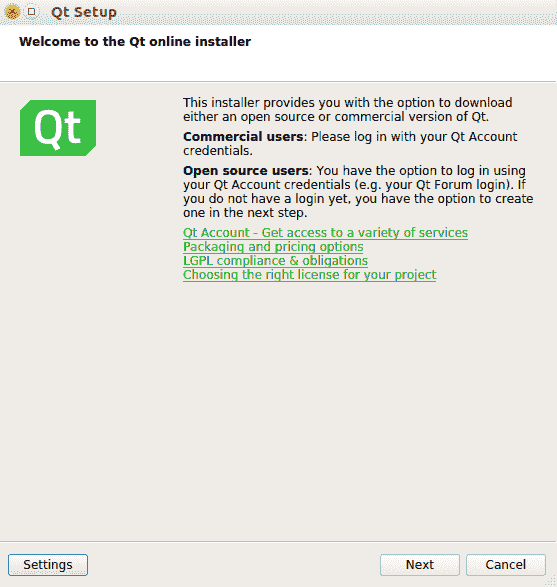

1.  点击下一步。然后你将会看到一个登录屏幕。如果你还没有账户，创建一个；这是免费的。之后，通过以下屏幕登录：

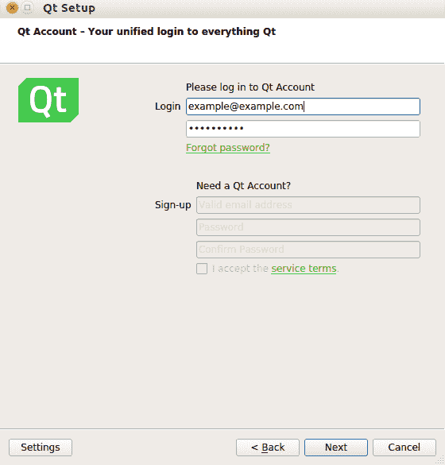

1.  然后，你会看到安装程序的欢迎屏幕。从这里，点击下一步：

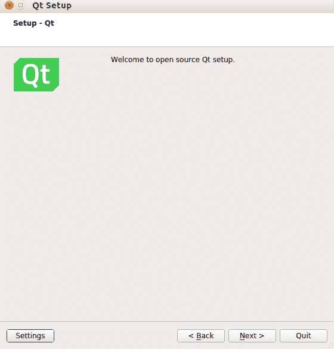

1.  指定你想要安装 Qt 库的位置：

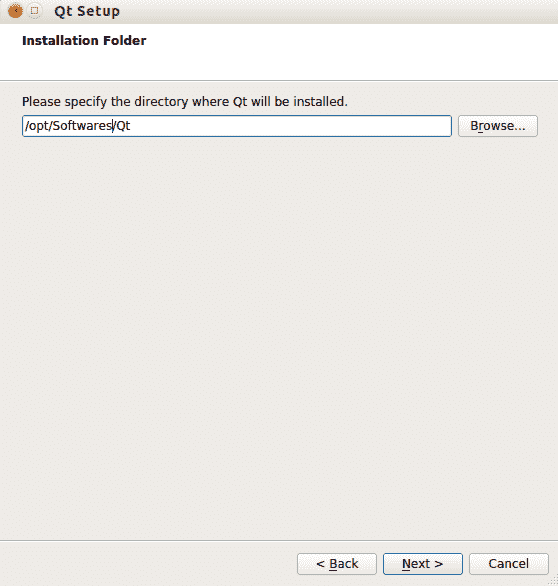

1.  然后选择 Qt 5.11.2 或最新的稳定版本：

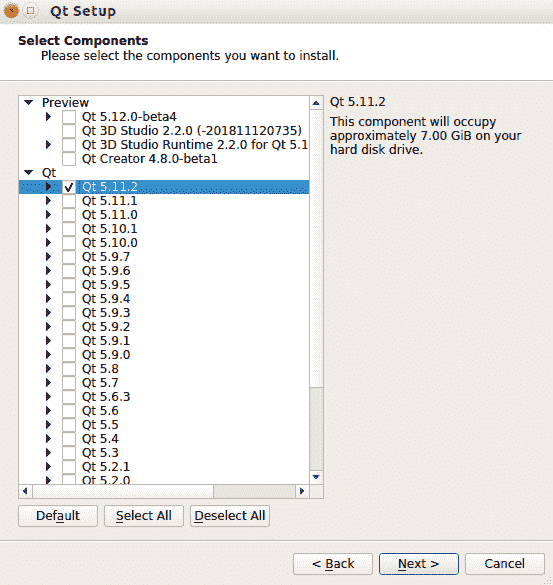

安装程序完成工作之前还需要一段时间。

1.  一旦 Qt 5 安装过程完成，你可以使用以下命令行安装 Python 绑定到 Qt：

[PRE0]

1.  我们将使用这个虚拟环境编写一个智能合约和一个去中心化应用程序。我们需要像往常一样安装`populus`，`vyper`和`web3`库：

[PRE1]

1.  将 Vyper 支持添加到`project.json`中，方法是将`"compilation"`键的值更改为以下内容：

[PRE2]

Vyper 的最新版本是 0.1.0b6，它破坏了 Populus。开发者需要一些时间来修复它。如果在你阅读本书时错误还没有被修复，你可以自己修补 Populus。

1.  使用以下命令检查错误是否已经被修复：

[PRE3]

在我们的情况下，错误尚未被修复。

1.  因此，让我们使用以下命令行修补 Populus 以修复错误。确保你仍然在同一个目录下（`qt-venv/src/populus`）：

[PRE4]

# Qt for Python 速成课程

让我们使用我们的 GUI 库编写一个简单的应用程序：

1.  创建一个名为`hello.py`的文件：

[PRE5]

1.  然后使用以下命令运行它：

[PRE6]

现在你会看到一个空白窗口：

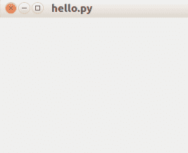

让我们通过这个文件更好地理解 Qt for Python：

[PRE7]

`sys`导入自标准 Python 库。这是必需的，因为我们想要在启动这个 GUI 应用程序脚本时从命令行获取参数。然后我们从`PySide2.QtWidgets`中导入`QApplication`和`QWidget`。

什么是`PySide2`？它来自`PySide`，这是 Qt 4 的 Python 绑定。`PySide2`是 Qt 5 的 Python 绑定。`PySide`于 2009 年由 Nokia（Qt 的前任所有者）发布。此前，诺基亚未能与 Riverbank 达成`PyQt`许可证 LGPL 的协议。因此，诺基亚决定创建自己的 Python 绑定用于 Qt，并将其命名为`PySide`。Qt 的所有权从诺基亚转移到了 Qt 公司。Qt 公司决定加强他们的努力来开发这个 Python 绑定用于 Qt，特别是在 Qt 5 发布后。

我们从`PySide2.QtWidgets`中导入的两个类是`QApplication`和`QWidget`：

+   `QApplication`是一个设计用来管理 GUI 应用程序流程和其设置的类。它检查你的桌面配置，比如字体，并将其传递给 GUI。它还理解来自桌面的传入对象，例如当你从文本编辑器复制文本并粘贴到 GUI 应用程序时。在你的 GUI 脚本中只能有一个`QApplication`：

[PRE8]

我们创建一个`QApplication`的实例，并传递命令行参数。大多数情况下，你不会使用任何命令行参数。例如，如果你想要告诉 GUI 应用程序使用不同的样式或从右到左显示文本以满足阿拉伯用户的需求，你可以传递命令行参数。

+   我们从`PySide2.QtWidgets`中导入的第二个类是`QWidget`。这是你在创建 GUI 应用程序时将要使用的任何小部件的基类，比如按钮、文本字段、滑块或标签。如果你构造基类，你会得到一个空窗口。这类似于 iOS 中的 UIView。然后我们调整窗口大小：

[PRE9]

使用`window.show()`方法，我们显示了窗口对象，然后使用`app.exec_()`进入了主循环。这是`QApplication`将所有来自桌面的事件分发到 GUI 的地方。我们使用`sys.exit()`将这个过程包装起来，这样我们就可以从`QApplication`中获取返回代码：

[PRE10]

# 布局

在添加另一个小部件之前，我们必须了解布局的概念。我们将使用两种布局，即`QHBoxLayout`和`QVBoxLayout`。这两种布局足以创建一个 GUI 应用程序。还有其他布局，比如`QGridLayout`和`QFormLayout`等等，但我们不需要它们。`QHBoxLayout`和`QVBoxLayout`就像 CSS 中的 flexbox。你可以将小部件放在使用`QHBoxLayout`的容器中，然后所有小部件将被放在一条水平线上。让我们看一个例子。将此脚本命名为`hello_horizontal_layout.py`：

[PRE11]

我将逐行解释代码。我们首先导入库：

[PRE12]

除了我们在之前的脚本中导入的类之外，我们还导入了`QHBoxLayout`（水平布局）和两个小部件（`QPushButton`和`QLabel`）：

[PRE13]

我们初始化了`QApplication`，然后是四个小部件（两个按钮和两个标签）。`QPushButton`和`QLabel`的第一个参数是它们的标签字符串。在这里，我们只是构建了四个小部件，但是还没有显示它们：

[PRE14]

上面的代码使用`QHBoxLayout`类构建了水平布局。然后我们将填充布局，使用我们之前构建的四个小部件。在这种情况下，`hello_button`将是布局中最左边的小部件，而`world_label`将是最右边的小部件。然后，我们构建了一个`window`对象，并告诉它使用我们的水平布局：

[PRE15]

这个语句将把我们的小部件放在窗口内：

[PRE16]

然后，我们显示窗口，执行`QApplication`实例，并使用以下命令运行它：

[PRE17]

然后你将会看到以下结果，从左到右显示了四个小部件：

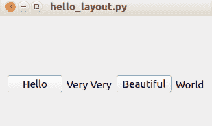

要获得垂直布局，创建另一个脚本并将其命名为`hello_vertical_layout.py`：

[PRE18]

在这里，你可以使用`QVBoxLayout`而不是`HBoxLayout`来获得垂直布局。使用以下命令运行脚本：

[PRE19]

然后你将会看到四个小部件从上到下显示在窗口中：

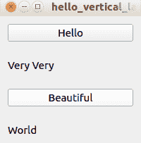

如果你想要结合水平和垂直布局，你可以将水平布局嵌入到垂直布局中，反之亦然。为此，请创建一个名为`hello_vertical_horizontal_layout.py`的脚本。请参考以下 GitLab 链接中的代码文件获取完整的代码：[`gitlab.com/arjunaskykok/hands-on-blockchain-for-python-developers/blob/master/chapter_07/crash_course_qt_for_python/hello_vertical_horizontal_layout.py`](https://gitlab.com/arjunaskykok/hands-on-blockchain-for-python-developers/blob/master/chapter_07/crash_course_qt_for_python/hello_vertical_horizontal_layout.py)：

[PRE20]

这里需要注意的是，你需要使用`addLayout`方法从一个布局中添加一个嵌套布局：

[PRE21]

在这里要注意！你使用`addLayout`方法将一个布局嵌入到另一个布局中，而不是`addWidget`。

运行以下脚本以查看嵌套布局：

[PRE22]

执行此操作将会给你以下的屏幕：

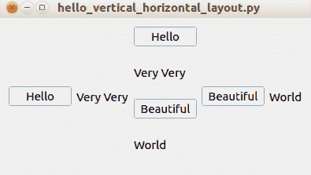

# 其他小部件

让我们创建一个脚本来展示更多种类的小部件。首先，将脚本命名为`hello_varieties.py`。请参考以下 GitLab 链接中的代码文件获取完整的代码：[`gitlab.com/arjunaskykok/hands-on-blockchain-for-python-developers/blob/master/chapter_07/crash_course_qt_for_python/hello_varieties.py`](https://gitlab.com/arjunaskykok/hands-on-blockchain-for-python-developers/blob/master/chapter_07/crash_course_qt_for_python/hello_varieties.py)。

脚本的内容可以在以下代码块中查看：

[PRE23]

让我们逐行解析代码。我们首先使用以下行导入库：

[PRE24]

在这里，我们导入了许多新类型的小部件，例如`QGroupBox`、`QSpinBox`、`QLineEdit`、`QRadioButton`和`QComboBox`。Qt 中有很多小部件，我们只是没有时间讨论所有的小部件。然后，我们初始化所有小部件：

[PRE25]

这些是新类型的小部件。让我们讨论这些新小部件及其独特属性。`QSpinBox`是一个用于选择数字的框。您可以通过单击上箭头或下箭头来旋转此小部件。`QLineEdit`是一个文本字段，而`QRadioButton`是一个单选按钮，`QComboBox`是一个选择框。然后，我们初始化水平布局和垂直布局：

[PRE26]

我们将一些小部件放入垂直布局中，并将其他一些小部件放入水平布局中。然后，我们需要将这些布局放入一个更大的容器中：

[PRE27]

我们现在使用`QGroupBox`类创建了两个分组框。第一个分组框有一个垂直布局，而另一个分组框有一个水平布局。分组框类似于带有边框的容器。这类似于 HTML 中的`
`：

[PRE28]

为了容纳这两个分组框，我们需要另一个布局。在这里，我们使用垂直布局。其余部分与往常一样。我们构建一个窗口，给它一个布局，然后在启动`QApplication`实例之前显示它。

运行以下脚本以查看许多不同类型的小部件：

[PRE29]

然后，您将看到一个看起来像这样的屏幕：

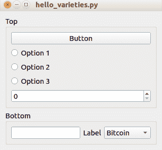

# 回调

此时，我们已经创建了许多小部件和布局。现在我们需要给一个小部件一个工作要做，我的意思是当按钮被点击时我们想要按钮做什么。当前，如果点击按钮，按钮将不会执行任何操作。

让我们创建一个简单的脚本来解释如何为按钮的点击事件提供回调。将其命名为`hello_connect_simple.py`。

脚本包含以下代码行：

[PRE30]

让我们逐行查看这段代码：

[PRE31]

除了您导入的通常库之外，您还必须导入`QtCore`。`QtCore`提供了小部件进行通信的一种方式。因此，如果您想要使按钮能够与标签通信，比如“在我被点击后，请将您的标签设置为此字符串”，您需要导入`QtCore`。然后创建小部件并将小部件放入布局中：

[PRE32]

您实例化`QApplication`类，创建一个按钮和一个标签，然后将小部件放入垂直布局中。

[PRE33]

在上述代码行中，我们创建一个函数来设置标签中的文本。`setText`是`QLabel`的一个用于更改标签的方法。在下一行中，我们将按钮的`clicked`信号连接到此函数。这意味着如果我们点击`QPushButton`，`set_text_in_world_label`将被执行。`QPushButton`除了`clicked`之外还有其他信号，例如`pressed`和`released`。然后，我们创建一个窗口小部件，并使用以下代码显示它：

[PRE34]

运行脚本以测试我们创建的回调：

[PRE35]

运行脚本后，您将得到以下屏幕：

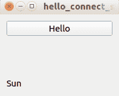

然后，如果您点击按钮，标签小部件将更改文本：

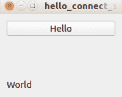

按钮没有参数发送到回调函数。但是另一个小部件可能有参数发送到回调函数。

让我们创建一个脚本来说明这个选项。将脚本命名为`hello_connect_param.py`。脚本的内容可以在以下代码块中查看：

[PRE36]

关注这些行，看看我们如何在小部件的回调中使用参数：

[PRE37]

我们的回调函数有一个参数。行编辑小部件的`textChanged`信号有一个参数。当我们更改行编辑小部件中的文本时，文本将被发送到回调函数。

这行代码`hello_line_edit.textChanged.connect(set_world_label)`相当于`hello_line_edit.connect(QtCore.SIGNAL('textChanged(QString)'), set_world_label)`。

运行脚本以测试具有参数的回调：

[PRE38]

当您在行编辑中输入时，标签小部件中的文本也会更改：

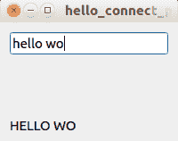

我们使用回调是因为我们希望在将文本设置到标签小部件之前对其进行操作。但是，如果你想直接将文本参数从行编辑小部件发送到标签小部件，你不必创建一个专门的函数，你可以使用“信号”和“槽”。

为此，删除回调，然后将`line hello_line_edit.textChanged.connect(set_world_label)`更改为`hello_line_edit.connect(QtCore.SIGNAL('textChanged(QString)'), world_label, QtCore.SLOT('setText(QString)'))`。

当你在行编辑中输入文本时，你的文本将直接显示在标签中。

你也可以将那一行更改为`QtCore.QObject.connect(hello_line_edit, QtCore.SIGNAL('textChanged(QString)'), world_label, QtCore.SLOT('setText(QString)'))`。

我希望你能看到这里的模式。如果小部件 A 想要与小部件 B 通信，小部件 A 将使用“信号”与小部件 B 的“槽”连接。当然，你也可以将“槽”部分替换为一个自定义的回调，通过它调用小部件 B 的 API。

这个“信号”和“槽”概念是通用的，不仅限于 GUI 小部件。这意味着你可以定义自定义的“信号”和自定义的“槽”。

让我们创建一个脚本来说明这个新概念：

[PRE39]

让我们解剖这个脚本。我们导入了库：

[PRE40]

槽和信号功能来自`QtCore`类。你可以使用`Slot`装饰器创建一个`槽`函数：

[PRE41]

你也可以创建一个`QObject`的子类来创建一个“信号”对象：

[PRE42]

你必须实例化这个类。“信号”必须是实例的一部分，而不是一个类。然后你可以将它与一个“槽”函数连接如下：

[PRE43]

最后一部分是将参数从“信号”发送到“槽”。

运行脚本以测试回调是否仍然有效：

[PRE44]

# 线程

要在 Qt 中使用线程，我们可以使用`QtCore`中的`QThread`类。希望你能看到这里有一个模式。`QtCore`除了创建小部件之外还有许多功能。线程很重要，因为在构建去中心化应用程序时，我们将不得不等待相当长的时间来确认交易。根据你在以太坊中的燃气和交通慷慨程度，等待时间可能从几分钟到半个小时不等。我们不希望 GUI 应用程序冻结一分钟，更不用说半个小时了。

让我们创建一个简单的脚本来演示如何使用`QThread`创建一个线程。将脚本命名为`hello_thread.py`：

[PRE45]

然后，你将在编写`run`方法内部的类中对`QThread`进行子类化。要使用这个线程类，你需要实例化这个类，然后调用`start`方法。然后你可以在主应用程序中做所有你想做的事情，同时等待线程类完成它的工作。如果你想等待线程类完成工作，你可以从线程类中调用它的`wait`方法。

线程是一个广泛的主题。我们还没有讨论互斥锁或线程安全，但对于我们的去中心化应用程序来说，我们不需要讨论这些。

有些人对在他们的应用程序中使用线程感到恐惧。另一种选择是使用`asyncio`库使用单线程并发代码。这完全没问题，但在这种情况下，我们将使用线程。

我们已经知道如何使用 Qt 库来构建 Python 桌面应用程序的所有必要知识。在编写 GUI 去中心化应用程序之前，我们需要编写一个智能合约，因为没有这个，就不会有去中心化应用程序。

# 编写 Twitter 样应用程序的智能合约

我们现在要构建一个抗审查的类似 Twitter 的应用程序。这意味着即使智能合约的所有者也无法删除用户的推文。这个类似 Twitter 的应用程序非常简单；没有关注、点赞或转发的选项；它只包括推文。此外，用户无法删除他们的推文，推文必须少于 32 个字节，这甚至比 Twitter 原始推文限制还要短！

现在我们回到我们的 Populus 项目，修改我们的`project.json`文件。将这个添加到`project.json`中：

[PRE46]

这是智能合约。在`twitter_like_projects/contracts`目录中创建一个`TwitterOnBlockchain.vy`文件*：*

[PRE47]

这是一个非常简短的智能合约。

我们从结构数据类型变量声明和地址到该结构数据类型变量的映射开始：

[PRE48]

`tweets`变量是从地址到`messages`和`index`数组的映射数据类型。`messages`数组的长度为 10 个`bytes32`数据类型变量，这意味着每个账户或地址在这个智能合约中最多可以有 10 条推文。`index`是指向`messages`数组的指针。每次创建一条推文，`index`增加 1，这样它就可以指向`messages`数组中的下一个槽。

[PRE49]

`write_a_tweet`函数是创建一条推文的方法。这只是将一条推文插入到`messages`数组中，并加入一些保护措施以避免越界错误。

# 测试

这是对这个智能合约的测试。您可以将测试文件保存在`tests/test_twitter_on_blockchain.py`中。有关完整代码，请参考以下 GitLab 链接中的代码文件：[`gitlab.com/arjunaskykok/hands-on-blockchain-for-python-developers/blob/master/chapter_07/twitter_on_blockchain/tests/test_twitter_on_blockchain.py`](https://gitlab.com/arjunaskykok/hands-on-blockchain-for-python-developers/blob/master/chapter_07/twitter_on_blockchain/tests/test_twitter_on_blockchain.py)。

以下代码块显示了代码：

[PRE50]

这个测试确保`index`从零开始，并且在用户在这个智能合约中发推文后会增加一。它还检查推文是否保留在`messages`数组中。

让我们思考一下。如果你看看智能合约，所有者无法审查任何人的推文。所有者甚至无法删除智能合约，因此政府或黑手党都无法向智能合约的所有者施加压力来审查推文。将这种情况与应用程序所有者使用传统网络应用程序的情况进行比较。应用程序所有者可以通过从数据库中删除条目来审查推文。另外，政府或黑手党可以向应用程序所有者施加压力来审查推文，或者政府或黑手党可以关闭托管服务器。在区块链的情况下，这意味着人们需要关闭一半的 10,000 个节点才能破坏以太坊区块链，以摧毁智能合约。

这是区块链特有的一种特性——**抗审查**。这并不意味着它不能被审查，但很难被审查。为了关闭这个智能合约，政府必须禁止以太坊网络本身。另外，他们可以在所有公民的计算机上安装间谍软件，并确保他们不访问这个智能合约。此外，抗审查并不意味着它保护隐私。政府仍然可以弄清楚谁写了什么。

要部署智能合约，运行 Ganache，编译智能合约，然后使用以下命令将智能合约部署到 Ganache：

[PRE51]

# 固定装置

在我们开发一个去中心化的 GUI 应用之前，让我们先写一个脚本来在智能合约中放一些固定数据。固定数据就像样本数据。这样可以让应用的开发体验更加愉快。将脚本命名为`fixtures.py`。完整的代码请参考以下 GitLab 链接中的代码文件：[`gitlab.com/arjunaskykok/hands-on-blockchain-for-python-developers/blob/master/chapter_07/dapp/fixtures.py`](https://gitlab.com/arjunaskykok/hands-on-blockchain-for-python-developers/blob/master/chapter_07/dapp/fixtures.py)：

[PRE52]

让我们逐行解析这个脚本。我们从`web3`中导入`Web3`类和`HTTPProvider`类。我们使用`HTTPProvider`是因为我们想使用 Ganache。然后我们从`populus`库中导入`wait_for_transaction_receipt`：

[PRE53]

然后我们有了前三个账户的私钥：

[PRE54]

我们不需要第一个账户的私钥或启动智能合约的账户；我们只需要第二个和第三个账户：

[PRE55]

这是你可以从智能合约的编译中得到的`abi`：

[PRE56]

你将智能合约的地址放在`address.txt`文件中。在通过 Populus 部署智能合约时，你会收到这个地址。

然后，根据智能合约的地址和`abi`构建一个智能合约对象：

[PRE57]

对于每个账户，你创建 10 条推文。每条推文都是像'Tweet 1'，'Tweet 2'这样的。这些固定数据使我们能够在不必先创建推文的情况下检查推文。这对检查应用的功能是有益的。

# 为 Twitter 类似应用构建 GUI 前端

现在让我们构建一个去中心化的 GUI 应用。将脚本命名为`twitter_dapp.py`。完整的代码请参考以下 GitLab 链接中的代码文件：[`gitlab.com/arjunaskykok/hands-on-blockchain-for-python-developers/blob/master/chapter_07/dapp/twitter_dapp.py`](https://gitlab.com/arjunaskykok/hands-on-blockchain-for-python-developers/blob/master/chapter_07/dapp/twitter_dapp.py)：

[PRE58]

让我们逐行解析这个脚本。在这里，我们导入必要的类并将我们的`web3`对象设置为 Ganache，它在本地主机的端口`7545`上提供智能合约。

[PRE59]

然后，我们像往常一样定义`abi`：

[PRE60]

然后，我们通过提供智能合约的地址和`abi`来创建一个智能合约对象。

这是一个辅助函数，用于从字符串中移除`'\x00'`：

[PRE61]

记住，我们在智能合约中的推文数据类型是`bytes32`，它会一直添加`\x00`直到达到 32 个字节。因此，如果你将一个长度为 5 个字节的`'messi'`字符串设置为这个`bytes32`变量，它将变成`'messi\x00\x00\x00\x00...\x00'`。这个实用函数将从字符串中去掉`\x00`，这样我们就可以得到`'messi'`。然后，我们进入线程类的定义：

[PRE62]

这是一个线程类，旨在从区块链中读取数据。但是读取数据不应该很快吗，因为我们使用的是 Ganache，不需要涉及矿工？如果你的区块链节点和 GUI 前端脚本在同一台计算机上，那么这个线程类是不需要的。但是，如果你将区块链节点放在云上呢？也许你的本地计算机没有足够的空间，这就是你这样做的原因。这种设置会在你的程序中引入延迟，所以最好使用一个线程来等待来自云端区块链的结果。

`fetched_posts`是一个信号，将把推文列表发送到我们稍后将定义的槽中。在`run`方法中，我们首先获取索引，这样我们就知道推特发布了多少条。由于我们从智能合约中得到的是一个字节，所以在将推文发送到`slot`函数之前，我们首先对其进行解码。

以下代码是一个线程类，我们用它来创建智能合约中的交易。要使用这个线程类，我们需要一个私钥。请记住，我们需要用私钥签署交易。然而，我们还需要地址以便获取 nonce。我们也可以要求用户输入地址，但这将是多余的。我们可以通过使用`account = w3.eth.account.privateKeyToAccount('0x'+self.private_key)`方法从私钥中派生地址：

[PRE63]

获取地址后，我们用这行获取`nonce`：

[PRE64]

然后像往常一样构建交易，签署交易，并发送交易到区块链。然后，我们等待交易确认。之后，我们向`slot`函数发出信号，稍后我们将定义该函数。

[PRE65]

现在，是时候创建一个 GUI 了。我们设置窗口标题，子类化`QWidget`，并设置私人分组框，我们将从用户那里请求私钥。我们将添加一个写入按钮小部件，并配置一个用于显示推文的分组框。然后准备一个用于显示书签的分组框，并将它们全部添加到垂直布局中。此外，我们创建了两个线程实例。对于每个线程实例，我们将它们的信号连接到`slot`函数：

[PRE66]

在这个方法中，我们创建一个分组框，放置行编辑器以接收私钥。我们还放置一个标签，用于在输入有效的私钥时显示通知。在这里，我们使用`QFormLayout`，而不是`QHBoxLayout`或`QVBoxLayout`。`QFormLayout`非常适用于创建两列布局。第一列通常用作标签的容器，而第二列通常用作输入的容器，例如行编辑器。因此，使用这个布局，我们使用`addRow`方法，它接受一个或两个参数。如果参数数量为两个，则参数将是左列上的小部件和右列上的小部件。然后我们添加一个私钥标签和一个行编辑器，然后是一个确定对话框按钮和一个通知标签。对于对话框按钮，我们将点击信号连接到一个名为`checkPrivateKey`的方法。

在接下来的方法中，我们在水平布局中创建一个按钮。我们将点击信号连接到一个名为`writeANewTweet`的方法：

[PRE67]

在接下来的方法中，我们创建一个分组框来显示推文。首先有一个行编辑器来接受推特的地址。这旁边有一个按钮用于获取推文和将地址加入书签。回调函数将稍后定义。我们还在布局内放置了一个布局来显示所有推文：

[PRE68]

在接下来的方法中，我们创建一个分组框来显示书签。这个书签布局只是一个普通的垂直布局。我们从文本文件中读取书签，然后处理这些行。基本上，处理是从文本行中删除换行符：

[PRE69]

这是用于获取推文的`slot`函数。它使用线程来完成任务。

[PRE70]

这是`slot`函数，它将推特的地址添加到书签文本文件中。在将书签添加到书签文本文件后，它会更新书签布局：

[PRE71]

在这个方法中，我们启动一个只有一个行编辑器的输入对话框。获取输入后，我们在运行之前将输入发送到线程类：

[PRE72]

这是一个回调函数，用于检查私钥是否有效。如果有效（地址可以从私钥中派生），我们将通知标签设置为成功：

[PRE73]

这两个方法用于填充推文到推文布局中。首先，我们清除垂直布局中的推文。我们可以使用`takeAt`方法从布局中获取每个小部件。没有方法可以删除布局的所有子小部件；我们必须逐个迭代它们。如果小部件存在，我们可以删除它。清除布局中的所有推文后，我们使用`addWidget`方法填充布局以显示新的推文。处理书签时也使用了相同的策略：

[PRE74]

在接下来的两种方法中使用相同的策略。我们通过逐个迭代并删除小部件来清除书签布局中的书签小部件。然后，我们通过`addWidget`方法在书签布局中填充书签。处理推文和书签的一个区别是，我们配置了书签部分中的标签，以便可以使用鼠标进行选择。负责此操作的方法是`setTextInteractionFlags`方法。

参数是标签的当前标志，该标志与`Qt.TextSelectableByMouse`标志掩码。如果您在不使用前一个值掩码的情况下使用此代码，`label_field.setTextInteractionFlags(QtCore.Qt.TextSelectableByMouse)`，则可以删除标签小部件具有的所有当前标签选择配置标志。大多数情况下，您不希望这样做：

[PRE75]

这是设置标签小部件中成功消息的回调：

[PRE76]

最后，我们启动 GUI 前端：

[PRE77]

在 Ganache 中输入第二个地址以获取执行固定脚本时设置的推文：

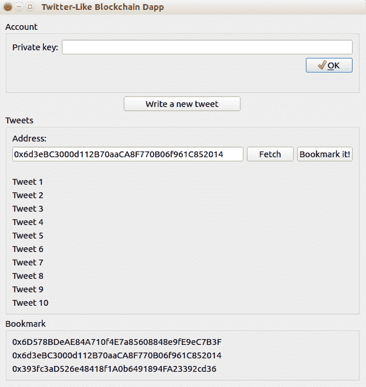

输入私钥并单击确定：

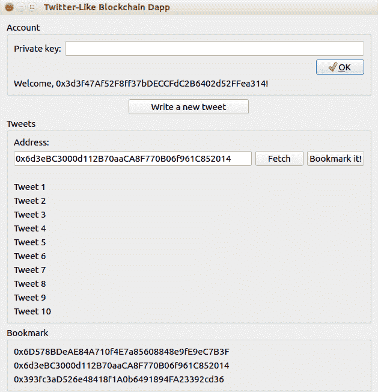

单击“撰写新推文”按钮。它将启动对话框。然后输入您的推文并单击确定：

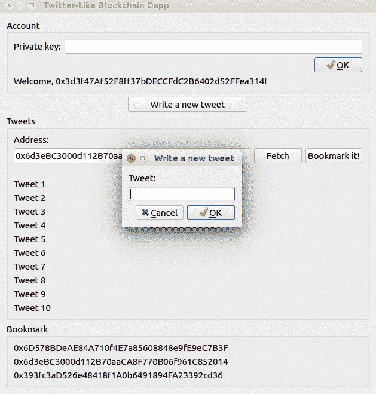

输入新推文并确认后，您将收到成功消息。然后，您可以单击按钮（收藏！）将地址保存到`bookmarks`文本文件中：

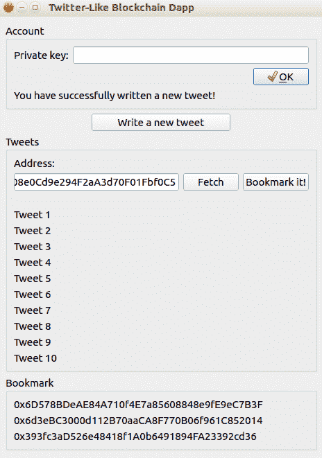

如果您想为智能合约或去中心化应用程序构建前端，需要牢记两件事。首先，要优雅地处理阻塞功能（向区块链发送交易并等待），可以使用线程或单线程协程（使用`asyncio`库）。其次，虽然智能合约处理核心事务（审查抵抗消息），但您可以为去中心化应用程序增加更多价值。在我们的示例应用程序中，增加的价值是书签实用程序。您可以在智能合约中添加书签功能吗？当然可以。但是，如果将功能放在智能合约中，就会失去隐私，因为每个人都可以阅读您的书签。

简而言之，由于智能合约的限制，您无法将每个功能都放在智能合约中。因此，如果要使用机器学习添加情感分析，最好在智能合约之外进行此操作。

# 总结

在本章中，我们学习了如何为智能合约构建 GUI 前端，以及如何使用 Qt for Python 或`PySide2`库，该库利用了 Qt 5 库。我们抽出时间学习如何使用 Qt for Python 构建 GUI 应用程序。从一个简单的应用程序开始，我们了解了布局、各种小部件、信号和插槽以及线程，最终了解了如何使用`PySide2`库。我们构建了我们的智能合约，以简单的方式模拟 Twitter，享受这种类似 Twitter 应用程序的审查抵抗。接下来，我们构建了 GUI 前端。此 GUI 应用程序使用了迄今为止学到的所有概念。我们使用线程连接到区块链，以便 GUI 不会冻结。我们还通过在 GUI 应用程序中添加书签功能来增加附加值。

在下一章中，您将学习如何创建 ERC20 代币。这是使以太坊在开发人员中受欢迎的原因。代币可以在某些环境中用作货币的替代品。
