# 第八章：在以太坊中创建代币

在本章中，您将学习如何在以太坊上创建代币。代币有各种用途；它可以是一个社区的本地货币，它可以代表一个实物商品，它可以是游戏中的虚拟货币，或者它可以是忠诚度积分。有了这个代币，您可以构建一个新的加密货币。虽然以太坊本身就是一种加密货币，但您可以在其上构建一个新的加密货币。以太坊使得创建新代币变得更加容易，这推动了 2017 年许多新加密货币的诞生。

本章将涵盖以下主题：

+   如何创建一个简单的代币智能合约

+   ERC 20（以太坊代币标准）

+   如何出售您的代币

+   如何自定义您的代币

# 代币智能合约

使用 Vyper 在以太坊上创建代币很容易。在构建代币之前，让我们遵循初始步骤准备我们的开发环境。

首先确保您已经安装了 geth，并且`geth`程序在`$PATH`环境变量中（这意味着您可以在不输入完整路径的情况下调用`geth`）：

```py
$ virtualenv -p python3.6 token-venv
$ source token-venv/bin/activate
(token-venv) $ pip install eth-abi==1.2.2
(token-venv) $ pip install eth-typing==1.1.0
(token-venv) $ pip install py-evm==0.2.0a33
(token-venv) $ pip install web3==4.7.2
(token-venv) $ pip install -e git+https://github.com/ethereum/populus#egg=populus
(token-venv) $ pip install vyper
(token-venv) $ mkdir token_project
(token-venv) $ cd token_project
(token-venv) $ mkdir tests contracts
(token-venv) $ cp ../token-venv/src/populus/populus/assets/defaults.v9.config.json project.json
```

通过将`compilation`键的值更改为以下内容，向`project.json`添加 Vyper 支持：

```py
"compilation": {
    "backend": {
      "class": "populus.compilation.backends.VyperBackend"
    },
    "contract_source_dirs": [
      "./contracts"
    ],
    "import_remappings": []
},
```

Vyper 的最新版本是 0.1.0b6，它破坏了 Populus。开发者需要一些时间来解决这个问题。如果到您阅读本书时错误仍未被修复，您可以自己修补 Populus。

首先，使用以下命令检查错误是否已被修复：

```py
(token-venv) $ cd voting-venv/src/populus
(token-venv) $ grep -R "compile(" populus/compilation/backends/vyper.py
 bytecode = '0x' + compiler.compile(code).hex()
 bytecode_runtime = '0x' + compiler.compile(code, bytecode_runtime=True).hex()
```

在我们的案例中，错误尚未被修复。因此，让我们修补 Populus 以修复错误。确保您仍然在同一个目录（`token-venv/src/populus`）中：

```py
(token-venv) $ wget https://patch-diff.githubusercontent.com/raw/ethereum/populus/pull/484.patch
(token-venv) $ git apply 484.patch
(token-venv) $ cd ../../../
```

在`token_project`目录中，运行以下命令：

```py
(token-venv) $ populus chain new localblock
```

然后，使用`init_chain.sh`脚本初始化私有链：

```py
(token-venv) $ ./chains/localblock/init_chain.sh
```

编辑`chains/localblock/run_chain.sh`并将`--ipcpath`的值更改为`/tmp/geth.ipc`。

然后，运行区块链：

```py
(voting-venv) $ ./chains/localblock/run_chain.sh
```

现在，编辑`project.json`文件。`chains`有一个包含四个键的对象：`tester`，`temp`，`ropsten`和`mainnet`。向此对象添加一个名为`localblock`的键，并将其值添加到此对象中：

```py
    "localblock": {
      "chain": {
        "class": "populus.chain.ExternalChain"
      },
      "web3": {
        "provider": {
          "class": "web3.providers.ipc.IPCProvider",
        "settings": {
          "ipc_path":"/tmp/geth.ipc"
        }
       }
      },
      "contracts": {
        "backends": {
          "JSONFile": {"$ref": "contracts.backends.JSONFile"},
          "ProjectContracts": {
            "$ref": "contracts.backends.ProjectContracts"
          }
        }
      }
    }
```

# Mist

在第二章中，*智能合约基础*，和第三章中，*使用 Vyper 实现智能合约*，您使用 Truffle 控制台与智能合约进行交互。现在，我们将使用另一种软件与智能合约进行交互。我们将使用的软件是`Mist`，一个以太坊钱包。

为此，请访问[`github.com/ethereum/mist/releases`](https://github.com/ethereum/mist/releases)。如果您使用 Linux Ubuntu，下载`Mist-linux64-0-11-1.deb`文件。

确保`geth`已经安装，并且`geth`的路径在`$PATH`环境变量中，这样您就可以从任何地方调用`geth`。

然后，按照以下步骤安装 Mist：

```py
$ dpkg -i Mist-linux64-0-11-1.deb
```

接下来，按照以下步骤运行应用程序：

```py
$ ethereumwallet --rpc /tmp/geth.ipc
```

注意`--rpc /tmp/geth.ipc`标志。我们使用这个标志是因为我们使用在`/tmp/geth.ipc`中定义的套接字文件运行私有区块链。

运行应用程序后，您将看到这个屏幕。您可以通过点击“添加账户”按钮创建一个以太坊区块链账户：

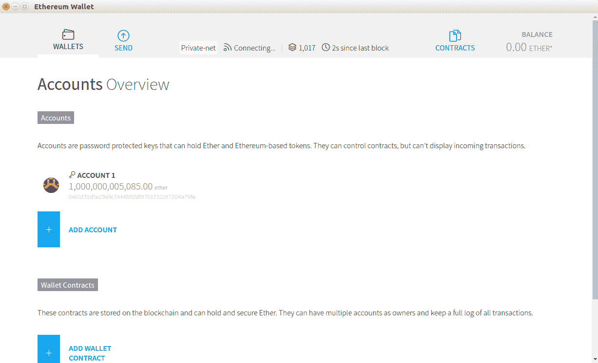

就像您在`geth`控制台中所做的那样，您需要提供密码来创建一个新账户：

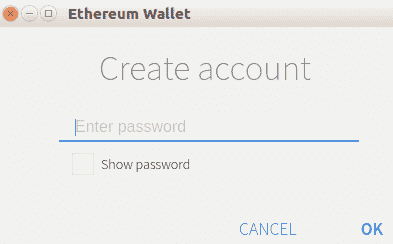

一旦您的钱包账户创建完成，您可以通过点击“发送”选项卡，从第一个账户向这个新账户发送一些钱：

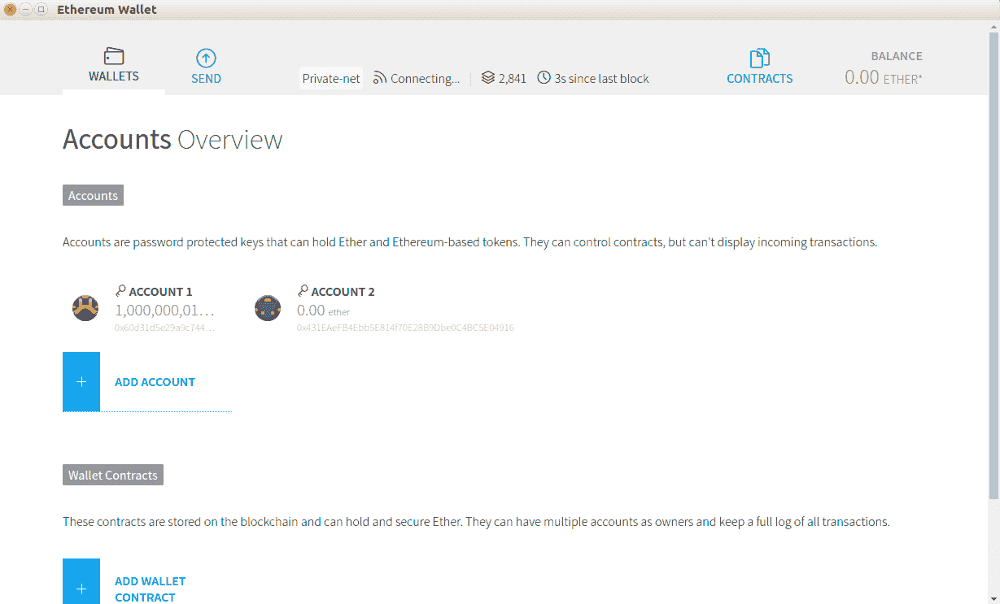

然后，您可以在“TO”字段中插入您的新账户地址。不要忘记包括您想发送的以太币数量，然后点击窗口底部的“发送”按钮：

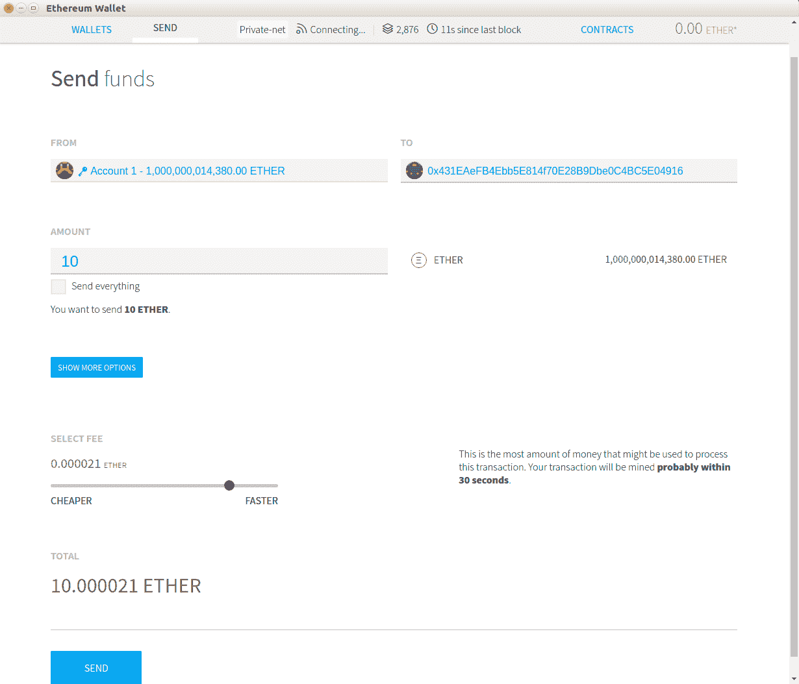

您必须填写密码以创建交易。默认账户的密码可以在`chains/localblock/password`文件中找到：

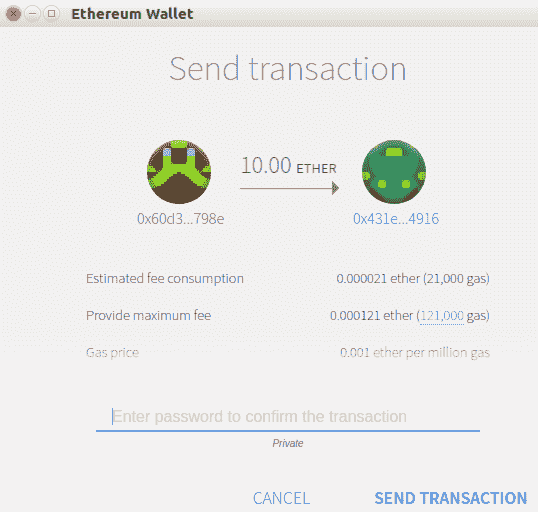

很快，您的交易将在区块链中得到确认：

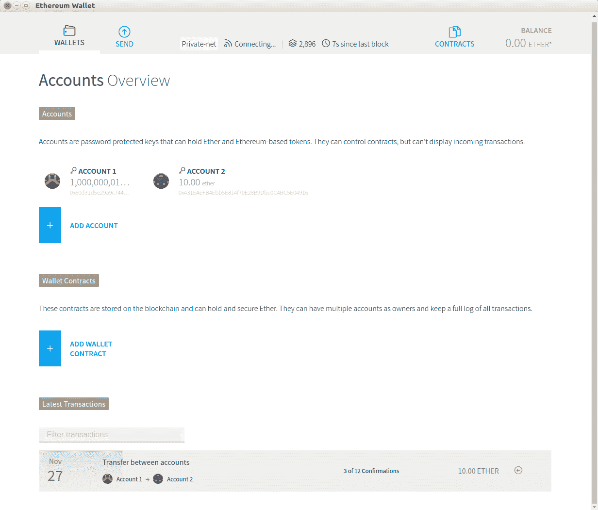

让我们在`token_project/contracts`目录中创建一个简单的代币智能合约：

```py
balances: public(map(address, uint256))

@public
def __init__():
    self.balances[msg.sender] = 10000

@public
def transfer(_to: address, _amount: uint256) -> bool:
    assert self.balances[msg.sender] >= _amount

    self.balances[msg.sender] -= _amount
    self.balances[_to] += _amount

    return True
```

这个智能合约数字化地创建了 10,000 个代币，并将它们全部分配给智能合约的所有者。然后，所有者可以使用`transfer`方法将代币转发给其他账户。

与创建传统网络应用程序中的简单代币相比，这个简单的智能合约是特殊的，因为一旦部署了这个智能合约，所有者无论多么绝望都无法更改代币数量。如果所有者刚刚执行了`transfer`方法将一些代币转移到另一个账户的地址，他们就无法再拿回来了。其他人在与之交互之前可以验证智能合约中的游戏规则。

将这个与我们在传统的网络应用程序中创建的简单代币进行比较。一旦您在这里创建了 10,000 个代币，您可以通过更新数据库中的代币数量来改变代币的数量。您可以随意更改规则，这会让其他想要与这个应用程序交互的人处于不利地位。

您还可以添加一个方法来增加智能合约中代币的数量：

```py
balances: public(map(address, uint256))
owner: address

@public
def __init__():
    self.balances[msg.sender] = 10000
    self.owner = msg.sender

@public
def transfer(_to: address, _amount: uint256) -> bool:
    assert self.balances[msg.sender] >= _amount

    self.balances[msg.sender] -= _amount
    self.balances[_to] += _amount

    return True

@public
def mint(_new_supply: uint256):
    assert msg.sender == self.owner
    self.balances[msg.sender] = _new_supply
```

看一下`mint`方法。这可以用来增加所有者账户中的代币数量。

不同之处在于，您无法在部署智能合约后更改游戏规则。如果您部署了这个版本的智能合约，人们可以要求源代码和编译器的版本来验证代码。如果您不提供源代码，人们可能会对您的智能合约失去兴趣。如果您提供了源代码，人们可以检查并看到您有一个可以随时增加代币的方法。他们是否接受这个规则取决于他们自己，但至少通过智能合约，有透明度。

以下代码块是对这个简单代币智能合约的测试；这个测试并不全面，但它可以让你有一个良好的开始。对于代币智能合约来说，测试的重要性是至关重要的。首先，将测试命名为`test_simple_token.py`，并将其放在`token_project/tests`目录中。请参考以下 GitLab 链接中的代码文件获取完整的代码：[`gitlab.com/arjunaskykok/hands-on-blockchain-for-python-developers/blob/master/chapter_08/token_project/tests/test_simple_token.py`](https://gitlab.com/arjunaskykok/hands-on-blockchain-for-python-developers/blob/master/chapter_08/token_project/tests/test_simple_token.py)：

```py
import pytest
import eth_tester

def test_balance(web3, chain):
    simple_token, _ = chain.provider.get_or_deploy_contract('SimpleToken')

...
...

    with pytest.raises(eth_tester.exceptions.TransactionFailed):
        simple_token.functions.transfer(web3.eth.coinbase, 10).transact({'from': account2})
```

让我们使用 Mist 将我们的简单代币智能合约（第一个，没有`mint`函数）部署到区块链上。

要做到这一点，点击 CONTRACTS 选项卡，然后点击 DEPLOY NEW CONTRACT 按钮：

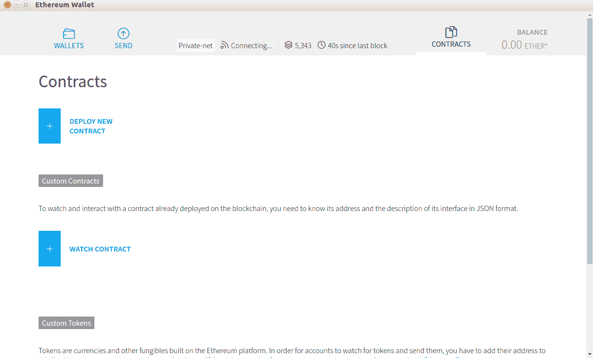

在部署合约屏幕上，选择要从中部署的账户，然后单击 CONTRACT BYTE CODE 选项卡。在那里插入我们简单代币智能合约的字节码。当然，首先编译智能合约的源代码，然后可以从`token_project/build/contracts.json`中获取我们简单代币的字节码。找到`bytecode`键的值，并将该值复制到 CONTRACT BYTE CODE 选项卡中，不包括双引号。完成后，单击 DEPLOY 按钮（在下面的截图中看不到；您需要向下滚动），然后像往常一样在密码对话框中填写密码：

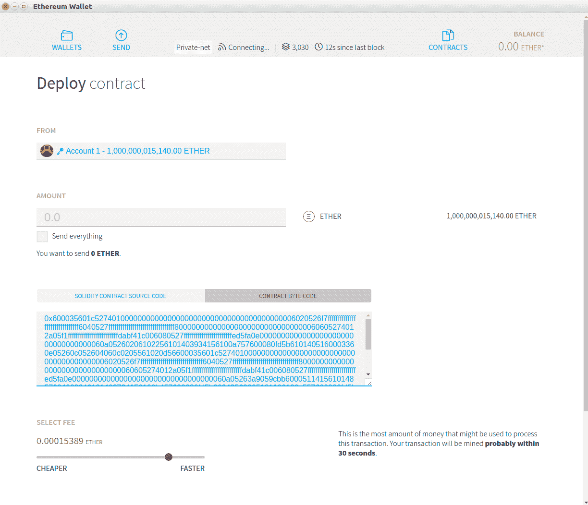

很快，您的智能合约创建将在区块链中得到确认。

然后，要与智能合约交互，请单击“合同”选项卡，然后单击“监视合同”按钮。然后会出现对话框。填写智能合约的地址，然后填写智能合约本身的名称。您可以在此处使用任何名称。接下来，在 JSON INTERFACE 字段中填写智能合约的`json`接口。您可以从`token_project/build/contracts.json`（在`contracts.json`文件中，找到`abi`键的值）中获取`json`接口。观看智能合约的表单如下屏幕所示：

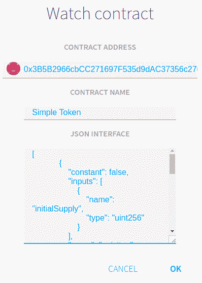

现在，您的简单代币智能合约将出现在屏幕上。点击“简单代币”标签，进入此智能合约的屏幕：

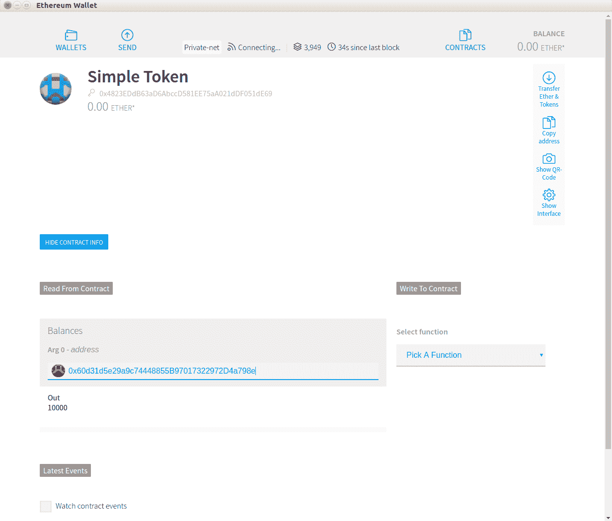

您可以使用`Balances`方法（Mist 喜欢大写方法）读取智能合约所有者的余额。在“Arg 0 - address”字段中插入所有者帐户的地址，然后按 Enter。从中，您将得到 10000 作为输出。

现在，让我们转移一些代币。选择一个功能。现在只有一个功能：`Transfer`（`transfer`方法的大写版本）。在“执行自”字段中选择帐户 1，在“到”字段中选择帐户 2 的地址，并在“金额”字段中插入 20。最后，点击“执行”按钮：

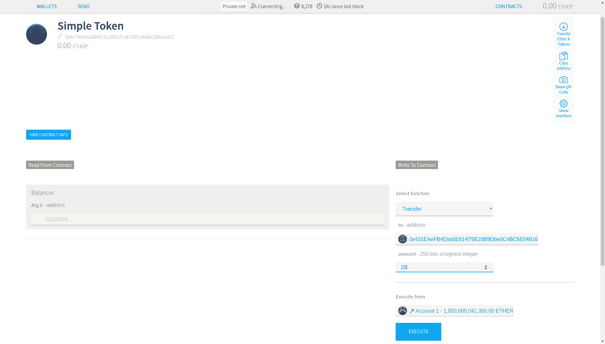

在检查目标帐户余额之前，请等待确认。将目标地址输入“余额”字段，然后按 Enter。这将给您输出`20`：

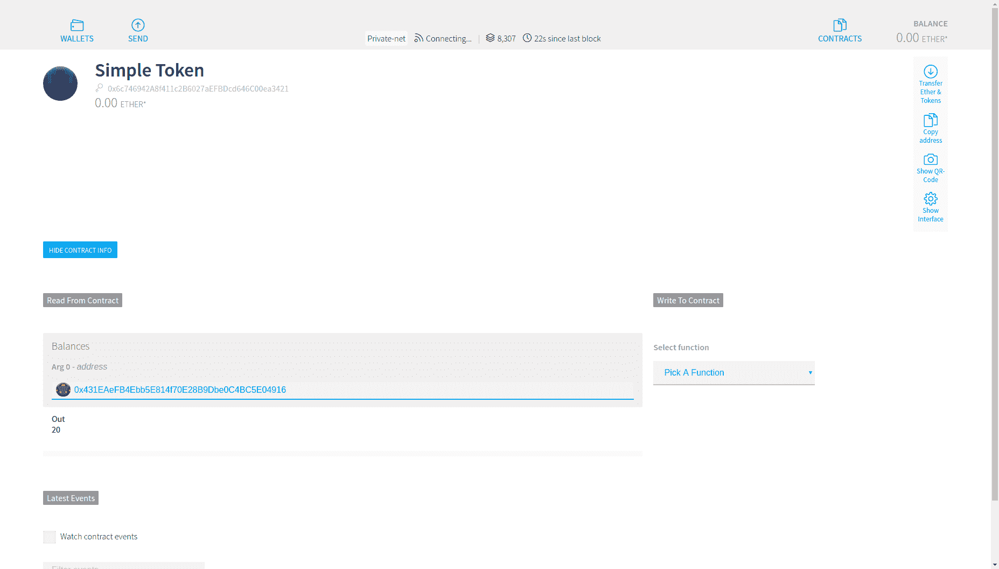

# ERC20

很可能，您已经听说过 ERC20。当有新的加密货币问世时，通常会出现的第一个问题是——它是 ERC20 代币吗？人们对 ERC20 代币的错误假设是，他们认为它是基于以太坊的加密货币。从技术上讲，这是正确的，但这并不是全部。ERC20 是以太坊中用于创建代币的标准。我们刚刚创建的简单代币并不满足 ERC20 标准。是的，它是数字代币智能合约，但它不是 ERC20 代币。ERC20 是我们在 2017 年看到新加密货币数量增加的许多原因之一。但是，ERC20 并不是在以太坊上创建代币的要求。

要创建 ERC20 代币，您必须实现以下方法：

```py
function totalSupply() public view returns (uint256)
function balanceOf(address _owner) public view returns (uint256 balance)
function transfer(address _to, uint256 _value) public returns (bool success)
function transferFrom(address _from, address _to, uint256 _value) public returns (bool success)
function approve(address _spender, uint256 _value) public returns (bool success)
function allowance(address _owner, address _spender) public view returns (uint256 remaining)
event Transfer(address indexed _from, address indexed _to, uint256 _value)
event Approval(address indexed _owner, address indexed _spender, uint256 _value)
```

这些方法使用 Solidity 语法。以下是可选方法，您也可以实现：

```py
function name() public view returns (string)
function symbol() public view returns (string)
function decimals() public view returns (uint8)
```

这个 ERC20 代币有什么特别之处？在创建代币智能合约时是否有义务？为什么我们不能在不满足 ERC20 标准的情况下创建数字代币？

实际上，您不必遵循此标准；没有法律强制您创建 ERC20 代币。例如，ERC20 标准希望您告诉用户`totalSupply`方法中的代币总量。但是，您可以创建一个名为`taylorSwiftIsTheBest`的方法来返回代币的总供应量，然后您可以创建一个文档来解释这个方法。

但是，如果您遵循 ERC20 代币标准，将会有一些优势：

+   首先，它使用户更容易审计您的智能合约。

+   第二，您的 ERC20 代币将被以太坊钱包（例如我们刚刚使用的`Mist`和 Metamask）自动识别（以太坊钱包是`Firefox/Opera/Chrome`插件）。

+   第三，这样做可以更容易地让加密货币交易所列出您的代币。基本上，这会让每个人的生活更轻松。

然而，你应该把 ERC20 标准视为指导，而不是严格的法律。你不必 100%遵循 ERC20 标准。并非所有建立在以太坊之上的热门代币都是 100%符合 ERC20 标准的。一个例子是 Golem 代币智能合约。它没有实现`approve`方法，等等。你可以在以下链接阅读 Golem 代币智能合约的源代码：[`etherscan.io/token/0xa74476443119A942dE498590Fe1f2454d7D4aC0d#readContract`](https://etherscan.io/token/0xa74476443119A942dE498590Fe1f2454d7D4aC0d#readContract)。

话虽如此，让我们创建一个 ERC20 代币。这段代码是从 Vyper 项目的官方示例修改而来的([`github.com/ethereum/vyper/blob/master/examples/tokens/ERC20.vy`](https://github.com/ethereum/vyper/blob/master/examples/tokens/ERC20.vy))。请参考以下 GitLab 链接中的代码文件获取完整修改后的代码：[`gitlab.com/arjunaskykok/hands-on-blockchain-for-python-developers/blob/master/chapter_08/token_project/contracts/ERC20Token.vy`](https://gitlab.com/arjunaskykok/hands-on-blockchain-for-python-developers/blob/master/chapter_08/token_project/contracts/ERC20Token.vy)：

```py
Transfer: event({_from: indexed(address), _to: indexed(address), _value: uint256})
Approval: event({_owner: indexed(address), _spender: indexed(address), _value: uint256})

...
...

@public
@constant
def allowance(_owner: address, _spender: address) -> uint256:
    return self.allowed[_owner][_spender]
```

让我们逐行描述这个智能合约：

```py
Transfer: event({_from: indexed(address), _to: indexed(address), _value: uint256})
Approval: event({_owner: indexed(address), _spender: indexed(address), _value: uint256})
```

你必须定义两种类型的事件，`Transfer`和`Approval`。如果愿意，你可以定义更多的事件。`Transfer`事件用于在代币转移时使用，这样智能合约的用户可以订阅此事件。`Approval`事件用于在你批准某个账户的支出金额时使用：

```py
name: public(bytes[10])
symbol: public(bytes[3])
totalSupply: public(uint256)
decimals: public(uint256)
balances: map(address, uint256)
allowed: map(address, map(address, uint256))
```

有六个变量。第一个变量是代币的名称。我使用了`bytes[10]`作为数据类型，因为我的代币名称少于 10 个字节。可以随意更改长度。第二个变量是代币的符号；名称和符号是不同的。例如，以太坊加密货币的名称是以太坊，但符号是 ETH。通常，符号的字符长度为 3。第三个变量是`totalSupply`，即代币的总数量，第四个变量是小数位。你知道 1 比特币等于 100,000,000 聪，所以比特币算法中总共会创建 21,000,000 比特币。因此，我们可以说比特币算法中的总供应量是 2,100,000,000,000,000。小数位是 8（因为 1 比特币等于 100,000,000，或 10⁸）。此外，第五个变量是`balances`。这是用于跟踪账户地址余额的变量。最后一个变量是`allowed`，这是一个嵌套映射。它旨在跟踪已获批准从另一个账户余额中支出以太币的账户。如果这还不清楚，我们稍后会深入讨论。现在，我们将继续讨论此 ERC20 代币智能合约的初始化方法，如下代码块所示：

```py
@public
def __init__():
    _initialSupply: uint256 = 1000
    _decimals: uint256 = 3
    self.totalSupply = _initialSupply * 10 ** _decimals
    self.balances[msg.sender] = self.totalSupply
    self.name = 'Haha Coin'
    self.symbol = 'HAH'
    self.decimals = _decimals
    log.Transfer(ZERO_ADDRESS, msg.sender, self.totalSupply)
```

这是我们在智能合约中初始化代币的方式。我们在空中创建代币，然后将所有代币的硬币交给所有者。然后，我们设置代币的名称和符号以及小数位数。最后，我们发出转移事件。地址是`ZERO_ADDRESS is 0x000000000000000000000000000000000000000`。这表明智能合约的所有者已经从无处转移了硬币：

```py
@public
@constant
def balanceOf(_owner: address) -> uint256:
    return self.balances[_owner]
```

这个方法用于返回特定账户的余额：

```py
@public
def transfer(_to: address, _amount: uint256) -> bool:
    assert self.balances[msg.sender] >= _amount
    self.balances[msg.sender] -= _amount
    self.balances[_to] += _amount
    log.Transfer(msg.sender, _to, _amount)

    return True
```

这是用于转移代币的方法。首先，确保发送者的余额足够支出。然后，只需从发送者的余额中减去转移过程的数量，并将该金额添加到目标的余额中。不要忘记使用事件记录此交易：

```py
@public
def transferFrom(_from: address, _to: address, _value: uint256) -> bool:
    assert _value <= self.allowed[_from][msg.sender]
    assert _value <= self.balances[_from]

    self.balances[_from] -= _value
    self.allowed[_from][msg.sender] -= _value
    self.balances[_to] += _value
    log.Transfer(_from, _to, _value)

    return True

@public
def approve(_spender: address, _amount: uint256) -> bool:
    self.allowed[msg.sender][_spender] = _amount
    log.Approval(msg.sender, _spender, _amount)

    return True
```

让我们先看一下`approve`方法。因此，每个账户都有一个名为`allowed`的映射，但这个映射是用来做什么的呢？这是每个账户如何让其他账户花费它的钱。例如，假设有 5 个账户——A 账户、B 账户、C 账户、D 账户和 E 账户。

A 账户有 50 个硬币的余额和一个名为`allowed`的映射变量，其中包括 B 账户、C 账户、D 账户和 E 账户的键。这个映射的值如下：

B 账户→3 个硬币

C 账户→7 个硬币

D 账户→2 个硬币

E 账户→3 个硬币

这意味着最多，B 账户可以从 A 账户的余额中花费 3 个硬币，C 账户最多可以从 A 账户的余额中花费 7 个硬币，D 账户最多可以从 A 账户的余额中花费 2 个硬币，E 账户最多可以从 A 账户的余额中花费 3 个硬币。

在`approve`方法内部，我们有以下行：

```py
self.allowed[msg.sender][_spender] = _amount
```

为了确保 B 账户可以从 A 账户的余额中花费 3 个硬币，A 账户调用了`approve`方法，`_spender`设置为 B 账户的地址，`_amount`设置为 3 个硬币。不要忘记记录这个批准。

然后，如果 B 账户想要花费 3 个或全部 3 个硬币，B 账户可以调用`transferFrom`方法，如下所示：

```py
assert _value <= self.allowed[_from][msg.sender]
```

`transferFrom`方法内的第一个断言是确保 B 账户不花费超过 3 个硬币。

```py
assert _value <= self.balances[_from]
```

我们确保 A 账户的余额至少有 3 个硬币，如下所示：

```py
    self.balances[_from] -= _value
    self.allowed[_from][msg.sender] -= _value
    self.balances[_to] += _value
    log.Transfer(_from, _to, _value)
```

然后，我们从 A 账户的余额和 A 账户对 B 账户的津贴中减去花费的金额。之后，我们增加目标账户的余额。不要忘记记录这笔交易作为`Transfer`事件。

最后一个方法是检查这个津贴的映射：

```py
@public
@constant
def allowance(_owner: address, _spender: address) -> uint256:
    return self.allowed[_owner][_spender]
```

这是为了确定 B 账户可以从 A 账户的余额中花费多少。

此时，您可能会问这个方法的意义是什么。如果我们想允许 B 账户代表 A 账户花费一些以太币，为什么我们不直接将硬币的数量转移到 B 账户呢？例如，如果 A 账户允许 B 账户从 A 账户的余额中花费 5 个硬币，这意味着 A 账户让 B 账户直接从 A 账户的余额中向 B 账户的地址发送 5 个硬币。那么，为什么 A 账户不直接向 B 账户的地址发送 5 个硬币以节省麻烦呢？如果 B 账户改变主意，他们可以退还代币的数量给 A 账户。

通常情况下，我们不允许普通账户代表我们花费。但是，我们允许智能合约这样做。有许多有效的原因，我们希望允许智能合约花费我们的钱。其中一个原因是去中心化交易智能合约的情况，您希望让去中心化交易智能合约出售您的代币。假设您创建了 1,000 个 HHH 硬币，然后您想在去中心化交易中出售其中一些。因此，您允许这个去中心化交易代表您花费一些硬币。也许您批准去中心化交易代表您花费 30 个 HHH 硬币。这个去中心化交易可以尝试代表您出售 30 个 HHH 硬币。您不会允许去中心化交易智能合约访问您余额中的所有硬币，只是因为您只想出售 30 个 HHH 硬币。尽管您可以审计智能合约，以确保智能合约不会尝试窃取您的硬币，但最好有另一层安全性。`approve`方法就是这样一层。

编译您的代币智能合约并部署它，就像以前一样。

完成后，转到“合同”选项卡，然后单击“WATCH TOKEN”按钮。在“添加代币”窗口中，插入您的 ERC20 智能合约的地址。然后，其他字段，如“TOKEN NAME”、“TOKEN SYMBOL”和“DECIMAL PLACES OF SMALLEST UNIT”将自动填充。这就是我们应该实现 ERC20 标准的原因之一：

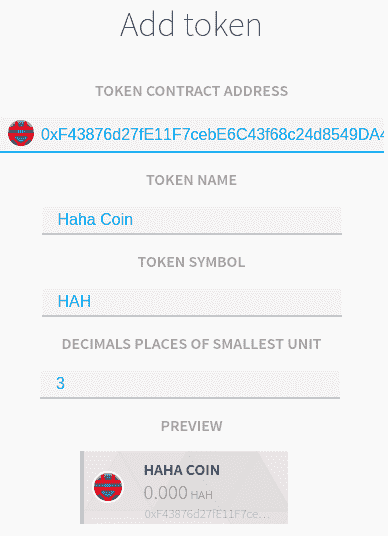

添加代币后，您应该在合同屏幕上看到 HAHA COIN 标签：

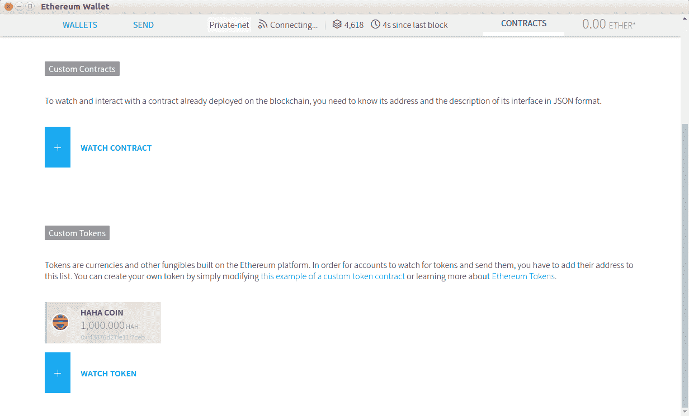

然后，在发送标签中，选择 ERC20 智能合约的所有者，然后选择 Haha Coin 而不是以太币。向账户 2 发送 1,000 个 Haha 代币，然后等待确认：

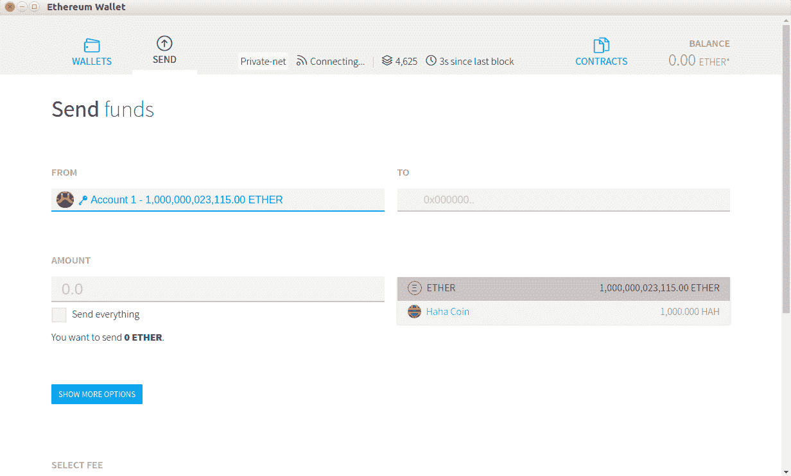

现在，在同一个标签页中选择账户 2；您会看到账户 2 现在有 1,000 个 Haha 代币：

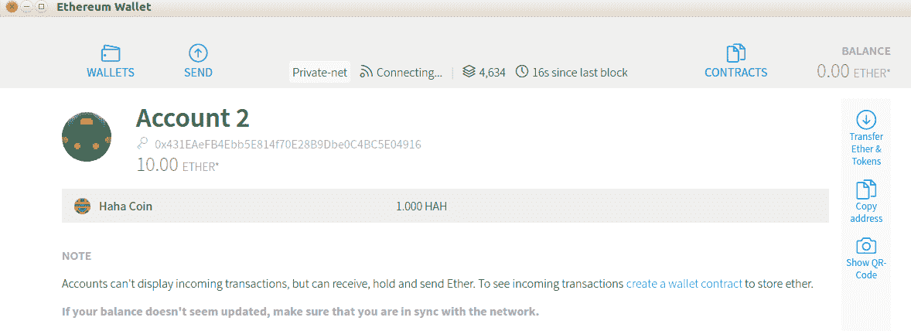

所有与 ERC20 兼容的钱包，如 Mist 和 MetaMask，都可以轻松识别和与您的代币进行交互。加密货币交易背后的人也不会在将您的 ERC20 代币整合到他们的交易所中遇到任何技术困难。想象一下，如果您不遵循 ERC20 标准，并且将一个方法命名为`tailorSwiftTransferCoin`来转移代币。在这种情况下，您必须为用户构建一个自定义钱包，然后他们才能与您的代币进行交互。

这是对这个 ERC20 代币的测试。请记住，这个测试并不全面。请参考以下 GitLab 链接中的代码文件获取完整的代码：[`gitlab.com/arjunaskykok/hands-on-blockchain-for-python-developers/blob/master/chapter_08/token_project/tests/test_erc20_token.py`](https://gitlab.com/arjunaskykok/hands-on-blockchain-for-python-developers/blob/master/chapter_08/token_project/tests/test_erc20_token.py)：

```py
import pytest
import eth_tester

def test_balance(web3, chain):
    erc20_token, _ = chain.provider.get_or_deploy_contract('ERC20Token')

    token_name = erc20_token.functions.name().call()
    token_symbol = erc20_token.functions.symbol().call()
    decimals = erc20_token.functions.decimals().call()
    total_supply = erc20_token.functions.totalSupply().call()
    balance = erc20_token.functions.balanceOf(web3.eth.coinbase).call()

...
...

    assert balance_account1 == 999990
    assert balance_account2 == 0
    assert balance_account3 == 10
    assert allowance == 90
```

除了转账方法，这个测试还测试了`approval`和`transferFrom`方法。

# 出售代币

现在我们有了一个代币，是时候出售这些代币了。我们希望用以太币出售我们的自定义代币。与比特币平台相比，在以太坊平台上创建一个众售代币非常容易。您已经知道如何在智能合约中创建一个方法来接受以太币。您还知道如何增加一些账户的代币余额。要出售代币，您必须将这两件事结合起来。就是这样。

这是**首次代币发行**（**ICO**）的核心。以太坊的货币很有价值。尽管以太币的价格波动，但 1 个以太币的价值大约是 100 美元。人们会用真钱购买一些以太币，但不会购买我们的自定义代币。为了使我们的自定义代币有价值，我们首先必须使其有用，或者至少使其看起来有用。但要做到这一点，我们需要资本。那么为什么不将我们的代币（比如 60%）出售给早期采用者呢？然后，他们可以用以太币购买我们的自定义代币。然后，我们可以在将其转换为法定货币之前提取以太币，这样我们就可以雇佣更多的程序员并租用办公室来开发我们的新加密货币。这就是基本的想法。当然，因为 ICO 涉及大量资金，它也会吸引捕食者。

这是众售代币智能合约。这与我们之前的 ERC20 代币智能合约源代码相同，但有些许变化。将这个智能合约命名为`CrowdSaleToken.vy`，并保存在`token_project/contracts`目录中。请参考以下 GitLab 链接中的代码文件获取完整的代码：[`gitlab.com/arjunaskykok/hands-on-blockchain-for-python-developers/blob/master/chapter_08/token_project/contracts/CrowdSaleToken.vy`](https://gitlab.com/arjunaskykok/hands-on-blockchain-for-python-developers/blob/master/chapter_08/token_project/contracts/CrowdSaleToken.vy)：

```py
Transfer: event({_from: indexed(address), _to: indexed(address), _value: uint256})
Approval: event({_owner: indexed(address), _spender: indexed(address), _value: uint256})
Payment: event({_buyer: indexed(address), _value: uint256(wei)})

name: public(bytes[10])
symbol: public(bytes[3])
totalSupply: public(uint256)
decimals: public(uint256)
balances: map(address, uint256)
ethBalances: public(map(address, uint256(wei)))
allowed: map(address, map(address, uint256))

...
...

@public
@constant
def allowance(_owner: address, _spender: address) -> uint256:
    return self.allowed[_owner][_spender]
```

让我们逐行讨论这个智能合约：

```py
Transfer: event({_from: indexed(address), _to: indexed(address), _value: uint256})
Approval: event({_owner: indexed(address), _spender: indexed(address), _value: uint256})
Payment: event({_buyer: indexed(address), _value: uint256(wei)})
```

我们在另外两个事件之上添加了一个名为`Payment`的事件。当有人用以太币购买代币时，将调用此事件：

```py
name: public(bytes[10])
symbol: public(bytes[3])
totalSupply: public(uint256)
decimals: public(uint256)
balances: map(address, uint256)
ethBalances: public(map(address, uint256(wei)))
allowed: map(address, map(address, uint256))

beneficiary: public(address)
minFundingGoal: public(uint256(wei))
maxFundingGoal: public(uint256(wei))
amountRaised: public(uint256(wei))
deadline: public(timestamp)
price: public(uint256(wei))
fundingGoalReached: public(bool)
crowdsaleClosed: public(bool)
```

我们添加了一些新变量，包括`ethBalances`、`beneficiary`、`minFundingGoal`、`maxFundingGoal`、`amountRaised`、`deadline`、`price`、`fundingGoalReached`和`crowdsaleClosed`。

`ethBalances`是一个变量，用于跟踪买家在这个智能合约中花费了多少以太币。我们想跟踪这个数字，因为如果我们无法筹集到必要的金额，我们想要退还以太币。`beneficiary`是一个用于跟踪谁启动了这个智能合约的变量。这个`beneficiary`变量是唯一能够提取以太币的账户。

`minFundingGoal`和`maxFundingGoal`是设计为确保筹集的金额大于最低筹资目标且低于最高筹资目标的变量。

`amountRaised`是一个变量，用于跟踪在这个智能合约中筹集了多少以太币。

`deadline`是一个用于跟踪众筹过程截止日期的变量。

`price`是我们希望以太币价值我们数字代币的方式。这个变量旨在回答买家用 1 个以太币可以获得多少个我们的代币。

`fundingGoalReached`是一个布尔变量，表示我们的智能合约是否已经达到了目标。

`crowdsaleClosed`是一个布尔变量，表示我们的智能合约是否仍在接收购买过程。我们将从初始化方法开始：

```py
@public
def __init__():
    _initialSupply: uint256 = 100
    _decimals: uint256 = 2
    self.totalSupply = _initialSupply * 10 ** _decimals
    self.name = 'Haha Coin'
    self.symbol = 'HAH'
    self.decimals = _decimals
    self.beneficiary = msg.sender
    self.balances[msg.sender] = self.totalSupply
    self.minFundingGoal = as_wei_value(30, "ether")
    self.maxFundingGoal = as_wei_value(50, "ether")
    self.amountRaised = 0
    self.deadline = block.timestamp + 3600 * 24 * 100 # 100 days
    self.price = as_wei_value(1, "ether") / 100
    self.fundingGoalReached = False
    self.crowdsaleClosed = False
```

这个智能合约中的总代币供应量为 10,000。我们希望至少筹集 30 个以太币，最多筹集 50 个以太币。

截止日期设置为智能合约部署在区块链上后的 100 天。`block.timestamp`大致是当前时间，或者包含此智能合约代码的区块确认的时间。

1 个代币的价格设定为`0.01`以太币。这意味着 1 个以太币可以购买 100 个我们的代币。然后，我们进入智能合约中的默认函数：

```py
@public
@payable
def __default__():
    assert msg.sender != self.beneficiary
    assert self.crowdsaleClosed == False
    assert self.amountRaised + msg.value < self.maxFundingGoal
    assert msg.value >= as_wei_value(0.01, "ether")
    self.ethBalances[msg.sender] += msg.value
    self.amountRaised += msg.value
    tokenAmount: uint256 = msg.value / self.price
    self.balances[msg.sender] += tokenAmount
    self.balances[self.beneficiary] -= tokenAmount
    log.Payment(msg.sender, msg.value)
```

这是用户用来购买代币的方法。`__default__`是一个默认的回退函数。如果有人没有在智能合约上执行方法并支付以太币，将执行此函数。实际上，我们不必使用默认函数来接受付款。您可以使用标准方法，就像您在以前的智能合约中所做的那样。我们只是使用默认函数来解释这个概念。

在这个付款方法中，我们确保买家不是受益人，众筹仍在进行，并且用以太币发送到此方法的金额不超过 50 个以太币的最高筹资目标。最后，每次购买行为必须至少为 0.01 以太币。然后，我们增加该买家的以太币余额，并增加筹集的以太币金额。然后，我们通过将以太币金额除以 1 个代币的价格来检查他们购买的代币数量。

最后，我们必须增加该买家的代币余额，并减少智能合约所有者的代币余额。不要忘记记录此事件。然后，我们进入可以检查是否达到目标的方法：

```py
@public
def checkGoalReached():
    assert block.timestamp > self.deadline
    if self.amountRaised >= self.minFundingGoal:
        self.fundingGoalReached = True
    self.crowdsaleClosed = True
```

首先，我们确保只有在截止日期过去后才能成功执行此方法。如果筹集的金额超过最低筹资目标，我们将`fundingGoalReached`变量设置为`true`。最后，我们将`crowdsaleClosed`变量设置为`true`。

为了简单起见，我们只检查`block.timestamp`变量是否大于截止日期。然而，区块中的时间戳可以填入矿工喜欢的任何内容；它不一定是区块确认时的当前时间。但是，如果矿工将过去的时间戳作为`block.timestamp`的值，所有其他矿工都会拒绝它。同样，如果矿工将未来时间戳（例如，一年后）作为`block.timestamp`的值，所有其他矿工也会拒绝它。为了使截止日期检查过程更安全，您必须将其与`block.number`结合起来，以检查自从智能合约启动以来已确认了多少个区块。然后，我们进入智能合约的管理者可以提取在智能合约中累积的以太币的方法：

```py
@public
def safeWithdrawal():
    assert self.crowdsaleClosed == True
    if self.fundingGoalReached == False:
        if msg.sender != self.beneficiary:
            if self.ethBalances[msg.sender] > 0:
                self.ethBalances[msg.sender] = 0
                self.balances[self.beneficiary] += self.balances[msg.sender]
                self.balances[msg.sender] = 0
                send(msg.sender, self.ethBalances[msg.sender])
    if self.fundingGoalReached == True:
        if msg.sender == self.beneficiary:
            if self.balance > 0:
                send(msg.sender, self.balance)
```

`safeWithdrawal`方法的运行方式不同，取决于是否达到了筹资目标。在上述方法内部，我们确保众筹已经关闭。如果未达到筹资目标，我们确保每个买家都可以取回他们的以太币。如果达到了筹资目标，我们确保受益人可以从智能合约中提取所有以太币。其他方法的剩余部分与先前的智能合约相同。但是，我们添加了一些断言来确保这些方法只能在众筹结束后执行。

以下代码块是对这个众筹智能合约的测试。请参考以下 GitLab 链接中的代码文件获取完整的代码文件：[`gitlab.com/arjunaskykok/hands-on-blockchain-for-python-developers/blob/master/chapter_08/token_project/tests/test_crowd_sale_token.py`](https://gitlab.com/arjunaskykok/hands-on-blockchain-for-python-developers/blob/master/chapter_08/token_project/tests/test_crowd_sale_token.py)：

```py
import pytest
import eth_tester
import time

def test_initialization(web3, chain):
    crowd_sale_token, _ = chain.provider.get_or_deploy_contract('CrowdSaleToken')

...
...

    assert abs(beforeCrowdsaleEthBalanceAccount2 - afterCrowdsaleEthBalanceAccount2 - web3.toWei('40', 'ether')) < web3.toWei('1', 'gwei')
    assert abs(afterCrowdsaleEthBalanceAccount1 - beforeCrowdsaleEthBalanceAccount1 - web3.toWei('40', 'ether')) < web3.toWei('1', 'gwei')
```

特别关注`test_withdrawal`和`test_refund`，尤其是这些行：

```py
    # move forward 101 days
    web3.testing.timeTravel(int(time.time()) + 3600 * 24 * 101)
    web3.testing.mine(1)
```

我们不想等待 100 天，我们想在测试中操纵时钟，使其相信已经到达截止日期（从现在开始的 101 天）。因此，我们假装已经过去了 101 天，然后我们确认了 1 个区块。因此，智能合约内部的`block.timestamp`变量将是从现在开始的 101 天。

# 稳定币

您已经创建了一个可以自主出售的数字代币。但是，您不应该局限于通用代币。您可以通过添加更多方法来使您的代币智能合约更具创意。您应该添加哪些方法取决于您的智能合约的目的。在游戏中用作货币的代币智能合约将具有不同的方法，而在供应链跟踪系统中使用的代币智能合约将具有不同的方法。

让我们创建一个稳定币智能合约。这是一个与法定货币（如美元）挂钩的代币智能合约。我们还希望这个智能合约成为一个银行，作为所有者，我们可以冻结账户。

我们可以基于 ERC 20 代币智能合约进行工作。我们只需要添加三种方法——一个冻结账户的方法，一个添加代币的方法，以及一个丢弃代币的方法。

这是智能合约。您可以参考以下 GitLab 链接中的代码文件获取完整的代码文件：[`gitlab.com/arjunaskykok/hands-on-blockchain-for-python-developers/blob/master/chapter_08/token_project/contracts/StableCoin.vy`](https://gitlab.com/arjunaskykok/hands-on-blockchain-for-python-developers/blob/master/chapter_08/token_project/contracts/StableCoin.vy)：

```py
Transfer: event({_from: indexed(address), _to: indexed(address), _value: uint256})
Approval: event({_owner: indexed(address), _spender: indexed(address), _value: uint256})
Freeze: event({_account: indexed(address), _freeze: bool})

name: public(bytes[10])
symbol: public(bytes[3])
totalSupply: public(uint256)
decimals: public(uint256)
balances: map(address, uint256)
allowed: map(address, map(address, uint256))
frozenBalances: public(map(address, bool))
owner: public(address)

...
...

@public
@constant
def allowance(_owner: address, _spender: address) -> uint256:
    return self.allowed[_owner][_spender]
```

让我们逐行讨论智能合约：

```py
Transfer: event({_from: indexed(address), _to: indexed(address), _value: uint256})
Approval: event({_owner: indexed(address), _spender: indexed(address), _value: uint256})
Freeze: event({_account: indexed(address), _freeze: bool})
```

我们需要在上述代码中添加另一个事件，用于冻结账户操作。

我们在 ERC20 代币智能合约的变量之上添加了两个新变量，即`frozenBalances`和`owner`：

```py
name: public(bytes[10])
symbol: public(bytes[3])
totalSupply: public(uint256)
decimals: public(uint256)
balances: map(address, uint256)
allowed: map(address, map(address, uint256))
frozenBalances: public(map(address, bool))
owner: public(address)
```

`frozenBalances`是一个映射变量，用于跟踪已被冻结的账户。`owner`是一个变量，用于跟踪智能合约的所有者。

在这个初始化方法中，我们将`owner`变量设置为启动这个智能合约的账户：

```py
@public
def __init__():
    _initialSupply: uint256 = 1000
    _decimals: uint256 = 3
    self.totalSupply = _initialSupply * 10 ** _decimals
    self.balances[msg.sender] = self.totalSupply
    self.name = 'Haha Coin'
    self.symbol = 'HAH'
    self.decimals = _decimals
    self.owner = msg.sender
    log.Transfer(ZERO_ADDRESS, msg.sender, self.totalSupply)
```

在接下来的方法中，我们确保只有所有者可以调用此方法：

```py
@public
def freezeBalance(_target: address, _freeze: bool) -> bool:
    assert msg.sender == self.owner
    self.frozenBalances[_target] = _freeze
    log.Freeze(_target, _freeze)

    return True
```

然后，我们设置了`frozenBalances`映射变量的值。真值表示账户被冻结。不要忘记调用`Freeze`事件。

下一个方法是增加硬币：

```py
@public
def mintToken(_mintedAmount: uint256) -> bool:
    assert msg.sender == self.owner
    self.totalSupply += _mintedAmount
    self.balances[msg.sender] += _mintedAmount
    log.Transfer(ZERO_ADDRESS, msg.sender, _mintedAmount)

    return True
```

我们增加了总供应量和所有者账户的余额。

接下来的方法旨在销毁硬币：

```py
@public
def burn(_burntAmount: uint256) -> bool:
    assert msg.sender == self.owner
    assert self.balances[msg.sender] >= _burntAmount
    self.totalSupply -= _burntAmount
    self.balances[msg.sender] -= _burntAmount
    log.Transfer(msg.sender, ZERO_ADDRESS, _burntAmount)

    return True
```

这与上一种方法类似，但其目的是减少总供应量中的硬币数量。你为什么要销毁硬币？有许多有效的原因。假设您正在使用这个智能合约跟踪美元。假设您口袋里有 1 万美元。因此，智能合约中的总供应量为 10,000（1 个硬币等于 1 美元），但有一天，您的 10,000 美元中有 2,000 美元被小偷偷走了。为了确保智能合约的一致性，您可以使用这种方法销毁 2,000 个硬币。

其他方法与 ERC20 代币智能合约下完全相同，只有两个例外：`transfer`和`transferFrom`。在这些方法中，我们有额外的断言：

```py
assert self.frozenBalances[msg.sender] == False
```

以下代码块是对这个智能合约的测试。您可以参考以下 GitLab 链接中的代码文件获取完整的代码：[`gitlab.com/arjunaskykok/hands-on-blockchain-for-python-developers/blob/master/chapter_08/token_project/tests/test_stable_token.py`](https://gitlab.com/arjunaskykok/hands-on-blockchain-for-python-developers/blob/master/chapter_08/token_project/tests/test_stable_token.py)：

```py
import pytest
import eth_tester
import time

def test_initialization(web3, chain):
    stable_coin, _ = chain.provider.get_or_deploy_contract('StableCoin')

...
...

    new_total_supply = stable_coin.functions.totalSupply().call()
    assert new_total_supply == 999900
```

# 总结

在本章中，您已经学会了如何在以太坊上创建代币。您使用了 Mist 作为以太坊钱包，部署了合约并与代币智能合约进行交互。然后，您通过创建某些方法的实现来实现 ERC 20 标准的代币智能合约。您还看到了这些标准方法如何帮助 Mist 识别您的代币。然后，您创建了一种方法来出售代币以获取以太币。您在这个智能合约中设置了截止日期，然后使用时间旅行方法来模拟智能合约的测试中过期的截止日期。最后，您添加了其他方法来冻结和解冻其他账户。您使用的示例是将硬币与实际资产（如法定货币）挂钩的稳定币。

在下一章中，您将创建一个可以处理以太币和 ERC20 代币的加密货币钱包。

# 进一步阅读

+   [`github.com/ethereum/EIPs/blob/master/EIPS/eip-20.md`](https://github.com/ethereum/EIPs/blob/master/EIPS/eip-20.md)

+   [`ethereum.org/token`](https://ethereum.org/token)
