# 第九章：加密货币钱包

在本章中，您将学习如何构建一个桌面加密货币钱包。您仍将使用相同的 GUI 库，Qt for Python 或 PySide2 来创建桌面应用程序。这个加密货币钱包可以发送以太币和 ERC20 代币。在构建这个加密货币钱包之前，您将学习 PySide2 库的高级功能，比如标签、组合框、大小策略以及添加拉伸以控制布局中小部件的分布。此外，您还将把测试集成到应用程序中。

在本章中，我们将涵盖以下主题：

+   PySide2 库的高级功能

+   Pytest Qt，用于测试 Python 应用程序的 Qt 库

+   如何构建加密货币钱包

+   构建加密货币钱包时需要考虑的一些因素

# PySide2 库的高级功能

本章需要读者对 PySide2 库有一定的了解。如果您还没有这样做，您应该先阅读第七章 *前端去中心化应用*，因为本章是基于那一章的。如果您已经熟悉了使用`PySide2`构建 GUI，那么您就具备了构建桌面加密货币钱包所需的技能，至少从**用户界面**（**UI**）的角度来看。但是，您构建的应用程序对用户来说可能会很刺耳。例如，如果您在水平布局中加入了一个按钮，并且该按钮是水平布局中唯一的小部件，当您调整具有水平布局的窗口大小时，按钮将被拉伸到右侧和左侧。如果这不是您想要发生的，您需要一种方法告诉按钮保持其宽度。

因此，让我们从`PySide2`库中学习其他功能，比如标签、大小策略和网格布局，这样我们就有了制作应用程序 UI 更具吸引力的技能。我们的应用程序可能不会赢得*苹果最佳设计奖*，但至少对用户来说不会那么刺耳。

此外，在第七章 *前端去中心化应用*中，我们忽略了测试。由于加密货币钱包应用程序是处理人们的资金的应用程序，错误是代价高昂的。因此，我们需要在用户之前捕捉到任何错误。因此，我们应该为我们的加密货币钱包编写适当的测试。但是，我们将专注于对加密货币钱包的 UI 部分进行测试。我们不会专注于测试内部方法。换句话说，我们的测试将是集成测试。

如果您还没有安装`Qt`库，请阅读第七章 *前端去中心化应用*，了解如何安装。之后，使用以下命令为您的项目创建一个虚拟环境：

```py
$ virtualenv -p python3.6 wallet-venv
$ source wallet-venv/bin/activate
(wallet-venv) $ pip install PySide2
(wallet-venv) $ pip install web3==4.7.2
```

我们还希望安装一个测试库来测试我们的应用程序，可以通过以下命令来完成：

```py
(wallet-venv) $ pip install pytest-qt
```

现在所有的库都已经设置好了，让我们写一个简单的应用程序来测试一下。

# 测试应用程序

创建一个名为`advanced_course_qt`的目录。我们可以把所有的教程文件放在这里。将第一个脚本命名为`button_and_label.py`，并使用以下代码为该按钮创建一个按钮和一个标签（请参考以下 GitLab 链接上的代码文件获取完整代码：[`gitlab.com/arjunaskykok/hands-on-blockchain-for-python-developers/blob/master/chapter_09/advanced_course_qt/button_and_label.py`](https://gitlab.com/arjunaskykok/hands-on-blockchain-for-python-developers/blob/master/chapter_09/advanced_course_qt/button_and_label.py)）：

```py
from PySide2.QtWidgets import QWidget, QApplication, QLabel, QPushButton, QVBoxLayout
from PySide2.QtCore import Qt
import sys

class ButtonAndLabel(QWidget):

...
...

if __name__ == "__main__":

    app = QApplication(sys.argv)
    button_and_label = ButtonAndLabel()
    button_and_label.show()
    sys.exit(app.exec_())
```

运行上述代码，看看这个应用程序是关于什么的。该应用程序由一个按钮和一个标签组成：

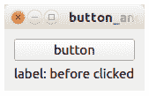

如果您点击按钮，标签上的文本将会改变，如下图所示：

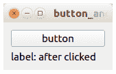

让我们测试一下这个应用程序。将测试命名为`test_button_and_label.py`，并将其放在相同的目录中。使用以下代码块进行测试应用程序：

```py
from button_and_label import ButtonAndLabel
from PySide2 import QtCore

def test_button_and_label(qtbot):
    widget = ButtonAndLabel()
    qtbot.addWidget(widget)

    assert widget.label.text() == "label: before clicked"

    qtbot.mouseClick(widget.button, QtCore.Qt.LeftButton)

    assert widget.label.text() == "label: after clicked
```

使用以下命令运行测试：

```py
(wallet-venv) $ pytest test_button_and_label.py
```

请注意，`(wallet-venv) $ python test_button_and_label.py`命令是一个微不足道的错误，经常用于运行测试。不要上当！

在这个测试脚本中，我们导入我们的`widget`类。然后，我们创建一个以`test_`开头的测试方法。这个方法有一个名为`qtbot`的参数。不要更改它的名称。`qtbot`是一个特殊的名称，不得更改。在这个方法内部，`qtbot`可以用来与`widget`类交互。

首先，我们实例化一个我们想要测试的`widget`类。然后，我们使用`qtbot`的`addWidget`方法添加该`widget`实例：

```py
qtbot.addWidget(widget)
```

然后，在单击按钮之前，我们测试`label`变量上的`text`：

```py
assert widget.label.text() == "label: before clicked"
```

正如您所看到的，我们可以从`widget`中访问`label`。这是因为我们在`button_and_label.py`中使用以下代码声明了`label`变量：

```py
self.label = QLabel("label: before clicked")
```

如果您在`button_and_label.py`中使用以下代码声明标签：

```py
label = QLabel("label: before clicked")
```

然后，您将无法从测试中的`widget`实例访问`label`。当然，您可以通过创建一个变量来保存标签的文本来规避这种情况。然而，将`label`作为`widget`实例属性是测试标签文本的最简单方法。您将在所有后续测试中使用这种策略。简而言之，如果您想测试小部件（如标签、按钮或组合框），请将该`widget`作为其父小部件实例的属性。然后，我们继续讨论如何单击按钮小部件：

```py
qtbot.mouseClick(widget.button, QtCore.Qt.LeftButton)
```

在测试期间单击按钮，您可以使用`qtbot`的`mouseClick`方法。`qtbot`的`mouseClick`方法的第一个参数是一个按钮小部件，或者是接受点击事件的东西。第二个参数是检测鼠标点击事件性质的选项。在这种情况下，测试将只接受左键点击。

以下代码是测试并显示单击按钮后标签的文本：

```py
assert widget.label.text() == "label: after clicked"
```

在构建 GUI 应用程序时，我们偶尔需要显示对象列表。在我们的加密货币钱包中，列表可以包含账户。因此，让我们为这种情况编写一个测试。但首先，我们必须创建一个脚本来显示对象列表。将脚本命名为`button_and_list.py`，并使用以下代码块进行脚本（有关完整代码，请参考以下 GitLab 链接中的代码文件：[`gitlab.com/arjunaskykok/hands-on-blockchain-for-python-developers/blob/master/chapter_09/advanced_course_qt/button_and_list.py`](https://gitlab.com/arjunaskykok/hands-on-blockchain-for-python-developers/blob/master/chapter_09/advanced_course_qt/button_and_list.py)）：

```py
from PySide2.QtWidgets import QWidget, QApplication, QLabel, QPushButton, QVBoxLayout
from PySide2.QtCore import Qt
import sys

class ButtonAndList(QWidget):

...
...

if __name__ == "__main__":

    app = QApplication(sys.argv)
    button_and_list = ButtonAndList()
    button_and_list.show()
    sys.exit(app.exec_())
```

运行脚本以查看应用程序的外观。以下是单击按钮之前的按钮的屏幕截图：

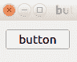

以下显示了单击按钮的结果：

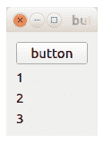

这里只有一个按钮，如果您单击它，将会出现一个新的标签，文本简单地显示为`1`。如果您再次单击按钮，将会在底部出现一个新的标签，文本显示为`2`，依此类推。

单击按钮后出现的新标签是垂直框布局的一部分。这意味着我们需要将垂直框布局作为小部件实例的属性，以便在测试中访问它。

让我们为这个 GUI 脚本编写一个测试，如下面的代码块所示，并将其命名为`test_button_and_list.py`：

```py
from button_and_list import ButtonAndList
from PySide2 import QtCore

def test_button_and_list(qtbot):
    widget = ButtonAndList()
    qtbot.addWidget(widget)

    qtbot.mouseClick(widget.button, QtCore.Qt.LeftButton)
    qtbot.mouseClick(widget.button, QtCore.Qt.LeftButton)
    qtbot.mouseClick(widget.button, QtCore.Qt.LeftButton)

    label_item = widget.v_layout.takeAt(2)
    assert label_item.widget().text() == "3"

    label_item = widget.v_layout.takeAt(1)
    assert label_item.widget().text() == "2"

    label_item = widget.v_layout.takeAt(0)
    assert label_item.widget().text() == "1"
```

正如我们在前面的代码块中所看到的，在`qtbot`的`mouseClick`方法第三次执行之后，我们使用以下代码从垂直框布局中获取标签：

```py
label_item = widget.v_layout.takeAt(2)
```

我们通过`takeAt`方法获取小部件的子小部件。在这种情况下我们使用的参数是`2`。这意味着我们想要获取第三个子小部件，也就是最后一个。然后，我们使用以下代码测试小部件的文本：

```py
assert label_item.widget().text() == "3"
```

让我们创建一个更复杂的场景。到目前为止，我们测试的所有内容都在一个窗口内，但如果有一个输入对话框怎么办？我们如何测试对话框？

让我们创建一个具有对话框的 GUI 脚本，并将其命名为`button_and_dialog.py`：（有关完整代码，请参考以下 GitLab 链接的代码文件：[`gitlab.com/arjunaskykok/hands-on-blockchain-for-python-developers/blob/master/chapter_09/advanced_course_qt/button_and_dialog.py`](https://gitlab.com/arjunaskykok/hands-on-blockchain-for-python-developers/blob/master/chapter_09/advanced_course_qt/button_and_dialog.py)）：

```py
from PySide2.QtWidgets import QWidget, QApplication, QLabel, QPushButton, QVBoxLayout, QInputDialog, QLineEdit
from PySide2.QtCore import Qt
import sys

class ButtonAndDialog(QWidget):

...
...

if __name__ == "__main__":

    app = QApplication(sys.argv)
    button_and_dialog = ButtonAndDialog()
    button_and_dialog.show()
    sys.exit(app.exec_())
```

运行代码以查看应用程序。有一个按钮和空白空间在其下方：


点击按钮，然后会出现一个对话框，之后您应该在输入对话框中输入任何文本，然后点击 OK：

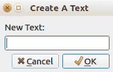

您输入的文本将出现在按钮下方：

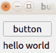

让我们看一下以下代码块中的另一个测试脚本，以了解如何处理涉及两个不同窗口的流程。在这个测试方法中，除了`qtbot`之外，我们还有另一个参数叫做`monkeypatch`。将测试文件命名为`test_button_and_dialog.py`：

```py
from button_and_dialog import ButtonAndDialog
from PySide2.QtWidgets import QInputDialog
from PySide2 import QtCore

def test_button_and_dialog(qtbot, monkeypatch):
    widget = ButtonAndDialog()
    qtbot.addWidget(widget)

    monkeypatch.setattr(QInputDialog, 'getText', lambda *args: ("New Text", True))
    qtbot.mouseClick(widget.button, QtCore.Qt.LeftButton)

    assert widget.label.text() == "New Text"
```

`monkeypatch`用于覆盖对话框输入。这意味着在测试中，`QInputDialog`的`getText`方法将返回一个`("New Text", True)`元组。记得`QInputDialog`的 API 吗？这返回一个元组。这个元组包含两个参数——我们在对话框中输入的文本，以及我们是否点击了 OK 或取消按钮。

`QInputDialog`的`getText`方法接受四个参数：此对话框基于的窗口实例、标题、输入字段之前的标签和输入字段的类型。当您在输入字段中输入文本，例如`To the moon!`，然后点击**OK**按钮时，它会返回一个元组，其中包含字符串`To the moon!`和您是否点击了**OK**按钮的`boolean`值：

```py
new_text, ok = QInputDialog.getText(self, "Write A Text", "New Text:", QlineEdit.Normal)
```

然而，`monkeypatch`会修补这个方法，因此在测试中，不会启动对话框。我们绕过它们。就好像启动对话框的行被以下代码替换了一样：

```py
new_text, ok = ("New Text", True)
```

对于所有这些测试，我们总是使用一个按钮类型的小部件来启动某些操作（更改标签上的文本）。让我们使用另一种类型的小部件来更改标签，如下面的代码块所示，并将脚本命名为`combobox_and_label.py`：

```py
from PySide2.QtWidgets import QWidget, QApplication, QLabel, QComboBox, QVBoxLayout
from PySide2.QtCore import Qt
import sys

class ComboBoxAndLabel(QWidget):

    def __init__(self):
        super(ComboBoxAndLabel, self).__init__()

        self.combobox = QComboBox()
        self.combobox.addItems(["Orange", "Apple", "Grape"])
        self.combobox.currentTextChanged.connect(self.comboboxSelected)

        self.label = QLabel("label: before selecting combobox")

        layout = QVBoxLayout()
        layout.addWidget(self.combobox)
        layout.addWidget(self.label)

        self.setLayout(layout)

    def comboboxSelected(self, value):
        self.label.setText(value)

if __name__ == "__main__":

    app = QApplication(sys.argv)
    combobox_and_label = ComboBoxAndLabel()
    combobox_and_label.show()
    sys.exit(app.exec_())
```

这个 GUI 脚本使用组合框来更改标签上的文本。它使用所选标签的文本设置标签上的文本。运行脚本以查看它的外观：

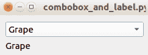

现在，让我们创建一个测试脚本来测试这个组合框小部件，并将其命名为`test_combobox_and_label.py`：

```py
from combobox_and_label import ComboBoxAndLabel
from PySide2 import QtCore

def test_combobox_and_label(qtbot):
    widget = ComboBoxAndLabel()
    qtbot.addWidget(widget)

    assert widget.label.text() == "label: before selecting combobox"

    qtbot.keyClicks(widget.combobox, "Grape")

    assert widget.label.text() == "Grape"
```

我们可以从这里得到的关键点是使用`qtbot`更改`combobox`的选定选项的方式：

```py
qtbot.keyClicks(widget.combobox, "Grape")
```

这个方法的名称不直观；它接受两个参数。第一个是小部件，或者在这种情况下是组合框。第二个是组合框中的选项文本。这个`keyClicks`方法不仅用于选择组合框中的选项。它也可以用于在行编辑中输入文本。只需将行编辑小部件放在第一个参数中。

这些测试知识足以测试我们的加密货币钱包。在我们开始构建加密货币钱包之前，让我们了解一下`PySide2`的一些其他功能，包括网格布局、选项卡和大小策略。

# Qt for Python 或 PySide2 的高级功能

我们想要在这里学习的第一件事是拉伸。我们知道如何将小部件添加到框布局（垂直或水平）。但是，我们可以在一定程度上配置如何分配这些添加到框布局中的小部件。我们应该拉伸小部件，将小部件放在水平布局的顶部，并让空间吞噬其余部分吗？

让我们创建一个脚本来解释在框布局中小部件分布的配置，并将脚本命名为`add_stretch.py`（请参考以下 GitLab 链接的完整代码文件：[`gitlab.com/arjunaskykok/hands-on-blockchain-for-python-developers/blob/master/chapter_09/advanced_course_qt/add_stretch.py`](https://gitlab.com/arjunaskykok/hands-on-blockchain-for-python-developers/blob/master/chapter_09/advanced_course_qt/add_stretch.py)）：

```py
from PySide2.QtWidgets import QFrame, QLabel, QWidget, QApplication, QPushButton, QHBoxLayout, QVBoxLayout, QSizePolicy, QSizePolicy
from PySide2.QtCore import Qt
import sys

class AddStretch(QWidget):

...
...

if __name__ == "__main__":

    app = QApplication(sys.argv)
    widget = AddStretch()
    widget.resize(500, 500)
    widget.show()
    sys.exit(app.exec_())
```

运行脚本查看效果：

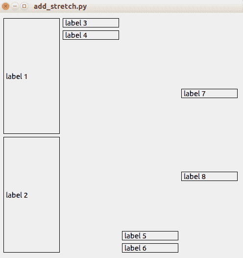

如果您在垂直容器的末尾添加拉伸，它会将小部件推到垂直容器的开头，并让其余部分成为空白空间。如果您在开头添加拉伸，它会将小部件推到垂直容器的末尾，并让其余部分成为空白空间。如果您不添加任何拉伸，小部件将在布局中均匀分布。

就应用的功能而言，这并没有什么区别。但是，如果您选择正确的选项，它可以使 UI 更具吸引力。

我们总是使用框布局（垂直框布局或水平框布局）。在大多数情况下，框布局就足够了。然而，偶尔您可能想要使用更复杂的布局。Qt 有一个比框布局更强大的网格布局。

让我们创建一个脚本来探索网格布局的强大功能，并将脚本命名为`create_grid_window.py`（请参考以下 GitLab 链接的完整代码文件：[`gitlab.com/arjunaskykok/hands-on-blockchain-for-python-developers/blob/master/chapter_09/advanced_course_qt/create_grid_window.py`](https://gitlab.com/arjunaskykok/hands-on-blockchain-for-python-developers/blob/master/chapter_09/advanced_course_qt/create_grid_window.py)）：

```py
from PySide2.QtWidgets import QWidget, QApplication, QLabel, QGridLayout
from PySide2.QtCore import Qt
import sys

class GridWindow(QWidget):

...
...

if __name__ == "__main__":

    app = QApplication(sys.argv)
    gridWindow = GridWindow()
    gridWindow.show()
    sys.exit(app.exec_())
```

运行脚本查看网格布局如何管理其子窗口：

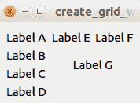

网格就像一个表格或电子表格。与水平布局的行或垂直布局的列不同，您将小部件添加到由行和列组成的表格中。

如果您想要将小部件添加到第一行和第一列，请使用以下语句：

```py
layout.addWidget(label, 0, 0)
```

第一个参数表示行。第二个参数表示列。因此，如果您想要将小部件添加到第二行和第一列，使用以下语句：

```py
layout.addWidget(label, 1, 0)
```

网格布局的`addWidget`方法接受可选的第三和第四个参数。第三个参数指示您希望此小部件延伸到多少行。第四个参数指示您希望此小部件延伸到多少列：

```py
layout.addWidget(label, 1, 1, 2, 2)
```

如果您拉伸窗口，您将看到类似以下截图的内容：

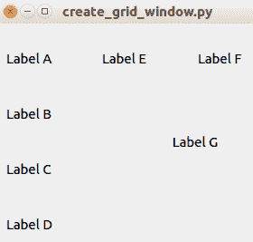

看一下标签 G。这可以延伸到两行和两列。

现在，让我们谈谈如果增加包含小部件的父窗口的大小会发生什么。小部件是否应随之调整大小？小部件是否应保持不变，并允许边距变宽？您可以使用大小策略来决定调整大小的配置。让我们创建一个名为`button_with_sizepolicy.py`的脚本来演示大小配置策略（请参考以下 GitLab 链接的完整代码文件：[`gitlab.com/arjunaskykok/hands-on-blockchain-for-python-developers/blob/master/chapter_09/advanced_course_qt/button_with_sizepolicy.py`](https://gitlab.com/arjunaskykok/hands-on-blockchain-for-python-developers/blob/master/chapter_09/advanced_course_qt/button_with_sizepolicy.py)）：

```py
from PySide2.QtWidgets import QWidget, QApplication, QPushButton, QVBoxLayout, QSizePolicy
from PySide2.QtCore import Qt
import sys

class ButtonWithSizePolicy(QWidget):

...
...

if __name__ == "__main__":

    app = QApplication(sys.argv)
    button_with_size_policy_widget = ButtonWithSizePolicy()
    button_with_size_policy_widget.resize(500, 200)
    button_with_size_policy_widget.show()
    sys.exit(app.exec_())
```

运行脚本以查看每个按钮如何根据不同的大小策略显示不同：

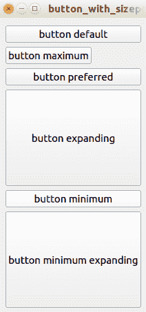

然后，尝试调整窗口大小以理解大小策略配置：

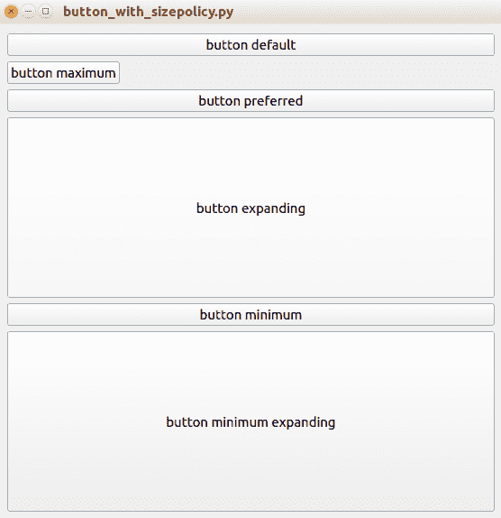

`QSizePolicy.Maximum`表示小部件不能比大小提示更大，或者在这种情况下按钮的内容。如果您希望按钮保持其原始大小，请使用此大小策略。`QSizePolicy.Preferred`表示它更喜欢大小提示，但它可以更大或更小。`QSizePolicy.Expanding`表示小部件应尽可能扩展。`QSizePolicy.Minimum`表示小部件可以扩展，但不能小于大小提示。`QSizePolicy.MinimumExpanding`表示小部件不能小于大小提示，但尽可能扩展。

在创建 GUI 应用程序时，大多数情况下您不会将所有功能/小部件放在一个窗口中。否则，窗口将比显示器的屏幕分辨率大。

您可以启动一个对话框，其中包含一个按钮来容纳更多功能/小部件。这当然有效。但是您真正想要的是类似控制器的东西。在 Qt 中，您有**StackView**。StackView 可以包含许多窗口，但一次只显示一个窗口。

我们不会直接使用 StackView。相反，我们使用选项卡视图。选项卡视图在幕后使用 StackView。让我们创建一个脚本来使用选项卡视图，并将其命名为`tabbed_window.py`：

```py
from PySide2.QtWidgets import QTabWidget, QApplication, QWidget
import sys
from button_and_label import ButtonAndLabel

class TabbedWindow(QTabWidget):

    def __init__(self, parent=None):
        super(TabbedWindow, self).__init__(parent)
        widget1 = QWidget()
        self.widget2 = ButtonAndLabel()
        widget3 = QWidget()
        self.addTab(widget1, "Tab 1")
        self.addTab(self.widget2, "Tab 2")
        self.addTab(widget3, "Tab 3")

if __name__ == "__main__":

    app = QApplication(sys.argv)
    tabbedWindow = TabbedWindow()
    tabbedWindow.show()
    sys.exit(app.exec_())
```

这个选项卡窗口有三个选项卡。每个选项卡都包含一个小部件。第二个选项卡甚至包含一个我们在单独的脚本`button_and_label.py`中创建的小部件。这个小部件在第二个选项卡中有一个按钮和一个标签。要向选项卡窗口添加选项卡，您可以使用`addTab`方法。第一个参数是小部件，第二个参数是选项卡的标题。

运行脚本查看选项卡视图的工作原理。在下面的截图中，我们看到选项卡 1：

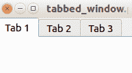

在下面的截图中，我们看到选项卡 2 和来自`button_and_label.py`的小部件：

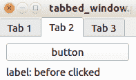

# 构建加密货币钱包

现在您已经了解了 Qt for Python 库的其他功能，让我们开始构建一个桌面加密货币钱包。由于这是一个复杂的应用程序，我们不应该将所有东西都放在一个文件中；相反，我们将其分成许多文件。我们甚至将许多文件分成不同的目录。我们还希望将此应用程序保持足够基本，以用于教程的目的。因此，我们不会在此应用程序中放置很多功能。这个加密货币钱包可以创建新账户，向另一个账户发送以太币，并监视 ERC20 代币，以便稍后将一些代币发送到另一个账户。但它不会具有您从正式加密货币钱包中期望的完整功能。

首先，让我们使用以下命令创建项目目录及其内部目录：

```py
$ mkdir wallet
$ mkdir wallet/icons
$ mkdir wallet/images
$ mkdir wallet/tests
$ mkdir wallet/tools
$ mkdir wallet/wallet_threads
$ mkdir wallet/wallet_widgets
```

主应用程序、主库及其配置文件放在主目录`wallet`中。一些用于提升应用程序 UI 的图标放在`icons`目录中。头像图像放在`images`目录中。测试文件放在`tests`目录中。与区块链和 UI 无关的库文件放在`tools`目录中。线程类放在`wallet_threads`目录中。最后，主小部件的子小部件放在`wallet_widgets`目录中。

# 区块链类

让我们在`wallet`中创建一个名为`blockchain.py`的区块链接口代码文件。这个文件负责连接到区块链。它的职责包括检查账户余额，获取本地账户，发送交易以及获取代币信息。通过将所有区块链功能放在一个类或文件中，我们更容易调试问题，测试实现，并开发功能。转到[`gitlab.com/arjunaskykok/hands-on-blockchain-for-python-developers/tree/master/chapter_09/wallet`](https://gitlab.com/arjunaskykok/hands-on-blockchain-for-python-developers/tree/master/chapter_09/wallet)并参考本节的`blockchain.py`代码文件。

这个区块链类有 10 个方法来与区块链交互。此外，它还具有 ERC20 代币的通用`json`接口。

让我们逐行讨论这个区块链类文件：

```py
from web3 import Web3, IPCProvider
from web3.exceptions import ValidationError
from populus.utils.wait import wait_for_transaction_receipt
from collections import namedtuple
from os.path import exists
import json

SendTransaction = namedtuple("SendTransaction", "sender password destination amount fee")
TokenInformation = namedtuple("TokenInformation", "name symbol totalSupply address")
```

在导入所需的库之后，我们创建了两个命名元组。那么，为什么我们要创建这些命名元组呢？基本上，我们这样做是为了避免错误。在加密货币钱包中出现错误是很昂贵的。

想象一下你有以下函数：

```py
def send_transaction(sender, password, destination, amount, fee):
    // the code to create transaction
```

你可以这样执行这个函数：

```py
send_transaction("427af7b53b8f56adf6f13932bb17c42ed2a53d04", “password”, "6ad2ffd2e08bd73f5c50db60fdc82a58b0590b99", 3, 2)
```

如果你交换了发送方和接收方，在最坏的情况下，你会得到一个未处理的异常，程序会停止，因为私钥与发送方不匹配。但是，如果你交换了金额和费用呢？在这种情况下，你会向某人发送少量的代币，但支付了非常高的费用。有许多方法可以避免这个错误。例如，你可以使用关键字参数，就像下面的代码块中所示，或者你可以使用命名元组：

```py
send_transaction(SendTransaction(sender="0xaksdfkas", password="password", destination="0xkkkkkk", amount=3, fee=2))
```

现在，让我们继续讨论 ERC20 代币智能合约的`json`接口。当我们想发送以太币时，这是不需要的：只有当我们想发送代币时才需要。

```py
true = True
false = False
erc20_token_interface = [
            {
                "anonymous": false,
                "inputs": [
                    {
                        "indexed": true,
                        "name": "_from",
                        "type": "address"
                    },
                    {
                        "indexed": true,
                        "name": "_to",
                        "type": "address"
                    },
                    {
                        "indexed": false,
                        "name": "_value",
                        "type": "uint256"
                    }
                ],
                "name": "Transfer",
                "type": "event"
            },
...
```

正如你所知，为了与智能合约交互，你需要智能合约的`json`接口（`abi`）。你可能想知道我们如何获得这个`json`接口。这是通过 ERC20 代币智能合约的编译输出实现的。不管名称、小数点数量和符号是什么，只要接口来自满足 ERC20 标准的智能合约，我们就应该得到正确的接口。我决定将接口放在与`Blockchain`类相同的文件中，以简化事情。但是，你可以将接口放在`json`文件中，然后在`Blockchain`类文件中加载`json`文件。然后，我们继续定义`Blockchain`类：

```py
class Blockchain:

    tokens_file = 'tokens.json'

    def __init__(self):
        self.w3 = Web3(IPCProvider('/tmp/geth.ipc'))
```

在这里，我们开始`Blockchain`类。在它的初始化方法中，我们构建一个`w3`变量来连接区块链。我们使用 IPC 提供程序硬编码连接到区块链。如果你使用`HTTPProvider`，或者使用不同的`IPC`文件路径，你可以更改这个配置。`tokens_file`变量是保存我们监视的所有代币的文件。

让我们来看看以下代码行：

```py
    def get_accounts(self):
        return map(lambda account: (account, self.w3.fromWei(self.w3.eth.getBalance(account), 'ether')), self.w3.eth.accounts)
```

我们使用`w3.eth.accounts`获取所有本地账户，然后使用`w3.eth.getBalance`从每个账户获取余额。本地账户是你在本地节点创建的账户。通常，文件保存在`keystore`目录中。

以下代码用于在本地区块链节点中创建一个新账户：

```py
    def create_new_account(self, password):
        return self.w3.personal.newAccount(password)
```

账户文件将使用我们提供的密码进行加密。要查看私钥，我们需要用密码解密账户文件。但是，这除了备份目的外是不必要的。

使用以下代码从一个地址获取余额：

```py
    def get_balance(self, address):
        return self.w3.fromWei(self.w3.eth.getBalance(address), 'ether')
```

余额以 wei 为单位。然后，我们将 wei 中的余额转换为以太币中的余额。

下面的代码块旨在获取 ERC20 代币的余额，而不是以太币的余额：

```py
    def get_token_balance(self, account_address, token_information):
        try:
            token_contract = self.w3.eth.contract(address=token_information.address, abi=erc20_token_interface)
            balance = token_contract.functions.balanceOf(account_address).call()
        except ValidationError:
            return None
        return balance
```

首先，我们获取接受两个参数的合同对象——智能合同的地址和 json 接口。如果您还记得在`第八章`中学到的内容，*在以太坊中创建代币*，ERC20 代币需要有一个`balanceOf`方法。此方法的目的是从账户地址获取代币的余额。

以下代码块用于创建发送以太币的交易：

```py
    def create_send_transaction(self, tx):
        nonce = self.w3.eth.getTransactionCount(tx.sender)
        transaction = {
          'from': tx.sender,
          'to': Web3.toChecksumAddress(tx.destination),
          'value': self.w3.toWei(str(tx.amount), 'ether'),
          'gas': 21000,
          'gasPrice': self.w3.toWei(str(tx.fee), 'gwei'),
          'nonce': nonce
        }

        tx_hash = self.w3.personal.sendTransaction(transaction, tx.password)
        wait_for_transaction_receipt(self.w3, tx_hash)
```

首先，您获取`nonce`，然后构建一个交易对象。要使用密码而不是私钥发送此交易，您需要使用`w3.personal`对象的`sendTransaction`方法。然后，您等待交易得到确认。

在学习涉及发送以太币的交易之后，让我们继续下一个代码块，这是用于创建发送 ERC20 代币的交易的方法：

```py
    def create_send_token_transaction(self, tx, token_information):
        nonce = self.w3.eth.getTransactionCount(tx.sender)
        token_contract = self.w3.eth.contract(address=token_information.address, abi=erc20_token_interface)
        transaction = token_contract.functions.transfer(tx.destination, int(tx.amount)).buildTransaction({
                  'from': tx.sender,
                  'gas': 70000,
                  'gasPrice': self.w3.toWei(str(tx.fee), 'gwei'),
                  'nonce': nonce
              })

        tx_hash = self.w3.personal.sendTransaction(transaction, tx.password)
        wait_for_transaction_receipt(self.w3, tx_hash)
```

首先，您获取`nonce`，然后构建一个合同对象。然后，您调用此智能合同对象的`transfer`方法。请记住，ERC20 代币需要有一个`transfer`方法来转移代币，该方法接受两个参数——目的地和代币数量。然后，通过从该方法构建交易来执行此方法，然后将其传递给`w3.personal`对象的`sendTransaction`方法。最后，我们等待此交易得到确认。

以下代码块用于从代币智能合同中获取信息：

```py
    def get_information_of_token(self, address):
        try:
            token_contract = self.w3.eth.contract(address=address, abi=erc20_token_interface)
            name = token_contract.functions.name().call()
            symbol = token_contract.functions.symbol().call()
            total_supply = token_contract.functions.totalSupply().call()
        except ValidationError:
            return None
        token_information = TokenInformation(name=name.decode('utf-8'),
                                             symbol=symbol.decode('utf-8'),
                                             totalSupply=total_supply,
                                             address=address)
        return token_information
```

首先，我们创建一个合同对象。然后，为了获取名称、符号和总供应量，我们从智能合同中访问`name`、`symbol`和`totalSupply`方法。因为名称和符号是字节对象，我们需要将其解码为字符串。我们将这些信息封装在一个名为`TokenInformation`的元组中。

以下代码是一种方便的方式，用于在命名的`tuple`中封装代币信息字典：

```py
    def get_token_named_tuple(self, token_dict, address):
        return TokenInformation(name=token_dict['name'],
                                totalSupply=token_dict['total_supply'],
                                symbol=token_dict['symbol'],
                                address=address)
```

以下代码用于从配置文件中获取我们正在观察的所有代币：

```py
    def get_tokens(self):
        tokens = {}
        if exists(self.tokens_file):
            with open(self.tokens_file) as json_data:
                tokens = json.load(json_data)
        return tokens
```

有许多代币的智能合同，但我们只想使用其中的一些。因此，我们将与这些代币智能合同相关的信息保存到一个`json`文件中。然后，我们转到文件的最后一行，即构造一个`Blockchain`类实例：

```py
blockchain = Blockchain()
```

我们这样做是为了让导入此模块的任何文件都可以立即获得区块链对象，并且两个不同的文件将获得相同的对象。这类似于单例模式。

# 线程类

现在，让我们编写线程对象，以便访问区块链。在区块链中创建交易时，通常希望使用线程或非阻塞函数。因此，每当我们想要广播一个交易时，我们使用这些线程类。这些线程类将使用我们之前描述的区块链对象。

使用以下代码块在`wallet_threads`目录中创建一个`balance_thread.py`文件：

```py
from PySide2.QtCore import QThread, Signal
from time import sleep
from blockchain import blockchain

class BalanceThread(QThread):

    get_balance_transaction = Signal(map)

    def __init__(self, parent=None):
        super(BalanceThread, self).__init__(parent)
        self.quit = False

    def kill(self):
        self.quit = True

    def run(self):
        while True:
            sleep(2)
            if self.quit:
                break
            accounts = blockchain.get_accounts()
            self.get_balance_transaction.emit(accounts)
```

这个线程类不会在区块链中创建任何交易；它的目的是读取每个账户中以太币的余额。那么，为什么我们需要一个线程来读取余额呢？读取余额应该是快速的吗？想象一下，当您启动您的加密货币钱包时，您看到您的余额是 10 个以太币。然后，有人给您发送了一些以太币。您希望您的余额尽快反映出来，对吧？这就是这个线程的目的；它将每 2 秒检查一次每个账户的余额。`kill`方法旨在关闭应用程序并停止线程的工作。这不是强制性的，但如果您不这样做，当您关闭应用程序时，您会收到一个令人讨厌的警告，指出应用程序在线程仍在运行时被销毁。

现在，让我们在`wallet_threads`目录中创建另一个线程类，并将其命名为`send_thread.py`：

```py
from PySide2.QtCore import QThread, Signal
from blockchain import blockchain

class SendThread(QThread):

    send_transaction = Signal()

    def __init__(self, parent=None):
        super(SendThread, self).__init__(parent)

    def prepareTransaction(self, tx):
        self.tx = tx

    def run(self):
        blockchain.create_send_transaction(self.tx)
        self.send_transaction.emit()
```

这个线程类的目的是调用区块链对象的`create_send_transaction`方法。在运行线程之前，我们需要使用`SendTransaction`命名的`tuple`参数调用这个线程类的`prepareTransaction`方法。

现在，让我们在`wallet_threads`目录中创建另一个线程类，并将其命名为`send_token_thread.py`：

```py
from PySide2.QtCore import QThread, Signal
from blockchain import blockchain

class SendTokenThread(QThread):

    send_token_transaction = Signal()

    def __init__(self, parent=None):
        super(SendTokenThread, self).__init__(parent)

    def prepareTransaction(self, tx, token_information):
        self.tx = tx
        self.token_information = token_information

    def run(self):
        blockchain.create_send_token_transaction(self.tx, self.token_information)
        self.send_token_transaction.emit()
```

这与`SendThread`类类似。这个线程的目的是调用`create_send_token_transaction`方法，这次接受两个参数，一个名为`SendTransaction`的元组，另一个名为`TokenInformation`的元组。

# Identicon 和图标

现在，让我们了解一下 identicon 库是什么。identicon 库的目的是根据特定字符串的哈希生成一个自定义头像图像（如分形）。如果您登录 StackOverflow 并且没有设置个人资料图片，您的头像将由 identicon 库生成。

截图将会出现如下：


或者会出现这样的情况：


这是可选的。我们的加密货币钱包可以在没有这些头像图像的情况下正常运行。这只是为了提升用户界面的吸引力。

从[`gitlab.com/arjunaskykok/hands-on-blockchain-for-python-developers/blob/master/chapter_09/wallet/tools/identicon.py`](https://gitlab.com/arjunaskykok/hands-on-blockchain-for-python-developers/blob/master/chapter_09/wallet/tools/identicon.py)下载文件到`tools`目录。这是 Shin Adachi 的出色工作。我已经修改过了，使其能够在 Python 3 中运行。您不必理解这个文件；把它当作一个第三方库。

然后，在`tools`目录中创建一个文件，使用以下代码块来使用这个库，并将其命名为`util.py`：

```py
from os.path import isdir, exists
from os import mkdir
from tools.identicon import render_identicon

def render_avatar(code):
    code = int(code, 16)
    img_filename = 'images/%08x.png' % code
    if exists(img_filename):
        return img_filename
    img = render_identicon(code, 24)
    if not isdir('images'):
        mkdir('images')
    img.save(img_filename, 'PNG')
    return img_filename
```

基本上，这种方法可以使用账户地址来渲染头像图像。这有助于使应用程序更具吸引力。因此，当您创建一个账户时，您会得到一个根据您的地址而独一无二的头像。

然后，在`icons`文件夹中下载一些图标。您需要其中的两个：`ajax-loader.gif`和`copy.svg`。您可以从免费图标网站下载`copy.svg`。任何显示复制操作的图标都可以。然后，您可以从[`ajaxload.info/`](http://ajaxload.info/)下载`ajax-loader.gif`。

# 构建小部件

让我们使用以下代码块创建我们的主应用程序。这是我们的加密货币钱包的主入口。将其命名为`wallet.py`：

```py
from PySide2.QtWidgets import QTabWidget, QApplication
import sys

from wallet_widgets.account_widget import AccountWidget
from wallet_widgets.send_widget import SendWidget
from wallet_widgets.token_widget import TokenWidget

class WalletWidget(QTabWidget):

    def __init__(self, parent=None):
        super(WalletWidget, self).__init__(parent)
        self.account_widget = AccountWidget()
        self.send_widget = SendWidget()
        self.token_widget = TokenWidget()
        self.addTab(self.account_widget, "Account")
        self.addTab(self.send_widget, "Send")
        self.addTab(self.token_widget, "Token")

    def killThreads(self):
        self.account_widget.kill()

if __name__ == "__main__":

    app = QApplication(sys.argv)
    wallet_widget = WalletWidget()
    wallet_widget.show()
    return_app = app.exec_()
    wallet_widget.killThreads()
    sys.exit(return_app)
```

`WalletWidget`是一个带有选项卡的窗口。有三个选项卡：

+   第一个选项卡旨在容纳一个账户小部件。该小部件负责管理账户（列出账户和创建新账户）。

+   第二个选项卡旨在容纳一个小部件，用户可以使用它来创建发送以太币或 ERC20 代币的交易。任何涉及发送以太币或代币的操作都是在这个小部件中完成的。

+   第三个选项卡用于容纳令牌小部件。该小部件负责监视 ERC20 代币。监视 ERC20 代币意味着从 ERC20 自定义代币智能合约获取信息，并使这些代币能够在发送交易小部件中被花费。

这三个小部件将在其他文件中定义，稍后将讨论。

`killThreads`方法是可选的。如果您不使用这个方法，当您关闭应用程序时，您将会收到警报，因为应用程序创建的线程尚未完成其任务。

# 账户小部件

现在，让我们在选项卡窗口的第一个选项卡中创建第一个小部件。将文件放入`wallet_widgets`目录，并将其命名为`account_widget.py`。然后，您可以从以下链接获取完整的代码文件：[`gitlab.com/arjunaskykok/hands-on-blockchain-for-python-developers/tree/master/chapter_09/wallet/wallet_widgets`](https://gitlab.com/arjunaskykok/hands-on-blockchain-for-python-developers/tree/master/chapter_09/wallet/wallet_widgets)。

如前所述，此小部件将显示在钱包选项卡窗口的第一个选项卡中。在此选项卡中，您将获得列出帐户和创建新帐户功能。

使用以下代码从`PySide2`导入许多类型的小部件和类：

```py
from PySide2.QtWidgets import (QWidget,
                               QGridLayout,
                               QVBoxLayout,
                               QHBoxLayout,
                               QPushButton,
                               QLabel,
                               QInputDialog,
                               QLineEdit,
                               QToolTip,
                               QApplication,
                               QSizePolicy)
from PySide2.QtCore import Slot, SIGNAL, QSize
from PySide2.QtGui import QPixmap, QIcon, QCursor, QClipboard
from time import sleep
from blockchain import blockchain
from tools.util import render_avatar
from wallet_threads.balance_thread import BalanceThread
```

我们还导入了`blockchain`对象和`render_avatar`方法等其他内容。此外，我们将使用`balance_thread`实例，这是一个用于更新帐户余额的线程。

使用以下代码块创建一个按钮，允许我们在小部件内创建一个帐户：

```py
class AccountWidget(QWidget):

    balance_widgets = {}

    def __init__(self, parent=None):
        super(AccountWidget, self).__init__(parent)

        self.create_account_button = QPushButton("Create Account")
        self.create_account_button.setSizePolicy(QSizePolicy.Maximum, QSizePolicy.Maximum)
        self.connect(self.create_account_button, SIGNAL('clicked()'), self.createNewAccount)

        self.accounts_layout = QVBoxLayout()

        accounts = blockchain.get_accounts()

        for account, balance in accounts:
            self._addAccountToWindow(account, balance)

        layout = QGridLayout()

        layout.addWidget(self.create_account_button, 0, 0)
        layout.addLayout(self.accounts_layout, 1, 0)

        self.setLayout(layout)

        self.balance_thread = BalanceThread()
        self.balance_thread.get_balance_transaction.connect(self._updateBalances)
        self.balance_thread.start()
```

所有这些帐户将放在`accounts_layout`垂直框布局中。我们从区块链对象中获取所有本地帐户，然后使用`addAccountToWindow`方法将此帐户放入 accounts 布局中。之后，我们将按钮和`accounts_layout`放入主布局中。最后，我们将`BalanceThread`线程实例的槽连接到`_updateBalances`方法并运行该线程。

使用以下代码启动输入对话框并请求密码：

```py
    @Slot()
    def createNewAccount(self):
        password, ok = QInputDialog.getText(self, "Create A New Account",
                 "Password:", QLineEdit.Normal)
        if ok and password != '':
            new_account = blockchain.create_new_account(password)
            self._addAccountToWindow(new_account, 0, resize_parent=True)
```

在这里，我们调用`blockchain`对象的`create_new_account`方法。新帐户的地址将被发送到`_addAccountToWindow`方法，该方法将在垂直框布局中包含新帐户信息。

接下来，我们使用以下代码块将帐户的地址复制到剪贴板：

```py
    def copyAddress(self, address):
        QToolTip.showText(QCursor.pos(), "Address %s has been copied to clipboard!" % address)
        clipboard = QApplication.clipboard()
        clipboard.setText(address)
```

在这里，我们获取剪贴板对象并将内容复制到其中。因此，在每个帐户信息中，都将有一个按钮连接到此方法。然而，我们将首先在工具提示中显示此复制操作的信息。`Qcursor.pos()`是我们鼠标的位置。`QtoolTip`的`showText`方法用于显示工具提示。

有四个主要的小部件——帐户地址标签、复制帐户地址的按钮、此帐户余额的标签和头像图片。为了显示头像图片，我们可以使用一个标签。但是我们使用`setPixmap`方法而不是`setText`方法，如下面的代码块中所提供的：

```py
    def _addAccountToWindow(self, account, balance, resize_parent=False):
        wrapper_layout = QVBoxLayout()
        account_layout = QHBoxLayout()
        rows_layout = QVBoxLayout()
        address_layout = QHBoxLayout()
        account_label = QLabel(account)
...
...
        avatar.setPixmap(pixmap)
        account_layout.addWidget(avatar)
        account_layout.addLayout(rows_layout)
        wrapper_layout.addLayout(account_layout)
        wrapper_layout.addSpacing(20)
        self.accounts_layout.addLayout(wrapper_layout)

        if resize_parent:
            sizeHint = self.sizeHint()
            self.parentWidget().parentWidget().resize(QSize(sizeHint.width(), sizeHint.height() + 40))
```

`setPixmap`接受`Qpixmap`对象。如果`resize_parent`为 true，则我们将增加窗口的高度。我们使用名为`parentWidget`的方法访问主窗口，即选项卡窗口。这必须链接并调用两次，如`self.parentWidget().parentWidget()`。第一个父窗口是堆栈视图。选项卡小部件是使用堆栈视图构建的。

使用以下代码调用`BalanceThread`实例的`kill()`方法：

```py
    def kill(self):
        self.balance_thread.kill()
        sleep(2)
```

这将告诉线程停止其任务。

下一个方法是由线程实例用于更新余额的：

```py
    @Slot()
    def _updateBalances(self, accounts):
        for account, balance in accounts:
            self.balance_widgets[account].setText('Balance: %.5f ethers' % balance)
```

`balance_widgets[account]`保存特定帐户的余额标签。

# 发送交易小部件

第二个小部件是`SendWidget`。在`wallet_widgets`目录中创建一个名为`send_widget.py`的文件。此小部件负责从 ERC20 令牌发送以太币或硬币。有关此部分的完整代码，请转到以下 GitLab 链接：[`gitlab.com/arjunaskykok/hands-on-blockchain-for-python-developers/tree/master/chapter_09/wallet/wallet_widgets`](https://gitlab.com/arjunaskykok/hands-on-blockchain-for-python-developers/tree/master/chapter_09/wallet/wallet_widgets)。

此小部件是选项卡窗口中最复杂的小部件。在此小部件中，我们需要选择发送方的帐户，然后根据该帐户显示与此帐户相关的以太币或 ERC20 令牌的余额。余额显示为以太币或 ERC20 令牌取决于在此小部件的另一部分中选择了以太坊还是 ERC20 令牌。我们还需要添加一个行编辑，以便人们可以填写目标地址。此外，我们需要一种选择费用的方式，因为有时人们不介意支付更高的费用，以便他们的交易能够更快地得到处理。然后，有一个按钮启动输入对话框，请求密码，以便我们可以创建交易。

要从`PySide2`库导入小部件和类，请使用以下代码块：

```py
from PySide2.QtWidgets import (QWidget,
                               QGridLayout,
                               QVBoxLayout,
                               QHBoxLayout,
                               QPushButton,
                               QLabel,
                               QInputDialog,
                               QLineEdit,
                               QToolTip,
                               QComboBox,
                               QApplication,
                               QSlider,
                               QSizePolicy)
from PySide2.QtCore import Slot, SIGNAL, QSize, Qt
from PySide2.QtGui import QPixmap, QMovie, QPalette, QColor
from os.path import isdir, exists
from os import mkdir
from tools.util import render_avatar
from blockchain import blockchain, SendTransaction
from wallet_threads.send_thread import SendThread
from wallet_threads.send_token_thread import SendTokenThread
```

我们还导入了其他东西，比如渲染头像的工具，与区块链交互的方法，以及创建交易和检索有关代币信息的线程类。

使用以下代码初始化`SendWidget`类：

```py
class SendWidget(QWidget):

    tokens_file = 'tokens.json'

    def __init__(self, parent=None):
        super(SendWidget, self).__init__(parent)

        self.token_name = 'Ethereum'

        self.setupSenderSection()
        self.setupDestinationSection()
        self.setupTokenSection()
        self.setupProgressSection()
        self.setupSendButtonSection()
        self.setupFeeSection()

        self.send_thread = SendThread()
        self.send_thread.send_transaction.connect(self.sendTransactionFinished)
        self.send_token_thread = SendTokenThread()
        self.send_token_thread.send_token_transaction.connect(self.sendTransactionFinished)

        layout = QGridLayout()

        layout.addLayout(self.sender_layout, 0, 0)
        layout.addLayout(self.destination_layout, 0, 1)
        layout.addLayout(self.progress_layout, 1, 0, 1, 2, Qt.AlignCenter)
        layout.addLayout(self.token_layout, 2, 0)
        layout.addLayout(self.send_layout, 2, 1)
        layout.addLayout(self.slider_layout, 3, 0)

        self.setLayout(layout)
```

`tokens_file`保存了`tokens.json`文件。这个配置文件包含了我们监视的所有 ERC20 代币。`token_name`最初设置为`Ethereum`，因为默认情况下，我们的加密货币钱包应该处理以太坊交易，而不是 ERC20 代币。在这个小部件中，我们可以发送以太币或自定义代币。然后，我们调用六种方法来建立六种内部布局。这个小部件由六种布局组成。发送方布局用于选择发送方的账户。目的地布局是一个设计用来保存交易目的地账户的字段。进度布局默认情况下是隐藏的，用于显示在发送交易后交易仍在确认中。代币布局用于选择您是要发送 ERC20 代币还是以太币。此外，发送布局用于保存发送按钮，滑块布局用于保存选择交易费用的滑块。我们还创建了两个线程实例——第一个用于发送以太币，而第二个用于发送 ERC20 代币。对于主布局，我们使用网格布局。这种布局更容易布置我们的小部件。

以下代码块是用于设置创建交易小部件的发送方布局部分的方法：

```py
    def setupSenderSection(self):
        accounts = blockchain.get_accounts()

        sender_label = QLabel("Sender")
        sender_label.setSizePolicy(QSizePolicy.Maximum, QSizePolicy.Maximum)

        self.balance_label = QLabel("Balance: ")
        self.balance_label.setSizePolicy(QSizePolicy.Maximum, QSizePolicy.Maximum)

        self.avatar = QLabel()

        self.sender_combo_box = QComboBox()
        self.sender_items = []
        for account, balance in accounts:
            self.sender_items.append(account)
        self.sender_combo_box.addItems(self.sender_items)
        self.sender_combo_box.setSizePolicy(QSizePolicy.Maximum, QSizePolicy.Maximum)
        self.sender_combo_box.currentTextChanged.connect(self.filterSender)

        first_account = self.sender_items[0]
        self.filterSender(first_account)
        self.setAvatar(first_account, self.avatar)

        self.sender_layout = QVBoxLayout()
        sender_wrapper_layout = QHBoxLayout()
        sender_right_layout = QVBoxLayout()
        sender_right_layout.addWidget(sender_label)
        sender_right_layout.addWidget(self.sender_combo_box)
        sender_right_layout.addWidget(self.balance_label)
        sender_wrapper_layout.addWidget(self.avatar)
        sender_wrapper_layout.addLayout(sender_right_layout)
        sender_wrapper_layout.addStretch()

        self.sender_layout.addLayout(sender_wrapper_layout)
        self.sender_layout.addStretch()
```

在这里，您有一个下拉框来选择本地账户，一个头像图像和一个余额标签。如果您更改下拉框的值，这将自动更改余额标签和头像图像上的文本。

以下代码块是用于设置目的地布局部分的方法：

```py
    def setupDestinationSection(self):
        self.destination_layout = QVBoxLayout()

        destination_label = QLabel("Destination")
        destination_label.setSizePolicy(QSizePolicy.Maximum, QSizePolicy.Maximum)

        self.destination_line_edit = QLineEdit()
        self.destination_line_edit.setFixedWidth(380);
        self.destination_line_edit.setSizePolicy(QSizePolicy.Maximum, QSizePolicy.Maximum)

        self.destination_layout.addWidget(destination_label)
        self.destination_layout.addWidget(self.destination_line_edit)
        self.destination_layout.addStretch()
```

这个方法主要是一个行编辑。您可以在这个行编辑中粘贴或输入目的地的地址。

以下代码块是用于设置代币布局部分的方法：

```py
    def setupTokenSection(self):
        token_label = QLabel("Token")
        token_label.setSizePolicy(QSizePolicy.Maximum, QSizePolicy.Maximum)

        token_combo_box = QComboBox()

        tokens = blockchain.get_tokens()
        first_token = 'Ethereum'
        items = [first_token]
        self.token_address = {'Ethereum': '0xcccccccccccccccccccccccccccccccccccccccc'}
        self.token_informations = {}

        for address, token_from_json in tokens.items():
            token_information = blockchain.get_token_named_tuple(token_from_json, address)
            self.token_informations[token_information.name] = token_information
            self.token_address[token_information.name] = token_information.address
            items.append(token_information.name)

        self.amount_label = QLabel("Amount (in ethers)")

        token_combo_box.addItems(items)
        token_combo_box.setSizePolicy(QSizePolicy.Maximum, QSizePolicy.Maximum)
        token_combo_box.currentTextChanged.connect(self.filterToken)

        self.token_avatar = QLabel()

        self.filterToken(first_token)
        token_address = self.token_address[first_token]
        self.setAvatar(token_address, self.token_avatar)

        self.token_layout = QVBoxLayout()
        token_wrapper_layout = QHBoxLayout()
        token_right_layout = QVBoxLayout()
        token_right_layout.addWidget(token_label)
        token_right_layout.addWidget(token_combo_box)
        token_wrapper_layout.addWidget(self.token_avatar)
        token_wrapper_layout.addLayout(token_right_layout)
        token_wrapper_layout.addStretch()
        self.token_layout.addLayout(token_wrapper_layout)
```

该部分有一个代币的头像，下拉框可以选择以太坊或其他 ERC20 代币，以及 ERC20 代币的总供应量。如果我们改变下拉框的值，它将改变头像和总供应量标签。代币的头像来自代币智能合约的地址。然而，以太坊没有地址，因为它本身就是平台。因此，对于以太坊，我们使用以下虚拟地址：`0xcccccccccccccccccccccccccccccccccccccccc`。

以下代码块是用于设置进度布局部分的方法：

```py
    def setupProgressSection(self):
        self.progress_layout = QHBoxLayout()
        progress_vertical_layout = QVBoxLayout()
        progress_wrapper_layout = QHBoxLayout()
        self.progress_label = QLabel()
        movie = QMovie('icons/ajax-loader.gif')
        self.progress_label.setMovie(movie)
        movie.start()
        self.progress_label.setSizePolicy(QSizePolicy.Maximum, QSizePolicy.Maximum)
        self.progress_description_label = QLabel()
        self.progress_description_label.setText("Transaction is being confirmed. Please wait!")
        self.progress_description_label.setSizePolicy(QSizePolicy.Maximum, QSizePolicy.Maximum)
        progress_wrapper_layout.addWidget(self.progress_label)
        progress_wrapper_layout.addWidget(self.progress_description_label)
        progress_vertical_layout.addLayout(progress_wrapper_layout, 1)
        self.progress_layout.addLayout(progress_vertical_layout)
        self.sendTransactionFinished()
```

基本上，这是一个标签，用于显示交易正在确认中。在这一部分，有一个标签用于显示加载活动指示器。首先，我们初始化一个接受`gif`文件的`QMovie`对象。然后，通过调用该标签的`setMovie`方法，将这个`Qmovie`设置到一个标签上。

以下代码块是用于设置发送布局部分的方法，用于创建交易的小部件：

```py
    def setupSendButtonSection(self):
        self.send_layout = QVBoxLayout()
        self.amount_line_edit = QLineEdit()
        self.send_button = QPushButton("Send")
        self.send_button.setSizePolicy(QSizePolicy.Maximum, QSizePolicy.Maximum)
        self.send_button.clicked.connect(self.sendButtonClicked)
        pal = self.send_button.palette()
        pal.setColor(QPalette.Button, QColor(Qt.green))
        self.send_button.setAutoFillBackground(True)
        self.send_button.setPalette(pal)
        self.send_button.update()
        self.send_layout.addWidget(self.amount_label)
        self.send_layout.addWidget(self.amount_line_edit)
        self.send_layout.addWidget(self.send_button)
```

这一部分用于保存一个发送按钮，与一个回调连接。这个发送按钮是定制的，通过使用背景颜色使其看起来更有吸引力。更改按钮的颜色的方法很简单：

使用以下代码从按钮获取调色板对象，然后将颜色设置为该调色板对象：

```py
        pal = self.send_button.palette()
        pal.setColor(QPalette.Button, QColor(Qt.green))
```

在这里，我们使用预定义的颜色。

以下代码块用于创建滑块和指示我们在滑块中选择了什么值的标签：

```py
    def setupFeeSection(self):
        self.slider_layout = QVBoxLayout()
        fee_label = QLabel("Fee")
        self.fee_slider = QSlider(Qt.Horizontal)
        self.fee_slider.setRange(1, 10)
        self.fee_slider.setValue(3)
        self.fee_slider.valueChanged.connect(self.feeSliderChanged)
        self.gwei_label = QLabel()
        self.feeSliderChanged(3)
        self.slider_layout.addWidget(fee_label)
        self.slider_layout.addWidget(self.fee_slider)
        self.slider_layout.addWidget(self.gwei_label)
```

滑块的目的是选择交易的费用。如果您选择更高的费用，交易将更快地处理。

以下代码块用于选择以太坊或 ERC20 代币：

```py
    def filterToken(self, token_name):
        address = self.token_address[token_name]
        token_information = None
        if token_name != 'Ethereum':
            token_information = self.token_informations[token_name]
            self.amount_label.setText("Amount")
        else:
            self.amount_label.setText("Amount (in ethers)")
        self.updateBalanceLabel(token_name, self.sender_account, token_information)
        self.setAvatar(address, self.token_avatar)
        self.token_name = token_name
```

这是当我们更改代币组合框的值时将执行的回调。我们在这里更新帐户的以太币或代币余额。这样做后，我们更改代币的头像。我们还更新了代币的总供应量。

以下代码块用于选择发送方帐户：

```py
    def filterSender(self, account_address):
        self.sender_account = account_address
        token_information = None
        if self.token_name != 'Ethereum':
            token_information = self.token_informations[self.token_name]
        self.updateBalanceLabel(self.token_name, account_address, token_information)
        self.setAvatar(account_address, self.avatar)
```

这是当我们更改发送者组合框的值时将执行的回调。在这里，我们更新帐户的以太币或代币余额，然后根据地址更改帐户的头像。

以下代码块是用于将帐户余额设置到标签的方法：

```py
    def updateBalanceLabel(self, token_name, account_address, token_information=None):
        if token_name == 'Ethereum':
            self.balance_label.setText("Balance: %.5f ethers" % blockchain.get_balance(account_address))
        else:
            self.balance_label.setText("Balance: %d coins" % blockchain.get_token_balance(account_address, token_information))
```

在`updateBalanceLabel`方法中，如果我们使用以太坊，我们使用`blockchain`对象的`get_balance`方法设置`balance_label`的文本。如果我们使用 ERC20 代币，我们使用`blockchain`的`get_token_balance`方法。

以下代码块是用于设置头像的方法：

```py
    def setAvatar(self, code, avatar):
        img_filename = render_avatar(code)
        pixmap = QPixmap(img_filename)
        avatar.setPixmap(pixmap)
```

此方法用于设置代币和帐户的头像。

以下代码块是当我们更改费用滑块的值时将执行的回调：

```py
    def feeSliderChanged(self, value):
        self.gwei_label.setText("%d GWei" % value)
        self.fee = value
```

以下代码块是单击发送按钮时将执行的方法：

```py
    def sendButtonClicked(self):
        password, ok = QInputDialog.getText(self, "Create A New Transaction",
                 "Password:", QLineEdit.Password)
        if ok and password != '':
            self.progress_label.setVisible(True)
            self.progress_description_label.setVisible(True)
            tx = SendTransaction(sender=self.sender_account,
                                 password=password,
                                 destination=self.destination_line_edit.text(),
                                 amount=self.amount_line_edit.text(),
                                 fee=self.fee)
            token_information = None
            if self.token_name != 'Ethereum':
                token_information = self.token_informations[self.token_name]
                self.send_token_thread.prepareTransaction(tx, token_information)
                self.send_token_thread.start()
            else:
                self.send_thread.prepareTransaction(tx)
                self.send_thread.start()
```

在这里，我们将被要求在输入对话框中提供密码。如果我们点击确定，那么我们将设置进度标签和加载活动指示器为可见。我们构造了一个名为`SendTransaction`的元组，然后将其发送到处理发送以太币或 ERC20 代币交易的线程类对象。最后，我们运行线程。

以下代码块用于在交易完成时隐藏进度标签（加载指示器）：

```py
    def sendTransactionFinished(self):
        self.progress_label.setVisible(False)
        self.progress_description_label.setVisible(False)
```

此方法将在线程实例完成工作后被调用（无论是发送以太币还是作为 ERC20 代币发送硬币）。

# 代币小部件

最后的小部件是代币小部件。该小部件负责监视 ERC20 代币。在`wallet_widgets`目录中创建`token_widget.py`。转到提供完整代码文件的以下 GitLab 链接：[`gitlab.com/arjunaskykok/hands-on-blockchain-for-python-developers/tree/master/chapter_09/wallet/wallet_widgets`](https://gitlab.com/arjunaskykok/hands-on-blockchain-for-python-developers/tree/master/chapter_09/wallet/wallet_widgets)。

这个最后的小部件在主小部件的第三个选项卡中。这里的目的是监视 ERC20 代币并列出所有已监视的 ERC20 代币。有一个按钮来启动输入对话框，一个按钮来请求 ERC20 智能合约代币的地址，然后有一个垂直布局来显示所有 ERC20 代币：

```py
from PySide2.QtWidgets import (QWidget,
                               QGridLayout,
                               QVBoxLayout,
                               QHBoxLayout,
                               QPushButton,
                               QLabel,
                               QInputDialog,
                               QLineEdit,
                               QToolTip,
                               QComboBox,
                               QApplication,
                               QSlider,
                               QSizePolicy)
from PySide2.QtCore import Slot, SIGNAL, QSize, Qt
from PySide2.QtGui import QPixmap, QMovie, QPalette, QColor
from os.path import isdir, exists
from os import mkdir
from time import sleep
import json
from tools.util import render_avatar
from blockchain import blockchain, SendTransaction, TokenInformation
```

像往常一样，我们导入了许多东西，比如渲染头像工具、区块链对象以建立有关区块链上代币的信息，以及一些处理文件系统的库。除此之外，我们还从`PySide2`导入了 UI 类，比如许多类型的小部件，以及用于将回调附加到小部件的类。除了 UI 类，我们还从 PySide2 导入了非 UI 类，比如`slot`和`signal`。

使用以下代码块进行初始化方法：

```py
class TokenWidget(QWidget):

    tokens_file = 'tokens.json'

    def __init__(self, parent=None):
        super(TokenWidget, self).__init__(parent)

        self.watch_token_button = QPushButton("Watch Token")

        tokens = blockchain.get_tokens()

...
...

        self.watch_token_button.setSizePolicy(QSizePolicy.Maximum, QSizePolicy.Maximum)
        self.connect(self.watch_token_button, SIGNAL('clicked()'), self.watchNewToken)

        layout.addWidget(self.watch_token_button, 0, 0)
        layout.addLayout(self.tokens_layout, 1, 0)

        self.setLayout(layout)
```

在这个初始化方法中，我们创建一个按钮，链接到`watchNewToken`方法，然后创建一个垂直框布局来容纳所有代币信息。我们还声明了`tokens_file`对象，它保存了`tokens.json`配置文件。该文件跟踪所有与 ERC20 代币相关的信息。

使用以下代码块为每个代币信息创建一个头像图像、代币名称标签、代币符号标签和代币总供应标签：

```py
    def _addTokenToWindow(self, token_information, resize_parent=False):
        wrapper_layout = QVBoxLayout()
        token_layout = QHBoxLayout()
        rows_layout = QVBoxLayout()
        token_label = QLabel(token_information.name)
...
...
        if resize_parent:
            sizeHint = self.size()
            self.parentWidget().parentWidget().resize(QSize(sizeHint.width(), sizeHint.height() + 100))
```

如果`resize_parent`为 true，这意味着我们通过对话框添加代币信息。换句话说，我们要求父窗口增加其高度。如果`resize_parent`为`false`，这意味着此方法是从开始调用的。

以下代码块是用于使用对话框请求智能合约地址的方法：

```py
    @Slot()
    def watchNewToken(self):
        address, ok = QInputDialog.getText(self, "Watch A New Token",
                 "Token Smart Contract:", QLineEdit.Normal)
        if ok and address != '':
            token_information = blockchain.get_information_of_token(address)
            self._addTokenToWindow(token_information, resize_parent=True)
            token_data = {}
            if exists(self.tokens_file):
                with open(self.tokens_file) as json_data:
                    token_data = json.load(json_data)
            token_data[token_information.address] = {'name': token_information.name,
                                                     'symbol': token_information.symbol,
                                                     'total_supply': token_information.totalSupply}
            with open(self.tokens_file, 'w') as outfile:
                json.dump(token_data, outfile)
```

如果用户确认了智能合约的地址，我们将使用`blockchain`对象的`get_information_of_token`方法获取代币信息。然后，将这个代币的信息放在垂直框布局中。稍后，我们将代币的信息保存在 json 文件中。这样做是为了在重新启动应用程序时可以加载这些代币信息。

在启动加密货币钱包之前，请确保首先运行私有链，然后在私有链中部署一个或两个 ERC20 智能合约。您可以在第八章中使用 ERC20 智能合约源代码，*在以太坊中创建代币*。完成此操作后，使用以下命令运行桌面加密货币钱包：

```py
(wallet-venv) $ python wallet.py
```

您将在以下截图中看到最终输出：

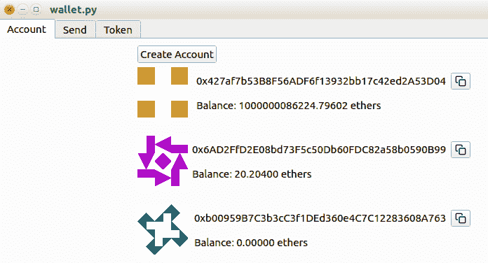

在上述截图中，我们看到账户选项卡显示了每个账户的余额。确保至少有两个账户。如果没有，请通过单击“创建账户”按钮从此选项卡创建一个。

以下截图显示了发送选项卡，我们可以向任何我们选择的账户发送以太币：

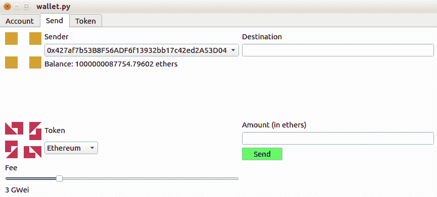

在第二个选项卡中，尝试发送以太币。在交易确认之前需要一些时间。因此，尝试向另一个账户发送 ERC20 代币（但您必须首先在第三个选项卡中添加 ERC20 代币），如下截图所示：

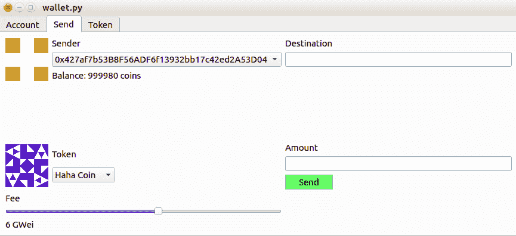

最后，在第三个选项卡中，尝试观察一个代币智能合约。单击“观察代币”按钮时，在对话框中放入智能合约地址：

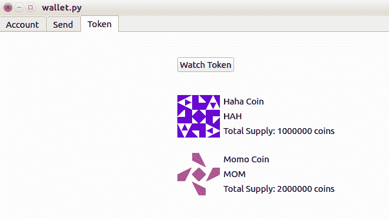

您的代币将在第二个选项卡中反映出来。

# 测试

让我们为这个 GUI 应用程序编写测试。这些测试不应该是详尽无遗的。我们将创建三个测试，每个选项卡一个。我们不会为应用程序的非 UI 部分创建测试。本节只是为了演示如何测试 UI 应用程序。

第一个选项卡的第一个测试是一个账户小部件测试。将测试命名为`test_account.py`，并将其保存在`tests`目录中。以下代码块是测试脚本：

```py
import sys, os
sys.path.append(os.path.realpath(os.path.dirname(__file__)+"/.."))

from wallet import WalletWidget
from PySide2.QtWidgets import QInputDialog
from PySide2 import QtCore

def test_account(qtbot, monkeypatch):
    wallet = WalletWidget()
    qtbot.addWidget(wallet)

    old_accounts_amount = wallet.account_widget.accounts_layout.count()

    monkeypatch.setattr(QInputDialog, 'getText', lambda *args: ("password", True))
    qtbot.mouseClick(wallet.account_widget.create_account_button, QtCore.Qt.LeftButton)

    accounts_amount = wallet.account_widget.accounts_layout.count()
    assert accounts_amount == old_accounts_amount + 1

    wallet.killThreads()
```

在这个测试中，我们测试了在点击按钮、启动对话框、填写密码，然后点击确定之前，账户布局有多少子项，然后我们再次检查创建新账户后子项的数量。数量应该增加一个。为了进行这个测试，我们对对话框进行了补丁，以便更容易进行测试。

这个测试并不全面。我们没有测试失败的情况。我将把这留给读者作为练习。

第二个选项卡的测试是发送交易小部件测试。将测试文件命名为`test_send.py`，并将其保存在`tests`目录中。测试脚本如下所示（有关完整代码，请参考以下 GitLab 链接中的代码文件：[`gitlab.com/arjunaskykok/hands-on-blockchain-for-python-developers/blob/master/chapter_09/wallet/tests/test_send.py`](https://gitlab.com/arjunaskykok/hands-on-blockchain-for-python-developers/blob/master/chapter_09/wallet/tests/test_send.py)）：

```py
import sys, os
sys.path.append(os.path.realpath(os.path.dirname(__file__)+"/.."))
from time import sleep

from wallet import WalletWidget
from PySide2.QtWidgets import QInputDialog
from PySide2 import QtCore

...
...

    qtbot.keyClicks(wallet.send_widget.sender_combo_box, second_account)
    balance_of_second_account = int(float(wallet.send_widget.balance_label.text().split()[1]))

    assert balance_of_second_account - old_balance_of_second_account == 10

    wallet.killThreads()
```

在这个测试中，我们检查了组合框中第二个账户的余额。这个第二个账户将是目标账户。在这里，我们从标签中读取余额，然后将组合框的值改回第一个账户，这将是发送方。之后，我们将目标账户的地址设置为目标行编辑。然后我们在金额行编辑中设置以太币的数量，并点击发送按钮，但请记住，我们需要对输入对话框进行补丁。最后，在将账户组合框的值再次更改为第二个账户之前，我们等待大约 20 秒。我们从标签中检索余额，然后比较旧值和新值之间的差异，应该是 10 以太币。

第三个选项卡的测试是为了测试令牌小部件。将其命名为`test_token.py`并保存在`tests`目录中。此测试的测试脚本如下所示：

```py
import sys, os
sys.path.append(os.path.realpath(os.path.dirname(__file__)+"/.."))

from wallet import WalletWidget
from PySide2.QtWidgets import QInputDialog
from PySide2 import QtCore

def test_token(qtbot, monkeypatch):
    wallet = WalletWidget()
    qtbot.addWidget(wallet)

    old_tokens_amount = wallet.token_widget.tokens_layout.count()

    address = None
    with open('address.txt') as f:
        address = f.readline().rstrip()

    monkeypatch.setattr(QInputDialog, 'getText', lambda *args: (address, True))
    qtbot.mouseClick(wallet.token_widget.watch_token_button, QtCore.Qt.LeftButton)

    tokens_amount = wallet.token_widget.tokens_layout.count()
    assert tokens_amount == old_tokens_amount + 1

    wallet.killThreads()
```

首先，我们将令牌智能合约的地址加载到`address.txt`文件中，因为我们不希望在测试文件中将其硬编码。策略与账户小部件测试中的相同。我们检查垂直框布局有多少子项。完成后，我们点击按钮，启动对话框，填写智能合约的地址，然后点击确定。接下来，我们再次检查垂直框布局有多少子项。这个数字应该再次增加 1。

就像我说的，这个测试实际上并不完整。我们也应该测试令牌信息。但是，这个测试是一个很好的开始。

您可以使用以下命令运行前述测试：

```py
(wallet-venv) $ pytest tests
```

# 构建加密货币钱包时需要考虑的因素

您现在已经创建了一个桌面加密货币钱包。但是，这个钱包还没有完全完成。加密货币钱包是一个广泛的话题，变化如此之快，以至于可以单独写一本书来讨论这个话题。您可以将其他功能实现到加密货币钱包应用程序中，比如已确认的区块数量。在我们的应用程序中，我们只等待一个交易，但有些用户可能想要先确认几个区块。如果交易仅经过一个区块的确认，那么它有一点可能被更长的区块替换。然而，经过 12 个区块后，区块中的交易基本上是安全且不可逆的，如下面的链接所解释的：[`ethereum.stackexchange.com/questions/319/what-number-of-confirmations-is-considered-secure-in-ethereum`](https://ethereum.stackexchange.com/questions/319/what-number-of-confirmations-is-considered-secure-in-ethereum)。

我们的加密货币钱包是一个纯粹的加密货币钱包。但是，您也可以向我们的加密货币钱包添加与钱包功能无关的其他功能。例如，Mist 加密货币钱包不仅仅是一个钱包；它还是一个去中心化应用程序浏览器。它还可以编译智能合约的源代码并将其部署到区块链上。

如果您想要制作一个完整的加密货币钱包，您应该实现许多功能。一些想法包括生成二维码、导出加密私钥的选项、导入私钥、使用种子短语生成账户、输入验证以及记住密码一段时间。

在这里，我们正在构建一个桌面加密货币钱包。桌面应用程序可以拥有大量的内存和存储空间。但是，如果您正在构建一个移动加密货币钱包，情况就不同了。例如，比特币桌面加密货币钱包可以在本地访问完整节点。但是，您不能将完整的比特币节点放在手机上，因为它太大了。当然，您可以将完整的比特币节点放在云上，让移动加密货币钱包应用程序访问它。但是，大多数人不想在云上设置完整节点。因此，比特币移动加密货币钱包的任何开发者通常使用简化支付验证（SPV）。这样，比特币移动加密货币钱包就不需要在手机上存储完整的比特币节点。

如果您想要构建加密货币钱包或为现有的加密货币钱包做出贡献，您需要牢记两件事：安全和用户体验（UX）。

# 安全

加密货币钱包处理资金，因此您需要确保其安全。安全是一个复杂的话题，在这里我们将简要讨论。

不要仅仅因为可以而安装第三方库；每个库都是另一个攻击向量。在应用程序中慎重打包第三方库。我们的加密货币钱包使用来自以太坊 GitHub 的库，如 web3.py 和 Populus。这应该没问题，因为它们是核心库。我们还使用 Qt 公司的`PySide2`库。这个库是必不可少的，因为没有 GUI 库就不能有 GUI 应用程序。我们还使用第三方库来生成 identicon 头像图像。在这里我们需要小心。这个库是一个单一文件，我已经完全阅读过以确保没有隐藏的恶意软件。因此，我可以自信地将其整合到我们的应用程序中。

在宣布交易完成之前，请使用最少数量的确认。确认次数足够多取决于您的威胁和风险建模。通常，12 次确认会使撤销交易变得不切实际。Mist 钱包使用 12 次确认，而 ZCash 钱包使用 10 次确认。

您还可以在创建加密货币钱包的帐户时强制用户创建一个良好的密码，因为大多数用户倾向于使用糟糕的密码创建帐户。但在这里要小心；您不希望过分打扰他们。

# 用户体验

如果一个应用程序非常安全但使用起来非常困难，那就没有用了。因此，我们需要让用户感到不那么害怕。比特币的创造者中本聪在构建软件时非常注重用户体验。以前，人们使用 base64 格式将二进制转换为文本。然而，中本聪使用 base58 来表示比特币地址。Base58 类似于 base64，但在打印时不会引起混淆的字符，比如 I（大写 i）和 l（小写 L）。

Zcash 发布了一个关于设计加密货币钱包的用户体验指南，可以在以下链接找到：[`zcash.readthedocs.io/en/latest/rtd_pages/ux_wallet_checklist.html`](https://zcash.readthedocs.io/en/latest/rtd_pages/ux_wallet_checklist.html)。这里并非所有内容都可以实施，因为 Zcash 有以太坊没有的私人交易。然而，其他建议可以实施；例如，市场信息。不管喜欢与否，人们将加密货币价格挂钩到法定货币上，向人们展示 1 个以太的市场价格是个好主意。如果网络拥挤，您也应通知用户。您可以建议用户等待或增加交易费用。

如果您要构建 iOS 加密货币钱包，应遵循苹果人机界面指南。如果您要构建 Android 加密货币钱包，应遵循 Material Design 指南。在选择排版和颜色时要小心。在设计加密货币钱包时，应进行用户访谈。用户体验是一个广泛的主题。平衡用户体验和安全是一门微妙的艺术。在构建加密货币钱包时不应忽视用户体验。

# 摘要

在本章中，我们已经熟悉了`PySide2`的标签视图、大小策略和网格布局。然后，我们还学习了如何测试 Qt 应用程序。接下来，我们开始构建一个桌面加密货币钱包。我们将应用程序分成许多部分：区块链、线程、小部件、标识工具和测试。加密货币钱包的区块链部分是基于`web3`和`Populus`库的，其目的是在区块链中读取和创建交易。线程是在创建交易时，UI 部分和区块链对象之间的中间人。标识工具用于根据特定字符串（通常是账户地址或代币智能合约地址）创建头像图像。小部件部分是一个带有三个选项卡的选项卡小部件。第一个选项卡是账户小部件，第二个选项卡是发送交易小部件，第三个选项卡是代币小部件。最后，我们为这个应用程序创建了测试。

在下一章中，我们将开始学习区块链技术范围之外的主题。这项技术被称为 IPFS。它仍然是分散式技术的一部分，但这项技术将克服与区块链技术相关的弱点；换句话说，它的存储是昂贵的。
