# 第十章：星际文件系统-一个崭新的文件系统

在本章中，我们将学习**星际文件系统**（**IPFS**）。IPFS 实际上并不是区块链技术的一部分；相反，它是对其的补充。IPFS 与区块链是天作之合。正如你在之前的章节中学到的，区块链中的存储是昂贵的。通常，人们在区块链中保存文件的链接，并将实际文件保存在普通存储中，比如云存储。但这种策略遭受了中心化的命运。IPFS 为区块链开发者提供了一种避免这种情况的方法。

在本章中，你将学习以下内容：

+   IPFS 背后的动机

+   Merkle DAG

+   点对点网络

# IPFS 背后的动机

IPFS 不是一个普通的文件系统，比如`fat32`，`ntfs`或`ext3`。它更类似于 Dropbox。它是一个跨设备的文件系统。你可以把文件保存在这个文件系统中，全世界的人都可以像在自己的电脑上一样轻松地访问它。如果以太坊可以被认为是世界上唯一的操作系统，那么 IPFS 可以被认为是世界上唯一的存储！

IPFS 网站的口号是*IPFS 是分布式网络*。IPFS 试图取代，或者至少补充 HTTP。HTTP 协议已经服务了我们很长时间，超过 20 年，但它被认为不足以应对即将出现的挑战，比如带宽需求增加或文件冗余。HTTP 使用客户端-服务器模型。你只能选择这两种角色中的一种：要么是服务器，要么是客户端。

这种架构存在一些问题：

+   第一个问题是，要担任服务器角色，我们必须有足够的资源。如果没有，如果服务器被大量请求淹没，它可能会迅速崩溃。处理每分钟一百万个请求所需的资源对许多普通人来说是不可及的。

+   第二个问题是，服务器和客户端的架构在某些情况下并不高效。想象一下，你坐在公园里的一位老奶奶旁边，你们两个都在从同一个 URL 观看一只可爱熊猫的视频（类似[`example.com/cute_panda.mp4`](https://example.com/cute_panda.mp4)）。假设这个视频的大小是 20MB。这意味着服务器必须两次发送一个 20MB 的文件到两个不同的位置，即使这两个不同的位置距离很近，相隔一米。换句话说，服务器使用了 40MB 的带宽。然而，想象一下，如果你可以不是从服务器，而是从坐在你旁边的老奶奶那里获取文件（在这种情况下，假设老奶奶比你早两分钟观看了这个可爱熊猫的视频）。这不是更高效吗？

Juan Benet 在 2013 年末受到启发建立了 IPFS。当时，他正在研究知识工具，这个术语指的是可以有效地从论文中获取知识的软件。比如，一个科学家读了很多论文。如果科学家能更快地获取这些知识就更好了。Benet 遇到的问题是数据集分发需要太多的工作。没有简单的方法来处理数据集的版本控制。他看了各种工具，比如 Git 和 BitTorrent，并想知道它们是否可以结合起来解决这个问题。结果，IPFS 诞生了。BitTorrent 启发了 IPFS 在节点之间分发文件和查找文件。Git 启发了 IPFS 保持文件的完整性和将保存的文件转换为存储。

IPFS 是一个点对点的超媒体协议，使网络更快、更安全、更开放。IPFS 的目标是务实的和理想化的。除了节省带宽，它的另一个目标是增加文件的寿命。在服务器上保存文件很长时间（比如十年）需要大量的资源。我们希望文件保持存活的原因通常是因为它对服务器所有者有某种经济利益；例如，如果是博客文章，可以通过广告实现货币化。如果不是，文件有可能会被存储服务器的所有者销毁。这就是当 Geocities 关闭时发生的情况。

Geocities 是一个允许人们创建自己个人网站的网站。它类似于[wordpress.com](http://wordpress.com)和[medium.com](http://medium.com)。一些服务器所有者会保持文件存活，即使没有广告，就像维基百科一样，它靠捐赠维持运转。除此之外，文件就没有那么幸运了。

IPFS 的其他目标更加理想化，涉及到如何使我们提供内容的方式更加民主化。目前，内容非常集中。我们通常只会去一些网站，比如 Facebook、Instagram、Reddit、Medium、Netflix、Amazon、Google、Wikipedia 等等。这种信息的寡头垄断阻碍了互联网的创新，因为信息实际上是由少数几家公司控制的。除了维基百科，大多数，如果不是全部，公司都受到富有的股东的约束。这种情况与 10 年前形成了鲜明对比，当时互联网被认为是财富和信息的伟大均等化者，类似于印刷技术。

这种重度集中化的另一个缺点是提供的信息容易受到审查。例如，Google 是一家位于加利福尼亚州山景城的公司，因此受美国法律约束。大多数有权做决定的人（高级管理人员和 C 级别人员）都是美国人，因此在他们对世界的看法中存在美国偏见。在欧洲大多数国家都是合法的事情，在美国可能因为被认为是亵渎或危险而被审查。IPFS 项目的创始人将这种情况比作被国家或强大机构认为危险而被焚烧的书籍。IPFS 项目的一个目标是增加文件对审查的抵抗力。IPFS 使人们更容易地镜像和提供危险文件。我们将在本章的后面讨论 IPFS 如何实现这一目标。

IPFS 的最终目标更加务实，涉及到我们脆弱的互联网基础设施，由计算机网络和由光纤电缆连接的核心路由器组成。如果连接的电缆意外或故意受损，一个区块或区域可能会离线。2011 年，一名女子用铁锹损坏了为亚美尼亚带来互联网的电缆，当时她在挖掘寻找金属出售。IPFS 项目并不能完全解决这个问题，但它可以在一定程度上减轻损害。

你可以在这里找到关于那位女士和她的铁锹的事件：[`web.archive.org/web/20141225063937/http://www.wsj.com/articles/SB10001424052748704630004576249013084603344.`](https://web.archive.org/web/20141225063937/http://www.wsj.com/articles/SB10001424052748704630004576249013084603344)

# Merkle DAG

如果你已经了解了 Git 的内部工作原理，Merkle 有向无环图（DAG）就不会太陌生。作为一个版本控制系统软件，Git 需要保留文件的许多版本并轻松地将它们分发给其他人。它还需要能够快速检查文件的完整性。

Merkle DAG 由两个词组成：Merkle 和 DAG。让我们先讨论 Merkle。实际上，在这个上下文中，Merkle 的完整词是 Merkle 树。 Merkle 树是一种快速检查部分数据是否被篡改的方法。

# Merkle 树

让我们看一个 Merkle 树的例子以便理解它。假设您有八个数据。在这种情况下，我们将使用动物的名称作为我们的数据，但在使用 Merkle 树的比特币中，数据通常是交易。回到 Merkle 树：按顺序放置数据，所以在这种情况下，猫是第一条数据，狗是第二条，蚂蚁是第三条，依此类推：

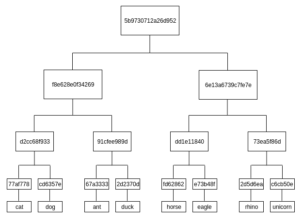

我们获取每个数据的哈希，例如猫，狗，蚂蚁等。在这个演示中，我们使用哈希函数 SHA256。由于空间有限，我们在图中截断了完整的哈希结果。现在，我们将数据从左到右排序，所以“猫”字符串的哈希是`Data 1`，“狗”字符串的哈希是`Data 2`，“蚂蚁”字符串的哈希是`Data 3`，依此类推。

现在是有趣的部分。对于`Data 1`和`Data 2`，我们合并哈希并对结果进行哈希。合并哈希意味着连接它。对`Data 3`和`Data 4`，`Data 5`和`Data 6`，`Data 7`和`Data 8`也是如此。

这可能让您想起淘汰赛。我们现在进入半决赛阶段。我们现在有`Hash 1`（来自`Data 1`和`Data 2`），`Hash 2`（来自`Data 3`和`Data 4`），`Hash 3`（来自`Data 5`和`Data 6`），以及`Hash 4`（来自`Data 7`和`Data 8`）。

然后我们连接`Hash 1`和`Hash 2`，对结果进行哈希，并将其命名为`Hash 5`。然后我们对`Hash 3`和`Hash 4`做同样的事情。将结果命名为`Hash 6`。

我们现在进入最后阶段。合并`Hash 5`和`Hash 6`，然后对结果进行哈希。结果就是`Root Hash`。这个`Root Hash`可以保证所有数据的完整性（从`Data 1`到`Data 8`）。如果更改任何数据，`Root Hash`将会不同。

您可能会问为什么我们不只是从一开始就连接所有数据（从`Data 1`到`Data 8`）然后对结果进行哈希。然而，事实证明，Merkle 树比仅仅连接所有数据然后对其进行哈希（这种技术称为**哈希列表**，在某些情况下使用）具有一些优点。其中一个好处是，当我们使用 Merkel 树时，检查部分数据的完整性更容易和更便宜。

在 Merkle 树中，要检查`Data 5`的完整性，您只需要下载`Data 5`，`Data 6`，`Hash 4`，`Hash 5`和`Root Hash`，如下图所示。您不需要下载所有数据：

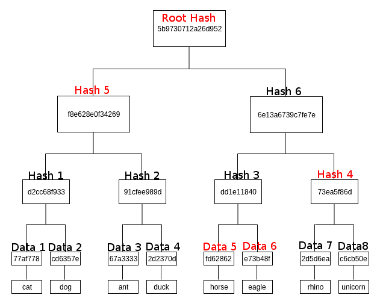

如果您使用天真的方法，您需要下载所有数据的哈希值（`Data 1`到`Data 8`）和`Root Hash`。在这个例子中，我们只有八个数据。想象一下，如果我们有 100 个数据，你需要下载整个数据集。Merkle 树使这个过程更有效，因为我们不需要下载完整的数据集。

如果我们有奇数个节点，比如七个，一般规则（比特币实现的规则）是克隆最后一个节点，所以`Data 8`是`Data 7`的副本。然而，您也可以使用另一条规则；我见过 Merkle 树的一种实现，其中单个数据（在我们的例子中是`Data 7`）被简单地提升到顶部。在这种情况下，`Hash 4`就是`Data 7`。

这就是当人们使用简化支付验证时比特币所做的事情。使用移动应用程序下载完整节点是困难的。为了发送比特币交易，用户只下载节点的重要部分而不是完整节点。Merkle 树使这一过程成为可能。

在下一节中，我们将继续学习 DAGs。

# 指令丙烯酸图（DAGs）

**指令丙烯酸图**（**DAGs**），顾名思义，是图，其中每个顶点（或节点）都可以有指向其他顶点的边，如下图所示：

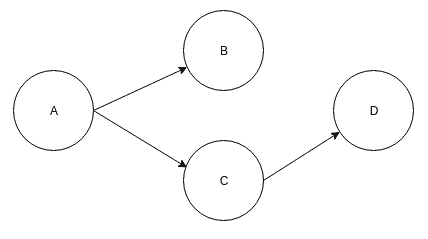

箭头的方向并不重要，只要保持一致即可：

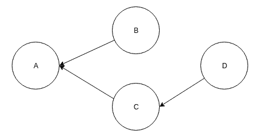

规则是这些边不应该构成一个循环。在下图中，我们可以看到顶点 A、C 和 D 构成一个循环，这违反了 DAG 的规则：

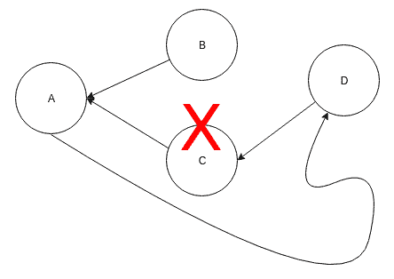

现在，如果你结合 Merkle 树和 DAG，你会得到一个 Merkle DAG。这是 Git 和 IPFS 使用的数据结构。

在 Merkle 树中，只有叶节点保存数据。然而，在 Merkle DAG 中，任何节点都可以保存数据。在 Merkle 树中，树必须是平衡的，但在 Merkle DAG 中没有这样的限制。

在我们深入 Merkle DAG 之前，让我们先了解内容寻址，因为 Merkle DAG 依赖于这个特性。

# 内容寻址

在链表中，你用指针将节点（或块）链接在一起。指针是指向内存的数据类型。例如，假设我们有两个节点，节点 A 和节点 B。节点 A 是头，节点 B 是尾。节点的结构有两个重要的组成部分。第一个组成部分是数据组成部分，你在其中存储数据。在 Git 中，这个数据可以是文件的内容。第二个组成部分是指向另一个节点的链接。在链表中，这是指向节点地址的指针。

但是，使用内容寻址时，我们不仅仅添加一个指针，还会添加目标的哈希值（在这种情况下是节点 B）。你可能会认出这个概念；这正是区块链中发生的事情。然而，Merkle DAG 不是一个线性延伸的链表。Merkle DAG 是一个可以有分支的树。

这是一个链表。它用于区块链的数据结构：

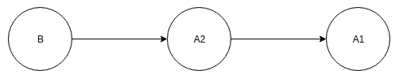

现在，考虑这种情况。我们有三个节点：节点 A1 和 A2 都是指向节点 B 的头。我们不是把指针放在节点 A1 和节点 A2 上，而是把指针放在节点 B 上。节点 B 现在有两个指针。节点 B 对节点 A1 和节点 A2 进行哈希，然后连接两个哈希再次进行哈希。这样，节点 B 可以保持节点 A1 和节点 A2 的内容的完整性。如果有人改变了节点 A1 或节点 A2 的内容，节点 B 保存的哈希将无效：

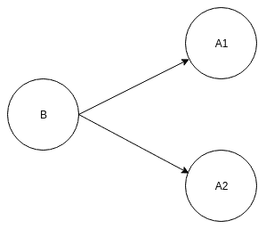

IPFS 在获取文档方面与 HTTP 不同。HTTP 使用链接，它们像指针一样工作。例如，假设我们有以下链接：[`example.com/cute_panda.png`](https://example.com/cute_panda.png)。这使用一个位置来获取名为`cute_panda.png`的文档。只有一个提供者可以提供这个文档，那就是`example.com`。然而，IPFS 不使用 URL 链接。相反，它使用哈希链接，比如`ipfs://QmYeAiiK1UfB8MGLRefok1N7vBTyX8hGPuMXZ4Xq1DPyt7`。当你访问这个哈希链接时，IPFS 软件将找到文档，当哈希后，将给出相同的哈希输出。因为哈希是一个单向函数，IPFS 必须有一些其他信息来定位文档。基本上，它会将请求广播到附近具有这个哈希输出的文档的节点。如果附近的节点没有这些文件，它们会将请求转发给它们附近的节点。这种对等查找请求非常复杂。IPFS 使用 S/Kademlia 分布式哈希表，我们将在本章的后面部分讨论。

有趣的是，当你使用内容寻址时，可能会有多个提供者可以提供这个文档。在`cute_panda.png`文档的情况下，可能有四个以上的节点可以提供这个文档。我们可以选择最近的节点来使下载过程更有效率。这个特性也使得审查变得更加困难。在 HTTP 的情况下，一个行为者可以禁止服务器[`example.com`](https://example.com)。然而，在 IPFS 的情况下，任何人都可以启动一个新节点并提供文档。现在，IPFS 是透明的，也许太过透明。请求文档的节点可以看到提供文档的节点的 IP 地址，反之亦然。行为者可以禁止 IP 地址以阻止这个文档的传播。然而，使 IPFS 与 Tor 一起工作的开发，Tor 是一种允许用户匿名浏览网站的软件，仍处于早期阶段。

如果你从[`example.com/cute_panda.png`](https://example.com/cute_panda.png)下载一个文档，那么你在那一刻得到的文档可能与你的朋友昨天从同样的 URL 下载的文档不同。可能是服务器的管理员在你今天下载之前改变了文档。

然而，通过内容寻址系统，你从 IPFS 哈希链接`ipfs://QmYeAiiK1UfB8MGLRefok1N7vBTyX8hGPuMXZ4Xq1DPyt7`获取的文档，无论何时何地下载，都是相同的。这个哈希链接保证了没有人可以篡改文档。如果你改变文档并上传到 IPFS，IPFS 的 URL 或哈希将会不同。

我们可以创建一个简单的 Python 脚本来说明这种情况。在这个目录中创建一个名为`ipfs_tutorial`的目录。在这个目录中创建三个示例文件。第一个示例文件是`hello.txt`，内容是`I am a good boy.\n`。第二个示例文件是`hello2.txt`，内容是`I am a good girl.\n`。第三个示例文件是`hello3.txt`，内容是`I am a good horse.\n`。第四个示例文件是`hello4.txt`，内容是`I am a good girl.\n`。第二个和第四个文件具有相同的内容是故意的。如果你愿意，你可以创建不同的文件，但请确保其中至少有两个文件具有相同的内容。

创建一个 Python 脚本，如下面的代码块所示，并将其命名为`create_hash_from_content.py`：

```py
from os import listdir
from hashlib import sha256

files = [f for f in listdir('.') if 'hello' in f]

hashes = {}

for file in files:
    with open(file) as f:
        content = f.read().encode('utf-8')
        hash_of_content = sha256(content).hexdigest()
        hashes[hash_of_content] = content

content = hashes['20c38a7a55fc8a8e7f45fde7247a0436d97826c20c5e7f8c978e6d59fa895fd2']
print(content.decode('utf-8'))

print(len(hashes))
```

这个脚本列出了同一目录中所有以`hello`开头的文件。如果你的示例文件不是以`hello`开头的，你可以修改这部分。长哈希是`hello2.txt`内容的哈希值。

当你运行这个脚本时，你会得到以下结果：

```py
I am a good girl.

3
```

正如你所看到的，有四个文件，但最终输出是三个，而不是四个。这是因为有三个文件具有独特的内容，而不是四个。这就是内容寻址的工作原理。它不关心文件名，只关心内容。文件名是`hello1.txt`还是`hello2.txt`或`hello4.txt`都无关紧要，重要的是内容`I am a good girl.\n`是相同的。从技术上讲，这是一个“善意的谎言”；有一种情况下 IPFS 必须考虑文件名，不能忽视它。我将在本章后面解释这个问题的真相。

在前面的例子中，我们看到的是正常的哈希。没有 Markle DAG 甚至 Merkle 树。现在让我们创建一个更复杂的场景，有一个大文件。对大文件进行哈希不是有效的。通常，我们将文件分割成多个相同大小的小块。例如，一个 900KB 的文件会变成四个文件。第一、第二和第三个文件的大小为 250KB。第四个文件的大小为 150KB。然后，我们对每个较小的文件进行哈希，并与 Merkle 树结合。

为了说明目的，我们不会使用一个大文件，但我们会设置一些虚构的限制。我们不希望对跨越多行的内容进行哈希。如果文本文件有四行，我们会将它们分成四个更小的文件。

在项目目录中，创建一个名为`hello_big.txt`的文件，并输入以下内容：

```py
I am a big boy.
I am a tall girl.
I am a fast horse.
I am a slow dragon.
```

在创建一个脚本来对这个大文件进行哈希之前，让我们创建一个非常简单的 Merkle 树库，并将其命名为`merkle_tree.py`。有关完整代码文件，请参考 GitLab 链接：[`gitlab.com/arjunaskykok/hands-on-blockchain-for-python-developers/tree/master/chapter_10`](https://gitlab.com/arjunaskykok/hands-on-blockchain-for-python-developers/tree/master/chapter_10)。

让我们从初始化开始讨论这个 Merkle 树库：

```py
    def __init__(self, leaf_nodes : List[str]):
        self.hash_nodes : List[str] = []
        self.leaf_nodes : List[str] = leaf_nodes
        self._turn_leaf_nodes_to_hash_nodes()
        if len(leaf_nodes) < 4:
            self.root_hash = self._hash_list()
        else:
            self.root_hash = self._build_root_hash()
```

确保至少有四个节点。如果没有，我们可以使用哈希列表技术。`leaf_nodes`是原始数据节点。它们是字符串列表，比如`['cat', 'dog', 'unicorn', 'elephant']`。`hash_nodes`是数据节点的哈希列表，比如`[hash of 'cat', hash of 'dog', hash of 'unicorn', hash of 'elephant']`或`['77af778...', 'cd6357e...', 'c6cb50e...', 'cd08c4c...']`。

如果节点少于四个，我们使用`_hash_list()`方法对数据进行哈希列表。我们在对它们进行哈希之前将所有数据拼接起来：

```py
    def _hash_list(self):
        long_node = "".join(self.hash_nodes)
        return self._hash(long_node.encode('utf-8'))
```

在`_turn_leaf_nodes_to_hash_nodes()`方法中，我们根据`leaf_nodes`填充`hash_nodes`。这是一对一的映射：

```py
    def _turn_leaf_nodes_to_hash_nodes(self):
        for node in self.leaf_nodes:
            self.hash_nodes.append(self._hash(node.encode('utf-8')))
```

在`_hash()`方法中，我们包装了`sha256`哈希函数。这是为了使类的定制更容易，因为我们可能想使用不同的哈希函数：

```py
    def _hash(self, data : bytes) > bytes:
        return sha256(data).hexdigest()
```

以下代码块显示了如何从哈希节点中获取根节点：

```py

    def _build_root_hash(self) > bytes:
        parent_amount = ceil(len(self.hash_nodes) / 2)
        nodes : List[str] = self.hash_nodes

        while parent_amount > 1:
            parents : List[bytes] = []
            i = 0
            while i < len(nodes):
                node1 = nodes[i]
                if i + 1 >= len(nodes):
                    node2 = None
                else:
                    node2 = nodes[i+1]
                parents.append(self._convert_parent_from_two_nodes(node1, node2))
                i += 2
            parent_amount = len(parents)
            nodes = parents

        return parents[0]
```

在这里，我们对哈希节点进行多次迭代。每次迭代都会跳过两步。对于每次迭代，它都会处理两个节点。它连接这两个节点的哈希，然后对结果进行哈希。得到的哈希是这两个节点的父节点。这个父节点成为将要再次迭代的哈希节点的一部分。这个父节点和它的邻居将再次连接并进行哈希，依此类推。如果哈希节点数为奇数，最后一个节点将在进行哈希之前与自身连接。如果只有一个父节点，我们返回该节点的哈希，即**根哈希**：

```py
    def _convert_parent_from_two_nodes(self, node1 : bytes, node2) -> bytes:
        if node2 == None:
            return self._hash((node1 + node1).encode('utf-8'))
        return self._hash((node1 + node2).encode('utf-8'))
```

`_convert_parent_from_two_nodes()`方法允许我们从两个子节点获取父哈希。我们将这两个节点连接起来并对它们进行哈希。如果第二个节点是`None`，表示节点数为奇数或者我们正在处理最后一个节点，我们只需将节点与自身连接再进行哈希。

现在 Merkle 树库已经准备好了，我们将创建一个 Python 脚本来对`hello_big.txt`文件进行哈希，并将其命名为`hash_big_file.py`：

```py
from os import listdir
from hashlib import sha256
from merkle_tree import MerkleTree

hashes = {}

file = 'hello_big.txt'
with open(file) as f:
    lines = f.read().split('\n')
    hash = []
    hash_of_hash = []
    merkle_tree = MerkleTree(lines)
    root_hash = merkle_tree.root_hash

hashes[root_hash] = []
for line in lines:
    hashes[root_hash].append(line)

print(hashes)
```

如果执行这个 Python 脚本，你将得到以下输出：

```py
{'ba7a7738a34a0e60ef9663c669a7fac406ae9f84441df2b5ade3de1067c41808': ['I am a big boy.', 'I am a tall girl.', 'I am a fast horse.', 'I am a slow dragon.', '']}
```

如果文件很大，你不会直接对其进行哈希，因为这可能会导致内存耗尽。相反，你会将文件分割。在这里，我们根据换行符分割文本文件。如果处理二进制文件，你会逐块读取文件并将该块保存到一个较小的文件中。当然，在将它们输入 Merkle 树之前，你需要将二进制数据序列化为文本数据。一旦完成了这一步，你就可以将数据片段输入 Merkle 树。你会得到根哈希，它将保护原始文件的完整性。如果在数据片段中更改了一个位，根哈希将会不同。

# Merkle DAG 数据结构

我们使用内容寻址来处理文件。如果文件很大，我们可以对其进行分割，并使用 Merkle 树获取根哈希。在这种情况下，我们只关心文件的内容；我们甚至不保存它的名称。

然而，有一种情况，文件名确实很重要。例如，假设您想保存一个包含 100 张可爱熊猫图片的文件目录。在这种情况下，文件的名称并不重要；我们关心的是内容，即可爱熊猫的图片！然而，如果这是一个编程项目的目录，文件的名称就很重要。如果一个 Python 文件尝试导入另一个包含在不同文件中的 Python 库，我们必须保留文件的名称。假设我们有一个名为`main.py`的 Python 文件，其内容如下：

```py
from secret_algorithm import SuperSecretAlgorithm

# execute it
SuperSecretAlgorithm()
```

`main.py`文件依赖于同一目录中的另一个名为`secret_algorithm.py`的文件。重要的不仅是`secret_algorithm.py`文件的内容，还有它的名称。如果文件名更改，`main.py`将无法导入该库。

为了保存内容和文件名，我们需要使用 Merkle DAG 数据结构。如前所述，Merkle DAG 和 Merkle 树之间的一个区别是，Merkle DAG 中的任何节点都可以保存数据，而不仅仅是叶节点，这是 Merkle 树中的情况。

让我们创建一个包含示例文件和一个嵌套目录的示例目录：

```py
$ mkdir sample_directory
$ cd sample_directory
$ // Create some files
$ mkdir inner_directory
$ cd inner_directory
$ // Create some files
```

然后，创建一个 Python 脚本来解释这种新的数据结构。在项目目录中创建一个名为`merkle_dag.py`的文件。有关完整代码文件，请参考 GitLab 链接：[`gitlab.com/arjunaskykok/hands-on-blockchain-for-python-developers/tree/master/chapter_10`](https://gitlab.com/arjunaskykok/hands-on-blockchain-for-python-developers/tree/master/chapter_10)。

让我们讨论`MerkleDAGNode`类，从其初始化方法开始：

```py
    def __init__(self, filepath : str):
        self.pointers = {}
        self.dirtype = isdir(filepath)
        self.filename = Path(filepath).name
        if not self.dirtype:
            with open(filepath) as f:
                self.content = f.read()
            self.hash = self._hash((self.filename + self.content).encode('utf-8'))
        else:
            self.content = self._iterate_directory_contents(filepath)
            nodes_in_str_array = list(map(lambda x: str(x), self.content))
            if nodes_in_str_array:
                self.hash = self._hash((self.filename + MerkleTree(nodes_in_str_array).root_hash).encode('utf-8'))
            else:
                self.hash = self._hash(self.filename.encode('utf-8'))
```

`_init_()`方法接受文件路径作为参数。这可以是文件或目录的路径。我们假设这是一个有效的路径，而不是一个符号链接。`self.pointers`将在`_iterate_directory_contents()`方法的部分中解释。`self.dirtype`用于区分目录或文件。`self.filename`用于保存文件或目录的名称。

如果参数是文件的路径（而不是目录），我们将内容读入`self.content`。为了演示目的，我们假设文件的内容很小，我们不尝试像之前那样拆分文件。然后，我们根据文件名和内容计算哈希值。

如果参数是目录的路径，则内容将是该目录内部文件的`MerkleDAGNode`对象数组。为了计算哈希值，我们使用 Merkle 树来获取其子节点的根哈希。但是，我们需要在再次对其进行哈希之前将其与目录的名称连接起来：

```py
    def _hash(self, data : bytes) -> bytes:
        return sha256(data).hexdigest()
```

`_hash()`是`sha256`哈希函数的包装方法。

`_iterate_directory_contents()`方法用于迭代目录的内部子项。我们将该目录内的每个文件或目录转换为`MerkleDAGNode`对象。`self.pointers`对象用于更轻松地根据文件名访问`MerkleDAGNode`。基本上，这就像一个递归函数，特别是当我们遇到一个目录时：

```py
    def _iterate_directory_contents(self, directory : str):
        nodes = []
        for f in listdir(directory):
            merkle_dag_node = MerkleDAGNode(directory + '/' + f)
            nodes.append(merkle_dag_node)
            self.pointers[f] = merkle_dag_node
        return nodes
```

`_repr_()`方法用于更轻松地打印对象以进行调试：

```py
    def __repr__(self):
        return 'MerkleDAGNode: ' + self.hash + ' || ' + self.filename
```

`_eq_()`方法是必需的，以便我们可以将`MerkleDAGNode`对象与其他`MerkleDAGNode`对象进行比较。这在测试过程中非常有用：

```py
    def __eq__(self, other):
        if isinstance(other, MerkleDAGNode):
            return self.hash == other.hash
        return False
```

让我们创建一个`hash_directory.py`文件来演示这种数据结构的强大功能：

```py
from merkle_dag import MerkleDAGNode

outer_directory = 'sample_directory'

node = MerkleDAGNode(outer_directory)
print(node)
print(node.content)
```

如果执行脚本，您将获得以下结果：

```py
MerkleDAGNode: ec618189b9de0dae250ab5fa0fd9bf1abc158935c66ff8595446f5f9b929e037 || sample_directory
[MerkleDAGNode: 97b97507c37bd205aa15073fb65367b45eb11a975fe78cd548916f5a3da9692a || hello2.txt, MerkleDAGNode: 8ced218a323755a7d4969187449177bb2338658c354c7174e21285b579ae2bca || hello.txt, MerkleDAGNode: c075280aef64223bd38b1bed1017599852180a37baa0eacce28bb92ac5492eb9 || inner_directory, MerkleDAGNode: bc908dfb86941536321338ff8dab1698db0e65f6b967a89bb79f5101d56e1d51 || hello3.txt]
```

输出是 Merkle DAG 节点的模式。

这就是 Git 保存文件的方式。我们的实现只是为了教育目的，不适合生产目的。在现实世界中，你应该有很多优化。你可以实现的一个优化是使用数据的引用，就像 Git 一样。如果有两个不同的文件具有相同的内容（但文件名不同），则内容只保存一次。另一个优化是 Git 使用压缩。下图说明了 Git 的概念，我们有两个文件**文件 B**和**文件 D**。这两个文件都有相同的内容**内容 xxx**。**文件 B**只保存一次在**目录 A**中。**文件 D**保存在**目录 C**中，有一个不同的内容**内容 yyy**。**目录 C**也保存在**目录 A**中。但**文件 B**和**文件 D**的内容**内容 xxx**只保存一次：

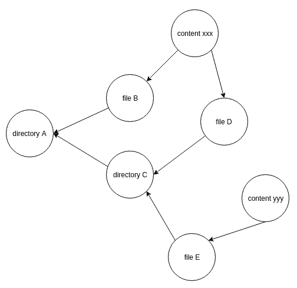

现在我们知道了如何使用 Merkle DAG 保存文件目录，如果我们想要更改文件的内容怎么办？我们应该放弃这个 Merkle DAG 节点并创建一个全新的节点吗？解决这个问题的更有效的方法是使用一个版本控制系统。一个文件可以有版本 1、版本 2、版本 3 等。实现版本控制的最简单方法是使用链表，如下图所示：

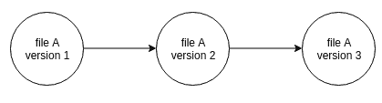

# 点对点网络

我们了解了如何在 IPFS 中保存文件。关键是**哈希**。值是文件或目录的名称和文件或目录的内容。如果我们正在构建一个集中式系统，我们的故事就结束了。我们只需要添加一些其他东西来创建一个保存文件并根据哈希搜索文件的软件。这个软件类似于数据库，比如 SQLite 或 LevelDB。IPFS 都不是这些；它是一个像数据库一样分散在各处的点对点文件系统。换句话说，它是一个分布式哈希表。

IPFS 使用 S/Kademlia，Kademlia 的扩展版本，作为分布式哈希表。在讨论 Kademlia 之前，让我们讨论它的前身。

首先，想象一个哈希表，就像 Python 中的字典，如下表所示：

| **键** | **值** |
| --- | --- |
| 2 | 猫 |
| 5 | 独角兽 |
| 9 | 大象 |
| 11 | 马 |
| 4 | 犀牛 |
| 101 | 蓝鹦鹉 |
| 33 | 龙 |

在 IPFS 中，关键是哈希，而不是数字。但为了演示目的，让我们把它变成一个简单的整数。值只是动物的简单名称，而不是文件的内容或目录中文件的内容。

现在，想象你有四个节点。一个节点可以是位于不同大陆的计算机。

让我们定义哪个节点持有哪些键：

| **节点** | **键** |
| --- | --- |
| A | 2, 9, 11 |
| B | 5 |
| C | 4, 33 |
| D | 101 |

你把这个表保存在一个中央服务器上。其中一个节点将是中央节点。这意味着如果有人想要访问键五，他们必须在收到答案之前向中央服务器询问，节点 B。之后，请求可以被定向到节点 B。节点 B 会向数据请求者返回“独角兽”。

这种方法非常高效；没有时间被浪费。Napster，点对点音乐共享系统，使用了这种方法。缺点是中央服务器是单点故障。对手（不喜欢这些信息传播的人；在 Napster 的情况下，这可能是大音乐公司）可能会攻击中央服务器。

一个解决方案是询问所有节点关于哪个节点保存了密钥，而不是将这些信息保存在中央节点中。这就是 Gnutella 所做的。这种设置对审查和对手的攻击是有抵抗力的，但对于请求数据的节点和人来说会增加难度。当接收到许多请求时，节点必须努力工作。这种设置称为**泛洪**。它适用于比特币，但不适用于 IPFS。

这就是分布式哈希表技术被创建的原因。有几种分布式哈希表算法，其中之一是 Kademlia。这个算法是由 Petar Maymounkov 和 David Mazières 于 2002 年创建的。后来被 eDonkey 文件共享平台使用。

# 数据和节点的接近概念

在分布式哈希表中，我们不会将数据放在每个节点上。我们根据接近的概念将数据放在某些节点上。我们希望将数据放在附近的节点上。这意味着我们不仅在节点之间有距离的概念，而且在数据和节点之间也有距离的概念。

想象一下，在这个分布式哈希表中启动或创建的每个节点都被赋予 1 到 1000 之间的 ID。每个节点 ID 都是唯一的，因此最多可以有 1,000 个节点。在现实世界中可能会有超过 1,000 个节点，但这将作为一个例子。假设我们有 10 个节点：

| **节点 ID** |
| --- |
| 5 |
| 13 |
| 45 |
| 48 |
| 53 |
| 60 |
| 102 |
| 120 |
| 160 |
| 220 |

我们还有一些数据。为了简单起见，这种情况下的数据只是一些字符串：

| **数据** |
| --- |
| 独角兽 |
| 飞马 |
| 猫 |
| 驴 |
| 马 |

为了能够判断这些数据与某些节点的接近程度或远离程度，我们需要将这些数据转换为 1 到 1000 之间的数字。在现实世界中，您可以对数据进行哈希。但是对于我们的实际演示，我们将只分配一个随机数：

| **密钥** | **数据** |
| --- | --- |
| 54 | 独角兽 |
| 2 | 飞马 |
| 100 | 猫 |
| 900 | 驴 |
| 255 | 马 |

如果我们想要将独角兽数据存储在最近的四个节点中（四只是一个配置数字），可以按以下方式进行。首先，您检查密钥，即 54。然后，我们想要获取最接近 54 的四个节点。如果您检查节点 ID 列表，最近的四个节点是 45、48、53 和 60。因此，我们将独角兽数据存储在这四个节点中。如果我们想要存储猫数据，从其密钥 100 的最近邻居是 53、60、102 和 120，因此我们将猫数据存储在这四个节点中。

在计算距离时，我们将数据视为节点。这就是我们在分布式哈希表中查找数据的方式。数据和节点共享相同的空间。

# XOR 距离

然而，在 Kademlia 中，我们不是通过十进制减法来测量距离的。为了清楚起见，十进制减法只是普通的减法。45 和 50 之间的距离是 5。53 和 63 之间的距离是 10。

在 Kademlia 中，通过 XOR 距离来测量距离。3 和 6 之间的 XOR 距离是 5，而不是 3。下面是如何计算它的方法：

3 的二进制版本是 011。6 的二进制版本是 110。我所说的二进制版本是指二进制中的数字。XOR 表示“异或”。使用 XOR 运算，1 XOR 0 是 1，1 XOR 1 是 0，0 XOR 0 是 0，0 XOR 1 是 1。如果两个操作数相同，则结果为 0。如果两个操作数不同，则结果为 1。

```py
011
110
---xor
101
```

101 是 5 的二进制版本。

XOR 距离具有一些有用的特性，促使 Kademlia 论文的作者选择 XOR 距离来衡量节点之间的距离。

第一个特性是节点与自身的 XOR 距离为 0。与 ID 为 5 的节点最接近的节点是另一个 ID 为 5 的节点，或者是它自己。5 的二进制版本是 0101：

```py
0101
0101
----xor
0000
```

只有当我们测量节点与自身之间的距离时，才可能出现 0 距离。

第二个属性是不同节点之间的距离是对称的。4 和 8 之间的异或距离与 8 和 4 之间的异或距离相同。4 的二进制版本是 0100，8 的二进制版本是 1000。所以，如果我们使用它们的二进制值计算它们之间的距离，我们会得到相同的值。4 和 8 之间的异或距离如下：

```py
0100
1000
----xor
1100
```

8 和 4 之间的异或距离如下：

```py
1000
0100
----xor
1100
```

如果你习惯使用十进制减法距离，这对你来说会很直观。

最后一个有用的属性是节点 X 和节点 Z 之间的距离小于或等于节点 X 和节点 Y 之间的距离加上节点 Y 和节点 Z 之间的距离。这个属性很重要，因为 Kademlia 分布式哈希表中的节点不保存所有其他节点的地址。它只保存一些节点的地址。但是一个节点可以通过中间节点到达另一个节点。节点 X 知道节点 Y 的地址，但不知道节点 Z 的地址。节点 Y 知道节点 Z 的地址。节点 X 可以从节点 Y 查询节点 Y 的邻居节点。然后，节点 X 可以到达节点 Z，知道到节点 Z 的距离小于或等于节点 X 和节点 Y 的距离加上节点 Y 和节点 Z 的距离。

如果这个属性不成立，节点 X 搜索节点的时间越长，特定节点之间的距离就越远，这不是我们想要的。但是有了这个属性，其他节点的邻居节点的地址可能比组合距离小，甚至相同。

当你考虑使用异或距离时，你应该想到两个数字共享的前缀越多，这两个数字之间的距离就越短。例如，如果数字共享三个公共前缀，比如五和四，距离就是一：

```py
0101
0100
----xor
0001
```

同样，对于数字 14 和 15，距离也是 1：

```py
1110
1111
----xor
0001
```

但是，如果位的差异在左边，比如 5 和 13 的情况，距离可能很大，在这种情况下是 8：

```py
0101
1101
----xor
1000
```

4 和 5 之间的异或距离是 1，但 5 和 6 之间的异或距离是 3。如果你习惯十进制减法距离，这是违反直觉的。为了更容易解释这个概念，让我们创建一个由 1 到 15 的数字组成的二叉树：

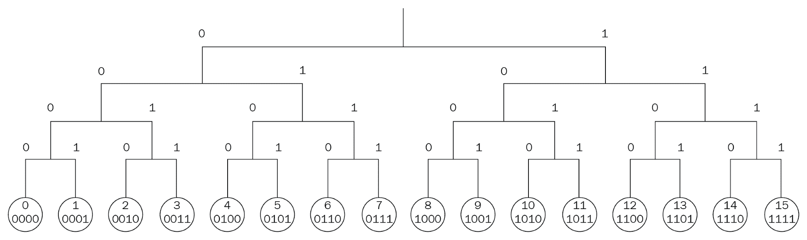

仔细看这棵树。4 和 5 之间的异或距离是 1，但 5 和 6 之间的异或距离是 3。如果你看图片，4 和 5 在一个直接的分支下，而 5 和 6 在一个更大的分支下，这意味着更大的距离。直接的分支对应右边的位。直接分支的父分支对应第二右边的位。顶部分支对应左边的位。所以，如果数字被顶部分支分开，距离至少是 8。8 的二进制版本是 1000。

这只是为了理解目的；这不是严格的数学定义。如果你看从 5 到 11 和 5 到 13 的路径，你应该得到大致相同的距离，但事实并非如此。5 和 13 的异或距离是 8，但 5 和 11 的异或距离是 14。

在 Python 中，你可以使用`^`运算符对两个数字进行异或运算：

```py
>> 5 ^ 11
14
```

你可以使用`bin`函数将任何十进制数转换为它的二进制版本：

```py
>>> bin(5)
'0b101'
```

然后，如果你想将二进制数转换回十进制数，使用`int`函数：

```py
>>> int('0b101', 2)
5
```

`int`函数的第二个参数表示第一个参数的基数。二进制是基数 2。

# 桶

现在我们已经了解了异或距离，我们将看一下节点如何保存其他节点的地址。一个节点在分布式哈希表中不保存所有其他节点。一个节点可以保存的节点数量取决于节点中的位数和*k*配置数字。让我们逐一讨论这些。

记得我们之前看到的树图片吗？它有 16 个叶子。现在想象最小的树：

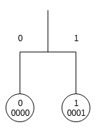

它有两片叶子。让我们再加倍这棵树：

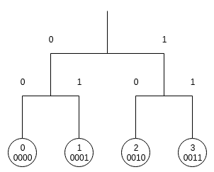

树现在有四片叶子。让我们再次加倍：

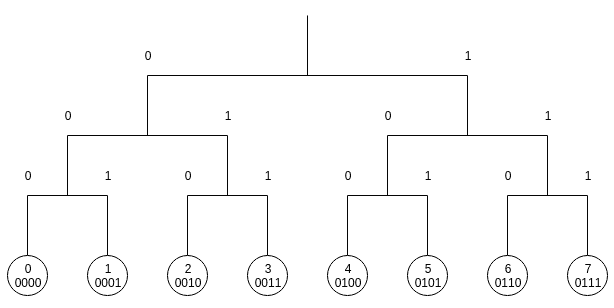

树现在有八片叶子。如果再次加倍，你会得到一棵像我们之前的树一样有 16 片叶子的树。

我们可以看到的进展是 2，4，8，16。如果我们继续这个过程，数字将是 32，64，128，等等。这可以写成 2^(1,) 2^(2,) 2^(3,) 2^(4,) 2^(5 )... 2^n。

让我们专注于一棵有 16 片叶子的树。当我们表示叶子编号时，我们必须使用一个 4 位的二进制数，比如 0001 或者 0101，因为最大的数字是 15，或者 1111。如果我们使用一棵有 64 片叶子的树，我们必须使用一个 6 位的数字，比如 000001，010101，因为最大可能的数字是 63 或者 111111。位数越大，节点在其地址簿中保存的节点数量就越多。

然后，我们有*k*配置数字。*k*决定了一个节点在一个桶中可以保存的最大节点数量。桶的数量与分布式哈希表中使用的位数相同。在有 16 片叶子的树中，桶的数量是 4。在有 64 片叶子的树中，桶的数量是 6。每个桶对应一个位。假设我们有一棵有 16 片叶子的树，所以每个数字有 4 位，比如 0101 或者 1100。这意味着节点有四个桶。

第一个桶对应于从左边开始的第一个位。第二个桶对应于从左边开始的第二个位。第三个桶对应于从左边开始的第三个位。第四个桶对应于从左边开始的第四个位。

让我们看一个在有 16 片叶子的树中 ID 为 3 的节点的例子。现在，我们假设在有 16 片叶子的树中有 16 个节点。在现实世界中，树会是稀疏的，很多分支会是空的。

在描述 Kademlia 的论文中，作者使用了 160 个桶或者 160 位地址。这棵树中的叶子数量是巨大的。作为对比，2⁷⁸是可见宇宙中的原子数量。在这篇论文中，*k*配置数字选择为 20，因此一个节点的地址簿中最多可以有 3,200 个节点。

在这个例子中，假设*k*数字是 2。这意味着对于每个桶，节点保存另外两个节点。第一个桶对应于第一个位，对应于树的另一半，节点不驻留在这里。我们在树的这一半有八个节点，但是我们只能保存其中的两个，因为*k*数字是 2。让我们选择节点 11 和 14 放入这个桶。如何选择哪些节点放入哪些桶将在后面描述。

然后，让我们把包含节点的一半的树分成两个分支。第一个分支包括 ID 为 0 的节点，ID 为 1 的节点，ID 为 2 的节点和 ID 为 3 的节点。第二个分支包括 ID 为 4 的节点，ID 为 5 的节点，ID 为 6 的节点和 ID 为 7 的节点。第二个分支是第二个桶。这个分支有四个节点，但我们只能保存两个节点。让我们选择 ID 为 4 的节点和 ID 为 5 的节点。

然后，让我们把包含我们的节点（ID 为 3 的节点）的分支分成两个小分支。第一个小分支包括 ID 为 0 的节点和 ID 为 1 的节点。第二个小分支包括 ID 为 2 的节点和 ID 为 3 的节点。所以第三个桶是第一个小分支。这里只有两个节点，ID 为 0 的节点和 ID 为 1 的节点，所以我们都保存。

最后，让我们把包含我们的节点（ID 为 3 的节点）的小分支分成两个小分支。第一个小分支包括 ID 为 2 的节点，第二个小分支包括 ID 为 3 的节点。第四个桶，或者最后一个桶，将是包含节点 3 的分支。

我们只保存了一个节点，因为它小于*k*配置数字：

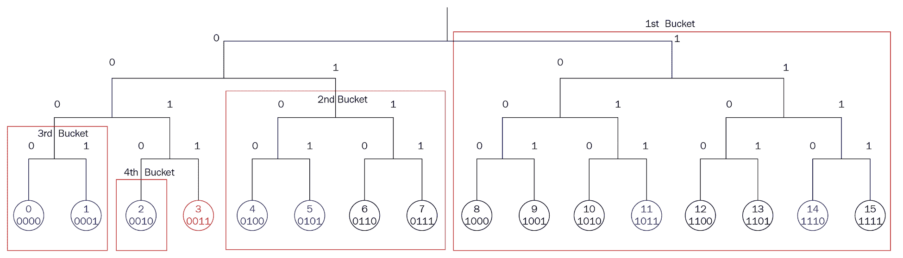

以下图表显示了完整的四个桶。每个桶都是源节点不在的分支的一半。不同节点的桶配置是不同的。ID 为 11 的节点可能有以下桶配置：

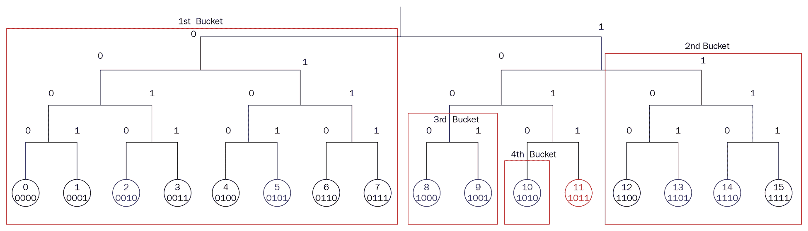

让我们看一个例子，说明一个特定节点如何找到不在其地址簿中的另一个节点。假设*k*配置号为 1。源节点是树中具有 16 个叶子的 ID 为 3 的节点。对于第一个桶（由 ID 为 8 到 ID 为 15 的节点组成的最大分支），ID 为 3 的节点保存了 ID 为 10 的节点。但是 ID 为 3 的节点想要找到 ID 为 13 的节点。ID 为 3 的节点向 ID 为 10 的节点发送请求：“你能帮我找到 ID 为 13 的节点吗？”ID 为 10 的节点在其相应的桶中保存了 ID 为 14 的节点（由 ID 为 12、13、14 和 15 的节点组成的分支）。ID 为 10 的节点将 ID 为 14 的节点交给 ID 为 3 的节点。ID 为 3 的节点向 ID 为 14 的节点提出同样的问题：“你能帮我找到 ID 为 13 的节点吗？”ID 为 14 的节点没有，但它在其桶中保存了 ID 为 12 的节点（由 ID 为 12 和 ID 为 13 的节点组成的分支）。ID 为 14 的节点将 ID 为 12 的节点交给 ID 为 3 的节点。ID 为 3 的节点再次向 ID 为 12 的节点提出同样的问题。这次，ID 为 12 的节点可以将目标节点或 ID 为 13 的节点交给 ID 为 3 的节点。大团圆！

以下图表显示了节点：

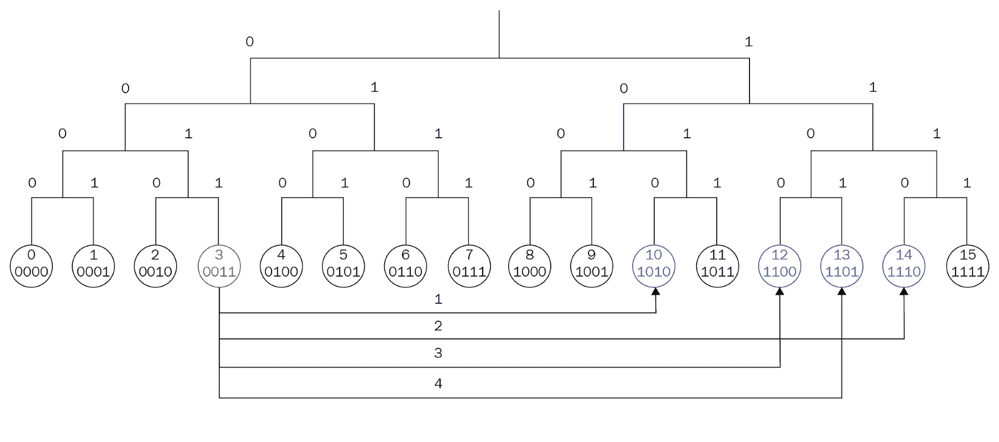

你注意到 ID 为 3 的节点必须重复请求多少次了吗？四次。如果这个数字听起来很熟悉，那是因为这棵树有 16 个叶子，即 2^(4.)在计算机科学中，到达目的地所需的跳数的最坏情况是 2 log *n* + *c*。*n*是树有多少叶子，*c*是常数。

你刚刚看到的树有满的节点；没有空叶子或空分支。然而，在现实世界中，有空分支和空叶子。想象一下，你有一棵具有 1,024（2¹⁰）个叶子的树，*k*号为 3。你启动 ID 为 0 的第一个节点。这个节点将是源节点。我们将从 ID 为 0 的节点的角度看树：

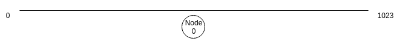

然后，启动 ID 为 800 的节点：

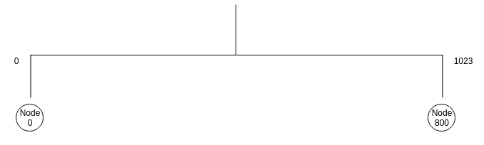

树将被分成两个桶。然后，启动 ID 为 900 的节点和 ID 为 754 的节点：

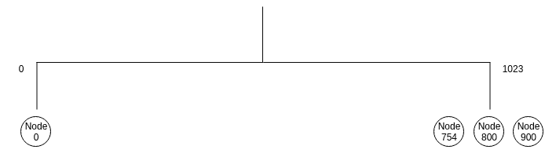

如果我们向桶中添加另一个节点会怎样？让我们启动 ID 为 1011 的节点。ID 为 0 的节点将 ping 最近未使用的节点，即 ID 为 800 的节点，以查看其是否仍然存活。如果是，它将检查其他节点。如果 ID 为 754 的节点不存活，那么此节点将被 ID 为 1011 的节点替换。如果所有节点仍然存活，则 ID 为 1011 的节点将被拒绝进入桶。这样做的原因是为了避免新节点淹没系统。我们假设运行时间更长的节点是值得信赖的，我们更喜欢这些节点而不是新节点。假设我们拒绝 ID 为 1011 的节点。

首先，我们启动 ID 为 490 的节点。然后，我们分割 ID 为 0 的节点所在的分支：

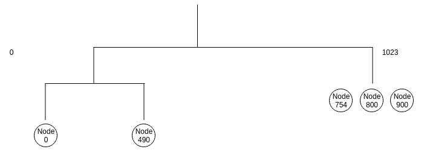

现在，让我们添加 ID 为 230 的节点：

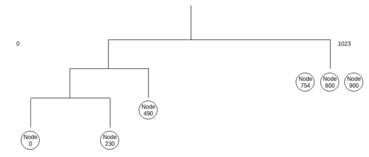

让我们添加 ID 为 60 的节点：

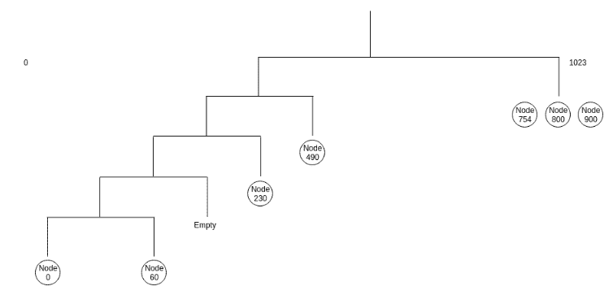

...等等。每次我们在源节点所在的分支中添加一个节点，它都会将桶分成两部分，直到达到最低级别。如果我们在源节点不在的其他分支中添加一个节点，我们会一直添加节点，直到达到*k*号。

现在，您已经基本了解了 Kademlia 的工作原理。然而，这还不是全部。如果插入一个节点，节点需要告诉旧节点它的存在。该节点还需要从旧节点获取联系人。我提到，当节点插入到源节点所在的分支时，分支会分裂，但即使源节点不驻留在那里，也有分支分裂的情况。这是因为要求节点在至少有*k*个节点的分支中保留所有有效节点，即使这意味着源节点不驻留的分支也必须分裂。

除了路由算法之外，Kademlia 还有其他重要方面。节点需要每小时重新发布密钥和值（数据），以预期旧节点离开和新节点加入系统。这些节点更接近，因此更适合保存数据。还有一种加速查找算法，这样当一个节点正在寻找另一个节点时，我们可以使用更少的步骤。

您可以参考 Kademlia 论文获取完整的规范。[`pdos.csail.mit.edu/~petar/papers/maymounkov-kademlia-lncs.pdf`](https://pdos.csail.mit.edu/~petar/papers/maymounkov-kademlia-lncs.pdf)。

IPFS 使用 S/Kademlia，这是 Kademlia 的扩展版本。它与原始的 Kademlia 算法不同之处在于 S/Kademlia 有一些安全要求。并非所有节点加入 Kademlia 分布式哈希表都是出于崇高的目的。因此，在 S/Kademlia 中，为了生成节点的 ID，需要节点生成一个密码学密钥对，这样很难篡改节点之间的通信。其他要求包括在节点能够生成其 ID 之前使用工作证明（就像比特币和以太坊中一样）。还有一些路由算法的调整，以确保节点在对手中间能够与其他节点通信，比如那些在网络中发送垃圾信息的节点。

# 总结

在本章中，我们学习了 IPFS。我们首先研究了 IPFS 项目的动机和历史。虽然 IPFS 不是区块链技术的一部分，但它类似于区块链，因为它是区块链技术的补充。然后，我们了解了 IPFS 文件系统中保存的内容的数据结构。这个数据结构是基于 Merkle 树的 Merkle 有向无环图（DAG）。我们创建了简单的 Merkle 树和 Merkle DAG 库，以了解这些数据结构的独特性。Merkle 树提供了一种简单的方法来检查部分数据的完整性，而 Merkle DAG 在我们想要保存一个带有文件的目录并且想要保留文件名时使用。然后，我们了解了 Kademlia 分布式哈希表的点对点网络方面。节点之间的距离是基于 XOR 距离。节点也被保存在对应于位寻址的桶中。最后，我们展示了节点如何通过跳转桶来找到其他节点。

在下一章中，我们将使用 IPFS 软件并以编程方式与其交互。
