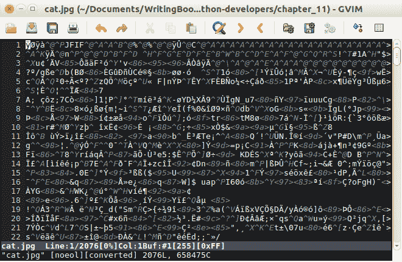
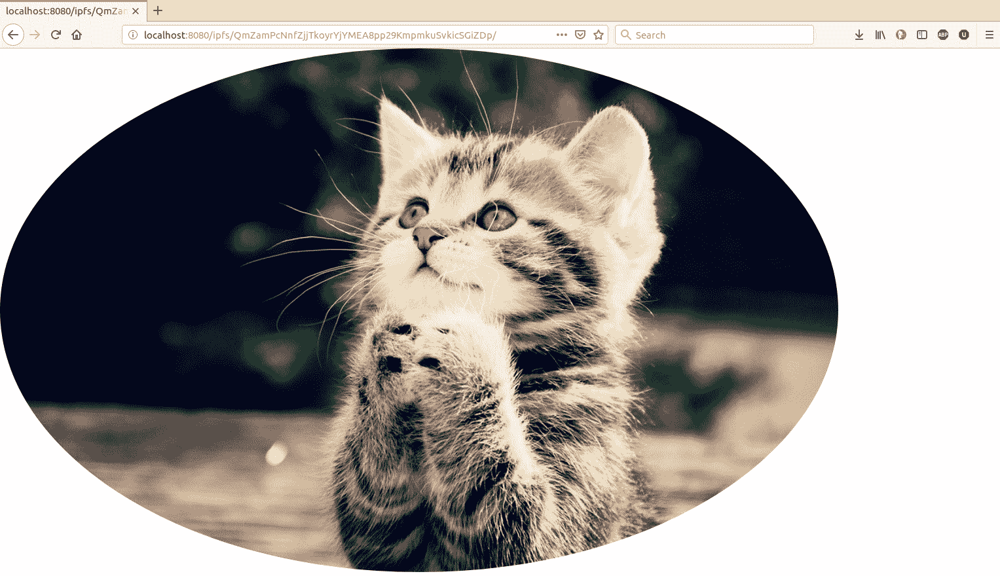

# 第十一章：使用 ipfsapi 与 IPFS 进行交互

在本章中，我们将学习如何使用 Python 以编程方式与 IPFS 进行交互。我们可以在这里进行一些交互，例如添加文件，检索文件，托管可变文件，订阅主题，发布主题，并将文件复制到**可变文件系统**（**MFS**）。首先，我们必须安装 IPFS 软件并启动它。然后，我们将学习如何安装 IPFS Python 库，并了解其大部分 API。

在本章中，我们将涵盖以下主题：

+   安装 IPFS 软件及其库

+   内容哈希

+   ipfsapi API

# 安装 IPFS 软件及其库

在撰写本文时，只有两种 IPFS 实现：`go-ipfs`（用 Go 语言编写）和`js-ipfs`（用 JavaScript 编写）。截至目前，还没有用 Python 编写的 IPFS 实现。Go 实现是更受欢迎的，因此我们将使用它。

转到[`dist.ipfs.io/#go-ipfs`](https://dist.ipfs.io/#go-ipfs)，并为您的平台下载软件。对于 Ubuntu Linux，文件名为`go-ipfs_v0.4.18_linux-amd64.tar.gz`。

使用以下命令行提取此内容：

```py
$ tar xvfz go-ipfs_v0.4.18_linux-amd64.tar.gz
```

然后，使用以下命令安装二进制文件：

```py
$ cd go-ipfs
$ sudo ./install.sh
```

此步骤是可选的。在这里，我们将`IPFS_PATH`环境变量导出到我们的 shell：

```py
$ export IPFS_PATH=/path/to/ipfsrepo
```

这是`ipfs`存储文件的位置。您可以将此语句存储在`~/.bashrc`中。默认情况下（没有此环境变量），`ipfs`将使用`~/.ipfs`（主目录中的`.ipfs`目录）作为存储数据的位置。

设置环境变量后，初始化`ipfs`本地存储库。您只需执行此步骤一次：

```py
$ ipfs init
```

如果您在云中运行`ipfs`（例如 Amazon Web Services，Google Cloud Platform，Digital Ocean 或 Azure），您应该使用服务器配置文件标志：

```py
$ ipfs init --profile server
```

否则，您将收到来自云提供商的烦人警告信，因为 IPFS `守护程序`默认情况下（没有服务器配置文件标志），会执行类似于端口扫描的操作。

然后，启动`守护程序`，如下所示：

```py
$ ipfs daemon
```

默认情况下，API 服务器正在端口 5001 上监听。我们将通过此端口以编程方式与 IPFS 进行交互。默认情况下，它只在本地侦听。如果您想向外界打开此端口，请小心。IPFS 中没有**访问控制列表**（**ACL**）。任何可以访问此端口的人都可以向 IPFS 上传数据。

默认情况下，网关服务器正在端口 8080 上监听。我们使用此端口从 IPFS 点对点文件系统下载文件。默认情况下，Swarm 正在端口 4001 上监听。这是其他节点从我们的存储中下载文件的方式。所有这些端口都可以更改。

IPFS 有一个仪表板，可以通过以下链接访问：[`localhost:5001/webui`](http://localhost:5001/webui)。以下是仪表板的屏幕截图：

！[](assets/f8ed742f-d554-4bb6-a2df-99f53cb32300.png)

正如您所看到的，大多数 IPFS 节点位于美国，中国和德国。

单击 Peers 选项卡，以查看 IPFS 节点根据其 IP 地址的分布，如下屏幕截图所示：

！[](assets/151a3ee6-7eb8-47cb-afda-750c2d72faea.png)

可以在此选项卡中看到节点，包括它们的 IP 地址。如果您担心节点的隐私，请记住隐私功能的开发仍处于初期阶段。

您可以在设置选项卡中配置 IPFS 设置，如下屏幕截图所示：

！[](assets/e13e2e31-c830-4c68-8b0e-b8b5f7f06e68.png)

现在我们的 IPFS 守护程序已启动，让我们安装我们的`ipfs` Python 库。

打开一个新的终端，因为我们不想打扰我们的守护程序。然后，运行以下命令：

```py
$ virtualenv -p python3.6 ipfs-venv
$ source ipfs-venv/bin/activate
(ipfs-venv) $ pip install ipfsapi
```

以前，`ipfs` Python 库被称为`py-ipfs-api`，但现在已更名为`ipfsapi`。

# 内容哈希

在 IPFS 快速入门文档中（[`docs.ipfs.io/introduction/usage`](https://docs.ipfs.io/introduction/usage)），他们教您的第一件事是下载可爱的猫图片。使用以下代码来执行此操作：

```py
$ ipfs cat /ipfs/QmW2WQi7j6c7UgJTarActp7tDNikE4B2qXtFCfLPdsgaTQ/cat.jpg >cat.jpg
$ eog cat.jpg 
```

运行上述代码后，将下载猫图片，并且您将得到以下输出：


`eog`是 Ubuntu 中的图像查看器。

为了遵循传统，让我们创建一个 Python 脚本，以便使用 Python 以编程方式下载前面的图像，并将脚本命名为`download_cute_cat_picture.py`：

```py
import ipfsapi

c = ipfsapi.connect()
cute_cat_picture = 'QmW2WQi7j6c7UgJTarActp7tDNikE4B2qXtFCfLPdsgaTQ/cat.jpg'
c.get(cute_cat_picture)
```

执行此脚本后，图像将在您的目录中命名为`cat.jpg`。

正如您可能已经注意到的那样，在长哈希之后有一个`cat.jpg`文件名。从技术上讲，我们在这里做的是在包含一张可爱猫图片的目录中下载文件。如果您愿意，可以尝试一下。要这样做，创建另一个脚本并将其命名为`download_a_directory_of_cute_cat_picture.py`，然后运行以下代码：

```py
import ipfsapi

c = ipfsapi.connect()
directory = 'QmW2WQi7j6c7UgJTarActp7tDNikE4B2qXtFCfLPdsgaTQ'
c.get(directory)
```

执行此脚本后，您将在包含此脚本的目录中得到一个名为`QmW2WQi7j6c7UgJTarActp7tDNikE4B2qXtFCfLPdsgaTQ`的目录。如果您查看此目录的内部，将找到猫图片文件。

让我们逐行查看脚本，以了解`ipfsapi`库的用法。您可以使用以下代码导入库：

```py
import ipfsapi
```

以下代码用于获取到 IPFS 守护程序的连接对象：

```py
c = ipfsapi.connect()
```

`connect`方法接受一些参数。最重要的两个参数是`host`和`port`：

```py
c = ipfsapi.connect(host="ipfshost.net", port=5001)
```

默认情况下，我们连接到本地主机的 5001 端口：

```py
c.get(cute_cat_picture)
```

然后，我们使用 IPFS HTTP API 的方法从*c*对象中。`get`是用于与 IPFS 守护程序交互的方法之一。对于此方法，通常有一个与`ipfs`客户端软件相对应的参数：

```py
$ ipfs get QmW2WQi7j6c7UgJTarActp7tDNikE4B2qXtFCfLPdsgaTQ/cat.jpg
```

您可能会注意到，在创建第一个 Python 脚本之前，我们在命令行界面中使用了`ipfs cat`命令。但是，在脚本中，我们使用了`get`方法。`ipfsapi`库中也有一个`cat`方法。

`get`方法用于下载文件，而`cat`方法用于获取文件的内容。

让我们创建一个使用`cat`方法的脚本，并将其命名为`cat_cute_cat.py`：

```py
import ipfsapi

c = ipfsapi.connect()
result = c.cat('QmW2WQi7j6c7UgJTarActp7tDNikE4B2qXtFCfLPdsgaTQ/cat.jpg')
with open('cat.jpg', 'wb') as f:
    f.write(result)
```

`cat`方法返回文件内容的字节对象。它接受两个可选参数，`offset`和`length`。`offset`是文件中要开始获取内容的起始位置。`length`是从`offset`位置开始获取的内容的长度。如果要构建一个具有暂停和恢复功能的下载管理器（或视频流播放器），这些参数非常重要。您可能并不总是想要下载整个文件。

现在，让我们将一个文件添加到 IPFS。要做到这一点，创建一个简单的文件并将其命名为`hello.txt`。这是文件的内容：

```py
I am a good unicorn.
```

确保在字符串之后有一个新行：

```py
$ cat hello.txt
I am a good unicorn.
$
```

如果命令提示符出现在字符串的下一行，则一切正常。您可以继续进行。

但是，假设命令提示符出现在字符串的右侧，如下面的代码块所示：

```py
$ cat hello.txt
I am a good unicorn.$
```

这意味着您没有新行，需要在字符串之后添加它。

现在，让我们创建一个脚本将此文件添加到 IPFS，并将其命名为`add_file.py`：

```py
import ipfsapi

c = ipfsapi.connect()
result = c.add('hello.txt')
print(result)
```

执行此代码将给出以下输出：

```py
(ipfs-venv) $ python add_file.py
{'Name': 'hello.txt', 'Hash': 'QmY7MiYeySnsed1Z3KxqDVYuM8pfiT5gGTqprNaNhUpZgR', 'Size': '29'}
```

我们可以使用`cat`或`get`方法检索文件的内容，即`I am a good unicorn.\n`。让我们在名为`get_unicorn.py`的脚本中使用`cat`方法，如下面的代码块所示：

```py
import ipfsapi

c = ipfsapi.connect()
result = c.cat('QmY7MiYeySnsed1Z3KxqDVYuM8pfiT5gGTqprNaNhUpZgR')
print(result)
```

运行此代码将给出以下输出：

```py
(ipfs-venv) $ python get_unicorn.py
b'I am a good unicorn.\n'
```

正如我们在第十章中提到的*星际文件系统-一个勇敢的新文件系统*，我们通过哈希获取文件的内容。通过这种方式，我们只检索内容，而不是文件的名称。

但是，如何将`b'I am a good unicorn.\n'`转换为`'QmY7MiYeySnsed1Z3KxqDVYuM8pfiT5gGTqprNaNhUpZgR'`？只是通过对内容进行哈希吗？例如，要对文件的内容进行哈希，你可以使用 SHA-256 哈希函数：

```py
import hashlib
the_hash = hashlib.sha256(b'I am a good unicorn.\n').hexdigest()
```

不要那么快！原来你需要先了解 protobuf、multihash 和 base58 的过程。让我们在接下来的部分讨论这些。

# Protobuf

如果你尝试安装 Google 开源软件，比如`Tensorflow`，你会遇到 protobuf，因为它被`Tensorflow`使用。`Protobuf`是一个序列化库。如果你从官方文档中学习 Python，你会知道 Pickle 是一种序列化数据的方式。如果你学习 Web 开发编程，很可能你会使用`.json`或`.xml`作为数据序列化。

在将`b'I am a good unicorn.\n'`传递给 IPFS 之前，我们需要将我们的数据包装在一个数据结构中。让我们创建一个脚本来证明我的说法，并将脚本命名为`get_unicorn_block.py`：

```py
import ipfsapi

c = ipfsapi.connect()
result = c.block_get('QmY7MiYeySnsed1Z3KxqDVYuM8pfiT5gGTqprNaNhUpZgR')
print(result)
```

运行脚本将允许你看到文件内容被其他内容包裹：

```py
(ipfs-venv) $ python get_unicorn_block.py
b'\n\x1b\x08\x02\x12\x15I am a good unicorn.\n\x18\x15'
```

我们可以看到我们的文件内容仍然完整，`b'I am a good unicorn.\n'`，在神秘的字符串之间。左边和右边的垃圾字符是什么？这是 IPFS 中数据节点的数据结构。

在我们对这个序列化数据进行反序列化之前，让我们快速学习如何使用`protobuf`：

1.  使用以下命令安装`protobuf-compiler`：

```py
$ sudo apt-get install protobuf-compiler
```

你的`protobuf`编译器是`protoc`：

```py
$ protoc --version
libprotoc 2.6.1
```

1.  然后，使用以下命令安装 Python 的`protobuf`库：

```py
(ipfs-venv) $ pip install protobuf
```

1.  在使用`protobuf`对数据进行序列化之前，你需要先创建一个数据结构格式。这个格式必须保存在一个文件中。让我们把格式文件命名为`crypto.proto`，并使用以下脚本：

```py
syntax = "proto2";

package crypto;

message CryptoCurrency {
 required string name = 1;
 optional int32 total_supply = 2;

 enum CryptoType {
 BITCOIN = 0;
 ERC20 = 1;
 PRIVATE = 2;
 } required CryptoType type = 3 [default = ERC20];
}
```

当你查看这个数据结构时，它就像一个没有方法的结构或类。在声明你使用的语法之后，你声明`package`以避免名称冲突。`message`就像另一种主流编程语言中的类或结构关键字。这个`message`是许多数据类型的封装。在我们的情况下，它们是`string`、`int32`和`enum`。

1.  在 Python 中对数据进行 protobuf 序列化之前，我们需要将这个`.proto`文件转换成一个 Python 模块文件：

```py
$ protoc crypto.proto --python_out=.
```

`python_out`参数用于指示你想要将这个 Python 文件输出到哪个目录。

你应该为你生成的`crypto_pb2.py`文件。参考 GitLab 链接中的代码文件：[`gitlab.com/arjunaskykok/hands-on-blockchain-for-python-developers/tree/master/chapter_11`](https://gitlab.com/arjunaskykok/hands-on-blockchain-for-python-developers/tree/master/chapter_11)。

如果你没有阅读文件顶部的注释，让我为你读一下：不要直接编辑这个文件。如果你想要在序列化过程中更改数据结构，你需要修改`.proto`文件，然后编译它。现在你已经为你生成了这个`Python`库文件，你可以丢掉`.proto`文件。但是，保留它作为文档是个好主意。

现在，让我们使用一个 Python 脚本测试序列化和反序列化过程。将脚本命名为`serialize_crypto_data.py`：

```py
import crypto_pb2

cryptocurrency = crypto_pb2.CryptoCurrency()
cryptocurrency.name = 'Bitcoin Cash'
cryptocurrency.total_supply = 21000000
cryptocurrency.type = crypto_pb2.CryptoCurrency.BITCOIN

serialized_data = cryptocurrency.SerializeToString()
print(serialized_data)

cryptocurrency2 = crypto_pb2.CryptoCurrency()
cryptocurrency2.ParseFromString(serialized_data)
print(cryptocurrency2)
```

如果你执行这个脚本，你将得到以下输出：

```py
(ipfs-venv) $ python serialize_crypto_data.py
b'\n\x0cBitcoin Cash\x10\xc0\xde\x81\n\x18\x00'
name: "Bitcoin Cash"
total_supply: 21000000
type: BITCOIN
```

序列化输出，`b'\n\x0cBitcoin Cash\x10\xc0\xde\x81\n\x18\x00'`，类似于我们在 IPFS 中的独角兽数据块。如果你解析这个二进制数据，你应该得到原始的 Python 对象。

现在你了解了 protobuf 的基本用法，让我们回到 IPFS 中的块数据：

```py
(ipfs-venv) $ python get_unicorn_block.py
b'\n\x1b\x08\x02\x12\x15I am a good unicorn.\n\x18\x15'
```

这是 protobuf 中的序列化数据。在我们对其进行反序列化之前，我们需要获取相关的`.proto`文件。显然，我们需要两个`.proto`文件，`unixfs.proto`和`merkledag.proto`。

`unixfs.proto`可以从[`github.com/ipfs/go-unixfs/blob/master/pb/unixfs.proto`](https://github.com/ipfs/go-unixfs/blob/master/pb/unixfs.proto)下载，而`merkeldag.proto`可以从[`github.com/ipfs/go-merkledag/blob/master/pb/merkledag.proto`](https://github.com/ipfs/go-merkledag/blob/master/pb/merkledag.proto)下载。

以下代码块是`unixfs.proto`文件的内容：

```py
syntax = "proto2";

package unixfs.pb;

message Data {
    enum DataType {
        Raw = 0;
        Directory = 1;
        File = 2;
        Metadata = 3;
        Symlink = 4;
        HAMTShard = 5;
    }

    required DataType Type = 1;
    optional bytes Data = 2;
    optional uint64 filesize = 3;
    repeated uint64 blocksizes = 4;

    optional uint64 hashType = 5;
    optional uint64 fanout = 6;
}

message Metadata {
    optional string MimeType = 1;
}
```

以下代码块是`merkledag.proto`文件的内容：

```py
package merkledag.pb;

import "code.google.com/p/gogoprotobuf/gogoproto/gogo.proto";

option (gogoproto.gostring_all) = true;
option (gogoproto.equal_all) = true;
option (gogoproto.verbose_equal_all) = true;
option (gogoproto.goproto_stringer_all) = false;
option (gogoproto.stringer_all) =  true;
option (gogoproto.populate_all) = true;
option (gogoproto.testgen_all) = true;
option (gogoproto.benchgen_all) = true;
option (gogoproto.marshaler_all) = true;
option (gogoproto.sizer_all) = true;
option (gogoproto.unmarshaler_all) = true;

...
...

// An IPFS MerkleDAG Node
message PBNode {

  // refs to other objects
  repeated PBLink Links = 2;

  // opaque user data
  optional bytes Data = 1;
}
```

为了简化流程，你应该删除`merkledag.proto`文件中的以下行：

```py
import "code.google.com/p/gogoprotobuf/gogoproto/gogo.proto";

option (gogoproto.gostring_all) = true;
option (gogoproto.equal_all) = true;
option (gogoproto.verbose_equal_all) = true;
option (gogoproto.goproto_stringer_all) = false;
option (gogoproto.stringer_all) =  true;
option (gogoproto.populate_all) = true;
option (gogoproto.testgen_all) = true;
option (gogoproto.benchgen_all) = true;
option (gogoproto.marshaler_all) = true;
option (gogoproto.sizer_all) = true;
option (gogoproto.unmarshaler_all) = true
```

然后，使用以下命令编译两个`.proto`文件：

```py
$ protoc unixfs.proto merkledag.proto --python_out=.
```

完成后，你将得到生成的`unixfs_pb2.py`和`merkledag_pb2.py`文件。

让我们创建一个脚本来解码我们的块数据，`b'\n\x1b\x08\x02\x12\x15I am a good unicorn.\n\x18\x15'`，并将脚本命名为`unserialize_unicorn.py`：

```py
import unixfs_pb2
import merkledag_pb2

outer_node = merkledag_pb2.PBNode()
outer_node.ParseFromString(b'\n\x1b\x08\x02\x12\x15I am a good unicorn.\n\x18\x15')
print(outer_node)

unicorn = unixfs_pb2.Data()
unicorn.ParseFromString(outer_node.Data)
print(unicorn)
```

运行脚本。这将给出以下输出：

```py
(ipfs-venv) $ python unserialize_unicorn.py
Data: "\010\002\022\025I am a good unicorn.\n\030\025"

Type: File
Data: "I am a good unicorn.\n"
filesize: 21
```

让我们来剖析一下这里发生了什么。我们的原始数据，`b'I am a good unicorn.\n'`，被包裹在`unixfs` proto 模块的`Data`中，然后再次被包裹在`merkledag` proto 模块的`PBNode`中。这就是为什么我们首先在脚本中用`PBNode`反序列化序列化的数据。然后，我们用`Data`反序列化结果。

# Multihash

现在，让我们对序列化数据进行哈希。IPFS 使用 multihash 对数据进行哈希。这意味着它不仅输出哈希输出，还输出它使用的哈希函数、来自该哈希函数的哈希输出的长度以及该哈希函数的哈希输出。

让我们看一个 multihash 的使用示例。假设我们要哈希的数据是`b'i love you'`。我们选择`sha256`作为哈希函数，如下：

```py
>>> from hashlib import sha256
>>> sha256(b'i love you').hexdigest()
'1c5863cd55b5a4413fd59f054af57ba3c75c0698b3851d70f99b8de2d5c7338f
```

让我们来检查一下这个哈希输出的长度：

```py
>>> len('1c5863cd55b5a4413fd59f054af57ba3c75c0698b3851d70f99b8de2d5c7338f')
64
```

由于十六进制格式的数字始终占据两个字符，哈希输出的长度为 32（64/2）。但是，我们想要 32 的十六进制版本，即 0x20 或`20`。

有一个哈希函数表，列出了 multihash 支持的所有哈希函数（sha1、shake、blake、keccak 等）。可以在这里看到：[`github.com/multiformats/multicodec/blob/master/table.csv`](https://github.com/multiformats/multicodec/blob/master/table.csv)。

正如你所看到的，`sha256`被赋予了数字`12`。

现在，我们使用以下命令将它们组合起来：

```py
Hash function + the length of hash output from hash function + hash output from hash function
12 + 20 + 1c5863cd55b5a4413fd59f054af57ba3c75c0698b3851d70f99b8de2d5c7338f
```

或者，我们可以使用以下命令：

```py
12201c5863cd55b5a4413fd59f054af57ba3c75c0698b3851d70f99b8de2d5c7338f
```

让我们再做一次，但是使用另一个函数，即`sha1`：

```py
>>> from hashlib import sha1
>>> sha1(b'i love you').hexdigest()
'bb7b1901d99e8b26bb91d2debdb7d7f24b3158cf'
>>> len('bb7b1901d99e8b26bb91d2debdb7d7f24b3158cf')
40
```

20 的十六进制版本是 0x14，或`14`。

`sha1`哈希函数被赋予了数字 0x11 或`11`，来自哈希函数表。因此，输出如下：

```py
11 + 14 + bb7b1901d99e8b26bb91d2debdb7d7f24b3158cf
1114bb7b1901d99e8b26bb91d2debdb7d7f24b3158cf
```

那么，为什么要使用 multihash 而不是普通的哈希函数，比如`sha1`、`sha256`或`keccak256`？有时的论点是哈希函数已经被破解，这意味着有人可以在合理的时间内找到两个不同的输入，得到相同的哈希输出。如果发生这种情况，那就非常危险。哈希用于完整性检查。想象一下，我给你发送了一份秘密文件，用来治愈癌症。为了确保它没有被篡改，我们对这份文件进行哈希，然后广播哈希输出。因此，任何想要了解这份文件的人都需要在阅读和执行之前验证文件的哈希。然而，想象一下我的敌人可以创建一个不同的文件。现在，这份文件不再是治愈癌症的文件，而是创建病毒的指南，但它仍然具有相同的哈希输出。如果你对错误的文件进行哈希，你将无意中执行该文件并创建病毒。

如果一个哈希函数被破解了（而且已经发生了，`sha1`哈希函数已经被破解了），程序员们需要升级他们的系统。然而，他们会遇到困难，因为通常他们对哈希函数做了一些假设。例如，如果他们使用`sha1`函数，他们会期望从哈希函数得到的输出是 20 个数字的长度。如果他们选择将哈希函数升级到`sha256`，他们需要替换所有预期旧哈希函数处理时长度为 20 个字符的代码，这是很麻烦的。

使用`multihash`，我们期望升级过程会变得简化，因为哈希函数的输出的函数和长度都嵌入在`multihash`函数的输出中。我们不再对哈希输出的长度做假设。

如果你仍然不能理解`multihash`的动机，让我们用以下代码来实验一下：

```py
(ipfs-venv) $ pip install pymultihash
(ipfs-venv) $ python
>>> import multihash
>>> the_universal_hash = multihash.digest(b'i love you', 'sha1')
>>> the_universal_hash.verify(b'i love you')
True
```

你有没有注意到，当我们想要检查`b'i love you'`数据的完整性时，我们不会对哈希输出的长度做假设？然后我们发现了一个坏消息，那就是`sha1`哈希函数已经被破解了。为了升级我们的系统，我们需要做的只是将`'sha1'`字符串简单地替换为`'sha2_256'`字符串：

```py
>>> the_universal_hash = multihash.digest(b'i love you', 'sha2_256')
>>> the_universal_hash.verify(b'i love you')
True
```

通过使用 multihash，升级 IPFS 软件中的哈希函数变得非常容易。哈希函数只是一个配置问题。

# Base58

我们需要学习的最后一件事是`base58`。Base58 是`base64`的修改版本。这通常用于将二进制数据编码为 ASCII 字符串。以下代码块用于将`b'i love you'`编码为 ASCII 字符串：

```py
>>> import base64
>>> base64.b64encode(b'i love you')
b'aSBsb3ZlIHlvdQ=='
```

`base64`模块是 Python 标准库的一部分。

通常，你不会用`base64`来编码另一个 ASCII 字符串。相反，你会编码二进制数据，比如一个图片文件。如果你用文本编辑器打开`cat.jpg`，你会得到类似于以下截图中显示的无意义文本：



这是使用`base64`进行编码的一个完美例子。为什么你想要用`base64`来编码二进制数据呢？一个用例是，如果你想在电子邮件中给你的朋友附上一张可爱的猫图片。电子邮件协议不允许二进制数据。以下代码块展示了如果我们附上图片会得到什么结果：

```py
>>> c = None
>>> with open('cat.jpg', 'rb') as f:
...     c = f.read()
... 
>>> import base64
>>> base64.b64encode(c)
b'/9j/4AAQSkZJRgABAQIAJQAlAAD/2wBDAAEBAQEBAQEBAQEBAQEBAQEBAQEBAQEBAQEBAQEBAQEBAQEBAQEBAQEBAQEBAQEBAQEBAQEBAQEBAQEBAQEBAQH/2wBDAQEBAQEBAQEBAQEBAQEBAQEBAQEBAQEBAQEBAQEBAQEBAQEBAQEBAQEBAQEBAQEBAQEBAQEBAQEBAQEBAQEBAQH/wAARCAMgBQADASIAAhEBAxEB/8QAHwAAAAYDAQEBAAAAAAAAAAAAAAQFBgcIAgMJCgEL/8QAbhAAAAQCBgQJCAYHBQQGBQIXAgMEBQEGAAcREhMhFCMxQQgiJDNRYXGB8BUyNEORobHBQkRT0eHxCRYlUlRjczViZHSDF3KEkyZFgpSjszZVZZKkw9MKGHWitMRWhdTj5Eay8xkndoaVlsLS4v/EABwBAAEFAQEBAAAAAAAAAAAAAAACAwQFBgcBCP/EAEwRAAAEBAIIBAUDAgQFAgUCBwECAxEABCExQVEFEhNhcYGR8KGxwdEGFCIj4TIz8SRDBxVCUzREUmJjFnNUco……………...s0fQyVCRRbpSWOyyylf5pKJGnOLTlixICLAcYL6fZ25/hSCW3hIrDGFOwjWKFEvluXlXQ8MosvyoeVg4umYFuP8AV4psrOiyiO8V8M5xBw1BwcG8WAJeNhmW5/du25QypGNKzQKJcAEXxthvCtWiuBRPVVA9twcApcfLHKP/2Q=='
```

使用`base64`进行编码的过程（如何将`b'i love you'`转换为`b'aSBsb3ZlIHlvdQ=='`）超出了本书的范围。如果你很好奇，你可以查看`base64`规范。

现在你已经熟悉了`base64`，`base58`会变得非常简单。在`base58`编码中，打印时会产生歧义的字母，如 0、O、I 和 l，都被移除了。+（加号）和/（斜杠）字符也被移除了。这种`base58`编码是由中本聪设计的，用于编码大整数。比特币地址本质上就是一个非常大的整数。如果你曾经转移过任何加密货币的金额（不一定是比特币），你很可能会多次检查地址以确保地址是正确的。例如，你想要向你奶奶的比特币地址转移 1 比特币，她的地址是`1BvBMSEYstWetqTFn5Au4m4GFg7xJaNVN2`。如果你和大多数人一样，你会多次验证地址的正确性，以确保地址不是错误的。通过移除 0、O、I 和 l 等模棱两可的字符，你会发现更容易确保这个地址是它应该是的。Base58 是软件中用来解决这个问题的良好用户体验设计之一。

因此，`base58`并不是设计用来编码可爱的猫图片的。你应该使用`base64`编码来实现这个目的。

让我们安装`base58`库来进行实验：

```py
>>> import base58
>>> base58.b58encode(b'i love you')
b'6uZUjTpoUEryQ8'
```

通过使用`base58`，我们可以创建一个长的十六进制字符串，可以轻松地用我们自己的眼睛进行检查和验证。

# 结合 protobuf、multihash 和 base58

现在您已经了解了 protobuf、multihash 和 base58，我们终于可以理解`b'I am a good unicorn.\n'`文件内容如何变成`'QmY7MiYeySnsed1Z3KxqDVYuM8pfiT5gGTqprNaNhUpZgR'`的谜题了。

`b'I am a good unicorn.\n'`数据被包装在 IPFS 节点中，并使用 protobuf 序列化为`b'\n\x1b\x08\x02\x12\x15I am a good unicorn.\n\x18\x15'`。以下是如何在 Python 中执行的。

创建一个名为`serialize_unicorn.py`的脚本：

```py
import unixfs_pb2
import merkledag_pb2

precious_data = b'I am a good unicorn.\n'

unicorn = unixfs_pb2.Data()
unicorn.Type = unixfs_pb2.Data.File
unicorn.Data = precious_data
unicorn.filesize = len(precious_data)

serialized_unicorn_node = unicorn.SerializeToString()

outer_node = merkledag_pb2.PBNode()
outer_node.Data = serialized_unicorn_node
print(outer_node.SerializeToString())
```

运行它。您应该得到以下输出：

```py
(ipfs-venv) $ python serialize_unicorn.py
b'\n\x1b\x08\x02\x12\x15I am a good unicorn.\n\x18\x15'
```

然后，这个 protobuf 序列化的数据被`sha256`（IPFS 中的 multihash 默认使用`sha256`哈希函数）哈希为`'912d1af8f0013cd12a514859d20e9a196eb2845981408a84cf3543bb359a4536'`。

以下是如何在 Python 中执行的：

```py
>>> import hashlib
>>> hashlib.sha256(b'\n\x1b\x08\x02\x12\x15I am a good unicorn.\n\x18\x15').hexdigest()
'912d1af8f0013cd12a514859d20e9a196eb2845981408a84cf3543bb359a4536'
```

IPFS 在 multihash 表中使用的`sha256`函数数量为 12。表可以在这里看到：[`github.com/multiformats/multicodec/blob/master/table.csv`](https://github.com/multiformats/multicodec/blob/master/table.csv)。

哈希输出的长度为`32`，或者用十六进制表示为 0x20。一个十六进制数字占据两个字符：

```py
>>> len('912d1af8f0013cd12a514859d20e9a196eb2845981408a84cf3543bb359a4536') // 2
32
>>> hex(32)
'0x20'
```

让我们将它们连接起来：

```py
12 + 20 + 912d1af8f0013cd12a514859d20e9a196eb2845981408a84cf3543bb359a4536
1220912d1af8f0013cd12a514859d20e9a196eb2845981408a84cf3543bb359a4536
```

如果您使用 base58 编码对此输出进行编码，您应该得到`'QmY7MiYeySnsed1Z3KxqDVYuM8pfiT5gGTqprNaNhUpZgR'`。

以下是如何在 Python 中执行的。`b58encode()`方法只接受字节对象，而不是十六进制对象，因此您必须首先将十六进制字符串转换为字节对象：

```py
>>> import codecs
>>> codecs.decode('1220912d1af8f0013cd12a514859d20e9a196eb2845981408a84cf3543bb359a4536', 'hex')
b'\x12 \x91-\x1a\xf8\xf0\x01<\xd1*QHY\xd2\x0e\x9a\x19n\xb2\x84Y\x81@\x8a\x84\xcf5C\xbb5\x9aE6'
```

`codecs`是 Python 标准库的一部分。

执行代码后，您将得到以下输出：

```py
>>> base58.b58encode(b'\x12 \x91-\x1a\xf8\xf0\x01<\xd1*QHY\xd2\x0e\x9a\x19n\xb2\x84Y\x81@\x8a\x84\xcf5C\xbb5\x9aE6')
b'QmY7MiYeySnsed1Z3KxqDVYuM8pfiT5gGTqprNaNhUpZgR'
```

大功告成！谜题终于解开了。

# ipfsapi API

让我们回到 ipfsapi 的 API。我们已经使用 IPFS API 添加了一个文件，并收到了用于引用文件内容的哈希。但是，如果我们添加一个大文件，它将被分成许多块。这是为了提高效率。

让我们从 Unsplash 下载一个相当大的图像文件。转到[`unsplash.com/photos/UBtUB4Qc-_4`](https://unsplash.com/photos/UBtUB4Qc-_4)下载一个图像文件。下载的文件名为`milada-vigerova-1284157-unsplash.jpg`。将其放在与您的 IPFS Python 脚本文件相同的目录中。您可以使用任何图像文件，但请确保其大小至少为 1 MB。但是，如果您使用另一个图像文件，您应该得到一个不同的哈希。

使用以下代码块创建一个名为`add_image_file.py`的脚本：

```py
import ipfsapi

c = ipfsapi.connect()
result = c.add('dose-juice-1184429-unsplash.jpg')
print(result)
```

运行它。您应该得到以下输出：

```py
(ipfs-venv) $ python add_image_file.py
{'Name': 'milada-vigerova-1284157-unsplash.jpg', 'Hash': 'QmV5KPoHHqbq2NsALniERnaYjCJPi3UxLnpwdTkV1EbNZM', 'Size': '2604826'}
```

接下来，创建另一个脚本来列出此块中的所有块，并将脚本命名为`list_blocks.py`：

```py
import ipfsapi
import pprint

c = ipfsapi.connect()
blocks = c.ls('QmV5KPoHHqbq2NsALniERnaYjCJPi3UxLnpwdTkV1EbNZM')
pp = pprint.PrettyPrinter(indent=2)
pp.pprint(blocks)
```

`pprint`是 Python 标准库的一部分。

运行脚本。您应该得到以下输出：

```py
(ipfs-venv) $ python list_blocks.py
{ 'Objects': [ { 'Hash': 'QmV5KPoHHqbq2NsALniERnaYjCJPi3UxLnpwdTkV1EbNZM',
 'Links': [ { 'Hash': 'Qmahxa3MABVtHWh7b2cbQb9hEfiuvwKeYceaqrW8pZjemV',
 'Name': '',
 'Size': 262158,
 'Type': 2},
 { 'Hash': ...
... 'QmbSa1vj3c1edyKFdTCaT88pYGTLS9n2mpRuL2B2NLUygv',
 'Name': '',
 'Size': 244915,
 'Type': 2}]}]}
```

正如我在第十章中解释的那样，*星际文件系统-一个崭新的文件系统*，一个大文件不会立即被哈希，因为内存问题。相反，它将被分成许多块。每个块的大小为 262,158 字节，最后一个除外。但是，您可以配置块的大小。每个块将被单独哈希。然后，文件内容的根哈希是这些哈希的组合。IPFS 使用默克尔树来计算根哈希。当然，您必须在使用 protobuf 序列化之前将每个块包装在 IPFS 节点内。然后，将包含所有这些块链接的容器节点。

您可以在没有`.proto`文件的情况下对以下 IPFS 块进行逆向工程：

```py
{'Name': 'milada-vigerova-1284157-unsplash.jpg', 'Hash': 'QmV5KPoHHqbq2NsALniERnaYjCJPi3UxLnpwdTkV1EbNZM', 'Size': '2604826'}
```

记住这个图像文件的哈希。获取此文件内容的 IPFS 块。您可以使用 Python 脚本或 IPFS 命令行实用程序来执行：

```py
$ ipfs block get QmV5KPoHHqbq2NsALniERnaYjCJPi3UxLnpwdTkV1EbNZM > block.raw
```

我们将以二进制格式保存块，然后可以使用`protoc`编译器`解码`此二进制文件。

```py
$ protoc --decode_raw < block.raw
```

您应该得到以下结果：

```py
2 {
  1 {
    2: "\267\301\242\262\250qw\216+\237\301\273\'\360%\"\2022\201#R\364h\262$\357\227\2355\244>x"
  }
  2: ""
  3: 262158
}
...
...
1 {
  1: 2
  3: 2604197
  4: 262144
  4: 262144
...
...
  4: 262144
  4: 244901
}

```

你可能对这种结构很熟悉。当你在没有 proto 文件的情况下解码 protobuf 中的序列化数据时，问题在于你必须猜测某个块内的 1、2、3 和 4 代表什么。如果你有 proto 文件，这一行`3: 2604197`将变成`filesize: 2604197`。因此，在解码 protobuf 中的序列化数据之前获取 proto 文件是一个好主意。

我们可以从这些块中重建原始文件。让我们创建脚本并将其命名为`construct_image_from_blocks.py`：

```py
import ipfsapi

c = ipfsapi.connect()

images_bytes = []

blocks = c.ls('QmV5KPoHHqbq2NsALniERnaYjCJPi3UxLnpwdTkV1EbNZM')
for block in blocks['Objects'][0]['Links']:
    bytes = c.cat(block['Hash'])
    images_bytes.append(bytes)

images = b''.join(images_bytes)
with open('image_from_blocks.jpg', 'wb') as f:
    f.write(images)
```

运行脚本后，如果你打开`image_from_blocks.jpg`，你将看到原始的图像文件。

我们已经添加了一个文件。现在，让我们尝试添加一个文件目录。

创建一个名为`mysite`的目录。在这个目录里，创建一个名为`img`的目录。将`cat.jpg`图像文件放在这个`img`目录中。然后，在`img`目录旁边创建一个名为`index.html`的文件。

`index.html`的内容如下代码块所示：

```py
<html>
  <head>
    <link href="https://stackpath.bootstrapcdn.com/bootstrap/4.2.1/css/bootstrap.min.css" rel="stylesheet" integrity="sha384-GJzZqFGwb1QTTN6wy59ffF1BuGJpLSa9DkKMp0DgiMDm4iYMj70gZWKYbI706tWS" crossorigin="anonymous">
  </head>
  <body>
    
  </body>
</html>
```

然后，在`img`目录旁边创建一个`README.md`文件。下面的代码块是`README.md`文件的内容：

```py
This is Readme file.
```

现在，创建一个 Python 脚本将这个目录添加到 IPFS，并将脚本命名为`add_directory.py`：

```py
import ipfsapi
import pprint

c = ipfsapi.connect()
result = c.add('mysite', True)

pp = pprint.PrettyPrinter(indent=2)
pp.pprint(result)
```

运行脚本将给你以下输出：

```py
(ipfs-venv) $ python add_directory.py
[ { 'Hash': 'QmWhZDjrm1ncLLRZ421towkyYescK3SUZdWEM5GxApfxJe',
 'Name': 'mysite/README.md',
 'Size': '29'},
 { 'Hash': 'QmUni2ApnGhZ89JEbmPZQ1QU9wcinnCoujjrYAy9TCQQjj',
 'Name': 'mysite/index.html',
 'Size': '333'},
 { 'Hash': 'Qmd286K6pohQcTKYqnS1YhWrCiS4gz7Xi34sdwMe9USZ7u',
 'Name': 'mysite/img/cat.jpg',
 'Size': '443362'},
 { 'Hash': 'QmW2WQi7j6c7UgJTarActp7tDNikE4B2qXtFCfLPdsgaTQ',
 'Name': 'mysite/img',
 'Size': '443417'},
 { 'Hash': 'QmZamPcNnfZjjTkoyrYjYMEA8pp29KmpmkuSvkicSGiZDp',
 'Name': 'mysite',
 'Size': '443934'}]
```

`add`方法的第二个参数涉及`recursive`参数。IPFS 使用 Merkle DAG 数据结构来保存这个文件目录。

我们可以在浏览器中打开我们的网站，使用以下 URL：`http://localhost:8080/ipfs/QmZamPcNnfZjjTkoyrYjYMEA8pp29KmpmkuSvkicSGiZDp/`。以下截图是网站在浏览器中的显示方式：



你也可以使用以下 URL 从另一个网关（使用另一个节点）访问 IPFS 路径：[`ipfs.io/ipfs/QmZamPcNnfZjjTkoyrYjYMEA8pp29KmpmkuSvkicSGiZDp/`](https://ipfs.io/ipfs/QmZamPcNnfZjjTkoyrYjYMEA8pp29KmpmkuSvkicSGiZDp/)。根据你的互联网连接，这可能需要一些时间，因为 ipfs.io 服务器中的一个节点需要定位你计算机中的内容。

# IPNS

能够发布由哈希保护完整性的文件或文件目录是很棒的。然而，偶尔你可能希望能够发布一个具有相同链接的动态文件。我在这里的意思是，哈希链接会在不同的时间生成不同的内容。一个用例是你想发布新闻。根据情况，新闻可能每分钟或每小时都会改变。

你可以通过使用**星际命名系统**（**IPNS**）来做到这一点。哈希链接是从我们的 IPFS 节点中的加密密钥派生出来的。当我们启动 IPFS 守护程序时，我们成为 IPFS 点对点网络中的众多节点之一。我们的身份是基于一个加密密钥的。

让我们创建两个星座预测。这里的预测应该随着时间的推移而改变。第一个文件名是`horoscope1.txt`，这个文件的内容在下面的代码块中给出：

```py
You will meet the love of your life today!
```

第二个文件名是`horoscope2.txt`，这个文件的内容在下面的代码块中给出：

```py
You need to be careful when going outside!
```

让我们使用这个 Python 脚本添加这两个文件，命名为`add_horoscope_predictions.py`：

```py
import ipfsapi

c = ipfsapi.connect()
result = c.add('horoscope1.txt')
print(result)
result = c.add('horoscope2.txt')
print(result)
```

运行这将给你以下输出：

```py
(ipfs-venv) $ python add_horoscope_predictions.py
{'Name': 'horoscope1.txt', 'Hash': 'QmTG4eE6ruUDhSKxqwofJXXqDFAmNzQiGdo4Z7WvVdLZuS', 'Size': '51'}
{'Name': 'horoscope2.txt', 'Hash': 'Qme1FUeEhA1myqQ8C1sCSXo4dDJzZApGD6StE26S72ZqyU', 'Size': '51'}
```

注意我们在输出中获得的这两个哈希值。

然后，创建一个脚本来列出我们所有的密钥，并将脚本命名为`keys_list.py`：

```py
import ipfsapi

c = ipfsapi.connect()
print(c.key_list())
```

运行上述脚本将给你以下输出：

```py
(ipfs-venv) $ python keys_list.py
{'Keys': [{'Name': 'self', 'Id': 'QmVPUMd7mFG54zKDNNzPRgENsr5VTbBxWJThfVd6j9V4U8'}]}
```

现在，让我们发布我们的第一个星座预测。使用以下代码块创建一个名为`publish_horoscope1.py`的 Python 脚本：

```py
import ipfsapi

c = ipfsapi.connect()
peer_id = c.key_list()['Keys'][0]['Id']
c.name_publish('QmY7MiYeySnsed1Z3KxqDVYuM8pfiT5gGTqprNaNhUpZgR')
result = ipfs.cat('/ipns/' + peer_id)
print(result)
```

运行这可能需要一些时间。在 IPNS 中发布文件有点慢。如果你足够耐心，你会得到以下输出：

```py
(ipfs-venv) $ python publish_horoscope1.py
b'You will meet the love of your life today!\n'
```

你可以使用`name_publish()`方法发布内容。它接受内容的哈希链接（IPFS 路径，而不是文件名）作为第一个参数。

然后，要从 IPFS 访问内容，可以使用`cat`或`get`方法。在这里，我们使用`cat`方法。`cat`方法的参数不是哈希链接或 IPFS 路径，而是 IPNS 路径，它只是一个可以从`keys_list.py`脚本中获取的密钥。您必须在此之前加上`'/ipns/'`字符串。因此，IPNS 路径是`'/ipns/ QmVPUMd7mFG54zKDNNzPRgENsr5VTbBxWJThfVd6j9V4U8'`。

现在，让我们发布更多数据。使用以下代码块创建一个名为`publish_horoscope2.py`的脚本：

```py
import ipfsapi

c = ipfsapi.connect()
peer_id = c.key_list()['Keys'][0]['Id']
c.name_publish('Qme1FUeEhA1myqQ8C1sCSXo4dDJzZApGD6StE26S72ZqyU')
result = ipfs.cat('/ipns/' + peer_id)
print(result)
```

运行此脚本将给出与上一个不同的结果：

```py
(ipfs-venv) $ python publish_horoscope2.py
b'You need to be careful when going outside!\n'
```

IPNS 路径是`'ipns/ QmVPUMd7mFG54zKDNNzPRgENsr5VTbBxWJThfVd6j9V4U8'`，但我们得到了不同的结果。

这非常有趣，但我们是否仅限于单个 IPNS 路径？不。您可以生成另一个密钥，以便您可以有另一个 IPNS 路径。

使用以下代码块创建一个名为`generate_another_key.py`的 Python 脚本：

```py
import ipfsapi

c = ipfsapi.connect()
print(c.key_list())
c.key_gen('another_key', 'rsa')
print(c.key_list())
```

运行上述脚本将给出以下输出：

```py
(ipfs-venv) $ python generate_another_key.py
```

```py
{'Keys': [{'Name': 'self', 'Id': 'QmVPUMd7mFG54zKDNNzPRgENsr5VTbBxWJThfVd6j9V4U8'}]}
```

```py
{'Keys': [{'Name': 'self', 'Id': 'QmVPUMd7mFG54zKDNNzPRgENsr5VTbBxWJThfVd6j9V4U8'}, {'Name': 'another_key', 'Id': 'QmcU8u2Koy4fdrSjnSEjrMRYZVPLKP5YXQhLVePfUmjmkv'}]}
```

您的新 IPNS 路径从`'another_key'`是`'/ipns/ QmcU8u2Koy4fdrSjnSEjrMRYZVPLKP5YXQhLVePfUmjmkv'`。

然后，当您想要在 IPNS 路径上发布内容时，只需在`name_publish()`中使用`key`参数。使用以下代码块创建一个名为`publish_horoscope1_in_another_ipns.py`的脚本：

```py
import ipfsapi

c = ipfsapi.connect()
peer_id = c.key_list()['Keys'][1]['Id']
c.name_publish('QmTG4eE6ruUDhSKxqwofJXXqDFAmNzQiGdo4Z7WvVdLZuS', key='another_key')
result = c.cat('/ipns/' + peer_id)
print(result)
```

运行它。您应该会得到第一个星座预测。正如您可能已经观察到的那样，我们使用了另一个对等 ID。注意`peer_id = c.key_list()['Keys'][1]['Id']`中的索引 1。之前，我们使用的是索引 0。

在 IPNS 中发布不会永久存储它。默认情况下，它会将 IPFS 文件存储 24 小时。您可以使用`name_publish()`中的`lifetime`关键字来更改持续时间。例如，如果您想要在 IPNS 中发布 IPFS 文件`5h`，您可以这样做：

```py
c.name_publish('QmTG4eE6ruUDhSKxqwofJXXqDFAmNzQiGdo4Z7WvVdLZuS', key='another_key', lifetime='5h')
```

# 固定

如果您想要在 IPFS 上删除文件怎么办？假设您意外使用`ipfs add`命令添加了一张裸照：

```py
$ ipfs add nude_picture.jpg
added QmWgMcTdPY9Rv7SCBusK1gWBRJcBi2MxNkC1yC6uvLYPwK nude_picture.jpg
2.64 MiB / 2.64 MiB [==================================================] 100.00%
```

如何删除您的裸照？没有`ipfs rm QmPCqvJHUs517pdcFNZ7EJMKcjEtbUBUDYxZcwsSijRtBx`这样的东西，因为这个命令没有任何意义。它应该做什么？告诉每个持有您裸照的节点删除照片？那将违背 IPFS 的崇高目的。您可以做的是删除 IPFS 本地存储中的照片。在 IPFS 中删除本地文件的术语称为*删除固定*。在删除裸照文件的固定之后，内容仍然在 IPFS 本地存储中。但是当 IPFS 的垃圾收集器工作以清理对象时，它将删除您裸照文件的内容。希望没有人有机会在他们的节点上固定（下载）这个敏感文件！

让我们创建一个脚本来删除固定并要求垃圾收集器执行其工作。将脚本命名为`removing_nude_picture.py`：

```py
import ipfsapi

c = ipfsapi.connect()
c.pin_rm('QmWgMcTdPY9Rv7SCBusK1gWBRJcBi2MxNkC1yC6uvLYPwK')
c.repo_gc()
```

运行脚本。然后，如果您尝试获取您的裸照的内容，将会失败：

```py
(ipfs-venv) $ ipfs get QmWgMcTdPY9Rv7SCBusK1gWBRJcBi2MxNkC1yC6uvLYPwK

```

当然，如果有人已经在另一个节点上固定了您的裸照，那么您仍然会得到您的裸照的内容。

在这个例子中，裸照基本上是一张熊猫的裸照，可以从 Unsplash 网站下载：[`unsplash.com/photos/IgdVdJCmzf4`](https://unsplash.com/photos/IgdVdJCmzf4)。如果您在这个例子中使用这张图片，请准备好其他人也会使用它。要测试删除固定是否真的有效，您可以使用一个这个世界上没有人拥有的真正独特的文件。有一种方法可以通过解剖 IPFS 存储路径中的`LevelDB`文件来检查文件是否已从您的本地存储中删除。但是，这超出了本书的范围。

# Pubsub

IPFS 有一个实验性功能，即**发布-订阅**，或**pubsub**。基本上，IPFS 中的一个节点可以订阅一个主题。假设这个主题是比特币主题。IPFS 中的一个节点可以向比特币主题发布*To the moon!*消息。然后，任何订阅'bitcoin'主题的节点都可以收到该消息。

因为 pubsub 是一个实验性功能，您需要使用特定标志运行 IPFS 守护程序。使用以下命令使用`--enable-pubsub-experiment`标志运行 IPFS 守护程序：

```py
$ ipfs daemon --enable-pubsub-experiment
```

订阅者和发布者都需要使用特定标志运行守护程序。

让我们创建一个脚本来订阅特定主题，并将脚本命名为`subscribe_topic.py`：

```py
import ipfsapi
from base64 import b64decode

c = ipfsapi.connect()
with c.pubsub_sub('bitcoin') as sub:
    for message in sub:
        string = b64decode(message['data'])
        print(string)
        break
```

订阅主题的方法是`pubsub_sub`。第一个参数是我们想要订阅的主题。当我们从订阅中接收数据时，我们还将获得有关发送者的信息。但是，目前我们只关心消息。这条消息是以`base64`编码的，所以我们必须先解码它。

运行脚本。这将在接收到任何消息之前等待。

让我们创建一个脚本来发布到这个主题，并将脚本命名为`publish_topic.py`：

```py
import ipfsapi

c = ipfsapi.connect()
c.pubsub_pub('bitcoin', 'To the moon!')
```

最好在另一台计算机上运行此脚本，这样您就可以对去中心化技术的奇迹感到惊叹。不要忘记您必须使用特定标志运行 IPFS 守护程序。但是如果您懒得话，也可以在同一台计算机上运行此脚本。

当订阅脚本正在运行时，运行发布脚本。

然后，在运行订阅脚本的终端中，您应该会得到以下输出：

```py
(ipfs-venv) $ python subscribe_topic.py
b'To the moon!'
```

那么，pubsub 有什么好处呢？首先，您可以构建一个通知系统。想象一下，您为家人运行一个家庭文件共享系统。当您添加您女儿的照片时，您希望通知所有家庭成员。不仅仅是通知；您还可以构建一个去中心化的聊天系统（类似于 IRC 或 Slack）。当与其他技术结合使用时，例如无内容复制数据类型，甚至可以在 IPFS 之上构建一个去中心化的在线配对编程系统！

请注意，pubsub 仍然是实验性功能。IPFS 的开发人员在计划中有许多有趣的计划。其中最有趣的计划之一是计划在 pubsub 系统的顶部添加基于密码学密钥的身份验证系统。现在，每个人都可以发布和订阅主题。

# 可变文件系统

IPFS 有一个名为可变文件系统（MFS）的功能。MFS 与您的操作系统文件系统不同。让我们创建一个脚本来探索这个功能，并将脚本命名为`exploring_mfs.py`：

```py
import ipfsapi
import io

c = ipfsapi.connect()

print("By default our MFS is empty.")
print(c.files_ls('/')) # root is / just like Unix filesystem

print("We can create a directory in our MFS.")
c.files_mkdir('/classical_movies')

print("We can create a file in our MFS.")
c.files_write('/classical_movies/titanic',
              io.BytesIO(b"The ship crashed. The end."),
              create=True)

print("We can copy a file in our MFS.")
c.files_cp('/classical_movies/titanic',
           '/classical_movies/copy_of_titanic')

print("We can read the file.")
print(c.files_read('/classical_movies/titanic'))

print("We can remove the file.")
print(c.files_rm('/classical_movies/copy_of_titanic'))

print("Now our MFS is not empty anymore.")
print(c.files_ls('/'))
print(c.files_ls('/classical_movies'))

print("You can get the hash of a path in MFS.")
print(c.files_stat('/classical_movies'))

print("Then you can publish this hash into IPNS.")
```

运行这将给出以下输出：

```py
(ipfs-venv) $ python exploring_mfs.py
By default our MFS is empty.
{'Entries': None}
We can create a directory in our MFS.
We can create a file in our MFS.
We can copy a file in our MFS.
We can read the file.
b'The ship crashed. The end.'
We can remove the file.
[]
Now our MFS is not empty anymore.
{'Entries': [{'Name': 'classical_movies', 'Type': 0, 'Size': 0, 'Hash': ''}]}
{'Entries': [{'Name': 'titanic', 'Type': 0, 'Size': 0, 'Hash': ''}]}
You can get the hash of a path in MFS.
{'Hash': 'QmNUrujevkYqRtYmpaj2Af1DvgR8rt9a7ApyiyXHnF5wym', 'Size': 0, 'CumulativeSize': 137, 'Blocks': 1, 'Type': 'directory'}
Then you can publish this hash into IPNS
```

您可能会想知道这个功能的意义是什么。在您的 MFS 中，没有任何您不能在操作系统文件系统中做的事情。在这个特定的例子中，是的，您是对的，这个功能是毫无意义的。但是在复制文件时，MFS 和您的操作系统文件系统之间有一个微妙的区别。让我们创建一个脚本来证明这个断言，并将脚本命名为`copy_in_mfs.py`：

```py
import ipfsapi

c = ipfsapi.connect()
c.files_cp('/ipfs/QmY8zTocoVNDJWUr33nhksBiZ3hxugFPhb6qSzpE761bVN', '/46MB_cute_bear.mp4')

print(c.files_ls('/'))
```

运行脚本将给出以下输出：

```py
(ipfs-venv) $ python copy_in_mfs.py 
{'Entries': [{'Name': '46MB_cute_bear.mp4', 'Type': 0, 'Size': 0, 'Hash': ''}, {'Name': 'classical_movies', 'Type': 0, 'Size': 0, 'Hash': ''}]}
```

具有哈希链接`QmY8zTocoVNDJWUr33nhksBiZ3hxugFPhb6qSzpE761bVN`的文件是一个可爱的熊视频，可以从以下链接下载：[`videos.pexels.com/videos/bear-in-a-forest-855113`](https://videos.pexels.com/videos/bear-in-a-forest-855113)。您可以使用以下命令下载：`ipfs get QmY8zTocoVNDJWUr33nhksBiZ3hxugFPhb6qSzpE761bVN`（假设我的 IPFS 节点在线，您可以从该 URL 下载视频并将视频固定在另一台计算机上以测试脚本，如果没有其他固定此视频的 IPFS 节点在线）。文件大小为 46 MB，但脚本执行非常快。考虑到我们必须下载视频文件，脚本的运行时间太快了。这是因为我们没有将视频下载到我们的存储中。在我们的 MFS 中`/46MB_cute_bear.mp4`的路径不是真正的传统文件，就像我们的操作系统文件系统中一样。您可以说它就像是指向 IPFS 中真实文件的符号链接，由 IPFS 生态系统中的一些节点固定。

这意味着您可以从 IPFS 路径复制 100 TB 文件到您的 MFS，而不会占用任何存储空间（除了一些元数据）。

如果您像计算机科学家一样思考，IPFS 文件系统就像一个巨大的图形数据库。

# 其他 API

IPFS HTTP API 还有其他我们没有空间讨论的方法。完整的参考资料可以在[`docs.ipfs.io/reference/api/http/`](https://docs.ipfs.io/reference/api/http/)中找到。有 API 可以引导您的节点（如果您想要基于某些现有节点构建您的节点列表），从节点中找到附近的节点，连接到特定节点，配置 IPFS，关闭 IPFS 守护程序等。

# 摘要

在本章中，您已经学会了如何使用 Python 通过 HTTP API 与 IPFS 进行交互。首先，您安装了 IPFS 软件并运行了守护进程。您通过将文件添加到 IPFS 并学习如何获取文件内容的哈希值（基于 protobuf、multihash 和 base58）来开始这一过程。然后，您看到如果将大文件添加到 IPFS 中，它将被分成许多块。您还可以将文件目录添加到 IPFS 中。基于这种能力，您可以在 IPFS 上托管静态网站。然后，您了解了如何在 IPNS 上发布 IPFS 文件，从而可以拥有动态内容。之后，您了解了 MFS，可以在其中从 IPFS 复制大文件，而不会在本地存储中产生任何显著的成本。

在下一章中，您将结合 IPFS 和智能合约来构建一个去中心化的应用程序。

# 进一步阅读

以下是与本章相关的各个网站的参考资料：

+   [`github.com/ipfs/py-ipfs-api`](https://github.com/ipfs/py-ipfs-api)

+   [`docs.ipfs.io/`](https://docs.ipfs.io/)
