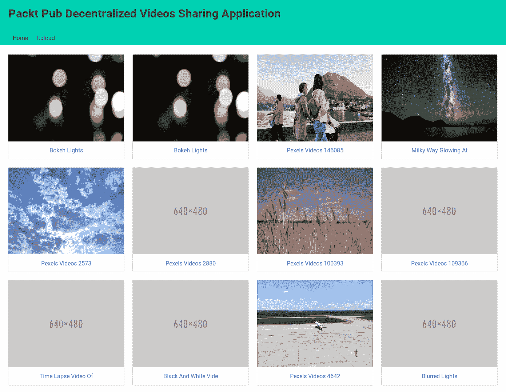
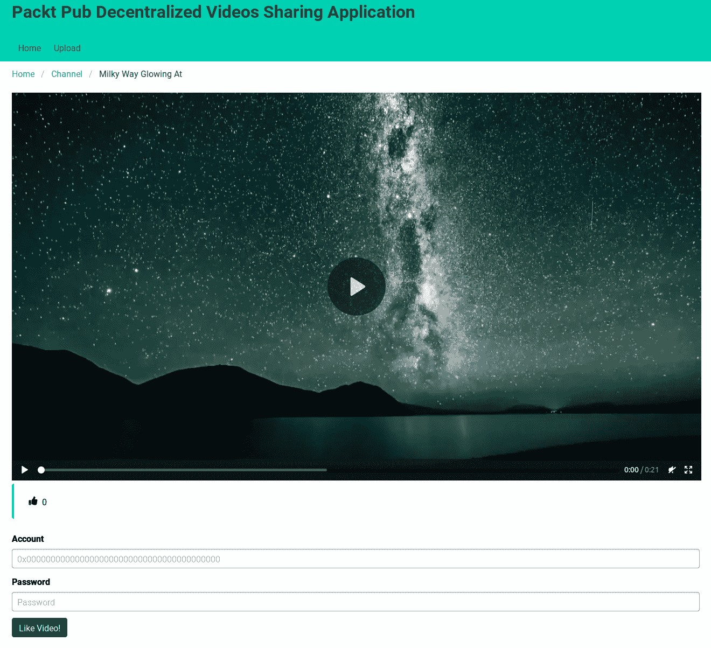
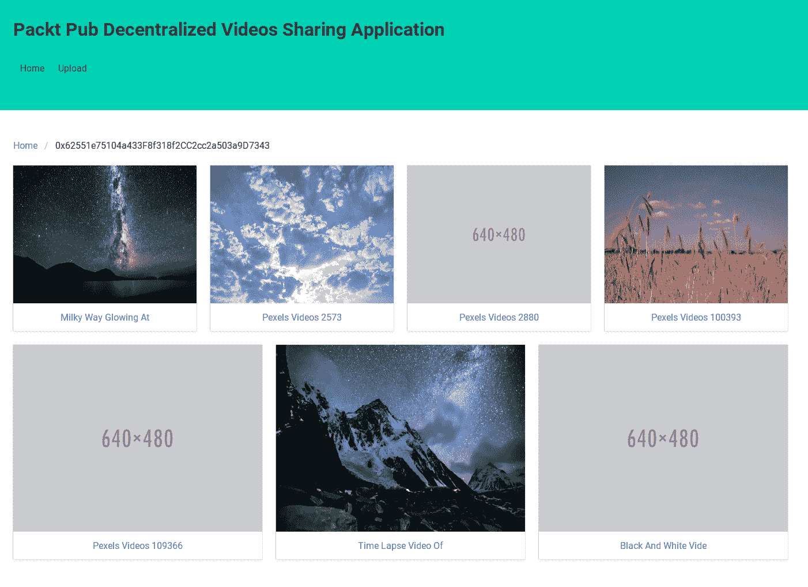
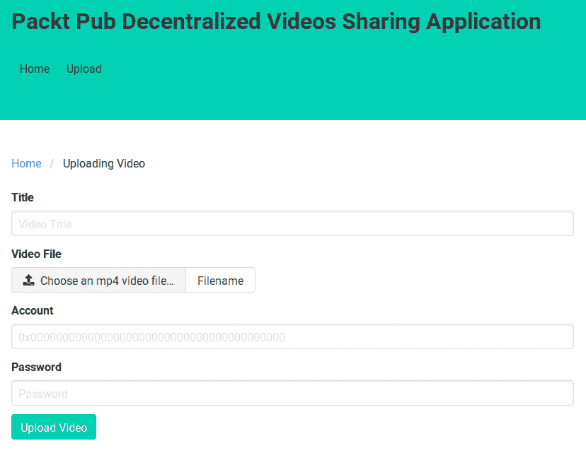

# 第十二章：使用 IPFS 实现去中心化应用

在本章中，我们将结合智能合约和**星际文件系统**（**IPFS**）来构建一个去中心化的视频分享应用（类似于 YouTube 但是去中心化）。我们将使用一个 Web 应用作为区块链和 IPFS 的前端。正如之前所述，IPFS 并不是一种区块链技术。IPFS 是一种去中心化技术。然而，在区块链论坛、聚会或教程中，你可能会经常听到 IPFS 被提到。其中一个主要原因是 IPFS 克服了区块链的弱点，即其存储非常昂贵。

在本章中，我们将涵盖以下主题：

+   去中心化视频分享应用的架构

+   编写视频分享智能合约

+   构建视频分享 Web 应用

# 去中心化视频分享应用的架构

这是我们的应用在完成后的样子——首先，你去一个网站，在那里你会看到一个视频列表（就像 YouTube 一样）。在这里，你可以在浏览器中播放视频，上传视频到你的浏览器，这样人们就可以观看你的可爱的猫视频，并喜欢其他人的视频。

从表面上看，这就像一个普通的应用。你可以用你喜欢的 Python Web 框架构建它，比如 Django、Flask 或 Pyramid。然后你可以使用 MySQL 或 PostgreSQL 作为数据库。你可以选择 NGINX 或 Apache 作为 Gunicorn Web 服务器前面的 Web 服务器。对于缓存，你可以使用 Varnish 进行整页缓存，使用 Redis 进行模板缓存。你还将在云上托管 Web 应用和视频，比如**亚马逊网络服务**（**AWS**）或**谷歌云平台**（**GCP**），Azure。然后你将使用内容传送网络使其在全球范围内可扩展。对于前端，你可以使用 JavaScript 框架，如 React.js、Angular.js、Vue.js 或 Ember。如果你是一个高级用户，你可以使用机器学习进行视频推荐。

然而，关键点在于，我们想要构建的是一个利用区块链技术的去中心化视频分享应用，而不是一个集中式应用。

让我们讨论一下我们所说的利用区块链技术构建去中心化视频分享应用的含义。

我们无法在以太坊区块链上存储视频文件，因为这非常昂贵；即使在以太坊区块链上存储图片文件也要花费很多钱。有人已经为我们在以下链接上进行了计算：[`ethereum.stackexchange.com/questions/872/what-is-the-cost-to-store-1kb-10kb-100kb-worth-of-data-into-the-ethereum-block`](https://ethereum.stackexchange.com/questions/872/what-is-the-cost-to-store-1kb-10kb-100kb-worth-of-data-into-the-ethereum-block)。

存储 1 KB 的成本大约为 0.032 ETH。一个体面的图像文件大约为 2 MB。如果你问硬盘制造商，1 MB 就是 1,000 KB，如果你问操作系统，就是 1,024 KB。我们简单地将其四舍五入为 1,000，因为这对我们的计算没有任何影响。因此，在以太坊上存储 2 MB 文件的成本大约是 2,000 乘以 0.032 ETH，等于 64 ETH。ETH 的价格一直在变化。在撰写本文时，1 ETH 的成本大约是 120 美元。这意味着要存储一个 2 MB 的图片文件（Unsplash 网站上的普通大小库存图片文件），你需要花费 7,680 美元。一个一分半钟的 MP4 格式视频文件大约为 46 MB。因此，你需要花费 176,640 美元来在以太坊上存储这个视频文件。

与其支付这个费用，区块链开发者通常会在区块链上存储视频文件的引用，并将视频文件本身存储在正常的存储介质上，比如 AWS。在 Vyper 智能合约中，你可以使用`bytes`数据类型：

```py
cute_panda_video: bytes[128]
```

然后，你可以在智能合约中存储你在 AWS S3（[`aws.amazon.com/s3/`](https://aws.amazon.com/s3/)）中存储的视频链接：

```py
cute_panda_video = "http://abucket.s3-website-us-west-2.amazonaws.com/cute_panda_video.mp4"
```

这种方法都很好，但问题在于你依赖于 AWS。如果公司不喜欢你的可爱熊猫视频，他们可以删除它，而存在于智能合约中的 URL 也会变得无效。当然，你可以改变智能合约中`cute_panda_video`变量的值（除非你禁止这样做）。然而，这种情况会给我们的应用程序带来不便。如果你使用来自集中化公司的服务，你的命运取决于该公司的心情。

我们可以通过使用 IPFS 等去中心化存储来缓解这个问题。我们可以将 IPFS 路径（或 IPFS 哈希）存储为`cute_panda_video`变量的值，类似于以下示例：

```py
cute_panda_video = "/ipfs/QmWgMcTdPY9Rv7SCBusK1gWBRJcBi2MxNkC1yC6uvLYPwK"
```

然后，我们可以在 AWS 和其他地方（比如 GCP）上启动我们的 IPFS 守护程序。因此，如果 AWS 审查我们的可爱熊猫视频，我们的可爱熊猫视频的 IPFS 路径仍然有效。我们可以从其他地方（比如 GCP）提供视频。你甚至可以将视频托管在你奶奶家的电脑上。痴迷于可爱熊猫视频的人甚至可以固定该视频，帮助我们提供可爱熊猫视频。

除了以去中心化的方式托管可爱的熊猫视频之外，去中心化视频分享应用程序还有其他价值。这个价值与区块链技术有关。假设我们想要构建一个视频点赞功能。我们可以将点赞值存储在区块链上。这可以防止腐败。想象一下，我们想要为最可爱的熊猫视频举办一个投票比赛，奖金是 10 个比特币。如果我们的比赛应用程序是以集中化的方式完成的（使用表将点赞值存储在 SQL 数据库中，比如 MySQL 或 PostgreSQL），我们作为集中化的管理员可以使用以下代码操纵获胜者：

```py
UPDATE thumbs_up_table SET aggregate_voting_count = 1000000 WHERE video_id = 234;
```

当然，作弊并不是这么容易的。你需要通过确保聚合计数与个体计数匹配来掩盖你的行踪，这需要做得很微妙。你可以在一个小时内将聚合计数添加到 100 到 1,000 之间的随机数字，而不是一次性添加一百万张选票，这并不是在建议你欺骗用户，我只是在阐明我的观点。

通过区块链，我们可以防止集中化管理员对数据完整性的腐败。点赞值保存在智能合约中，并且你可以让人们审计智能合约的源代码。我们在去中心化视频分享应用程序上的点赞功能通过一个诚实的过程增加了视频的点赞数。

除了数据的完整性，我们还可以构建一个加密经济。我的意思是，我们可以在我们的智能合约中进行经济活动（比如出售、购买、竞标等）。我们可以在同一个智能合约中构建代币。这个代币的硬币可以用来点赞视频，这样点赞视频就不再是免费的。视频的所有者可以像把钱放进口袋一样把它兑现出来。这种动态可以激励人们上传更好的视频。

除此之外，去中心化的应用程序保证了 API 的独立性。应用程序的去中心化性质防止了 API 受到类似 Twitter API 丑闻的干扰或骚扰。很久以前，开发者可以在 Twitter API 的基础上自由开发有趣的应用程序，但后来 Twitter 对开发者如何使用他们的 API 施加了严格的限制。其中一个例子是 Twitter 曾经关闭了 Politwoops 对 API 的访问权限，该应用程序保存了政客删除的推文。不过现在访问权限已经重新激活。通过使我们的应用程序去中心化，我们可以增加 API 的民主性质。

出于教育目的，我们的应用程序有两个主要功能。首先，你可以看到视频列表，播放视频和上传视频。这些都是你在 YouTube 上做的正常事情。其次，你可以点赞视频，但只能用硬币或代币。

在着手构建应用程序之前，让我们设计智能合约的架构和 Web 应用程序的架构。

# 视频分享智能合约的架构

我们的应用程序始于智能合约。我们的智能合约需要做一些事情，具体如下：

+   跟踪用户上传的视频

+   利用代币及其标准操作（ERC20）

+   提供一种用户可以使用硬币或代币点赞视频的方式

+   用于点赞视频的硬币将转移到视频所有者

就是这样。我们始终努力使智能合约尽可能简短。代码行数越多，出现错误的机会就越大。而智能合约中的错误是无法修复的。

在编写这个智能合约之前，让我们考虑一下我们想要如何构建智能合约。智能合约的结构包括数据结构。让我们看一个例子，我们想要使用什么数据结构来跟踪用户的视频。

我们肯定想要使用一个映射变量，其中地址数据类型作为键。这里的困难部分是选择我们想要用作这个映射数据类型值的数据类型。正如我们在第三章中学到的，Vyper 中没有无限大小的数组。如果我们使用`bytes32`数组，我们将受限于作为这个映射值的数组的特定大小。这意味着用户最多可以拥有一定大小的视频。我们可以使用`bytes32`数组来保存非常大的视频列表，比如 100 万个视频。有人会上传超过 100 万个视频的机会有多大呢？如果你每天上传一个视频，十年内你只会上传 3650 个视频。然而，`bytes32`数组的问题是，它不能接受超过 32 字节大小的数据。IPFS 路径，比如`QmWgMcTdPY9Rv7SCBusK1gWBRJcBi2MxNkC1yC6uvLYPwK`，长度为 44 个字符。因此，你必须至少使用`bytes[44]`数据类型，但我们将其四舍五入为`bytes[50]`。

相反，我们希望有另一个映射数据类型变量（让我们称之为映射 z）作为前一段描述的这个映射数据类型变量的值。映射 z 的键是整数，值是包含`bytes[50]`数据类型变量以保存 IPFS 路径和`bytes[20]`数据类型变量以保存视频标题的结构。有一个整数跟踪器来初始化映射 z 中键的值。这个整数跟踪器的初始值为 0。每次我们向映射 z 添加一个视频（IPFS 路径和视频标题），我们就将这个整数跟踪器加一。因此，下次我们添加另一个视频时，映射 z 的键不再是 0，而是 1。这个整数跟踪器对每个账户都是唯一的。我们可以创建另一个映射将账户映射到这个整数跟踪器。

在处理视频之后，我们关注点赞。我们如何存储用户 A 点赞视频 Z 的事实？我们需要确保用户不能多次点赞同一视频。最简单的方法是创建一个映射，其中`bytes[100]`数据类型作为键，`boolean`数据类型作为值。`bytes[100]`数据类型变量是使用视频点赞者的地址、视频上传者的地址和视频索引的组合。`boolean`数据类型变量用于指示用户是否已经点赞了视频。

此外，我们需要一个整数数据类型来保持视频点赞数量的总计。总点赞数是一个映射，其中`bytes[100]`数据类型作为键，`integer`数据类型作为值。`bytes[100]`数据类型变量是视频上传者的地址和视频索引的组合。

这种方法的缺点是很难跟踪哪些用户喜欢了智能合约中的特定视频。我们可以创建另一个映射来跟踪哪些用户喜欢了某个视频。然而，这会使我们的智能合约变得更加复杂。之前，我们不惜一切代价创建了一个专门用于跟踪用户上传的所有视频的映射。这是必要的，因为我们想要获取用户视频的列表。这就是我们所说的核心功能。然而，跟踪哪些用户喜欢了一个视频并不是我所说的核心功能。

只要我们能够让视频点赞的过程变得诚实，我们就不需要跟踪哪些用户喜欢了一个视频。如果我们真的渴望跟踪这些用户，我们可以在智能合约中使用事件。每当用户喜欢一个视频，它就会触发一个事件。然后，在客户端使用`web3.py`库，我们可以过滤这些事件以获取所有喜欢特定视频的用户。这将是一个昂贵的过程，应该单独完成主要应用程序。我们可以使用 Celery 进行后台作业，此时结果可以存储在数据库中，如 SQlite、PostgreSQL 或 MySQL。构建去中心化应用并不意味着完全否定集中化的方法。

有关代币的主题已在第八章中进行了彻底讨论，*在以太坊中创建代币*。

# 视频共享 Web 应用程序的架构

我们将开发一个 Python Web 应用程序，用作我们智能合约的前端。这意味着我们需要一个适当的服务器来成为 Python Web 应用程序的主机。为此，我们至少需要一个 Gunicorn Web 服务器。换句话说，我们需要在集中服务器上托管我们的 Python Web 应用程序，例如在 AWS、GCP 或 Azure 中。这对于观看视频来说是可以的，但当用户想要上传视频时就会出现问题，因为这需要访问私钥。用户可能会担心我们在集中服务器上的 Python Web 应用程序会窃取他们的私钥。

因此，解决方案是将我们的 Python Web 应用程序的源代码发布在 GitHub 或 GitLab 上，然后告诉用户下载、安装并在他们的计算机上运行它。他们可以审计我们的 Python Web 应用程序的源代码，以确保没有恶意代码试图窃取他们的私钥。然而，如果他们需要每次审计源代码，那么我们就在 Git 存储库上添加另一个提交。

或者更好的是，我们可以将我们的 Python Web 应用程序的源代码存储在 IPFS 上。他们可以从 IPFS 下载这个源代码，并确保我们应用程序的源代码不会被篡改。他们只需要在使用之前审计一次源代码。

然而，虽然我们可以在 IPFS 上托管静态网站，但我们无法对 Python、PHP、Ruby 或 Perl Web 应用程序等动态网页执行相同的操作。这些动态网站需要一个适当的 Web 服务器。因此，任何下载我们的 Python Web 应用程序源代码的人都需要在执行我们的应用程序之前安装正确的软件。他们需要安装 Python 解释器、Web 服务器（Gunicorn、Apache 或 NGINX）以及所有必要的库。

然而，只有桌面用户才能这样做。移动用户无法执行我们的应用程序，因为 Android 或 iOS 平台上没有适当的 Python 解释器或 Web 服务器。

这就是 JavaScript 的亮点所在。您可以创建一个静态网站，使其具有动态性，以便在网页中实现交互。您还可以使用 React.js、Angular.js、Ember.js 或 Vue.js 创建一个复杂的 JavaScript Web 应用程序，并将其部署在 IPFS 上。桌面用户和移动用户都可以执行 JavaScript Web 应用程序。因为这是一本关于 Python 的书，我们仍然会考虑创建一个 Python Web 应用程序。但是，您应该记住 JavaScript 相对于 Python 的优势。

无论 JavaScript 有多好，它仍然不能解决移动用户的困境。移动平台上的计算能力仍然不如桌面平台上的计算能力强大。你仍然不能在移动平台上运行完整的以太坊节点，就像你不能在移动平台上运行 IPFS 软件一样。

让我们设计我们的 Web 应用程序。这有一些实用工具：

+   播放视频

+   上传视频

+   点赞视频

+   从许多用户中列出最近的视频

+   列出一个特定用户的所有视频

列出一个特定用户的所有视频相对容易，因为在智能合约中，我们有一个无限大小的数组（基本上是一个以整数为键和另一个整数跟踪器的映射），我们可以根据用户获取视频。页面的控制器接受一个用户（或者基本上是智能合约中的地址）作为参数。

播放视频接受视频上传者的地址和视频索引作为参数。如果视频还没有存在于我们的存储中，我们会从 IPFS 上下载它。然后我们将视频提供给用户。

上传视频需要与以太坊节点进行交互。上传视频的方法或功能接受一个要使用的账户地址的参数，一个加密私钥的密码参数，一个视频文件的参数，以及一个视频标题的参数。我们首先将视频文件存储在 IPFS 上。然后如果成功，我们可以在区块链上存储关于这个视频的信息。

点赞视频也需要与以太坊节点进行交互。点赞视频的方法或功能接受一个视频点赞者的地址参数，一个加密私钥的密码参数，一个视频上传者的地址参数，以及一个视频索引的参数。在确保用户之前没有点赞视频的情况下，我们将信息存储在区块链上。

从许多用户中列出最近的视频有点棘手。所涉及的工作量相当大。在智能合约中，我们没有一个变量来跟踪所有参与用户。我们也没有一个变量来跟踪不同用户的所有视频。然而，我们可以通过在区块链上存储视频信息的方法创建一个事件。这样做之后，我们可以从这个事件中找到所有最近的视频。

现在是时候构建去中心化的视频分享应用程序了。

# 编写视频分享智能合约

话不多说，让我们设置我们的智能合约开发平台：

1.  首先，我们按照以下方式设置我们的虚拟环境：

```py
$ virtualenv -p python3.6 videos-venv
$ source videos-venv/bin/activate
(videos-venv) $
```

1.  然后我们安装 Web3、Populus 和 Vyper：

```py
(videos-venv) $ pip install eth-abi==1.2.2
(videos-venv) $ pip install eth-typing==1.1.0
(videos-venv) $ pip install py-evm==0.2.0a33
(videos-venv) $ pip install web3==4.7.2
(videos-venv) $ pip install -e git+https://github.com/ethereum/populus#egg=populus
(videos-venv) $ pip install vyper 
```

Vyper 的最新版本是 0.1.0b6，这破坏了 Populus。开发者需要一些时间来修复这个问题。如果在你阅读本书时 bug 还没有被修复，你可以自己修补 Populus。

1.  使用以下命令检查这个库是否已经修复了 bug：

```py
(videos-venv) $ cd videos-venv/src/populus
(videos-venv) $ grep -R "compile(" populus/compilation/backends/vyper.py
 bytecode = '0x' + compiler.compile(code).hex()
 bytecode_runtime = '0x' + compiler.compile(code, bytecode_runtime=True).hex()
```

在我们的情况下，bug 还没有被修复。

1.  所以，让我们修补 Populus 以修复 bug。确保你仍然在同一个目录中（`videos-venv/src/populus`）：

```py
(videos-venv) $ wget https://patch-diff.githubusercontent.com/raw/ethereum/populus/pull/484.patch
(videos-venv) $ git apply 484.patch
(videos-venv) $ cd ../../../ 
```

1.  在修补 Populus 之后，我们将创建我们的智能合约项目目录：

```py
(videos-venv) $ mkdir videos-sharing-smart-contract
```

1.  然后，我们将目录初始化为 Populus 项目目录：

```py
(videos-venv) $ cd videos-sharing-smart-contract
(videos-venv) $ mkdir contracts tests 
```

1.  接下来，我们将在 Populus 项目目录中下载 Populus 配置文件：

```py
(videos-venv) $ wget https://raw.githubusercontent.com/ethereum/populus/master/populus/assets/defaults.v9.config.json -O project.json
```

1.  我们现在将打开 Populus 的`project.json`配置文件，并覆盖`compilation`键的值，如下面的代码块所示：

```py
  "compilation": {
    "backend": {
      "class": "populus.compilation.backends.VyperBackend"
    },
    "contract_source_dirs": [
      "./contracts"
    ],
    "import_remappings": []
  },
```

1.  然后我们在`videos-sharing-smart-contract/contracts/VideosSharing.vy`中编写我们的智能合约代码，如下面的代码块所示（请参考以下 GitLab 链接的代码文件获取完整的代码：[`gitlab.com/arjunaskykok/hands-on-blockchain-for-python-developers/blob/master/chapter_12/videos_sharing_smart_contract/contracts/VideosSharing.vy`](https://gitlab.com/arjunaskykok/hands-on-blockchain-for-python-developers/blob/master/chapter_12/videos_sharing_smart_contract/contracts/VideosSharing.vy)）：

```py
struct Video:
    path: bytes[50]
    title: bytes[20]

Transfer: event({_from: indexed(address), _to: indexed(address), _value: uint256})
Approval: event({_owner: indexed(address), _spender: indexed(address), _value: uint256})
UploadVideo: event({_user: indexed(address), _index: uint256})
LikeVideo: event({_video_liker: indexed(address), _video_uploader: indexed(address), _index: uint256})

...
...

@public
@constant
def video_aggregate_likes(_user_video: address, _index: uint256) -> uint256:
    _user_video_str: bytes32 = convert(_user_video, bytes32)
    _index_str: bytes32 = convert(_index, bytes32)
    _key: bytes[100] = concat(_user_video_str, _index_str)

    return self.aggregate_likes[_key]
```

现在，让我们逐步讨论我们的智能合约：

```py
struct Video:
    path: bytes[50]
    title: bytes[20]
```

这是我们想要在区块链上保留的视频信息的结构体。`Video`结构体的`path`存储了 IPFS 路径，长度为 44。如果我们使用另一个哈希函数，IPFS 路径将有不同的长度。请记住，IPFS 在对对象进行哈希时使用多哈希。如果在 IPFS 配置中使用更昂贵的哈希函数，比如 SHA512，那么需要将`bytes[]`数组数据类型的大小加倍。例如，`bytes[100]`应该足够了。`Video`结构体的`title`存储了视频标题。在这里，我使用了`bytes[20]`，因为我想要标题简短。如果你想要存储更长的标题，可以使用更长的字节，比如`bytes[100]`。然而，请记住，在区块链上存储的字节数越多，需要花费的 gas（费用）就越多。当然，你可以在这个结构体中添加更多信息，比如视频描述或视频标签，只要你知道后果，即执行存储视频信息的方法需要更多的 gas。

我们现在转移到事件列表：

```py
Transfer: event({_from: indexed(address), _to: indexed(address), _value: uint256})
Approval: event({_owner: indexed(address), _spender: indexed(address), _value: uint256})
UploadVideo: event({_user: indexed(address), _index: uint256})
LikeVideo: event({_video_liker: indexed(address), _video_uploader: indexed(address), _index: uint256})
```

`Transfer`和`Approval`是 ERC20 标准事件的一部分。你可以在第八章中了解更多关于 ERC20 的信息，*在以太坊中创建代币*。`UploadVideo`事件在我们的智能合约中上传视频信息时触发。我们保存视频上传者的地址和视频的索引。`LikeVideo`事件在我们的智能合约中喜欢视频时触发。

我们保存视频喜欢者的地址，视频上传者的地址和视频的索引：

```py
user_videos_index: map(address, uint256)
```

这是我们无限数组的整数跟踪器。所以如果`user_videos_index[用户 A 的地址] = 5`，这意味着用户 A 已经上传了四个视频。

以下是 ERC20 标准的一部分：

```py
name: public(bytes[20])
symbol: public(bytes[3])
totalSupply: public(uint256)
decimals: public(uint256)
balances: map(address, uint256)
allowed: map(address, map(address, uint256))
```

有关 ERC20 的更多信息，请参阅第八章，*在以太坊中创建代币*。

我们继续下一行：

```py
all_videos: map(address, map(uint256, Video))
```

这是保留所有用户所有视频的核心变量。`address`数据类型键用于保存用户的地址。`map(uint256, Video)`数据类型值是我们的无限数组。`map(uint256, Video)`中的`uint256`键从 0 开始，然后由`user_videos_index`变量跟踪。`Video`结构体是我们的视频信息。

接下来的两行代码用于喜欢：

```py
likes_videos: map(bytes[100], bool)
aggregate_likes: map(bytes[100], uint256)
```

`likes_videos`变量是用来检查某个用户是否喜欢特定视频的变量。`aggregate_likes`变量是用来显示这个特定视频已经获得了多少赞。

我们现在已经定义了变量，将继续下面代码块中的代码：

```py
@public
def __init__():
    _initialSupply: uint256 = 500
    _decimals: uint256 = 3
    self.totalSupply = _initialSupply * 10 ** _decimals
    self.balances[msg.sender] = self.totalSupply
    self.name = 'Video Sharing Coin'
    self.symbol = 'VID'
    self.decimals = _decimals
    log.Transfer(ZERO_ADDRESS, msg.sender, self.totalSupply)

...
...

@public
@constant
def allowance(_owner: address, _spender: address) -> uint256:
    return self.allowed[_owner][_spender]
```

这是标准的 ERC20 代码，你可以在第八章中了解更多，*在以太坊中创建代币*。然而，我对代码进行了小幅调整，如下面的代码块所示：

```py
@private
def _transfer(_source: address, _to: address, _amount: uint256) -> bool:
    assert self.balances[_source] >= _amount
    self.balances[_source] -= _amount
    self.balances[_to] += _amount
    log.Transfer(_source, _to, _amount)

    return True

@public
def transfer(_to: address, _amount: uint256) -> bool:
    return self._transfer(msg.sender, _to, _amount)
```

在这个智能合约中，我将`transfer`方法的内部代码提取到了专用的私有方法中。这样做的原因是，转移代币的功能将在喜欢视频的方法中使用。记住，当我们喜欢一个视频时，我们必须向视频上传者支付代币。我们不能在另一个公共函数中调用公共函数。其余的代码是一样的（除了代币的名称）：

```py
@public
def upload_video(_video_path: bytes[50], _video_title: bytes[20]) -> bool:
    _index: uint256 = self.user_videos_index[msg.sender]

    self.all_videos[msg.sender][_index] = Video({ path: _video_path, title: _video_title })
    self.user_videos_index[msg.sender] += 1

    log.UploadVideo(msg.sender, _index)aggregate_likes

    return True
```

这是用于在区块链上存储视频信息的方法。我们在将视频上传到 IPFS 后调用这个方法。`_video_path`是 IPFS 路径，`_video_title`是视频标题。我们从视频上传者（`msg.sender`）那里获取最新的索引。然后我们根据视频上传者的地址和最新的索引将`Video`结构体的值设置为`all_videos`。

然后我们增加整数跟踪器(`user_videos_index`)。不要忘记记录这个事件。

```py
@public
@constant
def latest_videos_index(_user: address) -> uint256:
    return self.user_videos_index[_user]

@public
@constant
def videos_path(_user: address, _index: uint256) -> bytes[50]:
    return self.all_videos[_user][_index].path

@public
@constant
def videos_title(_user: address, _index: uint256) -> bytes[20]:
    return self.all_videos[_user][_index].title
```

在前面的代码块中的方法是用于客户端使用 web3 获取最新视频索引、视频 IPFS 路径和视频标题的便利方法。没有这些方法，你仍然可以获取视频的信息，但是使用 web3 访问嵌套映射数据类型变量中的结构变量并不直接。

以下代码显示了用于点赞视频的方法。它接受视频上传者的地址和视频索引。在这里，你创建了两个键——一个用于`likes_videos`，另一个用于`aggregate_likes`。`likes_videos`的键是视频点赞者的地址、视频上传者的地址和视频索引的组合。`aggregate_likes`的键是视频上传者的地址和视频索引的组合。创建键之后，我们确保视频点赞者将来不能再次点赞同一个视频，并且视频点赞者之前没有点赞过这个特定视频。点赞视频只是将`likes_videos`变量与我们创建的键设置为`True`。然后我们将`aggregate_likes`的值增加 1。最后，我们将代币中的一枚硬币从视频点赞者转移到视频上传者。不要忘记记录这个事件：

```py
@public
def like_video(_user: address, _index: uint256) -> bool:
    _msg_sender_str: bytes32 = convert(msg.sender, bytes32)
    _user_str: bytes32 = convert(_user, bytes32)
    _index_str: bytes32 = convert(_index, bytes32)
    _key: bytes[100] = concat(_msg_sender_str, _user_str, _index_str)
    _likes_key: bytes[100] = concat(_user_str, _index_str)
 a particular
    assert _index < self.user_videos_index[_user]
    assert self.likes_videos[_key] == False

    self.likes_videos[_key] = True
    self.aggregate_likes[_likes_key] += 1
    self._transfer(msg.sender, _user, 1)

    log.LikeVideo(msg.sender, _user, _index)

    return True
```

以下代码行是用于检查特定用户是否已经点赞视频以及这个特定视频已经获得多少赞的便利方法：

```py
@public
@constant
def video_has_been_liked(_user_like: address, _user_video: address, _index: uint256) -> bool:
    _user_like_str: bytes32 = convert(_user_like, bytes32)
    _user_video_str: bytes32 = convert(_user_video, bytes32)
    _index_str: bytes32 = convert(_index, bytes32)
    _key: bytes[100] = concat(_user_like_str, _user_video_str, _index_str)

    return self.likes_videos[_key]

@public
@constant
def video_aggregate_likes(_user_video: address, _index: uint256) -> uint256:
    _user_video_str: bytes32 = convert(_user_video, bytes32)
    _index_str: bytes32 = convert(_index, bytes32)
    _key: bytes[100] = concat(_user_video_str, _index_str)

    return self.aggregate_likes[_key]
```

让我们在`videos_sharing_smart_contract/tests/test_video_sharing.py`中编写一个测试。请参考以下 GitLab 链接中的代码文件获取完整的代码：[`gitlab.com/arjunaskykok/hands-on-blockchain-for-python-developers/blob/master/chapter_12/videos_sharing_smart_contract/tests/test_videos_sharing.py`](https://gitlab.com/arjunaskykok/hands-on-blockchain-for-python-developers/blob/master/chapter_12/videos_sharing_smart_contract/tests/test_videos_sharing.py)。

```py
import pytest
import eth_tester

def upload_video(video_sharing, chain, account, video_path, video_title):
    txn_hash = video_sharing.functions.upload_video(video_path, video_title).transact({'from': account})
    chain.wait.for_receipt(txn_hash)

def transfer_coins(video_sharing, chain, source, destination, amount):
    txn_hash = video_sharing.functions.transfer(destination, amount).transact({'from': source})
    chain.wait.for_receipt(txn_hash)

...
...

   assert events[1]['args']['_video_liker'] == video_liker2
    assert events[1]['args']['_video_uploader'] == video_uploader
    assert events[1]['args']['_index'] == 0

    with pytest.raises(eth_tester.exceptions.TransactionFailed):
        like_video(video_sharing, chain, video_liker, video_uploader, 0)
```

让我们逐步详细讨论测试脚本。在下面的代码块中，导入必要的库之后，我们创建了三个便利函数——一个用于上传视频的函数，一个用于转移代币的函数，以及一个用于点赞视频的函数：

```py
import pytest
import eth_tester

def upload_video(video_sharing, chain, account, video_path, video_title):
    txn_hash = video_sharing.functions.upload_video(video_path, video_title).transact({'from': account})
    chain.wait.for_receipt(txn_hash)

def transfer_coins(video_sharing, chain, source, destination, amount):
    txn_hash = video_sharing.functions.transfer(destination, amount).transact({'from': source})
    chain.wait.for_receipt(txn_hash)

def like_video(video_sharing, chain, video_liker, video_uploader, index):
    txn_hash = video_sharing.functions.like_video(video_uploader, index).transact({'from': video_liker})
    chain.wait.for_receipt(txn_hash)
```

如下面的代码块所示，在上传视频之前，我们确保最新视频的索引为 0。然后，在上传一个视频之后，我们应该检查最新视频的索引，这个索引应该增加 1。当然，我们也要检查视频路径和视频标题。然后我们再次上传一个视频并检查最新视频的索引，这时应该是 2。我们还要检查视频路径和视频标题。最后，我们检查事件，并确保它们已经被正确创建：

```py
def test_upload_video(web3, chain):
    video_sharing, _ = chain.provider.get_or_deploy_contract('VideosSharing')

    t = eth_tester.EthereumTester()
    video_uploader = t.get_accounts()[1]

    index = video_sharing.functions.latest_videos_index(video_uploader).call()
    assert index == 0

...
...

    assert events[0]['args']['_user'] == video_uploader
    assert events[0]['args']['_index'] == 0

    assert events[1]['args']['_user'] == video_uploader
    assert events[1]['args']['_index'] == 1
```

让我们看一下测试脚本的下一部分：

```py
def test_like_video(web3, chain):
    video_sharing, _ = chain.provider.get_or_deploy_contract('VideosSharing')

    t = eth_tester.EthereumTester()
    manager = t.get_accounts()[0]
    video_uploader = t.get_accounts()[1]
    video_liker = t.get_accounts()[2]
    video_liker2 = t.get_accounts()[3]

    transfer_coins(video_sharing, chain, manager, video_liker, 100)
    transfer_coins(video_sharing, chain, manager, video_liker2, 100)
    transfer_coins(video_sharing, chain, manager, video_uploader, 50)
    upload_video(video_sharing, chain, video_uploader, b'video-ipfs-path', b"video title")

...
...

    with pytest.raises(eth_tester.exceptions.TransactionFailed):
        like_video(video_sharing, chain, video_liker, video_uploader, 0)
```

首先，我们从管理员账户（启动智能合约的账户）向不同的账户转移一些代币，然后我们上传一个视频。在点赞视频之前，我们应该确保账户的代币余额是正确的，测试账户还没有点赞这个视频，并且累计点赞数仍然是 0。

完成这些之后，我们从特定账户点赞一个视频。视频点赞者的代币余额应该减少 1，视频上传者的代币余额应该增加 1。这意味着智能合约已记录下这个账户点赞了视频，并且这个视频的累计点赞数应该增加 1。

然后，我们从另一个账户点赞一个视频。视频点赞者的代币余额应该减少 1，视频上传者的代币余额应该再次增加 1。智能合约已记录下另一个账户点赞了这个视频，此时这个视频的累计点赞数应该再次增加 1，变为 2。

然后，我们确保视频点赞事件被触发。

最后，我们确保视频点赞者不能多次点赞同一视频。

我们不会讨论智能合约的 ERC20 部分的测试。请参考第八章，*在以太坊中创建代币*，了解如何测试 ERC20 代币智能合约。

要执行测试，请运行以下语句：

```py
(videos-venv) $ py.test tests/test_videos_sharing.py
```

# 启动私有以太坊区块链

让我们使用 geth 启动我们的私有以太坊区块链。我们在这里不使用 Ganache，因为稳定版本的 Ganache 尚不支持事件（然而，Ganache 的 beta 版本（v 2.0.0 beta 2）已经支持事件）：

1.  我们将使用以下代码块来启动区块：

```py
(videos-venv) $ cd videos_sharing_smart_contract
(videos-venv) $ populus chain new localblock
(videos-venv) $ ./chains/localblock/init_chain.sh
```

1.  现在编辑`chains/localblock/run_chain.sh`。找到`--ipcpath`，然后更改值（`--ipcpath`后面的单词）为`/tmp/geth.ipc`。

1.  然后编辑`project.json`文件。`chains`对象指向四个键：`tester`、`temp`、`ropsten`和`mainnet`。在`chains`对象中添加另一个键`localblock`：

```py
    "localblock": {
      "chain": {
        "class": "populus.chain.ExternalChain"
      },
      "web3": {
        "provider": {
          "class": "web3.providers.ipc.IPCProvider",
        "settings": {
          "ipc_path":"/tmp/geth.ipc"
        }
       }
      },
      "contracts": {
        "backends": {
          "JSONFile": {"$ref": "contracts.backends.JSONFile"},
          "ProjectContracts": {
            "$ref": "contracts.backends.ProjectContracts"
          }
        }
      }
    }
```

1.  使用以下命令运行区块链：

```py
(videos-venv) $ ./chains/localblock/run_chain.sh
```

1.  使用以下命令编译我们的智能合约：

```py
(videos-venv) $ populus compile
```

1.  然后，使用以下命令将我们的智能合约部署到我们的私有区块链：

```py
(videos-venv) $ populus deploy --chain localblock VideosSharing
```

将我们的智能合约部署的地址写入`address.txt`。该文件必须与`videos_sharing_smart_contract`目录相邻。

# 创建引导脚本

此脚本用于加载数据，以便更轻松地开发我们的应用程序。我们可以从[`videos.pexels.com/`](https://videos.pexels.com/)下载免费视频。在`videos_sharing_smart_contract`目录旁边创建一个`stock_videos`目录，并将一些 MP4 文件下载到该`stock_videos`目录中。在我的情况下，我下载了超过 20 个视频。

下载一些数据后，我们将创建一个名为`bootstrap_videos.py`的脚本。有关完整代码，请参考以下 GitLab 链接的代码文件：[`gitlab.com/arjunaskykok/hands-on-blockchain-for-python-developers/blob/master/chapter_12/bootstrap_videos.py`](https://gitlab.com/arjunaskykok/hands-on-blockchain-for-python-developers/blob/master/chapter_12/bootstrap_videos.py)。

```py
import os, json
import ipfsapi
from web3 import Web3, IPCProvider
from populus.utils.wait import wait_for_transaction_receipt

w3 = Web3(IPCProvider('/tmp/geth.ipc'))

common_password = 'bitcoin123'
accounts = []
with open('accounts.txt', 'w') as f:
...
...
    nonce = w3.eth.getTransactionCount(Web3.toChecksumAddress(account))
    txn = VideosSharing.functions.upload_video(ipfs_path, title).buildTransaction({
                'from': account,
                'gas': 200000,
                'gasPrice': w3.toWei('30', 'gwei'),
                'nonce': nonce
              })
    txn_hash = w3.personal.sendTransaction(txn, common_password)
    wait_for_transaction_receipt(w3, txn_hash)
```

让我们逐步详细讨论脚本。在导入必要的库之后，在以下代码块中，我们创建了一个名为`w3`的对象，它是连接到我们私有区块链的连接对象：

```py
import os, json
import ipfsapi
from web3 import Web3, IPCProvider
from populus.utils.wait import wait_for_transaction_receipt

w3 = Web3(IPCProvider('/tmp/geth.ipc'))
```

在以下代码行中，我们使用`w3.personal.newAccount()`方法创建新账户。然后我们将新账户的地址放入`accounts.txt`文件和`accounts`变量中。所有账户都使用`'bitcoin123'`作为密码：

```py
common_password = 'bitcoin123'
accounts = []
with open('accounts.txt', 'w') as f:
    for i in range(4):
        account = w3.personal.newAccount(common_password)
        accounts.append(account)
        f.write(account + "\n")
```

记住：在我们的私有区块链上部署智能合约后，我们将智能合约的地址保存在`address.txt`文件中。现在是时候将文件的内容加载到`address`变量中了：

```py
with open('address.txt', 'r') as f:
    address = f.read().rstrip("\n")

with open('videos_sharing_smart_contract/build/contracts.json') as f:
    contract = json.load(f)
    abi = contract['VideosSharing']['abi']
```

然后，我们加载我们的智能合约的`abi`或接口，可以从 Populus 项目目录的`build`目录中的`contracts.json`中获取。我们使用`json.load()`方法将 JSON 加载到`contract`变量中。`abi`来自`json`对象的`'VideosSharing'`键中的`'abi'`键。

然后，我们使用`w3.eth.contract()`方法初始化智能合约对象的地址和接口。然后我们使用`ipfsapi.connect()`方法获取 IPFS 连接对象：

```py
VideosSharing = w3.eth.contract(address=address, abi=abi)

c = ipfsapi.connect()
```

接下来，我们想要向我们的新账户转移以太币。默认情况下，第一个账户（`w3.eth.accounts[0]`）获得所有来自挖矿的奖励，因此它有足够的以太币可以分享。默认密码是`'this-is-not-a-secure-password'`：

```py
coinbase = w3.eth.accounts[0]
coinbase_password = 'this-is-not-a-secure-password'
# Transfering Ethers
for destination in accounts:
    nonce = w3.eth.getTransactionCount(Web3.toChecksumAddress(coinbase))
    txn = {
            'from': coinbase,
            'to': Web3.toChecksumAddress(destination),
            'value': w3.toWei('100', 'ether'),
            'gas': 70000,
            'gasPrice': w3.toWei('1', 'gwei'),
            'nonce': nonce
          }
    txn_hash = w3.personal.sendTransaction(txn, coinbase_password)
    wait_for_transaction_receipt(w3, txn_hash)
```

通过`w3.personal.sendTransaction()`方法发送以太币，该方法接受包含发送者（`'from'`）、目的地（`'to'`）、以太币数量（`'value'`）、gas、燃气价格（`'gasPrice'`）、`nonce`作为第一个参数，密码作为第二个参数的字典。然后我们使用`wait_for_transaction_receipt()`方法等待交易确认。

在转移以太币之后，我们将我们的代币的一些 ERC20 硬币转移到新账户。这是必要的，因为要喜欢一个视频，我们需要我们的 ERC20 代币的硬币：

```py
# Transfering Coins
for destination in accounts:
    nonce = w3.eth.getTransactionCount(coinbase)
    txn = VideosSharing.functions.transfer(destination, 100).buildTransaction({
                'from': coinbase,
                'gas': 70000,
                'gasPrice': w3.toWei('1', 'gwei'),
                'nonce': nonce
              })
    txn_hash = w3.personal.sendTransaction(txn, coinbase_password)
    wait_for_transaction_receipt(w3, txn_hash)
```

我们为转移代币方法（`VideosSharing.functions.transfer`）构建了一个交易对象`txn`，该方法接受目标帐户和硬币数量的`buildTransaction`方法。这个方法接受发送者（`'from'`）、燃气、燃气价格（`'gasPrice'`）和 nonce 的字典。我们使用`w3.personal.sendTransaction()`方法创建一个交易，然后使用`wait_for_transaction_receipt()`方法等待交易被确认。

我们使用`os.listdir()`方法列出`stock_videos`目录中的所有文件。您已经将一些 MP4 文件下载到此目录中。在这样做之后，我们遍历这些文件：

```py
# Uploading Videos
directory = 'stock_videos'
movies = os.listdir(directory)
length_of_movies = len(movies)
for index, movie in enumerate(movies):
    account = accounts[index//7]
    ipfs_add = c.add(directory + '/' + movie)
    ipfs_path = ipfs_add['Hash'].encode('utf-8')
    title = movie.rstrip('.mp4')[:20].encode('utf-8')

    nonce = w3.eth.getTransactionCount(Web3.toChecksumAddress(account))
    txn = VideosSharing.functions.upload_video(ipfs_path, title).buildTransaction({
                'from': account,
                'gas': 200000,
                'gasPrice': w3.toWei('30', 'gwei'),
                'nonce': nonce
              })
    txn_hash = w3.personal.sendTransaction(txn, common_password)
    wait_for_transaction_receipt(w3, txn_hash)
```

我们希望每个帐户上传七个视频（`account = accounts [index//7]`）。因此，前七个视频将由第一个帐户上传，而第二批七个视频将由第二个帐户上传。然后我们将 MP4 文件添加到 IPFS（`ipfs_add = c.add(directory + '/' + movie)`）。我们获取 IPFS 路径并将其转换为字节对象（`ipfs_path = ipfs_add['Hash'].encode('utf-8')`），将 MP4 文件名削减为 20 个字符并将其转换为字节对象，因为智能合约中的标题具有`bytes[20]`数据类型。

然后我们调用我们智能合约的`upload_video`方法（`VideosSharing.functions.upload_video`）。在将其作为参数发送到`w3.personal.sendTransaction()`方法之前，我们必须构建交易对象。我们等待交易像往常一样被确认，使用`wait_for_transaction_receipt()`方法。

但是，您必须小心`upload_video`方法，因为它会保存视频路径，该路径具有`bytes[50]`数据类型，并且视频标题，该标题具有`bytes[20]`数据类型在区块链上。它还会增加视频的索引并记录事件。所需的燃气和燃气价格比转移硬币或代币方法要多得多。要转移代币硬币，您可以使用 1 gwei 和 70,000 gas 的燃气价格。但是，对于我们的`upload_video`方法，这将失败。对于此方法，我使用 30 gwei 和 200,000 gas 的燃气价格。请记住，在区块链中存储是昂贵的。即使一些字符串也可能会提高操作所需的燃气和燃气价格。

1.  确保您已经启动了您的私有区块链，然后启动 IPFS `daemon`：

```py
$ ipfs daemon
```

如果您不知道如何安装和启动 IPFS，请参考第十一章，*使用 ipfsapi 与 IPFS 交互*。

1.  现在，我们需要在我们的虚拟环境中安装 IPFS Python 库：

```py
(videos-venv) $ pip install ipfsapi
```

1.  然后，我们使用以下命令运行我们的引导脚本：

```py
(videos-venv) $ python bootstrap_videos.py
```

这将需要一些时间。您可以通过访问智能合约并检查视频是否已上传来测试您的引导脚本是否成功。

1.  创建一个名为`check_bootstrap.py`的脚本：

```py
import json
from web3 import Web3, IPCProvider

w3 = Web3(IPCProvider('/tmp/geth.ipc'))

with open('accounts.txt', 'r') as f:
    account = f.readline().rstrip("\n")

with open('address.txt', 'r') as f:
    address = f.read().rstrip("\n")

with open('videos_sharing_smart_contract/build/contracts.json') as f:
    contract = json.load(f)
    abi = contract['VideosSharing']['abi']

VideosSharing = w3.eth.contract(address=address, abi=abi)

print(VideosSharing.functions.latest_videos_index(account).call())
```

1.  运行脚本。如果输出为`0`，则您的引导脚本失败。如果您得到除`0`之外的一些输出，则您的视频信息已成功上传到区块链中。

# 构建视频分享网络应用程序

现在是时候构建我们智能合约的前端了。在第七章和第九章中，我们使用 Qt for Python 或`Pyside2`库创建了一个桌面应用程序。这次我们将使用 Django 库构建一个 Web 应用程序：

1.  话不多说，让我们安装 Django：

```py
(videos-venv) $ pip install Django
```

1.  我们还需要 OpenCV Python 库来获取我们视频的缩略图：

```py
(videos-venv) $ pip install opencv-python
```

1.  现在让我们创建我们的 Django 项目目录。这将创建一个带有其设置文件的骨架 Django 项目：

```py
(videos-venv) $ django-admin startproject decentralized_videos
```

1.  在这个新目录中，创建一个`static media`目录：

```py
(videos-venv) $ cd decentralized_videos
(videos-venv) $ mkdir static media
```

1.  在同一个目录中，创建一个名为`videos`的 Django 应用程序：

```py
(videos-venv) $ python manage.py startapp videos
```

1.  然后更新我们的 Django 项目设置文件。该文件位于`decentralized_videos/settings.py`。将我们的新应用程序`videos`添加到`INSTALLED_APPS`变量中。确保`'videos'`和`'django.contrib.staticfiles'`字符串之间有逗号。我们需要将每个 Django 应用程序添加到这个变量中，以便 Django 项目能够识别它。一个 Django 项目可以由许多 Django 应用程序组成：

```py
INSTALLED_APPS = [
    'django.contrib.admin',
    'django.contrib.auth',
    'django.contrib.contenttypes',
    'django.contrib.sessions',
    'django.contrib.messages',
    'django.contrib.staticfiles',
    'videos'
]
```

1.  然后，在同一个文件中，添加以下代码行：

```py
STATIC_URL = '/static/'

STATICFILES_DIRS = [
    os.path.join(BASE_DIR, "static"),
]

MEDIA_URL = '/media/'
MEDIA_ROOT = os.path.join(BASE_DIR, 'media')
```

`STATIC_URL`变量定义了我们如何访问静态 URL。有了这个值，我们可以使用这个 URL 访问静态文件：`http://localhost:8000/static/our_static_file`。`STATICFILES_DIRS`变量指的是我们在文件系统中保存静态文件的位置。我们简单地将视频存储在 Django 项目目录内的`static`目录中。`MEDIA_URL`和`STATIC_URL`的作用是一样的，但是用于媒体文件。媒体文件是用户上传到 Django 项目中的文件，而静态文件是我们作为开发者放入 Django 项目中的文件。

# 视图

现在让我们创建`videos`应用程序的视图文件。视图是一个类似 API 端点的控制器。该文件位于`decentralized_videos/videos/views.py`。请参考以下 GitLab 链接中的代码文件获取完整的代码：[`gitlab.com/arjunaskykok/hands-on-blockchain-for-python-developers/blob/master/chapter_12/decentralized_videos/videos/views.py`](https://gitlab.com/arjunaskykok/hands-on-blockchain-for-python-developers/blob/master/chapter_12/decentralized_videos/videos/views.py)：

```py
from django.shortcuts import render, redirect
from videos.models import videos_sharing

def index(request):
    videos = videos_sharing.recent_videos()
    context = {'videos': videos}
    return render(request, 'videos/index.html', context)
...
...
def like(request):
    video_user = request.POST['video_user']
    index = int(request.POST['index'])
    password = request.POST['password']
    video_liker = request.POST['video_liker']
    videos_sharing.like_video(video_liker, password, video_user, index)
    return redirect('video', video_user=video_user, index=index)
```

让我们逐步讨论代码。首先，我们使用以下代码行导入所有所需的库：

```py
from django.shortcuts import render, redirect
from videos.models import videos_sharing
```

`render`和`redirect`方法是 Django 库中的便利函数，用于渲染模板（如 HTML 文件）并将其从一个视图重定向到另一个视图。`videos_sharing`是我们将在`models`文件中很快创建的自定义实例。

接下来，我们将创建一个方法，这个方法将成为我们主页的视图：

```py
def index(request):
    videos = videos_sharing.recent_videos()
    context = {'videos': videos}
    return render(request, 'videos/index.html', context)
```

我们从我们的模型实例中检索最近的视频。我们将构建这个类及其方法。我们使用包含`videos`对象的上下文渲染`'videos/index.html'`模板，稍后我们将创建这个模板。`request`参数是 POST 参数和 GET 参数的表示，还有其他内容。

然后，我们有以下代码行用于列出特定视频上传者的所有视频的页面：

```py
def channel(request, video_user):
    videos = videos_sharing.get_videos(video_user)
    context = {'videos': videos, 'video_user': video_user}
    return render(request, 'videos/channel.html', context)
```

这个方法接受一个`video_user`参数，代表视频上传者的地址。我们从`videos_sharing.get_videos`方法中获取视频，该方法接受视频上传者的地址。然后我们使用包含视频和视频上传者地址的上下文渲染`'videos/channel.html'`模板文件。

在接下来的方法中，我们有一个用于播放视频的页面的视图：

```py
def video(request, video_user, index):
    video = videos_sharing.get_video(video_user, index)
    context = {'video': video}
    return render(request, 'videos/video.html', context)
```

这个方法接受`video_user`参数，代表视频上传者的地址，以及`index`参数，代表视频的索引。我们从`videos_sharing.get_video`方法中获取特定视频，该方法接受`video_user`和`index`参数。接下来，我们使用包含这个视频的上下文渲染`'videos/video.html'`。

然后，我们有一个视图，当我们上传视频文件、标题、视频上传者的地址和密码时调用：

```py
def upload(request):
    context = {}
    if request.POST:
        video_user = request.POST['video_user']
        title = request.POST['title']
        video_file = request.FILES['video_file']
        password = request.POST['password']
        videos_sharing.upload_video(video_user, password, video_file, title)
        context['upload_success'] = True
    return render(request, 'videos/upload.html', context)
```

要检索 POST 参数，我们可以使用`request.POST`属性。然而，要访问我们正在上传的文件，我们使用`request.FILES`属性。这个视图用于上传文件的页面和处理文件本身。我们使用`videos_sharing.upload_video`方法将视频信息存储到区块链中。在这个方法的结尾，我们使用`context`渲染`'videos/upload.html'`，如果我们成功上传了视频，就会包含一个成功的通知。

出于教育目的，我简化了上传代码，没有进行验证。此外，这个网络应用只被一个人使用。然而，如果你打算构建一个为许多陌生人提供服务的网络应用，你需要验证上传的文件。你还应该使用 Django 表单来处理 POST 参数，而不是手动处理。

接下来，在以下方法中，我们有喜欢视频的视图：

```py
def like(request):
    video_user = request.POST['video_user']
    index = int(request.POST['index'])
    password = request.POST['password']
    video_liker = request.POST['video_liker']
    videos_sharing.like_video(video_liker, password, video_user, index)
    return redirect('video', video_user=video_user, index=index)
```

当我们想要喜欢一个视频时，我们会检索所有必要的信息，比如视频点赞者的地址、视频上传者的地址、视频的索引和密码，这样我们就可以获取特定的视频。然后我们使用`videos_sharing.like_video`方法来完成这项工作。点赞视频后，我们重定向到`video`视图。

# 模型

让我们在`decentralized_videos/videos/models.py`中创建我们的模型文件。大部分逻辑和繁重的操作都发生在这里。调用智能合约的方法和将文件存储到 IPFS 也发生在这里。请参考以下 GitLab 链接中的代码文件获取完整的代码：[`gitlab.com/arjunaskykok/hands-on-blockchain-for-python-developers/blob/master/chapter_12/decentralized_videos/videos/models.py`](https://gitlab.com/arjunaskykok/hands-on-blockchain-for-python-developers/blob/master/chapter_12/decentralized_videos/videos/models.py)：

```py
import os.path, json
import ipfsapi
import cv2
from web3 import Web3, IPCProvider
from populus.utils.wait import wait_for_transaction_receipt
from decentralized_videos.settings import STATICFILES_DIRS, STATIC_URL, BASE_DIR, MEDIA_ROOT

class VideosSharing:
...
...
        txn_hash = self.w3.personal.sendTransaction(txn, password)
        wait_for_transaction_receipt(self.w3, txn_hash)

videos_sharing = VideosSharing()
```

让我们逐步讨论我们 Django 项目的核心功能。首先，我们从 Python 标准库、IPFS Python 库、OpenCV Python 库、web3 库、Populus 库中导入方便的方法，以及从 Django 设置文件中导入一些变量：

```py
import os.path, json
import ipfsapi
import cv2
from web3 import Web3, IPCProvider
from populus.utils.wait import wait_for_transaction_receipt
from decentralized_videos.settings import STATICFILES_DIRS, STATIC_URL, BASE_DIR, MEDIA_ROOT
```

然后，我们从`VideosSharing`模型的初始化代码开始：

```py
class VideosSharing:

    def __init__(self):
        self.w3 = Web3(IPCProvider('/tmp/geth.ipc'))
        with open('../address.txt', 'r') as f:
            address = f.read().rstrip("\n")

        with open('../videos_sharing_smart_contract/build/contracts.json') as f:
            contract = json.load(f)
            abi = contract['VideosSharing']['abi']

        self.SmartContract = self.w3.eth.contract(address=address, abi=abi)

        self.ipfs_con = ipfsapi.connect()
```

我们通过创建一个 web3 连接对象`w3`来初始化这个实例，创建一个智能合约对象，提供智能合约的地址和接口`SmartContract`，最后创建一个 IPFS 连接对象`ipfs_con`。

然后，我们有在`index`视图中使用的方法：

```py
    def recent_videos(self, amount=20):
        events = self.SmartContract.events.UploadVideo.createFilter(fromBlock=0).get_all_entries()
        videos = []
        for event in events:
            video = {}
            video['user'] = event['args']['_user']
            video['index'] = event['args']['_index']
            video['path'] = self.get_video_path(video['user'], video['index'])
            video['title'] = self.get_video_title(video['user'], video['index'])
            video['thumbnail'] = self.get_video_thumbnail(video['path'])
            videos.append(video)
        videos.reverse()
        return videos[:amount]
```

最近的视频可以从事件中检索。如果你还记得我们在智能合约中上传视频时，会记得我们在这里记录了一个事件。我们的事件是`UploadVideo`。因为这个 Django 项目只是一个玩具应用，我们从起始块获取所有事件。在现实世界中，你可能希望限制它（也许是最后 100 个块）。此外，你可能希望在后台作业（比如 cron）中将事件存储到数据库中，以便轻松检索。这个事件对象包含了视频上传者和视频的索引。根据这些信息，我们可以获取视频路径、视频标题和视频缩略图。我们在`videos`对象中累积视频，然后将其反转（因为我们想获取最近的视频），并将这个对象返回给方法的调用者。

然后，我们有一个从特定视频上传者那里获取视频的方法：

```py
    def get_videos(self, user, amount=20):
        latest_index = self.SmartContract.functions.latest_videos_index(user).call()
        i = 0
        videos = []
        while i < amount and i < latest_index:
            video = {}
            index = latest_index - i - 1
            video['user'] = user
            video['index'] = index
            video['path'] = self.get_video_path(user, index)
            video['title'] = self.get_video_title(user, index)
            video['thumbnail'] = self.get_video_thumbnail(video['path'])
            videos.append(video)
            i += 1
        return videos
```

这在`channel`视图中使用。首先，我们获取这个视频上传者的最新视频索引。根据这些信息，我们可以找出视频上传者上传了多少个视频。然后，我们从最高索引到最低索引逐个检索视频，直到视频数量达到我们需要的数量。

这些是根据视频上传者的地址获取视频路径和视频标题的方法：

```py

    def get_video_path(self, user, index):
        return self.SmartContract.functions.videos_path(user, index).call().decode('utf-8')

    def get_video_title(self, user, index):
        return self.SmartContract.functions.videos_title(user, index).call().decode('utf-8')
```

视频索引定义如下：

```py
    def process_thumbnail(self, ipfs_path):
        thumbnail_file = STATICFILES_DIRS[0] + '/' + ipfs_path + '.png'
        if not os.path.isfile(thumbnail_file):
            video_path = STATICFILES_DIRS[0] + '/' + ipfs_path + '.mp4'
            cap = cv2.VideoCapture(video_path)
            cap.set(cv2.CAP_PROP_POS_FRAMES, 0)
            _, frame = cap.read()
            cv2.imwrite(thumbnail_file, frame)
```

我们使用了我们智能合约的`videos_path`和`videos_title`方法。不要忘记解码结果，因为`bytes`对象形成了我们的智能合约。

以下代码块是获取视频缩略图的方法：

```py
    def get_video_thumbnail(self, ipfs_path):
        thumbnail_file = STATICFILES_DIRS[0] + '/' + ipfs_path + '.png'
        url_file = STATIC_URL + '/' + ipfs_path + '.png'
        if os.path.isfile(thumbnail_file):
            return url_file
        else:
            return "https://bulma.io/images/placeholders/640x480.png"
```

当我们在播放视频页面查看视频时，我们会检查是否有一个特定的带有`.png`文件扩展名的文件名。我们在`static files`目录中找到这个文件名模式。如果找不到文件，我们就从互联网上使用一个占位图片文件。

以下代码块是检索特定视频的方法：

```py
    def get_video(self, user, index):
        video = {}
        ipfs_path = self.get_video_path(user, index)
        video_title = self.get_video_title(user, index)
        video_file = STATICFILES_DIRS[0] + '/' + ipfs_path + '.mp4'
        thumbnail_file = STATICFILES_DIRS[0] + '/' + ipfs_path + '.png'
        video['title'] = video_title
        video['user'] = user
        video['index'] = index
        video['aggregate_likes'] = self.SmartContract.functions.video_aggregate_likes(user, index).call()

        if os.path.isfile(video_file):
            video['url'] = STATIC_URL + '/' + ipfs_path + '.mp4'
        else:
            self.ipfs_con.get(ipfs_path)
            os.rename(BASE_DIR + '/' + ipfs_path, STATICFILES_DIRS[0] + '/' + ipfs_path + '.mp4')
            video['url'] = STATIC_URL + '/' + ipfs_path + '.mp4'

        if not os.path.isfile(thumbnail_file):
            self.process_thumbnail(ipfs_path)

        return video
```

这在`video`视图中使用。我们需要视频路径、视频标题、视频文件、视频缩略图和这个视频的总点赞数（我们可以使用智能合约的`video_aggregate_likes`方法获取）。我们检查静态文件目录中是否存在这个 MP4 文件。如果不存在，我们使用`ipfs_con.get`方法从 IPFS 中检索它。然后我们将文件移动到静态文件目录，并在尚未存在时创建缩略图图像。

在现实世界中，您可能希望使用 Celery 和 RabbitMQ 等后台作业来从 IPFS 中检索文件。对于这个玩具应用程序，我们只是以阻塞的方式下载视频。但是，安装和配置 Celery 和 RabbitMQ 并不是一件轻松的事情，我认为这会分散我们在这里的教育目的。

以下方法演示了当我们上传视频时会发生什么：

```py
    def upload_video(self, video_user, password, video_file, title):
        video_path = MEDIA_ROOT + '/video.mp4'
        with open(video_path, 'wb+') as destination:
            for chunk in video_file.chunks():
                destination.write(chunk)
        ipfs_add = self.ipfs_con.add(video_path)
        ipfs_path = ipfs_add['Hash'].encode('utf-8')
        title = title[:20].encode('utf-8')
        nonce = self.w3.eth.getTransactionCount(Web3.toChecksumAddress(video_user))
        txn = self.SmartContract.functions.upload_video(ipfs_path, title).buildTransaction({
                    'from': video_user,
                    'gas': 200000,
                    'gasPrice': self.w3.toWei('30', 'gwei'),
                    'nonce': nonce
                  })
        txn_hash = self.w3.personal.sendTransaction(txn, password)
        wait_for_transaction_receipt(self.w3, txn_hash)
```

我们将文件保存在内存中的媒体目录中，然后使用`ipfs_con.add`方法将文件添加到 IPFS。我们获取 IPFS 路径并准备视频的标题。然后，我们从智能合约中调用`upload_video`方法。记得为此设置足够的 gas 和 gas 价格。这是一个非常昂贵的智能合约方法。我们等待交易确认。在现实世界中，您可能希望使用后台作业来执行所有这些步骤。

以下代码块显示了如何从视频生成缩略图：

```py
    def process_thumbnail(self, ipfs_path):
        thumbnail_file = STATICFILES_DIRS[0] + '/' + ipfs_path + '.png'
        if not os.path.isfile(thumbnail_file):
            video_path = STATICFILES_DIRS[0] + '/' + ipfs_path + '.mp4'
            cap = cv2.VideoCapture(video_path)
            cap.set(cv2.CAP_PROP_POS_FRAMES, 0)
            _, frame = cap.read()
            cv2.imwrite(thumbnail_file, frame)
```

确保不存在这样的文件后，我们获取视频对象。我们读取对象的第一帧并将其保存到图像文件中。这个视频功能来自 OpenCV Python 库。

然后，我们有点赞视频的方法：

```py
    def like_video(self, video_liker, password, video_user, index):
        if self.SmartContract.functions.video_has_been_liked(video_liker, video_user, index).call():
            return
        nonce = self.w3.eth.getTransactionCount(Web3.toChecksumAddress(video_liker))
        txn = self.SmartContract.functions.like_video(video_user, index).buildTransaction({
                    'from': video_liker,
                    'gas': 200000,
                    'gasPrice': self.w3.toWei('30', 'gwei'),
                    'nonce': nonce
                  })
        txn_hash = self.w3.personal.sendTransaction(txn, password)
        wait_for_transaction_receipt(self.w3, txn_hash)
```

我们通过调用智能合约的`video_has_been_liked`方法来确保这个视频还没有被点赞。然后我们使用智能合约的`like_video`方法来点赞视频。

最后，我们创建了`VideosSharing`类的一个实例，以便可以导入这个实例：

```py
videos_sharing = VideosSharing()
```

我更喜欢导入一个类的实例，而不是导入一个类。因此，我们在这里初始化一个类的实例。

# 模板

是时候写我们的模板了。首先，让我们使用以下命令行创建一个模板目录：

```py
(videos-venv) $ cd decentralized_videos
(videos-venv) $ mkdir -p videos/templates/videos
```

然后，我们首先使用以下 HTML 代码创建我们的基本布局。这是所有我们模板将使用的布局。文件位于`videos/templates/videos/base.html`。您可以参考以下 GitLab 链接中的代码文件：[`gitlab.com/arjunaskykok/hands-on-blockchain-for-python-developers/blob/master/chapter_12/decentralized_videos/videos/templates/videos/base.html`](https://gitlab.com/arjunaskykok/hands-on-blockchain-for-python-developers/blob/master/chapter_12/decentralized_videos/videos/templates/videos/base.html)：

```py
<!DOCTYPE html>
<html>
  <head>
    <meta charset="utf-8">
    <meta name="viewport" content="width=device-width, initial-scale=1">
    <title>Decentralized Videos Sharing Application</title>
    <link rel="stylesheet" href="https://cdnjs.cloudflare.com/ajax/libs/bulma/0.7.2/css/bulma.min.css">
...
...
    </section>
    
    
  </body>
</html>
```

在页眉中，我们导入 Bulma CSS 框架和 Font Awesome JavaScript 文件。在这个基本布局中，我们设置了我们的导航，其中包含首页链接和视频上传链接。在``和``之间的部分将由我们模板的内容填充。

虽然本书专注于教授 Python，尽量避免其他技术，如 CSS 和 JavaScript，但一些 CSS 是必要的，以使我们的 Web 应用程序看起来体面。您可以访问[`bulma.io`](https://bulma.io)了解这个 CSS 框架。

然后，让我们在`videos/templates/videos/index.html`中创建我们的第一个模板文件。使用以下代码块创建模板文件：

```py



<section class="section">
  <div class="container">
    
      
        <div class="column">
          <div class="card">
            <div class="card-image">
              <figure class="image is-4by3">
                
              </figure>
            </div>
            <p class="card-footer-item">
              <span><a href="">{{ video.title }}</a></span>
            </p>
          </div>
        </div>
      
    
  </div>
</section>

```

首先，我们确保这个模板扩展了我们的基本布局。然后我们在模板中显示我们的视频。我们使用`card`类 div 来显示视频。`cycle`方法用于生成`columns`类 div 来包含四个`column`类 div。第二个`cycle`方法用于关闭这个 div。在这个`card`的页脚，我们创建了一个链接到播放此视频的页面。`url`方法接受 URL 名称（我们将很快讨论）及其参数。

然后，我们将创建一个模板文件，在`videos/templates/videos/video.html`中播放视频。您可以参考以下 GitLab 链接中的代码文件获取完整的代码：[`gitlab.com/arjunaskykok/hands-on-blockchain-for-python-developers/blob/master/chapter_12/decentralized_videos/videos/templates/videos/video.html`](https://gitlab.com/arjunaskykok/hands-on-blockchain-for-python-developers/blob/master/chapter_12/decentralized_videos/videos/templates/videos/video.html)：

```py



<section class="section">
  <div class="container">
    <nav class="breadcrumb" aria-label="breadcrumbs">
      <ul>
        <li><a href="/">Home</a></li>
        <li><a href="/channel/{{ video.user }}">Channel</a></li>
        <li class="is-active"><a href="#" aria-current="page">{{ video.title }}</a></li>
      </ul>
    </nav>

...
...

  </div>
</section>

```

在扩展基本布局之后，我们创建一个`breadcrumb`，以便用户可以转到视频上传者的频道页面。然后我们使用`video` HTML 标签显示视频。在视频下方，我们显示聚合点赞数。在页面底部，我们创建一个表单来点赞视频。这个表单接受视频点赞者的地址和用户输入的密码。有隐藏的输入来发送视频上传者的地址和视频索引。请注意，这个表单内有一个名为``的 CSRF 令牌。这是为了避免 CSRF 漏洞。

然后让我们创建一个模板文件，用于在`videos/templates/videos/channel.html`中列出特定视频上传者的所有视频。您可以参考以下 GitLab 链接中的代码文件获取完整的代码：[`gitlab.com/arjunaskykok/hands-on-blockchain-for-python-developers/blob/master/chapter_12/decentralized_videos/videos/templates/videos/channel.html`](https://gitlab.com/arjunaskykok/hands-on-blockchain-for-python-developers/blob/master/chapter_12/decentralized_videos/videos/templates/videos/channel.html)：

```py



<section class="section">
  <div class="container">
    <nav class="breadcrumb" aria-label="breadcrumbs">
      <ul>
        <li><a href="/">Home</a></li>
        <li class="is-active"><a href="#">{{ video_user }}</a>
...
...
            </p>
          </div>
        </div>
      
    
  </div>
</section>

```

这个模板文件与索引模板相同，只是在视频列表的顶部有一个`breadcrumb`。

让我们创建最后一个模板文件，用于在`videos/templates/videos/upload.html`中上传视频。您可以参考以下 GitLab 链接中的代码文件获取完整的代码：[`gitlab.com/arjunaskykok/hands-on-blockchain-for-python-developers/blob/master/chapter_12/decentralized_videos/videos/templates/videos/upload.html`](https://gitlab.com/arjunaskykok/hands-on-blockchain-for-python-developers/blob/master/chapter_12/decentralized_videos/videos/templates/videos/upload.html)：

```py



<section class="section">
  <div class="container">
    <nav class="breadcrumb" aria-label="breadcrumbs">
      <ul>
        <li><a href="/">Home</a></li>
        <li class="is-active"><a href="#" aria-current="page">Uploading Video</a></li>
      </ul>
    </nav>
    <div class="content">
...
...
</section>
<script type="text/javascript">
var file = document.getElementById("video_file");
file.onchange = function() {
  if(file.files.length > 0) {
    document.getElementById('video_filename').innerHTML = file.files[0].name;
  }
};
</script>

```

在这个模板中，扩展基本布局后，我们创建了`breadcrumb`。然后，我们创建一个上传视频的表单。

这里有四个输入——视频标题、视频文件、视频上传者的地址和密码。模板底部的 JavaScript 代码用于在选择文件后将文件名设置为文件上传字段的标签。因为我们正在上传文件，所以需要将表单的`enctype`属性设置为`"multipart/form-data"`。

# Urls

`urls`文件是 Django 中的路由机制。打开`decentralized_videos/videos/urls.py`，删除内容，并用以下脚本替换：

```py
from django.urls import path

from . import views

urlpatterns = [
    path('', views.index, name='index'),
    path('channel/<str:video_user>', views.channel, name='channel'),
    path('video/<str:video_user>/<int:index>', views.video, name='video'),
    path('upload-video', views.upload, name='upload'),
    path('like-video', views.like, name='like'),
]
```

还记得我们之前创建的视图文件吗？在这里，我们将视图映射到路由。我们通过`http://localhost:8000/video/0x0000000000000000000000000000000000000000/1`访问视频播放页面。参数将映射到`video_user`变量和`index`变量。`path`方法的第一个参数是我们在浏览器中调用它的方式。第二个方法是我们使用的视图，第三个参数是在模板中使用的路由名称。

然后我们需要将这些`urls`注册到项目`urls`文件中。编辑`decentralized_videos/decentralized_videos/urls.py`并添加我们的`videos.urls`路径，以便我们的 Web 应用知道如何将我们的 URL 路由到我们的`videos`视图：

```py
from django.contrib import admin
from django.urls import include, path

urlpatterns = [
    path('', include('videos.urls')),
    path('admin/', admin.site.urls)
]
```

# 演示

现在是享受劳动成果的时候了。在运行服务器之前，请确保您在`decentralized_videos`目录中。不要忘记先运行私有区块链和 IPFS 守护程序：

```py
(videos-venv) $ cd decentralized_videos
(videos-venv) $ python manage.py runserver
```

然后打开`http://localhost:8000`。在这里，您将看到最近的视频，如下图所示。如果您对为什么有一些视频的缩略图感到困惑，您需要转到播放视频的页面生成缩略图：



让我们点击其中一个视频：



您可以在这里播放视频。

要在 Web 上播放 HTML5 视频，我们可以使用 Chrome 浏览器。您也可以使用 Firefox 浏览器，但是您需要采取额外的步骤来启用浏览器上的视频播放，方法是按照以下网站上的步骤进行操作：[`stackoverflow.com/questions/40760864/how-to-play-mp4-video-in-firefox`](https://stackoverflow.com/questions/40760864/how-to-play-mp4-video-in-firefox)。

您还可以使用表单喜欢视频。让我们点击面包屑中的“频道”链接：



这是特定视频上传者的视频列表。最后，让我们转到上传视频页面。点击导航菜单中的“上传”链接：



您可以在这里上传视频，如上图所示。

# 注意

为了使这个应用在现实世界中表现更好，有很多事情需要做。您需要添加测试，测试模型、视图、模板，最后，您需要进行完整的集成测试。您还需要使用 Celery 和 RabbitMQ 或 Redis 将繁重和长时间的操作（如在智能合约上调用操作，使用 IPFS 添加和获取文件）放在后台作业中。除此之外，您还需要添加一些 JavaScript 文件，以便使用轮询机制通知后台作业是否已经完成。您还可以使用 Django 通道来完成这项工作。

而不是在模型中访问智能合约的方法，也许最好是使用 cron 在后台任务中将区块链中的所有信息存储在数据库中。然后模型可以访问数据库以获取必要的信息。要上传和喜欢视频，我们需要每次发送我们的地址和密码。也许，为了方便起见，我们可以为用户提供一种临时保存地址和密码的方法。我们可以将这些保存在会话中、cookie 中，甚至是 web3 对象中。

在我们的玩具应用中，我们假设每个人都上传了有效的视频文件。如果有人上传了无效的视频文件，我们需要处理这种情况。此外，如果有人上传了无效的视频的 IPFS 路径，也需要相应处理。我们应该在智能合约中验证（使用更多的 gas）吗？还是应该在前端验证？我们需要处理许多边缘情况。我们还需要添加分页。搜索呢？我们需要爬取区块链上的事件。我们只关心视频标题，还是应该从视频文件本身提取信息？这些都是您需要考虑的问题，如果您想在现实世界中构建一个去中心化的视频分享应用。

# 摘要

在本章中，我们结合了 IPFS 技术和智能合约技术。我们构建了一个去中心化的视频分享应用程序。首先，我们编写了一个智能合约来存储视频信息和视频标题。我们还通过让点赞视频需要使用 ERC20 代币来内置加密经济学。除此之外，我们还了解到，即使存储视频信息，比如 IPFS 路径和标题的字节字符串，也需要比平常更多的 gas。在编写智能合约之后，我们使用 Django 库构建了一个 Web 应用程序。我们创建了一个项目，然后在这个项目内构建了一个应用程序。接着，我们构建了视图、模型、模板和 URL。在模型中，我们将视频文件存储在 IPFS 上，然后将 IPFS 路径存储在区块链上。我们使用 Bulma CSS 框架使模板更加美观，然后通过执行这个 Web 应用程序的功能来启动应用程序。

在本书中，我们学习了区块链是什么，以及智能合约是什么。我们使用 Vyper 编程语言构建了许多有趣的智能合约，比如投票智能合约、类似 Twitter 的应用程序智能合约、ERC20 代币智能合约和视频分享智能合约。我们还利用 web3 库与这些智能合约进行交互，并构建了去中心化应用程序。除此之外，我们使用 PySide2 库构建了我们的 GUI 前端，用于处理以太和 ERC20 代币的加密货币钱包应用程序。最后，我们还学习了一种补充的去中心化技术 IPFS，它可以成为区块链应用程序的存储解决方案。

掌握了所有这些技能之后，您就有能力在以太坊平台上构建许多有趣的应用程序。但以太坊仍然是一项新兴技术。诸如分片、权益证明和隐私等技术仍在以太坊中进行研究和开发。这些新技术可能会影响您所学到的技术，比如 Vyper 和 web3。因此，您需要关注以太坊平台的新更新。

# 进一步阅读

+   我们可以在以下网站了解有关以太坊的最新变化：[`github.com/ethereum/eth2.0-specs`](https://github.com/ethereum/eth2.0-specs)。
