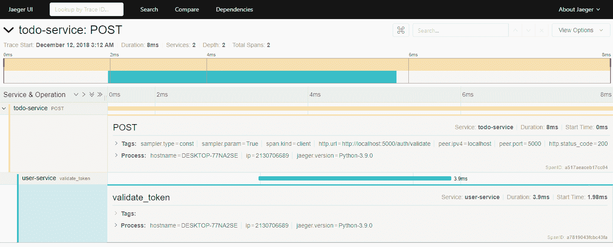

# 微服务中的测试和跟踪

到目前为止，我们已经看到了微服务如何帮助我们改变构建和交付应用程序到生产环境的方式。无论是更快地推出新功能，还是保持团队的小规模，微服务都能为我们实现这一点。但是在这种架构中，每个组件都是自己的小服务，我们有一些挑战需要解决。这些挑战涉及我们如何在遵循微服务方法的同时将稳定且无错误的应用程序部署到生产环境中。

在单体架构中，我们只有少量需要测试的移动组件。我们可以编写单元测试来测试单体应用程序的各个方法，然后进行集成测试以验证这些组件是否与彼此正确运行。但是现在，随着微服务的出现，图片中有越来越多的移动组件。在微服务内，我们有不同的功能，其中每个功能都被描述为自己的微服务。

在本章的过程中，我们将看看微服务的测试与单体应用程序的测试有何不同，我们现在不仅需要考虑单个微服务的正确功能，还需要确保这些服务以明确定义的方式相互通信，以满足业务需求的正确结果。

此外，由于基于微服务的应用程序中的信息从一个服务流向另一个服务，我们需要了解当客户端发出请求时到生成响应时这些信息的流动。通过这样做，我们可以准确地找到并修复可能导致不正确响应或导致应用程序性能瓶颈的任何问题。

作为读者，在本章结束时，您可以期望了解以下内容：

+   单体应用程序和基于微服务的应用程序的测试之间的差异

+   微服务测试的方法

+   在微服务内实施分布式跟踪

# 技术要求

本书中的代码清单可以在[`github.com/PacktPublishing/Hands-On-Enterprise-Application-Development-with-Python`](https://github.com/PacktPublishing/Hands-On-Enterprise-Application-Development-with-Python)的`chapter12`目录下找到。

可以通过运行以下命令克隆代码示例：

```py
git clone https://github.com/PacktPublishing/Hands-On-Enterprise-Application-Development-with-Python
```

可以通过在终端上执行以下命令来安装基于 Python 的应用程序的要求：

```py
pip install -r requirements.txt
```

除了通常的基于 Python 的要求之外，本章中的代码示例需要具有以下附加依赖项才能正常工作：

+   **Docker**：需要 docker 客户端来运行我们将在其中使用的一些工具...

# 微服务世界中的测试

随着我们远离单体架构，我们需要了解在单体应用程序开发中为我们工作的过程也需要跟随。在开发单体应用程序期间，我们通常使用单元测试等测试策略，旨在覆盖应用程序内部各个方法的功能，然后进行集成测试，用于覆盖这些方法是否与彼此正确运行的事实。

在微服务架构中，情况变得有点复杂。现在我们有了小型服务，每个服务都应该执行特定的功能。这些服务确实需要通过网络相互交互，以产生任何可能存在的业务用例的有意义输出。但事情并不会在这里结束。每个微服务都由多个需要正确工作的个体方法和接口组成。这使得测试微服务的情况变得有趣，因为现在我们不仅需要对微服务的各个组件和它们之间的交互进行单元测试，还需要测试微服务是否能够正确地相互操作。

这需要对应用程序进行更详尽的测试，使用多种不同的技术。让我们看看这些技术，以便更好地理解它们。

# 微服务中的单元测试

微服务内的单元测试遵循与单体应用程序测试相同的原则。我们致力于为微服务内的各个方法编写单元测试，并手动或通过自动化运行这些测试，以验证这些组件是否产生了预期的结果。

# 微服务中的功能测试

一旦我们确定微服务内部的各个方法正常工作，我们需要确保微服务在完全独立的情况下能够在没有任何问题的情况下运行。这是因为大多数微服务本身就是一个完整的包。它们具有自己的一套依赖项，以及可以管理其数据的数据源。

作为开发人员，重要的是确保微服务能够与其依赖项正确交互。为此，我们致力于实现微服务的功能测试。

此外，在功能测试期间，我们需要注意一些事情。由于微服务内的每个 API 端点可能需要与其他微服务交互以产生正确的结果，我们可能需要模拟某些微服务的存在，以便功能测试能够成功完成。

# 微服务中的集成测试

一旦我们确定我们的微服务与其依赖项正确工作，就是时候确保它们在相互交互时也具有相同的复选框。这是重要的，因为这些服务无论如何都需要相互交互，以产生任何有意义的业务结果。

在集成测试期间，我们通常旨在通过向 API 端点引入正确和不正确的参数来测试请求-响应周期，以验证微服务能够处理两种用例并且不会失败。这确保了两个外部服务之间的通信接口足够健壮，能够处理各种输入...

# 微服务中的端到端测试

一旦我们确保不同的微服务能够无缝地相互操作以产生有意义的结果，就是时候验证整个系统，包括不同的微服务及其依赖项，是否能够在没有任何问题的情况下工作。这种测试旨在覆盖整个系统的请求-响应周期，验证中间阶段产生的输出以及最终阶段。这被称为端到端测试。

这种测试确保整个系统以明确定义的方式运行，并且在向系统提供超出系统域的输入时不会产生任何意外。

# 可扩展性测试

基础设施中的每个微服务都是为处理一定的请求而设计的。随着对应用程序的请求数量增加，一些微服务可能会比其他服务承受更大的负载。

想象一下，有一个基于微服务架构的电子商务网站。正在进行限时抢购，很多顾客同时尝试结账和付款。如果处理顾客结账和付款的服务在负载增加时没有扩展，顾客可能会面临增加的响应时间或超时，给电子商务公司带来混乱，其客户服务现在可能正忙于处理...

# 微服务测试中的挑战

当涉及测试时，微服务架构提出了一些挑战。这些挑战有时是架构的副作用，测试策略不佳，或者对微服务架构的经验不足。以下是使微服务测试成为复杂过程的一些挑战：

+   **对微服务的知识不完整**：对于基于微服务架构构建的应用程序的集成测试和调试问题，负责编写应用程序测试的测试人员需要完全了解基础设施和各个微服务。没有这些知识，测试人员无法编写能够覆盖应用程序中所有可能的请求流程的测试，这可能导致一些错误在测试阶段逃脱。

+   **协调不足**：在开发微服务时，有多个团队拥有自己的一组微服务，并且通常以自己的节奏工作。这可能会导致协调问题，并且可能会延迟应用程序的测试，如果某个微服务，其上有某些依赖，仍然没有完成开发阶段。

+   **增加的复杂性**：对于只有少量微服务的应用程序，测试通常很容易。但随着支持应用程序的微服务数量的增加，这种测试变得越来越繁琐。这是因为现在测试人员需要为增加的请求流程编写测试，并确保不同的 API 端点按预期运行。

+   **高灵活性**：微服务允许增加灵活性。作为开发人员，我们可以自由选择技术栈来支持特定的微服务。同样，这也增加了应用程序测试的问题，因为现在测试需要考虑用于支持特定微服务的不同类型的组件。

上述观点是使测试微服务工作成为一项具有挑战性的任务的一些挑战。然而，每个问题都有解决方案，这些挑战也不例外。让我们看看我们有哪些可能的解决方法来克服这些挑战，如下所述：

+   **实施发布计划**：负责构建应用程序的团队可以承诺按里程碑发布应用程序的计划。在每个里程碑阶段，根据要部署的服务的优先级，一些服务将可用于测试。这有助于改善团队的协调。

+   **标准化 API 端点**：每个服务都需要公开一组用于接收请求和生成响应的 API。标准化 API 并定义特定 API 端点可能需要的参数在测试阶段非常有帮助，测试人员现在可以轻松地模拟一个服务，即使该服务尚未可用于测试。

+   **标准化开发实践**：尽管负责开发特定微服务的每个团队都可以自由选择用于开发微服务的任何一组工具，但通常最好将团队可能使用的一组工具和技术标准化，以避免基础设施内部的不必要复杂性。

+   **集成 DevOps 实践**：随着微服务架构的转变，应该采用 DevOps 实践，旨在使团队对其正在开发的微服务的完整生命周期负责。这不仅有助于加快开发过程，还允许在部署到生产环境之前对微服务进行彻底测试。

现在，我们知道了测试微服务架构所需的变化。这使我们能够提前规划我们的策略，并确保服务在部署到生产环境之前经过了充分测试。

在测试知识的基础上，现在是时候了解微服务领域中一个非常重要的概念，它让我们能够了解个别服务在生产环境中的行为。这也让我们能够找出基于微服务的应用程序中特定请求失败的确切位置。因此，让我们深入了解这个概念。

# 微服务内部的请求追踪

在任何应用程序内，一个请求可能在生成请求的最终响应之前流经多个组件。所有这些组件可能会在将请求交给另一个组件之前进行一些处理，这些处理可能在进程之前是必需的。

请求追踪使我们能够可视化关于特定请求流的丰富细节。有了对请求流的完整了解，我们现在可以着手查找可能导致请求-响应周期性能瓶颈的地方，或者找出可能导致生成不正确结果的组件。

今天，在应用程序开发世界中，任何严肃的应用程序...

# OpenTracing 标准

目前，市面上有许多解决方案提供了实现应用程序追踪功能。其中一些解决方案是专有的，而另一些是开源的。

作为开发人员，您可以根据应用程序的要求和所选择解决方案提供的功能自由选择任何解决方案。但问题是，如果您想要切换到不同的追踪解决方案，因为该解决方案提供了更好的功能和更多对环境的控制，会发生什么？现在您陷入困境，因为您可能需要更改基础设施和应用程序代码中的许多内容才能使新的追踪解决方案正常工作。这是很麻烦的。

OpenTracing 标准提供了一组通用的供应商中立 API 和仪器，用于在应用程序内实现分布式追踪。任何实现了这组标准 API 的追踪解决方案都与 OpenTracing 标准兼容，并且可以与遵循相同标准的其他工具进行互操作。

我们选择 Jaeger 作为演示应用程序的追踪工具，它也是符合 OpenTracing 标准的工具。现在，让我们不再浪费时间，在我们在上一章中构建的应用程序内实现追踪。

# 在待办事项管理器内实现追踪

在上一章中，我们致力于构建一个简单的应用程序，允许我们管理“待办事项”列表。现在是时候在这个应用程序内实现请求追踪了。作为第一个示例，我们将致力于在用户服务内实现请求追踪。

为了使追踪工作，我们需要满足一些要求。如果您遵循了本书的*技术要求*部分，您就可以开始使用本教程了。但在我们深入实施追踪之前，让我们看看我们将需要的以下组件：

+   **Jaeger 全一体图像：** Jaeger 全一体图像为我们提供了 Jaeger 服务器、代理和 UI...

# 分布式追踪

在微服务世界中，请求可能在生成最终响应之前从一个服务传输到另一个服务。即使是我们简单的`todo`列表管理应用程序的示例也展示了这种行为，`todo`管理器服务经常向用户服务发出请求以实现用户身份验证，并收集有关用户的详细信息，从而创建一个新的`todo`列表。

分布式追踪系统旨在在请求从一个微服务到另一个微服务的传输过程中实现追踪。

为了实现这一点，追踪系统利用了许多机制，其中最简单的机制是将唯一的追踪密钥嵌入到每个请求的 HTTP 标头中。然后，追踪系统能够通过读取 HTTP 标头中存在的请求标识符来区分和聚合特定请求，从而使请求从一个服务流向另一个服务。

现在，是时候让我们看看分布式追踪是如何运作的了。为此，我们将进行一些更改，以在我们的`todo`管理器服务内启用追踪。

以下代码片段展示了在`todo`管理器服务内启用分布式追踪所需的更改：

```py
from flask import Flask, request, jsonify
from flask_sqlalchemy import SQLAlchemy
from jaeger_client import Config
from flask_opentracing import FlaskTracer
from opentracing_instrumentation.client_hooks import install_all_patches
import datetime
import requests

app = Flask(__name__, instance_relative_config=True)
app.config.from_object('config')

def init_tracer():
    """Initialize the tracing system."""

    config = Config(
        config={ # usually read from some yaml config
            'enabled': True,
            'sampler': {
                'type': 'const',
                'param': 1,
            },
            'logging': True,
        },
        service_name='todo-service',
        validate=True,
    )
    return config.initialize_tracer()

install_all_patches()

flask_tracer = FlaskTracer(init_tracer, True, app)
```

在`todo_service.py`文件中放置了上述代码后，我们已经启用了分布式追踪。但在看到它实际运行之前，有一些事情我们需要看一看。在上述代码片段中，我们从`opentracing_instrumentation`库中导入了一个额外的方法`install_all_patches()`，如下所示：

```py
from opentracing_instrumentation.client_hooks import install_all_patches
```

这个方法负责启用在 SQL 库内或通过`python_requests`库进行的操作的追踪。

一旦这个库与`jaeger_client`和`flask_opentracing`一起导入，我们就继续配置和启用应用程序内的追踪，这是在`init_tracer`方法中完成的。

现在，追踪已配置好，让我们重新启动应用程序，然后通过向 API 端点传递适当的参数，向`http://localhost:5001/list/new`发出请求，以创建一个新的`todo`列表。

一旦这个操作成功，我们可以转到运行在`http://localhost:16686`上的 Jaeger UI，查看 Jaeger UI 显示我们刚刚进行的 API 调用的追踪。以下截图显示了屏幕可能的样子：



从上述截图中可以看出，Jaeger UI 不仅显示了 todo 管理器 API 服务端点的请求跟踪，还进一步显示了在用户服务内调用的端点，并提供了在响应返回给客户端应用程序之前在每个 API 端点上花费了多少时间的详细信息。

有了这个，我们现在知道了微服务内部的分布式跟踪是什么样子的。但是有哪些可能的用例可以从这种追踪中受益呢？让我们找出来。

# 分布式追踪的好处

在基于微服务架构的应用程序中实施分布式追踪后，我们已经能够处理许多用例，例如以下用例：

+   **理解应用程序的流程：** 通过分布式追踪，我们现在可以可视化客户端发来的请求在我们的应用程序内从一个服务到另一个服务的流动。这种信息对于弄清楚应用程序的工作原理并实现更好的应用程序测试非常有用。

+   **缩小错误范围**：通过了解请求是如何从一个服务传递到另一个服务的，我们可以通过分析每个步骤来快速确定可能导致请求产生错误响应的服务...

# 总结

在本章的过程中，我们了解了向微服务架构的转变如何影响应用程序开发生命周期内的流程。我们了解了微服务应用程序内的测试与单体应用程序的测试有何不同，以及在处理微服务架构时通常需要哪些测试阶段。然后，我们了解了在测试阶段出现的挑战，由于向微服务架构的转变，以及我们如何克服这些挑战。

本章的第二部分带领我们深入了解应用程序内的分布式跟踪，我们进行了实际操作，使我们能够跟踪我们在上一章中开发的 ToDo 管理器应用程序中的请求流程。在此过程中，我们了解了跟踪的工作原理，以及分布式跟踪与常规跟踪方法的区别。我们还了解了 OpenTracing 标准如何帮助提供一个供应商中立的 API，以实现微服务应用程序内的分布式跟踪。

现在，有了所有这些知识，让我们继续来看一下另一种开发企业应用程序的方法，其中我们不是构建服务或组件，而是构建在发生某个事件时执行的函数。下一章将带领我们了解这种无服务器的应用程序开发方法。

# 问题

+   我们如何为微服务编写集成测试？

+   跟踪单体应用程序与跟踪基于微服务的应用程序有何不同？

+   除了 Jaeger 之外，还有哪些工具可用于实现分布式跟踪？

+   我们如何使用 Jaeger 对代码的特定部分进行仪器化？
