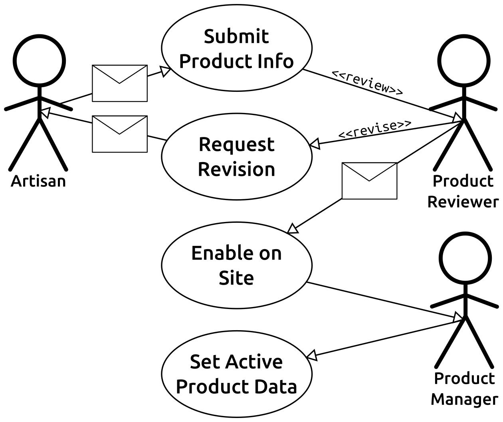
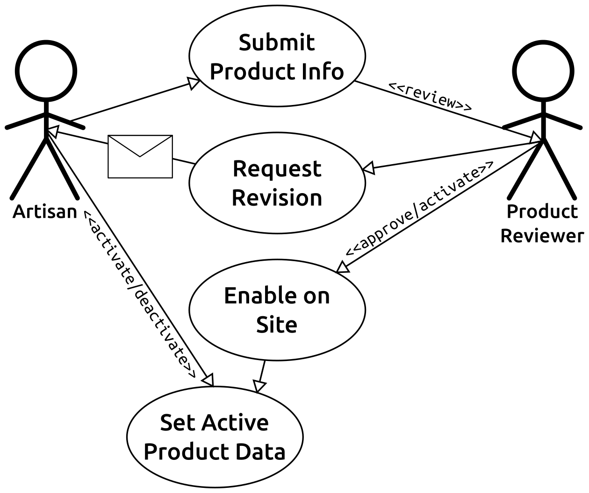
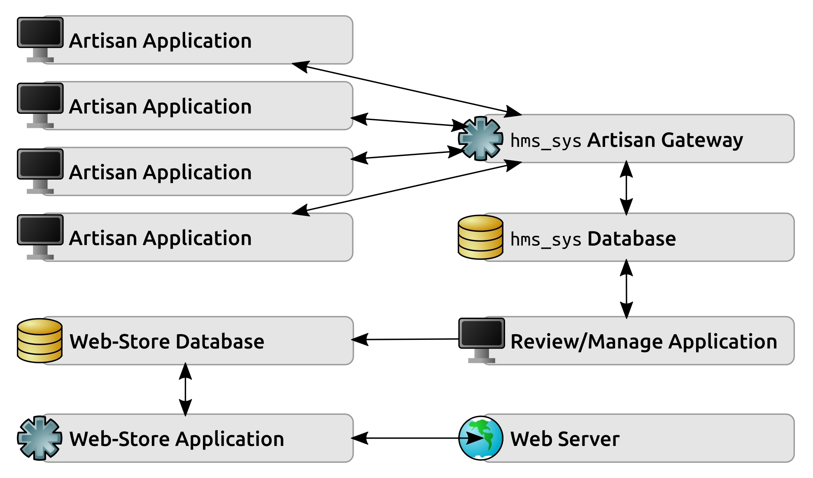

# hms_sys 系统项目

接下来的几章将重点介绍一个虚构公司*手工制品*的项目，该公司专门连接消费者和创造并销售各种独特手工制品的工匠。这些产品涵盖了各种材料和用途，包括家具、工艺品和珠宝首饰，如用于服装的珠子和小零件。基本上，只要有人愿意制作，另一个人愿意购买的任何东西。

# 系统的目标

*手工制品*（HMS）现在正在寻找一种简化业务流程的方法，以便允许工匠通过主网站提供其商品。目前，当工匠制作出他们愿意出售的商品时，他们会向*HMS*中央办公室的某人发送电子邮件，如果是新产品，则附上一张或多张照片，有时如果是以前提供的产品的新版本或套装，则附上新照片。*HMS*中央办公室的某人将相关信息复制到他们的网络系统中，并进行一些基本设置以使商品可用。然后，一旦消费者决定要订购工匠制作的商品，订单将通过另一个涉及*HMS*中央办公室向工匠发送订单信息的手动流程进行处理。

所有这些手动流程都很耗时，有时容易出错。偶尔会出现这样的情况，处理信息以使第一个订单开始运转的时间太长，以至于有多个客户尝试购买同一件商品：

*手工制品*的网站采用的是一个不易修改的现成系统。它确实有一个 API，但该 API 设计用于内部访问流程，因此存在安全问题，不便于通过新的 Web 应用程序开发允许工匠连接到它。

这家虚构公司的业务可能并不是非常现实。它确实感觉不像实际上能够与 Etsy 或（也许）craigslist 或 eBay 等现有企业竞争。即便如此，该系统的实施概念在某种程度上是合理的，因为它们是需要在几个真实问题领域中实施的任务的变体。它们只是以一种不寻常的方式结合在一起。

由于以下章节旨在代表单独的开发迭代，在至少在某种程度上类似于看板方法的过程中，有一些值得注意的开发前流程的产物，这些值得注意的产物在进入这些迭代/章节之前是值得注意的。

# 开发开始前已知/设计的内容

新系统的主要目标是简化并（尽可能）自动化现有流程，以将工匠的产品放入在线目录中。具体包括：

+   **工匠**应该能够提交产品信息，而无需经过基于电子邮件的流程。作为这一变化的一部分：

+   将执行一些数据输入控制，以防止简单的错误（缺失或无效数据）。

+   工匠将能够修改其产品数据，但有一些限制，并且在这些修订生效之前仍需要进行审核。但至少，他们将能够停用实时产品列表，并激活已停用的现有商品。

+   **产品评审员**将能够直接进行修订（至少对于简单的更改），并将商品退回进行重大修订。这一部分的流程定义不够明确，可能需要在开发周期后期进一步详细和定义。

+   **产品经理**的数据输入任务将大大减少，至少就设置新产品而言。新系统将处理大部分或全部任务。

新流程的用例图如下，然后，在进行任何详细设计之前：

打算为每个工匠提供一个可安装的应用程序，使他们能够与*HMS*总部进行交互。该本地应用程序将连接到一个工匠网关，该网关将处理工匠与总部的通信，并将工匠的传入数据存储为一种暂存区，以便待批准的任何内容。从那里，**评审员**（和/或**产品经理**）应用程序将允许**产品评审员**和经理将工匠提供的产品移入主网店，使用其本机 API。在这一点上，逻辑架构和一些粗略的进程间通信流程如下所示：

在这些图表和之前提到的初始概念之间，已经捕捉到了许多具体的用户需求。在开发过程中可能会出现更多需求，或者至少在开发计划（迭代故事）制定过程中会出现更多需求。

工匠及其产品背后的实际数据结构尚不清楚，只知道产品是可以由一个且仅一个工匠拥有的独特元素。需要更多细节来实现这些，以及确定数据移动到何处（以及何时），但它们之间的关系已经可以绘制成图：

关于这些元素内部数据结构的当前缺乏信息也使得任何类型的 UI 设计规范变得困难，甚至是不可能的。同样，要确定任何不是已经隐含在用例和逻辑架构/数据流图中的业务规则也将是困难的。在能够识别出更多有用信息之前，这些也需要更多细节。

还有一些其他各种项目可以从这些信息中推断出，并分为以下几个开发前步骤之一：

+   **风险**：

+   **评审/管理应用程序**与**网店数据库**之间的连接是单向的，这可能表明需要仔细控制数据流。实际上，可能至少需要应用程序能够从数据库中读取数据，这样就可以找到并修改现有产品，而不是一遍又一遍地创建新的产品条目。

+   用例图显示，工匠可以激活或停用产品而不涉及**产品评审员**，但架构和流程没有明显的方法来处理该功能。至少应对从工匠网关到**网店数据库**的连接进行检查，但这是可以在相关开发迭代期间进行的事情。由于网店系统具有 API，可能可以通过从**工匠** **网关**向**网店应用程序**发出 API 调用来管理该过程，但尚未进行评估。

+   **项目管理规划数据**：

+   如果项目已经进入开发阶段，那么很可能所有的可行性、成本分析和其他业务层面的审查都已经完成并获得批准。虽然可能不需要这些结果中的具体信息，但知道如果出现问题，它们可能是可用的是一件好事。

# 迭代章节将是什么样子

为了展示在敏捷过程下开发系统的样子，`hms_sys`的开发将分解为几个迭代。每个迭代都有一个单一的高层目标，涵盖一个或多个章节，并涉及一组共同的故事。在第四章中讨论的敏捷方法中，这些章节更接近于 Kanban 方法，因为每个迭代中完成的故事数量和总大小在不同迭代之间有显着变化。在 Scrum 环境中，这些迭代将受到时间限制，分解为时间限制的块 - 也就是说，每个迭代都计划持续一段特定的时间。以下章节及其对应的迭代目标是以目标为导向的，每个目标旨在实现系统功能的某个里程碑。在这方面，它们也接近于遵循**特征驱动开发**模型。

每个迭代都将解决相同的五个项目：

+   迭代目标

+   故事和任务的组装：

+   来自 SDLC 模型的需求分析和定义活动，如/如果需要

+   系统架构和设计活动，也来自 SDLC 模型，如/如果需要

+   编写和测试代码。

+   系统集成、测试和验收。

+   开发后的考虑和影响：

+   实施/安装/分发

+   运营/使用和维护

+   停用

# 迭代目标和故事

每个迭代将有一个非常具体且相对集中的一组目标，建立在以前迭代的成就之上，直到最终系统完成。按顺序，每个迭代的目标是：

+   **开发基础**：建立项目和流程。每个功能迭代在完成时都需要可测试、可构建和可部署，因此在系统项目的早期需要注意确保在开发进展中有一种共同的基础来构建这些功能。

+   **业务对象基础**：定义和开发业务对象数据结构和功能。

+   **业务对象数据持久性**：确保可以根据需要存储和检索使用的各种业务对象。

+   **服务基础**：构建主办公室和工匠服务的基本功能，这将成为整个系统通信和数据交换过程的支柱。

+   **服务通信**：定义、详细说明和实施系统各组件之间的实际通信过程，特别是服务层的实现。

每个迭代都有可能令人惊讶地需要进行大量的设计和实现级别的决策，并且有很多机会在各种功能、概念和实现场景中运用各种软件工程原则。

每个迭代的努力将被记录在一组用户故事中，这些故事在审查 Scrum 和 Kanban 方法时描述了类型。每个迭代的完成标准将包括完成或至少解决与之相关的所有故事。有些故事可能需要推迟到以后的迭代，以适应功能依赖关系，例如，在这种情况下，可能无法在系统开发的较晚阶段完成这些故事的实现。

# 编写和测试代码

一旦所有故事都被详细定义以允许开发，代码本身将被编写，既用于与每个故事相关的实际功能，也用于该代码的自动化测试 - 具有内置回归测试功能的单元测试。如果可能和实际，还将编写集成和系统测试代码，以便从这些角度提供相同的自动化、可重复的新代码测试。每个迭代的最终目标将是一个可部署和功能的代码库，经过测试（并且可以按需重新测试）。在早期迭代期间可能不完整甚至无法使用，但在提供的功能方面将是稳定和可预测的。

这一过程的大部分内容将构成接下来几章的主要内容。毕竟，编写代码是开发的关键方面。

# 开发后的考虑和影响

`hms_sys`的运营/使用、维护和停用阶段将在开发完成后进行深入讨论，但在开发过程中，将努力预测与系统生命周期相关的特定需求。在这些努力中可能会编写代码来解决系统活跃生命周期中的问题，但任何在这些努力中出现的预期需求，至少可以作为开发工作的一部分写成一些文档，供系统管理员使用。

# 总结

`hms_sys`的预开发和高层概念设计项目相当直接，至少在预开发规划周期结束时可用的细节水平上是这样。一旦为各个迭代功能的用户故事详细阐述，更多细节将浮出水面，还有一系列问题和实施决策和细节。然而，首先会发生一个迭代。

如暗示的那样，第一个迭代更关注工具、流程和实践的定义，这些将在最终系统的真正开发过程中发挥作用。很可能大部分决策和设置已经由开发团队和团队管理者决定。即便如此，值得看一些决策和决策标准，这些决策和标准对开发过程中的工作效果有重大影响。
