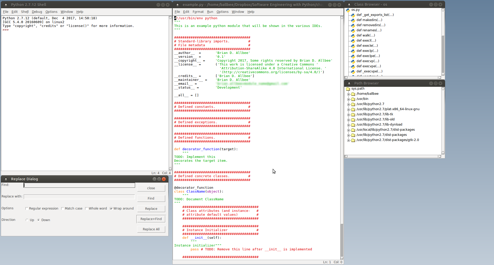
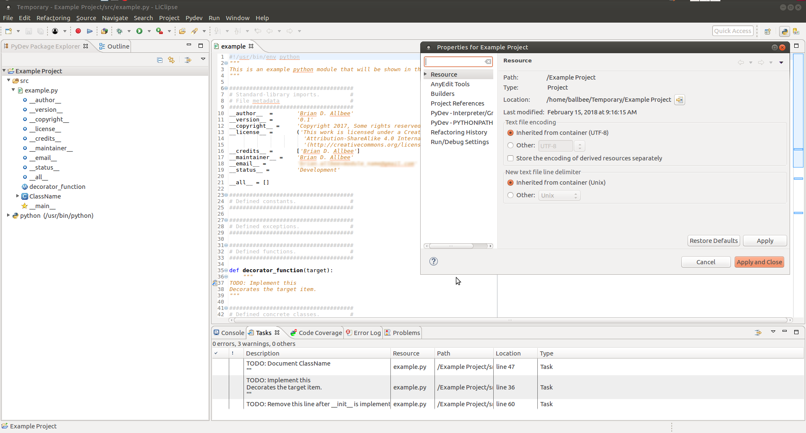
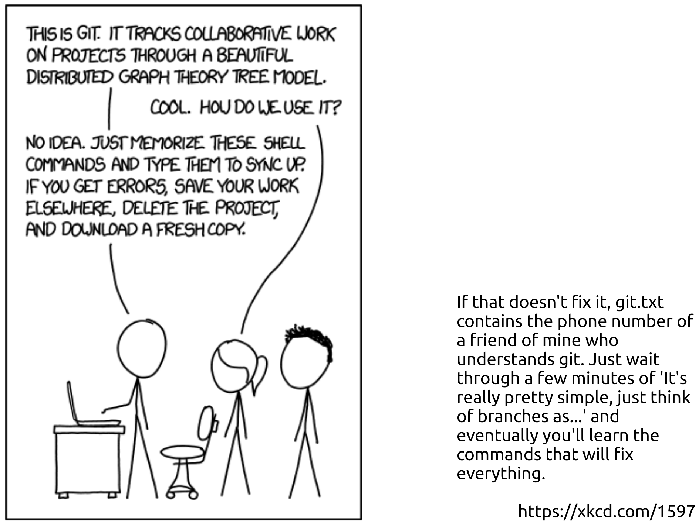
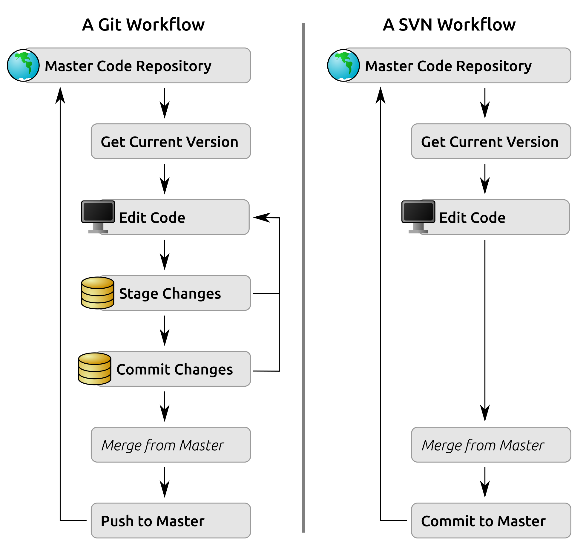
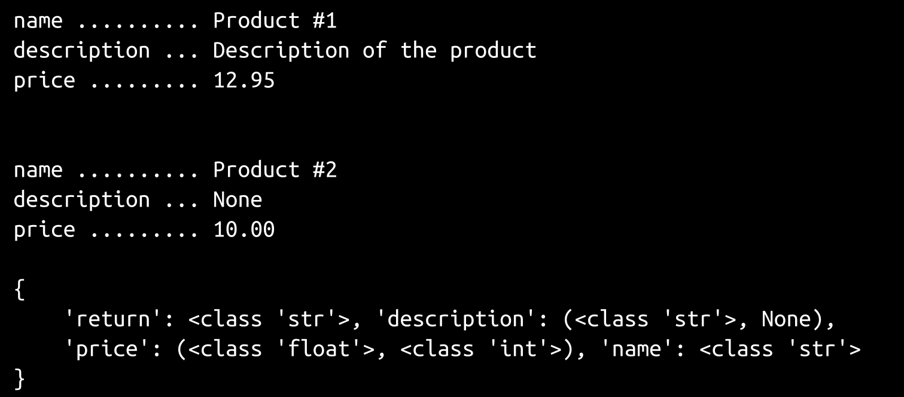
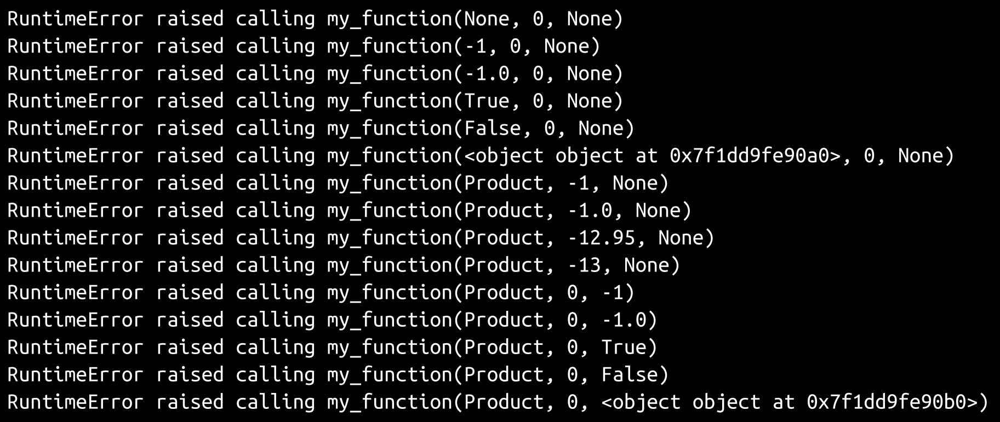
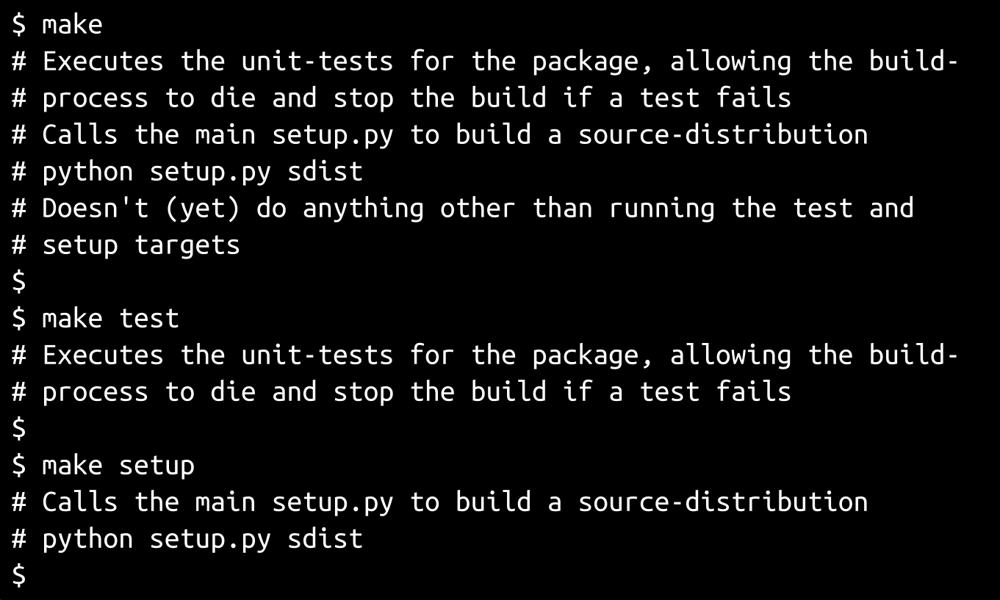
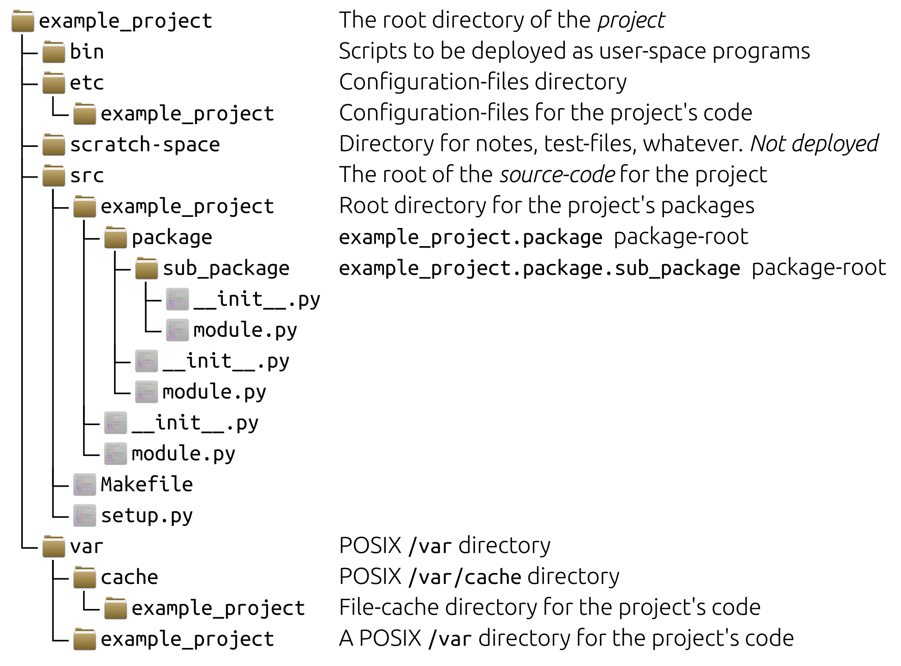
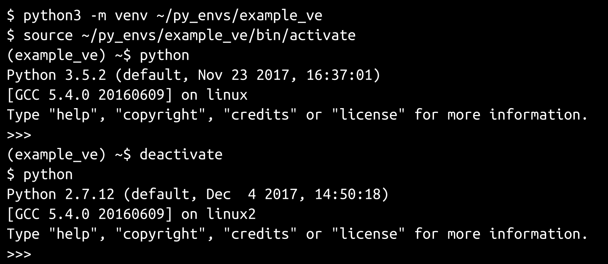
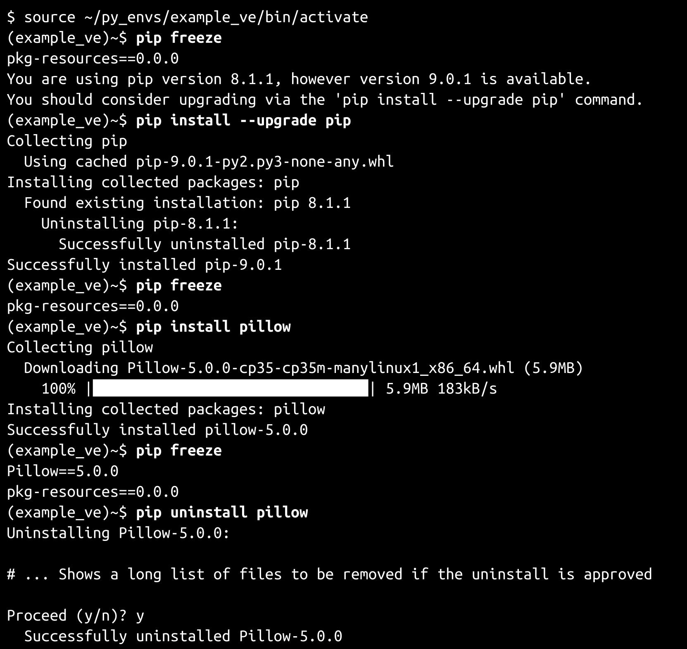

# 开发工具和最佳实践

在实际开发`hms_sys`之前，需要做出几项决定。在现实世界的情况下，一些（也许全部）这些决定可能是由开发团队或者团队上面的管理层在政策层面上做出的。有些决定，比如 IDE/代码编辑器程序，可能是每个团队成员个人的决定；只要不同开发人员的选择之间没有冲突，或者由此引起的任何问题，那就没有问题。另一方面，保持一些一致性也不是坏事；这样，每个团队成员在处理其他团队成员触及的代码时都知道可以期待什么。

这些选择可以分为两大类：开发工具的选择和最佳实践（和标准）的运用，具体包括以下内容：

+   集成开发环境选项

+   源代码控制管理选项

+   代码和开发流程标准，包括将 Python 代码组织成包

+   设置和使用 Python 虚拟环境

# 开发工具

需要考虑的两个最重要的工具导向决策，毫不奇怪地围绕着通过开发生命周期创建、编辑和管理代码。

# 集成开发环境（IDE）选项

在不使用完整的**集成开发环境**（**IDE**）的情况下编写和编辑代码是完全可能的。最终，任何能够读取和写入任意类型或带有任意文件扩展名的文本文件的东西在技术上都是可用的。然而，许多 IDE 提供额外的、面向开发的功能，可以节省时间和精力——有时甚至可以节省大量的时间和精力。一般来说，权衡是，任何给定的 IDE 提供的功能和功能越多，它就越不轻量级，也就越复杂。找到一个所有开发团队成员都能同意的 IDE 可能是困难的，甚至痛苦，大多数 IDE 都有缺点，可能没有一个单一、明显的正确选择。这是非常主观的。

在查看代码编辑和管理工具时，只有真正的 IDE 将被考虑。正如前面所述，文本编辑器可以用来编写代码，市面上有很多识别各种语言格式的文本编辑器，包括 Python。然而，无论它们有多好（有些确实非常好），如果它们没有提供以下至少一项功能能力，它们将不被考虑。这只是一个时间问题，直到列表中的某个功能是必需的，但却不可用，至少这种可能性会分散注意力，最坏的情况下，可能会成为一个关键问题（尽管这似乎不太可能）。功能集的标准如下：

+   **大型项目支持**：在讨论的目的上，大型项目涉及开发两个或更多个不同的可安装的 Python 包，这些包具有不同的环境要求。一个例子可能包括一个`business_objects`类库，它被两个独立的包如`online_store`和`back_office`所使用，为不同的用户提供不同的功能。这种情况的最佳情况将包括以下内容：

+   支持不同的 Python 解释器（可能作为单独的虚拟环境）在不同的包项目中

+   具有和管理项目间引用的能力（在这个例子中，`online_store` 和 `back_office` 包将能够对 `business_objects` 库有有用的引用）

+   不太重要，但仍然非常有用的是，能够同时打开和编辑多个项目，这样当一个包项目的更改需要在另一个包项目中进行相应的更改时，开发人员几乎不需要进行上下文的变化

+   **重构支持**：在足够长的时间内，不改变系统行为的情况下对系统代码进行更改是不可避免的。这是重构的教科书定义。重构工作通常需要至少能够在多个文件中查找和替换实体名称，可能还涉及多个库。在更复杂的范围内，重构可能包括创建新的类或类的成员，将功能移动到代码的不同位置，同时保持代码的接口。

+   **语言探索**：检查项目使用但不是项目一部分的代码是有帮助的，至少偶尔是。这比听起来更有用，除非你很幸运拥有完美的记忆，因此从不必查找函数签名，模块成员等。

+   **代码执行**：在开发过程中实际运行正在处理的代码是非常有帮助的。不得不从编辑器退出到终端以运行代码，测试对其进行更改，这是一种上下文的改变，至少是乏味的，而在适当的情况下，实际上可能会对过程产生破坏性影响。

这些项目将按照以下标准进行评分，从好到坏：

+   极好

+   很棒

+   好

+   公平

+   一般

+   差

+   糟糕

这些是作者的观点，显然，所以要以适当的心态对待。你对这些任何或所有的个人观点，或者你对它们的需求，可能会有很大不同。

许多 IDE 具有各种花里胡哨的功能，可以在编写或管理代码的过程中帮助，但并非真正关键。这些功能的例子包括以下内容：

+   从某个地方导航到代码实体的定义位置

+   代码完成和自动建议，允许开发人员根据他们开始输入的实体名称的前几个字符，快速轻松地从列表中选择实体

+   代码颜色和呈现，提供了一个易于理解的视觉指示，给出了代码块的内容 - 注释，类，函数和变量名称等

这些也将按照相同的标准进行评分，但由于它们不是关键功能，因此仅作为额外信息项呈现。

所有以下 IDE 都适用于所有主要操作系统 - Windows，Macintosh 和 Linux（可能还包括大多数 UNIX 系统），因此，评估开发工具包的 IDE 部分的重要标准在这三个中都是无效的。

# IDLE

IDLE 是一个简单的 IDE，用 Python 编写，使用`Tkinter` GUI，这意味着它应该可以在 Python 可以运行的任何地方运行。它通常是默认 Python 安装的一部分，但即使默认情况下没有包含，也很容易安装，不需要外部依赖或其他语言运行环境。

+   **大型项目支持**：差

+   **重构支持**：差

+   **语言探索**：好

+   **代码执行**：好

+   **花里胡哨**：公平

IDLE 默认情况下不提供任何项目管理工具，尽管可能有提供部分功能的插件。即使有插件可用，也可能需要每个文件都在单独的窗口中打开，这样在多个文件之间工作最终会变得乏味，甚至可能变得不切实际，甚至可能根本不可能。

尽管 IDLE 的搜索和替换功能包括一个不错的功能 - 基于正则表达式的搜索 - 但就重构目的而言，这就是有意义或有用的功能。任何重大的重构工作，甚至是广泛但范围较小的更改，都需要相对高程度的手动工作。

IDLE 真正闪亮的地方在于它能够深入挖掘系统中可用的包和模块。它提供了一个类浏览器，允许直接探索 Python 路径中的任何可导入命名空间，以及一个路径浏览器，允许探索所有可用的命名空间。这些唯一的缺点是缺乏搜索功能，以及每个类浏览器都必须驻留在单独的窗口中。如果这些不是问题，那么给予一个很高的评价似乎也不过分。

IDLE 允许通过按下一个键来执行任何打开的文件，执行的结果/输出显示在一个单独的 Python shell 窗口中。没有提供传递参数给这些执行的功能，但这可能只有在项目涉及接受参数的命令行程序时才是一个问题。IDLE 还提供了一个语法检查，识别代码中检测到的第一个语法问题，这可能有些用处。

IDLE 可靠的功能之一是代码的着色。有一些扩展可以提供诸如自动完成和一些代码编写辅助功能（例如自动生成闭合括号），但似乎没有一个是功能性的。

以下是 IDLE 的屏幕截图，显示了控制台，代码编辑窗口，类和路径浏览器窗口，以及搜索和替换窗口：



IDLE 可能是小型代码项目的合理选择 - 任何不需要打开的文件比用户在其各自窗口中显示的更多的东西。它很轻量级，具有相当稳定（偶尔古怪）的 GUI。但对于涉及多个可分发包的项目来说，它并不适合。

# Geany

**Geany**是一个轻量级的代码编辑器和集成开发环境，支持多种语言，包括 Python。它作为一个可安装的应用程序在所有主要操作系统上都可用，尽管在 Windows 上有一些功能是不可用的。Geany 可以从[www.geany.org](http://www.geany.org/)免费下载：

+   **大型项目支持**：一般

+   **重构支持**：一般

+   **语言探索**：一般

+   **代码执行**：好

+   **花里胡哨**：好

这是 Geany 的屏幕截图，显示了几个项目插件的侧边栏，一个打开的代码文件，项目设置以及搜索和替换窗口：


Geany 的界面使得同时打开多个文件变得更加容易，而在 IDLE 中进行相同的任务将会更加困难；每个打开的文件都位于 UI 中的一个标签中，使得多文件编辑变得更加容易处理。即使在其最基本的安装配置中，它也支持基本的项目结构，并且有一些不同的面向项目的插件，可以更轻松/更好地管理和查看项目的文件。通常，对于大型项目的支持，它缺少实际上可以同时打开多个项目的能力，尽管支持跨不同项目源树打开多个文件。通过一些仔细的规划，并且审慎配置各个项目的设置，可以管理不同的执行要求，甚至是一组相关项目中特定的**Python 虚拟环境**，尽管需要一些纪律来保持这些环境的隔离和高效。正如屏幕截图所示，Geany 还提供了项目级别的编译和构建/制作命令设置，这可能非常方便。

Geany 的重构支持略优于 IDLE，主要是因为它具有多文件搜索和替换功能。没有针对重构操作的开箱即用支持，例如在整个项目或项目集中重命名 Python 模块文件，因此这是一个完全手动的过程，但是通过一些小心（再次，纪律）甚至这些操作也不难正确管理，尽管可能会很乏味和/或耗时。

Geany 的语言探索能力看起来似乎不应该获得如此高的评分，就像给出的*平庸*一样。除了实际打开与给定项目相关联的每个 Python 命名空间之外，这至少可以允许在符号面板中探索这些包之外，实际上并没有太多显而易见的支持来深入了解底层语言。Geany 在这里的救赎是非常强大的自动完成功能。一旦输入了可识别语言元素的前四个字符 - 无论该元素是项目中打开文件的一部分还是导入模块的一部分 - 所有与当前输入文本匹配的元素名称都会显示并可选择，如果所选项目是函数或方法，则为该项目提供的代码提示包括该项目的参数签名。

Geany 的代码执行能力相当不错 - 在某些方面略优于 IDLE，尽管在足够的程度或足够的领域内，这并不足以获得更高的评分。通过在项目设置的早期关注需求和细节，可以配置特定项目的执行设置以使用特定的 Python 解释器，例如作为特定虚拟环境的一部分，并允许从其他项目的虚拟环境安装和代码库中导入。不利的一面是这样做需要一定程度的规划，并且在管理相关虚拟环境时引入了额外的复杂性。

Geany 的开箱即用功能与 IDLE 提供的功能相当，但有一个重大改进；有许多常见和有用任务和需求的即用插件。

# Eclipse 变体+ PyDev

由 Eclipse 基金会（[www.eclipse.org](http://www.eclipse.org/)）管理的 Eclipse 平台旨在为任何语言和开发重点提供强大，可定制和功能齐全的 IDE。这是一个开源项目，并且至少产生了两个不同的子变体（专注于 Web 开发的 Aptana Studio 和专注于 Python 开发的 LiClipse）。

这里将使用 LiClipse 安装作为比较的基础，因为它不需要特定于语言的设置即可开始编写 Python 代码，但也值得注意的是，任何具有相同插件和扩展（PyDev 用于 Python 语言支持，EGit 用于 Git 支持）的 Eclipse 衍生安装都将提供相同的功能。总之，Eclipse 可能并不适合所有人。它可能是一个非常沉重的 IDE，特别是如果它为多种语言提供支持，并且可能具有显着的操作占用内存和 CPU 使用率 - 即使其支持的语言和功能集是相当受控制的：

+   **大型项目支持**：很好

+   **重构支持**：好

+   **语言探索**：一般

+   **代码执行**：好

+   **铃铛和口哨**：好

这是 LiClipse 的屏幕截图，显示了打开的代码文件的代码大纲视图，项目属性以及从打开的代码文件中的 TODO 注释自动生成的任务列表：



Eclipse 对大型 Python 项目的支持非常好：

+   可以定义多个项目并同时进行修改

+   每个项目都可以有自己独特的 Python 解释器，这可以是项目特定的虚拟环境，允许每个项目基础上具有不同的包要求，同时还允许执行

+   可以设置项目以使用其他项目作为依赖项的项目引用设置，并且代码执行将考虑这些依赖项；也就是说，如果在设置了不同项目作为引用/依赖项的项目中运行代码，第一个项目仍将可以访问第二个项目的代码和已安装的包。

所有基于 Eclipse 的 IDE 的重构支持也相当不错，提供了对代码元素重命名，包括模块，提取变量和方法以及生成属性和其他代码结构的过程。可能还有其他重构功能是上下文相关的，因此乍一看并不明显。

一旦将 Python 环境与项目关联起来，该环境的结构就完全可以在项目的 UI 中使用。单独这样做可以通过相关环境进行包和功能的深入探索。不那么明显的是，单击已安装包的成员（例如，在[第五章](https://cdp.packtpub.com/hands_on_software_engineering_with_python/wp-admin/post.php?post=29&action=edit)的示例代码中的`urllib.request`，*hms_sys 系统项目*，或该模块提供的`urlopen`函数）将带开发人员转到项目安装中实际模块的实际成员（方法或属性）。

Eclipse 系列的 IDE 为 Python 代码提供了相当不错的执行能力，尽管需要一些时间来适应。任何模块或包文件都可以根据需要执行，并且将显示任何结果，无论是输出还是错误。对特定文件的执行还会生成一个内部运行配置，可以根据需要进行修改或删除。

Eclipse/PyDev 的铃铛和口哨在很大程度上与 Geany 和 IDLE 相当，提供了可用和可配置的代码和结构颜色，提供了自动建议和自动完成。LiClipse 特别提供的一个潜在重要项目是集成的 Git 客户端。LiClipse 的 Git 集成在克隆任何存储库之前就显示在这里：


# 其他

这些并不是 Python 开发的唯一可用的 IDE，也不一定是最好的。根据各种专业和半专业团体的投票，其他流行的选择包括：

+   **PyCharm**（社区版或专业版）：PyCharm 一直是 Python 开发中受欢迎的 IDE。其功能列表包括 Geany 和 Eclipse/PyDev 工具中已经注意到的大部分功能，还具有与 Git、Subversion 和 Mercurial 版本控制系统的开箱即用集成，以及专业版中用于与各种流行的 RDBMS（如 MySQL 和 SQL Server）一起使用的 UI 和工具。对于 Python Web 应用程序的开发来说，这可能是一个很好的首选，前提是其项目管理功能不会被代码库压倒。PyCharm 可以在[www.jetbrains.com/pycharm](http://www.jetbrains.com/pycharm)下载。

+   **Visual Studio Code**：VS Code 被誉为是一个闪电般快速的代码编辑器，并且通过大量的扩展提供了许多功能，适用于各种语言和目的。虽然它是支持 Python 的较新的 IDE 之一，但它正在迅速成为脚本任务的热门选择，并且在更大的面向应用程序的努力方面具有很大的潜力。Visual Studio 可以在[code.visualstudio.com](https://code.visualstudio.com/)下载。

+   **Ninja IDE**：根据其功能列表，Ninja 具有 Geany 提供的大部分基本功能，还增加了一个单一的内置项目管理子系统，听起来很有用和吸引人。Ninja IDE 可以在[ninja-ide.org](http://ninja-ide.org/)下载。

# 源代码管理

无论被描述为版本控制系统还是修订控制系统，**源代码管理**（**SCM**）或其他名称，更常见和更受欢迎的 SCM 提供了一系列功能和能力，使开发过程的某些方面更容易、更快或至少更稳定。这些包括以下内容：

+   允许多个开发人员在相同代码库的相同部分上合作，而无需过多担心彼此的工作被覆盖

+   跟踪代码库的所有版本，以及在每次提交新版本时谁做了什么更改

+   提供对每个新版本提交时所做更改的可见性

+   为特定目的维护相同代码库的不同版本，其中最常见的变化可能是为不同环境创建版本，代码更改在其中进行并通过推广，这可能包括：

+   本地开发环境

+   共享开发环境，所有开发人员的本地代码更改首先混合在一起

+   用于 QA 和更广泛的集成测试的共享测试服务器

+   **用户验收测试**服务器，使用真实的、类似生产的数据，可以用来向需要最终批准变更推广到现场环境或构建的人演示功能

+   具有完整生产数据副本访问权限的暂存环境，以便能够执行需要访问该数据集的负载和其他测试

+   现场环境/构建代码库

虽然这些系统在内部功能上至少有几种主要变化，但从开发人员的角度来看，只要它们按预期运行并且运行良好，这些功能上的差异可能并不重要。这些基本功能以及它们与各种手动努力的变体一起，允许以下操作：

+   开发人员可以回滚到先前版本的完整代码库，对其进行更改，并将其重新提交为新版本，这对于以下情况可能很有用：

+   查找并删除或修复提交后甚至推广后意外引起重大问题的更改

+   创建代码的新分支，以尝试其他方法来实现已提交的功能

+   多个具有不同专业领域专长的开发人员可以共同解决同一个问题和/或代码的部分，从而使他们能够更快地解决问题或编写代码。

+   具有较强架构背景或技能集的开发人员可以定义基本的代码结构（例如类及其成员），然后将其提交给其他人完全实现。

+   系统领域专家可以轻松审查代码库的更改，识别功能或性能风险，然后再将其推广到一个严苛的环境之前。

+   配置管理器可以访问和部署代码库的不同版本到它们的各种目标环境

可能还有许多其他更具体的应用程序，一个良好的 SCM 系统，特别是如果它与开发和代码推广流程有良好的联系，可以帮助管理。

# 典型的 SCM 活动

无论使用哪种 SCM 系统，也不管具体的命令变化，可能最常见的使用模式是以下操作序列：

+   获取给定代码库的版本：

+   通常，这将是最近的版本，可能来自特定的开发分支，但可以获取任何需要检索的分支或版本。无论如何，该过程将在本地文件系统的某个位置创建所请求的代码库的完整副本，准备进行编辑。

+   对本地代码副本进行更改。

+   在提交更改之前对任何差异进行对比：

+   这一步的目标是拉取对同一代码库所做的任何更改，并找到并解决本地更改与其他人可能在同一代码中所做的更改之间的任何冲突。一些当前的 SCM 允许在提交到共享存储库之前进行本地提交。在这些 SCM 中，这种对比可能在提交到共享存储库之前并不那么关键，但是在每次本地提交时这样做通常会将冲突的解决分解成更小、更易管理的部分。

+   提交到共享存储库：

+   一旦完成了这一步，所做的更改现在可以供其他开发人员检索（如果需要，还可以与之对比冲突）。

这种使用模式可能涵盖了大多数开发工作，即任何涉及在已建立的分支上工作，并且不需要新分支的工作。创建新分支也并不少见，特别是如果预计对现有代码库的大部分进行重大更改。对于不同环境可能会有嵌套分支的策略也并不少见，其中更深层的分支在被推广到更稳定的分支之前仍在等待某些审查或接受。

分支结构如下所示：


例如，从`[dev]`分支上升到`[test]`的代码推广过程被简化为向上合并，从较低的分支复制代码到较高的分支，然后如有必要，再从较高的分支分支回到较低的分支。

通常会为特定项目创建单独的分支，特别是如果有两个或更多正在进行的工作，可能会进行广泛和/或重大的更改，尤其是如果这些工作预计会相互冲突。项目特定的分支通常会从共享开发分支中获取，如下所示：


当`[project1]`或`[project2]`分支的代码完成时，它将被提交到自己的分支，然后合并到现有的`[dev]`分支中，在此过程中检查并解决任何冲突。

有数十种 SCM 可用，其中约有十几种是开源系统，免费使用。最流行的系统有：

+   Git（远远领先）

+   Subversion

+   Mercurial

# Git

Git 是目前使用最广泛的 SCM 系统。它是一个分布式 SCM 系统，可以以非常低的成本保留代码库和其他内容的本地分支，同时仍然能够将本地提交的代码推送到共享的中央存储库，多个用户可以从中访问和工作。最重要的是，它能够处理大量并发的提交（或补丁）活动，这并不奇怪，因为它是为了适应 Linux 内核开发团队的工作而编写的，那里可能会有数百个这样的补丁/提交。它快速高效，基本功能的命令相对容易记忆，如果使用命令行是首选的话。

Git 在正常命令和流程之外有更多的功能，也就是说，可能包括之前提到的获取/编辑/调和/提交步骤的八九个命令，但 Git 总共有 21 个命令，其他 12-13 个提供的功能通常不太需要或使用。有传闻称，除非他们在处理一定规模或复杂性的项目，否则大多数开发人员可能更接近这些人所在的那一端。



Git 也有不少 GUI 工具，尽管许多 IDE，无论是为了最小化上下文切换，还是出于其他原因，都提供了一些与 Git 交互的界面，即使是通过可选插件。其中最好的工具还会在出现问题时（例如提交或推送）检测到，并提供一些解决问题的指导。还有独立的 Git-GUI 应用程序，甚至与内置系统工具集成，比如 TortoiseGit（[`tortoisegit.org/`](https://tortoisegit.org/)），它将 Git 功能添加到 Windows 文件资源管理器中。

# Subversion

Subversion（或 SVN）是一种自 2004 年初以来就在使用的较老的 SCM。它是今天仍在使用的最受欢迎的非分布式 SCM 之一。与它之前的大多数 SCM 一样，SVN 存储了每个检出的分支的代码和内容的完整本地副本，并在提交过程中上传这些内容（可能是完整的）。它也是一个集中式而不是分布式系统，这意味着所有的分支和合并都必须相对于代码基础的主要副本进行，无论它可能存在于何处。

尽管 Git 的各种底层差异和流行程度，SVN 仍然是管理团队源代码的一个完全可行的选择，即使它不如 Git 高效或受欢迎。它完全支持典型的获取-编辑-提交工作循环，只是没有 Git 提供的灵活性。

# Git 和 SVN 的基本工作流程比较

尽管所有主流 SCM 都支持基本的检出、工作、合并和提交工作流程，但值得看看 Git 需要的一些额外的流程步骤。显然，每个额外的步骤都是开发人员在代码完全提交之前必须执行的额外任务，尽管它们都不一定是长时间运行的任务，因此影响很少会是实质性的。另一方面，每个涉及的额外步骤都提供了一个额外的点，在这个点之前可以对代码进行额外的修改，然后再将其附加到代码的主要版本上。

比较**Git 工作流**（左）和**SVN 工作流**（右）：



+   获取当前版本的代码并对其进行编辑的过程在根本上是相同的。

+   Git 允许开发人员**暂存更改**。然而，也许五个文件中有三个文件的代码修改已经完成，并且准备好至少在本地提交，而其他两个文件仍然需要大量工作。由于在提交之前必须在 Git 中暂存更改，因此可以将已完成的文件暂存，然后分别提交，而其他文件仍在进行中。未提交的暂存文件仍然可以根据需要进行编辑和重新暂存（或不进行暂存）；直到实际提交更改集，一切仍处于进行中状态。

+   Git 的**提交更改**是针对本地存储库的，这意味着可以继续进行编辑，以及对本地提交进行操作，直到一切都符合最终主存储库提交的要求。

+   在最终**推送**或**提交到主存储库**操作之前，两者都提供了在**从主分支合并**的能力。实际上，这可以在最终提交之前的任何时候发生，但是 Git 的暂存然后提交的粒度方法很适合以更小、更易管理的块来执行此操作，这通常意味着从主源代码合并下来的任何合并也会更小，更容易管理。在 SVN 方面，没有理由不能执行类似的定期合并，只是在开发过程中进行本地提交例程时更容易记住这样做。

# 其他 SCM 选项

Git 和 SVN 并不是唯一的选择，绝对不是。下一个最受欢迎的选择是以下几种：

+   **Mercurial**：一种免费的、开源的 SCM，用 Python 编写，使用类似 Git 的分布式结构，但不需要 Git 所需的更改暂存操作。Mercurial 已被 Google 和 Facebook 内部采用。

+   **Perforce** **Helix Core**：一种专有的、分布式的 SCM，至少在一定程度上与 Git 命令兼容，面向企业客户和使用。

# 最佳实践

有许多标准和最佳实践围绕着开发，至少在涉及的代码基数达到一定复杂程度之后。它们被认为是这样，因为它们解决（或预防）了各种困难，如果不遵循这些困难很可能会出现。其中相当多的标准也间接地关注着代码的未来性，至少从尝试使新开发人员（或可能是同一开发人员，也许是几年后）更容易理解代码的功能，如何找到特定的代码块，或者扩展或重构它的角度来看。

这些指导方针大致分为两类，无论编程语言如何：

+   **代码标准：**关于代码结构和组织的指导方针和概念，虽然不一定关注代码的功能方式，而更多地关注使其易于理解和导航

+   **流程标准：**围绕着确保代码行为良好以及对其进行更改时可以尽量减少麻烦和干扰的指导方针和概念

Python 在这方面增加了另外两个项目，它们不太适合于那些与编程语言无关的类别；它们是 Python 特定上下文中的能力和功能要求的结果：

+   包组织：如何在文件系统级别最好地组织代码；何时何地生成新的模块文件和包目录

+   **何时以及如何使用 Python 虚拟环境：**它们的作用是什么，以及如何最好地利用它们来处理一组给定的代码

# 代码标准

在最后，代码级别的标准实际上更多地是为了确保代码本身以可预测和易理解的方式编写和结构化。当这些标准被遵循，并且被与代码库一起工作的开发人员合理理解时，可以合理地期望任何开发人员，甚至是从未见过特定代码块的开发人员，仍然能够做到以下几点：

+   阅读并更容易理解代码及其功能

+   寻找一个代码元素（类、函数、常量或其他项），只能通过名称或命名空间来快速、轻松地识别

+   在现有结构中创建符合这些标准的新代码元素

+   修改现有的代码元素，并了解需要与这些更改一起修改的与标准相关的项目（如果有）

Python 社区有一套指南（PEP-8），但也可能存在其他内部标准。

# PEP-8

至少有一部分 Python 的基因是基于这样的观察：代码通常被阅读的次数比被编写的次数多。这是其语法的重要功能方面的基础，特别是与 Python 代码结构相关的方面，比如使用缩进来表示功能块。也许不足为奇的是，最早的 Python 增强提案之一（PEP）是专注于如何在样式变化没有功能意义的情况下保持代码的可读性。PEP-8 是一个很长的规范，如果直接从当前 Python 页面打印，有 29 页（[www.python.org/dev/peps/pep-0008](http://www.python.org/dev/peps/pep-0008)），但其中重要的方面值得在这里总结。

其中第一个，也许是最重要的一点是认识到，虽然如果所有 Python 代码都遵循相同的标准会是理想的，但有许多可辩护的理由不这样做（参见 PEP-8 中的“愚蠢的一致性是小心思想的小恶魔”）。这些包括但不限于以下情况：

+   当应用 PEP-8 样式指南会使代码变得不易阅读，即使对于习惯于遵循标准的人也是如此

+   为了与周围的代码保持一致，而周围的代码也没有遵循它们（也许是出于历史原因）

+   因为除了样式指南之外没有理由对代码进行更改

+   如果遵守这些指南会破坏向后兼容性（更不用说功能了，尽管这似乎不太可能）

PEP-8 特别指出它是一个样式指南，正如 Solidity v0.3.0 的样式指南介绍中所提到的：

“样式指南是关于一致性的。遵循本样式指南是重要的。项目内的一致性*更*重要。一个模块或函数内的一致性是最重要的”。

这意味着可能有很好（或至少是可辩护的）理由不遵守一些或所有的指南，即使是对于新代码。例如可能包括以下情况：

+   使用另一种语言的命名约定，因为功能是等效的，比如在提供相同 DOM 操作功能的 Python 类库中使用 JavaScript 命名约定

+   使用非常具体的文档字符串结构或格式，以符合文档管理系统对所有代码（Python 或其他）的要求

+   遵循与 PEP-8 建议的标准相矛盾的其他内部标准

最终，由于 PEP-8 是一套样式指南，而不是功能性指南，最糟糕的情况就是有人会抱怨代码不符合公认的标准。如果您的代码永远不会在组织外共享，那可能永远不会成为一个问题。

PEP-8 指南中有三个宽松的分组，其成员可以简要总结如下：

**代码布局**：

+   缩进应为每级四个空格：

+   不要使用制表符

+   悬挂缩进应尽可能使用相同的规则，具体规则和建议请参阅 PEP-8 页面

+   功能行不应超过 79 个字符的长度，长文本字符串应限制在每行 72 个字符的长度，包括缩进空格

+   如果一行必须在运算符（+，-，*，and，or 等）周围中断，那么在运算符之前中断

+   用两个空行包围顶级函数和类定义

**注释**：

+   与代码相矛盾的注释比没有注释更糟糕——当代码发生变化时，始终优先保持注释的最新状态！

+   注释应该是完整的句子。第一个单词应该大写，除非它是以小写字母开头的标识符（永远不要改变标识符的大小写！）。

+   块注释通常由一个或多个段落组成，由完整句子构成，每个句子以句号结束。

**命名约定**：

+   包和模块应该有短名称，并使用`lowercase`或（如果必要）`lowercase_words`命名约定

+   类名应使用`CapWords`命名约定

+   函数和方法应使用`lowercase_words`命名约定

+   常量应使用`CAP_WORDS`命名约定

PEP-8 中还有其他一些太长而无法在此进行有用总结的项目，包括以下内容：

+   源文件编码（感觉可能很快就不再是一个关注点）

+   导入

+   表达式和语句中的空格

+   文档字符串（它们有自己的 PEP：[www.python.org/dev/peps/pep-0257](http://www.python.org/dev/peps/pep-0257)）

+   设计继承

这些，以及 PEP-8 的实质性“编程建议”部分，在`hms_sys`项目的开发过程中将被遵循，除非它们与其他标准冲突。

# 内部标准

任何给定的开发工作、团队，甚至公司，可能都有特定的标准和期望，关于代码的编写或结构。也可能有功能标准，例如定义系统消耗的各种功能的外部系统类型的政策，支持哪些 RDBMS 引擎，将使用哪些 Web 服务器等。对于本书的目的，功能标准将在开发过程中确定，但是一些代码结构和格式标准将在此处定义。作为起点，将应用 PEP-8 的代码布局、注释和命名约定标准。除此之外，还有一些代码组织和类结构标准也将发挥作用。

# 模块中的代码组织

将遵循 PEP-8 的结构和顺序指南，包括模块级别的文档字符串，来自`__future__`的导入，各种 dunder 名称（一个`__all__`列表，支持对模块成员的`from [module] import [member]`使用，以及一些有关模块的标准`__author__`，`__copyright__`和`__status__`元数据），然后是来自标准库的导入，然后是第三方库，最后是内部库。

之后，代码将按成员类型组织和分组，按照以下顺序，每个元素按字母顺序排列（除非有功能上的原因，使得该顺序不可行，比如类依赖于或继承自尚未定义的其他类，如果它们是严格顺序的）：

+   模块级常量

+   在模块中定义自定义异常

+   函数

+   旨在作为正式接口的抽象基类

+   旨在作为标准抽象类或混合类的抽象基类

+   具体类

所有这些结构约束的目标是为整个代码库提供一些可预测性，使得能够轻松定位给定模块成员，而不必每次都去搜索它。现代集成开发环境（IDE）可以通过在代码中控制点击成员名称并直接跳转到该成员的定义，这可能使这种方式变得不必要，但如果代码将被查看或阅读者无法访问这样的 IDE，以这种方式组织代码仍然具有一定价值。

因此，模块和包头文件遵循非常特定的结构，并且该结构设置在一组模板文件中，一个用于通用模块，一个用于包头（`__init__.py`）模块。在结构上，它们是相同的，只是在起始文本/内容之间有一些轻微的变化。然后`module.py`模板如下：

```py
#!/usr/bin/env python
"""
TODO: Document the module.
Provides classes and functionality for SOME_PURPOSE
"""

#######################################
# Any needed from __future__ imports  #
# Create an "__all__" list to support #
#   "from module import member" use   #
#######################################

__all__ = [
    # Constants
    # Exceptions
    # Functions
    # ABC "interface" classes
    # ABC abstract classes
    # Concrete classes
]

#######################################
# Module metadata/dunder-names        #
#######################################

__author__ = 'Brian D. Allbee'
__copyright__ = 'Copyright 2018, all rights reserved'
__status__ = 'Development'

#######################################
# Standard library imports needed     #
#######################################

# Uncomment this if there are abstract classes or "interfaces" 
#   defined in the module...
# import abc

#######################################
# Third-party imports needed          #
#######################################

#######################################
# Local imports needed                #
#######################################

#######################################
# Initialization needed before member #
#   definition can take place         #
#######################################

#######################################
# Module-level Constants              #
#######################################

#######################################
# Custom Exceptions                   #
#######################################

#######################################
# Module functions                    #
#######################################

#######################################
# ABC "interface" classes             #
#######################################

#######################################
# Abstract classes                    #
#######################################

#######################################
# Concrete classes                    #
#######################################

#######################################
# Initialization needed after member  #
#   definition is complete            #
#######################################

#######################################
# Imports needed after member         #
#   definition (to resolve circular   #
#   dependencies - avoid if at all    #
#   possible                          #
#######################################

#######################################
# Code to execute if the module is    #
#   called directly                   #
#######################################

if __name__ == '__main__':
    pass
```

模块模板和包头文件模板之间唯一的真正区别是初始文档和在`__all__`列表中包含子包和模块命名空间成员的特定调用：

```py
#!/usr/bin/env python
"""
TODO: Document the package.
Package-header for the PACKAGE_NAMESPACE namespace. 
Provides classes and functionality for SOME_PURPOSE """

#######################################
# Any needed from __future__ imports  #
# Create an "__all__" list to support #
#   "from module import member" use   #
#######################################

__all__ = [
    # Constants
    # Exceptions
    # Functions
    # ABC "interface" classes
    # ABC abstract classes
    # Concrete classes
 # Child packages and modules ]

#######################################
# Module metadata/dunder-names        #
#######################################

# ...the balance of the template-file is as shown above...
```

将这些作为开发人员可用的模板文件也使得开始一个新模块或包变得更快更容易。复制文件或其内容到一个新文件比只创建一个新的空文件多花几秒钟，但准备好开始编码的结构使得维护相关标准变得更容易。 

# 类的结构和标准

类定义，无论是用于具体/可实例化的类还是任何 ABC 变体，都有一个类似的结构定义，并将按照以下方式排列成分组：

+   类属性和常量

+   属性获取方法

+   属性设置方法

+   属性删除方法

+   实例属性定义

+   对象初始化（`__init__`）

+   对象删除（`__del__`）

+   实例方法（具体或抽象）

+   重写标准内置方法（`__str__`）

+   类方法

+   静态方法

选择了属性的 getter、setter 和 deleter 方法的方法，而不是使用方法装饰，是为了更容易地将属性文档保存在类定义的单个位置。使用属性（严格来说，它们是受控属性，但属性是一个更短的名称，并且在几种语言中具有相同的含义）而不是一般属性是对单元测试要求的让步，并且是尽可能接近其原因引发错误的策略。这两者将很快在*流程标准*部分的单元测试部分讨论。

具体类的模板然后包含以下内容：

```py
# Blank line in the template, helps with PEP-8's space-before-and-after rule
class ClassName:
    """TODO: Document the class.
Represents a WHATEVER
"""
    ###################################
    # Class attributes/constants      #
    ###################################

    ###################################
    # Property-getter methods         #
    ###################################

#     def _get_property_name(self) -> str:
#         return self._property_name

    ###################################
    # Property-setter methods         #
    ###################################

#     def _set_property_name(self, value:str) -> None:
#         # TODO: Type- and/or value-check the value argument of the 
#         #       setter-method, unless it's deemed unnecessary.
#         self._property_name = value

    ###################################
    # Property-deleter methods        #
    ###################################

#     def _del_property_name(self) -> None:
#         self._property_name = None

    ###################################
    # Instance property definitions   #
    ###################################

#     property_name = property(
#         # TODO: Remove setter and deleter if access is not needed
#         _get_property_name, _set_property_name, _del_property_name, 
#         'Gets, sets or deletes the property_name (str) of the instance'
#     )

    ###################################
    # Object initialization           #
    ###################################

    # TODO: Add and document arguments if/as needed
    def __init__(self):
        """
Object initialization.

self .............. (ClassName instance, required) The instance to 
                    execute against
"""
        # - Call parent initializers if needed
        # - Set default instance property-values using _del_... methods
        # - Set instance property-values from arguments using 
        #   _set_... methods
        # - Perform any other initialization needed
        pass # Remove this line 

    ###################################
    # Object deletion                 #
    ###################################

    ###################################
    # Instance methods                #
    ###################################

#     def instance_method(self, arg:str, *args, **kwargs):
#         """TODO: Document method
# DOES_WHATEVER
# 
# self .............. (ClassName instance, required) The instance to 
#                     execute against
# arg ............... (str, required) The string argument
# *args ............. (object*, optional) The arglist
# **kwargs .......... (dict, optional) keyword-args, accepts:
#  - kwd_arg ........ (type, optional, defaults to SOMETHING) The SOMETHING 
#                     to apply
# """
#         pass

    ###################################
    # Overrides of built-in methods   #
    ###################################

    ###################################
    # Class methods                   #
    ###################################

    ###################################
    # Static methods                  #
    ###################################
# Blank line in the template, helps with PEP-8's space-before-and-after rule
```

除了`__init__`方法，几乎总是会被实现，实际的功能元素，即属性和方法，都被注释掉。这允许模板中预期存在的标准，并且开发人员可以选择，只需复制并粘贴他们需要的任何代码存根，取消注释整个粘贴的块，重命名需要重命名的内容，并开始编写代码。

抽象类的模板文件与具体类的模板文件非常相似，只是增加了一些项目来适应在具体类中不存在的代码元素：

```py
# Remember to import abc!
# Blank line in the template, helps with PEP-8's space-before-and-after rule
class AbstractClassName(metaclass=abc.ABCMeta):
    """TODO: Document the class.
Provides baseline functionality, interface requirements, and 
type-identity for objects that can REPRESENT_SOMETHING
"""
    ###################################
    # Class attributes/constants      #
    ###################################

    # ... Identical to above ...

    ###################################
    # Instance property definitions   #
    ###################################

#     abstract_property = abc.abstractproperty()

#     property_name = property(

    # ... Identical to above ...

    ###################################
    # Abstract methods                #
    ###################################

#     @abc.abstractmethod
#     def instance_method(self, arg:str, *args, **kwargs):
#         """TODO: Document method
# DOES_WHATEVER
# 
# self .............. (AbstractClassName instance, required) The 
#                     instance to execute against
# arg ............... (str, required) The string argument
# *args ............. (object*, optional) The arglist
# **kwargs .......... (dict, optional) keyword-args, accepts:
#  - kwd_arg ........ (type, optional, defaults to SOMETHING) The SOMETHING 
#                     to apply
# """
#         pass

    ###################################
    # Instance methods                #
    ###################################

    # ... Identical to above ...

    ###################################
    # Static methods                  #
    ###################################
# Blank line in the template, helps with PEP-8's space-before-and-after rule
```

还有一个类似的模板可用于旨在作为正式接口的类定义；定义了类的实例的功能要求，但不提供这些要求的任何实现。它看起来非常像抽象类模板，除了一些名称更改和删除任何具体实现的内容：

```py
# Remember to import abc!
# Blank line in the template, helps with PEP-8's space-before-and-after rule
class InterfaceName(metaclass=abc.ABCMeta):
    """TODO: Document the class.
Provides interface requirements, and type-identity for objects that 
can REPRESENT_SOMETHING
"""
    ###################################
    # Class attributes/constants      #
    ###################################

    ###################################
    # Instance property definitions   #
    ###################################

#     abstract_property = abc.abstractproperty()

    ###################################
    # Object initialization           #
    ###################################

    # TODO: Add and document arguments if/as needed
    def __init__(self):
        """
Object initialization.

self .............. (InterfaceName instance, required) The instance to 
                    execute against
"""
        # - Call parent initializers if needed
        # - Perform any other initialization needed
        pass # Remove this line 

    ###################################
    # Object deletion                 #
    ###################################

    ###################################
    # Abstract methods                #
    ###################################

#     @abc.abstractmethod
#     def instance_method(self, arg:str, *args, **kwargs):
#         """TODO: Document method
# DOES_WHATEVER
# 
# self .............. (InterfaceName instance, required) The 
#                     instance to execute against
# arg ............... (str, required) The string argument
# *args ............. (object*, optional) The arglist
# **kwargs .......... (dict, optional) keyword-args, accepts:
#  - kwd_arg ........ (type, optional, defaults to SOMETHING) The SOMETHING 
#                     to apply
# """
#         pass

    ###################################
    # Class methods                   #
    ###################################

    ###################################
    # Static methods                  #
    ###################################
# Blank line in the template, helps with PEP-8's space-before-and-after rule
```

这五个模板一起应该为编写大多数项目中预期的常见元素类型的代码提供了坚实的起点。

# 函数和方法注释（提示）

如果你之前曾经使用过 Python 函数和方法，你可能已经注意到并对之前模板文件中一些方法中的一些意外语法感到困惑，特别是这里加粗的部分：

```py
def _get_property_name(self) -> str:

def _set_property_name(self, value:str) -> None:

def _del_property_name(self) -> None:

def instance_method(self, arg:str, *args, **kwargs):
```

这些是 Python 3 支持的类型提示的示例。`hms_sys`代码将遵循的标准之一是所有方法和函数都应该有类型提示。最终的注释可能会被用来使用装饰器来强制对参数进行类型检查，甚至以后可能会在简化单元测试方面发挥作用。在短期内，有一些预期，自动生成文档系统将关注这些内容，因此它们现在是内部标准的一部分。

类型提示可能还不够常见，因此了解它的作用和工作原理可能值得一看。考虑以下未注释的函数及其执行结果：

```py
def my_function(name, price, description=None):
    """
A fairly standard Python function that accepts name, description and 
price values, formats them, and returns that value.
"""
    result = """
name .......... %s
description ... %s
price ......... %0.2f
""" % (name, description, price)
    return result

if __name__ == '__main__':
    print(
        my_function(
            'Product #1', 12.95, 'Description of the product'
        )
    )
    print(
        my_function(
            'Product #2', 10
        )
    )
```

执行该代码的结果看起来不错：


就 Python 函数而言，这相当简单。`my_function`函数期望一个`name`和`price`，还允许一个`description`参数，但是这是可选的，默认为`None`。函数本身只是将所有这些收集到一个格式化的字符串值中并返回它。`price`参数应该是某种数字值，其他参数应该是字符串，如果它们存在的话。在这种情况下，根据参数名称，这些参数值的预期类型可能是显而易见的。

然而，价格参数可以是几种不同的数值类型中的任何一种，并且仍然可以运行——显然`int`和`float`值可以工作，因为代码可以无错误运行。`decimal.Decimal`值也可以，甚至`complex`类型也可以，尽管那将是毫无意义的。类型提示注释语法存在的目的是为了提供一种指示预期值的类型或类型的方式，而不需要强制要求。

这是相同的函数，带有类型提示：

```py
def my_function(name:str, price:(float,int), description:(str,None)=None) -> str:
    """
A fairly standard Python function that accepts name, description and 
price values, formats them, and returns that value.
"""
    result = """
name .......... %s
description ... %s
price ......... %0.2f
""" % (name, description, price)
    return result

if __name__ == '__main__':
    print(
        my_function(
            'Product #1', 12.95, 'Description of the product'
        )
    )
    print(
        my_function(
            'Product #2', 10
        )
    )

 # - Print the __annotations__ of my_function
    print(my_function.__annotations__)
```

这里唯一的区别是每个参数后面的类型提示注释和函数第一行末尾的返回类型提示，它们指示了每个参数的预期类型以及调用函数的结果的类型：

```py
my_function(name:str, price:(float,int), description:(str,None)=None) -> str:
```

函数调用的输出是相同的，但函数的`__annotations__`属性显示在输出的末尾：



所有类型提示注释实际上只是填充了`my_function`的`__annotations__`属性，如前面执行的结果所示。本质上，它们提供了关于函数本身的元数据，可以以后使用。

因此，所有这些标准的目的是：

+   帮助保持代码尽可能可读（基本 PEP-8 约定）

+   保持文件中代码的结构和组织可预测（模块和类元素组织标准）

+   使得创建符合这些标准的新元素（模块、类等）变得更容易（各种模板）

+   在未来，提供一定程度的未来保障，以允许自动生成文档、方法和函数的类型检查，以及可能探索一些单元测试的效率（类型提示注释）

# 过程标准

过程标准关注的是针对代码库执行的各种过程的目的。最常见的两种分开的实体是以下两种：

+   **单元测试：** 确保代码经过测试，并且可以根据需要重新测试，以确保其按预期工作

+   **可重复的构建过程：** 设计成无论你使用什么构建过程，可能作为结果的安装过程都是自动化的、无错误的，并且可以根据需要重复执行，同时尽可能少地需要开发人员的时间来执行

综合起来，这两个也导致了**集成单元测试和构建过程**的想法，这样，如果需要或者希望的话，构建过程可以确保其生成的输出已经经过测试。

# 单元测试

人们，甚至开发人员，认为单元测试是确保代码库中不存在错误的过程并不罕见。虽然在较小的代码库中这是有一定道理的，但这实际上更多是单元测试背后真正目的的结果：单元测试是确保代码在所有合理可能的执行情况下表现出可预测行为。这种差异可能微妙，但仍然是一个重要的差异。

让我们从单元测试的角度再次看一下前面的`my_function`。它有三个参数，一个是必需的字符串值，一个是必需的数字值，一个是可选的字符串值。它不会根据这些值或它们的类型做出任何决定，只是将它们转储到一个字符串中并返回该字符串。让我们假设提供的参数是产品的属性（即使实际情况并非如此）。即使没有涉及任何决策，该功能的某些方面也会引发错误，或者在这种情况下可能会引发错误：

+   传递一个非数值的`price`值将引发`TypeError`，因为字符串格式化不会使用指定的`%0.2f`格式格式化非数值

+   传递一个负的`price`值可能会引发错误——除非产品实际上可能具有负价格，否则这是没有意义的

+   传递一个数值的`price`，但不是一个实数（比如一个`complex`数）可能会引发错误

+   传递一个空的`name`值可能会引发错误——我们假设产品名称不接受空值是没有意义的

+   传递一个多行的`name`值可能是应该引发错误的情况

+   传递一个非字符串的`name`值也可能会因类似的原因而引发错误，非字符串的`description`值也是如此

除了列表中的第一项之外，这些都是函数本身的潜在缺陷，目前都不会引发任何错误，但所有这些都很可能导致不良行为。

错误。

以下基本测试代码收集在`test-my_function.py`模块中。

即使没有引入正式的单元测试结构，编写代码来测试所有良好参数值的代表性集合也并不难。首先，必须定义这些值：

```py
# - Generate a list of good values that should all pass for:
#   * name
good_names = [
    'Product', 
    'A Very Long Product Name That is Not Realistic, '
        'But Is Still Allowable',
    'None',  # NOT the actual None value, a string that says "None"
]
#   * price
good_prices = [
    0, 0.0, # Free is legal, if unusual.
    1, 1.0, 
    12.95, 13, 
]
#   * description
good_descriptions = [
    None, # Allowed, since it's the default value
    '', # We'll assume empty is OK, since None is OK.
    'Description',
    'A long description. '*20,
    'A multi-line\n\n description.'
]
```

然后，只需简单地迭代所有良好组合并跟踪任何因此而出现的错误：

```py
# - Test all possible good combinations:
test_count = 0
tests_passed = 0
for name in good_names:
    for price in good_prices:
        for description in good_descriptions:
            test_count += 1
            try:
                ignore_me = my_function(name, price, description)
                tests_passed += 1
            except Exception as error:
                print(
                    '%s raised calling my_function(%s, %s, %s)' % 
                    (error.__class__.__name__, name, price, description)
                )
if tests_passed == test_count:
    print('All %d tests passed' % (test_count))
```

执行该代码的结果看起来不错：


接下来，对每个参数定义坏值采取类似的方法，并检查每个可能的坏值与已知的好值：

```py
# - Generate a list of bad values that should all raise errors for:
#   * name
bad_names = [
   None, -1, -1.0, True, False, object()
]
#   * price
bad_prices = [
    'string value', '', 
    None, 
    -1, -1.0, 
    -12.95, -13, 
]
#   * description
bad_description = [
   -1, -1.0, True, False, object()
]

# ...

for name in bad_names:
    try:
        test_count += 1
        ignore_me = my_function(name, good_price, good_description)
        # Since these SHOULD fail, if we get here and it doesn't, 
        # we raise an error to be caught later...
        raise RuntimeError()
    except (TypeError, ValueError) as error:
        # If we encounter either of these error-types, that's what 
        # we'd expect: The type is wrong, or the value is invalid...
        tests_passed += 1
    except Exception as error:
        # Any OTHER error-type is a problem, so report it
        print(
            '%s raised calling my_function(%s, %s, %s)' % 
            (error.__class__.__name__, name, good_price, good_description)
        )
```

即使只是放置了 name 参数测试，我们已经开始看到问题：


并在价格和描述值上添加类似的测试后：

```py
for price in bad_prices:
    try:
        test_count += 1
        ignore_me = my_function(good_name, price, good_description)
        # Since these SHOULD fail, if we get here and it doesn't, 
        # we raise an error to be caught later...
        raise RuntimeError()
    except (TypeError, ValueError) as error:
        # If we encounter either of these error-types, that's what 
        # we'd expect: The type is wrong, or the value is invalid...
        tests_passed += 1
    except Exception as error:
        # Any OTHER error-type is a problem, so report it
        print(
            '%s raised calling my_function(%s, %s, %s)' % 
            (error.__class__.__name__, good_name, price, good_description)
        )

for description in bad_descriptions:
    try:
        test_count += 1
        ignore_me = my_function(good_name, good_price, description)
        # Since these SHOULD fail, if we get here and it doesn't, 
        # we raise an error to be caught later...
        raise RuntimeError()
    except (TypeError, ValueError) as error:
        # If we encounter either of these error-types, that's what 
        # we'd expect: The type is wrong, or the value is invalid...
        tests_passed += 1
    except Exception as error:
        # Any OTHER error-type is a problem, so report it
        print(
            '%s raised calling my_function(%s, %s, %s)' % 
            (error.__class__.__name__, good_name, good_price, description)
        )
```

问题列表还更长，共有 15 项，如果不加以解决，任何一项都可能导致生产代码错误：



因此，仅仅说单元测试是开发过程中的一个要求是不够的；必须考虑这些测试实际上做了什么，相关的测试策略是什么样的，以及它们需要考虑什么。一个良好的基本起点测试策略可能至少包括以下内容：

+   在测试参数或特定类型的属性时使用了哪些值：

+   数值应该至少包括偶数和奇数变化、正数和负数值，以及零

+   字符串值应包括预期值、空字符串值和仅仅是空格的字符串(" ")

+   对于每个被测试元素，了解每个值何时有效何时无效的一些理解。

+   必须为通过和失败的情况编写测试

+   必须编写测试，以便执行被测试元素中的每个分支

最后一项需要一些解释。到目前为止，被测试的代码没有做出任何决定——无论参数的值如何，它都会以完全相同的方式执行。对于基于参数值做出决定的代码执行完整的单元测试必须确保为这些参数传递测试值，以调用代码可以做出的所有决定。通常情况下，通过确保良好和不良的测试值足够多样化，就可以充分满足这种需求，但当复杂的类实例进入图景时，确保这一点可能会变得更加困难，这些情况需要更密切、更深入的关注。

在围绕类模板的讨论中早些时候就指出，将使用正式属性（受管理属性），而这背后的原因与单元测试政策有关。我们已经看到，相对容易生成可以在函数或方法执行期间检查特定错误类型的测试。由于属性是方法的集合，每个方法都用于获取、设置和删除操作，由`property`关键字打包，因此执行对传递给设置方法的值的检查，并在传递的值或类型无效（因此可能在其他地方引发错误）时引发错误，将使得单元测试实施遵循之前显示的结构/模式至少在某种程度上更快、更容易。使用`class-concrete.py`模板中的`property_name`属性的基本结构表明，实现这样的属性是相当简单的：

```py
###################################
# Property-getter methods         #
###################################

def _get_property_name(self) -> str:
    return self._property_name

###################################
# Property-setter methods         #
###################################

def _set_property_name(self, value:(str, None)) -> None:
    if value is not None and type(value) is not str:
        raise TypeError(
            '%s.property_name expects a string or None '
            'value, but was passed "%s" (%s)' % (
                self.__class__.__name__, value, 
                type(value).__name__
            )
        )
    self._property_name = value

###################################
# Property-deleter methods        #
###################################

def _del_property_name(self) -> None:
    self._property_name = None

###################################
# Instance property definitions   #
###################################

property_name = property(
    _get_property_name, _set_property_name, _del_property_name, 
    'Gets, sets or deletes the property_name (str|None) of the instance'
)
```

涉及 18 行代码，这至少比`property_name`是一个简单的、未管理的属性所需的 17 行代码多，如果`property_name`在创建实例的过程中被设置，那么使用这个属性的类的`__init__`方法中可能还会有至少两行代码。然而，权衡之处在于受管理的属性属性将是自我调节的，因此在其他地方使用它时，不需要太多检查其类型或值。它可以被访问的事实，即在访问属性之前，它所属的实例没有抛出错误，意味着它处于已知（和有效）状态。

# 可重复构建过程

拥有构建过程的想法可能起源于需要在其代码执行之前进行编译的语言，但即使对于像 Python 这样不需要编译的语言，建立这样一个过程也有优势。在 Python 的情况下，这样的过程可以从多个项目代码库中收集代码，定义要求，而不实际将它们附加到最终包中，并以一致的方式打包代码，准备进行安装。由于构建过程本身是另一个程序（或至少是一个类似脚本的过程），它还允许执行其他代码以满足需要，这意味着构建过程还可以执行自动化测试，甚至可能部署代码到指定的目的地，本地或远程。

Python 的默认安装包括两个打包工具，`distutils`是一组基本功能，`setuptools`在此基础上提供了更强大的打包解决方案。如果提供了打包参数，`setuptools`运行的输出是一个准备安装的包（一个 egg）。创建包的常规做法是通过一个`setup.py`文件，该文件调用`setuptools`提供的 setup 函数，可能看起来像这样：

```py
#!/usr/bin/env python
"""
example_setup.py

A bare-bones setup.py example, showing all the arguments that are 
likely to be needed for most build-/packaging-processes
"""

from setuptools import setup

# The actual setup function call:
setup(
    name='',
    version='',
    author='',
    description='',
    long_description='',
    author_email='',
    url='',
    install_requires=[
        'package~=version',
        # ...
    ],
    package_dir={
        'package_name':'project_root_directory',
        # ...
    },
    # Can also be automatically generated using 
    #     setuptools.find_packages...
    packages=[
        'package_name',
        # ...
    ],
    package_data={
        'package_name':[
            'file_name.ext',
            # ...
        ]
    },
    entry_points={
        'console_scripts':[
            'script_name = package.module:function',
            # ...
        ],
    },
)
```

所示的参数都与最终包的特定方面有关：

+   `名称`：定义最终包文件的基本名称（例如，`MyPackageName`）

+   `版本`：定义包的版本，这个字符串也将成为最终包文件名称的一部分

+   `作者`：包的主要作者的姓名

+   `描述`：包的简要描述

+   `长描述`：包的长描述；通常通过打开和读取包含长描述数据的文件来实现，如果包打算上传到 Python 网站的包存储库，则通常以 Markdown 格式呈现

+   `作者电子邮件`：包的主要作者的电子邮件地址

+   `网址`：包的主页网址

+   `install_requires`：需要安装的包名称和版本要求的列表，以便使用包中的代码 - 依赖项的集合

+   `package_dir`：将包名称映射到源目录的字典；所示的`'package_name':'project_root_directory'`值对于将源代码组织在`src`或`lib`目录下的项目来说是典型的，通常与`setup.py`文件本身在文件系统中的同一级别

+   `packages`：将添加到最终输出包中的包的列表；`setuptools`模块还提供了一个`find_packages`函数，它将搜索并返回该列表，并提供了使用模式列表来定义应该排除什么的明确排除包目录和文件的规定

+   `package_data`：需要包含在其映射到的包目录中的非 Python 文件的集合；也就是说，在所示的示例中，`setup.py`运行将寻找`package_name`包（来自包列表），并将`file_name.ext`文件包含在该包中，因为它已被列为要包含的文件

+   `entry_points`：允许安装程序为代码库中特定函数创建命令行可执行别名；它实际上会创建一个小型的标准 Python 脚本，该脚本知道如何找到并加载包中指定的函数，然后执行它

对于为`hms_sys`创建的第一个包，将对实际`setup.py`的创建、执行和结果进行更详细的查看。还有一些选项用于指定、要求和执行自动化单元测试，这些将被探讨。如果它们提供了所需的测试执行和失败停止功能，那么`setuptools.setup`可能足以满足`hms_sys`的所有需求。

如果发现有额外的需求，标准的 Python 设置过程无法管理，无论出于什么原因，都需要一个备用的构建过程，尽管它几乎肯定仍然会使用`setup.py`运行的结果作为其过程的一部分。为了尽可能地保持备用方案（相对）简单，并确保解决方案在尽可能多的不同平台上可用，备用方案将使用 GNU Make。

Make 通过执行在`Makefile`中指定的每个目标的命令行脚本来运行。一个简单的`Makefile`，包含用于测试和执行`setup.py`文件的目标，非常简单：

```py
# An example Makefile

main: test setup
        # Doesn't (yet) do anything other than running the test and 
        # setup targets

setup:
        # Calls the main setup.py to build a source-distribution
        # python setup.py sdist

test:
        # Executes the unit-tests for the package, allowing the build-
        # process to die and stop the build if a test fails
```

从命令行运行 Make 过程就像执行`make`一样简单，也许还可以指定目标：



第一次运行（未指定任何目标的`make`）执行`Makefile`中的第一个目标：`main`。`main`目标又有`test`和`setup`目标作为先决条件目标指定，在继续执行自己的流程之前执行。如果执行`make main`，将返回相同的结果。第二次和第三次运行，分别执行特定的目标`make test`和`make setup`。

因此，Make 是一个非常灵活和强大的工具。只要给定的构建过程步骤可以在命令行中执行，就可以将其纳入基于 Make 的构建中。如果不同的环境需要不同的流程（例如`dev`，`test`，`stage`和`live`），则可以设置与这些环境对应的 Make 目标，允许一个构建过程处理这些变化，只需执行`make dev`，`…`，`make live`，尽管在目标命名上需要一些小心，以避免在这种情况下两个不同但逻辑上合理的`test`目标之间的名称冲突。

# 集成单元测试和构建过程

如前所述，构建过程应允许纳入并执行为项目创建的所有可用自动化测试（至少是单元测试）。该集成的目标是防止未通过测试套件的代码可构建，因此可部署，并确保只有经证明良好的代码可用于安装，至少在生产代码级别。

可能需要允许损坏的代码，在本地或共享开发构建级别构建，尽管只是因为开发人员可能需要安装损坏的构建来解决问题。这将是非常具体的，取决于处理这种情况的政策和程序。基于五个环境的可能政策集可能归结为以下内容：

+   **本地开发：**根本不需要测试

+   **共享开发：**测试是必需的，但是失败的测试不会中断构建过程，因此损坏的构建可以被推广到共同的开发服务器；但是损坏的构建会被记录，这些日志在需要紧急推广代码时很容易获得。

+   **QA/测试：**与共享开发环境相同

+   **暂存**（和**用户验收测试**）**环境：**必须执行并通过测试才能安装或推广代码

+   **生产环境：**与暂存相同

如果标准的`setuptools`-based 打包过程允许运行测试，导致失败的测试中止打包工作，并且在安装期间不需要执行测试，那么这提供了这种政策集的足够功能覆盖，尽管可能需要使用包装器（如 Make）提供特定于环境的目标和构建过程，以处理政策的一致性/覆盖。

如果制定并遵循了单元测试和构建过程标准，最终结果往往是代码很容易构建和部署，无论其状态如何，并且在所有已知情况下都以已知（且可证明）的方式运行。这并不意味着它将没有错误，尽管，只要测试套件很全面和完整，它就不太可能有任何重大错误，但这并不是一个保证。

建立相关流程需要一些额外开销，特别是在单元测试方面，维护这些流程的开销更大，但对系统稳定性的影响和影响可能是惊人的。

作者曾为一家广告公司编写过一个资产目录系统，该系统每个工作日都有多达 300 人在使用，遵循这些流程指南。在四年的时间里，包括对系统进行了更新和显著改变版本，报告的错误总数（不包括用户错误、数据输入错误或企业级访问权限）只有四个。这些流程标准产生了影响。

# 为 Python 代码定义包结构

Python 中的包结构规则很重要，因为它们将决定在尝试从该包中导入成员时可以访问到哪些代码。包结构也是整体项目结构的一个子集，可能对自动化构建过程产生重大影响，也可能对单元测试的设置和执行产生影响。让我们首先从检查可能的顶层项目结构开始，如下所示，然后审查 Python 包的要求，并看看它如何适应整体项目：



这个项目结构假设最终构建将安装在 POSIX 系统上 - 大多数 Linux 安装、macOS、UNIX 等。对于 Windows 安装可能有不同的需求，在`hms_sys`开发周期中将进行探讨，当我们开始为其制定远程桌面应用程序时。即便如此，这个结构可能仍然保持不变：

+   `bin`目录旨在收集最终用户可以执行的代码和程序，无论是从命令行还是通过操作系统的 GUI。这些项目可能会或可能不会使用主包的代码，尽管如果它们是 Python 可执行文件，那么它们很可能会使用。

+   `etc`目录是存储配置文件的地方，然后`etc`目录下的`example_project`目录将用于存储与项目最终安装实例非常特定的配置。将项目特定的配置放在顶层目录中可能是可行的，甚至可能是更好的方法，这将需要根据项目的具体情况进行评估，并可能取决于安装项目的最终用户是否有权限安装到全局目录。

+   `scratch-space`目录只是一个收集在开发过程中可能有用的任何随机文件的地方 - 概念验证代码，笔记文件等。它不打算成为构建的一部分，也不会被部署。

+   `src`目录是项目代码所在的地方。我们很快就会深入探讨。

+   `var`目录是 POSIX 系统存储需要以文件形式持久保存的程序数据的地方。其中的`cache`目录是缓存文件的标准 POSIX 位置，因此其中的`example_project`目录将是项目代码专门用于缓存文件的位置。在`var`中有一个专门的、项目特定的目录，不在`cache`中，这也是提供的。

# 项目上下文中的包

`src`目录中是项目的包树。在`example_project`目录下的每个具有`__init__.py`文件的目录级别都是一个正式的 Python 包，并且可以通过 Python 代码中的导入语句访问。一旦这个项目被构建和安装，假设其中的代码是按照相关的导入结构编写的，那么以下所有内容都将是项目代码的合法导入：

| `import example_project` | 导入整个`example_project`命名空间 |
| --- | --- |
| `import example_project.package` | 导入`example_project.package`和它的所有成员 |
| `from example_project import package` |
| `from example_project.package import member` | 假设`member`存在，从`example_project.package`导入它 |
| `import example_project.package.subpackage` | 导入`example_project.package.subpackage`和它的所有成员 |
| `from example_project.package import subpackage` |
| `from example_project.package.subpackage import member` | 假设`member`存在，从`example_project.package.subpackage`导入它 |

Python 包的典型模式是围绕功能的共同领域将代码元素分组。例如，一个在非常高的层次上专注于 DOM 操作（HTML 页面结构）并支持 XML、XHTML 和 HTML5 的包可能会这样分组：

+   `dom (__init__.py)`

+   `generic (__init__.py)`

+   [用于处理元素的通用类]

+   `html (__init__.py)`

+   `generic (generic.py)`

+   [用于处理 HTML 元素的通用类]

+   ``forms (forms.py)``

+   `html5 (__init__.py)`

+   [用于处理 HTML-5 特定元素的类]

+   `forms (forms.py)`

+   `xhtml (__init__.py)`

+   [用于处理 XHTML 特定元素的类]

+   `forms (forms.py)`

+   `xml (__init__.py)`

因此，该结构的完整实现可能允许开发人员通过创建一个生活在`dom.html5.forms.EmailField`命名空间中的类的实例来访问 HTML5 的 Email 字段对象，并且其代码位于`.../dom/html5/forms.py`中，作为一个名为`EmailField`的类。

决定代码库结构中特定类、函数、常量等应该存在的位置是一个复杂的话题，将在`hms_sys`的早期架构和设计的一部分中进行更深入的探讨。

# 使用 Python 虚拟环境

Python 允许开发人员创建虚拟环境，将所有基线语言设施和功能收集到一个单一位置。一旦设置好，这些虚拟环境就可以安装或移除其中的包，这允许在环境上下文中执行的项目访问可能不需要在基本系统中的包和功能。虚拟环境还提供了一种跟踪这些安装的机制，这反过来允许开发人员只跟踪与项目本身相关的那些依赖和要求。

虚拟环境也可以被使用，只要小心谨慎地考虑，就可以允许项目针对特定版本的 Python 语言进行开发 - 例如，一个不再受支持的版本，或者一个在开发机器的操作系统中还太新而无法作为标准安装。这最后一个方面在开发 Python 应用程序以在各种公共云中运行时非常有用，比如亚马逊的 AWS，在那里 Python 版本可能比通常可用的要新，也可能与语言早期版本有显著的语法差异。

语言级别的重大变化并不常见，但过去确实发生过。虚拟环境不能解决这些问题，但至少可以更轻松地维护不同版本的代码。

假设适当的 Python 模块（Python 3 中的`venv`）已经安装，创建虚拟环境，激活和停用它在命令行级别是非常简单的：



```py
python3 -m venv ~/py_envs/example_ve
```

在指定位置（在这种情况下，在名为`example_ve`的目录中，在用户主目录中名为`py_envs`的目录中）创建一个新的、最小的虚拟环境：

```py
source ~/py_envs/example_ve/bin/activate
```

这激活了新创建的虚拟环境。此时，启动`python`会显示它正在使用版本 3.5.2，并且命令行界面在每一行前面都加上`(example_ve)`，以显示虚拟环境是激活的：

```py
deactivate
```

这停用了活动的虚拟环境。现在从命令行启动`python`会显示系统的默认 Python 版本 2.7.12。

安装、更新和删除包，并显示已安装的包，同样也很简单：



这将再次激活虚拟环境：

```py
source ~/py_envs/example_ve/bin/activate
```

这显示了当前安装的软件包列表。它不显示任何属于核心 Python 分发的软件包，只显示已添加的软件包。

```py
pip freeze
```

在这种情况下，第一次运行还指出环境中的当前版本的`pip`已经过时，可以使用以下命令进行更新：

```py
pip install –upgrade pip
```

`pip`软件包本身是基本 Python 安装的一部分，即使它刚刚更新，这也不会影响通过再次调用`pip freeze`返回的软件包列表。

为了说明`pip`如何处理新软件包的安装，使用了`pillow`库，这是一个用于处理图形文件的 Python API：

```py
pip install pillow
```

由于`pillow`不是标准库，它出现在另一个`pip freeze`调用的结果中。 `pip freeze`的结果可以作为项目结构的一部分转储到要求文件（例如`requirements.txt`），并与项目一起存储，以便软件包依赖关系实际上不必存储在项目的源树中，或者与之一起存储在 SCM 中。这将允许项目中的新开发人员简单地创建自己的虚拟环境，然后使用另一个`pip`调用安装依赖项：

```py
pip install -r requirements.txt
```

然后卸载了`pillow`库，以展示其外观，使用了以下命令：

```py
pip uninstall pillow
```

`pip`程序在跟踪依赖关系方面做得很好，但可能并非百分之百可靠。即使卸载软件包会删除它列为依赖项的内容，但仍在使用，也很容易使用另一个`pip`调用重新安装它。

然后，虚拟环境允许对与项目关联的第三方软件包进行很好的控制。然而，它们也有一些小小的代价：它们必须被维护，尽管很少，当一个开发人员对这些外部软件包进行更改时，需要一些纪律来确保这些更改对其他在同一代码库上工作的开发人员是可用的。

# 总结

有很多因素可能会影响代码的编写和管理，甚至在编写第一行代码之前。它们中的每一个都可能对开发工作的顺利进行或该工作的成功产生一定影响。幸运的是，有很多选择，并且在决定哪些选择起作用以及如何起作用时有相当大的灵活性，即使假设一些团队或管理层的政策没有规定它们。

关于`hms_sys`项目中这些项目的决定已经注意到，但由于下一章将真正开始开发，可能值得再次提出：

+   代码将使用 Geany 或 LiClipse 作为 IDE 进行编写。它们都提供了代码项目管理设施，应该能够处理预期的多项目结构，并提供足够的功能，以使跨项目导航相对轻松。最初，该工作将使用 Geany，如果 Geany 变得过于麻烦或无法处理项目的某些方面，则将保留 LiClipse，或者在开发进展后无法处理项目的某些方面。

+   源代码管理将使用 Git 进行，指向 GitHub 或 Bitbucket 等外部存储库服务。

+   代码将遵循 PEP-8 的建议，直到除非有令人信服的理由不这样做，或者它们与任何已知的内部标准冲突。

+   代码将按照各种模板文件中的结构进行编写。

+   可调用对象-函数和类方法-将使用类型提示注释，直到除非有令人信服的理由不这样做。

+   所有代码都将进行单元测试，尽管测试策略的细节尚未被定义，除了确保测试所有公共成员之外。

+   系统中的每个代码项目都将有自己的构建过程，使用标准的`setup.py`机制，并在需要时使用基于`Makefile`的流程进行包装。

+   每个构建过程都将集成单元测试结果，以防止构建在任何单元测试失败时完成。

+   项目内的包结构尚未定义，但将随着开发的进行而逐渐展开。

+   每个项目都将拥有并使用自己独特的虚拟环境，以保持与每个项目相关的要求和依赖项分开。这可能需要一些构建过程的调整，但还有待观察。
