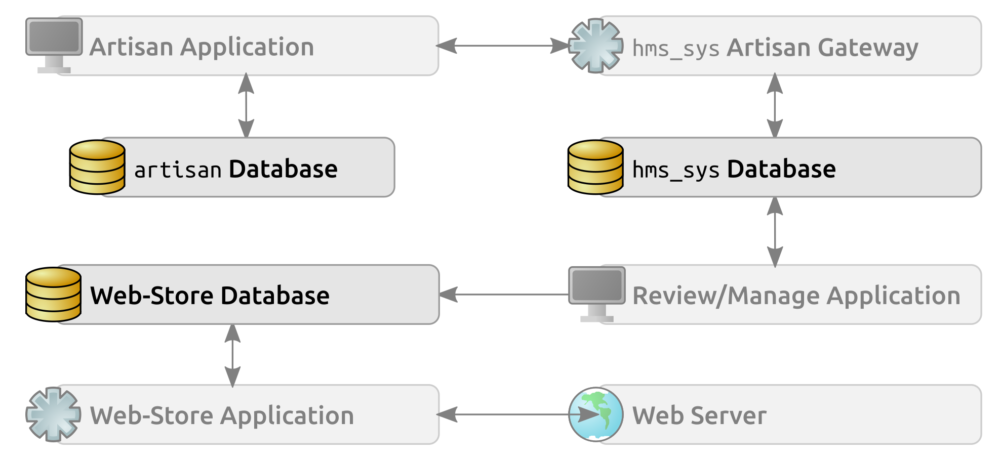
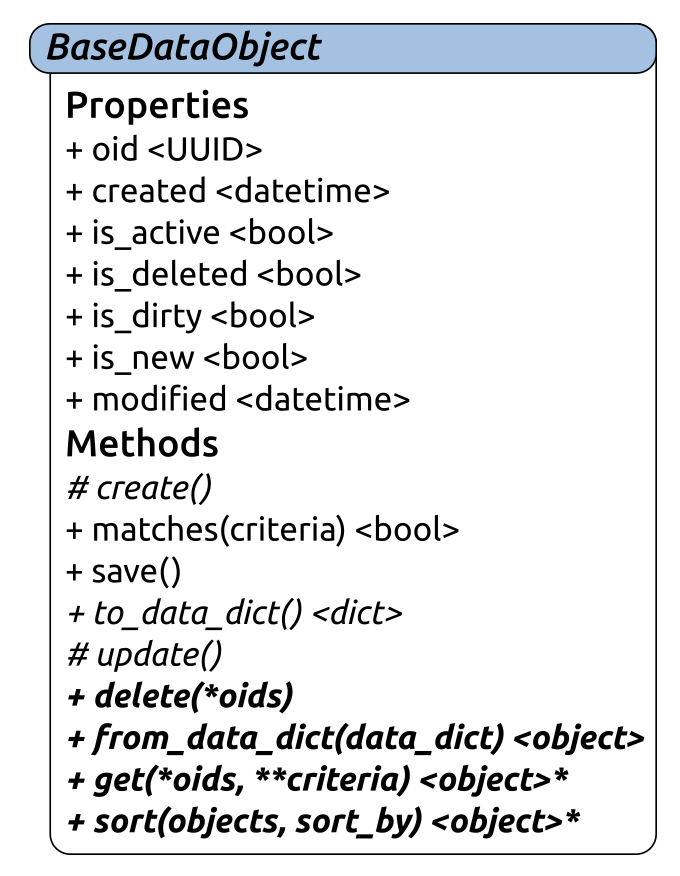

# 考虑业务对象数据持久性

大多数程序和系统都需要存储和检索数据以进行操作。毕竟，将数据嵌入代码本身是不切实际的。涉及的数据存储形式可以根据底层存储机制、应用程序或服务的特定需求，甚至名义上的非技术约束（如不需要用户安装其他软件）而大相径庭，但无论这些因素加起来是什么，根本需求始终是一样的。

`hms_sys`的各个组件项目/子系统也不例外：

+   **Artisan** **Application**需要允许**Artisan**用户管理**Artisan**正在创建和销售的**products**，并且至少需要管理部分自己的业务实体数据

+   **Artisan** **Gateway**服务可能至少需要为**artisans**、**products**和**orders**以及相关的**Customer**和**Address**对象分阶段数据，因为这些对象包含的数据会通过各种流程移动

+   **Central Office Application**需要能够管理**Artisan**和**Product**的部分数据，并且可能需要读取订单数据，即使只是出于故障排除目的

到目前为止，还没有具体的要求说明这些数据将如何持久化，甚至在哪里，尽管**Artisan Application**可能需要在本地保留数据并将其传播到**Artisan Gateway**或通过**Central Office Application**访问，如下图所示：

本次迭代将通过对`hms_sys`中各个组件项目的数据持久性机制的需求、实施和测试进行分析，从而开始一些基本的分析。然而，目前我们甚至不清楚后端数据存储是什么样子，因此我们无法编写任何有用的指导如何实现数据持久性的故事。显然，这需要更多的调查工作才能在规划和执行本次迭代之前进行。

本章将研究以下主题：

+   迭代（敏捷）过程通常如何处理没有足够信息来执行的故事

+   一般有哪些数据存储和持久性选项

+   在决定各种`hms_sys`组件项目如何处理数据访问之前，应该检查哪些数据访问策略

# 迭代是（在某种程度上）灵活的

在许多敏捷方法中，有特定的工件和/或流程旨在处理这种迭代开始的情况——即存在某种功能的需求，即使只是暗示性的，但实际上没有足够的信息来对这种需求进行任何开发进展。甚至可能已经有一些看似完整的故事，但缺少了一些开发所需的细节。在这种情况下，这些故事可能类似于以下内容：

+   作为**Artisan**，我需要我的**Product**数据被本地存储，这样我就可以在不必担心连接到可能无法立即访问的外部系统的情况下使用它。

+   作为**产品经理**/**批准人**，我需要能够访问任何/所有**artisans**的**Product**信息，以便我可以在网店中管理这些产品的可用性

+   作为**系统管理员**，我需要**Artisan Gateway**将**Product**和相关数据与主**Web Store**应用程序分开存储，以便在发布到公共站点之前可以安全地分阶段处理

所有这些故事看起来可能都是完整的，因为它们定义了每个用户的需求，但它们缺乏关于这些功能应如何运作的任何信息。

进入 Spike。

尖峰，起源于 XP 方法论，并已被其他几种敏捷方法论（正式或非正式地）采纳，本质上是为了研究并返回其他故事可用的计划细节的故事。理想情况下，需要围绕它们生成尖峰的故事将在进入迭代之前被识别出来 - 如果这种情况没有发生，信息不足的故事将是无法工作的，并且不可避免地会发生某种洗牌，以推迟不完整的故事直到它们的尖峰完成，或者将尖峰及其结果纳入修订后的迭代计划中。前者往往更有可能发生，因为没有来自尖峰的信息，估算目标故事将是非常困难的，甚至可能是不可能的。与我们之前提到的原始故事相关的尖峰故事可能会被写成这样：

+   作为开发人员，我需要知道 Artisan 应用程序数据的存储和检索方式，以便我可以为这些过程编写代码

+   作为开发人员，我需要知道中央办公应用程序数据的存储和检索方式，以便我可以为这些过程编写代码

+   作为开发人员，我需要知道 Artisan Gateway 数据的存储和检索方式，以便我可以为这些过程编写代码

为了解决这些问题并完成本次迭代的故事，了解可用的选项将是有帮助的。一旦这些选项被探索，它们可以在应用程序和系统的服务层的背景下进行权衡，并可以做出一些最终的实施方法决策，以及编写一些最终的故事来应对。

# 数据存储选项

所有将受到认真考虑的选项都具有一些共同的特性：

+   他们将允许数据脱机存储，这样应用程序或服务程序不需要持续运行以确保相关数据不会丢失

+   它们必须允许应用程序和服务执行至少四个标准 CRUD 操作中的三个：

+   创建：允许存储新对象的数据。

+   读取：允许访问现有对象的数据，一次一个，一次全部，可能还带有一些过滤/搜索功能。

+   更新：允许在需要时更改现有数据。

+   删除：允许（也许）删除不再相关的对象的数据。至少，标记这样的数据，以便它不会普遍可用也可以。

它们还应该根据 ACID 特性进行检查和评估，尽管这些属性中并非所有都可能在`hms_sys`的数据需求背景下是必不可少的。然而，没有一个是不可实现的：

+   原子性：数据交易应该是全有或全无的，因此如果数据写入的一部分失败，正在写入的整个数据集也应该失败，使数据处于稳定状态

+   一致性：数据交易应始终导致整个数据集中的有效数据状态，遵守和遵守任何存储系统规则（应用级规则是应用程序的责任）

+   隔离性：数据交易应始终导致与它们的组成更改按相同顺序逐个执行时会发生的最终状态相同

+   耐久性：一旦提交，数据交易应以防止由系统崩溃、断电等原因造成的损失的方式存储

# 关系数据库

**关系数据库管理系统**（**RDBMSes**）是可用于应用程序的更成熟的数据存储方法之一，其选项已经普遍使用了几十年。它们通常将数据存储为表中的单独记录（有时称为**行**），这些表（或**关系**）定义了所有成员记录的字段名称（**列**）和类型。表通常定义了一个主键字段，为表中的每条记录提供唯一标识符。一个简单的定义用户记录的表的示例可能如下所示：

表中的每条记录都是一致的数据结构，例如在前面的例子中，所有用户都会有`user_id`、`first_name`、`last_name`和`email_address`的值，尽管除`user_id`之外的字段的值可能为空或为`NULL`。任何表中的数据都可以通过查询访问或组装，而无需更改表本身，并且可以在查询中连接表，以便在另一个表中关联拥有的记录，例如订单。

这种结构通常被称为模式，它既定义了结构，又强制执行数据约束，如值类型和大小。

关系数据库最常见的查询语言是**结构化查询语言**（**SQL**）—或者至少是它的某个变体。SQL 是一种 ANSI 标准，但有许多可用的变体。可能还有其他的，但 SQL 几乎肯定是最受欢迎的选择，并且非常成熟和稳定。

SQL 本身就是一个复杂的话题，即使不考虑它在数据库引擎之间的变化，也足以值得一本专门的书。随着`hms_sys`迭代的进行，我们将探讨一些 SQL，并解释发生了什么。

# 优点和缺点

关系数据库数据存储的一个更重要的优势是它能够在单个查询请求中检索相关记录，例如前面提到的用户/订单结构。大多数关系数据库系统还允许在单个请求中进行多个查询，并将每个查询的记录集作为单个结果集返回。例如，可以查询相同的用户和订单表结构，以返回单个用户及该用户的所有订单，这在应用程序对象结构中具有一些优势，其中一个对象类型具有一个或多个与其关联的对象集合。

对于大多数关系数据库引擎来说，另一个可能重要的优势是它们对事务的支持——允许一组潜在复杂的数据更改或插入在任何单个数据操作失败的情况下作为一个整体回滚。这几乎可以保证在任何 SQL RDBMS 中都可以使用，并且在处理金融系统时是非常重要的优势。对于处理资金流动的系统，事务支持可能是一个功能性要求——如果不是，那么很可能值得问一下为什么不是。支持跨多个操作的事务是完全 ACID 兼容性的一个关键方面——如果没有，原子性、一致性和（在某种程度上）隔离标准将受到怀疑。幸运的是，几乎任何值得被称为关系数据库系统的系统都将提供足够满足任何可能出现的需求的事务支持。

许多关系数据库系统还支持创建视图和存储过程/函数，可以使数据访问更快速、更稳定。视图在实际上是预定义的查询，通常跨越多个表，并且通常用于检索与它们绑定的表中的特定数据子集。存储过程和函数可以被视为应用程序函数的近似等价物，接受某些输入，执行一些任务，并可能返回由执行这些任务生成的数据。至少，存储过程可以用来代替编写查询，这具有一些性能和安全性的好处。

大多数关系数据库中表的固有模式可能既是优势也是缺点。由于该模式强制执行数据约束，因此表中存在不良数据的可能性较小。预期为字符串值或整数值的字段将始终是字符串或整数值，因为不可能将字符串字段设置为非字符串值。这些约束确保数据类型的完整性。然而，这种权衡是，值类型（有时甚至是值本身）在进入或离开数据存储时可能需要进行检查和/或转换。

如果关系数据库有一个缺点，那可能是包含数据的表的结构是固定的，因此对这些表进行更改需要更多的时间和精力，而这些更改可能会影响访问它们的代码。例如，在数据库中更改字段名称很可能会破坏引用该字段名称的应用功能。大多数关系数据库系统还需要单独的软件安装和全天候运行的服务器硬件，就像相关的应用程序一样。这可能对任何特定项目是一个问题，也可能不是，但特别是如果该服务器位于他人的基础设施中，这可能是一个成本考虑因素。

扩展关系数据库管理系统可能仅限于为服务器本身增加更多的性能——改进硬件规格、增加内存或将数据库移动到新的更强大的服务器。前述的一些数据库引擎还有额外的软件包，可以提供多服务器规模，例如横向扩展到多个仍然像单个数据库服务器一样的服务器。

# MySQL/MariaDB

MySQL 是一种流行的关系数据库管理系统，始于 1990 年代中期的一个开源项目。MariaDB 是 MySQL 的一个由社区维护的分支，旨在作为 MySQL 的一个可替换的替代品，并且在 MySQL（现在由 Oracle 拥有）停止以开源许可发布时仍然作为一个开源选项可用。在撰写本书时，MySQL 和 MariaDB 是可以互换的。

两者使用相同的 SQL 变体，与标准 SQL 的语法差异通常非常简单。MySQL 是——而 MariaDB 被认为是——更适用于读取/检索数据而不是写入数据，但对于许多应用程序来说，这些优化可能不会明显。

MySQL 和 MariaDB 可以通过使用集群化和/或复制软件附加到基本安装来进行横向扩展，以满足高可用性或负载需求，尽管为了真正有效，需要额外的服务器（真实或虚拟）。

有几个 Python 库可用于连接和与 MySQL 交互，由于 MariaDB 旨在能够直接替代 MySQL，因此预计这些相同的库可以在不修改的情况下用于 MariaDB 访问。

# MS-SQL

微软的 SQL Server 是一种专有的基于 SQL 的数据库管理系统，使用自己的标准 SQL 变体（T-SQL——就像 MySQL 的变体一样，差异通常是微不足道的，至少对于简单到稍微复杂的需求来说）。

MS-SQL 也具有用于高可用性和负载场景的集群和复制选项，需要离散服务器以最大化水平扩展的效果。

至少有两种 Python 选项可用于连接和处理 MS-SQL 数据库：

+   `pymssql`：这专门利用了 MS-SQL 使用的**表格数据流**（**TDS**）协议，并允许更直接地连接到后端引擎

+   `pyodbc`：这通过**开放数据库连接**（**ODBC**）协议提供数据库连接，微软在 2018 年中已经对其表示信心

# PostgresQL

PostgreSQL 是另一个开源数据库选项，是一种设计重点在于符合标准的对象关系数据库系统。作为 ORDBMS，它允许以更面向对象的方式定义数据结构，具有类似于从其他表/类继承的类的功能。它仍然使用 SQL——它自己的变体，但对于大多数开发目的来说，差异基本可以忽略，并且有几种 Python 选项可用于连接和处理数据库。它还具有复制和集群支持，与先前选项的注意事项相同。

# NoSQL 数据库

在撰写本文时，有数十种 NoSQL 数据库选项可用，既作为独立/本地服务安装，也作为云数据库选项。它们设计的主要驱动因素包括以下重点：

+   **支持大量用户：**数以万计的并发用户，也许是数百万，并且应尽可能小地影响其性能

+   **高可用性和可靠性：**即使一个或多个数据库节点完全离线，也能与数据进行交互

+   **支持高度流动的数据结构：**允许结构化数据不受严格的数据模式约束，甚至可以跨同一数据存储集合中的记录

从开发的角度来看，这个列表中的最后一点可能是最重要的，允许根据需要定义几乎任意的数据结构。

如果在关系型数据库管理系统（RDBMS）中，表的概念是一种存储模型，那么在 NoSQL 数据库连续体中有许多替代存储模型：

+   **文档存储：**每个记录等价物都是包含创建时使用的任何数据结构的文档。文档通常是 JSON 数据结构，因此允许在不同数据类型之间进行一些区分——字符串、数字和布尔作为简单值，嵌套列表/数组和对象用于更复杂的数据结构，并且还允许使用正式的`null`值。

+   **键/值存储：**每个记录等价物只是一个值，可以是任何类型，并且由单个唯一键标识。这种方法可以被认为是等同于单个 Python `dict`结构的数据库。

+   **宽列存储：**每个记录可以被认为属于具有非常大（无限？）数量列的 RDBMS 表，也许有主键，也许没有。

还有一些变体感觉像是结合了这些基本模型的方面。例如，在 Amazon 的 DynamoDB 中创建数据存储，首先要定义一个表，需要定义一个键字段，并且还允许定义一个辅助键字段。一旦创建了这些，这些表的内容就像一个文档存储一样。因此，最终的结果就像一个键/文档存储（每个键指向一个文档的键/值存储）。

NoSQL 数据库通常是非关系型的，尽管也有例外。从开发的角度来看，这意味着在处理存储和检索来自 NoSQL 数据存储的应用程序数据时，至少需要考虑三种方法之一：

+   永远不要使用与其他数据相关的数据——确保每个记录都包含作为单个实体所需的一切。这里的折衷是，很难，甚至不可能解决记录（或与记录关联的对象）被两个或更多其他记录/对象共享的情况。一个例子可能是多个用户都是成员的用户组。

+   处理代码中与记录之间的关系。使用刚提到的相同的用户/组概念，这可能涉及到一个`Group`对象，读取所有相关的`User`记录，并在实例化过程中使用来自该数据的`User`对象填充`users`属性。可能会有一些并发更改相互干扰的风险，但不会比在基于关系型数据库的系统中进行相同类型的过程的风险更大。这种方法还意味着数据将按对象类型进行组织——一个独立的`User`对象数据集合和一个独立的`Group`对象数据集合，但任何允许区分不同对象类型的机制都可以工作。

+   选择一个提供某种关系支持的后端数据存储引擎。

NoSQL 数据库也不太可能支持事务，尽管再次有提供完全符合 ACID 的事务能力的选项，处理数据存储级别的事务要求的标准/选项与前面提到的处理关系能力的标准/选项非常相似。即使没有任何事务支持的数据库仍然会对单个记录进行 ACID 兼容——在这个复杂程度上，要求兼容的是记录是否成功存储。

# 优势和缺点

鉴于大多数 NoSQL 选项背后的高可用性和并发用户关注，他们比关系型数据库管理系统更适合于可用性和可扩展性重要的应用程序，这一点应该并不奇怪。这些属性在大数据应用程序和云中更为重要，正如主要云提供商都在这一领域提供自己的产品，并为一些知名的 NoSQL 选项提供起点所证明的那样：

+   亚马逊（AWS）：

+   DynamoDB

+   谷歌：

+   Bigtable（用于大数据需求）

+   数据存储

+   微软（Azure）：

+   Cosmos DB（前身为 DocumentDB）

+   Azure 表存储

在开发过程中，更或多或少地任意定义数据结构的能力也可以是一个重要的优势，因为它消除了定义数据库模式和表的需要。潜在的折衷是，由于数据结构可以同样任意地改变，使用它们的代码必须被编写为容忍这些结构的变化，或者可能必须计划一些有意识的努力来应用这些变化到现有数据项，而不会破坏系统和它们的使用。

例如，考虑之前提到的`User`类 - 如果需要向类添加`password_hash`属性，以提供身份验证/授权支持，实例化代码可能需要考虑它，并且任何现有的用户对象记录可能不会有该字段。在代码方面，这可能并不是什么大问题 - 在初始化期间将`password_hash`作为可选参数处理将允许创建对象，并且如果未设置它，则将其存储为 null 值将处理数据存储方面，但需要计划、设计和实施某种机制以提示用户提供密码以存储真实值。如果在基于 RDBMS 的系统中进行类似更改，将需要发生相同类型的过程，但很可能会有已建立的流程来更改数据库模式，并且这些流程可能包括修改模式和确保所有记录具有已知起始值。

考虑到可用的选项数量，也不足为奇的是它们在执行类似任务时存在差异（有时是显著的）。也就是说，从数据中检索记录，只需提供要检索的项目的唯一标识符（`id_value`），使用不同的库和基于数据存储引擎的语法/结构：

+   在 MongoDB 中（使用`connection`对象）：

+   `connection.find_one({'unique_id':'id_value'})`

+   在 Redis 中（使用`redis connection`）：

+   `connection.get('id_value')`

+   在 Cassandra 中（使用`query`值和`criteria`列表，针对 Cassandra`session`对象执行）：

+   `session.execute(query, criteria)`

每个不同的引擎可能会有其自己独特的执行相同任务的方法，尽管可能会出现一些常见的名称 - 毕竟，对于函数或方法名称，如 get 或 find，只有那么多的替代方案是有意义的。如果系统需要能够与多个不同的数据存储后端引擎一起工作，这些都是设计和实施通用（可能是抽象的）数据存储适配器的良好候选者。

由于关系和事务支持因引擎而异，这种不一致性也可能是 NoSQL 数据存储的一个缺点，尽管如果它们缺乏，至少有一些选项可以追求。

# MongoDB

MongoDB 是一个免费的开源 NoSQL 文档存储引擎 - 也就是说，它将整个数据结构存储为单独的文档，如果不是 JSON，也非常类似于 JSON。在 Python 中发送到和从`MongoDB`数据库检索的数据使用 Python 本机数据类型（`dict`和`list`集合，任何简单类型，如`str`和`int`，可能还有其他标准类型，如`datetime`对象）。

MongoDB 被设计为可用作分布式数据库，支持高可用性、水平扩展和地理分布。

像大多数 NoSQL 数据存储解决方案一样，MongoDB 是无模式的，允许 MongoDB 集合中的文档（大致相当于 RDBMS 中的表）具有完全不同的结构。

# 其他 NoSQL 选项

如前所述，有数十种 NoSQL 数据库选项可供选择。以下是三种具有 Python 驱动程序/支持的本地安装的 NoSQL 数据库的更受欢迎的选项：

+   **Redis**：键/值存储引擎

+   **Cassandra**：宽列存储引擎

+   **Neo4j**：图数据库

# 其他数据存储选项

另一个选项——对于大量数据或在重要并发用户负载下可能效果不佳的选项——是将应用程序数据简单地存储为本地机器上的一对多文件。随着简单结构化数据表示格式（如 JSON）的出现，这可能比乍一看更好，至少对于某些需求来说：特别是 JSON，具有基本值类型支持和表示任意复杂或大型数据结构的能力，是一个合理的存储格式。

最大的障碍是确保数据访问至少具有一定程度的 ACID 兼容性，尽管与 NoSQL 数据库一样，如果所有事务都是单个记录，仍然可以依靠 ACID 兼容性，原因是事务的简单性。

在使用文件存储应用程序数据时必须解决的另一个重要问题是语言或基础操作系统如何处理文件锁定。如果其中一个允许在写入过程中或不完整的情况下读取打开的文件，那么读取不完整数据文件的读取就会误读可用数据，然后将错误数据提交到文件中，可能导致至少数据丢失，甚至可能在过程中破坏整个数据存储。

显然那将是不好的。

访问速度也可能是一个问题，因为文件访问比内存中存储的数据访问速度要慢。

也就是说，有一些策略可以应用于使本地基于文件的数据存储免受这种失败的影响，只要数据只从代码中的单一来源访问。解决潜在的访问速度问题也可以在同一过程中完成，过程如下：

+   使用数据的程序开始：

+   从持久文件系统数据存储中将数据读入内存

+   使用程序，并发生数据访问：

+   从内存中读取数据的副本，并传递给用户

+   以某种方式更改数据：

+   注意到更改，并在返回控制权给用户之前将更改提交到文件系统数据存储

+   关闭程序：

+   在终止之前，将检查所有数据以确保没有仍在等待的更改

+   如果有变化，请等待它们完成

+   如果需要，将所有数据重新写入文件系统数据存储

# 选择数据存储选项

查看`hms_sys`的逻辑架构，并允许**Artisan Application**使用原始图表中不存在的本地数据存储，开发需要关注三个数据库：

**Web-Store Database**连接到**Web-Store Application**，因此无法进行修改。当前的期望是对该数据库中的数据进行修改将通过**Web-Store Application**提供的 API 调用来处理。因此，此时可以搁置对该数据库的数据访问。

另一方面，`artisan` **Database**根本不存在，将必须在开发`hms_sys`的过程中创建。可以安全地假设，鉴于第一次迭代中与安装相关的 artisan 级别的故事，最好尽可能减少他们需要执行的软件安装数量。这反过来又表明，在**Artisan Application**级别，本地文件系统数据存储可能是首选选项。这允许以下操作：

+   数据存储在安装或应用程序的初始设置期间在本地生成

+   **工匠**可以在本地管理他们的数据，即使他们离线

+   **Artisan**无需进行任何额外的软件安装来管理数据存储

由于预计**Artisan 应用程序**将是本地桌面应用程序，这很好地符合之前提到的一组过程，以使基于文件的数据存储安全稳定。如果**Artisan**安装了多个**Artisan 应用程序**（例如在多台机器上各安装一个），则存在一些数据冲突的风险，但实际上任何本地数据存储选项都会存在这种风险 - 除非将数据存储移到共同的在线数据库，否则真的没有办法减轻这种特定的担忧，而这超出了目前`hms_sys`的开发范围。

关于集中数据和应用程序的想法将在以后更详细地进行检查。目前，Artisan 级别的所有内容都将与 Artisan 应用程序本地驻留。

`hms_sys` **数据库**目前也不存在。不像`artisan` **数据库**，它旨在允许多个并发用户 - 任何数量的中央办公室用户可能在任何给定时间审查或管理产品，因为工匠正在提交产品信息进行审查，并且在这些活动进行时，也可以设置相关工匠的订单从网络商店中中继或拉出。综合起来，这足以排除本地文件存储方法 - 它可能仍然可以做到，并且在当前使用水平下甚至可能是可行的，但如果使用/负载增加太多，可能会迅速遇到扩展问题。

考虑到，即使我们不知道将使用什么后端引擎，知道它不会是**Artisan 应用程序**使用的相同存储机制，就确认了之前提到的想法，即我们最好定义一个通用的数据访问方法集，围绕该结构生成某种抽象，并在每个应用程序或服务对象级别定义具体实现。采取这种方法的优势实际上归结为相同的**面向对象设计原则**（**OODP**）的变体：多态。

# 多态（和面向接口编程）

**多态**，简单来说，是对象在代码中可以互换而不会破坏任何东西的能力。为了实现这一点，这些对象必须在整个范围内呈现公共接口成员 - 相同的可访问属性和方法。理想情况下，这些公共接口成员也应该是唯一的接口成员，否则有破坏这些对象互换性的风险。在基于类的结构中，通常最好将该接口定义为一个单独的抽象 - 在 Python 中是一个 ABC，有或没有具体成员。考虑以下一组用于连接和查询各种关系数据库后端的类：

其中：

+   `BaseDatabaseConnector`是一个抽象类，要求所有派生类实现一个查询方法，并提供`host`，`database`，`user`和`password`属性，这些属性将用于实际连接到给定的数据库

+   具体类`MySQLConnector`，`MSSQLConnector`和`ODBCConnector`分别实现了所需的`query`方法，允许实例实际执行针对连接到的数据库的查询

只要连接属性（`host`，…，`password`）存储在配置文件中（或者实际代码之外的任何地方），并且有一种方法来指定在运行时定义哪种连接器类型，甚至可能在执行期间切换，那么允许在运行时定义这些不同连接类型并不难。

这种可互换性反过来又允许编写代码，而不需要了解进程如何工作，只需要知道应该如何调用以及期望返回什么结果。这是编程到接口而不是到实现的实际示例，这在第五章《hms_sys 系统项目》中提到，以及封装变化的概念。这两者经常同时出现，就像在这种情况下一样。

以这种方式替换对象还有另一个好处，可以称之为未来证明代码库。如果在将来的某个时候，使用先前显示的数据连接器的代码突然需要能够连接到并使用尚未可用的数据库引擎，那么使其可用的工作量将相对较小，前提是它使用了与已经存在的连接参数和类似的连接过程。例如，要创建一个`PostgreSQLConnector`（用于连接到`PostgreSQL`数据库），只需要创建这个类，从`BaseDatabaseConnector`派生，并实现所需的`query`方法。这仍然需要一些开发工作，但不像如果每个数据库连接过程都有自己独特的类那样需要的工作量那么大。

# 数据访问设计策略

在我们开始为这个迭代编写故事之前，我们需要进行的最后一点分析是确定对象数据访问的责任将在哪里。在脚本或其他纯过程化的上下文中，简单地连接到数据源，根据需要读取数据，根据需要修改数据，并将任何更改重新写出可能就足够了，但这只有在整个过程相对静态时才可行。

在`hms_sys`这样的应用程序或服务中，数据使用非常像是随机访问的场景——可能会有常见的程序，甚至看起来很像简单脚本的逐步实现，但这些过程可能（并且将）以完全不可预测的方式启动。

这意味着我们需要具有易于调用和可重复的数据访问过程，而且需要付出最小的努力。考虑到我们已经知道至少会有两种不同的数据存储机制在起作用，如果我们能够设计这些过程，使得无论底层数据存储看起来如何，都可以使用完全相同的方法调用，那么未来的支持和开发也会变得更加容易——再次抽象出这些过程，让代码使用接口而不是实现。

一种可以实现这种抽象的选项是从数据源开始，使每个数据源都意识到正在进行的对象类型，并存储它需要能够为每个对象类型执行 CRUD 操作的信息。这在技术上是可行的实现，但会变得非常复杂，因为需要考虑和维护每种数据存储和业务对象类型的组合。即使初始类集仅限于三种数据存储变体（**Artisan Application**的文件系统数据存储，通用 RDBMS 数据存储和通用 NoSQL 数据存储），也有四种操作（CRUD）跨三种数据存储类型的四种业务对象，总共有 48 种排列组合（4×3×4）需要构建、测试和维护。每添加一个新的操作，比如说，能够搜索业务对象数据存储，以及每个新的需要持久化的业务对象类型和每种新的数据存储类型，都会使排列组合数量成倍增加——每增加一个，数量就增加到 75 个项目（5×3×5），这可能很容易失控。

如果我们退一步思考我们实际需要的所有这些组合，可能存在一种不同且更可管理的解决方案。对于每个需要持久化的业务对象，我们需要能够执行以下操作：

1.  为新对象创建记录。

1.  读取单个对象的记录，以某种方式标识，并返回该项的实例。

1.  在对其进行更改后，更新单个对象的记录。

1.  删除单个对象的记录。

1.  根据某些条件匹配找到并返回零到多个对象。

能够标记对象处于特定状态——活动与非活动，以及已删除（实际上没有删除基础记录）可能也很有用。跟踪创建和/或更新日期/时间也是一种常见做法——这有时对于排序目的很有用，如果没有其他用途的话。

所有 CRUD 操作直接与对象类型本身相关——也就是说，我们需要能够创建、读取、更新、删除和查找`Artisan`对象，以便与它们一起使用。这些实例的各种对象属性可以根据需要在实例创建的上下文中检索和填充，作为实例创建过程的一部分创建，或根据需要与拥有实例或单独更新。考虑到这些从属操作，跟踪对象的记录是否需要创建或更新也可能很有用。最后，我们需要跟踪每个对象状态数据记录在数据存储中的唯一标识符。将所有这些放在一起，以下是`BaseDataObject` ABC 可能看起来像的：

这些属性都是具体的，在`BaseDataObject`级别内部实现：

+   `oid`是对象的唯一标识符，是一个`UUID`值，在数据访问期间将存储为字符串并转换。

+   `created`和`modified`是 Python `datetime`对象，可能也需要在数据访问期间转换为字符串值表示。

+   `is_active`是一个标志，指示是否应将给定记录视为活动记录，这允许对记录的活动/非活动状态进行一些管理，从而对应该记录的对象进行管理。

+   `is_deleted`是一个类似的标志，指示记录/对象是否应被视为已删除，即使它实际上仍然存在于数据库中。

+   `is_dirty`和`is_new`是标志，用于跟踪对象的相应记录是否需要更新（因为它已更改）或创建（因为它是新的）。它们是本地属性，不会存储在数据库中。

使用 `UUID` 而不是数字序列需要更多的工作，但在网络应用程序和服务实现中具有一些安全优势——`UUID` 值不容易预测，并且有 16³² 个可能的值，使得对它们的自动化利用变得更加耗时。可能存在要求（或至少有一种愿望）永远不真正删除记录。在某些行业或者对于需要满足某些数据审计标准的上市公司来说，希望至少在一段时间内保留所有数据并不罕见。

`BaseDataObject` 定义了两个具体的和三个抽象的实例方法：

+   `create`（抽象和受保护的）将要求派生类实现一个过程，用于创建和写入相关数据库的状态数据记录。

+   `matches`（具体）将在被调用的实例的属性值与传递给它的条件的相应值匹配时返回一个布尔值。这将在 `get` 方法中实现基于条件的过滤中起到关键作用，这将很快讨论。

+   `save`（具体）将检查实例的 `is_dirty` 标志，调用实例的 `update` 方法并在其为 `True` 时退出，然后检查 `is_new` 标志，如果为 `True` 则调用实例的 `create` 方法。这样做的最终结果是，任何继承自 `BaseDataObject` 的对象都可以简单地被告知 `save` 自身，将采取适当的操作，即使它没有任何操作。

+   `to_data_dict`（抽象）将返回对象状态数据的 `dict` 表示，其中的值以可以写入状态数据记录所在的数据库的格式和类型为准。

+   `update`（抽象和受保护的）是 `create` 方法的更新实现对应物，用于更新对象的现有状态数据记录。

`BaseDataObject` 还定义了四个类方法，所有这些方法都是抽象的——因此，这些方法中的每一个都绑定到*类*本身，而不是类的实例，并且必须由从 `BaseDataObject` 派生的其他类实现：

+   `delete` 对由提供的 `*oids` 标识的每条记录执行物理记录删除。

+   `from_data_dict` 返回一个填充有提供的 `data_dict` 中的状态数据的类的实例，这通常是从针对这些记录所在的数据库的查询中得到的。它是 `to_data_dict` 方法的对应物，我们已经描述过了。

+   `get` 是从数据库中检索状态数据的主要机制。它被定义为允许返回特定记录（`*oids` 参数列表）和过滤条件（在 `**criteria` 关键字参数中，这些参数预期将传递给每个对象的匹配条件），并将根据这些值返回一个未排序的对象实例列表。

+   `sort` 接受一个对象列表，并使用传递给 `sort_by` 的回调函数或方法对它们进行排序。

`BaseDataObject` 捕获了所有功能要求和常见属性，这些属性需要存在才能让业务对象类和实例负责其数据存储交互。暂时不考虑任何数据库引擎问题，定义一个数据持久性能力的业务对象类，比如 **Artisan Application** 中的 `Artisan`，变得非常简单——最终的具体 `Artisan` 类只需要继承自 `BaseArtisan` 和 `BaseDataObject`，然后实现这些父类所需的九个抽象方法。

如果可以安全地假定任何给定的应用程序或服务实例将始终为每种业务对象类型使用相同的数据存储后端，那么这种方法就足够了。任何特定于引擎的需求或功能都可以简单地添加到每个最终的具体类中。但是，也可以将特定数据存储引擎（例如 MongoDB 和 MySQL）所需的任何属性收集到一个额外的抽象层中，然后让最终的具体对象从其中一个派生出来：

在这种情况下，最终的`Artisan`类可以从`MongoDataObject`或`MySQLDataObject`中派生出来，并且可以强制执行执行针对这些特定后端引擎的数据访问方法所需的任何数据。这些中间层的 ABC 也可能为每种引擎类型提供一些有用的方法，例如，使用`create_sql`类属性中的模板 SQL，并用`to_data_dict()`结果中的实例数据值填充它，可以创建用于 MySQL 调用创建实例的最终 SQL。这种方法将保持任何给定业务对象类所需的大部分数据访问信息在该类中，并与业务对象本身相关联，这看起来不像一个坏主意，尽管如果需要支持很多组合，它有可能变得复杂。它还将保持向所有数据对象添加新功能所需的工作量（在类树的`BaseDataObject`级别）更可管理——添加新的抽象功能仍然需要在所有派生的具体类中实现，但任何具体的更改将被继承并立即可用。

# 数据访问决策

有了所有这些因素，现在是时候做出一些关于各个组件项目的对象如何跟踪其数据的决定了。为了在所有对象数据访问周围有一个单一的接口，我们将实现先前描述的`BaseDataObject` ABC，或者非常类似它的东西，并从先前迭代中构建的相关业务对象类的组合中派生出我们最终的数据持久化具体类。最终，我们将得到我们所谓的数据对象的类，它们能够读取和写入自己的数据。

在**Artisan Application**中，由于我们不需要担心并发用户同时与数据交互，也不想在没有更好的选择的情况下给**Artisan**用户增加额外的软件安装，我们将使用本地文件来存储对象数据来构建数据持久性机制。

在将在中央办公室环境中运行的代码中，我们将有并发用户，至少可能会有，并且数据存储需要集中在专用数据库系统中。没有明显需要正式的数据库驻留模式（尽管有一个也不是坏事），因此使用 NoSQL 选项应该可以缩短开发时间，并在数据结构需要意外更改时提供一些灵活性。当我们到达开发工作的那部分时，我们将更详细地重新审视这些选项。

# 为什么要从头开始？

这种功能结构将从头开始构建，但在其他情境中可能也有其他可以起作用甚至更好的选择。例如，有几个**对象关系映射器**（**ORM**）包/库可供使用，允许在代码中定义数据库和结构，并传播到数据存储中，其中一些集成到完整的应用程序框架中。这些包括 Django 的`models`模块，它是整体 Django web 应用程序框架的一部分，是开发 Web 应用程序的常见和流行选项。其他变体包括 SQLAlchemy，提供了一个在 SQL 操作上的抽象层和一个用于处理对象数据的 ORM。

还有特定的驱动程序库适用于几种数据库选项（SQL 和 NoSQL 都有），其中一些可能提供 ORM 功能，但所有这些都至少提供连接到数据源并执行查询或对这些数据源执行操作的基本功能。完全可以编写代码，简单地执行针对 RDBMS（如 MySQL 或 MariaDB）的 SQL，或者执行与该 SQL 对应的函数针对 NoSQL 引擎（如 MongoDB）或甚至云驻留数据存储（如 Amazon 的 DynamoDB）。对于简单的应用程序，这实际上可能是一个更好的方法，至少最初是这样。这将减少开发时间，因为迄今为止我们探讨的各种抽象层根本不会出现在图中，而且代码本身会具有一定类型的简单性，因为它所需要做的就是执行基本的 CRUD 操作，甚至可能并非所有这些操作。

正在为`hms_sys`开发的数据对象结构将暴露出许多涉及数据访问框架设计的基本原则，这也是选择从头开始的方法的部分原因。另一个原因是，因为它将处于全面 ORM 方法和低级“执行对连接的查询”实现策略之间的某个地方，它将展示这两种方法的许多相关方面。

# 摘要

数据访问机制和流程有很多选择，虽然偶尔会有要求几乎强制使用其中一种，但可能没有一种方法适用于所有开发工作。特别是，如果时间很重要，寻找现成的解决方案可能是一个很好的起点，但如果要求或其他限制不允许轻松应用其中之一，创建自定义解决方案也是可以的。

在深入研究特定数据存储机制之前，逻辑的起点可能是定义集体数据访问需求的抽象层-即定义`BaseDataObject` ABC-这就是我们接下来要解决的问题。
