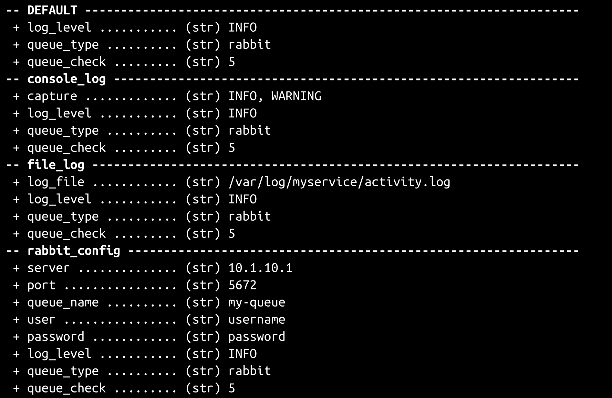
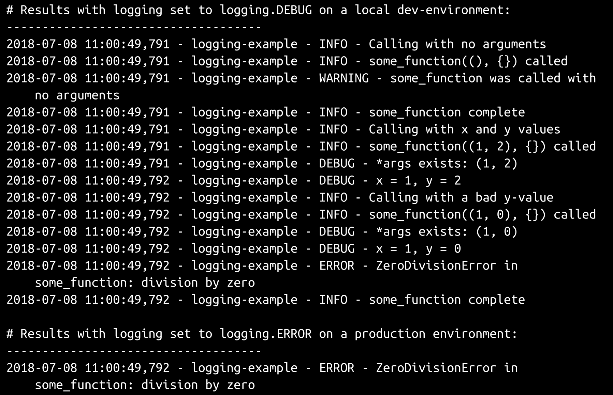
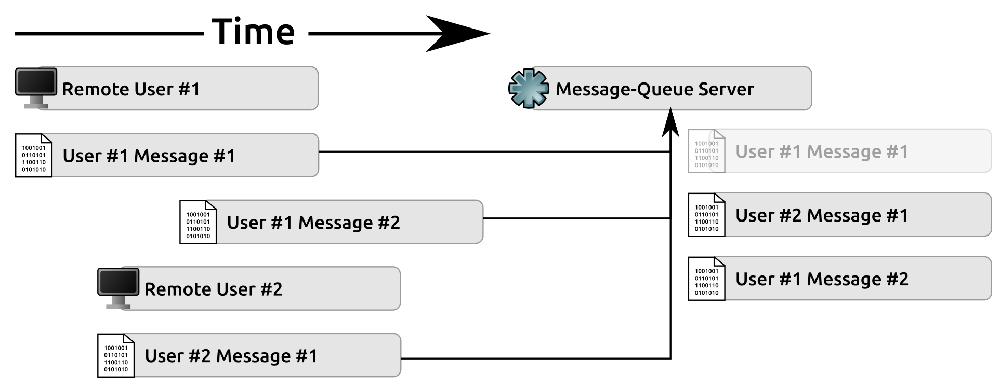
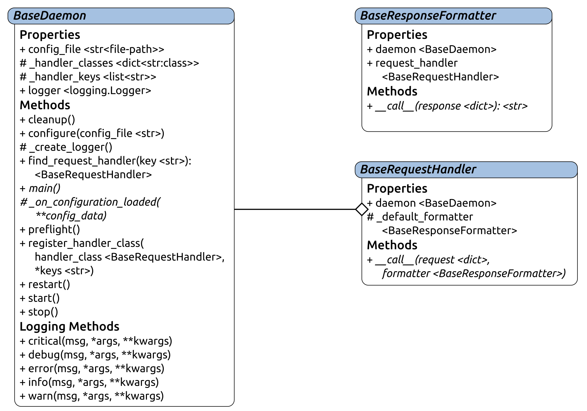
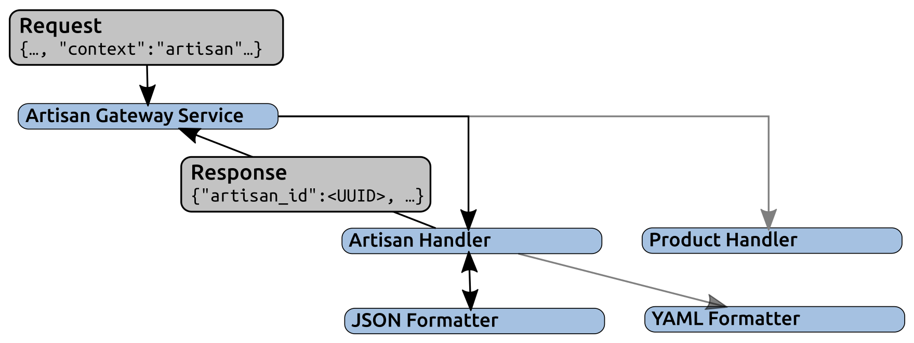
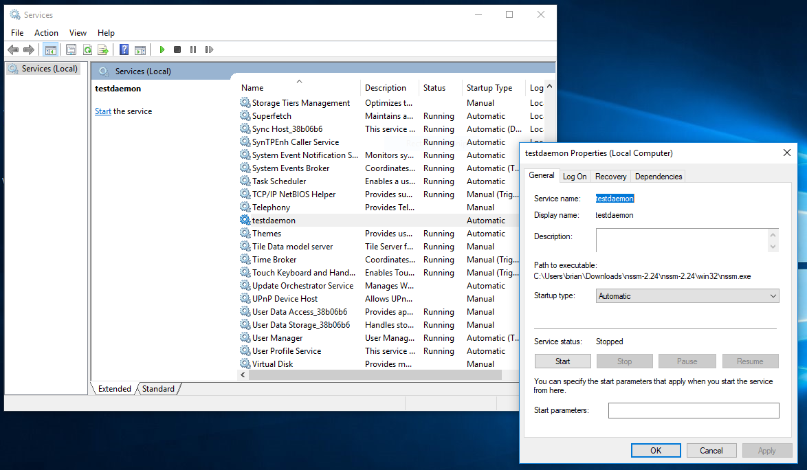

# 服务的解剖结构

在`hms_sys`中攻击的下一个逻辑功能块是 Artisan Gateway 服务。该服务等待来自 Artisan 或中央办公室最终用户的输入，根据需要创建或更新对象数据，并可能将该数据与网络商店系统的数据库同步。预计两个最终用户应用程序将完全随机地与 Artisan Gateway 服务通信；每当有人想要更改数据时，它都会准备好并等待处理该请求。

然而，在我们真正实现这项服务之前，我们需要解决任何服务可以或应该如何在 Python 中编写的问题。为此，我们将不得不检查和理解以下内容：

+   服务结构的基本实现，包括以下内容：

+   管理服务实例配置的选项

+   如何服务可以读取并响应请求

+   服务在以下环境中如何启动和何时启动：

+   一个相当现代的、符合 POSIX 标准的系统（例如 Linux）

+   Windows

+   是否有其他更好的设计，可以在 Python 可用的任何操作系统上运行

为了更好地理解服务的实现和执行的这些方面，我们将从头开始构建一个基本的服务结构，然后可以将其用作最终的 Artisan Gateway 服务的基础。

# 什么是服务？

服务在最基本的层面上只是在计算机后台运行的程序。它们通常等待来自某个地方的输入，根据该输入执行一些操作，并返回数据，至少表明所采取的操作是成功还是失败。在最基本的层面上，输入甚至可能不是对用户可见的东西；等待网络活动、监视文件系统，甚至只是在某种定时控制的基础上运行的服务，在今天的许多操作系统中都很常见。

服务应始终可用，持续运行，只要主机机器正在运行；这对于它们的编写和实现有一些影响，如下所示：

+   它们必须非常容错：每当发生意外情况时崩溃并死机的服务，并且必须因此重新启动，是没有什么用的。

+   它们应该尽可能是功能上自包含的；可能会失败的外部依赖项（并导致运行中的服务崩溃）应该受到严格的审视。

+   因为它们的操作可能对用户完全不可见，所以设计不良或实现不良的服务可能会占用系统资源，最终可能导致整个机器崩溃。即使没有涉及多处理，也需要小心和纪律，以避免诸如永不终止的循环或将孤立对象、数据或功能留在内存中的功能等问题。如果发生这些情况，只是时间问题（或服务的负载），直到内存或可用 CPU 减少到零。

# 服务结构

总之，服务并不一定非常复杂。如果有操作系统设施可用于管理实际的代码执行（启动和关闭），它们在结构上可能并不比以下代码更复杂：

```py
#!/usr/bin/env python
"""
A simple daemon-like function that can be started from the command-line.
"""
    import syslog
    from time import sleep

    def main_program():
        iterations = 0
        syslog.syslog('Starting %s' % __file__)
        while True:
            # TODO: Perform whatever request-acquisition and response-
            #       generation is needed here...
            syslog.syslog('Event Loop (%d)' % iterations)
            sleep(10)
            iterations += 1
        syslog.syslog('Exiting %s' % __file__)

    if __name__ == '__main__':
        main_program()
```

当运行前面的代码时，它不会生成用户可见的输出，但是观察系统日志（在 Linux 机器上使用`tail -f /var/log/syslog`）会显示它正在按预期进行操作，如下所示：

+   在进入主循环之前，它将启动消息写入日志文件。

+   在每次循环中，它执行以下操作：

+   将带有迭代号的消息写入日志

+   休眠 10 秒

+   增加迭代计数器

退出消息没有被写入日志文件，但这在这一点上是预期的，因为停止主循环的唯一方法是终止程序本身，这将终止程序而不退出循环。从启动到几次迭代的典型日志输出如下：


这当然不是一个服务，但它说明了可能被认为是任何服务共同功能的最低限度。

大多数服务的核心是一个循环，直到服务被关闭或终止。在循环中，服务将实际检查输入，有几种方式。一些更常见的变体包括以下内容：

+   它可以等待通过网络套接字传入的请求（Web 服务将使用此方法）。

+   它可以等待来自标准输入（stdin）的传入数据。

+   它可以主动轮询来自外部队列系统的传入消息，例如 RabbitMQ，或基于云的等效系统，例如 AWS 的 SQS 或 Google Cloud Platform 的 Cloud Pub/Sub。

这只是服务输入的一些可能性。其他机制不适合直接等待某些模型的事件，可以将事件推送到本地队列，并让服务从该队列机制中观察或轮询。

除了最基本的服务外，传入的请求将需要进行评估，以确定必须调用哪些功能来处理请求。将传入请求数据与特定功能相关联的最常见机制可能是一个大的`if…elif…else`结构，将处理请求的责任传递给特定和专用功能，看起来像以下内容：

```py
# - Evaluate the incoming request:
    if request['path'].startswith('/product'):
       return handle_product_request(request)
    elif request['path'].startswith('/artisan'):
       return handle_artisan_request(request)
    elif request['path'].startswith('/customer'):
       return handle_customer_request(request)
    else:
# - Invalid request, so return an error
       return handle_invalid_request(request)
```

然后，每个`handle_{something}_request`函数将负责处理传入的请求，确定如何处理它，并返回结果数据。

有一个标准的 Python 库`python-daemon`，它进一步采用了这种基本方法，允许将函数包装在基本的守护程序上下文中。相同的基本函数，使用`python-daemon DaemonContext`包装，非常相似，如下面的代码片段所示：

```py
#!/usr/bin/env python
"""
A bare-bones daemon implementation.
"""
    import syslog
    from daemon import DaemonContext
    from time import sleep

    def main_program():
        iterations = 0
        syslog.syslog('Starting %s' % __file__)
        while True:
        # TODO: Perform whatever request-acquisition and response-
        #       generation is needed here...
            syslog.syslog('Event Loop (%d)' % iterations)
            sleep(10)
            iterations += 1
        syslog.syslog('Exiting %s' % __file__)

    if __name__ == '__main__':
        with DaemonContext():
            main_program()
```

术语**服务**和**守护程序**在本书中是可以互换的；它们都指的是同一种后台进程程序。

执行此代码产生几乎相同的结果（除了在日志消息中出现的文件名，实际上是相同的）。一旦守护进程代码运行，实际的差异基本上是看不见的。使用`DaemonContext`提供了一些操作方面，这些操作方面是裸骨的，仅处理功能的代码所不涉及的，这被认为是守护进程进程的最佳实践：

+   确保在启动期间与命令相关联的任何打开文件都被关闭

+   将进程的工作目录更改为已知和/或安全的目录

+   设置文件创建权限掩码，以便进程创建的文件将具有已知（且可安全）的权限设置

+   执行系统级进程设置，以允许进程本身在后台运行

+   将进程与任何终端活动分离，以便在启动守护进程进程后不响应终端输入

尽管`python-daemon`是一个标准库，但它可能不是标准 Python 安装的一部分。如果不是，可以使用`pip install python-daemon`进行安装。

然后，`python-daemon`模块提供了一种非常简单的方法来管理编写守护程序和服务的最佳实践操作。但是，使用它可能存在潜在问题。它不适用于没有类 Unix 密码数据库的系统（它依赖于`pwd`模块，仅适用于 Unix）。至少对于需要在 Windows 系统上运行的服务，这将排除它。

最终，知道服务实现不必多于一个永久循环的单个函数调用，主要关注点（除了服务逻辑的实现）可能是如何让主机操作系统启动、停止和管理服务实例。我们将在本章末尾更详细地讨论这一点，但首先需要检查一些其他常见的服务实现模式和关注点。

# 配置

服务经常需要进行配置，而不必更改实际的服务代码，以便最终用户或活动服务的管理者不必自己成为开发人员，就能有效地管理运行的服务实例。有几种选项可用于从文件中读取配置和设置值，每种都有其自身的优势和劣势。为了更好地进行比较和对比，让我们检查一下提供以下服务配置的变化：

+   记录信息、警告、错误和严重级别的消息：

+   向控制台输出信息和警告级别的消息

+   所有信息，包括信息和警告级别的消息，都记录到一个单一的通用日志文件中，其位置是可配置的

+   监听来自队列服务的输入消息，例如 RabbitMQ，或者基于云的队列服务，例如 AWS 的 SQS 或 Google Cloud Platform 的 Pub/Sub，并且需要知道以下内容：

+   要监听的队列名称或 URL

+   多久检查一次传入消息

+   访问所讨论队列的凭据

# Windows 风格的.ini 文件

Python 有一个用于处理 INI 文件（或者至少类似于基本 Windows INI 文件的文件）的标准包：`configparser`。一个兼容的类似 INI 的文件，提供了先前列出的项目的配置，可能看起来像以下内容：

```py
[DEFAULT]
# This section handles settings-values that are available in other 
# sections.
# - The minimum log-level that's in play
log_level:      INFO
queue_type:     rabbit
queue_check:    5

[console_log]
# Settings for logging of messages to the console
# - Message-types to log to a console
capture:        INFO, WARNING

[file_log]
# Settings for file-logging
log_file:       /var/log/myservice/activity.log

[rabbit_config]
# Configuration for the RabbitMQ server, if queue_type is "rabbit"
server:         10.1.10.1
port:           5672
queue_name:     my-queue
user:           username
password:       password
```

INI 风格配置文件的一些优点包括以下内容：

+   文件结构允许使用注释。任何以`#`或`;`开头的行都是注释，不会被解析，这允许在配置文件中进行内联文档。

+   在`[DEFAULT]`部分指定的值会被所有其他部分继承，并且按照最初指定的方式可用，或者在后续部分中进行覆盖。

+   该格式本身已经存在很长时间，因此非常成熟和稳定。

可以使用一个简单的脚本检查此配置文件的值，列出每个配置部分中的可用值，并显示使用`configparser`工具解析的格式的一些潜在缺点：



生成此输出的脚本位于*Iteration 3*的代码中，位于`hms-gateway/scratch-space/configuration-examples/ini_config.py`。

该格式的一些潜在缺点包括以下内容：

+   `[DEFAULT]`配置部分中的值会被所有其他部分继承，即使它们与实际情况无关。例如，`queue_type`和`queue_check`值在`console_log`和`file_log`部分中是可用的，尽管它们实际上并不相关。

+   所有配置值都是字符串，可能需要转换为它们的实际值类型：`int`类型的`queue_check`和`rabbit_config:port`，可能是`str`值的`list`类型的`console_log:capture`，以及可能出现的其他任何值的`bool`类型转换等。

+   该格式实际上只支持两个级别的配置数据（部分和其成员）。

尽管这些约束可能不会太有问题。知道它们的存在通常足以计划如何对其进行适应，而适应的形式可能不会比没有`[DEFAULT]`部分更复杂，将配置值分组到更连贯的部分中，例如`logging`和`queue`。

# JSON 文件

JSON 数据结构也是存储配置文件数据的一个可行选择。JSON 支持不同类型和复杂的数据结构。这两者都是优势，尽管可能微不足道，但它们超过了基本的 INI 文件结构。虽然没有预定义的组织结构，但是确定配置值应该如何分组或组织是开发人员需要考虑的事情。配置数据也没有跨部分继承，因为没有可以继承的部分。尽管如此，它是一个简单、强大且相对容易理解的选项。前面的 INI 风格配置文件的近似 JSON 等效可能如下所示：

```py
{
    "logging": {
        "log_level": "INFO",
        "console_capture": ["INFO","WARNING"],
        "log_file": "/var/log/myservice/activity.log"
    },
    "queue": {
        "queue_type": "rabbit",
        "queue_check": 5,
        "server": "10.1.10.1",
        "port": 5672,
        "queue_name": "my-queue",
        "user": "username",
        "password": "password"
    }
}
```

如果 JSON 有任何缺点（就其作为配置文件格式的使用而言），它们可能包括没有好的方法允许文件内注释。Python 的`json`模块提供的`load`和`loads`函数（分别用于转换 JSON 字符串和 JSON 文件）如果在解析 JSON 数据时除了数据结构之外还有其他内容，会引发错误`JSONDecodeError`。这并不是致命问题，但是在配置文件中添加注释（因此，文档）的能力确实有很多优势，特别是如果该配置将由不是开发人员或不愿意（或无法）深入代码本身以解决系统某个方面的配置的人来管理。

# YAML 文件

另一个很好的配置文件候选者是 YAML。YAML 在许多方面类似于 JSON，它提供了结构化和类型化的数据表示，并支持复杂的嵌套数据结构。此外，它允许内联注释，`pyyaml`模块支持对在基于 JSON 的方法中根本无法使用的数据结构进行提示。YAML 像 Python 一样，使用缩进作为结构组织机制，指示（在 YAML 的情况下）项目之间的键/值关系。前面的 JSON 配置文件的等效形式（带有注释，并将所有元素（对象、列表成员等）分解为文件中的离散项）可能如下所示：

```py
# Logging configuration
logging:
    console_capture:
        - INFO
        - WARNING
    log_file: /var/log/myservice/activity.log
    log_level: INFO
# Queue configuration
queue:
    queue_type: rabbit
    # Credentials
    user: username
    password: password
    # Network
    server: 10.1.10.1
    port: 5672
    # Queue settings
    queue_name: my-queue
    queue_check: 5
```

我们将在本章后面继续讨论使用 YAML 配置服务的想法。显然，YAML 并不是唯一的选择，但它是更好的选择之一，允许很好地结合易于理解、注释/文档的能力以及多个值类型的可用性。

# 记录服务活动

由于服务通常在后台不可见地运行，它们通常以某种方式记录其活动，即使只是为了提供对服务调用期间发生的事情的一些可见性。Python 提供了一个`logging`模块，允许从运行中的程序记录事件和消息的灵活性。以下是一个非常简单、蛮力的完整记录过程的例子：

```py
import logging

# - Define a format for log-output
formatter = logging.Formatter(
    '%(asctime)s - %(name)s - %(levelname)s - %(message)s'
)
# - Get a logger. Once defned anywhere, loggers (with all their 
#   settings and attached formats and handlers) can be retrieved 
#   elsewhere by getting a logger instance using the same name.
logger = logging.getLogger('logging-example')
logger.setLevel(logging.DEBUG)
# - Create a file-handler to write log-messages to a file
file_handler = logging.FileHandler('example.log')
file_handler.setLevel(logging.DEBUG)
file_handler.setFormatter(formatter)
# - Attach handler to logger
logger.addHandler(file_handler)

# - Log some messages to show that it works:
logger.critical('This is a CRITICAL-level message')
logger.debug('This is a DEBUG-level message')
logger.error('This is an ERROR-level message')
logger.info('This is an INFO-level message')
logger.warn('This is a WARNING-level message')
```

执行时，前面的脚本会生成以下日志输出：


Python 的`Logger`对象（由`getLogger`调用返回）可以设置为关注不同优先级级别的日志消息。从最不重要到最重要（从生产系统的角度来看），可用的默认级别（以及它们的一些典型用途）如下：

+   `DEBUG`：记录进程运行时的信息、它们所采取的步骤等，以便提供对代码执行细节的一些可见性。

+   `INFO`：信息项，例如请求处理过程的开始和结束时间；也许还有关于进程本身的详细信息或指标，例如传递了什么参数，或者给定的执行时间比预期长，但仍然完成了。

+   `WARNING`：并未阻止进程或操作完成，但因某种原因可疑的条件，例如完成时间远远超出预期。

+   `ERROR`：代码执行时遇到的实际错误，可能包括详细的回溯信息，可帮助开发人员找出实际导致错误的原因。

+   `CRITICAL`：记录在运行代码发生关键/致命故障之前拦截的信息 - 实际上导致执行终止的东西。在设计良好且实施良好的代码中，特别是对于始终可用的服务，很少需要记录此级别的消息。错误将被捕获并记录为`ERROR`级别的项目，错误发生后需要进行任何清理，将会进行，将发送一个指示发生错误的响应给请求者，服务将继续等待下一个请求。

任何给定级别的消息的实际处理和记录由`Logger`对象及/或其各种处理程序控制。`Logger`对象本身不会接受优先级低于其设置的优先级的消息。在示例代码中使用`logger.setLevel(logging.DEBUG)`将允许任何标准消息优先级，而将其更改为`logger.setLevel(logging.ERROR)`将仅允许接受`ERROR`和`CRITICAL`消息。同样，处理程序将忽略任何低于其配置接受的优先级的传入消息 - 在上一个示例中使用`file_handler.setLevel(logging.DEBUG)`。

通过在代码本身中结合详细的日志记录，包括在必要时使用`DEBUG`级别的项目，并对允许的消息优先级进行一些配置，相同的代码可以为不同的环境微调其自己的日志输出。例如：

```py
def some_function(*args, **kwargs):
    logger.info('some_function(%s, %s) called' % (str(args), str(kwargs)))
    if not args and not kwargs:
        logger.warn(
            'some_function was called with no arguments'
        )
    elif args:
        logger.debug('*args exists: %s' % (str(args)))
        try:
            x, y = args[0:2]
            logger.debug('x = %s, y = %s' % (x, y))
            return x / y
        except ValueError as error:
            logger.error(
                '%s: Could not get x and y values from '
                'args %s' % 
                (error.__class__.__name__, str(args))
            )
        except Exception as error:
            logger.error(
                '%s in some_function: %s' % 
                (error.__class__.__name__, error)
            )
    logger.info('some_function complete')
```

此代码集根据在`logger`中设置的日志优先级的差异记录以下内容：



生成此日志信息的完整脚本位于*迭代 3*代码中，位于`hms-gateway/scratch-space/logging-examples/logging-example.py`。

与 YAML 配置一样，我们将在本章后面构建在此日志结构的基础上，作为构建可重用的基础守护程序结构的一部分。

# 处理请求和生成响应

大多数服务都会遵循某种请求-响应过程模型。接收到一个请求，无论是来自与服务交互的人类用户还是其他进程；然后服务读取请求，确定如何处理它，执行所需的任何操作，并生成并返回响应。

至少有三种常见的请求类型足以值得进行详细检查 - 文件系统、HTTP/web 消息和基于队列的请求 - 每种请求类型都对服务接收到请求的方式有其自己的基本假设，并对设计和执行产生不同的影响。

对于任何给定的请求类型生成的响应通常意味着相同基本类型的响应机制。也就是说，来自某种文件系统变体的请求通常会生成一种以某种文件系统输出形式表达的响应。这可能并非总是如此，但很可能在许多（也许大多数）情况下都是如此。

# 基于文件系统

来自本地文件系统的请求和响应通常（并不奇怪地）涉及从本地文件读取和写入数据。这种类型的最简单的请求和响应结构是一个服务从一个文件中读取数据，处理它，并将结果写入另一个文件，可能在每次读取时删除或清空传入的文件，并在每次写入时替换输出文件，或者在生成和返回每个响应时追加到它。单个输入和输出文件的实现可以利用 Python 的`sys`模块的`stdin`和`stdout`功能，或者覆盖其中的一个（或两个）。

Windows 和 POSIX 操作系统（Linux，macOS）都有特殊的文件类型，称为**命名管道**，它们驻留在文件系统上，并且像文件一样运行，可以通过标准文件访问代码打开、读取和写入。主要区别在于，命名管道文件可以同时被多个不同的进程打开和写入/读取。这样，任意数量的进程可以向文件添加请求，将它们排队等待服务读取和处理。命名管道也可以用于服务输出。

另一种变体是监视本地文件系统中文件的更改，包括在给定位置创建新文件，以及更改（甚至删除）现有文件。在最基本的情况下，这将涉及生成和维护要跟踪的文件列表，并定期检查实际的文件系统结构，以确定这些文件的存在和修改时间。遵循这种模式的实现可能会有一个常见的输入文件目录，并且在每次通过主服务循环时，它会检查新文件，读取它们，执行并在处理完成后删除文件（以保持要监视的文件数量相对较小）。

对于监视的文件数量足够大，以至于创建和刷新该列表的计算成本太高，不切实际，使用`pyinotify`库的功能来监视文件系统事件是一个可行的替代方案，尽管在 POSIX/Linux 和 Windows 版本的库之间存在差异。

# 基于 HTTP 或 Web 的

基于 HTTP 的服务（Web 服务），顾名思义，使用 HTTP 协议接收请求并向这些请求发送响应。作为网络感知服务的子集，Web 服务允许从除服务实际运行的机器之外的机器访问服务。Web 服务不一定要在公共互联网上可访问；它们可以完全存在于本地网络中，并且在这些边界内同样有效。但是，它们必须遵守一些基本的最低标准，并且可能受益于遵守其他标准。

遵守 HTTP 协议的请求方法可能是最重要的标准之一。在网站中最常见的方法，并且任何名副其实的 Web 浏览器都支持的方法如下：

+   `GET`：用于检索数据

+   `POST`：用于使用附加有效负载创建数据，尽管`POST`通常用于 Web 应用程序的`create`和`update`操作

协议中还有其他几种可用的方法，包括：

+   `PUT`和`PATCH`：用于使用附加有效负载整体或部分更新数据

+   `DELETE`：用于删除数据

+   `OPTIONS`：用于提供指示可用方法的数据，特别是可以在接收系统上创建或更改数据的方法，例如`POST`，`PUT`和`DELETE`请求，尤其是如果请求是从服务的域之外的地方发出的

其他可能涉及的方法包括`HEAD`，`CONNECT`和`TRACE`。根据服务的设计和实现，每种 HTTP 方法都可以作为类的特定函数或方法来实现，使得每种请求类型都能够强制执行其特定的任何要求，同时仍然允许一些常见需求的功能，比如提取`POST`，`PUT`和`PATCH`请求的有效负载。

来自 Web 服务调用的响应，即使是空响应，也是必需的；否则，调用客户端将等待直到请求超时。Web 服务响应受限于可以通过 HTTP 协议传输的数据类型，这并不是非常有限的，但可能需要一些额外的开发工作来支持二进制资源响应（例如图像）。就目前而言，在撰写本书时，大多数纯文本表示的响应似乎以 JSON 数据结构返回，但 XML、HTML 和纯文本响应也是可能的。

虽然完全可以纯粹用 Python 编写一个完整的 Web 服务，但有许多与协议相关的项目可能最好由几个库、包或框架中的任何一个来处理，因为这样做将减少需要编写、测试和维护的代码量。选项包括但不限于以下内容：

+   编写一个作为**Web 服务器网关接口**（**WSGI**）应用程序的 Web 服务，可以通过 Apache 或 NGINX Web 服务器访问

+   使用 Django REST 框架

+   使用 Flask 框架的 Flask-RESTful 扩展

基于 Web 服务器和框架的解决方案也将受益于底层 Web 服务器和框架软件的安全更新，而无需进行内部安全审计。

如果期望将 Web 服务暴露给公共互联网，任何这些选项都比从头开始编写服务要好得多，仅仅因为这个原因。这不会消除对潜在安全问题的意识，但它会将这些问题的范围减少到服务功能本身的代码。

# 基于消息队列的

消息队列系统，如 RabbitMQ 和各种基于云的选项，对于某些类型的应用有几个优势。它们通常允许几乎任何消息格式的使用，只要它可以表示为文本，并且它们允许消息保持在挂起状态，直到它们被明确检索和处理，使消息保持安全并准备好使用，直到这些消息的最终消费者准备消费它们。例如，考虑以下情景：

1.  两个用户通过存在于消息队列服务器上的分布式队列向服务发送消息

1.  用户#1 发送了他们的第一条消息

1.  服务接收并处理该消息，但可能尚未在队列中删除它

1.  由于某种原因重新启动服务-可能是为了将其更新到新版本，或者因为服务器本身正在重新启动

1.  无论如何，在服务重新上线之前，用户#2 发送了他们的第一条消息。

1.  用户#1 发送了另一条消息

在目标服务完成启动之前，情景如下：



一旦目标服务完成启动，它只需轮询消息队列服务器以检索任何挂起的消息，并对其执行，就像在重新启动之前一样。

从用户#1 和用户#2 的角度来看，他们对服务的访问没有中断（尽管他们可能在收到响应时出现了明显甚至显著的延迟）。无论目标服务的不活动期是几秒还是几小时，这都是成立的。无论如何，最终用户发送的消息/命令都会被保存，直到可以执行，因此没有任何努力会被浪费。

如果对这些请求的响应也通过队列过程传输，那么消息的持久性也是成立的。因此，一旦响应由目标服务生成并发送，用户就能够接收到它们，即使在发送之前他们已经关闭并回家了。响应消息会等到接收系统再次活动时，然后它们将被传递并执行。

基于队列的请求和响应循环非常适合管理长时间运行和/或异步进程，只要处理消息的代码考虑到这种可能性。

# 其他请求类型

Python 提供了足够的通用网络功能，可以从头开始编写服务，以读取和响应几乎任何所需的网络流量。Web 和基于队列的服务类型是该功能的具体应用，在底层由额外的库支持，以不同程度地满足每种服务的特定需求，如下所示：

+   Web 服务可能会至少部分使用`http.server`或`socket`模块提供的功能；`http.server.HTTPServer`或`socketserver.TCPServer`类是最可能的起点，但`http.server.ThreadingHTTPServer`也有潜在的可行性。

+   基于队列的服务可能有专门构建的库可用，用于与它们附加的底层队列服务进行交互，包括以下内容：

+   `pika`，用于 RabbitMQ 队列服务

+   `boto3`，用于 AWS SQS 服务，从创建`boto3.SQS.Client`对象开始

没有某种支持库的基于套接字的服务可能会从前面的列表中指出的`socketserver.TCPServer`类开始，或者可能从其 UDP 等效`socketserver.UDPServer`开始。还有`Threading`和`Forking`混合类可用，可用于提供支持线程或（在符合 POSIX 的系统上）分叉的基本服务器类，以处理更大的用户负载水平。

# 请求和响应格式

从纯技术/功能的角度来看，服务实现可以是数据和格式无关的。也就是说，没有功能上的理由，一个服务不能接受原始二进制数据输入并返回原始二进制输出。毕竟，数据就是数据。然而，即使在服务真正关心的数据不容易被人类读取的情况下，格式化传入请求和传出响应也有优势，可以提供一定程度的人类可读性。至少，这样可以使请求和响应的调试更容易。

在这方面，请求和响应数据与配置文件需求有很多相似之处，如下所示：

+   能够传递结构化和类型化的数据同样有利

+   让数据结构至少在某种程度上对休闲读者/观察者可理解，也是一件好事

+   能够表示相当复杂的数据结构——列表和嵌套对象——也感觉有利

考虑到相同类型的问题，解决方案也是类似的，这意味着使用 JSON 或 YAML 等序列化格式也是有道理的。这样做会增加一些额外的开发工作量；例如，将 JSON 格式的传入数据转换为本地数据结构，或者将本地数据结构响应转换为 JSON。不过，这种努力通常会相当微不足道。

在这两种格式中，JSON 可以说是更好的通用*-*用途解决方案。它已经得到了很好的建立，并且在更广泛的潜在服务客户端中得到了直接支持，因为它本质上是 Web 浏览器的本地数据格式。然而，YAML 仍然是一个可行的替代方案，特别是在不需要 Web 浏览器客户端支持的情况下。

# 通用服务设计

考虑到我们迄今探讨的配置和日志可能性，除非可以合理地期望只需要编写一个服务，否则裸骨的服务作为函数的方法似乎越来越不可行。当然，仍然可以采用这种基本方法，但是如果有必要创建另一个服务，那么如果有一个通用的起点来创建任何服务，无论它预期要做什么，将更有效（至少在某种程度上更有效地利用开发人员的时间）。因此，我们将定义一组**抽象基类**（**ABC**），它们定义了我们将来期望从任何服务或守护进程中获得的功能和功能的最低公共分母，并将其用作`hms_sys`的 Artisan Gateway Service 的起点。

将服务定义为类而不是函数的原因在于，我们可以合理地期望至少有一些属性和方法对所有服务/守护进程都是共同的，这在简单的基于函数的设计中可能难以维护。这些包括以下内容：

+   沿着之前介绍的示例日志记录代码的中心化日志记录设施

+   服务的配置值很可能需要在多个端点之间访问，这可能更容易通过基于类的设计来管理

+   使用可插拔的请求、响应和格式化机制几乎肯定会更容易开发和维护，因为这些机制将由封装所有必要功能的类表示

这里定义的类没有利用之前提到的任何可用标准库实体（例如，`socketserver.TCPServer`的正常、线程化或分叉变体）。它们只是*任何*服务的基线起点，至少在某个层面上，并且如果需要的话，可能会使用任何这些服务器类作为附加的混合。在另一个层面上，它们可以被认为纯粹是服务类所需功能的示例，尽管它们也可以用作某些应用程序的服务类。

这些类也是纯粹的同步*。它们一次处理一个请求，处理完毕并返回响应，然后获取下一个请求并处理。这可能足够应付低负载场景，比如在`hms_sys`系统项目的情境中预期的那种，但对于其他用例可能不够，特别是如果涉及实时响应和更高计算成本的过程。在第十九章中，我们将讨论处理这些情况的一些选项，*Python 中的多进程和 HPC*，同时讨论本地进程扩展选项。

我们要构建的 ABC 集合如下：



考虑以下内容：

+   `BaseDaemon`是创建实际提供服务的类的起点

+   `BaseRequestHandler`提供了一个起点，用于定义可调用对象，用于实际处理传入的请求，并负责使用从`BaseResponseFormatter`派生的类的实例格式化结果

+   `BaseResponseFormatter`是一个类似的可调用对象类，它将把响应数据结构转换为序列化的字符串值，准备好作为队列中的消息、HTTP 响应或者其他最适合特定响应需求的格式返回

# BaseDaemon ABC

`BaseDaemon`的实现始于一个标准的 ABC 定义，以及一些类级别的属性/常量，如下所示：

```py
class BaseDaemon(metaclass=abc.ABCMeta):
"""
Provides baseline functionality, interface requirements, and type-identity for objects that can act as a daemon/service managed by facilities in the local OS 
(like systemd) or by third-party service-configurators (like NSSM)
"""
    ###################################
    #   Class attributes/constants    #
    ###################################

    _handler_classes = {}
    _handler_keys = []
```

由于日志记录是任何服务的关键方面，确保一些日志记录参数始终可用是一个好主意。首先是设置一个存储默认日志配置的类级常量，如下所示：

```py
# - Default logging information
    _logging = {
        'name':None,
        'format':'%(asctime)s - %(name)s - %(levelname)s - %(message)s',
        'file':{
            'logfile':None,
            'level':logging.INFO,
        },
        'console':{
            'level':logging.ERROR,
        }
    }
```

这些默认值由一个名为`_create_logger`的通用方法使用，该方法由类提供为具体方法，以确保日志始终可用，但可以覆盖控制它的参数：

```py
def _create_logger(self):
    """
Creates the instance's logger object, sets up formatting for log-entries, and 
handlers for various log-output destinations
"""
    if not self.__class__._logging.get('name'):
        raise AttributeError(
            '%s cannot establish a logging facility because no '
            'logging-name value was set in the class itself, or '
            'through configuration settings (in %s).' % 
            (self.__class__.__name__, self.config_file)
        )
```

在检查是否指定了日志记录器名称之后，使用`_logging`类属性来定义一个通用的日志输出格式，如下所示：

```py
    try:
        logging_settings = self.__class__._logging
        # - Global log-format
        formatter = logging.Formatter(logging_settings['format'])
        # - The main logger
        self._logger = logging.getLogger(
            logging_settings['name']
        )
        # - By default, the top-level logger instance will accept anything. 
        #   We'll change that to the appropriate level after checking the 
        #   various log-level settings:
        final_level = logging.DEBUG
```

相同的日志设置允许独立控制日志的文件和控制台输出。基于文件的日志输出需要一个`logfile`规范，并允许独立的`level`：

```py
        if logging_settings.get('file'):
            # - We're logging *something* to a file, so create a handler 
            #   to that purpose:
            if not self.__class__._logging['file'].get('logfile'):
                raise AttributeError(
                    '%s cannot establish a logging facility because no '
                    'log-file value was set in the class itself, or '
                    'through configuration settings (in %s).' % 
                    (self.__class__.__name__, self.config_file)
                )
            # - The actual file-handler
            file_handler = logging.FileHandler(
                logging_settings['file']['logfile']
            )
            # - Set the logging-level accordingly, and adjust final_level
            file_handler.setLevel(logging_settings['file']['level'])
            final_level = min(
                [
                     logging_settings['file']['level'],
                     final_level
                ]
            )
            # - Set formatting and attach it to the main logger:
            file_handler.setFormatter(formatter)
            self._logger.addHandler(file_handler)
```

随着每个日志输出的创建和附加，日志级别用于重置`final_level`值，最终允许设置过程对输出附加的日志对象进行日志级别的微调。控制台日志输出设置看起来与文件日志输出类似，只是没有文件名，因为它不需要：

```py
    if logging_settings.get('console'):
        # - We're logging *something* to the console, so create a 
        #   handler to that purpose:
        # - The actual console-handler
        console_handler = logging.StreamHandler()
        # - Set the logging-level accordingly, and adjust final_level
        console_handler.setLevel(
            logging_settings['console']['level']
        )
        final_level = min(
            [
                 logging_settings['console']['level'],
                 final_level
            ]
         )
        # - Set formatting and attach it to the main logger:
        console_handler.setFormatter(formatter)
        self._logger.addHandler(console_handler)
        # - For efficiency's sake, use the final_level at the logger itself. 
        #   That should (hopefully) allow logging to run (trivially) 
        #   faster, since it'll know to skip anything that isn't handled by 
        #   at least one handler...
        self._logger.setLevel(final_level)
```

为了确保日志始终可用，到目前为止的所有设置都在`try…except`结构中执行。如果在设置日志过程中发生任何错误，将引发最终的`RuntimeError`，目的是停止所有执行，以便修复导致日志失败的任何问题：

```py
except Exception as error:
    raise RuntimeError(
        '%s could not complete the set-up of its logging '
        'facilities because %s was raised: %s' % 
            (
                self.__class__.__name__, error.__class__.__name__, 
                error
            )
    )
# - Log the fact that we can log stuff now :-)
    self.info(
        'Logging started. Other messages may have been output to '
        'stdout/terminal prior to now'
    )
```

一旦实例的`logger`对象属性被创建，记录任何消息只是简单地调用实例的各种记录方法之一。这些方法——`critical`、`debug`、`error`、`info`和`warn`——看起来多少相似，并将消息写入各种日志记录输出的适当优先级，或者如果尚未创建`logger`，则退回到打印消息：

```py
###################################
#        Logging methods          #
###################################

def critical(self, msg, *args, **kwargs):
    if self.logger:
        self.logger.critical(msg, *args, **kwargs)
    else:
        print('CRITICAL - %s' % msg)

def debug(self, msg, *args, **kwargs):
    if self.logger:
        self.logger.debug(msg, *args, **kwargs)
    else:
        print('DEBUG    - %s' % msg)
```

该类的属性在很大程度上与早期代码中使用的结构和模式相似，其相关的 setter 方法附加了典型的类型和值检查：

```py
    ###################################
    #  Instance property definitions  #
    ###################################

    config_file = property(
        _get_config_file, None, None, 
        'Gets the configuration-file used to set up the instance'
    )
    logger = property(
        _get_logger, None, None, 
        'Gets the logger for the instance'
    )
```

`config_file`属性的 setter 方法值得更仔细地查看，因为它执行了一些检查，以确保传递的值是一个可读文件：

```py
def _set_config_file(self, value:(str,)):
    if type(value) != str:
        raise TypeError(
            '%s.config_file expects a string value that points '
            'to a readable configuration-file on the local file-'
            'system, but was passed "%s" (%s)' % 
            (self.__class__.__name__, value, type(value).__name__)
        )
    if not os.path.isfile(value):
        if type(value) != str:
            raise TypeError(
                '%s.config_file expects a string value that '
                'points to a readable configuration-file on the '
                'local file-system, but was passed "%s" (%s), '
                'which is not a file' % 
                (
                    self.__class__.__name__, value, 
                    type(value).__name__
                )
            )
    if not os.access(value, os.R_OK):
        if type(value) != str:
            raise TypeError(
                '%s.config_file expects a string value that '
                'points to a readable configuration-file on the '
                'local file-system, but was passed "%s" (%s), '
                'which is not a READABLE file' % 
                (
                    self.__class__.__name__, value, 
                    type(value).__name__
                )
            )
    self.debug(
        '%s.config_file set to %s' % (self.__class__.__name__, value)
    )
    self._config_file = value
```

一旦配置文件被验证为可供使用，该类提供的另一个具体方法`configure`可以被调用来读取并将其应用到类的实例。`configure`方法负责读取文件，将其转换为通用数据结构，并将其传递给一个实际将配置数据应用到实例的必需/抽象方法：`_on_configuration_loaded`。

这种责任划分允许一个通用方法`configure`始终可用，同时允许任何给定类的特定需求被抽象化并成为派生类`_on_configuration_loaded`的责任：

```py
def configure(self):
    """
Reads the instance's configuration-file, converts it to a dictionary of values, then hands the responsibility for actually configuring the instance off to its required _on_configuration_loaded method
"""
    try:
        self.info('Loading configuration for %s' % self.__class__.__name__)
    except RuntimeError:
        # - This should only happen during start-up...
        print('Loading configuration for %s' % self.__class__.__name__)
    try:
        fp = open(self.config_file, 'r')
        config_data = yaml.load(fp)
        fp.close()
    except Exception as error:
        raise RuntimeError(
            '%s.config could not read configuration-data from '
            '%s, %s was raised: %s' % 
            (
                self.__class__.__name__, config_file, 
                error.__class__.__name__, error
            )
        )
    # - With the configuration read, it's time to actually 
    #   configure the instance
    self._on_configuration_loaded(**config_data)
```

`_on_configuration_loaded`方法可以包含其他类可能选择使用的一些具体代码，如下所示：

```py
@abc.abstractmethod
def _on_configuration_loaded(self, **config_data):
    """
Applies the configuration to the instance. Since there are configuration values that may exist for any instance of the class, this method should be called by derived classes in addition to any local configuration.
"""
    if config_data.get('logging'):
        # - Since the class' logging settings are just a dict, we can 
        #   just update that dict, at least to start with:
        self.__class__._logging.update(config_data['logging'])
        # - Once the update is complete, we do need to change any logging-
        #   level items, though. We'll start with the file-logging:
        file_logging = self.__class__._logging.get('file')
        if file_logging:
            file_level = file_logging.get('level')
            if not file_level:
                file_logging['level'] = logging.INFO
            elif type(file_level) == str:
                try:
                    file_logging['level'] = getattr(
                        logging, file_level.upper()
                    )
                except AttributeError:
                    file_logging['level'] = logging.INFO
        # - Similarly, console-logging
        console_logging = self.__class__._logging.get('console')
        if console_logging:
            console_level = console_logging.get('level')
            if not console_level:
                console_logging['level'] = logging.INFO
            elif type(console_level) == str:
                try:
                    console_logging['level'] = getattr(
                        logging, console_level.upper()
                    )
                except AttributeError:
                    console_logging['level'] = logging.INFO
```

如果使用了这个标准配置，它将寻找一个类似以下的 YAML 配置文件：

```py
logging:
    console:
        level: error
    file:
        level: debug
        logfile: /var/log/daemon-name.log
    format: '%(asctime)s - %(name)s - %(levelname)s - %(message)s'
    name: daemon-name
```

值得注意的是，各种配置方法可能会处理日志记录设置，并且在日志记录完成之前需要记录消息。这就是之前显示的日志记录方法具有回退到打印功能的原因。

刚刚显示的默认实现确实做到了这一点。这就是创建`BaseDaemon`实例时执行的所有代码。初始化本身非常基本，尽管其中有一些新的值得注意的项目，如下所示：

```py
def __init__(self, config_file:(str,)):
    """
Object initialization.
self .............. (BaseDaemon instance, required) The instance to 
                    execute against
config_file ....... (str, file-path, required) The location of the 
                    configuration-file to be used to configure the 
                    daemon instance
"""
    # - Call parent initializers if needed
    # - Set default instance property-values using _del_... methods
    self._del_config_file()
    self._del_logger()
    # - Set instance property-values from arguments using 
    #   _set_... methods
    self._set_config_file(config_file)
    # - Perform any other initialization needed
    # - Read configuration and override items as needed
    self.configure()
    # - Set up logging
    self._create_logger()
    # - Set up handlers to allow graceful shut-down
    signal.signal(signal.SIGINT, self.stop)
    signal.signal(signal.SIGTERM, self.stop)
    self.debug(
        'SIGINT and SIGTERM handlers for %s created' % 
        (self.__class__.__name__)
    )
    # - Set up the local flag that indicates whether we're expected 
    #   to be running or not:
    self._running = False
```

值得注意的第一项是对`signal.signal()`的调用。这些使用 Python 的`signal`模块来设置信号事件处理过程，以便如果类的运行实例在操作系统级别被终止或在终端会话中被中断，它不会立即死掉。相反，这些调用会捕获操作系统发出的终止（`SIGTERM`）和中断（`SIGINT`）信号，并允许运行的代码在终止执行之前对其做出反应。在这种情况下，它们都调用实例的`stop`方法，这给了服务实例机会告诉它的`main`循环终止，从而实现了优雅的关闭。

实现这一点的最简单方法是有一个实例值（在这种情况下是`self._running`），该值由服务的主循环用于确定是否继续。该标志值在上一个`__init__`方法的末尾设置。

虽然服务类的`main`循环方法是类的最重要的方面（毕竟没有这个方法，服务实际上什么也做不了），但`main`循环是特定于派生类的。它是必需的，但实际上不能在 ABC 级别实现，因此将其作为抽象方法，如下所示：

```py
@abc.abstractmethod
def main(self):
    """
The main event-loop (or whatever is equivalent) for the service instance.
"""
    raise NotImplementedError(
        '%s.main has not been implemented as required by '
        'BaseDaemon' % (self.__class__.__name__)
    )
```

为了允许在服务启动之前和终止之后需要触发的进程，我们为每个`preflight`和`cleanup`提供了具体的方法。这些方法被设置为具体方法，而不是抽象方法，以便它们始终可用，但可以根据需要进行重写。它们的默认实现只是记录它们已被调用：

```py
    def cleanup(self):
        """
Performs whatever clean-up actions/activities need to be executed after the main process-loop terminates. Override this in your daemon-class if needed, otherwise it can be left alone.
"""
        self.info('%s.cleanup called' % (self.__class__.__name__))

    def preflight(self):
        """
Performs whatever pre-flight actions/activities need to be executed before starting the main process. Override this in your daemon-class if needed, otherwise it can be left alone.
"""
        self.info('%s.preflight called' % (self.__class__.__name__))
```

`preflight`方法可能对实现`reload`方法（在不停止服务实例的情况下，重新获取任何本地、可能被更改的数据，然后恢复）很有用。

最后，服务实例需要能够通过单个简单的命令启动、停止，甚至可能重新启动。相应的方法非常简单，如下所示：

```py
def start(self):
    """
Starts the daemon/service that the instance provides.
"""
    if self._running:
        self.info(
            '%s instance is already running' %     (self.__class__.__name__)
        )
        return
    self.preflight()
    self.info('Starting %s.main' % self.__class__.__name__)
    self.main()
    self.cleanup()

def stop(self, signal_num:(int,None)=None, frame:(FrameType,None)=None):
    """
Stops the daemon-process. May be called by a signal event-handler, in which case the signal_num and frame values will be passed. Can also be called directly without those argument-values.

signal_num ........ (int, optional, defaults to None) The signal-number, if any, that prompted the shutdown.
frame ............. (Stack-frame, optional, defaults to None) The associated stack-frame.
"""
    self.info('Stopping %s' % self.__class__.__name__)
    self.debug('+- signal_num ... %s' % (signal_num))
    self.debug('+- frame ........ %s' % (frame))
    self._running = False

def restart(self):
    """
Restarts the daemon-process by calling the instance's stop then start methods. This may not be directly accessible (at least not in any useful fashion) outside the running instance, but external daemon/service managers should be able to simply kill the running process and start it up again.
"""
    self.info('Restarting %s' % self.__class__.__name__)
    self.stop()
    self.start()
```

这个类使用了几个需要包含的包/库，因此我们必须确保将它们包含在类所在的模块中，如下所示：

```py
#######################################
#   Standard library imports needed   #
#######################################

import atexit
import logging
import os
import signal
import yaml

from types import FrameType    # Used by the signal handlers 
```

有了这段代码，创建一个新的服务类（相当于本章开头的简单基于函数的示例）就非常简单了：

```py
class testdaemon(BaseDaemonizable):
    def _on_configuration_loaded(self, **config_data):
        try:
            BaseDaemonizable._on_configuration_loaded(self, **config_data)
            self.info('%s configuration has been loaded:' % 
                (self.__class__.__name__)
            )
        except Exception as error:
            self.error(‘%s: %s' % (error.__class__.__name__, error))
    def main(self):
        iteration = 0
        self._running = True
        self.info('Starting main daemon event-loop')
        while self._running:
            iteration += 1
            msg = 'Iteration %d' % iteration
            self.info(msg)
            sleep(10)
        self.info('%s main loop terminated' % (self.__class__.__name__))
```

以下屏幕截图显示了从启动`testdaemon`到杀死它后的几次迭代的输出和记录的消息。它显示了我们期望的代码行为：


这个基本服务不使用任何请求处理程序类——它太简单了，不需要它们——但更现实的服务实现几乎肯定需要这种能力。每个处理程序类都需要在服务实例启动之前注册，并且需要一种方法来关联来自传入请求的某个属性或值，以识别要创建的处理程序类，以生成对请求的响应。

在执行过程中，随着请求的到来，这些请求必须被检查，以确定确定哪个处理程序类将用于创建一个实例。然后执行可以交给该实例来创建响应。

处理程序类注册过程并不困难，但其中有相当多的类型和值检查，以避免以后出现不良、模糊或冲突的结果。它被实现为一个类方法，这样在服务实例化之前就可以建立键（端点、命令、消息类型或适用于传入请求的任何内容）和这些键后面的处理程序类之间的关联：

```py
    @classmethod
    def register_handler(cls, handler_class:(type,), *keys):
        """
Registers a BaseRequestHandler *class* as a candidate for handling 
requests for the specified keys
"""
        if type(handler_class) != type \
            or not issubclass(handler_class, BaseRequestHandler):
            raise TypeError(
                '%s.register_handler expects a *class* derived from '
                'BaseRequestHandler as its handler_class argument, but '
                'was passed "%s" (%s), which is not such a class' % 
                (cls.__name__, value, type(value).__name__)
            )
        if not keys:
            raise ValueError(
                '%s.register_handler expects one or more keys, each '
                'a string-value, to register the handler-class with, '
                'but none were provided' % (cls.__name__)
            )
        # - Check for malformed keys
        bad_keys = [
            key for key in keys
            if type(key) != str or '\n' in key or '\r' in key
            or '\t' in key or key.strip() != key or not key.strip()
        ]
        if bad_keys:
            raise ValueError(
                '%s.register_handler expects one or more keys, each a '
                'single-line, non-empty string-value with no leading '
                'or trailing white-space, and no white-space other '
                'than spaces, but was passed a list including %s, '
                'which do not meet these criteria' % 
                (cls.__name__, '"' + '", "'.join(bad_keys) + '"')
            )
        # - Check for keys already registered
        existing_keys = [
            key for key in keys if key in cls._handler_classes.keys()
        ]
        if existing_keys:
            raise KeyError(
                '%s.register_handler is not allowed to replace handler-'
                'classes already registered, but is being asked to do '
                'so for %s keys' % 
                (cls.__name__, '"' + '", "'.join(existing_keys) + '"')
            )
        # - If this point is reached, everything is hunky-dory, so add 
        #   the handler_class for each key:
        for key in keys:
            cls._handler_classes[key] = handler_class
```

查找要实例化以处理给定请求的类的过程，给定一个键，也不难；请参阅以下代码：

```py
def find_request_handler(self, key:(str,)):
    """
Finds a registered BaseRequestHandler class that is expected to be able 
to handle the request signified by the key value, creates an instance 
of the class, and returns it.
"""
    # - Set up the _handler_keys if it hasn't been defined yet. 
    #   The goal here is to have a list of registered keys, sorted from 
    #   longest to shortest so that we can match based on the 
    #   longest registered key/path/command-name/whatever that 
    #   matches the incoming value:
    if not self.__class__._handler_keys:
        self.__class__._handler_keys = sorted(
            self.__class__._handler_classes.keys(),
            key=lambda k: len(k), 
            reverse=True
        )
    # - Find the first (longest) key that matches the incoming key:
    for candidate_key in self.__class__._handler_keys:
        if candidate_key.startswith(key):
        # - If we find a match, then create an instance of 
        #   the class and return it
            result = self.__class__._handler_classes[candidate_key]
            return result(self)
    return None
```

这个方法将返回它能找到的第一个与传入请求键匹配的实例，并且它将返回它能找到的最长键匹配，以便允许同一个类处理多个键，并且（希望）消除坏键匹配的可能性。考虑一个与`client`对象交互的 Web 服务，这些对象可以有从属的`client`对象，通过包含以下内容的路径来访问这些客户端：

+   `/client/{client_id}`：使用`client_handler`对象处理请求

+   `/client/{client_id}/client/{subordinate_id}`：使用`subordinate_handler`对象处理请求

为了确保应该由`subordinate_handler`处理的请求不会意外地获取并使用`client_handler`，匹配过程会迭代端点键列表，从最长到最短，首先匹配较长的键，然后返回适当的类。

# BaseRequestHandler 和 BaseResponseFormatter ABCs

没有从这些类派生的具体实现，它们实际上并没有什么。它们使用了本书中一直在使用的相同标准属性结构，具有典型的类型检查。它们提出的唯一新概念是抽象的组合（这并不新鲜）和利用 Python 的`__call__`魔术方法。

我们将在下一章中间接地查看这些类（至少是间接地），当从这些类派生的具体实现为`hms_sys` Artisan Gateway Service 创建时。

当一个类有一个`__call__`方法时，该类的实例可以被调用，就好像它们是函数，其所需的参数在`__call__`方法本身的签名中定义。实际上，可调用的类实例可以被认为是**可配置的函数**。可调用类的每个实例可以具有完全不同的状态数据，在其自己的范围内保持一致。举个简单的例子，考虑以下代码：

```py
class callable_class:
    def __init__(self, some_arg, some_other_arg):
        self._some_arg = some_arg
        self._some_other_arg = some_other_arg

    def __call__(self, arg):
        print('%s(%s) called:' % (self.__class__.__name__, arg))
        print('+- self._some_arg ......... %s' % (self._some_arg))
        print('+- self._some_other_arg ... %s' % (self._some_other_arg))
```

假设我们创建一个实例并称之为以下内容：

```py
instance1 = callable_class('instance 1', 'other arg')
instance1('calling instance 1')
```

然后我们将得到以下输出：


我们可以创建额外的实例，并调用它们，而不会影响第一个实例的结果：

```py
instance2 = callable_class('instance 2', 'yet other arg')
instance2('calling instance 2')
```

前面的代码产生以下结果：


通过将这两个类的`__call__`方法设为抽象，我们实际上要求它们实现一个`__call__`方法，允许每个实例被调用，就好像它是一个函数，同时允许每个实例访问任何类实例可用的属性和方法。

将其应用到`BaseRequestHandler`，这意味着每个实例都将直接引用`daemon`实例，具有其所有的日志记录设施，其`start`、`stop`和`restart`方法，以及原始配置文件；因此，以下内容将适用：

+   请求处理程序实例不必做任何非常复杂的事情来记录处理细节

+   对个别请求处理程序的配置是可行的，甚至可以存储在守护程序本身使用的同一配置文件中，尽管目前，配置仍然必须被读取和执行

+   可以编写一个或多个处理程序（需要适当的注意，包括身份验证和授权），允许服务请求重新启动服务

其他服务守护程序，具有更多/其他功能，可以在服务实例本身的级别提供对每个端点可访问的公共功能。因此，使用完整一套这些请求处理程序和响应格式化程序对象的服务将包括以下内容：

+   一个从`BaseDaemon`派生的单个服务实例，具有以下内容：

+   一个到多个`BaseRequestHandler`派生类被注册并可用于实例化和响应传入请求，每个类又可以创建和调用多个`BaseResponseFormatter`派生类的实例，以生成最终的输出数据

+   通过一个`main`的实现，根据这些类的注册确定为每个请求创建和调用哪个类。

使用请求处理程序处理工匠和产品交互以及响应格式化程序实现的工匠网关服务的请求-响应循环流程可能如下所示：



逐步：

1.  一个**请求**被发送到**工匠网关服务**

1.  服务根据**请求**中的预定义`context`确定应该实例化和调用**工匠处理程序**类

1.  该处理程序知道它需要生成 JSON 输出，因此，在执行生成可以格式化的响应所需的任何处理之后，它获取一个**JSON 格式化程序**实例并调用该实例生成最终的**响应**

1.  响应被返回给**工匠处理程序**

1.  **工匠处理程序**将**响应**返回给**工匠网关服务**

1.  **工匠网关服务**将**响应**返回给**请求**的发起者

大部分流程依赖于`BaseRequestHandler`和`BaseResponseFormatter`类未提供的具体实现。正如前面的图表所示，它们非常简单。`BaseRequestHandler`从标准的抽象类结构开始，如下所示：

```py
class BaseRequestHandler(metaclass=abc.ABCMeta):
    """
Provides baseline functionality, interface requirements, and 
type-identity for objects that can process daemon/service requests, 
generating and returning a response, serialized to some string-based 
format.
"""
```

每个派生类可以有一个与之关联的默认格式化程序类，因此该类的实例的最终调用不需要指定格式化程序，如下所示：

```py
    ###################################
    #    Class attributes/constants   #
    ###################################

    _default_formatter = None
```

请求处理程序可以从它们被创建的服务/守护实例中受益。至少，这允许处理程序类使用守护程序的日志记录设施。因此，我们将跟踪该守护程序作为实例的属性，如下所示：

```py
    ###################################
    #    Property-getter methods      #
    ###################################

    def _get_daemon(self) -> (BaseDaemon,):
        return self._daemon
    ###################################
    #    Property-setter methods      #
    ###################################

    def _set_daemon(self, value:(BaseDaemon,)) -> None:
        if not isinstance(value, BaseDaemon):
            raise TypeError(
                '%s.daemon expects an instance of a class derived '
                'from BaseDaemon, but was passed "%s" (%s)' % 
                (self.__class__.__name__, value, type(value).__name__)
            )
        self._daemon = value

    ###################################
    #    Property-deleter methods     #
    ###################################

    def _del_daemon(self) -> None:
        self._daemon = None

    ###################################
    #  Instance property definitions  #
    ###################################

    daemon = property(
        _get_daemon, None, None, 
        'Gets, sets or deletes the daemon associated with the instance'
    )
```

实例的初始化必须提供一个参数来设置实例的`daemon`属性，但除此之外没有太多内容：

```py
    ###################################
    #     Object initialization       #
    ###################################

    def __init__(self, daemon:(BaseDaemon,)):
        """
Object initialization.
self .............. (BaseRequestHandler instance, required) The 
                    instance to execute against
daemon ............ (BaseDaemon instance, required) The daemon that the 
                    request to be handled originated with.
"""
# - Set default instance property-values using _del_... methods
        self._del_daemon()
# - Set instance property-values from arguments using 
#   _set_... methods
        self._set_daemon(daemon)
```

由于 ABC 的整个重点是要求实例可以被创建它们的服务调用，我们将需要一个`__call__`方法。每当实例被调用时，它将有一个需要处理和响应的传入请求。允许传递一个`formatter`也是一个好主意，它可以覆盖默认的`formatter`类型，指定为一个类属性。随着处理程序类的具体实现的编写，需要考虑如何处理类没有指定`formatter`类型，并且在调用本身中没有提供`formatter`类型的情况。尽管这可能会在请求类型之间有很大的差异，但现在还没有必要深入讨论这个问题：

```py
    ###################################
    #        Abstract methods         #
    ###################################

    @abc.abstractmethod
    def __call__(self, request:(dict,), formatter=None) -> (str,):
"""
Makes the instance callable, providing a mechanism for processing the 
supplied request, generating a data-structure containing the response 
for the request, formatting that response, and returning it.
self .............. (BaseRequestHandler instance, required) The instance to execute against
```

```py
request ........... (dict, required) The request to be handled
formatter ......... (BaseResponseFormatter instance, optional, if not 
"""
        pass
```

`BaseResponseFormatter` ABC 也开始作为一个标准的抽象类。它也使用相同的`daemon`属性，并添加一个`request_handler`属性，使用类似的 setter 方法，允许格式化程序实例访问创建它的请求实例，以及接收请求的守护实例：

```py
    def _set_request_handler(self, value:(BaseRequestHandler,)) -> None:
        if not isinstance(value, BaseRequestHandler):
            raise TypeError(
                '%s.request_handler expects an instance of a class '
                'derived from BaseRequestHandler, but was passed '
                '"%s" (%s)' % 
                (self.__class__.__name__, value, type(value).__name__)
            )
        self._request_handler = value
```

请求处理程序在创建实例时需要被要求，原因与需要要求`daemon`相同：

```py
    def __init__(self, 
        daemon:(BaseDaemon,), 
        request_handler:(BaseRequestHandler,),
    ):
"""
Object initialization.

self .............. (BaseResponseFormatter instance, required) The 
                    instance to execute against
daemon ............ (BaseDaemon instance, required) The daemon that the 
                    request to be handled originated with.
request_handler ... (BaseRequesthandler instance, required) The request-handler object associated with the instance.
"""
        # - Set default instance property-values using _del_... methods
        self._del_daemon()
        self._del_request_handler()
        # - Set instance property-values from arguments using 
        #   _set_... methods
        self._set_daemon(daemon)
        self._set_request_handler(request_handler)
```

最后，与`BaseRequestHandler`一样，我们将要求任何派生类实现一个`__call__`方法：

```py
    @abc.abstractmethod
    def __call__(self, response:(dict,)) -> (str,):
        """
Makes the instance callable, providing a mechanism for formatting a 
standard response-dictionary data-structure.

self .............. (BaseRequestHandler instance, required) The 
                    instance to execute against
response .......... (dict, required) The response to be formatted
"""
        pass
```

一般来说，类（特别是具体类）如果这么简单（只有一个方法，加上它们的初始化器`__init__`）并不是最佳的实现方法。一个只有一个方法的类通常可以被处理为一个单独的函数，即使该函数有一组更复杂的参数。随着具体实现的进展，格式化程序类很可能会落入这个类别。如果是这样，将对其进行重构（希望是简单的）函数，但目前`BaseResponseFormatter`将被保留下来，因为它已经被编写。

`BaseRequestHandler` ABC 在这方面不太值得担心。与不同后端数据对象交互的请求可以被分组到这些对象类型的处理程序中；例如，为工匠创建一个`ArtisanHandler`，为产品创建一个`ProductHandler`。可以预见到，每个处理程序至少会有一些用于各种 CRUD 操作的方法，这些方法将在`__call__`方法处理请求时被调用，但在特定用例和服务上下文中还会出现其他需求，如下所示：

+   在 Web 服务上下文中，可能需要实现多达五种额外的方法 - 每种方法对应一个`HEAD`、`CONNECT`、`OPTIONS`、`TRACE`和`PATCH` HTTP 方法

+   在没有像 Web 服务的 HTTP 方法那样严格定义的操作集的服务上下文中，甚至还有更多的潜力可以添加额外的方法 - 甚至每个业务流程可能需要支持的请求都可以有一个方法

即使有这些复杂性，实现处理请求/响应周期的功能也是可行的。它们只是更大、更复杂的功能，很可能更难以长期改变或维护。

# 将服务与操作系统集成

在进入具体功能之前，服务实现难题的最后一个重要部分是编写一个用 Python 编写的服务程序，以实际在操作系统级别执行服务。该过程的具体细节会因不同的操作系统而异（尤其是在不同版本的某些操作系统 - 尤其是 Linux 上），但有一些通用操作必须在各个方面进行处理，如下所示：

+   服务需要在所运行的机器启动时启动

+   服务需要在所运行的机器被关闭或重新启动时优雅地停止

+   服务需要能够重新启动（通常只是一个停止-然后-启动的过程）

一些服务模型可能还会受益于能够重新加载它们的数据和/或配置，而不会在此过程中中断服务访问，特别是如果等效的重新加载过程比重新启动耗时。可能还有其他特定场景下有用的操作。

对这些机制的探索将使用之前展示的`testdaemon`类。

# 使用 systemctl 运行服务（Linux）

Linux 发行版正在摆脱旧的 System V 风格的启动进程，转向一个更新的机制，即`systemd`守护进程及其相关的`systemctl`命令行工具。由`systemd`/`systemctl`管理的服务至少需要一个定义启动和关闭过程的配置文件，一个控制这些过程如何被操作系统处理的类型定义，以及启动或停止服务进程所需的可执行文件。一个最简单的`testdaemon.service`配置文件可能如下所示：

```py
[Unit]
Description=testdaemon: a simple service example written in Python

[Service]
Type=forking
ExecStart=/usr/bin/python /usr/local/bin/testdaemon.py
ExecStop=/usr/bin/pkill -f testdaemon.py
```

在前面的代码中，以下内容适用：

+   `Unit`/`Description`条目只是服务的简短描述，通常不过是一个名称。

+   `Service`/`Type`定义了启动过程将由`systemd`守护程序处理的方式。在这种情况下，执行将被分叉，以便调用它的任何进程不再与它关联，并且可以在不停止服务本身的情况下终止。

+   `Service`/`ExecStart`定义了启动服务的进程，本例中通过执行`testdaemon.py`文件作为 Python 脚本来执行。

+   `Service`/`ExecStop`定义了停止服务的进程，本例中通过杀死所有进程的方式来停止服务，这些进程的名称中带有`testdaemon.py`。

假设实际的`testdaemon`类可以从某个已安装的包中导入，启动服务的`testdaemon.py`脚本可以简单如下：

```py
#!/usr/bin/env python

# - Import the service-class
    from some_package import testdaemon
# - The location of the config-file
    config_file = '/path/to/config.yaml'
# - Create an instance of the service class
    d = testdaemon(config_file)
# - Start it.
    d.start()
```

有了这两个文件，从命令行启动，重新启动和停止服务的命令分别如下：

```py
systemctl start testdaemon.service

systemctl restart testdaemon.service

systemctl stop testdaemon.service
```

由`systemd`管理的服务必须启用才能在启动时启动，如下所示：

```py
systemctl enable testdaemon.service
```

上述命令要求在相应的`systemd` `.service`文件中添加安装规范，如下所示：

```py
...
ExecStop=/usr/bin/pkill -f testdaemon.py

[Install]
WantedBy=multi-user.target
```

`systemd`服务配置还有很多其他选项，但这些最基本的设置将允许使用标准命令行工具自动启动和管理服务。

# 使用 NSSM（Windows）运行服务

在 Windows 机器上安装用 Python 编写的服务的最简单方法是使用**Non-Sucking Service Manager**（**NSSM**）。 NSSM 提供了一种简单的方式来包装特定的可执行文件（主要是`python.exe`文件），以及参数（`testdaemon.py`脚本），并将它们作为 Windows 服务提供。使用`nssm install`启动 NSSM 提供了一个窗口，其中包含了基本服务设置所需的所有字段，如下所示：


单击安装服务按钮后，服务将在 Windows 服务管理器中可用，如果需要，可以更改其启动类型，以及所有其他标准 Windows 服务设置和属性：



还可以通过运行`nssm install <service-name>`更改由 NSSM 创建的服务的属性，该命令显示用于创建服务条目的相同 UI。

如果 NSSM 打包的服务无法启动，它将向标准 Windows 事件日志记录有用的信息；调试启动问题应从那里开始。如果有任何问题，很可能与权限相关，例如服务帐户无法访问脚本文件、配置文件等。

# macOS，launchd 和 launchctl

**Macintosh 操作系统**（**macOS**）在底层是 Unix 变种，因此在许多方面，与 Linux 和 Windows 服务安装相比，问题或差异会更少。 macOS 提供了与`systemd`和`systemctl`大致相当的东西：`launchd`和`launchctl`程序。它们提供了与最小限度的服务启动和关闭控制功能相同类型的服务，还提供了许多额外的选项，用于处理基于各种系统事件的服务进程。

**免责声明**：在撰写本书时，没有 macOS 机器可供测试，因此，尽管本节应该是完整的并且可以按原样使用，但在出版之前可能存在未识别的问题。

一个最基本的`launchd`兼容的服务配置文件需要包含一个服务标签，当服务启动时执行的程序，以及程序需要的任何参数：正是`systemd`所需的，尽管`launchd`管理的服务的配置文件是 XML 文件。使用`testdaemon.py`作为启动实际服务对象的脚本，并提供运行时加载和保持活动控制的基本起点配置如下：

```py
<?xml version="1.0" encoding="UTF-8"?>
<!DOCTYPE plist PUBLIC "-//Apple//DTD PLIST 1.0//EN" "http://www.apple.com/DTDs/PropertyList-1.0.dtd">
<plist version="1.0">
    <dict>
        <key>Label</key>
        <string>testdaemon</string>
        <key>Program</key>
        <string>/path/to/python</string>
        <key>ProgramArguments</key>
        <string>/path/to/testdaemon.py</string>
        <key>RunAtLoad</key>
        <true/>
        <!-- 
            A very basic keep-alive directive. There may be better options:
            See "SuccessfulExit" and "Crashed" subkeys
        -->
        <key>KeepAlive</key>
        <true/>
    </dict>
</plist>
```

一旦配置在`launchd`文件的标准位置之一，该服务可以分别启动、重新启动和停止，如下所示：

```py
launchctl start testdaemon.service

launchctl restart testdaemon.service

launchctl stop testdaemon.service
```

# 在其他系统上管理服务

尽管目前在 Linux 系统中管理服务进程的趋势是，正如所指出的，向着`systemd`/`systemctl`发展，但仍然可能有一些操作系统仍在使用 System V 风格的初始化脚本。这样一个脚本的最基本起点可能如下所示：

```py
#!/bin/sh

# - The action we're concerned with appears as $1 in a standard 
#   bash-script
    case $1 in
        start)
            echo "Starting $0"
            /usr/bin/python /usr/local/bin/testdaemon.py
            ;;
        stop)
            echo "Stopping $0"
            /usr/bin/pkill -f testdaemon.py
            ;;
        restart)
            echo "Restarting $0"
            /usr/bin/pkill -f testdaemon.py
            /usr/bin/python /usr/local/bin/testdaemon.py
            ;;
    esac
```

在 System V 管理的环境中，服务本身必须负责确保它与调用它的任何进程（终端会话或操作系统本身的启动进程）分离。否则，服务进程可能只是启动，然后在实际执行任何操作之前终止。

随着时间的推移，这种情况可能会越来越少见，但仍然有可能。在`daemons`模块中有一个类`BaseDaemonizable`，它处理服务类实例的守护进程化，包括将**进程 ID**（PID）写入到已知位置的文件中，以防服务进程的某部分需要。从那里派生一个服务类，而不是从`BaseDaemon`派生，应该能够满足大部分不同的需求，同时仍然保留`BaseDaemon`的结构。

# 总结

本章创建的服务基础应该为几乎任何服务提供一个坚实的共同起点，尽管可能需要对结构进行微调或覆盖现有功能以满足特定用例的要求。有了这些基础，路径就清晰了，可以在`hms_sys`中实际创建 Artisan Gateway Service，它将在下一章中连接 Artisan 和 Central Office 的数据流。
