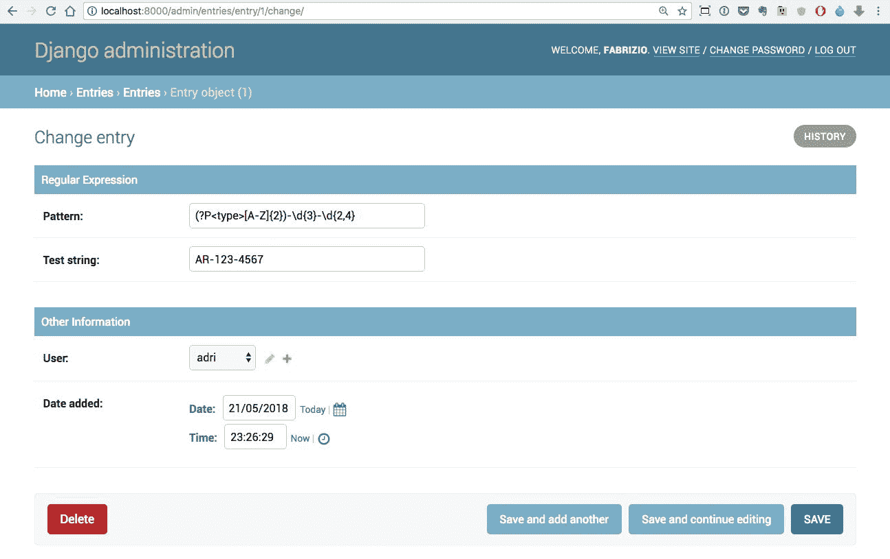
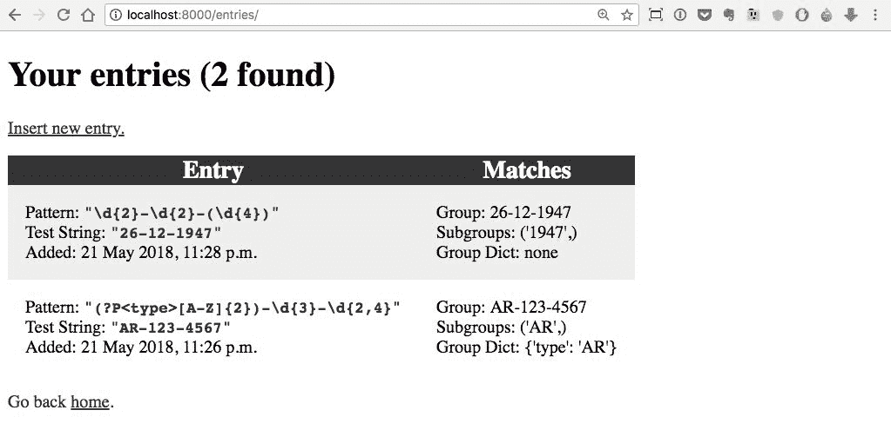
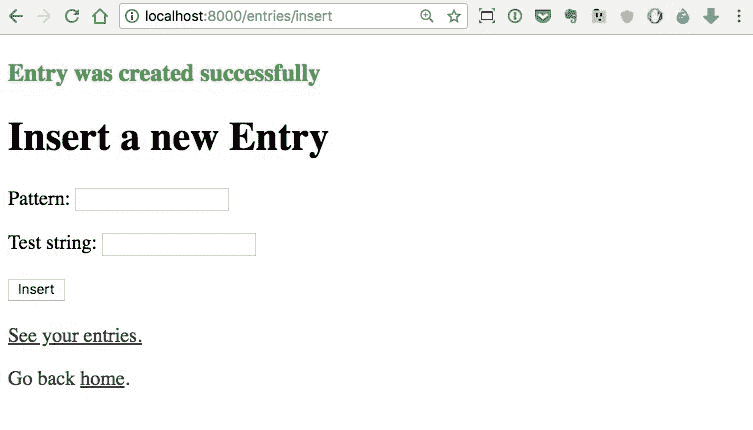

# 十四、网络开发

"Don't believe everything you read on the web." – Confucius

在本章中，我们将一起开发一个网站。通过做一个小项目，我的目标是为您打开一个窗口，让您了解什么是 web 开发，以及如果您想成功地进行 web 开发，您应该知道的主要概念和工具。

我们将特别探讨以下方面：

*   网络编程的基本概念
*   Django web 框架
*   正则表达式
*   Flask 和 Falcon web 框架的简要概述

让我们从基本面开始。

# 什么是网络？

**万维网**（**WWW**或简称**网**是一种通过使用称为**互联网**的媒体访问信息的方式。互联网是一个庞大的网络，一个网络基础设施。其目的是将全球数十亿台设备连接在一起，以便它们能够相互通信。信息以多种语言在互联网上传播，称为**协议**，允许不同的设备使用相同的语言来共享内容。

网络是一种建立在互联网之上的信息共享模式，采用**超文本传输协议**（**HTTP**作为数据通信的基础。因此，网络只是通过互联网交换信息的几种不同方式之一；电子邮件、即时消息、新闻组等都依赖于不同的协议。

# 网络是如何工作的？

总之，HTTP 是一种非对称的**请求-响应****客户机-服务器**协议。HTTP 客户端向 HTTP 服务器发送请求消息。服务器依次返回一条响应消息。换句话说，HTTP 是一种**拉式协议**，其中客户端从服务器拉取信息（而不是**推式协议**，其中服务器将信息下推到客户端）。请看下图：


HTTP 基于**TCP**/**IP**（或**传输控制协议**/**互联网协议**），为可靠的通信交换提供了工具。

HTTP 协议的一个重要特征是它是无状态的。这意味着当前请求不知道以前的请求中发生了什么。这是一个限制，但您可以在浏览网站时产生登录的错觉。不过，在封面下，登录时会保存一个用户信息标记（通常在客户端，保存在名为**cookies**的特殊文件中），这样用户发出的每个请求都能让服务器识别用户并通过显示其姓名提供自定义界面，保持他们的篮子人口，等等。

尽管它非常有趣，但我们不打算深入研究 HTTP 的丰富细节及其工作原理。然而，我们将要编写一个小型网站，这意味着我们必须编写代码来处理 HTTP 请求并返回 HTTP 响应。从现在起，我将不再继续为请求和响应条款预先编写 HTTP，因为我相信不会有任何混淆。

# Django web 框架

对于我们的项目，我们将使用 Python 生态系统中最流行的 web 框架之一：Django。

**web 框架**是一组工具（库、函数、类等），我们可以使用它们编写网站代码。我们需要决定允许针对 web 服务器发出何种请求，以及如何响应这些请求。web 框架是实现这一点的完美工具，因为它为我们处理了许多事情，因此我们可以只关注重要的部分，而不必重新发明轮子。

There are different types of frameworks. Not all of them are designed for writing code for the web. In general, a **framework** is a tool that provides functionalities to facilitate the development of software applications, products, and solutions.

# Django 设计理念

Django 的设计遵循以下原则：

*   **不要重复你自己**（**DRY**）：不要重复代码，并且代码的编写方式要使框架尽可能从尽可能少的代码中推断出尽可能多的内容。
*   **松耦合**：框架的各个层不应该相互了解（除非出于任何原因绝对必要）。当以高内聚力并联时，松耦合效果最佳。把因同一原因而改变的事物放在一起，把因不同原因而改变的事物分开。
*   **更少的代码**：应用程序应该使用尽可能少的代码，并且以一种有利于重用的方式编写。
*   **一致性**：当使用 Django 框架时，无论您针对哪一层进行编码，您的体验都将与设计项目时选择的设计模式和范例非常一致。

框架本身是围绕**模型模板视图**（**MTV**模式设计的，该模式是**模型视图控制器**（**MVC**模式）的变体，其他框架广泛采用该模式。这种模式的目的是分离关注点并促进代码重用和质量。

# 模型层

在这三个层中，这一层定义了应用程序处理的数据结构，并处理数据源。**模型**是表示数据结构的类。通过一些 Django 魔术，模型被映射到数据库表，以便您可以将数据存储在关系数据库中。

A **relational database** stores data in tables in which each column is a property of the data and each row represents a single item or entry in the collection represented by that table. Through the **primary key** of each table, which is that part of the data that allows it to uniquely identify each item, it is possible to establish relationships between items belonging to different tables, that is, to put them into *relation*.

这个系统的优点在于，您不必为了处理数据而编写特定于数据库的代码。您只需正确配置模型并使用它们。数据库上的工作由 Django**对象关系映射**（**ORM**）为您完成，它负责将 Python 对象上的操作转换为关系数据库可以理解的语言：**SQL**（或**结构化查询语言**）。我们在[第 7 章](7.html#5IAP60-2ddb708647cc4530a187c2c6c0e9acfe)、*文件和数据持久性*中看到了 ORM 的一个例子，在这里我们探讨了 SQLAlchemy。

这种方法的一个好处是，您可以在不重写代码的情况下更改数据库，因为所有特定于数据库的代码都是由 Django 动态生成的，这取决于它连接到哪个数据库。关系数据库讲 SQL，但每种数据库都有其独特的风格；因此，在我们的应用程序中不必硬编码任何 SQL 是一个巨大的优势。

Django 允许您随时修改模型。执行此操作时，可以运行一个命令来创建迁移，迁移是将数据库移植到表示模型当前定义的状态所需的一组指令。

总而言之，这一层处理的是定义您需要在网站中处理的数据结构，并通过访问模型（即 Python 对象）为您提供了从数据库中保存和加载数据结构的方法。

# 视图层

视图的功能是处理请求，执行需要执行的任何操作，并最终返回响应。例如，如果您打开浏览器并请求与电子商务商店中的产品类别相对应的页面，则视图可能会与数据库对话，请求作为所选类别的子类别的所有类别（例如，在导航侧栏中显示它们）以及属于所选类别的所有产品，以便在页面上显示它们。

因此，视图是我们实现请求的机制。其结果响应对象可以采用几种不同的形式：JSON 负载、文本、HTML 页面等等。编写网站代码时，您的响应通常由 HTML 或 JSON 组成。

The **Hypertext Markup Language**, or **HTML**, is the standard markup language used to create web pages. Web browsers run engines that are capable of interpreting HTML code and render it into what we see when we open a page of a website.

# 模板层

这一层提供了后端和前端开发之间的桥梁。当视图必须返回 HTML 时，它通常通过准备一个包含一些数据的**上下文对象**（字典），然后将该上下文提供给一个模板，该模板被呈现（即转换为 HTML），并以响应（更准确地说，响应体）的形式返回给调用方。这种机制允许最大限度的代码重用。如果你回到分类的例子，很容易看到，如果你浏览一个销售产品的网站，你点击哪个分类或者你执行什么类型的搜索实际上并不重要，产品页面的布局不会改变。改变的是填充该页面的数据。

因此，页面的布局是由一个模板定义的，该模板是用 HTML 和 Django 模板语言混合编写的。为该页面提供服务的视图收集要在上下文词典中显示的所有产品，并将其提供给模板，该模板将由 Django 模板引擎呈现为 HTML 页面。

# Django URL 调度程序

Django 将**统一资源定位器**（**URL**）与视图关联的方式是将请求的 URL 与注册在特殊文件中的模式进行匹配。URL 表示网站中的一个页面，因此`http://mysite.com/categories?id=123`可能会指向我网站上 ID 为`123`的类别的页面，而`https://mysite.com/login`可能是用户登录页面。

The difference between HTTP and HTTPS is that the latter adds encryption to the protocol so that the data that you exchange with the website is secured. When you put your credit card details on a website, or log in anywhere, or do anything around sensitive data, you want to make sure that you're using HTTPS.

# 正则表达式

Django 将 URL 与模式匹配的方式是通过正则表达式。**正则表达式**是一个字符序列，它定义了一个搜索模式，我们可以用它执行模式和字符串匹配以及查找/替换等操作。

正则表达式有一种特殊的语法来表示诸如数字、字母和空格之类的内容，以及我们期望一个字符出现多少次，等等。对这个主题的完整解释超出了本书的范围。然而，这是一个非常重要的课题，所以我们将一起合作的项目将围绕它展开，希望你能被激发，找到时间自己探索一下。

举一个简单的例子，假设您想要指定一个模式来匹配一个日期，例如`"26-12-1947"`。该字符串由两位数字、一个破折号、两位数字、一个破折号和最后四位数字组成。所以我们可以这样写：`r'[0-9]{2}-[0-9]{2}-[0-9]{4}'`。我们使用方括号创建了一个类，并在其中定义了一系列数字，从`0`到`9`，因此所有可能的数字。然后，在花括号中，我们说我们期望有两个。然后一个破折号，然后我们重复这个模式一次，再重复一次，通过改变我们期望的数字数量，没有最后的破折号。拥有像`[0-9]`这样的类是一种常见的模式，因此创建了一个特殊的符号作为快捷方式：`'\d'`。因此，我们可以像这样重写模式：`r'\d{2}-\d{2}-\d{4}'`，它的工作原理完全相同。字符串前面的**r**代表**raw**，其目的是防止 python 试图解释反斜杠转义序列，以便它们可以按原样传递给正则表达式引擎。

# regex 网站

那么，我们到了。我们将编写一个存储正则表达式的网站，这样我们就可以稍微使用它们。

Before we proceed with creating the project, I'd like to talk about **Cascading Style Sheets** (**CSS**). CSS are files in which we specify how the various elements on an HTML page look. You can set all sorts of properties, such as shape, size, color, margins, borders, and fonts. In this project, I have tried my best to achieve a decent result on the pages, but I'm neither a frontend developer nor a designer, so please don't pay too much attention to how things look. Try to focus on how they work.

# 设置 Django

在 Django 网站上（[https://www.djangoproject.com/](https://www.djangoproject.com/) ），您可以按照教程进行操作，这将使您对 Django 的功能有一个很好的了解。如果需要，可以先学习该教程，然后再回到本示例。所以，首先要做的事；让我们在您的虚拟环境中安装 Django（您会发现它已经安装，因为它是需求文件的一部分）：

```py
$ pip install django  
```

完成此命令后，您可以在控制台中对其进行测试（尝试使用`bpython`进行测试，它提供了一个类似于 IPython 的 shell，但具有很好的内省功能）：

```py
>>> import django
>>> django.VERSION
(2, 0, 5, 'final', 0) 
```

现在安装了 Django，我们可以开始了。我们必须做一些脚手架，所以我会很快引导你通过。

# 启动项目

在书的环境中选择一个文件夹并更改为该文件夹。我会使用`ch14`。从那里，我们可以使用以下命令启动 Django 项目：

```py
$ django-admin startproject regex  
```

这将为名为`regex`的 Django 项目准备框架。切换到`regex`文件夹并运行以下操作：

```py
$ python manage.py runserver  
```

您应该能够使用浏览器进入`http://127.0.0.1:8000/`并查看其工作情况！默认的 Django 页面。这意味着项目已正确设置。当您看到该页面时，使用*Ctrl*+*C*（或控制台中显示的任何内容）杀死服务器。我现在将粘贴项目的最终结构，以便您可以将其用作参考：

```py
$ tree -A regex  # from the ch14 folder
regex
├── entries
│ ├── __init__.py
│ ├── admin.py
│ ├── forms.py
│ ├── migrations
│ │ ├── 0001_initial.py
│ │ └── __init__.py
│ ├── models.py
│ ├── static
│ │ └── entries
│ │ └── css
│ │ └── main.css
│ ├── templates
│ │ └── entries
│ │ ├── base.html
│ │ ├── footer.html
│ │ ├── home.html
│ │ ├── insert.html
│ │ └── list.html
│ └── views.py
├── manage.py
└── regex
 ├── __init__.py
 ├── settings.py
 ├── urls.py
 └── wsgi.py
```

别担心，如果你丢失了文件，我们会找到的。Django 项目通常是几个不同应用程序的集合。每个应用程序都旨在以自包含、可重用的方式提供功能。我们只创建一个名为`entries`：

```py
$ python manage.py startapp entries  
```

在已经创建的`entries`文件夹中，您可以去掉`tests.py`模块。

现在，让我们修复`regex`文件夹中的`regex/settings.py`文件。我们需要将我们的应用程序添加到`INSTALLED_APPS`列表中，以便我们可以使用它（将其添加到列表底部）：

```py
INSTALLED_APPS = [
    'django.contrib.admin',
    ...
    'entries',
]
```

然后，您可能需要根据个人喜好确定语言和时区。我住在伦敦，所以我把他们安排成这样：

```py
LANGUAGE_CODE = 'en-gb'
TIME_ZONE = 'Europe/London'
```

此文件中没有其他操作，因此您可以保存并关闭它。

现在是将**迁移**应用于数据库的时候了。Django 需要数据库支持来处理用户、会话和类似的事情，所以我们需要创建一个数据库并用必要的数据填充它。幸运的是，使用以下命令很容易做到这一点：

```py
$ python manage.py migrate  
```

For this project, we use an SQLite database, which is basically just a file. On a real project, you would use a different database engine, such as MySQL or PostgreSQL.

# 创建用户

现在我们有了数据库，我们可以使用控制台创建超级用户：

```py
$ python manage.py createsuperuser  
```

输入用户名和其他详细信息后，我们有一个具有管理员权限的用户。这足以访问 Django 管理部分，因此请尝试启动服务器：

```py
$ python manage.py runserver  
```

这将启动 Django 开发服务器，这是一个非常有用的内置 web 服务器，您可以在使用 Django 时使用它。现在服务器正在运行，我们可以访问位于`http://localhost:8000/admin/`的管理页面。稍后我将向您展示此部分的屏幕截图。如果您使用刚刚创建的用户的凭据登录并转到“身份验证和授权”部分，您将找到用户。打开它，您将能够看到用户列表。您可以编辑您想要作为管理员的任何用户的详细信息。在我们的例子中，请确保创建一个不同的用户，以便系统中至少有两个用户（稍后我们将需要他们）。我会打电话给第一个用户 Fabrizio（用户名：`fab`）和第二个用户 Adriano（用户名：`adri`），以纪念我的父亲。

顺便说一下，您应该看到 Django 管理面板自动免费提供。你定义你的模型，把它们连接起来，就这样。这是一个令人难以置信的工具，它展示了 Django 的内省功能是多么先进。此外，它是完全可定制和扩展的。这确实是一件优秀的作品。

# 添加入口模型

既然样板已经过时了，而且我们有几个用户，我们已经准备好编写代码了。我们首先将`Entry`模型添加到应用程序中，以便在数据库中存储对象。以下是您需要添加的代码（请记住使用项目树作为参考）：

```py
# entries/models.py
from django.db import models
from django.contrib.auth.models import User
from django.utils import timezone

class Entry(models.Model):
    user = models.ForeignKey(User, on_delete=models.CASCADE)
    pattern = models.CharField(max_length=255)
    test_string = models.CharField(max_length=255)
    date_added = models.DateTimeField(default=timezone.now)

    class Meta:
        verbose_name_plural = 'entries'
```

这是我们将用于在系统中存储正则表达式的模型。我们将存储一个模式、一个测试字符串、对创建条目的用户的引用以及创建的时刻。您可以看到创建一个模型实际上非常简单，但尽管如此，让我们一行一行地进行研究。

首先我们需要从`django.db`导入`models`模块。这将为我们的`Entry`模型提供基类。Django 模型是特殊的类，当我们从`models.Model`继承时，在幕后为我们做了很多工作。

我们需要创建条目的用户的引用，因此我们需要从 Django 的授权应用程序中导入`User`模型，我们还需要导入`timezone`模型以访问`timezone.now()`功能，该功能为我们提供`timezone`感知版本的`datetime.now()`。它的美妙之处在于它与我之前展示的`TIME_ZONE`设置相连接。

至于这个类的主键，如果我们不显式地设置一个，Django 将为我们添加一个。**主键**是允许我们唯一标识数据库中`Entry`对象的键（在这种情况下，Django 将添加一个自动递增的整数 ID）。

因此，我们定义了类，并设置了四个类属性。我们有一个`ForeignKey`属性，它是我们对`User`模型的引用。我们还有两个`CharField`属性，用于保存正则表达式的模式和测试字符串。我们还有`DateTimeField`，其默认值设置为`timezone.now`。请注意，我们这里不叫`timezone.now`，而是`now`，而不是`now()`。因此，我们不是传递一个`DateTime`实例（在解析该行时设置），而是传递一个可调用的函数，当我们在数据库中保存一个条目时调用该函数。这类似于我们在[第 12 章](12.html#92RRI0-2ddb708647cc4530a187c2c6c0e9acfe)、*GUI 和脚本*中为按钮单击分配命令时使用的回调机制。

最后两行很有趣。我们在`Entry`类本身中定义`Meta`类。Django 使用`Meta`类为模型提供各种额外信息。Django 有大量的逻辑根据我们输入到`Meta`类中的信息调整其行为。在这种情况下，在管理面板中，`Entry`的复数版本将是*Entrys*，这是错误的，因此需要手动设置。我们以小写形式指定复数形式，因为 Django 会在需要时为我们将其大写。

现在我们有了一个新模型，我们需要更新数据库以反映代码的新状态。为了做到这一点，我们需要指示 Django 它需要创建代码来更新数据库。此代码称为**迁移**。让我们创建并执行它：

```py
$ python manage.py makemigrations entries
$ python manage.py migrate  
```

完成这两条指令后，数据库将准备好存储`Entry`对象。

There are two different kinds of migrations: data and schema migrations. **Data migrations** port data from one state to another without altering its structure. For example, a data migration could set all products for a category as out of stock by switching a flag to `False` or `0`. A **schema migration** is a set of instructions that alter the structure of the database schema. For example, that could be adding an `age` column to a `Person` table, or increasing the maximum length of a field to account for very long addresses. When developing with Django, it's quite common to have to perform both kinds of migrations over the course of development. Data evolves continuously, especially if you code in an agile environment.

# 自定义管理面板

下一步是将`Entry`模型与管理面板挂钩。您可以用一行代码来完成，但在本例中，我想添加一些选项来定制管理面板显示条目的方式，包括在数据库中所有条目的列表视图中以及在允许我们创建和修改条目的表单视图中。

我们只需添加以下代码：

```py
# entries/admin.py
from django.contrib import admin
from .models import Entry

@admin.register(Entry)
class EntryAdmin(admin.ModelAdmin):
    fieldsets = [
        ('Regular Expression',
         {'fields': ['pattern', 'test_string']}),
        ('Other Information',
         {'fields': ['user', 'date_added']}),
    ]
    list_display = ('pattern', 'test_string', 'user')
    list_filter = ['user']
    search_fields = ['test_string']
```

这简直太美了。我猜你可能已经了解了其中的大部分，即使你是 Django 的新手。

因此，我们首先导入`admin`模块和`Entry`模型。因为我们希望促进代码重用，所以我们使用相对导入（在`models`前面有一个点）导入`Entry`模型。这将允许我们移动或重命名应用程序，而不会有太多麻烦。然后，我们定义了继承自`admin.ModelAdmin`的`EntryAdmin`类。类上的装饰告诉 Django 在管理面板中显示`Entry`模型，我们在`EntryAdmin`类中放置的内容告诉 Django 如何自定义处理此模型的方式。

首先，我们为创建/编辑页面指定`fieldsets`。这将把页面分为两个部分，这样我们可以更好地分别显示内容（模式和测试字符串）和其他细节（用户和时间戳）。

然后，我们自定义列表页面显示结果的方式。我们想查看所有字段，但不想查看日期。我们还希望能够对用户进行筛选，这样我们就可以拥有一个用户所有条目的列表，并且我们希望能够在`test_string`上进行搜索。

我将继续添加三个条目，一个为我自己，两个代表我父亲。结果显示在接下来的两个屏幕截图中。插入后，列表页面如下所示：


我强调了我们在`EntryAdmin`类中定制的这个视图的三个部分。我们可以按用户筛选，搜索，并显示所有字段。如果单击图案，将打开“编辑”视图。

在我们定制之后，它看起来像这样：



注意我们有两个部分：正则表达式和其他信息，这要感谢我们的定制`EntryAdmin`类。尝试一下，为几个不同的用户添加一些条目，熟悉界面。这一切都是免费的，不是很好吗？

# 创建表单

每次在网页上填写详细信息时，都是在表单字段中插入数据。**表单**是 HTML**文档对象模型**（**DOM**树的一部分。在 HTML 中，使用`form`标记创建表单。当您点击提交按钮时，您的浏览器通常会将`form`数据打包在一起，并将其放入`POST`请求的正文中。与用于向 web 服务器请求资源的`GET`请求不同，`POST`请求通常向 web 服务器发送数据，目的是创建或更新资源。因此，处理`POST`请求通常需要比`GET`请求更谨慎。

当服务器收到来自`POST`请求的数据时，需要验证该数据。此外，服务器需要采用安全机制来防止各种类型的攻击。一种非常危险的攻击是**跨站点请求伪造**（**CSRF**）攻击，当数据从非用户身份验证的域发送时会发生这种攻击。Django 允许您以非常优雅的方式处理此问题。

因此，我将向您展示如何使用 Django 表单来创建条目，而不是懒惰地使用 Django 管理员来创建条目。通过使用框架提供的工具，您已经完成了非常好的验证工作（事实上，我们自己不需要添加任何自定义验证）。

Django 中有两种表单类：`Form`和`ModelForm`。您可以使用前者创建一个窗体，其形状和行为取决于如何编写类、添加哪些字段等等。另一方面，后者是一种表单类型，尽管仍然可以自定义，但可以从模型中推断字段和行为。由于`Entry`模型需要一个表单，我们将使用该表单：

```py
# entries/forms.py
from django.forms import ModelForm
from .models import Entry

class EntryForm(ModelForm):
    class Meta:
        model = Entry
        fields = ['pattern', 'test_string']
```

令人惊讶的是，这就是我们所要做的一切，我们可以有一个表格，我们可以放在一个页面上。这里唯一值得注意的是，我们将字段限制为只有`pattern`和`test_string`。只有登录的用户才能访问插入页面，因此我们不需要询问用户是谁，我们已经知道了。至于日期，当我们保存一个`Entry`时，`date_added`字段将根据其默认值进行设置，因此我们也不需要指定。我们将在视图中看到如何在保存之前将用户信息提供给表单。所以，现在背景工作已经完成，我们只需要视图和模板。让我们从视图开始。

# 撰写观点

我们需要写三个观点。我们需要一个用于主页，一个用于显示用户所有条目的列表，另一个用于创建新条目。我们还需要视图来登录和注销。但多亏了 Django，我们不需要写它们。我将按步骤粘贴代码：

```py
# entries/views.py
import re
from django.contrib.auth.decorators import login_required
from django.contrib.messages.views import SuccessMessageMixin
from django.urls import reverse_lazy
from django.utils.decorators import method_decorator
from django.views.generic import FormView, TemplateView
from .forms import EntryForm
from .models import Entry
```

让我们从进口开始。我们需要`re`模块来处理正则表达式，然后我们需要 Django 的一些类和函数，最后，我们需要`Entry`模型和`EntryForm`表单。

# 主视图

第一个视图是`HomeView`：

```py
# entries/views.py
class HomeView(TemplateView):
    template_name = 'entries/home.html'

    @method_decorator(
        login_required(login_url=reverse_lazy('login')))
    def get(self, request, *args, **kwargs):
        return super(HomeView, self).get(request, *args, **kwargs)
```

它继承自`TemplateView`，这意味着将通过呈现带有我们将在视图中创建的上下文的模板来创建响应。我们所要做的就是指定`template_name`类属性以指向正确的模板。Django 将代码重用提升到这样一个程度：如果我们不需要让这个视图只对登录用户开放，那么前两行就足够了。

但是，我们希望此视图仅可供登录用户访问；因此，我们需要用`login_required`来装饰它。现在，历史上，Django 的观点是功能；因此，这个装饰器被设计为接受一个函数，而不是像我们在这个类中使用的方法。我们在这个项目中使用的是基于 Django 类的视图，因此，为了使事情顺利进行，我们需要转换`login_required`以便它接受一个方法（区别在于第一个参数：`self`。我们通过将`login_required`传递到`method_decorator`来实现这一点。

我们还需要向`login_required`装饰师提供`login_url`信息，这里是 Django 的另一个精彩特性。在我们处理完视图之后，您将看到，在 Django 中，您通过一个模式将视图绑定到 URL，该模式由一个字符串（可能是正则表达式，也可能不是正则表达式）和其他信息组成。您可以为`urls.py`文件中的每个条目指定一个名称，这样当您想要引用 URL 时，就不必将其值硬编码到代码中。你所要做的就是让 Django 对我们在`urls.py`中给出的名称中的 URL 进行反向工程，定义 URL 以及与之相关的视图。这一机制将在以后变得更加清晰。现在，只需将`reverse('...')`视为从标识符获取 URL 的一种方式。这样，您只需在`urls.py`文件中编写一次实际 URL，这非常棒。在`views.py`代码中，我们需要使用`reverse_lazy`，它的工作原理与`reverse`完全相同，但有一个主要区别：它只在我们实际需要时（以惰性方式）查找 URL。`reverse_lazy`之所以如此有用，是因为有时我们可能需要从标识符中反转 URL，但在调用`reverse`时，`urls.py`模块尚未加载，从而导致失败。`reverse_lazy`的延迟行为解决了这个问题，因为即使调用是在`urls.py`模块加载之前进行的，但在`urls.py`模块加载之后，标识符的实际反转以延迟的方式进行，以获取相关的 URL。

我们刚刚修饰的`get`方法只调用父类的`get`方法。当然，`get`方法是 Django 在针对绑定到此视图的 URL 执行`GET`请求时调用的方法。

# 条目列表视图

此视图比前一视图有趣得多：

```py
# entries/views.py
class EntryListView(TemplateView):
    template_name = 'entries/list.html'

    @method_decorator(
        login_required(login_url=reverse_lazy('login')))
    def get(self, request, *args, **kwargs):
        context = self.get_context_data(**kwargs)
        entries = Entry.objects.filter(
            user=request.user).order_by('-date_added')
        matches = (self._parse_entry(entry) for entry in entries)
        context['entries'] = list(zip(entries, matches))
        return self.render_to_response(context)

    def _parse_entry(self, entry):
        match = re.search(entry.pattern, entry.test_string)
        if match is not None:
            return (
                match.group(),
                match.groups() or None,
                match.groupdict() or None
            )
        return None
```

首先，我们像以前一样装饰`get`方法。在它里面，我们需要准备一个`Entry`对象的列表，并将其提供给模板，模板会将其显示给用户。为了做到这一点，我们首先像我们应该做的那样获取`context`字典，调用`TemplateView`类的`get_context_data`方法。然后，我们使用 ORM 获取条目列表。我们通过访问对象管理器并对其调用过滤器来实现这一点。我们根据用户登录过滤条目，并要求按降序排序（名称前面的`'-'`指定降序顺序）。`objects`管理器是默认的**管理器**每个 Django 模型在创建时都会增加：它允许我们通过其方法与数据库交互。

我们解析每个条目以获得一个匹配列表（实际上，我将其编码为`matches`是一个生成器表达式）。最后，我们向上下文中添加一个`'entries'`键，其值是`entries`和`matches`的耦合，以便每个`Entry`实例与其模式和测试字符串的结果匹配配对。

在最后一行，我们只要求 Django 使用我们创建的上下文呈现模板。

看看`_parse_entry`方法。它所做的只是用`entry.pattern`在`entry.test_string`上执行搜索。如果生成的`match`对象不是`None`，则表示我们发现了一些东西。如果是这样，我们将返回一个包含三个元素的元组：整体组、子组和组字典。

Notice that `match.groups()` and `match.groupdict()` might return respectively an empty tuple and an empty dict. In order to normalize empty results to a simpler `None`, I use a common pattern in Python by exploiting the `or` operator. `A or B`, in fact, will return `A` if `A` evaluates to a truthy value, or `B` otherwise. Can you think how this might differ from the behavior of the `and` operator?

如果您不熟悉这些术语，不用担心，您很快就会看到一个带有示例的屏幕截图。如果没有匹配项，我们将返回`None`（从技术上讲，这是不需要的，因为 Python 无论如何都会这样做，但为了明确起见，我在这里包含了它）。

# 表单视图

最后，我们来看一下`EntryFormView`：

```py
# entries/views.py
class EntryFormView(SuccessMessageMixin, FormView):
    template_name = 'entries/insert.html'
    form_class = EntryForm
    success_url = reverse_lazy('insert')
    success_message = "Entry was created successfully"

    @method_decorator(
        login_required(login_url=reverse_lazy('login')))
    def get(self, request, *args, **kwargs):
        return super(EntryFormView, self).get(
            request, *args, **kwargs)

    @method_decorator(
        login_required(login_url=reverse_lazy('login')))
    def post(self, request, *args, **kwargs):
        return super(EntryFormView, self).post(
            request, *args, **kwargs)

    def form_valid(self, form):
        self._save_with_user(form)
        return super(EntryFormView, self).form_valid(form)

    def _save_with_user(self, form):
        self.object = form.save(commit=False)
        self.object.user = self.request.user
        self.object.save()
```

出于几个原因，这一点特别有趣。首先，它向我们展示了 Python 多重继承的一个很好的例子。在插入了一个`Entry`之后，我们希望在页面上显示一条消息，因此我们从`SuccessMessageMixin`继承。但是我们也想处理一个表单，所以我们也继承了`FormView`。

Note that, when you deal with mixins and inheritance, you may have to consider the order in which you specify the base classes in the class declaration, as it will affect how methods are found when going up the inheritance chain to serve a call.

为了正确设置此视图，我们需要在开始时指定几个属性：要呈现的模板、用于处理来自`POST`请求的数据的表单类、成功时需要将用户重定向到的 URL 以及成功消息。

另一个有趣的特性是，该视图需要同时处理`GET`和`POST`请求。当我们第一次登陆表单页面时，表单是空的，这就是`GET`请求。另一方面，当我们填写表格并想要提交`Entry`时，我们会提出`POST`请求。您可以看到，`get`的主体在概念上与`HomeView`相同。Django 为我们做了一切。

`post`方法就像`get`一样。我们需要对这两个方法进行编码的唯一原因是，我们可以将它们修饰为需要登录。

在 Django 表单处理过程中（在`FormView`类中），有几个方法可以重写，以便定制整体行为。我们需要用`form_valid`方法来做。表单验证成功时将调用此方法。其目的是保存表单，以便从中创建一个`Entry`对象，然后将其存储在数据库中。

唯一的问题是我们的表单缺少用户。我们需要在呼叫链中截取这一时刻，并将用户信息放在我们自己的身上。这是通过调用非常简单的`_save_with_user`方法来完成的。

首先，我们要求 Django 保存表单，并将`commit`参数设置为`False`。这将创建一个`Entry`实例，而不尝试将其保存到数据库中。立即保存会失败，因为`user`信息不存在。

下一行更新`Entry`实例（`self.object`，添加`user`信息，最后一行可以安全保存。我调用`object`并在实例上设置它的原因是为了遵循原始`FormView`类的功能。

我们在这里摆弄 Django 机制，因此如果我们想让整个过程正常工作，我们需要注意何时以及如何修改它的行为，并确保不会错误地修改它。因此，记住在自定义版本的末尾调用基类的`form_valid`方法（我们使用`super`方法），以确保该方法通常执行的所有其他操作都正确执行，这一点非常重要。

注意请求是如何绑定到每个视图实例的（`self.request`，这样我们在将逻辑重构为方法时就不需要传递它。还请注意，Django 已自动将用户信息添加到请求中。最后，为什么所有的过程都被分割成这些非常小的方法，是因为我们只能覆盖那些我们需要定制的方法。所有这些都消除了编写大量代码的需要。

现在我们已经讨论了视图，让我们看看如何将它们耦合到 URL。

# 捆绑 URL 和视图

在`urls.py`模块中，我们将每个视图绑定到一个 URL。有很多方法可以做到这一点。我选择了最简单的一个，它非常适合本练习的范围，但是如果您打算使用 Django，您可能希望更深入地探讨这个主题。这是整个网站逻辑将围绕的核心；因此，你应该试着把它正确地记下来。注意`urls.py`模块属于项目文件夹：

```py
# regex/urls.py
from django.contrib import admin
from django.urls import path
from django.contrib.auth import views as auth_views
from django.urls import reverse_lazy
from entries.views import HomeView, EntryListView, EntryFormView

urlpatterns = [
    path('admin/', admin.site.urls),
    path('entries/', EntryListView.as_view(), name='entries'),
    path('entries/insert',
        EntryFormView.as_view(),
        name='insert'),

    path('login/',
        auth_views.login,
        kwargs={'template_name': 'admin/login.html'},
        name='login'),
    path('logout/',
        auth_views.logout,
        kwargs={'next_page': reverse_lazy('home')},
        name='logout'),

    path('', HomeView.as_view(), name='home'),
] 
```

如果您熟悉 Django 的版本 1，您会注意到这里的一些差异，因为这个项目是在版本 2 中编码的。*正如您所见，魔力来自`path`函数，它最近取代了`url`函数。首先，我们向它传递一个路径字符串（也称为*路由*），然后是视图，最后是一个名称，我们将在`reverse`和`reverse_lazy`函数中使用该名称来恢复 URL。*

 *注意，当使用基于类的视图时，我们必须将它们转换为函数，这是`path`所期望的。为此，我们对它们调用`as_view()`方法。

还要注意的是，第一个`path`条目对于管理员来说是特殊的。它不指定 URL 和视图，而是指定 URL 前缀和另一个`urls.py`模块（来自`admin.site`包）。这样，Django 将通过在`admin.site.urls`中指定的所有 URL 前面加上`'admin/'`来完成管理部分的所有 URL。我们本可以为 entries 应用程序做同样的事情（我们应该这样做），但我觉得对于这个简单的项目来说，这有点过分了。

此模块中定义的 URL 路径非常简单，不需要定义任何正则表达式。如果您需要使用正则表达式，您可以检查`re_path`函数，该函数就是为此而设计的

我们还包括登录和注销功能，通过使用直接来自`django.contrib.auth`包的视图。我们使用必要的信息（例如注销视图的下一页）丰富声明，并且不需要编写一行代码来处理身份验证。这太棒了，节省了我们很多时间。

每一个 To0t0.x 声明必须在 AUTT1 列表中进行，在这件事情上，重要的是要考虑到，当 Django 试图为请求的 URL 找到一个视图时，这些模式按顺序从上到下执行。第一个匹配的模式将为其提供视图，因此，一般来说，您必须将特定模式置于通用模式之前，否则它们将永远不会被捕获。为了向您展示一个在路由声明中使用正则表达式的示例，`'^shop/categories/$'`需要位于`'^shop'`之前（请注意，`'$'`表示模式的结束，并且在后者中没有指定），否则将永远不会调用它。

因此，模型、表单、管理、视图和 URL 都完成了。剩下的就是处理模板了。这一部分我必须非常简短，因为 HTML 可能非常冗长。

# 编写模板

所有模板都继承自一个基本模板，该模板以非常**面向对象编程**（**OOP**的方式为所有其他模板提供 HTML 结构。它还指定了几个块，这些块是可以由子对象覆盖的区域，以便它们可以为这些区域提供自定义内容。让我们从基本模板开始：

```py
# entries/templates/entries/base.html

<!DOCTYPE html>
<html lang="en">
  <head>
    
      <meta charset="utf-8">
      <meta name="viewport"
       content="width=device-width, initial-scale=1.0">
    

    
      <link href=""
       rel="stylesheet">
    

    <title> Title </title>
  </head>

  <body>
    <div id="page-content">
      
      
    </div>
    <div id="footer">
      
      
    </div>
  </body>
</html>
```

有一个很好的理由从`templates`文件夹重复`entries`文件夹。
部署 Django 网站时，您将所有模板文件收集在一个文件夹下。如果你没有像我那样指定路径，你可能会在 entries 应用程序中得到一个`base.html`模板，在另一个应用程序中得到一个`base.html`模板。最后一个要收集的文件将覆盖具有相同名称的任何其他文件。因此，通过将它们放在`templates/entries`文件夹中，并对您编写的每个 Django 应用程序使用此技术，您可以避免名称冲突的风险（对于任何其他静态文件也是如此）。

关于这个模板，真的没什么好说的，除了它加载了`static`标记，这样我们就可以轻松访问`static`路径，而不用使用``在模板中硬编码它。特殊``部分中的代码是定义逻辑的代码。特殊`{{ ... }}`中的代码表示将在页面上呈现的变量。

我们定义了五个块：`styles`、`meta`、`title`、`page-content`和`footer`，分别用于保存元数据、样式信息、标题、页面内容和页脚。子模板可以选择性地覆盖块，以便在其中提供不同的内容。

下面是页脚：

```py
# entries/templates/entries/footer.html
<div class="footer">
  Go back <a href="">home</a>.
</div>
```

它为我们提供了一个很好的主页链接，该链接来自以下模板：

```py
# entries/templates/entries/home.html

Welcome to the Entry website.


  <h1>Welcome {{ user.first_name }}!</h1>

  <div class="home-option">To see the list of your entries
    please click <a href="">here.</a>
  </div>
  <div class="home-option">To insert a new entry please click
    <a href="">here.</a>
  </div>
  <div class="home-option">To login as another user please click
    <a href="">here.</a>
  </div>
    <div class="home-option">To go to the admin panel
    please click <a href="">here.</a>
  </div>

```

扩展`base.html`模板，覆盖`title`和`page-content`。您可以看到，它所做的基本上就是向用户提供四个链接。这些是条目列表、插入页面、注销页面和管理页面。所有这些都是通过使用``标记完成的，而无需硬编码单个 URL，该标记是`reverse`函数的模板等价物。

插入`Entry`的模板如下：

```py
# entries/templates/entries/insert.html

Insert a new Entry


  
    
      <p class="{{ message.tags }}">{{ message }}</p>
    
  

  <h1>Insert a new Entry</h1>
  <form action="" method="post">
    {{ form.as_p }}
    <input type="submit" value="Insert">
  </form><br>



  <div><a href="">See your entries.</a></div>
  

```

在开始显示消息时有一些条件逻辑（如果有的话），然后我们定义表单。Django 使我们能够通过简单地调用`{{ form.as_p }}`（或者，`form.as_ul`或`form.as_table`来呈现表单。这将为我们创建所有必要的字段和标签。这三个命令之间的区别在于表单的布局方式：作为段落、无序列表或表格。我们只需要将它包装在表单标签中并添加一个提交按钮。这种行为是为了我们的方便而设计的：我们需要自由地塑造我们想要的`<form>`标签，因此 Django 不会干涉这一点。另外，请注意``。

它将由 Django 呈现为令牌，并将成为提交时发送到服务器的数据的一部分。这样，Django 将能够验证请求是否来自允许的源，从而避免前面提到的 CSRF 问题。当我们为`Entry`插入编写视图时，您看到我们如何处理令牌了吗？确切地我们没有为它编写一行代码。Django 通过**中间件**类（`CsrfViewMiddleware`类）自动处理。请参阅 Django 官方文件（[https://docs.djangoproject.com/en/2.0/](https://docs.djangoproject.com/en/2.0/) 进一步探讨这一主题。

对于此页面，我们还使用页脚块显示指向主页的链接。最后，我们有列表模板，这是最有趣的一个：

```py
# entries/templates/entries/list.html

 Entries list 


 
  <h1>Your entries ({{ entries|length }} found)</h1>
  <div><a href="">Insert new entry.</a></div>

  <table class="entries-table">
   <thead>
     <tr><th>Entry</th><th>Matches</th></tr>
   </thead>
   <tbody>
    
     <tr class="entries-list ">
      <td>
        Pattern: <code class="code">
         "{{ entry.pattern }}"</code><br>
        Test String: <code class="code">
         "{{ entry.test_string }}"</code><br>
        Added: {{ entry.date_added }}
      </td>
      <td>
        
         Group: {{ match.0 }}<br>
         Subgroups:
          {{ match.1|default_if_none:"none" }}<br>
         Group Dict: {{ match.2|default_if_none:"none" }}
        
         No matches found.
        
      </td>
     </tr>
    
   </tbody>
  </table>
 
  <h1>You have no entries</h1>
  <div><a href="">Insert new entry.</a></div>
 



 

```

您可能需要一段时间才能习惯模板语言，但实际上，它所要做的就是使用`for`循环创建一个表。我们首先检查是否有任何条目，如果有，我们创建一个表。有两列，一列用于`Entry`，另一列用于匹配。

在`Entry`列中，我们显示`Entry`对象（除了用户），在`Matches`列中，我们显示我们在`EntryListView`中创建的三个元组。请注意，要访问对象的属性，我们使用与 Python 中相同的点语法，例如`{{ entry.pattern }}`或`{{ entry.test_string }}`，等等。

在处理列表和元组时，我们不能使用方括号语法访问项，因此我们也使用点一（`{{ match.0 }}`相当于`match[0]`，等等）。我们还使用一个过滤器，通过管道（`|`操作符，如果匹配项为`None`，则显示一个自定义值。

Django 模板语言（不是真正的 Python）之所以保持简单，有一个确切的原因。如果您发现自己受到语言的限制，这意味着您可能正试图在模板中执行一些实际上应该在视图中执行的操作，而视图中的逻辑更为相关。

请允许我向您展示两个*列表*和*插入*模板的屏幕截图。这是我父亲的条目列表：



请注意循环标记的使用如何将行的背景色从白色更改为浅灰色。这些类在`main.css`文件中定义。

`Entry`插入页面足够智能，可以提供几种不同的场景。当你第一次降落在它上面时，它只给你一个空的表单。如果您填写正确，它将为您显示一条好消息（参见下图）。但是，如果您未能填写这两个字段，它将在它们前面显示一条错误消息，提醒您这些字段是必需的。

另请注意自定义页脚，其中包括指向条目列表的链接和指向主页的链接：



就这样！如果需要，您可以使用 CSS 样式。下载本书的代码，并享受探索和扩展此项目的乐趣。向模型中添加其他内容，创建并应用迁移，使用模板，还有很多事情要做！

Django 是一个非常强大的框架，它提供的功能远远超过了我在本章中向您展示的功能，因此您一定要查看它。它的美妙之处在于 Django 是 Python，因此阅读其源代码是一个非常有用的练习。

# 网络发展的未来

计算机科学是一门非常年轻的学科，与其他几个世纪以来与人类共存的科学分支相比。它的主要特点之一是移动速度极快。它的发展速度如此之快，以至于在短短几年内，你可以看到与花了一个世纪才发生的现实世界的变化相当的变化。因此，作为一名程序员，你必须时刻关注这个世界上发生的事情。

目前，由于功能强大的计算机非常便宜，而且几乎每个人都可以访问它们，因此趋势是尽量避免在后端投入过多的工作负载，而让前端处理其中的一部分。因此，在过去几年中，JavaScript 框架和库（如 jQuery、主干网和最近的 React）变得非常流行。Web 开发已经从后端处理数据、准备数据并提供数据到前端显示数据的模式转变为后端有时只是用作 API、纯粹的数据提供者的模式。前端通过 API 调用从后端获取数据，然后处理其余的数据。这种转变促进了范例的存在，例如**单页应用程序**（**SPA**），在理想情况下，整个页面加载一次，然后根据通常来自后端的内容进行演变。电子商务网站在页面中加载搜索结果时，不会刷新周围的结构，这些网站也采用了类似的技术。浏览器可以执行异步调用，例如**异步 JavaScript 和 XML**（**AJAX**），这些调用可以返回可以读取、操作的数据，并使用 JavaScript 代码注入页面。

因此，如果您计划从事 web 开发，我强烈建议您熟悉 JavaScript（如果您还没有），以及 API。在本章的最后几页中，我将给出一个示例，说明如何使用两种不同的 Python 微框架：Flask 和 Falcon 来创建一个简单的 API。

# 写烧瓶视图

烧瓶（[http://flask.pocoo.org/](http://flask.pocoo.org/) 是一个 Python 微框架。它提供的特性比 Django 少得多，但是如果您的项目非常小，那么它可能是一个更好的选择。但根据我的经验，当开发人员在项目开始时选择 Flask 时，他们最终会一个接一个地添加插件，直到他们拥有我所说的 Django Frankenstein 项目。敏捷意味着必须周期性地花费时间来减少技术债务。然而，从烧瓶切换到 Django 可能是一个令人畏缩的操作，因此，当启动一个新项目时，请确保考虑它的演变。我对这件事厚颜无耻的看法很简单：我总是喜欢 Django，因为我个人更喜欢它，但你可能不同意我的观点，所以我想给你举个例子。

在您的`ch14`文件夹中，创建一个具有以下结构的`flask`文件夹：

```py
$ tree -A flask  # from the ch14 folder
flask
├── main.py
└── templates
 └── main.html
```

基本上，我们将编写两个简单的文件：一个 Flask 应用程序和一个 HTML 模板。Flask 使用 Jinja2 作为模板引擎。它非常流行，速度也非常快，甚至 Django 也开始为它提供本地支持：

```py
# flask/templates/main.html
<!doctype html>
<title>Hello from Flask</title>
<h1>
  
    Hello {{ name }}!
  
    Hello shy person!
  
</h1>
```

模板在攻击性上几乎很简单。它所做的只是根据`name`变量的存在来更改问候语。更有趣的是呈现它的 Flask 应用程序：

```py
# flask/main.py
from flask import Flask, render_template

app = Flask(__name__)

@app.route('/')
@app.route('/<name>')
def hello(name=None):
    return render_template('main.html', name=name)
```

我们创建一个`app`对象，它是一个 Flask 应用程序。我们只提供模块的完全限定名称，该名称存储在`__name__`中。

然后，我们编写了一个简单的`hello`视图，它接受一个可选的`name`参数。在视图主体中，我们只需呈现`main.html`模板，将`name`参数传递给它，而不管其值如何。

有趣的是路线。与 Django 捆绑视图和 URL 的方式（即`urls.py`模块）不同，在`Flask`中，您使用一个或多个`@app.route`装饰器装饰视图。在本例中，我们修饰了两次：第一行将视图绑定到根 URL（`/`），而第二行将视图绑定到带有名称信息的根 URL（`/<name>`）。

切换到`flask`文件夹并键入（确保您已经安装了带有`$ pip install flask`的烧瓶，或者通过在书的源代码中安装要求）：

```py
$ FLASK_APP=main.py flask run
```

您可以打开浏览器并转到`http://127.0.0.1:5000/`。此 URL 没有名称信息；所以，你会看到你好害羞的人！它写得又好又大。尝试向该 URL 添加一些内容，例如`http://127.0.0.1:5000/Milena`。点击*进入*页面将变为 Hello Milena！（所以你会向我妹妹问好）。

当然，Flask 提供的远不止这些，但我们没有足够的空间来讨论更复杂的示例。不过，这绝对值得探索。有几个项目成功地使用了它，用它创建网站或 API 非常有趣。Flask 的作者 Armin Ronacher 是一位成功且多产的程序员。他还创建或合作了其他几个有趣的项目，如 Werkzeug、Jinja2、Click 和 Sphinx。他还为 Python AST 模块提供了一些功能。

# 在 Falcon 中构建 JSON 报价服务器

猎鹰（[http://falconframework.org/](http://falconframework.org/) 是另一个用 Python 编写的微框架，它被设计为轻巧、快速和灵活。我已经看到这个相对年轻的项目由于其速度而变得非常流行，这令人印象深刻，所以我很高兴向您展示一个使用它的小例子。我们将构建一个 API，它返回来自佛陀的随机引用。

在您的`ch14`文件夹中，创建一个名为`falcon`的新文件夹。我们将有两个文件：`quotes.py`和`main.py`。要运行此示例，请安装 Falcon 和 Gunicorn（`$ pip install falcon gunicorn`或本书的完整要求）。Falcon 是框架，**Gunicorn**（**Green Unicorn**）是一个用于 Unix 的 Python WSGI HTTP 服务器（用外行的话说，它是指用于运行服务器的技术）。

The Web Server Gateway Interface (WSGI) is a simple calling convention for web servers to forward requests to web applications or frameworks written in Python. If you wish to learn more, please checkout [PEP333](https://www.python.org/dev/peps/pep-0333/), which defines the interface.

设置完毕后，首先创建`quotes.py`文件：

```py
# falcon/quotes.py
quotes = [
    "Thousands of candles can be lighted from a single candle, "
    "and the life of the candle will not be shortened. "
    "Happiness never decreases by being shared.",
    ...
    "Peace comes from within. Do not seek it without.",
    ...
]
```

您将在本书的源代码中找到完整的引用列表。如果你没有，你可以填写你最喜欢的语录。请注意，并非每一行的末尾都有逗号。在 Python 中，只要字符串在括号（或大括号）中，就可以这样连接字符串。它被称为**隐式连接**。

主应用程序的代码不长，但很有趣：

```py
# falcon/main.py
import json
import random
import falcon
from quotes import quotes

class QuoteResource:
    def on_get(self, req, resp):
        quote = {
            'quote': random.choice(quotes),
            'author': 'The Buddha'
        }
        resp.body = json.dumps(quote)

api = falcon.API()
api.add_route('/quote', QuoteResource())
```

让我们从课堂开始。在 Django 中我们有一个`get`方法，在 Flask 中我们定义了一个函数，在这里我们编写了一个`on_get`方法，这种命名风格让我想起了 Java/C 事件处理程序。它接受由框架自动提供的请求和响应参数。在它的正文中，我们定义了一个带有随机选择的引用和作者信息的词典。然后我们将该字典转储为 JSON 字符串，并将响应体设置为其值。我们不需要归还任何东西，猎鹰会帮我们处理的。

在文件的末尾，我们创建了 Falcon 应用程序，并对其调用`add_route`，将刚刚编写的处理程序绑定到我们想要的 URL。

设置完毕后，切换到`falcon`文件夹并键入：

```py
$ gunicorn main:api  
```

然后，向`http://127.0.0.1:8000/quote`发出请求（或简单地用浏览器打开页面）。当我这么做的时候，我得到了这个 JSON 作为回应：

```py
{
  quote: "Peace comes from within. Do not seek it without.",
  author: "The Buddha"
}
```

在`falcon`文件夹中，我为您留下了一个`stress.py`模块，用于测试 Falcon 代码的速度。看看你能不能自己做，这对你来说应该很容易。

无论最终用于 web 开发的框架是什么，也要尽量让自己了解其他选择。有时，您可能会遇到不同的框架是正确的选择，掌握不同工具的工作知识将给您带来优势。

# 总结

在本章中，我们将介绍 web 开发。我们讨论了一些重要的概念，比如 DRY 哲学，以及框架作为一种工具的概念，它为我们提供了编写代码以满足请求所需的许多东西。我们还讨论了 MTV 模式，以及这三个层如何很好地结合在一起实现请求-响应路径。

然后，我们简要介绍了正则表达式，这是一个极为重要的主题，它是为 URL 路由提供工具的层。

有许多不同的框架，Django 无疑是最好的和使用最广泛的框架之一，因此值得探索，特别是它的源代码，它写得很好。

还有其他非常有趣和重要的框架，比如 Flask。它们提供的功能更少，但在执行时间和设置方面可能更快。Falcon 项目是一个速度极快的项目，其基准非常出色。

对请求-响应机制的工作原理以及 web 的总体工作原理有一个坚实的了解是很重要的，这样最终就不会对您必须使用哪种框架有太大的影响。你会很快学会，因为你只需要熟悉一种你已经知道很多的做事方法。

探索至少三个框架，并尝试提出不同的用例，以决定其中哪一个是理想的选择。当你能够做出选择时，你就会知道你对它们有足够的了解。

# 告别

我希望您仍然感到口渴，本书只是您走向 Python 的许多步骤中的第一步。这是一门真正美妙的语言，非常值得深入学习。

我希望你和我一起享受这段旅程，我尽了最大的努力让它变得有趣。对我来说，我写这几页真的很开心。

Python 是开源的，所以请继续分享它，并考虑支持它周围的精彩社区。

直到下一次，我的朋友，再见！*