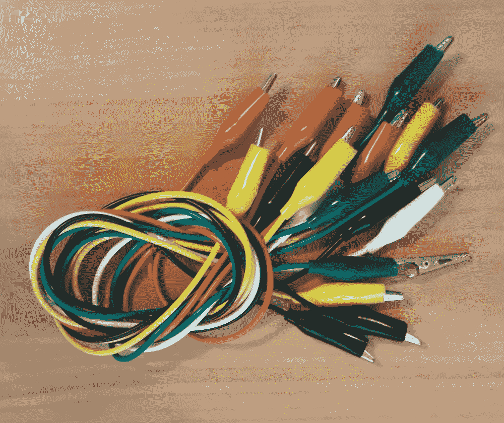
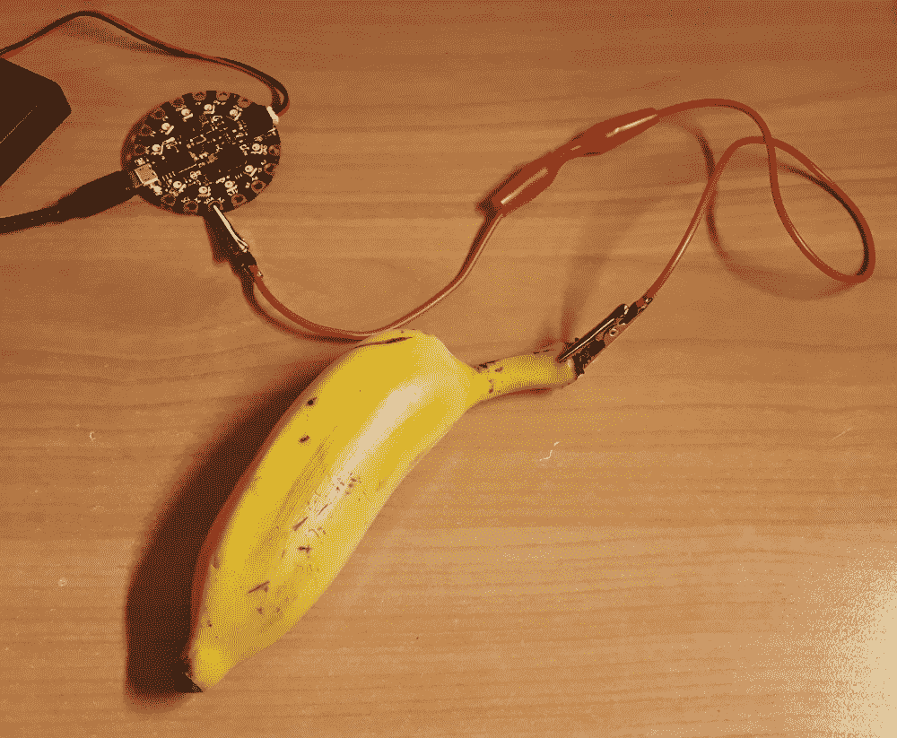
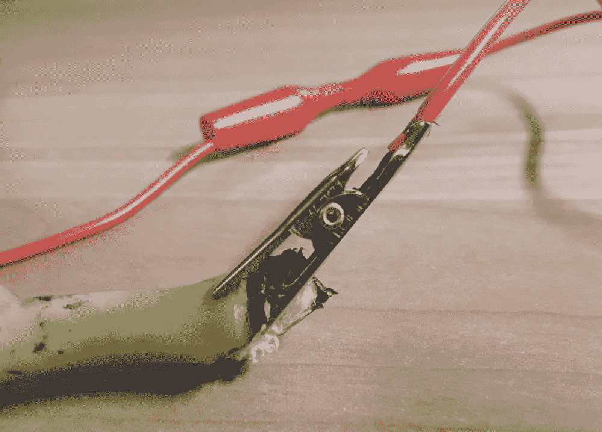
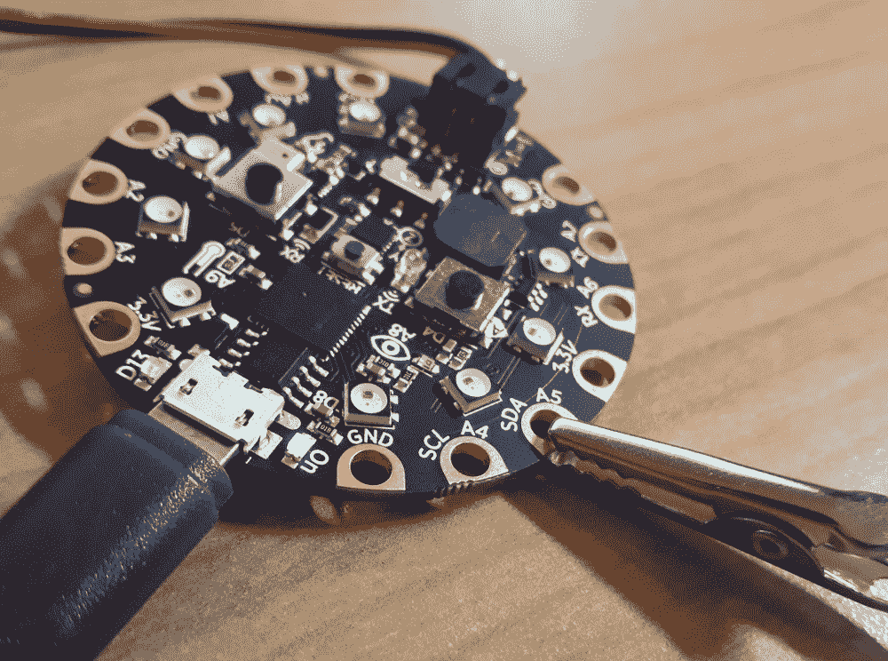
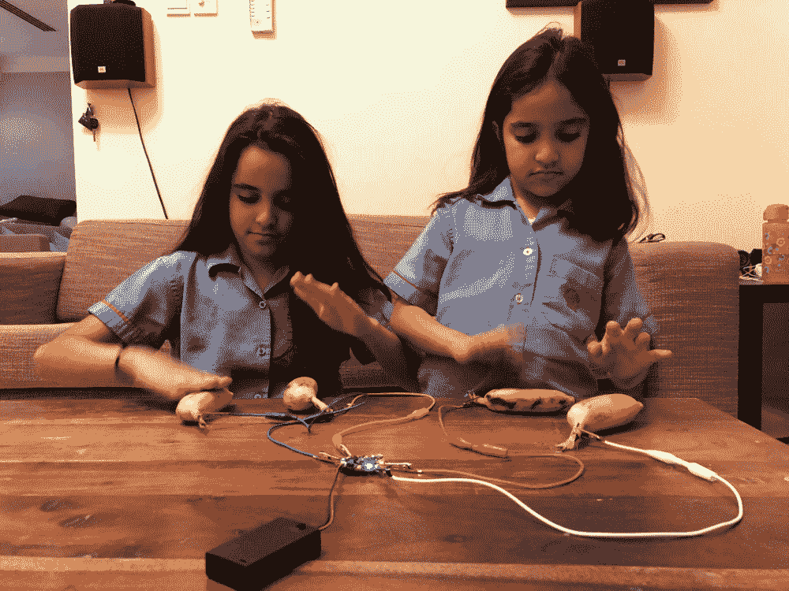

# 水果曲调

在本章中，您将学习如何使用 Circuit Playground Express 和一些香蕉创建一个乐器。我们将把四根香蕉连接到板上的触摸板，这样您就可以触摸每根香蕉时播放特定的音乐声音。我们将通过点亮每个触摸板旁边的像素来为项目添加一些视觉反馈。这个项目将展示一个创造性、有趣的方式，让您的电容触摸项目生动起来。

通过在项目中使用意想不到的物体，如香蕉，您可以为平凡的 MicroPython 项目增添独特的风味。

在本章中，我们将介绍以下配方：

+   创建一个类来响应触摸事件

+   创建一个函数来启用扬声器输出

+   创建一个播放音频文件的函数

+   使用 NeoPixel 对象控制像素

+   创建一个触摸处理程序来播放声音

+   创建一个触摸处理程序来点亮像素

+   创建一个事件循环来处理所有触摸事件

# 技术要求

本章的代码文件可以在 GitHub 存储库的`Chapter07`文件夹中找到，网址为[`github.com/PacktPublishing/MicroPython-Cookbook`](https://github.com/PacktPublishing/MicroPython-Cookbook)。

本章中的许多配方需要将四个音频文件传输到 Circuit Playground Express 板上。它们都可以从 GitHub 存储库的`Chapter07`文件夹中下载。它们应该保存在与您的`main.py`文件同级的文件夹中。

# Circuit Playground Express 触摸板

Circuit Playground Express 带有七个电容触摸板。它们中的每一个都可以连接到任何可以导电的物体，触摸该物体将触发传感器。您可以使用良好的电导体，如金属，甚至较弱的导体，如香蕉。

水能导电，许多水果的表面含有足够的水分，可以被触摸板检测到触摸事件。许多水果，如香蕉、酸橙、橙子和苹果，都可以胜任。您可以使用鳄鱼夹将水果连接到触摸板。下一张照片显示了一捆鳄鱼夹：



这些鳄鱼夹子有各种不同的颜色。最好为每个触摸板使用不同颜色的导线。这样会更容易追踪哪个水果连接到哪个触摸板。在这个项目中，我们将使用绿色、红色、黄色和白色的导线。我们将把每个触摸板旁边的像素颜色也设置为绿色、红色、黄色和白色。下一张照片显示了一个香蕉连接到一个触摸板：



鳄鱼夹非常有效，因为它们不需要任何焊接，可以轻松连接到板和各种物体。鳄鱼夹的牙齿也会产生良好的抓地力，从而可以在板和香蕉之间建立良好的电连接。下一张照片更近距离地展示了连接到香蕉上的鳄鱼夹的牙齿：



下一张照片显示了连接到触摸板的鳄鱼夹的更近距离视图：



在之前的章节中，我们使用 Circuit Playground Express 库与板上的不同组件进行交互。当您使用该库播放音频文件时，该库将阻塞您的代码，直到文件播放完成。在这个项目中，我们希望能够立即响应触摸事件，并在当前音频文件播放完成之前播放新的声音。

只有使用直接控制音频播放和触摸板的 CircuitPython 库才能实现这种程度的控制。因此，本章中的代码将不使用 Circuit Playground Express 库。通过采用这种方法，我们还将看到如何更精细地控制板上的组件。

# 创建一个用于响应触摸事件的类

在这个教程中，您将学习如何定义一个类，以帮助您处理特定触摸板上的触摸事件。当您创建这个类的实例时，您需要指定触摸板的名称和一个回调函数，每次触摸事件开始和结束时都会调用该函数。我们可以将这个类用作构建块，为将连接到香蕉的四个触摸板中的每一个调用一个回调。您可以在自己的项目中使用这种代码风格，每当您想要处理一系列事件时，都可以使用一组回调函数。

# 准备工作

您需要访问 Circuit Playground Express 上的 REPL 来运行本教程中提供的代码。

# 如何操作...

让我们来看看这个教程所需的步骤：

1.  在 REPL 中运行以下代码行：

```py
>>> from touchio import TouchIn
>>> import board
>>> 
>>> def handle(name, current):
...     print(name, current)
...     
...     
... 
>>> handle('A1', True)
A1 True
>>> handle('A1', False)
A1 False
>>> 
```

1.  在这个阶段，我们已经定义了一个函数，它将通过打印触摸板的名称以及触摸板是否被触摸来处理触摸事件。

1.  运行下一块代码以创建一个检查触摸事件的类。在定义类之后，它将创建一个实例，然后打印出触摸板的当前触摸状态：

```py
>>> class TouchEvent:
...     THRESHOLD_ADJUSTMENT = 400
...     
...     def __init__(self, name, onchange):
...         self.name = name
...         self.last = False
...         self.onchange = onchange
...         pin = getattr(board, name)
...         self.touch = TouchIn(pin)
...         self.touch.threshold += self.THRESHOLD_ADJUSTMENT
...         
...         
... 
>>> event = TouchEvent('A1', handle)
>>> event.touch.value
False
```

1.  按住触摸板 A1 上的手指，同时运行下一块代码：

```py
>>> event.touch.value
True
```

1.  运行下一块代码以创建一个具有处理触摸事件的方法的类：

```py
>>> class TouchEvent:
...     THRESHOLD_ADJUSTMENT = 400
...     
...     def __init__(self, name, onchange):
...         self.name = name
...         self.last = False
...         self.onchange = onchange
...         pin = getattr(board, name)
...         self.touch = TouchIn(pin)
...         self.touch.threshold += self.THRESHOLD_ADJUSTMENT
...         
...     def process(self):
...         current = self.touch.value
...         if current != self.last:
...             self.onchange(self.name, current)
...             self.last = current
...             
...             
... 
>>> event = TouchEvent('A1', handle)
```

1.  按住触摸板 A1 上的手指，同时运行下一块代码：

```py
>>> event.process()
A1 True
```

1.  以下代码应放入`main.py`文件中：

```py
from touchio import TouchIn
import board

class TouchEvent:
    THRESHOLD_ADJUSTMENT = 400

    def __init__(self, name, onchange):
        self.name = name
        self.last = False
        self.onchange = onchange
        pin = getattr(board, name)
        self.touch = TouchIn(pin)
        self.touch.threshold += self.THRESHOLD_ADJUSTMENT

    def process(self):
        current = self.touch.value
        if current != self.last:
            self.onchange(self.name, current)
            self.last = current

def handle(name, current):
    print(name, current)

event = TouchEvent('A1', handle)
while True:
    event.process()
```

当执行时，此脚本将在触摸板 A1 上触摸事件开始或结束时重复打印消息。

# 它是如何工作的...

`TouchEvent`类被定义为帮助我们跟踪触摸板的最后已知状态，并在其状态发生变化时调用指定的回调函数。定义了默认的触摸阈值为`400`，以便该类的子类可以覆盖该值。构造函数期望第一个参数是要监视的触摸板的名称，第二个参数是在检测到状态变化时将被调用的回调函数。

名称和回调函数将保存在实例的属性中。最后已知状态初始化为`False`值。然后，从`board` Python 模块中检索命名触摸板的引脚值。该引脚用于创建`TouchIn`实例，也保存为对象的属性。最后，在初始化过程中设置了该触摸板的阈值。

在类上定义的另一个方法将定期调用，以检查触摸板状态的任何变化，并通过调用定义的回调函数来处理这种状态变化。这是通过获取当前触摸状态并将其与最后已知值进行比较来完成的。如果它们不同，就会调用回调函数并保存该值以供将来参考。

定义了一个简单的函数来处理任何触摸事件，只需打印出发生状态变化的触摸板的名称和当前状态。

在这些类和函数定义之后，我们创建了这个类的一个实例，它将监视触摸板 A1。然后我们进入一个无限循环，不断检查状态变化，并在每次发生状态变化时打印出一条消息。

# 还有更多...

在触摸板上设置触摸阈值总是一个好主意。如果不这样做，当与触摸板交互时会出现很多误报。所选择的值`400`是适合将香蕉与鳄鱼夹连接的特定设置的值。最好连接实际用于项目的对象，然后将该值微调为合适的值。

在这个示例中，我们混合了函数和类的用法。这种方法在 Python 中是完全可以的，它让你同时拥有两种最好的方式。我们需要在每次调用`process`方法之间保持状态，这就是为什么我们选择了一个类来实现这个目的。回调函数不需要在调用之间保持任何状态，所以一个简单的函数就可以胜任。

# 另请参阅

以下是一些参考资料：

+   关于`TouchIn`类的文档可以在[`circuitpython.readthedocs.io/en/3.x/shared-bindings/touchio/TouchIn.html`](https://circuitpython.readthedocs.io/en/3.x/shared-bindings/touchio/TouchIn.html)找到。

+   关于`board` Python 模块的文档可以在[`circuitpython.readthedocs.io/en/3.x/shared-bindings/board/__init__.html#module-board`](https://circuitpython.readthedocs.io/en/3.x/shared-bindings/board/__init__.html#module-board)找到。

# 创建一个函数来启用扬声器输出

在这个示例中，您将学习如何创建一个函数，当调用时，将启用扬声器。如果在音频播放之前不启用扬声器，那么它将通过引脚 A0 播放，可以连接耳机。

这个项目将使用板子上的扬声器而不是耳机，所以我们需要在脚本开始时使用这个函数来启用扬声器。除了向您展示如何启用扬声器之外，这个示例还将向您介绍数字控制输入/输出引脚的方法。

# 准备工作

您需要访问 Circuit Playground Express 上的 REPL 来运行本示例中提供的代码。

# 如何做...

让我们来看看这个示例所需的步骤：

1.  在 REPL 中执行下一个代码块：

```py
>>> from digitalio import DigitalInOut
>>> import board
>>> 
>>> 
>>> speaker_control = DigitalInOut(board.SPEAKER_ENABLE)
>>> speaker_control
<DigitalInOut>
```

1.  在这个阶段，我们已经创建了一个连接到启用扬声器的引脚的对象。运行下一个代码块来启用扬声器：

```py
>>> speaker_control.switch_to_output(value=True)
```

1.  重新加载板子并再次进入 REPL。下一个代码块将定义启用扬声器的函数，并调用它：

```py
>>> from digitalio import DigitalInOut
>>> import board
>>> 
>>> def enable_speakers():
...     speaker_control = DigitalInOut(board.SPEAKER_ENABLE)
...     speaker_control.switch_to_output(value=True)
...     
...     
... 
>>> enable_speakers()
```

# 它是如何工作的...

首先定义了`enable_speakers`函数。它不接收任何参数，因为板子上只有一个扬声器需要启用，并且不返回任何东西，因为一旦扬声器启用，它的引脚就不需要再进行交互。`DigitalInOut`对象用于与启用扬声器的引脚进行交互。创建了这个对象后，调用`switch_to_output`方法来启用扬声器输出。在定义函数之后，调用它来启用扬声器。

# 还有更多...

在这个示例中使用的`DigitalInOut`对象可以用来与各种引脚进行交互。例如，在这块板子上，它可以用来连接读取来自按键 A 和按键 B 的输入的引脚。一旦正确连接和配置这些按键引脚，就可以开始轮询引脚的值，以检查按键是否被按下。

# 另请参阅

以下是一些参考资料：

+   `DigitalInOut`对象的示例用法可以在[`learn.adafruit.com/adafruit-circuit-playground-express/circuitpython-digital-in-out`](https://learn.adafruit.com/adafruit-circuit-playground-express/circuitpython-digital-in-out)找到。

+   关于`DigitalInOut`对象的文档可以在[`circuitpython.readthedocs.io/en/3.x/shared-bindings/digitalio/DigitalInOut.html`](https://circuitpython.readthedocs.io/en/3.x/shared-bindings/digitalio/DigitalInOut.html)找到。

# 创建一个函数来播放音频文件

在这个示例中，您将学习如何创建一个函数，当调用时，将在内置扬声器上播放特定的音频文件。这个示例将说明如何访问音频输出设备，以及如何读取`.wav`文件的内容，将其转换为音频流，并将该音频流馈送到板载音频播放设备。这个示例中展示的技术可以用于各种需要更精细控制音频文件播放方式的项目中。

# 准备工作

您需要访问 Circuit Playground Express 上的 REPL 来运行本教程中提供的代码。

# 如何做...

让我们来看看本教程所需的步骤：

1.  使用 REPL 运行以下代码行：

```py
>>> from digitalio import DigitalInOut
>>> from audioio import WaveFile, AudioOut
>>> import board
>>> import time
>>> 
>>> def enable_speakers():
...     speaker_control = DigitalInOut(board.SPEAKER_ENABLE)
...     speaker_control.switch_to_output(value=True)
...     
...     
... 
>>> enable_speakers()
>>> speaker = AudioOut(board.SPEAKER)
>>> speaker
<AudioOut>
>>> 
```

1.  在这个阶段，我们已经启用了扬声器，并创建了一个对象来向扬声器提供音频数据。当您运行下一块代码时，您应该听到扬声器上播放钢琴音符：

```py
>>> file = open('piano.wav', "rb")
>>> audio = WaveFile(file)
>>> speaker.play(audio)
>>> 
```

1.  运行下一块代码以再次听到相同的钢琴音符，但这次是通过函数调用播放：

```py
>>> def play_file(speaker, path):
...     file = open(path, "rb")
...     audio = WaveFile(file)
...     speaker.play(audio)
...     
...     
... 
>>> play_file(speaker, 'piano.wav')
```

1.  以下代码应放入`main.py`文件中，当执行时，它将在重新加载板时播放单个钢琴音符：

```py
from digitalio import DigitalInOut
from audioio import WaveFile, AudioOut
import board
import time

def play_file(speaker, path):
    file = open(path, "rb")
    audio = WaveFile(file)
    speaker.play(audio)

def enable_speakers():
    speaker_control = DigitalInOut(board.SPEAKER_ENABLE)
    speaker_control.switch_to_output(value=True)

enable_speakers()
speaker = AudioOut(board.SPEAKER)
play_file(speaker, 'piano.wav')
time.sleep(100)
```

# 工作原理...

首先，启用扬声器，以便我们可以在没有耳机的情况下听到音频播放。然后使用`AudioOut`类来访问音频输出设备。然后调用`play_file`函数，传递扬声器音频对象和将要播放的音频文件的路径。此函数以二进制模式打开文件。

然后使用此文件对象创建`WaveFile`对象，该对象将以音频流的形式返回数据。然后将此音频数据提供给`AudioOut`对象上的`play`方法以开始播放。此方法立即返回，并且不等待播放完成。这就是为什么之后调用`sleep`方法，以便在主脚本结束执行之前给板子一个播放音频流的机会。

如果您从文件中排除这行代码并重新加载代码，那么脚本将在板子有机会播放文件之前退出，您将听不到任何音频播放。

# 还有更多...

使用此函数，您可以通过仅传递音频输出对象和文件路径来播放任意数量的音频文件。您还可以将此教程用作进一步尝试与此板附带的音频播放库的起点。例如，有一种方法可以轮询和检查最后提供的流是否仍在播放，或者是否已完成播放。

# 另请参阅

以下是一些参考资料：

+   有关`AudioOut`对象的文档可以在[`circuitpython.readthedocs.io/en/3.x/shared-bindings/audioio/AudioOut.html`](https://circuitpython.readthedocs.io/en/3.x/shared-bindings/audioio/AudioOut.html)找到。

+   有关`WaveFile`对象的文档可以在[`circuitpython.readthedocs.io/en/3.x/shared-bindings/audioio/WaveFile.html`](https://circuitpython.readthedocs.io/en/3.x/shared-bindings/audioio/WaveFile.html)找到。

# 使用 NeoPixel 对象控制像素

在本教程中，您将学习如何使用 NeoPixel 对象控制板上的像素。我们在之前的章节中涵盖了这个对象中的许多方法，但这是我们第一次直接创建 NeoPixel 对象。直接使用 NeoPixel 对象的技能非常有用，而不是通过另一个对象访问它。如果您决定向项目添加额外的环或像素条，那么您将需要直接访问此对象来控制像素。

# 准备工作

您需要访问 Circuit Playground Express 上的 REPL 来运行本教程中提供的代码。

# 如何做...

让我们来看看本教程所需的步骤：

1.  在 REPL 中运行以下代码行：

```py
>>> from neopixel import NeoPixel
>>> import board
>>> 
>>> PIXEL_COUNT = 10
>>> pixels = NeoPixel(board.NEOPIXEL, PIXEL_COUNT)
>>> pixels.brightness = 0.05
>>> pixels[0] = 0xFF0000
```

1.  在运行上一个代码块之后，第一个像素应该变成红色。运行下一个代码块以使第二个像素变成绿色：

```py
>>> RGB = dict(
...     black=0x000000,
...     white=0xFFFFFF,
...     green=0x00FF00,
...     red=0xFF0000,
...     yellow=0xFFFF00,
... )
>>> pixels[1] = RGB['green']
```

1.  运行下一个代码块以关闭第一个像素：

```py
>>> pixels[0] = RGB['black']
```

1.  以下代码应放入`main.py`文件中，当执行时，它将使前两个像素变成红色和绿色：

```py
from neopixel import NeoPixel
import board

PIXEL_COUNT = 10
RGB = dict(
    black=0x000000,
    white=0xFFFFFF,
    green=0x00FF00,
    red=0xFF0000,
    yellow=0xFFFF00,
)

pixels = NeoPixel(board.NEOPIXEL, PIXEL_COUNT)
pixels.brightness = 0.05
pixels[0] = RGB['red']
pixels[1] = RGB['green']

while True:
    pass
```

# 工作原理...

`NeoPixel`类用于访问板上的像素数组。当我们创建此对象时，我们必须指定要连接到的板上的引脚以及连接到该引脚的像素数。

在 Circuit Playground Express 的情况下，板上有 10 个像素。我们将此值保存在全局常量中，以提高代码的可读性。然后将像素的亮度设置为 5%。

在项目中需要的五种不同颜色的名称和十六进制代码在全局字典中定义。白色、绿色、红色和黄色分别与附加电线的四种颜色相关。黑色用于关闭像素。然后，我们将第一个和第二个像素设置为红色和绿色。最后，我们运行一个无限循环，以便我们可以看到这些颜色并阻止脚本退出。

# 还有更多...

此代码具有与板载的任何 10 个像素进行交互所需的一切。您可以使用此基本代码开始尝试提供对象上可用的不同方法。使用这些不同的方法，您可以一次性更改所有像素的颜色。您还可以关闭默认的自动写入功能，然后直接控制您对颜色所做的更改何时应用。通过此库，可以完全控制像素的低级别控制。

# 另请参阅

以下是一些参考资料：

+   可以在[`circuitpython.readthedocs.io/projects/neopixel/en/latest/examples.html`](https://circuitpython.readthedocs.io/projects/neopixel/en/latest/examples.html)找到有关测试像素功能的文档。

+   可以在[`circuitpython.readthedocs.io/projects/neopixel/en/latest/`](https://circuitpython.readthedocs.io/projects/neopixel/en/latest/)找到 NeoPixel 驱动程序的概述。

# 创建触摸处理程序以播放声音

在本教程中，我们将创建我们的触摸处理程序的第一个版本。此第一个版本将在检测到触摸事件时播放特定的音频文件。然后，我们可以在以后的教程中使用此处理程序，以将每个触摸板映射到特定的音频文件。我们还将在以后的教程中扩展此处理程序的功能，以在触摸事件中添加光和声音。事件处理程序是许多软件系统的常见部分。本教程将帮助您了解如何在 MicroPython 项目中使用这种常见方法。

# 准备工作

您需要访问 Circuit Playground Express 上的 REPL 才能运行本教程中提供的代码。

# 如何做...

让我们来看看本教程所需的步骤：

1.  在 REPL 中执行下一块代码：

```py
>>> from touchio import TouchIn
>>> from digitalio import DigitalInOut
>>> from audioio import WaveFile, AudioOut
>>> import board
>>> def enable_speakers():
...     speaker_control = DigitalInOut(board.SPEAKER_ENABLE)
...     speaker_control.switch_to_output(value=True)
...     
...     
... 
>>> def play_file(speaker, path):
...     file = open(path, "rb")
...     audio = WaveFile(file)
...     speaker.play(audio)
...     
...     
... 
>>> enable_speakers()
>>> speaker = AudioOut(board.SPEAKER)
```

1.  此时，我们已经启用了扬声器，并设置了一个对象来在扬声器上播放音频文件。在下一块代码中，我们将定义一个`Handler`类，然后创建一个将使用我们的`speaker`对象的实例：

```py
>>> class Handler:
...     def __init__(self, speaker):
...         self.speaker = speaker
...         
...     def handle(self, name, state):
...         if state:
...             play_file(self.speaker, 'piano.wav')
... 
>>> handler = Handler(speaker)
```

1.  当您运行下一块代码时，您应该能听到扬声器上的钢琴声音：

```py
>>> handler.handle('A1', True)
```

1.  以下代码应放入`main.py`文件中，当执行时，每次触摸 A1 触摸板时都会播放钢琴声音：

```py
from touchio import TouchIn
from digitalio import DigitalInOut
from audioio import WaveFile, AudioOut
import board

def enable_speakers():
    speaker_control = DigitalInOut(board.SPEAKER_ENABLE)
    speaker_control.switch_to_output(value=True)

def play_file(speaker, path):
    file = open(path, "rb")
    audio = WaveFile(file)
    speaker.play(audio)

class Handler:
    def __init__(self, speaker):
        self.speaker = speaker

    def handle(self, name, state):
        if state:
            play_file(self.speaker, 'piano.wav')

class TouchEvent:
    THRESHOLD_ADJUSTMENT = 400

    def __init__(self, name, onchange):
        self.name = name
        self.last = False
        self.onchange = onchange
        pin = getattr(board, name)
        self.touch = TouchIn(pin)
        self.touch.threshold += self.THRESHOLD_ADJUSTMENT

    def process(self):
        current = self.touch.value
        if current != self.last:
            self.onchange(self.name, current)
            self.last = current

enable_speakers()
speaker = AudioOut(board.SPEAKER)
handler = Handler(speaker)
event = TouchEvent('A1', handler.handle)
while True:
    event.process()
```

# 工作原理...

所定义的`Handler`类将用于响应触摸事件。它在构造函数中期望一个参数，即将处理音频播放的`speaker`对象。此对象保存到对象实例的属性中。然后，该类定义了一个方法，每次发生触摸事件时都会调用该方法。该方法期望第一个参数是触摸板的名称，第二个参数是指示触摸板状态的布尔值。

当调用该方法时，它会检查触摸板是否被触摸；如果是，则调用`play_file`函数播放钢琴声音。本教程中的其余代码支持不断检查新触摸事件并调用已定义的处理程序的过程。

# 还有更多...

在这个例子中，配方只会在按下单个触摸板时播放一个声音。但是，它也为我们扩展提供了核心结构。您可以尝试使用这个配方并尝试两个触摸板，每个都播放不同的声音。您可以通过将多个定义的事件对象连接到不同的处理程序来实现这一点。在以后的配方中，您将看到单个事件类定义和单个处理程序类定义可以用于连接到四个不同的触摸板并播放四种不同的声音。

# 另见

以下是一些参考资料：

+   `AudioOut`类的源代码可以在[`github.com/adafruit/circuitpython/blob/3.x/shared-bindings/audioio/AudioOut.c`](https://github.com/adafruit/circuitpython/blob/3.x/shared-bindings/audioio/AudioOut.c)找到。

+   `WaveFile`类的源代码可以在[`github.com/adafruit/circuitpython/blob/3.x/shared-bindings/audioio/WaveFile.c`](https://github.com/adafruit/circuitpython/blob/3.x/shared-bindings/audioio/WaveFile.c)找到。

# 创建一个触摸处理程序来点亮像素

在这个配方中，我们将创建一个触摸处理程序，通过播放声音和点亮像素来对触摸事件做出反应。当触摸传感器被触发时，处理程序将播放声音并点亮特定的像素。当触摸传感器检测到您已经松开手指时，点亮的特定像素将关闭。

通过这种方式，您可以听到并看到板子对每个配置的触摸板的独特反应。这个配方展示了一种有用的方式，可以根据不同的触发输入创建不同类型的输出。当您添加一些独特的音频和视觉输出以对不同类型的人类输入做出反应时，许多项目可以变得生动起来。

# 准备好

您需要访问 Circuit Playground Express 上的 REPL 才能运行本配方中提供的代码。

# 如何做...

让我们来看看这个配方所需的步骤：

1.  使用 REPL 运行以下代码行。这将设置扬声器并创建一个与像素交互的对象：

```py
>>> from touchio import TouchIn
>>> from digitalio import DigitalInOut
>>> from audioio import WaveFile, AudioOut
>>> from neopixel import NeoPixel
>>> import board
>>> 
>>> PIXEL_COUNT = 10
>>> 
>>> def enable_speakers():
...     speaker_control = DigitalInOut(board.SPEAKER_ENABLE)
...     speaker_control.switch_to_output(value=True)
...     
...     
... 
>>> def play_file(speaker, path):
...     file = open(path, "rb")
...     audio = WaveFile(file)
...     speaker.play(audio)
... 
>>> 
>>> enable_speakers()
>>> speaker = AudioOut(board.SPEAKER)
>>> pixels = NeoPixel(board.NEOPIXEL, PIXEL_COUNT)
>>> pixels.brightness = 0.05
```

1.  在下一块代码中，我们将定义一个`Handler`类，然后创建一个实例，将对象传递给它来处理扬声器和像素：

```py
>>> class Handler:
...     def __init__(self, speaker, pixels):
...         self.speaker = speaker
...         self.pixels = pixels
...         
...     def handle(self, name, state):
...         if state:
...             play_file(self.speaker, 'piano.wav')
...             self.pixels[0] = 0xFF0000
...         else:
...             self.pixels[0] = 0x000000
...             
... 
>>> handler = Handler(speaker, pixels)
```

1.  当您运行下一块代码时，您应该听到扬声器上的钢琴声音，并且第一个像素应该变成红色：

```py
>>> handler.handle('A1', True)
```

1.  运行下一块代码，您应该看到第一个像素灯关闭：

```py
>>> handler.handle('A1', False)
```

1.  以下代码应放入`main.py`文件中：

```py
from touchio import TouchIn
from digitalio import DigitalInOut
from audioio import WaveFile, AudioOut
from neopixel import NeoPixel
import board

PIXEL_COUNT = 10

def enable_speakers():
    speaker_control = DigitalInOut(board.SPEAKER_ENABLE)
    speaker_control.switch_to_output(value=True)

def play_file(speaker, path):
    file = open(path, "rb")
    audio = WaveFile(file)
    speaker.play(audio)

class Handler:
    def __init__(self, speaker, pixels):
        self.speaker = speaker
        self.pixels = pixels

    def handle(self, name, state):
        if state:
            play_file(self.speaker, 'piano.wav')
            self.pixels[0] = 0xFF0000
        else:
            self.pixels[0] = 0x000000

class TouchEvent:
    THRESHOLD_ADJUSTMENT = 400

    def __init__(self, name, onchange):
        self.name = name
        self.last = False
        self.onchange = onchange
        pin = getattr(board, name)
        self.touch = TouchIn(pin)
        self.touch.threshold += self.THRESHOLD_ADJUSTMENT

    def process(self):
        current = self.touch.value
        if current != self.last:
            self.onchange(self.name, current)
            self.last = current

enable_speakers()
speaker = AudioOut(board.SPEAKER)
pixels = NeoPixel(board.NEOPIXEL, PIXEL_COUNT)
pixels.brightness = 0.05
handler = Handler(speaker, pixels)
event = TouchEvent('A1', handler.handle)
while True:
    event.process()
```

当执行脚本时，它将在触摸 A1 时播放钢琴声音并点亮一个像素。

# 它是如何工作的...

定义的`Handler`类将在检测到触摸事件时播放声音并点亮像素。这个类的构造函数接受扬声器和像素对象，并将它们保存到实例中以供以后使用。每次调用`handle`方法时，它都会检查触摸板当前是否被按下。

如果按下，一个像素会点亮并播放声音。如果释放垫子，同一个像素将关闭。脚本的其余部分负责初始化扬声器和像素，以便它们可以被处理程序使用，并创建一个无限循环，每次检测到事件时都会调用处理程序。

# 还有更多...

这个配方中的脚本每次都会点亮一个特定的像素。您可以扩展它，每次按下触摸板时使用随机颜色。有多种方法可以在按下触摸板的时间越长时点亮更多的像素。另一个有趣的实验是在每次事件发生时让板子播放随机声音。现在我们已经添加了声音和光，有更多的选择可以将创造力应用到这个项目中，并创建一个更独特的项目。

# 另见

以下是一些参考资料：

+   可以在[`learn.adafruit.com/circuit-playground-express-piano-in-the-key-of-lime/`](https://learn.adafruit.com/circuit-playground-express-piano-in-the-key-of-lime/)找到将酸橙连接到 Circuit Playground Express 的项目。

+   `TouchIn`类的源代码可以在[`github.com/adafruit/circuitpython/blob/3.x/shared-bindings/touchio/TouchIn.c`](https://github.com/adafruit/circuitpython/blob/3.x/shared-bindings/touchio/TouchIn.c)找到。

# 创建事件循环以处理所有触摸事件

本章的最后一个教程将本章中的所有先前教程结合起来，以完成香蕉音乐机。除了以前的教程之外，我们还需要创建一个事件循环，将所有这些逻辑结合到一个结构中，以处理所有四个触摸板及其相关的音频文件和像素。完成本教程后，您将能够创建通用的事件循环和处理程序，以满足您可能创建的嵌入式项目的不同需求。

# 准备工作

您需要访问 Circuit Playground Express 上的 REPL 才能运行本教程中提供的代码。

# 操作步骤...

让我们来看看完成本教程所需的步骤：

1.  在 REPL 中运行以下代码行：

```py
>>> from touchio import TouchIn
>>> from digitalio import DigitalInOut
>>> from audioio import WaveFile, AudioOut
>>> from neopixel import NeoPixel
>>> import board
>>> 
>>> PIXEL_COUNT = 10
>>> TOUCH_PADS = ['A1', 'A2', 'A5', 'A6']
>>> SOUND = dict(
...     A1='hit.wav',
...     A2='piano.wav',
...     A5='tin.wav',
...     A6='wood.wav',
... )
>>> RGB = dict(
...     black=0x000000,
...     white=0xFFFFFF,
...     green=0x00FF00,
...     red=0xFF0000,
...     yellow=0xFFFF00,
... )
>>> PIXELS = dict(
...     A1=(6, RGB['white']),
...     A2=(8, RGB['red']),
...     A5=(1, RGB['yellow']),
...     A6=(3, RGB['green']),
... )
```

1.  我们现在已经导入了我们脚本中所需的所有库，并创建了我们脚本中所需的主要数据结构。运行下一个代码块，扬声器应该会播放钢琴声音：

```py
>>> def play_file(speaker, path):
...     file = open(path, "rb")
...     audio = WaveFile(file)
...     speaker.play(audio)
...     
... 
>>> def enable_speakers():
...     speaker_control = DigitalInOut(board.SPEAKER_ENABLE)
...     speaker_control.switch_to_output(value=True)
...     
... 
>>> enable_speakers()
>>> speaker = AudioOut(board.SPEAKER)
>>> play_file(speaker, SOUND['A2'])
```

1.  运行下一个代码块以创建我们事件处理程序的实例：

```py
>>> class Handler:
...     def __init__(self, speaker, pixels):
...         self.speaker = speaker
...         self.pixels = pixels
...         
...     def handle(self, name, state):
...         pos, color = PIXELS[name]
...         if state:
...             play_file(self.speaker, SOUND[name])
...             self.pixels[pos] = color
...         else:
...             self.pixels[pos] = RGB['black']
...             
... 
>>> class TouchEvent:
...     THRESHOLD_ADJUSTMENT = 400
...     
...     def __init__(self, name, onchange):
...         self.name = name
...         self.last = False
...         self.onchange = onchange
...         pin = getattr(board, name)
...         self.touch = TouchIn(pin)
...         self.touch.threshold += self.THRESHOLD_ADJUSTMENT
...         
...     def process(self):
...         current = self.touch.value
...         if current != self.last:
...             self.onchange(self.name, current)
...             self.last = current
...             
... 
>>> pixels = NeoPixel(board.NEOPIXEL, PIXEL_COUNT)
>>> pixels.brightness = 0.05
>>> handler = Handler(speaker, pixels)
```

1.  运行下一个代码块以模拟在 2 号触摸板上的触摸事件。您应该听到钢琴声音，并看到一个像素变红：

```py
>>> handler.handle('A2', True)
```

1.  以下代码应放入`main.py`文件中，当执行时，每次按下四个配置的触摸板之一时，它将播放不同的声音并点亮不同的像素：

```py
from touchio import TouchIn
from digitalio import DigitalInOut
from audioio import WaveFile, AudioOut
from neopixel import NeoPixel
import board

PIXEL_COUNT = 10
TOUCH_PADS = ['A1', 'A2', 'A5', 'A6']
SOUND = dict(
    A1='hit.wav',
    A2='piano.wav',
    A5='tin.wav',
    A6='wood.wav',
)
RGB = dict(
    black=0x000000,
    white=0xFFFFFF,
    green=0x00FF00,
    red=0xFF0000,
    yellow=0xFFFF00,
)
PIXELS = dict(
    A1=(6, RGB['white']),
    A2=(8, RGB['red']),
    A5=(1, RGB['yellow']),
    A6=(3, RGB['green']),
)

def play_file(speaker, path):
    file = open(path, "rb")
    audio = WaveFile(file)
    speaker.play(audio)

def enable_speakers():
    speaker_control = DigitalInOut(board.SPEAKER_ENABLE)
    speaker_control.switch_to_output(value=True)

class Handler:
    def __init__(self, speaker, pixels):
        self.speaker = speaker
        self.pixels = pixels

    def handle(self, name, state):
        pos, color = PIXELS[name]
        if state:
            play_file(self.speaker, SOUND[name])
            self.pixels[pos] = color
        else:
            self.pixels[pos] = RGB['black']

class TouchEvent:
    THRESHOLD_ADJUSTMENT = 400

    def __init__(self, name, onchange):
        self.name = name
        self.last = False
        self.onchange = onchange
        pin = getattr(board, name)
        self.touch = TouchIn(pin)
        self.touch.threshold += self.THRESHOLD_ADJUSTMENT

    def process(self):
        current = self.touch.value
        if current != self.last:
            self.onchange(self.name, current)
            self.last = current

def main():
    enable_speakers()
    speaker = AudioOut(board.SPEAKER)
    pixels = NeoPixel(board.NEOPIXEL, PIXEL_COUNT)
    pixels.brightness = 0.05
    handler = Handler(speaker, pixels)
    events = [TouchEvent(i, handler.handle) for i in TOUCH_PADS]
    while True:
        for event in events:
            event.process()

main()
```

# 工作原理...

`main`函数包含我们的事件循环。该函数首先初始化扬声器和像素。然后，它创建一个单个处理程序实例。这个单个处理程序实例足够通用，可以用作所有四个触摸板的处理程序。

然后，创建一个事件列表，其中每个事件都连接到四个触摸板中的一个。启动一个无限循环，循环遍历每个事件对象，并调用其`process`方法，以便在检测到触摸板状态变化时调用事件处理程序。

脚本顶部的常量用于指定要使用的触摸板的名称，每个触摸板要播放的声音文件，以及按下触摸板时要设置的像素位置和颜色。

# 还有更多...

该脚本大量使用了多种数据结构，以便在函数和类定义中不需要硬编码值。使用字典作为自然结构，将每个触摸板名称映射到应该播放的音频文件名。使用数据结构列表定义将连接的触摸板的名称。最后，使用元组的字典将触摸板映射到其相关的像素位置和颜色。Python 具有丰富的数据结构集，有效利用时可以使代码更易读和易维护。

该项目将四根香蕉连接到板上，每根香蕉触摸时都会播放不同的声音。由于代码被构造为立即响应每次触摸，所以甚至可以让两个人同时玩。下一张照片显示了两个人，每人手持一对香蕉，创作音乐并控制板上的像素：



# 另请参阅

以下是一些参考资料：

+   有关使用 CircuitPython 提供音频输出的文档可以在[`learn.adafruit.com/adafruit-circuit-playground-express/circuitpython-audio-out`](https://learn.adafruit.com/adafruit-circuit-playground-express/circuitpython-audio-out)找到。

+   `NeoPixel`类的源代码可以在[`github.com/adafruit/Adafruit_CircuitPython_NeoPixel`](https://github.com/adafruit/Adafruit_CircuitPython_NeoPixel)找到。
