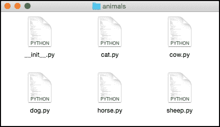
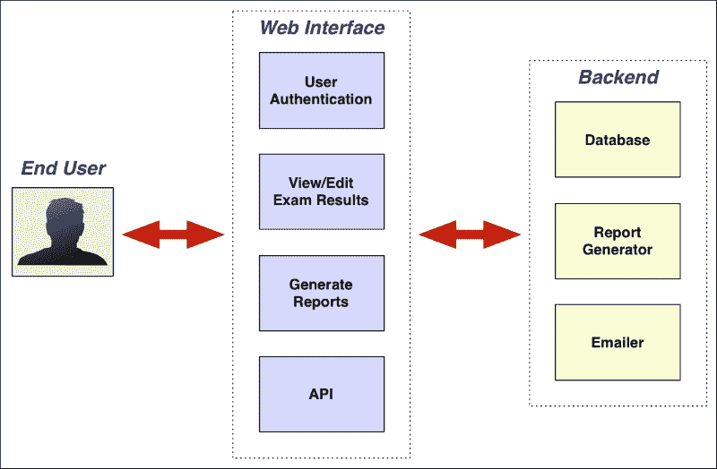
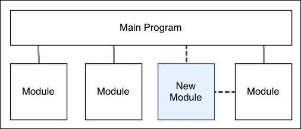
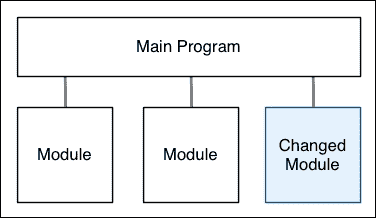
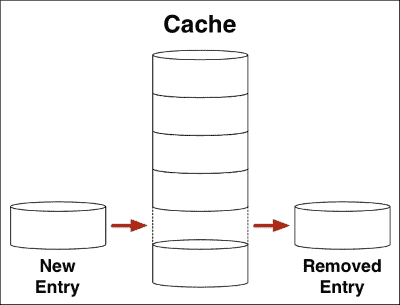

# 第一章：介绍模块化编程

模块化编程是现代开发人员的必备工具。过去那种随便拼凑然后希望它能工作的日子已经一去不复返。要构建持久的健壮系统，您需要了解如何组织程序，使其能够随着时间的推移而增长和发展。*意大利面编程*不是一个选择。模块化编程技术，特别是使用 Python 模块和包，将为您提供成功的工具，使您能够成为快速变化的编程领域的专业人士。

在这一章中，我们将：

+   查看模块化编程的基本方面

+   看看 Python 模块和包如何被用来组织您的代码

+   了解当不使用模块化编程技术时会发生什么

+   了解模块化编程如何帮助您掌握开发过程

+   以 Python 标准库为例，看看模块化编程是如何使用的

+   创建一个简单的程序，使用模块化技术构建，以了解它在实践中是如何工作的

让我们开始学习模块和它们的工作原理。

# 介绍 Python 模块

对于大多数初学者程序员来说，他们的第一个 Python 程序是著名的*Hello World*程序的某个版本。这个程序可能看起来像这样：

```py
print("Hello World!")
```

这个一行程序将保存在磁盘上的一个文件中，通常命名为`hello.py`，并且通过在终端或命令行窗口中输入以下命令来执行：

```py
**python hello.py**

```

然后 Python 解释器将忠实地打印出您要求它打印的消息：

```py
**Hello World!**

```

这个`hello.py`文件被称为**Python 源文件**。当您刚开始时，将所有程序代码放入单个源文件是组织程序的好方法。您可以定义函数和类，并在底部放置指令，当您使用 Python 解释器运行程序时，它会启动您的程序。将程序代码存储在 Python 源文件中可以避免每次想要告诉 Python 解释器该做什么时都需要重新输入它。

然而，随着您的程序变得更加复杂，您会发现越来越难以跟踪您定义的所有各种函数和类。您会忘记放置特定代码的位置，并且发现越来越难记住所有各种部分是如何组合在一起的。

模块化编程是一种组织程序的方式，随着程序变得更加复杂。您可以创建一个 Python **模块**，一个包含 Python 源代码以执行某些有用功能的源文件，然后将此模块**导入**到您的程序中，以便您可以使用它。例如，您的程序可能需要跟踪程序运行时发生的各种事件的各种统计信息。最后，您可能想知道每种类型的事件发生了多少次。为了实现这一点，您可以创建一个名为`stats.py`的 Python 源文件，其中包含以下 Python 代码：

```py
def init():
    global _stats
    _stats = {}

def event_occurred(event):
    global _stats
    try:
        _stats[event] = _stats[event] + 1
    except KeyError:
        _stats[event] = 1

def get_stats():
    global _stats
    return sorted(_stats.items())
```

`stats.py` Python 源文件定义了一个名为`stats`的模块—正如您所看到的，模块的名称只是源文件的名称，不包括`.py`后缀。您的主程序可以通过导入它并在需要时调用您定义的各种函数来使用这个模块。以下是一个无聊的例子，展示了如何使用`stats`模块来收集和显示有关事件的统计信息：

```py
import stats

stats.init()
stats.event_occurred("meal_eaten")
stats.event_occurred("snack_eaten")
stats.event_occurred("meal_eaten")
stats.event_occurred("snack_eaten")
stats.event_occurred("meal_eaten")
stats.event_occurred("diet_started")
stats.event_occurred("meal_eaten")
stats.event_occurred("meal_eaten")
stats.event_occurred("meal_eaten")
stats.event_occurred("diet_abandoned")
stats.event_occurred("snack_eaten")

for event,num_times in stats.get_stats():
    print("{} occurred {} times".format(event, num_times))
```

当然，我们对记录餐点不感兴趣—这只是一个例子—但这里需要注意的重要事情是`stats`模块如何被导入，以及`stats.py`文件中定义的各种函数如何被使用。例如，考虑以下代码行：

```py
stats.event_occurred("snack_eaten")
```

因为`event_occurred()`函数是在`stats`模块中定义的，所以每当您引用这个函数时，都需要包括模块的名称。

### 注意

有多种方法可以导入模块，这样你就不需要每次都包含模块的名称。我们将在第三章 *使用模块和包* 中看到这一点，当我们更详细地了解命名空间和`import`命令的工作方式时。

正如您所看到的，`import`语句用于加载一个模块，每当您看到模块名称后跟着一个句点，您就可以知道程序正在引用该模块中定义的某个东西（例如函数或类）。

# 介绍 Python 包

就像 Python 模块允许您将函数和类组织到单独的 Python 源文件中一样，Python **包**允许您将多个模块组合在一起。

Python 包是具有特定特征的目录。例如，考虑以下 Python 源文件目录：



这个 Python 包叫做`animals`，包含五个 Python 模块：`cat`、`cow`、`dog`、`horse`和`sheep`。还有一个名为`__init__.py`的特殊文件。这个文件被称为**包初始化文件**；这个文件的存在告诉 Python 系统这个目录包含一个包。包初始化文件还可以用于初始化包（因此得名），也可以用于使导入包变得更容易。

### 注意

从 Python 3.3 版本开始，包不总是需要包含初始化文件。然而，没有初始化文件的包（称为**命名空间包**）仍然相当罕见，只在非常特定的情况下使用。为了保持简单，我们将在本书中始终使用常规包（带有`__init__.py`文件）。

就像我们在调用模块内的函数时使用模块名称一样，当引用包内的模块时，我们使用包名称。例如，考虑以下代码：

```py
import animals.cow
animals.cow.speak()
```

在此示例中，`speak()`函数是在`cow.py`模块中定义的，它本身是`animals`包的一部分。

包是组织更复杂的 Python 程序的一种很好的方式。您可以使用它们将相关的模块分组在一起，甚至可以在包内定义包（称为*嵌套包*）以保持程序的超级组织。

请注意，`import`语句（以及相关的`from...import`语句）可以以各种方式用于加载包和模块到您的程序中。我们在这里只是浅尝辄止，向您展示了 Python 中模块和包的样子，以便您在程序中看到它们时能够识别出来。我们将在第三章 *使用模块和包* 中更深入地研究模块和包的定义和导入方式。

### 提示

**下载示例代码**

本书的代码包也托管在 GitHub 上，网址为[`github.com/PacktPublishing/Modular-Programming-with-Python`](https://github.com/PacktPublishing/Modular-Programming-with-Python)。我们还有来自丰富书籍和视频目录的其他代码包，可在[`github.com/PacktPublishing/`](https://github.com/PacktPublishing/)上找到。快去看看吧！

# 使用模块和包来组织程序

模块和包不仅仅是用来将 Python 代码分布在多个源文件和目录中的，它们还允许您*组织*您的代码以反映程序试图做什么的逻辑结构。例如，想象一下，您被要求创建一个 Web 应用程序来存储和报告大学考试成绩。考虑到您得到的业务需求，您为应用程序提出了以下整体结构：



该程序分为两个主要部分：一个**网络界面**，用于与用户交互（以及通过 API 与其他计算机程序交互），以及一个**后端**，用于处理将信息存储在数据库中的内部逻辑、生成报告和向学生发送电子邮件的逻辑。正如您所看到的，网络界面本身已被分解为四个部分：

+   一个用户认证部分，处理用户注册、登录和退出

+   一个用于查看和输入考试结果的网络界面

+   一个用于生成报告的网络界面

+   一个 API，允许其他系统根据请求检索考试结果

在考虑应用程序的每个逻辑组件（即上图中的每个框）时，您也开始考虑每个组件将提供的功能。在这样做时，您已经在模块化方面进行思考。实际上，应用程序的每个逻辑组件都可以直接实现为 Python 模块或包。例如，您可以选择将程序分为两个主要包，命名为`web`和`backend`，其中：

+   `web`包中有名为`authentication`、`results`、`reports`和`api`的模块

+   `backend`包中有名为`database`、`reportgenerator`和`emailer`的模块

正如您所看到的，上图中的每个阴影框都成为了一个 Python 模块，每个框的分组都成为了一个 Python 包。

一旦您决定要定义的包和模块集合，您就可以开始通过在每个模块中编写适当的函数集来实现每个组件。例如，`backend.database`模块可能有一个名为`get_students_results()`的函数，它返回给定科目和年份的单个学生的考试结果。

### 注意

在实际的 Web 应用程序中，您的模块化结构可能实际上会有所不同。这是因为您通常使用诸如 Django 之类的 Web 应用程序框架来创建 Web 应用程序，该框架会对您的程序施加自己的结构。但是，在这个例子中，我们将模块化结构保持得尽可能简单，以展示业务功能如何直接转化为包和模块。

显然，这个例子是虚构的，但它展示了您如何以模块化的方式思考复杂的程序，将其分解为单独的组件，然后依次使用 Python 模块和包来实现这些组件中的每一个。

# 为什么要使用模块化编程技术？

使用模块化设计技术的一大好处是，它们迫使您考虑程序应该如何结构化，并允许您定义一个随着程序发展而增长的结构。您的程序将是健壮的，易于理解，易于在程序范围扩大时重新构造，也易于其他人一起使用。

木匠有一句座右铭同样适用于模块化编程：每样东西都有其位置，每样东西都应该在其位置上。这是高质量代码的标志之一，就像是一个组织良好的木匠车间的标志一样。

要了解为什么模块化编程是如此重要的技能，请想象一下，如果在编写程序时没有应用模块化技术会发生什么。如果您将所有的 Python 代码放入单个源文件中，不尝试逻辑地排列您的函数和类，并且只是随机地将新代码添加到文件的末尾，您最终会得到一堆难以理解的糟糕代码。以下是一个没有任何模块化组织的程序的示例：

```py
import configparser

def load_config():
    config = configparser.ConfigParser()
    config.read("config.ini")
    return config['config']

def get_data_from_user():
    config = load_config()
    data = []
    for n in range(config.getint('num_data_points')):
        value = input("Data point {}: ".format(n+1))
        data.append(value)
    return data

def print_results(results):
    for value,num_times in results:
        print("{} = {}".format(value, num_times))

def analyze_data():
    data = get_data_from_user()
    results = {}
    config = load_config()
    for value in data:
        if config.getboolean('allow_duplicates'):
            try:
                results[value] = results[value] + 1
            except KeyError:
                results[value] = 1
        else:
            results[value] = 1
    return results

def sort_results(results):
    sorted_results = []
    for value in results.keys():
        sorted_results.append((value, results[value]))
    sorted_results.sort()
    return sorted_results

if __name__ == "__main__":
    results = analyze_data()
    sorted_results = sort_results(results)
    print_results(sorted_results)
```

这个程序旨在提示用户输入多个数据点并计算每个数据点出现的次数。它确实有效，并且函数和变量名称确实有助于解释程序的每个部分的功能——但它仍然是一团糟。仅仅看源代码，就很难弄清楚这个程序做什么。函数只是在文件的末尾添加，因为作者决定实现它们，即使对于一个相对较小的程序，也很难跟踪各个部分。想象一下，如果一个有 1 万行代码的程序像这样，试图调试或维护它会有多困难！

这个程序是*意大利面编程*的一个例子——编程中所有东西都混在一起，源代码没有整体组织。不幸的是，意大利面编程经常与其他使程序更难理解的编程习惯结合在一起。一些更常见的问题包括：

+   选择不当的变量和函数名称，不能暗示每个变量或函数的用途。一个典型的例子是一个程序使用诸如`a`、`b`、`c`和`d`这样的变量名。

+   完全没有任何解释代码应该做什么的文档。

+   具有意外副作用的函数。例如，想象一下，如果我们示例程序中的`print_results()`函数在打印时修改了`results`数组。如果你想要两次打印结果或在打印后使用结果，你的程序将以一种最神秘的方式失败。

虽然模块化编程不能治愈所有这些问题，但它迫使你考虑程序的逻辑组织，这将帮助你避免它们。将代码组织成逻辑片段将有助于你构建程序，以便你知道每个部分应该放在哪里。考虑包和模块，以及每个模块包含什么，将鼓励你为程序的各个部分选择清晰和适当的名称。使用模块和包还使得在编写过程中自然地包含**文档字符串**来解释程序的每个部分的功能。最后，使用逻辑结构鼓励程序的每个部分执行一个特定的任务，减少了代码中副作用的可能性。

当然，像任何编程技术一样，模块化编程也可能被滥用，但如果使用得当，它将大大提高你编写的程序的质量。

# 作为一个过程的编程

想象一下，你正在编写一个计算海外购买价格的程序。你的公司位于英格兰，你需要计算以美元购买的物品的当地价格。其他人已经编写了一个 Python 模块，用于下载汇率，所以你的程序开始看起来像下面这样：

```py
def calc_local_price(us_dollar_amount):
    exchange_rate = get_exchange_rate("USD", "EUR")
    local_amount = us_dollar_amount * exchange_rate
    return local_amount
```

到目前为止一切都很好。你的程序包含在公司的在线订购系统中，代码投入生产。然而，两个月后，你的公司开始不仅从美国订购产品，还从中国、德国和澳大利亚订购产品。你匆忙更新你的程序以支持这些替代货币，并写下了以下内容：

```py
def calc_local_price(foreign_amount, from_country):
    if from_country == "United States":
        exchange_rate = get_exchange_rate("USD", "EUR")
    elif from_country == "China":
        exchange_rate = get_exchange_rate("CHN", "EUR")
    elif from_country == "Germany":
        exchange_rate = get_exchange_rate("EUR", "EUR")
    elif from_country = "Australia":
        exchange_rate = get_exchange_rate("AUS", "EUR")
    else:
        raise RuntimeError("Unsupported country: " + from_country)
    local_amount = us_dollar_amount * exchange_rate
    return local_amount
```

这个程序再次投入生产。六个月后，又添加了另外 14 个国家，并且项目经理还决定添加一个新功能，用户可以看到产品价格随时间的变化。作为负责这段代码的程序员，你现在必须为这 14 个国家添加支持，并且还要添加支持历史汇率的功能。

当然，这只是一个刻意构造的例子，但它确实展示了程序通常是如何演变的。程序代码不是您写一次然后永远留下的东西。您的程序在不断地变化和发展，以响应新的需求、新发现的错误和意想不到的后果。有时，一个看似简单的变更可能并非如此。例如，考虑一下在我们之前的例子中编写`get_exchange_rate()`函数的可怜程序员。这个函数现在不仅需要支持任意货币对的当前汇率，还需要返回到任意所需时间点的历史汇率。如果这个函数是从一个不支持历史汇率的来源获取信息，那么整个函数可能需要从头开始重写以支持替代数据来源。

有时，程序员和 IT 经理试图抑制变更，例如通过编写详细的规范，然后逐步实现程序的一部分（所谓的*瀑布*编程方法）。但变更是编程的一个组成部分，试图抑制它就像试图阻止风吹一样——最好的办法是接受您的程序*将*发生变更，并学会尽可能好地管理这个过程。

模块化技术是管理程序变更的一种绝佳方式。例如，随着程序的增长和发展，您可能会发现某个变更需要向程序添加一个新模块：



然后，您可以在程序的其他部分导入和使用该模块，以便使用这个新功能。

或者，您可能会发现一个新功能只需要您更改一个模块的内容：



这是模块化编程的主要好处之一——因为特定功能的实现细节在一个模块内部，您通常可以改变模块的内部实现而不影响程序的其他部分。您的程序的其余部分继续像以前一样导入和使用模块——只有模块的内部实现发生了变化。

最后，您可能会发现需要**重构**您的程序。这是您必须改变代码的模块化组织以改进程序运行方式的地方：


重构可能涉及将代码从一个模块移动到另一个模块，以及创建新模块、删除旧模块和更改模块的工作方式。实质上，重构是重新思考程序，使其运行得更好的过程。

在所有这些变更中，使用模块和包可以帮助您管理所做的变更。因为各个模块和包都执行着明确定义的任务，您确切地知道程序的哪些部分需要被改变，并且可以将变更的影响限制在受影响的模块和使用它们的系统部分之内。

模块化编程不会让变更消失，但它将帮助您处理变更——以及编程的持续过程——以最佳方式。

# Python 标准库

用来描述 Python 的一个流行词是它是一种“电池包含”的语言，也就是说，它带有丰富的内置模块和包的集合，称为**Python 标准库**。如果您编写了任何非平凡的 Python 程序，几乎肯定会使用 Python 标准库中的模块。要了解 Python 标准库有多么庞大，以下是该库中的一些示例模块：

| 模块 | 描述 |
| --- | --- |
| `datetime` | 定义用于存储和计算日期和时间值的类 |
| `tempfile` | 定义一系列函数来处理临时文件和目录 |
| `csv` | 支持读写 CSV 格式文件 |
| `hashlib` | 实现了密码安全哈希 |
| `logging` | 允许你编写日志消息和管理日志文件 |
| `threading` | 支持多线程编程 |
| `html` | 一组用于解析和生成 HTML 文档的模块（即包） |
| `unittest` | 用于创建和运行单元测试的框架 |
| `urllib` | 一组用于从 URL 读取数据的模块 |

这些只是 Python 标准库中可用的 300 多个模块中的一小部分。正如你所看到的，提供了广泛的功能，所有这些都内置在每个 Python 发行版中。

由于提供的功能范围非常广泛，Python 标准库是模块化编程的一个很好的例子。例如，`math` 标准库模块提供了一系列数学函数，使得更容易处理整数和浮点数。如果你查看这个模块的文档（[`docs.python.org/3/library/math.html`](http://docs.python.org/3/library/math.html)），你会发现一个大量的函数和常量，都在 `math` 模块中定义，执行几乎任何你能想象到的数学运算。在这个例子中，各种函数和常量都在一个单独的模块中定义，这样在需要时很容易引用它们。

相比之下，`xmlrpc` 包允许你进行使用 XML 协议发送和接收数据的远程过程调用。`xmlrpc` 包由两个模块组成：`xmlrpc.server` 和 `xmlrpc.client`，其中 `server` 模块允许你创建 XML-RPC 服务器，而 `client` 模块包括访问和使用 XML-RPC 服务器的代码。这是一个使用模块层次结构来逻辑地将相关功能组合在一起的例子（在这种情况下，在 `xmlrpc` 包中），同时使用子模块来分离包的特定部分。

如果你还没有这样做，值得花一些时间查看 Python 标准库的文档。可以在 [`docs.python.org/3/library/`](https://docs.python.org/3/library/) 找到。值得研究这些文档，看看 Python 是如何将如此庞大的功能集合组织成模块和包的。

Python 标准库并不完美，但随着时间的推移得到了改进，如今的库是模块化编程技术应用到了一个全面的库中，涵盖了广泛的功能和函数的一个很好的例子。

# 创建你的第一个模块

既然我们已经看到了模块是什么以及它们如何被使用，让我们实现我们的第一个真正的 Python 模块。虽然这个模块很简单，但你可能会发现它是你编写的程序的一个有用的补充。

## 缓存

在计算机编程中，**缓存**是一种存储先前计算结果的方式，以便可以更快地检索它们。例如，想象一下，你的程序必须根据三个参数计算运费：

+   已订购商品的重量

+   已订购商品的尺寸

+   客户的位置

根据客户的位置计算运费可能会非常复杂。例如，你可能对本市内的送货收取固定费用，但对于外地订单，根据客户的距离收取溢价。你甚至可能需要向货运公司的 API 发送查询，看看运送给定物品会收取多少费用。

由于计算运费的过程可能非常复杂和耗时，使用缓存来存储先前计算的结果是有意义的。这允许你使用先前计算的结果，而不是每次都重新计算运费。为此，你需要将你的 `calc_shipping_cost()` 函数结构化为以下内容：

```py
def calc_shipping_cost(params):
    if params in cache:
        shipping_cost = cache[params]
    else:
        ...calculate the shipping cost.
        cache[params] = shipping_cost
    return shipping_cost
```

正如你所看到的，我们接受提供的参数（在这种情况下是重量、尺寸和客户位置），并检查是否已经有一个缓存条目与这些参数匹配。如果是，我们从缓存中检索先前计算的运费。否则，我们将经历可能耗时的过程来计算运费，使用提供的参数将其存储在缓存中，然后将运费返回给调用者。

请注意，前面伪代码中的`cache`变量看起来非常像 Python 字典——你可以根据给定的键在字典中存储条目，然后使用该键检索条目。然而，字典和缓存之间有一个关键区别：缓存通常对其包含的条目数量有一个*限制*，而字典没有这样的限制。这意味着字典将继续无限增长，可能会占用计算机的所有内存，而缓存永远不会占用太多内存，因为条目数量是有限的。

一旦缓存达到最大尺寸，每次添加新条目时都必须删除一个现有条目，以防缓存继续增长：



虽然有各种各样的选择要删除的条目的方法，但最常见的方法是删除最近未使用的条目，也就是最长时间未使用的条目。

缓存在计算机程序中非常常见。事实上，即使你在编写程序时还没有使用缓存，你几乎肯定以前遇到过它们。有人曾经建议你*清除浏览器缓存*来解决浏览器问题吗？是的，浏览器使用缓存来保存先前下载的图像和网页，这样它们就不必再次检索，清除浏览器缓存的内容是修复浏览器问题的常见方法。

## 编写一个缓存模块

现在让我们编写自己的 Python 模块来实现一个缓存。在写之前，让我们考虑一下我们的缓存模块将需要的功能：

+   我们将限制我们的缓存大小为 100 个条目。

+   我们将需要一个`init()`函数来初始化缓存。

+   我们将有一个`set(key, value)`函数来在缓存中存储一个条目。

+   `get(key)`函数将从缓存中检索条目。如果没有该键的条目，此函数应返回`None`。

+   我们还需要一个`contains(key)`函数来检查给定的条目是否在缓存中。

+   最后，我们将实现一个`size()`函数，它返回缓存中的条目数。

### 注意

我们故意保持这个模块的实现相当简单。一个真正的缓存会使用`Cache`类来允许您同时使用多个缓存。它还将允许根据需要配置缓存的大小。然而，为了保持简单，我们将直接在一个模块中实现这些函数，因为我们想专注于模块化编程，而不是将其与面向对象编程和其他技术结合在一起。

继续创建一个名为`cache.py`的新 Python 源文件。这个文件将保存我们新模块的 Python 源代码。在这个模块的顶部，输入以下 Python 代码：

```py
import datetime

MAX_CACHE_SIZE = 100
```

我们将使用`datetime`标准库模块来计算缓存中最近未使用的条目。第二个语句定义了`MAX_CACHE_SIZE`，设置了我们缓存的最大尺寸。

### 提示

请注意，我们遵循了使用大写字母定义常量的标准 Python 约定。这样可以使它们在源代码中更容易看到。

现在我们要为我们的缓存实现`init()`函数。为此，在模块的末尾添加以下内容：

```py
def init():
    global _cache
    _cache = {} # Maps key to (datetime, value) tuple.
```

如你所见，我们创建了一个名为`init()`的新函数。这个函数的第一条语句`global _cache`定义了一个名为`_cache`的新变量。`global`语句使得这个变量作为*模块级全局变量*可用，也就是说，这个变量可以被`cache.py`模块的所有部分共享。

注意变量名开头的下划线字符。在 Python 中，前导下划线是指示名称为私有的约定。换句话说，`_cache`全局变量旨在作为`cache.py`模块的内部部分使用——下划线告诉你，你不应该在`cache.py`模块之外使用这个变量。

`init()`函数中的第二条语句将`_cache`全局设置为空字典。注意我们添加了一个解释说明字典将如何被使用的注释；向你的代码中添加这样的注释是一个好习惯，这样其他人（以及你，在长时间处理其他事情后再看这段代码时）可以轻松地看到这个变量的用途。

总之，调用`init()`函数的效果是在模块内创建一个私有的`_cache`变量，并将其设置为空字典。现在让我们编写`set()`函数，它将使用这个变量来存储缓存条目。

将以下内容添加到模块的末尾：

```py
def set(key, value):
    global _cache
    if key not in _cache and len(_cache) >= MAX_CACHE_SIZE:
        _remove_oldest_entry()
    _cache[key] = [datetime.datetime.now(), value]
```

一次又一次，`set()`函数以`global _cache`语句开始。这使得`_cache`模块级全局变量可供函数使用。

`if`语句检查缓存是否将超过允许的最大大小。如果是，我们调用一个名为`_remove_oldest_entry()`的新函数，从缓存中删除最旧的条目。注意这个函数名也以下划线开头——再次说明这个函数是私有的，只应该被模块内部的代码使用。

最后，我们将条目存储在`_cache`字典中。注意我们存储了当前日期和时间以及缓存中的值；这将让我们知道缓存条目上次被使用的时间，这在我们必须删除最旧的条目时很重要。

现在实现`get()`函数。将以下内容添加到模块的末尾：

```py
def get(key):
    global _cache
    if key in _cache:
        _cache[key][0] = datetime.datetime.now()
        return _cache[key][1]
    else:
        return None
```

你应该能够弄清楚这段代码的作用。唯一有趣的部分是在返回相关值之前更新缓存条目的日期和时间。这样我们就知道缓存条目上次被使用的时间。

有了这些函数的实现，剩下的两个函数也应该很容易理解。将以下内容添加到模块的末尾：

```py
def contains(key):
    global _cache
    return key in _cache

def size():
    global _cache
    return len(_cache)
```

这里不应该有任何意外。

只剩下一个函数需要实现：我们的私有`_remove_oldest_entry()`函数。将以下内容添加到模块的末尾：

```py
def _remove_oldest_entry():
    global _cache
    oldest = None
    for key in _cache.keys():
        if oldest == None:
            oldest = key
        elif _cache[key][0] < _cache[oldest][0]:
            oldest = key
    if oldest != None:
        del _cache[oldest]
```

这完成了我们`cache.py`模块本身的实现，包括我们之前描述的五个主要函数，以及一个私有函数和一个私有全局变量，它们在内部用于帮助实现我们的公共函数。

## 使用缓存

现在让我们编写一个简单的测试程序来使用这个`cache`模块，并验证它是否正常工作。创建一个新的 Python 源文件，我们将其称为`test_cache.py`，并将以下内容添加到该文件中：

```py
import random
import string
import cache

def random_string(length):
    s = ''
    for i in range(length):
        s = s + random.choice(string.ascii_letters)
    return s

cache.init()

for n in range(1000):
    while True:
        key = random_string(20)
        if cache.contains(key):
            continue
        else:
            break
    value = random_string(20)
    cache.set(key, value)
    print("After {} iterations, cache has {} entries".format(n+1, cache.size()))
```

这个程序首先导入了三个模块：两个来自 Python 标准库，以及我们刚刚编写的`cache`模块。然后我们定义了一个名为`random_string()`的实用函数，它生成给定长度的随机字母字符串。之后，我们通过调用`cache.init()`来初始化缓存，然后生成 1,000 个随机条目添加到缓存中。在添加每个缓存条目后，我们打印出我们添加的条目数以及当前的缓存大小。

如果你运行这个程序，你会发现它按预期工作：

```py
**$ python test_cache.py**
**After 1 iterations, cache has 1 entries**
**After 2 iterations, cache has 2 entries**
**After 3 iterations, cache has 3 entries**
**...**
**After 98 iterations, cache has 98 entries**
**After 99 iterations, cache has 99 entries**
**After 100 iterations, cache has**
 **100 entries**
**After 101 iterations, cache has 100 entries**
**After 102 iterations, cache has 100 entries**
**...**
**After 998 iterations, cache has 100 entries**
**After 999 iterations, cache has 100 entries**
**After 1000 iterations, cache has 100 entries**

```

缓存会不断增长，直到达到 100 个条目，此时最旧的条目将被移除以为新条目腾出空间。这确保了缓存保持相同的大小，无论添加了多少新条目。

虽然我们可以在`cache.py`模块中做更多的事情，但这已足以演示如何创建一个有用的 Python 模块，然后在另一个程序中使用它。当然，你不仅仅局限于在主程序中导入模块，模块也可以相互导入。

# 总结

在本章中，我们介绍了 Python 模块的概念，看到 Python 模块只是 Python 源文件，可以被另一个源文件导入和使用。然后我们看了 Python 包，发现这些是由一个名为`__init__.py`的包初始化文件标识的模块集合。

我们探讨了模块和包如何用于组织程序的源代码，以及为什么使用这些模块化技术对于大型系统的开发非常重要。我们还探讨了意大利面条式代码的样子，发现如果不对程序进行模块化，可能会出现一些其他陷阱。

接下来，我们将编程视为不断变化和发展的过程，以及模块化编程如何帮助以最佳方式处理不断变化的代码库。然后我们了解到 Python 标准库是大量模块和包的绝佳示例，并通过创建自己的简单 Python 模块来展示有效的模块化编程技术。在实现这个模块时，我们学会了模块如何使用前导下划线来标记变量和函数名称为模块的*私有*，同时使其余函数和其他定义可供系统的其他部分使用。

在下一章中，我们将应用模块化技术来开发一个更复杂的程序，由几个模块共同解决一个更复杂的编程问题。
