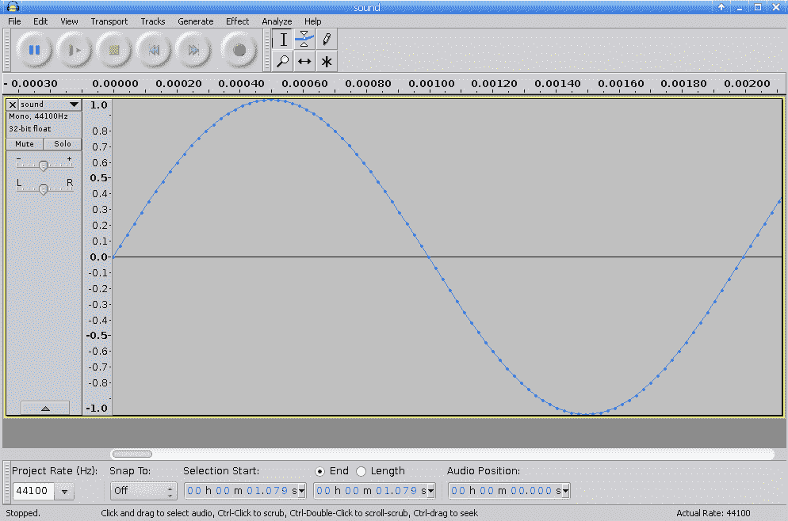
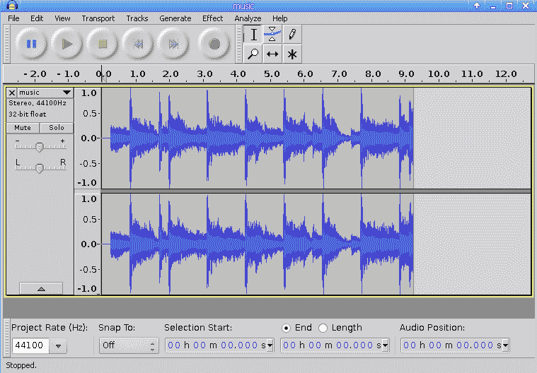
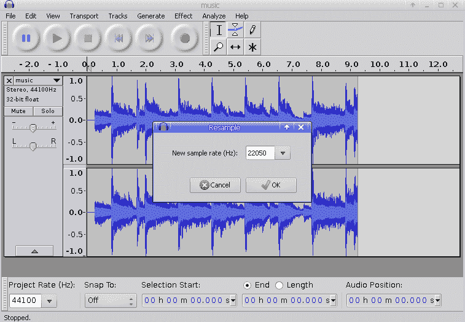

# 三、创建声音和音乐

本章将介绍使用 Adafruit Circuit 游乐场快车附带的硬件制作声音和播放音乐的方法。本章将首先介绍使电路板以特定的声音频率发出嘟嘟声的基础知识，然后将转到更高级的主题，例如使用 WAV 文件格式播放音乐文件和电路板的内置扬声器。本章中的技术可以直接用于您可能制作的大量 MicroPython 项目中。本章中用于生成音频输出的选项从生成简单的蜂鸣声到在嵌入式项目中播放歌曲。

在本章中，我们将介绍以下配方：

*   发出嘟嘟声
*   控制音调、频率和持续时间
*   演奏音符
*   演奏旋律
*   敲响警钟
*   播放 WAV 文件
*   将 MP3 文件转换为 WAV 文件
*   起止音

# Adafruit Circuit 游乐场快车布局图

下图显示了内置在电路板中的扬声器的位置。本章中介绍的所有蜂鸣音和声音都将使用此扬声器播放：


Courtesy of adafruit.com

# 发出嘟嘟声

在本食谱中，我们将学习如何让扬声器在特定的声音频率和特定的持续时间内发出嘟嘟声。音频输出是吸引某人注意力的好方法；从打电话到按门铃，你可以在任何地方找到它。这个食谱将为您提供向嵌入式项目添加蜂鸣音所需的技能。

# 准备

您将需要访问 Circuit Playway Express 上的 REPL 才能运行此配方中提供的代码。

# 怎么做。。。

让我们执行以下步骤：

1.  在 REPL 中运行以下代码行。您应听到频率为 900 Hz 的嘟嘟声，播放时间为 0.2 秒：

```py
>>> from adafruit_circuitplayground.express import cpx
>>> cpx.play_tone(900, 0.2)
```

2.  执行以下代码，使低频嘟嘟声持续更长时间：

```py
>>> cpx.play_tone(500, 0.4)
```

# 它是如何工作的。。。

第一行代码导入 Circuit Playder Express 库。`cpx`对象公开了一个名为`play_tone`的方法。此方法接受两个参数：频率和持续时间。这些参数指定以 Hz 为单位的声音频率，以及以秒为单位播放声音的时间。

持续时间可以用浮点数表示。这意味着像`0.2`这样的值将与 200 毫秒相关。此方法调用是一个阻塞调用。因此，调用该方法将开始播放音频，并且在指定的时间过去之前不会返回任何内容。

# 还有更多。。。

本章介绍的技术是一种从电路板上的扬声器发出嘟嘟声的非常简单的方法。然而，在幕后，很多事情正在发生。当您指定声音的频率和持续时间时，它将以编程方式生成声波，然后将音频数据输入扬声器以播放声音。音频数据是通过在 Python 代码中构建正弦波来创建的。

构建此音频数据的代码是 Circuit Playway Express 库的一部分，该库在此配方中导入。您可以下载代码并阅读它来了解如何做到这一点。这是理解声波数学以及如何通过软件创建声波的好方法。以下屏幕截图显示了以 500 Hz 的频率播放计算机生成的音调的样子：



您可以从前面的屏幕截图中清楚地看到，这看起来就像一个正弦波形。屏幕截图是在我们放大查看单个声音循环时拍摄的。由于声音以 500 赫兹的频率播放，我们预计一个周期为 1/500 秒长。在这里，我们可以看到，这是第一个波在 0.002 秒处结束的地方。

# 另见

您可以使用以下参考资料了解更多信息：

*   有关`play_tone`方法的文件可在[中找到 https://circuitpython.readthedocs.io/projects/circuitplayground/en/latest/api.html#adafruit_circuitplayground.express.Express.play_tone](https://circuitpython.readthedocs.io/projects/circuitplayground/en/latest/api.html#adafruit_circuitplayground.express.Express.play_tone) 。
*   更多关于人类可以听到的音频频谱的详细信息，请参见[https://www.teachmeaudio.com/mixing/techniques/audio-spectrum/](https://www.teachmeaudio.com/mixing/techniques/audio-spectrum/) 。

# 控制音调、频率和持续时间

在本食谱中，我们将学习如何以不同的频率和持续时间播放音调。通过每次以不同的持续时间重复播放不同的音调，我们可以学习如何超越单个蜂鸣声。这些步骤最终将导致我们演奏旋律或不同的音调，它们可以发出与闹钟相同的声音。

# 准备

您将需要访问 Circuit Playway Express 上的 REPL 才能运行此配方中提供的代码。

# 怎么做。。。

让我们执行以下步骤：

1.  在 REPL 中运行以下代码行。你应该能听到五种不同的音调，每次播放 0.2 秒。声音会从一个较低的音调开始，然后逐渐变得越来越高。播放每个音调时，音调的频率将打印到 REPL 中的输出：

```py
>>> from adafruit_circuitplayground.express import cpx >>> for i in range(500, 1000, 100): ... print(i) ... cpx.play_tone(i, 0.2)
...     
...     
... 
500
600
700
800
900
>>> 
```

2.  使用以下代码播放三种不同的音调。音调将增加音调，播放持续时间也将增加：

```py
>>> from adafruit_circuitplayground.express import cpx
>>> for i in range(200, 500, 100):
...     print(i)
...     cpx.play_tone(i, i/1000)
...     
...     
... 
200
300
400
>>> 
```

# 它是如何工作的。。。

在第一个代码块中，`for`循环将迭代频率值，从 500 开始，以 100 的增量增加该值，以 900 结束。此范围和这些步骤将很容易被人耳听到。在每次迭代中，将打印出要播放的频率，然后使用`play_tone`方法播放。只有声音的频率在每次迭代中发生变化；它们都将播放 200 毫秒。

在第二个代码块中，`for`循环将在较低的音高和较少的音调上迭代。对于每次迭代，音调的频率和持续时间都会增加。频率将是`i`变量的精确值，而持续时间将是`i`的毫秒值。由于`play_tone`方法期望以秒为单位的值，我们必须将其除以 1000。

# 还有更多。。。

本章介绍的两个`for`循环会在短时间内改变音调的播放方式。在这两个例子中，音调在一秒钟内播放，但它们播放三个或更多不同的音调。

这是一个很好的起点来试验这些回路的不同变化。因为每个循环只需要一秒钟，你可以经历一个快速的实验循环，并立即听到结果。尝试通过改变音调变化的音调或节奏来进行实验。

在两个循环中，音高随着每次迭代而增加。试着用每次迭代都会变低的音调进行实验。

# 另见

您可以使用以下参考资料了解更多信息：

*   Python 范围函数的文档可在[中找到 https://docs.python.org/3/library/functions.html#func-范围](https://docs.python.org/3/library/functions.html#func-range)。
*   音调和频率的解释见[https://www.le.ac.uk/se/centres/sci/selfstudy/snd5.htm](https://www.le.ac.uk/se/centres/sci/selfstudy/snd5.htm) 。

# 演奏音符

在这个配方中，我们将学习如何定义一些全局常量，每个常量代表一个特定的音符。然后，我们可以通过参考它们的常数来演奏这些不同的音符。音符是旋律的基石。这将是演奏旋律的第一步。一旦我们学会了如何演奏一个音符，我们就可以在以后的食谱中按顺序组合多个音符来演奏旋律。

# 准备

您将需要访问 Circuit Playway Express 上的 REPL 才能运行此配方中提供的代码。

# 怎么做。。。

让我们执行以下步骤：

1.  在 REPL 中运行以下代码行：

```py
>>> from adafruit_circuitplayground.express import cpx
>>> E5 = 659
>>> C5 = 523
>>> G5 = 784
>>> cpx.play_tone(E5, 0.15)
```

您应该可以在扬声器上听到`E5`音符播放 0.15 秒。

2.  使用以下代码播放`C5`和`G5`音符 0.15 秒：

```py
cpx.play_tone(C5, 0.15)
cpx.play_tone(G5, 0.15)
```

# 它是如何工作的。。。

此配方中的第一行代码将导入 Circuit Playder Express 库。然后，定义了三个全局常量，并以它们关联的音符命名。本配方使用了**科学音高符号**（**SPN**）。这种记谱法的工作原理是将音符的名称与指定音高八度的数字相结合。在 E5 的情况下，音符为 E，倍频程为 5。在这里，每个音符对应一个特定的声音频率。

在第一段代码中，调用`play_tone`方法时，只需参考`E5`全局常量即可播放`E5`音符。将持续时间设置为`0.15`允许每个音符播放 150 毫秒，这为音乐创造了舒适的节奏。减少或增加此值可以增加或减少音乐音调的播放速度。第二段代码以相同的速度播放剩下的两个音符。

本章使用的频率遵循标准钢琴键频率。这相当于标准音乐会音高和 12 音色的相等音律。

# 还有更多。。。

在这个食谱中，我们使用了三个音符来演示定义音符然后回放每个音符的过程。当然，还有更多的注释可以定义。

一个好的学习练习是找到其他流行音符的频率，并经历定义它们和播放它们的过程。尽管三个音符似乎太少，但它们足以演奏出一段可识别的旋律。我们将在下面的食谱中看到如何将这三个音符组合起来演奏流行旋律。

# 另见

您可以使用以下参考资料了解更多信息：

*   八度音阶符号的解释见[http://www.flutopedia.com/octave_notation.html](http://www.flutopedia.com/octave_notation.html) 。
*   基于 Python 的软件合成器可在[找到 https://mdoege.github.io/PySynth/](https://mdoege.github.io/PySynth/) 。

# 演奏旋律

在这个食谱中，我们将学习如何通过演奏一系列音符来演奏旋律。单凭一个音符是相当无聊的。真正的乐趣开始于你可以组合一系列的音乐，并正确地为它们计时来演奏旋律。

通过遵循标准的音乐符号，可以采用流行旋律，并以 Python 的方式指定它们，以便 Circuit Playerd Express 能够播放它们。

# 准备

您将需要访问 Circuit Playway Express 上的 REPL 才能运行此配方中提供的代码。

# 怎么做。。。

让我们执行以下步骤：

1.  在 REPL 中运行以下代码行。您应该在扬声器上听到`E5`音符播放 0.15 秒：

```py
>>> import time
>>> from adafruit_circuitplayground.express import cpx
>>> 
>>> E5 = 659
>>> C5 = 523
>>> G5 = 784
>>> 
>>> def play_note(note, duration=0.15):
...     if note == 0:
...         time.sleep(duration)
...     else:
...         cpx.play_tone(note, duration)
... 
>>> play_note(E5)
```

2.  使用以下代码行以两倍的速度播放同一音符，然后以一半的速度播放：

```py
>>> play_note(E5, 0.15 / 2)
>>> play_note(E5, 0.15 * 2)
```

3.  使用以下代码行不播放任何内容，并在以正常速度播放一个音符的同时保持扬声器静音：

```py
>>> play_note(0)
```

4.  使用以下代码行播放*超级马里奥兄弟*主题曲的首部分：

```py
>>> MELODY = (E5, E5, 0, E5, 0, C5, E5, 0, G5)
>>> for note in MELODY:
...     play_note(note)
... 
>>> 
```

5.  下面的代码将此配方中显示的所有代码组合成一个完整的程序。将此添加到`main.py`文件中，它将在每次重新加载代码时播放*超级马里奥兄弟*主题曲的开头：

```py
import time
from adafruit_circuitplayground.express import cpx

E5 = 659
C5 = 523
G5 = 784

MELODY = (E5, E5, 0, E5, 0, C5, E5, 0, G5)

def play_note(note, duration=0.15):
    if note == 0:
        time.sleep(duration)
    else:
        cpx.play_tone(note, duration)

for note in MELODY:
    play_note(note)
```

# 它是如何工作的。。。

初始代码行导入必要的库，并设置程序中其余代码所需的常量。`MELODY`常数具有组成歌曲的音符序列。某些音符之间有沉默的停顿；它们只是用一个值`0`来指定，表示此时不应播放任何音符。`play_note`功能需要给出播放音符的频率，以及（可选）播放音符的持续时间。如果给出`0`的频率，则会调用睡眠功能保持沉默；否则，它会将音符作为音调播放。

最后，程序末尾的`for`循环只是循环播放旋律中定义的每个音符，并通过调用`play_note`函数来播放。通过这种方式，您可以定义许多不同的旋律和歌曲，并根据用户与设备的交互方式播放不同的歌曲。

# 还有更多。。。

这个食谱是以一种通用的方式编写的：你选择一个流行的旋律，提供音符序列和每个音符的相关频率，然后将旋律添加到你的项目中。此配方中的旋律每个音符播放的持续时间相同。

然而，有许多旋律可能会混合四分音符和八分音符。这些旋律需要为每个音符定义不同的持续时间。配方可以扩展，这样我们就可以跟踪每个要播放的音符以及每个音符需要播放的持续时间。

# 另见

您可以使用以下参考资料了解更多信息：

*   在 Arduino 设备上播放的*超级马里奥兄弟*主题曲可在[找到 https://www.princetronics.com/supermariothemesong/](https://www.princetronics.com/supermariothemesong/) 。
*   可在[上找到与赛道游乐场有关声音和音乐的讨论 https://learn.adafruit.com/circuit-playground-music](https://learn.adafruit.com/circuit-playground-music) 。
*   在赛道操场上播放旋律的示例可在[中找到 https://learn.adafruit.com/circuit-playground-hot-potato/caternuson-playing-a-melody](https://learn.adafruit.com/circuit-playground-hot-potato/caternuson-playing-a-melody) 。

# 敲响警钟

在这个食谱中，我们将学习如何播放低频和高频声音来产生警报声。警报声对于提醒人们注意非常有用。此配方演示了一种非常简单但有效的方法来创建警报声音，然后可以根据项目的需要进行调整。

# 准备

您将需要访问 Circuit Playway Express 上的 REPL 才能运行此配方中提供的代码。

# 怎么做。。。

让我们对此配方执行以下步骤：

1.  在 REPL 中运行以下代码行。您应能听到一声高音嘟嘟声 0.5 秒：

```py
>>> from adafruit_circuitplayground.express import cpx
>>> 
>>> BEEP_HIGH = 960
>>> BEEP_LOW = 800
>>> 
>>> cpx.play_tone(BEEP_HIGH, 0.5)
```

2.  使用以下代码播放低音嘟嘟声 0.5 秒：

```py
>>> cpx.play_tone(BEEP_LOW, 0.5)
```

3.  使用以下代码播放警报器，该警报器从高音到低音经过三个循环，总共播放三秒：

```py
>>> for i in range(3):
...     cpx.play_tone(BEEP_HIGH, 0.5)
...     cpx.play_tone(BEEP_LOW, 0.5)
... 
>>> 
```

4.  下面的代码将此配方中显示的所有代码组合成一个完整的程序。将此添加到`main.py`文件中，每次重新加载代码时，它将播放警报器警报 3 秒钟：

```py
from adafruit_circuitplayground.express import cpx

BEEP_HIGH = 960
BEEP_LOW = 800

for i in range(3):
    cpx.play_tone(BEEP_HIGH, 0.5)
    cpx.play_tone(BEEP_LOW, 0.5)
```

# 它是如何工作的。。。

初始代码行导入必要的库，并设置程序中其余代码所需的常量。然后，脚本循环总共三次迭代，每次迭代播放声音总共一秒钟。

在每次迭代中，将播放半秒钟的高音，然后播放半秒钟的低音。通过这种方式，会产生类似于警报的警报声效果。

# 还有更多。。。

这段代码可以放入一个函数中，该函数接收一个参数计数，该计数指定发出警报的迭代次数或秒数。然后，对于项目中的任何代码，您都可以调用该函数使您的板播放 10 秒或 30 秒的警报。你也可以把这个配方和书中的其他配方结合起来，使电路板上的像素像闹钟一样闪烁成红色。

# 另见

您可以使用以下参考资料了解更多信息：

*   调用`play_tone`方法时更改频率的示例可在[中找到 https://learn.adafruit.com/circuitpython-made-easy-on-circuit-playground-express/play-tone](https://learn.adafruit.com/circuitpython-made-easy-on-circuit-playground-express/play-tone) 。
*   可在[找到发出警报声的微控制器项目 https://www.instructables.com/id/How-to-Make-a-Siren-Using-Arduino/](https://www.instructables.com/id/How-to-Make-a-Siren-Using-Arduino/) 。

# 播放 WAV 文件

在本食谱中，我们将学习如何使用扬声器播放您选择的 WAV 文件。赛道游乐场快车上有大量的存储空间来存储短音频剪辑，这些剪辑可以在特定时间播放。

音调、哔哔声、闹钟和旋律都很棒；但是，一旦可以播放 WAV 文件，就可以播放任何类型的声音。

# 准备

您将需要访问 Circuit Playway Express 上的 REPL 才能运行此配方中提供的代码。

# 怎么做。。。

让我们执行以下步骤：

1.  将`hello.wav`文件复制到与`main.py`文件位于同一文件夹中的设备上。然后，在 REPL 中运行以下代码行：

```py
>>> from adafruit_circuitplayground.express import cpx
>>> cpx.play_file('hello.wav')
```

2.  在播放音频文件时，你应该听到电路板说**你好*。*

 *# 它是如何工作的。。。

第一行代码导入 Circuit Playder Express 库。`cpx`对象公开了一个名为`play_file`的属性方法。此方法接受`.wav`文件名中的一个参数，该参数将在车载扬声器上播放。

音频文件应为 WAV 文件格式；它的采样率应为 22050 kHz，为 16 位格式，并具有单声道音频。此方法将打开音频文件并在扬声器上开始播放。它还将继续轮询音频设备，直到播放完成，并在音频播放完成后返回。

# 还有更多。。。

由于电路板上的硬件限制，您将无法播放 MP3 等压缩音乐格式。该文件需要采用特定的未压缩文件格式，可直接馈送至电路板上的播放硬件。

这样做的结果是，未压缩的声音流将大得多，因此设备上只能存储短音频片段。这仍然为播放音效或其他短音频片段打开了许多可能性。

# 另见

您可以使用以下参考资料了解更多信息：

*   有关`play_file`方法的文件可在[中找到 https://circuitpython.readthedocs.io/projects/circuitplayground/en/latest/api.html#adafruit_circuitplayground.express.Express.play_file](https://circuitpython.readthedocs.io/projects/circuitplayground/en/latest/api.html#adafruit_circuitplayground.express.Express.play_file) 。
*   调用`play_file`方法的示例可以在[中找到 https://learn.adafruit.com/circuitpython-made-easy-on-circuit-playground-express/play-file](https://learn.adafruit.com/circuitpython-made-easy-on-circuit-playground-express/play-file) 。

# 将 MP3 文件转换为 WAV 文件

在本食谱中，我们将学习如何将 MP3 文件转换为 WAV 文件，然后可以在 Circuit played Express 上播放。MP3 文件是世界上最流行的声音文件格式之一。当您有一个音频剪辑要包含在嵌入式项目中，但需要以正确的格式播放时，此配方非常有用。

# 准备

您需要下载并安装开源音频编辑软件 Audacity。它适用于 Windows、macOS 和 Linux。

Audacity can be downloaded from the official website at [https://www.audacityteam.org/](https://www.audacityteam.org/).

# 怎么做。。。

让我们执行以下步骤：

1.  启动 Audacity 软件并选择文件|打开。然后，选择 MP3 文件并单击打开。
2.  音频文件的详细信息应显示在应用程序中，如以下屏幕截图所示：



3.  选择“轨迹|重采样”，应显示以下对话框：



4.  将新采样率设置为`22050`，然后单击“确定”。

5.  现在，选择曲目|立体声曲目到单声道。屏幕上应该只有一个单声道，而不是可见的立体声音频流：


音频数据现在可以导出为 WAV 格式。

6.  接下来，选择文件|导出音频。
7.  将文件格式下拉菜单设置为 WAV（Microsoft）签名 16 位 PCM 的值。
8.  点击保存按钮。
9.  现在，您可以将 WAV 文件复制到电路板并在设备上播放。

# 它是如何工作的。。。

电路板要求音频文件采用 WAV 文件格式，采样率为 22050 kHz，采用 16 位格式，并具有单声道音频数据。Audacity 是一个多功能音频编辑器，可以打开任意数量的音频格式，并执行必要的更改以将音频数据转换为正确的格式。

本配方中的步骤对音频数据进行重新采样，并将音频通道转换为单个单声道。完成后，音频数据可以导出为正确的 WAV 格式。需要注意的是，WAV 文件不像其他音频格式那样被压缩，因此它们会占用更多的空间。这与此设备上的存储限制相结合，意味着只应使用短音频剪辑，以便它们可以安装在设备上。

# 还有更多。。。

此配方侧重于 MP3 文件格式作为输入格式。但是，Audacity 支持多种输入格式，因此您不仅限于转换该输入格式。Audacity 还具有广泛的编辑功能，当您想从更大的音频流中准备一个简短的音频剪辑时，这将非常方便。

一个很好的例子是，当你有一首歌可能有五分钟长，但你只想在你的板上加载一个短的五秒钟的剪辑。然后，您可以使用 Audacity 的编辑和转换功能来实现最终结果。

# 另见

您可以使用以下参考资料了解更多信息：

*   有关 WAV PCM 声音文件格式的更多详细信息，请参见[http://soundfile.sapp.org/doc/WaveFormat/](http://soundfile.sapp.org/doc/WaveFormat/) 。
*   有关微控制器音频项目使用 Audacity 的指南，请参见[https://learn.adafruit.com/microcontroller-compatible-audio-file-conversion](https://learn.adafruit.com/microcontroller-compatible-audio-file-conversion) 。

# 起止音

在本食谱中，我们将学习如何使用`start_tone`和`stop_tone`调用在背景中播放音调，并在声音播放过程中控制电路板上的其他组件。此配方中使用的技术基本上允许您在播放声音时在一个项目上执行多个操作。

您可能希望在项目中实现此功能的一个示例是，您希望同时播放警报声和闪烁灯光。

# 准备

您将需要访问 Circuit Playway Express 上的 REPL 才能运行此配方中提供的代码。

# 怎么做。。。

让我们执行以下步骤：

1.  在 REPL 中运行以下代码行。您应能听到一声高音嘟嘟声 0.5 秒：

```py
>>> from adafruit_circuitplayground.express import cpx
>>> import time
>>> 
>>> BEEP_HIGH = 960
>>> BEEP_LOW = 800
>>> 
>>> cpx.pixels.brightness = 0.10
>>> cpx.start_tone(BEEP_HIGH)
>>> time.sleep(0.5)
>>> cpx.stop_tone()
```

2.  使用以下代码在背景中播放蜂鸣声，同时 10 个像素以 0.1 秒的间隔变为红色。蜂鸣器将在动画结束时停止：

```py
>>> cpx.start_tone(BEEP_HIGH)
>>> for i in range(10):
...     cpx.pixels[i] = 0xFF0000
...     time.sleep(0.1)
... 
>>> cpx.stop_tone()
>>> 
```

3.  使用以下代码块执行类似操作，但音调较低。在此，像素动画将逐个关闭每个像素，并在动画结束时结束色调：

```py
>>> cpx.start_tone(BEEP_LOW)
>>> for i in range(10):
...     cpx.pixels[i] = 0x000000
...     time.sleep(0.1)
... 
>>> cpx.stop_tone()
>>> 
```

4.  下面的代码将此配方中显示的所有代码组合成一个完整的程序。将此添加到`main.py`文件中，它将播放警报，并用警报设置像素的开/关动画：

```py
from adafruit_circuitplayground.express import cpx
import time

BEEP_HIGH = 960
BEEP_LOW = 800

cpx.pixels.brightness = 0.10

cpx.start_tone(BEEP_HIGH)
for i in range(10):
    cpx.pixels[i] = 0xFF0000
    time.sleep(0.1)
cpx.stop_tone()

cpx.start_tone(BEEP_LOW)
for i in range(10):
    cpx.pixels[i] = 0x000000
    time.sleep(0.1)
cpx.stop_tone()
```

# 它是如何工作的。。。

初始代码行导入必要的库，并设置程序中其余代码所需的常量。像素的亮度也设置为更舒适的水平。然后，脚本开始在背景中播放高音嘟嘟声。它在循环 10 个像素并将每个像素变为红色时执行此操作，每个循环之间有 0.1 秒的延迟。

动画完成后，停止音调播放并播放较低的音调。像素再次循环通过；然而，这一次，它们被逐一关闭。最后，循环结束后，音调播放停止。

# 还有更多。。。

尽管使用 `start_tone` 和`stop_tone`比简单地调用`play_tone`需要更多的代码行，但它们允许您完成仅使用`play_tone`无法完成的事情。例如，在后台播放音频时，可以使用脚本执行其他任务。

在这个配方中，光和声音输出一起改变。但是，您可以使用相同的技术播放音调，直到有人按下某个按钮。或者，您也可以根据按下的不同按钮改变播放的音调。

# 另见

您可以使用以下参考资料了解更多信息：

*   有关`start_tone`方法的文件可在[中找到 https://circuitpython.readthedocs.io/projects/circuitplayground/en/latest/api.html#adafruit_circuitplayground.express.Express.start_tone](https://circuitpython.readthedocs.io/projects/circuitplayground/en/latest/api.html#adafruit_circuitplayground.express.Express.start_tone) 。
*   有关`stop_tone`方法的文件可在[中找到 https://circuitpython.readthedocs.io/projects/circuitplayground/en/latest/api.html#adafruit_circuitplayground.express.Express.stop_tone](https://circuitpython.readthedocs.io/projects/circuitplayground/en/latest/api.html#adafruit_circuitplayground.express.Express.stop_tone) 。*