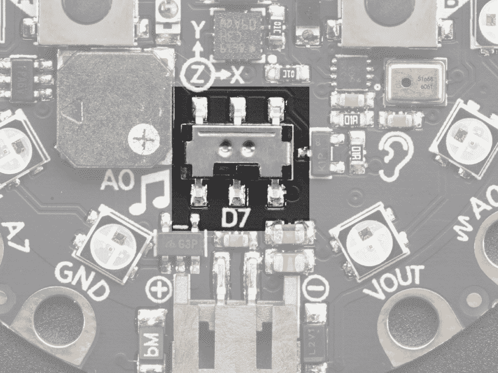
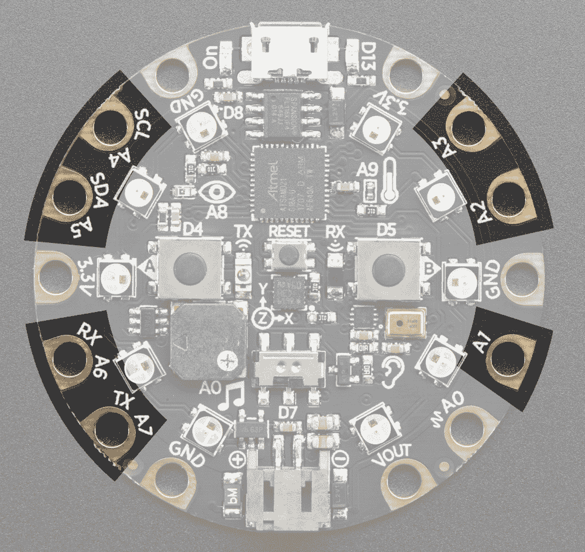

# 四、与按钮交互

本章将向您介绍与 Adafruit Circuit 游乐场 Express 附带的按钮和触摸板交互的方法。您将学习如何检测按钮是否被按下，还将探索更高级的主题，例如微调电容式触摸板的灵敏度。

在本章中，我们将介绍以下配方：

*   检测按钮按下
*   用按钮控制 LED
*   读取滑动开关
*   在按钮状态更改时调用函数
*   使用按钮移动活动 LED
*   按按钮时发出嘟嘟声
*   在触摸板上检测触摸
*   监视触摸板原始测量值
*   调整触摸阈值

# Adafruit Circuit 游乐场快车布局图

下图显示了电路板附带的两个标有 A 和 B 的按钮的位置：


Courtesy of adafruit.com

下图显示了设备上滑动开关的位置：



Courtesy of adafruit.com

下图显示了电路板上七个电容式触摸板的位置：



Courtesy of adafruit.com

每个触摸板都包含不同的导电材料。鳄鱼夹可用于将这些材料连接到衬垫上。此外，金属、水和水果可以很好地导电，可以用作电极的连接器。

现在，让我们来看看如何检测按钮的按下。

# 检测按钮按下

在本食谱中，我们将学习如何创建一个程序，在按下按钮时打印消息。按钮是在设备上创建用户交互的好方法。该板带有两个按钮 A 和 B，因此您可以通过读取和响应按钮事件来与用户创建各种不同的交互。

# 准备

您将需要访问 Circuit Playway Express 上的 REPL 才能运行此配方中提供的代码。

# 怎么做。。。

让我们执行以下步骤：

1.  首先，在 REPL 中运行以下代码行。此处`cpx.button_a`的值为`False`，因为按钮未按下：

```py
>>> from adafruit_circuitplayground.express import cpx
>>> cpx.button_a
False
```

2.  运行以下代码块时，按住按钮 A。这会将值更改为`True`：

```py
>>> cpx.button_a
True
```

3.  然后，将以下代码添加到`main.py`文件中，这将在执行时重复打印按钮 A 的状态：

```py
from adafruit_circuitplayground.express import cpx
import time

while True:
    print(cpx.button_a)
    time.sleep(0.05)
```

# 它是如何工作的。。。

第一行代码导入 Circuit Playder Express 库。`cpx`对象公开了一个名为`button_a`的属性。此属性在按钮按下时返回`True`，在按钮未按下时返回`False`。

脚本将永远循环，每个循环之间有 50 毫秒的延迟。持续打印按钮按下的状态。运行此程序时，按住并松开按钮以查看打印输出的变化。

Note that there is another property called `button_b`, which serves the same function but for push button B instead.

# 还有更多。。。

Python 中与按钮交互的界面非常简单。本质上，它转换为布尔值，您可以在脚本执行期间随时检查该值，以检查按钮的当前状态。

这种反复检查按钮状态的轮询模型在简单场景中运行良好。但是，当您想对每次按下按钮执行一个操作，而不是连续按下按钮时，这会出现问题。这类似于您希望与桌面上的键盘交互的方式。在这个场景中，您希望一次物理按键将转化为一次应用的操作。另一方面，长时间按住物理按键通常会产生重复的按键动作。

在大多数操作系统上，释放密钥前会应用 500 毫秒左右的延迟，这被视为一个**重复密钥操作**。当您试图实现以自然直观的方式和按钮交互的代码时，记住这些细节是很重要的。

# 另见

您可以在此处找到更多信息：

*   有关`button_a`财产的更多文件，请参见[https://circuitpython.readthedocs.io/projects/circuitplayground/en/latest/api.html#adafruit_circuitplayground.express.Express.button_a](https://circuitpython.readthedocs.io/projects/circuitplayground/en/latest/api.html#adafruit_circuitplayground.express.Express.button_a) 。
*   与按钮交互的示例见[https://learn.adafruit.com/circuitpython-made-easy-on-circuit-playground-express/buttons](https://learn.adafruit.com/circuitpython-made-easy-on-circuit-playground-express/buttons) 。

# 用按钮控制 LED

在这个配方中，我们将学习如何用两个独立的按钮控制两个独立的纽皮克斯。这是一种有趣而简单的方法，可以与您的设备进行交互。在这里，当您按下每个按钮时，您将立即从电路板获得反馈，因为像素将亮起作为响应。

# 准备

您将需要访问 Circuit Playway Express 上的 REPL 才能运行此配方中提供的代码。

# 怎么做。。。

让我们执行以下步骤：

1.  首先，在 REPL 中运行以下代码行：

```py
>>> from adafruit_circuitplayground.express import cpx
>>> 
>>> BLACK = 0x000000
>>> GREEN = 0x00FF00
>>> 
>>> cpx.pixels.brightness = 0.10
```

2.  运行以下代码块时，按住按钮 A。您应该看到按钮旁边的像素 2 亮起绿色：

```py
>>> cpx.pixels[2] = GREEN if cpx.button_a else BLACK
```

3.  释放按钮 A 并运行以下代码块；您现在应该看到像素 2 已关闭：

```py
>>> cpx.pixels[2] = GREEN if cpx.button_a else BLACK
```

4.  将以下代码添加到`main.py`文件中，它会将像素 2 和像素 7*打开*，具体取决于按下按钮 A 还是按钮 B：

```py
from adafruit_circuitplayground.express import cpx

BLACK = 0x000000
GREEN = 0x00FF00

cpx.pixels.brightness = 0.10
while True:
    cpx.pixels[2] = GREEN if cpx.button_a else BLACK
    cpx.pixels[7] = GREEN if cpx.button_b else BLACK
```

# 它是如何工作的。。。

第一行代码导入 Circuit Playder Express 库。定义绿色和黑色的常数，然后将像素亮度设置为舒适的水平。

然后，启动一个无限循环，每次迭代执行两行代码。如果按下按钮 A，第一行将像素 2 的颜色设置为绿色，否则将像素设置为关闭。如果按下按钮 B，第二行将像素 7 的颜色设置为绿色，否则将像素设置为关闭。

# 还有更多。。。

与本章中的第一个配方不同，没有调用`sleep`函数在每个循环之间造成延迟。在这个特定的配方中，有一个原因是每次轮询按钮状态之间不需要延迟。如果按下其中一个按钮，则其中一个指示灯将点亮并保持点亮，而不会出现问题。

对于第一个配方，按下按钮时会出现大量打印语句。仔细查看每个场景非常重要，以确定每次轮询之间是否需要延迟。

# 另见

您可以在此处找到更多信息：

*   有关条件表达式的更多文档，请参见[https://docs.python.org/3/reference/expressions.html#conditional-表达方式](https://docs.python.org/3/reference/expressions.html#conditional-expressions)。
*   有关按钮工作原理的更多详细信息，请参见[https://sciencing.com/push-switches-work-electrical-circuit-5030234.html](https://sciencing.com/push-switches-work-electrical-circuit-5030234.html) 。

# 读取滑动开关

在本食谱中，我们将学习如何创建一个程序，该程序将重复打印滑动开关是打开还是关闭。滑动开关有其自身的优点，本食谱将演示如何将其纳入项目中。

# 准备

您将需要访问 Circuit Playway Express 上的 REPL 才能运行此配方中提供的代码。

# 怎么做。。。

让我们执行以下步骤：

1.  确保滑动开关翻转到左侧。在 REPL 中运行以下代码行：

```py
>>> from adafruit_circuitplayground.express import cpx
>>> cpx.switch
True
```

2.  将滑动开关更改为翻转到右侧。运行以下代码块：

```py
>>> cpx.switch
False
```

3.  将以下代码添加到`main.py`文件中，它将在执行时重复打印滑动开关的状态。向左和向右转动滑动开关，观察输出的变化：

```py
from adafruit_circuitplayground.express import cpx
import time

while True:
    print(cpx.switch)
    time.sleep(0.05)
```

# 它是如何工作的。。。

第一行代码导入 Circuit Playder Express 库。`cpx`对象公开了一个名为`switch`的属性。此属性在开关处于左位置时返回`True`，在开关处于右位置时返回`False`。

脚本将永远循环，每个循环之间有 50 毫秒的延迟。滑动开关的状态将持续打印。

# 还有更多。。。

按钮是伟大的应用程序的动作重复，或当你想注册一个单一的按钮按下。但是，当您希望人们能够在两种操作模式之间进行指定时，滑动开关更合适。

例如，您可能有一个具有两种动画模式的项目，可以使用滑动开关选择这两种模式。您可以使用滑动开关在项目中启用或禁用报警声音。根据用户的操作，滑动开关或按钮可能更合适。

Circuit Playerd Express 的优点是两个选项都可用，因此您可以选择最适合自己的选项。

# 另见

您可以在此处找到更多信息：

*   有关交换机属性的更多文档，请参见[https://circuitpython.readthedocs.io/projects/circuitplayground/en/latest/api.html#adafruit_circuitplayground.express.Express.switch](https://circuitpython.readthedocs.io/projects/circuitplayground/en/latest/api.html#adafruit_circuitplayground.express.Express.switch) 。
*   有关常见类型开关的工作原理的说明，请参见[https://learn.sparkfun.com/tutorials/switch-basics/all](https://learn.sparkfun.com/tutorials/switch-basics/all) 。

# 在按钮状态更改时调用函数

在本食谱中，我们将学习如何在按钮状态发生变化时调用函数。通常的要求是，您只希望在按钮状态发生变化时执行操作，而不是在按下按钮时执行操作。此配方演示了一种可用于在项目中实现此需求的技术。

# 准备

您将需要访问 Circuit Playway Express 上的 REPL 才能运行此配方中提供的代码。

# 怎么做。。。

让我们执行以下步骤：

1.  首先，在 REPL 中运行以下代码行：

```py
>>> from adafruit_circuitplayground.express import cpx
>>> def button_change(pressed):
...     print('pressed:', pressed)
... 
```

2.  这将定义`button_change`函数，每次按钮状态发生变化时都会调用该函数。运行以下代码，然后反复按下并释放按钮 A：

```py
>>> last = cpx.button_a
>>> while True:
...     if cpx.button_a != last:
...         button_change(cpx.button_a)
...         last = cpx.button_a
... 
pressed: True
pressed: False
pressed: True
pressed: False
pressed: True
pressed: False
```

3.  下面的代码将此配方中显示的所有代码组合成一个完整的程序。将其添加到`main.py`文件中；每次按下或释放按钮 a 时，它都会打印一条消息：

```py
from adafruit_circuitplayground.express import cpx

def button_change(pressed):
    print('pressed:', pressed)

last = cpx.button_a
while True:
    if cpx.button_a != last:
        button_change(cpx.button_a)
        last = cpx.button_a
```

# 它是如何工作的。。。

定义了`button_change`函数，每次按钮状态改变时调用该函数。

`last`全局变量将用于跟踪按钮的最后状态。然后，启动一个无限循环，该循环将检查按钮的当前状态是否与其上次状态不同。如果检测到变化，则调用`button_change`函数。

最后，当`last`变量发生变化时，最新的按钮状态保存在该变量中。该脚本实质上实现了一个事件循环，用于检测按钮按下事件，并在检测到这些事件时调用`button_change`事件处理程序来处理这些事件。

# 还有更多。。。

有时，您可能希望将按钮按下注册为单个事件，而不管用户长时间按住按钮还是短时间按住按钮。这个配方通过跟踪按钮的前一个状态，并且只调用一次事件处理程序（作为按钮按下的结果）来实现这一目标。

即使您有额外的步骤来跟踪按钮的最后一个状态，这种方法的好处是您不必在按键轮询之间调整延迟的时间，也不必调整键盘重复延迟的时间。这个方法只是解决何时以及如何响应物理按钮交互问题的另一种可行方法。

# 另见

您可以在此处找到更多信息：

*   事件循环和事件处理程序的一个很好的例子可以在[中找到 https://docs.python.org/3/library/cmd.html](https://docs.python.org/3/library/cmd.html) 。
*   可在[中找到对按钮按下的响应示例 https://learn.adafruit.com/sensor-plotting-with-mu-and-circuitpython/buttons-and-switch](https://learn.adafruit.com/sensor-plotting-with-mu-and-circuitpython/buttons-and-switch) 。

# 使用按钮移动活动 LED

在本配方中，我们将学习如何根据按下的是左按钮还是右按钮顺时针和逆时针移动活动的 NeoPixel。此配方超越了先前配方中显示的更简单的按钮和 LED 交互。这是一个更复杂的配方，它会给人一种印象，即按下按钮会使光线在电路板上作圆周运动。

# 准备

您将需要访问 Circuit Playway Express 上的 REPL 才能运行此配方中提供的代码。

# 怎么做。。。

让我们执行以下步骤：

1.  在 REPL 中运行以下代码行：

```py
>>> from adafruit_circuitplayground.express import cpx
>>> import time
>>> 
>>> BLACK = 0x000000
>>> BLUE = 0x0000FF
>>> 
>>> cpx.pixels.brightness = 0.10
>>> i = 0
>>> direction = 1
>>> 
>>> 
```

2.  运行以下代码并按下按钮以查看其对像素的影响：

```py
>>> while True:
...     if cpx.button_a:
...         direction = 1
...     if cpx.button_b:
...         direction = -1
...     i += direction
...     i = i % 10
...     cpx.pixels.fill(BLACK)
...     cpx.pixels[i] = BLUE
...     time.sleep(0.05)
... 
```

3.  下面的代码将此配方中显示的所有代码组合成一个完整的程序。将此代码块添加到`main.py`文件中，每次按下按钮 A 和按钮 B 时，它都会将点亮像素的方向从顺时针改为逆时针：

```py
from adafruit_circuitplayground.express import cpx
import time

BLACK = 0x000000
BLUE = 0x0000FF

cpx.pixels.brightness = 0.10
i = 0
direction = 1
while True:
    if cpx.button_a:
        direction = 1
    if cpx.button_b:
        direction = -1
    i += direction
    i = i % 10
    cpx.pixels.fill(BLACK)
    cpx.pixels[i] = BLUE
    time.sleep(0.05)
```

# 它是如何工作的。。。

第一行代码导入 Circuit Playway Express 库和`time`库。然后，设置颜色常数和亮度级别。`i`变量将跟踪当前点亮的像素。`direction`变量的值为`1`或`-1`，并控制像素是顺时针还是逆时针移动。

在无限循环中，如果按下按钮 A 或按钮 B，方向将改变。方向应用于位置，并应用模数 10 操作，以便位置值在 0 和 10 之间旋转。

在每次迭代中，关闭所有像素，然后打开选定像素。通过调用控制灯光动画的速度，使电路板在每次循环迭代之间休眠 50 毫秒。

# 还有更多。。。

这个配方结合了许多不同的技术，以产生最终的结果。它使用了一种动画效果，当有人看着电路板时，会认为光线在电路板上绕着一个圆圈移动。

已实现动画效果以支持方向运动，因此它看起来就像灯光沿顺时针或逆时针方向移动一样。然后，按钮将与此动画组合以更改动画的方向

您可以采用此基本配方，并使其适应不同的场景。例如，您可以将灯光显示替换为从安静到响亮，或从响亮到安静的声音效果，具体取决于按下哪个按钮。此外，您可以使用两个按钮来增加或降低亮度。有两个按钮可以打开许多选项，根据按下的按钮增加或减少特定值。

# 另见

您可以在此处找到更多信息：

*   有关使用按钮和像素的电路游乐场项目的详细信息，请参见[https://learn.adafruit.com/circuit-playground-simple-simon](https://learn.adafruit.com/circuit-playground-simple-simon) 。
*   有关模运算符的文档可在[中找到 https://docs.python.org/3.3/reference/expressions.html#binary-算术运算](https://docs.python.org/3.3/reference/expressions.html#binary-arithmetic-operations)。

# 按按钮时发出嘟嘟声

在本食谱中，我们将学习如何在按下按钮时播放嘟嘟声。以前的食谱允许我们使用按钮与灯光交互。本食谱将向您展示如何在项目中引入按钮和声音交互。

# 准备

您将需要访问 Circuit Playway Express 上的 REPL 才能运行此配方中提供的代码。

# 怎么做。。。

让我们执行以下步骤：

1.  在 REPL 中运行以下代码行，同时按住按钮 A：

```py
>>> from adafruit_circuitplayground.express import cpx
>>> if cpx.button_a:
...     cpx.play_tone(500, 0.2)
...     
...     
... 
>>>
```

2.  扬声器应该发出低沉的嘟嘟声。在按住按钮 B 的同时运行以下代码，您会听到一声高音嘟嘟声：

```py
>>> if cpx.button_b:
...     cpx.play_tone(900, 0.2)
...     
...     
... 
>>> 
```

3.  下面的代码结合了本配方中显示的所有代码，并向其中添加了一个`while`循环，以形成一个完整的程序。将其添加到`main.py`文件中，执行时，每次按下按钮 a 或按钮 B 时，都会发出高音或低音嘟嘟声：

```py
from adafruit_circuitplayground.express import cpx

while True:
    if cpx.button_a:
        cpx.play_tone(500, 0.2)
    if cpx.button_b:
        cpx.play_tone(900, 0.2)
```

# 它是如何工作的。。。

第一行代码导入 Circuit Playder Express 库。然后进入一个无限循环，该循环将检查在每次循环迭代中是否按下按钮 A 或按钮 B，并在每种情况下播放不同音调的嘟嘟声，持续时间为 0.2 秒。

# 还有更多。。。

这个简单的配方演示了如何通过播放不同的音调使电路板对不同的按钮按下做出反应。另一种使脚本正常运行的方法是根据按下的按钮播放不同的音频`.wav`文件。滑动开关也可以并入配方中，以设置两种不同的模式；一种模式可以播放低音，另一种模式可以播放高音。

# 另见

您可以在此处找到更多信息：

*   有关 CircuitPython 如何从按钮读取输入的示例，请参见[https://learn.adafruit.com/circuitpython-essentials/circuitpython-digital-in-out](https://learn.adafruit.com/circuitpython-essentials/circuitpython-digital-in-out) 。
*   可在[中找到对输入做出反应以播放不同音调的电路游乐场项目示例 https://learn.adafruit.com/dear-diary-alarm](https://learn.adafruit.com/dear-diary-alarm) 。

# 在触摸板上检测触摸

在本食谱中，我们将学习如何检测触摸板何时被触摸，以及如何在每次发生此事件时打印消息。Circuit Playway Express 附带了许多触摸板连接器，可以连接到各种对象。

本质上，任何可以导电的东西都可以作为与设备交互的方式。您可以使用电线、导电线、水果、水或铜带与设备进行交互。

# 准备

您将需要访问 Circuit Playway Express 上的 REPL 才能运行此配方中提供的代码。

# 怎么做。。。

让我们执行以下步骤：

1.  在 REPL 中运行以下代码行。`cpx.touch_A1`的值为`False`，因为触摸板 A1 未被触摸：

```py
>>> from adafruit_circuitplayground.express import cpx
>>> cpx.touch_A1
False
```

2.  运行以下代码块时，保持手指接触触摸板 A1：

```py
>>> cpx.touch_A1
True
```

3.  以下代码应添加到`main.py`文件中。这将在您每次按下触摸板 A1 时打印一条消息：

```py
from adafruit_circuitplayground.express import cpx
import time

while True:
    if cpx.touch_A1:
        print('detected touch')
    time.sleep(0.05)
```

# 它是如何工作的。。。

前几行代码导入 Circuit Playway Express 库和`time`库。然后，脚本进入无限循环，在每个循环迭代中检查触摸板 A1 的状态。如果检测到触摸，则会打印一条消息。

# 还有更多。。。

此配方演示了一种与触摸板交互的简单方法。然而，说到电容式触摸传感器，关键在于细节。根据连接到触摸板的材料的导电性，您可能会发现自己处于两个极端之一；也就是说，传感器可能根本检测不到一些触摸事件，或者如果存在大量的环境噪声，这些噪声被错误地检测为多个触摸事件。

这些设备不像机械按钮那么简单。然而，另一方面，它们可以让您创建项目，在项目中，您可以使用香蕉和橘子（因为它们是导电的）与嵌入式设备进行交互。

# 另见

您可以在此处找到更多信息：

*   有关`touch_A1`财产的更多文件，请参见[https://circuitpython.readthedocs.io/projects/circuitplayground/en/latest/api.html#adafruit_circuitplayground.express.Express.touch_A1](https://circuitpython.readthedocs.io/projects/circuitplayground/en/latest/api.html#adafruit_circuitplayground.express.Express.touch_A1) 。
*   与电容式触摸传感器交互的示例见[https://learn.adafruit.com/adafruit-circuit-playground-express/adafruit2-circuitpython-cap-touch](https://learn.adafruit.com/adafruit-circuit-playground-express/adafruit2-circuitpython-cap-touch) 。

# 监视触摸板原始测量值

在本食谱中，我们将学习如何监控触摸板原始测量值，这是验证触摸阈值应调整多少的非常有用的方法。能够直接读取来自触摸传感器的原始传感器值非常重要。

当您想要正确设置触摸阈值，或者当您想要找出触摸板没有按照您期望的方式响应的原因时，这种详细程度是必要的。

# 准备

您将需要访问 Circuit Playway Express 上的 REPL 才能运行此配方中提供的代码。

# 怎么做。。。

让我们执行以下步骤：

1.  在 REPL 中运行以下代码行。输出显示原始触摸测量值和创建对象时自动设置的初始阈值：

```py
>>> import time
>>> import touchio
>>> import board
>>> a1 = touchio.TouchIn(board.A1)
>>> a1.raw_value
1933
>>> a1.threshold
2050
>>> 
```

2.  运行下一段代码时，让手指接触触摸板 A1：

```py
>>> a1.raw_value
4065
```

3.  运行下一段代码时，将手指从触摸板 A1 上松开：

```py
>>> a1.raw_value
1839
```

4.  以下代码应添加到`main.py`文件中，然后运行。执行此代码时，它将持续打印原始触摸测量值和当前阈值，并确定当前读数是否视为触摸事件。此脚本可用于获取实时传感器读数：

```py
import time
import touchio
import board

a1 = touchio.TouchIn(board.A1)
while True:
    touch = a1.raw_value > a1.threshold
    print('raw:', a1.raw_value, 'threshold:', a1.threshold, 'touch:', touch)
    time.sleep(0.5)
```

# 它是如何工作的。。。

前几行代码导入与 touchpad 交互所需的不同低级库。创建一个`TouchIn`对象并连接到焊盘 A1。然后，运行一个无限循环，不断打印出与传感器相关的许多值。它打印阈值的当前原始触摸测量值以及当前测量值是否应注册为触摸事件。

最后一个值仅为`True`，但如果原始值超过阈值，则为`False`。阈值是在`TouchIn`对象第一次实例化时通过获取初始原始值并向该值添加 100 来设置的。

# 还有更多。。。

此脚本对于验证从触摸传感器读取的实际值以及决定触摸阈值应设置的高低非常有用。这也是一个很好的方法，可以将不同的材料连接到你的电路板上，看看它们在导电和检测触摸事件方面表现如何。没有这些原始值，您只能猜测实际发生了什么。

本章其他地方使用的高级属性实际上使用了本配方中介绍的许多库。查看这个更高级别代码的源代码是很有帮助的，因为其中大部分是用 Python 实现的。此外，它还可以让您深入了解代码实际上是如何与硬件交互的。

# 另见

您可以在此处找到更多信息：

*   有关`touchio`模块的更多文档，请参见[https://circuitpython.readthedocs.io/en/3.x/shared-bindings/touchio/__init__.html](https://circuitpython.readthedocs.io/en/3.x/shared-bindings/touchio/__init__.html) 。
*   有关`board`模块的更多文档，请参见[https://circuitpython.readthedocs.io/en/3.x/shared-bindings/board/__init__.html](https://circuitpython.readthedocs.io/en/3.x/shared-bindings/board/__init__.html) 。
*   关于电路操场上电容式触控传感器性能的讨论可参见[https://learn.adafruit.com/circuit-playground-fruit-drums/hello-capacitive-touch](https://learn.adafruit.com/circuit-playground-fruit-drums/hello-capacitive-touch) 。
*   电容式触控传感器工作原理的解释见[https://scienceline.org/2012/01/okay-but-how-do-touch-screens-actually-work/](https://scienceline.org/2012/01/okay-but-how-do-touch-screens-actually-work/) 。

# 调整触摸阈值

在这个配方中，我们将学习如何通过改变阈值来调整触摸板的灵敏度。这用于决定是否将信号视为触摸事件。这是一个重要的设置，需要调整并设置为正确的值。如果您不这样做，那么您的许多触摸项目将无法正常运行。

# 准备

您将需要访问 Circuit Playway Express 上的 REPL 才能运行此配方中提供的代码。

# 怎么做。。。

让我们执行以下步骤：

1.  在 REPL 中运行以下代码行。此时触摸阈值将增加`200`：

```py
>>> from adafruit_circuitplayground.express import cpx
>>> import time
>>> 
>>> cpx.adjust_touch_threshold(200)
```

2.  运行下一段代码时，让手指接触触摸板 A1：

```py
>>> cpx.touch_A1
True
```

3.  应将以下代码添加到`main.py`文件并运行。每次传感器检测到触摸事件时，脚本会将触摸阈值增加`200`并打印一条消息：

```py
from adafruit_circuitplayground.express import cpx
import time

cpx.adjust_touch_threshold(200)
while True:
    if cpx.touch_A1:
        print('detected touch')
    time.sleep(0.5)
```

# 它是如何工作的。。。

第一行代码导入 Circuit Playder Express 库。`cpx`对象公开了一个名为`adjust_touch_threshold`的方法。此方法可用于更改触摸板上配置的阈值。调用时，所有触摸板的阈值将增加指定的数量。

增加阈值会降低触摸板的灵敏度，而降低该值会使传感器更敏感。如果阈值设置设置过低，则许多传感器读数将被错误地检测为触摸事件。另一方面，如果阈值过高，则不会检测到真正的触摸事件。在每次循环迭代之间应用 500 毫秒的睡眠功能，以便在每次迭代期间不会检测到大量触摸事件。

# 还有更多。。。

决定将什么设置为阈值的最佳方法是通过实验。在开始阈值调整之前，将所有实际导电材料连接到触摸板。然后，使用本章中的*监控触摸板原始测量*方法，实时查看您正在接收的传感器读数。

你也可以反复触摸有问题的材料，看看当你触摸并放开时，读数是如何变化的。根据这些读数，您可以设置可靠读取触摸事件的理想阈值。每次更改材质时重新启动脚本非常重要，因为每次第一次运行代码时都会发生初始阈值自动配置。

# 另见

您可以在此处找到更多信息：

*   有关`adjust_touch_threshold`方法的更多文件，请参见[https://circuitpython.readthedocs.io/projects/circuitplayground/en/latest/api.html#adafruit_circuitplayground.express.Express.adjust_touch_threshold](https://circuitpython.readthedocs.io/projects/circuitplayground/en/latest/api.html#adafruit_circuitplayground.express.Express.adjust_touch_threshold) 。
*   调用`adjust_touch_threshold`方法的示例可以在[中找到 https://learn.adafruit.com/make-it-sense/circuitpython-6](https://learn.adafruit.com/make-it-sense/circuitpython-6) 。