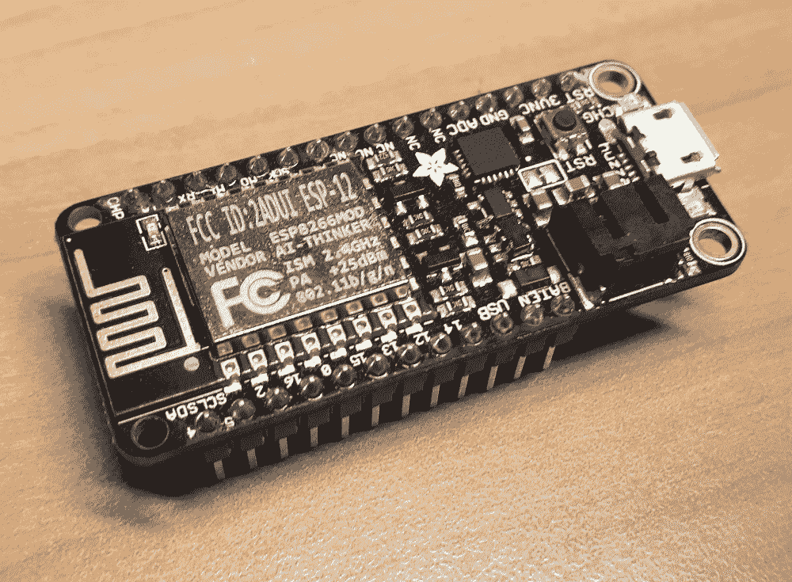
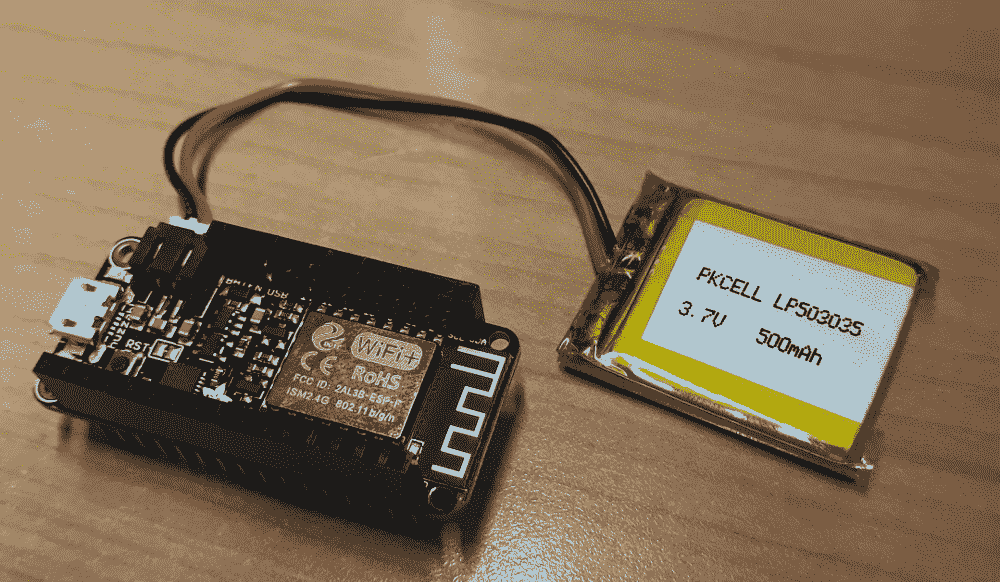
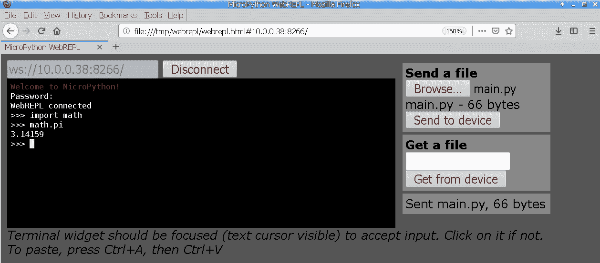

# 十、控制 ESP8266

在本章中，我们将介绍 Adafruit Feather HUZZAH ESP8266 微控制器。当嵌入式项目需要支持 internet 连接时，ESP8266 是最流行的 MicroPython 硬件选项之一。这种连接是使用该板的内置 Wi-Fi 功能实现的。

本章将探讨在主板上访问 REPL 的两种主要方式：通过 USB 连接，以及通过 Wi-Fi 无线连接。我们还将研究一些配方，这些配方涵盖了与电路板上的 Wi-Fi 功能交互的不同方面。

到本章结束时，您将学习所有必要的核心技能，以便您能够使用此板获得高效，并开始使用此多功能且廉价的 internet 连接硬件构建您自己的嵌入式项目。

在本章中，我们将介绍以下主题：

*   通过串行连接使用 REPL
*   扫描可用的 Wi-Fi 网络
*   配置 AP 模式的设置
*   连接到现有的 Wi-Fi 网络
*   通过 Wi-Fi 使用 WebREPL
*   使用 WebREPL CLI 传输文件
*   控制蓝色和红色 LED

# 技术要求

本章的代码文件可在本书 GitHub 存储库的`Chapter10`文件夹中找到，可在[上找到 https://github.com/PacktPublishing/MicroPython-Cookbook](https://github.com/PacktPublishing/MicroPython-Cookbook)

本章中的所有配方都使用了 Python 3.1.2。

# Adafruit 羽毛 HUZZAH ESP8266

ESP8266 是由 Espressif Systems 制造的一种廉价微控制器。它可以运行 MicroPython 并支持完整的 TCP/IP 堆栈。其内置 Wi-Fi 支持 802.11b/g/n。Adafruit Feather HUZZAH ESP8266 是一款开发板，支持 USB 供电和数据连接。

该板上的处理器运行速度为 80 MHz，并配有 4 MB 闪存。该板带有九个 GPIO 引脚，可以连接到许多其他组件。该板有许多不同的版本。下图显示了此板在标题选项下的外观：



该电路板还具有堆叠标题配置，可以在电路板顶部插入其他组件，如 OLED 显示器和按钮。这些升级可以直接插入，无需焊接或面包板。下图显示了此版本的板，其具有堆叠标题：


您还可以通过使用可充电锂离子聚合物电池为电路板供电，使您的项目便于携带。这些电池可以使用 JST 连接器连接到电路板。下图显示了连接到锂离子聚合物电池的电路板：



该板具有内置 LiPoly 充电器，可使用指示灯 LED 显示充电状态。然后，只要电路板与 USB 电缆连接，就可以为电池充电。

# 你在哪里能买到这些？

本章使用 Adafruit Feather HUZZAH ESP8266 微控制器。我们建议购买带有堆叠标题的版本。可直接从 Adafruit（[购买带有堆叠头的 Adafruit 组装的 HUZZAH ESP8266 Wi-Fi 微控制器 https://www.adafruit.com/product/3213](https://www.adafruit.com/product/3213) ）。

# 通过串行连接使用 REPL

此配方将向您展示如何通过 USB 串行连接获得 ESP8266 的 REPL 访问。尽管这个电路板的真正力量和兴奋来自于无线连接，但我们需要做的第一件事就是用一个简单的 USB 连接连接到它。一旦建立了此连接，您就可以继续本章中剩余的食谱，其中设置了您的无线设置，以便您可以拔下电路板并完全无线地与之交互。

通过设置与线路板的初始连接以建立无线连接，此配方将帮助您开始自己的无线嵌入式项目。当您的配置板面临连接问题，并且您希望访问该板以调试您可能面临的任何 Wi-Fi 问题时，它也是一个很有价值的工具。

# 准备

这个配方可以使用 macOS 或 Linux 计算机，您需要屏幕命令才能使用。在 macOS 上，屏幕应用程序是内置的，因此不需要安装。在 Ubuntu Linux 上，screen 命令可以与 apt`install screen`命令一起安装。

# 怎么做。。。

按照以下步骤学习如何通过串行连接使用 REPL：

1.  使用 USB 电缆将 ESP8266 连接到您的计算机。
2.  打开终端应用程序。

3.  在大多数 Linux 系统上，设备的名称应为`/dev/ttyUSB0`。通过在终端中运行以下命令，确认此设备存在：

```py
$ ls /dev/ttyUSB0
/dev/ttyUSB0
```

4.  如果操作系统成功检测到 ESP8266，则前面的命令应成功运行。
5.  运行以下命令以启动与电路板的 REPL 会话：

```py
$ sudo screen /dev/ttyUSB0 115200
```

6.  上一个命令将启动`screen`命令，并以每秒 115200 位的波特率连接到名为`/dev/ttyUSB0`的设备。如果连接成功建立，您应该在终端中看到如下消息：

```py
Adafruit CircuitPython 3.1.2 on 2019-01-07; ESP module with ESP8266
>>> 
>>> 
```

7.  在 REPL 中执行以下代码：

```py
>>> import math
>>> math.pow(8,2)
64.0
>>> 8**2
64
```

前面的代码块将导入`math`库并计算 8 的值乘以 2 的幂。

# 它是如何工作的。。。

ESP8266 通过 USB 连接公开串行设备。然后可以使用终端仿真器（如`screen`）与该串行设备进行交互。一旦连接了屏幕，就可以访问 REPL 并开始在电路板上执行 Python 代码。每当您在 REPL 中执行 Python 代码时，命令都会发送到要执行的电路板，然后通过串行连接将命令的结果传输回终端仿真器。

# 还有更多。。。

在所有主要的操作系统上都有许多优秀的免费终端模拟器。在 Unix 系统上，`picocom`和`minicom`是屏幕的常用替代品。在 Windows 上，可以使用终端仿真器 PuTTY，而 macOS 有一个名为 CoolTerm 的应用程序可用于此目的。

# 另见

以下是有关此配方的一些参考资料：

*   有关连接到 Adafruit Feather HUZZAH ESP8266 的文档，请访问[https://learn.adafruit.com/adafruit-feather-huzzah-esp8266](https://learn.adafruit.com/adafruit-feather-huzzah-esp8266) 。
*   有关`picocom`命令的详细信息，请参见[https://github.com/npat-efault/picocom](https://github.com/npat-efault/picocom) 。

# 扫描可用的 Wi-Fi 网络

本食谱将向您展示如何使用 ESP8266 列出所有可用且可连接到的 Wi-Fi 网络。我们将介绍 MicroPython 网络库，并探索如何使用其对象初始化板载 Wi-Fi 硬件。

一旦设置好这些组件，我们就可以使用它们来运行无线网络扫描，并存储扫描结果以供进一步检查。此配方可为您提供有用的技术，以便您可以测试电路板的 Wi-Fi 功能。通常，列出无线网络是您可以继续并在以后连接到它们之前需要的第一步。

# 准备

您需要访问 ESP8266 上的 REPL 才能运行此配方中提供的代码。

# 怎么做。。。

按照以下步骤学习如何扫描可用的 Wi-Fi 网络：

1.  在 REPL 中运行以下代码行：

```py
>>> import network
>>> station = network.WLAN(network.STA_IF)
```

2.  现在已导入网络库，并创建了一个 WLAN 对象，该对象将提供一个`station`接口。以下代码块将激活`station`接口：

```py
>>> station.active(True)
```

3.  以下代码块将扫描所有可用的无线网络，并将结果存储在`networks`变量中：

```py
>>> networks = station.scan()
scandone
```

4.  以下代码块将输出`networks`变量的内容，并显示找到的网络数量：

```py
>>> networks
[(b'My WiFi', b'\x80*\xa8\x84\xa6\xfa', 1, -72, 3, 0), (b'Why Fi', b'\xc8Q\x95\x92\xaa\xd0', 1, -92, 4, 0), (b'Wi Oh Wi', b'd\xd1T\x9a\xb3\xcd', 1, -90, 3, 0)]
>>> len(networks)
3
```

5.  运行以下代码行：

```py
>>> names = [i[0] for i in networks]
>>> names
[b'My WiFi', b'Why Fi', b'Wi Oh Wi']
```

一旦执行，代码将提取无线网络的名称，并将其存储在名为`names`的变量中，然后对该变量进行检查。

# 它是如何工作的。。。

MicroPython 提供了一个名为`network`的模块，可用于与 ESP8266 上的 Wi-Fi 硬件交互。WLAN 对象被实例化，并为其第一个参数提供了`network.STA_IF`。这将返回一个创建为`station`接口的对象。

当您想将线路板连接到现有的 Wi-Fi 网络时，需要使用`station`接口。在执行扫描之前，必须通过调用带有`True`值的`active`方法来激活工作站。然后，可以在站点上调用`scan`方法，该方法将扫描可用网络。此方法返回我们存储在`networks`变量中的元组列表。

然后，我们可以使用`len`函数计算网络的数量，并通过这个元组列表循环提取每个网络的名称。每个网络的名称或**服务集标识符**（**SSID**）将存储在元组的第一个值中。使用列表理解从`networks`变量中的每个项目中检索该值，然后将其保存在`names`变量中。

# 还有更多。。。

此配方创建了一个 WLAN 对象作为`station`接口。在后面的食谱中，我们将学习如何创建另一种类型的 WLAN 对象，用于将设备配置为 AP。除了使用`scan`方法获取无线网络的名称外，您还可以检查每个网络的其他详细信息，例如它使用的通道和它接受的身份验证模式。

`scan`方法以一个简单的数据结构返回其结果非常有用，您可以在程序的其余部分存储和处理该数据结构。这样就可以创建定期扫描可用网络的项目，并将结果保存到日志文件中。

# 另见

以下是有关此配方的一些参考资料：

*   有关`scan`方法的文件可在[中找到 https://docs.micropython.org/en/latest/library/network.html#network.AbstractNIC.scan](https://docs.micropython.org/en/latest/library/network.html#network.AbstractNIC.scan) 。
*   有关`active`方法的文件可在[中找到 https://docs.micropython.org/en/latest/library/network.html#network.AbstractNIC.active](https://docs.micropython.org/en/latest/library/network.html#network.AbstractNIC.active) 。

# 配置 AP 模式的设置

本配方将向您展示如何在 ESP8266 上配置**接入点**（**AP**模式）。配置后，该板将成为 Wi-Fi AP，您可以使用标准 Wi-Fi 连接将笔记本电脑和手机直接连接到该板。

Wi-Fi 无处不在，因此该功能成为提供连接的一种非常强大的方式。您可以使用此配方中显示的技术将 Wi-Fi AP 功能合并到您自己的项目中。这样，即使没有其他可用的接入点，您也可以在主板和手机或笔记本电脑之间建立无线连接。

# 准备

您需要访问 ESP8266 上的 REPL 才能运行此配方中提供的代码。

# 怎么做。。。

按照以下步骤了解如何配置 AP 模式的设置：

1.  在 REPL 中执行以下代码块：

```py
>>> import network
>>> ap = network.WLAN(network.AP_IF)
```

2.  `network`库现在已经导入，并且已经为 AP 模式创建了 WLAN 对象。以下代码块将配置和激活 AP：

```py
>>> ap.config(essid='PyWifi', password='12345678')
bcn 0
del if1
pm open,type:2 0
add if1
pm close 7
#7 ets_task(4020f4c0, 29, 3fff96f8, 10)
dhcp server start:(ip:192.168.4.1,mask:255.255.255.0,gw:192.168.4.1)
bcn 100
>>> ap.active(True)
```

3.  使用电话或笔记本电脑搜索并加入名为`PyWifi`的 AP。以下输出应出现在 REPL 中：

```py
>>> add 1
aid 1
station: b0:35:9f:2c:69:aa join, AID = 1

>>> 
```

4.  将其他设备连接到同一 AP。您应该在 REPL 输出中看到连接设备的详细信息，如以下代码块所示：

```py
>>> add 2
aid 2
station: 34:2d:0d:8c:40:bb join, AID = 2

>>> 
```

5.  该板还将报告与 AP 断开的设备。断开其中一个已连接设备与 AP 的连接。以下输出应显示在 REPL 中：

```py
>>> station: 34:2d:0d:8c:40:bb leave, AID = 2
rm 2

>>> 
```

6.  在 REPL 中运行以下代码：

```py
>>> ap.ifconfig()
('192.168.4.1', '255.255.255.0', '192.168.4.1', '8.8.8.8')
>>> 
```

前面的代码将获得有关 AP 的 IP 地址和子网掩码的详细信息。

# 它是如何工作的。。。

MicroPython 固件提供了使用 ESP8266 创建 Wi-Fi 接入点的功能。要在功能上使用它，我们必须首先创建一个 WLAN 对象，并为其第一个参数传递`network.AP_IF`值。这将返回一个可用于启用 AP 模式的对象。然后调用`config`方法，传递所需的 Wi-Fi 网络名称和用于设备连接到 AP 的密码。

最后，必须通过调用带有`True`值的`active`方法来激活 AP。然后，电路板准备好接收连接。当设备加入和离开网络时，这些详细信息将自动打印为 REPL 会话的输出。

# 还有更多。。。

正如我们在这个配方中看到的，多个设备可以同时连接到电路板。您可以使用此配方作为试验此功能的起点。例如，您可以将笔记本电脑和移动电话连接到 AP，并尝试在 Wi-Fi 网络上 ping 不同的设备。您甚至可以从笔记本电脑上 ping 手机或 ESP8266 板。

在后面的章节中，我们将学习如何在主板上运行 web 服务器，然后您将能够超越 ping，通过 Wi-Fi 使用 web 浏览器与主板交互。

# 另见

以下是有关此配方的一些参考资料：

*   有关`config`方法的文件可在[中找到 https://docs.micropython.org/en/latest/library/network.html#network.AbstractNIC.config](https://docs.micropython.org/en/latest/library/network.html#network.AbstractNIC.config) 。
*   有关`ifconfig`方法的文件可在[中找到 https://docs.micropython.org/en/latest/library/network.html#network.AbstractNIC.ifconfig](https://docs.micropython.org/en/latest/library/network.html#network.AbstractNIC.ifconfig) 。

# 连接到现有的 Wi-Fi 网络

本食谱将向您展示如何将 ESP8266 连接到现有的 Wi-Fi 网络。加入现有的 Wi-Fi 网络有很多好处。这样做可以从网络上的不同设备无线访问电路板。它还通过 Wi-Fi 网络的互联网连接为董事会提供互联网连接。您可以使用本配方中所示的方法将自己的嵌入式项目连接到不同的网络，并帮助在这些项目中实现 internet 连接。

# 准备

您需要访问 ESP8266 上的 REPL 才能运行此配方中提供的代码。

# 怎么做。。。

按照以下步骤学习如何连接到现有的 Wi-Fi 网络：

1.  使用 REPL 运行以下代码行：

```py
>>> import network
>>> station = network.WLAN(network.STA_IF)
>>> station.active(True)
```

2.  WLAN 对象现在已创建并激活。使用以下代码块验证要连接到的 AP 是否显示在可用网络列表中：

```py
>>> networks = station.scan()
scandone
>>> names = [i[0] for i in networks]
>>> names
[b'MyAmazingWiFi', b'Why Fi', b'Wi Oh Wi']
```

3.  以下代码行将连接到 Wi-Fi AP：

```py
>>> station.connect('MyAmazingWiFi', 'MyAmazingPassword')
ap_loss
scandone
state: 5 -> 0 (0)
rm 0
reconnect
>>> scandone
state: 0 -> 2 (b0)
state: 2 -> 3 (0)
state: 3 -> 5 (10)
add 0
aid 1
cnt 

connected with MyAmazingWiFi, channel 6
dhcp client start...
ip:192.168.43.110,mask:255.255.255.0,gw:192.168.43.1

>>> 
```

4.  以下代码块将返回一个布尔值，该值将指示我们当前是否连接到 AP：

```py
>>> station.isconnected()
True
```

5.  以下代码行将获得有关我们当前网络连接的详细信息，包括电路板的 IP 地址、子网掩码、网关和 DNS 服务器：

```py
>>> station.ifconfig()
('192.168.43.110', '255.255.255.0', '192.168.43.1', '192.168.43.1')
>>> 
```

6.  运行以下代码块：

```py
>>> station.active(False)
state: 5 -> 0 (0)
rm 0
del if0
mode : softAP(86:f3:eb:b2:9b:aa)
>>> 
```

一旦运行，该代码将使电路板与 AP 断开连接。

# 它是如何工作的。。。

MicroPython 固件能够使用 ESP8266 连接到现有的 Wi-Fi 接入点。为此，必须创建一个 WLAN 对象，并为其第一个参数传递`network.STA_IF`值。此对象保存在此配方中名为`station`的变量中。然后通过调用带有`True`值的`active`方法来激活`station`对象。一旦激活，`connect`方法可以被调用，其中包含要连接的 AP 的名称及其相关密码。一旦调用，`connect`方法将在连接过程中打印出大量信息。

然后，我们可以随时通过调用 station 对象上的`isconnected`方法来检查我们是否已连接。如果连接，则返回`True`值，否则返回`False`值。然后，我们可以通过调用`ifconfig`方法检索关于我们的 IP 地址和 DNS 服务器的网络详细信息。最后，可以使用`False`参数调用`active`方法，使电路板与网络断开连接。

# 还有更多。。。

此配方中包含了许多关于 WLAN 对象的不同方法，可以调用和使用这些方法。它向您展示了如何列出网络、连接网络、轮询连接状态、获取有关当前网络的网络信息以及如何断开与网络的连接。

使用这些方法，您可以创建一个程序，定期扫描附近的网络以查找特定的网络。无论何时找到它，您都可以自动连接到它。您还可以编写一个不同的脚本，不断轮询网络连接状态，并更新状态指示灯，该指示灯亮起表示 Wi-Fi 已连接，关闭表示已断开连接。

# 另见

以下是有关此配方的一些参考资料：

*   有关`connect`方法的文件可在[中找到 https://docs.micropython.org/en/latest/library/network.html#network.AbstractNIC.connect](https://docs.micropython.org/en/latest/library/network.html#network.AbstractNIC.connect) 。
*   有关`isconnected`方法的文件可在[中找到 https://docs.micropython.org/en/latest/library/network.html#network.AbstractNIC.isconnected](https://docs.micropython.org/en/latest/library/network.html#network.AbstractNIC.isconnected) 。

# 通过 Wi-Fi 使用 WebREPL

此配方将向您展示如何使用 MicroPython 在 ESP8266 板上提供的 WebREPL 功能。WebREPL 是一项可以在主板上启动的服务，它允许网络上的计算机通过 web 浏览器无线访问 REPL。我们已经在本章的*中看到了如何通过串行连接*使用 REPL 访问 REPL。

此配方将为您提供通过 Wi-Fi 获取 REPL 所需的技能，使您能够远程调试和执行电路板上的代码，即使您没有直接的物理连接。

# 准备

您需要访问 ESP8266 上的 REPL 才能运行此配方中提供的代码。在完成此配方之前，您应该遵循前面的配方*连接到现有 Wi-Fi 网络*，因为您将使用该配方将电路板连接到您的网络并获取其 IP 地址。

# 怎么做。。。

按照以下步骤学习如何通过 Wi-Fi 使用 WebREPL：

1.  在 REPL 中运行以下代码行：

```py
>>> import webrepl_setup
```

2.  WebREPL 配置向导现在将启动，询问您一系列问题，以便配置服务。用字母`E`回答以下问题，以便在启动时启用服务：

```py
WebREPL daemon auto-start status: disabled

Would you like to (E)nable or (D)isable it running on boot?
(Empty line to quit)
> E
```

3.  下一组问题将要求您输入并确认 WebREPL 密码：

```py
To enable WebREPL, you must set password for it
New password (4-9 chars): secret123
Confirm password: secret123
```

4.  回答`y`（是）下一个问题，以便重新启动电路板并应用更改：

```py
Changes will be activated after reboot
Would you like to reboot now? (y/n) y
Rebooting. Please manually reset if it hangs.
state: 5 -> 0 (0)
rm 0
del if0
bcn 0
del if1
usl
load 0x40100000, len 31012, room 16 
tail 4
chksum 0x61
load 0x3ffe8000, len 1100, room 4 
tail 8
chksum 0x4e
load 0x3ffe8450, len 3264, room 0 
tail 0
chksum 0x0f
csum 0x0f
boot.py output:
WebREPL daemon started on ws://192.168.4.1:8266
WebREPL daemon started on ws://0.0.0.0:8266
Started webrepl in normal mode
```

5.  您可以从前面的输出中看到，一旦电路板启动，它将显示 WebREPL 服务已经启动，以及可用于访问该服务的 URL。
6.  从[下载 WebREPL 软件 https://github.com/micropython/webrepl](https://github.com/micropython/webrepl) 点击克隆或下载按钮。
7.  将下载的`.zip`文件解压缩到计算机上的任何文件夹中。

5.  在任何现代网络浏览器中打开`webrepl.html`文件。您应该会在 web 浏览器中看到以下界面：


9.  在“连接”按钮旁边的文本框中输入设备的 WebREPL 服务的 URL。在上一个屏幕中，该板的 IP 地址为`10.0.0.38`，因此给出了 URL`ws://10.0.0.38:8266`。
10.  现在，单击 Connect 按钮并在出现提示时输入 WebREPL 密码。以下屏幕截图显示了一个 WebREPL 会话，其中导入了`math`模块并显示 pi 值：


11.  WebREPL 还可以将文件上载到电路板。您可以使用一个名为`main.py`的 Python 脚本将其上载到主板，并使用此功能将其上载。
12.  点击浏览。。。“发送文件”下的按钮。
13.  选择您的`main.py`文件。
14.  单击“发送到设备”按钮。
15.  以下屏幕截图显示了将文件上载到电路板后出现的成功上载消息示例：



屏幕上的消息确认文件已发送，并报告已发送的字节数。

# 它是如何工作的。。。

MicroPython 固件附带内置的 WebREPL 服务器。导入`webrepl_setup`模块后，它将启动一个交互式向导，让您启用该服务。设置密码，并将其配置为在每次启动主板时运行。此服务运行后，将公开一个 WebSocket 服务，该服务可以从浏览器中运行的 WebREPL 客户端接收连接。

WebREPL 客户端不需要任何特殊安装，它只是一个 HTML 文件，可以在本地提取到您的计算机上，然后在 web 浏览器中打开。通过此客户端，您现在可以指定要连接到的板的地址，并建立到板的连接。连接后，您将在 web 浏览器中拥有一个交互式 REPL 会话，并能够将文件上载到电路板。

# 还有更多。。。

此配方主要针对一个 WebREPL 客户端。此配方中显示的客户端旨在在您的 web 浏览器中运行，并使通过 Wi-Fi 使用电路板的过程变得简单。还有一个 WebREPL 客户端，可以使用**命令行界面**（**CLI**）而不是 web 浏览器从终端运行。

与 web 浏览器客户端不同，CLI 版本完全用 Python 编写。这为您提供了一个很好的机会来探索 WebREPL 如何通过 web 套接字传输文件的内部结构。CLI 版本将在下一个配方中进行更深入的探讨。

# 另见

以下是有关此配方的一些参考资料：

*   访问 WebREPL 的文档可在[中找到 https://docs.micropython.org/en/latest/esp8266/tutorial/repl.html#webrepl-a-prompt-over-wifi](https://docs.micropython.org/en/latest/esp8266/tutorial/repl.html#webrepl-a-prompt-over-wifi)。
*   有关连接 WebREPL 的指南，请参见[https://learn.adafruit.com/micropython-basics-esp8266-webrepl/](https://learn.adafruit.com/micropython-basics-esp8266-webrepl/) 。

# 使用 WebREPL CLI 传输文件

此配方将向您展示如何使用 WebREPL CLI 通过 Wi-Fi 将文件从计算机传输到 ESP8266。这是一种非常强大的向电路板传输文件的方法。每次您对 Python 代码进行更改并想要尝试最新的更改时，都必须将文件上载到电路板。反复使用 web 浏览器执行此操作可能会变得单调乏味。

使用 CLI 界面的好处在于，大多数终端都能记住最后执行的命令，因此您只需按两个简单的按键即可重新运行最后一个命令：只需按*向上*箭头键和*回车*键。这将使您的代码、上传和运行周期更快、更高效。

# 准备

您需要访问 ESP8266 上的 REPL 才能运行此配方中提供的代码。在处理此方法之前，您应该遵循前面的方法*通过 Wi-Fi*使用 WebREPL，以确保 WebREPL 正常工作。

# 怎么做。。。

按照以下步骤学习如何使用 WebREPL CLI 传输文件：

1.  从[下载 WebREPL 软件 https://github.com/micropython/webrepl](https://github.com/micropython/webrepl) 点击克隆或下载按钮。
2.  将下载的`.zip`文件解压缩到计算机上的任何文件夹中。
3.  提取的文件将包含一个名为`webrepl_cli.py`的脚本。
4.  打开终端，将工作目录更改为`webrepl_cli.py`脚本所在位置。
5.  在终端中执行以下命令以查看命令的选项：

```py
$ python webrepl_cli.py --help
webrepl_cli.py - Perform remote file operations using MicroPython WebREPL protocol
Arguments:
  [-p password] <host>:<remote_file> <local_file> - Copy remote file to local file
  [-p password] <local_file> <host>:<remote_file> - Copy local file to remote file
Examples:
  webrepl_cli.py script.py 192.168.4.1:/another_name.py
  webrepl_cli.py script.py 192.168.4.1:/app/
  webrepl_cli.py -p password 192.168.4.1:/app/script.py .
```

6.  运行以下命令将`main.py`脚本上传到单板。提示输入 WebREPL 密码时，您需要输入该密码：

```py
$ python webrepl_cli.py  main.py 10.0.0.38:/
Password: 
op:put, host:10.0.0.38, port:8266, passwd:secret123.
main.py -> /main.py
Remote WebREPL version: (3, 1, 2)
Sent 73 of 73 bytes
```

7.  以下命令与上一个命令非常相似：

```py
$ python webrepl_cli.py -p secret123 main.py 10.0.0.38:/
op:put, host:10.0.0.38, port:8266, passwd:secret123.
main.py -> /main.py
Remote WebREPL version: (3, 1, 2)
Sent 73 of 73 bytes
```

主要区别在于，密码在命令行中作为命令行选项提供。

# 它是如何工作的。。。

这个方法从简单的`webrepl_cli.py`脚本命令行调用开始，以显示有关命令行选项的详细信息。最好从这个命令开始，至少验证 Python 是否成功地执行了脚本并生成了预期的输出。

下一次调用该命令时，它用于将`main.py`脚本上传到板上。这绝对是一种上传脚本的可行方式。但是，它的主要缺点是每次上载脚本时都必须输入密码。这可以像在上一个示例中一样进行处理，其中在命令行上提供了密码。在最后一个示例中，只需几个按键即可重复运行该命令。

# 还有更多。。。

当您反复将脚本上载到主板时，此命令可以节省实时时间。您还可以将它与其他命令行软件结合起来，监视特定文件夹中的更改。例如，通过组合这两个软件，您可以让此命令在每次文件更改时自动上传对`main.py`的任何更改。

请注意，如本命令文档中所述，文件传输仍处于 alpha 阶段，存在一些已知问题。如果在几次上传后发现脚本卡住，解决这个问题的最有效方法是进行硬重置。这可以通过运行以下代码块来完成：

```py
import machine
machine.reset()
```

这也可以通过按下电路板上的重置按钮来完成。

# 另见

以下是有关此配方的一些参考资料：

*   有关执行硬复位的文件，请参见[http://docs.micropython.org/en/v1.8.6/wipy/wipy/tutorial/reset.html](http://docs.micropython.org/en/v1.8.6/wipy/wipy/tutorial/reset.html)
*   使用`webrepl_cli.py`文件上传文件的文档可在[找到 https://micropython-on-esp8266-workshop.readthedocs.io/en/latest/basics.html#uploading-档案](https://micropython-on-esp8266-workshop.readthedocs.io/en/latest/basics.html#uploading-files)。

# 控制蓝色和红色 LED

ESP8266 带有两个 LED：一个是红色，另一个是蓝色。这两个 LED 都可以通过加载到板上的脚本进行控制。此配方将向您展示如何控制每一个，并以一个在红色和蓝色之间闪烁灯光的动画结束。

只要您想向用户发出某种状态的信号，就可以在您自己的项目中使用此配方中显示的技术。在扫描 Wi-Fi 网络时，您可能希望蓝色指示灯闪烁，或者在线路板失去网络连接时点亮红色指示灯。

# 准备

您需要访问 ESP8266 上的 REPL 才能运行此配方中提供的代码。

# 怎么做。。。

按照以下步骤学习如何控制蓝色和红色 LED：

1.  在 REPL 中执行以下代码块：

```py
>>> from machine import Pin
>>> red = Pin(0, Pin.OUT)
>>> red.value(0)
```

2.  红色发光二极管现在应打开。运行以下代码块以关闭红色 LED：

```py
>>> red.value(1)
```

3.  以下代码块将点亮蓝色 LED：

```py
>>> blue = Pin(2, Pin.OUT)
>>> blue.value(0)
```

4.  以下代码将关闭蓝色 LED：

```py
>>> blue.value(1)
```

5.  运行以下代码块：

```py
>>> import time
>>> 
>>> while True:
...     blue.value(0)
...     red.value(1)
...     time.sleep(1)
...     blue.value(1)
...     red.value(0)
...     time.sleep(1)
...     
...     
... 
```

前面的代码将创建一个灯光动画，在红色和蓝色灯光之间切换，每次更改之间有一秒的延迟。

# 它是如何工作的。。。

首先，从机器模块导入`Pin`对象。此对象将允许我们直接连接 ESP8266 板附带的**通用输入/输出**（**GPIO**引脚。红色 LED 连接在针脚 0 上。分配给`red`变量的`Pin`对象连接到红色 LED。创建此对象后，将其值设置为`0`将打开灯光，将其值设置为 1 将关闭灯光。

`blue`变量定义为连接到 GPIO 引脚 2 的`Pin`对象，该引脚映射到蓝色 LED。它可以以相同的方式打开和关闭。此配方的最后一部分是一个无限循环，首先打开蓝色 LED，关闭红色 LED。

在蓝色 LED 关闭和红色 LED 打开之前，应用 1 秒的睡眠延迟。在循环从开始处再次开始执行相同操作之前，应用另一个 1 秒的睡眠延迟。

# 还有更多。。。

此配方向您展示了如何控制随板提供的两个 LED。其他 LED 可以连接到其他可用的 GPIO 引脚，并且可以以类似的方式进行控制。该板带有 9 个可用的 GPIO 引脚。除了简单的单色 LED 外，相同的 GPIO 引脚还可用于连接 Neopixel，Neopixel 提供全套颜色，因为它们结合了不同级别的红色、绿色和蓝色 LED。

# 另见

以下是有关此配方的一些参考资料：

*   与引脚和 GPIO 交互的文档可在[中找到 https://docs.micropython.org/en/latest/esp8266/quickref.html#pins-和 gpio](https://docs.micropython.org/en/latest/esp8266/quickref.html#pins-and-gpio)。
*   有关与 GPIO 引脚交互的教程，请参见[https://docs.micropython.org/en/latest/esp8266/tutorial/pins.html](https://docs.micropython.org/en/latest/esp8266/tutorial/pins.html) 。