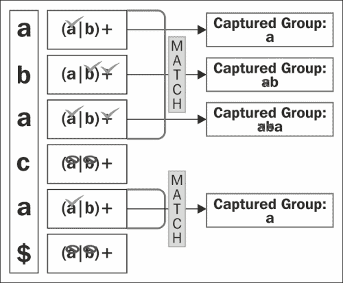

# 第三章。分组

分组是一个强大的工具，允许您执行诸如以下操作：

+   创建子表达式以应用量词。例如，重复子表达式而不是单个字符。

+   限制交替的范围。我们可以定义确切需要交替的内容，而不是整个表达式交替。

+   从匹配的模式中提取信息。例如，从订单列表中提取日期。

+   再次在正则表达式中使用提取的信息，这可能是最有用的属性。一个例子是检测重复的单词。

在本章中，我们将探讨分组，从最简单的到最复杂的。我们将回顾一些先前的示例，以便清楚地了解这些操作的工作原理。

# 介绍

我们已经在第二章 *使用 Python 的正则表达式*中的几个示例中使用了分组。分组是通过两个元字符`()`来完成的。使用括号的最简单示例将构建子表达式。例如，假设您有一个产品列表，每个产品的 ID 由一个数字序列和一个字母数字字符组成，例如 1-a2-b：

```py
>>>re.match(r"(\d-\w){2,3}", ur"1-a2-b")
<_sre.SRE_Match at 0x10f690738>
```

如您在前面的示例中所见，括号指示正则表达式引擎，其中它们内部的模式必须被视为一个单元。

让我们看另一个例子；在这种情况下，我们需要匹配每当有一个或多个`ab`后跟`c`时：

```py
>>>re.search(r"(ab)+c", ur"ababc")
<_sre.SRE_Match at 0x10f690a08>
>>>re.search(r"(ab)+c", ur"abbc")
None
```

因此，您可以在主模式中使用括号来分组有意义的子模式。

它也可以用来限制交替的范围。例如，假设我们想要编写一个表达式来匹配是否有人来自西班牙。在西班牙语中，国家名称是 España，西班牙人是 Español。因此，我们想要匹配 España 和 Español。西班牙字母ñ对于非西班牙人来说可能会令人困惑，因此为了避免混淆，我们将使用 Espana 和 Espanol 代替 España 和 Español。

我们可以通过以下交替实现：

```py
>>>re.search("Espana|ol", "Espanol")
<_sre.SRE_Match at 0x1043cfe68>
>>>re.search("Espana|ol", "Espana")
<_sre.SRE_Match at 0x1043cfed0>
```

问题是这也匹配了`ol`：

```py
>>>re.search("Espana|ol", "ol")
<_sre.SRE_Match at 0x1043cfe00>
```

因此，让我们尝试字符类，如下面的代码所示：

```py
>>>re.search("Espan[aol]", "Espanol")
<_sre.SRE_Match at 0x1043cf1d0>

>>>re.search("Espan[aol]", "Espana")
<_sre.SRE_Match at 0x1043cf850>
```

它有效，但这里我们有另一个问题：它还匹配了`"Espano"`和`"Espanl"`，这在西班牙语中没有任何意义：

```py
>>>re.search("Espan[a|ol]", "Espano")
<_sre.SRE_Match at 0x1043cfb28>
```

解决方案是使用括号：

```py
>>>re.search("Espan(a|ol)", "Espana")
<_sre.SRE_Match at 0x10439b648>

>>>re.search("Espan(a|ol)", "Espanol")
<_sre.SRE_Match at 0x10439b918>

>>>re.search("Espan(a|ol)", "Espan")
   None

>>>re.search("Espan(a|ol)", "Espano")
   None

>>>re.search("Espan(a|ol)", "ol")
   None
```

让我们看看分组的另一个关键特性，**捕获**。组还捕获匹配的模式，因此您可以在以后的几个操作中使用它们，例如`sub`或正则表达式本身。

例如，假设您有一个产品列表，其 ID 由代表产品国家的数字、作为分隔符的破折号和一个或多个字母数字字符组成。您被要求提取国家代码：

```py
>>>pattern = re.compile(r"(\d+)-\w+")
>>>it = pattern.finditer(r"1-a\n20-baer\n34-afcr")
>>>match = it.next()
>>>match.group(1)
'1'
>>>match = it.next()
>>>match.group(1)
'20'
>>>match = it.next()
>>>match.group(1)
'34'
```

在前面的示例中，我们创建了一个模式来匹配 ID，但我们只捕获了由国家数字组成的一个组。请记住，在使用`group`方法时，索引 0 返回整个匹配，而组从索引 1 开始。

捕获组由于可以与几个操作一起使用而提供了广泛的可能性，我们将在接下来的部分中讨论它们的使用。

# 反向引用

正如我们之前提到的，分组给我们提供的最强大的功能之一是可以在正则表达式或其他操作中使用捕获的组。这正是反向引用提供的。为了带来一些清晰度，可能最为人熟知的例子是查找重复单词的正则表达式，如下面的代码所示：

```py
>>>pattern = re.compile(r"(\w+) **\1**")
>>>match = pattern.search(r"hello hello world")
>>>match.groups()
('hello',)
```

在这里，我们捕获了一个由一个或多个字母数字字符组成的组，然后模式尝试匹配一个空格，最后我们有`\1`反向引用。您可以在代码中看到它被突出显示，这意味着它必须与第一个组匹配的内容完全相同。

反向引用可以与前 99 个组一起使用。显然，随着组数的增加，阅读和维护正则表达式的任务会变得更加复杂。这是可以通过命名组来减少的，我们将在下一节中看到它们。但在那之前，我们还有很多关于反向引用的东西要学习。所以，让我们继续进行另一个操作，其中反向引用真的非常方便。回想一下之前的例子，其中我们有一个产品列表。现在，让我们尝试改变 ID 的顺序，这样我们就有了数据库中的 ID，一个破折号和国家代码：

```py
>>>pattern = re.compile(r"(\d+)-(\w+)")
>>>pattern.sub(**r"\2-\1"**, "1-a\n20-baer\n34-afcr")
'a-1\nbaer-20\nafcr-34'
```

就是这样。很简单，不是吗？请注意，我们还捕获了数据库中的 ID，所以我们以后可以使用它。通过突出显示的代码，我们在说，“用你匹配到的第二组、一个破折号和第一组来替换”。

与之前的例子一样，使用数字可能难以跟踪和维护。因此，让我们看看 Python 通过`re`模块提供的帮助。

# 命名组

还记得上一章中我们通过索引获取组的时候吗？

```py
>>>pattern = re.compile(r"(\w+) (\w+)")
>>>match = pattern.search("Hello⇢world")
>>>match.group(1)
  'Hello'
>>>match.group(2)
  'world'
```

我们刚刚学会了如何使用索引访问组来提取信息并将其用作反向引用。使用数字来引用组可能会很繁琐和令人困惑，最糟糕的是它不允许你给组赋予含义或上下文。这就是为什么我们有命名组。

想象一下一个正则表达式，其中有几个反向引用，比如说 10 个，然后你发现第三个是无效的，所以你从正则表达式中删除它。这意味着你必须更改从那个位置开始的每个反向引用的索引。为了解决这个问题，1997 年，Guido Van Rossum 为 Python 1.5 设计了命名组。这个功能被提供给了 Perl 进行交叉传播。

现在，它几乎可以在任何风格中找到。基本上它允许我们给组命名，这样我们可以在任何涉及组的操作中通过它们的名称来引用它们。

为了使用它，我们必须使用`(?P<name>pattern)`的语法，其中`P`来自于 Python 特定的扩展（正如你可以在 Guido 发送给 Perl 开发人员的电子邮件中所读到的那样[`markmail.org/message/oyezhwvefvotacc3`](http://markmail.org/message/oyezhwvefvotacc3)）

让我们看看它是如何在以下代码片段中与之前的例子一起工作的：

```py
>>> pattern = re.compile(r"(?P<first>\w+) (?P<second>\w+)")
>>> match = re.search("Hello world")
>>>match.group("first")
  'Hello'
>>>match.group("second")
  'world'
```

因此，反向引用现在使用起来更简单，更容易维护，正如下面的例子所示：

```py
>>>pattern = re.compile(r"(?P<country>\d+)-(?P<id>\w+)")
>>>pattern.sub(r"\g<id>-\g<country>", "1-a\n20-baer\n34-afcr")
'a-1\nbaer-20\nafcr-34'
```

正如我们在前面的例子中看到的，为了在`sub`操作中通过名称引用组，我们必须使用\`g<name>\`。

我们还可以在模式内部使用命名组，就像下面的例子中所示的那样：

```py
>>>pattern = re.compile(r"(?P<word>\w+) (?P=word)")
>>>match = pattern.search(r"hello hello world")
>>>match.groups()
('hello',)
```

这比使用数字更简单和更易读。

通过这些例子，我们使用了以下三种不同的方式来引用命名组：

| 使用 | 语法 |
| --- | --- |
| 在模式内 | (?P=name) |
| 在`sub`操作的`repl`字符串中 | \g<name> |
| 在`MatchObject`的任何操作中 | match.group('name') |

# 非捕获组

正如我们之前提到的，捕获内容并不是组的唯一用途。有时我们想要使用组，但并不想提取信息；交替是一个很好的例子。这就是为什么我们有一种方法可以创建不捕获的组。在本书中，我们一直在使用组来创建子表达式，就像下面的例子中所示的那样：

```py
>>>re.search("Españ(a|ol)", "Español")
<_sre.SRE_Match at 0x10e90b828>
>>>re.search("Españ(a|ol)", "Español").groups()
('ol',)
```

你可以看到，即使我们对组的内容不感兴趣，我们仍然捕获了一个组。所以，让我们尝试一下不捕获，但首先我们必须知道语法，它几乎与普通组的语法相同，`(?:pattern)`。如你所见，我们只是添加了`?:`。让我们看看下面的例子：

```py
>>>re.search("Españ(?:a|ol)", "Español")
<_sre.SRE_Match at 0x10e912648>
>>>re.search("Españ(?:a|ol)", "Español").groups()
()
```

使用新的语法后，我们拥有了与以前相同的功能，但现在我们节省了资源，正则表达式更容易维护。请注意，该组不能被引用。

## 原子组

它们是非捕获组的特殊情况；它们通常用于提高性能。它禁用回溯，因此您可以避免在模式中尝试每种可能性或路径都没有意义的情况。这个概念很难理解，所以请跟我一直看到本节的结束。

`re`模块不支持原子组。因此，为了看一个例子，我们将使用 regex 模块：[`pypi.python.org/pypi/regex`](https://pypi.python.org/pypi/regex)。

假设我们要寻找由一个或多个字母数字字符组成的 ID，后面跟着一个破折号和一个数字：

```py
>>>data = "aaaaabbbbbaaaaccccccdddddaaa"
>>>regex.match("(\w+)-\d",data)
```

让我们一步一步地看看这里发生了什么：

1.  正则表达式引擎匹配了第一个`a`。

1.  然后它匹配直到字符串的末尾的每个字符。

1.  它失败了，因为它找不到破折号。

1.  因此，引擎进行回溯，并尝试下一个`a`。

1.  再次开始相同的过程。

它尝试了每个字符。如果您考虑我们正在做的事情，一旦第一次失败，继续尝试就没有任何意义。这正是原子组的用处。例如：

```py
>>>regex.match("(?>\w+)-\d",data)
```

在这里，我们添加了`?>`，这表示一个原子组，因此一旦正则表达式引擎无法匹配`,`，它就不会继续尝试数据中的每个字符。

# 组的特殊情况

Python 为我们提供了一些形式的组，可以帮助我们修改正则表达式，甚至只有在匹配前一个组存在于匹配中时才匹配模式，比如`if`语句。

## 每组的标志

有一种方法可以应用我们在第二章*使用 Python 进行正则表达式*中看到的标志，使用一种特殊的分组形式：`(?iLmsux)`。

| Letter | Flag |
| --- | --- |
| **i** | re.IGNORECASE |
| **L** | re.LOCALE |
| **m** | re.MULTILINE |
| **s** | re.DOTALL |
| **u** | re.UNICODE |
| **x** | re.VERBOSE |

例如：

```py
>>>re.findall(r"(?u)\w+" ,ur"ñ")
[u'\xf1']
```

上面的例子与以下相同：

```py
>>>re.findall(r"\w+" ,ur"ñ", re.U)
[u'\xf1']
```

我们在上一章中多次看到了这些例子的作用。

请记住，标志适用于整个表达式。

## yes-pattern|no-pattern

这是组的一个非常有用的情况。它尝试在找到前一个的情况下匹配模式。另一方面，它不会在找不到前一个组的情况下尝试匹配模式。简而言之，它就像一个 if-else 语句。此操作的语法如下：

```py
(?(id/name)yes-pattern|no-pattern)
```

这个表达式的意思是：如果具有此 ID 的组已经匹配，那么在字符串的这一点，`yes-pattern`模式必须匹配。如果组尚未匹配，则`no-pattern`模式必须匹配。

让我们继续看看它是如何工作的。我们有一个产品列表，但在这种情况下，ID 可以用两种不同的方式制作：

+   国家代码（两位数字），一个破折号，三个或四个字母数字字符，一个破折号，和区号（2 位数字）。例如：`34-adrl-01`。

+   三个或四个字母数字字符。例如：`adrl`。

因此，当有国家代码时，我们需要匹配国家地区：

```py
>>>pattern = re.compile(r"(\d\d-)?(\w{3,4})(?(1)(-\d\d))")
>>>pattern.match("34-erte-22")
<_sre.SRE_Match at 0x10f68b7a0>
>>>pattern.search("erte")
<_sre.SRE_Match at 0x10f68b828>
```

正如您在前面的例子中所看到的，当我们有国家代码和区号时，就会有匹配。请注意，当有国家代码但没有区号时，就没有匹配：

```py
>>>pattern.match("34-erte")
None
```

`no-pattern`是用来做什么的？让我们在前面的例子中添加另一个约束：如果没有国家代码，字符串的末尾必须有一个名字：

+   国家代码（2 位数字），一个破折号，三个或四个字母数字字符，一个破折号，和区号（2 位数字）。例如：`34-adrl-01`

+   三个或四个字母数字字符，后面跟着三个或四个字符。例如：`adrl-sala`。

让我们看看它是如何运作的：

```py
>>>pattern = re.compile(r"(\d\d-)?(\w{3,4})-(?(1)(\d\d)|[a-z]{3,4})$")
>>>pattern.match("34-erte-22")
<_sre.SRE_Match at 0x10f6ee750>
```

如预期的那样，如果有国家代码和区号，就会有匹配。

```py
>>>pattern.match("34-erte")
None
```

在前面的例子中，我们确实有国家地区，但没有区号，因此没有匹配。

```py
>>>pattern.match("erte-abcd")
<_sre.SRE_Match at 0x10f6ee880>
```

最后，当没有国家地区时，必须有一个名字，所以我们有一个匹配。

请注意，`no-pattern`是可选的，因此在第一个例子中，我们省略了它。

# 重叠组

在第二章*使用 Python 进行正则表达式*中，我们看到了几个操作，其中有关重叠组的警告：例如，`findall`操作。这似乎让很多人感到困惑。因此，让我们尝试通过一个简单的例子来带来一些清晰度：

```py
>>>re.findall(r'(a|b)+', 'abaca')
['a', 'a']
```

这里发生了什么？为什么以下表达式给出了`'a'`和`'a'`而不是`'aba'`和`'a'`？

让我们一步一步地看看解决方案：



重叠组匹配过程

正如我们在前面的图中看到的，字符`aba`被匹配，但捕获的组只由`a`组成。这是因为即使我们的正则表达式将每个字符分组，它仍然保留最后的`a`。请记住这一点，因为这是理解它如何工作的关键。停下来思考一下，我们要求正则表达式引擎捕获由`a`或`b`组成的所有组，但只对一个字符进行分组，这就是关键。那么，如何捕获由多个`'a'`或`'b'`组成的组，而且顺序无关呢？以下表达式可以实现：

```py
>>>re.findall(r'((?:a|b)+)', 'abbaca')
   ['abba', 'a']
```

我们要求正则表达式引擎捕获由子表达式（`a|b`）组成的每个组，而不是仅对一个字符进行分组。

最后一件事——如果我们想要用`findall`获得由`a`或`b`组成的每个组，我们可以写下这个简单的表达式：

```py
>>>re.findall(r'(a|b)', 'abaca')
   ['a', 'b', 'a', 'a']
```

在这种情况下，我们要求正则表达式引擎捕获由`a`或`b`组成的组。由于我们使用了`findall`，我们得到了每个匹配的模式，所以我们得到了四个组。

### 提示

**经验法则**

最好尽可能简化正则表达式。因此，你应该从最简单的表达式开始，然后逐步构建更复杂的表达式，而不是相反。

# 总结

不要让本章的简单性愚弄你，我们在本章学到的东西将在你日常使用正则表达式的工作中非常有用，并且会给你很大的优势。

让我们总结一下到目前为止我们学到的东西。首先，我们看到了当我们需要对表达式的某些部分应用量词时，组如何帮助我们。

我们还学会了如何再次在模式中使用捕获的组，甚至在`sub`操作中使用替换字符串，这要归功于**反向引用**。

在本章中，我们还查看了命名组，这是一种改进正则表达式可读性和未来维护的工具。

后来，我们学会了只有在先前存在一个组的情况下才匹配子表达式，或者另一方面，只有在先前不存在一个组的情况下才匹配它。

现在我们知道如何使用组，是时候学习一个与组非常接近的更复杂的主题了；四处看看吧！
