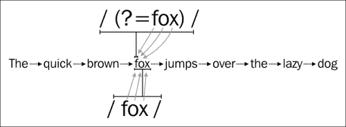

# 第四章：环视

到目前为止，我们已经学习了在丢弃字符的同时匹配字符的不同机制。已经匹配的字符不能再次比较，匹配任何即将到来的字符的唯一方法是丢弃它。

这些字符指示位置而不是实际内容。例如，插入符号(`^`)表示行的开头，或者美元符号(`$`)表示行的结尾。它们只是确保输入中的位置正确，而不实际消耗或匹配任何字符。

更强大的零宽断言是**环视**，这是一种机制，可以将先前的某个值（**向后查找**）或后续的某个值（**向前查找**）与当前位置匹配。它们有效地进行断言而不消耗字符；它们只是返回匹配的正面或负面结果。

环视机制可能是正则表达式中最不为人知，同时也是最强大的技术。这种机制允许我们创建强大的正则表达式，否则无法编写，要么是因为它代表的复杂性，要么是因为正则表达式在没有环视的情况下的技术限制。

在本章中，我们将学习如何使用 Python 正则表达式来利用环视机制。我们将了解如何应用它们，它们在幕后是如何工作的，以及 Python 正则表达式模块对我们施加的一些限制。

正向环视和负向环视都可以细分为另外两种类型：正向和负向：

+   **正向环视**：这种机制表示为一个由问号和等号`?=`组成的表达式，放在括号块内。例如，`(?=regex)`将匹配传递的正则表达式*是否*与即将到来的输入匹配。

+   **负向环视**：这种机制被指定为一个由问号和感叹号`?!`组成的表达式，放在括号块内。例如，`(?!regex)`将匹配传递的正则表达式*是否不*与即将到来的输入匹配。

+   **正向环视**：这种机制表示为一个由问号、小于号和等号`?<=`组成的表达式，放在括号块内。例如，`(?<=regex)`将匹配传递的正则表达式*是否*与先前的输入匹配。

+   **负向环视**：这种机制表示为一个由问号、小于号和感叹号`?<!`组成的表达式，放在括号块内。例如，`(?<!regex)`将匹配传递的正则表达式*是否不*与先前的输入匹配。

让我们开始期待下一节。

# 向前查看

我们将要学习的第一种环视机制是向前环视机制。它试图匹配作为参数传递的子表达式。这两种环视操作的零宽度特性使它们变得复杂和难以理解。

正如我们从前一节所知，它表示为一个由问号和等号`?=`组成的表达式，放在括号块内：`(?=regex)`。

让我们通过比较两个类似的正则表达式的结果来开始解决这个问题。我们可以回忆一下，在第一章中，*介绍正则表达式*，我们将表达式`/fox/`与短语`The quick brown fox jumps over the lazy dog`匹配。让我们也将表达式`/(?=fox)/`应用到相同的输入中：

```py
>>>pattern = re.compile(r'fox')
>>>result = pattern.search("The quick brown fox jumps over the lazy dog")
>>>print result.start(), result.end()
16 19
```

我们刚刚在输入字符串中搜索了字面上的`fox`，正如预期的那样，我们在索引`16`和`19`之间找到了它。让我们看一下正向环视机制的下一个例子：

```py
>>>pattern = re.compile(r'(?=fox)')
>>>result = pattern.search("The quick brown fox jumps over the lazy dog")
>>>print result.start(), result.end()
16 16
```

这次我们应用了表达式`/(?=fox)/`。结果只是一个位置在索引`16`（起始和结束点都指向相同的索引）。这是因为向前查找不会消耗字符，因此可以用来过滤表达式应该匹配的位置。但它不会定义结果的内容。我们可以在下图中直观地比较这两个表达式：



正常匹配和向前查找的比较

让我们再次使用这个特性，尝试匹配任何后面跟着逗号字符（`,`）的单词，使用以下正则表达式`/\w+(?=,)/`和文本`They were three: Felix, Victor, and Carlos`：

```py
>>>pattern = re.compile(r'\w+(?=,)')
>>>pattern.findall("They were three: Felix, Victor, and Carlos.")
['Felix', 'Victor']
```

我们创建了一个正则表达式，接受任何重复的字母数字字符，后面跟着一个逗号字符，这不会作为结果的一部分使用。因此，只有`Felix`和`Victor`是结果的一部分，因为`Carlos`的名字后面没有逗号。

这与我们在本章中使用的正则表达式有多大不同？让我们通过将`/\w+,/`应用于相同的文本来比较结果：

```py
>>>pattern = re.compile(r'\w+,')
>>>pattern.findall("They were three: Felix, Victor, and Carlos.")
['Felix,', 'Victor,']
```

通过前面的正则表达式，我们要求正则表达式引擎接受任何重复的字母数字字符，后面跟着一个逗号字符。因此，字母数字字符*和逗号字符*将被返回，正如我们在列表中看到的。

值得注意的是，向前查找机制是另一个可以利用正则表达式所有功能的子表达式（这在向后查找机制中并非如此，我们稍后会发现）。因此，我们可以使用到目前为止学到的所有构造，如交替：

```py
>>>pattern = re.compile(r'\w+(?=,|\.)')
>>>pattern.findall("They were three: Felix, Victor, and Carlos.")
['Felix', 'Victor', 'Carlos']
```

在前面的例子中，我们使用了交替（即使我们可以使用其他更简单的技术，如字符集）来接受任何重复的字母数字字符，后面跟着一个逗号或点字符，这不会作为结果的一部分使用。

## 负向查找

负向查找机制具有与向前查找相同的性质，但有一个显著的区别：只有子表达式不匹配时，结果才有效。

它表示为一个由问号和感叹号`?!`组成的表达式，放在括号块内：`(?!regex)`。

当我们想要表达不应该发生的情况时，这是很有用的。例如，要找到任何不是`John Smith`的名字`John`，我们可以这样做：

```py
>>>pattern = re.compile(r'John(?!\sSmith)')                                    >>> result = pattern.finditer("I would rather go out with **John** McLane than with John Smith or **John** Bon Jovi")
>>>for i in result:
...print i.start(), i.end()
...
27 31
63 67
```

在前面的例子中，我们通过消耗这五个字符来寻找`John`，然后向前查找一个空格字符，后面跟着单词`Smith`。如果匹配成功，匹配结果将只包含`John`的起始和结束位置。在这种情况下，`John McLane`的位置是`27`-`31`，`John Bon Jovi`的位置是`63`-`67`。

现在，我们能够利用更基本的向前查找形式：正向和负向查找。让我们学习如何在替换和分组中充分利用它。

# 向前查找和替换

向前查找操作的零宽度特性在替换中特别有用。由于它们，我们能够执行在其他情况下会非常复杂的转换。

向前查找和替换的一个典型例子是将仅由数字字符组成的数字（例如 1234567890）转换为逗号分隔的数字，即 1,234,567,890。

为了编写这个正则表达式，我们需要一个策略来跟随。我们想要做的是将数字分组成三个一组，然后用相同的组加上一个逗号字符来替换它们。

我们可以从一个几乎天真的方法开始，使用以下突出显示的正则表达式：

```py
>>>pattern = re.compile(r'**\d{1,3}**')
>>>pattern.findall("The number is: 12345567890")
['123', '455', '678', '90']
```

我们在这次尝试中失败了。我们实际上是在三个数字的块中进行分组，但应该从右到左进行。我们需要不同的方法。让我们尝试找到一个、两个或三个数字，这些数字必须后面跟着任意数量的三位数字块，直到我们找到一个不是数字的东西。

这将对我们的数字产生以下影响。当尝试找到一个、两个或三个数字时，正则表达式将开始只取一个，这将是数字`1`。然后，它将尝试捕捉恰好三个数字的块，例如 234、567、890，直到找到一个非数字。这是输入的结尾。

如果我们用正则表达式来表达我们刚刚用普通英语解释的内容，我们将得到以下结果：

```py
/\d{1,3}(?=(\d{3})+(?!\d))/
```

| 元素 | 描述 |
| --- | --- |

|

```py
\d
```

| 这匹配一个十进制字符 |
| --- |

|

```py
{1,3}
```

| 这表示匹配重复一到三次 |
| --- |

|

```py
(?=
```

| 这表示该字符后面跟着（但不消耗）这个表达式 |
| --- |

|

```py
(
```

| 这表示一个组 |
| --- |

|

```py
\d
```

| 这表示有一组十进制字符 |
| --- |

|

```py
\s
```

| 这表示匹配重复三次 |
| --- |

|

```py
)
```

|   |
| --- |

|

```py
+
```

| 这表示十进制字符应该出现一次或多次 |
| --- |

|

```py
(?!
```

| 这表示匹配不是后面跟着（但不消耗）下一个表达式定义的内容 |
| --- |

|

```py
\d
```

| 这表示一个十进制字符 |
| --- |

|

```py
))
```

|   |
| --- |

让我们在 Python 的控制台中再次尝试这个新的正则表达式：

```py
>>>pattern = re.compile(r'\d{1,3}(?=(\d{3})+(?!\d))')
>>>results = pattern.finditer('1234567890')
>>>for result in results:
...    print result.start(), result.end()
...
0 1
1 4
4 7
```

这一次，我们可以看到我们正在使用正确的方法，因为我们刚刚确定了正确的块：`1`、`234`、`567`和`890`。

现在，我们只需要使用替换来替换我们找到的每个匹配项，使其成为相同的匹配结果加上逗号字符。我们已经知道如何使用替换，因为我们在第二章中学习过，*使用 Python 进行正则表达式*，所以让我们把它付诸实践：

```py
>>>pattern = re.compile(r'\d{1,3}(?=(\d{3})+(?!\d))')
>>>pattern.sub(r'\g<0>,', "1234567890")
'1,234,567,890'
```

Et voila！我们刚刚将一个未格式化的数字转换成了一个带有千位分隔符的美丽数字。

我们刚刚学会了两种技术，可以预见未来会发生什么。我们还研究了它们在替换中的用法。现在，让我们回头看看我们留下的东西**向后看**。

# 向后看

我们可以安全地将向后看定义为与向前看相反的操作。它试图匹配作为参数传递的子表达式之后的内容。它也具有零宽度的特性，因此不会成为结果的一部分。

它表示为一个表达式，前面有一个问号、一个小于号和一个等号，`?<=`，在一个括号块内：`(?<=regex)`。

例如，我们可以在类似于我们在负向向前看中使用的示例中使用它，只找到名为`John McLane`的人的姓。为了实现这一点，我们可以写一个类似下面的向后看：

```py
>>>pattern = re.compile(r'(?<=John\s)McLane')
>>>result = pattern.finditer("I would rather go out with John **McLane** than with John Smith or John Bon Jovi")
>>>for i in result:
...    print i.start(), i.end()
...
32 38
```

通过前面的向后看，我们要求正则表达式引擎只匹配那些前面跟着`John`和一个空格的位置，然后消耗`McLane`作为结果。

在 Python 的`re`模块中，然而，向前看和向后看的实现之间有一个根本的区别。由于一些根深蒂固的技术原因，向后看机制只能匹配固定宽度的模式。如果需要在向后看中使用可变宽度模式，则可以使用[`pypi.python.org/pypi/regex`](https://pypi.python.org/pypi/regex)中的正则表达式模块，而不是标准的 Python `re`模块。

固定宽度模式不包含我们在第一章中学习的量词这样的可变长度匹配器，*介绍正则表达式*。其他可变长度构造，如反向引用也是不允许的。选择是允许的，但只有在备选项具有相同的长度时才允许。同样，这些限制在前述的正则表达式模块中是不存在的。

让我们看看如果我们在反向引用中使用不同长度的选择会发生什么：

```py
>>>pattern = re.compile(r'(?<=(John|Jonathan)\s)McLane')
Traceback (most recent call last):
  File "<stdin>", line 1, in <module>
  File "/System/Library/Frameworks/Python.framework/Versions/2.7/lib/python2.7/re.py", line 190, in compile
return _compile(pattern, flags)
  File "/System/Library/Frameworks/Python.framework/Versions/2.7/lib/python2.7/re.py", line 242, in _compile
raise error, v # invalid expression
sre_constants.error: **look-behind requires fixed-width pattern**

```

我们有一个例外，因为后面的查找需要一个固定宽度的模式。如果我们尝试应用量词或其他可变长度的结构，我们将得到类似的结果。

现在我们已经学会了不消耗字符的匹配前后不匹配的不同技术和我们可能遇到的不同限制，我们可以尝试编写另一个示例，结合我们学习过的一些机制来解决一个现实世界的问题。

假设我们想要提取出推文中存在的任何 Twitter 用户名，以创建一个自动情绪检测系统。为了编写一个正则表达式来提取它们，我们应该首先确定 Twitter 用户名是如何表示的。如果我们浏览 Twitter 的网站[`support.twitter.com/articles/101299-why-can-t-i-register-certain-usernames`](https://support.twitter.com/articles/101299-why-can-t-i-register-certain-usernames)，我们可能会找到以下描述：

> 用户名只能包含字母数字字符（A-Z 的字母，0-9 的数字），除了下划线，如上所述。检查一下，确保你想要的用户名不包含任何符号、破折号或空格。

对于我们的开发测试，我们将使用这条 Packt Publishing 推文：


我们应该首先构建一个包含所有可能用于 Twitter 用户名的字符的字符集。这可能是任何字母数字字符，后面跟着下划线字符，就像我们刚才在前面的 Twitter 支持文章中发现的那样。因此，我们可以构建一个类似以下的字符集：

```py
[\w_]
```

这将表示我们想要从用户名中提取的所有部分。然后，我们需要在用户名前加上一个单词边界和 at 符号（`@`）来定位用户名：

```py
/\B@[\w_]+/
```

使用单词边界的原因是我们不想与电子邮件等混淆。我们只寻找紧随行首或单词边界之后，然后跟着@符号，然后是一些字母数字或下划线字符的文本。示例如下：

+   `@vromer0`是一个有效的用户名

+   `iam@vromer0`不是一个有效的用户名，因为它应该以@符号开头

+   `@vromero.org`不是一个有效的用户名，因为它包含一个无效字符

如果我们使用目前的正则表达式，我们将得到以下结果：

```py
>>>pattern = re.compile(r'\B@[\w_]+') 
>>>pattern.findall("Know your Big Data = 5 for $50 on eBooks and 40% off all eBooks until Friday #bigdata #hadoop @HadoopNews packtpub.com/bigdataoffers")
['@HadoopNews']
```

我们只想匹配用户名，而不包括前面的@符号。在这一点上，后视机制变得有用。我们可以在后视子表达式中包含单词边界和@符号，这样它们就不会成为匹配结果的一部分：

```py
>>>pattern = re.compile(r'(?<=\B@)[\w_]+')
>>>pattern.findall("Know your Big Data = 5 for $50 on eBooks and 40% off all eBooks until Friday #bigdata #hadoop @HadoopNews packtpub.com/bigdataoffers")
['HadoopNews']
```

现在我们已经实现了我们的目标。

## 负向后视

负向后视机制具有与主要后视机制完全相同的性质，但只有在传递的子表达式不匹配时才会得到有效结果。

它表示为一个表达式，前面有一个问号、一个小于号和一个感叹号，`?<!`，在括号块内：`(?<!regex)`。

值得记住的是，负向后视不仅具有前视机制的大部分特征，而且还具有相同的限制。负向后视机制只能匹配固定宽度的模式。这与我们在前一节中学习的原因和影响是一样的。

我们可以通过尝试匹配任何姓氏为`Doe`但不叫`John`的人来实践这一点，使用这样的正则表达式：`/(?<!John\s)Doe/`。如果我们在 Python 的控制台中使用它，我们将得到以下结果：

```py
>>>pattern = re.compile(r'(?<!John\s)Doe')
>>>results = pattern.finditer("John Doe, Calvin **Doe**, Hobbes **Doe**")
>>>for result in results:
...   print result.start(), result.end()
...
17 20
29 32
```

# 环视和分组

在组内使用环视结构的另一个有益的用途。通常，当使用组时，必须在组内匹配并返回非常具体的结果。由于我们不希望在组内添加不必要的信息，因此在其他潜在选项中，我们可以利用环视作为一个有利的解决方案。

假设我们需要获取一个逗号分隔的值，值的第一部分是一个名称，而第二部分是一个值。格式类似于这样：

```py
INFO 2013-09-17 12:13:44,487 authentication failed
```

正如我们在第三章中学到的*分组*，我们可以轻松地编写一个表达式，以获取以下两个值：

```py
/\w+\s[\d-]+\s[\d:,]+\s(.*\sfailed)/
```

然而，我们只想在失败不是认证失败时进行匹配。我们可以通过添加负向后行来实现这一点。它看起来像这样：

```py
/\w+\s[\d-]+\s[\d:,]+\s(.*(?<!authentication\s)failed)/
```

一旦我们将其放入 Python 的控制台，我们将得到以下输出：

```py
>>>pattern = re.compile(r'\w+\s[\d-]+\s[\d:,]+\s(.*(?<!authentication\s)failed)')
>>>pattern.findall("INFO 2013-09-17 12:13:44,487 authentication failed")
[]
>>>pattern.findall("INFO 2013-09-17 12:13:44,487 something else failed")
['something else failed']
```

# 总结

在本章中，我们学习了零宽断言的概念，以及它如何在不干扰结果内容的情况下在文本中找到确切的内容。

我们还学习了如何利用四种类型的环视机制：正向先行断言，负向先行断言，正向后行断言和负向后行断言。

我们还特别关注了两种具有可变断言的后行环视的限制。

通过这样，我们结束了对正则表达式基本和高级技术的探讨。现在，我们准备在下一章节中专注于性能调优。
