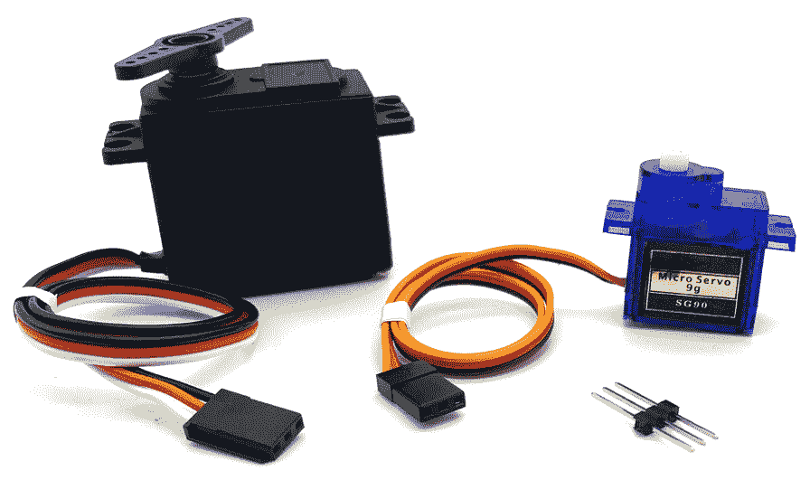
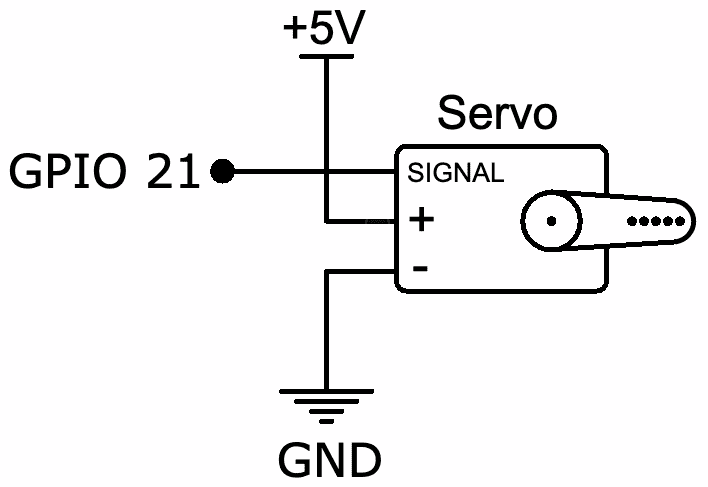
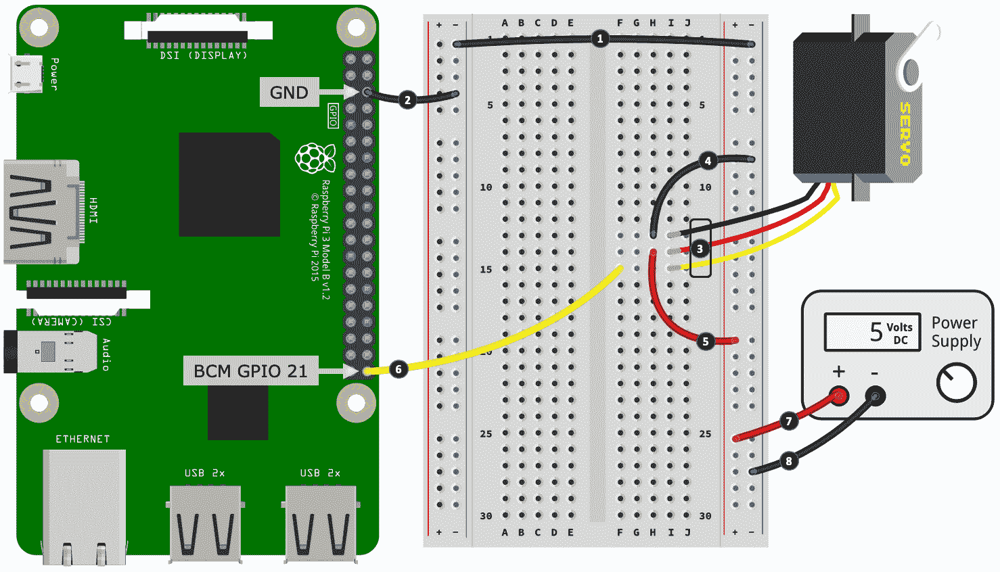
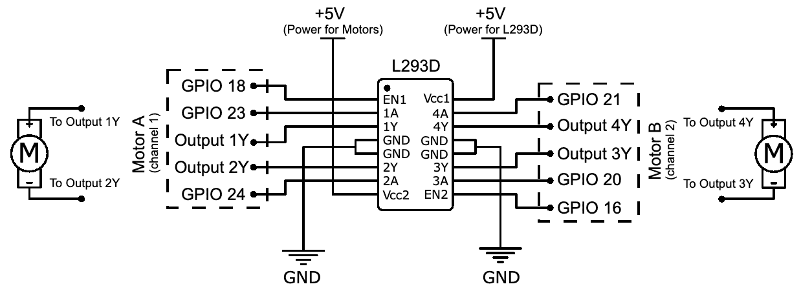
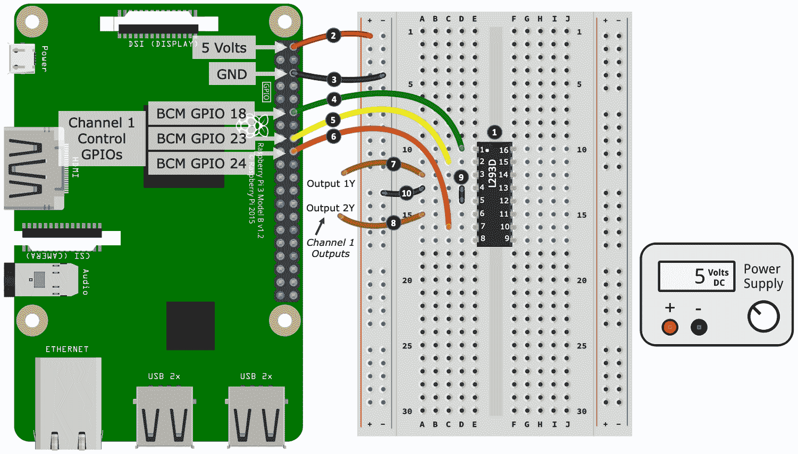
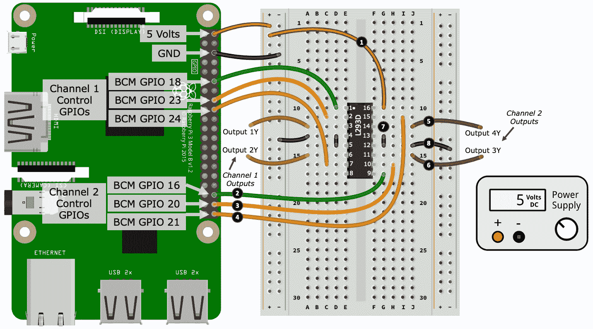
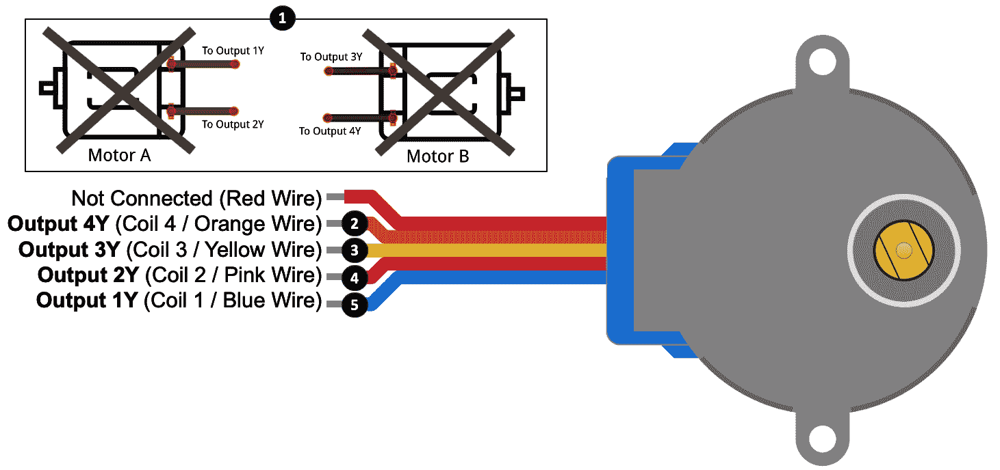

使用舵机、电机和步进电机进行运动

在上一章中，我们介绍了如何测量温度、湿度、光线和湿度。在本章中，我们将把注意力转向控制电机和舵机，这些是用于创建物理运动和动作的常见设备。本章中您将学习的核心概念、电路和代码将为您打开使用树莓派进行物理自动化和机器人技术的大门。

我们将学习如何使用**脉冲宽度调制**（**PWM**）来设置舵机的角度，以及如何使用 H 桥集成电路来控制直流电机的方向和速度。我们将研究步进电机以及如何控制它们进行精确的运动。

本章我们将涵盖以下内容：

+   使用 PWM 来旋转舵机

+   使用 H 桥集成电路控制电机

+   步进电机控制简介

# 技术要求

要执行本章的练习，您需要以下物品：

+   树莓派 4 型 B

+   Raspbian OS Buster（带桌面和推荐软件）

+   最低 Python 版本 3.5

这些要求是本书中代码示例的基础。可以合理地期望，只要您的 Python 版本为 3.5 或更高，代码示例应该可以在树莓派 3 型 B 或不同版本的 Raspbian OS 上无需修改即可运行。

你会在 GitHub 存储库的`chapter10`文件夹中找到本章的源代码，该存储库位于[`github.com/PacktPublishing/Practical-Python-Programming-for-IoT`](https://github.com/PacktPublishing/Practical-Python-Programming-for-IoT)。

您需要在终端中执行以下命令来设置虚拟环境并安装本章代码所需的 Python 库：

```py
$ cd chapter10              # Change into this chapter's folder
$ python3 -m venv venv      # Create Python Virtual Environment
$ source venv/bin/activate  # Activate Python Virtual Environment
(venv) $ pip install pip --upgrade        # Upgrade pip
(venv) $ pip install -r requirements.txt  # Install dependent packages
```

以下依赖项已从`requirements.txt`中安装：

+   **PiGPIO**：PiGPIO GPIO 库（[`pypi.org/project/pigpio`](https://pypi.org/project/pigpio)）

本章练习所需的电子元件如下：

+   1 x MG90S 业余舵机（或等效的 3 线 5 伏特业余舵机）。参考资料表：[`www.alldatasheet.com/datasheet-pdf/pdf/1132104/ETC2/MG90S.html`](https://www.alldatasheet.com/datasheet-pdf/pdf/1132104/ETC2/MG90S.html)

+   1 x L293D **集成电路**（**IC**）（确保它带有 D - 也就是 L293**D**，而不是 L293）。参考资料表：[`www.alldatasheet.com/datasheet-pdf/pdf/89353/TI/L293D.html`](https://www.alldatasheet.com/datasheet-pdf/pdf/89353/TI/L293D.html)

+   1 x 28BYJ-48 步进电机（5 伏特，64 步，1:64 齿轮）。注意：28BYJ-48 有 5 伏特和 12 伏特两种，不同的配置步数和齿轮。参考资料表：[`www.alldatasheet.com/datasheet-pdf/pdf/1132391/ETC1/28BYJ-48.html`](https://www.alldatasheet.com/datasheet-pdf/pdf/1132391/ETC1/28BYJ-48.html)

+   2 x 尺寸 130（R130）直流电机额定为 3-6 伏特（最好具有静态电流<800 毫安），或具有兼容电压和电流额定值的替代直流电机

+   外部电源 - 至少是 3.3V/5V 的面包板可安装电源

让我们开始学习如何在树莓派、Python 和 PiGPIO 中使用舵机。

# 使用 PWM 来旋转舵机

常见的舵机或舵机是内部齿轮电机，允许您将其轴精确旋转到 180 度弧度内的特定角度。它们是工业机器人和玩具的核心组件，我们都熟悉玩具中的舵机，如遥控汽车、飞机和无人机中的舵机。

在*图 10.1*中显示了一个全尺寸的业余风格舵机、一个微型舵机和一组排针，这些对于帮助将舵机连接到面包板非常有用，我们将在本节后面构建电路时需要用到：



图 10.1 - 舵机

舵机的一个很好的特性是它们基本上是一种即插即用的设备——在我们将它们连接到电源后，我们只需要发送一个编码了我们想要舵机旋转到的角度的 PWM 信号，然后就完成了。没有集成电路、没有晶体管，也没有任何其他外部电路。更好的是，舵机控制是如此普遍，以至于许多 GPIO 库——包括 PiGPIO——都包括了方便的控制方法。

让我们通过连接一个舵机到我们的树莓派来开始我们的舵机探索。

## 连接舵机到你的树莓派

我们舵机示例的第一个任务是将其连接到电源和我们的树莓派。显示这种布线的原理图如下：



图 10.2 – 舵机布线原理图

让我们开始使用面包板布线我们的舵机，如下所示：



图 10.3 – 舵机面包板布局

在我们逐步介绍布线程序之前，我首先想简要讨论一下舵机出线的颜色。虽然舵机线的颜色有些是标准的，但在不同的制造商和舵机之间可能会有所不同。在连接你的舵机时，请使用以下提示在*步骤 4*、*5*和*6*。如果你的舵机有我没有列在下面列表中的颜色线，你需要查阅你舵机的数据表。

常见的舵机线颜色如下：

+   棕色或黑色的线连接到 GND

+   红色线连接到+5 伏

+   橙色、黄色、白色或蓝色的线是信号/PWM 输入线，连接到 GPIO 引脚

以下是创建面包板构建的步骤。步骤编号与*图 10.3*中的黑色圆圈中的数字相匹配：

1.  将左侧和右侧的负电源轨道连接在一起。

1.  将树莓派上的 GND 引脚连接到左侧的负电源轨道。

1.  将舵机连接到面包板。如前所述，并如*图 10.1*所示，你需要一组排针（或者，作为替代，公对公跳线）来将你的舵机连接到你的面包板。

1.  将舵机的黑色线（负/GND）连接到右侧电源轨道的负极。

1.  将舵机的红色线（5 伏电源）连接到右侧电源轨道的正极。

1.  将舵机的信号线连接到树莓派上的 GPIO 21。

1.  将外部 5 伏电源的正输出端连接到右侧电源轨道的正极。

1.  将电源供应的负输出端连接到右侧电源轨道的负极。

你需要使用外部的 5 伏电源(*步骤 7*和*8*)来为你的舵机供电。像 MG90S 这样的小型舵机在没有负载的情况下旋转时使用的电流约为 200 毫安，如果你在舵机上连接了重负载或者强行阻止旋转，最大电流为 400 毫安。直接从你的树莓派的 5 伏引脚中提取这个电流可能足以导致它重置。

许多廉价的类似汽车的玩具都有一个硬左/右模拟舵机用于他们的转向机构。它可能看起来像一个舵机，但实际上，它只是一个带有一些齿轮和弹簧的基本直流电机，用于创建硬左/右转向角度。当电机没有参与时，弹簧会将舵机返回到中心。如果你不能对角度进行精细控制，那它就不是一个真正的舵机。

在我们开始编写一些代码之前，让我们快速看一下 PWM 是如何用来控制舵机的。这将让你了解当我们到达代码时发生了什么。

## 如何使用 PWM 控制舵机

舵机通常需要大约 50 赫兹的 PWM 信号（50 赫兹左右的一些变化是可以的，但我们将坚持使用 50 赫兹作为常见参考点），以及在 1.0 毫秒和 2.0 毫秒之间的脉冲宽度来确定旋转角度。脉冲宽度、占空比和角度之间的关系在*图 10.4*中有所说明。如果你现在还没有完全理解，不要担心。当我们看到我们的舵机动作并在下一节中审查与舵机相关的代码时，这些应该会更清楚：


图 10.4 - 舵机的脉冲宽度、占空比和角度

我们之前没有涵盖脉冲宽度与我们之前对 PWM 的覆盖范围的关系；然而，这只是描述占空比的另一种方式。

这里有一个例子：

+   如果我们有一个 50 赫兹的 PWM 信号（即每秒 50 个周期），那么这意味着 1 个 PWM 周期需要*1 / 50 = 0.02*秒，或者 20 毫秒。

+   因此，以 1.5 毫秒的脉冲宽度表示的占空比为*1.5 毫秒/20 毫秒=0.075*，乘以 100 得到占空比为 7.5%。

往回推，我们有以下内容：

+   7.5%的占空比除以 100 是 0.075。然后，*0.075 x 20 毫秒=1.5 毫秒*，即 1.5 毫秒的脉冲宽度。

如果你更喜欢一个公式来描述*脉冲宽度*、*频率*和*占空比*的关系，这里有一个：


要转换回来，我们有以下内容：


好了，数学的部分就到此为止。让我们运行并查看 Python 代码来让我们的舵机移动。

## 运行和探索舵机代码

我们即将运行的代码可以在`chapter10/servo.py`文件中找到。我建议在继续之前先查看源代码，以便对文件的内容有一个整体的了解。

当你运行`chapter10/servo.py`文件中的代码时，你的舵机应该会左右旋转几次。

让我们从代码开始，首先是在第 1 行定义的一些脉冲宽度变量：

```py
LEFT_PULSE  = 1000   # Nano seconds          # (1)
RIGHT_PULSE = 2000
CENTER_PULSE = ((LEFT_PULSE - RIGHT_PULSE) // 2) + RIGHT_PULSE  # Eg 1500
```

这些脉冲宽度代表了我们舵机的极端左右旋转。

请注意，`LEFT_PULSE`和`RIGHT_PULSE`的值以纳秒为单位，因为这是 PiGPIO 舵机函数使用的单位。

`LEFT_PULSE = 1000`和`RIGHT_PULSE = 2000`这些值是你经常看到的完美世界值。实际上，你可能需要对这些变量进行轻微调整，以便使舵机完全旋转。例如，我的测试舵机需要`LEFT_PULSE = 600`和`RIGHT_PULSE = 2450`这些值才能实现完全旋转。如果你调整得太远，舵机在完全左转或右转时会保持连接并发出嘎吱嘎吱的声音。如果发生这种情况，立即断开电源以防止对舵机造成损坏，并重新调整数值。

如果你的舵机向后旋转 - 例如，当你期望它向右旋转时它向左旋转 - 交换`LEFT_PULSE`和`RIGHT_PULSE`的值。或者，只需将你的舵机倒置。

在第 2 行，我们定义了`MOVEMENT_DELAY_SECS= 0.5`变量，我们稍后需要在舵机移动之间添加延迟：

```py
  # Delay to give servo time to move
  MOVEMENT_DELAY_SECS = 0.5            # (2)
```

当你使用舵机并发送 PWM 旋转信号时，你会发现它们的行为是异步的。也就是说，代码不会阻塞，直到舵机完成旋转。如果我们打算进行许多快速的舵机移动，并希望它们完全完成，我们必须添加一个短暂的延迟，以确保舵机有时间完成旋转。我们很快将介绍的`sweep()`函数中就有一个例子。0.5 秒的延迟只是一个建议，所以可以随意尝试不同的数字。

从第 3 行开始，我们定义了三个基本函数来控制我们的舵机：

```py
 def left():                                               # (3)
       pi.set_servo_pulsewidth(SERVO_GPIO, LEFT_PULSE)

 def center():
       pi.set_servo_pulsewidth(SERVO_GPIO, CENTER_PULSE)

 def right():
       pi.set_servo_pulsewidth(SERVO_GPIO, RIGHT_PULSE)
```

`left()`函数只是使用 PiGPIO 的`set_servo_pulsewidth()`方法将 PWM 脉冲宽度设置为`LEFT_PULSE`在伺服的 GPIO 引脚上。这是 PiGPIO 提供的伺服控制的便利函数，作为使用我们在许多先前章节中看到的`set_PWM_dutycycle()`和`set_PWM_frequency()`方法的实际替代方案。在我们回顾了代码之后，我们将更多地谈论这些方法。

`center()`和`right()`函数执行与`left()`相应的等效操作。

如果您将伺服旋转到指定的角度并尝试用手移动齿轮，您会注意到伺服会抵抗变化。这是因为伺服持续以 50 赫兹的速率接收通过`set_servo_pulsewidth()`设置的最后一个脉冲，因此它会抵制任何试图改变其设置位置的尝试。

在前一节中，当我们将伺服连接到树莓派时，我们提到了伺服的最大电流约为~400+mA。前面的段落是一个例子，其中伺服吸取了这个最大电流。当伺服接收到脉冲宽度指令时，它会抵抗任何改变其位置的力，导致更多的电流使用。这与我们在第七章中讨论的直流电机的空载电流原理类似，*打开和关闭物品*。

如果您将伺服的脉冲宽度设置为零，就像我们在第 4 行的`idle()`函数中所做的那样，您现在会发现可以轻松地用手旋转伺服。当我的测试伺服处于空闲状态（或静止状态）时，它大约使用了 6.5 毫安：

```py
   def idle():                                      # (4)
      pi.set_servo_pulsewidth(SERVO_GPIO, 0)
```

到目前为止，我们已经看到了如何使伺服向左、中间和右边旋转，但是如果我们想将其旋转到特定的角度怎么办？很简单（有点），我们只需要一点数学，就像在第 5 行的`angle()`函数中所示：

```py
  def angle(to_angle):                                   # (5)
      # Restrict to -90..+90 degrees
      to_angle = int(min(max(to_angle, -90), 90))

      ratio = (to_angle + 90) / 180.0                    # (6)
      pulse_range = LEFT_PULSE - RIGHT_PULSE
      pulse = LEFT_PULSE - round(ratio * pulse_range)    # (7)

      pi.set_servo_pulsewidth(SERVO_GPIO, pulse)
```

`angle()`函数接受-90 到+90 度范围内的角度（0 度为中心），在第 6 行计算出我们输入角度相对于我们伺服 180 度范围的比率，然后在第 7 行推导出相应的脉冲宽度。然后将此脉冲宽度发送到伺服，它将相应地调整其角度。

最后，我们在第 10 行遇到了`sweep()`函数。这是在您运行此代码时提供了伺服左右扫描运动的函数：

```py
 def sweep(count=4):                        # (10)
      for i in range(count):
          right()
          sleep(MOVEMENT_DELAY_SECS)
          left()
          sleep(MOVEMENT_DELAY_SECS)
```

在这个函数中，我们看到了`sleep(MOVEMENT_DELAY_SECS)`的使用，这是必要的，以便给伺服完成每个旋转请求的时间，因为伺服的异步性质。如果您注释掉两个`sleep()`调用，您会发现伺服向左旋转并停止。这是因为当`for`循环迭代（没有`sleep()`）时，每个`left()`调用会覆盖先前的`right()`调用，依此类推，最后在循环完成之前调用的是`left()`。

我们刚刚看到了如何使用 PiGPIO 及其面向伺服的 PWM 函数`set_servo_pulsewidth()`来控制伺服。如果您对使用`set_PWM_frequency()`和`set_PWM_dutycycle()`函数实现伺服的实现感兴趣，您会在`chapter10`文件夹中找到一个名为`servo_alt.py`的文件。它在功能上等同于我们刚刚介绍的`servo.py`代码。

这样就结束了我们的伺服示例。您学到的知识以及代码示例将为您提供开始在自己的项目中使用伺服所需的一切！我们的重点是使用角度运动伺服；然而，您学到的核心内容也可以通过一些试验和实验（主要是确定正确的脉冲宽度）来适应*连续旋转伺服*，我将在下一节中简要提到。

让我们用一个简短的考虑来结束我们对伺服的讨论，讨论不同类型的伺服。

## 不同类型的伺服

我们的示例使用了常见的 3 线，180 度角舵机。虽然这是一种非常常见的舵机类型，但也有其他变体，包括连续旋转舵机，具有三根以上线的舵机和特殊用途舵机：

+   **连续旋转舵机**：有 3 根线，使用与 3 线角度舵机相同的 PWM 原理，只是 PWM 脉冲宽度确定了舵机的旋转*方向*（顺时针/逆时针）和*速度*。

由于它们的内部控制电路和齿轮装置，连续旋转舵机是直流电机和 H-Bridge 控制器的便捷低速/高扭矩替代品（我们将在下一节中介绍）。

+   **4 线舵机**：这些舵机有一组三根线和一根松散的第四根线。这第四根线是舵机的模拟输出，可用于检测角度。如果您需要在启动程序时知道舵机的静止角度，这将非常有用。

舵机使用嵌入电位器来跟踪它们的位置。第四根线连接到这样的电位器。

+   **特殊用途或重型工业用途舵机**：具有不同的接线配置和使用要求-例如，它们可能没有内部电路来解码 PWM 信号，并且需要用户提供和创建电路来执行此功能。

我们现在已经了解了常见的业余舵机的工作原理，并且还发现了如何使用 PWM 在 Python 中设置它们的旋转角度。在下一节中，我们将学习更多关于直流电机以及如何使用 H-Bridge 这种集成电路来控制它们。

# 使用 H-Bridge 集成电路来控制电机

在第七章中，*打开和关闭东西*，我们学习了如何使用晶体管打开和关闭直流电机，并且还看到了如何使用 PWM 控制电机的速度。我们单个晶体管电路的一个限制是电机只能单向旋转。在本节中，我们将探讨一种让我们能够让电机在前后两个方向旋转的方法-使用所谓的*H-Bridge*电路。

H-Bridge 中的 H 来自于基本 H-Bridge 电路原理图（由四个单独的晶体管创建）形成字母 H 的感知。

如果您在 eBay 等网站上搜索 H-Bridge 模块，您将会发现许多相同目的的现成模块，我们将在本节中介绍。我们将在面包板上构建一个复制模块。一旦您的面包板复制品运行并了解其工作原理，您就能够理解这些现成模块的构造。

我们可以通过几种方式创建 H-Bridge 来驱动我们的电机：

+   只需使用预制模块（模块和集成电路也可以称为电机驱动器或电机控制器）。这是最简单的方法。

+   使用离散元件创建 H-Bridge 电路-例如，四个晶体管，许多二极管，一些电阻和大量的导线连接它们。这是最困难的方法。

+   使用集成电路（内部组合了所有必要的离散部件）。

舵机，就像我们在上一节中使用的那样，由连接到 H-Bridge 样式电路的直流电机组成，该电路允许电机前后移动，以创建舵机的左右旋转。

我们将选择最后一种选择，并使用 L293D，这是一种常见且低成本的 H-Bridge 集成电路，我们可以用它来构建电机控制电路。

以下是从 L293D 的数据表中提取的基本规格：

+   连续电流为 600 毫安，峰值/脉冲为 1.2 安。作为提醒，我们在第七章中探讨了电机和电流的使用，*打开和关闭东西*。

+   它可以控制电压在 4.5 伏至 36 伏之间的电机。

+   它包括内部飞回二极管，因此我们不需要添加自己的。这就是 L293**D**中 D 的含义。如果您需要复习飞回二极管，请参阅第七章，*打开和关闭*。

+   它包括两个通道，因此可以同时驱动两个直流电机。

如果您想购买一个不同的电机驱动 IC 用于项目（例如，如果您需要一个更大电流的 IC），请记住要检查数据表，看看它是否嵌入了飞回二极管，否则您将需要自己提供。

让我们建立电路来控制我们的电机。

## 构建电机驱动电路

在本节中，我们将构建 H 桥电路，用于控制两个直流电机。以下原理图描述了我们将创建的电路。虽然这个电路看起来很繁忙，但我们的大部分工作将只是连接 L293D IC 的引脚到树莓派、电源和电机：



图 10.5 - L293D 和电机原理图

由于有很多导线连接要完成，我们将在面包板上分四部分构建这个电路。

我们将在电路构建中使用一个 IC。许多 IC（包括 L293D）对静电放电（ESD）敏感，如果暴露于静电放电，它们可能会受到损坏。一般规则是，您应该避免用手指触摸 IC 的引脚/腿，以免您体内的任何静电荷被释放到 IC 上。

让我们从第一部分开始，如下图所示：



图 10.6 - L293D 面包板布局（第一部分，共 3 部分）

以下是我们开始面包板构建的步骤。步骤编号与*图 10.6*中黑色圆圈中的数字相匹配：

1.  首先将 L293D IC 放入面包板中，确保 IC 的引脚/腿朝向面包板顶部。IC 的引脚 1 通常由引脚旁边的小圆凹陷或点指示。在我们的插图中，为了方便查看，这个点是白色的；然而，它很可能与 IC 的外壳颜色相同。如果没有点，IC 的一端通常也有一个凹口部分。当您将 IC 的凹口朝向远离您时，引脚 1 是顶部左侧的引脚。

1.  将树莓派的 5V 引脚连接到左侧电源轨的正电源。

1.  将树莓派的 GND 引脚连接到左侧电源轨的负电源。

1.  将 GPIO 18 连接到 L293D 的引脚 1。

1.  将 GPIO 23 连接到 L293D 的引脚 2。

1.  将 GPIO 24 连接到 L293D 的引脚 7。

1.  将跳线引脚连接到 L293D 的引脚 3。此引脚的另一端（标有**Output 1Y**）目前未连接到任何东西。

1.  将跳线引脚连接到 L293D 的引脚 6。此引脚的另一端（标有**Output 2Y**）目前未连接到任何东西。

1.  使用跳线，将 L293D 的引脚 4 和引脚 5 连接在一起。

1.  最后，将 L293D 的引脚 4 和引脚 5 连接到左侧电源轨的负电源。

我们刚刚完成的大部分工作涉及 L293D 的*通道 1*的布线。作为提醒，L293D 有两个输出通道，这意味着我们可以控制两个直流电机。

如果您回顾*图 10.6*，您会注意到（放置在*步骤 7*和*8*处）的导线构成了通道 1 的输出。在本节的后面，我们将把电机连接到这些导线。此外，在图中，您会注意到 GPIO 18、23 和 24 被标记为通道 1 控制 GPIOs。我们将学习这些 GPIO 是如何用于控制通道 1 电机的，当我们讨论伴随这个电路的代码时。

接下来，我们构建的下一部分主要涉及布线 L293D 的通道 2。这更多或多是我们刚刚执行的布线的镜像：



图 10.7 - L293D 面包板布局（第二部分）

以下是完成我们面包板搭建的第二部分所需遵循的步骤。 步骤编号与*图 10.7*中黑色圆圈中的数字相匹配：

1.  将 L293D 的引脚 16 连接到左侧电源轨道的正轨道。 连接到引脚 16 的这个 5 伏电源为*IC 的内部电路*提供电源-它不是通道输出的电源（那是我们的电机）。 我们将在搭建的第三部分中将外部电源连接到 IC 以为通道的电机供电。

1.  将 GPIO 16 连接到 L293D 的引脚 9。

1.  将 GPIO 20 连接到 L293D 的引脚 10。

1.  将 GPIO 21 连接到 L293D 的引脚 15。

1.  将跳线引线连接到 L293D 的引脚 14。 此引线的另一端（标有**Output 4Y**）目前未连接到任何东西。

1.  将跳线引线连接到 L293D 的引脚 11。 此引线的另一端（标有**Output 3Y**）目前未连接到任何东西。

1.  使用跳线将 L293D 的引脚 12 和引脚 13 连接在一起。

1.  最后，将 L293D 的引脚 12 和引脚 13 连接到右侧电源轨道的负轨道。

现在我们已经连接了通道 2 的输出，我们的第三个任务是连接外部电源：


图 10.8 - L293D 面包板布局（第三部分）

以下是完成我们面包板搭建的第三部分所需遵循的步骤。 步骤编号与*图 10.8*中黑色圆圈中的数字相匹配：

1.  将电源的正输出端连接到右侧电源轨道的正轨道。

1.  将电源的负输出端连接到右侧电源轨道的负轨道。

1.  将 L293D 的引脚 8 连接到右侧电源轨道的正轨道。 L293D 的引脚 8 提供了用于驱动输出通道的输入电源。

1.  最后，使用跳线将左侧和右侧电源轨道的负轨道连接起来。

这是我们的面包板布局完成。 但是，还有一个最后的任务，我们要连接我们的电机。 根据以下图表中的示例，您可以将一个电机连接到每个输出通道：


图 10.9 - L293D 电机连接

干得好！那是很多布线。 我想你现在面包板上的电线纠结看起来并不像插图那样优雅！ 请务必花时间仔细检查这个电路的布线，因为错误放置的电线会阻止电路按预期工作。

在我们的电路搭建中，在第三部分，*步骤 3*中，我们将外部 5 伏电源连接到 L293D 的引脚 8。 这是用于驱动每个输出通道和因此我们的电机的电源。 如果您希望使用需要与 5 伏不同电压的电机，您可以更改此供电电压以满足您的需求，但前提是 L293D 的电源电压必须在 4.5 伏至 36 伏的范围内。 还要记住（如本节开头提到的），您的电机不应该吸取超过 600 毫安的持续电流（全开）或 1.2 安的峰值电流（例如，当使用 PWM 时，我们将在编码时介绍）。

如果您阅读 L293D 的数据表，它可能被称为*四路半 H 驱动器*。 驱动器类型 IC 的数据表可能具有各种不同的标题和措辞。 这里的重要一点是，为了驱动我们的电机向前和向后，我们需要一个完整的 H-Bridge 电路，因此对于 L293D：Quad=4 和 half=0.5，因此*4 x 0.5 = 2 -*也就是说，2 个完整的 H-Bridge-因此，我们可以控制 2 个电机。

一旦您创建了面包板电路并连接了电机，我们将运行示例代码并讨论其工作原理。

## 运行示例 H-Bridge 代码以控制电机

现在您已经创建了 H 桥驱动器电路并连接了电机，让我们运行能让电机旋转的代码。

这一节有两个文件，它们可以在`chapter10/motor_class.py`和`chapter10/motor.py`中找到。运行`chapter10/motor.py`中的代码，您的电机将会转动，改变速度和方向。

在电机轴上贴一张胶带，以便更容易地看到它们旋转的方向。

当您确认您的电路可以与示例代码一起工作时，我们将继续讨论代码。由于 L293D 可以驱动两个电机，公共代码已经被抽象成了`motor_class.py`，它被`motor.py`导入并用于驱动我们的两个独立电机。

我们将从`motor.py`开始。 

### motor.py

从第 1 行开始，我们导入 PiGPIO 和`motor_class.py`文件中定义的`Motor`类，然后定义了几个变量，描述了我们如何将 L293D 连接到树莓派的 GPIO 引脚：

```py
import pigpio                    # (1)
from time import sleep
from motor_class import Motor

# Motor A
CHANNEL_1_ENABLE_GPIO = 18       # (2)
INPUT_1Y_GPIO = 23 
INPUT_2Y_GPIO = 24

# Motor B
CHANNEL_2_ENABLE_GPIO = 16       # (3)
INPUT_3Y_GPIO = 20
INPUT_4Y_GPIO = 21
```

回顾*图 10.3*和*图 10.4*，如果我们考虑电机 A（通道 1）电路的一侧，我们会看到逻辑引脚连接到第 2 行的 GPIO 23 和 24 - `INPUT_1Y_GPIO = 23` 和 `INPUT_2Y_GPIO = 24`。这些逻辑引脚（以及我们很快将介绍的使能引脚）用于设置电机的状态和旋转方向。这些状态的真值表如下所示。

这个表格是从 L293D 的数据表中获取的，并进行了重新格式化和补充，以匹配我们的代码和电路：

| **行号** | **使能 GPIO** | **逻辑 1 GPIO** | **逻辑 2 GPIO** | **电机功能** |
| --- | --- | --- | --- | --- |
| 1 | `HIGH` 或 > 0% 占空比 | 低 | 高 | 向右转 |
| 2 | `HIGH` 或 > 0% 占空比 | 高 | 低 | 向左转 |
| 3 | `HIGH` 或 > 0% 占空比 | 低 | 低 | 刹车 |
| 4 | `HIGH` 或 > 0% 占空比 | 高 | 高 | 刹车 |
| 5 | `LOW` 或 0% 占空比 | N/A | N/A | 关闭电机 |

L293D 有两个使能引脚 - 每个通道一个（即每个电机一个） - 例如，在前面的代码中的第 3 行，`CHANNEL_1_ENABLE_GPIO = 18`。使能引脚就像每个通道的主开关。当使能引脚设置为高时，它会打开相关的通道，从而给电机供电。或者，如果我们使用 PWM 脉冲使能引脚，我们可以控制电机的速度。当我们探索`motor_class.py`文件时，我们将很快看到处理逻辑和使能引脚的代码。

接下来，我们将创建`pigpio.pi()`的单个实例，如第 4 行所示，然后我们将创建两个`Motor`的实例来代表我们的两个物理电机：

```py
pi = pigpio.pi()                 # (4)
motor_A = Motor(pi, CHANNEL_1_ENABLE_GPIO, INPUT_1Y_GPIO, INPUT_2Y_GPIO)
motor_B = Motor(pi, CHANNEL_2_ENABLE_GPIO, INPUT_3Y_GPIO, INPUT_4Y_GPIO)
```

在我们创建了`motor_A`和`motor_B`类之后，我们使用这些类对电机进行了一些操作，如下面的代码所示，从第 5 行开始 - 这就是您在上一节运行代码时所见到的：

```py
 print("Motor A and B Speed 50, Right") 
 motor_A.set_speed(50)                                # (5)
 motor_A.right()
 motor_B.set_speed(50)
 motor_B.right() 
 sleep(2)

 #... truncated ... 

 print("Motor A Classic Brake, Motor B PWM Brake")
 motor_A.brake()                                      # (6) 
 motor_B.brake_pwm(brake_speed=100, delay_millisecs=50)
 sleep(2)
```

注意第 6 行的刹车，并观察电机。一个电机的刹车效果比另一个好吗？当我们在下一节的最后讨论两个刹车功能时，我们将进一步讨论这个问题。

让我们继续看`motor_class.py`。这是我们的树莓派与 L293D 集成的代码所在之处。

### motor_class.py

首先，我们看到`Motor`类的定义及其构造函数：

```py
class Motor:

  def __init__(self, pi, enable_gpio, logic_1_gpio, logic_2_gpio):

    self.pi = pi
    self.enable_gpio = enable_gpio
    self.logic_1_gpio = logic_1_gpio
    self.logic_2_gpio = logic_2_gpio

    pi.set_PWM_range(self.enable_gpio, 100) # speed is 0..100       # (1)

    # Set default state - motor not spinning and 
    # set for right direction.
    self.set_speed(0) # Motor off                                   # (2)
    self.right()
```

在第 1 行，我们定义了 PiGPIO PWM 使能引脚的占空比范围为`0..100`。这定义了我们可以在`set_speed()`函数中使用的最大范围值（即`100`）。

范围`0..100`表示我们有 101 个离散的整数 PWM 步骤，这方便地映射到 0%到 100%的占空比。如果您指定一个更高的数字，这并不意味着更多的占空比（或更高的电机速度）；它只是改变了步骤的粒度 - 例如，默认的 PWM 范围`0..255`给我们 256 个离散的步骤，其中 255 = 100%的占空比。

请记住，我们即将讨论的内容涵盖了 L293D IC 电路的一个通道（一个电机）。我们讨论的所有内容也适用于另一个通道 - 只是 GPIO 引脚和 IC 引脚会有所变化。

我们的构造函数通过将电机初始化为关闭（零速度），并将电机默认为右旋转方向来完成，如前面代码中的第 2 行所示。

接下来，我们遇到了几个函数，我们用它们来使我们的电机旋转。我们在第 3 行和第 4 行看到了`right()`和`left()`方法，它们根据前表中的第 1 行和第 2 行改变了 L293D 的逻辑引脚的高低状态。

```py
 def right(self, speed=None):           # (3)
     if speed is not None:
         self.set_speed(speed)

     self.pi.write(self.logic_1_gpio, pigpio.LOW)
     self.pi.write(self.logic_2_gpio, pigpio.HIGH)

 def left(self, speed=None):           # (4)
     if speed is not None:
         self.set_speed(speed)

     self.pi.write(self.logic_1_gpio, pigpio.HIGH)
     self.pi.write(self.logic_2_gpio, pigpio.LOW)
```

我们可以通过查询逻辑引脚的当前状态来检查我们的电机是否设置为左旋转或右旋转，就像在`is_right()`中所示的那样。请注意，`is_right()`中查询的 GPIO 状态与`right()`中设置的状态相匹配。

```py
   def is_right(self):                              # (5)
       return not self.pi.read(self.logic_1_gpio)   # LOW 
              and self.pi.read(self.logic_2_gpio)   # HIGH
```

我们在第 6 行的以下代码中看到了`set_speed()`方法中使用`set_PWM_dutycycle()`，在这里我们通过脉冲 L293D 的使能引脚来设置电机的速度。脉冲使能引脚的脉冲是使用我们在第七章中使用的相同基本原理进行的，*打开和关闭事物*，当我们脉冲一个晶体管来设置电机的速度时。

```py
    def set_speed(self, speed):                      # (6)
        assert 0<=speed<=100
        self.pi.set_PWM_dutycycle(self.enable_gpio, speed)
```

您可以通过将速度设置为`0`来停止电机，这实际上是切断电机的电源（0%占空比=引脚低电平）。

接下来，我们发现了两种方法，即`brake()`和`brake_pwm()`，它们可以用于*快速*停止电机。制动和通过切断电源（即`set_speed(0)`）来停止电机的区别在于，`set_speed(0)`允许电机逐渐减速 - 这是前表中第 5 行的状态：

```py
    def brake(self):                # (7)
        was_right = self.is_right() # To restore direction after braking

        self.set_speed(100)
        self.pi.write(self.logic_1_gpio, pigpio.LOW)
        self.pi.write(self.logic_2_gpio, pigpio.LOW)
        self.set_speed(0)

        if was_right:
            self.right()
        else:
            self.left()
```

当您在上一节中运行此代码，并且如果您自己尝试两种制动功能，我的猜测是您会发现`brake()`不起作用（或者根本不起作用），而`brake_pwm()`函数会起作用。

```py
    def brake_pwm(self, brake_speed=100, delay_millisecs=50):    # (8)
        was_right = None # To restore direction after braking
        if self.is_right(): 
            self.left(brake_speed)
            was_right = True
        else:
            self.right(brake_speed)
            was_right = False
        sleep(delay_millisecs / 1000)
        self.set_speed(0)
        if was_right:
            self.right()
        else:
            self.left()
```

让我们讨论为什么我们定义了两种不同的制动方法，以及为什么一种方法比另一种方法更有效。

`brake()`的实现是经典的电机制动实现方式，其中逻辑 GPIO 同时设置为高电平或低电平，就像前表中的第 3 行或第 4 行。然而，问题在于，这种逻辑的性能可能会因您使用的 IC（内部构造方式）、电机、电压和电流使用情况而有所不同。在我们的示例中，我们使用的是一个小电机（轴上没有负载）、小电压和电流，以及一个 L293D IC。所有这些的结果是，经典制动方法不起作用，或者效果不佳。

我们使用 L293D IC 是因为它很受欢迎、易得、成本低。它已经生产了很多年，您将毫无问题地找到基于这个 IC 的示例电路和代码，用于各种应用。然而，它并不是最有效的 IC。这是经典制动在某些情况下不起作用的一个因素。

`brake_pwm(reverse_speed, delay_secs)`的实现采用了一种不同且更可靠的制动方式，即向电机施加一个小的相反电压。您可以使用`brake_speed`和`delay_millisecs`参数来调整制动，如果需要的话 - 速度和延迟太小，制动将不起作用，太大则电机会反向。

您是否注意到在全速（即`set_speed(100)`）时，您的电机转速比直接连接到 5 伏特时要慢？L293D 中存在一个约 2 伏特的电压降。即使 V[cc1]（电机电源）连接到 5 伏特，电机也没有获得这个完整的 5 伏特（更像是约 3 伏特）。如果您使用的是可变电源（即不是 3.3V/5V 面包板电源），您可以将输入电压增加到 V[cc1]周围的 7 伏特。然后电机将获得约 5 伏特（您可以使用万用表来验证）。

恭喜！您刚刚学会了如何操作伺服并掌握了直流电机在速度和制动方向上的控制。您刚刚获得的电路、代码和技能可以适应许多需要创建运动和角运动的应用，例如机器人车或机械臂。您甚至可以使用这些技能来改装电动玩具和其他电动小工具，并使它们可以由您的树莓派控制。

如果您想进一步扩展您的知识，您可能想探索如何从单独的元件（如晶体管、电阻和二极管）创建 H 桥电路。虽然有各种方法可以完成这个电路，但我们在本章和我们在第七章中使用晶体管时，涵盖了概念和组件的核心基础，*打开和关闭东西*。

干得好！在本节中，我们学习了如何使用 L293D H 桥使直流电机旋转、改变方向和制动。在下一节中，我们将看看 L293D 的另一种用途，并了解如何使用它来控制步进电机。

# 步进电机控制简介

步进电机在精度和扭矩方面是一种独特的电机类型。与直流电机类似，步进电机可以在两个方向上连续旋转，同时它们可以像伺服一样被精确控制。

在下图中是一个 28BYJ-48 步进电机，以及可以用来将电机连接到面包板的引脚：


图 10.10 - 28BYJ-48 步进电机

步进电机的理论和实践可能会很快变得复杂！有不同形式和类型的步进电机，许多需要考虑的变量，如步距角和齿轮，以及各种布线和控制方式。我们不可能在这里涵盖所有这些参数，也不能深入了解步进电机的低级细节。

相反，我们将介绍一种常见且易得的步进电机 28BYJ-48 的实际操作。一旦您了解了适用于 28BYJ-48 的基本原理，您就可以扩展对步进电机的知识。

当您第一次开始使用步进电机时，控制步进电机可能会令人困惑和琐碎。与直流电机和伺服不同，您需要了解步进电机在机械和代码层面上的工作原理才能控制它们。

我们参考的 28BYJ-48 的基本规格如下：

+   5 伏特（确保您的步进电机是 5 伏特，因为 28BYJ-48 也有 12 伏特）。

+   64 的步距角，1:64 的齿轮比，每 360 度旋转*64 x 64 = 4,096*步。

使用步距角、齿轮比和序列，我们可以计算旋转我们的步进电机 360 度所需的逻辑步数：*64 x 64 / 8 = 512* *步*。

接下来，我们将把我们的步进电机连接到我们的树莓派。

## 将步进电机连接到 L293D 电路

为了将我们的步进电机连接到树莓派，我们将重复使用我们的 L293D 电路，如前一节中的*图 10.8*所示。我们需要做的是：



图 10.11 - 28BYJ-48 步进电机接线连接

以下步骤与*图 10.11*中显示的编号相匹配。请记住，我们从您在*构建电机驱动器电路*部分完成的电路开始，并在*图 10.8*中显示：

在*步骤 2*到*5*中，我们将在我们的面包板电路中连接步进电机。建议使用引脚排针（如*图 10.10*中所示）将电机连接到面包板上的空行，然后将 L293D 的输出线连接到与步骤中提到的线颜色相匹配的适当行。

1.  如果您还没有这样做，请断开两个直流电机与现有电路的连接。

1.  将你的步进电机的橙线连接到*图 10.8.*中标有**Output 4Y**的线上。

1.  将你的步进电机的黄线连接到*图 10.8.*中标有**Output 3Y**的线上。

1.  将你的步进电机的粉红线连接到*图 10.8.*中标有**Output 2Y**的线上。

1.  将你的步进电机的蓝线连接到*图 10.8.*中标有**Output 1Y**的线上。

在我们的示例场景中，我们使用我们的 L293D H-Bridge 来驱动我们的步进电机作为*双极*步进电机。在步进电机方面，你会遇到*双极*和*单极*这两个术语。这些术语与电机的接线方式有关，这影响了你将如何控制它们。在学习的这个阶段，对双极和单极步进电机之间的区别进行简化的区分如下：

+   一个*双极*步进电机需要一个能够改变电流流向的驱动电路。

+   *单极*步进电机*不需要*一个能够改变电流流向的电路。

在我们的双极接线示例中，我们使用 H-Bridge 电路，因为它能够改变电流流向到线圈（例如，这就是我们在前一节中使直流电机改变方向的方法）。

ULN2003 IC 是一种流行的、低成本的达林顿晶体管阵列（带有内置飞回二极管）；你也可以使用它来驱动你的步进电机作为*单极*步进电机。在这种设置中，你将使用连接到+5 伏特的红线，因为 ULN2003 无法改变电流的方向。

连接好步进电机后，我们可以继续使用代码来控制它。

## 运行和探索步进电机代码

我们即将运行的代码可以在`chapter10/stepper.py`文件中找到。我建议在继续之前先查看源代码，以便对文件的内容有一个整体的了解。

当你运行`chapter10/stepper.py`文件中的代码时，你的步进电机应该在一个方向上旋转 360 度，然后再返回。

在你的步进电机轴上贴一块胶带，以便在旋转时更容易看到它的方向。

从源文件的顶部开始，我们定义了所有的 GPIO 变量，包括我们的使能引脚在第 1 行，以及从第 2 行开始与我们的步进电机线圈线有关的变量。这些线必须**正确识别和排序，因为线圈线的顺序很重要！**

```py
CHANNEL_1_ENABLE_GPIO = 18                                # (1)
CHANNEL_2_ENABLE_GPIO = 16

INPUT_1A_GPIO = 23 # Blue Coil 1 Connected to 1Y          # (2)
INPUT_2A_GPIO = 24 # Pink Coil 2 Connected to 2Y
INPUT_3A_GPIO = 20 # Yellow Coil 3 Connected to 3Y
INPUT_4A_GPIO = 21 # Orange Coil 4 Connected to 4Y

STEP_DELAY_SECS = 0.002                                   # (3)
```

我们将在代码中稍后看到使用`STEP_DELAY_SECS`在第 3 行，以在线圈步进之间增加一些延迟。更长的延迟会导致步进电机轴的旋转速度变慢；然而，如果数字太小，轴可能根本不会旋转，或者旋转会不稳定和抖动。随时尝试不同的延迟值以满足你的需求。

接下来，从第 4 行开始，我们将我们的线圈 GPIO 分组到一个 Python 列表（数组）中，并在第 5 行将这些 GPIO 初始化为输出。我们将 GPIO 存储在列表中，因为我们将在稍后使用`rotate()`函数时对这些 GPIO 进行迭代。我们还在第 6 行有`off()`函数，用于关闭所有线圈：

```py
coil_gpios = [                             # (4)
    INPUT_1A_GPIO,
    INPUT_2A_GPIO,
    INPUT_3A_GPIO,
    INPUT_4A_GPIO
]

# Initialise each coil GPIO as OUTPUT.
for gpio in coil_gpios:                    # (5)
    pi.set_mode(gpio, pigpio.OUTPUT)

def off():
    for gpio in coil_gpios:                # (6)
       pi.write(gpio, pigpio.LOW) # Coil off

off() # Start with stepper motor off.
```

在第 7 行，我们在代码中将两个使能 GPIO 引脚设置为`HIGH`，因为我们正在重用之前直流电机控制示例中的电路。另一种非代码方法是直接将 L293D EN1 和 EN2 引脚连接到+5 伏特（即手动将它们拉高）：

```py
# Enable Channels (always high)
pi.set_mode(CHANNEL_1_ENABLE_GPIO, pigpio.OUTPUT)      # (7)
pi.write(CHANNEL_1_ENABLE_GPIO, pigpio.HIGH)
pi.set_mode(CHANNEL_2_ENABLE_GPIO, pigpio.OUTPUT)
pi.write(CHANNEL_2_ENABLE_GPIO, pigpio.HIGH)
```

从第 8 行开始，我们在一个名为`COIL_HALF_SEQUENCE`和`COIL_FULL_SEQUENCE`的多维（2 x 2）数组中定义了两个步进序列，因此我们遇到了代码的部分，从这里开始，步进电机控制变得比直流电机或伺服控制更复杂！

步进序列定义了我们必须如何打开（通电）和关闭（不通电）步进电机中的每个线圈，以使其步进。序列中的每一行都有四个元素，每个元素都与一个线圈相关：

```py
COIL_HALF_SEQUENCE = [             # (8)
    [0, 1, 1, 1],
    [0, 0, 1, 1],   # (a)
    [1, 0, 1, 1],
    [1, 0, 0, 1],   # (b)
    [1, 1, 0, 1],
    [1, 1, 0, 0],   # (c)
    [1, 1, 1, 0],
    [0, 1, 1, 0] ]  # (d)

COIL_FULL_SEQUENCE = [
    [0, 0, 1, 1],   # (a)
    [1, 0, 0, 1],   # (b)
    [1, 1, 0, 0],   # (c)
    [0, 1, 1, 0] ]  # (d)
```

具有八个步骤的序列称为*半步*序列，而*全步*序列有四行，是半序列的子集（在前面的代码中匹配*(a)*、*(b)*、*(c)*和*(d)*行）。

半序列将为您提供更高的分辨率（例如，360 度革命的 4,096 步），而全步序列将提供一半的分辨率（2,048 步），但步进速度加倍。

步进电机的步进序列通常可以在其数据表中找到 - 但并非总是如此，正如我们在*技术要求*部分提到的 28BYJ-48 数据表所证明的那样，因此有时可能需要进行一些研究。

如果步进电机没有旋转，但发出声音和振动，这表明步进序列和线圈顺序不匹配。当您尝试盲目连接它们并希望它们工作时，这是步进电机的常见挫折。为了避免这种反复试验的方法，请花时间识别您的步进电机类型以及它的接线方式（例如，双极或单极），并找出线圈编号以及适合的线圈步进序列是什么样的。查阅您的步进电机的数据表是开始的最佳地方。

接下来，在第 9 行，我们定义了全局变量`sequence = COIL_HALF_SEQUENCE`，以在步进电机步进时使用半步序列。您可以将其更改为`sequence = COIL_FULL_SEQUENCE`以使用全步序列 - 所有其他代码保持不变：

```py
sequence = COIL_HALF_SEQUENCE       # (9)
#sequence = COIL_FULL_SEQUENCE
```

在第 10 行，我们有`rotate(steps)`方法，这是发生所有魔术的地方，可以这么说。检查和理解这个方法做了什么是理解如何控制我们的步进电机的关键。`steps`参数可以是正数或负数，以使步进电机向相反方向旋转：

```py
# For rotate() to keep track of the sequence row it is on.
sequence_row = 0 

def rotate(steps):                              # (10)
    global sequence_row
    direction = +1
    if steps < 0:
        direction = -1
```

`rotate()`函数的核心部分在两个`for`循环中，从第 11 行开始：

```py
# rotate(steps) continued...

    for step in range(abs(steps)):                # (11)
      coil_states = sequence[sequence_row]        # (12)
      for i in range(len(sequence[sequence_row])):
          gpio = coil_gpios[i]                    # (13)
          state = sequence[sequence_row][i]       # (14)
          pi.write(gpio, state)                   # (15)
          sleep(STEP_DELAY_SECS)
```

当代码循环进行`step`次迭代时，我们在第 12 行得到下一个线圈状态的形式，`sequence[sequence_row]`（例如，`[0, 1, 1, 1]`），然后在第 13 行循环获取相应的线圈 GPIO，并在第 14 行得到其`HIGH`/`LOW`状态。在第 15 行，我们使用`pi.write()`设置线圈的`HIGH`/`LOW`状态，这使我们的电机移动（即步进），然后休眠一小段时间。

接下来，从第 16 行开始，根据旋转方向（即`steps`参数是正数还是负数），更新`sequence_row`索引：

```py
# rotate(steps) continued...

      sequence_row += direction            # (16)
      if sequence_row < 0:
          sequence_row = len(sequence) - 1
      elif sequence_row >= len(sequence):
          sequence_row = 0
```

在这段代码块的末尾，如果还有更多的步骤要完成，代码将返回到第 11 行进行下一个`for steps in ...`迭代。

最后，在第 17 行，我们来到了使我们的步进电机在运行示例时旋转的代码部分。请记住，如果您将第 9 行切换为`sequence = COIL_FULL_SEQUENCE`，则步数将为`2048`：

```py
if __name__ == '__main__':
    try:                                                   #(17)
        steps = 4096 # Steps for HALF stepping sequence.
        print("{} steps for full 360 degree rotation.".format(steps))
        rotate(steps) # Rotate one direction
        rotate(-steps) # Rotate reverse direction

    finally:
        off() # Turn stepper coils off
        pi.stop() # PiGPIO Cleanup
```

恭喜！您刚刚完成了关于步进电机控制的速成课程。

我明白，如果您是步进电机的新手，需要进行一些多维思考，并且您已经接触到了许多概念和术语，我们无法详细介绍。步进电机需要时间来理解；然而，一旦您掌握了控制一个步进电机的基本过程，那么您就已经在更深入地理解更广泛的概念的道路上了。

互联网上有许多步进电机教程和示例。许多示例的目标只是让步进电机工作，但由于底层复杂性，这并不总是清楚地解释了如何实现这一点。当您阅读步进电机的资料并探索代码示例时，请记住，步长的定义可能会有很大的差异，这取决于它的使用环境。这就是为什么两个示例可能会针对同一个步进电机引用显著不同的步数的原因。

# 总结

在本章中，您学会了如何使用三种常见类型的电机来利用树莓派创建复杂的运动 - 使用舵机创建角动量，使用带 H 桥驱动器的直流电机创建方向运动和速度控制，以及使用步进电机进行精确运动。如果您掌握了这些类型电机的一般概念，那么您值得表扬！这是一个成就。虽然电机在原理上很简单，它们的运动在日常用品和玩具中是我们每天都习以为常的，但正如您发现的那样，背后有很多事情在发生，以使得运动发生。

本章学到的知识，加上示例电路和代码，为您提供了一个基础，您可以用它来开始构建自己的应用程序，其中需要运动和动作。一个简单有趣的项目可以是创建一个程序来控制一个机器人汽车或机械臂 - 您可以在 eBay 等网站上找到汽车和机械臂的 DIY 套件和零件。

在下一章中，我们将探讨如何使用树莓派、Python 和各种电子元件来测量距离和检测运动的方法。

# 问题

最后，这里有一些问题供您测试本章材料的知识。您将在书的“评估”部分找到答案：

1.  您的舵机无法完全向左或向右旋转。这是为什么，如何解决？

1.  您的舵机在极左/右位置发出嘎吱声。为什么？

1.  在控制直流电机时，H 桥相比单个晶体管有什么优势？

1.  您正在使用 L293D H 桥集成电路。您按照数据表上的说明操作，但无法使电机制动。为什么？

1.  为什么将 5 伏电机连接到使用 L293D 的 H 桥时会比直接连接到 5 伏电源时转速较慢？

1.  您有一个步进电机无法工作 - 它会震动，但不会转动。可能是什么问题？

1.  您能直接从四个树莓派的 GPIO 引脚驱动步进电机吗？
