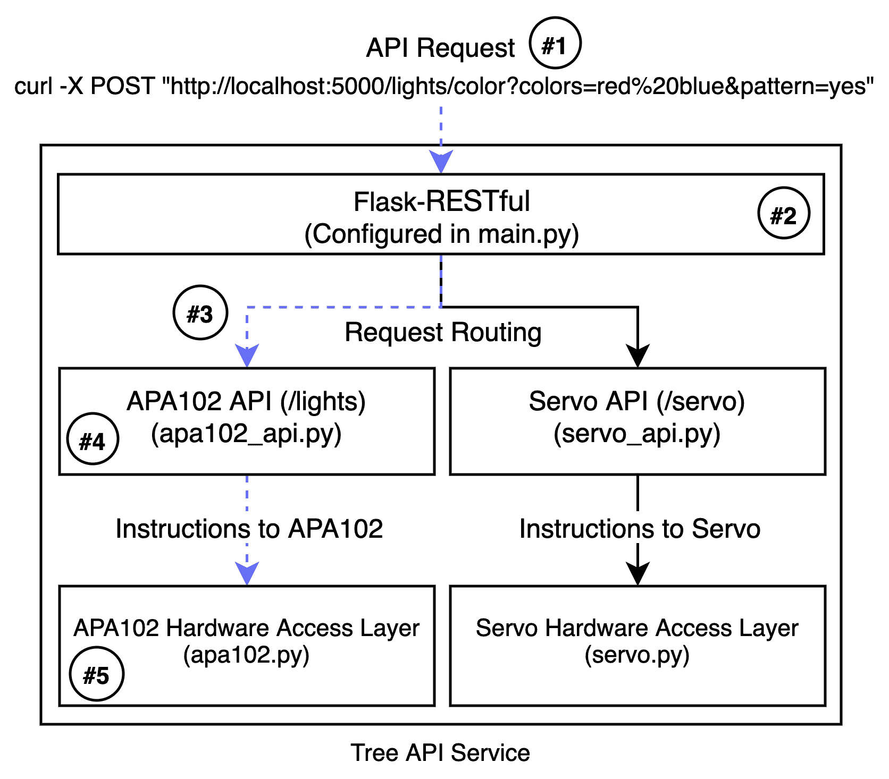
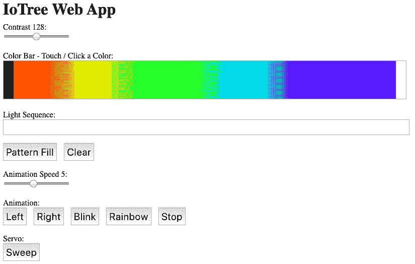
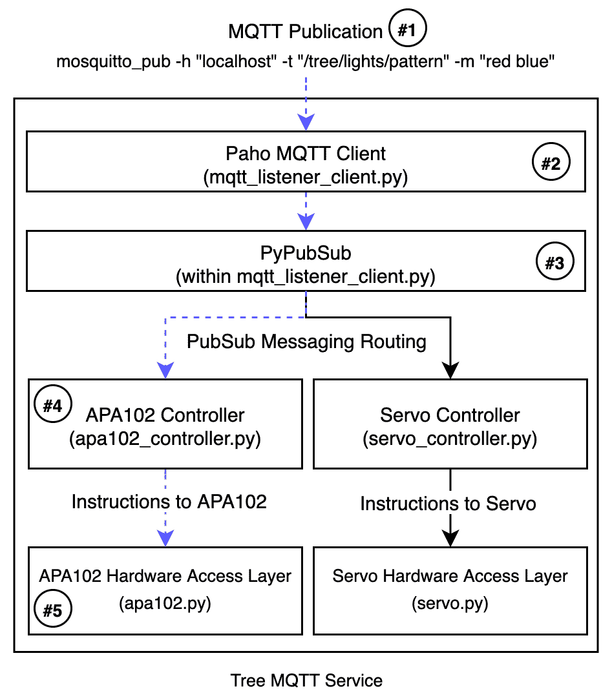
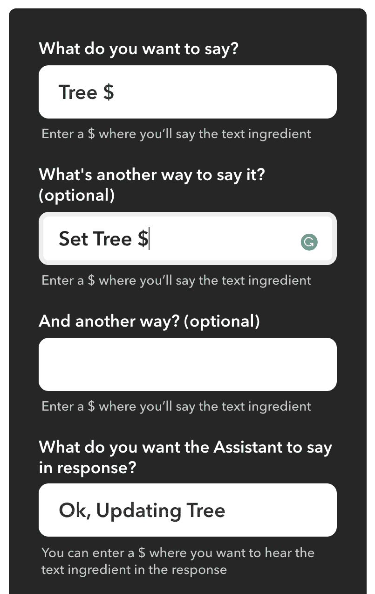
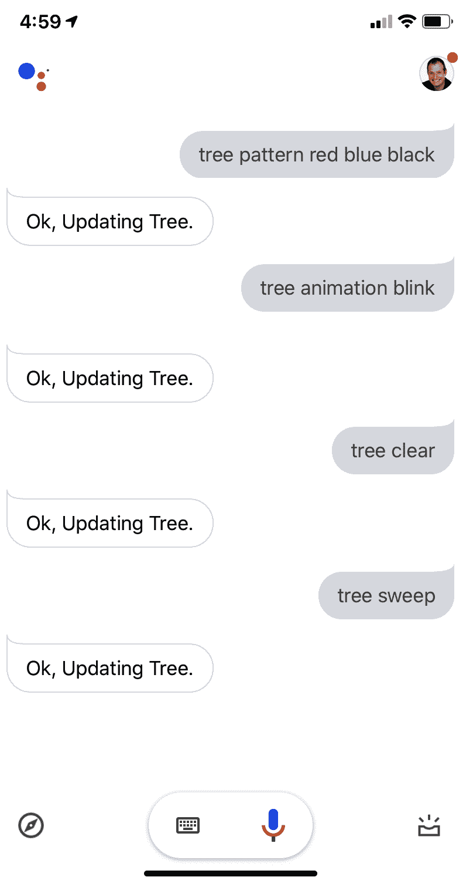

将所有内容联系在一起-物联网圣诞树

欢迎来到我们的最后一章！我们将通过整合前几章的各种主题和想法来完成本书，以构建一个多方面的物联网程序。具体来说，我们将构建一个可以通过互联网控制的圣诞树，一个*IoTree*，如果你不介意的话！

本章中我们的方法是重用前几章的两个电路，以创建圣诞树灯光（使用 APA102 LED 灯带）和一个摇摆机制来使树摇晃（我们将使用舵机）和发出叮当声（好吧，如果你用铃铛装饰树，它会在摇晃时发出叮当声！）。然后我们将重新审视和调整我们关于 RESTful API 和 MQTT 的学习，以创建两种方式来通过网络或互联网控制灯光和舵机。然后我们将重新审视 dweet.io 和**If-This-Then-That**（**IFTTT**）并构建 IFTTT Applets 来通过电子邮件和您的声音使用 Google 助手来控制树！

以下是本章将涵盖的内容：

+   物联网圣诞树概述

+   构建 IoTree 电路

+   配置、运行和使用 Tree API 服务

+   配置、运行和使用 Tree MQTT 服务

+   将 IoTree 与 dweet.io 集成

+   与电子邮件和 Google 助手通过 IFTTT 集成

+   扩展您的 IoTree 的想法和建议

# 技术要求

要执行本章的练习，您需要以下内容：

+   树莓派 4 Model B

+   Raspbian OS Buster（带桌面和推荐软件）

+   最低 Python 版本 3.5

这些要求是本书中代码示例的基础。可以合理地期望，只要您的 Python 版本是 3.5 或更高，代码示例应该可以在树莓派 3 Model B 或不同版本的 Raspbian OS 上无需修改地工作。

要完成标题为*与 Google 助手集成*的部分，至少需要以下先决条件：

+   一个 Google 账户（如果您有 Gmail 邮箱账户，那就是您需要的全部）

+   安卓手机或 iOS 的*Google 助手*应用

您将在 GitHub 存储库的`chapter14`文件夹中找到本章的源代码，链接在这里：[`github.com/PacktPublishing/Practical-Python-Programming-for-IoT`](https://github.com/PacktPublishing/Practical-Python-Programming-for-IoT)。

您需要在终端中执行以下命令来设置虚拟环境并安装本章代码所需的 Python 库：

```py
$ cd chapter14              # Change into this chapter's folder
$ python3 -m venv venv      # Create Python Virtual Environment
$ source venv/bin/activate  # Activate Python Virtual Environment
(venv) $ pip install pip --upgrade        # Upgrade pip
(venv) $ pip install -r requirements.txt  # Install dependent packages
```

以下依赖项从`requirements.txt`中安装：

+   **PiGPIO**：PiGPIO GPIO 库（[`pypi.org/project/pigpio`](https://pypi.org/project/pigpio)）

+   **Flask-RESTful**：用于创建 RESTful API 服务的 Flask 扩展（[`pypi.org/project/Flask-RESTful`](https://pypi.org/project/Flask-RESTful)）

+   **Paho MQTT** **客户端**：[`pypi.org/project/paho-mqtt`](https://pypi.org/project/paho-mqtt)

+   **Pillow**：**Python Imaging Library**（**PIL**）（[`pypi.org/project/Pillow`](https://pypi.org/project/Pillow)）

+   **Luma LED Matrix 库**：[`pypi.org/project/luma.led_matrix`](https://pypi.org/project/luma.led_matrix)

+   **Requests**：用于发出 HTTP 请求的高级 Python 库（[`pypi.org/project/requests`](https://pypi.org/project/requests)）

+   **PyPubSub**：进程内消息传递和事件（[`pypi.org/project/PyPubSub`](https://pypi.org/project/PyPubSub)）

本章练习所需的电子元件如下：

+   1 x MG90S 爱好舵机（或等效的 3 线、5 伏特爱好舵机）

+   1 x APA102 RGB LED 灯带

+   1 x 逻辑电平转换模块

+   外部电源供应（至少是 3.3V/5V 面包板可安装的电源供应）

视频展示了这棵树的运作情况，网址是[`youtu.be/15Xfuf_99Io`](https://youtu.be/15Xfuf_99Io)。请注意，这棵树使用 RGB LED 和交替闪烁的灯光动画。在本章中，我们将使用 APA102 LED 灯带，它能够创建更多的动画效果。演示树还可以演奏曲调，但我们在本章不会涉及（尽管您可以轻松地通过采用第八章中的 RTTTL 示例来添加该功能）。

# IoT 圣诞树概述

在我们通过构建电路和查看代码来开始本章之前，让我们花一点时间了解一下我们的 IoTree 将会做什么以及我们将如何构建它。*图 14.1*中的树代表了您在完成本章后可能创建的东西：


图 14.1 - IoTree 示例

现在，我需要提前告诉您，我们只会涵盖 IoTree 的电子和编程部分。您需要发挥自己的主动性，并发挥您的制造技能来建造这棵树并让它活起来。我建议使用一棵小桌面圣诞树，因为我们的构建部分涉及使用伺服机来*摇晃*树。我们的业余级伺服机足够强大，可以摇动一棵小树；但是，它不太可能能够摇动一棵全尺寸的圣诞树（如果您希望将我们的构建升级到更大的树，请研究并获得更强大的伺服机，并且如果您这样做，请给我发一张照片！）。

我们的基本树将包括以下电子组件：

+   用于树灯的 APA102 LED 灯带（我们在第八章中介绍了 APA102 LED 灯带，*灯光、指示灯和信息显示*）。

+   一个伺服机使树*摇晃*和*叮当作响* - 为此，您需要在树上放一些铃铛装饰品，当树摇晃时它们会*叮当作响*（我们在第十章中介绍了伺服机，*使用伺服机、电机和步进电机进行运动*）。

在程序和结构上，我们的树程序将借鉴我们学到的以下概念：

+   **dweet.io 服务**：首次介绍于第二章，*Python 和 IoT 入门*，并在第十三章，*IoT 可视化和自动化平台*中重新讨论

+   **使用 Flask-RESTful 的 RESTful API**：来自第三章，*使用 Flask 进行 RESTful API 和 Web 套接字进行网络连接*

+   **消息队列遥测传输（MQTT）**：在第四章中介绍，*使用 MQTT、Python 和 Mosquitto MQTT 代理进行网络连接*。

+   **IoT 程序的线程和发布-订阅（PubSub）方法**：在第十二章中介绍，*高级 IoT 编程概念-线程、AsyncIO 和事件循环*

+   **IFTTT IoT 平台**：在第十三章中介绍，*IoT 可视化和自动化平台*

在我们继续本章之前，我们将假设您已经理解了前述每一章的概念，并且已经完成了每一章中提出的练习，包括构建电路和理解使电路工作的电路和代码级概念。

我们的第一个任务将是构建 IoTree 所需的电路，接下来我们将进行。

# 构建 IoTree 电路

是时候开始建设了！请构建*图 14.2*中所示的电路：


图 14.2 - IoTree 电路原理图

这个电路应该看起来很熟悉。它是我们之前见过的两个电路的组合：

+   来自*图 8.4*的 APA102（带逻辑电平转换器）电路，位于第八章中，*灯光、指示灯和信息显示*

+   来自*图 10.2*的舵机电路，位于第十章中，*使用舵机、电机和步进电机进行运动*

如果您需要逐步构建面包板上的电路的说明，请参阅相应的章节。

请记住，您需要使用外部电源来为 APA102 和舵机供电，因为它们会吸取太多的电流，无法使用树莓派的 5 伏引脚。

当您完成电路构建后，接下来让我们简要讨论三个可以用来控制此电路的程序。

## 三个 IoTree 服务程序

有三个单独的程序来配合我们的 IoTree，每个程序都采用了稍微不同的方法来处理我们的灯光和舵机。这些程序如下：

+   **Tree API 服务**（位于`chapter14/tree_api_service`文件夹中）：此程序提供了一个使用 Flask-RESTful 创建的 RESTful API，用于控制灯光和舵机。它还包括一个使用 API 的基本 HTML 和 JavaScript Web 应用程序。我们将在标题为*配置、运行和使用 Tree API 服务*的部分进一步讨论 Tree API 服务。

+   **Tree MQTT 服务**（位于`chapter14/tree_mqtt_service`文件夹中）：此程序将允许我们通过发布 MQTT 消息来控制灯光和舵机。我们将在标题为*配置、运行和使用 Tree MQTT 服务*的部分进一步讨论 Tree MQTT 服务。

+   **dweet 集成服务**（位于`chapter14/dweet_integration_service`文件夹中）：此程序接收 dweets 并将它们重新发布为 MQTT 消息。我们可以将此程序与*Tree MQTT 服务*程序一起使用，以使用 dweet.io 来控制我们的灯光和舵机，从而为我们提供了一种将 IoTree 与 IFTTT 等服务集成的简单方法。我们将在标题为*将 IoTree 与 dweet.io 集成*的部分进一步讨论 dweet 集成服务。

现在我们已经简要讨论了构成本章示例的程序，让我们配置和运行我们的 Tree API 服务，并使用它来使灯光和舵机工作。

# 配置、运行和使用 Tree API 服务

Tree API 服务程序为控制我们的 IoTree 的 APA102 LED 灯带和舵机提供了一个 RESTful API 服务。您可以在`chapter14/tree_api_service`文件夹中找到 Tree API 服务程序。它包含以下文件：

+   `README.md`：Tree API 服务程序的完整 API 文档，包括示例。

+   `main.py`：这是程序的主要入口点。

+   `config.py`：程序配置。

+   `apa102.py`：与 APA102 LED 灯带集成的 Python 类。这段代码的核心与我们在第八章中探讨的 APA102 Python 代码非常相似，只是现在它被构造为 Python 类，使用线程来运行灯光动画，还有一些其他小的添加，比如让 LED 闪烁的代码。

+   `apa102_api.py`：提供 APA102 API 的 Flask-RESTful 资源类。它借鉴了第三章中 Flask-RESTful 代码和示例，*使用 Flask 进行 RESTful API 和 Web 套接字的网络*

+   `servo.py`：用于控制舵机的 Python 类。它借鉴了我们在第十章中介绍的舵机代码。

+   `servo_api.py`：提供舵机 API 的 Flask-RESTful 资源类。

+   `模板`：此文件夹包含示例 Web 应用程序的`index.html`文件。

+   `static`：此文件夹包含 Web 应用程序使用的静态 JavaScript 库和图像。

图 14.3 显示了 Tree API 服务程序架构的图表：



图 14.3 - Tree API 服务架构块图

这是 Tree API 服务的高级操作，用于前面图表中显示的 API 请求：

1.  外部客户端向#1 处的`/lights/colors`端点发出 POST 请求。

1.  请求由 Flask 框架/服务器在#2 处处理。（Flask 和 Flask-RESTful 的设置可以在`main.py`中找到。）

1.  `/lights/*`端点被路由到适当的 Flask-RESTful 资源#3（APA102 - 也就是*light* - 资源在`apa102_api.py`中定义）。端点设置和资源注册在`main.py`中找到。

1.  在#4 处，调用适当的资源（在本例中，将是`ColorControl.post()`），然后解析和验证查询字符串参数（即`colors=red%20blue&pattern=yes`）。

1.  最后，在#5 处，`ColorControl.post()`调用 APA102 的实例中的适当方法（在`apa102.py`中定义，并在`main.py`中设置），直接与物理 APA102 LED 灯带接口并更新重复的红色和蓝色模式。

现在我们了解了我们的 Tree API 服务的工作原理，在运行 Tree API 服务之前，首先需要检查它的配置。我们接下来会做这个。

## 配置 Tree API 服务

Tree API 服务配置在`chapter14/tree_api_service/config.py`文件中。在这个文件中有许多配置选项，它们大多与 APA102（在第八章中讨论）和舵机（在第十章中讨论）的配置有关。你会发现这个文件和配置选项都有很好的注释。

默认配置足以在树莓派上本地运行示例；但是，你应该检查的一个配置参数是`APA102_NUM_LEDS = 60`。如果你的 APA102 LED 灯带包含不同数量的 LED，那么请相应地更新此配置。

让我们运行 Tree API 服务程序并创建一些灯光（和移动）！

## 运行 Tree API 服务

现在是时候运行 Tree API 服务程序并发送 RESTful API 请求使其工作了。以下是运行和测试我们的 Tree API 服务的步骤：

1.  切换到`chapter14/tree_api_service`文件夹并启动`main.py`脚本，如下所示：

```py
# Terminal 1
(venv) $ cd tree_api_service
(venv) $ python main.py
* Serving Flask app "main" (lazy loading)
... truncated ...
INFO:werkzeug: * Running on http://0.0.0.0:5000/ (Press CTRL+C to quit)
```

1.  接下来，打开第二个终端并运行以下`curl`命令，将重复的灯光模式序列设置为`红色，蓝色，黑色`：

```py
# Terminal 2
$ curl -X POST "http://localhost:5000/lights/color?colors=red,blue,black&pattern=yes"
```

1.  同样在*终端 2*中，运行下一个命令开始让灯光动画起来：

```py
# Terminal 2
$ curl -X POST "http://localhost:5000/lights/animation?mode=left&speed=5"
```

除了`left`，你还可以在`mode`参数中使用其他动画模式，包括`right`，`blink`，`rainbow`和`stop`。`speed`参数接受`1`到`10`之间的值。

1.  要清除或重置 LED 灯带，再次在*终端 2*中运行以下命令：

```py
# Terminal 2
$ curl -X POST "http://localhost:5000/lights/clear"
```

1.  要使舵机扫动（也就是使树摇晃），在*终端 2*中运行以下命令：

```py
# Terminal 2
$ curl -X POST "http://localhost:5000/servo/sweep"
```

舵机应该来回扫动几次。如果你想让舵机扫动更多次或需要增加其运动范围，那么你可以在`chapter14/tree_api_service/config.py`文件中调整`SERVO_SWEEP_COUNT`和`SERVO_SWEEP_DEGREES`配置参数。

如果发现当你移动舵机时 LED 变暗、闪烁或者表现不稳定，或者当你改变 APA102 LED 时舵机抽搐，很可能是你的外部电源无法提供足够的电流来同时运行 LED 和舵机。作为临时措施，如果你没有另一个电源，可以尝试减少 LED 的数量（`config.py`中的`APA102_NUM_LEDS`）和/或减少 LED 对比度（`config.py`中的`APA102_DEFAULT_CONTRAST`）。这将降低 LED 灯带的电流需求。

1.  最后，让我们运行 Web 应用程序，并通过在树莓派桌面上打开 Web 浏览器并导航到 URL `http://localhost:5000`来控制我们的 IoTree。您应该看到一个类似于这里图片的网页：



图 14.4 - 示例 IoTree Web 应用程序

尝试以下操作：

+   点击颜色栏中的颜色，观察该颜色被推送到 APA102 LED 灯带。

+   点击*Pattern Fill*按钮填充 APA102 LED 灯带的选定颜色。

+   点击左侧开始动画。

此 Web 应用程序背后的 JavaScript（在`chapter14/tree_api_service/templates/index.html`中找到）只是调用我们的 IoTree API，类似于我们已经使用`curl`做的事情，只是它使用 jQuery 来做。 jQuery 和 JavaScript 超出了本书的范围；但是，在第三章中简要介绍了它们，*使用 Flask 进行 RESTful API 和 Web Sockets 的网络*。

您将在`chapter14/tree_api_service/README.md`文件中找到 IoTree 的完整 API 文档集，其中包含`curl`示例。

我们的 RESTful API 实现提供了本章所需的基本 API 端点；但是，我非常有信心您将能够扩展和调整此示例以适应您自己的项目，或者向您的 IoTree 添加新功能。我将在本章末尾的*扩展您的 IoTree 的想法和建议*部分提供关于如何根据本书学到的知识扩展您的 IoTree 的建议。

现在我们已经运行并看到如何使用 RESTful API 控制我们的 IoTree 的灯和舵机，接下来我们将看一种替代服务实现，它将允许我们使用 MQTT 控制我们的 IoTree。

# 配置、运行和使用 Tree MQTT 服务

Tree MQTT 服务程序提供了一个 MQTT 接口，用于通过发布 MQTT 消息到 MQTT 主题来控制树的 APA102 LED 灯带和舵机。您可以在`chapter14/tree_mqtt_service`文件夹中找到 Tree MQTT 服务程序，并包含以下文件：

+   `README.md`：控制您的 IoTree 的 MQTT 主题和消息格式的完整列表。

+   `main.py`：这是程序的主要入口点。

+   `config.py`：程序配置。

+   `apa102.py`：这是`chapter14/tree_api_service/apa102.py`的精确副本。文件

+   `servo.py`：这是`chapter14/tree_api_service/servo.py`文件的精确副本。

+   `mqtt_listener_client.py`：这是一个连接到 MQTT 代理并订阅将接收消息以控制 APA102 和舵机的主题的类。当接收到 MQTT 消息时，它们被转换为 PubSub 消息并使用`PyPubSub`库发布，我们在第十二章中讨论过，*高级 IoT 编程概念-线程、AsyncIO 和事件循环*。

+   `apa102_controller.py`：此代码接收由`mqtt_listener_client.py`发送的 PubSub 消息，并根据需要更新 APA102 LED 灯带。

+   `servo_controller.py`：此代码接收由`mqtt_listener_client.py`发送的 PubSub 消息并控制舵机。

显示了 Tree MQTT 服务程序架构的图表如*图 14.5*所示：



图 14.5 - Tree MQTT 服务架构块图

以下是 Tree MQTT 服务的高级操作，用虚线表示在前面的图表中发布的 MQTT 发布：

1.  `red blue`消息发布到`tree/lights/pattern`主题上＃1。

1.  消息由 Paho-MQTT 客户端在＃2 处接收。主题和消息在`mqtt_listener_client.py`中的`on_message()`方法中进行解析，并使用`config.py`中的`MQTT_TO_PUBSUB_TOPIC_MAPPINGS`映射字典映射到本地 PubSub 主题*pattern*。

1.  映射的消息和解析的数据使用`PyPubSub`库在＃3 处分发。

1.  `apa102_controller.py`中的`PyPubSub`订阅接收*pattern*主题及其负载数据在#4 处

1.  `apa102_controller.py`处理#5 处的消息和数据，并在 APA102 实例（在`apa102.py`中定义）上调用适当的方法，直接与重复的红色和蓝色模式的物理 APA102 LED 灯带进行接口和更新。

如果你在想，使用`PyPubSub`并在`mqtt_listener_client.py`中重新分发 MQTT 消息是基于我个人偏好的设计决定，目的是将 MQTT 相关的代码和硬件控制相关的代码解耦，以使应用程序更易于阅读和维护。另一种同样有效的方法是在直接响应接收到的 MQTT 消息时在`mqtt_listener_client.py`中使用`apa102.py`和`servo.py`。

现在我们已经了解了我们的 Tree MQTT 服务是如何工作的，在运行我们的 Tree MQTT 服务之前，首先我们需要检查它的配置。我们将在下一步进行。

## 配置 Tree MQTT 服务

Tree MQTT 服务配置位于`chapter14/tree_mqtt_service/config.py`文件中。与 Tree API 服务类似，它们主要涉及 APA102 和伺服器的配置。您还会发现这个文件及其配置选项都有很好的注释。

默认配置将足以在树莓派上本地运行示例；但是，就像我们为 Tree API 服务配置所做的那样，请检查并更新`APA102_NUM_LEDS = 60`参数。

如果您在运行 Tree API 示例时还需要更改`APA102_DEFAULT_CONTRAST`、`SERVO_SWEEP_COUNT`或`SERVO_SWEEP_DEGREES`参数中的任何一个，请现在也更新这些值以供 MQTT 示例使用。

一旦您对配置进行了任何必要的更改，我们将继续运行我们的 Tree MQTT 服务程序并发布 MQTT 消息以使我们的 IoTree 工作。

## 运行 Tree MQTT 服务程序

现在是时候运行 Tree MQTT 服务程序并发布 MQTT 消息来控制我们的 IoTree 了。以下是运行和测试我们的 Tree MQTT 服务的步骤：

1.  我们必须在树莓派上安装并运行 Mosquitto MQTT 代理服务以及 Mosquitto MQTT 客户端工具。如果您需要检查您的安装，请参阅第四章，*使用 MQTT、Python 和 Mosquitto MQTT 代理进行网络连接*。

1.  切换到`chapter14/tree_mqtt_service`文件夹并启动`main.py`脚本，如下所示：

```py
# Terminal 1
(venv) $ cd tree_mqtt_service
(venv) $ python main.py
INFO:root:Connecting to MQTT Broker localhost:1883
INFO:MQTTListener:Connected to MQTT Broker
```

1.  接下来，打开第二个终端并使用以下命令发送 MQTT 消息：

```py
# Terminal 2
$ mosquitto_pub -h "localhost" -t "tree/lights/pattern" -m "red blue black"
```

LED 灯带将以重复的颜色模式（红色、蓝色、黑色（黑色表示 LED 关闭））点亮。

尝试使用`--retain`或`-r`保留消息选项来实验`mosquirro_pub`。如果您发布了一个保留消息，当它连接到 MQTT 代理并订阅`tree/#`主题时，它将被重新传递到您的 Tree MQTT 服务，这为您的 IoTree 在重新启动之间恢复其上次状态提供了一种方式。

1.  现在，在*终端 2*中运行以下命令使 LED 灯带动画起来：

```py
# Terminal 2
$ mosquitto_pub -h "localhost" -t "tree/lights/animation" -m "left"
```

1.  要清除或重置 LED 灯带，请在*终端 2*中再次运行以下命令：

```py
# Terminal 2
$ mosquitto_pub -h "localhost" -t "tree/lights/clear" -m ""
```

在这个例子（以及*步骤 6*中的下一个例子）中，我们没有任何消息内容；但是，我们仍然需要传递一个空消息，使用`-m ""`选项（或者，`-n`）；否则，`mosquitto_pub`将中止。

1.  最后，尝试以下命令来扫描伺服器：

```py
# Terminal 2
$ mosquitto_pub -h "localhost" -t "tree/servo/sweep" -m ""
```

伺服器将根据`chapter14/tree_mqtt_service/config.py`中`SERVO_SWEEP_COUNT`或`SERVO_SWEEP_DEGREES`设置来来回扫动。

您将在`chapter14/tree_mqtt_service/README.md`文件中找到 Tree MQTT 服务识别的完整 MQTT 主题和消息格式的完整集合，包括`mosquitto_pub`示例。

与我们的 RESTful API 示例类似，我们的 MQTT 示例提供了本章所需的最小功能，但提供了一个基本框架，您可以在自己的未来项目中扩展，或者如果您扩展了 IoTree 的功能。

现在我们已经运行并看到如何使用 MQTT 控制 IoTree 的灯和伺服，让我们看看我们可以使用的集成服务，将我们的 Tree MQTT 服务与 dweet.io 耦合。

# 将 IoTree 与 dweet.io 集成

*dweet 集成服务*，位于`chatper14/dweet_integration_service`文件夹中，是一个基于 Python 的集成服务，它接收 dweets 并将它们重新发布为消息到 MQTT 主题。此服务为我们提供了一种简单的方法，将诸如 IFTTT 之类的服务与我们的 Tree MQTT 服务程序集成。

dweet 集成服务由以下文件组成：

+   `main.py`：主程序入口点。

+   `config.py`：配置参数。

+   `thing_name.txt`：保存您的物体名称的地方。当您第一次启动程序时，将创建此文件。

+   `dweet_listener.py`：核心程序代码。

我们的 dweet 服务的核心部分位于`dweet_listener.py`文件中。如果您检查此文件，您会注意到它几乎与第二章中涵盖的`dweet_led.py`文件以及*第十三章*，IoT 可视化和自动化平台中涵盖的文件几乎相同（除了现在它作为 Python 类包装）。

核心区别在于`process_dweet()`方法，在下面的代码中显示为（1）行，这里我们不是直接控制 LED，而是拦截 dweet，然后重新发布到 MQTT 主题：

```py
def process_dweet(self, dweet):        # (1)

   # ...Truncated...
   # command is "<action> <data1> <data2> ... <dataN>"
   command = dweet['command'].strip()
   # ...Truncated...

   # elements (List) <action>,<data1>,<data2>,...,<dataN>
   elements = command.split(" ")
   action = elements[0].lower()
   data = " ".join(elements[1:])

   self.publish_mqtt(action, data)     # (2)
```

`publish_mqtt()`方法，在前面的代码中显示为（2）行，在下面的代码中显示为（3）行，然后根据`chapter14/dweet_mqtt_service/config.py`中的`ACTION_TOPIC_MAPPINGS`设置，将我们解析的命令字符串转换为基于 MQTT 主题的消息并发布：

```py
    def publish_mqtt(self, action, data):                       # (3)
        if action in self.action_topic_mappings:
            # Map Action into MQTT Topic
            # (Eg mode --> tree/lights/mode). 
            # See config.py for mappings.

            topic = self.action_topic_mappings[action]
            retain = topic in self.mqtt_topic_retain_message    # (4)
            # ... truncated ...
            publish.single(topic, data, qos=0,                  # (5)
                          client_id=self.mqtt_client_id, 
                          retain=retain, hostname=self.mqtt_host, 
                          port=self.mqtt_port)
    # ... truncated ...

```

请注意，在（5）行，我们使用了 Paho-MQTT 的`publish.single()`便利方法，而不是我们在第四章中使用的完整的 MQTT 客户端方法，*使用 MQTT、Python 和 Mosquitto MQTT 代理进行网络连接*（并且在 Tree MQTT 服务程序中也使用）。

目前，我只想指出（4）行，我们在那里设置了`retain`变量（还注意到它在`publish.single()`中的使用）。在接下来的部分中，当我们讨论服务配置文件时，我们将更多地讨论此消息保留。

图 14.6 显示了树服务程序架构的图表：


图 14.6 - dweet 集成服务架构块图

这是 dweet 集成服务的高级操作，由前面图中蓝色虚线所示的请求：

1.  在#1 处创建了一个 dweet。

1.  `dweet_listener.py`在#2 处接收 dweet 并解析`command`参数中包含的数据。命令中包含的操作使用`config.py`中找到的`ACTION_TOPIC_MAPPINGS`映射字典映射为 MQTT 主题。

1.  消息被发布到 MQTT 代理到映射的 MQTT 主题#3。根据`config.py`中找到的`TOPIC_RETAIN_MESSAGE`映射字典，设置消息的*保留*标志。

发布 MQTT 消息后，如果您的 Tree MQTT 服务正在运行并连接到相同的 MQTT 代理，它将接收 MQTT 消息并相应地更新您的 IoTree。

现在我们了解了我们的 dweet 集成服务的工作原理，然后我们可以运行我们的 dweet 集成服务之前，首先需要检查其配置。我们接下来会做这个。

## 配置 Tree MQTT 服务

dweet 集成服务的配置位于`chapter14/dweet_integration_service/config.py`文件中。有许多与服务工作方式相关的配置选项，默认配置将足以在您的 Raspberry Pi 上本地运行此服务，同时您还在那里运行您的 Mosquitto MQTT 代理。这个文件中的配置参数有很好的注释；但是，我将提到`ACTION_TOPIC_MAPPINGS`和`TOPIC_RETAIN_MESSAGE`参数：

```py
ACTION_TOPIC_MAPPINGS = {
    "clear": "tree/lights/clear",
    "push": "tree/lights/push",
    ... truncated ...
}
```

dweet 集成服务将*dweeted 命令*映射到*MQTT 主题*。决定如何将命令映射到 MQTT 主题的是`ACTION_TOPIC_MAPPINGS`配置参数。我们将在下一节讨论这个*命令*的概念。

由 dweet 集成服务映射和使用的 MQTT 主题必须与 Tree MQTT 服务使用的主题相匹配。每个服务的默认配置都使用相同的主题。

以下代码中显示的`TOPIC_RETAIN_MESSAGE`配置确定了哪些 MQTT 主题将设置其消息的*保留*标志。正如我们在上一节中指出的那样，这个配置（`True`或`False`）用于在`single.publish()`上设置`retained`参数：

```py
TOPIC_RETAIN_MESSAGE = {
    "tree/lights/clear": False,
    "tree/lights/animation": True,
    ... truncated ...
}
```

现在我们已经讨论了配置文件，让我们启动我们的 dweet 集成服务，并发送 dweets 来控制我们的 IoTree。

## 运行 dweet 集成服务程序

我们的 dweet 集成服务通过按照我们在上一节中讨论的配置参数将预定义格式的 dweets 转换为 MQTT 主题和消息来工作。当我们运行和测试 dweet 集成服务时，我们将很快讨论这个 dweet 格式。以下是我们需要遵循的步骤：

1.  首先，请确保您在终端上运行了上一节中的*Tree MQTT 服务*程序。正是 Tree MQTT 服务将接收并处理 dweet 集成服务发布的 MQTT 消息。

1.  接下来，在新的终端中导航到`chapter14/dweet_integration_service`文件夹，并启动`main.py`程序，如下所示（请记住您的物体名称将不同）：

```py
(venv) $ cd dweet_service
(venv) $ python main.py
INFO:DweetListener:Created new thing name ab5f2504
INFO:DweetListener:Dweet Listener initialized. Publish command dweets to 'https://dweet.io/dweet/for/ab5f2504?command=...'
```

1.  将以下 URL 复制并粘贴到 Web 浏览器中以控制您的 IoTree。使用您输出中显示的物体名称替换`<thing_name>`文本：

+   +   dweet.io/dweet/for/<thing_name>?command=pattern%20red%20blue%20black

+   dweet.io/dweet/for/<thing_name>?command=animation%20left

+   dweet.io/dweet/for/<thing_name>?command=speed%2010

+   dweet.io/dweet/for/<thing_name>?command=clear

+   dweet.io/dweet/for/<thing_name>?command=sweep

在调用这些 URL 之间可能需要一些时间，然后它将被您的 dweet 集成服务接收。

正如您在前面的 URL 中的`command`参数中所看到的，我们的 dweet 的格式是`<action> <data1> <data2> <dataN>`。

在`config.py`文件中，您将找到默认配置中识别的完整的 dweet 命令字符串集，包括示例 URL，在`chapter14/dweet_integration_service/README.md`文件中。

干得好！我们刚刚使用 dweet.io 和 MQTT 创建了一个简单的集成服务，并学会了一种简单且非侵入式的方法，可以让我们在互联网上控制我们的 tree，而无需进行任何网络或防火墙配置。

在设计物联网项目并考虑数据在互联网和网络中的传输方式时，通常会发现您需要设计和构建某种集成形式，以桥接建立在不同传输机制上的系统。本节中的示例说明了一个场景，我们在其中将 MQTT 服务（我们的 IoTree MQTT 服务）与基于轮询的 RESTful API 服务（dweet.io）进行了桥接。虽然每个集成都有自己的要求，但希望这个示例为您提供了一个大致的路线图和方法，以便在将来遇到这些情况时进行调整和构建。

现在我们的 dweet 集成服务正在运行，并且已经测试过它正在工作，让我们看看如何将其与 IFTTT 平台一起使用。

# 通过电子邮件和 Google 助手与 IFTTT 集成

现在是真正有趣的部分——让我们使我们的树可以通过互联网进行控制。作为一个剧透，我不会在这个集成中手把手地指导您，因为在第十三章中详细解释了使用 dweet.io 和 IFTTT 的核心概念，*IoT 可视化和自动化平台*。特别是，我们学会了如何将我们的树莓派与 IFTTT 和电子邮件集成，以控制 LED。

然而，我将给您我的 IFTTT 配置的截图，以便您可以验证您设置的内容。另外，作为一个额外的奖励，我还将给您一个关于如何与 Google 助手集成的提示和截图，以便您可以语音控制您的 IoTree！

在撰写本文时，IFTTT 有一个 Google 助手服务，可以接受任意口头输入（在 IFTTT 术语中称为*成分*）。我确实尝试了 Alexa 集成，但不幸的是，Alexa IFTTT 服务无法接受任意输入，因此与我们的示例不兼容。

首先，我们将看一下如何将我们的 IoTree 与电子邮件集成。

## 与电子邮件的集成

与电子邮件或 Twitter 集成的过程与我们在第十三章*IoT 可视化和自动化平台*中介绍的内容相同，只是有以下更改：

1.  不要使用`LED`作为标签（在 IFTTT 的**完成触发器字段页面**步骤中），使用`TREE`。这样，您的电子邮件主题可以是`#TREE 模式红蓝`或`#TREE 动画闪烁`之类的内容。

1.  在配置 That webhook 服务时，您需要使用之前在终端上运行 dweet 集成服务时打印的 dweet URL。我的配置示例如下图所示。请记住，您 URL 中的*thing name*将是不同的：


图 14.7 – Webhook 配置

1.  完成设置 IFTTT Applet 后，尝试发送电子邮件至`trigger@applet.ifttt.com`，主题如下：

+   +   `#TREE 模式红蓝黑色`

+   `#TREE 动画向左`

发送电子邮件或推文`#TREE 模式红蓝黑色`命令后的几分钟内，您的树灯将以这些颜色进行重复变换。同样，发送电子邮件或推文`#TREE 动画向左`后的几分钟内，您的树灯将开始动画。

请记住，为了使此示例工作，您需要在终端上同时运行 Tree MQTT 服务和 dweet 集成服务。在发送电子邮件或发布推文后，您的 IoTree 更改可能需要一些时间。

一旦您能够通过电子邮件控制您的 IoTree，接下来我们将看一下添加使用 Google 助手进行语音控制所需的步骤。

## 与 Google 助手的集成

让我们使用 Google 助手使我们的 IoTree 可以通过语音控制。

*Google 助手*有许多其他形式，包括 Google Home、Google Nest 和 Google Mini。只要它们登录到与 IFTTT 使用的相同的 Google 帐户，这些产品也将与 IFTTT Google 助手集成和您的 IoTree 一起使用。

要创建我们的集成，我们需要将您的 Google 帐户与 IFTTT Google 助手服务链接，并在接收命令时调用 dweet.io URL。以下是要遵循的高级步骤：

1.  登录到您的 IFTTT 帐户。

1.  创建一个新的 Applet。

1.  对于 Applet 的这一部分，请使用 Google 助手服务。

1.  接下来，您将被要求连接并允许 IFTTT 使用您的 Google 帐户。按照屏幕上的说明连接 IFTTT 和您的 Google 帐户。

1.  现在是选择 Google 助手触发器的时候了。选择“说一个带有文本成分的短语”。示例触发器配置如*图 14.8*所示：



图 14.8 - Google 助手触发器示例

在前面的屏幕截图中显示的 Tree $中的$符号被转换为我们将与我们的 webhook 服务一起使用的 IFTTT 成分（我们将在后面的步骤中看到）。

有了这个触发器配置，你可以说出像以下这样的命令来控制你的 IoTree：

+   +   "Tree pattern red blue black"

+   "Set tree animation blink"

+   "Tree clear"

1.  现在是配置 IFTTT Applet 的那部分的时间。搜索并选择 WebHook。

1.  webhook 服务的配置与我们在*步骤 2*中之前介绍的*与电子邮件集成*标题下的过程相同，并且如*图 14.7.*所示。

1.  继续并完成创建你的 IFTTT Applet。

1.  询问你的 Google 助手以下命令：

+   +   "Tree pattern red blue black"

+   "Tree animation blink"

+   "Tree clear"

+   "Tree sweep"（或“tree jingle”）

+   或者`chapter14/dweet_integration_service/README.md`文件中记录的任何其他命令

记住，Google 助手承认你的请求后，你的 IoTree 可能需要一会儿才能开始改变。

这是我在 iPhone 上的 Google 助手对话框的屏幕截图：



图 14.9 - 用于控制 IoTree 的 Google 助手对话框

如果集成工作正常，Google 助手将回复“好的，正在更新树”（或者你在*步骤 5*中使用的任何文本），然后几分钟后，你的 IoTree 将做出响应。

重要的是要记住，我们必须准确地说出命令，就像它们被 dweet 集成服务解释的那样 - 例如，它们会出现在 dweet URL 的命令参数中，如`https://dweet.io/dweet/for/<thing_name>?command=pattern red blue black`。

记得在它们之前加上“Tree”（或“Set Tree”）这个词。这个文本是触发你的 IFTTT Applet 的。只说一个命令本身不会触发你的 Applet。

如果你使用安卓手机或 iOS 的 Google 助手应用程序，你将能够看到你说出的话是如何转换为文本命令的，这可以帮助你排除不起作用或被误解的命令。

你刚刚学会了如何创建三个 IFTTT 集成，以使用电子邮件和语音控制你的 IoTree，并且你可以轻松地将相同的基本思想和流程适应于控制和自动化本书中所见的其他电子电路。

此外，正如我们在第十三章中讨论的那样，*物联网可视化和自动化平台*，IFTTT 提供了许多*触发器*和*操作*，你可以组合起来构建自动化工作流*Applets*。在本章和上一章之间，你现在已经创建了几个 Applets，所以我完全相信你将能够探索 IFTTT 生态系统，并创建各种有趣的 Applets，这些 Applets 可以与你的树莓派一起工作。

在我们结束本章（和本书！）之前，我想给你留下一些想法和实验，以进一步扩展你的 IoTree 的功能。

# 扩展你的 IoTree 的想法和建议

我们在本章中使用的代码和电子设备为我们提供了一个基础，我们可以在此基础上构建。这可能是扩展你的 IoTree，也可能是其他物联网项目的基础。

以下是一些建议，你可以尝试：

+   添加并集成一个 PIR 传感器，每当有人走过你的 IoTree 时，它就会播放一个 RTTTL 曲调。毕竟，如果不一遍又一遍地播放曲调，什么电子圣诞小工具才算完整呢...

+   将 RGB LED 添加并集成到树的顶部（也许在透明的星星内），或者在 APA102 LED 条的位置使用 RGB LED 或与之一起使用。

+   构建多个 IoTree。如果你使用 MQTT，它们将同步！

+   尝试构建 WebSocket 集成和相应的 Web 应用程序。

+   当前的 dweet Google 助手集成要求您精确发出命令。您能否创建一个更模糊的升级-也就是说，可以解析口头文本并找出口头命令是什么？

+   在我们的 IFTTT 示例中，我们使用了 dweet.io（与 MQTT 一起），因此我们不必担心防火墙配置。您可能希望调查在您的位置打开防火墙端口或调查诸如 LocalTunnels（https://localtunnel.github.io/www）或 ngrok（https://ngrok.com）之类的服务。这些方法将允许您使用 IFTTT Webhooks 直接与您的 IoTree 的 RESTful API 进行通信。但是，请记住，我们的 RESTful API 示例没有得到保护-它们没有使用 HTTPS，也没有身份验证机制，例如用户名和密码来限制对 API 的访问，因此您可能还希望研究如何保护基于 Flask 的 API 并首先执行这些升级。

显然，这些只是我的一些建议。在我们的旅程中，我们涵盖了许多电路，所以发挥你的想象力，看看你能想出什么-并且要玩得开心！

# 总结

恭喜！我们现在已经到达了本章和整本书的结尾！

在本章中，我们运行了电子设备并测试了控制这些电子设备的程序，这些程序构成了物联网圣诞树的基础。我们看到了一个可以控制我们 IoTree 的灯和伺服的 RESTful API，以及一个类似的 MQTT 实现。我们还研究了一个 dweet.io 到 MQTT 的集成服务，我们将其与 IFTTT 配对，以提供一种使用电子邮件和 Google 助手来控制我们 IoTree 的机制。

在本书中的旅程中，我们涵盖了许多概念和技术，包括各种网络技术，电子和接口基础知识，以及使用传感器和执行器与树莓派的一系列实际示例。我们还研究了自动化和可视化平台，并在本章中完成了一个将我们的学习结合在一起的示例。

当我写这本书时，我有一些核心意图。我的一个意图是分享和解释我们如何将传感器和执行器连接到树莓派的原因，以及为什么我们要使用额外的组件，如电阻器来创建电压分压器。我的第二个核心意图是为您提供适用于物联网项目的各种网络技术和选项。

我相信，我们在旅程中学到的软件和硬件基础知识，以及实际示例，将为您提供许多技能和见解，不仅可以帮助您设计和构建自己的复杂物联网项目，还可以在软件、网络和电子方面在基本水平上理解现有的物联网项目是如何工作的。

我真诚地希望你喜欢这本书，学到了很多，并且在阅读过程中获得了许多实用的技巧！祝你在物联网之旅中一切顺利，希望你能创造一些了不起的东西！

# 问题

最后，这里是一些问题供您测试对本章材料的了解。您将在附录的评估部分中找到答案：

1.  在我们的 MQTT 服务示例中，为什么我们使用`PyPubSub`重新分发 MQTT 消息？

1.  在与或调试 IFTTT Google 助手 Applet 集成时，为什么在手机（或平板电脑）上使用 Google 助手应用程序很有用？

1.  您正在处理一个现有的天气监测项目，该项目使用 MQTT 作为其网络传输层，以连接许多分布式设备。有人要求您将应用程序与 IFTTT 服务集成。您该如何做？

1.  您想要构建多个 IoTree 并使它们一起协同工作。您可以采取哪两种方法来实现这一目标？

1.  为什么在本章中我们使用了免费的[dweet.io](http://dweet.io)服务？您会在商业物联网项目中使用这种方法吗？

1.  我们想要从命令行测试一个 RESTful API 服务。我们可以使用什么命令行工具？

1.  您可以使用 MQTT 的哪个特性来在树莓派上电或重新启动时自动初始化 IoTrees？

1.  关于*问题 7*，在设置和部署 Mosquitto MQTT 代理以实现这一目标时，您需要考虑哪些因素？
