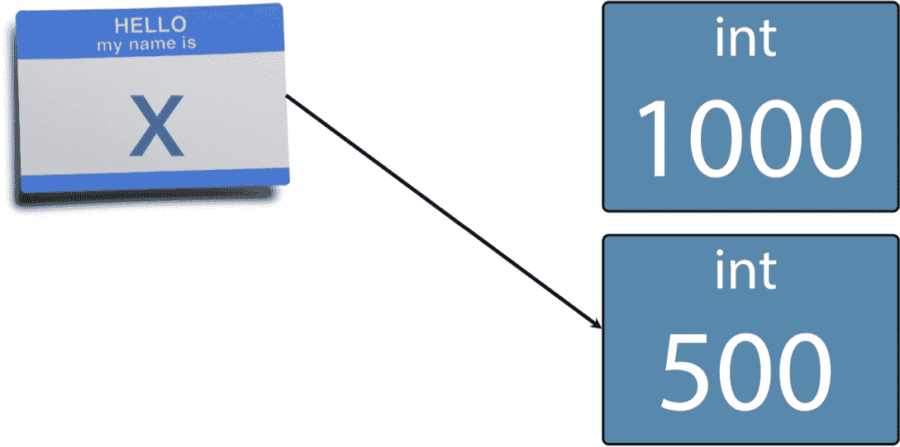
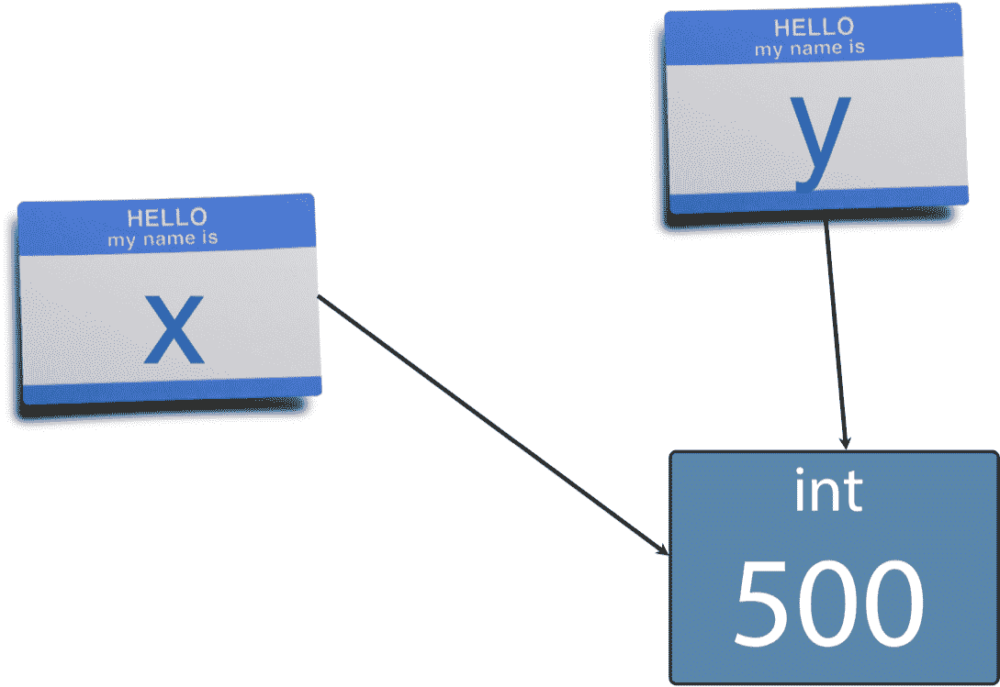
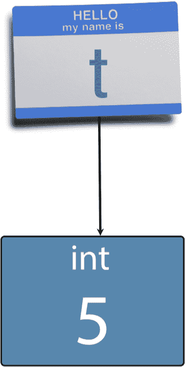
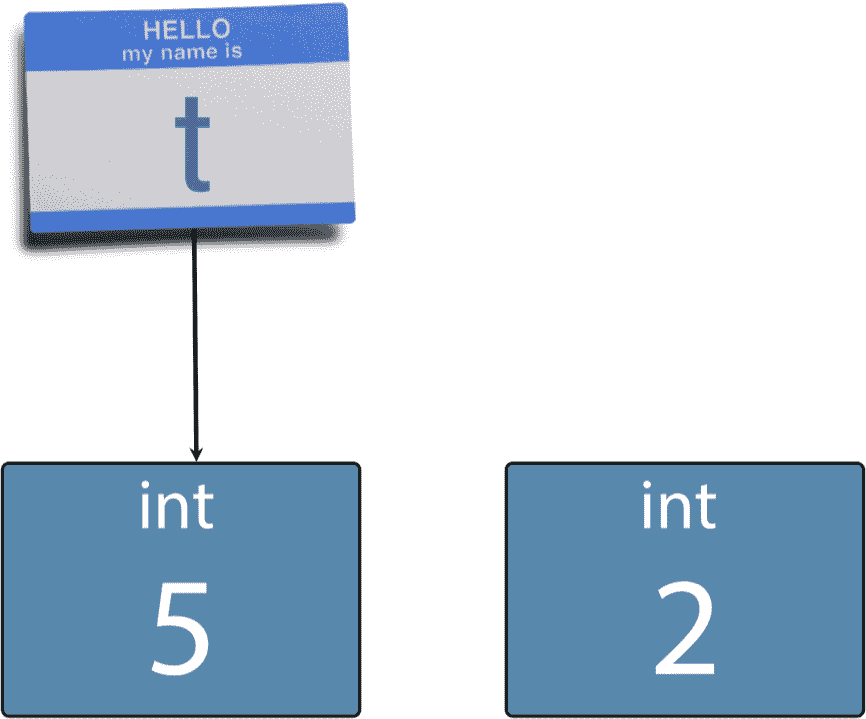
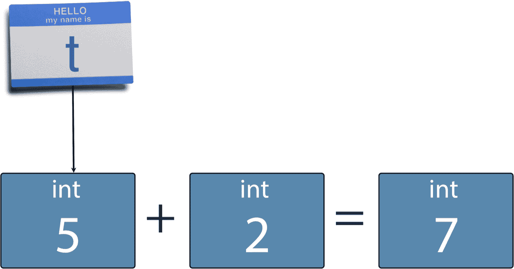
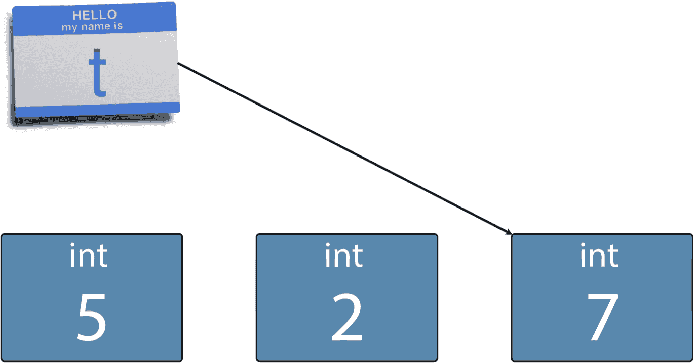
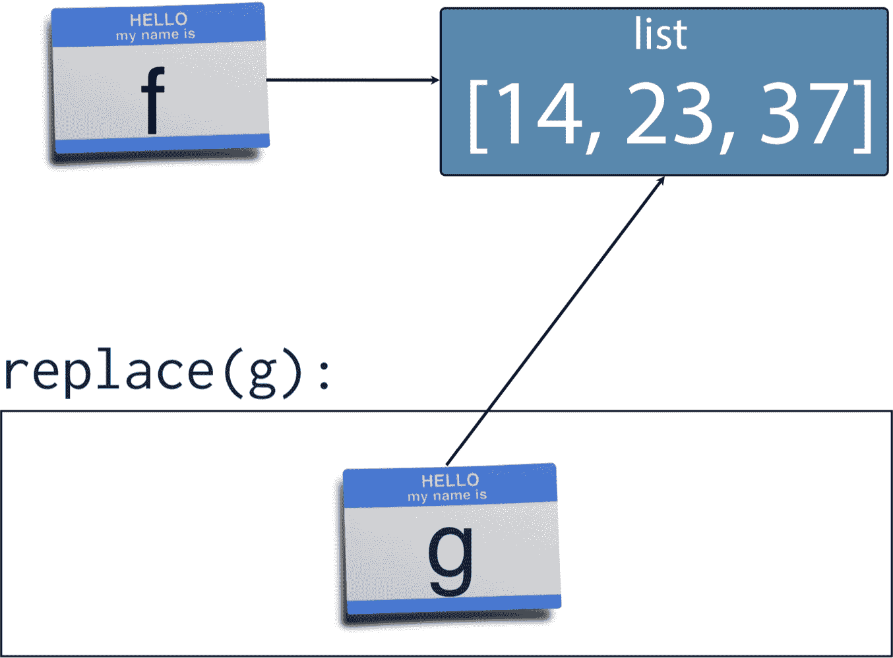
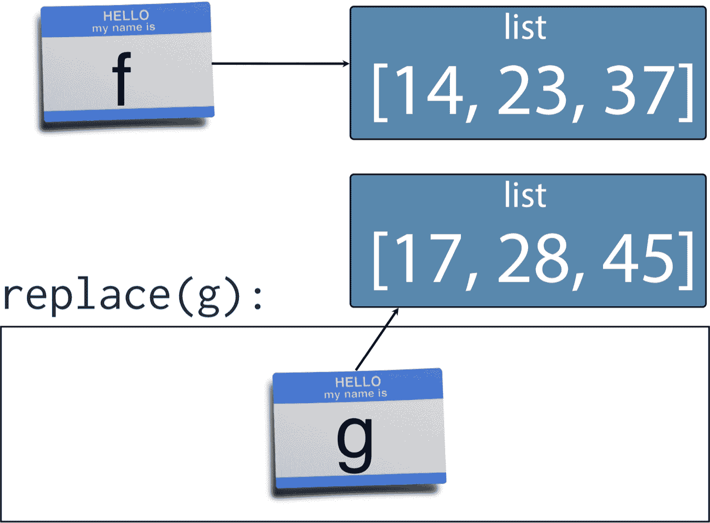

## 第五章：内置类型和对象模型

Python 语言最基本的设计元素之一是其对*对象*的使用。对象不仅是用户级构造的中心数据结构，也是语言本身许多内部工作的中心数据结构。在本章中，我们将开始发展对这一概念的理解，无论是在原则上还是在实践中，希望您开始意识到对象在整个 Python 中是多么普遍。

我们将看看对象是什么，如何使用它们以及如何管理对它们的引用。我们还将开始探索 Python 中*类型*的概念，并且我们将看到 Python 的类型既类似于许多其他流行语言中的类型，又有所不同。作为这一探索的一部分，我们将更深入地了解一些我们已经遇到的集合类型，并介绍一些其他集合类型。

### Python 对象引用的性质

在之前的章节中，我们已经讨论并在 Python 中使用了“变量”，但变量到底是什么？考虑将整数分配给变量这样简单的事情：

```py
>>> x = 1000

```

当我们这样做时，实际上发生了什么？首先，Python 创建了一个值为`1000`的`int` *对象*。这个对象在本质上是匿名的，因为它本身没有名称（`x`或其他）。它是由 Python 运行时系统分配和跟踪的对象。

创建对象后，Python 创建了一个名为`x`的*对象引用*，并安排`x` ^(6)指向`int(1000)`对象：


将名称‘x’分配给一个值为 1000 的整数对象

#### 重新分配引用

现在我们将使用另一个赋值来修改`x`的值：

```py
>>> x = 500

```

这**不会**导致我们之前构造的`int(1000)`对象的任何更改。Python 中的整数对象是不可变的，不能被更改。实际上，这里发生的是 Python 首先创建一个新的不可变整数对象，其值为 500，然后将`x`引用重定向到新对象：



重新将名称‘x’分配给一个值为 500 的新整数对象

由于我们没有对原始`int(1000)`对象的其他引用，我们现在无法从我们的代码中访问它。因此，Python 垃圾收集器可以在选择时收集它。^(7)

#### 分配一个引用给另一个引用

当我们从一个变量分配到另一个变量时，我们实际上是从一个对象引用分配到另一个对象引用，这样两个引用就指向同一个对象。例如，让我们将现有变量`x`分配给一个新变量`y`：

```py
>>> y = x

```

这给我们了这个引用对象图：



将现有名称“x”分配给名称“y”

现在两个引用都指向同一个对象。我们现在将`x`重新分配给另一个新的整数：

```py
>>> x = 3000

```

这样做会给我们一个引用对象图，显示我们的两个引用和两个对象：


将一个新的整数 3000 分配给‘x’

在这种情况下，垃圾收集器没有工作要做，因为所有对象都可以从活动引用中访问。

#### 使用`id()`探索值与标识的差异

让我们使用内置的`id()`函数深入探讨对象和引用之间的关系。`id()`接受任何对象作为参数，并返回一个整数标识符，该标识符对于对象的整个生命周期是唯一且恒定的。让我们使用`id()`重新运行先前的实验：

```py
>>> a = 496
>>> id(a)
4302202064
>>> b = 1729
>>> id(b)
4298456016
>>> b = a
>>> id(b)
4302202064
>>> id(a) == id(b)
True

```

在这里，我们看到最初 `a` 和 `b` 指向不同的对象，因此 `id()` 为每个变量给出了不同的值。然而，当我们将 `a` 分配给 `b` 时，两个名称都指向同一个对象，因此 `id()` 为两者给出了相同的值。这里的主要教训是，`id()` 可以用来确定对象的 *身份*，而不依赖于对它的任何特定引用。

#### 使用 `is` 测试身份相等

实际上，在生产 Python 代码中很少使用 `id()` 函数。它的主要用途是在对象模型教程（比如这个！）和作为调试工具中。比 `id()` 函数更常用的是测试身份相等的 `is` 运算符。也就是说，`is` 测试两个引用是否指向同一个对象：

```py
>>> a is b
True

```

我们在第一章已经遇到了 `is` 运算符，当时我们测试了 `None`：

```py
>>> a is None
False

```

重要的是要记住，`is` 总是测试 *身份相等*，也就是说，两个引用是否指向完全相同的对象。我们将深入研究另一种主要类型的相等，*值相等*，稍后会详细介绍。

#### 在不进行变异的情况下进行变异

即使看起来自然会进行变异的操作也不一定如此。考虑增强赋值运算符：

```py
>>> t = 5
>>> id(t)
4297261280
>>> t += 2
>>> id(t)
4297261344

```

乍一看，似乎我们要求 Python 将整数值 `t` 增加两个。但这里的 `id()` 结果清楚地显示，在增强赋值之前和之后，`t` 指向两个不同的对象。

而不是修改整数对象，这里展示的实际发生的情况。最初，我们有名称 `t` 指向一个 `int(5)` 对象：



‘x’ 指向整数 5

接下来，为了执行将 `2` 增强赋值给 `t`，Python 在幕后创建了一个 `int(2)` 对象。请注意，我们从未对此对象进行命名引用；它完全由 Python 代表我们管理：



Python 在幕后创建一个整数 2

然后，Python 在 `t` 和匿名 `int(2)` 之间执行加法运算，得到 —— 你猜对了！ —— 另一个整数对象，这次是 `int(7)`：



Python 创建一个新的整数作为加法的结果

最后，Python 的增强赋值运算符将名称 `t` 重新分配给新的 `int(7)` 对象，使其他整数对象由垃圾收集器处理：



Python 重新分配了名称 ‘t’ 给加法的结果

#### 对可变对象的引用

Python 对所有类型都显示这种名称绑定行为。*赋值运算符只会将对象绑定到名称，它永远不会通过值复制对象*。为了更清楚地说明这一点，让我们看另一个使用可变对象的例子：列表。与我们刚刚看到的不可变的 `int` 不同，`list` 对象具有可变状态，这意味着 `list` 对象的值可以随时间改变。

为了说明这一点，我们首先创建一个具有三个元素的列表对象，并将列表对象绑定到名为 `r` 的引用：

```py
>>> r = [2, 4, 6]
>>> r
[2, 4, 6]

```

然后，我们将引用 `r` 分配给一个新的引用 `s`：

```py
>>> s = r
>>> s
[2, 4, 6]

```

这种情况的引用对象图表清楚地表明我们有两个名称指向单个 `list` 实例：


‘s’ 和 ‘r’ 指向同一个列表对象

当我们通过更改由 `s` 引用的列表来修改列表时，我们看到由 `r` 引用的列表也发生了变化：

```py
>>> s[1] = 17
>>> s
[2, 17, 6]
>>> r
[2, 17, 6]

```

同样，这是因为名称 `s` 和 `r` 指向相同的 *可变* 对象 ^(8)，我们可以通过使用之前学到的 `is` 关键字来验证这一事实：

```py
>>> s is r
True

```

这次讨论的主要观点是，Python 实际上并没有变量的隐喻意义上的值。它只有对对象的命名引用，这些引用的行为更像是标签，允许我们检索对象。也就是说，在 Python 中谈论变量仍然很常见，因为这很方便。我们将在本书中继续这样做，确信您现在了解了幕后发生了什么。

#### 值的相等性（等同性）与身份的相等性

让我们将该行为与值相等性或等同性的测试进行对比。我们将创建两个相同的列表：

```py
>>> p = [4, 7, 11]
>>> q = [4, 7, 11]
>>> p == q
True
>>> p is q
False

```

在这里，我们看到`p`和`q`指的是不同的对象，但它们指的对象具有相同的值。

！'p'和'q'不同的列表对象，具有相同的值

'p'和'q'不同的列表对象，具有相同的值

正如您期望的那样，在测试值相等性时，对象应始终等同于自身^(9)：

```py
>>> p == p
True

```

值相等性和身份是“相等”的基本不同概念，重要的是要在脑海中将它们分开。

值比较也值得一提，它是以编程方式定义的。当您定义类型时，您可以控制该类如何确定值的相等性。相反，身份比较是由语言定义的，您无法更改该行为。

### 参数传递语义 - 按对象引用传递

现在让我们看看所有这些与函数参数和返回值的关系。当我们调用函数时，我们实际上创建了新的名称绑定 - 那些在函数定义中声明的名称绑定 - 到现有对象 - 那些在调用时传递的对象。^(10) 因此，如果您想知道您的函数如何工作，真正理解 Python 引用语义是很重要的。

#### 在函数中修改外部对象

为了演示 Python 的参数传递语义，我们将在 REPL 中定义一个函数，该函数将一个值附加到列表并打印修改后的列表。首先我们将创建一个`list`并将其命名为`m`：

```py
>>> m = [9, 15, 24]

```

然后我们将定义一个名为`modify()`的函数，该函数将附加到传递给它的列表并打印该列表。该函数接受一个名为`k`的单个形式参数：

```py
>>> def modify(k):
...     k.append(39)
...     print("k =", k)
...

```

然后我们调用`modify()`，将我们的列表`m`作为实际参数传递：

```py
>>> modify(m)
k = [9, 15, 24, 39]

```

这确实打印了具有四个元素的修改后的列表。但是我们在函数外部的列表引用`m`现在指向什么？

```py
>>> m
[9, 15, 24, 39]

```

由`m`引用的列表已被修改，因为它是函数内部由`k`引用的同一列表。正如我们在本节开头提到的，当我们将对象引用传递给函数时，我们实质上是将实际参数引用（在本例中为`m`）分配给形式参数引用（在本例中为`k`）。

！在函数内外引用同一列表

在函数内外引用同一列表

正如我们所见，赋值会导致被赋值的引用指向与被赋值的引用相同的对象。这正是这里正在发生的事情。如果您希望函数修改对象的副本，那么函数有责任进行复制。

#### 在函数中绑定新对象

让我们看另一个有教育意义的例子。首先，我们将创建一个新列表`f`：

```py
>>> f = [14, 23, 37]

```

然后我们将创建一个名为`replace()`的新函数。顾名思义，`replace()`不会修改其参数，而是会更改其参数所引用的对象：

```py
>>> def replace(g):
...     g = [17, 28, 45]
...     print("g =", g)
...

```

我们现在使用实际参数`f`调用`replace()`：

```py
>>> replace(f)
g = [17, 28, 45]

```

这正是我们所期望的。但是外部引用`f`现在的值是多少？

```py
>>> f
[14, 23, 37]

```

`f`仍然指向原始的未修改列表。这一次，函数没有修改传入的对象。发生了什么？

答案是：对象引用`f`被分配给了形式参数`g`，所以`g`和`f`确实引用了同一个对象，就像前面的例子一样。



最初'f'和'g'引用相同的列表对象

然而，在函数的第一行，我们重新分配了引用`g`，指向一个新构造的列表`[17, 28, 45]`，所以在函数内部，对原始`[14, 23, 37]`列表的引用被覆盖了，尽管未修改的对象本身仍然被`f`引用在函数外部。



重新分配后，'f'和'g'引用不同的对象

#### 参数传递是引用绑定

所以我们已经看到通过函数参数引用修改对象是完全可能的，但也可以重新绑定参数引用到新值。如果你想改变列表参数的内容，并且希望在函数外部看到这些变化，你可以像这样修改列表的内容：

```py
>>> def replace_contents(g):
...     g[0] = 17
...     g[1] = 28
...     g[2] = 45
...     print("g =", g)
...
>>> f
[14, 23, 37]
>>> replace_contents(f)
g = [17, 28, 45]

```

确实，如果你检查`f`的内容，你会发现它们已经被修改了：

```py
>>> f
[17, 28, 45]

```

函数参数是通过所谓的“对象引用传递”传递的。这意味着引用的*值*被复制到函数参数中，而不是所引用对象的值；没有对象被复制。

### Python 返回语义

Python 的`return`语句使用与函数参数相同的对象引用传递语义。当你在 Python 中从函数返回一个对象时，你真正做的是将一个对象引用传递回调用者。如果调用者将返回值分配给一个引用，他们所做的只是将一个新的引用分配给返回的对象。这使用了与显式引用赋值和参数传递相同的语义和机制。

我们可以通过编写一个返回它的唯一参数的函数来证明这一点：

```py
>>> def f(d):
...     return d
...

```

如果我们创建一个对象，比如一个列表，并通过这个简单的函数传递它，我们会发现它返回的是我们传入的完全相同的对象：

```py
>>> c = [6, 10, 16]
>>> e = f(c)
>>> c is e
True

```

记住，只有当两个名称引用完全相同的对象时，`is`才会返回`True`，所以这个例子表明列表没有被复制。

### 详细的函数参数

现在我们理解了对象引用和对象之间的区别，我们将看一些函数参数的更多功能。

#### 默认参数值

使用`def`关键字定义函数时指定的形式函数参数是一个逗号分隔的参数名称列表。通过提供默认值，这些参数可以变成可选的。考虑一个函数，它在控制台上打印一个简单的横幅：

```py
1 >>> def banner(message, border='-'):
2 ...     line = border * len(message)
3 ...     print(line)
4 ...     print(message)
5 ...     print(line)
6 ...

```

这个函数接受两个参数，并且我们提供了一个默认值——在这种情况下是`'-'`——在一个字面字符串中。当我们使用默认参数定义函数时，具有默认参数的参数必须在没有默认值的参数之后，否则我们将得到一个`SyntaxError`。

在函数的第 2 行，我们将我们的边框字符串乘以消息字符串的长度。这一行展示了两个有趣的特点。首先，它演示了我们如何使用内置的`len()`函数确定 Python 集合中的项目数。其次，它展示了如何将一个字符串（在这种情况下是单个字符字符串边框）乘以一个整数，结果是一个包含原始字符串重复多次的新字符串。我们在这里使用这个特性来使一个与我们的消息长度相等的字符串。

在 3 到 5 行，我们打印全宽边框、消息和再次边框。

当我们调用我们的`banner()`函数时，我们不需要提供边框字符串，因为我们提供了一个默认值：

```py
>>> banner("Norwegian Blue")
--------------
Norwegian Blue
--------------

```

然而，如果我们提供可选参数，它会被使用：

```py
>>> banner("Sun, Moon and Stars", "*")
*******************
Sun, Moon and Stars
*******************

```

#### 关键字参数

在生产代码中，这个函数调用并不特别自我说明。我们可以通过在调用站点命名`border`参数来改善这种情况：

```py
>>> banner("Sun, Moon and Stars", border="*")
*******************
Sun, Moon and Stars
*******************

```

在这种情况下，`message`字符串被称为“位置参数”，`border`字符串被称为“关键字参数”。在调用中，位置参数按照函数定义中声明的形式参数的顺序进行匹配。另一方面，关键字参数则按名称进行匹配。如果我们为我们的两个参数使用关键字参数，我们可以自由地以任何顺序提供它们：

```py
>>> banner(border=".", message="Hello from Earth")
................
Hello from Earth
................

```

但请记住，所有关键字参数必须在任何位置参数之后指定。

#### 默认参数何时被评估？

当您为函数提供默认参数值时，您通过提供一个*表达式*来实现。这个表达式可以是一个简单的文字值，也可以是一个更复杂的函数调用。为了实际使用您提供的默认值，Python 必须在某个时候评估该表达式。

因此，关键是要确切了解 Python 何时评估默认值表达式。这将帮助您避免一个常见的陷阱，这个陷阱经常会使 Python 的新手陷入困境。让我们使用 Python 标准库`time`模块仔细研究这个问题：

```py
>>> import time

```

我们可以通过使用`time`模块的`ctime()`函数轻松地将当前时间作为可读字符串获取：

```py
>>> time.ctime()
'Sat Feb 13 16:06:29 2016'

```

让我们编写一个使用从`ctime()`检索的值作为默认参数值的函数：

```py
>>> def show_default(arg=time.ctime()):
...     print(arg)
...
>>> show_default()
Sat Feb 13 16:07:11 2016

```

到目前为止一切顺利，但请注意当您几秒钟后再次调用`show_default()`时会发生什么：

```py
>>> show_default()
Sat Feb 13 16:07:11 2016

```

再一次：

```py
>>> show_default()
Sat Feb 13 16:07:11 2016

```

正如你所看到的，显示的时间永远不会进展。

还记得我们说过`def`是一个语句，当执行时将函数定义绑定到函数名吗？好吧，默认参数表达式只在`def`语句执行时评估一次。在许多情况下，默认值是一个简单的不可变常量，如整数或字符串，因此这不会引起任何问题。但是对于那些通常在使用可变集合作为参数默认值时出现的困惑陷阱，这可能是一个令人困惑的陷阱。

让我们仔细看看。考虑这个使用空列表作为默认参数的函数。它接受一个菜单作为字符串列表，将项目`"spam"`附加到列表中，并返回修改后的菜单：

```py
>>> def add_spam(menu=[]):
...     menu.append("spam")
...     return menu
...

```

让我们来制作一个简单的培根和鸡蛋早餐：

```py
>>> breakfast = ['bacon', 'eggs']

```

当然，我们会向其中添加垃圾邮件：

```py
>>> add_spam(breakfast)
['bacon', 'eggs', 'spam']

```

我们将为午餐做类似的事情：

```py
>>> lunch = ['baked beans']
>>> add_spam(lunch)
['baked beans', 'spam']

```

到目前为止没有什么意外的。但是看看当您依赖默认参数而不传递现有菜单时会发生什么：

```py
>>> add_spam()
['spam']

```

当我们向空菜单添加`'spam'`时，我们只得到`spam`。这可能仍然是您所期望的，但如果我们再次这样做，我们的菜单中就会添加两个`spam`：

```py
>>> add_spam()
['spam', 'spam']

```

还有三个：

```py
>>> add_spam()
['spam', 'spam', 'spam']

```

还有四个：

```py
>>> add_spam()
['spam', 'spam', 'spam', 'spam']

```

这里发生的情况是这样的。首先，在`def`语句执行时，用于默认参数的空列表被创建一次。这是一个像我们迄今为止看到的任何其他普通列表一样的列表，Python 将在整个程序执行期间使用这个确切的列表。

第一次我们实际使用默认值，然后，我们最终直接将`spam`添加到默认列表对象中。当我们第二次使用默认值时，我们使用的是同一个默认列表对象——我们刚刚添加了`spam`的对象，并且我们最终将第二个`spam`实例添加到其中。第三次调用会无限地添加第三个 spam。或者也许是无限地恶心。

解决这个问题很简单，但也许不是显而易见的：**始终使用不可变对象，如整数或字符串作为默认值**。遵循这个建议，我们可以通过使用不可变的`None`对象作为标记来解决这个特定的问题：

```py
>>> def add_spam(menu=None):
...     if menu is None:
...         menu = []
...     menu.append('spam')
...     return menu
...
>>> add_spam()
['spam']
>>> add_spam()
['spam']
>>> add_spam()
['spam']

```

现在我们的`add_spam()`函数按预期工作。

### Python 类型系统

编程语言可以通过几个特征来区分，但其中最重要的特征之一是它们的类型系统的性质。Python 可以被描述为具有*动态*和*强*类型系统。让我们来研究一下这意味着什么。

#### Python 中的动态类型

动态类型意味着对象引用的类型直到程序运行时才能解析，并且在编写程序时无需事先指定。看一下这个简单的函数来添加两个对象：

```py
>>> def add(a, b):
...     return a + b
...

```

在这个定义中我们没有提到任何类型。我们可以用整数使用`add()`：

```py
>>> add(5, 7):
12

```

我们也可以用它来表示浮点数：

```py
>>> add(3.1, 2.4)
5.5

```

你可能会惊讶地看到它甚至适用于字符串：

```py
>>> add("news", "paper")
'newspaper'

```

事实上，这个函数适用于任何类型，比如`list`，对于这些类型，加法运算符已经被定义：

```py
>>> add([1, 6], [21, 107])
[1, 6, 21, 107]

```

这些示例说明了类型系统的动态性：`add()`函数的两个参数`a`和`b`可以引用任何类型的对象。

#### Python 中的强类型

另一方面，类型系统的强度可以通过尝试为未定义加法的类型（如字符串和浮点数）`add()`来证明：

```py
>>> add("The answer is", 42)
Traceback (most recent call last):
  File "<stdin>", line 1, in <module>
  File "<stdin>", line 2, in add
TypeError: Can't convert 'int' object to str implicitly

```

尝试这样做会导致`TypeError`，因为 Python 通常不会在对象类型之间执行隐式转换，或者试图将一种类型强制转换为另一种类型。这个主要的例外是用于 if 语句和 while 循环谓词的`bool`转换。^(11)

### 变量声明和作用域

正如我们所见，Python 中不需要类型声明，变量本质上只是未经类型化的名称绑定到对象。因此，它们可以被重新绑定 - 或重新分配 - 任意多次，甚至可以是不同类型的对象。

但是当我们将一个名称绑定到一个对象时，该绑定存储在哪里？要回答这个问题，我们必须看一下 Python 中的作用域和作用域规则。

#### LEGB 规则

Python 中有四种*作用域*类型，它们按层次排列。每个作用域都是存储名称并在其中查找名称的上下文。从最狭窄到最宽广的四个作用域是：

+   本地 - 在当前函数内定义的名称。

+   封闭 - 在任何封闭函数中定义的名称。（这个作用域对本书的内容并不重要。）

+   全局 - 在模块的顶层定义的名称。每个模块都带有一个新的全局作用域。

+   内置 - 通过特殊的`builtins`模块内置到 Python 语言中的名称。

这些作用域共同构成了 LEGB 规则：

> **LEGB 规则**
> 
> 名称在最相关的上下文中查找。

重要的是要注意，Python 中的作用域通常不对应于缩进所标示的源代码块。for 循环、with 块等不会引入新的嵌套作用域。

#### 作用域的实际应用

考虑我们的`words.py`模块。它包含以下全局名称：

+   `main` - 由`def main()`绑定

+   `sys` - 由`import sys`绑定

+   `__name__` - 由 Python 运行时提供

+   `urlopen` - 由`from urllib.request import urlopen`绑定

+   `fetch_words` - 由`def fetch_words()`绑定

+   `print_items` - 由`def print_items()`绑定

模块范围名称绑定通常是由`import`语句和函数或类定义引入的。在模块范围内使用其他对象是可能的，这通常用于常量，尽管它也可以用于变量。

在`fetch_words()`函数内部，我们有六个本地名称：

+   `word` - 由内部 for 循环绑定

+   `line_words` - 通过赋值绑定

+   `line` - 由外部 for 循环绑定

+   `story_words` - 通过赋值绑定

+   `url` - 由形式函数参数绑定

+   `story` - 由 with 语句绑定

这些绑定中的每一个都是在首次使用时创建的，并在函数完成时继续存在于函数作用域内，此时引用将被销毁。

#### 全局和本地作用域中的相同名称

非常偶尔，我们需要在函数内部从模块范围重新绑定全局名称。考虑以下简单模块：

```py
count = 0

def show_count():
    print(count)

def set_count(c):
    count = c

```

如果我们将这个模块保存在`scopes.py`中，我们可以将其导入 REPL 进行实验：

```py
$ python3
Python 3.5.0 (default, Nov  3 2015, 13:17:02)
[GCC 4.2.1 Compatible Apple LLVM 6.1.0 (clang-602.0.53)] on darwin
Type "help", "copyright", "credits" or "license" for more information.
>>> from scopes import *
>>> show_count()
count =  0

```

当调用`show_count()`时，Python 在本地命名空间（L）中查找名称`count`。它找不到，所以在下一个最外部的命名空间中查找，这种情况下是全局模块命名空间（G），在那里它找到名称`count`并打印所引用的对象。

现在我们用一个新值调用`set_count()`：

```py
>>> set_count(5)

```

然后我们再次调用`show_count()`：

```py
>>> show_count()
count =  0

```

您可能会惊讶，在调用`set_count(5)`后，`show_count()`显示`0`，所以让我们一起来看看发生了什么。

当我们调用`set_count()`时，赋值`count = c`在*本地*作用域中为名称`count`创建了一个*新*绑定。这个新绑定当然是指传递的对象`c`。关键是，在模块范围定义的全局`count`不会进行查找。我们创建了一个新变量，它遮蔽了同名的全局变量，从而阻止访问。

#### `global`关键字

为了避免在全局范围内遮蔽名称，我们需要指示 Python 将`set_count()`函数中的名称`count`解析为模块命名空间中定义的`count`。我们可以使用`global`关键字来做到这一点。让我们修改`set_count()`来这样做：

```py
def set_count(c):
    global count
    count = c

```

`global`在本地作用域中引入了一个来自全局作用域的名称绑定。

退出并重新启动 Python 解释器以运行我们修改后的模块：

```py
>>> from scopes import *
>>> show_count()
count =  0
>>> set_count(5)
>>> show_count()
count =  5

```

它现在展示了所需的行为。

* * *

### 禅的时刻


正如我们所展示的，Python 中的所有变量都是对象的引用，即使在基本类型（如整数）的情况下也是如此。这种对对象导向的彻底方法是 Python 的一个重要主题，实际上 Python 中的几乎所有东西都是对象，包括函数和模块。

* * *

### 一切都是对象

让我们回到我们的`words`模块，并在 REPL 中进一步进行实验。这次我们只会导入模块：

```py
$ python3
Python 3.5.0 (default, Nov  3 2015, 13:17:02)
[GCC 4.2.1 Compatible Apple LLVM 6.1.0 (clang-602.0.53)] on darwin
Type "help", "copyright", "credits" or "license" for more information.
>>> import words

```

`import`语句在当前命名空间中将模块对象绑定到名称`words`。我们可以使用`type()`内置函数确定任何对象的类型：

```py
>>> type(words)
<class 'module'>

```

如果我们想要查看对象的属性，我们可以在 Python 交互会话中使用`dir()`内置函数来审视对象：

```py
>>> dir(words)
['__builtins__', '__cached__', '__doc__', '__file__', '__initializing__',
'__loader__', '__name__', '__package__', 'fetch_words', 'main',
'print_items', 'sys', 'urlopen']

```

`dir()`函数返回模块属性名称的排序列表，包括：

+   我们定义的一些，比如函数`fetch_words()`

+   任何导入的名称，比如`sys`和`urlopen`

+   各种特殊的*dunder*属性，比如`__name__`和`__doc__`，揭示了 Python 的内部工作。

#### 检查一个函数

我们可以使用`type()`函数对任何这些属性进行更多了解。例如，我们可以看到`fetch_words`是一个函数对象：

```py
>>> type(words.fetch_words)
<class 'function'>

```

我们可以反过来在函数上使用`dir()`来揭示它的属性：

```py
>>> dir(words.fetch_words)
['__annotations__', '__call__', '__class__', '__closure__', '__code__',
'__defaults__', '__delattr__', '__dict__', '__dir__', '__doc__', '__eq__',
'__format__', '__ge__', '__get__', '__getattribute__', '__globals__',
'__gt__', '__hash__', '__init__', '__kwdefaults__', '__le__', '__lt__',
'__module__', '__name__', '__ne__', '__new__', '__qualname__', '__reduce__',
'__reduce_ex__', '__repr__', '__setattr__', '__sizeof__', '__str__',
'__subclasshook__']

```

我们可以看到函数对象有*许多*与 Python 函数在幕后实现方式有关的特殊属性。现在，我们只看一些简单的属性。

正如您所期望的那样，它的`__name__`属性是函数对象的名称作为字符串：

```py
>>> words.fetch_words.__name__
'fetch_words'

```

同样，`__doc__`是我们提供的文档字符串，给出了一些关于内置`help()`函数如何实现的线索。

```py
>>> words.fetch_words.__doc__
'Fetch a list of words from a URL.\n\n Args:\n url: The URL of a
UTF-8 text document.\n\n    Returns:\n        A list of strings containing
the words from\n        the document.\n    '

```

这只是一个小例子，展示了您可以在运行时审查 Python 对象，还有许多更强大的工具可以帮助您了解更多关于您正在使用的对象。也许这个例子最有教育意义的部分是，我们正在处理一个*函数对象*，这表明 Python 的普遍对象导向包括其他语言中可能根本无法访问的语言元素。

### 总结

+   Python 对象引用

+   将 Python 视为对对象的命名引用，而不是变量和值。

+   赋值不会将值放入一个盒子中。它会将一个名称标签附加到一个对象上。

+   从一个引用分配到另一个引用会在同一个对象上放置两个名称标签。

+   Python 垃圾收集器将回收不可达的对象-那些没有名称标签的对象。

+   对象标识和等价性

+   `id()`函数返回一个唯一且恒定的标识符，但在生产中很少使用。

+   `is`运算符确定身份的相等性。也就是说，两个名称是否引用同一个对象。

+   我们可以使用双等号运算符测试等价性。

+   函数参数和返回值

+   函数参数通过对象引用传递，因此如果它们是可变对象，函数可以修改它们的参数。

+   如果通过赋值重新绑定形式函数参数，则传入对象的引用将丢失。要更改可变参数，应该替换其*内容*而不是替换整个对象。

+   返回语句也通过对象引用传递。不会进行复制。

+   函数参数可以指定默认值。

+   默认参数表达式在执行`def`语句时只被评估一次。

+   Python 类型系统

+   Python 使用动态类型，因此我们不需要提前指定引用类型。

+   Python 使用强类型。类型不会被强制匹配。

+   范围

+   根据 LEGB 规则，Python 引用名称在四个嵌套范围中查找：局部函数中，封闭函数中，全局（或模块）命名空间中和内置函数。

+   全局引用可以从局部范围读取

+   从局部范围分配给全局引用需要使用 global 关键字声明引用为全局引用。

+   对象和内省

+   Python 中的所有内容都是对象，包括模块和函数。它们可以像其他对象一样对待。

+   `import`和`def`关键字会绑定到命名引用。

+   内置的`type()`函数可以用来确定对象的类型。

+   内置的`dir()`函数可以用来内省对象并返回其属性名称的列表。

+   函数或模块对象的名称可以通过其`__name__`属性访问。

+   函数或模块对象的文档字符串可以通过其`__doc__`属性访问。

+   杂项

+   我们可以使用`len()`来测量字符串的长度。

+   如果我们将字符串“乘以”一个整数，我们将得到一个新的字符串，其中包含操作数字符串的多个副本。这称为“重复”操作。
