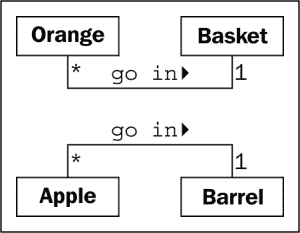
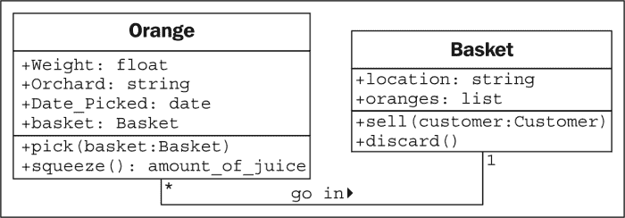
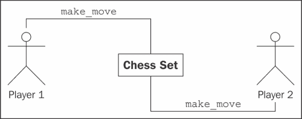
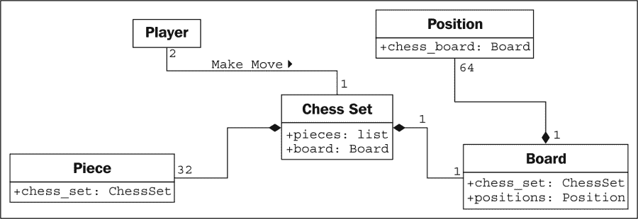
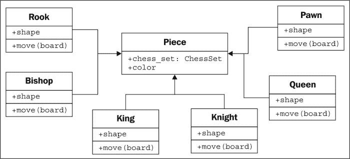
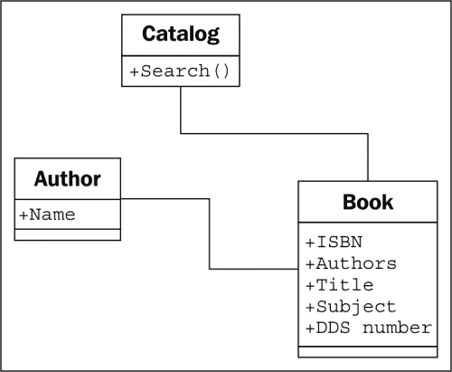
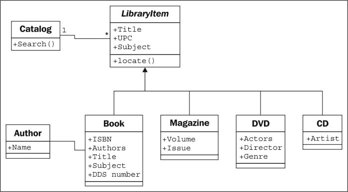
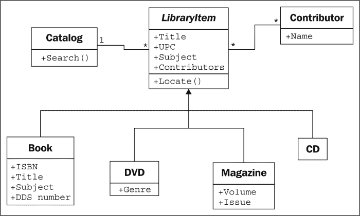
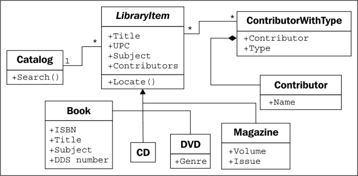

# 第一章 面向对象设计

在软件开发中，设计通常被认为是编程之前的步骤。这并不正确；实际上，分析、编程和设计往往会重叠、结合和交织在一起。在本章中，我们将涵盖以下主题：

+   面向对象的含义

+   面向对象设计和面向对象编程之间的区别

+   面向对象设计的基本原则

+   基本**统一建模语言**（**UML**）及其不邪恶的时候

# 介绍面向对象

每个人都知道什么是对象——一种我们可以感知、感觉和操纵的有形物体。我们最早接触的对象通常是婴儿玩具。木块、塑料形状和超大拼图块是常见的第一个对象。婴儿很快学会了某些对象会做某些事情：铃铛会响，按钮会按下，杠杆会拉动。

在软件开发中，对象的定义并没有太大的不同。软件对象通常不是你可以拿起、感知或感觉到的有形物体，但它们是某种可以做某些事情并且可以对其进行某些操作的模型。从正式的角度来看，对象是一组**数据**和相关的**行为**。

因此，了解什么是对象，面向对象意味着什么？Oriented 简单地意味着*朝向*。因此，面向对象意味着功能上朝向建模对象。这是通过描述一组相互作用的对象及其数据和行为来对复杂系统进行建模的许多技术之一。

如果你读过任何炒作，你可能会遇到面向对象分析、面向对象设计、面向对象分析和设计以及面向对象编程等术语。这些都是与总体面向对象相关的高度相关的概念。

事实上，分析、设计和编程都是软件开发的各个阶段。将它们称为面向对象只是指定了正在追求的软件开发风格。

**面向对象分析**（**OOA**）是查看问题、系统或任务（某人想要将其转化为应用程序）的过程，并识别对象和对象之间的交互。分析阶段关乎于*需要*做什么。

分析阶段的输出是一组需求。如果我们能够在一步中完成分析阶段，我们将把一个任务，比如，我需要一个网站，转化为一组需求。例如：

网站访问者需要能够（*斜体*代表动作，**粗体**代表对象）：

+   *回顾*我们的**历史**

+   *申请*工作

+   *浏览*、*比较*和*订购产品*

在某种程度上，分析是一个误称。我们之前讨论过的婴儿并不会分析积木和拼图。相反，它会探索其环境，操纵形状，并看看它们可能适合在哪里。更好的说法可能是面向对象的探索。在软件开发中，分析的初始阶段包括采访客户，研究他们的流程，并排除可能性。

**面向对象设计**（**OOD**）是将这些要求转化为实现规范的过程。设计者必须命名对象，定义行为，并正式指定哪些对象可以激活其他对象上的特定行为。设计阶段关乎于*如何*做事情。

设计阶段的输出是一个实现规范。如果我们能够在一个步骤中完成设计阶段，我们将把在面向对象分析期间定义的需求转化为一组类和接口，这些类和接口可以在（理想情况下）任何面向对象的编程语言中实现。

**面向对象编程**（**OOP**）是将这个完全定义的设计转化为一个完全符合 CEO 最初要求的工作程序的过程。

是的，没错！如果世界符合这个理想，我们可以按照旧教科书告诉我们的那样，按照完美的顺序依次遵循这些阶段，那将是可爱的。通常情况下，现实世界要复杂得多。无论我们多么努力地分离这些阶段，我们总会发现在设计时需要进一步分析的事情。当我们编程时，我们会发现设计中需要澄清的特性。

21 世纪的大多数开发都是以迭代开发模型进行的。在迭代开发中，任务的一小部分被建模、设计和编程，然后程序被审查和扩展，以改进每个特性并在一系列短期开发周期中包含新特性。

本书的其余部分是关于面向对象编程的，但在本章中，我们将在设计的背景下介绍基本的面向对象原则。这使我们能够在不必与软件语法或 Python 解释器争论的情况下理解这些（相当简单的）概念。

# 对象和类

因此，对象是具有相关行为的数据集合。我们如何区分对象的类型？苹果和橙子都是对象，但有一个常见的谚语说它们无法比较。在计算机编程中，苹果和橙子并不经常被建模，但让我们假设我们正在为一个果园做库存应用。为了便于例子，我们可以假设苹果放在桶里，橙子放在篮子里。

现在，我们有四种对象：苹果、橙子、篮子和桶。在面向对象建模中，用于*对象类型*的术语是**类**。因此，在技术术语中，我们现在有四个对象类。

对象和类之间有什么区别？类描述对象。它们就像创建对象的蓝图。你可能在你面前的桌子上有三个橙子。每个橙子都是一个独特的对象，但所有三个都具有与一个类相关的属性和行为：橙子的一般类。

我们库存系统中四个对象类之间的关系可以使用**统一建模语言**（通常简称为**UML**，因为三个字母的缩写永远不会过时）类图来描述。这是我们的第一个类图：

这个图表显示了**橙子**与**篮子**的某种关联，以及**苹果**与**桶**的某种关联。关联是两个类之间最基本的关系方式。

UML 在经理中非常受欢迎，有时会受到程序员的贬低。UML 图的语法通常非常明显；当你看到一个时，你不必阅读教程就能（大部分）理解发生了什么。UML 也相当容易绘制，而且相当直观。毕竟，许多人在描述类及其关系时，自然会画出盒子和它们之间的线条。基于这些直观图表的标准使得程序员之间、设计师和经理之间的交流变得容易。

然而，一些程序员认为 UML 是浪费时间。他们会援引迭代开发，认为用花哨的 UML 图表制定的正式规范在实施之前就会变得多余，并且维护这些正式图表只会浪费时间，对任何人都没有好处。

根据涉及的公司结构，这可能是真的，也可能不是真的。然而，每个由多个人组成的编程团队都会偶尔坐下来讨论他们当前正在处理的子系统的细节。在这些头脑风暴会议中，UML 非常有用，可以进行快速而轻松的交流。即使那些嘲笑正式类图的组织也倾向于在他们的设计会议或团队讨论中使用某种非正式版本的 UML。

此外，您将要与之交流的最重要的人是您自己。我们都认为自己可以记住我们所做的设计决定，但在我们的未来中总会有隐藏着*我为什么要那样做？*的时刻。如果我们保存我们在开始设计时做初始图表的纸屑，最终我们会发现它们是一个有用的参考。

然而，本章并不意味着是 UML 的教程。互联网上有许多这样的教程，还有许多关于这个主题的书籍。UML 涵盖的远不止类和对象图表；它还有用例、部署、状态变化和活动的语法。在这次面向对象设计的讨论中，我们将处理一些常见的类图语法。您会发现您可以通过示例掌握结构，并且在您自己团队或个人设计会议中会下意识地选择受 UML 启发的语法。

我们的初始图表虽然是正确的，但并没有提醒我们苹果放入桶，或者一个苹果可以放入多少个桶。它只告诉我们苹果与桶以某种方式相关联。类之间的关联通常是显而易见的，不需要进一步解释，但我们可以根据需要添加进一步的澄清。

UML 的美妙之处在于大多数东西都是可选的。我们只需要在图表中指定与当前情况相关的信息。在一个快速的白板会议中，我们可能只是快速地在方框之间画线。在正式文件中，我们可能会更详细地说明。在苹果和桶的情况下，我们可以相当有信心地说，关联是，**许多苹果放入一个桶**，但为了确保没有人将其与，**一个苹果糟蹋一个桶**混淆，我们可以增强图表如下所示：

这个图表告诉我们橙子**放入**篮子，并用一个小箭头显示了什么放入了什么。它还告诉我们在关联的两端可以使用的对象的数量。一个**Basket**可以容纳许多（用*****表示的）**Orange**对象。任何一个**Orange**可以放入一个**Basket**。这个数字被称为对象的多重性。您也可能听到它被描述为基数。这些实际上是略微不同的术语。基数指的是集合中的实际数量，而多重性指定了这个数字可以有多小或多大。

我经常忘记关系的多重性应该放在哪一边。离一个类最近的多重性是指与关联的另一端的任何一个对象相关联的该类对象的数量。对于苹果放入桶的关联，从左到右阅读，**Apple**类的许多实例（即许多**Apple**对象）可以放入任何一个**Barrel**中。从右到左阅读，确切地说，一个**Barrel**可以与任何一个**Apple**相关联。

# 指定属性和行为

现在我们对一些基本的面向对象术语有了了解。对象是可以相互关联的类的实例。对象实例是具有自己一组数据和行为的特定对象；我们面前桌子上的一个特定的橙子被称为是橙子这个一般类的一个实例。这很简单，但是与每个对象相关联的数据和行为是什么呢？

## 数据描述对象

让我们从数据开始。数据通常表示特定对象的个体特征。一个类可以定义所有该类对象共享的特定特征集。任何特定对象可以对给定特征具有不同的数据值。例如，我们桌子上的三个橙子（如果我们没有吃掉）可能每个重量都不同。然后橙子类可以有一个重量**属性**。橙子类的所有实例都有一个重量属性，但每个橙子对于这个属性有不同的值。然而，属性不一定是唯一的；任何两个橙子可能重量相同。作为一个更现实的例子，代表不同客户的两个对象可能具有相同的名字属性值。

属性经常被称为**成员**或**属性**。一些作者认为这些术语有不同的含义，通常是属性是可设置的，而属性是只读的。在 Python 中，“只读”概念相当无意义，因此在本书中，我们将看到这两个术语可以互换使用。此外，正如我们将在第五章中讨论的那样，*何时使用面向对象编程*，在 Python 中，property 关键字对于一种特定类型的属性具有特殊含义。

在我们的水果库存应用程序中，果农可能想知道橙子来自哪个果园，何时采摘以及重量是多少。他们可能还想跟踪每个篮子存放在哪里。苹果可能有颜色属性，桶可能有不同的大小。其中一些属性也可能属于多个类（我们可能也想知道何时采摘苹果），但是对于这个第一个例子，让我们只向我们的类图添加一些不同的属性：

根据我们设计的详细程度，我们还可以为每个属性指定类型。属性类型通常是大多数编程语言中标准的原始类型，例如整数、浮点数、字符串、字节或布尔值。但是，它们也可以表示数据结构，例如列表、树或图，或者尤其重要的是其他类。这是设计阶段可以与编程阶段重叠的一个领域。一个编程语言中可用的各种原始类型或对象可能与其他语言中可用的有些不同。

通常，在设计阶段我们不需要过分关注数据类型，因为实现特定的细节是在编程阶段选择的。对于设计来说，通常通用名称就足够了。如果我们的设计需要一个列表容器类型，Java 程序员可以选择在实现时使用`LinkedList`或`ArrayList`，而 Python 程序员（就是我们！）可以在`list`内置和`tuple`之间进行选择。

到目前为止，在我们的水果种植示例中，我们的属性都是基本原始类型。然而，有一些隐含的属性我们可以明确表示——关联。对于给定的橙子，我们可能有一个包含持有该橙子的篮子的属性。

## 行为是动作

现在，我们知道了什么是数据，但是行为是什么呢？行为是可以在对象上发生的动作。可以在特定类的对象上执行的行为称为**方法**。在编程级别上，方法就像结构化编程中的函数，但它们神奇地可以访问与该对象关联的所有数据。与函数一样，方法也可以接受**参数**并返回**值**。

方法的参数是需要**传递**到被调用的方法中的对象的列表（从调用对象传入的对象通常被称为**参数**）。这些对象被方法用来执行它们应该做的任何行为或任务。返回的值是该任务的结果。

我们已经把我们的“比较苹果和橙子”的例子扩展到了一个基本的（虽然牵强）库存应用程序。让我们再扩展一下，看看它是否会出错。可以与橙子相关联的一个动作是**采摘**。如果考虑实现，**采摘**会通过更新橙子的**篮子**属性并将橙子添加到**篮子**的**橙子**列表中，将橙子放入篮子中。因此，**采摘**需要知道它正在处理的篮子是哪一个。我们通过给**采摘**方法一个**篮子**参数来实现这一点。由于我们的果农还卖果汁，我们可以给**橙子**添加一个**榨**方法。当榨时，**榨**可能会返回所提取的果汁量，同时将**橙子**从它所在的**篮子**中移除。

**篮子**可以有一个**卖**的动作。当篮子被卖出时，我们的库存系统可能会更新一些未指定的对象的数据，用于会计和利润计算。或者，我们的橙子篮在卖出之前可能会变坏，所以我们添加了一个**丢弃**的方法。让我们把这些方法添加到我们的图表中：

向单个对象添加模型和方法使我们能够创建一个相互作用的对象**系统**。系统中的每个对象都是某个类的成员。这些类指定了对象可以持有的数据类型以及可以在其上调用的方法。每个对象中的数据可以与同一类的其他对象的数据处于不同的状态，并且由于状态的不同，每个对象可能对方法调用做出不同的反应。

面向对象的分析和设计的关键是找出这些对象是什么，以及它们应该如何相互作用。下一节描述了可以用来使这些相互作用尽可能简单和直观的原则。

# 隐藏细节并创建公共接口

在面向对象设计中对对象进行建模的主要目的是确定该对象的公共**接口**是什么。接口是其他对象可以用来与该对象交互的属性和方法的集合。它们不需要，通常也不允许，访问对象的内部工作。一个常见的现实世界的例子是电视。我们对电视的接口是遥控器。遥控器上的每个按钮代表一个可以在电视对象上调用的方法。当我们作为调用对象访问这些方法时，我们不知道也不关心电视是通过天线、有线连接还是卫星接收信号。我们不关心调整音量时发送的电子信号，或者声音是发往扬声器还是耳机。如果我们打开电视来访问内部工作，例如将输出信号分成外部扬声器和一套耳机，我们将会失去保修。

隐藏对象的实现细节的过程称为**信息隐藏**。有时也被称为**封装**，但封装实际上是一个更全面的术语。封装的数据不一定是隐藏的。封装，字面上来说，是创建一个胶囊，所以可以想象创建一个时间胶囊。如果你把一堆信息放进一个时间胶囊，锁上并埋起来，那么它既是封装的，信息也是隐藏的。另一方面，如果时间胶囊还没有被埋起来，或者是没有锁上或是由透明塑料制成的，里面的物品仍然是封装的，但没有信息隐藏。

封装和信息隐藏之间的区别在设计层面上基本上是无关紧要的。许多实际参考资料将这些术语互换使用。作为 Python 程序员，我们实际上并不需要真正的信息隐藏（我们将在第二章中讨论这一点，*Python 中的对象*），因此封装的更广泛的定义是合适的。

然而，公共接口非常重要。它需要仔细设计，因为将来很难更改它。更改接口将破坏调用它的任何客户对象。我们可以随意更改内部，例如使其更有效，或者在本地和通过网络访问数据，客户对象仍然可以使用公共接口进行通信，而无需修改。另一方面，如果我们通过更改公开访问的属性名称或更改方法可以接受的参数的顺序或类型来更改接口，所有客户对象也必须进行修改。在谈到公共接口时，保持简单。始终根据使用的便捷程度而不是编码的难度来设计对象的接口（这个建议也适用于用户界面）。

记住，程序对象可能代表真实对象，但这并不意味着它们是真实对象。它们是模型。建模最大的好处之一是能够忽略不相关的细节。我小时候建的模型汽车可能在外表上看起来像一辆真正的 1956 年的雷鸟，但它无法运行，传动轴也不转动。在我开始驾驶之前，这些细节过于复杂且无关紧要。这个模型是对真实概念的抽象。

**抽象**是另一个与封装和信息隐藏相关的面向对象的概念。简而言之，抽象意味着处理最适合于特定任务的细节级别。它是从内部细节中提取公共接口的过程。汽车的驾驶员需要与转向、油门和刹车进行交互。发动机、传动系统和刹车子系统的工作对驾驶员并不重要。另一方面，技工在不同的抽象级别上工作，调整发动机和刹车。这是汽车的两个抽象级别的例子：

现在，我们有几个指涉相似概念的新术语。将所有这些行话浓缩成几句话：抽象是将信息封装在单独的公共和私有接口中的过程。私有接口可能会受到信息隐藏的影响。

从所有这些定义中得出的重要教训是要使我们的模型能够被必须与它们互动的其他对象理解。这意味着要仔细关注细节。确保方法和属性有合理的名称。在分析系统时，对象通常代表原始问题中的名词，而方法通常是动词。属性通常可以作为形容词，尽管如果属性指的是当前对象的一部分的另一个对象，它仍然可能是名词。相应地命名类、属性和方法。

不要试图模拟*可能*在未来有用的对象或动作。只模拟系统需要执行的任务，设计自然会朝着具有适当抽象级别的方向发展。这并不是说我们不应该考虑可能的未来设计修改。我们的设计应该是开放式的，以便满足未来的需求。然而，在抽象接口时，尽量模拟确切需要模拟的内容，而不要多余。

在设计界面时，尝试将自己放在对象的角度，并想象对象对隐私有强烈偏好。除非你觉得让其他对象访问关于你的数据符合你的最佳利益，否则不要让其他对象访问关于你的数据。除非你确定你希望它们这样做，否则不要给它们一个接口来强迫你执行特定任务。

# 组合

到目前为止，我们学会了将系统设计为一组相互作用的对象，其中每个交互都涉及以适当的抽象级别查看对象。但我们还不知道如何创建这些抽象级别。有多种方法可以做到这一点；我们将在第八章“字符串和序列化”和第九章“迭代器模式”中讨论一些高级设计模式。但是，大多数设计模式都依赖于两个基本的面向对象原则，即**组合**和**继承**。组合更简单，所以我们从它开始。

组合是将几个对象收集在一起创建一个新对象的行为。当一个对象是另一个对象的一部分时，组合通常是一个不错的选择。我们已经在机械示例中看到了组合的第一个提示。汽车由发动机、变速器、启动器、前灯和挡风玻璃等众多零部件组成。发动机又由活塞、曲轴和气门组成。在这个例子中，组合是提供抽象级别的好方法。汽车对象可以提供驾驶员所需的接口，同时也提供对其组件部分的访问，这为技工提供了适合的更深层次的抽象。当技工需要更多信息来诊断问题或调整发动机时，这些组件部分当然可以进一步分解。

这是一个常见的组合入门示例，但在设计计算机系统时并不是特别有用。物理对象很容易分解成组件对象。自古希腊人最初假设原子是物质的最小单位以来，人们一直在做这件事情（当然，他们当时没有接触到粒子加速器）。计算机系统通常比物理对象更简单，但是在这种系统中识别组件对象并不会自然发生。

面向对象系统中的对象有时代表诸如人、书籍或电话等物理对象。然而，更常见的情况是它们代表抽象概念。人有名字，书有标题，电话用于打电话。电话、标题、账户、名字、约会和付款通常不被认为是物理世界中的对象，但它们在计算机系统中经常被建模为组件。

让我们尝试建模一个更加面向计算机的例子，以了解组合的运作方式。我们将研究一个计算机化国际象棋游戏的设计。这在 80 年代和 90 年代是学者们非常受欢迎的消遣。人们曾预测计算机有一天将能够击败人类国际象棋大师。当这在 1997 年发生时（IBM 的深蓝击败了世界国际象棋冠军加里·卡斯帕罗夫），对这个问题的兴趣减弱了，尽管计算机和人类国际象棋选手之间仍然有比赛。（通常是计算机获胜。）

作为基本的高层分析，国际象棋游戏是由两名玩家使用一个包含 8x8 网格中六十四个位置的棋盘的国际象棋套装进行对弈。棋盘上可以有两组可以以不同方式移动的十六个棋子，由两名玩家轮流移动。每个棋子都可以吃掉其他棋子。棋盘将需要在每一轮之后在计算机屏幕上绘制自己。

我使用*斜体*标识了描述中可能的一些对象，并使用**粗体**标识了一些关键方法。这是将面向对象分析转化为设计的常见第一步。此时，为了强调组合，我们将专注于棋盘，而不太担心玩家或不同类型的棋子。

让我们从可能的最高抽象级别开始。我们有两个玩家通过轮流走棋与国际象棋棋盘进行交互：

这是什么？它看起来不太像我们之前的类图。那是因为它不是类图！这是一个**对象图**，也称为实例图。它描述了系统在特定时间点的状态，并描述了对象的特定实例，而不是类之间的交互。请记住，两个玩家都是同一个类的成员，因此类图看起来有点不同：

该图表明只有两名玩家可以与一个国际象棋组合进行交互。它还表明任何一名玩家一次只能玩一个国际象棋组合。

然而，我们讨论的是组合，而不是 UML，所以让我们思考一下**国际象棋**由什么组成。我们暂时不关心玩家由什么组成。我们可以假设玩家有心脏和大脑等器官，但这些对我们的模型无关紧要。事实上，没有什么能阻止说的玩家本身就是没有心脏或大脑的深蓝。

因此，国际象棋组合由一个棋盘和 32 个棋子组成。棋盘进一步包括 64 个位置。您可以争辩说棋子不是国际象棋组合的一部分，因为您可以用不同的棋子替换国际象棋组合中的棋子。虽然在计算机化的国际象棋中这是不太可能或不可能的，但这让我们了解了**聚合**。

聚合几乎与组合完全相同。区别在于聚合对象可以独立存在。一个位置不可能与不同的国际象棋棋盘相关联，因此我们说棋盘由位置组成。但是，棋子可能独立于国际象棋棋盘存在，因此我们说棋子与该棋盘处于聚合关系。

区分聚合和组合的另一种方法是考虑对象的生命周期。如果组合（外部）对象控制相关（内部）对象的创建和销毁，那么组合是最合适的。如果相关对象独立于组合对象创建，或者可以超出该对象的寿命，那么聚合关系更合理。此外，请记住组合是聚合；聚合只是组合的一种更一般的形式。任何组合关系也是聚合关系，但反之则不然。

让我们描述一下我们当前的国际象棋组合，并为对象添加一些属性来保存组合关系：

在 UML 中，组合关系表示为实心菱形。空心菱形表示聚合关系。您会注意到棋盘和棋子以与它们在国际象棋组合上存储的方式存储为国际象棋组合的属性。这再次表明，在实践中，一旦过了设计阶段，聚合和组合之间的区别通常是无关紧要的。在实施时，它们的行为方式大致相同。然而，当您的团队讨论不同对象如何交互时，区分它们可能有所帮助。通常情况下，您可以将它们视为相同的东西，但当您需要区分它们时，了解区别是很好的（这就是抽象在起作用）。

# 继承

我们讨论了对象之间的三种关系：关联、组合和聚合。然而，我们还没有完全指定我们的国际象棋棋盘，而这些工具似乎并不能给我们提供所有我们需要的功能。我们讨论了玩家可能是人类，也可能是具有人工智能的软件。说玩家与人类*关联*，或者说人工智能实现是玩家对象的一部分，似乎并不合适。我们真正需要的是能够说“Deep Blue *是一个*玩家”或者“Gary Kasparov *是一个*玩家”的能力。

*is a*关系是由**继承**形成的。继承是面向对象编程中最著名、最知名和最常用的关系。继承有点像家谱。我的祖父姓菲利普斯，我父亲继承了这个姓氏。我从他那里继承了它（还有蓝眼睛和写作的爱好）。在面向对象编程中，一个类可以从另一个类继承属性和方法，而不是从一个人那里继承特征和行为。

例如，我们的国际象棋棋盘上有 32 个棋子，但只有六种不同类型的棋子（兵、车、象、马、国王和皇后），每种棋子在移动时的行为都不同。所有这些棋子类都有属性，比如颜色和它们所属的国际象棋棋盘，但它们在国际象棋棋盘上绘制时都有独特的形状，并且移动方式也不同。让我们看看这六种棋子是如何从**Piece**类继承的：

空心箭头表示棋子的各个类从**Piece**类继承。所有子类型都自动从基类继承**chess_set**和**color**属性。每个棋子提供一个不同的形状属性（在渲染棋盘时绘制在屏幕上），以及一个不同的**move**方法，在每个回合将棋子移动到棋盘上的新位置。

我们实际上知道**Piece**类的所有子类都需要有一个**move**方法；否则，当棋盘试图移动棋子时，它会感到困惑。我们可能希望创建一个新版本的国际象棋，其中有一个额外的棋子（巫师）。我们当前的设计允许我们设计这个棋子，而不给它一个**move**方法。然后当棋盘要求棋子移动时，它会窒息。

我们可以通过在**Piece**类上创建一个虚拟的 move 方法来实现这一点。然后子类可以用更具体的实现**覆盖**这个方法。默认实现可能会弹出一个错误消息，说：**该棋子无法移动**。

在子类型中重写方法允许开发非常强大的面向对象系统。例如，如果我们想要实现一个带有人工智能的玩家类，我们可以提供一个`calculate_move`方法，该方法接受一个**Board**对象，并决定将哪个棋子移动到哪里。一个非常基本的类可能会随机选择一个棋子和方向，然后相应地移动。然后我们可以在一个子类中重写这个方法，使用 Deep Blue 的实现。第一个类适合与一个新手玩，而后者会挑战一个国际象棋大师。重要的是，类中的其他方法，比如通知棋盘哪个移动被选择的方法，不需要改变；这个实现可以在两个类之间共享。

在国际象棋棋子的情况下，提供移动方法的默认实现并没有太多意义。我们只需要指定移动方法在任何子类中都是必需的。这可以通过将**Piece**作为具有声明为**abstract**的 move 方法的**抽象类**来实现。抽象方法基本上是在说，“我们要求这个方法存在于任何非抽象子类中，但我们拒绝在这个类中指定一个实现。”

事实上，可以创建一个根本不实现任何方法的类。这样的类只会告诉我们该类应该做什么，但绝对不会提供如何做的建议。在面向对象的术语中，这样的类被称为**接口**。

## 继承提供了抽象

让我们来探讨面向对象术语中最长的单词。**多态性**是指根据实现的子类不同而以不同方式对待一个类的能力。我们已经在我们描述的棋子系统中看到了它的作用。如果我们进一步设计，我们可能会发现**Board**对象可以接受玩家的移动并调用棋子的**move**函数。棋盘不需要知道它正在处理的是什么类型的棋子。它只需要调用**move**方法，适当的子类就会负责将其移动为**Knight**或**Pawn**。

多态性非常酷，但在 Python 编程中很少使用这个词。Python 在允许将对象的子类视为父类的基础上又迈出了一步。在 Python 中实现的棋盘可以接受任何具有**move**方法的对象，无论是象棋子、汽车还是鸭子。当调用**move**时，**Bishop**将在棋盘上对角线移动，汽车将驾驶到某个地方，而鸭子将根据心情游泳或飞行。

在 Python 中，这种多态性通常被称为**鸭子类型**：“如果它走起来像鸭子或游泳像鸭子，那它就是鸭子”。我们不在乎它是否真的*是*一只鸭子（继承），只在乎它是否游泳或走路。雁和天鹅可能很容易提供我们所寻找的鸭子般的行为。这使得未来的设计者可以创建新类型的鸟类，而无需实际指定水鸟的继承层次结构。它还允许他们创建完全不同的可插拔行为，原始设计者从未计划过。例如，未来的设计者可能能够创建一个行走、游泳的企鹅，而不必暗示企鹅是鸭子。

## 多重继承

当我们想到家族谱系中的继承时，我们会发现我们不仅从一个父类那里继承特征。当陌生人告诉一个骄傲的母亲她的儿子有“他父亲的眼睛”时，她通常会回答类似于“是的，但他有我的鼻子”。

面向对象设计还可以包括**多重继承**，允许子类从多个父类中继承功能。在实践中，多重继承可能会很棘手，一些编程语言（尤其是 Java）严格禁止它。然而，多重继承也有其用途。最常见的用途是创建具有两组不同行为的对象。例如，一个旨在连接扫描仪并发送扫描文档的传真的对象可能是通过从两个独立的`scanner`和`faxer`对象继承而创建的。

只要两个类具有不同的接口，子类从它们两者继承通常不会有害。但是，如果我们从提供重叠接口的两个类继承，情况就会变得混乱。例如，如果我们有一个具有`move`方法的摩托车类，还有一个同样具有`move`方法的船类，而我们想将它们合并成终极两栖车，那么当我们调用`move`时，结果类如何知道该做什么？在设计层面上，这需要解释，而在实现层面上，每种编程语言都有不同的方式来决定调用哪个父类的方法，或者以什么顺序调用。

通常，处理多重继承的最佳方法是避免它。如果你的设计出现了这种情况，你*可能*做错了。退一步，重新分析系统，看看是否可以用其他关联或组合设计来替代多重继承关系。

继承是扩展行为的一个非常强大的工具。它也是面向对象设计相对于早期范式的最具市场竞争力的进步之一。因此，它通常是面向对象程序员首先使用的工具。然而，重要的是要认识到拥有一把锤子并不会把螺丝钉变成钉子。继承是明显*是一个*关系的完美解决方案，但它可能会被滥用。程序员经常使用继承来在两种只有遥远关系的对象之间共享代码，而看不到*是一个*关系。虽然这不一定是一个坏的设计，但这是一个很好的机会，问问他们为什么决定以这种方式设计，以及是否不同的关系或设计模式会更合适。

# 案例研究

让我们通过对一个有点真实世界的例子进行几次迭代的面向对象设计，将我们新的面向对象知识联系在一起。我们将要建模的系统是一个图书馆目录。图书馆几个世纪以来一直在跟踪他们的库存，最初使用卡片目录，最近使用电子库存。现代图书馆有基于网络的目录，我们可以在家里查询。

让我们从分析开始。当地的图书管理员要求我们编写一个新的卡片目录程序，因为他们古老的基于 DOS 的程序既难看又过时。这并没有给我们太多细节，但在我们开始寻求更多信息之前，让我们考虑一下我们已经对图书馆目录了解的情况。

目录包含书籍列表。人们搜索它们以找到特定主题的书籍，特定标题的书籍，或者特定作者的书籍。书籍可以通过国际标准书号（ISBN）得到唯一标识。每本书都有一个杜威十进制分类法（DDS）编号，以帮助在特定书架上找到它。

这个简单的分析告诉我们系统中一些明显的对象。我们很快确定**Book**是最重要的对象，已经提到了几个属性，比如作者、标题、主题、ISBN 和 DDS 编号，以及目录作为书籍的一种管理者。

我们还注意到一些其他可能需要或不需要在系统中建模的对象。为了编目的目的，我们只需要在书上搜索作者的`author_name`属性。然而，作者也是对象，我们可能想要存储一些关于作者的其他数据。当我们考虑这一点时，我们可能会记得一些书籍有多个作者。突然间，在对象上有一个单一的`author_name`属性的想法似乎有点愚蠢。与每本书相关联的作者列表显然是一个更好的主意。

作者和书籍之间的关系显然是关联，因为你绝对不会说，“一本书是一个作者”（这不是继承），而说“一本书有一个作者”，虽然在语法上是正确的，但并不意味着作者是书籍的一部分（这不是聚合）。事实上，任何一个作者可能与多本书相关联。

我们还应该注意名词（名词总是对象的良好候选者）*shelf*。书架是需要在目录系统中建模的对象吗？我们如何识别单独的书架？如果一本书存放在一个书架的末尾，后来因为在前一个书架中插入了另一本书而被移动到下一个书架的开头，会发生什么？

DDS 旨在帮助在图书馆中定位实体书籍。因此，将 DDS 属性与书籍一起存储应该足以找到它，无论它存储在哪个书架上。因此，至少在目前，我们可以将书架从我们竞争对象的列表中移除。

系统中另一个值得怀疑的对象是用户。我们需要了解特定用户的任何信息吗，比如他们的姓名、地址或逾期书目清单？到目前为止，图书馆员告诉我们他们只想要一个目录；他们没有提到追踪订阅或逾期通知。在我们的脑海中，我们还注意到作者和用户都是特定类型的人；在未来可能会有一个有用的继承关系。

为了编目的目的，我们决定暂时不需要为用户进行标识。我们可以假设用户将搜索目录，但我们不必在系统中积极地对他们进行建模，只需提供一个允许他们搜索的界面即可。

我们已经确定了书上的一些属性，但目录有哪些属性？一个图书馆是否有多个目录？我们需要对它们进行唯一标识吗？显然，目录必须有它所包含的书籍的集合，但这个列表可能不是公共接口的一部分。

行为呢？目录显然需要一个搜索方法，可能是针对作者、标题和主题分开的方法。书上有什么行为？它需要一个预览方法吗？或者预览可以通过一个首页属性来识别，而不是一个方法？

前面讨论中的问题都是面向对象分析阶段的一部分。但在这些问题中，我们已经确定了一些设计的关键对象。事实上，你刚刚看到的是分析和设计之间的几个微迭代。

很可能，这些迭代都会在与图书馆员的初次会议中发生。然而，在这次会议之前，我们已经可以为我们已经明确定义的对象勾勒出一个最基本的设计：

拿着这个基本的图表和一支铅笔，我们与图书馆员会面。他们告诉我们这是一个不错的开始，但图书馆不仅仅服务于书籍，他们还有 DVD、杂志和 CD，这些都没有 ISBN 或 DDS 号码。但所有这些类型的物品都可以通过 UPC 号码唯一标识。我们提醒图书馆员他们必须在书架上找到物品，而这些物品可能并不是按照 UPC 号码组织的。图书馆员解释说每种类型都是以不同的方式组织的。CD 主要是有声书，库存只有几十张，所以它们是按作者的姓氏组织的。DVD 根据类型分开，然后按标题进一步组织。杂志按标题组织，然后按卷号和期号进行细分。书籍，正如我们猜测的那样，是按 DDS 号码组织的。

在没有以前的面向对象设计经验的情况下，我们可能会考虑向我们的目录中添加 DVD、CD、杂志和书籍的单独列表，并依次搜索每一个。问题是，除了某些扩展属性和识别物品的物理位置之外，这些物品的行为都是相似的。这就是继承的工作！我们迅速更新了我们的 UML 图表：

图书管理员理解了我们草绘的图表的要点，但对**locate**功能有点困惑。我们使用一个特定的用例来解释，用户正在搜索单词“bunnies”。用户首先向目录发送搜索请求。目录查询其内部的项目列表，找到了一本书和一张 DVD，标题中都有“bunnies”。此时，目录并不关心它是否持有 DVD、书、CD 还是杂志；在目录看来，所有项目都是一样的。然而，用户想知道如何找到这些实体项目，所以如果目录只返回一个标题列表，那就有点失职了。因此，它调用了两个发现的项目的**locate**方法。书的**locate**方法返回一个 DDS 号码，可以用来找到放置书的书架。DVD 通过返回 DVD 的流派和标题来定位。然后用户可以访问 DVD 部分，找到包含该流派的部分，并按标题排序找到具体的 DVD。

当我们解释时，我们会草绘一个 UML **序列图**，解释各个对象是如何通信的：

类图描述了类之间的关系，序列图描述了对象之间传递的特定消息序列。从每个对象悬挂的虚线是描述对象的生命周期的**生命线**。每个生命线上的较宽的框表示对象中的活动处理（如果没有框，对象基本上是空闲的，等待发生某些事情）。生命线之间的水平箭头表示特定的消息。实线箭头表示被调用的方法，而带有实心头的虚线箭头表示方法返回值。

半箭头表示异步消息发送到对象或从对象发送。异步消息通常意味着第一个对象调用第二个对象的方法，然后立即返回。经过一些处理后，第二个对象调用第一个对象的方法来给它一个值。这与正常的方法调用相反，正常的方法调用在方法中进行处理，并立即返回一个值。

序列图，像所有的 UML 图表一样，最好只在需要时使用。没有必要为了画图而画 UML 图。但是，当你需要传达两个对象之间的一系列交互时，序列图是一个非常有用的工具。

不幸的是，到目前为止，我们的类图仍然是一个混乱的设计。我们注意到 DVD 上的演员和 CD 上的艺术家都是人的类型，但是与书的作者不同。图书管理员还提醒我们，他们的大部分 CD 都是有声书，有作者而不是艺术家。

我们如何处理为标题做出贡献的不同类型的人？一个明显的实现是创建一个`Person`类，包括人的姓名和其他相关细节，然后为艺术家、作者和演员创建这个类的子类。然而，这里真的需要继承吗？对于搜索和编目的目的，我们并不真的关心演戏和写作是两种非常不同的活动。如果我们正在进行经济模拟，给予单独的演员和作者类，并不同的`calculate_income`和`perform_job`方法是有意义的，但是对于编目的目的，知道这个人如何为项目做出贡献可能就足够了。我们意识到所有项目都有一个或多个`Contributor`对象，所以我们将作者关系从书移到其父类：

**Contributor**/**LibraryItem**关系的多重性是**多对多**，如一个关系的两端都有*****字符表示。任何一个库项目可能有多个贡献者（例如，DVD 上有几个演员和一个导演）。许多作者写了很多书，所以他们会被附加到多个库项目上。

这个小改变，虽然看起来更清洁、更简单，但失去了一些重要的信息。我们仍然可以知道谁为特定的图书馆项目做出了贡献，但我们不知道他们是如何做出贡献的。他们是导演还是演员？他们是写了有声读物，还是为书籍配音的声音？

如果我们能在**Contributor**类上添加一个`contributor_type`属性就好了，但是当处理多才多艺的人时，他们既写书又导演电影时，这种方法就会崩溃。

一种选择是为我们的每个**LibraryItem**子类添加属性，以保存我们需要的信息，比如**Book**上的**Author**，或者**CD**上的**Artist**，然后将这些属性的关系都指向**Contributor**类。这样做的问题是我们失去了很多多态的优雅。如果我们想列出项目的贡献者，我们必须查找该项目上的特定属性，比如**Authors**或**Actors**。我们可以通过在**LibraryItem**类上添加一个**GetContributors**方法来减轻这一点，子类可以重写这个方法。然后目录永远不必知道对象正在查询的属性；我们已经抽象了公共接口：

仅仅看这个类图，就感觉我们做错了什么。它又臃肿又脆弱。它可能做了我们需要的一切，但感觉很难维护或扩展。关系太多，任何一个类的修改都会影响太多的类。看起来就像意大利面和肉丸。

现在我们已经探讨了继承作为一种选择，并发现它不够理想，我们可能会回顾我们之前基于组合的图表，其中**Contributor**直接附加到**LibraryItem**上。经过一些思考，我们可以看到我们实际上只需要添加一个全新的类来标识贡献者的类型。这是面向对象设计中的一个重要步骤。我们现在正在向设计中添加一个旨在*支持*其他对象的类，而不是对初始需求的任何部分进行建模。我们正在**重构**设计，以便为系统中的对象提供支持，而不是现实生活中的对象。重构是程序或设计维护中的一个重要过程。重构的目标是通过移动代码、删除重复代码或复杂关系，以简单、更优雅的设计来改进设计。

这个新类由一个**Contributor**和一个额外的属性组成，用于标识这个人对给定**LibraryItem**所做的贡献类型。一个特定的**LibraryItem**可以有许多这样的贡献，一个贡献者可以以相同的方式为不同的项目做出贡献。这个图表很好地传达了这个设计：

起初，这种组合关系看起来不如基于继承的关系自然。然而，它的优势在于允许我们添加新类型的贡献，而不必在设计中添加新类。当子类有某种专业化时，继承是最有用的。专业化是在子类上创建或更改属性或行为，使其在某种程度上与父类不同。为了识别不同类型的对象，创建一堆空类似乎有些愚蠢（这种态度在 Java 和其他“一切都是对象”的程序员中不太普遍，但在更实际的 Python 设计师中很常见）。如果我们看继承版本的图表，我们会看到一堆实际上什么都没做的子类：

有时候，识别何时不使用面向对象的原则是很重要的。这个不使用继承的例子是一个很好的提醒，即对象只是工具，而不是规则。

# 练习

这是一本实用书，而不是教科书。因此，我不打算让你解决一堆虚假的面向对象分析问题，为一堆虚假的面向对象问题创建设计。相反，我想给你一些思考，让你可以应用到自己的项目中。如果你有以前的面向对象经验，你就不需要花太多精力在这上面。然而，如果你已经使用 Python 一段时间，但从未真正关心过所有这些类的东西，这些都是有用的思维练习。

首先，想想你最近完成的一个编程项目。识别设计中最突出的对象。尽量想出这个对象的尽可能多的属性。它有：颜色？重量？尺寸？利润？成本？名称？ID 号码？价格？风格？思考属性类型。它们是原始类型还是类？其中一些属性实际上是伪装成行为？有时看起来像数据的东西实际上是从对象上的其他数据计算出来的，你可以使用一个方法来进行这些计算。这个对象还有哪些其他方法或行为？哪些对象调用了这些方法？它们与这个对象有什么样的关系？

现在，想想即将到来的项目。这个项目是什么并不重要；它可能是一个有趣的业余项目，也可能是一个价值数百万美元的合同。它不必是一个完整的应用程序；它可能只是一个子系统。进行基本的面向对象分析。确定需求和相互作用的对象。勾画出一个包含系统最高抽象级别的类图。确定主要相互作用的对象。确定次要的支持对象。对一些最有趣的对象的属性和方法进行详细说明。将不同的对象带入不同的抽象级别。寻找可以使用继承或组合的地方。寻找应该避免使用继承的地方。

目标不是设计一个系统（尽管如果你的倾向和可用时间都满足，当然可以这样做）。目标是思考面向对象的设计。专注于你已经参与过的项目，或者未来打算参与的项目，这样更真实。

现在，访问你最喜欢的搜索引擎，查找一些关于 UML 的教程。有数十种教程，找到适合你自己学习方法的教程。为你之前确定的对象勾画一些类图或序列图。不要太过于纠结于记忆语法（毕竟，如果它很重要，你随时可以再次查阅），只需对这种语言有所了解。你的大脑中会留下一些东西，如果你能快速勾画出下一个面向对象编程讨论的图表，那么交流会变得更容易。

# 总结

在这一章中，我们快速浏览了面向对象范式的术语，重点放在面向对象设计上。我们可以将不同的对象分为不同类别，并通过类接口描述这些对象的属性和行为。类描述对象、抽象、封装和信息隐藏是高度相关的概念。对象之间有许多不同类型的关系，包括关联、组合和继承。UML 语法对于娱乐和沟通都很有用。

在下一章中，我们将探讨如何在 Python 中实现类和方法。
